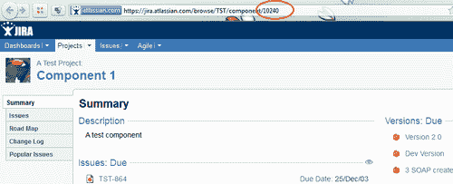
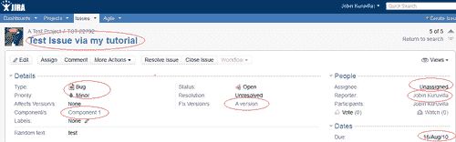
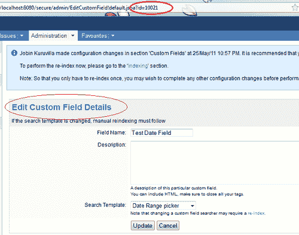
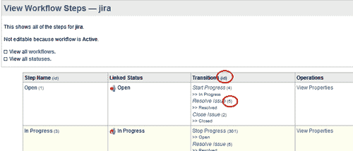
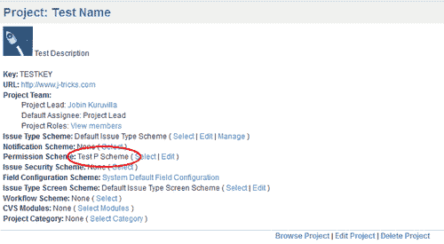
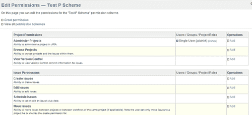
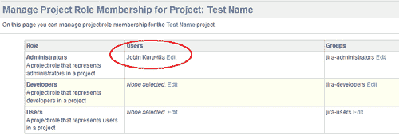
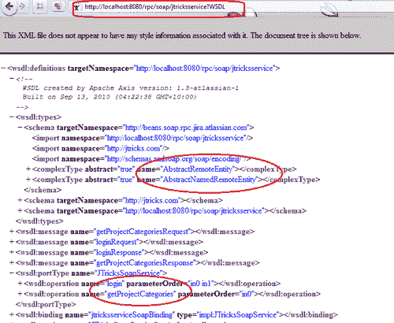
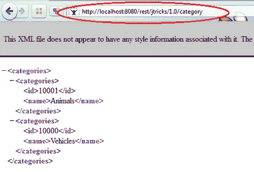
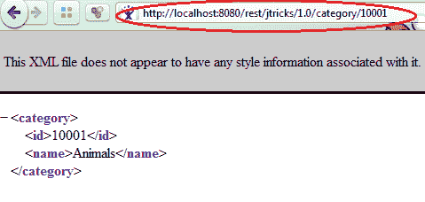

# 第九章 远程访问 JIRA

本章内容包括：

+   创建一个 SOAP 客户端

+   通过 SOAP 创建问题

+   使用自定义字段和 SOAP

+   附件和 SOAP

+   通过 SOAP 进行工作日志和时间跟踪

+   通过 SOAP 评论问题

+   通过 SOAP 进行用户和组管理

+   使用 SOAP 在工作流中推进问题

+   通过 SOAP 管理版本

+   SOAP API 中的管理方法

+   在 JIRA 中部署 SOAP 服务

+   在 JIRA 中部署 XML-RPC 服务

+   编写 Java XML-RPC 客户端

+   将服务和数据实体暴露为 REST API

+   为 REST API 编写 Java 客户端

# 介绍

我们在前面的章节中看到了多种方式来增强 JIRA 的功能，但如何从另一个应用程序与 JIRA 通信呢？有哪些不同的方法可以将第三方应用程序集成到 JIRA 中？或者换句话说，JIRA 是如何将其功能暴露给外部世界的？

JIRA 通过 **REST**、**SOAP** 或 **XML/RPC** 接口暴露其功能。通过这些接口暴露的 JIRA 完整功能有限，但 JIRA 也允许我们扩展这些接口。在本章中，我们将学习如何通过这些接口与 JIRA 通信，并通过开发插件将更多方法添加到这些接口中。本章的重点是 SOAP，同时也会提供其他接口的示例。这些接口的核心原理是相同的。

SOAP 中有很多方法，大多数方法可以从 API 中很好地理解，API 地址为 [`docs.atlassian.com/software/jira/docs/api/rpc-jira-plugin/latest/com/atlassian/jira/rpc/soap/JiraSoapService.html`](http://docs.atlassian.com/software/jira/docs/api/rpc-jira-plugin/latest/com/atlassian/jira/rpc/soap/JiraSoapService.html)。但有一些方法需要更好的理解，这些方法将在本章中重点讲解，其他的留给读者自行研究。

SOAP 通常是最受欢迎的远程访问方法，但 Atlassian 正在慢慢转向 REST 作为首选模式。有关这些接口的更详细解释可以在以下网址找到：[`confluence.atlassian.com/display/JIRADEV/JIRA+RPC+Services`](http://confluence.atlassian.com/display/JIRADEV/JIRA+RPC+Services)。

# 创建一个 SOAP 客户端

如前所述，SOAP 目前是 JIRA 首选的远程访问模式，尽管 Atlassian 正在慢慢转向 REST。与 REST 或 XML/RPC 相比，SOAP 提供了最多的方法，可能在我们周围的插件中使用最广泛。在本食谱中，我们将从基础开始，看看如何编写一个简单的 SOAP 客户端。

## 准备工作

安装 Maven2 并配置 Java 开发环境。确保在 JIRA 中启用了 RPC 插件，并且在 **Administration** | **Global** **Settings** | **General** **Configuration** 中启用了 **Accept** **remote** **API** **calls** 选项。

## 如何操作…

以下是创建 JIRA SOAP 客户端的步骤：

1.  从 Atlassian 公共仓库下载最新的示例 SOAP 客户端分发包，链接为：[`svn.atlassian.com/svn/public/atlassian/rpc-jira-plugin/tags/`](http://svn.atlassian.com/svn/public/atlassian/rpc-jira-plugin/tags/)。它包含一个配置使用 Apache Axis 的 Maven 2 项目，以及一个示例 Java SOAP 客户端，该客户端在 [`jira.atlassian.com`](http://jira.atlassian.com) 创建测试问题。

1.  修改 `pom.xml` 中的 `jira.soapclient.jiraurl` 属性，指向你想要连接的 JIRA 实例。默认情况下，它指向 [`jira.atlassian.com`](http://jira.atlassian.com)。

1.  下载你想要连接的实例的 WSDL 文件。你可以在 `/src/main/wsdl` 位置找到 WSDL 文件。如果没有该文件，或者你想重新下载 WSDL，可以运行以下命令：

    ```
    mvn -Pfetch-wsdl -Djira.soapclient.jiraurl=http://{your_jira_instance}/
    ```

1.  这将从配置的 JIRA 实例（如*步骤* *2*所示）下载 WSDL 到 `/src/main/wsdl/`。跳过 `jira.soapclient.jiraurl` 属性以下载 Atlassian JIRA 的 WSDL。

1.  创建客户端 JAR。我们可以通过运行以下命令从 WSDL 生成源代码并创建 SOAP 客户端：

    ```
    mvn -Pbuildclient
    ```

1.  这将生成一个 JAR 文件，包含所有必需的类。还会创建一个包含依赖项（例如 Axis）的第二个 JAR 文件。如果你在没有配置 Axis 和其他依赖项的环境中执行，这个 JAR 文件会非常有用。

1.  编写客户端程序。让我们按照本教程中的最简单方法进行，也就是在 Eclipse 中创建一个简单的独立 Java 类。首先，通过运行以下命令创建一个 Eclipse 项目：

    ```
    mvn eclipse:eclipse
    ```

    ### 注意

    你也可以尝试其他 IDE，或者直接从命令提示符运行，选择你方便的方式。确保将*步骤* *4*中创建的客户端 JAR 添加到类路径中。现在可以编写一个简单的程序，直接登录到我们的 JIRA 实例。从现在开始，这只是另一种 Web 服务调用，按照接下来的步骤进行。

1.  创建独立的 Java 类。

1.  获取 SOAP 服务定位器：

    ```
    JiraSoapServiceServiceLocator jiraSoapServiceLocator = new JiraSoapServiceServiceLocator();
    ```

1.  从定位器获取 SOAP 服务实例，方法是传递你的 JIRA 实例的 URL：

    ```
    JiraSoapService jiraSoapService = jiraSoapServiceLocator.getJirasoapserviceV2(new URL(your_url));
    ```

1.  开始使用 SOAP 服务实例访问方法。例如，登录操作可以如下进行：

    ```
    String token = jiraSoapService.login(your_username, your_password);
    ```

    这里获取的令牌将用于所有其他操作，而不需要每次登录。你可以将令牌视为所有其他操作的第一个参数。

1.  到此为止，我们的 SOAP 客户端已经准备好。让我们尝试使用问题的关键字获取一个问题，并打印它的关键字和 ID，证明这个功能是有效的！

    ```
    RemoteIssue issue = jiraSoapService.getIssue(authToken, ISSUE_KEY);
    System.out.println("Retrieved Issue:"+issue.getKey()+" with Id:"+issue.getId());
    ```

    你将看到输出中打印出问题的关键字和 ID。

希望这能给你一个大致的了解，帮助你开始使用第一个 SOAP 客户端！你可以用 SOAP 客户端做更多事情，我们将在接下来的教程中看到其中的一些。

# 通过 SOAP 创建问题

在前面的教程中，我们已经看到如何创建一个 SOAP 客户端。我们还看到了如何使用客户端连接到 JIRA 实例并执行操作，以“浏览问题”为例。在本教程中，我们将看到如何使用 SOAP API 创建一个问题。

## 准备工作

创建一个 JIRA SOAP 客户端，如前面的教程中所提到的。

## 如何操作……

以下是创建一个已填充标准字段的问题的步骤：

1.  如前面的教程所提到的，获取 JIRA SOAP 服务存根并登录到系统：

    ```
    JiraSoapServiceServiceLocator jiraSoapServiceLocator = new JiraSoapServiceServiceLocator();
    JiraSoapService jiraSoapService = jiraSoapServiceLocator.getJirasoapserviceV2(new URL(your_url));
    String authToken = jiraSoapService.login(userName, password);
    ```

1.  创建 `RemoteIssue` 的实例：

    ```
    RemoteIssue issue = new RemoteIssue();
    ```

1.  根据需要填充 `RemoteIssue` 上的标准字段：

    ```
    issue.setProject(PROJECT_KEY);
    issue.setType(ISSUE_TYPE_ID);
    issue.setSummary("Test Issue via my tutorial");
    issue.setPriority(PRIORITY_ID);
    issue.setDuedate(Calendar.getInstance());
    issue.setAssignee("");
    ```

    确保 `PROJECT_KEY`、`ISSUE_TYPE_ID`、`PRIORITY_ID` 等都是你 JIRA 实例中的有效值。`ISSUE_TYPE_ID` 和 `PRIORITY_ID` 是 ID，而不是问题类型和优先级的名称。

1.  在问题上设置组件。一个问题可以有多个组件，因此我们需要设置一个 `RemoteComponent` 对象的数组，如以下代码块所示：

    ```
    RemoteComponent component1 = new RemoteComponent();
    component1.setId(COMPONENT_ID1);
    RemoteComponent component2 = new RemoteComponent();
    component2.setId(COMPONENT_ID2);
    issue.setComponents(new RemoteComponent[] { component1, component2 });
    ```

    我们可以拥有任意数量的组件，只要 `id` 实例是我们在创建问题时所在项目中的有效组件 ID。这里，`id` 是你在浏览组件时找到的唯一 ID，如下图所示：

    

1.  设置 **Fix** **for** **Versions** 或 **Affected** **Versions**，类似于我们设置组件的方式：

    ```
    RemoteVersion version = new RemoteVersion();
    version.setId(VERSION_ID);
    RemoteVersion[] remoteVersions = new RemoteVersion[] { version };
    issue.setFixVersions(remoteVersions);
    ```

    再次提醒，`VERSION_ID` 是版本的唯一标识符，可以在浏览版本时找到，就像我们在处理组件时所做的那样。

1.  在 SOAP 客户端上调用创建问题操作，传递身份验证令牌和我们构建的 `RemoteIssue` 对象。

    ```
    RemoteIssue createdIssue = jiraSoapService.createIssue(authToken, issue);
    ```

1.  问题现在应该已经创建，并且其细节（如 ID）可以通过返回的 `RemoteIssue` 对象获取，可以按如下方式打印：

    ```
    System.out.println("\tSuccessfully created issue " + createdIssue.getKey() + " with ID:" + createdIssue.getId());
    ```

## 它是如何工作的……

这只是一个经典示例，演示了如何使用 Axis2 从 Java 应用程序调用 Web 服务。一旦按照前面的说明编写了 Java 客户端，我们就可以运行它，问题将在我们在客户端中引用的实例中创建。

以下是一个在 TEST 项目中创建的问题的截图，链接为 [`jira.atlassian.com`](http://jira.atlassian.com)。



如你所见，问题已经填充了我们在 `RemoteIssue` 对象上设置的所有字段。

# 使用自定义字段和 SOAP

我们已经了解了如何创建一个带有标准字段的问题。在本教程中，我们将处理自定义字段——**创建**、**更新**和**读取**它们的值。

## 准备工作

如前面的教程所示，创建一个 JIRA SOAP 客户端。

## 如何操作……

如前所述，在本教程中，我们将分别讨论自定义字段值的创建、更新和浏览。

### 使用自定义字段值创建问题

创建带有自定义字段的问题与创建带有组件或版本的问题非常相似。所有自定义字段都通过一个方法`setCustomFieldValues`设置，该方法接受一个`RemoteCustomFieldValue`对象的数组。

以下步骤解释了操作过程：

1.  确定需要在问题上设置的自定义字段并找到它们的 ID。自定义字段的 ID 形式为`customfield_[id]`，其中`[id]`是自定义字段的数据库 ID。可以从数据库中确定该 ID，或者通过在管理界面中编辑自定义字段，复制其 ID（从 URL 中提取）来获取 ID，如下图所示：

1.  为每个识别出的自定义字段创建一个`RemoteCustomFieldValue`。`RemoteCustomFieldValue`可以按如下方式创建：

    ```
    RemoteCustomFieldValue customFieldValue = new RemoteCustomFieldValue(CUSTOM_FIELD_KEY, "", new String[] { CUSTOM_FIELD_VALUE1, CUSTOM_FIELD_VALUE2 });
    ```

    我们传递的值——`CUSTOM_FIELD_VALUE1`、`CUSTOM_FIELD_VALUE2`，依此类推——应该是该字段的有效值，否则会导致服务器上的验证错误。对于单值自定义字段，数组中将仅包含一个值。第二个属性接受一个`parentKey`值，仅用于多维字段，如级联选择列表。对于单值和多值字段（如选择列表、多选等），`parentKey`将是一个空字符串。

    例如，`RemoteCustomFieldValue`用于构建级联选择如下：

    ```
    RemoteCustomFieldValue customFieldValue = new RemoteCustomFieldValue(CUSTOM_FIELD_KEY_2, "PARENT_KEY", new String[] { CUSTOM_FIELD_VALUE_2 });
    ```

    父键将用于构建自定义字段的完整键。例如，一个级联选择将具有完整的自定义字段键，如`customfield_10061:1`，其中`customfield_10061`是父字段的键，`:1`表示第一个子字段。事实上，以下两个表示的是同一件事：

    ```
    RemoteCustomFieldValue customFieldValue = new RemoteCustomFieldValue("customfield_10061", "1", new String[] { "Some Val" });

    RemoteCustomFieldValue customFieldValue = new RemoteCustomFieldValue("customfield_10061:1", null, new String[] { "Some Val" });
    ```

1.  设置所有自定义字段值的数组到问题中。

    ```
    RemoteCustomFieldValue[] customFieldValues = new RemoteCustomFieldValue[] { customFieldValue1, customFieldValue2 };
    issue.setCustomFieldValues(customFieldValues);
    ```

1.  像往常一样创建问题：

    ```
    RemoteIssue createdIssue = jiraSoapService.createIssue(authToken, issue);
    ```

### 更新问题上的自定义字段

更新自定义字段非常相似。然而，在`updateIssue`方法中，它接受一个`RemoteFieldValue`的数组，这些字段可以是标准字段或自定义字段。在自定义字段的情况下，我们应设置自定义字段的 ID（如果是多维字段，则为完整 ID，因为`RemoteFieldValue`不接受父键！）以及字符串值的数组，如下所示：

```
RemoteFieldValue[] actionParams = new RemoteFieldValue[] { new RemoteFieldValue(CUSTOM_FIELD_KEY, new String[] { CUSTOM_FIELD_VALUE }) };
```

现在可以按如下方式更新问题：

```
RemoteIssue updatedIssue = jiraSoapService.updateIssue(authToken, ISSUE_KEY, actionParams);
```

这里，`ISSUE_KEY`是要更新的问题的键。

请注意，`updateIssue()`方法也用于更新标准字段，但唯一的区别是，`RemoteFieldValue`中使用的`key`将是标准字段的键。标准字段的键可以从`IssueFieldConstants`类中找到。

### 浏览问题上的自定义字段

可以通过在`RemoteIssue`上使用`getCustomFieldValues`方法来检索问题上的自定义字段。然后可以按如下方式打印：

```
RemoteCustomFieldValue[] cfValues = issue.getCustomFieldValues();
for (RemoteCustomFieldValue remoteCustomFieldValue : cfValues) {
  String[] values = remoteCustomFieldValue.getValues();
  for (String value : values) {
    System.out.println("Value for CF with Id:" + remoteCustomFieldValue.getCustomfieldId() + " -" + value);
  }
}
```

这里，`remoteCustomFieldValue.getValues()`返回自定义字段值的字符串表示数组。

# 附件和 SOAP

在本例中，我们将看到如何通过 SOAP 向问题添加附件并浏览现有的附件。

## 准备工作

如同之前的示例，创建一个 JIRA SOAP 客户端。同时，确保在 JIRA 实例中启用了附件功能。

## 如何操作...

自 JIRA4 以来，附件是通过`addBase64EncodedAttachmentsToIssue`方法添加到问题中的，而 JIRA4 之前使用的是`addAttachmentsToIssue`方法。后者仍然可用，但已被弃用。此外，后者存在一个已知问题，在处理大型附件时会失败。

以下是使用`addBase64EncodedAttachmentsToIssue`方法向问题添加附件的步骤：

1.  使用要上传的文件路径创建一个 File 对象。文件应通过有效的 URL 访问。

    ```
    File file = new File("var/tmp/file.txt");
    ```

    路径应该在上下文中是有效的。

1.  将文件内容读取到字节数组中：

    ```
    // create FileInputStream object
    FileInputStream fin = new FileInputStream(file);

    /*
    * Create byte array large enough to hold the content of the file.
    * Use File.length to determine size of the file in bytes.
    */
    fileContent = new byte[(int) file.length()];

    /*
    * To read content of the file in byte array, use int read(byte[]
    * byteArray) method of java FileInputStream class.
    */
    fin.read(fileContent);
    fin.close();
    ```

1.  使用`BASE64Encoder`从字节数组创建一个编码字符串。

    ```
    String base64encodedFileData = new BASE64Encoder().encode(fileContent);
    ```

1.  对于所有需要上传的附件，执行*步骤* *1*到*步骤* *3*，并创建一个包含所有编码数据的字符串数组。在我们的例子中，我们只有一个：

    ```
    String[] encodedData = new String[] { base64encodedFileData };
    ```

1.  在`addBase64EncodedAttachmentsToIssue`方法中使用`encodedData`。

    ```
    boolean attachmentAdded = jiraSoapService.addBase64EncodedAttachmentsToIssue(authToken, ISSUE_KEY, new String[] { "test.txt" }, encodedData);
    ```

    其中 ISSUE_KEY 是附件所在问题的关键字，字符串数组（第三个参数）包含将用于存储附件名称的字符串。

`addAttachmentsToIssue`方法也可以使用，类似于前面提到的方法，除了我们不对数据进行编码。与将文件作为编码数据的字符串数组发送不同，这个方法需要将文件作为字节数组的数组发送。以下是步骤：

1.  像之前一样将文件读取到字节数组中：

    ```
    File file = new File(filePath);
    FileInputStream fin = new FileInputStream(file);
    fileContent = new byte[(int) file.length()];
    fin.read(fileContent);
    fin.close();
    ```

1.  创建这些字节数组的数组，并将读取的文件添加到其中：

    ```
    byte[][] files = new byte[1][];
    files[0] = fileContent;
    ```

1.  你可以读取任意数量的文件，每个文件将作为字节数组读取，并添加到文件数组中。

1.  调用`addAttachmentsToIssue`方法：

    ```
    boolean attachmentAdded = jiraSoapService.addAttachmentsToIssue(authToken, ISSUE_KEY, new String[] {"test.txt" }, files);
    ```

浏览问题上的附件可以通过`getAttachmentsFromIssue`方法完成。它返回一个`RemoteAttachment`对象数组，从中可以提取附件的详细信息，如`name`、`id`等。然后，我们可以使用获取的信息构建附件的 URL。以下是步骤：

1.  获取`RemoteAttachment`对象的数组：

    ```
    RemoteAttachment[] attachments = jiraSoapService.getAttachmentsFromIssue(authToken, ISSUE_KEY);
    ```

    这里，`ISSUE_KEY`是我们正在浏览的课题的关键字。

1.  可以从`RemoteAttachment`对象中读取附件的信息。

    ```
    System.out.println("Attachment Name:" + remoteAttachment.getFilename() + ", Id:"+ remoteAttachment.getId());
    ```

    可以按照以下方式构建 JIRA 实例中附件的 URL：

    ```
    System.out.println("URL: "+ BASE_URL+ "/secure/attachment/" + remoteAttachment.getId() + "/"+ remoteAttachment.getFilename());
    ```

    这里，`BASE_URL`是 JIRA 的基础 URL，包括上下文路径。

# 通过 SOAP 进行工作日志和时间追踪

JIRA 中的时间追踪是一个很棒的功能，它允许用户追踪他们在特定问题上花费的时间。它让用户可以在花费时间时记录工作，JIRA 会追踪原定估计时间、实际花费时间和剩余时间。如果需要，用户还可以调整剩余的时间！

虽然 JIRA 提供了一个很好的用户界面让用户记录他们正在进行的工作，但有时，比如与第三方产品集成时，使用 SOAP 记录工作是必要的。在这个教程中，我们将展示如何使用 SOAP API 记录工作。

## 准备工作中…

如前面教程所示，创建一个 JIRA SOAP 客户端。同时，确保在 JIRA 实例中启用了时间追踪功能。

## 如何操作…

根据我们需要如何处理问题上的剩余估算，有不同的方法可供选择来记录工作。在所有情况下，我们都需要创建一个`RemoteWorklog`对象来保存我们记录的工作详情。以下是步骤：

1.  创建一个包含所需详情的`RemoteWorklog`对象：

    ```
    RemoteWorklog worklog = new RemoteWorklog();
    worklog.setTimeSpent("1d 3h");
    worklog.setComment("Some comment!");
    worklog.setGroupLevel("jira-users");
    worklog.setStartDate(new GregorianCalendar(2011, Calendar.MAY, 10));
    ```

    注意，`setStartDate()`方法接收的是`Calendar`对象，而不是 Javadocs 中提到的`Date`对象。

1.  使用适当的方法来添加之前的工作日志。例如，如果你想自动调整问题上的剩余估算，可以使用`addWorklogAndAutoAdjustRemainingEstimate`方法：

    ```
    RemoteWorklog work = jiraSoapService.addWorklogAndAutoAdjustRemainingEstimate(authToken, ISSUE_KEY, worklog);System.out.println("Added work:" + work.getId());
    ```

1.  如果你想保留剩余估算，可以使用`addWorklogAndRetainRemainingEstimate`：

    ```
    RemoteWorklog work = jiraSoapService.addWorklogAndRetainRemainingEstimate(authToken, ISSUE_KEY, worklog);
    ```

1.  如果你想添加一个新的剩余估算，可以使用`addWorklogWithNewRemainingEstimate`。

    ```
    RemoteWorklog work = jiraSoapService.addWorklogWithNewRemainingEstimate(authToken, ISSUE_KEY, worklog, "1d");
    ```

1.  这将会把工作日志添加为`1d` `3h`，并将剩余估算重置为`1d`（1 天），无论原来的估算是多少。

## 如何操作…

在第一步中，我们使用了设置方法来填充字段。正如你可能已经猜到的，最重要的字段是`timeSpent`，它指定了一个 JIRA 时长格式的时间段，表示在工作日志上花费的时间。在我们的例子中，我们使用了`1d 3h`，即表示 1 天 3 小时。

如同之前的代码一样，我们还可以为记录的工作指定`startDate`、`groupLevel`或`roleId`，这些用于限制记录工作可见性并添加评论。注意，不应在对象上设置 ID，因为当工作日志添加到问题上时，ID 将自动生成。此外，可见性只能为一个组或角色设置，而不能同时为两者设置。

## 还有更多…

更新和删除工作日志的操作方式相同，可以使用以下方法：

+   `updateWorklogAndAutoAdjustRemainingEstimate`

+   `updateWorklogAndRetainRemainingEstimate`

+   `updateWorklogWithNewRemainingEstimate`

+   `deleteWorklogAndAutoAdjustRemainingEstimate`

+   `deleteWorklogAndRetainRemainingEstimate`

+   `updateWorklogWithNewRemainingEstimate`

以下是更新和删除调用的示例：

```
jiraSoapService.updateWorklogWithNewRemainingEstimate(authToken, work, "1d");
jiraSoapService.deleteWorklogAndRetainRemainingEstimate(authToken, work.getId());
```

可以使用`getWorklogs`方法浏览问题上所有现有的工作日志，该方法返回一个`RemoteWorklog`对象的数组。

# 通过 SOAP 在问题上评论

在这个教程中，我们将看到如何管理问题上的评论。

## 准备工作

按照第一个教程中提到的方法，创建一个 JIRA SOAP 客户端。

## 如何操作…

使用 SOAP 在问题上添加评论的方法如下：

1.  创建一个`RemoteCommentobject`并使用 setter 方法设置必要的字段。

    ```
    final RemoteComment comment = new RemoteComment();
    comment.setBody(COMMENT_BODY);
    //comment.setRoleLevel(ROLE_LEVEL); // Id of your project role
    comment.setGroupLevel(null); // Make it visible to all
    ```

    请注意，ID 不应在对象上设置，因为它将在评论创建时自动生成。同时，可见性只能针对组或角色设置，不能同时针对两者设置。

1.  将评论添加到问题中：

    ```
    jiraSoapService.addComment(authToken, ISSUE_KEY, comment);
    ```

    可以通过`getComments`方法获取问题的评论，该方法返回一个`RemoteComment`对象的数组。

    ```
    RemoteComment[] comments = jiraSoapService.getComments(authToken, ISSUE_KEY);
    for (RemoteCommentremoteComment : comments) {
      System.out.println("Comment:" + remoteComment.getBody() + " written by " + remoteComment.getAuthor());
    }
    ```

评论可以使用`editComment`操作进行编辑，但我们应先通过使用`hasPermissionToEditComment`方法检查是否具有编辑权限，如下所示：

```
// Check permissions first
if (jiraSoapService.hasPermissionToEditComment(authToken, comment)) {
  comment.setBody(COMMENT_BODY + " Updated");
  comment.setGroupLevel("jira-users"); 
  jiraSoapService.editComment(authToken, comment);
}
```

删除评论尚未通过 SOAP 暴露！

# 通过 SOAP 进行用户和组管理

现在让我们看看如何使用 SOAP 进行用户和组管理。当需要从第三方应用程序管理用户和组时，这非常有用。

## 准备工作

创建一个如前所述的 SOAP 客户端。

## 如何操作...

创建组和用户非常简单。以下是客户端创建后的操作方式：

```
//Create group jtricks-test-group
RemoteGroup group = jiraSoapService.createGroup(authToken, "jtricks-test-group", null);
//Create user jtricks-test-user
RemoteUser user = jiraSoapService.createUser(authToken, "jtricks-test-user", "password", "Test User", "support@j-tricks.com");
```

这里，第一个代码片段创建了一个名为`jtricks-test-group`的组。第三个参数是一个`RemoteUser`，当组创建时，可以将其作为第一个用户添加到该组。如果组需要为空创建，则可以将其设置为 null。

第二个代码片段创建了一个用户，并提供了相关的详细信息，例如`Name`（名称）、`Password`（密码）、`Full Name`（全名）和`Email`（电子邮件）。

可以通过以下方式将用户添加到组中：

```
jiraSoapService.addUserToGroup(authToken, group, user);
```

这里，组和用户分别是`RemoteGroup`和`RemoteUser`对象。

可以通过以下方式获取现有的用户或组：

```
RemoteUser user = jiraSoapService.getUser(authToken, "jtricks-test-user");
RemoteGroup group = jiraSoapService.getGroup(authToken, "jtricks-test-group");
```

可以从`RemoteGroup`对象中获取组中的用户，如下所示：

```
RemoteUser[] users = group.getUsers();
for (RemoteUser remoteUser : users) {
  System.out.println("Full Name:"+remoteUser.getFullname());
}
```

删除用户或组也很简单，如下所示：

```
//Delete User.
jiraSoapService.deleteUser(authToken, user1.getName());
//Delete Group. 
jiraSoapService.deleteGroup(authToken, group1.getName(), group.getName());
```

这里，`swapGroup`标识了要更改评论和工作日志可见性的组。

# 使用 SOAP 推进问题的工作流

这是每个人在将 JIRA 与第三方应用程序集成时都希望实现的目标。为了满足不同的使用场景，问题的状态需要进行更改，正确的做法是通过工作流推进问题。

推进操作将把问题移动到适当的状态，并触发相应的后置函数和事件。在本教程中，我们将学习如何执行相同的操作。

## 准备工作

如果尚未创建 SOAP 客户端，请照常创建一个。

## 如何操作...

JIRA 暴露了`progressWorkflowAction`方法，用于通过工作流推进问题。以下是操作步骤：

1.  确定我们应该从当前状态执行的动作 ID。对于每个问题状态，都有一个与之相关的步骤，并且可以有零个或多个过渡到工作流中的其他步骤。

    动作 ID 可以从工作流屏幕中识别，在方括号内与过渡名称一起显示，如下图所示：

    

    上一张截图显示了 JIRA 的默认工作流，**解决** **问题**操作的 ID 是**5**，它是从**打开**状态发起的。请注意，如果不同状态中的操作没有共享相同的操作，那么相同的操作可能有不同的 ID。因此，在进行*步骤* *2*之前，识别操作 ID 是很重要的。

    当你实现一个完整应用程序时，可能需要在客户端存储这些操作 ID，因为 JIRA 没有暴露基于当前*状态*检索操作 ID 的方法。

    ID 还可以通过查找 XML 中的`action`元素来获取：

    ```
    <action id="5" name="Resolve Issue" view="resolveissue">
    ```

    可以通过点击 XML 链接从**管理** | **工作流**屏幕将工作流导出为 XML。

1.  确定在过渡过程中需要修改的字段，并为每个字段创建一个`RemoteFieldValue`对象。你只能修改那些在工作流过渡中可用的字段。

    在我们的示例中，我们使用 JIRA 默认工作流中的**解决** **问题**操作，它与**解决** **屏幕**相关联。我们在屏幕上有**Assignee**和**Resolution**字段，因此我们可以为它们创建`RemoteFieldValue`对象，如下所示：

    ```
    RemoteFieldValue field1 = new RemoteFieldValue("resolution", new String[] { "3" });
    RemoteFieldValue field2 = new RemoteFieldValue("assignee", new String[] { "jobinkk" });
    ```

    `RemoteFieldValue`接受一个 ID 和一个字符串数组，表示我们需要设置的值。在我们的示例中，字段是单值字段，因此数组中只有一个元素。多维字段，如级联字段，应该使用我们在本章早些时候更新自定义字段时所看到的完全限定 ID。标准字段 ID 的完整列表可以在`IssueFieldConstants`类中找到。任何不在过渡屏幕中的字段都会被忽略。

1.  使用这些属性执行`progressWorkflowAction`。

    ```
    RemoteIssue updatedtissue = jiraSoapService.progressWorkflowAction(authToken, ISSUE_KEY, "5", new RemoteFieldValue[] { field1, field2 });
    ```

    在结束此配方之前，可以通过`RemoteIssue`对象使用`getStatus`方法找到问题的当前状态。

    ```
    System.out.println("Progressed "+updatedtissue.getKey()+ " to " + updatedtissue.getStatus() + " status!");
    ```

# 通过 SOAP 管理版本

我们已经看过如何将版本添加为问题的修复版本或受影响版本。但是，如何使用 SOAP 创建这些版本呢？在这个配方中，我们将学习如何在项目中创建版本并管理它们！

## 准备工作

和往常一样，创建 SOAP 客户端。

## 如何操作...

可以通过以下方式将新版本添加到项目中：

1.  使用必要的详细信息创建一个`RemoteVersion`对象：

    ```
    RemoteVersion remoteVersion = new RemoteVersion();
    remoteVersion.setName("Test Release");
    remoteVersion.setReleaseDate(new GregorianCalendar(2011, Calendar.MAY, 10));
    remoteVersion.setSequence(5L);
    ```

    这里，`sequence`定义了版本在版本列表中出现的顺序。

1.  使用`addVersion`方法创建版本：

    ```
    RemoteVersion createdVersion = jiraSoapService.addVersion(authToken, "TST", remoteVersion);
    System.out.println("Created version with id:"+createdVersion.getId());
    ```

    其中`TST`是新版本创建所在项目的键。

一旦版本被创建，你可以使用`releaseVersion`方法发布版本。它需要一个`RemoteVersion`作为输入，并且需要设置发布标志。

```
createdVersion.setReleased(true);
jiraSoapService.releaseVersion(authToken, "TST", createdVersion);
```

同样的方法可以用于`unrelease`一个版本。你需要做的就是将`released`标志设置为`false`！

如果`released`标志被设置为`true`且版本已经发布，则会抛出错误。尝试`unrelease`尚未发布的版本时也是相同的情况。

归档版本的过程与发布版本类似。在这里，传递的是归档标志作为参数，而不是设置发布标志。同时，使用的是版本名称而不是`RemoteVersion`对象。

```
// Archives version with name "Test release" in project with key JRA
jiraSoapService.archiveVersion(authToken, "JRA", "Test Release", true);
```

可以使用`getVersions`方法检索项目中的所有版本，该方法返回一个`RemoteVersion`对象的数组。

```
RemoteVersion[] versions = jiraSoapService.getVersions(authToken, "JRA");
```

# SOAP API 中的管理方法

在我们结束对 SOAP API 中各种有用方法的讨论之前，可以看看管理方法。在这个示例中，我们将集中讨论一些与创建项目和权限相关的方法。其余方法在我们理解了本示例中的方法后，也能轻松阅读。

## 准备工作

按照我们在前面示例中讨论的方式创建 SOAP 客户端。

## 如何操作...

我们可以看看创建权限方案的过程，使用它创建项目并将一些用户添加到项目角色中。项目创建过程中使用的其他方案，如通知方案和问题安全方案，通过 SOAP 不支持。

以下是我们旅程的步骤：

1.  创建新的权限方案：

    ```
    RemotePermissionScheme permScheme = jiraSoapService.createPermissionScheme(authToken, "Test P Scheme", "Test P Description");
    ```

    在这里，我们使用`createPermissionScheme`方法，通过传递认证令牌、名称和描述来创建一个新的权限方案。请注意，我们也可以通过使用`getPermissionSchemes`方法获取现有的权限方案列表。

1.  使用`addPermissionTo`方法向新创建的权限方案添加相关权限。如果我们正在创建新的权限方案，则此步骤是必要的：

    ```
    RemotePermissionScheme modifiedPermScheme = jiraSoapService.addPermissionTo(authToken, permScheme, adminPermission, user);
    ```

    在这里，`adminPermission`应该是一个`RemotePermission`对象，位于通过`getAllPermissions`方法检索到的`RemotePermission`对象列表中。例如，**管理** **项目**权限可以通过以下方式获取：

    ```
    RemotePermission[] permissions = jiraSoapService.getAllPermissions(authToken);
    RemotePermission adminPermission = null;
    for (RemotePermission remotePermission : permissions) {
      if (remotePermission.getPermission().equals(23L)) {
        adminPermission = remotePermission;
        break;
      }
    }
    ```

    在这里，`23L`是**管理** **项目**权限的 ID。其他权限的 ID 可以在`com.atlassian.jira.security.Permissions`类中找到。

    `addPermissionTo`方法的最后一个参数是一个`RemoteEntity`，它可以是`RemoteUser`或`RemoteGroup`对象。我们在前面的示例中已经看过如何通过 SOAP 访问用户和组。在我们的示例中，我们通过如下方式根据名称获取一个用户：

    ```
    RemoteUser user = jiraSoapService.getUser(authToken, "jobinkk");
    ```

1.  使用`createProject`方法创建项目：

    ```
    RemoteProject project = jiraSoapService.createProject(authToken, "TEST", "Test Name", "Test Description", "http://www.j-tricks.com", "jobinkk", permScheme, null, null);
    ```

    以下是参数：

    **token - 认证令牌**

    **key - 项目密钥**

    **name - 项目名称**

    **description - 项目描述**

    **url - 项目的 URL**

    **lead - 项目负责人**

    **permissionScheme - 项目的权限方案，类型为 RemotePermissionScheme**

    **notificationScheme - 项目的通知方案，类型为 RemoteScheme**

    **issueSecurityScheme - 项目的问题安全方案，类型为 RemoteScheme**

    对于这些方案，我们使用新创建的权限方案，并将其他两个方案设置为 null。我们可以通过创建一个`RemoteScheme`对象并填入相关方案的正确 ID 来指定特定的通知方案或问题安全方案。

1.  向新创建的项目添加一个演员：

    ```
    jiraSoapService.addActorsToProjectRole(authToken, new String[] { "jobinkk" }, adminRole, project,	"atlassian-user-role-actor");
    ```

    这里，`addActorsToProjectRole`方法接受一个演员数组（在此案例中仅为`jobinkk`），演员要加入的角色，已经创建的项目，以及演员的类型。

    可以通过如下所示的角色 ID 来获取项目角色：

    ```
    RemoteProjectRoleadminRole = jiraSoapService.getProjectRole(authToken, 10020L);
    ```

    演员类型可以是`atlassian-user-role-actor`或`atlassian-group-role-actor`，具体取决于我们在数组中添加的演员是用户还是组。

我们现在应该已经创建了带有新权限方案的项目，并且我们已将成员添加到相关角色中。

## 工作原理...

一旦方法执行完成，我们可以看到如下创建的项目：



新的权限方案会按照下面的截图创建：



这里只添加了一个权限，即管理项目的权限。我们可以以类似的方式添加其他权限。

同样，项目成员会按照下面的截图添加：



如你所见，除了我们添加的演员，默认演员也将成为成员的一部分！

SOAP API 中还有很多其他有用的方法，可以在以下网址找到：[`docs.atlassian.com/software/jira/docs/api/rpc-jira-plugin/latest/com/atlassian/jira/rpc/soap/JiraSoapService.html`](http://docs.atlassian.com/software/jira/docs/api/rpc-jira-plugin/latest/com/atlassian/jira/rpc/soap/JiraSoapService.html)。

确保查看与你的 JIRA 版本对应的 Java 文档！

# 在 JIRA 中部署 SOAP 服务

到目前为止，我们已经看到了多种通过 SOAP 在 JIRA 中执行不同操作的方法。但如果是 SOAP 不支持的操作怎么办？那种会妨碍你将 JIRA 与第三方应用程序集成的小问题呢？这时，**RPC** **端点** **插件** **模块**就派上用场了。

RPC 端点插件模块使我们能够在 JIRA 中部署新的 SOAP 和 XML-RPC 端点。新增的端点不会成为现有 WSDL 的一部分，而是会在一个新的 URL 上提供，因此，如果你想访问新方法和其他现有方法，你将需要访问这两个 Web 服务。

在这个教程中，我们将展示如何部署一个新的 SOAP 端点来执行一个新的操作。

## 准备工作

使用 Atlassian Plugin SDK 创建一个骨架插件。写这篇文章时，PRC 插件仍然是 v1，所以如果[`jira.atlassian.com/browse/JRA-22596`](https://jira.atlassian.com/browse/JRA-22596)尚未解决，请确保创建 v1 插件！

此外，确保在**管理** | **常规配置**下启用了**接受** **远程** **API** **调用**选项。

## 如何做...

让我们创建一个 SOAP RPC 插件，暴露一个新方法`getProjectCategories`，该方法用于获取 JIRA 实例中的所有项目类别。这是一个简单的方法，但希望能帮助我们涵盖创建新的 SOAP RPC 端点的所有基本知识。

1.  在`pom.xml`中添加 RPC 插件依赖，以便获取现有的 RPC 类。根据需要修改版本。

    ```
    <dependency>
      <groupId>atlassian-jira-rpc-plugin</groupId>
      <artifactId>atlassian-jira-rpc-plugin</artifactId>
      <version>3.13-1</version>
      <scope>provided</scope>
    </dependency>
    ```

    这个 JAR 是 JIRA 安装的一部分。所以，如果你的 Maven 构建在查找 JAR 时失败，只需导航到`WEB-INF/lib`文件夹，并将 JAR 安装到本地 Maven 库中，如下所示：

    ```
    mvn install:install-file -DgroupId=atlassian-jira-rpc-plugin -DartifactId=atlassian-jira-rpc-plugin -Dversion=3.13-1 -Dpackaging=jar -Dfile=atlassian-jira-rpc-plugin-3.13-1.jar
    ```

1.  在`atlassian-plugin.xml`中声明新的 RPC 服务。

    ```
    <rpc-soap key="jtricks-soap-service" name="JTricks SOAP Service" class="com.jtricks.JTricksSoapServiceImpl">
      <description>JTricks SOAP service.</description>
      <service-path>jtricksservice</service-path>
      <published-interface>com.jtricks.JTricksSoapService</published-interface>
    </rpc-soap>
    ```

    在这里，SOAP RPC 插件模块有一个独特的`key`，并为你的 SOAP 模块声明了一个新的`interface`，以及相应的实现`class`。在这种情况下，我们有`JTricksSoapService`和`JTricksSoapServiceImpl`。服务路径`jtricksservice`定义了在 URL 命名空间中服务将被发布的位置，并会出现在 WSDL 的 URL 中。

1.  为这个新类创建一个**Component** **Plugins**模块，以避免客户端出现空指针异常：

    ```
    <component key="jtricks-soap-component" name="JTricks SOAP Component" class="com.jtricks.JTricksSoapServiceImpl">
      <interface>com.jtricks.JTricksSoapService</interface>
    </component>
    ```

1.  如下所示，在接口中声明新方法：

    ```
    public interface JTricksSoapService {
      String login(String username, String password);   
      // Method to return Project Categories
      RemoteCategory[] getProjectCategories(String token) throws RemoteException;
    }
    ```

    如你所见，我们已经添加了一个名为`getProjectCategories`的方法，该方法返回一个`RemoteCategory`对象的数组。我们还添加了一个登录方法，以便通过访问新的 WSDL 进行测试。

1.  创建`RemoteCategory` bean。确保新的 bean 扩展了`AbstractNamedRemoteEntity`类。该 bean 应包含所有必需的属性，并为其定义 getter 和 setter。`AbstractNamedRemoteEntity`类已经暴露了`name`字段，因此`RemoteCategory`也会拥有它。我们将添加一个新的字段`description`。

    ```
    public class RemoteCategory extends AbstractNamedRemoteEntity {
      private String description;
      public RemoteCategory(GenericValue value) {
        super(value);
        this.description = value.getString("description");
      }

      public void setDescription(String description) {
        this.description = description;
      }

      public String getDescription() {
        return description;
      }
    }
    ```

    如你所见，构造函数接受一个`GenericValue`并从中设置描述。在超类`AbstractNamedRemoteEntity`中，`name`也以类似的方式设置。

1.  在实现类中实现`getProjectCategories`方法：

    ```
    public RemoteCategory[] getProjectCategories(String token) throws RemoteException {
      validateToken(token);

      Collection<GenericValue> categories = projectManager.getProjectCategories();
      RemoteCategory[] remoteCategories = new RemoteCategory[categories.size()];

      int i = 0;
      for (GenericValue category : categories) {
        remoteCategories[i++] = new RemoteCategory(category);
      }
      return remoteCategories;
    }
    ```

    在这里，我们所做的只是获取项目类别的集合，并返回一个通过类别`GenericValue`对象初始化的`RemoteCategory`对象数组。请注意，从 JIRA 4.4 开始，`getProjectCategories()`方法已经弃用，建议使用返回`ProjectCategory`对象集合的`getAllProjectCategories()`方法，而非`GenericValue`。

    如果你注意到的话，我们在返回类别之前首先验证了*token*。验证过程如下：

    ```
    private void validateToken(String token) {
      try {
        User user = tokenManager.retrieveUser(token);
      } catch (RemoteAuthenticationException e) {
        throw new RuntimeException("Error Authenticating!,"+e.toString());
      } catch (RemotePermissionException e) {
      throw new RuntimeException("User does not have permission for this operation,"+e.toString());
    }
    }
    ```

    我们通过令牌获取用户，如果令牌无效，则抛出相应的错误。可以在构造函数中注入`ProjectManager`和`TokenManager`类，如下所示：

    ```
    public JTricksSoapServiceImpl(ProjectManagerprojectManager, TokenManagertokenManager) {
      this.projectManager = projectManager;
      this.tokenManager = tokenManager;
    }
    ```

    请注意，从 JIRA 4.4 开始，应该使用`retrieveUserNoPermissioncheck`方法而非`retrieveUser`，因为某些 JIRA 实例可能希望允许匿名访问。各个方法将执行权限检查。

1.  实现`login`方法以返回令牌。

    ```
    public String login(String username, String password) {
      try {
        return tokenManager.login(username, password);
      } catch (RemoteAuthenticationException e) {
        throw new RuntimeException("Error Authenticating!,"+e.toString());
      } catch (com.atlassian.jira.rpc.exception.RemoteException e) {
        throw new RuntimeException("Couldn't login,"+e.toString());
      }
    }
    ```

    它仅使用`TokenManager`返回由用户名和密码创建的*token*。

    编译插件并进行部署。由于是 v1，请确保插件被放置到`WEB-INF/lib`文件夹中。

## 它是如何工作的...

一旦插件部署完成，新的 WSDL 应可以通过以下链接访问：`{your_jira_url}/rpc/soap/jtricksservice?WSDL`。



如你所见，我们通过接口暴露的新方法现在可以在 WSDL 文件中看到，位于前面截图中圈出的地方。

# 在 JIRA 中部署 XML-RPC 服务

在前一个示例中，我们已经看到如何在 JIRA 中部署 SOAP 服务。在本示例中，我们将看到如何部署 XML-RPC 服务。

## 准备工作

使用 Atlassian 插件 SDK 创建一个骨架插件。在这里，我们再次开发的是 v1 插件。因此，确保`atlassian-plugin.xml`中没有`Version 2`属性。

是的，确保**接受** **远程** **API** **调用**选项已**开启**，如前一个示例所示。

## 如何操作...

与 SOAP 插件一样，我们将暴露一个新方法`getProjectCategories`，该方法用于检索项目中的所有项目类别。以下是步骤：

1.  在`pom.xml`中添加 RPC 插件依赖项，以便获取现有的 RPC 类。相应地更改版本：

    ```
    <dependency>
      <groupId>atlassian-jira-rpc-plugin</groupId>
      <artifactId>atlassian-jira-rpc-plugin</artifactId>
      <version>3.13-1</version>
      <scope>provided</scope>
    </dependency>
    ```

1.  在`atlassian-plugin.xml`中声明新的 RPC 服务：

    ```
    <rpc-xmlrpc key="xmlrpc" name="JTricks XML-RPC Services" class="com.jtricks.XmlRpcServiceImpl">
      <description>The JTricks sample XML-RPC services.</description><service-path>jtricks</service-path>
    </rpc-xmlrpc>
    ```

    在这里，我们定义了一个`XmlRpcServiceImpl`类和一个`service-path`。该服务路径`jtricks`用于访问新的方法，而不是用于访问现有方法的默认`jira1`路径。

1.  为该类创建一个接口，将`XmlRpcServiceImpl`命名为`XmlRpcService`并在其中定义新方法。

    ```
    public interface XmlRpcService {	
      String login(String username, String password) throws Exception;    
      Vector getprojectCategories(String token);
    }
    ```

    和之前一样，我们有一个`login`方法。如果你注意到，`getprojectCategories`方法的返回类型是`Vector`，而不是`RemoteCategory`对象的数组。

    RPC 接口中的所有方法，如果返回的是对象列表，应该返回`Vector`；如果返回的是单一对象（`GenericValue`），则应该返回`HashTable`。`Vector`将由一个或多个`Hashtable`组成，每个`Hashtable`代表列表中的一个`GenericValue`。

1.  定义`RemoteCategory`，如前一个示例中所定义的那样。我们将从`RemoteCategory`对象的数组创建一个`Vector`，用于返回项目类别的详细信息：

    ```
    public class RemoteCategory extends AbstractNamedRemoteEntity {
      private String description;

      public RemoteCategory(GenericValue value) {
        super(value);
        this.description = value.getString("description");
      }

      public void setDescription(String description) {
        this.description = description;
      }

      public String getDescription() {
        return description;
      }
    }
    ```

1.  实现`XmlRpcServiceImpl`类。`getprojectCategories`方法的实现如下：

    ```
    public Vector getprojectCategories(String token) {
      validateToken(token);

    Collection<GenericValue> categories = projectManager.getProjectCategories();
      RemoteCategory[] remoteCategories = new RemoteCategory[categories.size()];

      int i = 0;
      for (GenericValue category : categories) {
        remoteCategories[i++] = new RemoteCategory(category);
      }
      return RpcUtils.makeVector(remoteCategories);
    }
    ```

    在这里，我们创建了一个`RemoteCategory`对象的数组，然后使用`RpcUtils`工具类从中创建一个`Vector`。该类在后台将`RemoteCategory`对象的数组转换为一个`Hashtable`的`Vector`，每个`Hashtable`代表一个`RemoteCategory`。

    如果我们希望返回单个`RemoteCategory`对象，而不是一个数组，我们应该将其作为一个`Hashtable`返回，构造方法如下：

    ```
    RpcUtils.makeStruct(remoteCategory);
    ```

    如前所述，使用 JIRA4.4 中的`getAllProjectCategories`方法。实现`login`和`validateToken`方法，如前一个示例所讨论的那样。

1.  编译插件并部署它。由于是 v1 插件，确保插件被放置到`WEB-INF/lib`文件夹中。

## 工作原理...

插件部署后，可以使用新的服务路径`jtricks.getprojectCategories`访问新方法。关于如何访问 XML-RPC 方法的更多细节将在下一个示例中介绍。

## 另请参阅

+   *编写一个 Java XML-RPC 客户端*

# 编写一个 Java XML-RPC 客户端

在前面的示例中，我们展示了如何创建一个 SOAP 客户端，并使用它从外部第三方应用程序连接到 JIRA。我们还展示了如何通过 SOAP 和 XML-RPC 接口在 JIRA 中暴露新方法。在本示例中，我们将展示如何从用 Java 编写的客户端应用程序中调用 XML-RPC 方法。

XML-RPC 客户端的 Javadocs 可在以下链接找到：[`docs.atlassian.com/software/jira/docs/api/rpc-jira-plugin/latest/com/atlassian/jira/rpc/xmlrpc/XmlRpcService.html`](http://docs.atlassian.com/software/jira/docs/api/rpc-jira-plugin/latest/com/atlassian/jira/rpc/xmlrpc/XmlRpcService.html)。

## 准备工作

确保在 JIRA 的**管理**|**全局设置**中，**接受** **远程** **API** **调用**选项已设置为**开启**。

## 如何实现...

让我们尝试使用 JIRA 中部署的 XML-RPC 服务来检索项目列表。以下是步骤：

1.  创建一个 Maven2 项目并添加`Apache2 xml-rpc`库的依赖。

    ```
    <dependency>
      <groupId>xmlrpc</groupId>
      <artifactId>xmlrpc</artifactId>
      <version>1.1</version>
    </dependency>
    ```

    请注意，我们在本示例中使用的`xml-rpc`库版本是 1.1 版。

1.  创建一个 Java 客户端。在这个示例中，我们将创建一个独立的 Java 类，并将所有库放在`classpath`中。

1.  实例化`XmlRpcClient`对象：

    ```
    XmlRpcClientrpcClient = new XmlRpcClient(JIRA_URI + RPC_PATH);
    ```

    这里，`JIRA_URI` 是你的 JIRA 实例的 URI，例如 [`jira.atlassian.com`](http://jira.atlassian.com)，`RPC_PATH` 将是`/rpc/xmlrpc`，即使是通过插件暴露的新方法，它也将保持不变。在这种情况下，完整路径将是：[`jira.atlassian.com/rpc/xmlrpc`](http://jira.atlassian.com/rpc/xmlrpc)。

    请注意，我们在这里使用的是 XML-RPC v2。请查看你所使用版本的语法！

1.  通过调用如下面所示的`login`方法登录到 JIRA：

    ```
    // Login and retrieve logon token
    Vector loginParams = new Vector(2);
    loginParams.add(USER_NAME);
    loginParams.add(PASSWORD);
    String loginToken = (String) rpcClient.execute("jira1.login", loginParams);
    System.out.println("Logged in: " + loginToken);
    ```

    正如你从 Javadocs 中可以了解到的，方法需要一个用户名和密码，这些信息作为 Vector 对象传递给客户端的 execute 方法。第一个参数是方法名，前面带有暴露方法的命名空间。在这种情况下，它是`jira1`，相当于我们在前面示例中看到的服务路径。因此，完整的方法名将是`jira1.login`。

    对于`login`方法，返回的对象是一个身份验证令牌，它是一个 String 对象。

1.  使用`getProjectsNoSchemes`方法检索项目列表：

    ```
    // Retrieve projects
    Vector loginTokenVector = new Vector(1);
    loginTokenVector.add(loginToken);
    List projects = (List) rpcClient.execute("jira1.getProjectsNoSchemes",   loginTokenVector);
    ```

    这里，我们需要像上面一样，发送一个`Vector`作为输入，并且方法名也在其中。在这种情况下，`Vector`中将包含身份验证令牌。如果需要调用一个方法，该方法需要一个复杂的对象（例如创建问题的场景），我们应当创建一个`HashTable`，将输入参数作为键值对，并将其添加到`Vector`中。

    该返回类型在此情况下被强制转换为`List`。这将是一个`List`类型的 map 对象，每个 map 代表一个`RemoteProject`，其中包含项目的详细信息作为键/值对。例如，可以使用键 name 从 map 中访问项目名称，如下一步所示。

1.  从列表中获取项目的详细信息。详细信息将是通过`RemoteProject`对象中的 getter/setter 方法发布的项目属性，如名称、负责人等。

    ```
    for (Iterator iterator = projects.iterator(); iterator.hasNext();) {
      Map project = (Map) iterator.next();
      System.out.println(project.get("name") + " with lead " + project.get("lead"));
    }
    ```

    如前所述，详细信息可以作为键/值对从表示项目的 Map 对象中检索。这个逻辑适用于所有 XML-RPC 方法，其中复杂对象作为包含键/值对的 Map 对象进行检索。

1.  从 JIRA 注销：

    ```
    Boolean bool = (Boolean) rpcClient.execute("jira1.logout", loginTokenVector);
    ```

    这里的输出被转换为 Boolean 类型，因为方法返回一个 Boolean 值。

1.  如果我们尝试使用前面示例中暴露的新方法来获取类别列表，代码将类似于以下内容：

    ```
    // Retrieve Categories
    Vector loginTokenVector = new Vector(1);
    loginTokenVector.add(loginToken);
    List categories = (List) rpcClient.execute("jtricks.getprojectCategories", loginTokenVector);
    for (Iterator iterator = categories.iterator(); iterator.hasNext();) {
      Map category = (Map) iterator.next();
      System.out.println(category.get("name"));
    }
    ```

    请注意，这里方法名称的前缀是 jtricks，因为这是在 RPC Endpoint 插件模块中使用的服务路径。其他一切工作方式相同。

# 将服务和数据实体暴露为 REST API

现在我们已经了解了如何通过 SOAP 和 XML-RPC 接口暴露 JIRA 功能，是时候转向 REST API 了。与 RPC Endpoint 插件模块类型类似，JIRA 也有一个 REST 插件模块类型，使用它可以将服务或数据暴露到外部世界。

在这个示例中，我们将展示如何通过 REST 接口暴露我们在前面的示例中使用过的`getProjectCategories`方法。

## 准备就绪

使用 Atlassian Plugin SDK 创建一个骨架插件。插件应该是 v2 版本才能正常工作。

## 如何操作...

以下是创建一个 REST 插件以暴露`getProjectCategories`方法的逐步过程。

1.  将所需的 REST maven 依赖项添加到`pom.xml`文件中：

    ```
    <dependency>
      <groupId>javax.ws.rs</groupId>
      <artifactId>jsr311-api</artifactId>
      <version>1.0</version>
      <scope>provided</scope>
    </dependency>
    <dependency>
      <groupId>javax.xml.bind</groupId>
      <artifactId>jaxb-api</artifactId>
      <version>2.1</version>
      <scope>provided</scope>
    </dependency>
    <dependency>
      <groupId>com.atlassian.plugins.rest</groupId>
      <artifactId>atlassian-rest-common</artifactId>
      <version>1.0.2</version>
      <scope>provided</scope>
    </dependency>
    <dependency>
      <groupId>javax.servlet</groupId>
      <artifactId>servlet-api</artifactId>
      <version>2.3</version>
      <scope>provided</scope>
    </dependency>
    ```

    请注意，所有的依赖项都是提供作用域的，因为它们已经在 JIRA 运行时中可用。

1.  将 REST 插件模块添加到`atlassian-plugin.xml`中。

    ```
    <rest key="rest-service-resources" path="/jtricks" version="1.0">
      <description>Provides the REST resource for the tutorial plugin.</description>
    </rest>
    ```

    这里，路径和版本定义了资源仅在插件部署后才能访问的完整路径。在本例中，完整路径将变为`BASE_URL/rest/jtricks/1.0/`，其中`BASE_URL`是 JIRA 的基本 URL。

    定义将返回给客户端的数据。JAXB 注解用于将这些对象映射到 XML 和 JSON 格式。

    在我们的示例中，`getCategories`方法应返回一个 Category 对象的列表，因此我们需要定义一个 Categories 对象和一个 Category 对象，前者包含后者的列表。对于这两个对象，我们应使用注解。

1.  按如下方式定义`Category`对象：

    ```
    @XmlRootElement
    public static class Category{
      @XmlElement
      private String id;

      @XmlElement
      private String name;
      public Category(){
      }

      public Category(String id, String name) {
        this.id = id;
        this.name = name;
      }
    }
    ```

    确保正确使用注解。`@XmlRootElement`注解将一个类或枚举类型映射为 XML 元素，这里用于`categories`。`@XmlElement`将一个属性或字段映射为 XML 元素。其他可用的注解包括`@XmlAccessorType`和`@XmlAttribute`，分别用于控制字段或属性是否默认序列化以及将属性或字段映射为 XML 属性。

    ### 注意

    详细信息请参阅：[`jaxb.java.net/nonav/jaxb20-pfd/api/javax/xml/bind/annotation/package-summary.html`](http://jaxb.java.net/nonav/jaxb20-pfd/api/javax/xml/bind/annotation/package-summary.html)。

    确保提供一个公共的无参构造函数，以便在通过直接 URL 访问时正确渲染输出。另外，请注意，只有被注解的元素会通过 REST API 暴露。

1.  定义`Categories`对象：

    ```
    @XmlRootElement
    public class Categories{
      @XmlElement
      private List<Category> categories;

      public Categories(){	
      }

      public Categories(List<Category> categories) {
        this.categories = categories;
      }
    }
    ```

    同样的规则也适用于这里。

1.  创建`Resource`类。在包级别、类级别或方法级别，我们可以使用`@Path`注解来定义资源可用的路径。如果它在所有级别上都可用，最终的路径将是累积输出。

    这意味着如果你在包级别有`@Path("/X")`，在类级别有`@Path("/Y")`，在方法级别有`@Path("/Z")`，那么资源将通过以下路径访问：

    ```
    BASE_URL/rest/jtricks/1.0/X/Y/Z
    ```

    不同的方法可以具有不同的路径来区分它们。在我们的示例中，我们在类级别定义路径`/categories`：

    ```
    package com.jtricks;
    ................

    @Path("/category")
    public class CategoryResource {
      ..................
    }
    ```

1.  编写方法以返回`Categories`资源：

    ```
    @GET
    @AnonymousAllowed
    @Produces({ MediaType.APPLICATION_JSON, MediaType.APPLICATION_XML })
    public Response getCategories() throws SearchException {  Collection<GenericValue> categories = this.projectManager.getProjectCategories();
      List<Category> categoryList =  new ArrayList<Category>();		for (GenericValue category : categories) {
        categoryList.add(new Category(category.getString("id"), category.getString("name")));
      }
      Response.ResponseBuilder responseBuilder = Response.ok(new Categories(categoryList));
      return responseBuilder.build();
    }
    ```

    如你所见，该方法没有`@Path`注解，因此将会在`BASE_URL/rest/jtricks/1.0/category`的 URL 上被调用。在这里，我们通常使用一个简单的 Bean 类构建`Categories`对象，然后使用`ResponseBuilder`来创建响应。

    前面提到的`@GET`注解表示类方法将处理 GET HTTP 请求。

    ### 注意

    其他有效的注解包括 POST、PUT、DELETE 等，可以在以下网址查看详细信息：

    [`jsr311.java.net/nonav/javadoc/javax/ws/rs/package-summary.html`](http://jsr311.java.net/nonav/javadoc/javax/ws/rs/package-summary.html)。

    `@AnonymousAllowed`表示该方法可以在不提供用户凭据的情况下调用。`@Produces`指定方法可能返回的内容类型。如果没有这个注解，方法可以返回任何类型。在我们的案例中，方法必须返回 XML 或 JSON 对象。

    另外两个有用的注解是：`@PathParam`和`@QueryParam`。`@PathParam`将方法变量映射到`@Path`中的一个元素，而`@QueryParam`将方法变量映射到查询参数。

    以下是我们如何使用它们的示例：

    ```
    @QueryParam

    ```

    以下是`@QueryParam`使用示例：

    ```
    @GET
    @AnonymousAllowed
    @Produces({ MediaType.APPLICATION_JSON, MediaType.APPLICATION_XML })
    public Response getCategories(@QueryParam("dummyParam") String dummyParam) throws SearchException {
      System.out.println("This is just a dummyParam to show how parameters can be passed to REST methods:"+dummyParam);  ................
                       return responseBuilder.build();
    }
    ```

    在这里，我们获取名为`dummyParam`的查询参数，该参数可以在方法中使用。然后，资源将通过以下方式访问：`BASE_URL/rest/jtricks/1.0/category?dummyParam=xyz`。

    在这种情况下，你将看到值 xyz 打印到控制台中。

    ```
    @PathParam

    @GET
    @AnonymousAllowed
    @Produces({ MediaType.APPLICATION_JSON, MediaType.APPLICATION_XML })
    @Path("/{id}")
    public Response getCategoryFromId(@PathParam("id") String id) throws SearchException {
      GenericValue category = this.projectManager.getProjectCategory(new Long(id));  Response.ResponseBuilderresponseBuilder = Response.ok(new Category(category.getString("id"), category.getString("name")));
      return responseBuilder.build();
    }
    ```

    假设我们想在路径中传递一个类别的 ID，并仅获取该`Category`的详细信息；我们可以像之前所示那样使用`PathParam`。在这种情况下，指向该方法的 URL 将如下所示：

    ```
    BASE_URL/rest/jtricks/1.0/category/10010
    ```

    在这里，10010 是之前描述的方法中传递的类别 ID。

    当使用查询参数时，资源将不会被代理或浏览器缓存。所以，如果你传递一个 ID 来查找某种实体的信息，那么应该使用路径参数。这样该信息就会被缓存。

1.  打包插件并部署它。

## 它是如何工作的...

如果你已经部署了同时包含`getCategories()`方法和之前看到的`getCategoryFromId()`方法的插件，那么可以通过以下 URL 检索类别列表：`BASE_URL/rest/jtricks/1.0/category`，如下面的截图所示：



可以通过路径中的 ID 检索特定类别的详细信息，例如`BASE_URL/rest/jtricks/1.0/category/10001`，如下图所示：



Atlassian 已发布了一些指南，网址为：[`confluence.atlassian.com/display/REST/Atlassian+REST+API+Design+Guidelines+version+1`](http://confluence.atlassian.com/display/REST/Atlassian+REST+API+Design+Guidelines+version+1)，这是在开发生产版本的 REST 服务插件之前非常有用的阅读材料。请查看：[`confluence.atlassian.com/display/REST/REST+API+Developer+Documentation`](http://confluence.atlassian.com/display/REST/REST+API+Developer+Documentation)获取更多详细信息。

# 为 REST API 编写 Java 客户端

在本教程中，我们将快速演示如何使用 REST API 创建一个 Java 客户端与 JIRA 进行通信。

## 准备就绪

确保在 JIRA 的**管理** | **全局设置**中启用了**接受远程 API 调用**选项。

## 如何做...

为了使用 REST API 连接到 JIRA，Atlassian 开发了一个名为 JRJC 的 JIRA REST Java 客户端库。它在 REST API 及相关的 HTTP(S)通信之上提供了一个薄层抽象，并提供了一个域对象模型来表示 JIRA 实体，例如问题、优先级、解决方案、状态、用户等等。REST API 和 JRJC 库目前处于 Alpha 阶段，并在快速发展！可以在以下链接查看该库的状态：[`studio.atlassian.com/wiki/display/JRJC/Home`](https://studio.atlassian.com/wiki/display/JRJC/Home)。

我们将使用 JRJC 通过独立的 Java 程序连接到我们的 JIRA 实例。以下是步骤：

1.  创建一个 Maven 项目，并将 JRJC 依赖项添加到`pom.xml`文件中。

    ```
    <dependency>
      <groupId>com.atlassian.jira</groupId>
      <artifactId>jira-rest-java-client</artifactId>
      <version>0.2.1</version>
    </dependency>
    ```

    确保使用适当版本的 JRJC。所有版本可以在 Maven 仓库中找到，网址为[`maven.atlassian.com/public/com/atlassian/jira/jira-rest-java-client/`](https://maven.atlassian.com/public/com/atlassian/jira/jira-rest-java-client/)。如果您没有使用 Maven，完整的依赖项可以在 Atlassian 文档中找到，地址为[`studio.atlassian.com/wiki/display/JRJC/Project+Dependencies`](https://studio.atlassian.com/wiki/display/JRJC/Project+Dependencies)。

1.  如果您使用 Maven，可以通过运行`maven eclipse:eclipse`创建一个 Java 项目，或者使用您喜欢的 IDE 创建项目并将前面列出的所有依赖项添加到类路径中。完成后，创建一个独立的 Java 类。

1.  创建与 JIRA 服务器的连接

    ```
    JerseyJiraRestClientFactory factory = new JerseyJiraRestClientFactory();
    URI uri = new URI("http://localhost:8080/jira");
    JiraRestClient jiraRestClient = factory.createWithBasicHttpAuthentication(uri, "username", "password");
    ```

    在这里，我们实例化了`JerseyJiraRestClientFactory`并使用`createWithBasicHttpAuthentication`方法，通过传入用户名和密码来实例化 REST 客户端。

    RESTful 架构提倡无状态连接，因此没有用户会话的概念。这意味着凭证将以明文形式在每个请求中来回传输，只是经过`Base64`编码，因此在防火墙外或公司网络之外使用时并不安全。

1.  启动`ProgressMonitor`。所有的 REST 远程调用都将其作为参数。根据 Atlassian 文档，首先，它作为远程调用的明确标记，其次，未来他们计划使该接口能够报告进度，并取消（在可能的情况下）耗时过长的远程请求。

    目前，我们可以按如下方式启动它：

    ```
    NullProgressMonitor nullProgressMonitor = new NullProgressMonitor();
    ```

    获取执行操作所需的适当客户端。`jiraRestClient`暴露了一组客户端，如`IssueRestClient`、`ProjectRestClient`、`SearchClient`等，每个客户端暴露了一组相关的操作。在这个例子中，我们将尝试检索一个问题，因此会使用`IssueRestClient`：

    ```
    IssueRestClient issueRestClient = jiraRestClient.getIssueClient();
    ```

1.  检索问题详情并打印。或者，根据需要执行相应的操作：

    ```
    Issue issue = issueRestClient.getIssue("TST-10", nullProgressMonitor);
    System.out.println(issue);
    ```

    这里，问题是`com.atlassian.jira.rest.client.domain.Issue!`

    可以在问题上执行各种其他操作，相关详情可以在 Javadocs 中找到，网址为[`docs.atlassian.com/jira-rest-java-client/0.2.1/apidocs/com/atlassian/jira/rest/client/IssueRestClient.html`](http://docs.atlassian.com/jira-rest-java-client/0.2.1/apidocs/com/atlassian/jira/rest/client/IssueRestClient.html)。

    例如，我们可以按如下方式对问题进行投票：

    ```
    issueRestClient.vote(issue.getVotesUri(), nullProgressMonitor);
    ```

    该 API 可以通过[`docs.atlassian.com/jira-rest-java-client/0.2.1/apidocs/com/atlassian/jira/rest/client/IssueRestClient.html`](http://docs.atlassian.com/jira-rest-java-client/0.2.1/apidocs/com/atlassian/jira/rest/client/IssueRestClient.html)获取。

有些操作稍微复杂一些。例如，为了将问题推进到工作流中，您需要适当的转换 ID、转换过程中所需的字段以及可选的评论。我们可以按如下方式操作：

1.  从问题中获取可用的转换。

    ```
    Iterable<Transition> transitions = issueRestClient.getTransitions(issue.getTransitionsUri(), nullProgressMonitor);
    ```

1.  按照以下方式通过名称或 ID 找到相关的转换：

    ```
    private static Transition getTransitionByName(Iterable<Transition> transitions, String transitionName) {
      for (Transition transition : transitions) {
        if (transition.getName().equals(transitionName)) {
          return transition;
        }
      }
      return null;
    }
    ```

1.  创建一个在转换过程中需要的字段列表。如果字段不是必需的，这个列表可以为空：

    ```
    Collection<FieldInput>fieldInputs = Arrays.asList(new FieldInput("resolution", "Done"));
    ```

    如有需要，创建一个`Comment`对象：

    ```
    Comment.valueOf("New comment");
    ```

1.  按照以下方式转换问题：

    ```
    issueRestClient.transition(issue.getTransitionsUri(), new TransitionInput(startProgressTransition.getId(), fieldInputs, Comment.valueOf("New comment")),nullProgressMonitor);
    ```

1.  你将看到通过执行我们选择的转换，问题在工作流中得到了推进。

类似地，可以使用相应的客户端执行各种方法。考虑到 JIRA REST API 发展得如此迅速，JRJC 具有很大的潜力，值得投入时间。
