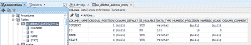
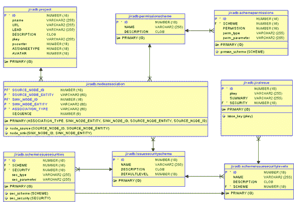

# 第十章：处理数据库

在本章中，我们将涵盖：

+   使用自定义模式扩展 JIRA 数据库

+   从插件访问数据库实体

+   在 JIRA 数据库中持久化插件信息

+   使用活动对象存储数据

+   访问 JIRA 配置属性

+   获取数据库连接以进行 JDBC 调用

+   将自定义字段从一种类型迁移到另一种类型

+   从数据库中检索问题信息

+   从数据库中检索自定义字段详细信息

+   从数据库中检索问题权限

+   从数据库中检索工作流详细信息

+   在数据库中更新问题状态

+   从数据库中检索用户和组信息

+   在数据库中处理变更历史

# 介绍

我们已经在第二章，*理解* *插件* *框架*中看到，JIRA 使用 Ofbiz 套件的 Entity Engine 模块来处理数据库操作。

OfBiz 代表“Open For Business”，OfBiz Entity Engine 是一套用于建模和管理特定实体数据的工具和模式。

根据关系数据库管理系统（RDBMS）标准实体关系建模概念的定义，实体是由一组字段和与其他实体的关系所定义的数据单元。

在 JIRA 中，这些实体定义在两个文件中，`entitygroup.xml`和`entitymodel.xml`，它们都位于`WEB-INF/classes/entitydefs`文件夹中。`entitygroup.xml`存储先前定义的组的实体名称。如果查看该文件，您将看到 JIRA 中的默认组名为`default`；您将在稍后看到的实体配置文件中找到相同的定义。`entitymodel.xml`包含实际的实体定义，相关细节将在后续的配方中进行说明。

实体配置定义在`entityengine.xml`文件中，该文件位于`WEB-INF/classes`文件夹中。正是在此文件中定义了`datasource`、事务工厂等。该文件的内容根据我们使用的数据库和应用服务器的不同而有所变化。例如，当数据库是 MySQL 且应用服务器是`tomcat`时，`datasource`的定义如下：

```
<datasource add-missing-on-start="true" check-fk-indices-on-start="false" check-fks-on-start="false" check-indices-on-start="true" check-on-start="true" field-type-name="mysql" helper-class="org.ofbiz.core.entity.GenericHelperDAO" name="defaultDS" use-foreign-key-indices="false" use-foreign-keys="false">
        <jndi-jdbc jndi-name="java:comp/env/jdbc/JiraDS" jndi-server-name="default"/>
</datasource>
```

有关连接到其他各种数据库的更多信息，请参阅[`confluence.atlassian.com/display/JIRA/Connecting+JIRA+to+a+Database`](http://confluence.atlassian.com/display/JIRA/Connecting+JIRA+to+a+Database)。

对于其他应用服务器，`jndi-server`属性在`jndi-jdbc`元素中有所不同，如下所示：

+   Orion 格式：<jndi-jdbc jndi-server-name="default" jndi-name="jdbc/JiraDS"/>

+   JBoss 格式：<jndi-jdbc jndi-server-name="default" jndi-name="java:/JiraDS"/>

+   Weblogic 格式：<jndi-jdbc jndi-server-name="default" jndi-name="JiraDS"/>

`transaction-factory`标签的定义如下：

```
<transaction-factory class="org.ofbiz.core.entity.transaction.JNDIFactory">
      <user-transaction-jndi jndi-name="java:comp/env/UserTransaction" jndi-server-name="default"/>
      <transaction-manager-jndi jndi-name="java:comp/env/UserTransaction" jndi-server-name="default"/>
 </transaction-factory>
```

实体定义的 XML 文件在文件中通过`entity-group-reader`和`entity-model-reader`属性进行引用，分别指向`entitygroup.xml`和`entitymodel.xml`。

```
<entity-model-reader name="main">
<resource loader="maincp" location="entitydefs/entitymodel.xml"/>
</entity-model-reader>
<entity-group-reader name="main" loader="maincp" location="entitydefs/entitygroup.xml"/>
```

委托器元素也在此文件中定义，如下所示：

```
<delegator entity-group-reader="main" entity-model-reader="main" name="default">
        <group-map datasource-name="defaultDS" group-name="default"/>
</delegator>
```

不同数据库的字段类型映射 XML 也定义在此文件中。一个例子如下：

```
<field-type loader="maincp" location="entitydefs/fieldtype-mysql.xml" name="mysql"/>
```

阅读更多关于配置`entityengine.xml`的信息，见[`www.atlassian.com/software/jira/docs/latest/entityengine.html`](http://www.atlassian.com/software/jira/docs/latest/entityengine.html)，以及关于实体建模概念的信息，见[`ofbiz.apache.org/docs/entity.html`](http://ofbiz.apache.org/docs/entity.html)。

在本节*扩展* *JIRA* *数据库* *的* *自定义* *架构*中，我们还将看到 JIRA 数据库架构的简要介绍，详细内容可以在[`confluence.atlassian.com/display/JIRADEV/Database+Schema`](http://confluence.atlassian.com/display/JIRADEV/Database+Schema)中查看。

# 扩展 JIRA 数据库的自定义架构

现在我们知道 JIRA 的方案定义保存在`WEB-INF/classes/entitydefs/entitygroup.xml`和`entitymodel.xml`中，让我们来看看如何扩展现有的方案定义。如果你想将一两个自定义表格添加到 JIRA 中，如何扩展 JIRA 方案？仅仅是在数据库中创建新表格就可以了吗？我们将在本节中了解这一点。

## 如何操作...

JIRA 使用在`WEB-INF/classes/entitydefs/entitygroup.xml`和`entitymodel.xml`文件中输入的方案定义。它不仅在验证和创建架构时使用这些文件，还在 JIRA 数据备份的导入和导出过程中使用这些文件。JIRA 还使用这些实体定义通过 OfBizDelegator（[`docs.atlassian.com/jira/latest/com/atlassian/jira/ofbiz/OfBizDelegator.html`](http://docs.atlassian.com/jira/latest/com/atlassian/jira/ofbiz/OfBizDelegator.html)）读写数据库，相关细节我们将在接下来的配方中看到。

以下是将新表添加到 JIRA 架构的快速步骤。假设我们正在添加一个表格来保存员工的详细信息。

1.  为表格确定一个实体名称。这可以与表格名称相同，也可以不同。这个名称将用于 XML 备份，并且也会被 OfBizDelegator 用于读取或写入数据。

    在我们的示例中，我们选择`Employee`作为实体名称。

1.  修改`WEB-INF/classes/entitydefs/entitygroup.xml`文件以包含新的实体组定义：

    ```
    <entity-group group="default" entity="Employee"/>
    ```

    这里，`group`属性指的是委托人所关联的组名。你可以在`WEB-INF/classes/entityengine.xml`中找到它，如下所示：

    ```
    <delegator name="default" entity-model-reader="main" entity-group-reader="main"><group-map group-name="default" datasource-name="defaultDS"/></delegator>
    ```

    `entity`属性保存了实体的名称。

1.  修改`WEB-INF/classes/entitydefs/entitymodel.xml`文件以包含新的实体定义：

    ```
    <entity entity-name="Employee" table-name="employee" package-name="">
      <field name="id" type="numeric"/>
      <field name="name" type="long-varchar"/>
      <field name="address" col-name="empaddress" type="long-varchar"/>
      <field name="company" type="long-varchar"/>

      <prim-key field="id"/>
      <index name="emp_entity_name">
        <index-field name="name"/>
      </index>
    </entity>
    ```

    在这里，`entity-name`属性保存了我们在*步骤* *2*中使用的实体名称。`table-name`保存了表格名称；它是可选的，如果没有提供，将从`entity-name`中派生。`package-name`可用于在你希望将实体定义组织到不同的包中时使用。

    `entity` 元素包含每个需要创建的表的列的一个 `field` 元素。`field` 元素有一个 `name` 属性，保存字段的名称。如果字段的列名不同，可以使用 `col-name` 属性，例如员工地址的情况。如果缺少 `col-name`，则使用字段的名称。下一个重要的属性是 `type`。在我们的示例中，`id` 是 `numeric` 类型，而 `name` 和 `address` 是 `long-varchar` 类型。

    字段的这些类型定义映射到每种数据库类型的适当列类型。`field-type` 映射存储在 `WEB-INF/classes/entitydefs/` 下，并在 `entityengine.xml` 中声明，如下所示：

    ```
    <field-type name="oracle10g" loader="maincp" location="entitydefs/fieldtype-oracle10g.xml"/>
    ```

    如果你查看 `fieldtype-oracle10g.xml` 文件，你会注意到 `numeric` 被映射到 `NUMBER(18,0)`，而 `long-varchar` 被映射到 `VARCHAR2(255)`。你可以从同一个文件中找到各种映射，甚至是相关的 Java 数据类型。

    `prim-key` 元素用于定义表的主键约束，如前所示。在我们的示例中，`id` 是主键。对于我们创建的所有新表，主键必须命名为 `id`。

    `index` 元素为该表指定的字段创建数据库索引。我们可以指定索引名称和需要索引的字段组。

    你还可以使用 `relation` 元素来定义实体之间的关系，如下所示：

    ```
    <relation type="one" title="Parent" rel-entity-name="Company">
      <key-map field-name="company" rel-field-name="id"/>
    </relation>
    ```

    在这里，我们通过声明一个员工只能有一个公司，添加了 `Employee` 实体和 `Company` 实体之间的关系。在上面的示例中，`Employee` 应该有一个指向公司记录 `id` 字段的 `company` 字段。换句话说，员工记录中的 `company` 字段将是公司记录的外键。

    关于实体定义的更多详细信息可以在 [`ofbiz.apache.org/docs/entity.html#Entity_Modeling`](http://ofbiz.apache.org/docs/entity.html#Entity_Modeling) 找到。

1.  在进行更改后，重新启动 JIRA。

## How it works...

当 JIRA 在应用了之前的更改后重新启动时，你会注意到启动时日志中出现一个警告信息，如下所示：


一旦 JIRA 识别到数据库中没有与新实体名称 **employee** 对应的表，它将创建一个，如下所示：


即使是索引信息也被存储，如下所示：


如果你想向现有表中添加新列，可以像之前看到的那样添加字段定义，并且在重新启动 JIRA 时，表将更新以包含该列。

如果数据库中有表或表中的列没有有效的实体或字段定义在 `entitymodel.xml` 中，你将在 JIRA 日志中看到错误信息。

在 JIRA 升级时，必须小心更新 `entitygroup.xml` 和 `entitymodel.xml` 文件，否则更改将丢失。

# 从插件访问数据库实体

我们已经看到了 JIRA 数据库中各种实体是如何定义的，以及如何引入新实体。在本示例中，我们将看到如何使用这些实体定义从数据库中读取和写入数据。

## 如何实现...

JIRA 公开了`OfBizDelegator` ([`docs.atlassian.com/jira/latest/com/atlassian/jira/ofbiz/OfBizDelegator.html`](http://docs.atlassian.com/jira/latest/com/atlassian/jira/ofbiz/OfBizDelegator.html)) 组件，它是`org.ofbiz.core.entity.DelegatorInterface`的封装，用于通过 Ofbiz 层与数据库进行通信。

你可以通过在构造函数中注入或通过`ComponentManager`来获取`OfBizDelegator`实例，如下所示：

```
OfBizDelegator delegator = ComponentManager.getInstance().getComponentInstanceOfType(OfBizDelegator.class);
```

## 从数据库读取

我们可以通过上述委托类公开的各种方法从数据库中读取。例如，之前示例中定义的员工表的所有记录可以这样读取：

```
List<GenericValue> employees = delegator.findAll("Employee");
```

这里，`findAll`方法接受实体名称（不是表名称），并返回一个`GenericValue`对象列表，每个对象代表表中的一行。可以通过字段名（而不是`col-name`）来读取个别字段，如下所示：

```
Long id = employees.get(0).getLong("id");
String name = employees.get(0).getString("name");
```

字段应转换为的数据类型可以从我们在上一个示例中看到的`field-type`映射 XML 中找到。

我们可以在满足特定条件时，使用`findByAnd`方法从数据库中读取数据：

```
List<GenericValue> employees = delegator.findByAnd("Employee", EasyMap.build("company","J-Tricks"));
```

这将返回所有公司名称为`J-Tricks`的记录。你可以使用`findByCondition`方法强制执行更复杂的条件，并且只选择感兴趣的字段，如下所示：

```
List<GenericValue> employees = this.delegator.findByCondition("Employee", new EntityExpr("id",EntityOperator.GREATER_THAN,"15000"), EasyList.build("id","name"));
```

这里，我们查找所有 ID 大于`15000`的员工记录，并且只检索员工的 ID 和姓名。

`findListIteratorByCondition` ([`docs.atlassian.com/jira/latest/com/atlassian/jira/ofbiz/OfBizDelegator.html#findListIteratorByCondition%28java.lang.String,%20org.ofbiz.core.entity.EntityCondition,%20org.ofbiz.core.entity.EntityCondition,%20java.util.Collection,%20java.util.List,%20org.ofbiz.core.entity.EntityFindOptions%29`](http://docs.atlassian.com/jira/latest/com/atlassian/jira/ofbiz/OfBizDelegator.html#findListIteratorByCondition%28java.lang.String,%20org.ofbiz.core.entity.EntityCondition,%20org.ofbiz.core.entity.EntityCondition,%20java.util.Collection,%20java.util.List,%20org.ofbiz.core.entity.EntityFindOptions%29))

这个方法可以用来添加更多选项，如`orderBy`子句、`EntityFindOptions`、`where`条件、`having`条件等，如下所示：

```
OfBizListIterator iterator = this.delegator.findListIteratorByCondition("Employee", new EntityExpr("id",EntityOperator.GREATER_THAN,"15000"), null, UtilMisc.toList("name"), UtilMisc.toList("name"), new EntityFindOptions(true, EntityFindOptions.TYPE_SCROLL_INSENSITIVE, EntityFindOptions.CONCUR_READ_ONLY, true));
List<GenericValue> employees = iterator.getCompleteList();
iterator.close();
```

在这里，我们搜索所有 ID 大于`15000`的记录。此情况下没有`having`条件，因此我们将其留为空值。接下来的两个参数指定仅需要选择`name`字段，并且记录应该按`name`字段排序。最后一个参数指定了`EntityFindOptions`。在这里，我们定义了包含四个参数的 EntityFindOptions，其中包括`TYPE_SCROLL_INSENSTITVE`和`CONCUR_READ_ONLY`。第一个 true 用于`specifyTypeAndConcur`，最后一个 true 用于 distinct 选择。

如果`specifyTypeAndConcur`为 true，接下来的两个参数将用于指定`resultSetType`和`resultSetConcurrency`。如果为 false，则使用 JDBC 驱动程序的默认值。在上面的例子中，`specifyTypeAndConcur`为 true，因此`resultSetType`被设置为`TYPE_SCROLL_INSENSITIVE`，而`resultSetConcurrency`被设置为`CONCUR_READ_ONLY`。关于此以及可能的值，可以参考[`download.oracle.com/javase/tutorial/jdbc/basics/retrieving.html`](http://download.oracle.com/javase/tutorial/jdbc/basics/retrieving.html)。

如前所述，`EntityFindOptions`构造函数中的最后一个 true 用于选择不同的值。显然，这是使用 Entity Engine 进行 distinct 选择的唯一方法。你可以在实体引擎的食谱中找到更多信息，网址为[`www.opensourcestrategies.com/ofbiz/ofbiz_entity_cookbook.txt`](http://www.opensourcestrategies.com/ofbiz/ofbiz_entity_cookbook.txt)。

不要忘记关闭迭代器，正如前面的代码片段所示。

### 写入新记录

使用 OfBizDelegator 在表中创建新记录非常简单，如下所示：

```
GenericValue newEmployee = this.delegator.createValue("Employee",EasyMap.build("name","Some Guy", "address","Some Address", "company","J-Tricks"));
```

确保不要提供 ID，因为它是自动生成的。此外，映射中缺失的字段将被设置为`null`。必须提供所有必填字段的数据，以避免错误。

### 更新记录

写入记录是通过检索记录、修改值并使用`store()`方法来完成的。例如，我们可以检索 ID 为`12000`的记录并修改它，如下所示：

```
GenericValue employee = delegator.findByAnd("Employee",   EasyMap.build("id","12000")).get(0);
employee.setString("name","New Name");
employee.store();
```

更多有用的方法可以在 Java 文档中找到，网址为[`docs.atlassian.com/jira/latest/com/atlassian/jira/ofbiz/OfBizDelegator.html`](http://docs.atlassian.com/jira/latest/com/atlassian/jira/ofbiz/OfBizDelegator.html)。

# 在 JIRA 数据库中持久化插件信息

在开发插件时，我们会遇到许多场景，需要存储有关插件的特定信息，无论是配置细节还是实体的元数据。我们如何在不创建自定义模式且不需要编辑实体定义的情况下做到这一点？在这个例子中，我们将展示如何利用 JIRA 现有的框架存储我们开发的插件的特定信息。

JIRA 使用 Open Symphony 的`PropertySet`框架将属性存储到数据库中。这些属性是一组键/值对，存储在用户想要的任何实体中。属性的键始终是一个字符串值；值可以是：String、Long、Date、Boolean 或 Double。我们已经在第二章，*理解* *插件* *框架*中看到 JIRA 是如何使用它的。在本食谱中，我们将看到如何使用`PropertySet`存储我们的自定义数据。

## 如何做到...

假设我们需要将一个布尔值存储到数据库中，作为插件配置的一部分，并稍后读取；以下是执行此操作的步骤：

1.  获取`PropertySet`的实例，使用`PropertiesManager`：

    ```
    PropertySet propertySet = PropertiesManager.getInstance().getPropertySet();
    ```

    从 JIRA 4.3 开始，`PropertiesManager.getInstance()`方法已被弃用。相反，您可以通过依赖注入将`PropertiesManager`注入构造函数，或者从`ComponentManager`中检索，如下所示：

    ```
    PropetySet propertySet =  ComponentManager.getComponent(PropertiesManager.class).getPropertySet();
    ```

1.  使用`setBoolean`方法持久化布尔属性：

    ```
    propertySet.setBoolean("mt.custom.key1", new Boolean(true));
    ```

    同样，String、Long、Double 和 Date 类型的值可以通过相应的方法进行存储。

1.  存储的属性可以在任何时刻检索，如下所示：

    ```
    Boolean key = propertySet.getBoolean("mt.custom.key1");
    ```

然而，如何将一个更复杂的结构（如属性）存储到现有实体中呢？假设我们想要存储一个用户的地址。JIRA 将用户信息存储到`OSUser`实体中，如下所示：

1.  检索我们将存储地址的用户实体的 ID。例如，如果有一个用户`jobinkk`，我们可以从`OSUser`实体中找到该用户的 ID，它对应于 JIRA 中的`userbase`表。假设 ID 是`10032`。

1.  获取`PropertySet`的实例，使用`PropertySetManager`，传递我们获得的实体的详细信息：

    ```
    HashMap entityDetails = new HashMap();
    entityDetails.put("delegator.name", "default");
    entityDetails.put("entityName", "OSUser");
    entityDetails.put("entityId", 10032L);
    PropertySet userProperties = PropertySetManager.getInstance("ofbiz", entityDetails);
    ```

    在这里，我们创建一个包含实体名称（即`OSUser`）和用户 ID（即`10032`）的映射。我们还传递了在`entityengine.xml`中定义的委托名称，该文件位于`WEB-INF/classes`文件夹下，默认情况下即为此。然后我们从`PropertySetManager`中检索`PropertySet`实例，使用`ofbiz`作为键。

1.  这些值可以像之前一样设置，具体取决于字段的类型。在这种情况下，我们将有多个键用于州、省，国家等：

    ```
    userProperties.setString("state", "Kerala");
    userProperties.setString("country", "India");
    ```

    这将被存储在相应的表中。

1.  我们可以通过以类似的方式创建`PropertySet`并使用 getter 方法，稍后检索这些值：

    ```
    System.out.println("Address:" + userProperties.getString("state")+", "+userProperties.getString("country"));
    ```

## 它是如何工作的...

当使用从`PropertiesManager`实例化的`PropertySet`设置属性时，正如我们在布尔值的案例中所做的那样，它会存储在**propertyentry**表中，`ENTITY_NAME`为**jira.properties**，`ENTITY_ID`为**1**。它还会有一个唯一的 ID，之后将用来将值存储到**propertynumber**、**propertystring**、**propertytext**或**propertydate**表中，具体取决于我们使用的数据类型。

在我们的案例中，**propertyentry**表已经填充了值，如下所示：


第一个是我们添加的 Boolean 属性，而第二个和第三个是用户属性。

布尔值会作为数字（`0` 或 `1`）存储，因此，**propertyentry** 表将 **propertytype** 存储为 **1**，表示数字值。对于布尔属性，**propertynumber** 表中有一个对应的条目，ID 为 **11303**，如下所示：


在我们的示例中，**Boolean** 被设置为 **true**，因此，**propertynumber** 存储值 **1**。如果设置为 `false`，则会存储 **0**。

在地址的情况下，实体是 **OSUser**，它的 **entityId** 为 **10032**。我们看到了两行，ID 分别为 **11304** 和 **11305**，每行的 **propertytype** 为 **5**，表示字符串值。由于它们是字符串值，所以被存储在 **propertystring** 表中，如下图所示：


希望这能帮助你大致了解我们如何在现有实体记录中存储属性。

使用 `propertySet` 的好处是我们不需要创建额外的模式或实体定义，并且这些属性在 JIRA 数据导出时会被导出到备份 XML 中。因此，以这种方式存储的所有配置，在数据重新导入到另一个 JIRA 实例时会被保留。

# 使用 Active Objects 存储数据

Active Objects 是 JIRA 最近使用的一项技术，用于允许每个插件存储数据。这为插件开发人员提供了一个真正受保护的数据库，他们可以将属于其插件的数据存储在其中，并且其他插件无法访问。在这个教程中，我们将看到如何使用 Active Objects 将地址实体存储到数据库中。

你可以在 [`java.net/projects/activeobjects/pages/Home`](http://java.net/projects/activeobjects/pages/Home) 阅读更多关于 Active Objects 的信息。

## 准备就绪

使用 Atlassian Plugin SDK 创建一个骨架插件。

## 如何操作...

为了更好地理解，让我们看一下我们在之前的教程中使用的简单 "地址实体" 示例。这也有助于与 `PropertySet` 进行简便的比较，如果需要的话。按照以下步骤在插件中使用 Active Objects：

1.  在 `pom.xml` 中包含 Active Objects 依赖项。添加合适的 `ao` 版本：

    ```
    <dependency>
      <groupId>com.atlassian.activeobjects</groupId>
      <artifactId>activeobjects-plugin</artifactId>
      <version>${ao.version}</version>
      <scope>provided</scope>
    </dependency>
    ```

1.  在 `pom.xml` 文件中，按照如下方式将 Active Objects 插件工件包含在 `maven-jira-plugin` 配置下：

    ```
    <plugin>
     <groupId>com.atlassian.maven.plugins</groupId>
     <artifactId>maven-jira-plugin</artifactId>
     <version>3.0.6</version>
     <extensions>true</extensions>
     <configuration>
      <pluginArtifacts>
       <pluginArtifact>
        <groupId>com.atlassian.activeobjects</groupId>
        <artifactId>activeobjects-plugin</artifactId>
        <version>${ao.version}</version>
       </pluginArtifact>
       <pluginArtifact>
        <groupId>com.atlassian.activeobjects</groupId>
        <artifactId>activeobjects-jira-spi</artifactId>
        <version>${ao.version}</version>
       </pluginArtifact>
      </pluginArtifacts>
      <productVersion>${jira.version}</productVersion>
      <productDataVersion>${jira.data.version}</productDataVersion>
     </configuration>
    </plugin>
    ```

1.  将 Active Objects 插件模块添加到 Atlassian 插件描述符中：

    ```
    <ao key="ao-module">
      <description>The configuration of the Active Objects service</description>
      <entity>com.jtricks.entity.AddressEntity</entity>
    </ao>
    ```

    如你所见，模块有一个唯一的键，并指向我们稍后将定义的实体，这里是 `AddressEntity`。

1.  包含一个 component-import 插件，将 `ActiveObjects` 注册为 `atlassian-plugin.xml` 文件中的一个组件，前面已经提到的模块：

    ```
    <component-import key="ao" name="Active Objects components" interface="com.atlassian.activeobjects.external.ActiveObjects">
      <description>Access to the Active Objects service</description>
    </component-import>
    ```

1.  定义用于数据存储的实体。实体应该是一个接口，并且应继承 `net.java.ao.Entity` 接口。我们需要在这个实体接口中做的所有工作是为我们需要存储的数据定义 getter 和 setter 方法。

    例如，我们需要将名称、城市和国家作为地址实体的一部分进行存储。在这种情况下，`AddressEntity` 接口将如下所示：

    ```
    public interface AddressEntity extends Entity{
      public String getName();
      public void setName(String name);

      public String getState();   
      public void setState(String state);

      public String getCountry();
      public void setCountry(String country);
    }
    ```

通过这样做，我们已经设置了实体，以便存储所有三个属性。我们现在可以使用 `ActiveObjects` 组件创建、修改或删除数据。该组件可以通过注入到构造函数中进行实例化。

```
private ActiveObjects ao;

public ManageProperties(ActiveObjects ao) {
  this.ao = ao;
}
```

可以使用以下代码片段向数据库添加新行：

```
AddressEntity addressEntity =  ao.create(AddressEntity.class);
addressEntity.setName(name);
addressEntity.setState(state);
addressEntity.setCountry(country);
addressEntity.save();
```

可以通过使用 `id`（主键）或通过 `net.java.ao.Query` 对象查询数据来读取详细信息。使用 ID 就像下面这样简单：

```
AddressEntity addressEntity = ao.get(AddressEntity.class, id);
```

`Query` 对象可以按如下方式使用：

```
AddressEntity[] addressEntities = ao.find(AddressEntity.class, Query.select().where("name = ?", name));
for (AddressEntity addressEntity : addressEntities) {
  System.out.println("Name:"+addressEntity.getName()+", State:"+addressEntity.getState()+", Country:"+addressEntity.getCountry());
}
```

这里，我们正在查询所有具有给定名称的记录。

一旦通过任何方式获取到实体，我们可以通过使用 setter 方法简单地编辑内容：

```
addressEntity.setState(newState);
addressEntity.save();
```

删除甚至更简单！

```
ao.delete(addressEntity);
```

希望这能为活跃对象提供一个公平的介绍。

## 它是如何工作的...

在后台，每添加一个实体，JIRA 数据库中就会为其创建一个单独的表。活跃对象服务与这些表进行交互以完成工作。

如果你查看数据库，将会看到每个名为 `MyObject` 的实体（属于插件密钥为 `com.example.ao.myplugin` 的插件）会创建一个名为 `AO_{SOME_HEX}_MY_OBJECT` 的表，其中：

+   `AO` 是一个常见的前缀

+   `SOME_HEX` 是插件密钥 `com.example.ao.myplugin` 的哈希值的前六个十六进制字符的集合

+   `MY_OBJECT` 是实体类名 `MyObject` 的大写翻译

对于每个在实体接口中定义的具有 getter 方法的属性 `getSomeAttribute`，都会在表中创建一列，列名为 `SOME_ATTRIBUTE`，遵循 Java Beans 命名约定——通过下划线分隔两个单词，并将它们都保持大写。

在我们的 **AddressEntity** 示例中，已创建以下表：**ao_d6b86e_address_entity**：



对于我们的示例，数据存储方式如下所示：


# 访问 JIRA 配置属性

我们已经在之前的配方中看到如何使用 `PropertySet` 存储插件的详细信息。在这个配方中，我们将看到如何使用 `PropertySet` 访问 JIRA 配置属性。

## 如何操作...

JIRA 中有很多全局配置设置，这些设置通过管理菜单进行配置。更多关于各种选项的信息可以在 [`confluence.atlassian.com/display/JIRA/Configuring+Global+Settings`](http://confluence.atlassian.com/display/JIRA/Configuring+Global+Settings) 阅读。JIRA 将这些信息存储在哪里，如何访问？

所有这些配置属性，例如 **General** **Configuration**、**Base** **URL**、**Attachments** **path**、**license** **info** 等，都存储在我们之前看到的 `propertyset` 表中。它们与虚拟实体 `jira.properties` 一起存储。这与使用 `PropertiesManager` 检索 `PropertySet` 时使用的虚拟实体相同，正如我们在持久化插件信息时所看到的那样。

在这里，所有属性键条目都存储在 `propertyentry` 表中，`jira.properties` 是实体名称，`entityid` 是 `1`。每个属性的 `propertytype` 不同，取决于存储的内容。例如，`jira.option.allowattachments` 是一个标志，因此存储在 `propertynumber` 表中，其值为 `0` 或 `1`。在这种情况下，`propertytype` 为 `1`，表示数字 `value`。另一方面，`jira.path.index` 存储一个字符串，表示索引路径，其 `propertytype` 为 `5`，值存储在 `propertystring` 表中。

所有属性可以通过以下 SQL 命令访问：

```
select * from propertyentry where ENTITY_NAME='jira.properties';

```

如果您只想查看字符串类型的属性及其值，可以使用以下命令：

```
select PROPERTY_KEY, propertyvalue from propertyentry pe, propertystring ps where pe.id=ps.id and pe.ENTITY_NAME='jira.properties' and propertytype='5';

```

如果您想查找特定的属性，可以使用以下命令：

```
select PROPERTY_KEY, propertyvalue from propertyentry pe, propertynumber pn where pe.id=pn.id and pe.ENTITY_NAME='jira.properties' and pe.PROPERTY_KEY='jira.option.allowattachments';

```

注意，应使用适当的属性表，`propertynumber` 在此情况下！

在插件中也可以实现相同的功能，如下所示：

1.  检索 `PropertySet` 对象：

    ```
    PropertySet propertySet = PropertiesManager.getInstance().getPropertySet();
    ```

    如前所述，从 JIRA 4.3 开始，`PropertiesManager.getInstance()` 方法已被弃用。相反，您可以通过依赖注入将 `PropertiesManager` 注入构造函数，或从 `ComponentManager` 中检索，示例如下：

    ```
    PropetySet propertySet =  ComponentManager.getComponent(PropertiesManager.class).getPropertySet();
    ```

1.  所有属性键可以通过以下方式检索：

    ```
    Collection<String> keys = propertySet.getKeys();
    ```

1.  同样，特定类型的所有属性可以通过以下方式访问：

    ```
    Collection<String> stringKeys = propertySet.getKeys(5);
    ```

1.  可以按如下方式访问特定键的值：

    ```
    String attachmentHome = propertySet.getString("jira.path.attachments");
    boolean attachmentsAllowed = propertySet.getBoolean("jira.option.allowattachments");
    ```

# 获取 JDBC 调用的数据库连接

使用 **OfBizDelegator** 获取我们所需的所有详细信息并不总是可行。如果我们需要通过 JDBC 执行复杂的查询怎么办？在这个示例中，我们将看到如何获取在 `entityengine.xml` 中定义的数据库连接。

## 如何做到这一点...

如果您熟悉 JDBC，数据库连接查找非常简单。按照以下步骤快速获取连接：

1.  创建 `javax.naming.InitialContext` 对象：

    ```
    InitialContext cxt = new InitialContext();
    ```

1.  使用 `EntityConfigUtil` 从实体配置中检索数据库信息：

    ```
    DatasourceInfo datasourceInfo = EntityConfigUtil.getDatasourceInfo ("defaultDS");
    ```

    在这里，`defaultDS` 是 `entityengine.xml` 中定义的数据源的名称。

1.  从 `DataSourceInfo` 对象中检索 `jndi-name` 字符串：

    ```
    String jndiName = datasourceInfo.jndiJdbcElement.getAttribute ( "jndi-name" );
    ```

1.  使用 `jndi-name` 查找 `javax.sql.DataSource` 对象：

    ```
    DataSource ds = ( DataSource ) cxt.lookup ( jndiName );
    ```

1.  从 DataSource 创建 `java.sql.Connection` 对象：

    ```
    Connection conn = ds.getConnection();
    ```

1.  一旦建立连接，它与其他任何 JDBC 调用相似。创建语句或准备语句并执行它们。

在我写这篇文章时，JIRA 4.3 正在发布，并且连接将变得更加简单。只需执行以下操作：

```
Connection conn = new DefaultOfBizConnectionFactory().getConnection();
```

简单吧？

`DataSourceInfo` 可以通过以下方式访问：

```
DatasourceInfo datasourceInfo = new DefaultOfBizConnectionFactory().getDatasourceInfo();
```

轮到你了，明智地编写 JDBC 调用吧！

# 将自定义字段从一种类型迁移到另一种类型

JIRA 中的自定义字段有多种类型——文本字段、选择列表、数字字段等等。我们可能会遇到需要更改字段类型的场景，但又不想丢失已经输入的数据！这可能吗？在一定程度上是可能的。在这个教程中，我们将看到如何做到这一点。

字段的类型只能通过数据库更改，因为 UI 不支持此操作。但是，并不是所有字段类型都能支持转换。例如，无法将文本字段转换为数字字段，因为该字段已有的所有值可能不是数字字段。然而，反过来是可以的，因为所有数字值都可以当作文本值来处理。类似地，你可以将选择字段转换为文本字段，但不能将多选字段转换为文本字段，因为多选字段有多个值，每个值在 `customfieldvalue` 表中都有单独的行。

所以，第一步是通过查看源类型和目标类型，确定转换是否可行。如果可行，我们就可以按照这个教程的描述继续修改类型。

## 如何操作...

以下步骤概述了如何修改自定义字段的类型，前提是源类型和目标类型满足我们之前讨论的条件：

1.  停止 JIRA 实例。

1.  以 JIRA 用户身份连接到 JIRA 数据库。

1.  通过执行如下 SQL 脚本，修改 `customfield` 表中的自定义字段键：

    ```
    update customfield set customfieldtypekey = 'com.atlassian.jira.plugin.system.customfieldtypes:textfield' where cfname = 'Old Number Value';
    ```

    在这里，将名为 **'Old** **Number** **Value'** 的自定义字段类型更改为文本字段。确保自定义字段的名称唯一；如果不是，请在 `where` 条件中使用自定义字段 ID。

1.  类似地，修改搜索器键，并使用适当的搜索器。在前面的案例中，我们需要将搜索器值修改为文本搜索器，如下所示：

    ```
    update customfield set customfieldsearcherkey = 'com.atlassian.jira.plugin.system.customfieldtypes:textsearcher' where cfname = 'Old Number Value';
    ```

1.  提交更改并断开连接。

1.  启动 JIRA。

1.  通过进入 **管理** | **系统** | **索引**，对 JIRA 实例进行完全重新索引。

自定义字段现在应从旧的数字字段修改为文本字段。添加或更新值并进行搜索以验证更改。

# 从数据库中获取问题信息

关于一个问题的信息分散在 JIRA 数据库的多个表中。然而，一个好的起点是 `jiraissue` 表，这里存储着问题记录。它有外键引用其他表，同时，问题 ID 也会在其他几个表中被引用。

以下图表展示了 `jiraissue` 表与其他表之间的父子关系：


如你所见，关于问题的关键信息，如项目、问题类型、状态、优先级、解决方案、安全级别、工作流等，都存储在各自的表中，但都通过`jiraissue`表引用，使用外键。外键指向其他表的 ID，但这些表上没有强制执行外键约束。

类似地，以下图表显示了`jiraissue`表与哪些表有子关系：


这里，`customfieldvalue`、`changegroup`、`jiraaction`、`label`、`worklog`、`fileattachment`、`issuelink`、`trackback_ping`等表，都有一个名为`issueid`或`issue`（或 source 或 destination）的外键，指向相关问题的 ID。

在本食谱中，我们将学习如何借助前面的图表访问一些问题的信息。

## 如何操作...

当表之间存在父子关系时，我们可以进行联接操作，以获取大部分所需的信息。例如，可以通过以下查询获取所有问题及其项目名称：

```
select ji.id, ji.pkey, pr.pname from jiraissue ji inner join  project pr on ji.project = pr.id;

```

在这里，我们通过条件进行内部连接，即项目的 ID 与`jiraissue`表中的项目列值相同。

类似地，所有关于一个问题的评论可以通过以下查询获取：

```
select ji.pkey, ja.actionbody, ja.created, ja.author from jiraissue ji left join jiraaction ja on ji.id = ja.issueid;

```

在此示例中，我们检索问题的评论及其作者和创建日期。相同的方法可以应用于前面图表中的所有表。

## 还有更多...

访问问题的版本和组件信息稍有不同。尽管你会在`jiraissue`表中看到`fixfor`和`component`列，它们已经不再使用！

每个问题可以有多个版本或组件，因此在`jiraissue`和`version`/`component`表之间存在一个`join`表，称为`nodeassociation`。`source_node_entity`将是`ISSUE`，`source_node_id`表示问题 ID。`sink_node_entity`将在此情况下为**Component**或**Version**，而`sink_node_id`将存储相应组件或版本的 ID。

还有第三列`association_type`，它的值将是`IssueFixVersion`、`IssueVersion`或`IssueComponent`，分别用于版本修复、受影响版本或组件。

我们可以通过以下方式访问问题的组件：

```
select ji.pkey, comp.cname from nodeassociation na, component comp, jiraissue ji where comp.id = na.sink_node_id and ji.id = na.source_node_id and na.association_type = "IssueComponent" and ji.pkey = 'DEMO-123';
```

这里，`DEMO-123`是问题。我们还可以以类似的方式检索受影响的版本和修复版本。

# 从数据库中检索自定义字段详细信息

在之前的食谱中，我们已经看过如何从数据库中检索问题的标准字段。在本食谱中，我们将学习如何检索问题的自定义字段详细信息。

JIRA 中的所有自定义字段都存储在`customfield`表中，正如我们在修改自定义字段类型时所见。某些自定义字段，例如选择字段、多选字段等，可以配置不同的选项，并且这些选项可以在`customfieldoption`表中找到。

对于每个自定义字段，都可以配置一组上下文。这些上下文指定了与字段相关联的项目或问题类型列表。对于每个这样的上下文，`fieldconfigscheme`中会有一条带有唯一 ID 的记录。对于每个`fieldconfigscheme`，在`configurationcontext`和`fieldconfigschemeissuetype`表中都会有记录，`configurationcontext`存储字段在相关上下文中与哪些项目相关联，`fieldconfigschemeissuetype`则存储字段与哪些问题类型相关联！对于像选择字段（Select）和多选字段（Multi Select）这样的字段，可以为不同的上下文配置不同的选项，这些选项可以在`customfieldoption`表中找到，通过`customfildconfig`列，它指向`fieldconfigscheme`表中的相应行。

每个配置方案必须在`configurationcontext`和`fieldconfigschemeissuetype`中有记录。如果该方案没有限制到任何项目或问题类型，则相关表中的`project`和`issuetype`列应该为`NULL`。

对于单个问题，自定义字段的值存储在`customfieldvalue`表中，并引用了`jiraissue`和`customfield`表。对于多值字段，例如多选框、多个选择项等，`customfieldvalue`表中会有多条记录。

我们通过一个简单的图表来捕捉这些信息，如下所示：


## 如何操作...

一旦添加了自定义字段，可以通过以下简单的查询从`customfield`表中检索该字段的详情：

```
select * from customfield where cfname = 'CF Name';

```

如果是具有多个选项的字段，例如选择字段，可以使用简单的连接查询检索选项，如下所示：

```
select cf.id, cf.cfname, cfo.customvalue from customfield cf inner join customfieldoption cfo on cf.id = cfo.customfield where cfname = 'CF Name';

```

可以通过以下方式从`fieldconfigscheme`表中检索各种字段配置：

```
select * from fieldconfigscheme where fieldid = 'customfield_12345';

```

这里，`12345`是自定义字段的唯一 ID。

与自定义字段相关联的项目可以通过以下方式检索：

```
select project.pname from configurationcontext inner join project on configurationcontext.project = project.id where fieldconfigscheme in  (select id from fieldconfigscheme where fieldid = 'customfield_12345');

```

当项目为`NULL`时，字段是全局性的，因此对所有项目都可用！

类似地，可以通过以下方式检索与字段相关联的问题类型：

```
select issuetype.pname from fieldconfigschemeissuetype inner join issuetype on fieldconfigschemeissuetype.issuetype = issuetype.id where fieldconfigscheme in (select id from fieldconfigscheme where fieldid = 'customfield_12345');

```

# 从数据库中检索问题的权限

JIRA 在对问题执行权限控制方面非常强大。它提供了许多配置选项来控制谁可以做什么。所有这些配置选项都围绕着 JIRA 中的两种不同方案展开，**权限** **方案** 和 **问题** **安全** **方案**。

权限方案强制实施项目级安全性，而问题安全方案则强制实施问题级安全性。你可以授予查看项目中问题的访问权限，同时隐藏部分问题不让用户看到。然而，反过来就不可行，即，如果用户原本没有权限查看项目中的问题，则无法授予对某些特定问题的访问权限。

存储 JIRA 数据库中权限信息的各种表格，以及它们之间的关系，可以如下所示：



如你所见，权限方案和问题安全方案都通过 `nodeassociation` 表与项目相关联。在这里，**SOURCE_NODE_ENTITY** 是 **项目**，相应的 **SOURCE_NODE_ID** 存储项目的 ID。**SINK_NODE_ENTITY** 是 `PermissionScheme` 或 `IssueSecurityScheme`，取决于方案类型。**SINK_NODE_ID** 将指向适当的方案。**ASSOCIATION_TYPE** 在两种情况下都是 `ProjectSheme`。

对于每个权限方案，都有多个预定义的权限，例如，**管理员** **项目**，**浏览** **项目**，**创建** **问题**，等等。对于每个这些权限，`perm_type` 和 `perm_parameter` 存储具有相关权限的实体类型及其值。例如，`perm_type` 可以是组、用户、项目角色等，而 `perm_parameter` 将分别是组名、用户名或项目角色。多个权限类型可以被授予单一权限。

同样，问题安全方案保存了多个安全级别，这些安全级别存储在 `schemeissuesecuritylevels` 表中。每个安全级别可以包含不同的实体，它们也使用 `type` 和 `parameter` 值定义；在这种情况下，列名分别是 `sec_type` 和 `sec_parameter`。

权限方案根据问题所在的项目强制实施，而安全方案则通过查看问题所分配的安全级别来强制实施。`jiraissue` 表中的安全列保存了此信息。

让我们看看如何根据前面的示意图从问题中检索一些信息。

## 如何操作...

通过 `nodeassociation` 表，找到与项目关联的权限方案非常容易，如下所示：

```
select pr.pname, ps.name from nodeassociation na, project pr, permissionscheme ps where pr.id = na.source_node_id and ps.id = na.sink_node_id and na.association_type = 'ProjectScheme' and na.source_node_entity = 'Project' and na.sink_node_entity = 'PermissionScheme';

```

同样，问题安全方案可以按如下方式检索：

```
select pr.pname, iss.name from nodeassociation na, project pr, issuesecurityscheme iss  where pr.id = na.source_node_id and iss.id = na.sink_node_id and na.association_type = 'ProjectScheme' and na.source_node_entity = 'Project' and na.sink_node_entity = 'IssueSecurityScheme';

```

与权限方案中的特定权限相关的权限参数，`id` 值为 9，可以轻松地按如下方式检索：

```
select sp.perm_type, sp.perm_parameter from schemepermissions sp inner join permissionscheme ps on sp.scheme = ps.id where ps.id = 9 and sp.permission = 23

```

在这里，`sp.permission = 23` 表示 `PROJECT_ADMIN` 权限。不同的权限类型可以在 `com.atlassian.jira.security.Permissions` 类中找到。这里，`perm_type` 表示权限是否授予给组、用户或角色；`perm_parameter` 存储相应的组名、用户名或角色名。

同样，可以编写查询来检索问题安全方案的信息。例如，可以按如下方式检索问题安全方案中每个级别的安全级别、安全类型和参数：

```
select iss.name, sisl.name, sis.sec_type, sis.sec_parameter from issuesecurityscheme iss , schemeissuesecurities sis, schemeissuesecuritylevels sisl where sis.scheme = iss.id and sisl.scheme =iss.id;

```

编写更复杂的查询超出了本书的范围，但希望前面的模式图和示例 SQL 图表提供了足够的信息来入门！

# 从数据库中检索工作流详情

其他人通常在数据库中查找的主要信息是关于工作流的。一个问题的当前状态是什么？如何查找一个问题所关联的工作流？工作流 XML 存储在哪里？在本节中，我们将快速浏览与工作流相关的表。

正如我们在前面的章节中看到的，JIRA 工作流包含状态、步骤和转换。状态和步骤之间总是存在一对一的映射，并且它们始终保持同步。然后，存在将问题从一个步骤移动到另一个步骤的转换，从而从一个状态转换到另一个状态。

工作流本身以 XML 文件的形式存储在 `jiraworkflows` 表中。JIRA 使用 OSWorkflow API 处理这些 XML 文件，以检索每个转换、步骤等所需的信息。任何草稿工作流都会存储在 `jiradraftworkflows` 表中。

`jiraissue` 表保存其当前状态的 ID，状态的详细信息存储在 `issuestatus` 表中。我们可以使用 `jiraissue` 表中的状态 ID 从 `issuestatus` 表中检索对应的详细信息。

`jiraissue` 还有另一个列，`workflow_id`，它指向与该问题关联的工作流以及该问题所在的工作流的当前步骤。第一个信息，即问题所关联的工作流，存储在 `os_wfentry` 表中。在这里，`workflow_id` 将指向 `os_wfentry` 表的 ID 列。第二个信息，即与问题关联的当前步骤，存储在 `os_currentstep` 表中。在这里，`workflow_id` 指向 `os_currentstep` 表中的 `entry_id` 列。

所以，每个问题在 `os_wfentry` 和 `os_currentstep` 表中都有一个条目。它们之间的关系是：`jiraissue.WORKFLOW_ID == OS_WFENTRY.ID` 和 `jiraissue.WORKFLOW_ID == OS_CURRENTSTEP.ENTRY_ID`。

还有另一个表格 `os_history` 步骤，它保存了一个问题经过的所有步骤的历史信息。在这里，`workflow_id` 再次指向 `os_historystep` 表中的 `entry_id` 列。通过这个表，我们可以检索到一个问题在特定步骤或状态下停留的时间。

以下的模式图展示了重要的关系：


## 如何做...

一个问题的状态，`DEMO-123`，可以通过一个简单的查询来获取，如下所示：

```
select istat.pname from issuestatus istat, jiraissue ji where istat.id=ji.issuestatus and ji.pkey='DEMO-123';

```

关联到问题的工作流的详细信息可以按如下方式检索：

```
select * from os_wfentry where id=(select workflow_id from jiraissue where pkey='DEMO-123');

```

您可以使用以下查询检索问题的工作流 XML：

```
select ji.pkey, wf.descriptor from jiraissue ji, jiraworkflows wf, os_wfentry osw where ji.workflow_id = osw.id and osw.name = wf.workflowname and ji.pkey='DEMO-123';

```

当前与问题关联的步骤可以通过以下方式检索：

```
select * from os_currentstep where entry_id = (select workflow_id from jiraissue where pkey = 'DEMO-123');

```

工作流状态（步骤）变化的历史记录可以从`os_historystep`中检索，如下所示：

```
select * from os_historystep where entry_id = (select workflow_id from jiraissue where pkey = 'DEMO-123');

```

# 在数据库中更新问题状态

在本配方中，我们将简要了解如何更新 JIRA 数据库中问题的状态。

## 准备就绪

请参考前面的配方，了解 JIRA 中与工作流相关的表。

## 如何操作...

请参阅以下步骤以更新 JIRA 中问题的状态：

1.  停止 JIRA 服务器。

1.  连接到 JIRA 数据库。

1.  在`jiraissue`表中更新`issuestatus`字段，设置所需的状态：

    ```
    UPDATE jiraissue SET issuestatus = (select id from issuestatus where pname = 'Closed') where pkey = 'DEMO-123';
    ```

1.  在`os_currentstep`表中修改`step_id`，使其与前一步骤中使用的状态相关联的步骤 ID 相匹配。`step_id`可以在工作流 XML 中找到，步骤名称位于括号内，如下所示截图所示：

    如您所见，JIRA 默认工作流中的**Closed**状态与`id`值为 6 的**Closed**步骤相关联。现在，`step_id`可以按以下方式更新：

    ```
    UPDATE os_currentstep SET step_id = 6 where entry_id = (select workflow_id from jiraissue where pkey = 'DEMO-123');
    ```

    这里，我们修改`os_currentstep`中的`step_id`，其中`entry_id`与`jiraissue`表中的`workflow_id`相同。

    这非常重要，因为步骤和状态应该始终保持同步。单独更新状态会改变问题的状态，但会阻止后续的工作流操作。

1.  如果您希望跟踪状态变化，请在`os_historystep`字段中添加条目。这是完全可选的。忽略它不会导致任何问题，只是后期无法报告这些记录。

1.  相应地更新`os_currentstep_prev`和`os_historystep_prev`表。这些表保存前一条记录的 ID。这个步骤是可选的。

1.  提交更改并启动 JIRA。

1.  通过进入**管理** | **系统** | **索引**，执行完整的重新索引。

# 从数据库中检索用户和组

当外部用户管理未开启**时**，我们可以通过运行一些简单的 SQL 查询，从数据库中找到所有 JIRA 用户及其组的信息。在本配方中，我们将查看涉及的各种表。

在 JIRA 4.3 版本之前，用户信息存储在`userbase`表中，组信息存储在`groupbase`表中，关于哪些用户属于哪些组的详细信息存储在`membershipbase`表中。

在那些版本中，用户属性是使用`PropertySet`存储的，正如我们之前在某个配方中看到的（我们为用户添加了一个地址）。`propertyentry`表中会有一个用户条目，`entity_name`为`OSUser`，`entity_id`为`userbase`表中用户的 ID。存储的属性示例包括全名和电子邮件地址，并且它们作为字符串值存储在`propertystring`表中。

还有一个表，`userassociation`，存储关于关注问题和投票问题的信息。在此表中，`source_name`列保存唯一的用户名，`sink_node_id`保存问题的 ID。`sink_node_entity`的值为`Issue`，`association_type`的值为`WatchIssue`或`VoteIssue`，具体取决于操作。

从 4.3 版本开始，JIRA 使用**嵌入式** **Crowd**作为其用户管理框架。在这里，用户存储在`cwd_user`表中，组存储在`cwd_group`表中，成员关系存储在`cwd_membership`表中。在 4.3+版本中，可能会有组-用户关系或组-组关系，这些信息也存储在`cwd_membership`表中。此外，与之前的版本不同，存储属性的表是分开的——`cwd_user_attributes`用于存储用户属性，`cwd_group_attributes`用于存储组属性。

JIRA 4.3+版本还引入了用户目录的概念。一个 JIRA 实例可以拥有多个目录，并且不同目录中可以有相同的名称。目录的详细信息存储在`cwd_directory`表中，其属性存储在`cwd_directory_attribute`表中。`cwd_user`表和`cwd_group`表中都存在名为`directory_id`的引用字段，指向相应的目录 ID。`cwd_directory_operation`表存储与目录相关的操作，基于用户权限。

当不同目录中有多个用户具有相同名称时，JIRA 只会识别优先级最高目录中的用户。优先级存储在`directory_position`列中。

在 4.3 之前，表关系过于简单，无法绘制 ER 图，因此我们将为 4.3+版本绘制一张：


在 JIRA 4.3+版本中，关注和投票的工作方式与之前的版本相同。

## 如何操作...

由于表结构简单，通过直接访问数据库列出用户、组或它们的关系非常容易。例如，在 4.3 之前，我们只需运行以下命令，就能找出一个组中的所有用户：

```
select user_name from membershipbase where group_name = 'jira-administrators';

```

在 4.3+版本中，我们可以执行相同的操作，如下所示：

```
select child_name from cwd_membership where parent_name='jira-administrators' and membership_type = 'GROUP_USER' and directory_id = 1;

```

这里，我们还考虑目录的情况，因为我们可以在不同的目录中拥有相同的用户和组。

在 4.3 之前，诸如全名和电子邮件等属性存储在并从`propertystring`表中访问，如下所示：

```
select pe.property_key, ps.propertyvalue from propertystring ps inner join propertyentry pe on ps.id = pe.id  where pe.entity_name = 'OSUser' and pe.entity_id = (select id from userbase where userbase.username = 'username'); 

```

在 4.3+版本中，这些属性是`cwd_user`表的一部分，但也可能有其他属性存储在`cwd_user_attributes`表中，例如最后登录时间、无效密码尝试次数等，可以通过如下命令访问：

```
select attribute_name, attribute_value from cwd_user_attributes where user_id = (select id from cwd_user where user_name = 'someguy' and directory_id =1);

```

在所有版本中，关注问题的用户可以通过以下方式检索：

```
select source_name from userassociation where association_type = 'WatchIssue' and sink_node_entity = 'Issue' and sink_node_id = (select id from jiraissue where pkey='DEMO-123');

```

类似地，用户关注的所有问题可以通过以下方式检索：

```
select ji.pkey from jiraissue ji inner join userassociation ua on ua.sink_node_id =  ji.id where ua.association_type = 'WatchIssue' and ua.sink_node_entity = 'Issue' and ua.source_name = 'someuser';

```

对于投票也是一样，唯一不同的是关联类型为`VoteIssue`。

# 在数据库中处理变更历史

在本章结束之前，我们还需要简单了解一下变更历史表。问题上的变更历史保存了关于变更的关键信息——变更了什么，何时发生。这些信息有时在报告中非常有用，有时我们也会发现自己手动在数据库中添加变更历史，以记录我们通过 SQL 所做的更改——例如，像本章前面提到的通过 SQL 更新问题状态。

在同一时间点上发生的关于某个问题的一组变更会被聚合在一起，形成一个变更组。`changegroup`表中会有每个变更组的记录，记录了该变更发生在哪个问题、由哪个用户做出的变更，以及变更发生的时间。

然后，`changeitem`表中会有每个单独变更的记录，所有记录都指向相应的`changegroup`。`changeitem`表保存了实际更改的信息——旧值和新值。对于某些字段（如状态），可能有数值和文本表示，文本表示包含人类可读的文本（如`status` `name`），以及一个唯一的 ID（如`status_id`）。它们分别存储在`oldvalue`和`oldstring`，以及`newvalue`和`newstring`字段中。

## 如何操作...

让我们来看看如何获取变更历史记录和添加变更。对于给定的问题，我们可以通过一个简单的连接查询找到所有在该问题上发生的变更，如下所示：

```
select  cg.author, cg.created, ci.oldvalue, ci.oldstring, ci.newvalue, ci.newstring  from changegroup cg inner join changeitem ci on cg.id = ci.groupid  where cg.issueid = (select id from jiraissue where pkey = 'DEMO-123') order by cg.created;

```

修改此操作来筛选出由某个用户或在特定时间段内进行的更改是非常容易的。

现在，让我们快速看一下如何通过数据库在问题上添加一个新变更，如下所示：

1.  停止 JIRA 服务器。

1.  连接到 JIRA 数据库。

1.  在`changegroup`表中创建一条记录，包含问题的正确 ID、作者姓名和创建时间。

    ```
    insert into changegroup values (12345,10000,'someguy','2011-06-15');

    ```

    确保 ID 值（`12345`）大于表中的`max(ID)`。

1.  为此变更组插入一个变更项。让我们以我们之前所做的状态变更为例：

    ```
    insert into changeitem values (11111, 12345, 'jira','status','1','Open','6','Closed');
    ```

1.  请注意，这里的`groupid`与*第 3 步*中的 ID 属性相同。第三列保存字段类型，可以是 JIRA 或自定义类型。对于所有标准的 JIRA 字段，如`summary`、`status`等，字段类型为 JIRA。对于自定义字段，字段类型为`custom`。

    对于像`status`这样的字段，既有文本表示（名称），也有唯一 ID；因此，`oldvalue`和`oldstring`列都需要填充。同样，`newvalue`和`newstring`列也会填充。对于像`Summary`这样的字段，只需填充`oldstring`和`newstring`列。

    此外，请确保`id(11111)`大于表中的`max(id)`。

1.  更新 `sequence_value_item` 表，使其在 `seq_id` 列中为 `ChangeGroup` 和 `ChangeItem` 实体存储更大的值。在之前的案例中，我们可以为 `ChangeGroup` 设置值 `12346`，为 `ChangeItem` 设置值 `11112`。Ofbiz 通常以每批十个的方式分配 ID，因此 `SEQ_ID` 是下一个可用的 ID，四舍五入到最接近的 **10**，不过加 1 应该就足够了。

    ```
    update sequence_value_item set seq_id = 12346 where seq_name = 'ChangeGroup';
    update sequence_value_item set seq_id = 11112 where seq_name = 'ChangeItem';

    ```

    ### 注意

    每当向任何 JIRA 表中插入新行时，都需要执行此步骤。`sequence_value_item` 表中的 `seq_id` 值应该更新为添加新行的实体的值。新的序列值应至少比该实体的 `max(id)` 大 1。

1.  提交更改并启动 JIRA。

1.  通过进入 **管理** | **系统** | **索引** 来重新索引 JIRA 实例。
