# 第十一章：实用的配方

在本章中，我们将涵盖：

+   在 JIRA 中编写服务

+   在 JIRA 中编写定时任务

+   在 JIRA 中编写监听器

+   自定义电子邮件内容

+   在 Webwork 动作中重定向到不同的页面

+   为用户详情添加自定义行为

+   在 JIRA 中部署 Servlet

+   向 Servlet 上下文添加共享参数

+   编写 ServletContextListener 接口

+   使用过滤器拦截 JIRA 中的查询

+   在 JIRA 中添加和导入组件

+   向 JIRA 添加新模块类型

+   启用 JIRA 的访问日志

+   启用 JIRA 的 SQL 日志

+   在插件中覆盖 JIRA 的默认组件

+   从电子邮件创建问题和评论

+   Webwork 插件中的国际化

+   在 v2 插件之间共享公共库

+   通过直接 HTML 链接操作

# 介绍

到目前为止，我们已经将这些方法按照常见主题分组为本书中的不同章节。我们已经看到所有重要的主题，但仍然有一些有用的方法和一些插件模块未在前几章中涵盖。

在本章中，我们将介绍一些在前几章中未涉及的 JIRA 强大的插件点和实用技巧。这些方法并非都相关，但它们各自以不同方式都有用。

# 在 JIRA 中编写服务

一个按时运行的服务是任何 Web 应用程序中非常需要的功能。如果它能通过用户配置的参数进行管理，而且无需重启等操作，那就更为重要。JIRA 提供了一种机制，可以在每次启动后向其添加按时运行的新服务。它允许我们做与 JIRA 相关的事情，也允许我们做与 JIRA 无关的事情。它让我们与第三方应用集成，做出奇迹！

JIRA 中有内置的服务，例如导出服务、POP 服务、邮件服务等。在这个方法中，我们将看到如何在 JIRA 上添加一个自定义服务。

## 准备工作

使用 Atlassian 插件 SDK 创建一个骨架插件。请注意，可以删除 `atlassian-plugin.xml` 文件，因为它在服务中并未使用。

## 如何实现…

与其他 JIRA 插件模块不同，服务不需要插件描述符。它使用的是配置 XML。它通常是一个包含相关类、文件和配置 XML 的 JAR 文件。以下是编写一个简单服务的步骤，该服务仅将内容打印到服务器控制台：

1.  编写配置 XML。这是服务中最重要的部分。以下是一个简单的配置 XML：

    ```
    <someservice id="jtricksserviceid">
      <description>My New Service</description>
      <properties></properties>
    </someservice>
    ```

    这是一个简单的配置 XML 文件，不包含任何属性。它有一个根元素和一个唯一的 ID，两个都可以使用你选择的自定义名称。我们这里的根元素是 `someservice`，ID 是 `jtricksserviceid`。描述如其名所示，只是服务的简短描述。`properties` 标签包含你希望与服务关联的不同属性。这些属性将在配置服务时由用户输入。稍后我们会更详细地讲解。

1.  将 XML 文件放到 `src/main/resources/com/jtricks/services` 目录下。

1.  创建服务类。该类可以放在任何包结构下，因为它在添加到 JIRA 时将通过完全限定名引用。该类应继承 `AbstractService`，该类实现了 `JTricksService`：

    ```
    public class JTricksService extends AbstractService {
      ...
    }
    ```

1.  在服务类中实现必需的方法。以下是你需要实现的唯一方法：

    ```
    public void run() {
      System.out.println("Running the JTricks service!!");
    }

    public ObjectConfiguration getObjectConfiguration() throws ObjectConfigurationException {
      return getObjectConfiguration("MYNEWSERVICE", "com/jtricks/services/myjtricksservice.xml", null);
    }
    ```

    这里的 `run` 是在服务按时运行时执行的关键方法。

    另一个关键的必需方法是 `getObjectConfiguration()`。我们将在此方法中获取我们之前编写的 XML 文件的配置（见 *步骤* *1*）。在这里我们所需要做的就是调用父类的 `getObjectConfiguration` 方法，并传入三个参数。第一个参数是一个唯一的 **ID**（不需要与 XML 文件中的 ID 相同）。此 ID 在内部保存配置时用作键。第二个参数是我们之前编写的配置 XML 文件的 **路径**，第三个参数是一个 **Map**，你可以使用它将用户参数添加到对象配置中。

    ### 注意

    对于服务而言，第三个参数通常为 null，因为这些用户参数不会在任何地方使用。它在 JIRA 的其他地方有意义，比如 portlets，但在服务中并不适用。

1.  将这两个文件编译成 JAR 文件并放到 `WEB-INF/lib` 目录下。

1.  重启 JIRA。

现在服务已经准备好。我们可以去 **管理** | **系统** | **服务** 并添加新的服务，同时设置适当的延迟。在添加服务时，我们需要使用服务类的完全限定名。有关注册服务的更多信息，请参阅：[`confluence.atlassian.com/display/JIRA/Services#Services-RegisteringaService`](http://confluence.atlassian.com/display/JIRA/Services#Services-RegisteringaService)，这部分内容超出了本书的范围。

## 参见

+   *向* *服务* *添加* *可配置* *参数*

# 向服务中添加可配置的参数

对于我们刚写的简单服务，只有一个可以配置的参数，那就是服务运行的延迟！如果我们需要添加更多参数怎么办？假设我们想要在服务中添加教程名称，后续如果需要可以更改它。

## 如何做…

以下是步骤：

1.  修改服务配置 XML 文件以包含可配置的属性：

    ```
    <someservice id="jtricksserviceid">
      <description>My New Service</description>
      <properties>
        <property>
          <key>Tutorial</key>
          <name>The tutorial you like</name>
          <type>string</type>
        </property>
      </properties>
    </someservice>
    ```

    在这里，我们添加了一个字符串属性，键名是：`Tutorial`。

1.  在服务类中重写 `init()` 方法以检索新属性。

    ```
    @Override
    public void init(PropertySet props) throws ObjectConfigurationException {
      super.init(props);
      if (hasProperty(TUTORIAL)) {
        tutorial = getProperty(TUTORIAL);
      } else {
        tutorial = "I don't like tutorials!";
      }
    }
    ```

    在这里，我们在 `init` 方法中从 `PropertySet` 中检索 `Tutorial` 属性。

1.  在 `run()` 方法中适当地使用该属性。这里，我们仅打印教程名称：

    ```
    @Override
    public void run() {
      System.out.println("Running the JTricks service!! Tutorial? " + tutorial);
    }
    ```

## 它是如何工作的…

每当服务被配置或重新配置时，`init` 方法将被调用，我们在 JIRA 管理界面输入的属性值将在此方法中被检索，用于 `run()` 方法中。

我们还可以选择性地重写 destroy 方法，在服务被移除之前执行任何操作！

一旦服务被部署并添加到 GUI 中，它会打印出 **运行** **JTricks** **服务** **教程？** **我** **不** **喜欢** **教程！** 因为教程属性尚未配置。

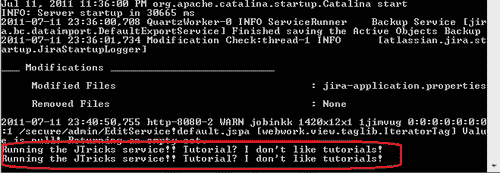

前往 **管理** | **系统** | **服务** 区域，编辑服务并在 **你** **喜欢的** **教程** 字段中输入一个值。假设你输入了 **JTricks** **教程**，你将看到如下输出：

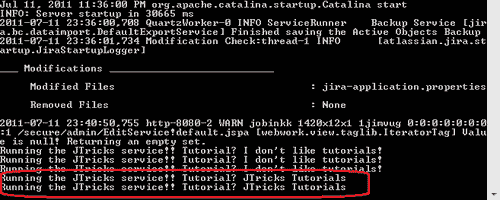

## 参见

+   *编写* *一个* *JIRA* *中的* *服务*

# 在 JIRA 中编写计划任务

你是否曾经想过在 JIRA 中运行计划任务？当我们有了 JIRA 服务时，为什么还需要计划任务？我们在前面的配方中已经看到如何编写一个服务。但尽管我们已经讨论了这些服务的诸多优点，它们也有一个缺点。每次 JIRA 重启时，它都会启动并在之后按规律间隔运行。因此，如果你有一个执行大量内存密集型操作的服务，并且你在一天中的某个时间重启了 JIRA，你会突然发现实例的性能受到影响！如果它被设置为每 24 小时运行一次，你将会发现这个服务从那时起到下次重启前会在白天中运行。

JIRA 中的计划任务是确保所有此类操作在较为空闲的时段进行的好方法，例如在午夜。在本章中，我们将编写一个简单的计划任务，看看它是多么容易！

## 如何实现…

让我们编写一个简单的计划任务，在控制台中打印一行。以下是步骤：

1.  编写一个实现 `Quartz` `job` 接口的 Java 类。JIRA 内部使用 Quartz 来调度任务，因此 Quartz 被捆绑在 JIRA 中。

    ```
    public class JTricksScheduledJob implements Job{
      ...
    }
    ```

1.  实现 `execute` 方法。这个方法每次作业运行时都会被执行。我们在此方法中做的任何事情，可以像一行代码一样简单，也可以像启动核爆一样复杂！我们的计划任务只是打印一行到控制台，因此我们编写的 Java 类如下所示：

    ```
    public void execute(JobExecutionContext context) throws JobExecutionException {
      System.out.println("Running the job at "+(new Date()).toString());
    }
    ```

1.  将类打包成 JAR 文件并部署到 `WEB-INF/lib` 文件夹下。

1.  修改 `WEB-INF/classes` 文件夹中的 `scheduler-config.xml` 文件，以让 JIRA 知道我们的新计划任务。JIRA 将所有关于计划任务的信息存储在此文件中：

    1.  在 `<job>` 标签下定义一个作业，如下所示：

        ```
        <job name="JTricksJob" class="com.jtricks.JTricksScheduledJob" />
        ```

    1.  添加一个触发器来运行`JTricksJob`。在这里，我们定义`cron`表达式来在指定的时间运行任务：

        ```
        <trigger name="JTricksJobTrigger" job="JTricksJob" type="cron">
          <expression>0 0/2 * * * ?</expression><!-- run every 2 minutes -->
        </trigger>
        ```

    1.  上一个触发器将任务安排为每两分钟运行一次。关于编写`cron`表达式的更多详细信息可以参见：[`www.quartz-scheduler.org/docs/tutorial/TutorialLesson06.html`](http://www.quartz-scheduler.org/docs/tutorial/TutorialLesson06.html)。

1.  重启 JIRA。

## 工作原理...

一旦 JIRA 重启，新的任务可以在**管理** | **系统** | **调度器** **详细信息**页面下看到。我们还可以在同一页面验证任务的下一次触发时间，如下图所示：

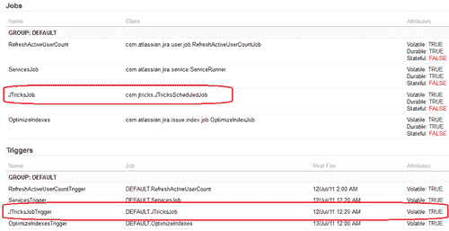

当任务运行时，您将在控制台看到以下内容！

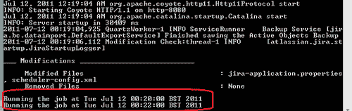

# 在 JIRA 中编写监听器

**监听器**是 JIRA 中非常强大的功能。JIRA 有一个机制，当某些操作发生在问题上时，就会抛出事件，例如创建问题、更新问题、工作流进展等类似事件。通过使用监听器，我们可以捕捉这些事件，并根据我们的需求执行特定的操作。

实现监听器在 JIRA 中有两种不同的方法。旧的方法是扩展`AbstractIssueEventListener`类，该类又实现了`IssueEventListener`接口。`AbstractIssueEventListener`类捕获事件，识别其类型，并将事件委派给适当的方法进行处理。要编写新的监听器，我们需要做的就是扩展`AbstractIssueEventListener`类，并重写我们感兴趣的方法！

新的做法是使用`atlassian-event`库。在这里，我们在插件描述符中注册监听器，并借助`@EventListener`注解实现监听器。

目前，JIRA 支持两种方式，尽管它们各自有优缺点。例如，旧方法可以为监听器添加属性，而新方法不支持添加属性，但新方法不需要任何配置，因为它会自动注册。另一方面，新方法可以作为一个完全成熟的 v2.0 插件来编写。

在本教程中，我们将看到如何使用这两种方法编写监听器。

## 准备工作

使用 Atlassian Plugin SDK 创建一个骨架插件。

## 如何操作...

通过扩展`AbstractIssueEventListener`来编写旧方法中的监听器，如下所示：

1.  创建一个继承`AbstractIssueEventListener`类的监听器类。

    ```
    public class OldEventListener extends AbstractIssueEventListener {
      ...
    }
    ```

1.  定义监听器的属性。这是一个可选步骤，只有当您需要为监听器定义属性时才需要，这些属性可以在执行过程中使用。一个示例是输入邮件服务器的详细信息，如果我们有一个监听器，当事件被触发时，它会使用特定的邮件服务器发送自定义电子邮件。

    1.  重写`getAcceptedParams`方法，返回要定义的属性的字符串数组。

        ```
        @Override
        public String[] getAcceptedParams() {
          return new String[] { "prop 1" };
        }
        ```

    1.  在这里，我们定义了一个名为`prop1`的属性。

    1.  重写`init`方法，并检索用户输入的属性值。

        ```
        @Override
        public void init(Map params) {
          prop1 = (String) params.get("prop 1");
        }
        ```

    1.  每当配置或重新配置监听器时，`init`方法都会被调用。在这里，我们只是检索属性值并将其分配给类变量以供将来使用。

1.  重写适当的监听器方法。例如，可以通过重写`issueCreated`方法来捕获问题创建事件，如下所示。

    ```
    @Override
    public void issueCreated(IssueEvent event) {
      Issue issue = event.getIssue();
      System.out.println("Issue " + issue.getKey() + " has been created and property is:"+prop1);
    }
    ```

    这里，我们只是获取触发事件的问题——在这种情况下是新创建的问题——并打印出相关细节以及监听器属性。我们还可以在此方法中编写更复杂的方法。如果事件涉及更改，例如`issueUpdated`事件或在使用过渡时输入评论时，还可以从事件中获取其他内容，如更改日志详情。

    ### 注意

    请注意，只有少数几个事件可以以这种方式进行监听，有些事件，比如`project` `creation`，根本不会触发事件！在这种情况下，您可能需要扩展相应的操作，并在需要时抛出自定义事件。所有可用事件可以在以下网址找到：[`docs.atlassian.com/jira/latest/com/atlassian/jira/event/issue/IssueEventListener.html`](http://docs.atlassian.com/jira/latest/com/atlassian/jira/event/issue/IssueEventListener.html)。

1.  这里值得提到的一个重要方法是`customEvent`方法，每当触发自定义事件时，该方法都会被调用。这适用于用户配置的所有自定义事件，如下一个例子所述。我们可以按如下方式捕获它们：

    ```
    @Override
    public void customEvent(IssueEvent event) {
      Long eventTypeId = event.getEventTypeId();
      Issue issue = event.getIssue();
      if (eventTypeId.equals(10033L)) {
        System.out.println("Custom Event thrown here for issue:" + issue.getKey()+" and property is:"+prop1);
      }
    }
    ```

    这里，10033 是新事件的 ID。

1.  将类打包成 JAR 文件，并部署到`jira-home/plugins/installed-plugins`文件夹下。

1.  重启 JIRA

1.  通过转到**管理** | **系统** | **监听器**来配置监听器。

    1.  输入名称和完整限定类名，然后点击**添加**。

    1.  编辑监听器，添加属性（如果有的话）！

以新方式创建的监听器，即使用`@EventListener`注解，写法如下：

1.  在`atlassian-plugin.xml`中注册监听器。

    ```
    <component key="eventListener" class="com.jtricks.NewEventListener">
      <description>Class that processes the new JIRA Event</description>
    </component>
    ```

    这里，`class`属性保存的是我们将要编写的监听器类的完整限定名。

1.  使用`component-import`插件模块导入`EventPublisher`组件。

    ```
    <component-import key="eventPublisher" interface="com.atlassian.event.api.EventPublisher"/>
    ```

1.  编写监听器类：

    1.  将`EventPublisher`组件注入类中，并使用`register`方法进行自注册，如下所示：

        ```
        public class NewEventListener {
          public NewEventListener(EventPublisher eventPublisher) {
            eventPublisher.register(this);
          }
        }
        ```

    1.  创建方法来处理事件，使用`@EventListener`，如下代码所示：

        ```
        @EventListener
        public void onIssueEvent(IssueEvent issueEvent) {  
        System.out.println("Capturing event with 
        ID:"+issueEvent.getEventTypeId()+" here");
          ...
        }
        ```

        请注意，该注解可以与类中的任意数量的公共方法一起使用，并且在 JIRA 中触发事件时，所有这些方法都会被调用。

    1.  适当处理事件。

        ```
        @EventListener
        public void onIssueEvent(IssueEvent issueEvent) {  System.out.println("Capturing event with ID:"+issueEvent.getEventTypeId()+" here");
          Long eventTypeId = issueEvent.getEventTypeId();
               Issue issue = issueEvent.getIssue();

          if (eventTypeId.equals(EventType.ISSUE_CREATED_ID)) {
            System.out.println("Issue "+issue.getKey()+" has been created");
                } else if (eventTypeId.equals(10033L)) {
                  System.out.println("Custom Event thrown here for issue:"+issue.getKey());
                }
        }
        ```

    如我们所见，事件 ID 会被检查并适当处理。首先，我们处理了问题创建事件，然后是自定义事件。

1.  打包插件并将其部署到`jira-home/plugins/installed-plugins`文件夹中。

## 工作原理...

在这两种情况下，配置完成后，监听器的工作方式完全相同。请注意，配置仅适用于旧的方式，配置完成后，监听器可以在**管理** | **系统** | **监听器**下看到，如下所示：

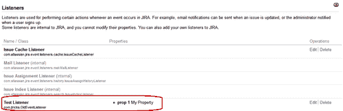

请注意，监听器中配置了属性**prop** **1**。

当事件在 JIRA 中触发时，监听器捕获事件并调用适当的方法。旧的方法会打印问题关键字和属性名称。新方法也以相同的方式工作，唯一不同的是没有属性值。

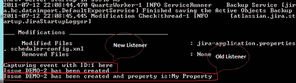

即使是采用新的方式，也可以向监听器添加属性，但这需要一个单独的配置屏幕来捕获和维护这些属性。

## 还有更多...

插件可能会在服务仍然运行时被管理员禁用和重新启用。构造函数在监听器初次加载时会在 JIRA 启动时调用，但我们可能希望单独处理插件的启用或禁用，因为这些操作不会在构造函数中捕获。

### 插件的处理、启用和禁用

Atlassian 插件作为 Spring 动态模块实现，`atlassian-plugin.xml` 在加载之前会被转换为 Spring XML bean 配置。对于监听器，事件监听器将变成 Spring bean，因此我们可以应用 Spring 接口——`InitializingBean` 和 `DisposableBean`——来捕获 bean 的创建和销毁。在我们的案例中，代码修改如下：

```
public class NewEventListenerModified implements InitializingBean, DisposableBean {
  private final EventPublisher eventPublisher;
  public NewEventListenerModified(EventPublisher eventPublisher) {
    this.eventPublisher = eventPublisher;
  }
  @EventListener
  public void onIssueEvent(IssueEvent issueEvent) {
    System.out.println("Capturing event with ID:" + issueEvent.getEventTypeId() + " here");
    Long eventTypeId = issueEvent.getEventTypeId();
    Issue issue = issueEvent.getIssue();
    if (eventTypeId.equals(EventType.ISSUE_CREATED_ID)) {
      System.out.println("Issue " + issue.getKey() + " has been created");
    } else if (eventTypeId.equals(10033L)) {
      System.out.println("Custom Event thrown here for issue:" + issue.getKey());
    }
  }
  public void afterPropertiesSet() throws Exception {
    eventPublisher.register(this);

  public void destroy() throws Exception {
    eventPublisher.unregister(this);
  }
}
```

如您所见，注册和注销分别发生在方法`afterPropertiesSet`和`destroy`事件中。这些方法在 bean 的创建/销毁过程中被调用，从而有效地处理插件的启用/禁用。

别忘了在项目构建路径中添加`spring-beans` JAR，以避免编译问题！另外，也可以在`pom.xml`中添加以下依赖项：

```
<dependency>
            <groupId>org.springframework</groupId>
            <artifactId>spring-beans</artifactId>
            <version>2.5.6</version>
            <scope>provided</scope>
</dependency>
```

# 自定义电子邮件内容

我们已经看到，当某些事情发生时，JIRA 如何触发各种事件，以及我们如何处理这些事件以执行自定义操作。处理这些事件的一种方式是根据 JIRA 中设置的通知方案向用户发送电子邮件通知。但如果我们不喜欢 JIRA 通知的默认内容呢？如果我们只是想更改措辞，甚至修改电子邮件内容呢？

在本示例中，我们将展示如何自定义在 JIRA 中触发事件时发送的电子邮件通知内容。

## 如何实现...

JIRA 有一套使用 Velocity 编写的电子邮件模板，当通知发送时会被渲染。对于每个事件，JIRA 中都有一个配置的模板，当事件触发时会使用该模板。我们可以创建新的模板并编辑事件以使用这些新模板，或者修改现有模板并保持事件不变！

在这两种情况下，步骤基本相似，如下所示：

1.  找到需要更改通知的事件。该事件可以是现有的 JIRA 事件，如`Issue` `Created`和`Issue` `Updated`，也可以是 JIRA 管理员创建的自定义事件。

1.  查找与事件映射的模板。

    对于每个事件，无论是系统事件还是自定义事件，都有一个关联的模板。我们无法更改与系统事件关联的模板。例如，`Issue` `Updated`事件关联的是`Issue` `Updated`模板。然而，我们可以为自己添加的自定义事件选择任何模板。

1.  选择的模板的电子邮件模板映射可以在`atlassian-jira/WEB-INF/classes/email-template-id-mappings.xml`中找到。在该文件中，我们可以找到与每个事件相关的多个模板。例如，`Issue` `Updated`事件有如下条目：

    ```
    <templatemappings>
      ...
      <templatemapping id="2">
        <name>Issue Updated</name>
        <template>issueupdated.vm</template>
        <templatetype>issueevent</templatetype>
      </templatemapping>
      ...
    </templatemappings>
    ```

1.  在这里，如果我们要添加新模板，可以按如下方式添加新的映射：

    ```
    <templatemappings>
      ...
      <templatemapping id="20">
        <name>Demo Event</name>
        <template>demoevent.vm</template>
        <templatetype>issueevent</templatetype>
      </templatemapping>
      ...
    </templatemappings>
    ```

    确保我们在这里使用的`id`在文件中是唯一的。

1.  如果我们要自定义现有模板或添加一个新模板，首先需要在`email-template-id-mappings.xml`文件中找到要编辑的模板，或者按照文件中提到的名称添加新模板。

    电子邮件模板存储在 JIRA 的两个不同位置，一个用于 HTML 邮件，另一个用于文本邮件。它们的模板可以分别在`WEB-INF/classes/templates/email/html`和`WEB-INF/classes/templates/email/text`找到。此外，电子邮件的主题可以在`WEB-INF/classes/templates/email/subject`中找到。

    请注意，模板的名称在所有三个位置都是相同的。在我们的示例中，要编辑的模板名称是`issueupdated.vm`，因此如果我们仅需要修改主题，只需修改`WEB-INF/classes/templates/email/subject/issueupdated.vm`文件。同样，HTML 或文本内容可以分别在`WEB-INF/classes/templates/email/html/issueupdated.vm`或`WEB-INF/classes/templates/email/text/issueupdated.vm`中进行编辑。

    如果我们要添加模板，例如在我们的例子中是`demoevent.vm`，我们需要创建三个模板，每个模板分别用于主题、HTML 正文和文本正文，并将它们放入相应的文件夹中。

1.  编辑完模板后，重新启动 JIRA。

## 它是如何工作的...

在添加新模板并重启 JIRA 后，我们可以将其与我们创建的自定义事件关联。当通知发送时，JIRA 将使用更新或新添加的模板来呈现电子邮件内容。

## 还有更多...

通过编辑相关的 Velocity 模板，您可以在通知电子邮件中添加有关问题的更多信息，如自定义字段。

### 高级自定义——添加自定义字段信息

所有的 VM 模板在 Velocity 上下文中都包含了`$issue`对象，以及其他在以下地址详细说明的变量：[`confluence.atlassian.com/display/JIRADEV/Velocity+Context+for+Email+Templates`](http://confluence.atlassian.com/display/JIRADEV/Velocity+Context+for+Email+Templates)。在生成电子邮件内容时，使用它来检索问题的内容非常容易。

例如，`$issue.summary`将检索问题摘要，您可以在通过`WEB-INF/classes/templates/email/subject/issueupdated.vm`渲染的电子邮件主题中看到它。类似地，其他问题信息也可以轻松访问。例如，自定义字段的详细信息可以通过以下方式访问：

```
$issue.getCustomFieldValue($customFieldManager.getCustomFieldObject("customfield_10010"))
```

这里的`10010`是自定义字段的唯一 ID。

您可以在以下地址查看其他格式化的示例：[`confluence.atlassian.com/display/JIRADEV/Adding+Custom+Fields+to+Email`](http://confluence.atlassian.com/display/JIRADEV/Adding+Custom+Fields+to+Email)。

# 在 Webwork 操作中重定向到不同的页面

本食谱涵盖了 JIRA Web 操作中一个非常简单的概念。在编写插件时，我们经常会遇到需要在执行操作后导航到新页面的场景，例如仪表板、浏览新项目或查看其他问题。`JiraWebActionSupport`提供了一种简单的方法来实现这一点，我们将在本食谱中看到这一点。

## 如何操作...

如果我们希望在执行操作时导航到仪表板，而不是渲染成功视图该怎么办？如果我们无法直接从 JSP 页面或 Velocity 模板中链接它，因为我们想在重定向之前在操作类中执行某些操作该怎么办？

您需要做的就是在操作类的`doExecute`方法（或适当的方法）中返回`getRedirect(URL)`！当操作方法成功完成时，这个方法会重定向到指定位置。如果出现任何错误，它将跳转到错误页面，因为`getRedirect()`方法在这种情况下返回`Action.ERROR`。

即使存在错误，您也可以通过使用`forceRedirect(URL)`方法而不是`getRedirect()`方法强制重定向到指定 URL。它不会清除返回的 URL，始终会跳转到重定向 URL。

例如，如果我们在成功时需要返回到仪表板，我们可以这样做：

```
@Override
protected String doExecute() throws Exception {
  System.out.println("Action invoked. Doing something important before redirecting to Dashboard!");
  return getRedirect("/secure/Dashboard.jspa");
}
```

将`getRedirect`替换为`forceRedirect`将使用户无论结果如何都跳转到仪表板。

# 为用户详情添加自定义行为

在 JIRA 中，您可以看到用户详情是通过全名和指向用户在应用程序中个人资料的链接来格式化的。例如，当问题在问题导航器中显示时，指派人和报告人会显示如下：

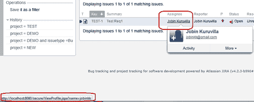

但是，如果我们想改变用户详细信息的显示方式呢？比如，如果我们想展示用户头像？或者，如果我们想通过外部链接展示他们的用户名，例如指向他们 Twitter 个人资料的链接？

JIRA 提供了用户格式插件模块来实现此目的。使用此模块，我们可以定义不同的格式，在这些格式中，用户将以特定的方式显示，并可在现有的 JIRA 展示或我们自定义的插件中使用它们。

## 准备工作

使用 Atlassian 插件 SDK 创建一个骨架插件。

## 如何实现...

在本教程中，让我们尝试创建一个新的用户配置文件，将显示用户名（而不是全名）并提供指向他们 Twitter 个人资料的链接，增加一些趣味！以下是实现步骤：

1.  将用户配置文件模块添加到`atlassian-plugin.xml`：

    ```
    <user-format key="twitter-format" name="Twitter User Format" class="com.jtricks.TwitterUserFormat" system="true">
      <description>User name linking to twitter</description>   <type>twitterLink</type>
      <resource type="velocity" name="view" location="templates/twitterLink.vm"/>
    </user-format>
    ```

    与其他插件模块一样，用户配置文件模块也有一个唯一的**key**。然后，它指向将由用户格式化程序使用的**class**，在此情况下是`TwitterUserFormat`。

    `type`元素包含将在格式化用户时使用的唯一配置文件类型名称。以下是 JIRA 4.4 版本中默认存在的类型：`profileLink`、`fullName`、`profileLinkSearcher`、`profileLinkExternal`、`profileLinkActionHeader`、`fullProfile`。

    `resource`元素指向用于渲染视图的 velocity 模板，在此情况下是`twitterLink.vm`。

1.  在上一步中创建格式化器类。该类应实现`UserFormat`接口。

    ```
    public class TwitterUserFormat implements UserFormat {
      private final UserFormatModuleDescriptor moduleDescriptor;

      public TwitterUserFormat(UserFormatModuleDescriptor moduleDescriptor){
        this.moduleDescriptor = moduleDescriptor;
      }
    }
    ```

    在这里，我们将`UserFormatModuleDescriptor`注入类中，因为它将在渲染 velocity 模板时使用，正如下一步所示。

1.  实现所需的方法。我们需要实现两个重写的**format**方法。

    第一个方法接受`username`和`id`，其中`username`是用户的名字，它也可以是*null*，而`id`是一个额外的参数，可以用来向渲染器传递额外的上下文。理想情况下，某个实现可能会在渲染的输出中包含该 ID，以便可以用于测试断言。ID 的使用示例如显示分配人（`/WEB-INF/classes/templates/jira/issue/field/assignee-columnview.vm`）中，ID 是分配人。

    我们在示例中不使用 ID，但该方法实现如下：

    ```
    public String format(String username, String id) {
      final Map<String, Object> params = getInitialParams(username, id);
      return moduleDescriptor.getHtml(VIEW_TEMPLATE, params);
    }
    ```

    `getInitialParams`仅用用户名填充`params`映射，如下所示：

    ```
    private Map<String, Object> getInitialParams(final String username, final String id) {
      final Map<String, Object> params = MapBuilder.<String, Object> newBuilder().add("username", username).toMutableMap();
      return params;
    }
    ```

    如果我们希望以其他方式渲染用户详细信息，我们可以根据需要在映射中填充任意数量的内容！

    第二个方法接受`username`、`id`和一个预先填充了额外值的`map`，用于向上下文添加更多内容！该方法实现如下：

    ```
    public String format(String username, String id, Map<String, Object> params) {  
      final Map<String, Object> velocityParams = 
      getInitialParams(username, id);  
      velocityParams.putAll(params);
      return moduleDescriptor.getHtml(VIEW_TEMPLATE, velocityParams);
    }
    ```

    唯一的区别是，额外的上下文也被填充到`params`映射中。

    在这两种情况下，`moduleDescriptor`将渲染 velocity 模板，该模板由`VIEW_TEMPLATE`或“view”名称定义。

1.  编写 velocity 模板，使用上一步中 `params` 映射中填充的上下文来显示用户信息：

    ```
    #if ($username)
      #set ($quote = '"')
      #set($author = "<a id=${quote}${textutils.htmlEncode($username)}${quote} href=${quote}http://twitter.com/#!/${username}${quote}>$textutils.htmlEncode($username)</a>")
    #else
        #set($author = $i18n.getText('common.words.anonymous'))
    #end
    ${author}
    ```

    在我们的示例中，我们只显示用户名，并提供一个链接 `http://twitter.com/#!/${username}`，该链接指向拥有该用户名的 Twitter 账户。注意，`quote` 变量在单引号内赋值为双引号。单引号是 velocity 语法，而双引号是值。它用于构建 URL，其中编码的名称、href 值等都放在引号之间！

    别忘了处理用户为 null 的情况。在我们的示例中，当用户为 null 时，我们只显示“匿名”作为名称。

1.  打包插件并部署。

## 工作原理...

插件部署后，新的用户资料（在此例中为 `twitterLink`）可以在 JIRA 中的各个适当位置使用。例如，`assignee-columnview.vm` 可以修改为包含 `twitterLink` 资料，而不是默认的 `profileLink`，如下所示：

```
#if($assigneeUsername)
    #if ($displayParams && $displayParams.nolink)
        $userformat.formatUser($assigneeUsername, 'fullName', 'assignee')
    #else
        <span class="tinylink">$userformat.formatUser($assigneeUsername, 'twitterLink', 'assignee')</span>
    #end
#else
    <em>$i18n.getText('common.concepts.unassigned')</em>
#end
```

当你这样做时，问题导航器中的指派人列将显示如下，并包含指向用户 Twitter 账户的链接：

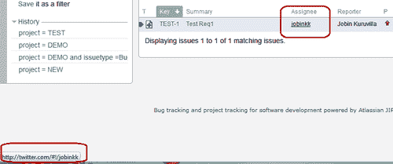

我们还可以在插件中使用新的资料，通过调用 `formatUser` 来呈现用户详细信息，如下所示：

```
$userformat.formatUser($username, 'twitterLink', 'some_id')
```

或：

```
$userformat.formatUser($username, 'twitterLink', 'some_id', $someMapWithExtraContext)
```

# 在 JIRA 中部署 servlet

我们都知道 servlet 有多么有用！JIRA 提供了一种简便的方式，通过 Servlet 插件模块来部署 JAVA servlet。在本教程中，我们将看到如何编写一个简单的 servlet 并在 JIRA 中访问它。

## 准备工作

使用 Atlassian Plugin SDK 创建一个插件骨架。

## 如何做...

以下是在 JIRA 中部署 JAVA servlet 的步骤：

1.  将 servlet 插件模块包含在 `atlassian-plugin.xml` 中。Servlet 插件模块支持以下一组属性：

    1.  `class`: 它是 servlet 的 Java 类，必须是 `javax.servlet.http.HttpServlet` 的子类。此属性是必需的。

    1.  `disabled`: 它表示插件模块是否默认禁用或启用。默认情况下，模块是启用的。

    1.  `i18n-name-key`: 插件模块人类可读名称的本地化键。

    1.  `key`: 它表示插件模块的唯一键。此属性是必需的。

    1.  `name`: 它是 servlet 的人类可读名称。

    1.  `system`: 它表示该插件模块是否为系统插件模块。仅适用于非 OSGi 插件。

    以下是支持的子元素：

    1.  `description`: 插件模块的描述。

    1.  `init-param`: servlet 的初始化参数，通过 `param-name` 和 `param-value` 子元素指定，方式与 `web.xml` 相同。此元素及其子元素可以重复。

    1.  `resource`: 此插件模块的资源。该元素可以重复。

    1.  `url-pattern`: 要匹配的 URL 模式。此元素是必需的，并且可以重复。

    在我们的示例中，我们只使用必填字段和一些示例的 init-`params`，如下所示：

    ```
    <servlet name="Test Servlet" key="jtricksServlet" class="com.jtricks.JTricksServlet">
        <description>Test Servlet</description>
        <url-pattern>/myWebsite</url-pattern>
        <init-param>
            <param-name>siteName</param-name>
            <param-value>Atlassian</param-value>
        </init-param>
        <init-param>
            <param-name>siteAddress</param-name>
            <param-value>http://www.atlassian.com/</param-value>
        </init-param>
    </servlet>
    ```

    这里 `JTricksServlet` 是 servlet 类，而 `/myWebsite` 是 URL 模式。我们还传递了一些 `init` 参数：`siteName` 和 `siteAddress`。

1.  创建一个 `servlet` 类。该类必须继承 `javax.servlet.http.HttpServlet`。

    ```
    public class JTricksServlet extends HttpServlet {
      ...
    }
    ```

1.  实现必要的方法：

    1.  我们可以在 `init` 方法中检索 `init` 参数，如下所示：

        ```
        @Override
        public void init(ServletConfig config) throws ServletException {
          super.init(config);
          authenticationContext = ComponentManager.getInstance().getJiraAuthenticationContext();  siteName = config.getInitParameter("siteName");
          siteAddress = config.getInitParameter("siteAddress");
        }
        ```

        每次初始化 servlet 时都会调用 `init()` 方法，这发生在 servlet 第一次被访问时。当插件模块被禁用并重新启用时，`init()` 方法也会在 servlet 第一次被访问时被调用。

        如您所见，我们在 servlet 插件模块中定义的 `init` 参数可以从 `ServletConfig` 中访问。此处，我们还初始化了 `JiraAuthenticationContext`，以便可以用它在 servlet 中检索当前登录用户的详细信息。类似地，我们也可以在这里初始化任何 JIRA 组件。

    1.  实现 `doGet()` 和/或 `doPost()` 方法，执行所需的功能。对于本示例，我们将仅使用 `init` 参数创建一个简单的 HTML 页面，并将一行输出到控制台。

        ```
        @Override
        protected void doGet(HttpServletRequest req, HttpServletResponse resp) throws ServletException, IOException {  
          resp.setContentType("text/html");
          PrintWriter out = resp.getWriter();

          User user = authenticationContext.getUser();  out.println("Welcome " + (user != null ? user.getFullName() : "Anonymous"));
          out.println("<br>Invoking the servlet...");
          out.println("<br>My Website : <a href=\"" + siteAddress + "\">" + siteName + "</a>");

          doSomething();

          out.println("<br>Done!");
        }

        private void doSomething() {
          System.out.println("Invoked servlet at " + (new Date()));
        }
        ```

        `authenticationContext` 如前所述检索当前用户名。从 JIRA 4.3 开始，`getLoggedInUser()` 方法用于检索当前用户，`getDisplayName()` 获取用户的全名。

1.  打包插件并部署。

## 如何工作...

一旦部署，servlet 将可以通过以下 URL 访问：`http://yourserver/jira/plugins/servlet/${urlPattern}`。在我们的例子中，URL 是 `http://yourserver/jira/plugins/servlet/myWebsite`。

当 servlet 在 `/plugins/servlet/myWebsite` 被访问时，输出如以下截图所示：

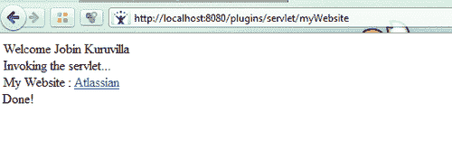

# 向 Servlet 上下文添加共享参数

在上一个示例中，我们展示了如何部署一个 servlet 并如何使用 `init` 参数。如果我们有一组 servlets、servlet filters 或 context listeners 使用相同的参数，是否真的需要在所有插件模块中初始化它们？

在这个示例中，我们将展示如何使用 Servlet 上下文参数插件模块在多个 servlets、filters 和 listeners 之间共享参数。

## 准备工作

使用 Atlassian 插件 SDK 创建一个骨架插件。

## 操作步骤...

我们需要做的就是定义共享参数，为每个共享参数在 `atlassian-plugin.xml` 中添加一个 `servlet-context-param` 模块。

例如，可以如下定义一个键为 `sharedText` 的参数：

```
<servlet-context-param key="jtricksContext">
  <description>Shares this param!</description>
  <param-name>sharedText</param-name>
  <param-value>This is a shared Text</param-value>
</servlet-context-param> 
```

确保模块具有唯一的键。这里，参数名称是 `sharedText`，其值为 **This** **is** **a** **shared** **Text**。一旦插件被打包并部署，参数 **sharedText** 将在 servlets、filters 和 listeners 之间共享。

在 servlet 中，我们可以在 `init` 方法中如下访问该参数：

```
@Override
public void init(ServletConfig config) throws ServletException {
  super.init(config);
  String sharedText = config.getServletContext().getInitParameter("sharedText");
}
```

## 如何工作...

一旦获取到共享文本，我们可以在任何地方使用它，比如在构建 HTML 时。

```
out.println("<br>Shared Text:"+sharedText);
```

现在，servlet 也将打印出来，如下图所示：

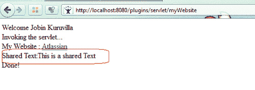

# 编写 Servlet 上下文监听器

我们已经了解了如何编写 servlets。那么，如何为相同的应用编写一个上下文监听器呢？如果你想与使用上下文监听器进行初始化的框架集成，这会非常有用。

## 准备就绪

使用 Atlassian Plugin SDK 创建一个骨架插件。

## 如何实现...

以下是编写简单上下文监听器的步骤：

1.  在 `atlassian-plugin.xml` 中包含 `servlet-context-listener` 模块。

    ```
    <servlet-context-listener name="Test Servlet Listener" key="jtricksServletListener" class="com.jtricks.JTricksServletListener">
      <description>Listener for Test Servlet</description>
    </servlet-context-listener>
    ```

    在这里，我们有一个独特的模块键和一个类，该类是 servlet 上下文监听器的 Java 类。

1.  编写 servlet 上下文监听器的类。该类必须实现 `javax.servlet.ServletContextListener`：

    ```
    public class JTricksServletListener implements ServletContextListener{	  ...
    }
    ```

1.  根据需要实现上下文监听器方法。例如，我们只是将一些语句打印到控制台：

    ```
    public void contextDestroyed(ServletContextEvent event) {  System.out.println("Test Servlet Context is destroyed!");
    }

    public void contextInitialized(ServletContextEvent event) {  System.out.println("Test Servlet Context is initialized!");
    }
    ```

    可以从 `ServletContextEvent` 对象中找到已初始化或销毁的上下文的详细信息。

1.  打包插件并部署。

## 它是如何工作的...

`contextInitialized` 方法不会在应用程序启动时调用。相反，每次启用插件后，只有当访问插件中的 servlet 或过滤器时，它才会第一次被调用。

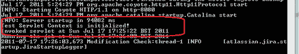

类似地，`contextDestroyed` 方法会在每次禁用包含 servlet 或过滤器的插件模块时被调用。

# 使用过滤器拦截 JIRA 查询

Servlet 过滤器提供了一个强大的机制，可以拦截查询并执行一些智能操作，如分析、监控、内容生成等。它的工作原理与任何正常的 Java servlet 过滤器一样，JIRA 提供了 **Servlet** **Filter** **Plugin** **Module** 来通过插件添加它们。在这个教程中，我们将学习如何使用过滤器拦截某些 JIRA 查询以及如何利用它们！

与其他 servlet 插件模块一样，`servlet-filter` `plugin` 模块也有一个唯一的 `key` 和一个与之关联的 `class`。`name` 属性保存过滤器的可读名称，`weight` 指示过滤器在过滤器链中的顺序。权重越高，过滤器的位置越低。

另一个重要的属性是 `location`，它表示过滤器在应用程序过滤器链中的位置。以下是位置的四个可能值：

+   `after-encoding`：在应用程序中过滤器链的最顶部，但在任何确保请求完整性的过滤器之后。

+   `before-login`：在进行用户登录的过滤器之前。

+   `before-decoration`：在进行 Sitemesh 装饰响应的过滤器之前。

+   `before-dispatch`：在过滤器链的末端，在任何默认处理请求的 servlet 或过滤器之前。

`weight` 属性与 `location` 一起使用。如果两个过滤器具有相同的位置，则根据 `weight` 属性的值对它们进行排序。

`init-param`像往常一样用于接收过滤器的初始化参数。

`url-pattern`定义了匹配的 URL 模式。此元素可以重复，过滤器将对所有与指定模式匹配的 URL 进行调用。与 servlet URL 不同，`url-pattern`在此处匹配`${baseUrl}/${url-pattern}`。该模式可以使用通配符`*`或`?`，前者匹配零个或多个字符，包括目录斜杠，后者匹配零个或一个字符。

`dispatcher`是另一个确定何时调用过滤器的元素。你可以包含多个调度程序元素，值为`REQUEST`、`INCLUDE`、`FORWARD`或`ERROR`。如果没有指定，过滤器将在所有情况下调用。

## 准备工作

使用 Atlassian 插件 SDK 创建一个骨架插件。

## 如何操作...

让我们尝试拦截所有问题视图，其 URL 格式为`${baseUrl}/browse/*-*`并记录它们。以下是编写过滤器并实现给定逻辑的逐步过程。

1.  将**Servlet** **Filter**插件模块添加到`atlassian-plugin.xml`中。

    ```
    <servlet-filter name="Browse Issue Filter" key="jtricksServletFilter" class="com.jtricks.JTricksServletFilter" location="before-dispatch" weight="200">
            <description>Filter for Browse Issue</description>
            <url-pattern>/browse/*-*</url-pattern>
            <init-param>
                <param-name>filterName</param-name>
                <param-value>JTricks Filter</param-value>
            </init-param>
    </servlet-filter>
    ```

    这里`JTricksServletFilter`是过滤器类，我们在分发之前添加了该过滤器。在我们的示例中，`url-pattern`将是`/browse/*-*`，因为浏览问题的 URL 是`${baseUrl}/browse/*-*`格式。我们可以根据需要在我们的上下文中使用不同的 URL 模式。

1.  创建`Filter`类。该类应实现`javax.servlet.Filter`：

    ```
    public class JTricksServletFilter implements Filter {
      ...
    }
    ```

1.  实现适当的过滤器方法：

    ```
    public void destroy() {
      System.out.println("Filter destroyed!");
    }

    public void doFilter(ServletRequest req, ServletResponse res, FilterChain chain) throws IOException, ServletException {
      HttpServletRequest request = (HttpServletRequest) req;

      // Get the IP address of client machine.
      String ipAddress = request.getRemoteAddr();

      // Log the user details, IP address , current timestamp and URL.  
    System.out.println("Intercepted in filter, request by user:" + authenticationContext.getUser().getFullName()  + " from IP " + ipAddress + " at " + new Date().toString() + ". Accessed URL:"+request.getRequestURI());

      chain.doFilter(req, res);
    }

    public void init(FilterConfig config) throws ServletException {  System.out.println("Initiating the filter:"+config.getInitParameter("filterName"));
      authenticationContext = ComponentManager.getInstance().getJiraAuthenticationContext();
    }
    ```

    这里，`init`方法在初始化过滤器时调用，即插件启用后第一次访问时。在此方法中，我们可以检索定义的`init-param`实例或通过 Servlet Context Parameter 插件模块定义的参数。在之前的代码片段中，使用`getLoggedInUser()`来检索 JIRA 4.3+中的已登录用户，并使用`getDisplayName()`来检索该用户的全名。

    `destroy`方法在每次销毁过滤器时调用。

    `doFilter`是每次 URL 与`url-pattern`匹配时调用的方法。在这里，我们只是打印请求**查看问题**页面的 IP 地址和用户详细信息，并记录时间，但我们可以做很多事情，比如记录日志、使用数据进行分析或监控等等。

1.  打包插件并部署。

## 工作原理...

每当 JIRA 中的 URL 与`url-pattern`匹配时，相关过滤器会被调用。当你希望在 JIRA 执行特定操作时做一些特定的事情，或者想要监控谁在做什么以及何时做某事，或者基于特定 URL 执行其他操作时，这将非常有帮助。

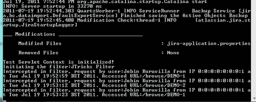

在我们的示例代码中，每当查看问题时，都会打印详细信息，如前面的截图所示。

# 在 JIRA 中添加和导入组件

JIRA 有一个组件系统，包含许多注册在 PicoContainer 中的服务类和管理类，它们可以被核心类和插件使用。有时候，将自定义组件添加到这个组件系统中是有意义的，这样可以在同一个插件中的其他模块中使用，或者与其他插件共享。

在本食谱中，我们将看到如何在 JIRA 中添加一个新组件，以及如何在插件内和从单独插件中使用它。

## 准备工作

使用 Atlassian 插件 SDK 创建一个骨架插件。对于本示例，我们将使用在之前食谱中使用的`RedirectAction` webwork 模块。

## 如何操作...

首先，让我们看看如何定义一个组件并在同一个插件中的不同模块中使用它。在我们的示例中，我们将定义一个示例组件，并在`RedirectAction`中使用它暴露的方法。以下是步骤：

1.  创建一个具有所需方法定义的接口。组件在其他地方使用时将暴露这些方法：

    ```
    package com.jtricks.provider;

    public interface MyComponent {
      public void doSomething();
    }
    ```

1.  创建实现类并实现方法。

    ```
    public class MyComponentImpl implements MyComponent{  
      private final JiraAuthenticationContext authenticationContext;

      public MyComponentImpl(JiraAuthenticationContext authenticationContext) {
        this.authenticationContext = authenticationContext;
      }

      public void doSomething() {
        System.out.println("Hey "+authenticationContext.getUser().getFullName()+",  Sample method to check Components");
      }
    }
    ```

    在实现类中，我们可以像往常一样注入 JIRA 组件，并将其用于各种操作。在这里，我们注入`JiraAuthenticationContext`来获取当前用户的详细信息，仅仅为了打印一条个性化消息！

1.  使用组件插件模块在`atlassian-plugin.xml`文件中声明该组件。

    ```
    <component key="myComponent" name="My Component" class="com.jtricks.provider.MyComponentImpl">  
      <interface>com.jtricks.provider.MyComponent</interface>
    </component>
    ```

    在这里，组件模块有一个唯一的键和一个指向实现类的类属性。元素接口指向我们在*步骤* *1*中创建的组件接口。

我们的组件现在已经准备好，并可以在其他插件模块中使用。例如，我们可以像之前看到的那样，在`RedirectAction`类中使用这个组件，具体如下：

```
public class RedirectAction extends JiraWebActionSupport {
  private final MyComponent myComponent;

  public RedirectAction(MyComponent myComponent) {
    this.myComponent = myComponent;
  }

  @Override
  protected String doExecute() throws Exception {
    System.out.println("Execute the method in component!");
    this.myComponent.doSomething();
    System.out.println("Succesfully executed. Go to dashboard");
    return getRedirect("/secure/Dashboard.jspa");
  }
}
```

在这里，组件通过构造函数注入，就像我们通常对待 JIRA 组件一样（记住组件本身中的`JiraAuthenticationContext`！），并在适当的地方调用暴露的方法，在此示例中是`doSomething`。

### **将组件暴露给其他插件**

当我们像之前讨论的那样创建组件时，它们保持私有，仅在插件内可用，尽管我们可以将这些组件暴露给其他插件。

以下是暴露组件所需的两个步骤：

1.  将组件声明为公共组件。

1.  导出插件所需的包，以便它们可以被其他插件使用。

以下是详细步骤：

1.  像之前一样创建接口和实现类。

1.  使用组件插件模块在`atlassian-plugin.xml`中声明该组件为公共组件。为此，我们在组件模块中使用`public`属性，如下所示：

    ```
    <component key="myComponent" name="My Component" class="com.jtricks.provider.MyComponentImpl" public="true">
      <interface>com.jtricks.provider.MyComponent</interface>
    </component>
    ```

使用`atlassian-plugin.xml`中`plugin-info`下的`bundle-instructions`元素导出包。操作如下：

```
<plugin-info>
  <description>Adding and importing components to JIRA</description>  <version>2.0</version>
  <vendor name="JTricks" url="http://www.j-tricks.com/" />
  <bundle-instructions>
    <Export-Package>com.jtricks.provider</Export-Package>
  </bundle-instructions>
</plugin-info>
```

请注意，`Export-Package` 元素导出了 `com.jtricks.provider` 包，该包包含接口和实现类。有关捆绑包指令的更多信息，请参见：[`confluence.atlassian.com/display/PLUGINFRAMEWORK/Creating+your+Plugin+Descriptor#CreatingyourPluginDescriptor-{{bundleinstructions}}element`](http://confluence.atlassian.com/display/PLUGINFRAMEWORK/Creating+your+Plugin+Descriptor#CreatingyourPluginDescriptor-{{bundleinstructions}}element)。

这样，组件现在已经准备好并可供其他插件使用。

### 导入公共组件

为了在其他插件中使用公共组件，我们需要首先使用 `component-import` 插件模块导入它们。该模块在 `atlassian-plugin.xml` 中的配置如下：

```
<component-import key="myComponent">         <interface>com.jtricks.provider.MyComponent</interface></component-import>
```

现在，组件就像是在插件内部创建的一样可用。如果我们希望在新插件中使用该组件，`RedirectAction` 类也将与原插件中的完全相同。

### 在组件中使用服务属性

也可以为公共组件定义一个属性映射表，然后在与其他插件一起导入组件时使用。它使用 `service-properties` 元素来定义这些属性，该元素包含名为 entry 的子元素，并具有 key 和 value 属性。例如，字典服务可以定义带有语言作为键的服务属性，如以下代码片段所示：

```
<component key="dictionaryService" class="com.myapp.DefaultDictionaryService" interface="com.myapp.DictionaryService">
    <description>Provides a dictionary service.</description>
    <service-properties>
        <entry key="language" value="English" />
    </service-properties>
</component>
```

现在可以在 `component-import` 模块上使用 `filter` 属性，只在服务匹配过滤器时导入组件。例如，具有英语语言的字典服务可以如下导入：

```
<component-import key="dictionaryService" interface="com.myapp.DictionaryService"  filter="(language=English)" />
```

## 它是如何工作的...

当一个组件被安装时，它会生成 `atlassian-plugins-spring.xml` Spring 框架配置文件，将组件插件模块转换为 Spring bean 定义。生成的文件存储在临时插件 JAR 文件中并安装到框架中。如果将 `public` 属性设置为 'true'，该组件将在后台转化为 OSGi 服务，使用 **Spring** **Dynamic** 模块来管理其生命周期。

组件导入还会生成 `atlassian-plugins-spring.xml` Spring 框架配置文件，并使用 Spring 动态模块将导入的插件模块转换为 OSGi 服务引用。导入的组件将其 bean 名称设置为组件导入键。

在这两种情况下，都可以编写自己的 Spring 配置文件，并将其存储在插件 JAR 文件中的 META-INF/spring 文件夹下。

### 注意

有关组件插件模块和组件导入插件模块的更多详细信息，请参阅 Atlassian 文档：[`confluence.atlassian.com/display/PLUGINFRAMEWORK/Component+Plugin+Module`](http://confluence.atlassian.com/display/PLUGINFRAMEWORK/Component+Plugin+Module) 和 [`confluence.atlassian.com/display/JIRADEV/Component+Import+Plugin+Module`](http://confluence.atlassian.com/display/JIRADEV/Component+Import+Plugin+Module)。

# 向 JIRA 添加新模块类型

到目前为止，我们在 JIRA 中看到过许多有用的插件模块类型。自定义字段模块类型、webwork 模块类型、servlet 模块类型等等。那么，是否可以在 JIRA 中添加一个自定义模块类型，以便之后用于创建不同的模块呢？

JIRA 提供了模块类型插件模块，利用它我们可以动态地向插件框架添加新的模块类型。在本教程中，我们将看到如何添加这种新的插件模块类型并使用它来创建该类型的不同模块。

## 准备工作

使用 Atlassian 插件 SDK 创建一个骨架插件。

## 如何操作...

让我们考虑 Atlassian 在其在线文档中使用的相同示例，即创建一个新的字典插件模块，然后可以使用该模块为其他插件或模块提供字典服务。

以下是定义新插件模块类型的步骤：

1.  在`atlassin-plugin.xml`文件中添加模块类型定义。

    ```
    <module-type key="dictionary" class="com.jtricks.DictionaryModuleDescriptor" />
    ```

    在这里，键必须是唯一的，并将在定义该类型模块时作为根元素。该类指向`ModuleDescriptor`类，当找到这种类型的新插件模块时，该类会被实例化。

    该模块类型的其他有用属性包括`name`，它保存一个易于理解的名称，`i18n-name-key`用于保存易于理解名称的本地化键，`disabled`指示插件模块是否默认禁用，`system`指示该插件模块是否为系统插件模块（仅适用于非 OSGi）。你还可以有一个可选的`description`作为子元素。

1.  创建一个可以在`ModuleDescriptor`类中使用的接口。这个接口将包含新模块所需的所有方法。例如，在字典中，我们需要一个方法来检索给定文本的定义，因此我们可以将接口定义如下：

    ```
    public interface Dictionary {
      String getDefinition(String text);
    }
    ```

    这种特定类型的新模块最终将实现此接口。

1.  创建模块描述符类。该类必须继承`AbstractModuleDescriptor`类，并且应该使用我们创建的接口作为泛型类型。

    ```
    public class DictionaryModuleDescriptor extends AbstractModuleDescriptor<Dictionary> {
      ...
    }
    ```

1.  实现`getModule`方法以创建模块。

    ```
    public class DictionaryModuleDescriptor extends AbstractModuleDescriptor<Dictionary> {
      public DictionaryModuleDescriptor(ModuleFactory moduleFactory) {
        super(moduleFactory);
      }

      public Dictionary getModule() {
        return moduleFactory.createModule(moduleClassName, this);
      }
    }
    ```

    在这里，我们使用`ModuleFactory`来创建这种类型的模块。

1.  定义将在新模块类型中使用的属性和元素，并在`init`方法中检索它们。对于字典，我们至少需要一个属性，即`language`，以区分各种字典模块。让我们将该属性命名为`lang`并在`init`方法中检索它。现在，该类将类似于以下代码块：

    ```
    public class DictionaryModuleDescriptor extends AbstractModuleDescriptor<Dictionary> {
      private String language;

      public DictionaryModuleDescriptor(ModuleFactory moduleFactory) {
        super(moduleFactory);
      }

      @Override
      public void init(Plugin plugin, Element element) throws PluginParseException {
        super.init(plugin, element);
        language = element.attributeValue("lang");
      }

      public Dictionary getModule() {
        return moduleFactory.createModule(moduleClassName, this);
      }

      public String getLanguage() {
        return language;
      }
    }
    ```

    `init`方法以`com.atlassian.plugin.Plugin`和`org.dom4j.Element`作为参数，后者保存模块元素。在这里，我们已经检索到了'lang'属性，并将其赋值给一个局部变量，该变量有一个 getter 方法，可以在其他插件/模块中使用来获取语言值。

    我们可以根据新模块类型的要求添加更多属性或子元素。

1.  有了这个，新的插件模块现在已经准备好了。我们现在可以编写新的字典类型的模块。

### 使用新模块类型创建模块

新的模块类型将简单到以下程度：

```
<dictionary key="myUSEnglishDictionary" lang="us-english" class="com.jtricks.dictionary.USDictionary" />
<dictionary key="myUKEnglishDictionary" lang="uk-english" class="com.jtricks.dictionary.UKDictionary" />
```

请注意，根元素与模块类型的键相同，在这种情况下是**dictionary**。每个都有其自己独特的`key`，并具有我们之前定义的`lang`属性。每个都有一个类，该类将适当地实现 Dictionary 接口。例如：

```
public class USDictionary implements Dictionary {
  public String getDefinition(String text) {
    if (text.equals("JIRA")){
      return "JIRA in San Fransisco!";
    } else {
     return "What are you asking? We in US don't know anything other than JIRA!!";
    }
  }
}

public class UKDictionary implements Dictionary {
  public String getDefinition(String text) {
    if (text.equals("JIRA")){
      return "JIRA in London!";
    } else {
      return "What are you asking? We in UK don't know anything other than JIRA!!";
    }
  }
}
```

### 使用创建的新模块

一旦定义了新模块，例如我们的`myUSEnglishDictionary`和`myUKEnglishDictionary`，我们可以在其他插件模块中使用它们。例如，如果我们想要在 servlet 模块中使用它们来查找 JIRA 的定义，可以按照以下步骤操作：

1.  获取所有使用字典模块描述符的已启用模块。

    ```
    List<DictionaryModuleDescriptor> dictionaryModuleDescriptors = pluginAccessor.getEnabledModuleDescriptorsByClass(DictionaryModuleDescriptor.class);
    ```

    在这里，`pluginAccessor`可以按以下方式检索：

    ```
    PluginAccessor pluginAccessor = ComponentManager.getInstance().getPluginAccessor();
    ```

    它也可以用来检索所有使用给定模块描述符类的启用模块，如下所示。

1.  对于每个`DictionaryModuleDescriptor`，`getLanguage()`方法将检索`lang`属性的值，而`getModule()`将检索相应的 Dictionary 实现类。例如，可以按如下方式检索`uk-english`的 JIRA 定义：

    ```
    private String getJIRADescription(String key) {
      // To get all the enabled modules of this module descriptor  List<DictionaryModuleDescriptor> dictionaryModuleDescriptors = pluginAccessor.getEnabledModuleDescriptorsByClass(DictionaryModuleDescriptor.class);
      for (DictionaryModuleDescriptor dictionaryModuleDescriptor : dictionaryModuleDescriptors){
        if (dictionaryModuleDescriptor.getLanguage().equals(key)){
          return dictionaryModuleDescriptor.getModule().getDefinition("JIRA");
        }
      }
      return "Not Found";
    }
    ```

    在这里，传递的关键是`uk-english`。

## 它是如何工作的...

如果我们使用一个 servlet 来显示在所有部署的字典中查找 JIRA 单词的所有定义，我们的例子中包括 US 和 UK，结果将如下所示：

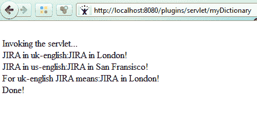

# 在 JIRA 中启用访问日志

访问日志是查找 JIRA 实例中谁在做什么的好方法。在这个示例中，我们将看到如何在 JIRA 中打开访问日志记录。

## 如何做到这一点...

自 JIRA 4.1 以来，可以在**管理** | **系统** | **用户** **会话**菜单中找到当前访问 JIRA 的用户列表。但是，如果您需要关于谁在做什么的更详细信息，则可以使用访问日志记录。

在 JIRA 4.x 中，可以通过转到**管理** | **系统** | **日志记录** **与** **分析**来启用访问日志记录，如下面的截图所示：

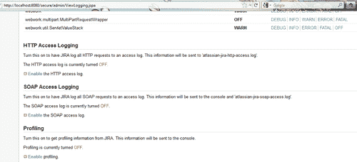

我们可以分别打开**HTTP**和**SOAP**访问日志，如下所示。还有一个额外的选项可以打开 HTTP dump 日志和 SOAP dump 日志。对于 HTTP，我们还可以在 HTTP 访问日志中包含图片。

所有这些日志默认情况下都是禁用的，如果通过 GUI 启用，将在下次重启时禁用。

为了永久启用它们，我们可以在位于 `WEB-INF/classes` 文件夹下的 `log4j.properties` 文件中，在下一节 **Access** **logs** 中打开它们，如下所示：

```
log4j.logger.com.atlassian.jira.soap.axis.JiraAxisSoapLog  = ON, soapaccesslog
log4j.additivity.com.atlassian.jira.soap.axis.JiraAxisSoapLog = false
log4j.logger.com.atlassian.jira.soap.axis.JiraAxisSoapLogDump  = ON, soapdumplog
log4j.additivity.com.atlassian.jira.soap.axis.JiraAxisSoapLogDump = false
log4j.logger.com.atlassian.jira.web.filters.accesslog.AccessLogFilter = ON, httpaccesslog
log4j.additivity.com.atlassian.jira.web.filters.accesslog.AccessLogFilter = false
log4j.logger.com.atlassian.jira.web.filters.accesslog.AccessLogFilterIncludeImages = ON, httpaccesslog
log4j.additivity.com.atlassian.jira.web.filters.accesslog.AccessLogFilterIncludeImages = false
log4j.logger.com.atlassian.jira.web.filters.accesslog.AccessLogFilterDump = ON, httpdumplog
log4j.additivity.com.atlassian.jira.web.filters.accesslog.AccessLogFilterDump = false
```

### 在 JIRA 4.x 之前启用访问日志

在 JIRA 4.x 之前，访问日志在 `log4j.properties` 文件中只有一个条目，我们可以通过将日志级别从 WARN 调整为 INFO 来启用它，如下所示：

```
log4j.category.com.atlassian.jira.web.filters.AccessLogFilter = INFO, console, filelog
log4j.additivity.com.atlassian.jira.web.filters = false
```

相同的选项也可以从 GUI 中从 WARN 级别调整到 INFO 级别，但与 4.x 中的情况一样，仅在下次重启前有效。

## 工作原理是怎样的...

一旦打开，SOAP 访问日志将被写入 `atlassian-jira-soap-access.log` 文件，SOAP dump 日志将被写入 `atlassian-jira-soap-dump.log` 文件，HTTP 访问日志将被写入 `atlassian-jira-http-access.log` 文件，而 HTTP dump 日志则被写入 `atlassian-jira-http-dump.log` 文件，所有这些文件都位于 `logs` 文件夹下。

你可以在访问日志中找到详细信息，类似于以下内容：

```
0:0:0:0:0:0:0:1 23x14x1 jobinkk [20/Jul/2011:00:23:43 +0100] "GET /secure/AdminSummary.jspa HTTP/1.1" 200 89148 466 "http://localhost:8080/secure/Dashboard.jspa" "Mozilla/5.0 (Windows NT 6.1; WOW64; rv:5.0) Gecko/20100101 Firefox/5.0" "xdtgfh"
0:0:0:0:0:0:0:1 23x15x1 jobinkk [20/Jul/2011:00:23:50 +0100] "GET /secure/admin/ViewLogging.jspa HTTP/1.1" 200 7521 724 "http://localhost:8080/secure/AdminSummary.jspa" "Mozilla/5.0 (Windows NT 6.1; WOW64; rv:5.0) Gecko/20100101 Firefox/5.0" "xdtgfh"
0:0:0:0:0:0:0:1 23x16x1 jobinkk [20/Jul/2011:00:23:55 +0100] "POST /secure/admin/WebSudoAuthenticate.jspa HTTP/1.1" 302 - 273 "http://localhost:8080/secure/admin/ViewLogging.jspa" "Mozilla/5.0 (Windows NT 6.1; WOW64; rv:5.0) Gecko/20100101 Firefox/5.0" "xdtgfh"
```

还可以通过修改适当的属性在 `log4j.properties` 文件中更改单个日志文件的名称或路径。例如，通过修改 `log4j.appender.soapaccesslog.File` 属性，可以将 SOAP 访问日志文件写入 `/var/log/soap-access.log`。

```
log4j.appender.soapaccesslog.File=/var/log/soap-access.log
```

# 在 JIRA 中启用 SQL 日志

与访问日志类似，另一个在调试问题时非常有用的日志片段是 SQL 日志。在这篇文章中，我们将看到如何打开 SQL 日志。

## 如何做...

SQL 日志不能从用户界面打开。相反，它可以在 `WEB-INF/classes/log4j.properties` 文件中打开，就像我们在访问日志中看到的那样。在这种情况下，需要修改的日志条目如下所示：

```
log4j.logger.com.atlassian.jira.ofbiz.LoggingSQLInterceptor = ON, sqllog
log4j.additivity.com.atlassian.jira.ofbiz.LoggingSQLInterceptor = false
log4j.logger.com.atlassian.jira.security.xsrf.XsrfVulnerabilityDetectionSQLInterceptor = ON, xsrflog
log4j.additivity.com.atlassian.jira.security.xsrf.XsrfVulnerabilityDetectionSQLInterceptor = false
```

后者记录了用于 Xsrf 漏洞检测的 SQL 查询。

## 工作原理是怎样的...

一旦打开，SQL 日志将被写入 `atlassian-jira-sql.log` 文件，位于 logs 文件夹下。

您可以找到执行的多个 SQL 的详细信息，如下所示：

```
2011-07-20 00:39:31,061 http-8080-6 jobinkk 39x31x1 1ogij3g /secure/EditIssue!default.jspa 0ms "SELECT ID, ENTITY_NAME, ENTITY_ID, PROPERTY_KEY, propertytype FROM PUBLIC.propertyentry WHERE ENTITY_NAME='IssueType' AND ENTITY_ID='3'"
2011-07-20 00:39:31,063 http-8080-6 jobinkk 39x31x1 1ogij3g /secure/EditIssue!default.jspa call stack ...

  at com.opensymphony.module.propertyset.ofbiz.OFBizPropertySet.getKeys(OFBizPropertySet.java:82)  at com.atlassian.jira.propertyset.PropertySetCache.bulkLoad(PropertySetCache.java:313)at com.atlassian.jira.propertyset.JiraCachingPropertySet.init(JiraCachingPropertySet.java:789)  at com.opensymphony.module.propertyset.PropertySetManager.getInstance(PropertySetManager.java:58)  at com.opensymphony.module.propertyset.PropertySetManager.getInstance(PropertySetManager.java:31)
```

与访问日志类似，可以通过修改 `log4j.appender.sqllog.file` 属性来更改 SQL 日志文件路径。

```
log4j.appender.sqllog.File=/var/log/sql.log
```

# 覆盖插件中 JIRA 的默认组件

JIRA 使用 **PicoContainer** 作为中央对象工厂。Picocontainer 负责实例化对象并解析它们的构造函数依赖关系。在 JIRA 中，许多 Manager、Service 和 Utility 类已经在 Picocontainer 中注册。注册发生在 `ComponentRegistrar` 类的 `registerComponents()` 方法中，可以通过 **依赖注入** 或使用 `ComponentManager` 类的 getter 方法或 `getComponentInstanceOfType()` 方法来检索这些类。

虽然大多数插件可以与这些已注册的组件以及使用组件插件模块创建的新组件一起工作，但有时需要覆盖 JIRA 中已注册的现有组件。在本节中，我们将学习如何实现这一点。

## 准备就绪

使用 Atlassian Plugin SDK 创建一个骨架插件。插件必须是 v1 版本。

## 如何做到...

在 JIRA 中覆盖现有组件也可以通过 **组件** **插件** 模块来实现。但需要注意的是，插件必须是 v1 版本，并且应部署在 `WEB-INF/lib` 文件夹下才能生效。以下是简单但强大的步骤：

1.  确定我们需要扩展的组件，并找出与之关联的接口。例如，假设我们要覆盖默认的 JIRA `SubTaskManager`。在这种情况下，接口将是 `com.atlassian.jira.config.SubTaskManager`。

1.  在 `atlassian-plugin.xml` 中添加一个组件插件模块，接口参考 *步骤 1*：

    ```
    <component key="subtaskManager" name="My Subtask Manager" class="com.jtricks.MySubtaskManager">        <interface>com.atlassian.jira.config.SubTaskManager</interface>
    </component>
    ```

    和往常一样，组件模块有一个唯一的 **key** 和一个可选的 **name**。在这里，类指向新组件的实现类。

1.  创建组件插件模块中使用的实现类，在本例中是 `com.jtricks.MySubtaskManager`。

    我们需要实现 SubTaskManager 接口中的所有方法，但如何实现完全由我们决定。如果我们只需要操作其中少数几个方法，这会更容易，因为在这种情况下，我们可以选择扩展 JIRA 的默认实现类，并只重写我们感兴趣的方法！

    为了简单起见，假设我们只需要修改 `SubTaskManager` 中的 `createSubTaskIssueLink` 操作，做一些额外的操作。为此，我们可以通过继承 JIRA 默认实现类 `com.atlassian.jira.config.DefaultSubTaskManager` 来创建 `MySubtaskManager`，并重写 `createSubTaskIssueLink` 方法：

    ```
    public class MySubtaskManager extends DefaultSubTaskManager {
      public MySubtaskManager(ConstantsManager constantsManager, IssueLinkTypeManager issueLinkTypeManager,  IssueLinkManager issueLinkManager, PermissionManager permissionManager, ApplicationProperties applicationProperties, CollectionReorderer collectionReorderer, IssueTypeSchemeManager issueTypeSchemeManager, IssueManager issueManager) {
        super(constantsManager, issueLinkTypeManager, issueLinkManager, permissionManager, applicationProperties,  collectionReorderer, issueTypeSchemeManager, issueManager);
       }

      @Override
      public void createSubTaskIssueLink(GenericValue parentIssue, GenericValue subTaskIssue, User remoteUser)   throws CreateException {              
    System.out.println("Creating Subtask link in overriden component using GenericValue!");
        super.createSubTaskIssueLink(parentIssue, subTaskIssue, remoteUser);
      }
    }
    ```

    在我们的示例中，假设我们只是将一行输出到日志，但在这里我们可以做更复杂的操作！

1.  将插件打包并部署到 `WEB-INF/lib` 下。

## 它是如何工作的...

当 JIRA 启动时，所有与 **PicoContainer** 注册的默认组件会首先加载。但当插件加载时，如果存在使用相同接口且实现类不同的组件模块，那么该类将会为该接口注册。在我们的示例中，`MySubtaskManager` 将替代 `DefaultSubTaskManager` 类。

### 提示

如果是某些 Manager 类，这种方法可能会失败，可能是因为类加载的顺序问题。在这种情况下，您可能需要查看下一个部分！

如前所述，在重写 `SubTaskManager` 后，每当创建子任务时，我们将在服务器日志中看到打印的消息，如下图所示：

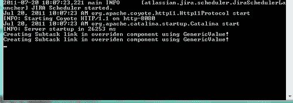

## 还有更多...

在重写组件时，推荐使用 **Component** **Plugins** 模块，但也可以通过其他几种方式来实现相同的功能。

### 通过修改 JIRA 代码进行重写

对于修改了 JIRA 源分发版的人，重写组件可以通过一行代码完成。在创建了新的组件—实现我们希望重写的接口之后—我们可以修改 `com.atlassian.jira.ContainerRegistrar` 类中的 `registerComponents` 方法，将新类替代默认类。

例如，`SubTaskManager`可以通过替换以下内容进行重写：

```
register.implementation(PROVIDED, SubTaskManager.class, DefaultSubTaskManager.class);
```

使用：

```
register.implementation(PROVIDED, SubTaskManager.class, MySubtaskManager.class);
```

请注意，组件可以是 `INTERNAL`，意味着它们仅对 JIRA 本身可用，或 `PROVIDED`，在这种情况下，它们也会对 `plugins2` 插件可用。

### 通过扩展 PicoContainer 进行重写

在 JIRA 4.3 之前，JIRA 提供了一个扩展 PicoContainer 并在扩展后的 PicoContainer 中注册自定义组件的功能。以下是实现方式：

1.  创建一个实现了 `ContainerProvider` 接口的新 `PicoContainer` 类。

    ```
    public class MyContainerProvider implements ContainerProvider{
      ...
    }
    ```

1.  实现 `getContainer` 方法，从父容器构建一个新的容器，并包含新的注册。以我们之前的例子，该类将类似于以下代码块：

    ```
    public class MyContainerProvider implements ContainerProvider{
        private DefaultPicoContainer container;

        public PicoContainer getContainer(PicoContainer parent){
            if (container == null)
                buildContainer(parent);
            return container;
        }

        private void buildContainer(PicoContainer parent){
            this.container = new DefaultPicoContainer(new ProfilingComponentAdapterFactory(), parent);
      container.registerComponentImplementation(SubTaskManager.class, MySubtaskManager.class);
        }
    }
    ```

    在这里，`MySubtaskManager` 将以完全相同的方式创建。

1.  在 `jira-application.properties` 文件中注册新的容器提供者，该文件位于 `atlassian-jira/WEB-INF/classes` 文件夹中，使用的键为 `jira.extension.container.provider`。

    ```
    jira.extension.container.provider = com.jtricks.MyContainerProvider
    ```

1.  将包含新容器类和组件类的 JAR 文件部署到 `WEB-INF/lib` 文件夹下，并重启 JIRA。

在 JIRA 4.3 中此方法也有效，但已被弃用。从 4.4 开始，尽管仍然有效，但必须将 `jira.extension.container.provider` 属性添加到 `jpm.xml` 文件中，而不是 `jira-application.properties` 文件中。该属性将以如下方式添加：

```
<property>
    <key>jira.extension.container.provider</key>
    <default-value>com.jtricks.MyContainerProvider</default-value>
    <type>string</type>
    <user-editable>true</user-editable>
</property>
```

# 从电子邮件创建问题和评论

可以基于接收到的电子邮件消息自动在 JIRA 中创建问题或评论。此功能在帮助台等场景中非常有用，用户通常向指定的电子邮件地址发送电子邮件，支持团队则处理此类问题！

一旦正确配置，任何新接收到的电子邮件将会在 JIRA 中创建一个相应的问题，且对该问题的电子邮件通知回复将会作为评论创建在该问题上。也可以通过在 JIRA 启用的电子邮件附件功能，将文档附加到该问题上。如果没有启用外部用户管理，仍然可以创建用户账户—如果他们尚未拥有账户的话。

在本教程中，我们将展示如何配置 JIRA 以启用此功能。

## 如何操作...

以下是启用从电子邮件创建问题的步骤。

1.  在服务器上创建一个电子邮件帐户——通常，每个 JIRA 项目一个电子邮件帐户。这个邮箱应该通过 POP、IMAP 或本地文件系统可访问。JIRA 将定期扫描此邮箱，并根据电子邮件创建问题或评论。

1.  导航到 JIRA 的**管理** | **全局** **设置** | **邮件** **服务器**

1.  点击**配置新的 POP / IMAP 邮件服务器**链接。

1.  输入在*步骤* *1*中创建的 POP 或 IMAP 邮件服务器的详细信息，然后点击**添加**。

1.  验证**邮件** **服务器**页面上的详细信息，并在需要时进行修改。

1.  导航到 JIRA **管理** | **系统** | **服务**。

1.  添加一个新的服务，提供以下详细信息：

    1.  **名称**：服务的名称

    1.  **类**：从内置服务列表中选择一个。例如，`com.atlassian.jira.service.services.pop.PopService`。

    1.  **延迟**：选择服务运行并扫描邮件的延迟时间。

1.  添加服务将带您到**编辑** **服务**页面。按照以下方式填写详细信息并更新：

    1.  **处理程序**：从下拉框中选择**创建** **或** **评论** **处理程序**。

    1.  **处理程序** **参数**：这是最重要的部分，我们在此指定在创建问题时将使用的参数。以下是重要参数的列表：

        +   `project`: 应该创建问题的项目的关键字。

        +   `issuetype`: `issuetype`的唯一 ID。例如，如果我们希望创建一个 Bug 类型的问题，请将`issuetype`设置为 1。

        +   `createusers`: 如果设置为 true，将为新发送者创建帐户。

        +   `reporterusername`: 当发送者与现有用户不匹配时，可以用于创建带有指定报告人的问题。

        +   `notifyusers`: 仅在`createusers`为真时使用。指示是否应向新创建的帐户的用户发送邮件通知。

        +   `ccassignee`: 如果设置，则新问题将分配给“收件人”字段或“抄送”字段中匹配的用户（如果“收件人”字段没有匹配的用户）。

        +   `bulk`: 确定如何处理“批量”电子邮件。可能的值有：

            +   `ignore`: 忽略电子邮件并不执行任何操作。

            +   `forward`: 将电子邮件转发到“转发电子邮件”文本框中设置的地址。

            +   `delete`: 永久删除电子邮件。

        +   `catchemail`: 如果添加，JIRA 将只处理发送到此地址的电子邮件。它在同一邮箱有多个别名时使用。

        +   `stripquotes`: 如果启用，它将从回复中删除之前的消息。

            1.  转发电子邮件：错误通知和未处理的电子邮件（与批量转发处理参数一起使用）将被转发到此地址。

            1.  使用 SSL：如果使用 SSL，请选择 SSL。

            1.  服务器：选择此服务的电子邮件服务器。它将是我们在*步骤* *2*到*步骤* *4*中添加的服务器。

            1.  端口：连接的端口。如果使用默认端口，请留空。

JIRA 现在已配置为接收发送到新添加的邮箱的邮件。

## 它是如何工作的...

我们在这里设置的服务每**n**分钟扫描一次邮箱（按照延迟配置），并获取新的来信。当接收到新邮件时，JIRA 会扫描主题，看是否提到了已存在的问题。如果有提到，电子邮件会作为评论添加到提到的问题上，电子邮件正文作为评论内容。如果主题中没有提到问题，JIRA 仍会检查电子邮件是否是对已创建问题的另一个电子邮件的回复。如果是，那么电子邮件正文会作为评论再次添加到该问题上。这是通过检查电子邮件中的 `in-reply-to` 标头来完成的。

如果 JIRA 仍然找不到任何匹配的问题，则会在项目中创建一个新的问题，并且类型由处理参数中的配置决定。电子邮件的主题将成为问题的摘要，电子邮件正文将成为描述。

电子邮件中的任何附件，无论是新的还是回复的，都将作为附件添加到问题中。

关于从电子邮件创建问题和评论的更多信息，请参见[`confluence.atlassian.com/display/JIRA/Creating+Issues+and+Comments+from+Email`](http://confluence.atlassian.com/display/JIRA/Creating+Issues+and+Comments+from+Email)。

同时，也值得检查插件交换平台，寻找具有扩展邮件处理功能的插件，这些插件能够在创建问题时添加更多的细节，例如自定义字段值。其中一些插件还拥有更好的过滤机制。

# webwork 插件中的国际化

我们在前面的章节中已经看到如何编写 webwork 插件来创建新的或扩展的 JIRA 操作。在这个食谱中，我们将看到如何通过**国际化**和**本地化**个性化这些插件中的消息。

正如 Wikipedia 所说：

> “国际化和本地化是将计算机软件适应不同语言、地区差异和目标市场技术要求的手段。国际化是设计软件应用程序的过程，使其能够在不进行工程更改的情况下适应各种语言和地区。本地化是将国际化软件适应特定地区或语言的过程，方法是添加地区特定的组件并翻译文本。”

国际化和本地化的术语缩写为**i18n**，其中**18**代表国际化中从第一个**i**到最后一个**n**之间的字母数！

## 如何操作...

在 webwork 插件中实现国际化是通过一个与其关联的操作同名的资源包来实现的。以下是在 JIRA webwork 插件中启用国际化的步骤：

1.  在插件的 `src/main/resources` 文件夹下，在与操作类同名的包结构中创建一个 `properties` 文件。

    例如，如果我们考虑前面示例中的 `RedirectAction`，属性文件将是 `RedirectAction.propertie`s，位于 `src/main/resources/com/jtricks` 文件夹下。

1.  添加在 action 中需要使用的属性的键值对，如下所示：

    ```
    good.bye=Good Bye
    ```

    这里，`good.bye` 是将被使用的键，且会在所有语言的 `properties` 文件中保持一致。这里的值 "Good Bye" 将用于默认地区，但在其他语言的属性文件中将有相应的翻译。

1.  在同一文件夹中为其他所需语言创建 `properties` 文件，格式为：`${actionName}_${languageCode}_${countryCode}.properties`。例如，如果我们需要为英国、美国和法国用户定制上述动作，属性文件名将如下：

    ```
    RedirectAction_en_US.properties
    RedirectAction_en_UK.properties
    RedirectAction_fr_FR.properties
    ```

1.  在每个属性文件中添加 `good.bye` 属性，并为其设置适当的翻译值。例如，英文属性文件中的 `Good` `Bye` 属性值将会在法语文件中显示为 `revoir`！

    ```
    good.bye=Good Bye (in RedirectAction_en_UK.properties)
    good.bye=revoir (in RedirectAction_fr_FR.properties)
    ```

1.  在 action 类中，使用 `getText(key)` 方法来获取相应的消息。请记住，action `class` 扩展了实现了 getText 方法的 `JiraWebActionSupport` 类！

    例如，值 `Good` `Bye` 可以根据不同地区的用户语言显示如下：

    ```
    System.out.println(getText("good.bye"));
    ```

然而，这一魔法在 v2 插件中被打破，且 Atlassian 已经在 [`jira.atlassian.com/browse/JRA-23720`](https://jira.atlassian.com/browse/JRA-23720) 上报告了一个问题。解决方法是在 action 类中覆盖 `getTexts` 方法，如下所示：

```
@Override
public ResourceBundle getTexts(String bundleName) {
  return ResourceBundle.getBundle(bundleName, getLocale(), getClass().getClassLoader());
}
```

在这里，我们通过 action 类的类加载器获取 `ResourceBundle`，这解决了 v2 插件中的上述问题！

在结束之前，如果你需要在 velocity 模板中获取 `i18N` 文本，以下是步骤：

1.  按照之前的方式添加属性文件。

1.  如下所示，在 `atlassian-plugin.xml` 中添加资源条目：

    ```
    <resource name="common-18n" type="i18n" location="com.jtricks.RedirectAction"/>
    ```

    在这里，资源指向的是属性文件，并包含包名和文件名（省略国家或语言代码）。

1.  使用 `$i18n` 对象来检索属性值，如下所示：

    ```
    $i18n.getText("good.bye")
    ```

# 在 v2 插件中共享公共库

本书已经介绍了如何创建 v1 和 v2 插件。v1 和 v2 插件之间的一个主要区别是，v1 插件可以访问应用程序类路径中所有可用的库和类，而 v2 插件无法访问它们。

例如，v1 插件可以通过将包含这些类的 JAR 文件放入 `WEB-INF/lib` 或将这些类添加到 `WEB-INF/classes` 下，来访问一些通用的工具类。但对于 v2 插件来说，这种方式行不通，因为它们需要将 JAR 文件嵌入到 `MET-INF/lib` 中，或者将类直接嵌入其中。那么，当我们需要在几个 v2 插件之间共享一个工具类时，该如何处理呢？我们是否应该将类嵌入到所有插件中？答案是否定的，在本教程中，我们将学习如何通过创建一个 OSGi 包来在 v2 插件之间共享这些工具类。

## 准备工作

使用 Atlassian 插件 SDK 创建一个骨架插件。

## 如何操作...

假设我们有一个数字工具类，用于整数的加法和乘法。如果我们想让这个类在所有 v2 插件中可用，应该怎么做？以下是步骤：

1.  在正确的包下创建工具类：

    ```
    package com.jtricks.utilities;

    public class NumberUtility {
      public static int add(int x, int y) {
        return x + y;
      }
    }
    ```

1.  导出需要共享的类，使其对其他 v2 插件可见。这一步非常重要。

    即使它是一个简单的工具类，我们仍然需要 atlassian-plugin.xml 来完成这一步。我们可以在 `atlassian-plugin.xml` 的 `plugin-info` 元素下使用 `bundle-instructions` 来将选定的包导出到其他插件/包中。

    `bundle-instructions` 元素允许子元素。

    **导出** **-** **包**：将选定的包从插件导出，以便在其他插件之间共享。

    **导入** **-** **包**：Tom 只将选定的包导入到插件中。默认情况下，它会导入来自其他插件的所有已导出的包。

    在这种情况下，我们需要修改 atlassian-plugin.xml 以导出我们的工具类，具体操作如下：

    ```
    <plugin-info>
      <description>Shared Utilities</description>
      <version>2.0</version>
      <vendor name="JTricks" url="http://www.j-tricks.com/" />
      <bundle-instructions>
        <Export-Package>com.jtricks.utilities</Export-Package>
      </bundle-instructions>
    </plugin-info>
    ```

1.  可以选择只导出特定版本，并选择不导出某些包。更多细节可以参考 [`www.aqute.biz/Bnd/Bnd`](http://www.aqute.biz/Bnd/Bnd)。

1.  可选地，我们可以使用 **Import-Package** 元素来导入上述已导出的包。默认情况下，它会被导入，因此这一步可以省略。不过，当你只想导入特定的包或使导入变为强制性时，这个步骤会很有用。更多详情可以参考上述链接。

1.  打包插件并将其作为 v2 插件部署。

现在该工具类可以被所有其他 v2 插件访问。在开发时，其他插件应将此类包含在类路径中，这可以通过在 `pom.xml` 中将上述插件作为依赖项并设置作用域为 provided 来实现。

```
<dependency>
  <groupId>com.jtricks</groupId>
  <artifactId>utility-plugin</artifactId>
  <version>1.0</version>
  <scope>provided</scope>
</dependency>
```

当我们这样做时，上述方法 `add` 可以像类在同一插件中一样被调用。例如，`RedirectAction` 类可能有如下方法：

```
@Override
protected String doExecute() throws Exception {
  System.out.println("Action invoked. Doing something important before redirecting to Dashboard!");
  System.out.println("Sum:"+NumberUtility.add(3, 5));
  return getRedirect("/secure/Dashboard.jspa");
}
```

# 使用直接 HTML 链接的操作

可能有必要通过一个小提示结束本书，告诉大家如何通过简单地点击一个链接在 JIRA 中执行强大的操作，无论是从你的电子邮件、Web 表单还是 JIRA 本身！

几乎所有的操作都可以编码成单个 URL，只要我们拥有正确的参数来触发这些操作。别搞错了，这也有它的缺点，因为在某些情况下，它会覆盖所有的预处理、验证等操作。

执行操作的 URL 构造方式如下：

`${baseUrl}/secure/${action}?${arguments}`

其中，`baseUrl`是 JIRA 的基本 URL，`action`是要执行的 WebWork 操作，`arguments`是该操作所需的 URL 编码参数。参数由`&`分隔的键值对构成。每个键值对的格式为`key=value`，并且必须遵循 HTML 链接语法——即所有字符必须转义。让我们详细看看。

## 如何操作...

让我们从一个简单的例子开始，即创建问题。创建问题有四个阶段。

+   进入初始创建屏幕

+   选择项目和`issuetype`并点击**下一步**

+   输入所有问题的详细信息

+   点击**提交**并填写详细信息

我们可以在了解详细信息的前提下，逐步执行每个操作。以此为例，我们将`http://localhost:8080/`作为 JIRA 实例的基本 URL。

1.  进入初始创建问题屏幕可以通过以下 URL 完成：

    `http://localhost:8080/secure/CreateIssue!default.jspa`

    请注意，最近的`project`和`issuetype`在访问此链接时会被预选中，因为这是 JIRA 的默认行为。但如果我们想要预选某个其他项目呢？我们只需在 URL 中添加`pid`参数，如下所示：

    `http://localhost:8080/secure/CreateIssue!default.jspa?pid=10100`

1.  如果我们需要直接进入第二步，通过选择项目和问题类型，只需在 URL 中添加`issuetype`参数，并用`&`分隔。

    `http://localhost:8080/secure/CreateIssue!default.jspa?pid=10100&issuetype=1`

1.  如果我们需要通过单击预填充创建问题对话框，请按如下所示在 URL 中输入所有详细信息，操作名称为`CreateIssueDetails!init.jspa`

    `http://localhost:8080/secure/CreateIssueDetails!init.jspa?pid=10100&issuetype=1&priority=1&summary=Emergency+Bug&reporter=jobinkk`

    请注意，所有必填字段都应填写，以避免验证错误。上述示例还展示了如何对 URL 进行编码，以符合 HTML 语法，将摘要中的空格替换为+。即，Emergency Bug 写作 Emergency+Bug，也可以写作 Emergency%20Bug。

1.  如果我们希望通过单击立即创建问题并填写上述详细信息，可以使用`CreateIssueDetails`操作，而不是`CreateIssueDetails!init`

    `http://localhost:8080/secure/CreateIssueDetails.jspa?pid=10100&issuetype=1&priority=1&summary=Emergency+Bug&reporter=jobinkk`

    希望这能给我们一个关于如何通过直接链接执行操作的思路。在点击上述链接时，确保用户已登录或启用了匿名问题创建。

那么，如何找出涉及的操作类或需要传递的参数呢？

如果请求使用 GET 方法，你可以轻松地从浏览器 URL 中完成此操作。以选择了项目和 `issuetype` 创建问题（上述案例 2）为例，如下所示：

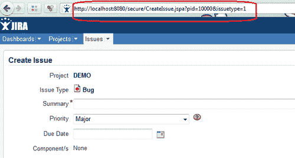

当请求为**POST**，如案例 4 所示，我们可以从 URL 中找出操作名称，但需要通过执行操作时提交的内容来确定参数。实现这一点有多种方式，其中一个简单的方法是使用浏览器功能。例如，使用**Firebug**与 Mozilla Firefox 可以获取执行操作时提交的参数，如下所示：

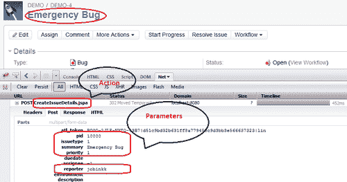

在这里，我们可以看到**POST**部分提交的参数：pid、issuetype、priority、summary 和 reporter。此外，我们还可以看到操作名称。一旦获得了参数列表，我们就可以在 URL 中使用它们，并用适当的值通过 & 符号分隔，正如我们在*步骤* *4* 中看到的那样。

这种技术带来了很多可能性。例如，我们可以轻松地使用命令行工具如 `wget` 或 `curl` 自动化提交这些我们构建的 URL。更多信息请参考：[`confluence.atlassian.com/display/JIRA/Creating+Issues+via+direct+HTML+links`](http://confluence.atlassian.com/display/JIRA/Creating+Issues+via+direct+HTML+links) 和：[`confluence.atlassian.com/display/JIRACOM/Automating+JIRA+operations+via+wget`](http://confluence.atlassian.com/display/JIRACOM/Automating+JIRA+operations+via+wget)。
