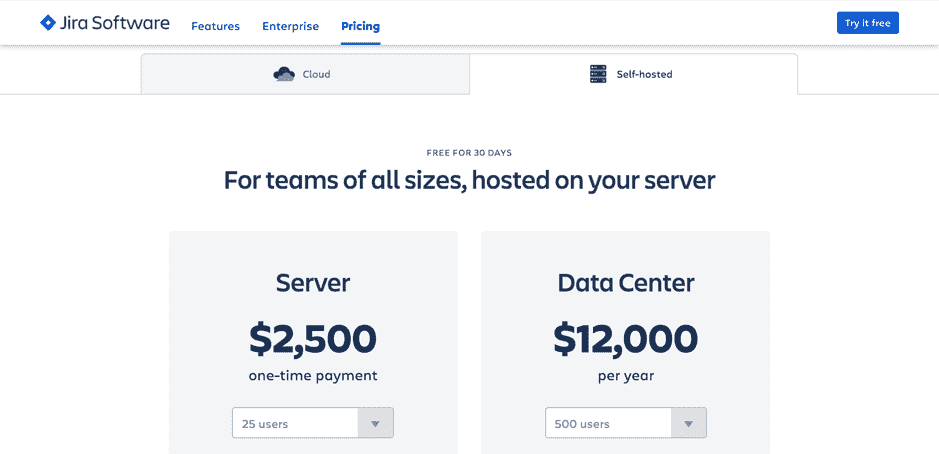
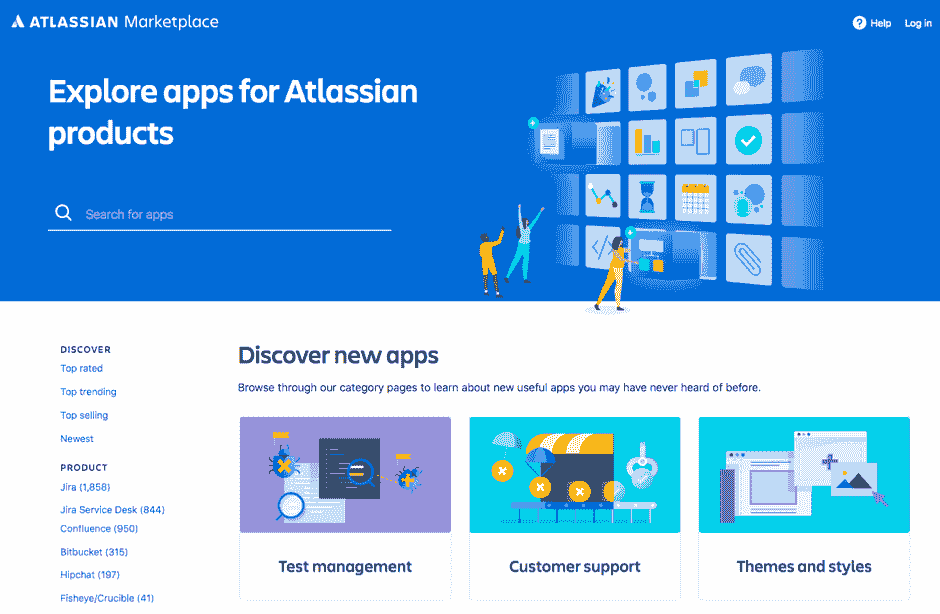
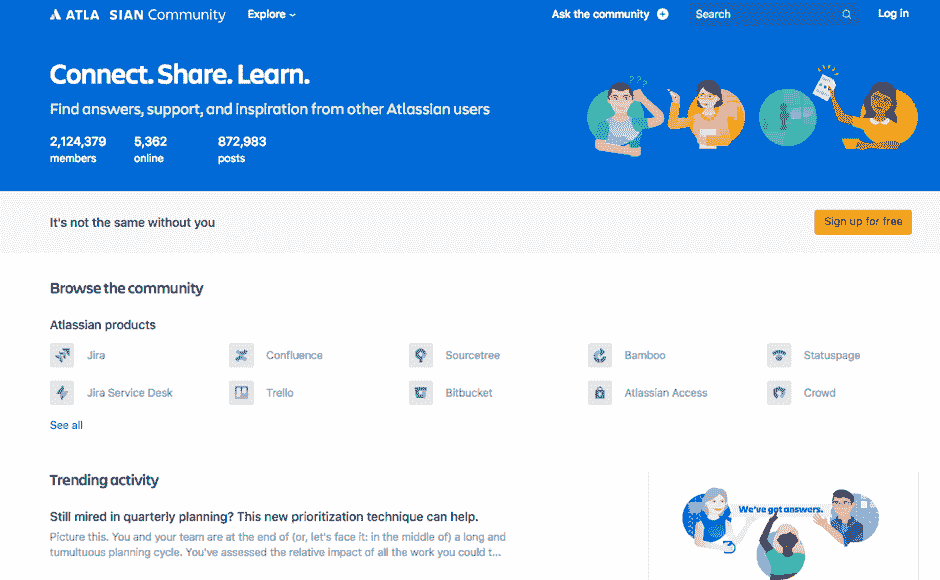

# 介绍 Jira

在本章中，我们将了解什么是 Jira，以及它如何作为一个问题跟踪工具被组织中的各个团队使用。它是由 Atlassian 公司开发的最受欢迎的工具之一，该公司也正是 Jira 的背后公司。Jira 有三种不同的版本，本章中，我们还将讨论这三种版本之间的区别。

我们将讲解 Jira 解决的问题、Jira 的优势以及使其区别于其他工具的主要功能，最后我们将通过了解这三个应用中的独特功能，来深入了解 Jira Core、Jira 软件和 Jira 服务台。

最后，我们将分享你在组织中应该根据需求使用哪个应用。

本章将涵盖以下主题：

+   什么是 Jira？

+   Jira Core

+   Jira 软件

+   Jira 服务台

+   Jira 解决的问题

+   Jira 的主要优势是什么？

+   如何决定使用哪个应用

+   部署选项

# 什么是 Jira？

Jira 是一个专有的问题跟踪系统。它可以用来跟踪错误、解决问题，并管理项目功能。市场上有许多工具，但 Jira 的最佳之处在于它可以轻松定制和配置，以适应组织的特定需求，而且有很多方式可以增加更多功能。

默认情况下，Jira 提供缺陷/错误跟踪功能，但它也可以定制为像帮助台系统、简单的测试管理套件或具有端到端可追溯性的项目管理系统，适用于软件开发项目。

Jira 主要通过 Web 浏览器访问，但它与其他工具有很多集成，Jira 还配有 RESTful API，方便你以编程方式与其交互。

# Jira Core

Jira Core 是 Jira 的基本版本之一，面向那些需要灵活、可以定制并且易于使用的工具的商业团队。

Jira Core 非常适合如市场营销、运营、人力资源、法律和财务等团队。它具备工作流、仪表板和报告等所有功能。

# Jira 软件

Jira 软件的目标团队——顾名思义——是那些希望使用能够帮助他们实施敏捷方法论（如 Scrum 和 Kanban）的工具的团队。

Jira 软件具有标准功能，如创建敏捷看板以提高透明度。它有规划、跟踪、发布和报告等功能。它具备 Jira Core 的所有功能，所以你可以放心，它在定制方面足够强大。

# Jira 服务台

除了商业团队和软件团队，Jira 服务台还面向支持台或帮助台。

在 Jira Service Desk 中，提供了服务台工具的标准功能，例如客户门户，可以让客户提交工单并在知识库中进行自助查询；对于将处理工单的代理人员，他们有可配置的队列。就像 Jira Software 一样，Jira Service Desk 也包含了 Jira Core 的所有功能和优势。

正如你们可能已经猜到的，Jira Core 是最基本的工具，依据你的需求以及你是否想使用敏捷方法开发软件、瀑布模型，或是定制开发流程，你可以使用 Jira Software。为了向客户提供支持并在 Jira 中处理工单，你可以使用 Jira Service Desk。

# Jira 解决的问题

Jira 已成为业界最受欢迎的工具之一，不仅是软件开发团队使用，支持桌面和业务团队也在使用。Jira 本质上是一个问题跟踪工具，其中问题是一个通用术语，指的是任务、bug、故事、史诗等在软件开发项目中的工单，商业项目中的待办事项，或者在服务台项目中的事件、问题或服务请求。Jira 的受欢迎程度增加的原因之一是它可以非常轻松地根据各种用例进行定制。

# Jira 解决的挑战和问题

我们希望花一些时间讨论团队或组织在使用各种工具时所面临的各种挑战和问题。

# 缺乏灵活性

行业内有许多已成为标准的开发方法论。这些方法论被许多组织采用。例如，敏捷方法如 Scrum 和 Kanban 是最广泛使用的技术之一，但说实话，无论这些标准如何，每个公司的工作方式都不相同，而且有许多因素会改变公司工作的方式。

Scrum 和 Kanban 方法论提供了一个共同框架，许多工具可以帮助这些工具的轻松采用；然而，一个工具应该足够灵活，以适应团队的需求。一个工具应该遵循标准，但同时也应足够灵活，允许团队进行调整。

# 自定义困难

大多数团队采用的开发或支持方法论都是由一个过程驱动的，这个过程不过是一个包含不同阶段的生命周期。最简单的过程可能只有三个阶段，比如待办、进行中和完成。当一个新任务开始时，它通常是等待有人来处理，当他们完成任务时，他们只需要将任务状态更新为“完成”。

现在，在大多数情况下，过程的复杂性由活动类型（任务或缺陷）、在规划工作时需要捕获的信息（摘要、描述等）、任务的生命周期或工作流以及使用报告跟踪工作来定义。标准，例如 Scrum/Kanban（敏捷）或 ITSM（服务台），提供了框架，但试图采用这些行业标准的团队仍然需要根据他们的需求调整工具。也许他们需要确保用户或开发人员在解决任务时附加一个文件，或者他们希望在任务分配给开发人员时向他们发送通知。

任何工具都应该允许这样的定制，以便使用它的团队能够充分受益。

# 团队采用时的困难

工具是用来解决问题的，而不是让问题更复杂。一个在笔记本电脑上工作的自由职业者可能不需要依赖工具来帮助他们；一个由几名开发人员组成的小团队可以通过在电子表格中跟踪他们的活动来开发代码；而一个偶尔接收几个工单的小型帮助台团队也可以仅通过电子邮件来管理他们的工作。

然而，当这些团队需要提高效率并希望变得更有生产力时，工具就发挥了作用。你使用的任何工具都应该是容易被所有人采用的。它应该容易让管理员设置和实施，应该让管理层轻松规划和跟踪工作，最后，它应该易于开发人员使用。

# 学习工具需要大量培训

如前所述，工具的采用不应该困难，因此需要一定的努力来培训涉及使用该工具的人。然而，培训的质量以及团队能够多快开始使用该工具也非常重要，并且应成为选择工具时的关键标准。

# 昂贵

组织中使用的工具提供了很多价值，并且有显著的好处；然而，工具应该能够证明其成本和维护的合理性。一个工具可能很灵活，提供大量定制，且每个人都能轻松使用，但如果它的实施和设置成本过高，那么组织将难以证明其价值。

市面上有很多灵活的工具和应用程序，但它们要么难以定制，要么需要大量的努力。有些工具易于定制，但需要大量的培训和特殊技能。Jira 试图通过提供适当的平衡来解决这些问题。大多数定制可以通过 UI 完成，这使得团队能够迅速入门，同时对工具充满信心和安心，因为流程中的细微变化（例如，在工作流中添加新状态）不会需要一周的时间。

# Jira 的主要优点是什么？

如果你在犹豫是否应该使用 Jira，这些好处将帮助你做出决定。我们强调这些点非常重要。

使用 Jira 的各种好处如下：

+   适用于各种规模团队的标准工具

+   简单的许可模式

+   轻量级工具

+   低维护成本

+   易于使用且直观

+   提高生产力

+   更好的可视性

+   与其他工具的集成

+   市场应用

+   一个 RESTful API，带来无限可能

+   Atlassian 社区

现在我们来详细讨论这些功能。

# 适用于各种规模团队的标准工具

当你第一次安装 Jira 时，你会发现入门非常简单。你可以使用各种现成的模板来创建项目。无论你的团队规模如何，你总是可以选择使用这个行业标准的工具。即使是一个小团队，现成模板中提供的配置也已非常完备。Jira 不会根据团队规模区分功能；无论是小团队还是大企业，工具中的功能是一样的。一个 10 人的小团队在敏捷看板上工作的方式与一个 50 人的大团队在多个敏捷看板上工作的方式是一样的。

拥有这种一致性对管理员和团队成员来说都很有益，因为通过使用像 Jira 这样的工具获得的知识将永远帮助他们，尤其是当团队未来不断壮大时。

# 简单的许可模式

Jira 是 Atlassian 开发的专有软件，你需要购买许可证才能使用它。许可证的费用是根据团队中使用该系统的用户数量来计算的，非常直观。

假设你有 15 个开发人员，5 个经理和 2 个管理员，那么总共有 22 个用户在使用系统。为了了解你需要购买的许可证，只需查看 Atlassian 网站。在 22 个用户的情况下，你需要购买一个适用于 25 个用户的许可证。

你可以访问以下链接，查看需要购买的许可证：

[`www.atlassian.com/software/jira/pricing?tab=self-hosted`](https://www.atlassian.com/software/jira/pricing?tab=self-hosted)

当你打开这个链接时，你将看到如下截图的界面，你可以选择部署类型——云端或自托管——然后，根据用户数量，许可证费用将显示给你：

图 4

如果未来用户数量增加，可以随时购买额外的许可证。建议至少考虑明年的预期使用量。如果目前有 22 个用户，但你知道这个数字将增加到 35 或 40 个，那么最好考虑购买相应的许可证来应对未来的增长。这将为你节省一些费用，这绝对是个不错的主意。

Jira 有多种部署选项，我们将在本章中讨论，但要在自己的服务器上安装 Jira，你需要购买自托管部署的许可证。

# 轻量级工具

在自己的服务器上安装 Jira 不需要大规模的基础设施投资。它可以在拥有 2GB 内存和多核 CPU 的服务器上运行得相当顺畅；当然，这也取决于实例的大小。对于从几千个问题的小规模实例到几百万个问题的大规模实例，服务器规格可以有所不同，这也是使用 Jira 的一个重要优势。

Atlassian 根据实例大小，在此页面上推荐了一些规格：

[`confluence.atlassian.com/adminjiraserver/jira-applications-installation-requirements-938846826.html`](https://confluence.atlassian.com/adminjiraserver/jira-applications-installation-requirements-938846826.html)

如果你刚开始使用一个小规模实例，可以选择前述链接中 Atlassian 推荐的规格。你并不需要一开始就配置庞大的基础设施。

# 低维护成本

我们之前讨论过选择工具时需要注意的挑战；除了功能和成本这些在初期非常重要的因素外，你还需要了解工具的运行成本。像其他任何工具一样，Jira 也需要持续维护，管理员需要定期清理系统，正确管理备份，并确保定期升级实例本身。

Jira 每两个月发布一个新的小版本，这些版本不仅包含新功能，还有 bug 修复。

升级和维护 Jira 完全不是一项艰巨的任务。只要有合适的管理机制，确保工具的良好性能其实非常简单。大多数 Jira 管理操作都可以通过 UI 进行，管理员可以非常方便地在浏览器窗口中处理定制和其他常规管理任务。

# 易用性和直观性

使用 Jira 非常直观且容易。每个用户——无论是开发人员、经理还是管理员——都会使用网页浏览器登录 Jira。登录后，他们会看到仪表板，并根据用户的权限和授权显示并启用相应的功能。

尽管使用 Jira 非常直观，且最终用户无需特殊培训，但仍然存在学习曲线。大多数需要使用 Jira 的人是自学的，但 Atlassian 提供了专门的文档：

[`confluence.atlassian.com/alldoc/atlassian-documentation-32243719.html`](https://confluence.atlassian.com/alldoc/atlassian-documentation-32243719.html)

前述链接包含了所有 Atlassian 产品的最新文档，包括 Jira Core、Jira Software 和 Jira Service Desk。

阅读文档或像本书这样的书籍将帮助你快速上手这款工具，而且有大量资源可以帮助你学习并充分利用这款工具。然而，如果你打算在公司推广 Jira，可以放心，用户可以非常迅速地接受它；通过非常短的培训或辅导课程，将像 Jira 这样的工具引入团队是非常容易的。

# 提高生产力

工具的易用性和直观性非常重要，正如我们在前面关于工具采纳部分所讨论的，当人们开始使用 Jira 后，你可以预期你的生产力会提高。Jira 不仅是规划活动或项目的好工具，日常跟踪也非常出色。通过多种方式，团队始终能够跟进项目中的最新活动。有仪表板，任何拥有合适权限的人都可以查看与自己和团队相关的信息。此外，工具还具有发送通知和提醒给用户的能力。

例如，参与项目或任务的用户会从系统收到电子邮件通知。当然，这些电子邮件通知可以定制化，以减少噪音，但也有机制确保在使用如 Jira 这样的工具时，整体团队生产力得到提升。

# 更好的可见性

规划和跟踪活动没有意义，若团队无法从错误中学习并加以改进。我们可以在 Jira 中创建与一个或多个项目相关的各种报告。

在 Jira 中，有一个仪表板的概念，用户可以根据其权限创建一个或多个仪表板，包含各种小工具，帮助他们提供最新的报告。

这些报告帮助管理者不仅保持进度，还能确保整体进展保持，并在适当的时候采取相应的行动。例如，在仪表板上，我们可以以图形和表格的形式查看过去几个月解决的问题与已关闭的问题数量，以及燃尽图、饼图显示根据工作流状态划分的问题。

Jira Software 中的敏捷看板始终显示整个开发团队的最新信息，Jira Service Desk 中的队列也为代理提供了准确的工单积压情况。

提高可见性是 Jira 的关键特点之一，它在这方面做得非常好。

# 与其他工具的集成

Jira 本身是一个很棒的工具；然而，Atlassian 还有其他工具，例如用于在线协作的 Confluence；用于代码仓库的 Bitbucket；以及用于持续集成的 Bamboo。Jira 和大多数其他 Atlassian 工具可以原生互通。

Atlassian 拥有一个生态系统和一套集成工具，这些工具可以单独使用，但当它们互相集成时，能够提供完整的解决方案。

例如，如果你的组织计划使用 Atlassian 工具实施 DevOps 实践，那么你可以使用像 Bamboo、Bitbucket 等工具，并与 Confluence 和 Jira 结合使用，它们大多数都已集成。

除了与 Atlassian 工具进行集成外，Jira 还可以与第三方工具进行集成，这可以通过应用或附加组件来完成，我们稍后会讨论，但对于任何你找不到应用的集成，仍然可以使用 Jira 的 RESTful API。

# Marketplace 应用

Jira 本身有很多开箱即用的功能，并且根据你使用的应用类型，它提供了一些模板。例如，当使用 Jira Software 时，你可以创建一个基于 Scrum 或 Kanban 配置的项目。同时，你始终可以选择使用 Jira 中的各种方案来修改和创建你自己的配置集。然而，除了工具中的标准功能和这些自定义选项外，如果你需要扩展 Jira 的功能集，你可以安装各种插件，也称为附加组件，或者最近被称为应用程序。

这些应用要么来自 Atlassian 本身，要么来自其他公司——大多是 Atlassian 的合作伙伴，他们将这些应用发布到 Marketplace：

[`marketplace.atlassian.com/`](https://marketplace.atlassian.com/)

如果你打开这个链接，你将进入 Atlassian Marketplace 页面，在那里你可以下载成千上万的应用程序，不仅适用于 Jira，也适用于其他所有 Atlassian 工具。如下面的截图所示，你可以浏览各种应用，或者搜索它们：

图 5

当你访问 Marketplace 时，你可以选择查看每个 Jira 应用的各种热门应用，但假设你想在 Jira 中进行测试管理，并且你在想是否有应用可以快速为你提供这个选项；你可以从 Marketplace 下载各种应用并进行评估。

拥有这些应用为 Jira 提供了无限的可能性——当然，这取决于应用是否足够适合你的使用场景，但至少你知道，通过应用的帮助，你可以完成原生功能无法实现的事情。这些应用要么提供更多功能，要么与其他工具进行集成。

# 一个 RESTful API，带来无限可能

我们刚刚讨论了通过应用扩展工具功能的概念，但如果你在想如何以编程方式将数据推送和拉取到 Jira 中，你会很高兴知道 Jira 提供了一个 RESTful API，这是与其他工具通信的一种很棒方式。

无论你是想构建自己的界面，还是将数据导入 Jira，或者可能从现有的遗留工具与 Jira 进行交互，RESTful API 都为你打开了很多可能性：

[`developer.atlassian.com/server/jira/platform/rest-apis/`](https://developer.atlassian.com/server/jira/platform/rest-apis/)

上述链接将为你提供关于 Jira 中这一惊人 API 集合的详细信息。你可以通过 UI 访问的功能以及各种特性，也可以通过 RESTful API 进行访问。这使得开发者可以编写自己的界面并与工具进行集成。

# Atlassian Community

我们已经谈到过 Jira 的各种好处，但这一点需要特别提及。Atlassian 不仅构建了 Jira，这个在业内已经相当流行的工具，还提供了一个平台，供用户讨论其工具：

[`community.atlassian.com/`](https://community.atlassian.com/)

Atlassian Community 就是这样一个平台，用户可以在这里提问、分享知识并与其他用户建立联系。如以下截图所示，Atlassian Community 首页会提供一个选项，让你点击特定的 Atlassian 产品，或搜索你需要的信息：

图 6

假设你对 Jira 中的某个特定功能有问题，或者需要关于某个特定话题的帮助，那么你可以来这个平台提问，并且肯定会得到其他用户的帮助。

Atlassian 还会持续监控这个平台并定期收集用户和客户的反馈。这帮助他们改进产品。

# 如何决定使用哪个应用程序？

Jira 有三种不同的版本，正如我们之前简要讨论过的。如果你在想是否应该使用 Jira Core、Jira Software 还是 Jira Service Desk，那么在这一部分我们将讨论如何选择适合你的应用程序。

让我们简要回顾一下这三个应用程序的概况：

+   Jira Core 主要就是 Jira

+   Jira Software 是一个添加到 Jira Core 中的应用程序，它提供了 Scrum 和 Kanban 看板

+   Jira Service Desk 是一个添加到 Jira Core 中的应用程序，它提供了客户门户、服务请求、SLA 和队列

以下表格描述了各种团队使用这三款应用程序的潜在用途：

| **Jira Core** | **Jira Software** | **Jira Service Desk** |
| --- | --- | --- |
| 需要工具来规划和跟踪其活动的业务团队。可以使用 Jira Core 的团队：市场营销、运营、人力资源、法律和财务。其他任何团队都可以使用 Jira Core。 | 从事软件开发和交付的软件开发团队。Jira Software 支持的开发方法：SCRUM83 和 Kanban。Jira Software 支持典型的敏捷概念以及基于敏捷的标准报告。 | 服务台和 IT 支持台帮助处理客户问题。它可以用于实施 ITSM 或 ITIL。主要功能包括：客户门户、与 Confluence 的自助服务集成、SLA 和队列。Jira Service Desk 不对提交工单的客户数量进行限制。 |

最棒的部分是，这三款应用程序可以一起使用。你可以在组织中有一个 Jira 实例，几个团队可以在 Jira Core 上运行他们的项目而不需要敏捷看板，开发团队可以使用 Jira Software 管理他们的项目，客服团队则可以在 Jira Service Desk 上运行他们的项目。

在大多数情况下，运行这三个应用程序的实例最好只有一个，但这些应用程序也可以分别在不同的实例上运行。

# 部署选项

主要有三种使用 Jira 的方式，每种方式都有其独特的优点：

+   云端

+   服务器版

+   数据中心

# 云端

为了快速入门，你可以使用云端部署选项，只需要在线注册，就能在几分钟内启动并运行你的 Jira 实例。使用云端部署时无需安装。在注册 Jira Cloud 后，只需创建用户。你的 Jira 实例可以通过一个独特的链接访问，并可以与团队共享。

+   Atlassian 设置并托管实例

+   没有服务器，没有存储，也无需维护

部署在云端的 Jira 始终可以迁移到服务器版本；这也取决于你使用的应用程序以及应用数据是否支持从云端迁移到服务器的过程。

# 服务器版

如果你想在自己的服务器上安装和设置 Jira，那么你可以下载 Jira 安装文件并根据自己的需求进行安装。在功能上，服务器版本的应用和云版本大致相同：

+   由你设置和托管实例

+   由你来管理安装

+   由你来维护实例

安装在服务器上的 Jira 也可以迁移到云端。需要记住的一点是要支持应用数据的迁移。

# 数据中心

这个部署方式面向大型企业的 Jira 部署。它基本上是 Jira 的服务器版本，但安装在多个节点上。数据中心部署的主要好处是高可用性、灾难恢复和可扩展性。如果你的组织无法容忍 Jira 的任何停机时间，并且 Jira 对你的业务至关重要，那么推荐使用此部署方式。

# 总结

在这一章中，我们讨论了 Jira 是什么，以及组织如何在不同的用例中使用它。我们花时间讲解了 Jira 的三种不同版本：Jira Core、Jira Software 和 Jira Service Desk；这三款应用程序解决了哪些问题；使用 Jira 的好处；以及启动 Jira 旅程的各种部署选项。

一旦你了解了 Jira，那么就是时候开始使用这个工具了。在第二章，“*Jira 基础使用入门*”中，我们将首先理解规划 Jira 设置的重要性，然后我们会注册一个 Jira Cloud 实例，创建一个 Jira Core 项目，了解项目界面的各个方面，最后花时间了解问题生命周期的过程。
