# 开始使用 Jira Core 和基本使用方法

在本章中，我们将了解如何开始使用 Jira 来进行项目管理。我们将通过询问相关问题来规划我们的 Jira 安装，花时间规划。我们将设置一个 Jira Cloud 实例以及一个 Jira Core 类型的项目。当然，我们将从理解作为用户如何在项目中工作开始，并覆盖项目界面的各个方面。

我们还将学习 Jira 管理员如何创建一个新项目，以及作为项目经理，你如何确保项目中使用的方案是正确且符合你需求的。我们将花一些时间了解如何创建问题、处理问题并关闭问题。

本章涉及的主题包括以下内容：

+   开始使用 Jira

+   为业务团队使用 Jira Core

# 开始使用 Jira

在本节中，我们将设置一个 Jira 实例，之后将用它来学习本书中各个方面的工具；然而，就像使用任何工具时一样，我们需要问自己一些关于其使用的问题，这也是为什么规划是一个非常重要的阶段，我们需要先讨论这个部分。我们将快速在 Atlassian Cloud 上设置一个 Jira 实例，以开始我们的学习之旅。

# 规划你的 Jira 安装

在一开始，甚至在开始使用 Jira 之前，你需要考虑对该工具的期望，并提出一些问题。让我们讨论这些问题，这将帮助你做出关于在组织中实施 Jira 的明智决策。

# 有多少人将使用 Jira？

你是一个由 10 人组成的团队，需要快速找到一个工具来管理日常活动，还是在一个有 10,000 名员工的公司工作，需要在多个地点推广这个工具？

现有用户的数量以及预计将加入公司新用户的数量需要明确。这个数字非常重要，因为根据有多少人需要访问该工具，必须购买合适的许可证。Jira 的许可非常简单，依据用户数量来定。这一数字将帮助你了解 Jira 的成本。

# 你希望通过 Jira 解决什么问题？

Jira 有多种优势；在第一章中，*介绍 Jira*，我们详细讨论了 Jira 所带来的好处，但无论你是想为你的业务团队还是开发团队使用 Jira，还是想在 Jira 中实施像 Scrum 或 Kanban 这样的流程，都需要从一开始就明确。

Jira 可以根据不同的使用场景进行定制，例如缺陷追踪、测试管理、变更管理、需求管理和帮助台。根据这些期望，您选择的应用程序会有所不同。更重要的是，您应该有充分的理由说明 Jira 能够带来的好处，帮助您提升团队的当前效率和生产力。

# 您需要哪些应用程序和应用？

我们刚才讨论了 Jira 可以针对各种使用场景进行定制，您对这些定制的期望将帮助您决定需要哪些 Jira 应用程序。

让我们通过一些常见需求和可能的解决方案来了解如何使用正确的应用程序和应用：

| **您的需求** | **您需要的应用程序和应用** |
| --- | --- |
| 例如，如果您的敏捷开发团队目前在管理冲刺时遇到困难，并且正在寻找一个时间表管理工具。 | Jira Software 和 Tempo Timesheets |
| 您的法务团队目前有四人，使用共享的 Excel 表格跟踪所有案件以及负责处理案件的人员和案件的当前状态。 | Jira Core |
| 您的帮助台团队目前每天从各种客户那里接收大约 10 到 15 个工单，但他们正面临有效管理支持请求的困难。 | Jira Service Desk |

除了单独使用某一个应用程序外，您还可以让 Jira 实例运行多个应用程序，甚至是所有应用程序。由于这些应用程序是单独授权的，最好在开始时就花时间确认您需要哪些应用程序。

# 您想在 Jira 中创建多少个项目？

使用 Jira 时，您可以创建任意数量的项目；但是，使用特定类型应用程序的项目数量非常重要。例如，您的 Jira 实例可能会有以下几种情况：

+   使用 Jira Core 的两个项目

+   使用 Jira Software 的十个项目

+   使用 Jira Service Desk 的一个项目

在这种情况下，您将拥有 13 个项目，但每个项目都可以拥有自己的一组配置，这些配置将定义项目的行为。记录可能的使用案例和配置对于维护您的实例至关重要。未来，每当在 Jira 中创建新项目时，建议使用现有的配置集，并在组织内遵循标准。项目数量和所需应用程序的类型同样对优化许可证至关重要。

此外，项目数量较多意味着您的实例中会有大量的问题，这也可能是决定部署选项时的关键因素；例如，如果您的 Jira 将供数千名用户使用，处理数百万个问题或工单，那么您需要选择数据中心部署。

# 六个月和一年后的预计使用量是多少？

我们刚才讨论了实例中项目数量和用户数量将帮助您决定应用程序类型和部署选项，但如果您还有计划扩展工具的使用，那么在部署开始时购买足够数量的许可证，实际上会比在六个月后升级许可证层级更省钱。

所以始终做一些关于未来几年工具预计使用情况的项目。

# 与其他工具的集成

Jira 的一个最棒的特点是它能够与其他工具集成，不仅仅是来自 Atlassian 的工具，还包括其他第三方供应商的工具。

您是否需要将公司中的活动目录与 Jira 集成，或者您希望 Jira 与 Atlassian 的在线协作工具 Confluence 进行集成？还是公司中有一个遗留工具需要将数据推送到 Jira？像 Jira 与 Bitbucket 或 Jira 与 Confluence 等一些集成可以开箱即用，但对于某些集成，您可能需要使用应用程序或定制开发。回答这些问题将帮助您尽早决定是否需要从市场购买应用程序，或选择使用开发与其他工具一起使用 Jira 的方法。

# 选择部署

我们在第一章中详细讨论了各种部署选项，*介绍 Jira*，即 Cloud、Server 和 Data Center。为了帮助您识别哪种选项最适合您，回答以下问题将对您有所帮助：

| **问题** | **答案** | **适合的部署方案** |
| --- | --- | --- |
| 您希望多快开始使用 Jira？ | 立即 | Atlassian Cloud 可以让您在几分钟内开始使用 Jira |
| 您是否拥有管理该应用程序的基础设施和内部资源？ | 是 | 在您自己的场所使用 Jira Server |
| 是否会从多个位置访问 Jira？ | 否 | 在您自己的场所使用 Jira Server |
| Jira 对您的业务是否至关重要，您是否能承受停机时间？ | 是 | Jira Data Center |
| 您是否需要 Jira 实例的顶级性能？ | 是 | Jira Data Center |

请记住，之后从 Cloud 迁移到 Server 模式或反之是可能的，但如果您先回答这些问题并评估最适合您组织的部署方案，依然会更好。

# 设置 Cloud 实例

本书是关于 Jira 的快速入门指南，因此我们将在本指南的最后使用 Jira 的 Cloud 实例。

按照以下步骤注册 Atlassian Jira Cloud：

1.  打开以下链接评估 Jira Core：[`www.atlassian.com/software/jira/core/try`](https://www.atlassian.com/software/jira/core/try)。

1.  点击左下角的“试用免费”按钮，如以下截图所示：

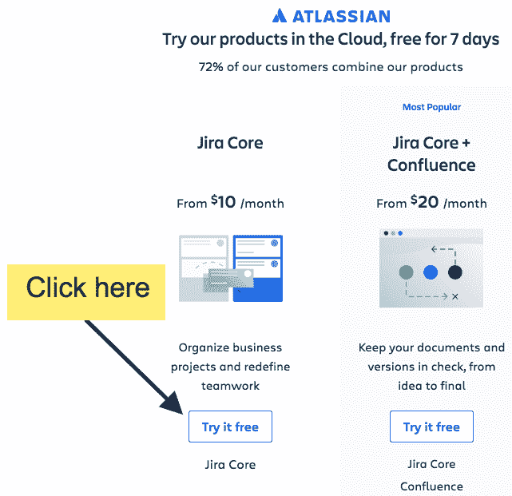

图 1：评估 Jira Core

1.  在新界面上，注册一个 Atlassian Cloud 的评估账户。填写“Claim your site”，“Full name”，“Email”和“Password”，然后点击“Sign up”按钮。

1.  你的 Jira 实例将在 Atlassian Cloud 上为你设置。

1.  在下一个界面，选择你偏好的语言并点击“继续”按钮。

1.  在接下来的几个屏幕中，你将被要求上传你的头像图片。

恭喜你，现在你已经在 Atlassian Cloud 上设置了一个新的 Jira 实例。你可以免费评估这个实例一周，之后你需要购买许可证。如果你是第一次评估 Jira，使用 Atlassian Cloud 版本是熟悉其功能的好方法。

如果你想进一步评估 Jira，你可以购买一个起始许可证，这将花费每月 10 美元，适用于 10 个用户，或者你可以评估 Jira Server-on-premise 一个月，然后为 10 个用户支付一次性 10 美元的费用。

如果你只是单纯地评估 Jira 并且需要更多时间，那么你可以免费注册一个新账户。

要了解 Jira 的核心概念，请访问以下链接：[`hub.packtpub.com/jira-101/`](https://hub.packtpub.com/jira-101/)

# 使用 Jira Core 进行业务团队管理

很棒，你已经成功创建了一个 Jira 云实例。现在让我们首先熟悉一下这个工具的基本功能。我们快速在 Jira Core 中创建一个项目。

# 创建新项目

现在让我们在 Jira 中创建一个新项目：

1.  在欢迎界面，点击“创建示例项目”按钮，如下所示：

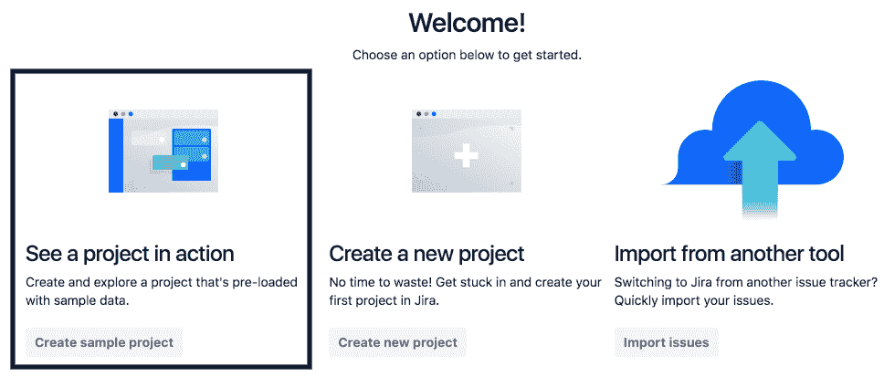

图 2

1.  在“使用示例数据创建项目”界面，你将被要求选择一个模板，在这种情况下，我们只选择“项目管理”模板，因为我们的实例中仅有 Jira Core 应用程序。当我们安装 Jira Software 和 Jira Service Desk 时，这个界面会显示更多模板。点击下一步按钮：

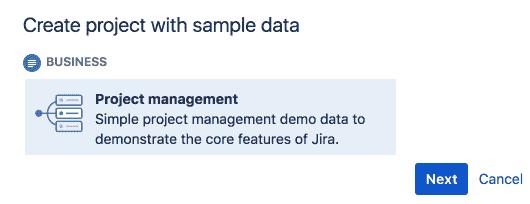

图 3

1.  下一屏将要求你提供一些信息。输入名称为“人力资源”；密钥将自动设置为 HR，但你可以根据需要更改它；项目负责人将是你的名字，但当你在实例中添加更多人时，你将选择他们的名字。最后，点击“提交”按钮以创建项目。

1.  你的第一个项目会像下面截图中显示的那样创建：

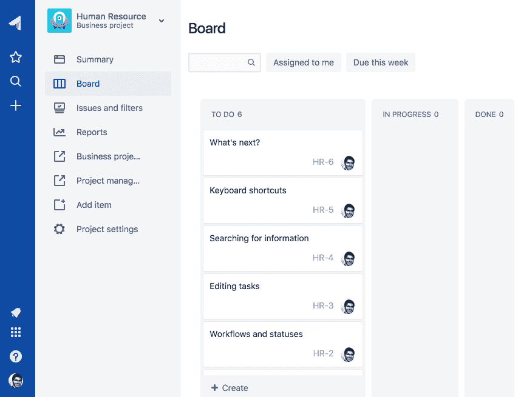

图 4

现在让我们探索 Jira Core 项目的各种功能。

# 在 Jira Core 项目中工作

现在我们在 Jira 实例中有了一个名为“人力资源”的新项目。每个 Jira 项目都有一个项目密钥，在我们的案例中是 HR。Jira 中的项目是问题的容器，这些问题实际上就是工单或不同的活动。

项目侧边栏显示在项目的左侧，包含指向与当前项目相关的部分的链接。在 Jira Core 项目中，有指向**摘要**、**看板**、**问题和过滤器**以及**报告**的链接。

# **摘要**

如你可能已经猜到的，这一部分包含了项目中发生的事情的概览。该部分的目的是让你一目了然地了解项目的动态。

此屏幕上有两个选项卡——**活动**和**统计**。

# **活动**

Jira 中的项目是不断发展的，项目中的事情也在不断变化。新的问题被添加到项目中，团队成员正在对此进行评论，问题也在逐步解决，如下所示：

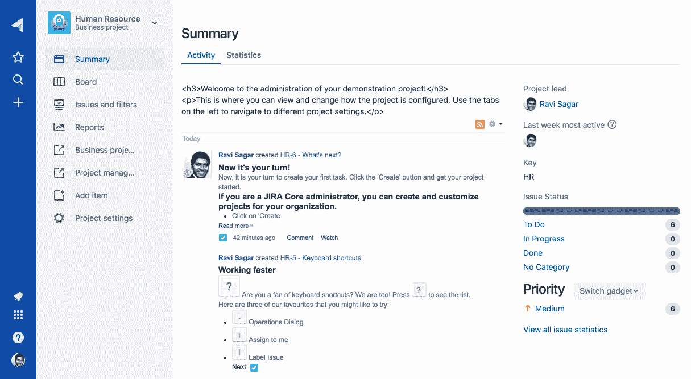

图 5

如你在前面的截图中所见，最新的评论显示在页面的中央，右侧则有关于项目负责人、按工作流状态统计的**问题状态**数量以及按优先级统计的类似数量的信息。

# **统计**

Jira 问题中有多个字段帮助我们更好地识别问题并相应地进行规划，例如**优先级**、**状态**和**组件**。

此页面将显示按不同问题属性划分的细目，包括问题的数量和百分比，如下图所示：

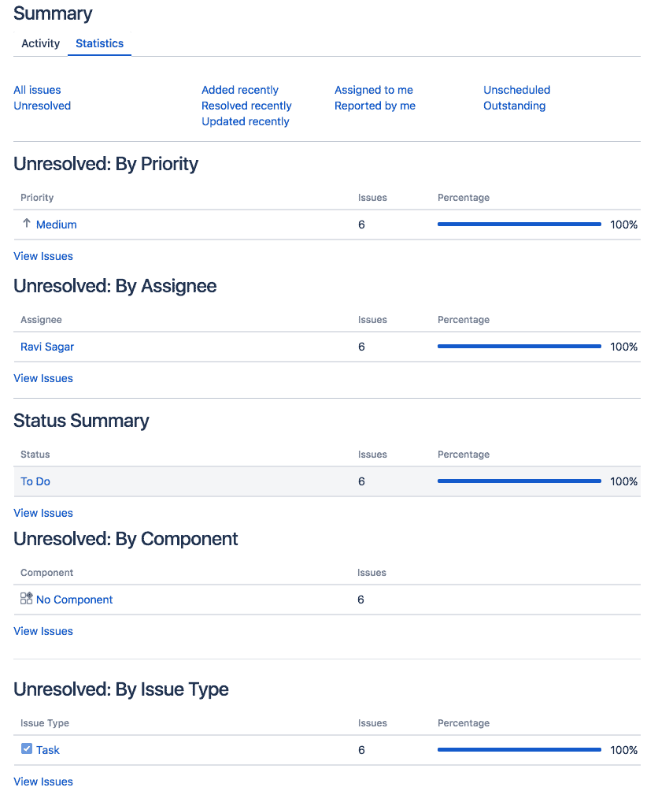

图 6

随着项目中添加更多问题，这一部分将变得更加有用，提供便捷的链接，直接将你带到问题列表。

# **看板**

该部分有三列——**待办**、**进行中**和**已完成**。这是可视化项目中工作进展的一个绝佳方式。随着项目中的成员开始工作，他们可以将问题从一列拖到另一列。这块看板会帮助所有团队成员展示最新的状态。

# **问题和过滤器**

一个项目可能有成百上千个问题，搜索这些问题或者轻松找到它们可能成为一个挑战；这就是为什么项目中的这一部分会帮助你快速搜索问题。

点击**问题和过滤器 | 所有问题**，如以下截图所示：

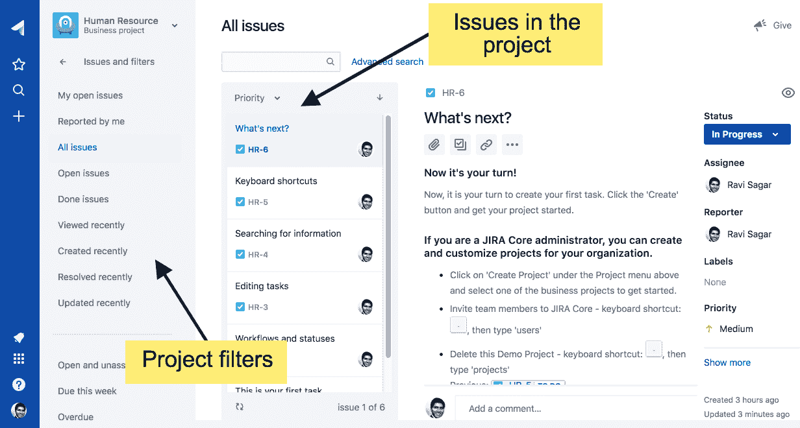

图 7

在左侧的侧边栏中，你可以看到为你的项目预设的所有过滤器，例如**我的未解决问题**、**由我报告的**和**所有问题**。点击这些链接将带你到符合该过滤器条件的所有问题列表。

这里列出了特定过滤器下的所有问题；点击任何一个问题，右侧会显示该问题的详细信息。你可以在这里做很多事情，例如更改问题的状态、添加评论、创建更多子任务和附加文件。

有其他方法可以找到与你相关的问题，但如果你处于某个项目中，那么**问题和过滤器**部分中显示的问题范围仅限于该项目。

# **报告**

一旦开始使用 Jira 项目，您也希望了解工作进展，并希望分析项目中的信息。Jira 提供现成的报告，可以帮助您以图形化的方式查看数据。

在项目侧边栏中，点击“报告”，您将进入“所有报告”部分，如下截图所示：

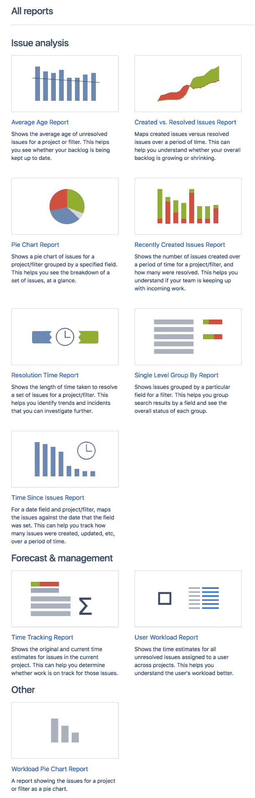

图 8：Jira 报告

这些报告大多数都是不言自明的，我强烈建议您点击任何报告以了解它提供的内容；然而，在第七章，*报告和仪表板*中，我们将深入探讨这些项目报告，并花时间理解如何将这些报告显示在仪表板上，您可以根据自己的需求或团队的需求，在自定义仪表板上混合和匹配重要的报告。

# 在 Jira Core 项目中处理任务

在熟悉了 Jira Core 项目的界面后，接下来我们将在项目中创建任务，了解如何处理任务，并在任务完成后将其关闭。

按照以下步骤创建新的任务并处理它：

1.  点击左侧边栏中的创建任务图标，如下所示：

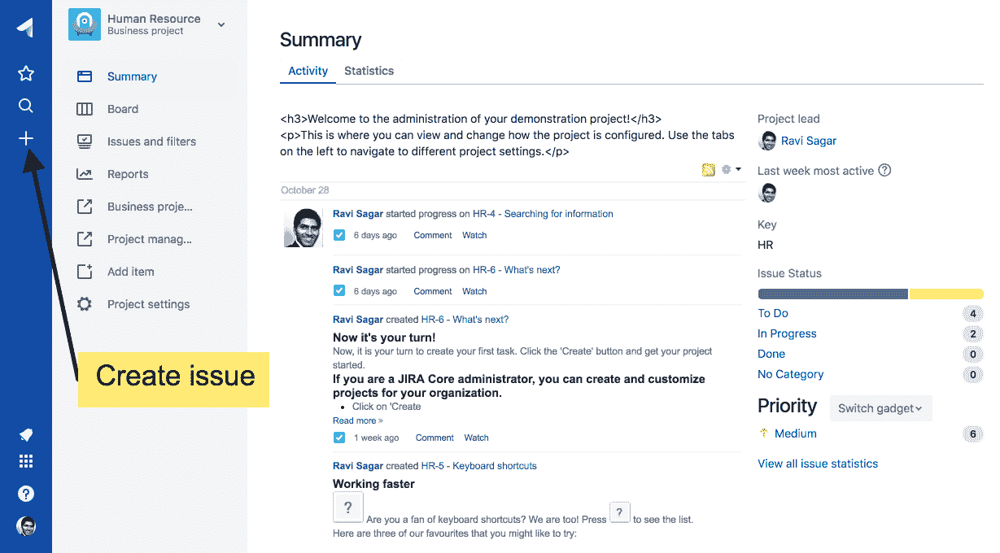

图 9

1.  系统会显示一个**创建任务**的页面。请填写该表单中的相关字段，如任务类型（任务）、概述、附件、截止日期、描述、指派人、优先级、标签、原始估算和剩余估算，然后点击“创建”按钮。除了这些系统字段外，Jira 还可以创建更多自定义字段。字段的顺序以及是否为必填项可以自定义，如下所示：

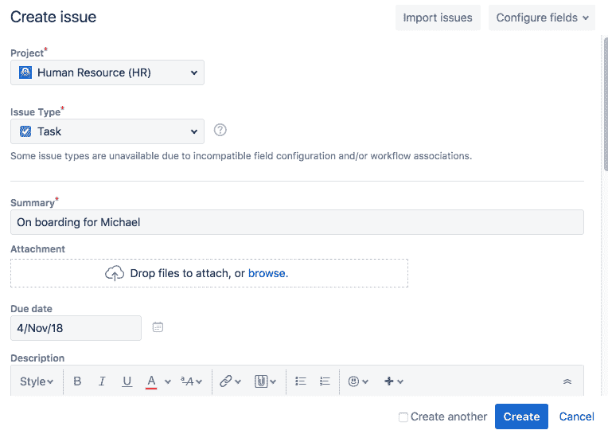

图 10

1.  新的任务将在您的“概览”和“看板”部分中创建并列出。点击任务链接，您将进入如以下截图所示的任务视图页面，在这里您可以处理该任务：

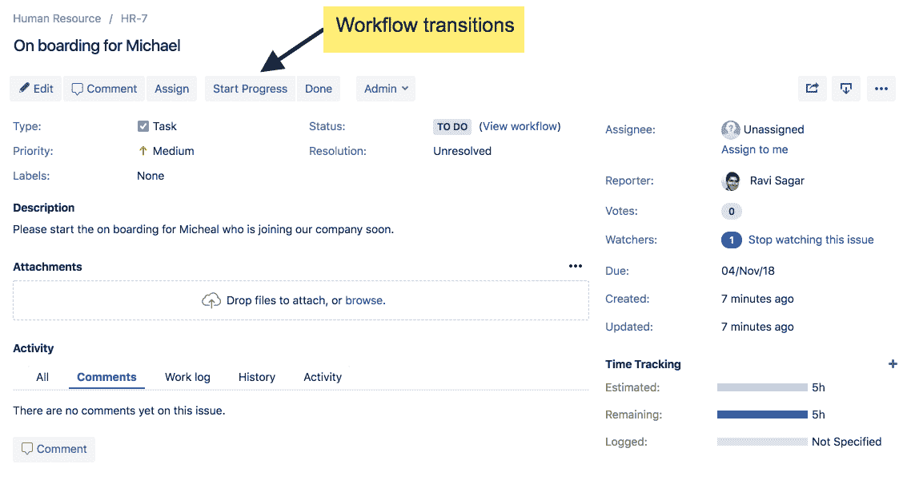

图 11

1.  在任务视图页面，您可以查看任务的所有可用详细信息。例如，在页面顶部，您会看到一些按钮，如编辑、评论、指派、开始进度、完成和管理员。在任务的主要部分，您可以查看按用户区分的各类字段，如任务类型（在此示例中为任务）、任务状态、优先级、解决方案和标签。在右侧，您可以看到指派人和报告人的信息。这个视图基本展示了所有字段，您可以在这里处理任务。

1.  点击顶部的“开始进度”按钮，这实际上是一个工作流转换。任务状态将从“待办”更改为“进行中”，如下所示：

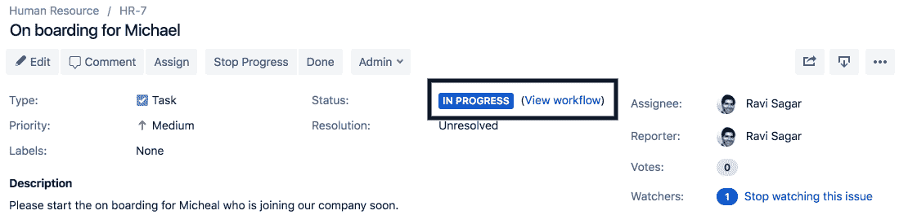

图 12

1.  如果你点击“Done”按钮，问题的状态将被更改为 Done，且解决方案也会变更为 Done。

恭喜你，已经学习了如何从头到尾处理 Jira 问题。你也可以选择不进入问题视图屏幕，而是直接从看板上处理这个问题，只需将问题从一个列拖动到另一个列即可。

# 总结

在本章中，我们首先问了自己一些重要问题，这些问题帮助我们规划了 Jira 的安装，然后我们学习了如何通过首先注册一个 Cloud 实例并在应用中创建项目，快速开始使用 Jira Core on Cloud。最后，我们花时间理解了如何从头到尾处理一个问题。

在下一章中，我们将了解 Jira Software 的工作原理；我们首先会快速回顾 Agile（敏捷）概念，然后学习如何创建 Scrum 和 Kanban 看板。最后，我们将查看关键的 Agile 报告。
