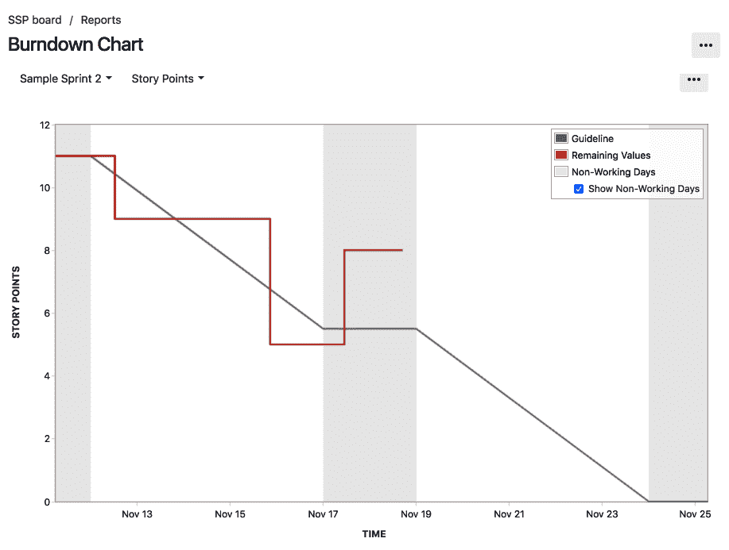

# 第三章：开发团队使用 Jira Software

本章中，我们将了解 Jira Software 的工作原理。我们将首先学习如何在 Jira Cloud 实例中启用 Jira Software，然后我们将快速创建一个新的 Jira Software 项目。接着，我们将花一些时间了解敏捷概念的概述，然后介绍 Scrum 和 Kanban 方法论，并讨论它们之间的主要区别。最后，我们将讨论 Jira Software 中的关键报告，用于分析项目的进展。

本章涵盖的主题包括以下内容：

+   开发团队使用 Jira Software

+   敏捷概念概述

+   Jira 是否适合开发项目

+   Scrum 看板

+   Jira Software 报告

+   看板

# 开发团队使用 Jira Software

Jira Software 是开发团队用来规划和跟踪项目的最受欢迎的应用之一。在前一章中，我们讨论了 Jira Core 的各个方面，Jira Core 为业务团队提供了很好的问题跟踪功能。当我们在实例中启用 Jira Software 时，它将在 Jira Core 基础上提供额外的功能。

现在，让我们通过查看 Jira Software 的功能来了解如何在 Jira Software 上工作。

# 启用 Jira Software

Jira Software 作为一个独立的应用程序，需要购买或使用试用许可证进行评估，并在我们的实例中启用。

在本书的其余部分，我们将经常提到“站点管理”部分来进行配置更改。你可以在实例的左下角访问“站点管理”部分，如下图所示：

图 1

执行以下步骤以启用 Jira Software 的试用订阅：

1.  进入“站点管理”|“账单”（在“订阅与账单”下）|“管理订阅”，然后点击“添加更多 Atlassian 产品”，如下图所示：

图 2

1.  在“发现新产品”页面，点击位于 Jira Software 旁边的免费试用按钮，如下所示：

图 3

就这样！你的 Jira Software 试用现已启用。可以随意使用 30 天；之后，你可以注册新的 Jira Cloud 实例，或者直接购买它。

# 敏捷概念概述

我们现在已经在实例中启用了 Jira Software。是时候创建一个新项目并开始工作了；然而，Jira Software 使你的团队能够使用基于敏捷的方法进行工作，并支持 Scrum 和 Kanban。因此，在我们深入了解 Jira Software 的功能之前，快速浏览一下各种敏捷概念是有意义的。

# 什么是敏捷？

敏捷仅仅是一个关于开发的价值观和原则集合。它是一种时间限制的、迭代的方式，通过增量开发软件，而不是一次性交付所有内容，从而使得交付更快且更高效。组织采纳敏捷实践的原因主要是市场在不断变化，项目的范围会在开发的后期阶段发生变化。选择的开发模型应当能够融入项目中的变化，同时仍能快速交付。

你可以通过访问以下链接阅读 12 个敏捷原则：

[`www.agilealliance.org/agile101/12-principles-behind-the-agile-manifesto/`](https://www.agilealliance.org/agile101/12-principles-behind-the-agile-manifesto/)

敏捷实践的一个关键目标是工具支持持续改进和持续交付，这也是当前流行的 DevOp 词汇中的一部分。Jira 软件不仅可以支持基于敏捷的方法论，还可以与其他开发工具进行集成。

# Scrum 和 Kanban 方法论

Jira 软件支持 Scrum 和 Kanban 两种方法论，它们是两种最常见和最受欢迎的基于敏捷的实践。让我们来理解它们之间的基本区别。

**Scrum** 是一个用于结构化项目的过程框架，其中工作先进行规划，然后按迭代（也称为 Sprint）执行。承诺是 Scrum 中的变革推动力——即团队能够交付的工作量就是承诺。其核心理念是快速交付小的可用工作成果。每次迭代（Sprint）结束后，期望交付一个可用的软件功能，并且随着未来迭代中新功能的交付，它们将被集成到现有的软件中，从而使整个软件模块化。团队内部的沟通是实现 Scrum 成功的关键。Scrum 更适用于需要规划和估算的项目，主要是软件项目。

**Kanban** 聚焦于增量改进，其中 **进行中的工作** (**WIP**) 限制是变革推动力——即团队当前正在进行的工作量是一个重要的标准。与 Scrum 相比，Kanban 更少关注规划。Kanban 方法的典型例子是支持台，工作按需进行，并且基于团队人数，需要将团队能够完成的工作量进行可视化并不断改进。

我们将在 Jira 实例中使用 Scrum 和 Kanban 创建项目，以更好地理解它们之间的基本区别。

# 关键敏捷概念

稍后我们将再次进入工具中，继续进行一个基于敏捷的方法的项目，但理解一些敏捷的关键概念或术语非常重要。以下是一些概念的解释：

+   **Scrum 工件**：包括以下内容：

    +   **产品待办事项**：这是项目中待处理的任务或问题列表。

    +   **Sprint 待办事项**：特定 Sprint 中选定的任务列表，用于开发。

    +   **燃尽图**：这是一个报告，展示 Sprint 的进展。

+   任务的类型如下：

    +   **史诗**：这是一个非常高层次的任务，可以进一步拆分成其他任务。史诗与故事类似，但用于项目的更好组织。

    +   **故事**：同样，这是一个高层次的任务，可以进一步拆分成其他任务。每个单独的故事都会进行估算。

    +   **子任务**：这些是特定故事的拆分任务。

+   **优先级排序**：这是基于优先级，指的是任务需要完成的顺序，可以是 Sprint 待办事项或 Sprint 中的任务。

+   **估算**：这基于故事点，故事点是表示完成某个故事所需整体努力的计量单位。在 Jira 中，故事点是一个数值字段。

+   **迭代**：这指的是 Sprint。它是实际的迭代，包含了需要在特定时间段内交付的已计划、已估算的故事列表。每个 Sprint 中的故事都分配给特定的用户或开发人员。

+   **可视化**：以下是常用的可视化工具：

    +   **看板**：这是一个可以查看特定 Sprint 状态的地方，例如多少个故事待办、进行中或已完成，团队中的每个人都可以查看。

    +   列：一个典型的看板有三个列—待办（TO DO）、进行中（IN PROGRESS）和已完成（DONE），根据任务状态显示问题，但如果需要，可以添加更多列。

    +   **泳道**：这是一种水平分组方式，可以在看板上创建，帮助用户在任务过多时进行管理。例如，看板上的问题可以根据开发者处理的任务或根据优先级进行分组。

+   **报告**：这些包括以下内容：

    +   **燃尽图**：这是最常用且最有用的报告之一，用于跟踪 Sprint 的进展；在图表中，原始故事点与实际燃尽或完成的故事点相对比，展示与之相关的故事已经实现。

    +   **速度图**：速度是指团队在一段时间内交付的平均故事点数。了解速度很重要，因为它将帮助 Scrum 主管或项目经理更高效地规划下一个 Sprint。

# 敏捷中的角色

现在我们已经了解了各种关键的敏捷概念，我们还可以了解在一个典型的基于敏捷的项目中涉及的不同角色或人员，具体如下。我们主要需要了解这些人将在我们的项目中做什么：

+   **Scrum 产品负责人（利益相关者或业务分析师）**：他们定义我们在前一节讨论的产品待办事项，并编写需要实现的故事，以确保项目成功。

+   **Scrum 主管（项目经理或项目负责人）**：他们将组织 Scrum 会议，定义任务优先级，估算故事点，分配工作给开发人员，并启动 Sprint。

+   **Scrum 团队（开发人员或测试人员）**：顾名思义，这些是实际的开发人员，他们将负责实现用户故事或在发布之前进行测试。

当然还有更多角色，但这三种是你在 Jira 项目中应当了解的最基本角色。现在我们已经完全准备好深入探讨 Jira 软件项目。

# Jira 是否适用于开发项目？

你一定在想 Jira 软件是否足够满足你的开发项目需求，我们需要讨论一些要点，来了解为什么 Jira 可能是项目管理的最佳选择。

Jira 软件的优势如下：

+   Jira 支持标准的开发方法论

+   它可以开箱即用

+   除了开箱即用的模板，还可以创建自定义工作流来支持相关流程

+   可以定义不同的角色，如开发人员和测试人员

+   它支持与开发工具如 Bitbucket、GitHub、Bamboo 和 Jenkins 的集成

+   Jira 完美支持 DevOps 实践

除了单独使用 Jira——一个非常棒的问题追踪工具——在第一章《介绍 Jira》中，我们讨论了 Marketplace 应用的概念，以扩展 Jira 软件的功能。

以下是一些流行的应用示例，用于扩展 Jira 的功能，包括工时表、测试和高级报告：

+   Tempo Timesheet：为你的项目提供工时表功能

+   Zephyr 和 X-ray：使用 Jira 进行测试管理

+   EazyBI：为你的项目创建定制报告

+   BigPicture：创建甘特图来规划项目

+   Portfolio：敏捷路线图和场景

我希望你现在已经迫不及待地想开始使用 Jira 了。那么我们现在就来做吧。

# Scrum 看板

Jira 软件让你在项目中实现 Scrum 技术，借助 Scrum 看板。为了理解这些工具的特点，我们将使用开箱即用的模板和一些示例数据创建一个项目。

# 创建一个示例的 Scrum 项目

Scrum 看板可以从任何现有的包含预定义问题的 Jira 项目中创建。也可以从一个新的空白项目中创建 Scrum 看板。此外，如果你想了解 Jira 软件的工作原理，可以创建一个预填充示例数据的示例项目。

执行以下步骤：

1.  按下*/*（斜杠键）；它会在左侧显示搜索界面。输入`boards`并点击“查看所有看板”（在 BOARDS 下），如以下截图所示：

图 4

1.  在看板部分，按下“创建看板”按钮，如以下截图所示：

图 5

1.  在“创建看板”弹窗中，点击“使用示例数据创建 Scrum 看板”，如以下截图所示：

图 6

1.  完成项目名称、项目键和项目负责人字段，然后点击“创建板”按钮，如下所示：

图 7

我们刚刚创建了一个带有示例数据和 Scrum 板的项目。

# 使用故事点填充、排名和估算待办事项

在新创建的项目中，我们有一个默认显示的 Scrum 板。您现在将看到待办问题列表和尚未在 Backlog 部分解决的问题，以及一个示例 Sprint，如下所示：

图 8

Backlog 包含项目或板中待处理的问题。这些问题尚未计划执行。在项目侧边栏中，第一个选项卡是 Backlog，然后是 Active sprints。一旦冲刺开始，您将使用 Active sprints 选项卡进行管理和工作。

样本 Scrum 板已经包含了一个特定顺序中的 Sprint，该 Sprint 包含特定问题。Sprint 是一个时间段，在此期间需要完成特定的计划活动。Scrum 主管或项目经理可以定义问题完成的顺序。这个顺序也称为排名，工作在这些问题上的团队需要遵循这个顺序。排名很重要，因为有些任务必须在其他任务开始之前完成。

在 Scrum 方法论中，对个别任务的估算不仅基于花费的时间，还基于任务的复杂性。例如，有两个估计时间为一天的任务，但第一个任务执行起来复杂，因为这是团队第一次执行它或由于其他某些原因。复杂性通过故事点来衡量。故事点可以是 1 到 10 之间的任何数字，或者是斐波那契数列中的任何数字，即 1、1、2、3、5、8、13 和 21。数字越高，任务越复杂。

Scrum 主管可以为 Sprint 中的问题分配故事点；虽然每个问题的 Sprint 中都没有必须具备故事点，但是有故事点将使团队了解问题的复杂性。

# 规划和创建冲刺

样本 Scrum 板已经包含一个正在运行的冲刺；让我们创建一个新的冲刺。Jira 软件允许您即使活动冲刺未完成也可以创建另一个冲刺，但不能启动新的冲刺。然而，可以在 Jira 软件中启用并行冲刺功能，使我们能够同时运行多个冲刺。

在 Scrum 板的 Plan 模式下，必须计划冲刺的规划。按照以下步骤一起运行多个冲刺：

1.  导航到 Jira（在 APPS 下）| Jira 设置 | 应用程序 | Jira 软件配置（在 JIRA 软件下），如下所示：

图 9

1.  勾选“并行冲刺”复选框。就这样：现在只需回到你的看板，开始规划下一个冲刺。

1.  返回项目，在待办事项（Backlog）标签页中，点击位于问题待办事项前的“创建冲刺”按钮，如下图所示：

图 10

1.  将创建一个空的冲刺。

1.  现在，开始将问题从待办事项拖动到冲刺中，如下所示：

图 11

1.  一旦你将所有问题放入冲刺中，你可以在冲刺内重新排序它们并定义它们的优先级，也就是哪个问题需要首先执行，哪个第二，依此类推。

1.  可选地，你还可以创建史诗来将多个故事组合在一起。史诗是一个较大的故事，创建起来非常简单。点击冲刺左侧的“创建史诗”链接，如下所示：

图 12

1.  在弹出窗口中，输入史诗名称和摘要。点击“创建”按钮，继续操作，如下所示：

图 13

1.  你可以创建更多的史诗；最后，将问题从冲刺拖动到史诗中。这将把问题分配为这些史诗的一部分：

图 14

1.  在将问题分配到史诗（Epic）后，你可以开始冲刺。点击新建冲刺右上角的“开始冲刺”按钮。在弹出窗口中，输入冲刺名称并选择持续时间和开始日期，结束日期将自动更新。你还可以选择填写冲刺目标。最后，点击“开始”按钮，如下所示：

图 15

请注意，在你没有充分规划问题、排序并估算故事点之前，永远不要开始冲刺。一旦你开始冲刺，你将被带到 Scrum 看板的“活跃冲刺”标签页。在这里，你将看到你冲刺中的所有问题，分为三个列：待办（TO DO）、进行中（IN PROGRESS）和已完成（DONE），如下所示：

图 16

在“活跃冲刺”中，个人指派人可以将问题拖动到任一列。

在活跃冲刺中可以进行很多自定义操作，以使此部分更有效。

# 配置泳道、卡片颜色、编辑卡片字段和快速过滤器

活跃冲刺是团队成员在冲刺进行时会监控的看板部分。当参与冲刺的人数过多时，他们可能会难以找到自己正在处理的问题。让我们来看看一些对 Scrum 看板的自定义操作。这些选项都可以在特定看板的“看板设置”中找到，如下所示：

图 17

点击“看板设置”并查看你在看板中可以进行的配置。

# 泳道

在工作模式下出现的那些问题可以被分组，这样对应的成员就能更容易地在看板上找到这些问题。而且，当问题从一个列拖动到另一个列时，只能在它们的组内拖动，这个组称为游泳道（swimlane）。默认的游泳道是故事问题类型。游泳道也可以基于史诗（epics）来设置，或者完全没有游泳道。

# 卡片颜色

在“活动冲刺”部分出现的各个问题会显示在一个叫做卡片的矩形框中。可以根据问题类型、优先级、指派人或查询条件更改这些卡片的颜色。

# 卡片布局

在“待办事项”和“活动冲刺”部分，卡片会显示问题 ID 和问题摘要，但也可以最多添加三个额外的字段。总共，你可以在卡片上显示三个额外的字段。这个设置是为了使提供附加信息的字段对整个团队可见。

# 快速筛选器

我们看到了如何自定义游泳道来分组多个问题。设想一个情况，当前活动冲刺中有 20 个问题分配给了你，但其中有些问题是最高优先级的。在这种情况下，不仅能快速筛选出分配给你的问题，还能基于优先级（例如最高优先级）来筛选问题，这将会非常有用。通过在快速筛选器中添加一个自定义查询（JQL），你可以实现这一点。稍后在本书中，我们将了解如何创建 JQL 查询。这些自定义设置帮助团队高效工作，从而不需要花费大量时间去寻找相关信息。

# Jira 软件报告

你已经学习了如何规划、估算和启动冲刺，以及如何在看板中进行各种配置。我们还查看了团队如何查看自己在冲刺中的任务。现在，是时候监控团队的进展了。有两个报告非常重要。一个是燃尽图，它清晰地展示了冲刺的当前状态。另一个是速度图，它帮助我们了解团队的工作容量，即团队能够处理多少工作量。这两个报告有助于 Scrum 主管监控项目的进度。让我们一起来看一下这两个报告。

# 燃尽图

在规划冲刺时，我们主要做了两件重要的事情。首先，我们优先考虑了需要完成问题的顺序。其次，我们为问题估算了故事点。这些我们最初计划的故事点，给出了任务复杂度的一个大概了解。现在，当冲刺开始时，一个基准线就形成了，基准线位于开始日期和结束日期之间，并在图表中以灰色线条显示，表示从冲刺开始日期到结束日期执行问题的理想情况。当问题被解决时，它的故事点就被燃尽，整个冲刺剩余的故事点减少。

在项目滑动条上，导航到报告 | 燃尽图（在敏捷下），并选择示例冲刺 2，如图所示：

图 18

当团队开始处理问题时，另一条线—这次是红色的—开始跟随基准线。通过查看此图表，整个团队可以轻松判断是否按计划进行。如果剩余值的线条在基准线之上，表示故事点的燃尽速度较慢。最终，冲刺中的所有问题将无法完成。

紧接着燃尽图，展示了各个问题的详细信息，你可以看到冲刺开始时有多少个问题。随着问题的解决，它们的故事点从冲刺的总故事点中扣除。总故事点和剩余故事点将展示给用户。

# 速度图

每个冲刺开始时都有一个总的故事点数。理想情况下，团队应该完成所有这些点。在现实情况下，冲刺结束时并不总是能够完成所有任务。Scrum 主管的主要职责之一是确保团队有刚好足够的故事点来燃尽，既不能太多，也不能太少。然而，在冲刺开始时，估算团队能够燃尽的故事点数量并不容易。速度图简单地显示了计划的故事点数与团队实际完成的故事点数之间的比较。这个对比是针对过去几个冲刺显示的，以便可以计算出团队的平均燃尽量。这就是团队的容量。

导航到报告 | 速度图（在敏捷下），如图所示：

图 19

该图表清晰地显示了团队在过去的冲刺中已完成的故事点。如果你计算出团队迄今为止燃尽的所有故事点的平均值，就能了解你的团队的容量。这有助于 Scrum 主管规划下一个冲刺，确保团队有足够的资源。

# 看板

Scrum 技术适用于任何需要规划的流程，但也有多种情况，其中团队在需要时持续处理任务。一个典型的使用案例是客户支持项目，在这些项目中，特定数量的人被指派处理公司为特定产品或项目提出的问题。通常，这些支持问题需要即时响应，并且不需要详细规划。

在这种情况下，待处理问题的整体可视化非常重要。看板没有像 Scrum 看板那样的计划模式。它只有工作模式，类似于 Scrum 看板。

# 设置看板

可以使用现有的项目或过滤器来创建看板。为了理解看板技术在 Jira 中的运作方式，可以创建一个示例看板和项目，就像我们之前创建的基于 Scrum 的项目一样。正如您从以下截图中看到的，*活动冲刺*标签在看板中是没有的：

图 20

团队只看到看板。这个看板与 Scrum 看板非常相似；您还可以根据任务分配者配置泳道；默认情况下，Kanban 看板的泳道配置为使用优先级 = 最高的查询。这意味着需要立即解决的问题会显示在最上面。

被分配这些问题的人可以将问题从一列移动到另一列。这些列表示工作流状态。我们为 Scrum 看板所做的大部分配置也可以在看板上完成。

# 列约束

当团队处理支持问题时，尽快解决问题是非常重要的。通常，公司会与客户签订 SLA（即服务级别协议），在协议中需要确定解决时间。在这种情况下，整个团队应该对需要处理的问题有一个整体的了解。例如，如果在支持问题上可用的人数较少，那么这些人能够同时处理的问题数量就会受到限制。在示例看板中，您可以注意到，当“进行中”列中有多个问题时，该列会变成红色。您可以通过进入看板设置来更改这一点。

# 总结

在本章中，您学习了如何使用 Jira 软件实现 Scrum 和 Kanban 敏捷方法。我们首先花了一些时间理解敏捷概念，然后理解了如何在 Jira 中使用这两种看板及其配置。

在下一章中，我们将讨论如何实施 Jira Service Desk 来处理 IT 帮助台和支持台。我们将了解该应用程序的各种功能，并探讨如何定制它们以便更好地为您服务。
