# 第四章：使用 Jira Service Desk 管理帮助台

在本章中，我们将讨论如何使用 Jira Service Desk 实现一个帮助台，以处理 IT 帮助台和支持请求，这不仅易于使用，而且还自带预配置的工单系统功能。

我们将首先介绍典型帮助台系统的各个方面，然后快速创建一个 Jira Service Desk 项目，并了解其各种功能，以帮助我们实现一个优秀的服务台。

本章涵盖的主题包括以下内容：

+   使用 Jira Service Desk 管理帮助台

+   帮助台概述

+   创建 Jira Service Desk 项目

+   配置 Jira Service Desk

+   Jira Service Desk 报告

# 使用 Jira Service Desk 管理帮助台

Jira Service Desk 是增长最快的 Atlassian 产品，因为它使帮助台团队能够轻松管理其工作。到目前为止，我们已经讨论了 Jira 的各个方面。我们通过创建项目了解了 Jira Core 和 Jira Software 的功能，帮助你和你的团队使用这个直观的工具来管理任务和开发活动。Jira Service Desk 在构建时以客户满意为首要考虑，并且通过友好的客户门户，使任何客户都可以轻松地在 Jira Service Desk 中提交和跟踪他们的工单；同时，技术人员（也称为代理）使用熟悉的 Jira 界面处理这些工单。

# 启用 Jira Service Desk

在第三章《*使用 Jira Software 进行开发团队管理*》中，我们学习了如何通过访问“账单”下的“管理订阅”部分来启用新应用。请同样操作，启用你的云实例中的 Jira Service Desk。

启用 Jira Service Desk 后，你将有 30 天的时间进行评估或学习。

# 帮助台概述

现在你急于在 Jira Service Desk 中创建一个项目，但首先了解典型帮助台系统的基本概念和各个方面更为合理。这些概念将帮助你更好地理解 Jira Service Desk。

# 任何帮助台的基本功能

让我们快速浏览一下典型帮助台的各个方面和功能：

+   **不同的用户角色——客户与代理：**在帮助台中，主要有两种类型的用户；一是你的客户，他们会在系统中提交工单来寻求帮助；另一方面，代理会回应这些工单并为客户提供帮助。

+   **服务水平协议：** 客户希望尽快解决他们的工单。在客户提出工单后，你不能指望他们无限期等待。服务水平协议，通常简称 SLA，定义了代理响应和解决工单的速度。在提供服务时，可以与客户或客户方约定多个 SLA。SLA 只不过是一个时间框架，代理需要在其中完成某个动作，例如解决工单。

+   **电子邮件通知：** 任何帮助台工具都为客户和代理提供一个互动平台；然而，向客户发送电子邮件通知可以确保工单已成功提交并被支持团队接收。在工单生命周期中，很多时候可以向相关方发送电子邮件通知；这旨在确保及时采取适当的行动。

+   **与客户互动的能力：** 当客户提出工单时，代理可以直接解决该工单，或者代理需要更多信息以便进一步处理该工单。代理还可以通过在工单上发布评论与客户互动，客户也可以通过回复评论进行交流。这是一种代理与客户之间互动的绝佳方式。

+   **报告：** 服务台团队经理希望查看各种分析数据，以了解团队的表现。经理会问很多问题，例如：我们上个月解决了多少工单？SLA 违反了多少次？我们是否超负荷工作？当前有多少工单未解决？这些问题的答案可以通过查看服务台工具中的报告来找到。

现在让我们来看一下常见的帮助台流程。

# 帮助台流程

帮助台可用于通过处理客户的工单来提供支持。工单可以有不同类型，代理处理工单的方式也可能根据请求的性质不同。工单的处理方式由背后的流程定义。流程定义了如何处理不同类型的请求

最常见的帮助台流程如下：

+   **事件管理**：*网站宕机* 是一起事件

+   **问题管理**：*网站几乎每周都宕机* 可能是由于某个问题

+   **变更管理**：*更新数据库版本* 是一次变更

+   **服务请求**：*请重置我的密码* 是一个服务请求

还有许多其他流程，如发布管理和知识管理；如果你想了解更多内容，请阅读 ITIL（原为信息技术基础架构库的缩写），它是一套关于**IT 服务管理**（**ITSM**）的详细实践指南。

现在我们已经有了必要的背景，可以开始使用 Jira Service Desk 了。

# 提交工单的不同方式

工单通常由客户提出并由代理处理；但是，你一定会想：客户是如何提交工单的？

在 Jira 中，有四种不同的方式可以在 Jira Service Desk 中提交工单：

+   **客户门户**：这是一个与 Confluence 知识库集成的基于 web 的界面

+   **电子邮件**：客户可以向帮助台发送电子邮件

+   **Jira Service Desk**：代理可以代表客户提交工单

+   **RESTful API**：可以通过编程方式提交工单

了解这些方式很重要，因为在 Jira Service Desk 中，这些提交工单的不同方式被称为渠道。对于帮助台或服务台经理来说，了解通过特定渠道提交的工单数量非常重要。

# 创建一个 Jira Service Desk 项目

让我们在实例中创建一个 Jira Service Desk 项目。我们已经在实例中启用了 Jira Service Desk 订阅。

执行以下步骤来创建一个 Jira Service Desk 项目：

1.  进入 Jira 设置 | 项目，然后点击右上角的创建项目按钮，如下图所示：

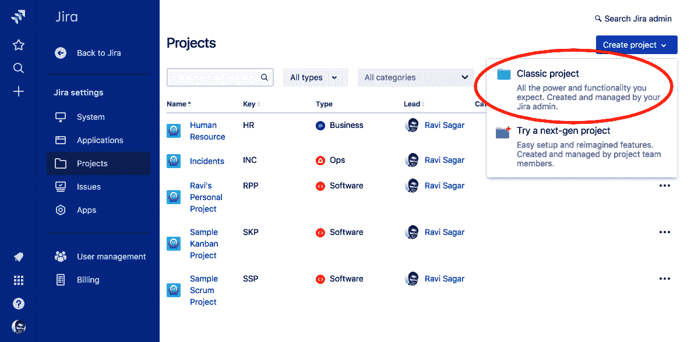

图 1

1.  点击经典项目 | 更改模板，然后选择 IT 服务台，如下图所示：

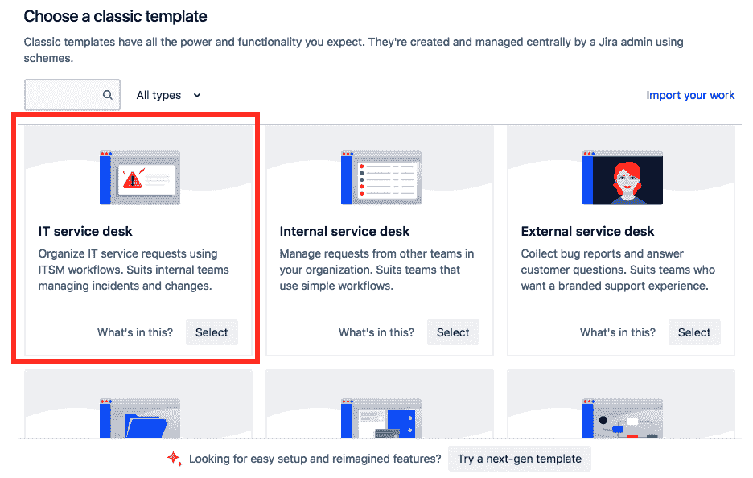

图 2

1.  在创建项目页面，输入项目名称并点击创建按钮，如下所示：

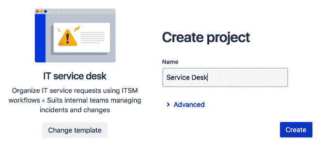

图 3

1.  你的新 Jira Service Desk 项目已经准备好。屏幕将类似于以下内容：

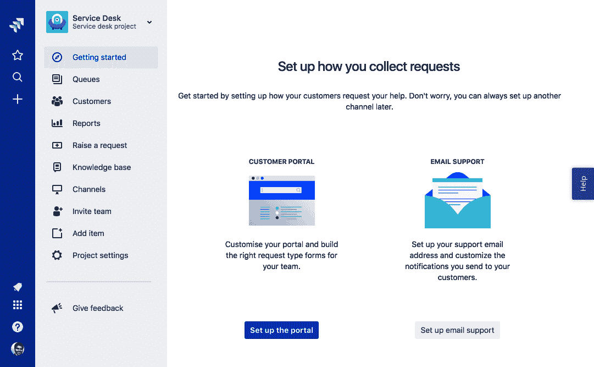

图 4

你可以直接开始使用这个项目，因为 IT 服务台模板提供了开箱即用的配置；不过，我们将通过项目的各个方面，了解如何自定义它，使其更符合你的特定需求。

# 使用 Jira Service Desk

恭喜你创建了第一个 Jira Service Desk 项目！虽然你可以直接开始使用它，但我们希望从客户门户入手，了解它的重要功能，客户可以通过这个网页界面提交工单并联系你。

# 客户门户

Service Desk 应用的最主要目的，是集中关注支持请求和工单系统，以满足最终用户和客户的需求。使用 Jira，可以创建一个简单的项目来跟踪问题，并为客户提供访问权限，前提是有足够的许可；然而，通常情况下，最终用户可能不觉得登录到问题跟踪系统来提交请求是直观的。Atlassian 理解了这一点，因此创建了一个带有专用客户门户的 Service Desk 应用，这个客户门户是一个相当简洁、易用的界面，客户可以通过它提交支持请求。

每个 Service Desk 项目都会有自己独立的客户门户 URL，如下所示：

`https://JIRAURL/servicedesk/customer/portal/1`

您将在点击项目侧边栏中的“提出请求”标签时找到此 URL。您可以将此 URL 分享给您的客户，或将其发布在您的网站上。客户门户提供了一个简单直观的界面来提出请求。让我们一起浏览这个门户；请在您的网页浏览器中打开此 URL。您将看到一个类似以下内容的页面：

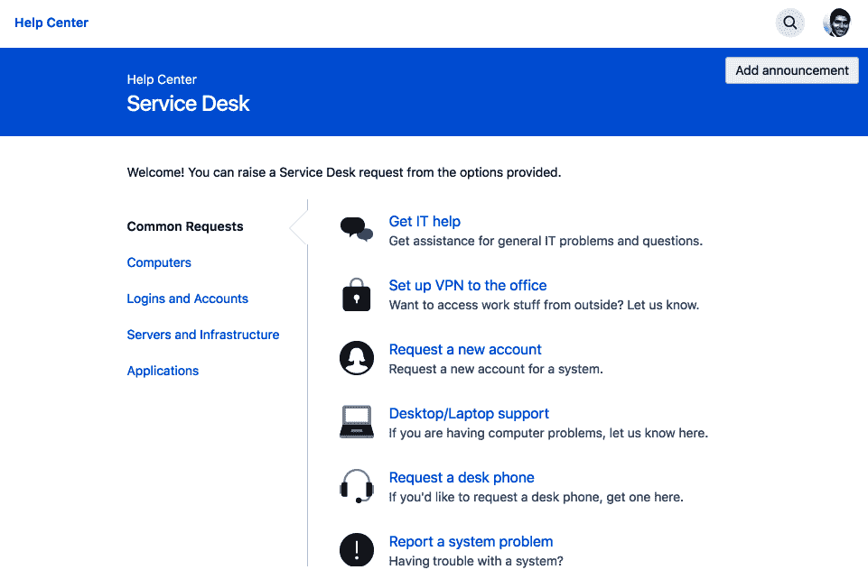

图 5

在左侧，列出了各种用户组，并且在每个组下列出了多个请求类型，例如“获取 IT 帮助”、“设置 VPN 连接到办公室”和“请求新帐户”。这些请求类型实际上被分配给 Jira 中的特定问题类型。我们可以创建一个新的请求类型，并将其映射到任何现有问题类型。

点击“报告系统问题”打开一个新页面，填写表单以提出请求，如下所示：

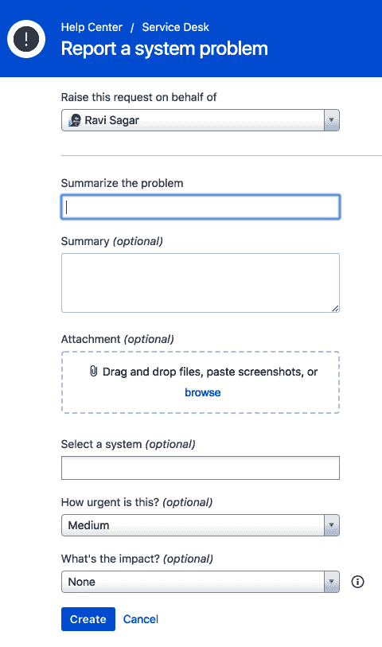

图 6

客户可以填写此表单并点击“创建”按钮来提交请求。

一旦请求提交，Jira 中将为服务台代理创建一个问题。

客户门户可以进一步自定义；请参考以下链接了解更多信息：

+   **自定义帮助中心**：[`confluence.atlassian.com/servicedeskcloud/customize-the-help-center-954239157.html`](https://confluence.atlassian.com/servicedeskcloud/customize-the-help-center-954239157.html)

+   **配置门户**：[`confluence.atlassian.com/servicedeskcloud/configuring-the-customer-portal-732528918.html`](https://confluence.atlassian.com/servicedeskcloud/configuring-the-customer-portal-732528918.html)

# 队列

队列只是根据预定义条件过滤出来的一个问题列表。例如，您的项目中已经定义了多个队列，如“所有打开的”、“分配给我”、“未分配的问题”、“事件”、“服务请求”、“变更”和“问题”。您可以在点击项目侧边栏中的“队列”时找到它们。

您还可以创建自己的队列。转到“队列”并点击“新建队列”链接，结果如以下屏幕截图所示：

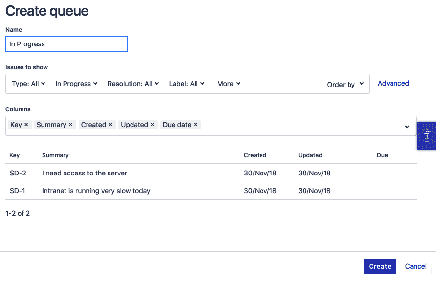

图 7

在创建队列页面中，在“名称”字段下输入`In Progress`，在“显示的问题”字段下选择“状态”为“进行中”。如果你熟悉 JQL，可以点击位于“显示的问题”部分旁边的“高级”链接。点击“创建”按钮保存队列。

队列现在将被保存，并可以在项目中的现有队列列表中使用。

# 客户权限

默认情况下，您的服务台项目对所有人开放，任何人都可以提交工单，但我们可以限制哪些用户或组可以作为客户并在此项目中提出请求。

转到“客户”|“更改权限”以管理谁可以提交工单，如下所示：

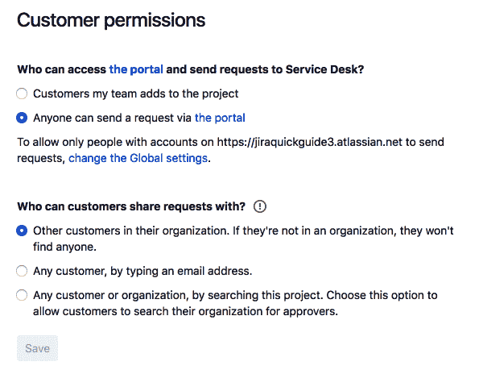

图 8

在这里，您还可以选择让客户通过客户门户与其他客户共享工单。

# 配置 Jira 服务台

Jira Service Desk 提供了多种配置选项。这些选项可以在您的项目的“项目设置”中找到。大多数配置是特定于 Jira Service Desk 项目的，用于定义您的客户如何与服务台进行交互。

让我们来看一下重要的配置。

# 请求类型

之前我们讨论了客户门户，它是最终用户的简单界面。用户可以选择不同类型的请求，这些请求类型在内部映射到特定的“问题类型”。在此部分，您可以创建新的请求类型并修改现有的请求类型，如下所示：

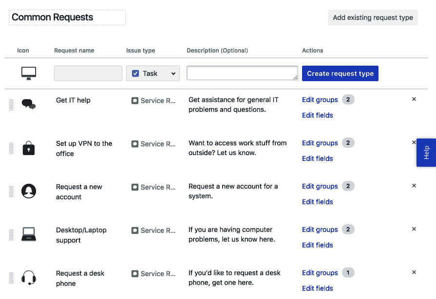

图 9

输入请求名称，例如“硬件问题”，选择问题类型为“问题”，输入描述，然后点击“创建请求类型”按钮。现在，如果您返回到客户门户，会有一个新的请求类型添加，但它只包含摘要字段。接下来，让我们为此请求类型添加更多字段，如下所示：

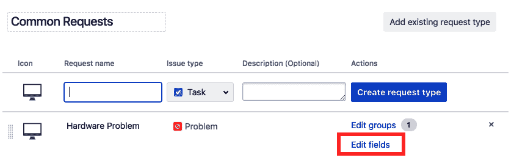

图 10

点击与您想要修改的请求类型对应的“编辑字段”链接，如下所示：

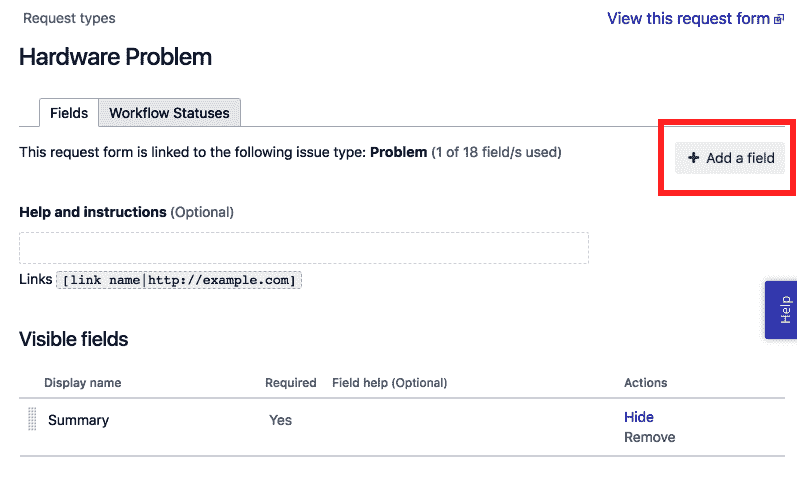

图 11

现在点击屏幕右上角的“添加字段”按钮，结果如下所示：

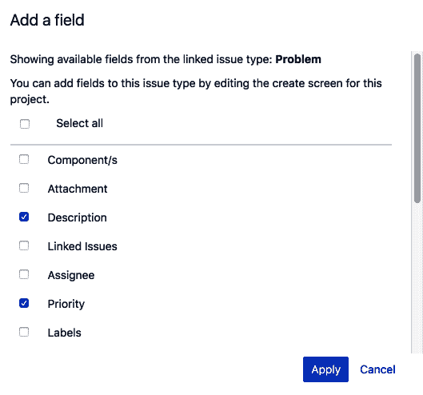

图 12

在“添加字段”弹窗中，选择您想添加的字段并点击“应用”按钮。

现在这些字段将被添加，并且会在客户门户中显示给最终用户。您还可以在此部分将某些字段设置为必填项。

# 门户设置

在此部分，您可以更改客户门户的名称，默认情况下它与您的项目名称相同，您还可以上传自定义徽标。

您还可以向用户发布公告，公告将显示在客户门户的顶部。

# 邮件请求

除了客户门户，您还可以配置 Jira Service Desk，使您的客户通过向特定的电子邮件地址发送邮件来创建工单。我们需要先配置项目以启用此功能。

点击“启用邮件请求”按钮，如下所示：

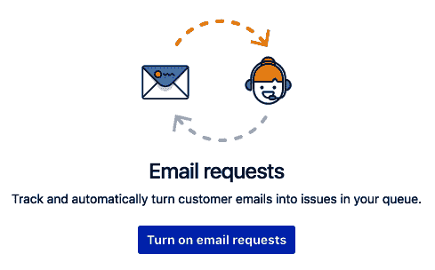

图 13

在下一个屏幕中，点击“添加自定义电子邮件地址”按钮，结果如下所示：

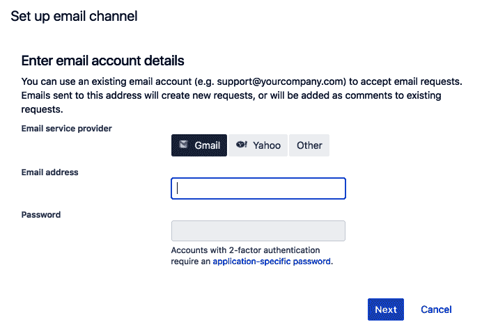

图 14

在设置电子邮件通道弹窗中，输入您的电子邮件账户详细信息。如果您使用的是 Google Apps 账户，则输入电子邮件地址和密码，但您也可以通过“其他”选项卡配置基于 POP 和 IMAP 的账户。点击“下一步”按钮继续。接下来会显示如下屏幕：

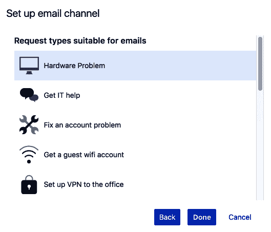

图 15

现在，您需要选择哪个请求类型将用于通过电子邮件创建问题，并点击底部的完成按钮。

电子邮件现在将与此项目配置。Jira Service Desk 将持续读取指定的收件箱，每当有新邮件时，它会将邮件主题复制到摘要字段，将邮件内容复制到描述字段。

# 满意度设置

在 Service Desk 项目中，您的客户可以提供反馈。这将帮助您了解他们的满意度。在此部分，您可以启用或禁用此功能。

# 知识库

Service Desk 项目可以与 Confluence 空间集成。这非常有用：当客户通过客户门户提交请求时，他们可以看到 Confluence 上相关的页面。客户可以浏览这些相关页面，可能会解决他们的问题，从而无需提交请求。与 Confluence 的集成可以在此部分完成，您可以指定在 Confluence 中哪个空间将与您的 Jira Service Desk 项目链接。

# SLA

Service Desk 项目配有一些预配置的服务级别协议，也称为 SLA。以下列出了一些常见的 SLA：

+   **Time to resolution**：从问题创建到解决所花费的时间

+   **Time to first response**：从问题创建到为客户添加评论所花费的时间

我们还可以创建自己的 SLA，例如 Time to assign。请按照以下步骤在项目中创建新的 SLA：

1.  点击左侧的 New Metric 链接

1.  在 New Metric 屏幕中，输入度量的名称：`Time to assign`

1.  选择开始时间，以便计时开始

1.  选择停止时间，计时将在此结束

1.  在 Goals 部分，输入目标为 4h 用于 All remaining issues，并点击更新按钮

1.  点击顶部的 Create 按钮保存新的 SLA，如下所示：

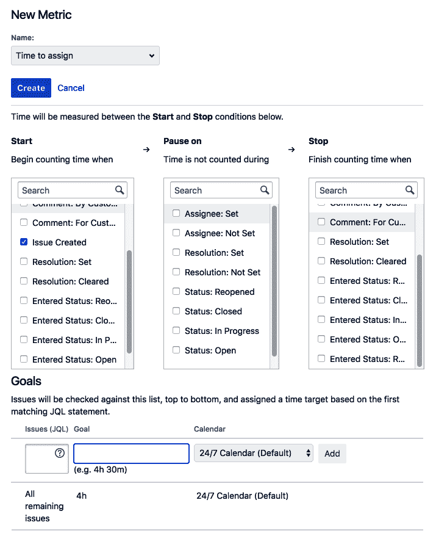

图 16

新的 SLA 将反映在项目中所有现有和新创建的问题上。在此部分，您还可以配置包含工作日、工作时间和假期的日历。SLA 时钟将在非工作时间停止，这些日历可以与任何 SLA 映射。我们定义的 SLA 目标可以适用于项目中的所有问题，也可以基于 SLA 配置中的 JQL 适用于部分问题。

# 自动化

Service Desk 项目配有一个实用工具，您可以用来在项目中添加一些自动化任务。这个工具帮助团队执行重复性任务并强制执行一些政策。

例如，我们刚刚添加了一个新的 SLA，要求在问题创建后的四小时内将问题分配给代理。我们实际上可以在此 SLA 剩余 60 分钟时对请求发表评论。此评论仅对当前分配给该项目的代理可见。

要添加新规则，请点击右上角的 Add rule 按钮，如下所示：

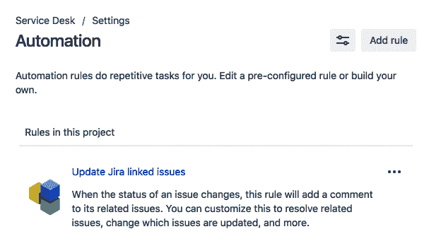

图 17

在“新建自动化规则”弹出窗口中，选择“创建自定义规则”，然后按下“继续”按钮：

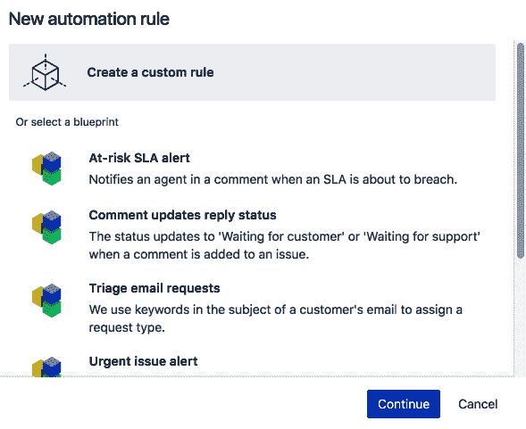

图 18

在下一个屏幕中，我们需要在“当此发生时”下添加触发器，并在“然后执行此操作”下添加操作：

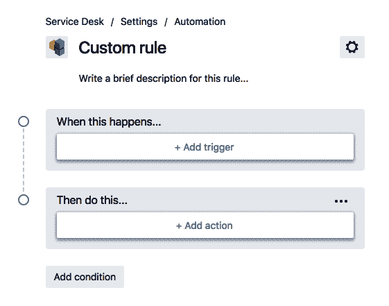

图 19

点击“添加触发器”，选择“SLA 剩余时间”作为“分配时间”，然后按“添加”按钮。确保事件设置为“即将到期（剩余 60 分钟）”，如下所示：

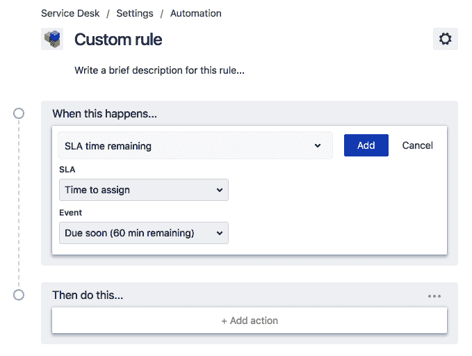

图 20

现在点击“添加操作”，选择“添加评论”，将评论类型选择为“内部”，然后按下“添加”按钮，如下所示：

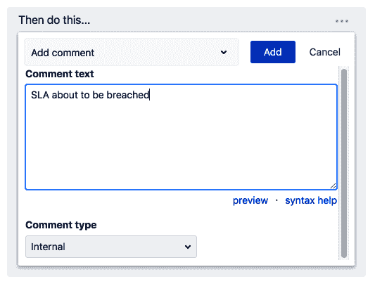

图 21

我们现在已经添加了一个新规则，当 SLA 在接下来的 60 分钟内到期时，会在问题上发布一条内部评论；根据你在项目中的通知方案，你可能还会收到来自 Jira Service Desk 的电子邮件通知。

# Jira Service Desk 报告

服务台项目内置了一些非常实用的报告，可以帮助你了解团队在支持项目中的当前进展。

让我们来了解这些报告的目的。如果你点击项目侧边栏中的“报告”链接，这些报告将可用。

# 工作负载

这是一个简单的报告，显示了你的团队当前正在处理的请求数量。它有助于你将工作负载均匀地分配给代理人。该报告显示了每个代理人正在处理的事务数量。这是一个重要的报告，帮助项目负责人将工作均匀分配给代理人，避免工作分配过多或过少。

# SLA 目标

服务台提供了像首次响应时间和解决时间这样的 SLA（服务级别协议）。这个报告将告诉你团队是否能达到这些 SLA 目标。该报告显示了过去七天内 SLA 成功达成的百分比。这些报告可以迅速告诉你团队在解决问题时，是否能够达成按时间设定的目标。

# 满意度

这个报告将显示客户满意度的平均值。这通常有助于你了解客户是否对你的服务感到满意。它显示了用户给出的评分的平均值。这是一种快速简便的方式来获取用户的总体反馈，并帮助你了解他们的满意度水平。

# 请求偏移

如果您已将 Confluence 空间与您的项目关联，那么本报告将显示文章的查看次数，以及有多少客户认为这些文章有用，因此没有提交任何工单，而是能够自助服务。Jira Service Desk 通过在用户提交新请求时提供相关的文章，来与 Confluence 空间紧密集成，这些请求可能是已知问题或非常常见的请求。在这种情况下，Confluence 空间中的文章可以帮助用户自助解决问题。

# 请求解决

本报告显示了通过文章解决的请求数量、未通过文章解决的请求数量以及在门户中被引导的请求数量。这里显示的统计数据将帮助您了解知识库的有效性。

# 创建与解决

本报告显示了在选定时间段（如过去七天、过去 14 天或过去 30 天）内创建与解决的问题数量。类似的报告通常也会出现在非 Jira Service Desk 项目中。

# 解决时间

本报告显示了解决所有问题所需的时间，以及解决特定类型问题（如事件）所需的时间。

# 满足 SLA 与违反 SLA

这是一个简单的统计，显示了多少问题达成了 SLA 目标，以及多少问题未达成 SLA 目标，换句话说，就是违反了 SLA。

# 按优先级报告的事件

本报告中显示了根据各个优先级分类的问题数量。它可以帮助您快速查看按优先级（如最高、高、中、低和最低）划分的问题数量。

Jira Service Desk 项目中还提供了其他类似的报告，您也可以进一步定制；您还可以创建自己的报告。

# 摘要

在本章中，您学习了如何在您的实例中使用 Jira Service Desk，并理解了它提供的各种配置选项，以使项目更符合您的业务需求。

现在，您已经掌握了足够的 Jira 基础知识，并了解了 Jira Core、Jira Software 和 Jira Desk Service 项目之间的区别及其独特功能。在下一章中，我们将开始定制 Jira，这适用于所有三种类型的 Jira 应用程序。我们将首先了解 Jira 方案的概念，然后学习如何在我们的项目中定制工作流。
