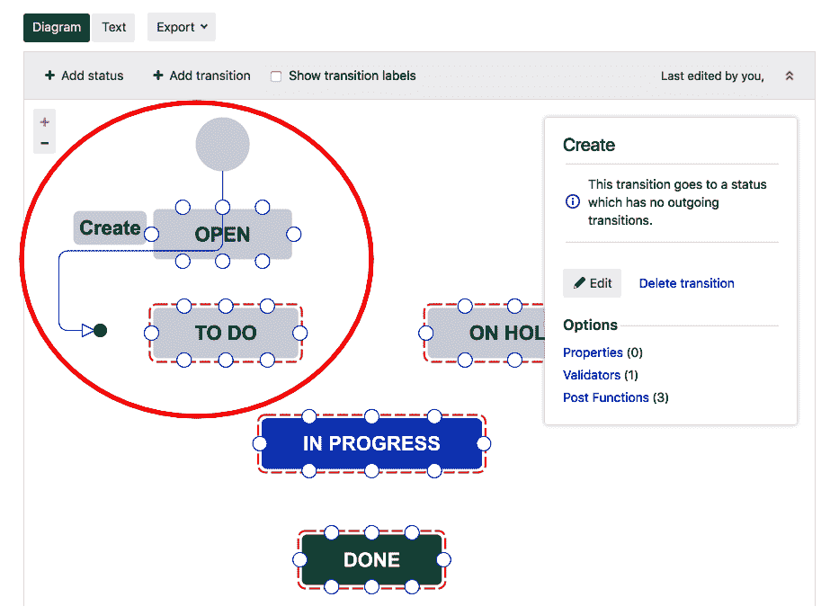

# Jira 方案与配置项目工作流

在本章中，我们将开始定制 Jira。到目前为止，我们已经介绍了工具的基本功能，并且走过了 Jira Core、Jira Software 和 Jira Service Desk 的独特功能。学习如何定制 Jira 将帮助你根据自身需求调整它。

我们将从理解 Jira 方案的概念开始，然后学习如何在我们的项目中定制工作流。

本章涉及的主题包括以下内容：

+   Jira 中的各种类型用户

+   Jira 中各种方案概览

+   自定义 Jira 工作流

# Jira 中的各种类型用户

在本书的开头，我们创建了一个新的 Jira 实例，在其中创建了新项目，并且在这些项目上工作，以便了解其功能。我们能够做到这一点，因为我们也对实例拥有完整的管理员权限。然而，在 Jira 中，并非每个人都可以成为管理员。

主要有三种类型的用户在 Jira 中，分别如下：

+   用户

+   项目管理员

+   Jira 管理员

# 用户

任何能够登录 Jira 的人都是用户，且在大多数情况下，用户也会占用一个 Jira 许可证，除了在 Jira Service Desk 中，客户不算在许可证数量内。

用户通常是开发团队中的开发人员或测试人员，以及服务台团队中的代理。在大多数情况下，用户会处理他们的问题和任务。然而，可以向用户分配更多权限。

# 项目管理员

项目管理员通常是经理或团队负责人。他们负责整个项目。与用户相比，他们通常在项目中拥有更多权限。例如，他们可以向项目中添加成员，管理项目里程碑，并且在实际问题上拥有更多权限。

# Jira 管理员

除了用户和项目管理员外，Jira 管理员还有权管理你的 Jira 实例。他们可以创建项目、用户，定制项目工作流，添加更多自定义字段，同时还负责整个实例的性能。

Jira 管理员通常会接到其他人的请求来定制他们的项目。理想情况下，你不应将此权限授予团队中的太多人。只有少数人应当负责管理你的实例。

# Jira 中各种方案概览

当你在 Jira 中创建一个项目时，首先要做的是在项目下创建一些问题。问题创建后，你可能需要将其分配给某个人。负责处理该问题的人会开始着手处理该问题，并最终将其解决。这是 Jira 中问题生命周期的一个非常简单的示例，但在后台发生了很多事情。

你在项目中的工作方式、创建的问题类型、在问题中捕获的字段、以及其生命周期阶段和行为，都是由 Jira 项目中的各种方案定义的。

本书中我们之前创建的项目涉及使用 Jira 提供的默认模板。默认模板不过是各种方案的集合或集合。这些模板帮助我们非常快速地开始使用 Jira，根据你的开发方法论，你可以选择基于行业标准实践的各种类型模板。

然而，每个团队都有自己的特点，他们可能对 Jira 项目有不同的期望。可以根据项目逐个进行自定义，或者根据使用相同方案集的一组项目来进行修改。让我们快速了解 Jira 中各种方案的目的。

# 问题类型方案

在 Jira 中，我们可以有不同的问题类型，如 Epic、Story、Task 和 Bug。如果需要，你始终可以创建更多的问题类型。问题类型方案定义了在特定项目中将提供哪些问题类型。

在 Jira 软件中的典型 Scrum 项目会有 Story、Bug、Epic、Task 和 Sub-task，这由项目中使用的问题类型方案定义。一个方案可以始终被 Jira 中的其他项目共享。

# 工作流方案

工作流定义了问题在 Jira 中的生命周期。在一个项目中，你可以为所有问题类型使用一个工作流，或者为每个问题类型使用不同的工作流。如果你使用 Jira Core，并且有 Task 和 Sub-task 这样的任务类型，那么创建一个包含三个状态的工作流：Open、In Progress 和 Closed 就可以工作。但对于一个软件开发项目，你可能希望为 Bug 和 Story 设置不同的工作流。

工作流方案定义了项目中每个问题类型将使用的工作流。下表为你提供了一些工作流方案的示例：

| **项目** | **问题类型** | **工作流** |
| --- | --- | --- |
| 法律项目 | TaskContract | 法律工作流（Task 和 Contract） |
| 软件项目 | EpicStoryBugTask | 敏捷工作流（Epic 和 Story）缺陷工作流（Bug 和 Task） |

当创建新工作流时，你可以将它们附加到同一工作流方案中项目的现有问题类型。例如，在我们之前的一个软件项目中，如果将来需要为 Epic 创建第三个工作流，可以通过简单地修改现有的工作流方案来实现。

# 问题类型屏幕方案

当你在 Jira 中创建问题时，填写详细信息的弹出窗口不过是一个屏幕，它是字段的集合。你通常会使用屏幕来添加或移除字段。

在 Jira 中，屏幕与三种操作关联：创建、编辑和查看。

创建问题时、编辑时以及查看问题时，可以使用不同的屏幕。

屏幕方案定义了屏幕和操作之间的映射关系。

问题类型屏幕方案定义了屏幕方案和问题类型之间的映射关系。

# 字段配置方案

当你在项目中创建一个问题时，你可能已经注意到一些字段是必填的，尤其是项目、问题类型和摘要，但如果你想让其他字段也成为必填项，则需要通过字段配置来实现。字段配置的另一个作用是完全隐藏某些字段。

你定义的字段行为——必填/隐藏，也会映射到问题类型。例如，像到期日期这样的字段可以设为 Bug 的必填项，但在同一个项目中的 Epic 不必是必填项。

# 权限方案

一旦你获得了对项目的访问权限，那么你在该项目中能够执行的所有操作，都是由为该项目配置的权限方案所定义的。权限涉及到谁可以创建问题、编辑问题、关闭问题、添加评论、添加附件等。

当创建一个新项目时，它会带有一个默认的权限方案，如果需要，可以进一步修改。权限方案中的各个权限可以分配给个人、项目角色或 Jira 中的用户组。

# 通知方案

Jira 可以向不同的人发送关于不同事件的电子邮件提醒。当新问题被创建时，可以向问题的报告人发送一封电子邮件。与问题和工作流转换相关的事件有很多种。这些通知已为各种事件进行配置，如果你不想接收系统发送的过多电子邮件，可以进行修改。

现在我们知道了各种方案的用途，接下来让我们修改之前创建的软件项目，并创建一个新的工作流。

# 自定义 Jira 工作流

在 第三章，*使用 Jira 软件进行开发团队管理*，我们创建了一个 Jira 软件项目，并熟悉了其各种功能。我们创建了一个示例 Scrum 项目，该项目提供了针对 Scrum 方法学的预定义配置和方案。

打开示例 Scrum 项目，进入项目设置 | 工作流。

你会注意到，在这个项目中已有一个工作流方案，且该工作流已被所有可用的问题类型使用。在以下屏幕中，如果点击图表链接，你将能查看与该项目相关的工作流：

图 1

如下图所示，工作流有三个状态：TO DO（待办）、DONE（完成）和 IN PROGRESS（进行中）。All（所有）标志表示你可以直接进入任何状态；换句话说，你不必按照特定路径来解决问题：

图 2

前面的工作流已经运行良好，但我们想创建自己的工作流，类似于这个，但有一些具体要求，如下所述：

+   添加一个新状态：ON HOLD（暂停）。

+   问题不能直接发送到 DONE（完成）。它必须首先经过 IN PROGRESS（进行中）状态。

以下图表表示我们将为 Bug 问题类型创建并使用的工作流：

图 3

# 新状态

在提议的新工作流中，有一个新的状态叫做 ON HOLD，我们首先需要在我们的 Jira 实例中创建它。

转到 Jira 设置 | 问题 | 状态（在问题属性下）并点击右上角的添加状态按钮。

在名称中输入 `On Hold`，在描述中输入 `Issue is on hold`，然后点击添加按钮以创建一个新状态，如下所示：

图 4

# 创建新的工作流

现在，让我们来创建我们的新工作流。

转到 Jira 设置 | 问题 | 工作流（在工作流下）并点击右上角的添加工作流按钮，输入名称为 `Bug workflow`，在描述中填写 `This is the Bug workflow`，然后点击添加按钮，如下图所示：

图 5

在下一个屏幕上，你将看到编辑工作流的选项。有两种模式可以编辑工作流——图表模式和文本模式，两种模式基本上可以做相同的事情，不过每种模式有一些不同的选项，但我们将使用图表模式来创建我们的工作流。

点击左侧的添加状态选项，并在你的工作流中添加 TO DO、IN PROGRESS、ON HOLD 和 DONE 状态，如下所示：

图 6

这些状态将现在被添加到你的工作流中。我们已经取得了一些进展，但我们仍然需要做一些事情，主要是移除不需要的状态，添加转换，并将创建的转换更改为从 TO DO 状态开始，而不是 OPEN 状态，这将确保工作流中的第一个状态是 TO DO。

点击创建转换，并将其更改为从 OPEN 状态开始，到 TO DO 状态，只需拖动箭头并将其放在 TO DO 上，如下所示：

图 7

现在点击 OPEN 状态，在弹出的窗口中，点击移除状态链接，如前面的截图所示。最后，在确认移除状态对话框中点击移除按钮。

现在我们在工作流中有了必要的状态。我们需要根据工作流的要求，在这些状态之间创建转换。

首先，点击 TO DO 状态，从该状态拖动一条线到 IN PROGRESS 状态。将出现一个名为添加转换的弹出窗口，如下所示，你将被要求输入转换的名称，可以与目标状态相同，或使用你选择的任何名称：

图 8

请记住，这个转换名称将在用户处理 Jira 问题时显示。点击添加按钮以添加新的转换。

当你添加转换时，一个代表转换的箭头线将会在这两个状态之间创建。箭头的方向在这里也很重要。如果你想从“进行中”转换回“待办”，你需要再添加一个转换，如下所示：

图 9

现在，参考前面图示中的工作流，创建其余的转换。你的最终工作流应该像下面的图示一样：

图 10

我们的工作流已经准备好了，接下来我们需要做的就是在我们的项目中使用它。我们刚刚学会了如何创建工作流，这非常棒，但使用工作流配置还可以进行很多其他自定义操作，比如为我们的转换添加条件和验证器。

现在，让我们回到项目中并使用这个工作流。

进入项目设置 | 工作流，然后点击左上角的“添加工作流”按钮，如下所示，然后点击“添加现有”选项：

图 11

在“添加现有工作流”弹出窗口中，找到你刚创建的 Bug 工作流并点击“下一步”按钮，如下所示：

图 12

然后，在“将问题类型分配给‘Bug 工作流’”弹出窗口中，选择 Bug 并点击“完成”按钮，如下所示：

图 13

最后，点击顶部的“发布”按钮，如下所示：

图 14

在接下来的屏幕中，你可能需要将任何现有问题与新工作流关联。只需按照流程操作，你将在项目的现有工作流方案中添加一个新工作流，如下所示：

图 15

现在，当你在项目中处理 Bug 时，你可以看到这个新的 Bug 工作流在实际运行中。只需在项目中创建一个新的 Bug 类型的问题，你会发现你现在有了一个带有自定义转换和状态的新工作流，如下所示：

图 16

作为良好的实践，始终检查新工作流是否按预期运行。

# 总结

恭喜！你现在已经成功开始了通过创建自己的工作流来自定义 Jira 的旅程。在本章中，我们学到了很多东西，从概览 Jira 中的各种用户类型开始，然后花了大量时间了解如何创建自定义工作流，并且如何在我们现有的项目中使用它。

在下一章，我们将继续进一步自定义 Jira，并看看如何通过使用屏幕添加更多字段到我们的项目中，同时确保这些新字段仅在特定类型的问题上可见。我们还将查看各种权限，并学习如何修改它们。
