# 配置项目屏幕和权限

在本章中，我们将继续进一步自定义 Jira，并且查看如何通过使用屏幕将更多字段添加到项目中，同时确保这些新字段仅在特定类型的问题中可见。我们还将查看各种权限并学习如何修改它们。

本章涵盖的主题包括以下内容：

+   在 Jira 中添加新自定义字段

+   理解 Jira 屏幕

+   在我们的项目中使用自定义字段

+   过渡屏幕

+   权限管理

# 在 Jira 中添加新自定义字段

在上一章中，我们创建了一个自定义工作流，并希望将其与 Bug 问题类型一起使用。我们学习了如何将这个新工作流映射到 Bug 问题类型。这很棒，因为 Bug 的生命周期与 Jira 中其他问题类型不同。然而，我们希望进一步自定义项目；我们希望从报告 Bug 的用户那里获取更多信息。这些附加信息就是 Jira 中的新字段，也叫做自定义字段。

我们的项目需要两个新字段：重现步骤和 Bug 类型。第一个字段将是一个文本字段，用户可以自由输入文本，而第二个字段将是一个下拉框，用户需要从中选择一个选项。现在，让我们将这两个字段添加到我们的实例中。

执行以下步骤以添加自定义字段：

1.  在您的 Jira 实例中，进入 Jira 设置 | 问题 | 自定义字段（在 FIELDS 下）

1.  点击右上角的“添加自定义字段”按钮，操作示例如下：

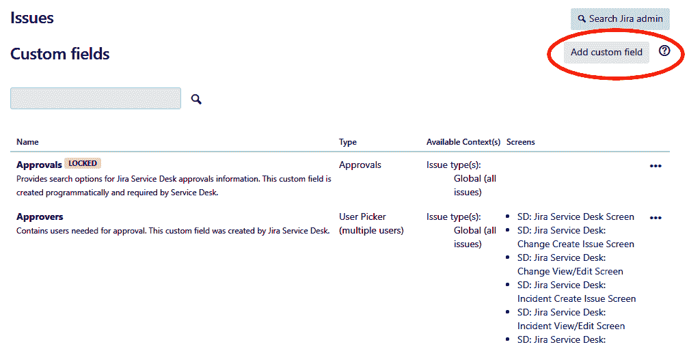

图 1

1.  在选择字段类型弹出窗口中，选择文本字段（多行）并点击下一步按钮，操作示例如下：

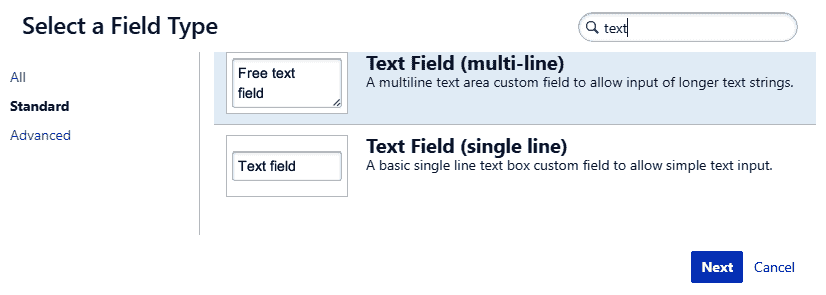

图 2

1.  在配置文本字段（多行）弹出窗口中，输入字段名称为 `重现步骤`，并添加一个有意义的描述。最后，点击创建按钮。

现在，在你的 Jira 实例中将创建一个自定义字段。你会被要求将新创建的自定义字段添加到一个屏幕中，但可以忽略这个步骤，继续创建字段。

按照相同的步骤添加 `Bug 类型` 自定义字段，但在此实例中，字段类型应选择为单选下拉列表（Select List (single choice)），并且你需要为用户提供一些选项，供其从下拉列表中选择。

现在我们有了两个新字段，让我们学习如何在项目中使用它们。

# 理解 Jira 屏幕

屏幕就是 Jira 中的字段容器。屏幕可以包含许多字段，排列顺序由你决定。字段的顺序也可以进行更改。每当你与 Jira 中的问题进行交互时，大多数情况下你都在与屏幕打交道。要理解屏幕，我们还必须理解操作的概念。

Jira 中有三种操作类型，具体如下：

+   创建问题

+   编辑问题

+   查看问题

这些操作不言自明，但在这里需要了解的是，这些操作上显示的字段可能不同。当您在 Jira 中创建新问题时，您可能只想捕获少量字段，但当该问题稍后被编辑时，您可能还希望捕获更多信息。这就是为什么这些操作可以关联不同的屏幕。

在我们的案例中，我们希望这两个新自定义字段被添加到所有三个操作中。在接下来的部分中，我们将学习如何将字段添加到项目中。

# 在我们的项目中使用自定义字段

一旦您向实例添加了新的自定义字段，这些字段将可以在全局范围内使用，您可以在项目中使用它们。在将这些字段添加到项目之前，这些字段无法使用。

执行以下步骤将字段添加到 Bug 问题类型：

1.  在您的项目中，转到 项目设置 | 屏幕。

1.  在“屏幕”部分，您会注意到在项目中已经使用了两个屏幕方案，如下图所示。这两个方案基于我们在创建项目时使用的模板：

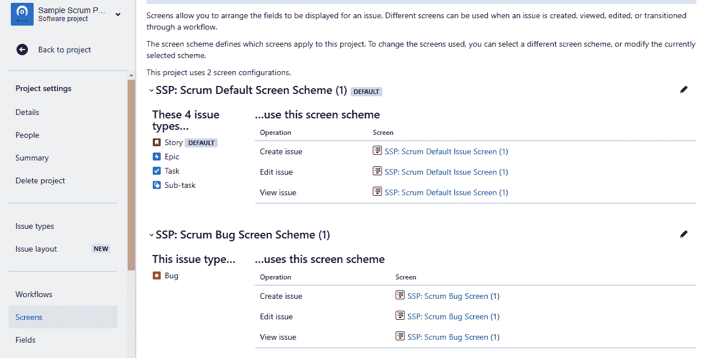

图 3

1.  如您所见，Bug 问题类型使用了一个单独的屏幕方案。在此方案下，只有一个屏幕，名为 SSP: Scrum Bug Screen (1)，该屏幕用于所有三个操作；换句话说，创建问题、编辑问题和查看问题。

1.  要添加我们的新字段，请点击屏幕 SSP: Scrum Bug Screen (1)，然后在配置屏幕部分，滚动到页面底部，那里列出了所有现有字段，点击“选择字段 ...”下拉菜单，选择我们之前添加的两个新字段，如下所示：

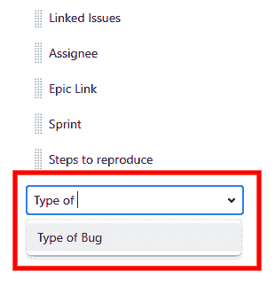

图 4

然后，这些字段将被添加到您的项目中，但仅在 Bug 问题类型下可用，如下图所示：

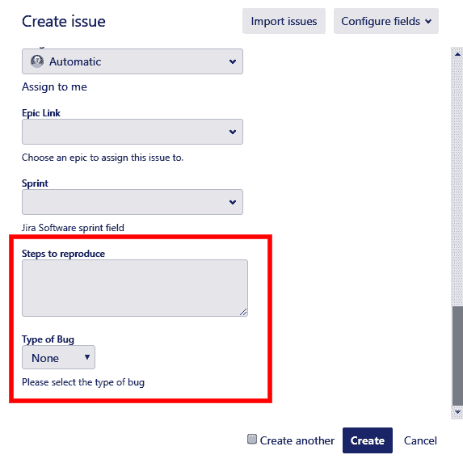

图 5

您还可以创建自己的屏幕方案，将不同的屏幕映射到不同的操作上，因为也许您不希望在创建问题时捕获某个字段，而是希望在稍后编辑问题时捕获它。

# 转换屏幕

除了这里使用的屏幕外，还可以选择在工作流转换过程中捕获用户输入，这可以通过使用转换屏幕来完成。

如果我们希望在 Bug 被解决时要求用户填写一个名为 Analysis 的字段，但不希望在创建 Bug 时捕获该字段，怎么办？在这种情况下，我们可以为 Bug 编辑操作创建一个新屏幕，但那意味着用户需要点击问题上的编辑按钮，才能在此字段中输入信息。这个需求可以通过使用一个全新的屏幕，并在 Bug 被解决或在我们案例中的“已完成”状态时使用该屏幕来实现。

执行以下步骤创建新屏幕并将其用作转换屏幕：

1.  首先，像本章前面所做的那样，创建一个新的自定义字段，并将该字段命名为分析。

1.  现在，进入 Jira 设置 | 问题 | 屏幕（在屏幕下方）并点击右上角的添加屏幕按钮。在添加屏幕弹出窗口中，输入名称为`分析屏幕`，并输入一个有意义的描述，如下图所示：

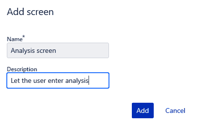

图 6

1.  然后，在配置屏幕部分，将你刚创建的分析字段添加到此屏幕中。

1.  现在，我们需要在我们的 Bug 工作流中使用这个仅包含一个字段的屏幕。进入项目 | 项目设置 | 工作流，并点击 Bug 工作流旁边的铅笔图标进行编辑，如下图所示：

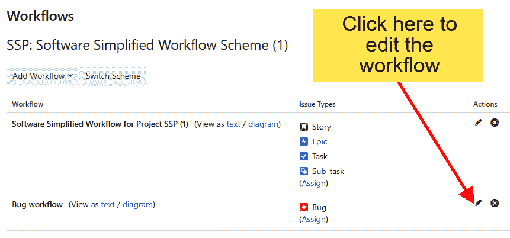

图 7

1.  现在，在你的已完成过渡中，点击编辑按钮，如下图所示：

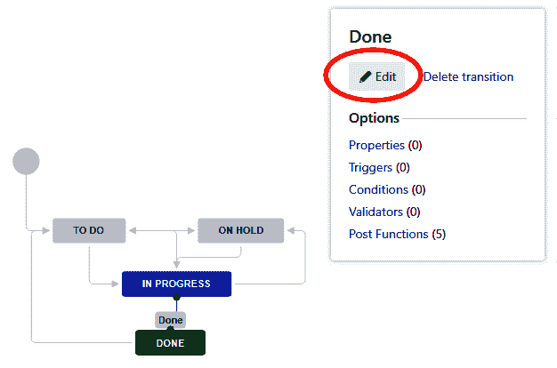

图 8

1.  然后，在编辑过渡弹出窗口中，选择屏幕作为分析屏幕，并按下保存按钮，如下图所示：

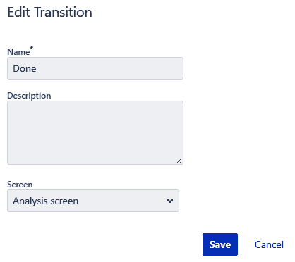

图 9

我们现在差不多完成了。在修改工作流后，你还需要发布它，因为这个工作流已经附加到项目并在使用，因此需要再次发布。顶部会有一个名为发布草稿的按钮。点击它，最终将更改应用到项目中。

为了测试你的新过渡屏幕，进入任何你想通过将其移动到已完成状态来解决的 Bug 问题，如下图所示：

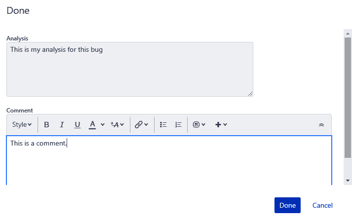

图 10

你会注意到会弹出一个新屏幕，要求你输入分析和评论，然后最终将 bug 的状态更改为已完成。

# 权限管理

我们在项目中已经实施了大量自定义。现在，让我们再看一个配置，它将让你控制谁可以在项目中做什么。Jira 可以被一个由几个人组成的小团队使用，也可以被成千上万的企业用户使用，当许多人访问同一个实例时，你可能会担心如何控制项目权限。

当你之前使用模板创建项目时，Jira 会创建许多默认配置和方案，例如问题类型方案、工作流方案、问题类型屏幕方案、权限方案和通知方案。

你也可以创建自己的方案，使用自定义配置。然而，我们也可以使用模板建议的配置，并在稍后对其进行微调。现在，让我们更改项目的权限，使其对除项目管理员添加的人员之外的其他人隐藏。

在 Jira 中，有一个项目角色的概念，它其实就是每个项目中的一个团队，包含一组成员或用户。例如，在我们的实例中有一个叫做开发者（Developers）的角色，我们可以在其中添加更多的人。现在，这些人在该角色中做什么，实际上取决于我们在权限方案中定义的权限。

执行以下步骤，仅将开发者角色的访问权限限制到我们的项目：

1.  首先，我们需要创建一个新的权限方案，因此请进入 Jira 设置 | 问题 | 权限方案（位于问题属性下），然后点击“默认权限方案”下操作中的“复制”链接。

1.  一旦复制了默认权限方案，点击其下操作中的“编辑”链接，并将其重命名为其他名称，比如“软件权限方案（Software Permission Scheme）”。

1.  现在，我们有了一个可以修改的新权限方案。点击该新权限方案的权限（Permissions）链接，你将看到许多与项目、评论以及谁可以做什么相关的权限，如下图所示：

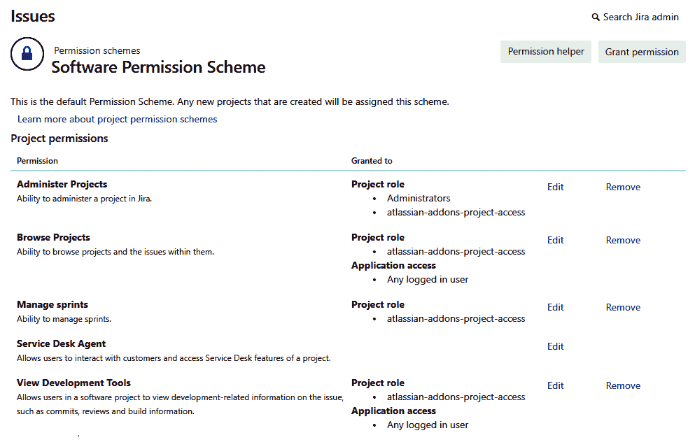

图 11

1.  第二列，授予给（Granted to），列出了拥有该权限的单个用户、组或项目角色。

1.  要限制对项目的访问，可以从浏览项目（Browse Projects）权限中删除所有内容，并只将其授予项目角色开发者（Developers），如下图所示：

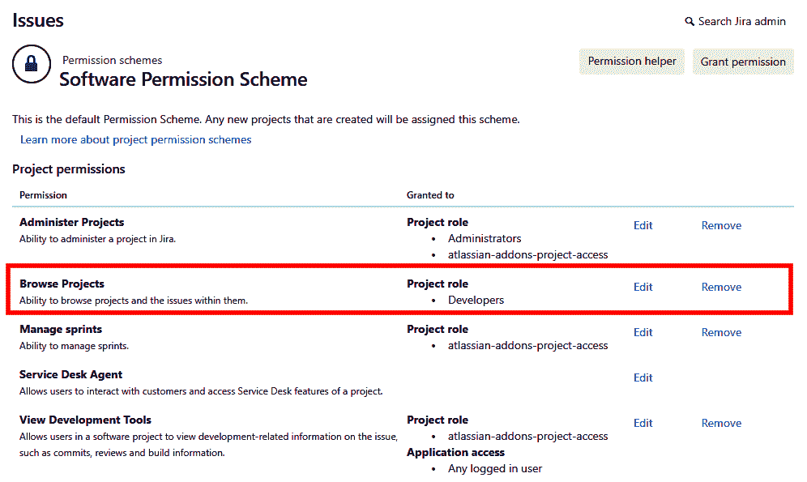

图 12

1.  现在，我们有了一个新的权限方案，可以在我们的项目中使用。在项目中，进入项目设置 | 权限 | 操作 | 使用不同的方案。

1.  现在，选择你刚创建的方案，并按下关联（Associate）按钮。

恭喜！你已经修改了项目的权限方案，现在，只有被添加到项目中的开发者角色的人员才能访问该项目。

了解如何执行这些自定义操作将使你能够掌控你的 Jira 实例，并根据你的需求进行调整。Jira 的开箱即用版本提供了多个模板，如果你知道正确的自定义方法，你可以进一步调整这些模板。

# 总结

在这一章中，我们花了一些时间了解如何从用户那里添加更多的自定义字段，并通过在屏幕中工作将它们应用到项目中。我们还学习了什么是转换屏幕（transition screens），以及它们与普通屏幕的区别。最后，我们修改了项目的权限，并将对项目的访问限制为一组特定的用户。尽管我们只修改了一个权限，但知道如何正确地修改它非常重要。

在下一章中，我们将探讨 Jira 的报告功能。了解如何分析我们实例中已经收集的信息非常重要。理解如何通过各种报告和仪表盘跟踪进度是每个 Jira 用户和管理员都应该掌握的一项必备技能。
