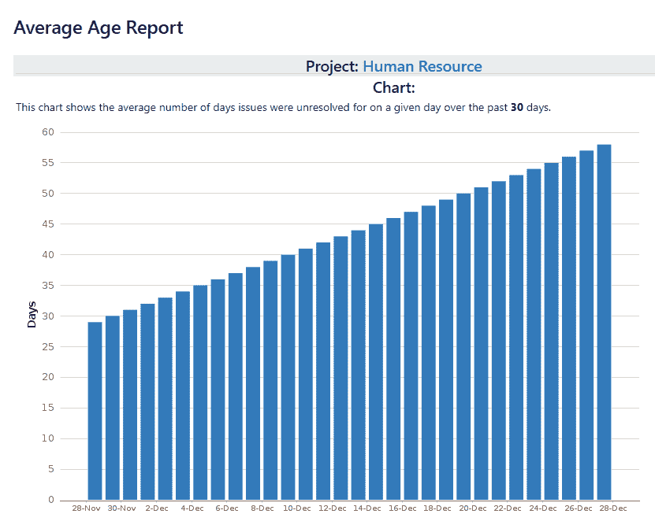
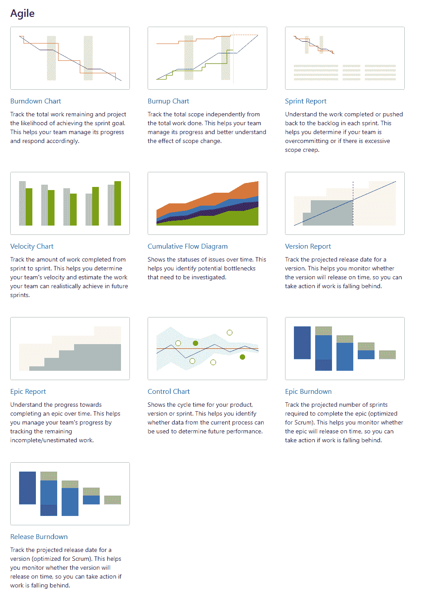

# 第七章：报告和仪表板

本章我们将探讨 Jira 的报告功能。一旦你开始在项目中工作，你也会希望跟踪你的工作进度，分析你在实例中拥有的信息非常重要。它可能像是了解有多少个问题已经完成，以便创建一个图形报告一样简单。

每个 Jira 项目都有自己的报告集，你可以不时监控这些报告。根据你使用的应用类型，报告可能会略有不同。我们还将看看仪表板，这是创建自定义报告的好方法。

本章涉及的主题包括以下内容：

+   Jira Core 报告

+   Jira Software 报告

+   Jira Service Desk

+   创建和共享仪表板

# Jira Core 报告

在本书中，我们已经查看了 Jira 中的三种应用类型。我们从 Jira Core 开始，任何公司中的业务团队都可以使用它来跟踪他们的日常活动。

我们首先来看 Jira Core 项目中内置的报告。要查找这些报告，进入项目侧边栏中的“报告”部分，你会发现报告被分为三类：问题分析、预测与管理，以及其他，具体如下图所示：

图 1

这些报告大多数都易于配置，并且自解释，但我们将重点查看一些关键报告。

# 平均年龄报告

随后的平均年龄报告显示了一个项目或筛选器中未解决问题的平均年龄。这有助于你了解你的待办事项是否得到及时更新。基本上，这意味着在给定日期，问题处于未解决状态的平均天数，如下所示：

图 2

在此报告中，当你看到柱状图在一段时间内不断增加时，这意味着问题没有按时解决。

# 饼图报告

这是最有用的报告之一，展示了基于 Jira 中不同字段的故障分类。例如，以下图表展示了问题根据其工作流状态的分类情况：

图 3

前面的图表告诉我们，仍然有许多任务处于待办状态，必须采取措施改善这种情况。类似的报告也可以基于其他 Jira 用于项目中的数据生成。

# Jira Software 报告

当你在一个基于敏捷的方法的项目中工作时，我们在 Jira Core 部分看到的报告在这里也可以使用，但由于 Jira Software 项目有所不同，你还会发现这里有许多新的报告。

如下图所示，你将会在报告部分的敏捷类别下找到这些报告：

图 4

现在我们来看看一些重要的基于敏捷的方法的报告。

# 燃尽图

当我们在基于 Jira Software 的 SCRUM 项目中规划冲刺时，我们可以选择使用故事点或小时数来估算工作量。以下报告展示了特定冲刺中问题的进展，基于总估算的工作量与实际工作量的对比：

图 5

如果你查看上面的图表，你会注意到最初计划的总故事点数是 11，并且根据冲刺的持续时间，理想情况下，所有故事点应在冲刺结束时完成。这由基准线下降表示。当工作开始时，另一条表示实际完成工作的线将开始绘制，并且跟随原始基准线。在理想情况下，实际进度线应与基准线一致。如果实际进度线向上走，意味着在冲刺过程中加入了更多的工作，这是不好的做法。

如果实际进度线与基准线之间的差距过大，意味着团队按时完成工作的可能性不大。

燃尽图是敏捷项目中最重要的报告之一，适用于遵循 SCRUM 的项目。

# 敏捷速率图

另一个重要报告是敏捷速率图，它实际上反映了团队的能力。我们先来看一下如下所示的报告：

图 6

当冲刺计划制定时，会对预计在冲刺结束前能完成的工作进行估算。在新项目开始时，这种估算有些困难。而且随着项目的推进，团队成员可能会发生变化或无法参与，因此了解当前团队的能力非常重要。

上述图表告诉我们，在样本冲刺 1 中，团队承诺了 18 个故事点，但完成了 16 个；在样本冲刺 2 中，团队承诺了 11 个，完成了 11 个；最后，在样本冲刺 3 中，承诺也按时完成。

因此，团队的平均能力为 16+11+14 除以 3，换句话说，为 13.6，约为 14。基于过去的表现，我们可以分配 14 个故事点的工作量给这个团队。

这些信息对经理至关重要，因为如果这个数字过低或下降，那么可以及时采取适当的行动来加以改进。

# Jira Service Desk

现在我们来看看一些只适用于 Service Desk 的 Jira Service Desk 报告。

# SLA 成功率

Jira Service Desk 的一个独特功能是服务级别协议（**SLA**）的概念，可以为项目进行配置。让我们看一下以下关于两个 SLA 的报告：

图 7

该报告提供了项目中两个服务级别协议（SLA）的成功率百分比——首次响应时间和解决时间。同时还显示了随时间变化的趋势线。

# 满意度

在 Jira Service Desk 中，有一个内建的功能，可以要求客户提供反馈。这对团队来说非常重要，因为它可以告诉他们他们的服务是好是坏。我们先来看看这个报告：

图 8

这个报告告诉我们一个从一到五颗星的平均评分，并且非常详细。你可以看到客户评论、问题键，以及参与解决该问题的代理。

# 创建和共享仪表板

我们在本章前面讨论的报告是特定于项目的，只有在项目内时才能查看。然而，当你登录到你的 Jira 实例时，首先看到的是系统仪表板，这是一个包含一组小型报告（也称为 gadget）的默认仪表板。我们始终可以创建自己的自定义仪表板，展示来自一个或多个项目的信息。

仪表板的一个优点是，你无需进入各个项目并逐一配置不同的报告。使用仪表板，你可以一目了然地查看项目或团队的状况。让我们创建自己的仪表板。

在系统仪表板上，点击右上角的三个点，选择“创建仪表板”，如下所示：

图 9

输入名称和描述，选择你希望与谁共享，然后点击创建按钮，如下所示：

图 10

你将得到一个空白的仪表板，可以添加各种 gadgets。让我们将以下 gadgets 添加到我们的仪表板中：

+   平均年龄图表

+   Sprint Burndown Gadget

+   饼图：示例 Scrum 项目

+   敏捷看板 Gadget

是的，你猜得没错。这些是与我们之前讨论过的报告类似的报告，不过这次我们希望把它们放在仪表板上方便查看。gadget 会让你选择你希望为其创建报告的项目。一旦你这样做，仪表板就会准备就绪。

仪表板的一个重要优点是，除了可以在一个地方集中创建一系列报告外，你还可以与其他团队成员共享，显示在办公室的大屏幕上，最重要的是，你可以创建多个仪表板，展示来自不同项目的不同信息。

# 总结

在本章中，我们学习了如何通过首先查看内置的各种报告，来分析我们在 Jira 实例中已有的信息，随后我们配置了自己的自定义仪表板，将所有这些报告集中在一个地方，方便随时查看。

在接下来的最后一章，我们将讨论使用 Jira 时应始终牢记的最佳实践，以及在定制工具时需要注意的事项。因为尽管 Jira 允许你配置许多内容，但如果这些定制做得不正确，了解其后果也是非常重要的。遵循最佳实践将确保你的 Jira 实例能够长期稳定运行，并保持卓越的性能。
