# Jira 软件基础

随着越来越多的人开始发现传统模型的问题以及敏捷方法所带来的好处，敏捷软件开发近年来逐渐获得了动力。在敏捷方法中，开发工作是在迭代周期中进行的，并且每个迭代都会进行改进。反馈尽早收集，从而改善客户参与度和团队协作。所有这些行动使得开发团队能够更好地预见和管理变化。

Atlassian 是流行的问题跟踪软件 Jira 的开发商，认识到敏捷方法所能带来的价值，并推出了一款特别为使用敏捷方法管理项目设计的解决方案，名为 Jira 软件。在本章中，我们将介绍 Jira 软件的基础知识。

在本章结束时，您将学到：

+   Jira 软件及其提供的功能

+   如何安装和配置新的 Jira 软件实例

+   Jira 软件的关键概念和术语

+   如何使用项目模板创建新的敏捷项目

# 介绍 Jira 软件

Jira 软件是 Jira 产品家族中的三大产品之一，与 Jira Core 和 Jira Service Desk 一同提供，是一个主要集中于使用敏捷方法管理软件开发项目的解决方案，因此得名 Jira 软件。它采用了经典 Jira（Jira Core）的一些功能，如可自定义字段和灵活的工作流，并结合了对敏捷方法的支持，为您提供了以敏捷方式运行项目的完整体验。

开箱即用，Jira 软件支持以下敏捷方法：

+   **Scrum**：这是一种敏捷方法，开发团队通过迭代工作来完成项目。每个迭代或冲刺都有定义的时间框架和范围。Scrum 最适合软件开发项目。您可以在 [`en.wikipedia.org/wiki/Scrum_(software_development)`](http://en.wikipedia.org/wiki/Scrum_(software_development)) 了解更多关于 Scrum 的信息。

+   **看板**：这是一种敏捷方法，专注于通过可视化工作流和进行中的任务来实现准时交付。看板最适合操作团队。您可以在 [`en.wikipedia.org/wiki/Kanban`](http://en.wikipedia.org/wiki/Kanban) 了解更多关于看板的信息。

当然，由于 Jira 软件与 Jira Core 捆绑在一起，您也可以选择不使用敏捷方法，例如将其作为一个简单的任务跟踪工具，管理非软件开发相关的项目。虽然我们将主要关注如何将 Jira 软件用于敏捷目的，但从第五章*《自定义 Jira 软件》*开始，许多概念和主题也适用于非敏捷项目。考虑到本书特别介绍的是 Jira 软件，我们将交替使用 **Jira** 和 **Jira 软件** 这两个术语，除非另有说明。

# 安装 Jira 软件

通常，了解某件事的最佳方式是动手操作，因此我们将安装一个 Jira 软件实例，并以此为基础进行后续章节和练习。

安装 Jira 软件是一个简单的过程。您需要的所有内容如下：

+   一台运行 Windows 或 Linux 的服务器或虚拟机

+   一个数据库：Oracle、MySQL、Microsoft SQL Server 或 PostgreSQL

+   Oracle JDK 1.8 或更高版本

+   Jira 软件安装包

您可以在[`confluence.atlassian.com/adminjiraserver075/supported-platforms-935390828.html`](https://confluence.atlassian.com/adminjiraserver075/supported-platforms-935390828.html)找到支持的平台和系统的完整列表。

# 获取并安装 Jira 软件

对于本部分，我们将使用 TAR.GZ 或 ZIP 压缩包安装包，因为它适用于任何操作系统。您可以从[`www.atlassian.com/software/jira/download`](https://www.atlassian.com/software/jira/download)下载最新的 Jira 软件。默认情况下，下载页面将根据您计算机的操作系统自动选择安装包。您可以点击“所有服务器版本”链接以查看所有选项。

下载文件后，按照以下步骤安装 Jira 软件：

1.  解压安装包（例如`atlassian-jira-software-7.5.0.tar.gz`）到您希望安装 Jira 软件的位置。例如，在 Linux 上，您可能希望将其安装在`/opt`目录下。我们将在本书的其余部分将该目录称为`JIRA_INSTALL`。

1.  确保`bin`目录中的启动脚本文件是可执行的。对于 Linux 系统，它将是`start-jira.sh`；对于 Windows 系统，它将是`start-jira.bat`。

确保创建一个用户来运行 Jira 软件。您不应该在默认的管理员账户下运行该应用程序，如 root。

1.  为 Jira 创建一个单独的目录来存储其本地文件，如配置文件和日志。确保将该目录与`JIRA_INSTALL`目录分开。Jira 将此目录称为`jira.home`，因此我们在本书的其余部分将其称为`JIRA_HOME`。

1.  用文本编辑器打开`jira-application.properties`文件。您可以在`JIRA_INSTALL/atlassian-jira/WEB-INF/classes`目录下找到该文件。

1.  输入`JIRA_HOME`目录的完整路径。因此，文件的内容将类似于：

    `` `jira.home = /opt/jira_home` ``

1.  保存文件并从控制台执行`bin`目录中的适当启动脚本。您应该会在控制台中看到类似于以下截图的输出：

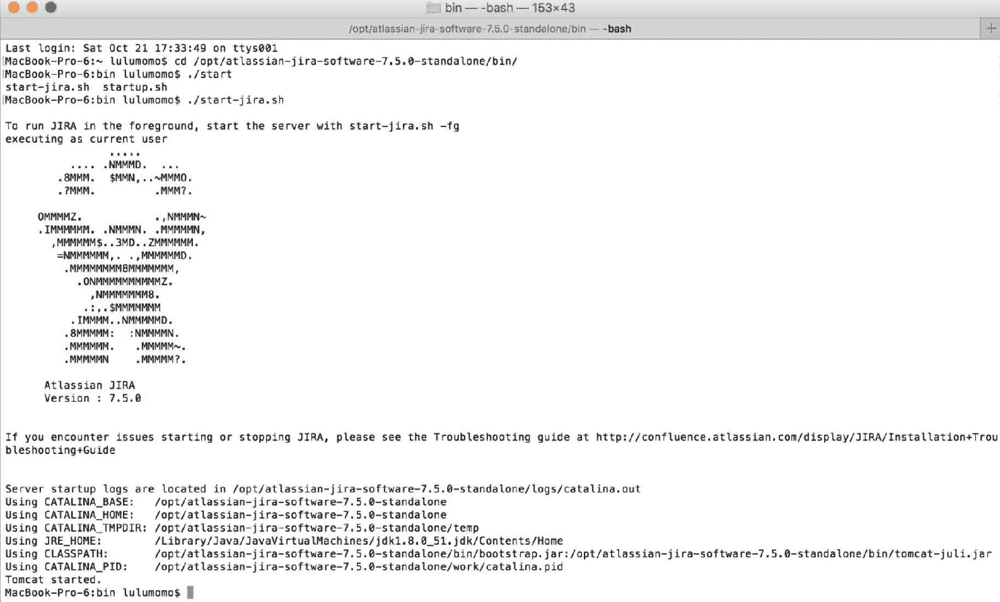

# 配置 Jira 软件

现在我们已经安装了 Jira，我们需要通过配置其区域设置、语言以及系统的其他方面来进行设置。Jira 附带了一个设置向导，将帮助我们完成这个过程。

我们可以通过打开浏览器并访问[`http://localhost:8080`](http://localhost:8080)来访问向导。如果你是从安装 Jira 的同一台机器上访问，可以使用该地址。如果你使用的是其他计算机，请将`localhost`替换为实际的主机名。如果 Jira 成功启动，你应该会看到 Jira 设置向导的第一步，如下图所示。选择“为我设置”选项，Jira 会自动配置自己，这是快速建立试用环境的好方法。在本练习中，我们将使用“我自己设置”选项来探索所有可用的设置：

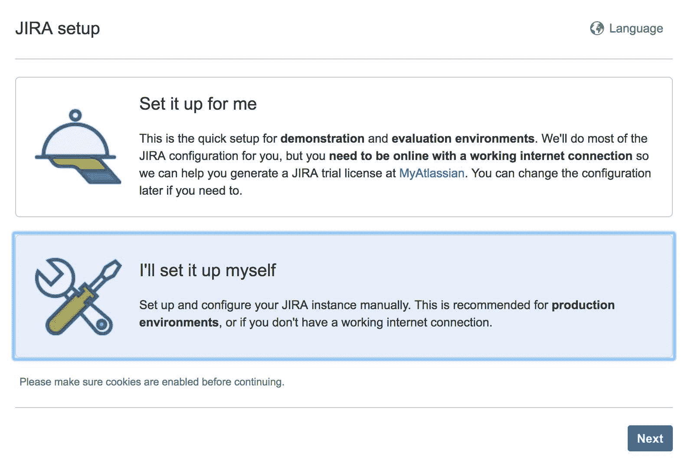

第二步是告诉 Jira 我们将使用什么类型的数据库以及如何连接到它。选择“内建”选项会创建一个内存数据库，适用于快速试用，但如果你想在生产环境中使用 Jira，则需要选择“我自己的数据库”选项。

选择你想使用的数据库类型。请注意，对于某些数据库，例如 MySQL，你需要先下载并安装驱动程序，然后才能继续。如果需要驱动程序，Jira 会提醒你。

一旦选择了数据库类型，输入连接详情。每种数据库类型都不同，如果不确定，请咨询你的数据库管理员（DBA）或参考数据库手册。使用“测试连接”按钮检查设置是否正确，确保 Jira 可以连接到数据库。

有时网络配置或防火墙规则可能会阻止 Jira 连接到数据库：

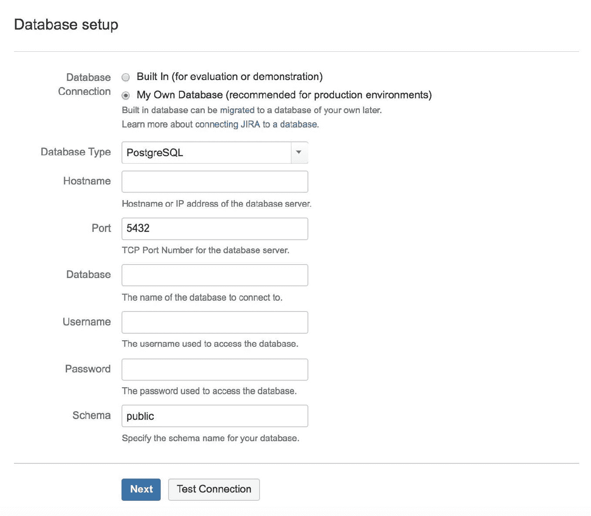

第三步是输入关于 Jira 安装的一些基本信息。这些设置可以稍后更改，因此如果不确定，也不必担心。需要注意的一项设置是 Base URL，它需要是 Jira 实例的完全合格 URL。如果设置不正确，可能会导致以后出现问题，例如电子邮件通知中的链接无法正常工作：

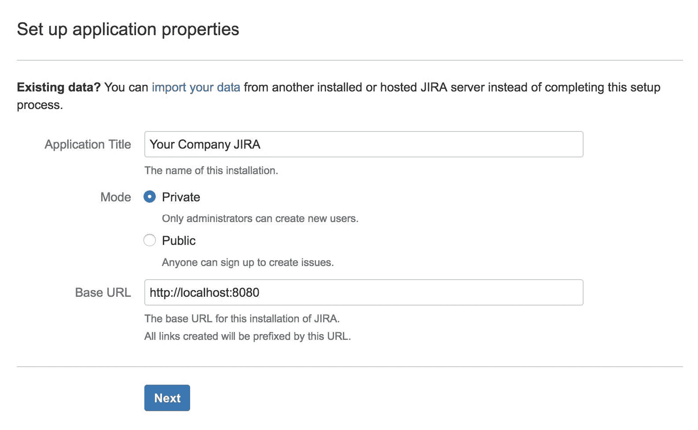

第四步是输入 Jira 软件的许可证密钥。如果你已有密钥，只需将其复制并粘贴到文本框中。如果没有密钥，可以通过点击页面上的“生成 Jira 试用许可证”链接来生成一个 30 天的试用许可证。

这需要你拥有 My Atlassian 门户的账号。如果你还没有账号，可以免费注册一个并生成试用许可证：

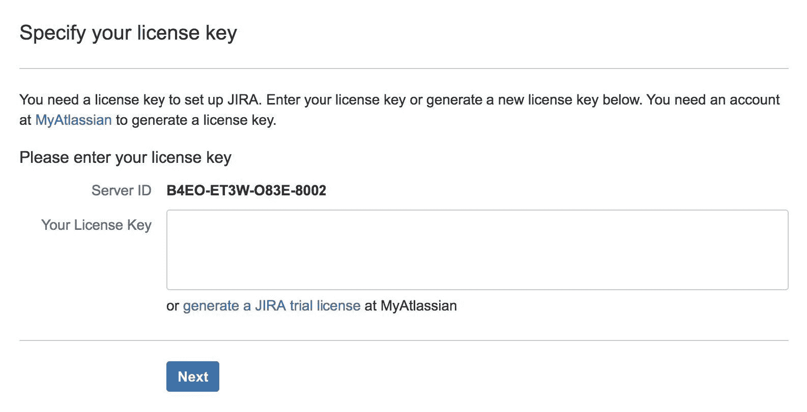

第五步，你将被要求创建管理员账号。这个账号是超级管理员账号，你将在紧急情况下使用，特别是当你将 Jira 与外部用户管理系统（例如 LDAP）集成时，如果你与所选管理系统之间的连接出现问题，这个账号会非常重要。

请将此账户的凭据保存在安全的地方，并避免丢失。

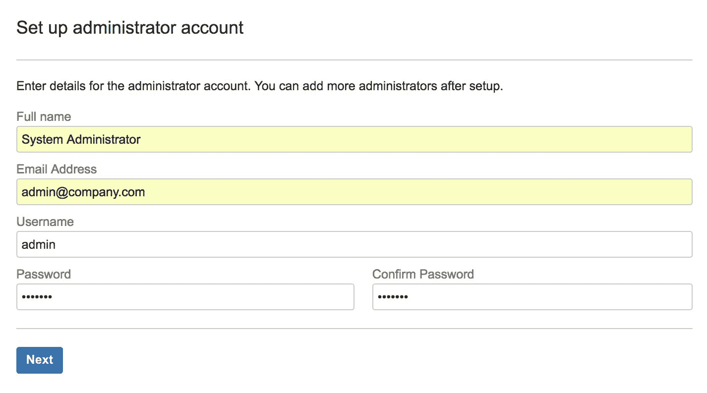

在第六步，也是最后一步，你将有机会设置 Jira 如何发送通知邮件。与之前的步骤不同，这是可选项，如果你没有准备好邮件服务器，可以跳过此步骤，并稍后进行设置：

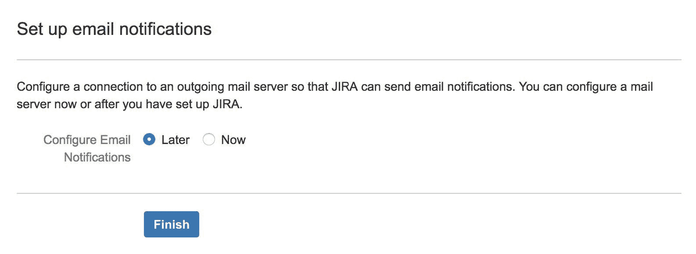

就这样！恭喜，你的 Jira 已经安装、配置完成，且准备就绪。点击右下角的“带我进入 JIRA”按钮，退出向导界面：

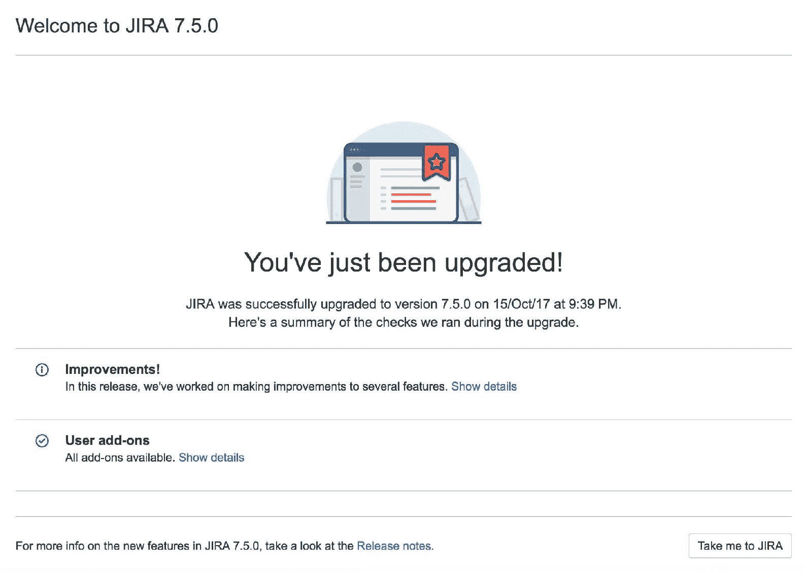

点击“带我进入 JIRA”按钮后，你将自动使用之前创建的管理员账户登录。由于这是首次使用该账户，你需要设置一些个性化选项，例如首选语言和头像。设置完账户个性化后，你将看到欢迎界面，类似于以下截图：

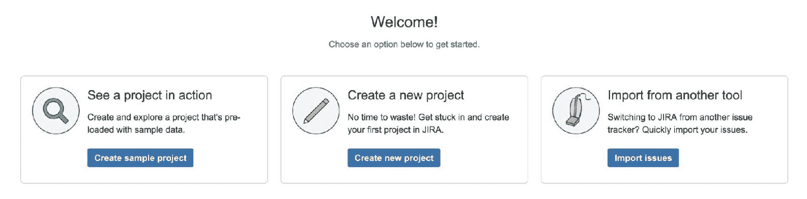

# 创建示例项目

由于我们刚刚安装了一个全新的 Jira 实例，系统会要求我们创建一个新项目。你可以选择通过“导入问题”选项从现有数据（如 CSV 文件）或其他问题跟踪系统（如 Bugzilla）导入问题。你还可以选择通过“创建新项目”选项创建一个空项目并立即开始使用，或者通过“创建示例项目”选项使用 Jira 内置的示例数据来创建一个示例项目进行探索和实验，这也是我们接下来步骤中要做的事情：

1.  点击“创建示例项目”按钮。

1.  从项目模板菜单中选择项目类型。我们将使用 Scrum 软件开发模板：

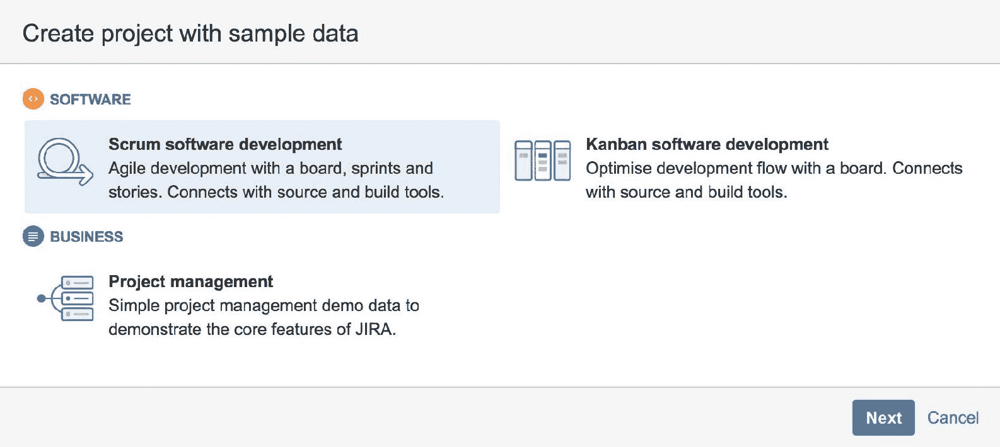

1.  输入新项目的名称和密钥：

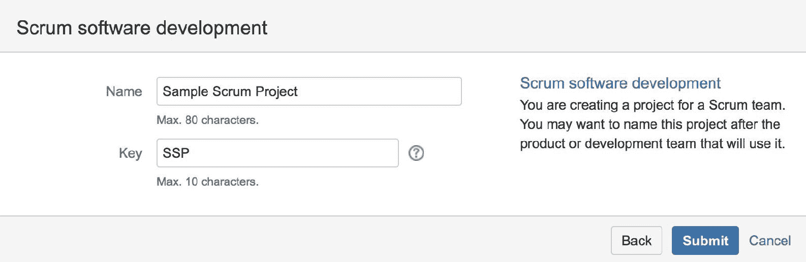

1.  Jira 将创建一个新项目，并为其填充示例问题。你将进入新项目及其敏捷看板，在我们的案例中是 Scrum 看板。我们将在下一节讲解看板，并在第二章中讨论*Jira 软件与 Scrum*。

# 理解 Jira 及其敏捷功能

如果你之前使用过 Jira，尤其是在 Jira 7 之前，你可能会将 Jira 用于各种用途，包括但不限于敏捷软件开发。实际上，在 Jira 7 之前，要在 Jira 中启用敏捷功能，你需要安装 Atlassian 提供的单独附加组件——*Jira Agile*。从 Jira 7 开始，敏捷功能已与 Jira 软件产品包捆绑在一起，你无需额外安装附加组件。然而，有许多有用的第三方附加组件可以大大增强你的使用体验，我们将在后续章节中进行讲解。

由于本书主要关注如何使用 Jira 软件进行敏捷软件开发，我们将首先介绍一些敏捷概念，并查看它们在 Jira 中的表示和应用。

# 敏捷看板

**敏捷看板**，简称看板，是你作为最终用户在日常项目中使用的主要用户界面。敏捷看板允许你可视化项目中的任务及工作流中的可用步骤，并提供一个交互式方式来将任务从一个工作流步骤转移到另一个。根据你使用的看板类型，还会有额外的功能，提供一系列的功能——例如，有些可能允许你管理功能的待办事项列表，提供视觉提示来突出潜在的瓶颈等。结合额外的插件，你甚至可以拍摄敏捷看板的快照，并将其放置到物理白板上，反之亦然。以下截图显示了一个处于工作或冲刺模式的 Scrum 看板：

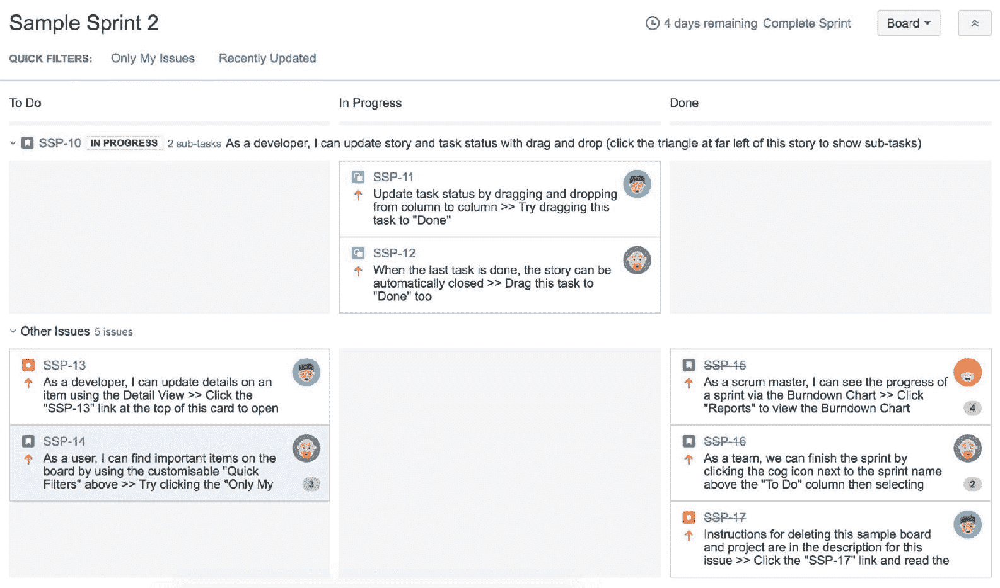

# 卡片

卡片就像你在白板上可能使用的便签纸。它捕捉了用户故事，并代表需要实现的需求或功能。在 Jira 中，每个卡片代表一个任务或问题。以下截图显示了卡片在敏捷看板上的样子：

# 问题和问题类型

Jira 中的每个工作单元，如故事或史诗，统一被称为**问题**。每个问题都有一个字段叫做**问题类型**，它表示问题的类型和目的。例如，在一个 Scrum 项目中，我们默认会有以下问题类型：

+   **史诗**：这代表一个尚未细化为更细粒度需求的大型用户故事。在 Jira 中，史诗通常用于定义多个将成为其中一部分的故事的“主题”，以及大型开发项目中的模块或主要组件。

+   **故事**：这代表一个要实现的单一功能。它通常用于从最终用户的角度捕捉需求。因此，故事通常以非技术性语言书写，并关注功能的期望结果。

+   **缺陷**：这代表需要修复的产品缺陷或问题。

+   **任务**：这代表一个通用任务，不是缺陷也不是故事，但需要完成。

正如我们将在后续章节中看到的，你可以自定义项目的问题类型列表，以更好地适应项目需求。

# 字段

每个问题由多个字段组成，如前面提到的问题类型字段以及其他字段，如摘要、描述和指派人。Jira 提供了一组默认字段，帮助你快速入门，但正如我们在第五章《自定义 Jira 软件》中将看到的那样，添加字段到你的项目非常简单。

# 工作流

工作流是 Jira 的核心，它在后台驱动着 Jira 及其敏捷看板的运作。正如我们将在后续章节中看到的那样，Jira 能够与您现有的工作流集成，或者根据您的开发过程进行适配和建模。刚开始时，您无需了解太多关于工作流的知识，因为 Jira 会为您处理这些内容。我们将在第五章中更详细地介绍工作流，*定制 Jira 软件*。

# 过滤器和 JQL

Jira 敏捷看板可以处理一个特定项目或多个项目。当您需要多个项目时，您将需要使用过滤器来定义哪些问题将被包含在内。因此，理解并有效使用**Jira 查询语言（JQL）**将非常有用。您可以在[`confluence.atlassian.com/jiracoreserver075/advanced-searching-935563511.html`](https://confluence.atlassian.com/jiracoreserver075/advanced-searching-935563511.html)找到有关 JQL 的更多信息。

# 使用 Jira 敏捷项目模板进行敏捷开发

正如我们在创建示例项目时所看到的，Jira 提供了多个项目模板，如 Scrum 和 Kanban。项目模板使您可以基于预定义的设置创建新项目，这样当项目创建时，它将自动设置所有必要的配置，包括：

+   **问题类型方案**：仅包含所选模板相关问题类型的问题类型方案，例如适用于 Scrum 的故事和史诗。

+   **工作流**：一个专门设计的工作流，使您在敏捷看板上处理问题时更加轻松。

+   **屏幕**：包含处理敏捷所需字段的一组屏幕，例如用来将故事与史诗关联的史诗链接，以及在将任务添加到 Scrum 冲刺时使用的冲刺字段。

+   **敏捷看板**：专门为新项目分配的敏捷看板，前提是模板为 Scrum 或 Kanban。

正如我们将在后续章节中看到的那样，您可以为任何现有项目创建敏捷看板，即使它们不是作为 Scrum 或 Kanban 模板创建的。这些项目模板只是帮助您快速入门的工具。

# 概要

在本章中，我们回顾了 Jira 软件的一些基本概念以及它对敏捷方法的支持。我们从头开始安装了 Jira 软件实例，并使用带有示例数据的 Scrum 项目模板创建了一个项目，我们将在后续章节中使用该项目。

现在我们已经介绍了 Jira 软件的基本知识，接下来我们将开始探索如何使用它来运行敏捷项目，从下章的 Scrum 方法论开始。
