# 第二章：Jira 软件与 Scrum

Scrum 是 Jira 软件支持的敏捷方法之一。与过去的方式不同，那时单一的项目经理会使用电子表格或 Microsoft Project 来跟踪项目进展，而在 Jira 软件和 Scrum 的帮助下，团队成员的参与被鼓励，以促进不同项目利益相关者之间的协作。在本章中，我们将探讨如何利用 Jira 软件释放 Scrum 的力量。

本章结束时，您将学习以下内容：

+   Scrum 概述

+   设置 Scrum 看板

+   管理问题积压

+   估算工作量和团队的工作速度

+   运行 Scrum 冲刺

+   跟踪和审查冲刺进度

# Scrum

与传统的瀑布方法不同，瀑布方法中每个任务或项目阶段是顺序进行的，而 Scrum 提出了迭代的概念。从高层次看，在 Scrum 中，一个项目被分解为若干次迭代，称为冲刺。每个冲刺通常持续一到两周。项目团队完成部分工作，整个项目在所有冲刺完成后就结束了。通过这种方式，项目团队能够做到以下几点：

+   在每次冲刺中持续交付，以便尽早收集反馈

+   在项目生命周期中适应变化

+   及早发现问题，而不是等到最后才发现，这样做成本很高

+   在每次冲刺结束时通过回顾会议持续改进流程

# Scrum 中的角色

在任何 Scrum 团队中，有三个主要角色。尽管每个角色都有其特定的职能和责任，但这三者需要共同协作，才能作为一个紧密的团队取得 Scrum 的成功。

# 产品负责人

产品负责人通常是负责拥有产品整体愿景和方向的产品经理或项目经理。作为产品负责人，他们负责将要添加到积压工作中的功能、每个功能的优先级，并计划通过冲刺交付这些功能。本质上，产品负责人是确保团队在每个冲刺中为利益相关者交付最大价值的人。

# Scrum Master

Scrum Master 的工作是确保团队高效、有效地运行和使用 Scrum，因此他们需要对 Scrum 有深入的知识和经验。Scrum Master 有以下两个主要责任：

+   指导并帮助团队中的每个人理解 Scrum；这包括产品负责人和交付团队，以及与项目团队互动的外部人员。在教练的角色中，Scrum Master 可能会帮助产品负责人理解并更好地管理积压工作和冲刺计划，同时向交付团队解释流程。

+   通过消除阻碍来改进团队的 Scrum 过程。障碍，也称为**障碍因素**，是指任何可能阻碍或负面影响团队采用 Scrum 的事物。这些问题可能包括不合理的产品待办事项列表，或者来自其他团队/管理层的支持不足。Scrum 大师有责任直接消除这些障碍，或者与团队合作找到解决方案。

总体而言，Scrum 大师是 Scrum 的倡导者，负责教育、促进和帮助团队成员采用 Scrum，并实现其优势。

# 交付团队

交付团队主要负责执行和交付最终产品。然而，团队还负责提供任务估算，并协助产品负责人更好地规划冲刺和交付。

理想情况下，团队应由项目所需的跨职能成员组成，例如开发人员、测试人员和业务分析师。由于每个冲刺都可以看作是一个独立的小型项目，因此在任务执行并通过工作流传递时，随时拥有所需的所有资源至关重要。

最后但同样重要的是，团队还负责在每次冲刺结束时与产品负责人和 Scrum 大师一起回顾他们的表现。这有助于团队回顾他们的工作，并揭示如何在即将到来的冲刺中改进表现。

# 了解 Scrum 过程

现在，我们将简要介绍 Scrum 并概述 Scrum 规定的各种角色。让我们看看典型项目如何使用 Scrum 运行，以及一些关键活动。

首先，我们有待办事项列表，它是一个一维的列表，列出了团队需要实现的功能和需求。待办事项按优先级从上到下排列。虽然产品负责人是负责待办事项的人，并根据他们的愿景定义优先级，但团队中的每个人都可以通过添加新事项、讨论优先级以及估算实现所需的努力来为待办事项列表做出贡献。

然后，团队将开始规划下一个即将进行的冲刺。在此次冲刺规划会议中，团队将决定冲刺的范围。通常，待办事项中优先级最高的项目将被纳入其中。关键在于，在冲刺结束时，团队应交付一个经过充分测试的、潜在可交付的产品，其中包含所有已承诺的功能。

在冲刺期间，团队将每天举行一次 Scrum 会议，通常在每天开始时，每个团队成员会简要概述他们已经完成的工作、计划进行的工作以及可能遇到的任何障碍。会议的目的是确保每个人都在同一页面上，因此会议应该简短且高效。

在冲刺结束时，团队会召开冲刺回顾会议，团队会向利益相关者展示他们所完成的工作。在这个会议中，随着产品逐渐成型，新的变更通常会出现，这些变更将被添加到待办事项列表中，团队将在下一次冲刺开始前对这些变更重新进行优先级排序。

另一个名为冲刺回顾会议的会议也将在冲刺结束时召开，在这个会议中，团队将一起讨论他们做得对的地方、做得错的地方以及如何改进。

在整个过程中，Scrum 大师将充当裁判，确保所有这些活动都能正确执行。例如，Scrum 大师会在待办事项和冲刺规划会议期间指导产品负责人和团队，确保他们的项目范围和描述是准确的。Scrum 大师还将确保会议保持专注、高效，不会超时，并且团队成员之间保持尊重，不会打断对方讲话。

现在，你已经了解了使用 Scrum 的一些优势和不同的角色，以及一个简单的 Scrum 流程。接下来，我们来看看如何使用 Jira 软件通过 Scrum 来管理项目。

# 创建新的 Scrum 看板

使用 Jira 软件进行 Scrum 的第一步是为你的项目创建一个 Scrum 看板。如果你是通过使用 Scrum 项目模板创建项目的，如第一章《*Jira 软件基础*》所示，那么 Scrum 看板会在创建项目的同时自动为你创建。

然而，如果你想为现有项目创建一个看板，或者如果你希望你的看板跨多个项目，你需要单独创建它。要创建一个新的看板，请按照以下步骤操作：

1.  从顶部导航栏点击“看板”菜单项，并选择“查看所有看板”选项。

1.  点击“创建看板”按钮。这将弹出“创建敏捷看板”对话框。

1.  选择“创建 Scrum 看板”选项，如下图所示：

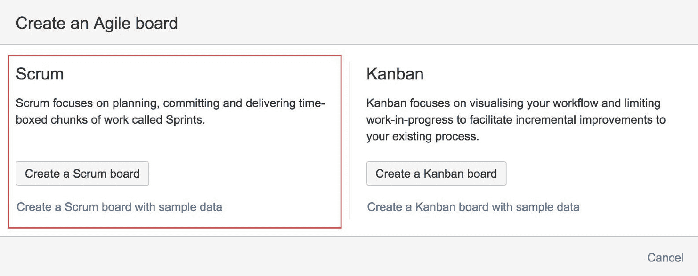

1.  选择你希望创建看板的方式。这里有三个选项可以选择，如下所示：

    +   使用新的软件项目创建看板：这与使用 Scrum 项目模板创建项目相同。将创建一个新项目，并为该项目创建一个新的 Scrum 看板。如果你想从零开始创建一个新的 Scrum 项目，可以选择此选项。

    +   来自现有项目的看板：此选项允许你创建一个可以跨多个现有项目的看板。如果你已经有一个现有项目，并且想为其添加一个新的 Scrum 看板，可以选择此选项。

    +   来自现有已保存筛选器的看板：此选项与现有项目选项类似，但允许你使用筛选器来定义哪些问题将被包含。如果你想为多个项目创建看板，并且希望更精细地控制要包含哪些问题，可以使用此选项。

如果您的项目中有许多任务，您还可以使用过滤器来限制要包括的任务数量。

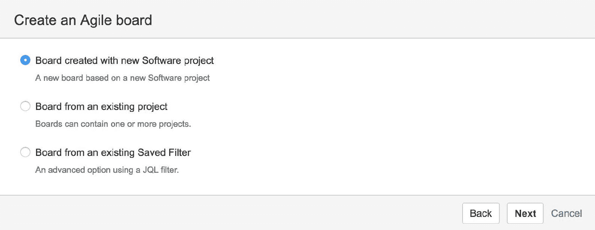

1.  填写看板所需的信息。根据您选择的选项，您可能需要提供项目详情或选择要使用的过滤器。以下截图展示了如何从两个现有项目创建看板的示例。点击“创建看板”按钮以完成：

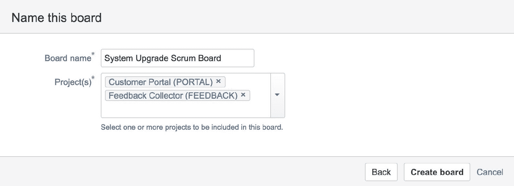

# 了解 Scrum 看板

Scrum 看板是您和您的团队用于计划和执行项目的工具。它既是您的待办事项列表，也是您的冲刺活动看板。Scrum 看板有以下主要模式：

+   待办事项：待办事项模式是您将计划冲刺、组织待办事项列表并创建任务的地方。

+   活跃冲刺：活跃冲刺模式是您的团队将在其中工作的冲刺阶段。

+   发布：发布模式显示了您为项目准备的所有版本（请参见本章后面的部分），以及每个版本的进度。

+   报告：报告模式是您可以跟踪冲刺进度的地方。

+   任务：任务模式是搜索模式，您可以在此处使用各种过滤选项和高级搜索查询来搜索项目中的任务。

+   组件：组件模式列出了项目中的所有组件。在 Scrum 中，史诗（epics）通常用来代替组件。

以下截图展示了典型的 Scrum 看板在待办事项模式下的样子。在页面中央，您有待办事项列表，列出了所有任务。您可以上下拖动它们来重新排序优先级。在右侧，您有任务详细信息面板，点击待办事项中的任务时将显示该面板：

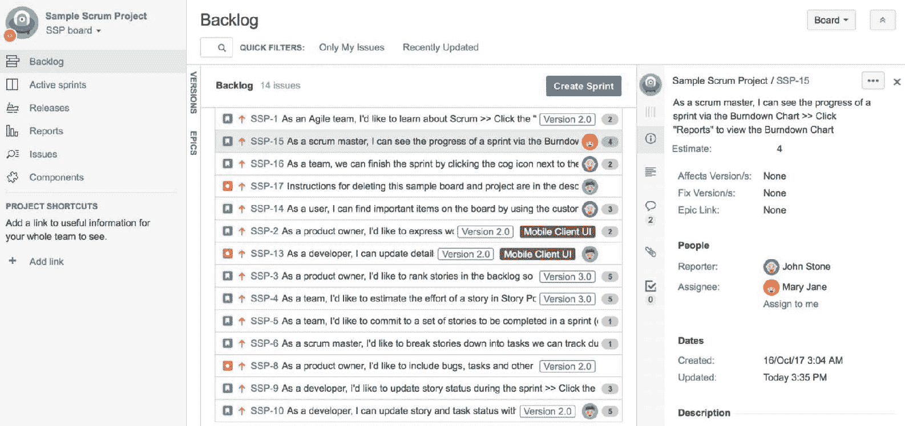

在待办事项规划会议期间，产品负责人和团队将使用此待办事项模式来添加新项目到待办事项列表，并决定它们的优先级。

# 创建新任务

当创建一个 Scrum 看板时，所有的任务（如果有的话，也称为用户故事，简称故事）都会被放入待办事项列表中。在冲刺计划会议中，您可以创建更多任务并将其添加到待办事项列表中，同时将需求转化为用户故事。创建新任务的步骤如下：

1.  浏览到您的 Scrum 看板。

1.  从顶部的导航栏点击“创建”按钮，或者按下键盘上的 *C* 键。这将弹出创建任务对话框。

1.  在“任务类型”字段中选择您要创建的任务类型（例如，故事）。

1.  为任务提供附加信息，例如摘要和描述。

1.  点击“创建”按钮来创建任务，如下图所示：

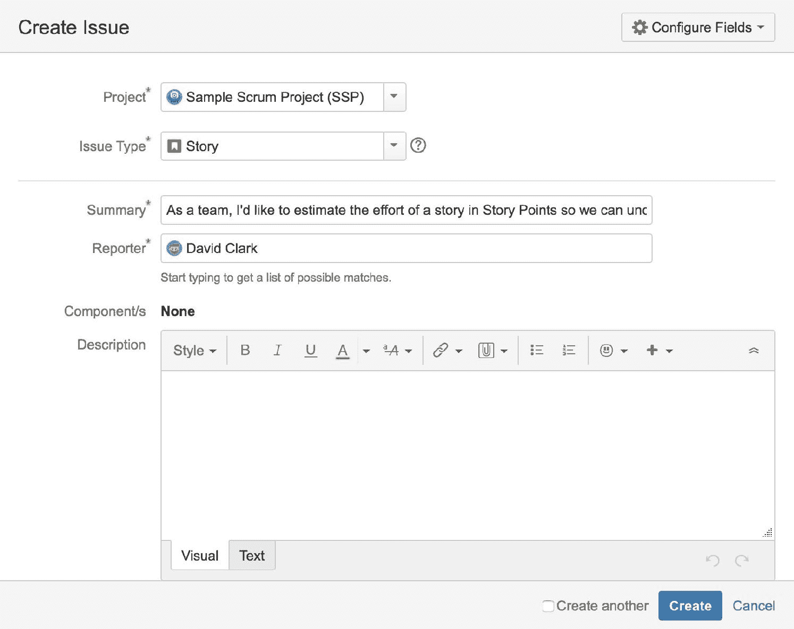

创建任务屏幕可以自定义，添加额外的字段。我们将在第五章中讨论字段和屏幕的自定义，*自定义 Jira 软件*。

一旦您创建了问题，它将被添加到待办事项中。然后，您可以将其分配到史诗或版本中，并通过将其添加到冲刺中来安排完成时间。

在创建和完善用户故事时，您需要尽可能地将其拆解，这样在决定冲刺的范围时，团队就可以更轻松地提供估算。一种方法是使用 Bill Wake 定义的**INVEST**特性：

+   **独立**：最好每个故事都能独立完成。虽然这并非总是可能，但独立的任务会使实现更容易。

+   **可协商**：开发人员和产品负责人需要共同合作，确保双方完全了解故事的内容。

+   **有价值**：故事需要为客户提供价值。

+   **可估算**：如果故事对开发团队来说过大或过于复杂，无法提供估算，那么需要进一步拆解。

+   **小**：每个故事需要足够小，通常是针对一个单一的功能，可以在一个冲刺中完成（大约两周）。

+   **可测试**：故事需要描述预期的最终结果，以便在实施后可以进行验证。

# 创建新的史诗

史诗是大型用户故事，或是需要拆解成更小、更易管理的用户故事的大型工作。例如，一个史诗可能叫做“性能提升”，其中包含多个用户故事，如诊断性能问题和实施各种修复。史诗可以在一个冲刺中完成，但并不要求必须如此，通常它们会通过多个冲刺交付，并按照它们包含的用户故事的优先级顺序进行交付。在 Jira 软件中，史诗是问题类型设置为“史诗”的问题。

要从您的 Scrum 看板创建新的史诗，执行以下步骤：

1.  如果史诗面板被隐藏，可以通过点击左侧面板中的“史诗”来展开。

1.  从“史诗”面板点击“创建史诗”链接。将鼠标悬停在面板上时，链接将出现。这将弹出创建史诗对话框，项目和问题类型字段已经为您预先选择：

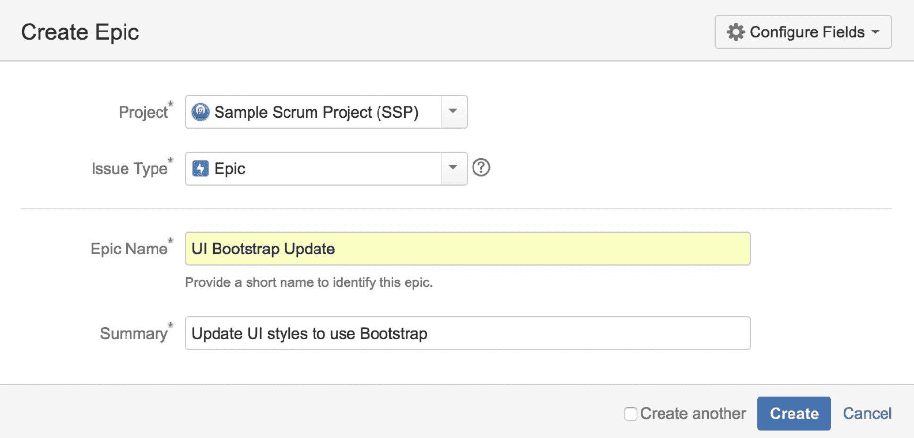

您还可以打开“创建问题”对话框，如前一节所示，并选择问题类型为“史诗”。

1.  在“史诗名称”字段中提供史诗名称。

1.  在“摘要”字段中提供简要概述。

1.  点击“创建”按钮。

一旦您创建了史诗，它将被添加到史诗面板。

史诗不会以卡片的形式出现在冲刺或待办事项列表中。

创建史诗后，您可以开始在其中添加问题。这样做有助于您组织与同一功能或特性相关的问题。

有两种方法可以将问题添加到史诗中：

1.  通过直接在史诗中创建新问题，展开您想要的史诗，并点击“在史诗中创建问题”链接。

1.  通过将现有问题拖动到史诗任务中，如下图所示：

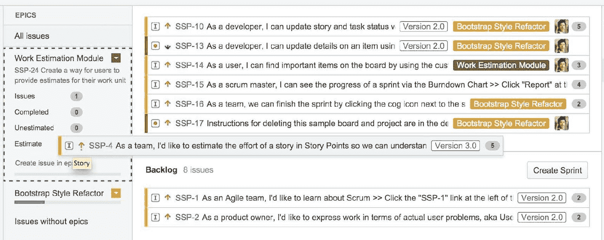

# 估算你的工作

估算是一门艺术，是 Scrum 的重要组成部分。团队能够准确估算将直接影响你们冲刺的成功与否。对于 Scrum 来说，估算意味着速度，换句话说，就是你们团队在一个冲刺周期内能够交付多少工作量。这与传统的按工时来测量和估算是不同的。

测量速度的概念是将估算与时间追踪解耦。因此，与其根据完成一个任务需要多少小时来估算工作量——这样往往会使人们为了保持估算的准确性而加班工作，不如通过使用一个任意的数字来进行测量，这样可以帮助我们避免这个陷阱。

一种常见的方法是使用所谓的故事点。故事点用于衡量完成一个任务所需的复杂性或努力程度，而不是完成它需要多长时间。例如，一个复杂的任务可能有 8 个故事点，而一个较简单的任务可能只有 2 个故事点。这并不意味着复杂的任务需要 8 小时来完成，它仅仅是一种衡量任务复杂性的方式。

在你用故事点估算完所有问题后，你需要确定你的团队在一个冲刺中能交付多少故事点。当然，在第一次冲刺时，你可能不知道这个数值，所以需要再次进行估算。假设你的团队在一个为期一周的冲刺中能够交付 10 个故事点的工作量，那么你可以创建包含总共 10 个故事点的任务集合。随着团队开始进行冲刺，你可能会发现 10 个故事点的估算值过高或过低，因此需要为第二次冲刺调整这个估算。记住，这里的目标不是第一次就做到完美，而是要持续改进你的估算，直到团队能够始终如一地交付相同数量的故事点工作量——也就是说，你们团队的速度。一旦你开始准确预测团队的速度，管理每个冲刺的工作量将变得更容易。

现在你已经知道了 Scrum 中的估算是如何工作的，接下来我们来看一下 Jira 软件如何让你估算工作量。

Jira 软件提供了几种方式来估算问题，默认的方法是使用故事点。你的待办事项中的每个故事都有一个叫做估算的字段，如下图所示。为了给故事提供一个估算值，你只需将鼠标悬停在该字段上，点击并输入故事点值：

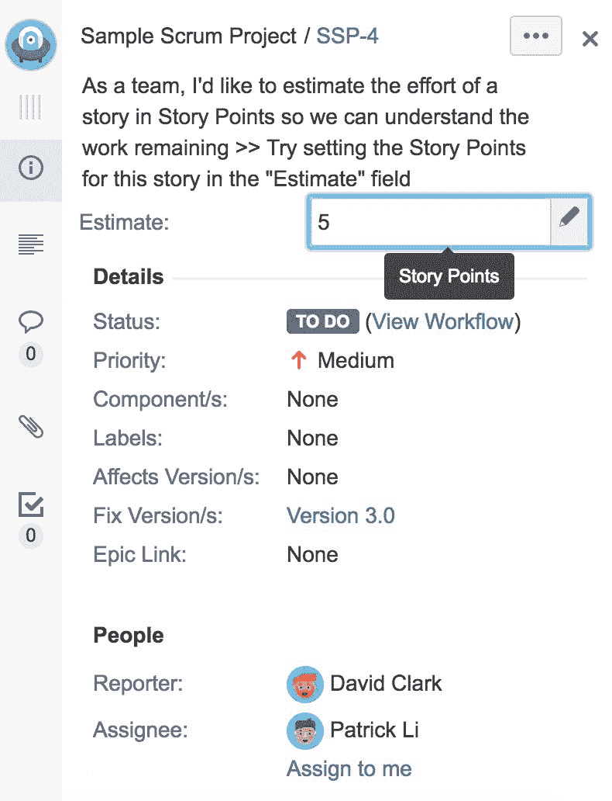

一致性是估算中最重要的因素。宁可 consistently wrong 也不愿 inconsistent right and wrong。当然，最终的目标是从 consistently wrong 中改进，逐步做到 consistently right。

请记住，你在此提供的估算值是任意的，只要它能够反映问题之间的相对复杂度。这里有一些关于估算的要点：

+   在估算问题时保持一致性。

+   在估算时请让团队参与进来。

+   如果估算结果不准确，那也没关系。这里的目标是改进和调整。

# 对问题进行排名和优先级排序

在规划会议中，给问题排序是很重要的，这样列表才能反映它们之间的相对重要性。对于熟悉 Jira 的人来说，它有一个优先级字段，但由于它允许多个问题共享相同的优先级值，因此当两个问题都标记为“关键”时，这会变得有些混乱。

在 Scrum 中，你应该通过拖动问题上下排序，按照其重要性进行优先级排序。这通常是在整理 Backlog 时进行的。通过将最重要的问题排在 Backlog 的顶部，在进行 Sprint 规划时，你可以轻松地通过拖动 Sprint 底部来添加问题，稍后我们将看到这一点。

# 创建新版本

在软件开发团队中，你可能会使用版本来规划发布。使用版本可以帮助你规划和组织 Backlog 中的问题，并安排它们的完成时间。你可以创建多个版本，并据此规划你的路线图。

创建新版本，请按照以下步骤操作：

1.  如果版本面板被隐藏，点击左侧面板中的 VERSIONS 来展开它。

1.  点击 Versions 面板中的 Create Version 链接。当你将鼠标悬停在面板上时，链接会显示出来。点击该链接会弹出“创建版本”对话框，项目字段会为你预先选中，截图如下所示：

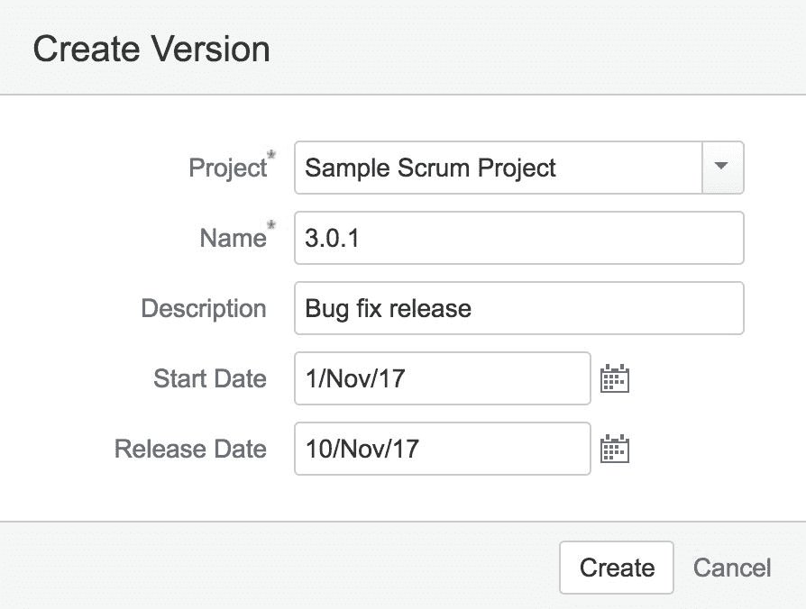

1.  在名称字段中为版本提供一个名称。

1.  你还可以为版本指定开始日期和发布日期。这些字段是可选的，并且可以稍后更改。

1.  点击创建按钮。

一旦版本创建完成，它将被添加到 Versions 面板中。就像史诗一样，你可以通过将问题拖放到目标版本中来将问题添加到版本中。在 Scrum 中，版本可以跨多个 Sprint。点击版本后，将显示该版本中包含的问题。如下面的截图所示，版本 2.0 跨越了三个 Sprint：

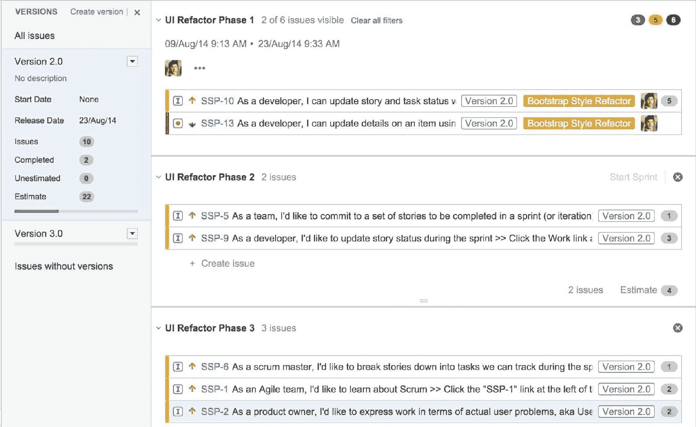

# 规划 Sprint

Sprint 规划会议是项目团队在每个 Sprint 开始时聚集在一起，决定接下来应该关注和处理的事项。在 Jira 中，你将使用看板的 Backlog 模式来创建并规划新的 Sprint 范围。

现在我们来说明 Sprint 规划过程中一些关键的组件：

+   Backlog：包括所有尚未进入任何 Sprint 的问题。换句话说，它包括所有尚未安排完成的问题。对于一个新建的看板，所有现有问题都会被放置在 Backlog 中。

+   冲刺：这些显示在待办事项之上。你可以拥有多个冲刺并进行提前规划。

+   问题详情：这是右侧的面板，显示你点击的任何问题的详细信息。

+   史诗：这是左侧的一个面板，显示你拥有的所有史诗。

+   版本：这是左侧的另一个面板，它显示了你拥有的所有版本。

以下截图中突出显示的区域是新的冲刺，冲刺中的问题是团队承诺在冲刺结束时交付的内容：

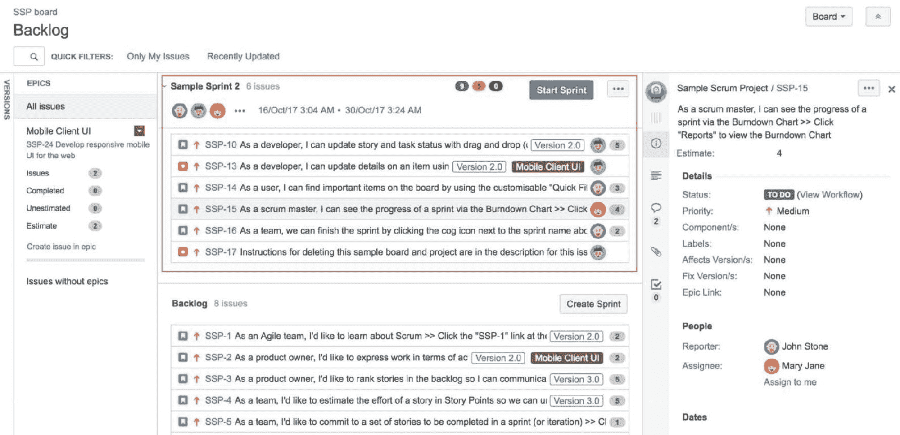

# 开始一个冲刺

一旦所有史诗和问题都已创建，就该开始准备冲刺了。第一步是点击“创建冲刺”按钮，创建一个新的冲刺。

有三种方式将问题添加到冲刺中：

+   通过从待办事项中拖动你想要的任务并将其放入冲刺中。

+   编辑问题的冲刺字段，并选择你要将问题添加到的冲刺。

+   通过将冲刺页脚拖动到待办事项中的问题，以便将其包括在冲刺中。如果你已经对待办事项进行了整理，这是一种快捷方式，可以让你专注于位于顶部的问题。

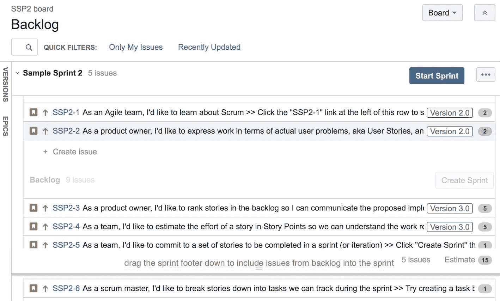

你可以创建多个冲刺，并通过从待办事项中填充每个冲刺来规划当前冲刺之外的内容。

一旦你将所有想要包含在冲刺中的问题都选好，点击“开始冲刺”按钮。如以下截图所示，系统会要求你设置冲刺的开始和结束日期。默认情况下，Jira 会自动将开始日期设置为当前日期，结束日期设置为一周后的日期。你当然可以更改这些日期。一般的最佳实践包括以下几点：

+   保持冲刺时间短，通常为一到两周。

+   保持冲刺的时长一致；这样，你将能够准确预测团队的速度：

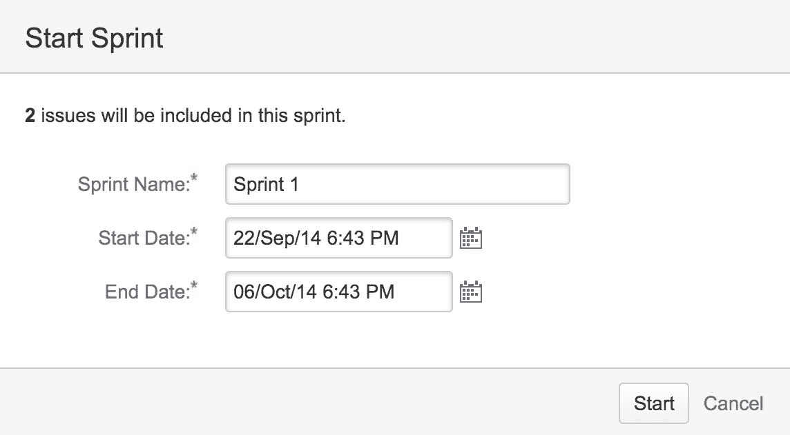

一旦开始了你的冲刺，你将进入看板的“活跃冲刺”模式。

请注意，开始一个冲刺前，你需要考虑以下事项：

+   必须没有正在进行的冲刺。每个看板每次只能有一个活跃的冲刺。不过，有一个选项允许你运行并行冲刺，我们将在下一个章节中讲解。

+   你必须拥有所有项目的**管理项目**权限，这些项目都包含在看板中。我们将在第五章中讲解权限，*定制化 Jira 软件*。

# 同时运行多个冲刺

默认情况下，每次只能有一个活跃冲刺。然而，有时你可能会有多个团队在同一个项目上工作，但在不同的领域。在这些情况下，你可能希望为每个团队运行不同的冲刺。你可以通过以下方法启用并行冲刺：

1.  使用管理员身份登录到 Jira，例如我们在安装过程中创建的用户。

1.  浏览到管理控制台的应用程序(Applications)部分。

1.  从左侧面板中选择 Jira 软件配置选项。

1.  勾选“并行冲刺”(Parallel Sprints)选项以启用此功能。

一旦启用了此选项，你将能够在同一个项目中启动多个冲刺。请注意，这是一个全局选项，因此所有项目都将允许并行冲刺。

# 正在进行冲刺

一旦你开始冲刺，你将进入“活动冲刺”(Active Sprints)模式；此时，所有属于该冲刺的问题将显示在此模式下。在“活动冲刺”模式下，看板将分为两个主要部分。

主要部分将包含当前冲刺中的所有问题。你会注意到它被分成了几个列。这些列表示问题可能处于的不同状态，应该反映出你团队的工作流。默认情况下，有三列：

+   待办(To Do)：问题等待开始处理

+   进行中(In Progress)：问题当前正在处理中

+   已完成(Done)：问题已经完成

正如我们在下一章中所看到的，你可以通过将这些列映射到 Jira 工作流状态来定制它们。

如果你使用史诗(epics)来组织问题，此部分也会分成几个水平泳道。泳道帮助你在看板上将相似的问题分组。泳道按照标准（如负责人、故事或史诗）将问题分组。默认情况下，泳道是按故事分组的。

因此，你可以看到，列是按状态将问题进行分组，而泳道则按相似性将问题分组。如下面的截图所示，我们有三列和两个泳道：

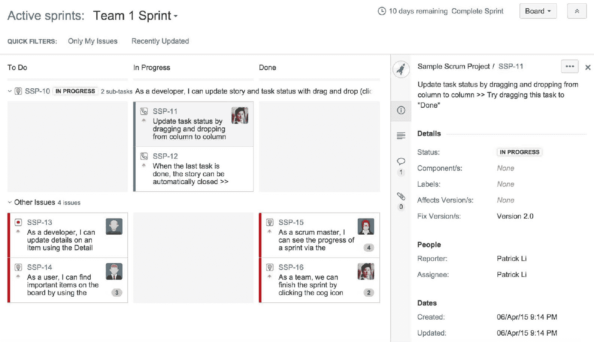

游泳道和工作流列都可以根据团队最佳的工作方式进行自定义，我们将在第四章《根据你的方式使用 Jira 软件》中详细讨论。

第二部分将在你点击一个问题后出现在右侧，显示该问题的详细信息，如摘要、描述、评论和附件。

在典型的场景中，冲刺开始时，所有问题都会位于最左侧的待办(To Do)列。在每日的 Scrum 会议中，团队成员会审查看板的当前状态，并决定当天的工作重点。例如，每个团队成员可以接受一个问题，并通过拖拽问题卡片将其移动到进行中(In Progress)列。一旦完成了问题的处理，他们可以将问题卡片拖到已完成(Done)列。团队会在整个冲刺过程中不断循环此操作，直到所有问题都完成：

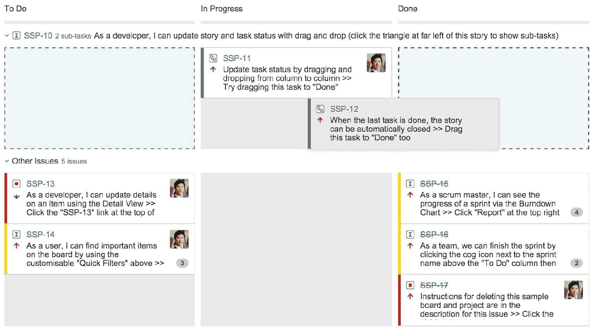

在冲刺期间，Scrum 大师和产品负责人需要确保除非紧急情况，否则不会打扰团队。Scrum 大师还应该协助移除那些阻碍团队成员完成分配任务的障碍。

产品负责人还应确保不会向冲刺中添加额外的故事，并且任何新的功能请求应添加到待办事项列表中，以便未来的冲刺使用。如果你尝试向当前活跃的冲刺中添加新问题，Jira 会发出警告。

# 完成一次冲刺

在冲刺结束的当天，你需要通过执行以下步骤来完成冲刺：

1.  转到你的 Scrum 看板并点击“活跃冲刺”。

1.  点击“完成冲刺”链接。这将弹出“完成冲刺”对话框，概述冲刺的当前状态。如以下截图所示，本次冲刺共有六个问题，其中三个已完成，三个未完成：

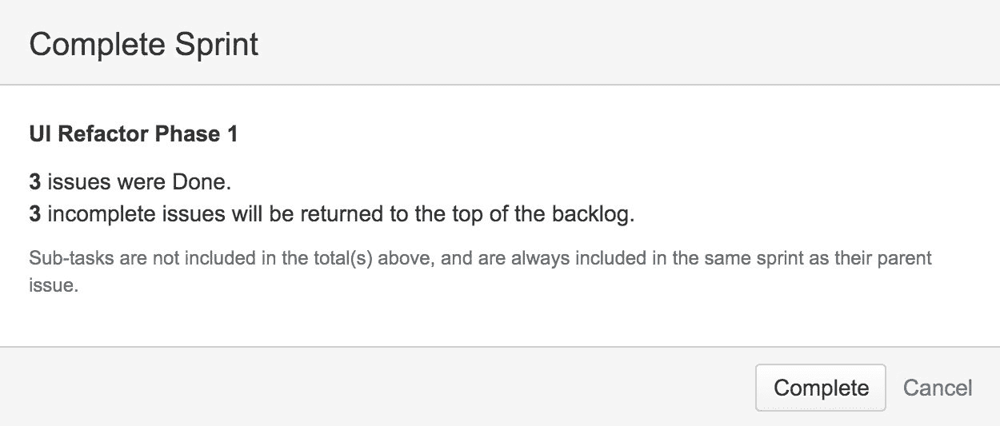

1.  点击“完成”按钮以完成冲刺。

当你完成一个冲刺时，任何未完成的问题将自动移回待办事项列表的顶部。有时，如果只有一两个问题未完成，你可能会有延长冲刺的冲动，但不应该这样做。记住，这里的目标不是通过延长冲刺来使你的估算看起来更准确，也不是强迫你的团队更加努力地完成所有任务。你要确保团队在每个冲刺中都能稳定地完成相同数量的工作。如果你有未完成的工作，那就意味着你的团队的工作速度应该降低。因此，在下一个冲刺中，你应该计划减少工作量。

# 报告冲刺进度

随着团队忙碌地处理冲刺中的问题，你需要有一种方式来跟踪进展。Jira 通过报告模式提供了许多有用的报告。你可以在冲刺期间随时访问报告模式。这些报告在冲刺回顾会议期间也非常有用，因为它们提供了关于冲刺进展的详细见解。

# 冲刺报告

冲刺报告为你提供了冲刺进展的快速概览。它包括一个燃尽图（见下节）和一个汇总表，列出了冲刺中的所有问题及其状态，如下所示：

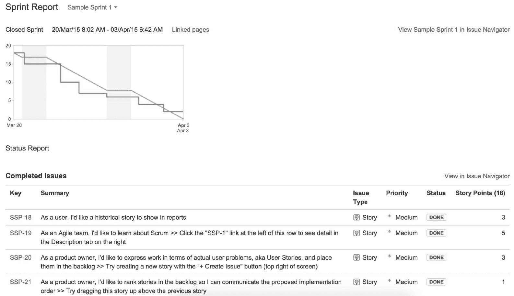

如前所述的冲刺报告所示，我们已经完成了六个问题。一个问题未完成，并被放回了待办事项列表。

# 燃尽图

燃尽图显示了剩余预计或理想工作的图示与实际进展的对比。灰色线表示项目预计的进度，红色线表示实际进展。在理想情况下，随着冲刺每天的进展，这两条线应尽可能靠近：

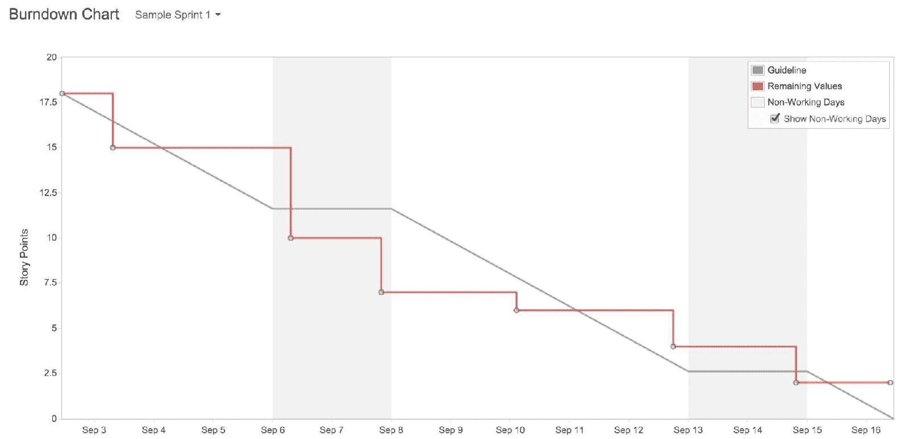

# 速度图表

速度图表展示了原本承诺的冲刺工作量（灰色条形）与实际完成的工作量（绿色条形），具体取决于你如何估算，例如在故事点的情况下。

图表将包括过去的迭代周期，你可以根据这些数据了解趋势并预测团队的工作速度。如下面的截图所示，从迭代 1 到 3，我们的工作量承诺过多，而在迭代 4 中，我们完成了所有已承诺的工作。因此，计算团队速度的一种方式是基于“已完成”一栏来计算平均值，这将给你一个关于团队实际速度的指示。

当然，这需要：

+   确保你的迭代周期保持一致

+   确保团队成员在工作效率上保持一致

+   确保你的估算方法保持一致

随着团队开始使用 Scrum，你可以期待看到团队的工作速度逐渐提高，因为你会不断优化工作流程。随着时间的推移，团队的工作速度将变得一致，并且可以作为可靠的工作量估算指标。这将帮助你避免对工作交付的过度承诺或承诺不足，如下图所示的工作速度图：

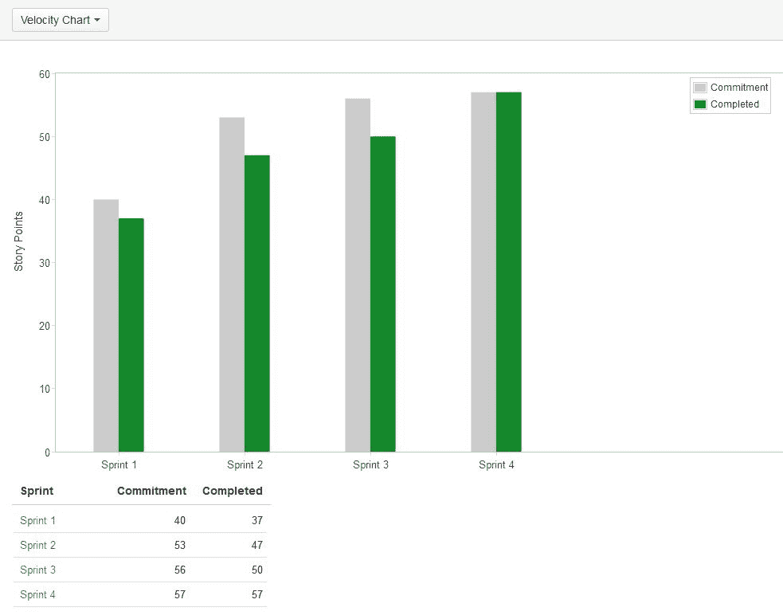

# 总结

在这一章中，我们介绍了如何使用 Jira 进行 Scrum 管理。我们探讨了 Scrum 看板，如何利用它组织问题积压、规划并执行迭代，以及如何通过报告和图表来回顾并跟踪进展。记住，成功执行迭代的关键要素是一致性、回顾和持续改进。如果你发现估算不准确，尤其是在初期的几个迭代中，那也是正常的；只需确保你进行回顾、调整和改进即可。

现在你已经了解了如何使用 Scrum 看板，下一章我们将介绍如何使用 Jira 进行 Kanban 管理。
