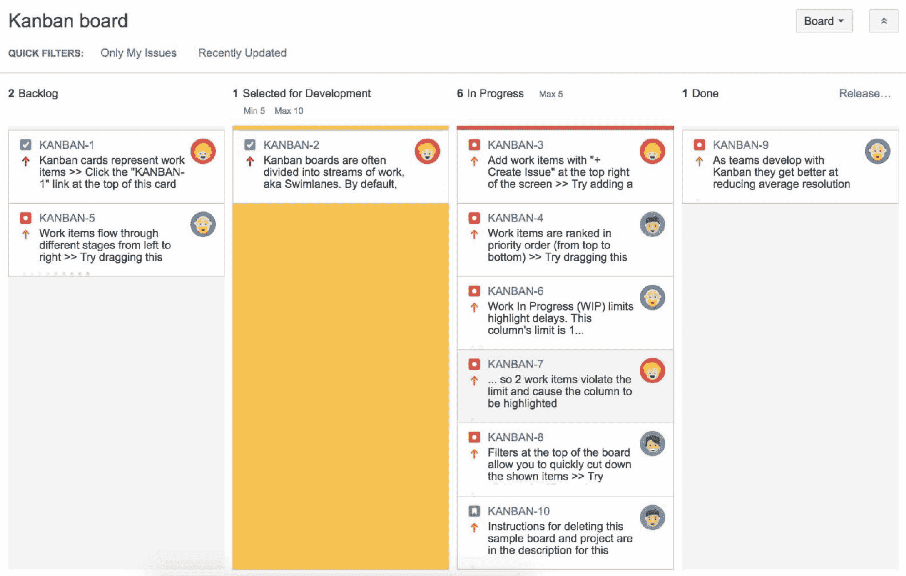

# 第三章：Jira Software for Kanban

在过去的两章中，我们已经介绍了如何使用 Jira Software 来支持 Scrum 敏捷方法。Jira Software 还支持另一种敏捷方法——Kanban，许多敏捷团队选择使用 Kanban 而不是 Scrum。在本章中，我们将探讨如何在 Jira Software 中使用 Kanban。

在本章结束时，你将学会如何：

+   使用 Kanban 可视化工作流

+   按 Kanban 方式处理问题

+   自定义你的 Kanban 看板

+   创建报告和图表以便改进

# Kanban

Kanban 是 Jira Software 支持的另一种敏捷方法。与围绕计划迭代（即冲刺）进行项目的 Scrum（详见第二章，*Jira Software for Scrum*）不同，Kanban 不进行迭代，或者说，Kanban 中的迭代使用是可选的。

简而言之，Kanban 有以下三个概念：

+   **可视化工作流**：这将任务（问题）拆解并展示在看板上。你需要组织你的看板，使得每一列都代表你整体工作流中的一个状态，按照从左（开始）到右（完成）的顺序排列。

+   **限制进行中的工作（WIP）**：这为工作流状态中的任务数设置最小和最大限制。

+   **衡量前置时间**：这计算完成一项任务所需的平均时间，并尽量保持时间低且可预测。

虽然 Scrum 要求团队规划有管理范围的迭代冲刺，并专注于团队的速度，而 Kanban 则更具灵活性，重点更多地放在**周期时间**上。周期时间是衡量一个问题或工作单元从头到尾穿越团队工作流所需时间的指标。目标是减少周期时间，识别工作流中的问题和瓶颈，并加以解决，从而使流程能够顺利进行。正如我们将看到的，Jira 提供了许多工具来帮助实现这一目标。

# 创建一个新的 Kanban 看板

Jira Software 提供了一个简单易懂的向导，帮助你创建新的 Kanban 看板。你只需要选择是从头开始创建一个看板，还是从现有项目或筛选器创建，然后按照步骤进行操作。

要创建一个新的 Kanban 看板，执行以下步骤：

1.  从顶部导航栏点击“敏捷”菜单，并选择“管理看板”选项。

1.  点击“创建看板”按钮。这将弹出“创建敏捷看板”对话框。

1.  选择“创建 Kanban 看板”选项：

1.  选择你希望创建看板的方式，并点击“下一步”按钮。创建看板有三个选项可以选择，如下图所示。以下是这些选项的解释：

    +   使用新软件项目创建的看板：这与使用 Scrum 敏捷项目模板创建项目相同。将会创建一个新项目，并为该项目创建一个专用的 Kanban 看板。

    +   从现有项目创建看板：这个选项允许你从现有的项目中创建一个新的看板，该看板将专门用于一个项目。

    +   从现有保存的过滤器创建看板：这个选项允许你使用过滤器跨多个项目创建一个看板。因此，要使用此选项，首先需要创建一个包含所需项目和问题的过滤器。

如果你的项目中有许多问题，你也可以使用过滤器来限制要包含的问题数量。

1.  填写看板所需的信息。根据你选择的选项，你可能需要提供项目详情或选择一个过滤器来使用。下图展示了使用过滤器创建看板的示例。点击“创建看板”按钮完成操作：

# 理解看板（Kanban）板

对于熟悉 Jira 软件中 Scrum 看板的人来说，看板的工作模式将非常类似于 Scrum 看板，只有一些细微的差异：

+   没有待办事项视图。待办事项是看板的第一列——新问题将直接添加到待办事项列。

+   当前没有活跃的冲刺。由于看板没有迭代周期，你始终处于工作视图中。

+   一些列可能会有最小值和最大值，这些数值会显示在列名旁边。

+   一些列可能会被高亮显示为红色或黄色，如下图所示，其中“进行中”列被高亮显示为红色：

那么，让我们更仔细地看看看板，并了解为何会有这些差异。首先，如前面章节所述，看板不使用离散的时间周期（例如迭代）来提前规划工作。相反，工作是持续进行的，从待办事项到完成再到发布。因此，看板没有为待办事项（或旧版本 Jira 软件中的计划模式）和当前的活跃冲刺（或工作模式）提供独立的视图；所有内容都合并到这个单一的看板视图中，展示了你所有的待办事项以及当前的进展，帮助团队在处理问题时进行追踪。

看板上的第一列是你的待办事项列，如果你没有使用自定义看板和/或工作流，默认名称为“待办事项”（Backlog）。任何新创建的问题都会自动放入这一列。但是，如果你有一个大型项目，随着问题数量的增加，你可能会发现很难维护此列。在这种情况下，Jira 提供了一个选项，可以像 Scrum 看板一样使用待办事项视图，这个选项称为**Kanplan**。我们将在第四章，*根据你的方式使用 Jira 软件*中介绍 Kanplan。

# 自定义你的看板

创建完看板后，你需要根据你的工作流和团队的工作负载来定制它。以下是一些关键的自定义内容：

+   模拟工作流来设计看板列。

+   设置工作流状态的最小和最大约束，以便控制进行中的工作。

+   控制哪些问题将被包含并显示在看板上。

+   在看板上通过泳道对问题进行分类。

+   使用快速筛选器创建自定义过滤视图。

# 使用看板可视化工作流。

Kanban 的核心概念之一是可视化团队的工作流，以更好地理解团队当前正在处理的工作、工作负载的情况，以及给定任务在工作流中的位置。所以第一步是设置看板列，直观地表示您的工作流是什么样的。

在 Jira 中，工作流状态在看板上表示为列。要自定义 Kanban 看板的列，请执行以下步骤：

1.  转到您想要自定义的看板。

1.  点击看板下拉菜单并选择“配置”选项。

1.  从左侧导航菜单中选择“列”。

1.  点击“添加列”按钮。

1.  为新列输入名称并选择类别。一般来说，如果列表示工作流的开始，那么它应该属于“待办”类别。如果表示结束，则应该属于“已完成”类别。否则，请使用“进行中”类别。

1.  点击“添加”按钮以创建新列。

创建新列后，它将被添加为列表中的倒数第二列。您可以通过将列左右拖动来重新排列其位置，使其在工作流中处于正确的位置。

通过这种方式添加列时，如果尚未存在同名的状态，也会为您创建一个相应的新状态。因此，您不必单独创建列和状态。

一般来说，您的看板应该反映工作如何在工作流中进展，因此您应该为团队成员将要处理的每个主要步骤设置一个列。例如，如果您的工作流中有“开发中”、“开发完成”和“测试中”三个步骤，您应该有两个列，一个用于“开发中”，另一个用于“测试中”。不应该为“开发完成”设置列，因为没有人会在该步骤处理问题。

# 设置列约束。

如前所述，Scrum 和 Kanban 之间的一个主要区别是，Scrum 限制每次迭代的工作量，而 Kanban 限制每个工作流状态的工作量。这是通过设置**列约束**来实现的。列约束告诉 Jira 在任何给定时间内某一列中应包含的最大和/或最小问题数。

要设置列约束，请执行以下步骤：

1.  转到您想要自定义的看板。

1.  点击看板下拉菜单并选择“配置”选项。

1.  从左侧导航菜单中选择“列”。

1.  从列约束字段中选择你希望如何计算列约束。如果选择“无”选项，则此板将不应用列约束。

1.  为状态在其对应的列中设置最小和最大约束值。例如，如下图所示，对于“已选择开发”列，团队应该至少有五个问题，并且在该状态下最多有十个问题：

一旦你为工作流状态设置了最小和最大约束，Kanban 板将会告诉你这些约束是否被违反。例如，如下图所示，我们在“已选择开发”状态下只有一个问题，而该状态的最小约束是五个问题，因此该列被标记为黄色。

我们在“进行中”状态下也有六个问题，而该状态的最大约束是五个问题，因此该列被标记为红色：

当你开始看到这些约束违反时，意味着团队应该开始重新评估当前的工作负载。记住，Kanban 的目标是帮助你识别并提高效率，而不是妨碍你的工作。

列约束帮助你识别工作流中的瓶颈和低效之处，而不是限制你的工作过程。

# 控制显示在板上的问题

对于 Kanban 板，使用了两个查询来确定哪些问题将会显示：

+   已保存的过滤器：已保存的过滤器包括将在 Kanban 板上显示的问题。过滤器查询字段显示已保存过滤器的 JQL 查询。根据板的创建方式，已保存的过滤器将自动创建或从现有的过滤器列表中选择。

+   Kanban 板子过滤器：子过滤器确定从已保存的过滤器中哪些问题会被视为未发布。正如我们将在本章后面的部分看到的，*在 Kanban 中发布版本*，一旦问题作为新版本的一部分被发布，它将从板上移除。

如下图所示，Sample Kanban Board 使用了“Sample Kanban Project”的已保存过滤器，并且 JQL 查询为`project="SampleKanbanProject"ORDERBYRankASC`。这意味着 Sample Kanban Project 中创建的所有问题都会显示在板上。它还使用了 JQL 查询`fixVersioninunreleasedVersions()ORfixVersionisEMPTY`，这意味着那些将未发布版本作为修复版本的问题，或者字段没有值的问题，将被视为未发布并显示在板上：

你可以更改用于板的已保存过滤器和子过滤器。如果你只是想使用另一个过滤器中的不同已保存过滤器，请执行以下步骤：

1.  将鼠标悬停并点击已保存的过滤器名称，你会看到它变成一个选择列表。

1.  从列表中选择新的已保存过滤器。如果您没有看到想要的过滤器，您可以输入过滤器的名称并搜索。请注意，您只能看到并选择您有访问权限的过滤器。

您还可以更改当前正在使用的已保存过滤器的 JQL 查询：

1.  点击已保存过滤器下的编辑过滤器查询链接。这将带您到问题导航器，这是您在 Jira 中创建和编辑过滤器的界面，如下图所示：

1.  如果您处于基本模式，您可以通过 UI 控件更新搜索过滤器的标准；如果处于高级模式，则可以直接编辑 JQL 查询。

1.  点击顶部的保存按钮以更新您的过滤器。

如前例所示，我们将过滤器的查询更改为 `project="SampleKanbanProject"andissuetypein(Bug,Story,Task)ORDERBYRankASC`，这将问题限定为仅 Bug、Story 和 Task 类型。

要更新看板的子过滤器，以自定义未发布问题的确定方式，请按照以下步骤操作：

1.  将鼠标悬停并点击看板子过滤器的内容。您将看到它变为可编辑的文本框。

1.  输入新的 JQL 查询并点击更新按钮，如下所示：

如前例所示，我们已将子过滤器的查询更改为 `fixVersioninunreleasedVersions()ORfixVersionisEMPTYorresolutionisEMPTY`，以便还包括检查没有分配解决方案的未发布版本的问题。

# 使用泳道组织您的看板

**泳道**是将您的问题分组并组织到看板上的一种有用方式。例如，您可以使用泳道来表示优先级，并根据所有者或类型划分问题。

默认情况下，当您首次创建一个新的看板时，将会有两个泳道，但您也可以创建自定义的泳道。例如，如下所示的截图，我们有三个泳道：Expedite 和 Everything Else 泳道是与看板一起创建的，中间的 Bugs 泳道是我们添加的自定义泳道：

要自定义看板的泳道，请执行以下步骤：

1.  转到您想要自定义泳道的看板。

1.  点击看板下拉菜单并选择配置选项。

1.  从左侧导航菜单中选择泳道。

1.  在“基于泳道”字段中选择您希望根据其来设置泳道的标准。

1.  通过输入泳道的名称和描述来创建一个新的泳道，并在基于查询时输入 JQL 查询。

1.  通过上下拖动泳道的顺序来重新排列它们：

如前述截图所示，我们根据查询创建了三个泳道。创建看板时，Expedite 和 Everything Else 泳道是默认存在的。我们新增了一个 Bugs 泳道，使用了 `issuetype=Bug` 的 JQL 查询，以便将所有 Bug 类型的问题归类在一起。

请注意，泳道的顺序很重要。顺序将决定每个泳道的位置以及一个问题属于哪个泳道。在这种情况下，"Expedite"泳道位于最上面，这将在最终的看板中反映出来。如果我们有一个 Bug 类型的问题，并且在优先级字段中其值为“Highest”，它将被归类到"Expedite"泳道，而不是" Bugs"泳道，因为顺序的原因。

JQL 选项是定义泳道最灵活的方式，但您也可以使用一些内置选项，例如“Assignee”，用于更简单的目的。下一张截图显示了一个包含四个泳道的看板，每个泳道显示一个用户的所有问题，因此您可以轻松了解每个用户被分配了多少个问题：

# 使用快捷筛选器创建自定义视图

默认情况下，看板将显示从所选筛选器返回的所有问题。然而，有时您可能需要进行额外的筛选，以便进一步缩小问题列表范围。这时，快捷筛选器就派上用场了。

快捷筛选器允许您基于 JQL 定义额外的筛选。这就像为看板创建一个自定义视图，只显示您目前感兴趣的那些问题。要创建新的快捷筛选器，请执行以下步骤：

1.  转到您想要添加快捷筛选器的看板。

1.  点击“Board”下拉菜单并选择“Configure”选项。

1.  从左侧导航菜单中选择“Quick Filters”。

1.  输入新快捷筛选器的名称和描述。

1.  输入筛选器的 JQL 查询。Jira 软件将帮助您构建并验证查询。

1.  点击“Add”按钮以创建新的快捷筛选器：

如前所示，我们已经创建了三个快捷筛选器，并且我们正在创建一个名为“Exclude Duplicated”的新筛选器，JQL 查询为`resolutionnotin(Duplicate)`，用于将分辨率字段中值为“Duplicate”的所有问题从看板中移除。

一旦您创建了新的快捷筛选器，它们将显示在问题卡片的上方，如下图所示：

# 在看板中发布版本

使用 Kanban 时，任务并不按预定的计划发布，这与 Scrum 不同，后者通常在每次迭代结束时发布版本。在 Kanban 中，发布是由团队根据任务完成的情况自主决定的。其核心思想是根据团队的需要，持续发布新的功能和改进。

例如，一些团队可能会选择定期发布，比如每周五发布。其他团队可能会选择在完成一些有用的功能时才发布。

要从看板中发布版本，请执行以下步骤：

1.  点击看板右上角的“Release...”链接。

1.  输入发布对话框中的版本号。

1.  选择发布日期。

1.  输入版本的简短描述。

1.  点击“发布”按钮以发布版本，如下图所示：

你必须拥有“管理项目”权限，才能发布版本，这些项目必须包含在看板中。我们将在第五章，*自定义 Jira 软件*中介绍权限。

一旦发布了一个版本，最后一列中的所有问题都会在它们的修复版本字段中添加版本号，并且会从看板上移除。

在看板中工作时，有一点需要注意的是，你不应该提前创建你想要发布的版本。

需要特别注意的是，在看板中，发布计划是需要持续优化的。仅仅因为某个规则规定发布必须在周五进行，而任务还没有完成，发布是没有意义的。团队需要查看当前的交付周期时间，然后根据是否合理来决定是否发布。

# 提升团队的表现

团队开始使用看板时，常见的一个问题是，*我应该为每个工作流状态设置什么样的正确限制？* 答案很简单：尝试并进行实验。

第一步是查看你的看板，看看是否有任何约束被违反。如果我们看看下面这个看板的例子，我们可以看到“进行中”这一列中的问题太多，同时“QA”这一列中的问题不够多。这告诉我们，我们的开发阶段存在瓶颈。这导致了开发工作堆积，而 QA 工程师却无所事事，无法高效工作：

所以，为了解决这个问题，团队需要仔细观察瓶颈——在这个例子中，是“进行中”这一列，并找出发生这种情况的原因。例如，也许你没有足够的开发人员来处理工作量，人们正在多任务处理，以尽量完成更多的工作。这通常会导致不必要的上下文切换，从而导致低效；或者任务过于复杂，需要拆分。

定义列的约束可以是一门艺术，一旦设置了约束，你需要定期审查并根据项目和团队的变化进行调整。在设置列约束时，记住你选择的限制应该考虑以下几点：

+   **限制设置过高**：你会有闲置的任务等待，导致较差的交付/周期时间。

+   **限制设置过低**：你会有空闲的人在等待工作，这会导致低效的生产力。

记住，使用看板时，你和你的团队应该持续改进流程；看板帮助你突出任何潜在的瓶颈，以便你和你的团队能够改进流程。

不要仅仅修复看板——要修复瓶颈的根本原因。

# 使用图表和报告改进流程

Jira 软件提供了许多有用的图表和报告，帮助你可视化团队的表现，并识别看板流程中的潜在瓶颈。要生成报告，请执行以下步骤：

1.  浏览到你想要生成报告的看板。

1.  点击看板左侧面板中的报告标签。

如下图所示，有多个报告可供选择。敏捷部分下的报告是专门为使用敏捷方法（如看板）设计的。当然，其他报告，如饼图报告，也非常有用，但由于这些是标准的 Jira 报告，我们将主要关注敏捷报告，即累积流量图和控制图：

由于看板是一个持续的过程，你应该定期运行这些报告。

# 累积流量图

Jira 软件提供的第一个有用的图表是累积流量图。此图显示了不同状态下的问题数量（*y* 轴），以不同颜色的条带表示，展示了一段时间内的变化（*x* 轴）。通过这种方式，你可以直观地识别出是否在团队工作流程的某个特定状态中存在瓶颈，因为你会看到表示该状态的颜色条带在扩展。

要生成看板的累积流量图，请执行以下步骤：

1.  点击看板左侧面板中的报告标签。

1.  选择累积流量图选项：

在前面的示例图表中，我们可以看到，在月末大约 11 月 29 日，正在进行的任务状态（用紫色条带表示）突然激增。这表明存在瓶颈，问题被卡在“进行中”状态，因此值得调查是什么原因导致的。

使用累积流量图时，你可以将鼠标悬停在图表上，查看哪些问题正在移入不同的状态，从而更清楚地了解发生了什么。如果你的图表变得比较复杂，你可以通过选择性地隐藏状态（列）、泳道和问题（通过快速过滤器）来细化显示，只显示你感兴趣的数据，如下图所示：

# 控制图

第二个有助于衡量团队表现的有用图表是控制图。控制图显示了团队在一段时间内的平均交付时间，并在图表上绘制问题，这样你就可以看到以下内容：

+   任何超出标准差的异常值，也称为离群值

+   完成任务的平均时间

+   团队的滚动平均值及其与平均值的比较

要为看板生成控制图，执行以下步骤：

1.  点击看板左侧面板上的报告标签。

1.  选择控制图选项。

如下图所示，控制图显示了：

+   看板上的问题由绿色圆点表示。空心绿色圆点表示一个单独的问题，而实心绿色圆点（更大）表示多个问题。你可以点击这些圆点查看问题的详细信息。

+   时间段在*x*轴上以日期形式显示。

+   问题完成所需的时间在*y*轴上表示。

+   问题完成的平均持续时间，显示为红线。

+   问题的平均提前时间，显示为蓝线。向下趋势的蓝线表示效率的提升。

+   标准差，显示为浅蓝色带：

通常，你会希望看到蓝线呈下降趋势；这表明平均提前时间有所减少。这意味着问题没有被卡在工作流状态中，并且能够快速完成，团队也没有超负荷工作。

你还希望标准差较低。这表示每个问题与滚动平均值（蓝线）的比较情况。蓝带越窄，表示每个问题交付时间越接近平均时间。这意味着团队更有可能以相同的速度交付工作。

# 自定义控制图

控制图有多个自定义选项，允许你微调图表上显示的数据。这些选项显示在图表本身的下方，如下图所示：

当你首次开始使用控制图时，应识别并移除异常值，因为它们通常会扭曲数据并给出不正确的读数。

异常值是位于浅蓝色带上方的绿色圆点；这些通常是由于人为错误导致的错误创建或转换的问题。你可以通过为每个问题添加标签并创建新的快速筛选器来轻松过滤掉这些问题。执行以下步骤：

1.  审查每个异常问题，并在确认其为异常值后，为其添加标签（outlier）。

1.  为看板创建一个新的快速筛选器，使用以下 JQL：`labelsnotin(outlier)`。

1.  从控制图中的快速筛选器字段选择新的快速筛选器。

你可以使用此技巧过滤掉其他可能扭曲图表的问题，如重复问题。

# 摘要

在本章中，我们介绍了如何使用 Jira 软件进行看板管理。我们了解了看板板以及如何配置它以模拟现有的工作流程，并设置列约束以限制进行中的工作，这是看板的核心概念。我们还了解了一些可用的图表，这些图表有助于你识别流程中的潜在瓶颈，以便你和你的团队可以共同解决这些问题并改进流程。

现在，我们已经介绍了如何使用 Jira 进行 Scrum 和看板管理，接下来我们将在下一章探讨 Jira 为这两种敏捷方法带来的一些独特功能，即 Scrumban 和 Kanplan。
