# 第四章：按照您的方式使用 Jira 软件

在前几章中，我们已经介绍了如何使用 Jira 来支持 Scrum 和 Kanban 敏捷方法论。Jira 提供了一组工具来支持这两种方法论，并且具有合理的默认设置，让您能快速上手。但是，您通常需要根据需求自定义默认的设置，以便更好地满足您的需求。在本章中，我们将介绍一些 Jira 软件提供的重要选项，帮助它更好地适应您管理项目的方式。我们还将扩展介绍 Jira 软件所提供的一些混合方法论，您可以将 Scrum 和 Kanban 的优点结合起来。

在本章结束时，您将学会如何：

+   管理您的 Scrum 看板配置

+   控制哪些问题将被包含在看板上

+   自定义 Scrum 看板的列布局

+   使用泳道将问题分组

+   使用快速过滤器在 Scrum 看板上过滤问题

+   结合 Scrum 和 Kanban 的力量，通过 Scrumban 和 Kanplan 实现

# 管理您的看板

当您首次使用 Jira 内建的 Scrum 或 Kanban 模板创建敏捷看板时，正如前几章所述，系统会使用一组默认设置创建看板，而您作为创建者将自动被设置为看板的管理员。

作为管理员，您可以通过多种方式进一步自定义敏捷看板，包括：

+   看板范围——哪些项目/问题将被包含在看板上

+   看板的权限——谁将有权访问看板

+   看板的布局——看板的垂直列和水平泳道

+   自定义过滤器——在看板上过滤内容的其他方式

首先，要开始自定义您的敏捷看板：

1.  进入您想要自定义的敏捷看板。

1.  点击看板下拉菜单并选择“配置”选项。

1.  从左侧导航菜单中选择“常规”。正如下面的截图所示，INFRA 看板已经设置了两个管理员。您可以通过将鼠标悬停在字段上并更新值来添加和删除管理员：

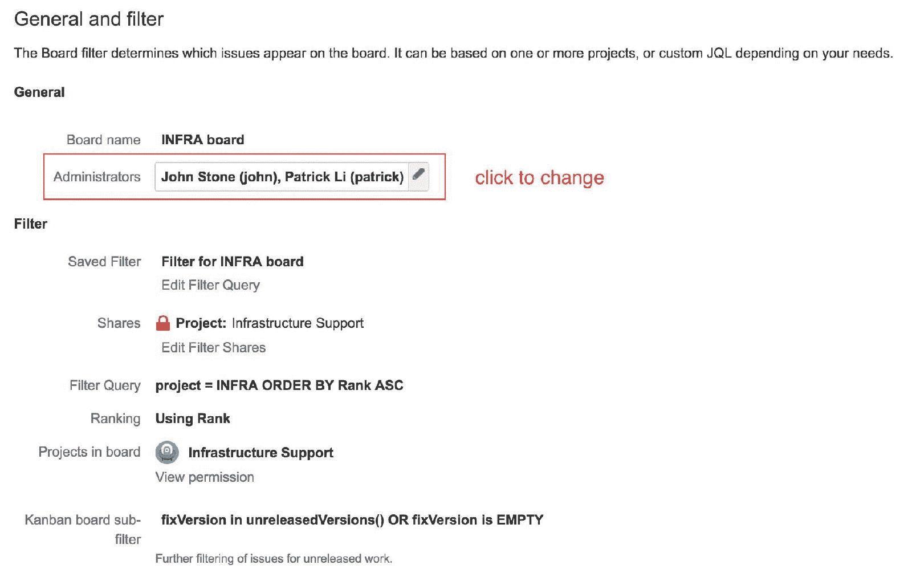

以下表格总结了配置字段：

| **字段** | **描述** |
| --- | --- |
| 看板名称 | 敏捷看板的名称。 |
| 管理员 | 可以配置敏捷看板设置的用户。您可以通过直接选择用户或选择一个组来添加更多管理员。 |
| 已保存的过滤器 | 这控制哪些问题将被包含在敏捷看板上。如果您使用敏捷模板创建了看板，那么这里的过滤器会自动为您创建，并包含项目中的所有问题。您可以选择使用不同的过滤器，或点击编辑过滤器查询链接以更改当前过滤器。 |
| 共享 | 这控制谁将有权访问过滤器。实际上，过滤器应该与有权访问看板的用户共享。 |
| 过滤器查询 | 显示由已保存过滤器使用的实际过滤器查询。 |
| 排名 | 此项显示是否当前启用了排名功能。您需要启用排名功能才能对问题进行排名并创建冲刺。 |
| 看板中的项目 | 看板上包含的项目。这是根据看板使用的保存过滤器自动确定的。 |

# 控制看板范围

当我们谈论敏捷看板的范围时，指的是将会显示在看板上的问题。如果在创建新项目时创建了看板，或者从现有项目中获取了看板，那么看板的范围将是所选项目，这意味着该项目中的所有问题都会显示在看板上。

Jira 控制看板范围的方式是通过使用所谓的**保存过滤器**。保存过滤器是一个已经保存在系统中的搜索查询，查询结果返回的问题就是将出现在看板上的问题。当您从项目中创建看板时，系统会自动为您创建一个新的保存过滤器，并将其查询参数设置为所选项目。例如，在下图中所示，INFRA 看板是从基础设施支持项目创建的，因此 Jira 会自动创建一个名为“Filter for INFRA board”的保存过滤器，并将过滤器查询设置为`project = INFRA ORDER BY Rand ASC`。

这个保存的过滤器实际上是说，*所有项目设置为 INFRA 的项目的问题都将包含在此看板中，并且它们将按“排名”字段升序排列*：

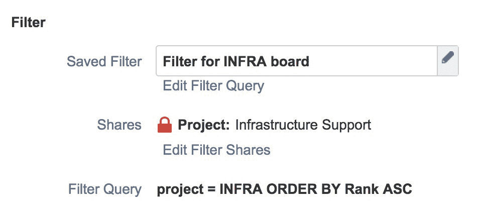

保存的过滤器是 Jira 的标准功能，广泛应用于敏捷看板以外的其他区域。它使用**Jira 查询语言**（**JQL**）。你可以通过[`confluence.atlassian.com/jiracoreserver073/advanced-searching-861257209.html`](https://confluence.atlassian.com/jiracoreserver073/advanced-searching-861257209.html)了解更多关于 JQL 的信息。

您可以通过点击“编辑过滤器查询”链接来更改保存过滤器的查询，或者使用另一个保存的过滤器来更改看板的范围。请注意，要更改当前保存过滤器的查询，您需要具备相应的权限。因此，如果您没有权限，最好的选择是创建一个新的保存过滤器，并将您的看板设置为使用该过滤器。我们将在下一节介绍过滤器权限。

# 管理看板权限

在上一节中，我们了解了 Jira 使用保存的过滤器来确定哪些问题将出现在敏捷看板上。现在让我们来看看如何管理看板的访问权限。

在访问敏捷看板时，有两个关键的权限级别，如下所示：

+   访问看板本身——基于保存的过滤器

+   访问看板上的问题——基于项目权限

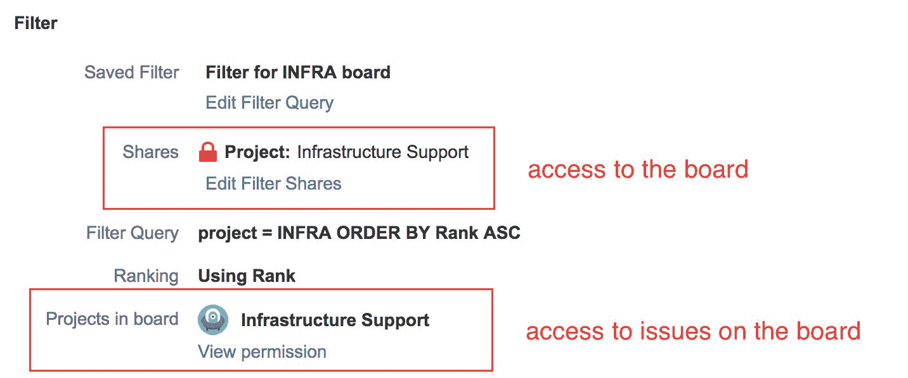

对敏捷看板的访问权限由保存筛选器上的权限控制，或者由筛选器共享的对象决定。如果用户有权限访问筛选器，那么该用户将可以访问看板。对于作为看板的一部分自动创建的筛选器，默认共享给项目中的所有成员。如果你是筛选器的拥有者，你可以点击“编辑筛选器共享”链接，然后选择要与之共享筛选器的对象，如下图所示。对于这个特定的筛选器，它与`Sample Scrum Project`项目中的所有成员共享：

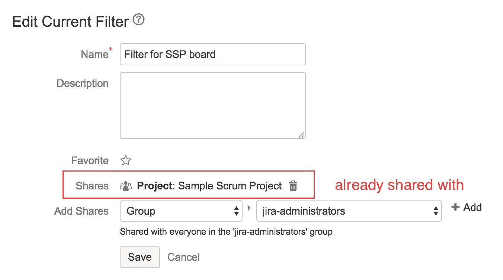

保存的筛选器决定了对敏捷看板的访问权限，接下来由项目的权限来决定用户是否可以查看其中的问题。这意味着，如果用户有权访问保存的筛选器，但没有访问项目的必要权限，那么用户将看到一个空白的看板，上面没有任何问题。

由于一个保存的筛选器可以包含多个项目，因此敏捷看板将在“项目”板块中列出所有相关的项目。如果你是某个项目的管理员，你可以点击“查看权限”链接来查看和更新其权限。我们将在第五章，*自定义 Jira 软件*中详细讨论权限，因为这是一个复杂的话题。现在，简单来说，如果用户能够访问敏捷看板，但无法查看其所有问题，这通常是由于项目权限设置所致。

# 启用排序

排序功能允许你通过拖拽问题到待办事项和冲刺中来优先排序问题。问题在排序中的位置越高，重要性越大。如果排序功能被禁用，当你尝试将问题拖到待办事项中时，会显示类似于`Ranking is disabled, as the Filter Query for this board is not ordered by Rank`的错误消息。

如果你通过使用敏捷模板创建了敏捷看板，选择了新项目或现有项目选项，那么排序功能会默认启用。然而，如果出于某种原因它被禁用，你可以按照以下步骤启用排序：

1.  转到你想要自定义的敏捷看板。

1.  点击“看板”下拉菜单并选择“配置”选项。

1.  从左侧导航菜单中选择“常规”。

1.  点击底部的“添加排序”按钮以启用排序：

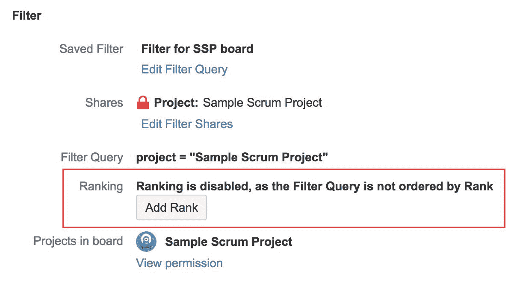

启用排序后，你会注意到筛选器查询值会自动更新。所以，在之前的截图中，查询`project = "Sample Scrum Project"`会被更改为`project = "Sample Scrum Project" ORDER BY Rank ASC`。请确保不要删除查询中的`ORDER BY Rank ASC`部分，因为这是启用查询和看板排序的关键代码。

# 自定义看板布局

Jira 的敏捷面板就像白板一样，所有的故事卡片都会放置在上面。面板由两个关键组件组成，即列和泳道：

+   **列**：用于表示故事卡状态的垂直列

+   **泳道**：帮助你更好地对面板上的故事卡进行分类的水平行

在接下来的章节中，我们将深入探讨这两个组件，以及作为面板管理员的你如何自定义它们，以最大化面板的使用效果。

# 与列的操作

列表示问题可以处于的状态。在一个简单的面板中，如下图所示，我们有三个列，每个列都映射到一个问题状态：

+   待办：等待处理的问题映射到“待办”工作流状态

+   进行中：当前正在处理的问题映射到“进行中”工作流状态

+   完成：已完成的问题映射到“完成”工作流状态：

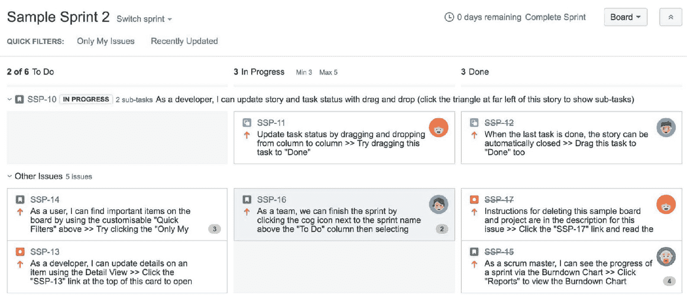

这是一个非常简单的设置，其中问题从开始到结束仅有三个步骤。通常，你将拥有一个比这更复杂的现有工作流。

# Jira 和工作流

在我们深入自定义列之前，我们首先需要快速了解与 Jira 相关的工作流。如你所知，Jira 使用工作流将问题从一个状态移动到下一个状态。Jira 还通过将其列映射到工作流状态来利用此功能。然而，如果你不熟悉 Jira 中的工作流，请不用担心——我们将在第五章，*自定义 Jira 软件*中详细介绍工作流。

由于 Jira 中的工作流通常会变得非常复杂，因此有时在敏捷环境中使用传统的 Jira 工作流会很困难。因此，Jira 引入了所谓的 **敏捷简化工作流**。

敏捷简化工作流指的是直接在 Jira 中管理的工作流，这些工作流被简化和优化以适应敏捷使用。

这让你可以：

+   从敏捷面板管理你的工作流，该工作流被管理为面板列。

+   可以自由地将问题从一个状态（列）移动到另一个状态，而不受工作流条件和验证器的限制。

+   不会有中间的屏幕来在状态之间移动问题，使得在面板上移动卡片（问题）变得更加容易

+   当问题被移动到适当的状态（列）时，自动设置分辨率值（根据你的定义）

如果你是通过使用内置的敏捷模板创建了敏捷面板，那么你很可能正在使用敏捷简化工作流。

# 创建新列

如果你是面板管理员，你可以自定义面板的列，以更好地反映你的工作流：

1.  导航到你想自定义的 Scrum 面板。

1.  点击面板下拉菜单并选择“配置”选项。

1.  从左侧导航菜单中选择“列”。

在列管理页面中，您可以自定义以下选项：

+   列：您可以添加、删除和重命名列。

+   列布局：您可以重新排列列的顺序。

+   问题状态映射：您可以将列与问题状态映射。对于每一列，您可以将一个或多个问题状态映射到它。

+   列约束：您可以为列添加约束，限制在任何给定时间内，状态下可以有多少个问题。

我们从创建新列开始。根据您是否使用敏捷简化工作流，有两种方法可以创建新列并将其映射到问题状态。

您可以通过查看“简化工作流”字段来判断是否正在使用简化工作流，查看该字段是否显示为“使用敏捷简化工作流”，如下图所示：

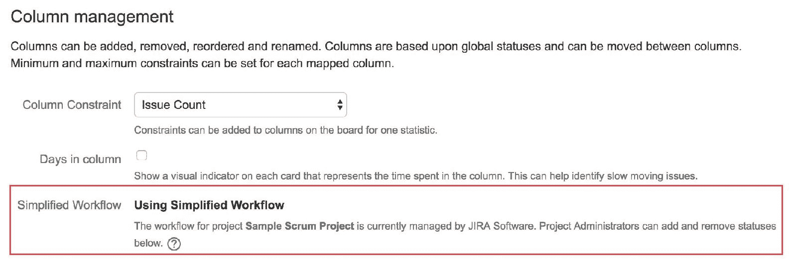

要使新列可用，它需要至少映射一个状态。如果您使用敏捷简化工作流，这是一个非常简单的过程。敏捷简化工作流会为您处理这个问题，因此您不必担心手动列状态映射。建议在可能的情况下使用敏捷简化工作流。要添加新列，请执行以下步骤：

1.  点击“添加列”按钮。新列将添加到倒数第二个位置的列表中。

1.  输入新列的名称并选择类别。将创建一个具有相同名称的新问题状态，并将其映射到新列。通常情况下，如果新列将是看板上的第一列，请选择“待办”作为类别。如果它将是最后一列，请选择“已完成”类别。否则，请选择“进行中”类别。

如果您没有使用敏捷简化工作流，您需要执行以下步骤：

1.  按照前面的列表创建新列。

1.  创建新的工作流状态，以便映射到新列，并添加工作流使用的状态。

1.  手动拖动并将状态放入新列，如下图所示：

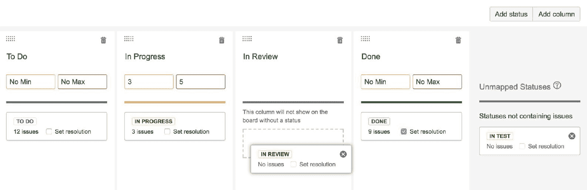

您还可以通过从“未映射状态”部分拖动要映射的状态并将其放入目标列来将额外的状态映射到列。一旦您将至少一个状态映射到新列，它将在活跃的冲刺模式下显示在看板上。

推荐每个工作流状态对应一个列，以保持流程的逻辑性和简洁性。然而，您也可以将多个状态映射到同一列，如前面的截图所示。正如您所看到的，我们将“完成”和“已修复”两个状态映射到了“完成”列。如果您为现有项目创建 Scrum 面板，且项目已有工作流，或者如果您的工作流复杂，无法一一映射到面板的列时，通常需要这样做。当您将多个状态映射到同一列时，例如我们示例中的“完成”列，并将问题移入该列时，您将能够选择适当的状态，如下图所示：

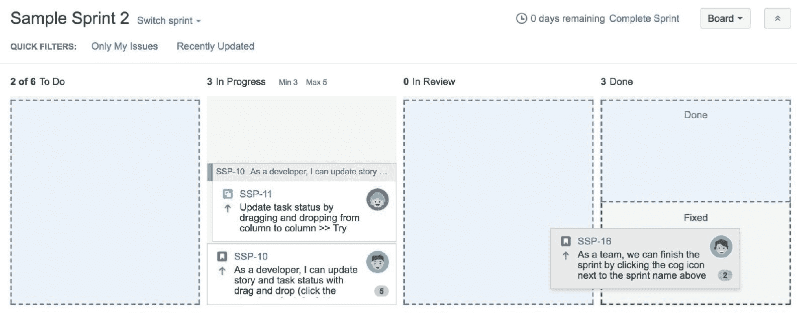

在使用简化的敏捷工作流时，您将看到一个复选框选项，称为“在映射的工作流状态中设置解决方案”。如果勾选此选项，当问题移动到相应的列时，它将自动分配“完成”这一解决方案值。Jira 利用解决方案值来判断问题是否已完成，因此为表示工作流结束状态/列分配值非常重要。

如果您没有使用简化的敏捷工作流，则此选项不可用；解决方案必须通过工作流转换屏幕进行设置。

# 设置列布局

一旦您创建了所有新的列并将其映射到工作流状态，您可以通过拖放的方式，左右调整列的位置，如下图所示。列的顺序应反映您的工作流，从左到右排列，以便直观地表示问题在工作过程中的逻辑流动：

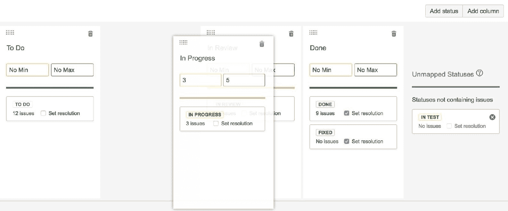

正如我们将在第六章中看到的，*Jira 软件 – 高级*，只要您的 Jira 敏捷看板的列布局与您的物理看板相同，您将能够将问题从看板导出到物理看板，并将其重新导入。

# 与泳道一起工作

泳道是看板上列的横向对应物。与始终映射到问题状态的列不同，您可以根据多个标准来设置泳道：

+   **查询**：这些是通过 JQL 构建的 Jira 搜索查询。使用此选项时，每个泳道只会显示其对应查询的结果。例如，您可以为每个优先级值创建一个查询，从而根据问题的重要性对其进行分组。

+   **故事**：每个泳道将映射到一个故事。所有属于该故事的子任务将显示在该泳道中。

+   **指派人**：每个泳道将根据问题的指派人进行映射。

+   **史诗**：每个泳道将映射到一个史诗。所有属于该史诗的问题将显示在该泳道中。

+   **项目**：每个泳道将映射到一个项目。如果只有一个项目，则只有一个泳道。

使用泳道是将任务分组和分类到 Scrum 看板上的一个很好的方法。例如，使用“分配人”选项，你可以通过查看看板轻松了解每个团队成员的工作负载。

下图显示了一个基于任务优先级的 Scrum 看板，使用了查询选项创建了三个泳道：

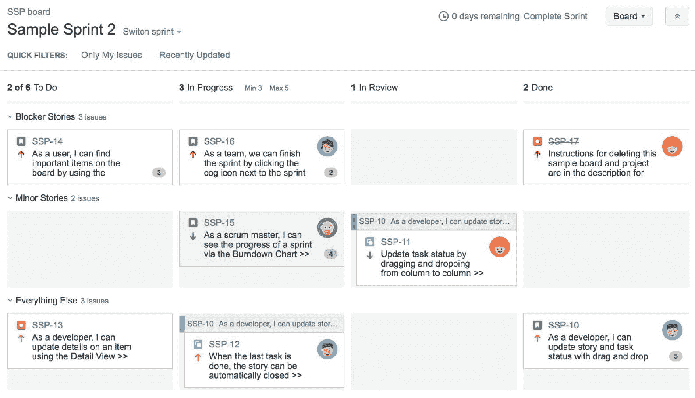

# 设置泳道

如果你是看板管理员，可以自定义看板的泳道，以更好地组织你的故事卡：

1.  导航到你希望自定义的 Scrum 看板。

1.  点击看板下拉菜单，选择“配置”选项。

1.  从左侧导航菜单中选择泳道。

1.  从“基础泳道”字段中选择你希望基于其创建泳道的标准。

1.  如果你选择根据查询来创建泳道，你需要为每个泳道输入名称及其相应的 JQL 查询，如下图所示：

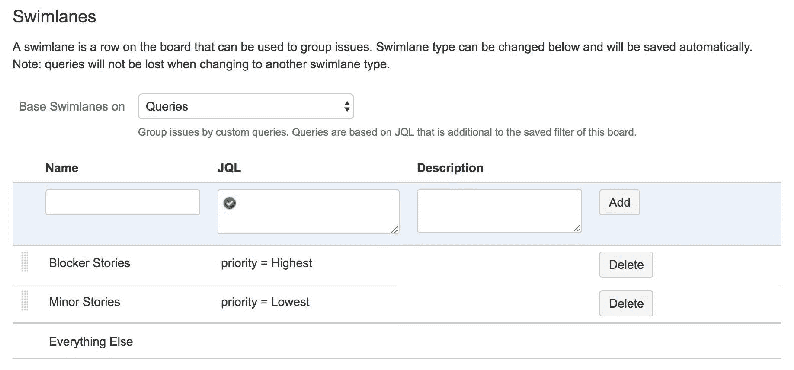

# 使用快速过滤器

当你的项目团队很大时，看板可能会变得非常繁忙。有时你希望缩小范围，专注于符合特定标准的任务，比如 bugs 或分配给特定用户的任务。

通过使用快速过滤器，我们可以通过筛选掉不符合标准的任务来去除不必要的*噪音*，让你专注于你关心的任务，如下图所示：

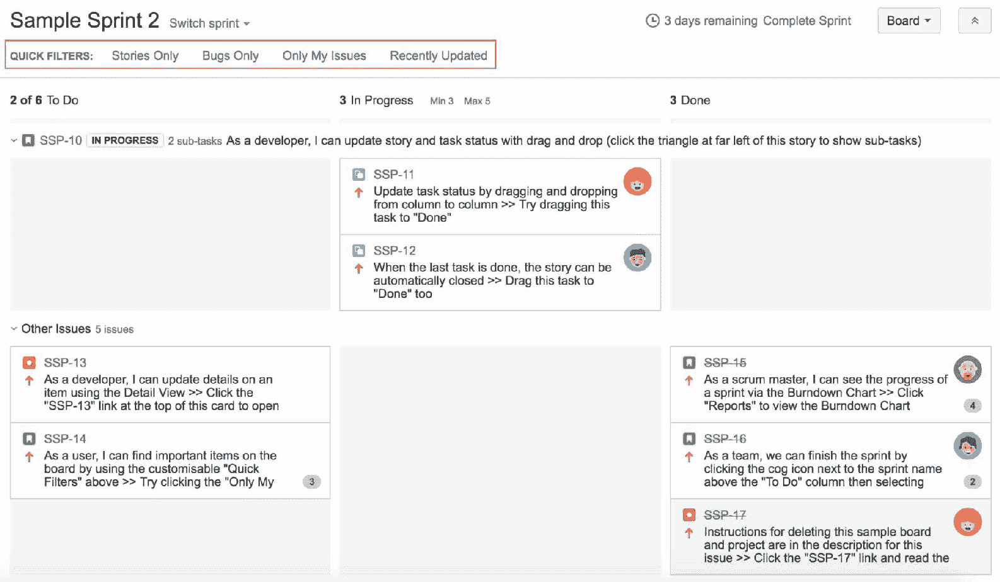

你可以把快速过滤器看作是 Scrum 看板的附加视图。例如，前图展示了 Scrum 看板的四个快速过滤器：仅故事、仅 Bugs、仅我的任务和最近更新。通过使用“仅 Bugs”快速过滤器，你可以看到仅显示 bug 任务的看板视图。你可以通过点击过滤器来切换它的开启和关闭状态。开启时，它将以蓝色突出显示，并更新看板，仅显示符合过滤器标准的任务。再次点击过滤器将取消应用。你可以在看板上同时应用多个快速过滤器，只有符合所有过滤器标准的任务才会显示。

# 创建新的快速过滤器

所有敏捷看板都自带两个默认的快速过滤器：

+   仅我的任务：显示分配给当前登录用户的任务。

+   最近更新：此选项显示在过去 24 小时内更新的任务。

如果你是看板管理员，你可以为看板创建新的快速过滤器，帮助你和团队更好地可视化任务。为此，请执行以下步骤：

1.  导航到你希望自定义的敏捷看板。

1.  点击看板下拉菜单，选择“配置”选项。

1.  从左侧导航菜单中选择快速过滤器。

1.  在“名称”字段中输入过滤器的名称。这里输入的名称将在敏捷看板上显示。

1.  在 JQL 字段中输入过滤器的搜索查询，如下图所示。

1.  点击“添加”按钮来创建新的过滤器。

一旦创建，新的快速筛选器将对所有使用该看板的人可用：

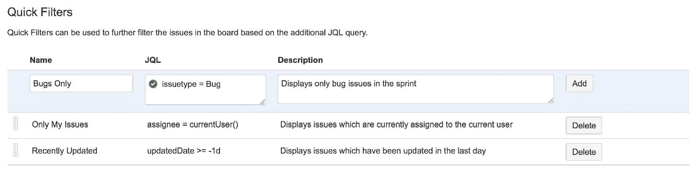

在我们的示例中，如上图所示，JQL 查询`issuetype = Bug`意味着将包含所有类型为`Bug`的问题。

# Scrumban

第一个混合敏捷方法叫做**Scrumban**。正如你从名字中猜到的，它是一种基于 Scrum 的方法论，但融合了 Kanban 的一些元素。正如我们在第二章《*Jira 软件与 Scrum*》中看到的，Scrum 方法论围绕着整理待办任务列表并以迭代的方式执行项目，这些迭代被称为 sprint。虽然这种方法是规划和管理项目的好方式，但在实际可视化 sprint 执行时，它有时会显得不足，这正是 Kanban 擅长的地方。所以，Jira 并没有强迫你在这两种方法论中做选择，而是让你可以以 Scrum 为基础，同时融合 Kanban 的一些特性和优势，这种混合方法就叫做 Scrumban。

在第三章《*Jira 软件与 Kanban*》中，我们介绍了列约束以及 Jira 如何利用这些约束在 Kanban 看板上可视化工作流中的瓶颈。这同样的方法也让 Jira 能够在 Scrum 中使用 Kanban 的一部分特性。例如，我们已经设置了一个约束，在我们的 Scrum 看板上，进行中列的任务最少应该有三个，最多不超过五个，如下图所示：

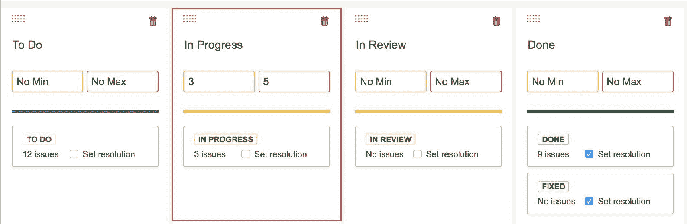

就像 Kanban 一样，一旦你对某列设置了约束，如果违反了该约束，该列将被突出显示。如以下截图所示，进行中列的最大约束是三个问题，但目前有四个，因此它被红色高亮显示。审查中的列的最小约束是两个问题，但目前只有一个，因此它被黄色高亮显示：

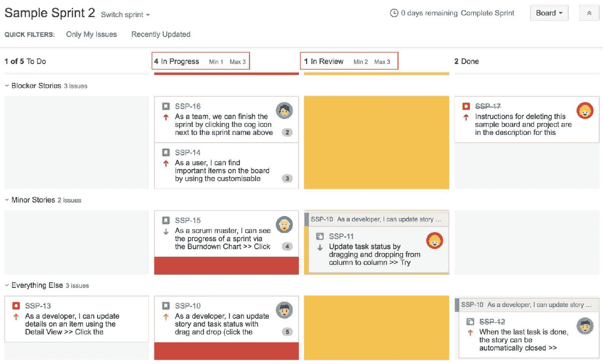

列约束并不会阻止你违反这些限制。它们只是帮助标记出可能存在问题的区域。为列设置限制可能会比较棘手，尤其是当你刚开始时。你应该根据直觉开始，进行几个 sprint 后，随着你和团队对工作流的理解加深，再逐步完善这些限制。开始时的一种方法是基于团队成员人数来设定限制。例如，如果你的团队有五个开发人员，那么你在进行中的列（假设这指的是开发过程）的最大限制应该不超过五个，因为五个人同时处理六个问题并不合逻辑。

如我们在前面的截图中所见，**进行中**列的最大限制已被超出。这可能意味着团队，尤其是开发人员，已经过度承诺了他们的任务；有人可能决定并行处理两个任务。这造成了瓶颈，问题没有迅速完成，无法移动到**评审中**列，导致了最低限制的违规，审阅者正在等待工作。这些数据在你的冲刺回顾会议中非常有用，可以帮助你回顾问题并改进流程。

如你所见，设置列约束是有情境的，并且基于你团队的组成及其能力。随着情况的变化，你需要相应地调整这些限制。记住，目标是衡量、识别并改进。

# Kanplan

第二种混合敏捷方法叫做**Kanplan**。顾名思义，这种方法更倾向于看板，而不是 Scrum。简而言之，Kanplan 允许你拥有更强大的待办事项，同时又允许你享受看板的灵活性。

正如我们在前一章节中所看到的，默认情况下，看板没有真正的待办事项。你通常会将看板上的第一个列用作待办事项列。虽然这种方法在刚开始时有效，但随着列中的项目数量增加，它很快就会变得很难管理。这使得很难全面掌握所有待处理的问题，并且当你的团队尝试优先处理任务时，尤其是当他们为看板定义了自定义泳道时，也会遇到麻烦。

要为看板板块启用待办事项，请按照以下步骤操作：

1.  进入你想为其添加待办事项的看板板块。

1.  点击“板块”下拉菜单，选择“配置”选项。

1.  从左侧面板中选择“列”选项。

1.  将一个或多个工作流状态拖动到左侧的看板待办事项区域：

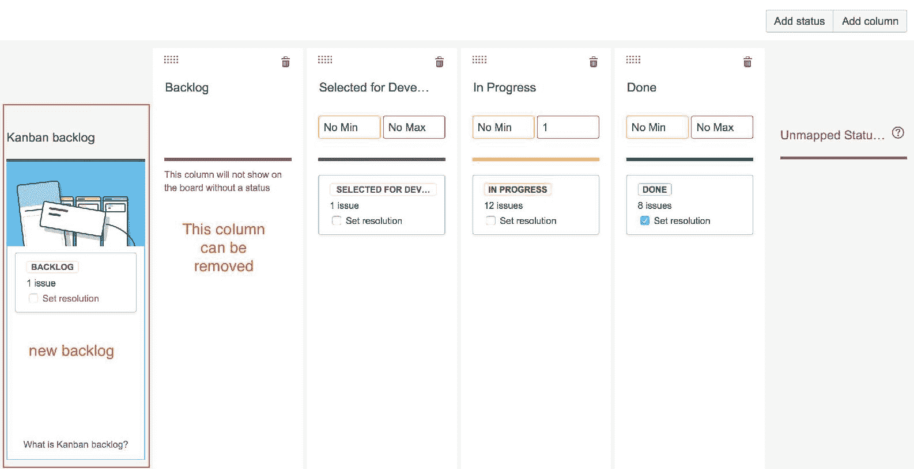

如前面的截图所示，我们的看板列设置中有一个待办事项列，但由于我们现在要使用待办事项功能，因此将待办事项状态移到看板待办事项列中。

新的看板待办事项与任何板块列的功能类似：你可以将多个状态映射到它，因此，任何处于已映射状态中的问题都会出现在新的待办事项中。请注意，由于这个原因，任何不在映射状态中的问题将不会出现在新的待办事项中，所以请确保你添加了所有适当的状态。

将你现有的所有状态映射到默认的待办事项列，并将其映射到新的看板待办事项中，是确保你不会遗漏任何问题的最简单方法。

一旦你为看板启用了待办事项功能，当你进入项目时，你会看到左侧导航面板顶部出现一个新的待办事项选项。点击它后，会显示一个非常类似于 Scrum 的界面，如下图所示：

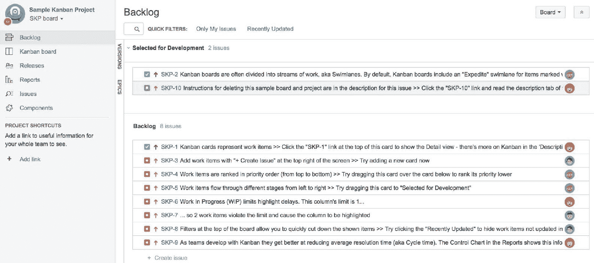

就像 Scrum 的待办事项列表一样，所有问题都是从上到下排序的。你可以拖动任何问题上下移动待办事项队列以设置优先级。对于那些位于最底部的问题，你可以右键点击问题并直接将其发送到顶部。

Kanban 待办事项列表与 Scrum 待办事项列表之间的一个关键区别是，由于 Kanban 没有冲刺，你不会创建冲刺然后将问题添加到冲刺中。相反，你将问题添加到工作流中的下一个状态或列。在前面的截图中，示例是“已选择开发”列。如果你熟悉 Scrum，那就是你新的冲刺所在，你会将问题添加到该冲刺中。而在 Kanban 中，你正在优先排序并将问题从待办事项列表的待办项移入行动项。通过这种变化，你的新的 Kanban 看板将类似于以下截图所示，焦点将放在已优先排序的实际问题上，而不再有一个庞大的、让人不知所措的待办事项列来分散团队的注意力：

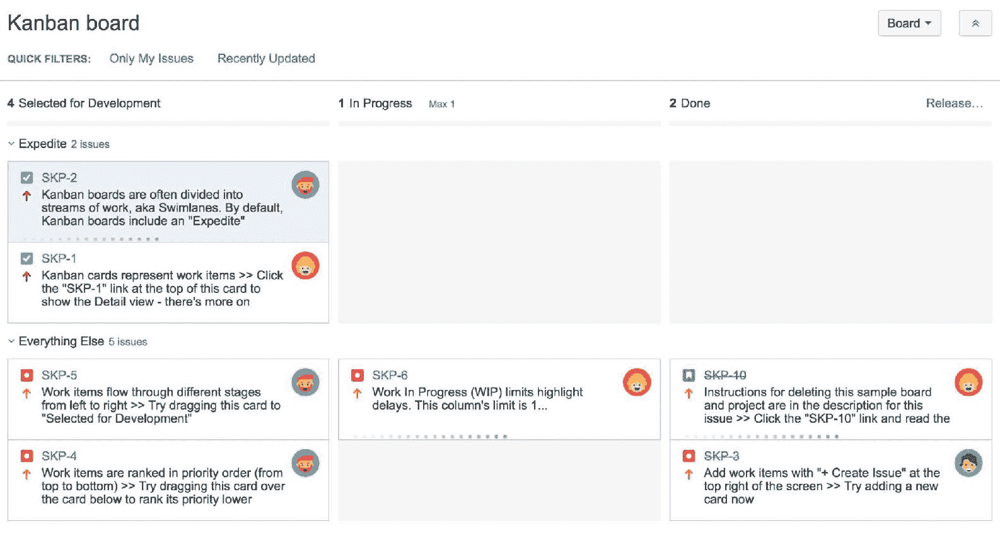

这并不是新的 Kanplan 待办事项列表的全部功能。通过利用 Scrum 中相同的待办事项功能，你现在还可以访问一些功能，例如以视觉方式管理与你的史诗相关的问题，就像在 Scrum 中一样。这对于刚开始转向使用 Kanplan 的 Scrum 团队特别有帮助。你的待办事项列表的史诗面板应该默认启用，但如果由于某些原因它没有启用，你可以始终通过进入你的敏捷看板配置面板中的列管理页面手动启用它：

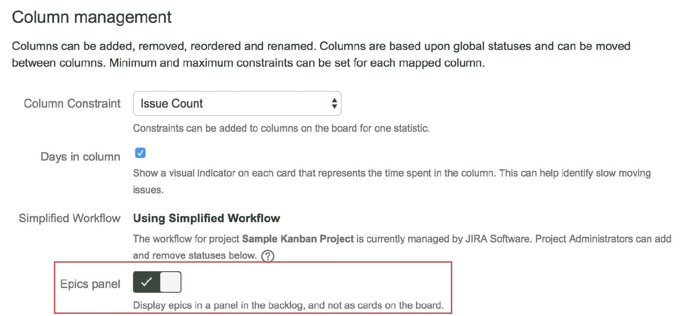

# 总结

在本章中，我们研究了在 Jira 中定制和管理你的敏捷看板的不同方式。我们涉及的一些重要内容包括管理敏捷看板的权限和范围、定制看板的列、将看板列映射到 Jira 工作流状态，以及使用泳道将相似问题分组，以便更好地分类我们的任务。

我们还讨论了一些 Jira 中的概念，如权限和工作流。在接下来的章节中，我们将更深入地探讨 Jira 的这些核心功能，以及如何定制和管理它们以满足你的特定需求。
