# 自定义 Jira 软件

在前面的章节中，我们使用 Jira 的敏捷项目模板创建了 Scrum 和 Kanban 项目。使用这些模板时，系统会自动创建并应用一组默认配置到我们的项目中，例如我们可以创建的任务类型以及在创建新任务时需要填写的字段。当你的项目变得更加复杂，并且出现新的需求时，你会很快发现需要能够对项目设置进行更细致的控制。

到本章结束时，你将学会如何：

+   创建你自己的问题类型并使其可供项目使用

+   添加新的自定义字段以收集更多来自用户的相关数据

+   自定义工作流以更好地模拟你的流程

+   用不同级别的权限控制来保护你的 Jira

+   管理从 Jira 发送的电子邮件通知，以提醒用户问题的更改

# 自定义问题类型

每个问题都有一个类型（因此称为“问题类型”），该类型由问题类型字段表示。这样，你可以知道问题是什么类型；例如，问题是一个缺陷还是一个功能。Jira 自带一组预定义的任务类型，例如 Story、Epic 和 Task。

默认的任务类型适用于简单的软件开发项目，但并不一定满足其他需求。由于不可能创建一个适合所有人需求的系统，Jira 允许你创建自己的问题类型并将其分配给项目。例如，对于帮助台项目，你可能希望创建一个名为**票据**的自定义问题类型。你可以创建这个自定义问题类型并将其分配给帮助台项目，用户将能够在系统中记录票据，而不是记录缺陷，如下所示：

1.  以 Jira 管理员身份登录 Jira。

1.  浏览至 Jira 管理控制台。

1.  选择“问题”标签页，然后选择“问题类型”选项：

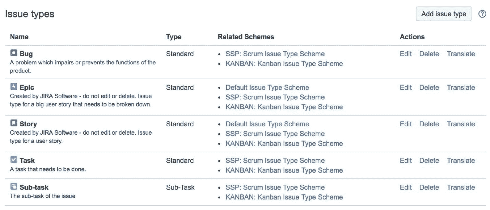

1.  点击“添加问题类型”按钮。

1.  输入新问题类型的名称和描述。

1.  选择新问题类型是标准问题类型还是子任务问题类型：

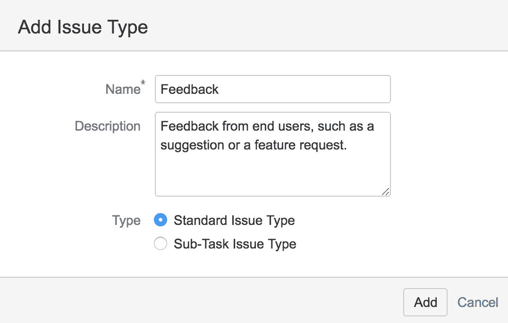

1.  点击“添加”来创建新的问题类型。

创建新的问题类型后，你需要将其添加到项目中。这可以通过将新的问题类型添加到项目使用的*问题类型方案*来完成。问题类型方案包含一组问题类型，并可以应用于一个或多个项目。通过这种方式，一个项目可以拥有自己的问题类型，或者与其他类似项目共享一组问题类型。要将新问题类型添加到问题类型方案：

1.  浏览至 Jira 管理控制台。

1.  选择“问题”标签页，然后选择“问题类型方案”选项。

1.  查找项目使用的“问题类型方案”并点击其“编辑”链接。

1.  将新问题类型从右侧的“可用问题类型”栏拖动到左侧的“当前方案中的问题类型”栏。

1.  点击“保存”按钮：

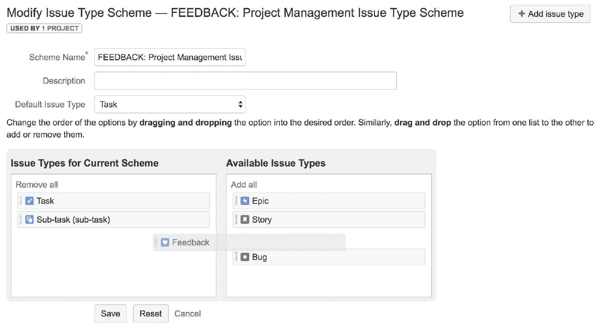

# 添加新的自定义字段

就像问题类型一样，Jira 自带了许多内置字段。你已经在前面的章节中见过其中的一些。例如，在为敏捷看板创建新故事时，存在一些字段，如摘要、优先级和受让人。这些字段构成了问题的骨架，你无法将它们从系统中删除。因此，它们被称为**系统字段**。

虽然 Jira 内置的字段已经非常适合敏捷软件开发的需求，但大多数组织很快就会发现，它们有一些特殊的需求，不能仅通过默认的字段来解决。为了帮助你将 Jira 定制到符合你组织需求，Jira 允许你创建并添加你自己的字段，称为**自定义字段**。

Jira 提供了多种类型的自定义字段，从简单的文本字段、选择列表，到更复杂的字段，如级联选择列表和用户选择器。如果你觉得这些还不够，Atlassian Marketplace 上还有更多自定义字段可以选择，那里你可以找到更多与 Salesforce.com 等服务兼容的专用字段。要开始向 Jira 添加新的自定义字段，请：

1.  浏览到 Jira 管理控制台。

1.  选择“问题”标签，然后选择“自定义字段”选项。

1.  点击添加自定义字段按钮。这将带你进入过程的第一步，在这里你可以选择自定义字段类型。

1.  搜索并选择你希望添加的自定义字段类型，然后点击下一步。这将带你进入过程的第二步，你可以在这里指定自定义字段的名称和选项：

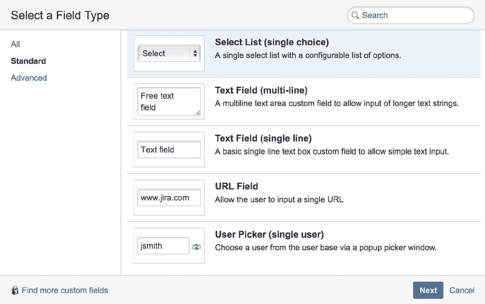

如果你没有找到你需要的字段类型，请从左侧选择“所有”选项，然后再搜索一次。

1.  为名称和描述字段输入值。如果你正在创建基于选择的自定义字段，如选择列表，你还需要添加其选择项（你可以稍后更新此列表）：

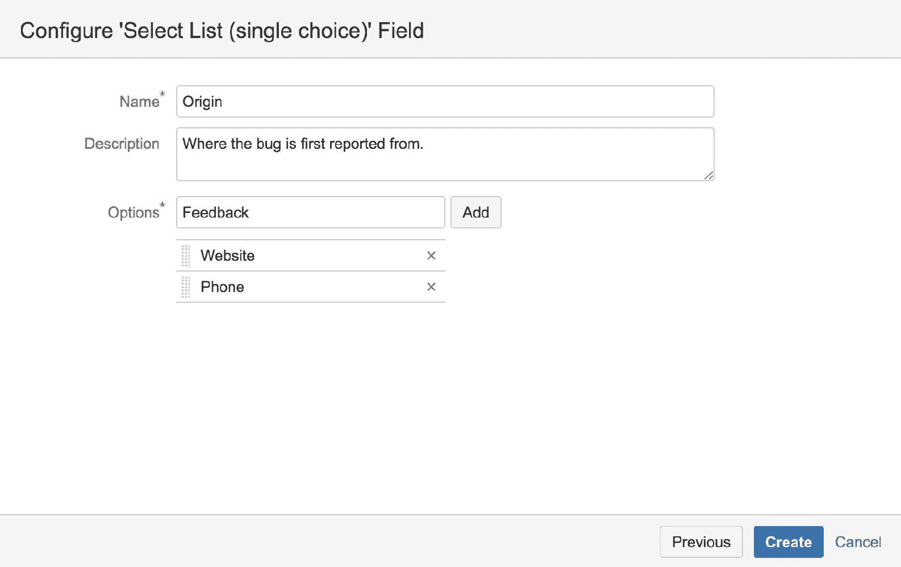

1.  点击创建按钮。这将带你进入过程的最后一步，在这里你可以指定希望添加字段的屏幕。

1.  选择屏幕并点击更新。以下截图显示了新创建的字段已被添加到两个支持的屏幕上：

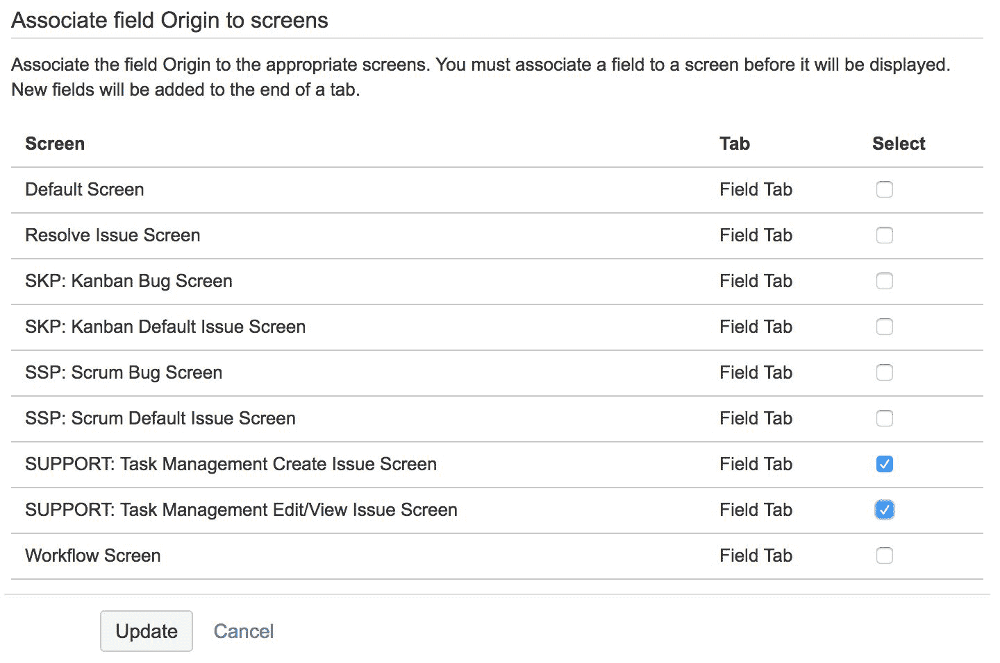

在创建了自定义字段后，你可以随时回来并对其进行自定义。例如，在创建原始选择列表字段时，我们添加了三个选项。如果需要更多选项，我们可以编辑该字段并添加更多选项。

# 自定义 Jira 工作流

到目前为止，我们创建的所有 Scrum 和 Kanban 项目都有自己独立的工作流，称为`Software Simplified Workflow`，适用于项目 X，这就是所谓的**简化工作流**。简化工作流是一种特别为敏捷项目设计的工作流，通过最小的限制来工作。这意味着：

+   Scrum 和 Kanban 都预定义了一组状态/列。

+   看板管理员可以通过简单地添加和删除列来轻松进行更改。

+   问题可以在状态/列之间自由移动，没有任何限制。

+   移动问题时不会有中间屏幕。

这对于大多数标准敏捷项目来说很有用，目标是拥有一个简单的工作流，并允许团队成员根据需要自由地在看板上移动问题。然而，有时你的流程可能会有特殊的要求，工作流也需要反映这些要求。例如，你可能有一个验证要求，只有当质量保证工程师签字确认后，问题才能关闭；或者你可能有一个安全要求，只有某个特定组的成员才能将问题移动到目标状态。

这些要求在敏捷环境中可能看起来违反直觉，但请记住，**没有一种适合所有人的解决方案**，而 Jira 允许你自定义项目中使用的工作流，以最好地满足你的所有需求。

Jira 提供了一个非常直观的图形工具，帮助你作为 Jira 管理员创建和自定义工作流。以下是 Jira 在工具中如何可视化表示工作流的截图：

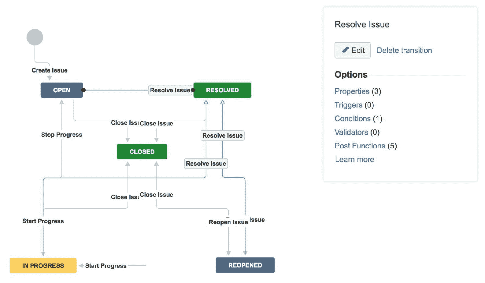

每个**状态**表示为一个框，每个**过渡**表示为两个状态之间的线。点击任何一个状态或过渡时，右侧会出现一个属性面板，允许你进一步自定义它。

# 创建工作流

那么，来看看如何在 Jira 中创建和设置一个新的工作流。要创建一个新的工作流，你只需要一个名称和描述：

1.  浏览到 Jira 管理控制台。

1.  选择“问题”选项卡，然后选择“工作流”选项。

1.  点击“添加工作流”按钮。

1.  在“添加工作流”对话框中输入新工作流的名称和描述。

1.  点击“添加”按钮来创建工作流。

新创建的工作流只包含默认的创建和打开状态，因此你需要通过添加新的状态和过渡来进行配置，使其更有用。让我们从使用以下步骤将新状态添加到工作流开始：

1.  点击“添加状态”按钮。

1.  从下拉列表中选择一个现有的状态。如果你需要的状态不存在，你可以通过输入状态名称并按下*回车*键来创建一个新的状态。

1.  如果你希望用户能够将问题移动到这个状态，无论它当前的状态是什么，请勾选“允许所有状态过渡到此状态”选项。这将创建一个**全局过渡**，这是一种方便的方式，允许问题从任何状态使用这个过渡来达到目标状态。

1.  点击“添加”按钮，将状态添加到你的工作流中。你可以重复这些步骤，将尽可能多的状态添加到你的工作流中：

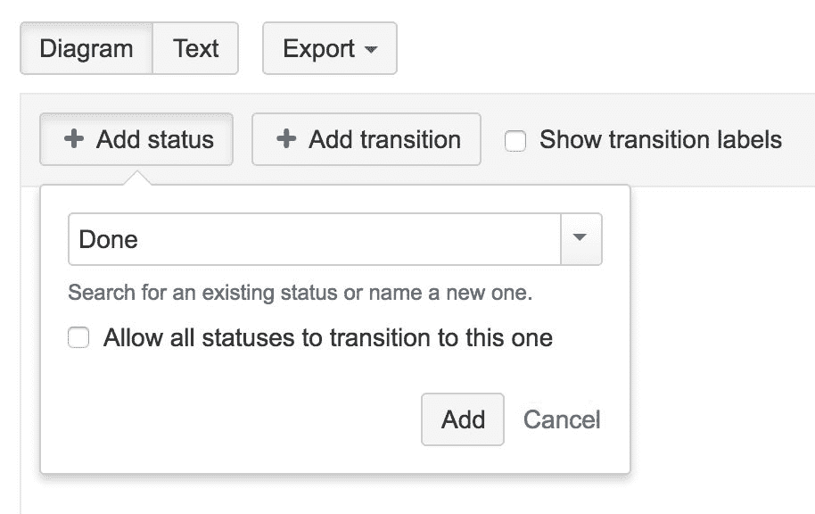

尽量重用现有的状态，这样你就不会管理许多相似的状态。

现在，状态已添加到工作流中，需要通过转换将它们连接起来，这样问题才能从一个状态流转到另一个状态。创建转换有两种方式：

+   单击“添加转换”按钮，或者您可以按照下一步操作

+   选择起始状态，然后单击并拖动箭头到目标状态。

两个选项都会弹出添加转换对话框，如下图所示：

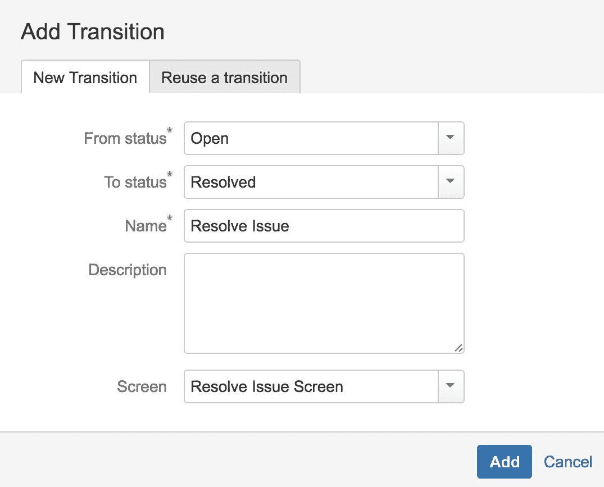

从上面的截图中，您可以选择使用“新建转换”标签创建新转换，或者使用“重用转换”标签重用现有转换。

创建新转换时，您需要配置以下内容：

+   来源状态：起始状态。当问题处于所选状态时，转换将可用。

+   目标状态：目标状态。一旦执行转换，问题将被置于所选状态。

+   名称：转换的名称。该名称将显示给用户。通常，给转换命名时最好以动词开头，例如`关闭问题`或`提交审核`。

+   描述：可选的文本描述，说明此转换的目的。此内容不会显示给用户。

+   屏幕：可选的中间屏幕，当用户执行转换时显示。例如，您可以显示一个屏幕以捕获转换过程中的附加数据。如果不选择屏幕，转换将立即执行。以下截图展示了一个工作流屏幕：

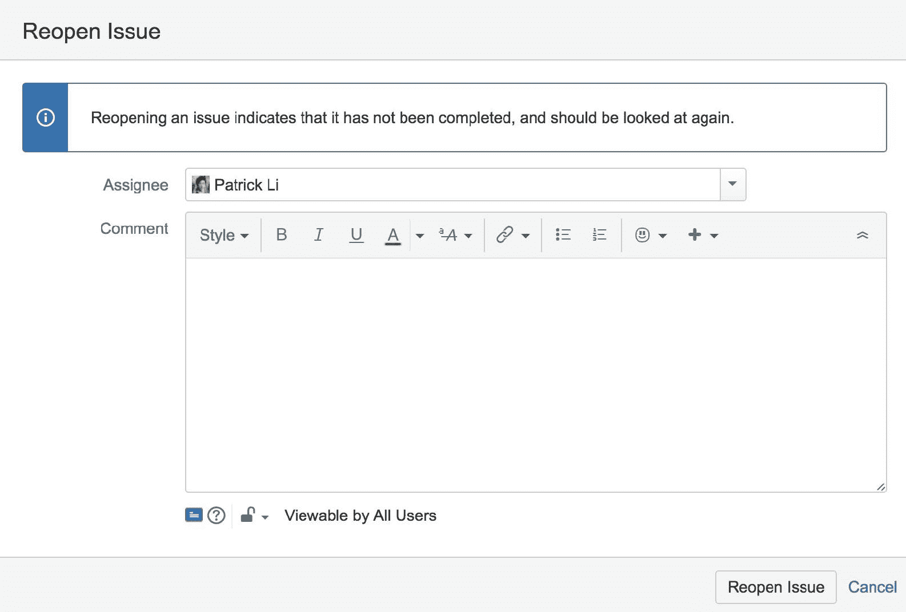

如果您想重用现有的转换，只需选择“重用转换”标签，选择来源状态和目标状态，然后选择要重用的转换，如下图所示：

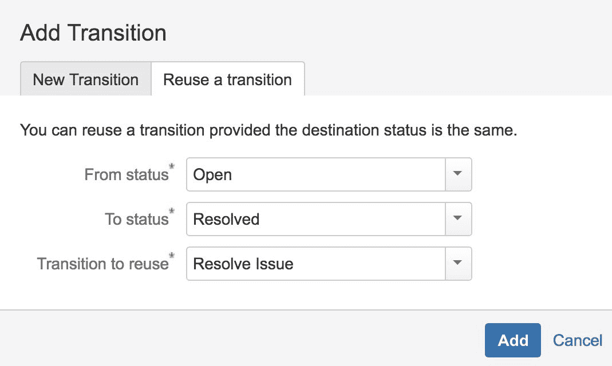

Jira 只会根据目标状态选择列出有效的转换。

您可能在想，什么时候应该创建新的转换，什么时候应该重用现有的转换。这两者的主要区别在于，重用转换时，所有重用的转换实例，也称为**公共转换**，将共享相同的配置集，例如条件和验证器。此外，对转换所做的任何更改都会应用到所有实例。一个好的使用场景是，当您需要多个相同名称和设置的转换时，例如“关闭问题”；您可以创建一个转换，并在需要关闭问题时重用它，而不是每次都创建单独的转换。稍后，如果需要为转换添加新的验证器以验证用户输入，您只需做一次更改，而不是每个“关闭问题”转换都做多次更改。

另一个需要记住的好实践是，工作流中不要有*死胡同*状态，例如，允许已关闭的问题重新打开。这可以防止用户不小心关闭问题后无法纠正错误。

现在我们已经看到如何向工作流添加新状态和过渡，接下来看看如何向过渡添加条件、验证器和后续功能。

# 向过渡添加条件

新的过渡默认没有任何条件。这意味着任何有权限访问该问题的人都可以执行该过渡。通过向工作流过渡添加条件，你可以控制谁或者何时可以执行问题的过渡。

条件在过渡执行之前生效。

Jira 允许你向过渡添加任意数量的条件：

1.  选择你要向其添加条件的过渡。

1.  点击条件链接。

1.  点击添加条件链接。这将带你到添加条件到过渡页面，在那里列出了你可以添加的所有可用条件。

1.  选择你要添加的条件。

1.  点击添加按钮以添加条件。

1.  根据条件，你可能会看到添加参数到条件页面，你可以在其中指定条件的配置选项。例如，**用户属于组**条件会要求你选择要检查的组。

新添加的条件会附加到现有条件列表的末尾，形成一个**条件组**。默认情况下，当有多个条件时，使用逻辑`AND`将条件组合在一起。这意味着所有条件都必须通过，整个条件组才能通过。如果某个条件失败，整个组都会失败，用户将无法执行过渡。你可以切换为使用逻辑`OR`，这意味着组内只需一个条件通过，整个组即可通过。这是一个非常有用的功能，它允许你组合多个条件，形成更复杂的逻辑单元。

例如，**用户属于组**条件允许你指定一个单一组，但使用`AND`运算符，你可以添加多个**用户属于组**条件，确保用户必须存在于所有特定组中才能执行过渡。如果使用`OR`运算符，则用户只需属于列出的其中一个组。唯一的限制是不能为同一条件组使用两种运算符。

每个过渡只能有一个条件组，每个条件组只能有一个逻辑运算符。

# 向过渡添加验证器

像条件一样，过渡默认没有与之关联的任何验证器。这意味着过渡一旦执行就会完成。你可以向过渡添加验证器，以确保只有在满足特定条件时才允许执行。一个很好的验证器使用案例是在过渡有工作流屏幕以捕获用户输入时，你需要验证输入，比如日期格式。

验证器在过渡执行过程中发挥作用。

执行以下步骤向过渡添加验证器：

1.  选择你要添加验证器的过渡。

1.  点击“验证器”链接。

1.  点击“添加验证器”链接。这将带您进入“添加验证器到转换”页面，该页面列出了您可以添加的所有可用验证器。

1.  选择您想要添加的验证器。

1.  点击“添加”按钮以添加验证器。

1.  根据验证器的不同，您可能会看到“添加参数到验证器”页面，您可以在其中为验证器指定配置选项。例如，权限验证器会要求您选择要验证的权限。

与条件类似，当有多个验证器添加到转换时，它们会形成一个**验证器组**。与条件不同，您只能对该组使用逻辑`AND`。这意味着，要完成转换，添加到转换中的每个验证器必须通过其验证标准。转换不能使用逻辑`OR`来选择性地通过验证。

以下截图显示了一个验证器被应用到转换上，验证用户是否为“解决方案详细信息”字段输入了值：

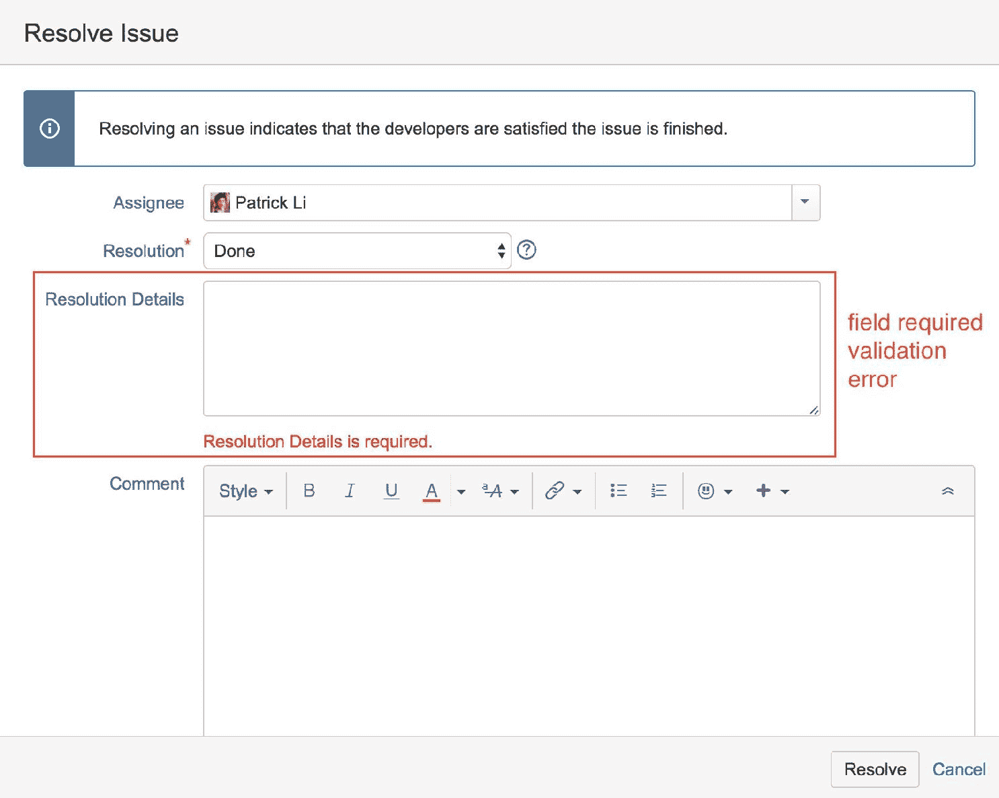

# 向转换添加后置功能

默认情况下，转换会创建多个后置功能。这些后置功能为 Jira 的内部操作提供关键服务，因此无法从转换中删除。它们执行以下操作：

+   将问题状态设置为目标工作流步骤的关联状态

+   如果在转换期间输入了评论，可以将评论添加到问题中

+   更新问题的变更历史并将问题存储在数据库中

+   重新索引问题，以保持索引与数据库同步

+   触发一个可以由监听器处理的事件

如您所见，这些后置功能提供了一些基本功能，例如在转换执行后更新搜索索引和设置问题状态，这些功能对 Jira 至关重要。因此，Jira 在您创建新转换时会自动为您添加这些功能，而不是让用户手动添加，以避免遗漏一个或多个功能。

后置功能在转换成功执行后发生。

执行以下步骤以向转换添加后置功能：

1.  选择您希望添加后置功能的转换。

1.  点击“后置功能”链接。

1.  点击“添加后置功能”链接并选择您要添加的后置功能。

1.  点击“添加”按钮以添加后置功能。

1.  根据后置功能的不同，您可能会看到“添加参数到功能”页面，您可以在其中为后置功能指定配置选项。以下截图显示了来自“更新问题字段”后置功能的示例：

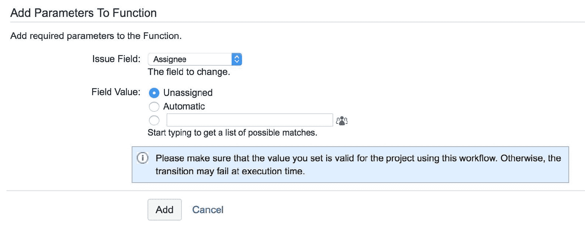

就像条件和验证器一样，多个后置功能在一个转移中形成一个后置功能组。转移执行后，组内的每个后置功能会按列表中出现的顺序依次执行，从上到下。如果组内的任何后置功能在处理过程中遇到错误，您将收到错误提示，且其余后置功能不会被执行。

由于后置功能是按顺序执行的，其中一些具有修改值和执行其他任务的能力，因此，它们的执行顺序往往非常重要。例如，如果您有一个后置功能将问题的指派人更改为当前用户，另一个后置功能更新问题字段的值为问题的指派人显然，更新指派人的后置功能需要首先执行，因此，您需要确保它排在另一个后置功能之前。

您可以通过点击“向上移动”和“向下移动”链接来调整后置功能在列表中的位置。请注意，并非所有后置功能都可以重新定位。

# 管理 Jira 权限

安全性是当今数字世界中最重要的优先事项。确保只有授权人员才能访问存储在 Jira 中的数据，以防止任何潜在的信息泄露，是每个 Jira 管理员需要时刻关注的事情。为了确保有适当的安全控制措施，Jira 提供了多种选项来控制对其存储数据的访问权限。

# 全局权限

全局权限顾名思义，是 Jira 中最高级别的权限。这些是全局应用于 Jira 的粗粒度权限，控制广泛的安全级别，例如管理各种配置设置的能力。

全局权限只能授予给用户组。因此，您需要将用户组织成逻辑组，以便全局权限生效。例如，您需要将所有管理员分配到一个组中，如`JIRA-administrators`组，这样您就可以授予他们管理权限：

1.  进入 Jira 管理控制台。

1.  选择“系统”选项卡，然后选择“全局权限”选项。

1.  从“添加权限”部分选择您希望分配的权限。

1.  选择要授予权限的组。

1.  点击“添加”按钮来添加分配：

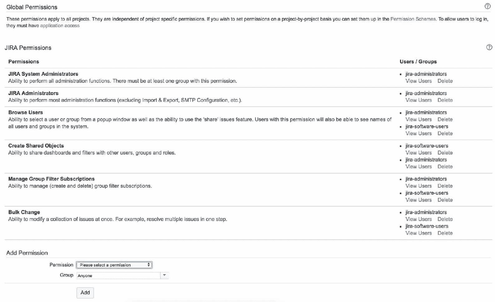

拥有 Jira 管理员全局权限的用户不能授予自己 Jira 系统管理员的全局权限。

# 项目权限

如您所见，全局权限主要控制管理级别的访问权限，在大多数情况下，您需要能够控制对项目的访问权限，例如谁能查看并创建新问题。这就是**权限方案**派上用场的地方。

权限方案定义了 Jira 中可用的权限列表，例如谁可以删除问题，谁可以添加评论，并允许将每个权限授予不同的用户。权限类型与用户定义的映射构成了权限方案。定义好权限方案的映射后，您可以将其应用于一个或多个项目。这为您提供了为每个项目定义独特权限设置的灵活性，并允许将相同的权限设置共享和应用于多个项目。要开始使用权限方案，请执行以下步骤：

1.  浏览至 Jira 管理控制台。

1.  选择“问题”标签，然后选择“权限方案”选项。默认情况下，应该已经定义了两个权限方案：

    +   **默认权限方案：** 非敏捷项目使用的默认方案。

    +   **默认软件方案：** 所有敏捷（Scrum 和 Kanban）项目使用的默认方案。

        您可以通过点击“权限”链接更新现有方案的权限设置，这将影响所有使用该方案的现有项目，或者通过点击“添加权限方案”按钮来创建一个新方案。

1.  一旦您选择或创建了要配置的权限方案，您将进入**编辑权限**页面，如下图所示：

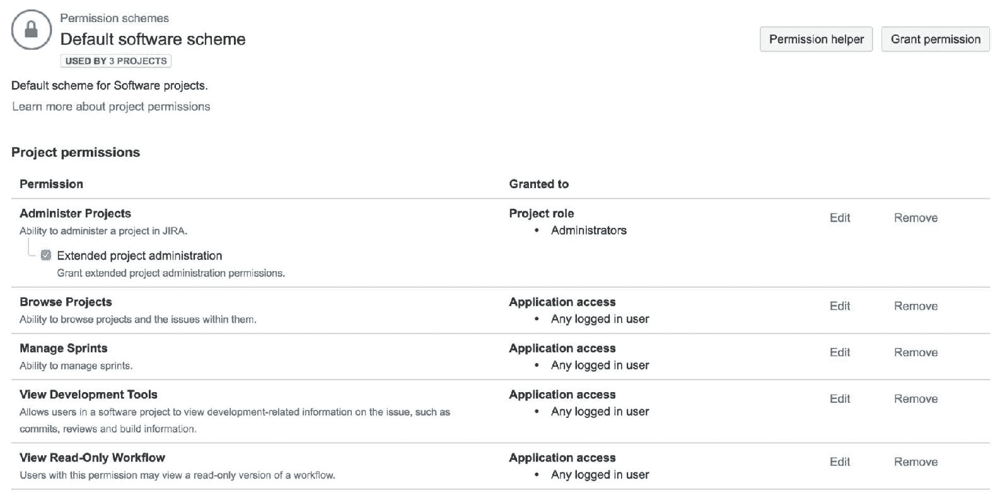

在此页面上，您将看到一份项目级权限列表，每个权限都有简短的描述，以及与每个权限相关联的用户、组和角色。您会注意到，在默认权限方案中，大多数权限选项都通过项目角色与默认用户相关联。如果您正在查看一个新的权限方案，则不会有用户与任何权限关联。这是您查看项目权限设置的单页视图，您还可以添加和删除用户。要将权限授予用户：

1.  点击“授予权限”按钮或特定权限的“编辑”链接。

1.  选择您希望授予用户的权限。

1.  选择用户选项以指定授予权限的对象。点击“查看更多”链接以查看更多选项。

1.  点击“授予”按钮来授予所选权限。

1.  重复此过程，以授予更多用户该权限：

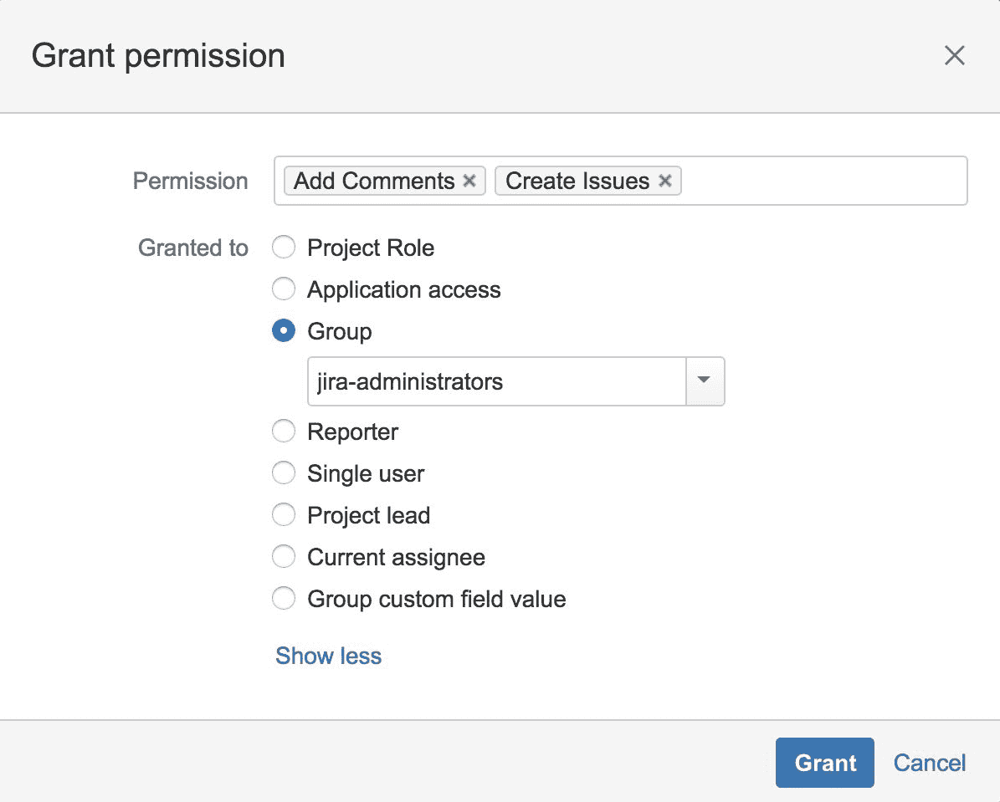

如**用户自定义字段值**这样的权限选项是一种非常灵活的方式，允许最终用户控制访问权限。例如，您可以创建一个名为**编辑者**的自定义字段，并设置“编辑问题”权限，只允许自定义字段中指定的用户编辑问题。自定义字段不需要出现在通常的视图/编辑屏幕上，权限依然会被应用。例如，您可以让自定义字段出现在名为“提交给经理”的工作流过渡中；一旦用户选择了经理，只有该经理才能编辑问题。

# 问题权限

项目级别的权限与权限方案通常是满足安全要求所需的一切。然而，有时你可能需要更进一步，按每个问题控制访问权限。例如，当你有内部和外部用户（如客户）在同一个项目上工作，并且有些问题你不希望与外部客户共享时，便可以使用**问题安全方案**。

问题安全允许用户通过从系统的“安全级别”字段中选择预配置的安全级别来设置问题的查看权限（不能编辑）。从大体上看，问题安全的工作方式与权限方案类似。Jira 管理员首先创建并配置一组问题安全方案并设置安全级别。然后，项目管理员可以将其中一个方案应用到他们的项目中，允许用户（拥有设置问题安全的项目权限）选择方案中的安全级别并将其应用到单个问题上。

使用问题安全的起点是问题安全方案。Jira 管理员负责创建和设计安全级别，以便尽可能地复用：

1.  浏览到 Jira 管理控制台。

1.  选择“问题”标签，然后选择“问题安全方案”选项。与权限方案不同，问题安全方案没有默认可用的选项。

1.  点击“添加问题安全方案”按钮。

1.  输入新方案的名称和描述。

1.  点击“添加”按钮以创建新的问题安全方案。

1.  点击我们刚刚创建的问题安全方案的“安全级别”链接。新的问题安全方案不包含任何安全级别，因此我们需要手动添加它们。

1.  在“添加安全级别”部分输入新安全级别的名称和描述，然后点击“添加安全级别”按钮。重复此步骤以添加更多安全级别。设置完安全级别后，我们现在可以分配用户，以便他们可以查看每个安全级别的权限。

1.  点击你希望分配用户的安全级别旁边的“添加”链接。

1.  选择你希望分配给安全级别的选项。

1.  点击“添加”按钮以分配用户。

如下图所示，我们定义了两个安全级别，内部专用和公开。当问题设置为“仅限内部”安全级别时，只有 demo-project-members 组的成员才能查看该问题；其他人将收到安全错误。当问题设置为“公开”安全级别时，Jira 中的任何人都可以查看该问题，前提是他们也满足项目在权限方案中设置的项目级别权限：

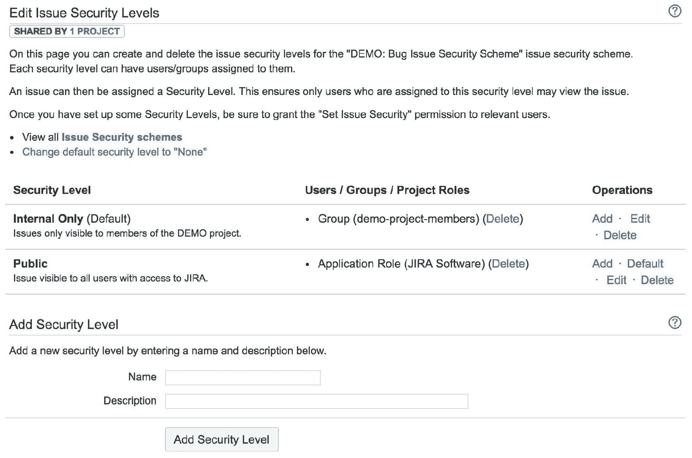

# 故障排除权限

获取正确的权限设置对于保护组织数据至关重要，特别是对于包含敏感信息并需要严格权限控制的项目。而且，在 Jira 中有不同级别的权限控制，这可能让人感到沮丧和困惑，尤其是当用户无法访问他们应该访问的问题时。

为了帮助解决这个问题，Jira 提供了权限助手，帮助管理员定位阻止用户访问某些功能的设置。使用权限助手的方法如下：

1.  浏览到 Jira 管理控制台。

1.  选择系统选项卡，然后在底部选择权限助手选项。

1.  在用户字段中指定遇到访问问题的用户。

1.  指定用于测试的问题。

1.  选择用户没有的权限（例如，编辑问题）。

1.  点击提交：

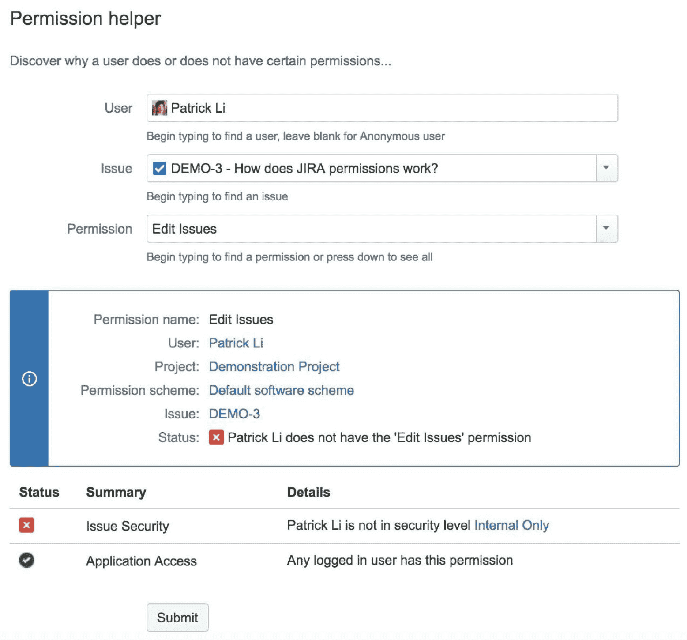

如前面的截图所示，用户 Patrick Li 无法编辑问题 DEMO-3，因为他不在“仅内部”问题安全级别中，而该级别是 **默认权限方案** 所要求的。

# 管理 Jira 通知

随着您的团队开始使用 Jira 来日常管理项目，每个成员需要在他们正在处理的任务发生变更时收到通知，比如质量保证人员拒绝了工程师提交的漏洞修复，或者产品经理对新功能发表评论。这对于处于不同时区的分布式团队尤其重要，因为在这种情况下，简单地走到某人面前进行快速交谈并不可行。为了促进团队内部的协作，Jira 使用邮件通知来保持每个人对项目中问题变更的最新了解，并且它提供了一种非常灵活的方式，让您定义这些通知何时以及如何发送。

# 启用外发邮件

为了让 Jira 发送外发邮件通知，您需要是 Jira 系统管理员（例如，初始设置时创建的用户是系统管理员）才能配置邮件服务器详情。请按照以下步骤管理外发邮件服务器：

1.  浏览到 Jira 管理控制台。

1.  选择系统选项卡，然后选择外发邮件选项。这将打开外发邮件页面：

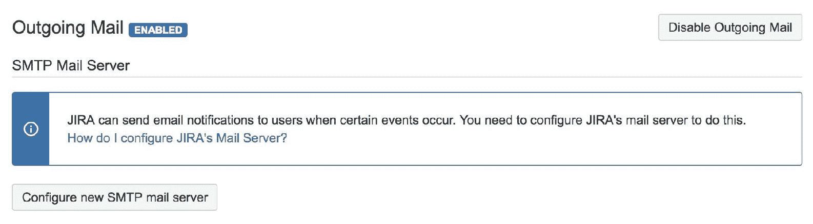

1.  点击配置新 SMTP 邮件服务器按钮。

1.  输入您的邮件服务器的一般详情，包括名称、描述、发件人地址和邮件前缀。

1.  从服务提供商字段中选择邮件服务器类型。

1.  输入邮件服务器的连接详情。

1.  点击测试连接按钮以验证配置。

1.  点击添加按钮以注册到邮件服务器：

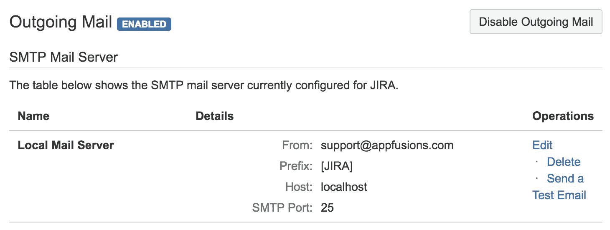

一旦你为 Jira 实例设置了 SMTP 邮件服务器，你将能够发送测试电子邮件来验证连接性，这在排查问题时非常有用，正如我们将在本章后面看到的那样。你还可以通过禁用外发邮件按钮来禁用所有外发电子邮件通知，如果你在执行其他维护任务时希望暂时禁用所有电子邮件通知，这个选项会很有用。

# 配置通知方案

配置好 SMTP 邮件服务器后，下一步是为以下问题配置规则：

+   Jira 应该什么时候发送电子邮件通知？

+   谁应该接收这些电子邮件通知？

Jira 使用**通知方案**来控制前述两个问题。在 Jira 中，每个用户操作（如编辑问题）都可以触发一个事件，并且对于每个事件，你可以定义一个将接收通知的用户列表。这种事件与通知的映射关系构成了通知方案。一旦你定义好了通知方案，就可以将该方案应用于不同的项目。这样，每个项目都可以有自己独特的通知设置，而多个项目也可以共享相同的通知设置。要配置通知方案，请执行以下步骤：

1.  进入 Jira 管理控制台。

1.  选择“问题”标签，然后选择“通知方案”选项。这将打开通知方案页面。默认情况下，只有一个通知方案，称为“默认通知方案”，所有项目都会使用它。你可以选择点击它的“通知”链接来编辑该默认方案，这会影响所有项目，或者通过点击“添加通知方案”按钮来创建一个新的方案。

1.  一旦你准备好通知方案，Jira 将显示可用事件的列表，以及将接收通知的用户（如果有的话），如下图所示：

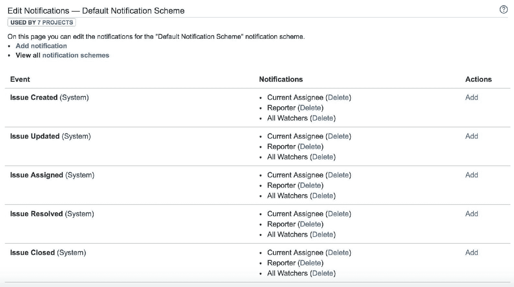

1.  你可以通过点击你想要的事件旁的添加链接，来添加新的用户以接收通知。Jira 随后会显示一份所有可用的选项清单，你可以使用这些选项来定义通知接收者。正如下图所示，有许多选项，从静态选项（例如 Jira 中的特定用户或确切的电子邮件地址），到更动态的选项（例如某个组中的所有用户或问题自定义字段中的所有用户）。

1.  选择通知接收者选项并点击“添加”。你可以重复这个过程，为事件添加更多接收通知的用户：

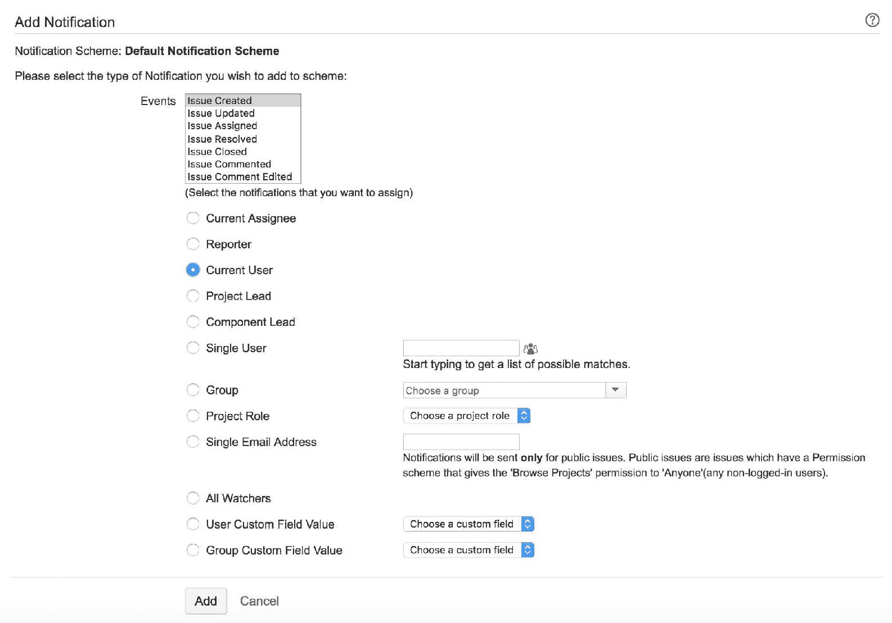

# 排查通知问题

通常，作为管理员，当人们没有收到预期的 Jira 通知时，找出原因可能会变得困难且令人沮丧。与通知相关的问题通常有两个常见原因：外发邮件服务器连接问题或通知方案配置错误。

排查外发邮件服务器问题相对简单。你只需要通过“外发邮件管理”部分中的“发送测试邮件”选项尝试发送一封测试邮件。如果你收到了测试邮件，那么外发邮件服务器配置就没有问题，你可以将注意力集中在通知配置上。如下面的截图所示，测试邮件投递失败，错误信息显示 Jira 无法连接到配置的 SMTP 服务器：

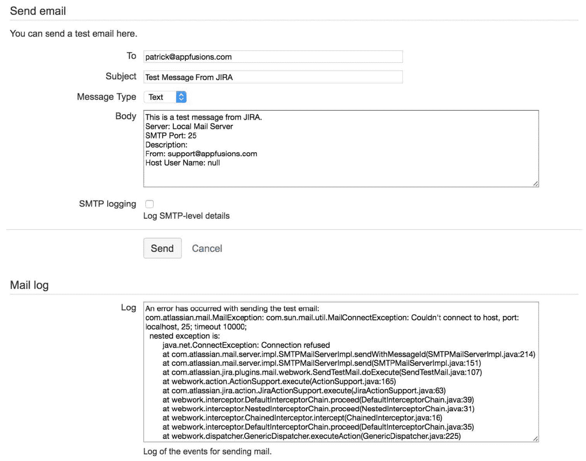

排查通知设置并不是一件简单的事，因为你需要考虑很多因素。为了帮助解决这个问题，Jira 提供了一个新功能，叫做通知助手。通知助手可以通过帮助 Jira 管理员定位为什么某个用户会或不会收到通知，节省管理员的时间。管理员只需告诉助手用户是谁，用户应该收到哪些问题（或来自目标项目的示例问题）的通知，以及触发通知的事件：

1.  浏览到 Jira 管理控制台。

1.  选择“系统”标签，然后选择“通知助手”选项。

1.  在“用户”字段中指定应该接收通知的用户。

1.  指定要测试的问题。

1.  选择通知事件类型。

1.  点击提交。

然后，通知助手会处理输入内容，并根据通知方案设置报告该用户是否应该收到通知以及原因：

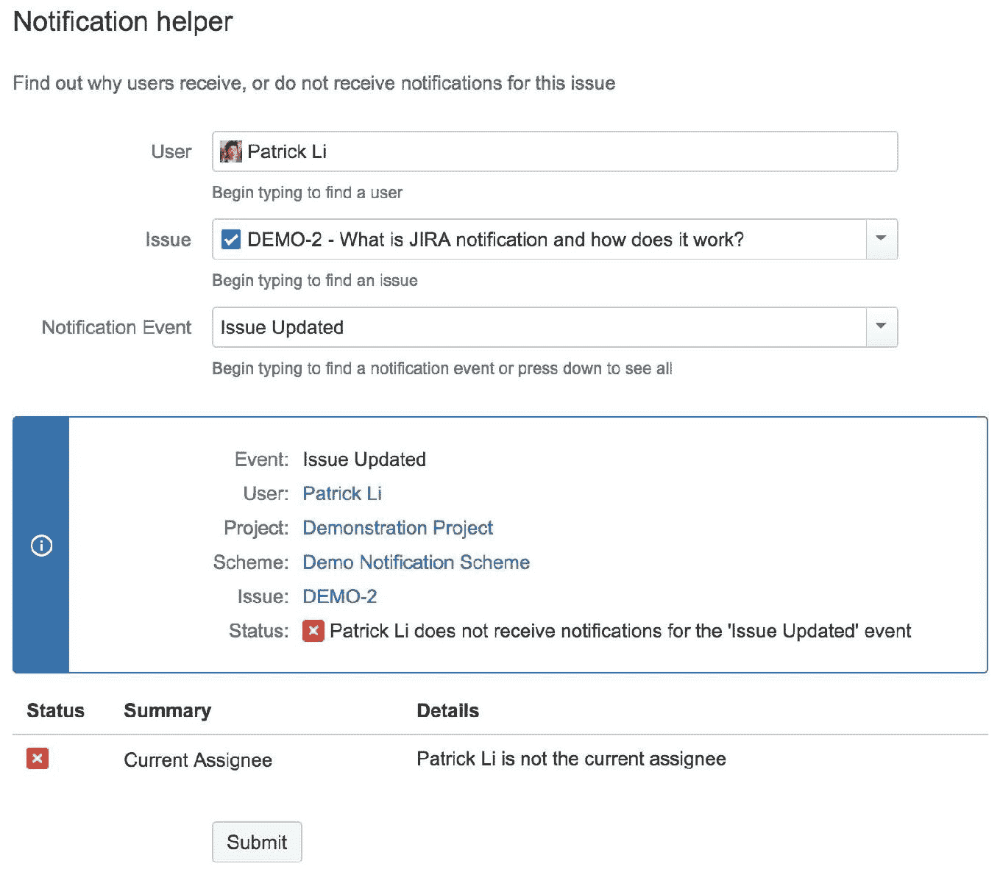

正如从前面的截图中看到的，用户 Patrick Li 在更新 DEMO-2 问题时并未收到通知，因为通知设置为只有当前指派人会收到邮件，而 Patrick Li 并不是该任务的指派人。

# 总结

在本章中，我们探讨了如何在默认的敏捷模板之外自定义 Jira。我们讨论了如何创建新的问题类型和自定义字段，如何编写包含自定义权限和验证的工作流。我们还介绍了 Jira 的权限层次结构，以及如何保护系统免受未经授权的访问。最后，我们介绍了如何管理 Jira 中的电子邮件通知，以便团队成员能够及时了解项目中的变化。

在下一章，我们将探讨一些高级话题，比如将 Jira 与其他工具集成，以便扩展其默认功能的使用。
