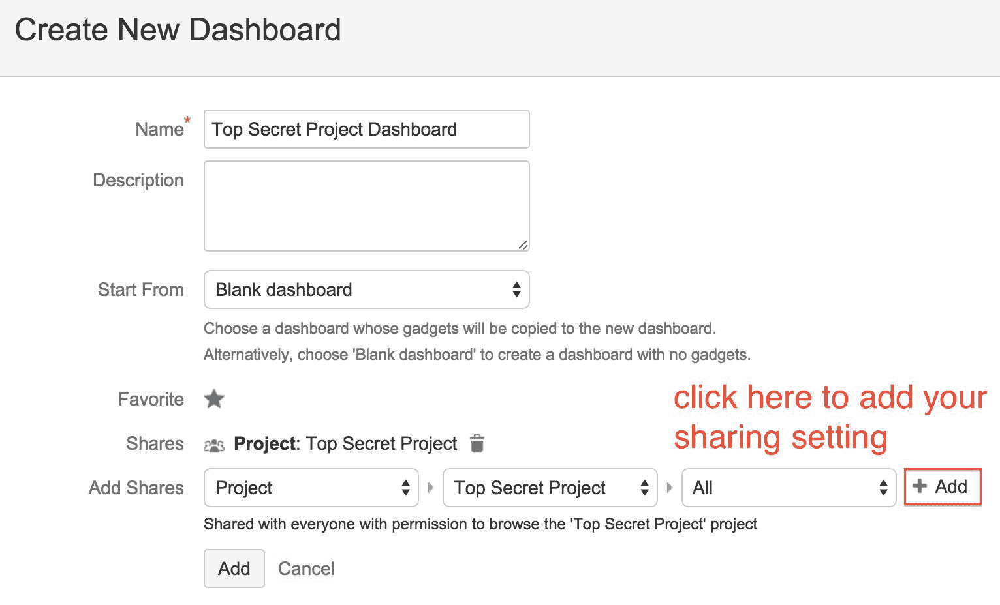
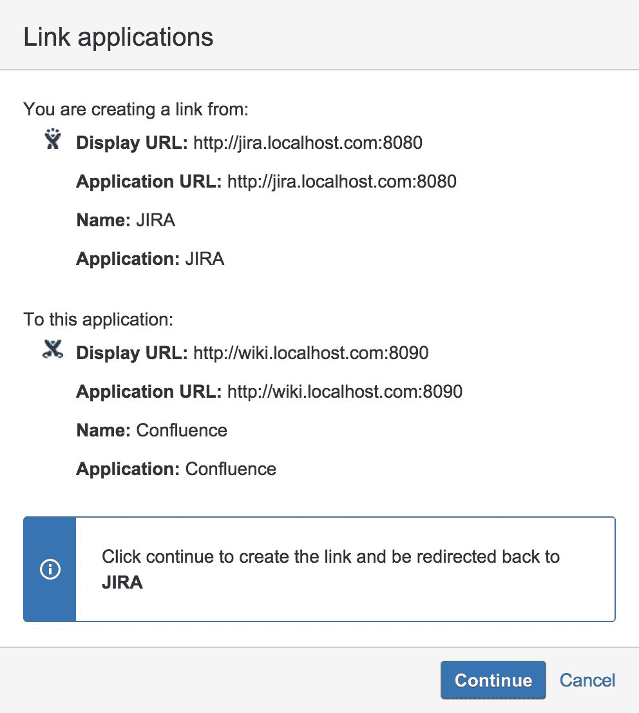
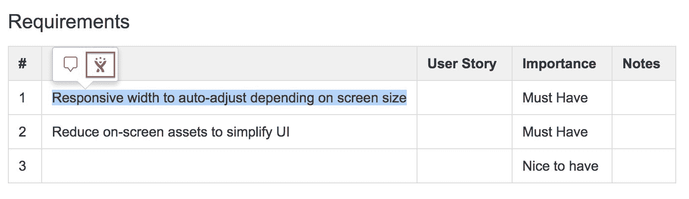

# Jira 软件 – 高级版

在前几章中，我们讨论了如何使用 Jira 来运行和管理 Scrum 和看板项目，并根据需要定制 Jira，使其更加灵活和适应性。在本章中，我们将深入探讨 Jira 的一些额外功能，以及如何与其他系统集成，以为你和你的团队提供完整的端到端体验。

到本章结束时，你将学会如何：

+   使用仪表盘展示和共享项目信息

+   创建并将史诗与需求页面关联

+   从需求页面创建用户故事

+   在日历上展示冲刺

+   捕捉冲刺会议记录

+   分享项目进展报告

+   打印出你的敏捷卡片并将它们钉在物理看板上

# 展示敏捷报告

正如我们在第二章（*Jira 软件用于 Scrum*）和第三章（*Jira 软件用于看板*）中看到的，Jira 附带了多个报告，你可以生成这些报告以更好地了解项目的进展。然而，它们通常需要你去看板生成报告。展示和共享项目信息的更好方法是利用 Jira 内置的一些协作功能。

# 使用 Jira 仪表盘

显示和共享项目及冲刺进展的最简单方法是使用 Jira 的仪表盘功能。仪表盘充当项目的门户页面，你可以通过向仪表盘添加小工具，展示关于项目的不同信息。

Jira 附带了多个专为展示敏捷相关信息设计的小工具，包括：

+   **冲刺燃尽图小工具**：此工具在仪表盘上显示你的冲刺燃尽图。该图表会自动更新，以反映当前的数据。

+   **剩余天数小工具**：此工具显示冲刺预计完成之前剩余的天数。它作为一个提醒，告诉你还剩多少时间。

+   **冲刺健康小工具**：此工具显示一个条形图，展示冲刺进展的信息；例如，还剩多少工作需要完成。

使用 Jira 仪表盘的优势在于，你不仅限于使用专门为敏捷设计的小工具。Jira 还提供了许多其他有用的小工具，可以帮助你深入了解你的项目和冲刺。它们如下：

+   **筛选结果小工具**：你可以选择一个筛选器，并在表格中显示结果。你可以用它来展示冲刺中最重要的问题。

+   **二维筛选统计小工具**：与筛选结果小工具类似，但它不是展示问题列表，而是根据你选择的字段，展示筛选结果的统计细分。

+   **饼图小工具**：你可以选择一个筛选器，结果会显示为饼图，其中每个扇区根据你选择的字段展示；例如，优先级。

如你所见，你可以通过将敏捷和非敏捷小工具结合，构建一个非常实用的仪表板。你甚至可以创建你自己的小工具，或从第三方供应商下载小工具，以展示符合你需求的信息。

为你的项目和冲刺创建一个仪表板，请执行以下步骤：

1.  从仪表板菜单中选择“管理仪表板”选项。

1.  点击“创建新仪表板”按钮。

1.  输入你新仪表板的名称。

1.  选择你想要的共享方式。仪表板默认是私有的，所以为了让其他人查看仪表板，你必须将其共享给他们。如以下截图所示，我们正在将仪表板共享给“最高机密项目”的成员。

1.  点击“添加”按钮以创建仪表板：

确保在选择好与谁共享仪表板后，点击“添加”按钮。

创建新的仪表板后，你可以开始通过小工具向其添加内容：

1.  点击“添加新小工具”链接。你点击哪个链接都没关系，因为你可以在添加小工具后，随时通过拖动它们重新定位。

1.  通过点击其“添加小工具”按钮，从“添加小工具”对话框中选择你想要添加的小工具。

1.  在添加完你想要的所有小工具后，关闭对话框：

添加小工具后，你需要配置每个小工具，以显示你想要的数据。对于大多数小工具，你只需选择要使用的看板、冲刺、项目或筛选器：

你还可以配置仪表板的布局。默认情况下，仪表板分为两列，宽度相等。你可以通过点击“编辑布局”按钮，然后选择你想要的布局来进行更改。

# 使用墙板

另一个你可以利用的 Jira 功能是墙板。你可以将墙板看作是 Jira 仪表板，通过投影仪或大屏幕显示在大墙上。

使用墙板是与团队和其他同事共享项目资讯的好方法。以下截图展示了墙板的一个例子。通过将敏捷项目的数据提取出来，并投射到大屏幕上，大家可以轻松快速地获取他们所需的信息。当人们走过你们团队的工作区域时，他们会清楚地了解团队的进展：

要为你的敏捷项目设置墙板，首先需要创建一个仪表板。请注意，并非所有小工具都与墙板兼容，但所有预装的敏捷小工具都是兼容的。一旦你准备好了仪表板，点击“工具”菜单并选择“以墙板查看”选项，连接到大屏幕，你就拥有了一个超棒的墙板。

如果你有多个仪表板，可以创建一个墙面板幻灯片。只需从工具菜单中选择“设置墙面板幻灯片”选项，如下图所示，来设置幻灯片。选择要包含在墙上的仪表板，并设置幻灯片显示方式（显示选项），然后使用“以墙面板幻灯片查看”选项进行展示：

# 将 Jira 与 Confluence 集成

Confluence 是 Atlassian（Jira 的开发商）提供的团队协作解决方案，使团队能够共同协作并创建内容。组织通常使用它来创建和共享与项目相关的信息，如功能和设计规格。Jira 与 Confluence 无缝集成，提供完整的敏捷体验。在接下来的部分中，我们将介绍如何将 Jira 与 Confluence 集成，以便：

+   创建带有设计文档的史诗任务和用户故事

+   在日历上管理和查看你的冲刺

+   捕获你的冲刺计划会议记录

+   在每次冲刺结束时创建回顾报告

+   分享并发布发布信息

# 设置与 Confluence 的应用链接

如果你还没有将 Jira 和 Confluence 集成在一起，你需要创建一个新的应用链接。要与 Confluence 创建应用链接，请执行以下步骤：

1.  浏览到 Jira 管理控制台。

1.  选择“应用程序”选项卡，然后选择“应用链接”选项。

1.  输入 Confluence 实例的 URL 并点击“创建新链接”按钮，如下图所示：

1.  如果 Jira 和 Confluence 共享相同的用户仓库（例如 LDAP），请勾选“服务器具有相同的用户和用户名”选项。

如果你为两个应用程序提供了共享用户仓库，如 LDAP，启用此选项后，用户将体验无缝集成。否则，他们将被提示授权访问另一个应用程序中的内容。

1.  如果你在 Jira 和 Confluence 上都拥有管理员账户，请勾选“我在两个实例上都是管理员”选项。这将使你能够从 Confluence 创建到 Jira 的双向链接。

1.  点击继续按钮：

1.  验证屏幕上的信息是否正确。如果两个应用程序能够成功通信，它将显示 URL 和应用程序的名称与类型，如下图所示。然后，点击继续按钮：

1.  继续使用屏幕向导，一旦应用链接成功创建，你将看到成功消息，并且会列出新的 Confluence 应用链接：

# 从史诗任务创建 Confluence 页面

Jira 是一个很好的工具，用于跟踪和管理项目的日常活动，但它不是记录任务详细信息的最佳工具，比如设计文档和功能规范。使用 Confluence 作为文档平台，你可以通过几种方式创建设计文档并将其链接到你的史诗。

第一个选项是直接从敏捷看板的待办事项中创建你的文档，即 Confluence 页面：

1.  浏览到你的敏捷看板并进入其待办事项。

1.  从左侧打开史诗面板。

1.  选择并展开你想要为其创建 Confluence 页面的史诗。

1.  从史诗中点击“链接页面”链接。

1.  从对话框中点击“创建页面”按钮，如下图所示：

1.  点击“创建页面”按钮后，你将被带到 Confluence，新的浏览器标签页中会显示创建对话框，如下图所示。默认情况下，对话框会预先选择“项目需求”模板（也称为蓝图），但如果你愿意，你也可以选择使用其他模板。另请注意，顶部的“选择空间”字段会预先选择你上次访问的 Confluence 空间，因此请确保选择正确的空间来创建你的新页面。

1.  选择正确的空间后，点击“创建”按钮来创建你的新页面：

1.  如果这是你第一次使用产品需求模板，你会看到一个“开始使用”信息对话框，如下图所示。只需勾选底部的“以后不再显示”选项，然后点击“创建”按钮来创建你的新页面：

1.  再次点击“创建”按钮以开始编辑新页面。

Confluence 会为你提供一个新页面和编辑器，并带有预定义的模板。你只需填写模板中的信息，如目标和需求。需要注意的几点事项：

+   确保为你的页面命名。一个好的做法是将页面命名为链接的史诗（epic）名称。

+   在 Jira 中通过点击“链接到相关 Jira 史诗”功能文本标签来引用该史诗。这样，需求页面和史诗问题之间就会创建一个引用链接。

页面创建后，如果你返回 Jira，史诗的“链接页面”链接会变为“1 个链接页面”，点击该链接会显示实际的链接页面，如下图所示：

如果你已经为项目创建了需求页面，而不是从史诗中创建新的页面，你可以通过点击“链接页面”按钮来直接链接到这些页面。点击后，你将看到一个搜索框，你可以输入页面标题，找到你想要的页面，并选择它来创建链接。下一张截图会说明这一点：

如果你无法看到链接的页面，请确保 Confluence 启用了远程 API。详细信息请参见 [`confluence.atlassian.com/x/vEsC`](https://confluence.atlassian.com/x/vEsC)。

# 从 Confluence 创建用户故事

如果你使用的是产品需求蓝图，正如我们之前看到的，页面上有一部分内容用于列出该功能的所有需求。团队定义完所有需求后，你可以直接在页面上创建用户故事。为此，请执行以下步骤：

1.  转到 Confluence 中的产品需求页面。

1.  高亮你希望创建用户故事的需求文本。你高亮的文本将成为用户故事的摘要，如下截图所示：

1.  点击 Jira 图标。这将打开“创建问题”对话框，如下截图所示。

1.  确保选择的项目和问题类型正确。你可以点击“编辑”链接进行更改。

1.  为用户故事输入描述。

1.  如果产品需求页面已经链接到 Jira 中的史诗，你将看到“链接到史诗”选项。如果你不希望用户故事被添加到史诗中，请取消勾选此选项。

1.  点击“创建”按钮以创建用户故事：

如果你的页面中有多个需求列在“需求”表格里，你可以点击底部的“从此表格创建 x 个问题”选项，Confluence 会自动为每个需求创建一个用户故事。

创建用户故事后，你将看到每个需求旁边会添加一个 Jira 问题，显示它们的关键和状态。随着问题的处理，状态会自动更新。你还会在页面顶部的面包屑导航旁看到一个 Jira 链接按钮，点击该按钮将显示所有当前与此页面链接的 Jira 问题，包括任何史诗和用户故事。请参考以下截图：

当前，Jira 链接按钮仅在使用 Confluence 默认主题时可用。

# 使用团队日历规划你的冲刺

当你和你的团队进行冲刺时，看到冲刺与团队其他活动如何契合通常很有帮助：例如，如果团队成员在冲刺进行到一半时有假期或旅行计划，或者有其他交付承诺可能会干扰到冲刺。

解决此问题的关键是将所有信息可视化地展示在一个日历上，供整个团队查看和共享，这样每个人都能保持信息的更新，就像在敏捷看板上列出任务一样。要做到这一点，请执行以下步骤：

1.  浏览到你团队的团队日历。

1.  点击“添加事件”按钮。

1.  选择“Jira 敏捷冲刺”选项作为事件类型：

1.  选择属于你 Scrum 看板的项目。

1.  输入事件名称。

1.  点击“确定”按钮以创建事件。

Confluence 的团队日历是一个独立的产品，你可以从 Atlassian Marketplace 获取，网址是[`marketplace.atlassian.com/plugins/com.atlassian.confluence.extra.team-calendars/cloud/overview`](https://marketplace.atlassian.com/plugins/com.atlassian.confluence.extra.team-calendars/cloud/overview)

创建事件后，团队日历将获取选定项目的所有冲刺，并在日历上显示它们。如以下截图所示，我们有两个冲刺，冲刺 2 和冲刺 3。我们还可以看到 Tom Johnson 将在冲刺 2 开始时休假，这可能会影响团队按时完成所有任务的能力。此外，如果你在日历上显示了所有团队成员的假期计划，那么在进行冲刺计划时，你将能够获得所有必要的信息，从而帮助你决定冲刺的工作量以及冲刺的时长。

日历设置完成后，你还可以分享和嵌入它。一个好的使用方法是，在同一个项目空间中创建一个新的 Confluence 页面，这个页面包含了所有的需求文档，命名为“项目日历”，然后将日历嵌入到页面中。要将日历嵌入到页面中：

1.  点击页面顶部的“创建”按钮。

1.  为选择空间字段选择项目空间。

1.  现在选择“空白页面”选项并点击“创建”按钮。

1.  将页面命名为“项目日历”。

1.  选择并将团队日历宏添加到页面中。

1.  点击“添加现有日历”选项。

1.  搜索你创建的日历，点击“添加”按钮。

1.  点击“保存”按钮以创建页面：

在你创建页面后，你将把项目的所有信息汇总在一个地方，并与项目的 Confluence 空间一起，便于访问。你还可以采取一个额外的步骤，在你的 Scrum 看板上创建一个快速快捷方式链接，直接链接到项目日历页面，这样当你需要时，只需点击即可访问。

要创建指向页面的链接：

1.  浏览到你的 Scrum 看板。

1.  从左侧点击“添加链接”选项。

1.  输入项目日历页面的 URL。

1.  输入链接的标签，即项目日历。

1.  点击“添加”按钮以创建链接。

链接将显示在左侧的“项目快捷方式”部分，如下方截图所示。因此，在你的冲刺计划会议中，或在进行当前冲刺的工作会议时，你可以轻松访问项目日历，并获取最新信息：

# 记录冲刺会议笔记

正如我们所看到的，你可以使用 Confluence 的团队日历来规划和可视化你的冲刺。另一个冲刺规划会议的重要组成部分是记录会议内容，捕捉讨论的要点、做出的决策，并能在冲刺的上下文中回顾这些会议记录。

就像需求文档一样，Confluence 也是一个很好的地方来捕捉和存储这些信息。在你的 Scrum 看板中，你可以像处理史诗一样创建并链接每个冲刺到 Confluence 中的页面。要为冲刺创建会议记录：

1.  浏览到你的 Scrum 看板。

1.  点击左侧的“待办事项”以显示所有冲刺。

1.  点击链接页面链接，选择你想要创建会议记录的冲刺。

1.  如果你想创建新的会议记录页面，请点击“创建页面”按钮；如果你已经准备好会议记录，可以点击“链接页面”按钮：

如果你点击“创建页面”按钮，你将被带到 Confluence 页面，并显示创建对话框。对话框会预选“会议记录”模板。确保选中了正确的空间，然后点击“创建”按钮；你就可以开始输入会议内容。一旦你创建并保存了会议记录，页面上将显示一个 Jira 链接，指向该冲刺，如下图所示，冲刺页面也会列出所有与之关联的会议记录：

# 创建回顾报告

除了创建会议记录外，另一个很棒的功能是在每次冲刺结束时创建回顾报告。记住，敏捷方法的一个核心理念是持续改进，因此，在每个冲刺结束时，整个团队应该聚集在一起，讨论他们做得好的地方以及冲刺中出现的问题；还要总结经验教训，并讨论如何在下一个冲刺中作为团队改进流程。

要为你的冲刺创建回顾报告，执行以下步骤：

1.  浏览到你的 Scrum 看板。

1.  点击左侧的“报告”。

1.  选择要报告的冲刺并选择“冲刺报告”。

1.  点击“链接页面”链接。

1.  点击“创建页面”按钮：

1.  点击 Confluence 创建对话框中的“下一步”按钮。

1.  输入报告标题或保留默认标题。

1.  将所有参加回顾会议的团队成员添加进去。

1.  点击“创建”按钮，开始撰写报告。

和所有其他报告一样，报告与冲刺之间会创建一个参考链接，便于你在两者之间轻松切换。

# 在 Confluence 中展示你的项目

Jira 和 Confluence 之间的最后一个集成功能是基于特定版本创建项目报告。你可以创建两种类型的报告：

+   **变更日志报告**：变更日志报告列出了选定版本中所有相关的问题。这可以避免你手动编写问题列表并逐一输入。对于向客户和其他利益相关者沟通特定版本中的变更，这是一种非常有效的方式。

+   **状态报告**：状态报告是一个实时报告，展示项目的状态，通过多个饼图呈现。

为了创建这些报告，你将从 Confluence 开始，而不是从 Jira：

1.  登录 Confluence，并浏览到你的项目空间。

1.  点击顶部的“创建”按钮，或按下键盘上的 *C* 键。

1.  在创建对话框中选择 Jira 报告并点击“创建”。

1.  选择你要创建的报告并点击“下一步”按钮。在我们的示例中，我们正在创建一个状态报告：

1.  选择要报告的项目和版本。这些字段会根据来自 Jira 的数据自动填充。

1.  输入报告的标题。

1.  点击“创建”按钮开始创建报告。

默认的报告模板将根据你提供的信息自动填充，因此你只需点击“保存”按钮创建报告，无需做进一步更改。以下截图显示了默认的状态报告：

# 离线使用 Jira 敏捷看板

Jira 将敏捷方法的优势带入了基于 Web 的系统，让大家无论是否同处一个物理空间，都能访问和共享进展和报告。然而，有时拥有一个实体的看板和卡片仍然很有用，这样的会议（例如每日立会）会显得更具互动性和新鲜感，而不是让每个人都一直盯着电脑显示器看。

你可以使用名为 Agile Cards 的第三方插件来完成这项工作——它可以将 Jira 中的问题打印出来。你可以通过 **通用插件管理器**（**UPM**）搜索并安装该插件，或从以下链接下载，并通过 UPM 手动上传到 Jira：

[`marketplace.atlassian.com/plugins/com.spartez.scrumprint.scrumplugin`](https://marketplace.atlassian.com/plugins/com.spartez.scrumprint.scrumplugin)

一旦你安装了 Agile Cards 插件，你将在你的看板上看到一个新的打印图标。以下截图展示了 Scrum 看板的 Backlog 视图中的新图标。该图标在活动冲刺模式和看板模式中也可用：

`print` 功能也可以在 Jira 外部使用；例如，当你在问题导航器中进行搜索，或查看单个问题时。

当你点击打印图标时，会打开一个新标签页，每个问题都会转化为一张卡片，如以下截图所示：

在打印完敏捷卡片后，你可以将它们剪下来并钉到物理看板上，在团队会议中使用它们。这个附加组件的第二个功能是，它还允许你通过拍摄物理看板的照片并将其导入 Jira 来同步物理看板与敏捷看板。

为了将物理看板的内容传输到 Jira 的敏捷看板，我们需要在物理看板上添加一项新的信息，称为**分隔符**。分隔符是一张纸，你需要将其放置在物理看板每一列之间，这样当你拍摄物理看板的照片时，敏捷卡片就能确定列与 Jira 的敏捷看板之间的匹配关系。要为你的看板生成分隔符：

1.  浏览到你想要同步的敏捷看板。

1.  选择新的敏捷卡片菜单，然后选择“同步物理任务看板”选项。

1.  如果这是第一次同步两个看板，请点击“物理看板设置”选项卡：

1.  将左侧所有与物理看板对应的列拖动到“物理看板布局”部分。

1.  点击“打印分隔符”按钮以打印分隔符。

1.  将分隔符图像钉到物理看板上，如下图所示。这将帮助敏捷卡片确定每个卡片属于哪个列：

在物理看板上设置好分隔符后，现在可以同步到 Jira 敏捷看板：

1.  拍一张你的看板照片，并将其发送到你的计算机。

1.  转到你想要同步的敏捷看板。

1.  选择新的敏捷卡片菜单，然后选择“同步物理任务看板”选项。

1.  点击“看板同步”选项卡。

1.  选择并上传第 1 步拍摄的照片。如果照片处理成功，你将获得所有更改的摘要。

1.  查看结果并点击“自动更改状态”链接来更新所有问题，或者点击每一列的批量编辑链接并分别处理它们。

敏捷卡片有其他几个自定义选项，例如让你自定义卡片的布局，决定打印时包含哪些字段。你可以通过[`confluence.spartez.com/x/GwAt`](https://confluence.spartez.com/x/GwAt)了解更多信息。

# 总结

在这一章节中，我们介绍了 Jira 提供的一些附加功能和能力，现在你可以根据自己的需求创建 Scrum 和看板。我们探讨了使用 Jira 的一些非敏捷特性，如小工具和仪表板，更好地展示数据并促进协作。我们还研究了将 Jira 与 Confluence 和团队日历集成，这样你就可以创建详细的文档和报告，并与史诗任务、用户故事和迭代进行交叉引用。

记住，这些功能的一个重要部分是将数据从 Jira 中提取出来，避免数据孤立，并与团队及其他项目相关方共享信息。通过在仪表盘上共享信息，并回顾团队的进展，你可以持续改进并一起提升，从而成功地运用敏捷方法并做到敏捷。

在下一章，我们将探讨如何将 Jira 与 Atlassian Bitbucket 进行集成，Atlassian 的另一项解决方案，旨在帮助软件工程师管理、构建和部署代码。与 Jira 一起使用时，这将完成将 Jira Software 作为软件开发敏捷项目管理解决方案的整个周期。
