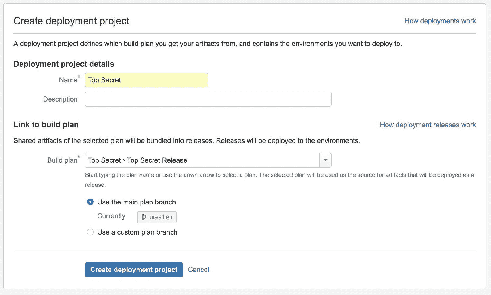

# 第七章：Jira 软件 – 发布与部署

在前几章中，我们探讨了如何将 Jira 与来自 Atlassian 和第三方开发者的其他工具进行集成，从而扩展 Jira 的功能。在本章中，我们将探讨如何使用另一款 Atlassian 工具——Bamboo，将软件开发项目的发布、构建和部署过程串联起来。

在本章结束时，你将学会如何：

+   集成 Jira 和 Bamboo

+   直接在 Jira 中执行版本发布和构建

+   在 Jira 中显示构建信息

+   将发布的构建部署到你的操作环境中

# 将 Jira 与 Bamboo 集成

**Bamboo** 是 Atlassian 的持续集成和构建服务器。通过将 Jira 和 Bamboo 集成在一起，你可以在 Bamboo 中访问 Jira 的问题信息，并且在 Jira 中查看 Bamboo 的构建和部署信息。

# 设置与 Bamboo 的应用链接

与将 Jira 与 Confluence 集成类似，你需要在 Jira 和 Bamboo 之间创建一个新的应用链接。要与 Bamboo 创建应用链接，请执行以下步骤：

1.  浏览到 Jira 管理控制台。

1.  选择“应用程序”选项卡，然后选择“应用链接”选项。

1.  输入你的 Bamboo 实例的 URL 并点击“创建新链接”按钮，如下图所示：

1.  如果 Jira 和 Bamboo 共享相同的用户仓库（例如 LDAP），请勾选“服务器具有相同用户和用户名集”选项。

1.  如果你在 Jira 和 Bamboo 上都有管理员账户，请勾选“我在两个实例上都是管理员”选项。这将允许你从 Bamboo 创建一个双向链接到 Jira。

1.  点击“继续”按钮：

1.  验证屏幕上的信息是否正确。如果两个应用能够成功通信，它将显示 URL、应用名称和类型，如下图所示。然后，点击“继续”按钮：

1.  继续进行屏幕上的向导操作，成功创建应用链接后，你将看到一条成功消息，并且 Bamboo 的应用链接将列出：

# 从 Jira 发布构建

在集成了 Jira 和 Bamboo 后，我们将能够将 Jira 中的发布过程和 Bamboo 中的构建过程结合起来：

1.  浏览到你想要执行发布操作的 Jira 项目。

1.  从左侧面板中点击“发布”选项。发布页面默认应列出所有未发布的版本，如下所示：

1.  点击要发布的版本的“构建与发布”选项。

1.  在发布对话框中选择“使用新构建”选项。

1.  选择用于构建此发布的构建计划。构建计划应从 Bamboo 中提取。如果你没有看到想要的构建计划，请确保你对 Bamboo 中的构建计划有访问权限，并且 Jira 与 Bamboo 之间的应用链接正常工作。

1.  点击“发布”按钮以发布并构建版本。您无需输入发布日期，因为 Jira 会在发布 ID 完成后自动填入今天的日期：

一旦 Bamboo 端的构建完成，Jira 将标记该版本为已发布，并显示构建的成功结果，如下所示。您可以从此页面点击构建结果链接，直接跳转到 Bamboo 查看更详细的构建信息，并进行发布部署，正如我们在本章后面将看到的：

此外，任何与此发布构建相关的问题也会在“开发”部分下显示构建结果，如下所示。您可以点击该链接直接在 Jira 中查看构建结果：

# 部署发布

一旦成功构建了您的项目，您还可以将最终构建的 artifact 部署到您的环境中。您可以通过多种方式实现这一点。例如，您可以将自定义部署阶段作为构建计划的一部分。然而，我们将使用 Bamboo 中的部署计划功能。这使您能够更好地控制部署过程的执行方式，并且能够跟踪所有的部署，还可以在出现问题时回滚到之前部署的版本。

# 设置部署计划

第一步是在 Bamboo 中设置一个新的部署计划：

1.  登录到 Bamboo。

1.  从创建菜单中选择“创建部署项目”选项。

1.  输入新部署项目的名称，并选择用于构建项目的构建计划和分支：

1.  点击“创建部署项目”按钮以创建部署计划。

1.  创建部署项目后，系统会要求您创建一个环境。您应该为每个实际的操作环境创建一个环境，例如生产环境和测试环境。

1.  点击“继续设置任务”按钮：

只有在您在构建计划中定义了共享 artifact 时，您才会看到 artifact 列表。

1.  对于每个环境，您需要配置一系列任务，以便作为部署的一部分运行。例如，如果您正在部署基于 Java 的 Web 应用程序，您需要使用 Artifact 下载任务，并选择作为构建过程一部分创建的 artifact：

在添加新任务之前，请确保每个任务都点击“保存”按钮。

1.  点击“添加任务”按钮，向构建计划中添加更多任务。Bamboo 自带了一些可直接使用的部署任务，例如部署到 Heroku 云和使用 Docker。如果您没有找到适合您部署需求的任务，您还可以查看 Atlassian Marketplace，在那里您可以找到许多其他支持其他部署选项的 Bamboo 插件：

# 运行部署

在我们创建好部署计划和目标环境后，可以继续部署已发布的项目：

1.  浏览到 Bamboo 中的发布构建结果。你可以通过 Jira 的发布页面访问它。

1.  点击“创建发布”按钮：

1.  确保选择正确的构建结果。

1.  输入此版本发布的版本号。通过这种方式，我们创建了所有部署的历史记录，方便追踪每个环境的已发布和已部署版本，并且将来可以轻松回滚。在以下示例中，我们正在发布版本 1.0。

1.  点击“创建发布”按钮：

如果你有多个环境，例如测试环境和生产环境，应该始终先从测试环境开始。如果部署成功，随后你可以将部署推广到生产环境。

1.  从“部署”菜单中选择你要部署到的环境。之前创建的每个环境应该都列在这里：

1.  审核部署并点击“开始部署”按钮开始部署。根据部署的类型，完成过程可能需要几分钟或更长时间。Bamboo 会在此过程中显示部署进度：

1.  如果部署成功，你将看到如下的成功页面。如果需要，你可以将部署推广到其他环境。

1.  如果所有部署后验证都通过，点击“批准”按钮。这将标记该部署为成功：

# 总结

本章我们介绍了 Bamboo 及其功能。我们使用应用链接将 Jira 与 Bamboo 集成，使得两个应用可以互相共享信息；例如，允许你从 Jira 内部运行构建计划。我们还在设置部署计划时探讨了 Bamboo，这样你可以部署你已经发布并构建的项目工件。

你将会发现更多可以通过 Jira 和 Bamboo 集成一起完成的操作；例如，你将开始在 Jira 的活动流中自动看到构建结果，这样每个人都能及时知道构建是否失败。你的构建工程师也可以从 Bamboo 构建中查看 Jira 的任务信息，从而轻松定位构建计划失败的原因。
