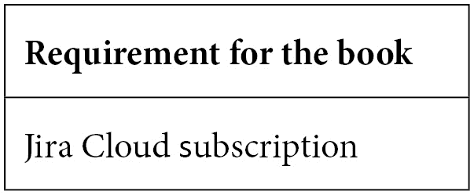

# 前言

学习一个新工具可能会让人感到非常艰难，尤其是涉及到经常让人感觉神秘的项目管理软件。但是，Atlassian 通过重新设计其最初的 Jira Core 云服务，已经大大简化了入门的过程。

这本循序渐进的实操书籍将帮助您几乎在不费吹灰之力的情况下，迅速创建您的第一个项目。您甚至可以免费开始使用 Jira，并管理最多 10 个用户的项目。但不要让这个免费的限制让您掉以轻心，Jira Work Management（JWM）产品拥有强大的功能，同时也具备简单的操作，连新手也能立即上手。

到本书结束时，您将已经成功创建了您的第一个 Jira Work Management 项目，并且可能已经有了一些初步的任务。您将了解如何执行管理项目所需的简单操作，并确保其正常运行。

所有这些以及更多内容都可以通过 Atlassian 提供的一个简单的基于浏览器的工具来实现，Atlassian 是全球领先的项目管理软件公司之一。看看里面的内容，让我们开始吧！

# 本书适合人群

本书适合那些希望快速入门，使用 Jira 进行非软件项目的产品经理和项目经理。HR、财务、法律、营销等职能团队的最终用户也会从中受益。熟悉 Jira 会有所帮助，但并非必需。

# 本书内容概述

这本书对于 Jira 新手来说是宝贵的财富。它是开始使用世界上最流行、最强大的项目管理工具之一的最佳方式之一。每一章都会逐步带领您理解工具的关键概念和功能。

*第一章*，*为什么选择 Jira Work Management?*，介绍了 Jira Work Management 项目的概念，包括它们的主要用途以及最适合哪些场景。本章比较了各种 Jira 项目类型及其结构，并说明如何根据您的情况确定最适合的类型。它还描述了各产品之间的差异，帮助您更轻松地过渡到工具的下一代版本。

*第二章*，*使用项目模板*，介绍了在创建 Jira Work Management 项目时如何使用模板。在 Jira Work Management 中，模板有很多分类或分组。本章还探讨了不同模板之间的差异及其底层组成部分。

*第三章*，*创建您的第一个项目*，涵盖了创建新项目的基本知识。它从*第二章*中关于模板的讨论入手，最后带领您完成第一个项目并运用所学的见解。

*第四章*，*修改看板、工作流和关联方案*，讲解了如何在创建项目时生成初始的看板、工作流和关联方案。它还介绍了如何修改看板和工作流，以及在进行这些修改时需要考虑的因素。最后，本章展示了如何更新共享方案。

*第五章*，*JWM 工具集：摘要、列表、时间轴和日历*，介绍了 Jira 工作管理的最新功能。它讲解了产品中提供的一组工具，包括摘要部分、列表、时间轴和项目内日历的功能。由于这些功能是 JWM 项目与其他项目的主要区别，本章深入探讨了每个工具的工作原理。

*第六章*，*表单、问题、仪表板和报告*，引导您创建简单的 Jira 工作管理表单，以及其他报告功能，如仪表板、筛选器和 JWM 报告。本章还介绍了问题在每个报告功能中的显示方式，以及在决定使用哪个功能时需要考虑的因素。

*第七章*，*管理字段、屏幕和问题布局*，讲解了自定义字段、屏幕和问题布局的基本功能，包括如何添加自定义字段以及如何在屏幕上放置这些字段。本章还涵盖了自定义字段上下文，以及如何根据项目和问题类型的组合限制字段在屏幕上的显示。

*第八章*，*配置权限和简单管理*，讲解了如何基于权限方案和项目角色配置 Jira 工作管理项目的权限。它还将介绍如何向项目中添加用户并将其与项目角色关联。最后，本章介绍了项目管理员可以进行的简单管理，并将这些权限与组织级 Jira 管理员角色区分开来。

*第九章*，*复制项目并跳出框框思维*，介绍了如何基于现有项目的结构和共享方案创建新项目。本章还为在创建项目和问题时提供了一些有用的指导，尤其是当创建过程超出常规、简单的创建流程时，包括 API 和 CSV 导入。最后，本章介绍了如何将现有的 Jira 项目迁移到 Jira 工作管理。

*第十章*，*使用项目自动化*，介绍了自动化规则的创建，这些规则可以由项目管理员进行配置。虽然 Jira 自动化功能非常广泛，并且提供了大量的规则，但本章仅涵盖了该工具的基本和最常用的使用案例。

# 要充分利用本书

开始阅读本书非常容易，几乎不需要提前准备。首先创建一个免费的 Jira Cloud 账户——你可以稍后升级到更完整的版本，但免费订阅已经足够使用。只需使用你喜欢的互联网浏览器，就可以开始了。

注

熟悉 Jira 会有所帮助，但并非必须。

# 下载彩色图片

我们还提供了一个 PDF 文件，其中包含本书中使用的截图和图表的彩色图片。你可以在这里下载：[`static.packt-cdn.com/downloads/9781803232003_ColorImages.pdf`](https://static.packt-cdn.com/downloads/9781803232003_ColorImages.pdf)。

请注意，本书使用了大量的用户界面截图作为参考。你可以在前面提到的网址找到这些截图的更清晰版本。

# 使用的约定

本书中使用了若干文本约定。

`文本中的代码`：表示文本中的代码词、数据库表名、文件夹名、文件名、文件扩展名、路径名、虚拟网址、用户输入和 Twitter 用户名。这里有一个例子：“你的代码将类似于`Project = STAFF`。”

**粗体**：表示新术语、重要单词或你在屏幕上看到的词汇。例如，菜单或对话框中的单词通常会以**粗体**显示。这里有一个例子：“你仍然可以通过点击**更改模板**按钮来更改此选项。”

提示或重要说明

显示为这样。

# 与我们联系

我们随时欢迎读者的反馈。

**一般反馈**：如果你对本书的任何部分有疑问，请通过电子邮件联系我们：customercare@packtpub.com，并在邮件的主题中提到书名。

**勘误表**：虽然我们已经尽力确保内容的准确性，但错误是难免的。如果你在本书中发现错误，我们将非常感激你报告给我们。请访问 [www.packtpub.com/support/errata](https://www.packtpub.com/support/errata) 并填写表格。

**盗版**：如果你在互联网上发现任何形式的我们作品的非法副本，我们将非常感激你提供其网址或网站名称。请通过 copyright@packt.com 与我们联系，并附上该资料的链接。

**如果你有兴趣成为作者**：如果你对某个话题有专长，且有意撰写或为书籍做贡献，请访问 [authors.packtpub.com](https://authors.packtpub.com)。

# 分享你的想法

一旦你读完了 *Jira Work Management for Business Teams*，我们很想听听你的想法！请 [点击这里直接进入本书的亚马逊评论页面](https://packt.link/r/1803232005)，分享你的反馈。

你的评论对我们和技术社区非常重要，能帮助我们确保提供优质内容。
