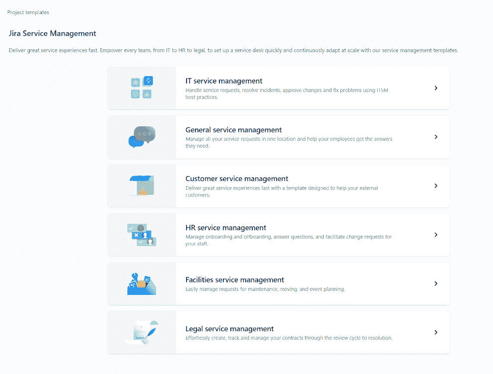

# *第一章*：为什么选择 Jira 工作管理？

多年来，Atlassian 的旗舰产品组合——**Jira** 一直是项目和产品经理的最爱。对于从事**信息技术服务管理**（**ITSM**）领域的人员来说，这一点也同样适用。自从 2002 年首次作为问题和 bug 跟踪工具推出以来，Jira 已经走过了漫长的历程，现已有多个新产品推出。

所以，无论你是 Jira 世界的老手，还是刚接触这个听起来有点奇怪的工具领域，本书将是你快速上手、导航名为**Jira 工作管理**（**JWM**）产品的理想指南。

随着这些新的 Jira 产品的推出，附加功能和不幸的是，创建、使用和管理项目的复杂性也有所增加。别误会——我喜欢这些灵活性和增强功能。但我也有多年使用 Jira 工具集的经验，对于新用户和管理员来说，Jira 可能会让人感到畏惧。

说到这些，就不得不问了：*如果 Atlassian 提供了多种产品，为什么我们要选择 JWM？* 简单的答案是，JWM 提供了一条简单快速的路径，可以在 Jira 中创建新项目，同时融合了其他 Jira 相关产品中没有的全新和令人兴奋的功能。

本质上，JWM 是对初始**Jira Core**产品的重塑和重新品牌化，专为业务项目设计。本章将描述这些产品之间的差异，帮助你顺利过渡到这个工具的下一代版本。

但仅仅是现有工具的重新品牌化，并不足以成为选择使用 JWM 的充分理由。那么，是什么使它与众不同呢？

首先，JWM 与现有的 Jira 产品家族无缝集成，例如**Jira 软件**（**JSW**）和**Jira 服务管理**（**JSM**）项目，以及 Jira Cloud 平台的**表现层状态转移**（**REST**）**应用程序编程接口**（**API**）功能。这种集成意味着用户已经对 Atlassian 产品的整体执行和它们的良好声誉有了一定的了解。

再加上内建项目自动化的强大性能、简单的项目创建和设置流程，以及一套新的工具，你将拥有市场上最优秀的新项目管理产品之一。

在本章中，我们将讨论以下主要主题：

+   Jira 项目类型比较

+   Jira Core 产品回顾

+   JWM 新增了什么功能？

+   本章学习的新术语

完成本章后，你将能够描述 JWM 项目与其他 Jira 项目的区别，并了解每种产品类型最适合的使用场景。

# 技术要求

由于 JWM 仅在 Jira Cloud 环境中可用，因此本章的要求很简单：*访问 Jira Cloud 环境*。

如果你已经有 Jira Cloud 的访问权限，那太好了——你可以开始使用了！如果没有，Atlassian 提供了最多 10 个用户的免费 JWM 账户。你可以通过访问[`www.atlassian.com/try/cloud/signup?bundle=jira-core&edition=free`](https://www.atlassian.com/try/cloud/signup?bundle=jira-core&edition=free)并按照说明创建账户。

# 比较 Jira 中的项目类型

在 Jira 中，项目可以从两个不同的角度来处理。一种方式是像传统上处理项目一样对待项目。正如**项目管理协会**（**PMI**）所指出的：

"*根据 PMBOK® 指南—第四版（PMI，2008a，第 434 页），项目的定义是为了创造独特的项目服务或成果而进行的临时性努力。项目是临时性的，并且在完成其被委托交付的工作后会关闭。*"（来源：[`bit.ly/3xoo0Ar`](https://bit.ly/3xoo0Ar)）

另一种表达项目*临时*性质的方式是说它有明确的开始和结束日期。例如，想想建造房子或建筑物，或是策划婚礼或度假。你知道何时开始计划，也知道何时工作或努力完成。

这无疑是处理 Jira 项目的其中一种方式，但结果可能是组织中的 Jira 实例中有几十个——甚至几百个——项目。你还需要在项目完成后进行关闭或归档。

然而，我个人认为，大多数公司和组织会将 Jira 项目视为内部团队正在进行的持续工作，无论是业务团队、设计团队还是产品开发团队。虽然许多组织通常分为**业务单元**（**BUs**），这些单元可以很容易地被视为团队，或者根据单元的规模，甚至可能被细分为多个团队或小组。

Jira 中的项目分为三类紧密相关但又不同的产品类别。这些是**JWM**、**JSW** 和 **JSM**。为了简化文本并突出目标对象，书中将会频繁出现这些缩写。

尽管 JSW 和 JSM 项目非常强大，占据了大多数组织中的项目类型，但旧的*Jira Core 项目*（现在是 JWM）历史上一直被视为这两个更著名产品的较为次要的兄弟。因此，有必要增强工具集内一个有些衰退的品牌。

Rodney Nissen，也就是*Jira 先生*（[`thejiraguy.com/`](https://thejiraguy.com/)）巧妙地将这一点通过图形展现了出来，如下所示：

图 1.1 – Jira 先生

无论你打算使用哪种类型的项目，每个项目的创建都从相同的路径开始。首先，点击 Jira 顶部导航栏中的**项目**菜单选项，然后点击**创建项目**，如以下截图所示：

图 1.2 – 基本项目创建

接下来的每个小节将简要概述这三种产品，何时使用这些类型的项目，以及最后——如何开始为每种项目创建过程的图形表示。

## JWM 项目

**JWM 项目**在 Jira 中专门被称为 *业务项目*，旨在用于典型的组织业务单元（BU），如 **人力资源（HR）**、财务、法律、营销、销售、运营、设计、运输/库存和视频制作。虽然并非所有公司都会拥有所有这些单元，但它体现了 JWM 在应对这些领域乃至更多领域的能力和包容性。

值得注意的是，JWM 项目与 JSW 和 JSM 项目有一些共同的基础结构，使得各种类型的项目之间能够轻松沟通。事实上，当你创建一个 JWM 项目时，你被视为在一个公司管理的项目中。有关更多信息，请参见 *公司管理的软件项目* 部分。

在选择 **创建项目** 后，用户会看到一个包含丰富的 JWM 项目模板列表。JWM 项目模板通过创建一个基础项目、基于模板类型定义的工作流、与工作流匹配的面板，以及管理项目所需的各种屏幕和权限，为项目设置提供了一种快速方式。我们将在下一章详细探讨 JWM 模板，但这里有一个小列表，供你预览即将到来的内容，并展示创建项目时屏幕的样子：

图 1.3 – JWM 项目模板

这些业务类型的项目比 JSW 项目更具限制性，因为面板无法修改，以下截图所示的 JWM 面板上的列实际上是由附带的工作流中的状态控制的：

图 1.4 – JWM 面板

接下来，让我们来看看 JSW 项目的组件和操作。

## JSW 项目

**JSW 项目**几乎在定义上都指的是与软件开发/工程主要相关的项目。这些项目包括典型的工作流，这些工作流通过架构设计、开发、代码或同行评审、代码合并、**质量保证（QA）** 测试、部署等环节进行转换。当然，所有这些都是 JSW 工作流中的灵活路径。

许多组织还使用 Jira 版本的敏捷世界中最受欢迎的 Scrum 功能。这包括发布、设置冲刺（Sprints）、自动将未完成的问题从已完成的冲刺移动到下一个冲刺，等等。当你开始创建你的 JSW 项目时，你将从 **Scrum**、**看板（Kanban）** 或 **缺陷追踪（Bug Tracking）** 模板中选择。

Jira Software Scrum 模板为用户提供了有关模板类型的相关信息，以及初始项目设置中包含的问题类型和工作流中的状态。由于**Scrum**通常使用冲刺，因此该选项的模板工作流将包括简单的状态：**待办**、**进行中**和**已完成**。

JSW 项目的另一个主要类型是**看板**。这一敏捷框架在全球范围内迅速流行，Jira 提供了快速实现看板的方法。

尽管这些项目类型催生了 Jira 的这一产品线，但由于该工具提供了许多自定义选项，JSW 项目已成为组织内所有类型项目的常态。但随之而来的，关于这些项目类型在初期设置、维护和管理方面的复杂性，现已促使了对更简便选项的需求。除了通过 JWM 提供更简单的业务相关项目，Atlassian 还推出了**团队管理项目**。

**缺陷跟踪**模板使用户能够实施一个不仅跟踪缺陷的项目，而且将问题与这些缺陷所关联的改进或新特性联系起来。所有这些问题类型，连同史诗、任务和子任务，都可以在同一个看板上查看，并使用相同的工作流。

### 团队管理软件项目

几年前作为下一代项目推出的这些软件项目允许独立的团队完全管理和操作其项目，而无需传统的 Jira 管理员。与 JWM 项目一样，团队管理项目具有更简洁的界面，但功能较为简化。实际上，许多初期对这些项目的批评认为它们过于限制。

为此，Atlassian 正在继续为该工具添加急需的功能，同时保持其独立管理的特性，这也是它与 Jira 中所有其他项目类型的主要区别。团队可以自行授予用户访问权限，创建自己的独立自定义字段和自动化规则，并管理自己的工作流。

### 公司管理软件项目

**公司管理项目**是大多数使用 Jira 的组织的主要项目类型。通过使用共享自定义字段、权限方案、屏幕、工作流、问题类型、通知等功能，它们提供了最全面的功能。这些都可以根据需要进行修改，尽管用户需要是 Jira 管理员才能对大多数对象进行更改。

一旦选择了 Scrum 或 Kanban，你将决定项目类型为**团队管理**或**公司管理**。如以下截图所示，一旦项目创建后，你将无法*转换*或更改项目类型。你需要创建一个新项目并将原项目中的现有问题移到新项目中：

图 1.5 – 选择团队管理项目或公司管理项目

## JSM 项目

JSM 项目回归了 Jira 首个提供的*工单*类型工具的根本设计。它们特别设计用于接收和处理帮助台类型的请求。也许最受欢迎的功能是实用的**门户**功能，它还包含了易于填写的表单。

另一个非常有用的功能是非授权用户（或客户）能够提交请求的概念。这是一个客户功能，用户可以是组织外部人员，甚至是匿名的。这为只需提交请求的用户节省了许可费用。

然而，对于任何需要编辑字段值或转移问题的用户来说，会有额外的成本，因为处理请求的人必须被添加为*代理人*，这需要额外的许可费用。

就像 JWM 有一些内置模板来启动项目一样，JSM 也有一些可用的模板，如下图所示：

图 1.6 – JSM 项目模板

现在，让我们快速看一下 JWM 与旧版 Jira Core 产品的区别。

# Jira Core 产品回顾

2015 年，Atlassian 将 Jira 拆分为两个不同的产品——Jira Core 和 JSW。Jira Core 一直被认为是开始问题追踪的简单方式，并成为新用户接触该工具时提供的基础产品。其重点是组织中的非技术团队，通常被称为业务团队。

JSW 继续面向软件开发团队，并提供这两个产品中最多的功能和灵活性。它们在部署在本地（**Jira Server**）和云端（**Jira Cloud**）的版本中并行存在了近十年。**数据中心**版本也可用。

虽然 Jira 一直旨在为技术和非技术团队提供使用，但 JSW 产品的推出重点强调了敏捷开发、发布管理和软件团队相关的报告。事实上，在 JSW 宣布之前，Jira 的前几个版本已经开始实现许多即将推出的功能。随着 Jira 功能的不断扩展，它的复杂性也在增加。

也许第一次接触 Atlassian 产品的新手们对 Jira 最大的抱怨就是弄清楚它已经变成了一个什么样的“怪兽”。似乎这个工具的名字来源于*Gojira*（日语中的“哥斯拉”，也是该工具简称的灵感来源），在某种程度上，已经变成了新手用户的“怪物”。

为了解决这个问题，Jira Core 成为了进入这一领域的安全路径。它保留了许多让 Jira 粉丝喜爱的强大功能，但提供了一种更简单的方式来开始使用该工具，并且无需牺牲使 Jira 成为许多人工作首选工具的特点。

# JWM 中的新功能

在 Jira Core 品牌正式发布超过五年后，Atlassian 决定进行一次品牌重塑。在与部分 Jira 用户和 Atlassian 社区领导者的讨论中，Atlassian 的产品经理和设计师开始着手根据客户的需求和愿望对 Jira Core 进行改造。

如前所述，尽管 JWM 项目的基础结构与公司管理的软件项目相同，但它的最新功能才是将其与其他 Jira 项目类型区分开来的真正亮点。让我们来看看这些功能：

](img/Figure_1.7_B17952.jpg)

图 1.7 – JWM 组件

我们将在此简要了解 Jira 看板和新项目，但每个内容将在接下来的章节中进行更详细的扩展。以下是相关内容列表：

+   **摘要**：此功能通过项目活动流提供信息，并统计与问题状态、优先级和分配人员相关的数据。

+   **列表**：此功能提供项目的问题列表，并显示各个问题的不同字段（列）。它还提供了每个字段的内联编辑功能。

+   **看板**：这是大多数 Jira 项目提供的标准看板功能，尽管它在看板筛选器、卡片和颜色显示等方面有所限制，且不可编辑。

+   **日历**：这是与项目中问题相关的项目内日历。它根据到期日期和/或开始日期显示问题。

+   **时间线**：此功能类似于 JSW 项目中可用的 **路线图** 功能。它以甘特图格式显示问题。

+   **表单**：尽管以复数形式列出，但实际上每个项目在撰写本书时只提供一个表单。该表单简单易用，并采用了录入格式，支持拖放字段。

# 本章学习的新术语

让我们通过以下列表总结本章学习的新术语：

+   **JWM**：Jira Core Cloud 的重新命名，并作为一款具有众多新功能的新产品推出。

+   **Jira Core**：最初的 Atlassian 基础项目管理产品，紧密结合业务团队使用。

+   **ITSM**：IT 团队向客户提供服务并管理服务交付的方式。

+   **JSW**：Atlassian 针对软件开发团队推出的项目管理工具。

+   **JSM**：Jira Service Desk 的重新命名，是 Atalssian 提供给帮助台团队（如 IT）的票务管理系统。

+   **项目模板**：一组预配置的组件和功能，用于快速创建新的 JWM 项目。

+   **看板**：将工作以卡片形式展示在由行和列组成的屏幕上。

+   **团队管理的项目**：JSW 项目，具有独立性，专为单个团队使用设计。它是下一代项目的重新命名。

+   **公司管理的项目**：JSW 项目，使用可在多个项目之间共享的组件。

+   **Jira Cloud**：Atlassian 的基于互联网访问的产品平台。

# 总结

好的，以上就是对 JWM 起源的简洁而全面的概述，并讨论了它在 Jira 生态系统中的定位。

在本章中，你已经了解了 Jira 中不同的项目类型以及何时使用它们。

我们还介绍了原始的 Jira Core 工具是如何从最初的版本演变为新的 JWM 产品。最后，我们简要地看了一下 JWM 项目中新增加的功能。

那么，回到我们最初的问题：*为什么选择 JWM？* 正如你所看到的，随着多种项目模板的可用性以及像内联可编辑列表、**日历**、**表单**和**时间轴**这样的新组件的加入，它是业务相关项目中最简便且最完整的产品。

运用这些知识，你现在可以以最简单的方式开始使用 Jira，并能立刻成功地将工作整理成易于使用的项目。你将比以往更加有条理，信息触手可及。

在下一章中，我们将学习有关各种 JWM 模板的内容，以及用户如何确定哪个模板最符合他们的需求。
