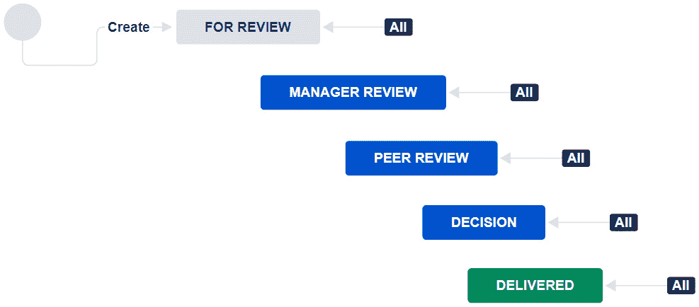
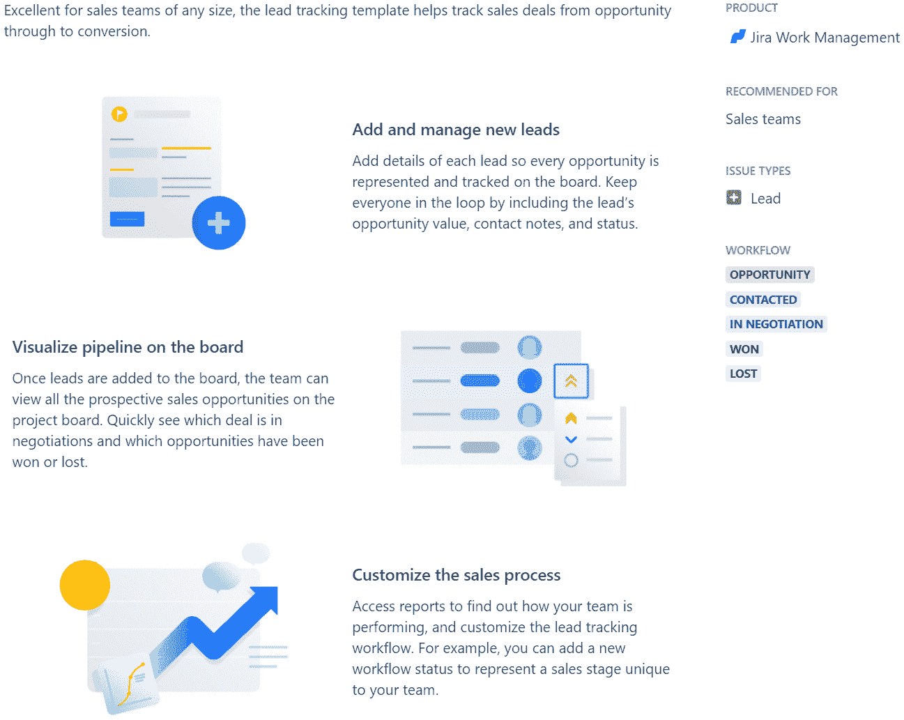

# 第二章：*第二章*：使用项目模板

在我多年的 Jira 管理员和 Atlassian 社区领袖工作经历中，我收到过无数关于基于**模板**创建项目的请求和问题。正如你所想的那样，对于项目的*模板*长什么样，每个人的看法各不相同。有些人想要创建一个符合特定需求的自定义模板，而其他人则只想要一个简单易用、点击即可创建所需基本项目对象的模板。

无论动机或确切需求如何，用户寻求的总体概念是一个快速创建项目的方式，该项目已经包含了内建的方案和对象——如看板或列表/队列——并且大部分符合他们的基本需求。

历史上，所有 Jira 产品系列——Jira Core（现为**Jira 工作管理**，或**JWM**）、**Jira 软件**（**JSW**）和 Jira 服务台（现为**Jira 服务管理**，或**JSM**）——都提供了一套唯一的对象集合，该集合会根据用于创建项目的工具自动生成。

虽然用户仍然不能创建自己的自定义*模板*，但过去——并且现在——仍然可以基于现有项目创建一个新项目，该项目提供一套常用的方案和对象。我们将在*第九章*中详细探讨这一点，标题为*复制项目并跳出框架*。

但在本章中，我们将介绍 JWM 如何提供一大套预设模板（超过 20 个！），这些模板允许用户根据多种功能创建项目，包括模板的主要分组。本章还将探讨每个可用模板及其底层组件的差异，例如工作流和看板列。

本章将涵盖以下主要内容：

+   什么是 JWM 模板？

+   JWM 模板是如何分组的？

+   探索模板的相关信息

+   决定使用哪个模板

+   本章学习的新术语

本章完成后，你将能够描述 JWM 项目模板的目的和功能，以及它们大致属于哪些分组。你还将能够找到并识别各种可用模板。模板将是你创建新项目的最佳方式，因此了解有哪些模板可用及其包含的内容，将帮助你更好地开始使用。

# 技术要求

由于 JWM 仅在 Jira Cloud 环境中可用，因此本章的要求很简单：*访问 Jira Cloud 环境*。

如果你已经可以访问 Jira Cloud，那就太好了——你已经准备好了！如果没有，Atlassian 提供了一个免费的 JWM 账户，最多可供 10 个用户使用。你可以通过访问[`www.atlassian.com/try/cloud/signup?bundle=jira-core&edition=free`](https://www.atlassian.com/try/cloud/signup?bundle=jira-core&edition=free)并按照说明进行注册。

# JWM 模板是什么？

项目模板通过自动创建一些必要的技术组件来帮助用户快速启动项目，这些组件用于管理和使用项目。我们已经在*第一章*《为什么选择 Jira 工作管理？》中描述了创建新项目的过程，用户需要通过选择一个模板来开始使用。这是一个必要的步骤，因为它为项目中的卡片和看板上的列建立了工作流。

工作流中的步骤与项目的状态直接相关。一些常见的步骤/状态包括**待办**、**进行中**、**完成**等。看板上的列名将与状态名称相同。有关状态之间关系的更多信息，请参见本章后面名为*如何阅读工作流*的部分。

除了看板和工作流，其他方案还会自动附加到项目中，涵盖屏幕、权限和通知等内容。我们将在*第四章*《修改看板、工作流和相关方案》中更详细地讨论如何管理和使用这些对象。大多数项目模板可以根据共同的主题或功能进行分组或关联。接下来我们将进一步探讨这一点。

## JVM 模板是如何分组的？

JWM 模板没有严格的分组方法。然而，在规划和构建当前模板列表作为商业项目的起始集时，有一些主题是考虑在内的。

有些模板将跨越多个分组或主题，例如与任务管理、规划和内容管理相关的模板。我将这些模板归为一个我称之为**基本组**的类别。

再次强调，模板可能会跨越多个主题，但这是我对分组的看法，并列出了每个分组下的模板。这只是一个大致的指南，帮助你在选择新模板时缩小焦点，但我认为它是一个有益的参考。

### 基本组

这些是许多项目会使用的常见模板，内容上较为通用。

+   **内容管理**：管理内容生命周期，从优先级排序到草稿和交付。

+   **任务跟踪**：为团队或个人项目组织任务。

+   **个人任务规划器**：保持组织性，轻松处理个人任务。

### 人力资源（HR）

这些模板有助于从招聘前到与现有员工的日常工作等各类人力资源功能。

+   **招聘**：从申请到提供聘用，监控候选人和潜在雇员。

+   **新员工入职**：跟踪新员工的进展，从接受聘用到正式上岗第一天。

+   **绩效评估**：标准化员工绩效评估和同行评审过程。

### 财务

财务项目可以涵盖广泛的内容，包括库存或资产，以及报告周期和预算编制。

+   **资产创建**：简化管理传入资产创建请求的过程。

+   **预算创建**：在预算创建过程中让每个人都在同一页面上。

+   **月末结算**：管理并简化月末结算过程。

+   **采购**：标准化采购流程，跟踪所有从请求到收货的采购事项。

+   **RFP 流程**：推出你的**提案请求**（**RFP**）流程，以便为正确的工作选择合适的供应商。

### 法律

这些模板具有专门的工作流程，帮助准备法律文件的正常流程。

+   **文档审批**：管理从创建到审批的文档。

+   **知识产权侵权**：高效且快速地处理**知识产权**（**IP**）侵权索赔。

+   **政策管理**：跟踪管理政策和程序中涉及的各个环节。

### 市场营销/销售

市场营销和销售类型的项目往往遵循一些共同的活动流程或旅程。由于工作流程的组织方式，这些模板在这一领域将特别有用。

+   **营销活动管理**：推动从创意到执行的营销活动。

+   **电子邮件营销活动**：策划和执行电子邮件营销活动。

+   **市场推广**：协调产品或业务的**市场推广**（**GTM**）启动。

+   **潜在客户跟踪**：从机会到成交，跟踪销售线索。

+   **销售管道**：在一个地方管理从潜在客户到已转化客户的销售管道。

+   **网页设计流程**：为设计师和开发人员跟踪网页设计任务并保持一致。

### 运营

大多数组织都会需要简单的项目和任务相关流程。这个分组聚焦于事件和任务的完成。

+   **项目管理**：管理完成业务项目的活动。

+   **流程控制**：跟踪活动和任务，管理重复性流程。

+   **活动规划**：帮助团队规划下一个活动，无论大小。

接下来，我们将深入探讨每个模板的细节，并介绍一些如何阅读工作流程的基本内容。

# 探索可用的模板信息

在前一部分中，我们列出了 JWM 自带的标准项目模板集合。接下来的各个小节中，将提供每个模板的更多详细信息。这些细节将包括对每个模板提供的原因的总体解释，以及与模板相关的**问题类型**和**工作流程**。

该文本的目的是帮助你理解每个模板何时最适用。问题类型将提供关于最适合使用该模板的工作类型的明确性，以及将与项目对接的工作流程中的状态或步骤。

应该注意的是，接下来的页面大多是本书写作时当前 JWM 模板的截图。由于 Atlassian 已付出巨大努力来创建、配置和详细说明这些模板，因此最好让工具本身来描述这些内容。请记住，当前产品中提供的模板可能与这里提供的有所不同。

## 问题类型、工作流和面板之间的关系

这些是 JSW 和 JWM 项目中最基本但又最强大的部分，但它们在两个工具中的配置方式也提供了这些工具之间最大的区别。我们在此不会过多详细说明 JSW 项目的工作原理，但我们会指出这些主要组件在 JWM 中的关系。

从历史上看，面板是最生动地展示项目或团队工作进展的工具。无论是看板还是冲刺面板，看到卡片及其在面板上的进展都是无可否认的强大展示。

简而言之，面板由称为*泳道*的水平行和代表项目中执行的活动（如设计、开发或测试）的垂直列组成。在 JWM 项目中，这些列将与项目工作流中的状态一一对应。

目前，JWM 项目不允许将多个工作流与一个面板关联。因此，尽管项目可能与多个问题类型关联，但所有问题类型必须与一个且仅一个工作流关联。我们将在*第四章*中详细讨论配置和修改组件的内容，*修改面板、工作流和相关方案*。

## 如何阅读工作流

由于我们将展示每个模板的许多细节，包括工作流图像，现在是讨论如何阅读工作流的好时机。乍一看，我们可以看到工作流由**状态**（可以理解为步骤）和**转换**（可以理解为路径）组成。以下工作流通过提供从一个状态到下一个状态的命名转换来帮助引导用户。请参阅*图 2.1*和*图 2.2*作为我们讨论的视觉参考。

状态以不同颜色的框显示，而转换是连接状态的线条，或者标识从一个状态到另一个状态的路径。*图 2.1*和*图 2.2*已开启转换名称，以便更容易识别流向的方向，并描述正在发生的操作。通常，使用动词为转换命名是一个好方法。

工作流从一个灰色圆圈和**创建**过渡开始。请注意，卡片可以双向流动。过渡上的文字位置表示流动的方向——因此，在这个例子中，当一个问题被创建时，它会进入**待办**状态。从那里，问题只能通过**开始进度**过渡前进到**进行中**状态。

一旦问题进入进行中状态，它可以通过**完成**过渡前进到**完成**状态，或者通过**停止进度**过渡返回到**待办**状态。最后，从**完成**状态，问题可能会被重新打开并返回到**待办**状态进行**重新打开**过渡，或者它可能会通过**重新打开并开始进度**过渡返回到**进行中**状态。

请注意，在以下截图中，所有状态都属于三类之一——**待办**（在**创建**过渡标题下的框）、**进行中**（最右侧框）或**完成**（底部框）。在这个例子中，恰好状态名称与状态类别名称相匹配：

图 2.1 – 简单工作流

需要注意的是，一个状态可能只有一个**全部**过渡，如以下截图所示。这意味着卡片可以从工作流中的任何其他状态流动到该状态。否则，卡片必须按照线性顺序从一个步骤移动到下一个步骤，如*图 2.2*所示：

图 2.2 – 使用所有过渡的工作流

现在我们已经掌握了一些基本的模板阅读方法，让我们深入了解一些细节。

## 项目管理

第一个模板可能是 JWM 项目中使用最广泛的模板，是你创建第一个商业项目时的好选择。模板名称很通用，适用于多个场景。你可以在此看到该模板的示例：

图 2.3 – 项目管理模板

**项目管理**模板与我们在*图 2.1*中作为示例使用的模板相同。它非常简单，为使用 JWM 项目提供了一个轻松的开始。工作流在这里表示：

图 2.4 – 项目管理工作流

## 任务跟踪

最简单的初始项目模板是**任务跟踪**模板，它提供了一种快速实现传统待办事项列表的方式。特别之处在于，你可以使用两层结构，包括**任务**和**子任务**这两种问题类型，如下截图所示：

图 2.5 – 任务跟踪模板

这是一个非常简单直接的工作流，从**待办**到**完成**，如以下截图所示。如果需要，可以重新打开：

图 2.6 – 任务追踪工作流

## 内容管理

当今世界充斥着各种内容。从博客到网站，再到各种各样的发布信息，我们需要一些帮助来管理所有这些信息的创建。**内容管理**模板提供了一个单一问题类型的**资产**，并具有简单但高效的工作流，如以下截图所示：

图 2.7 – 内容管理模板

该工作流提供了一个路径，用于创建草稿、进行审阅和批准，最后通过发布将其发布到世界上。在审阅和草稿阶段提供了灵活性，以允许进行任何必要的修订，如以下截图所示：

图 2.8 – 内容管理工作流

## 文档审批

与**内容管理**模板非常相似的是**文档审批**模板。再次强调，随着当前时代信息量的增加，关于文档和内容的流程需求也在不断增长。你可以在以下截图中看到该模板的表现：

图 2.9 – 文档审批模板

该工作流也非常线性，遵循从创建草稿、进行审阅（在此情况下，可能需要审阅两次），然后得到批准的路径，如以下截图所示：

图 2.10 – 文档审批工作流

## 网页设计过程

**网页设计过程**模板更多地遵循一个构思思维过程，在该过程中，首先形成一个想法，接着创建设计，最终测试得到的线框或草图。最后，在所有步骤都经过审阅并达成一致后，产品会被发布。你可以在以下截图中看到该模板的表现：

图 2.11 – 网页设计过程模板

该工作流具有经典的**所有**转换概念，其中卡片可以在每个步骤之间轻松流动，最大限度地促进协作，如以下截图所示：

图 2.12 – 网页设计过程工作流

## 招聘

员工的流动似乎比以往更为频繁，随着远程工作计划和职位跨州、省甚至国界的迁移，**招聘**模板，如下图所示，提供了接收候选人并跟踪他们整个招聘过程的流程：

图 2.13 – 招聘模板

招聘的工作流程本质上较为线性，在多个环节都有可供拒绝与职位不匹配候选人的出入口。面试完成后，进行汇报与讨论，并决定候选人的最终结果，如下图所示：

图 2.14 – 招聘工作流程

## 新员工入职

在你成功使用招聘项目后，接下来就该进行新员工入职！通过收集和审核相关文件、设置计算机和**信息技术**（**IT**）设备，并准备好在员工第一天迎接他们，帮助他们顺利开始工作。你可以在下图中看到**新员工入职**模板的示例：

图 2.15 – 新员工入职模板

这个工作流程相当简单，且提供了很大的灵活性，因为每个状态都使用了**所有**的过渡，如下图所示：

图 2.16 – 新员工入职工作流程

## 绩效评审

现在新员工已经入职并开始工作，你最终需要对每个员工进行**绩效评审**。这个模板通过使用员工的任务和子任务问题类型，轻松跟踪这些评审。通过这种组合，可以实现全面覆盖，示例如下图所示：

图 2.17 – 绩效评审模板

该工作流程提供了不同层次的评审，最终做出一个可以与员工分享的决定，如下图所示：

图 2.18 – 绩效评审工作流程

## 潜在客户跟踪

正如其名，**潜在客户跟踪**模板利用**潜在客户**问题类型来跟踪销售机会在销售周期中的进展。销售管道是收入生成流程的命脉，失去对机会的跟踪或让机会停滞不前而未被察觉，可能对公司产生重大影响。你可以在下图中看到这个模板的示例：

图 2.19 – 潜在客户跟踪模板

使用该工作流来记录销售管道中经历的胜利和失败，同时跟踪初次联系、谈判和最终结果，如下图所示：

图 2.20 – 潜在客户跟踪工作流

## 采购

**采购**模板有助于确保你的项目能够跟踪采购订单以及逐年重复的需求。使用到期日期来指导优先事项，并记录订单的详细信息。你可以在以下截图中看到该模板的示例：

图 2.21 – 采购模板

该工作流为订单的审批提供了支持，跟随初步请求和审查。它大致是线性的，而审查会导致最终结果。你可以在这里看到该工作流的示例：

图 2.22 – 采购工作流

## 销售管道

销售的一种理念是，联系和机会越多越好。另一种理念是，专注于通过精心设计的营销活动产生的优质潜在客户，以提高转化率。无论哪种方式，**销售管道**都是支持两者的关键。使用此模板来跟踪你的客户，从第一次接触到最终成交。你可以在以下截图中看到**销售管道**模板的示例：

图 2.23 – 销售管道模板

销售管道通常具有更为线性的工作流，但这个模板也提供了路径的灵活性。通过**赢得**和**失去**状态，它也将使报告机会的结果变得更加容易。你可以在这里看到该工作流的示例：

图 2.24 – 销售管道工作流

## 邮件营销

让我们面对现实——电子邮件并没有死！**邮件营销**仍然是接触客户、传达销售信息、产品报价、公司新闻等的有效方式。此模板包含了**资产**、**任务**和**子任务**问题类型，帮助跟踪邮件本身以及制作邮件所需的努力。你可以在以下截图中看到**邮件营销**模板的示例：

图 2.25 – 邮件营销模板

组织可以使用多种类型的邮件营销活动，因此此工作流提供了灵活性，可以在需要时跳过某些列，或按线性路径继续，如下图所示：

图 2.26 – 邮件营销工作流

## 预算创建

很少有人喜欢创建预算，但它们对于帮助控制财务非常必要。**预算创建**模板有助于将预算传递以获取反馈、审核和批准。流程结束时，你可以跟踪审批情况。你可以在以下截图中看到这个模板的示意图：

图 2.27 – 预算创建模板

有些预算比其他预算更复杂，需要经过工作流的每一步。其他预算则可以跳过不适用的步骤，利用**所有**过渡步骤的灵活性，如以下截图所示：

图 2.28 – 预算创建工作流

## 个人任务规划器

我们有大量的**个人任务规划器**可供选择。它们以多种不同的样式和格式出现。但为什么不让 Jira 帮助你做它最擅长的事情——跟踪任务！即使在个人层面上，从个人任务规划器构建的项目也能与你实例中的其他项目很好地集成，并提供一个查看所有工作的单一位置。你可以在以下截图中看到**个人任务规划器**模板的示意图：

图 2.29 – 个人任务规划器模板

这个工作流已经非常简单——经典的**待办**、**进行中**、**完成**格式，每个类别仅涉及一个状态。当创建问题时，它将被放入**待办**状态，开始时移动到**进行中**，最后，问题在完成后简单地移动到**完成**。你可以在以下截图中看到工作流的示意图：

图 2.30 – 个人任务规划器工作流

哇，模板真多！而且这还没有显示出所有现有的可供你使用的模板。接下来，我们来看看如何选择合适的模板。

# 决定使用哪个模板

在使用 JWM 项目的众多内置模板中，你应该选择哪一个？当然，第一个线索是问自己：*我想实现什么？* 接下来的合理步骤是查看本章前面页面中每个项目模板的描述，或者浏览工具本身中的在线描述。

请特别注意模板使用的问题类型以及项目背后实际实现的工作流。如我们在*问题类型、工作流和看板关系*一节中提到的，项目中的所有问题类型都将使用单一的工作流。记住，工作流中的状态将与看板上显示的列相关联。

不要过于纠结工作流中状态的顺序，因为在创建所有内容后，你将能够重新排列看板的列。我们将在*第四章*中讨论更多内容，*修改看板、工作流及相关方案*。

# 本章学习的新术语

让我们通过回顾本章学习的新术语来总结这一章，具体如下：

+   **项目模板**：一组预配置的组件和功能，用于快速创建新的 JWM 项目。

+   **问题类型**：识别正在进行的工作类型。这个字段是所有新问题的必填项。

+   **工作流**：工作从开始到结束的进程路径，按照步骤逐步从**创建**到**完成**。

+   **状态**：工作流中每个步骤的公认名称。

+   **过渡**：工作流中从一个状态到另一个状态的路径。

# 总结

如前所述，JWM 与其他 Jira 产品的不同之处在于它提供了几个预构建的项目模板，帮助你快速启动。我们已经探讨了这些模板的大致分类，并深入研究了每个模板所使用的问题类型和工作流。

现在你已经掌握了这些知识，你知道最快的创建项目方式是使用模板，且你现在可以根据模板提供的细节快速识别应该使用哪个模板。

在下一章，我们将通过创建第一个项目来进一步讨论刚才提到的模板。完成后，我们将探索更多可用的内容。
