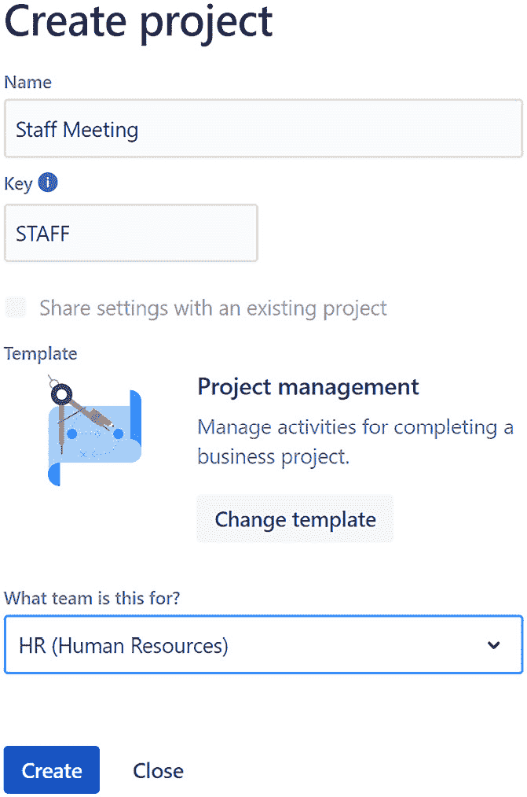

# *第三章*：创建你的第一个项目

现在我们已经处理了大部分前期工作，让我们开始一些实际操作。如你可能已经猜到的，第一步是创建一个项目。我们将通过一个使用项目管理模板的例子来演示，因为这是最广泛使用的模板。

这将开始我们与工具的动手操作体验，并且我们将遵循相同的流程，随着章节的推进，了解如何创建对象。接下来，我们将创建第一个问题，并了解它们是如何在看板上显示的。然后，我们将查看当你创建项目时，自动生成的一些管理功能。

在本章中，我们将覆盖以下主要内容：

+   创建新项目的过程

+   创建项目后接下来做什么？

+   Jira 工作管理项目的管理组件

到本章结束时，你将创建你的第一个 Jira 工作管理项目，并看到一些初步的问题。此外，你将能够与与项目相关的各种管理功能进行互动。

# 技术要求

由于 Jira 工作管理仅在 Jira Cloud 环境中提供，本章的要求很简单：*访问 Jira Cloud 环境*。

如果你已经能够访问 Jira Cloud，那就太好了——你准备好开始了！如果没有，Atlassian 为最多 10 个用户提供免费 Jira 工作管理账户。你可以通过访问[`www.atlassian.com/try/cloud/signup?bundle=jira-core&edition=free`](https://www.atlassian.com/try/cloud/signup?bundle=jira-core&edition=free)并按照指示创建账户。

# 让我们来创建一个项目吧！

我们将从选择顶部导航栏中的**项目**选项开始，然后选择**创建项目**：

图 3.1 – 创建项目菜单选项

如在*第二章*中所讨论的，*使用项目模板*，Jira 工作管理会立即显示一系列项目模板。目前，大约有 20 个模板可供选择。*图 3.2*展示了部分可用模板：

图 3.2 – 项目模板选择

对于我们的第一个项目，我们将点击第一个选项，也就是**项目管理**。接下来，我们将查看我们选择的模板详情：

图 3.3 – 项目管理模板详情

该详细信息页面上提供了很多信息，包括项目使用的问题类型和工作流中的步骤。此外，还有一些关于模板如何应用于你正在进行的工作、项目将可用的组件（例如列表、日历或看板）以及如何协助协作的概述。此部分旨在作为指南，确保这是你希望创建的正确项目模板。

审核完毕后，只需点击**使用模板**按钮。那将带你进入*图 3.4*，在这里你可以给你的项目命名：

图 3.4 – 项目命名

最初，当此窗口显示时，每个字段都会为空。我已经添加了一些文本，作为可以输入的信息类型的示例。以下是每个字段的简要说明：

+   **名称**：项目名称由你自行选择。此值可以随时轻松更新，如果你改变主意的话。现在不必花费太多时间去创造完美的名称——你的优先事项是创建项目。对于我们的测试项目，我选择了基于公司定期员工会议演示文稿创建项目。

+   **键**：键是项目的简短描述，通常是问题 ID 中最常见的部分。键必须至少包含两个字符，最多不超过 10 个字符，并且必须以字母开头。所有键值默认会以大写字母显示，因此在创建值时请考虑这一点。创建后如果更改键的值，可能会导致潜在的断开连接或其他问题，因此在分配时请小心。

+   **模板**：这是最后的检查，确保这是你想要使用的模板。你仍然可以在此时点击**更改模板**按钮进行更改。

+   **这是为哪个团队准备的？**：这是由内部的 Atlassian Jira Work Management 产品团队使用的，目的是帮助他们了解使用 JWM 项目的团队类型。你无法在 Jira 的其他地方使用该值。此字段是可选的。

对于你的第一个项目，随便使用任何你喜欢的名称和键值。

重要提示

只有项目管理员或 Jira 管理员才能创建新项目，如果你没有订阅 Jira Software 或 Jira Service Management 的话。如果你同时拥有 JWM 和这些工具，你必须是 Jira 管理员才能创建项目。

此外，除非使用该键的整个原始项目已被删除，否则项目键将无法在未来用于其他项目。

最后，点击**创建**按钮，完成项目的全新设置。就这样！你的第一个项目已创建！让我们更仔细地看看它生成了什么。

## 项目看板

当项目创建过程完成后，你很可能会被引导到项目看板。在左侧菜单中，你可以通过点击**看板**选项，随时轻松地返回看板。

看板最初将根据工作流的状态创建列。请参考*图 3.3*中的项目模板详细信息，该图展示了在工作流中已创建的状态——在这种情况下，**待办**、**进行中**和**已完成**。

我们将在**第四章**中深入探讨看板的操作及如何进行更改，*修改看板、工作流和相关方案*：

图 3.5 – 项目看板

我们已经了解了项目创建的基本步骤，并熟悉了一些工具。那么接下来我们该如何操作？

## 项目已创建——接下来该做什么？

现在，项目已经根据所使用的模板处理并创建了初始工具集，接下来我们应该做什么？仍然在看板上时，你会看到一个带有灯泡图标的按钮，按钮上写着**快速入门**。让我们点击这个按钮来进一步探索。

这样做会在右侧显示一个弹窗，如*图 3.6*所示。快速入门窗口的目的是为你提供更多关于 Jira 工作管理项目中可用的各个组件的信息和指导。当你探索每个组件时，它们将被勾选，便于你查看已查看过的项目。

向下的箭头将展开关于该组件的附加信息。然后，你可以点击**引导我**按钮，获得关于工具的更详细信息。我们将在*第五章*、*JWM 工具集——摘要、列表、时间线和日历*以及**第六章**，*表单、仪表板和报告*中更详细地探讨每个组件。要收起详细信息，只需点击该部分的向上箭头：

图 3.6 – 快速入门

快速入门按钮将在看板上一直可用，直到你点击弹窗底部的**Dismiss Quickstart**选项。如果你只是想暂时关闭弹窗，但仍然希望保持它可用，可以点击弹窗右上角的两个箭头来最小化窗口。然而，即使你已经关闭了快速入门选项，你仍然可以将其恢复。只需点击位于导航栏右上角的头像，并选择**Open Quickstart**。

在接下来的几节中，我们将探索创建问题/工作项的各种方式，并查看它们如何在看板上显示。

### 创建你的第一个问题

至少有三个不同的地方可以开始创建你的第一个问题。这也是讨论一些术语的好时机。在 Jira 产品系列中，表示待办工作的术语是**问题**。

然而，请注意，你还会遇到其他一些术语，它们执行相同的操作。在*图 3.5*中，你可以看到底部中央框中的**条目**一词。一旦问题/条目被创建并出现在看板上，它通常会被称为**卡片**。无论使用哪个术语，请理解它们指的是同一项工作。然而，为了清晰起见，本书余下部分我们将统一称之为问题。

此外，正如你可以用不同方式来称呼这项工作一样，创建问题也没有唯一的推荐方法。我们将按照以下方式逐步介绍每个选项：选项 1 和 2 是最基本的，而选项 3 提供了输入最多信息的机会。稍后在*第六章*，《表单、问题、仪表板与报告》中，我们将学习如何使用表单来创建问题。

#### 创建选项 1

让我们从第一种创建方法开始。如*图 3.5*中的**通过看板可视化你的工作**部分所示，屏幕底部有一个**创建你的第一个条目**按钮。当你点击这个按钮时，你会看到类似于*图 3.7*的界面：

图 3.7 – 创建一个问题

点击按钮后，会在看板的第一列打开一个文本框，并显示**开始输入…**的提示。这真的很简单——你只需要输入一段简短的工作描述，然后点击**保存**按钮：

图 3.8 – 直接在看板上创建问题

现在让我们来看一下另一种创建问题的功能。

#### 创建选项 2

另外，你也可以通过点击看板上第一列（**待办**）底部的**+ 创建新问题**按钮来创建一个新的工作项。这将显示与*图 3.5*中相同的界面，你可以开始输入第一个问题的名称。这两种选项最终会将你带到卡片的相同位置。

#### 创建选项 3

最后，你可以通过点击顶部导航栏中的**创建**按钮来创建一个问题：

图 3.9 – 通过顶部导航栏创建问题

点击**创建**按钮将显示该项目的**问题创建**界面。如我们在前两种创建新问题的选项中所发现，用户只能输入问题的名称。在非正式场合，这也被称为卡片标题或问题名称。然而，更正式地说，在 Jira 中它被称为**摘要**。

选项 1 和 2 旨在作为非常快速的创建新问题或卡片的方法。该问题将使用项目的默认问题类型（即问题类型方案中问题类型列表顶部的类型。有关如何更改默认问题类型的详细信息，请参阅 *第八章*，*配置权限和简单管理*）。

如你所见，在*图 3.10*中，使用顶部导航栏中的**创建**按钮将为用户提供创建新问题时最大的灵活性。此选项的一个优点是你可以使用不同于默认的其他问题类型。另一个优点是你可以在创建问题时同时填写附加字段的信息。有关如何控制**创建**屏幕使用的字段的更多信息，请参阅 *第七章*，*管理字段、屏幕和问题布局*：

图 3.10 – 创建一个屏幕

现在是填写字段值的最佳时机，例如截止日期、优先级、描述等。**截止日期**字段将在工作板的卡片视图中出现（如*图 3.12*所示），同时也会在日历视图中显示。开始日期将用于在时间线视图中正确地可视化工作进度。

当然，即使你使用的是快速创建新问题的方法，你也可以随时更新卡片的详细信息。

## 返回工作板

对于 Jira 软件项目，工作板是用户与已创建问题进行交互的主要方式。虽然 Jira 工作管理为你提供了查看和处理问题的新组件，但工作板仍然是查看工作内容的关键可视化方式。

让我们看看工作板的一些功能。要将卡片移动到工作流的下一个步骤（例如，移到下一个列或任何其他可用列），只需点击卡片并将其拖动到所需的可用列。

如下截图所示，卡片可以进入两个不同的列——**进行中**列或**已完成**列，列的不同颜色高亮显示了这一点。有时很难确定卡片发布后会进入哪个状态，尤其是当卡片跨越两个列时。所有可用的列/状态都会以浅蓝色高亮显示（如下截图中的**已完成**列所示）。然而，一个列/状态会以浅绿色高亮显示。当鼠标释放时，卡片将落入浅绿色的状态中（如下截图中的**进行中**列所示）：

图 3.11 – 移动卡片

如果这些字段已填充，卡片上还将显示附加信息。默认情况下，卡片上将显示**到期日期**选项。您可以在*图 3.12*中看到这个选项，日期显示为一月份的日期。如果字段没有填充，则不会显示任何值——如*图 3.11*中所示的卡片。

此外，默认情况下，卡片将分配给将卡片拉入新状态或列的用户。在以下示例中，我们看到第一列（**待办事项**）没有分配卡片。然而，我们在中间和最后一列看到为用户分配的卡片头像。如果用户没有将头像链接到其个人资料，或者由于安全原因没有公开其图像，则会显示该用户的首字母：

图 3.12 – 看板上的多张卡片

我们现在已经创建了问题/卡片，并查看了它们在看板上的显示。此时，我们可以创建并使用项目来完成我们的工作。接下来，让我们看看如何调整管理设置，以获得更多的灵活性和功能。

# 访问 Jira 工作管理管理组件

尽管我们将在第*7 章*中详细介绍管理部分，*管理字段、屏幕和问题布局*，以及第*8 章*中详细介绍，*配置权限和简易管理*，但此时能够找到简单的管理信息是很有帮助的。不过，要做到这一点，您需要知道在哪里查找以及查找什么内容。

要访问管理工具和信息，您必须是项目管理员。这意味着用户必须具有管理员项目角色，并且该角色应与附加到项目的权限方案中的管理项目权限相关联。我们将在第*8 章*中更详细地讨论这一点，*配置权限和简易管理*。顺便提一下，仅仅因为用户是 Jira 管理员或*系统*管理员，并不自动赋予用户管理项目的权限。

点击左侧菜单中的**项目设置**选项进入项目管理区域。如果您没有看到**项目设置**选项，说明您没有项目管理员权限：

图 3.13 – 项目设置

## 项目详情

选择**项目设置**将引导您进入项目详情窗口，如*图 3.15*所示。在此处，您可以更改项目的各种设置：

图 3.14 – 项目详情

以下选项可供选择：

+   **名称**：这是你可以更改在项目创建过程中填写的项目名称的地方。你可以随时更改项目名称。该字段为必填字段。

+   **密钥**：与名称一样，这里是可以更改密钥的位置。再次强调，修改时应谨慎操作。这是一个必填字段。

+   **网址**：提供指向用户提供的外部网站的链接，该网站包含更多关于项目的详细信息。

+   **项目类型**：此字段设置为 Jira 工作管理项目的**业务**值，并且不可更改。

+   **项目类别**：此字段在创建第一个项目时为空，因为没有现成的项目类别。你需要点击信息图标来创建第一个类别。在至少创建一个类别后，你可以将该值添加到**项目类别**字段中。

+   **头像**：所有项目都有一组内置的图片可供选择。在项目创建时，会为你的项目随机默认分配一个初始头像。你可以点击**选择图片**链接来更改头像。在接下来的屏幕中，你还可以从计算机上传自定义图片。这是一个必填字段。

+   **描述**：描述为我们 Jira 实例中的用户提供更多关于项目的信息。此字段是可选的。

+   **项目负责人**：这是与项目内项目负责人角色相关联的字段。通常，它指的是主要的项目管理员。此角色可用于系统中的额外权限和通知。这是一个必填字段。

+   **默认分配人**：如果填写了该字段，所有新创建的问题将分配给默认分配人。唯一有效的值是**未分配**或**项目负责人**。无法为该字段提交单独的用户。如果你希望某个除了项目负责人之外的人自动分配到新问题，你需要更改项目负责人的值。

你可以随时更改项目详细信息的值。更改完成后，请确保点击**保存详细信息**按钮。

## 人员

出于安全原因，你可以通过点击左侧菜单中的**人员**选项来更改谁可以访问项目以及他们拥有哪些权限，如*图 3.15 所示*。例如，在免费订阅下，所有用户都会自动访问所有项目，并且是项目管理员。对于付费订阅，你可以添加多个角色和用户：

图 3.15 – 分配访问权限

对于这些付费订阅实例，用户应点击右上角的**添加人员**按钮。从那里，你将能够将用户添加到项目中，并将他们分配到项目角色。

## 问题类型

如项目模板详细信息所示，Jira 工作管理项目是使用预定义的**问题类型**创建的。当我们进入问题类型方案时，可以看到这些问题类型显示在*图 3.16*中：

图 3.16 – 问题类型

你可以通过点击左侧菜单中的**问题类型**选项来更改可用于项目的问题类型列表。我们将在*第八章*，*配置权限和简单管理*中对此功能进行更详细的讨论。

## 屏幕和问题布局

创建、查看和编辑**屏幕**的选项可帮助用户控制项目中问题的字段。它们是 Jira 中非常有趣的功能，具有许多警告和复杂性。它们是查看单个问题所有信息的最常见和有效的方式。在 Jira 工作管理项目中引入可内联编辑的列表之前，屏幕是更新 Jira 中问题的唯一真正方法。

我们将在*第七章*，*管理字段、屏幕和问题布局*中讨论如何创建新的自定义字段。然而，如果你想更改屏幕上字段的顺序，可以按照以下方式进行：

1.  从左侧菜单中选择**问题布局**。它将显示一个类似于*图 3.17*的屏幕。

1.  选择显示中间的某个屏幕链接。在我们之前的示例中，所有的编辑、查看和创建功能都共享一个屏幕：

图 3.17 – 问题屏幕

上述**问题布局**屏幕实际上会按问题类型显示多个屏幕，如果为不同的工作项类型创建了不同的屏幕。

注意

我们将在*第八章*，*配置权限和简单管理*中讨论如何为编辑、查看和创建功能创建单独的屏幕。在讨论中，我们会提到，你可以为每种问题类型设置多个屏幕。换句话说，你可以为**任务**问题类型设置一个包含特定字段的屏幕，并为**子任务**问题类型设置一个包含不同字段的屏幕。如果是这样，你将能够在视图中看到分别对应于每个问题类型的屏幕行，如*图 3.17*所示。

同样，要编辑屏幕，只需点击屏幕链接：

图 3.18 – 配置屏幕

在此时，用户可以将现有字段添加到屏幕中，或重新排列屏幕上字段的顺序。这适用于屏幕的整体层面，意味着它会应用于所有使用此屏幕的项目和问题。当字段被添加或重新排列时，屏幕会立即保存。

或者，你也可以对屏幕布局进行更改，仅影响当前项目。在**问题布局**屏幕上，如*图 3.17*所示，用户可以选择问题类型列表右侧的布局链接。

问题布局功能提供了一种机制，用于覆盖附加屏幕的字段顺序和位置，但仅限于当前项目。记得我们提到过对实际屏幕的更改会影响整个组织吗？但在这里，我们可以仅为当前项目调整字段的位置和顺序。这里更改字段顺序和位置不会影响其他项目的屏幕字段顺序：

图 3.19 – 问题布局

布局分为三个主要部分：**描述字段**、**上下文字段**和**空时隐藏**。字段可以根据需要轻松地从一个部分拖动到另一个部分，以便更好地查看。需要注意的是，应用到问题布局的更改将会影响该项目的所有用户屏幕视图。而且，这些更改只能由项目管理员进行。

有时，屏幕上会显示与项目和问题类型组合相关的字段，但不再希望显示这些字段。你可以通过将字段拖动到标为**隐藏字段**的最右侧区域来使这些字段在当前项目中不可见。这可以是临时解决方案，也可以是更永久的解决方案。请注意，任何对问题布局所做的更改必须通过点击屏幕底部的**保存更改**按钮来保存。

当创建一个新项目时，问题布局中字段的默认位置是段落或多行字段将放置在**描述字段**部分，而大多数其他字段将放置在**上下文字段**部分。最后，一些系统级字段将被指定到**空时隐藏**部分。这些空时隐藏的字段包括以下内容：

+   标签

+   原始估算

+   时间追踪

+   组件

如果没有创建单独的视图屏幕，当你进入屏幕时，所有字段将被视为处于*编辑模式*。可以通过在字段中输入值直接更改字段值。使用较少的字段可以拖动到屏幕底部的**空时隐藏**部分，以避免占用屏幕空间。在屏幕上访问这些字段时，可以点击右下角的**更多字段**下拉菜单来显示这些字段：

图 3.20 – 更多字段

通常，我们希望将这种新的问题布局应用于多个项目。这可能是某些项目，甚至可能是所有项目。为多个项目进行所有这些更改将非常繁琐且令人沮丧。然而，问题布局功能在过去几年中经过了几次增强，以解决这一问题。

其中一个最佳改进是能够复制问题布局并将其应用于其他项目。虽然这仍然不理想，但它为将来像方案一样实现问题布局功能提供了一个很好的过渡步骤。

现在，只需点击屏幕右上角的**复制问题布局**按钮，然后按照提示操作。需要注意的是，您只能将布局复制到使用相同屏幕的其他项目中。

## 方案

方案概念是 Jira 中最强大的功能之一。它提供了更高的功能性和灵活性。然而，它也为新管理员带来了更高的复杂性和挫败感。我们将在*第八章*《配置权限和简单管理》中详细讨论这一点，但这里需要稍作提及。

你可以将方案看作一个装载多个项目的存储桶。因此，屏幕方案可以包含多个屏幕——每个屏幕执行不同的功能，例如编辑、创建或查看。工作流方案可以包含多个工作流——每个工作流与不同的任务类型相关联，并为每种类型提供不同的路径。

最终，附加到项目上的的是方案，而不是存储桶中的各个项目。存储桶附加到项目上，因此，存储桶中的所有内容都适用于该项目。

### 工作流

通常，工作流是方案概念的一个很好的例子。然而，对于 Jira 工作管理项目，只有一个工作流可以附加到项目上，以便内置的看板正常工作。尽管只有一个工作流可能包含在方案存储桶中，JWM 项目仍然遵循方案方法。

对于项目管理员查看和/或更改 Jira 工作管理项目的工作流，我们从左侧菜单中选择**工作流**选项开始：

图 3.21 – 工作流方案

结果页面显示了存储桶的内容。在这种情况下，显示的是项目的单一项目管理工作流。要编辑工作流，请点击最右侧的铅笔图标（**编辑**）。这将引导我们进入实际的工作流。如果工作流的视图停留在**文本**显示模式下，最好点击**图表**按钮，以可视化方式查看它：

图 3.22 – 工作流

我们将在*第四章*中探索如何修改工作流，从而修改看板，*修改看板、工作流及相关方案*。

# 本章学习的新术语

让我们通过回顾我们所学的新术语来总结本章内容：

+   **关键字**：这是用于标识问题或项目的唯一代码。

+   **快速入门**：这是 Jira 工作管理中的一份指南，包含有关项目的更深入信息。

+   **问题**：这是 Jira 中用于描述待完成工作的术语，也被称为卡片或票据。

+   **项目设置**：这是控制项目功能的管理部分。要访问此部分，您必须是项目管理员。

+   **屏幕**：这是用户与与工作相关的信息之间最常用的界面。

+   **问题布局**：这是项目的管理功能，控制屏幕上字段显示的顺序和版块。

+   **方案**：这是用于管理项目各项功能的组件集合。方案可以在多个项目之间共享。

# 总结

恭喜！您现在已经创建了第一个 Jira 工作管理项目。希望您也发现了一些新的问题/卡片。

在本章中，我们学习了如何轻松地遵循模板流程来创建一个 Jira 工作管理项目。我们回答了项目创建后接下来该做什么的问题，通过同样简单的路径进入项目设置，探索 JWM 项目管理的世界。

拥有了这些新能力，您现在可以自信地访问简单的管理组件，这些组件将帮助您更深入地了解项目及您所执行的工作。

在下一章中，我们将深入探讨如何修改看板和基础工作流，如何创建新的看板，以及如何与各种方案交互，从而真正掌握 Jira 工作管理项目的管理权限。
