# *第四章*：修改看板、工作流和相关方案

到现在你应该已经创建了你的第一个项目，甚至可能已经为你的工作创建了一些新的问题。你也大致了解如何在项目设置的世界中找到自己的方向，进行一些简单的管理操作，即使只是查看最初的设置。

现在是时候深入了解如何对使用项目模板创建的原始对象进行修改了。很少有时候你会接受开箱即用的内容。大多数情况下，你会做一些更改，使得你的项目更贴合你在组织或团队中的工作方式。

例如，可以通过修改工作流中的过渡来简化用户可选项，这样他们在从一个列移到另一个列时，只能看到相关的状态。或者你可能只希望在字段不为空时才允许状态变更（这意味着该字段在工作流的某个阶段变为必填项）。

无论你的需求或动机是什么，本章将为你提供进行这些修改所需的技能。当你进行这些更改并学习更多的管理技能时，你会迅速看到自己的生产力提升。

本章我们将涵盖以下主要主题：

+   使用看板

+   访问和修改工作流

+   **Jira 工作管理**（**JWM**）项目使用的方案

+   与**Atlassian Marketplace**应用合作

到本章结束时，你将能够识别 JWM 项目看板的基本组成部分。你将理解如何向看板添加更多列以及如何排列这些列的顺序。这将与修改工作流以适应你所完成的工作类型一起进行。

你还将能够找到用于管理 JWM 项目的方案，并对其进行简单的修改。最后，你将能够探索并添加一些在 Atlassian Marketplace 中最常用和最强大的第三方应用。

# 技术要求

由于 JWM 仅在**Jira Cloud**环境中提供，本章的要求很简单：

+   访问 Jira Cloud 环境

+   访问一个能够导航到 Atlassian Marketplace 的互联网浏览器

如果你已经有 Jira Cloud 的访问权限，那就太好了——你已经准备好开始了！如果没有，Atlassian 提供了最多 10 个用户的免费 JWM 账户。你可以通过访问[`www.atlassian.com/try/cloud/signup?bundle=jira-core&edition=free`](https://www.atlassian.com/try/cloud/signup?bundle=jira-core&edition=free)并按照说明创建账户。

# 使用看板

在管理软件开发或其他技术项目时，**看板**或**冲刺看板**是展示的主角。没有看板，Kanban 就不算是 Kanban——无论是物理看板还是数字/虚拟看板。而当在看板上查看工作时，冲刺管理也变得更加轻松。

这种情况在商业项目中也是如此。通过看板可视化地查看你需要完成的工作或已经完成的工作，并查看你取得的进展，可以说是最有效的方式。现在，JWM 项目已经实现了**内联可编辑列表**，因此看板的意义有所降低，尽管它仍然是大多数用户的主要交互点。

列表将在*第五章*中详细介绍，*JWM 工具集：总结、列表、时间轴和日历*，但现在，我们先仔细看看看板。

本质上，商业项目不会使用**Scrum 方法论**，因此不会有 Sprint 看板。而且，尽管在创建项目时自动生成的看板在技术上并不是 Kanban 看板，但它有许多相同的属性。不过，对于 JWM 项目，我们将简单地称其为**看板**。

由于 JWM 产品的开发仍在进行中，你应该期望看到一些很好的增强功能继续推出，包括看板。本书中展示的看板图片是出版时可用的最新版本。

需要指出的是 JWM 看板与 Jira 软件项目看板之间的一些区别；我们将在本节稍后更详细地探讨这些区别：

+   按照设计，JWM 项目只创建一个看板。你可以创建额外的 Kanban 看板并使用 JWM 项目中的问题，但你会失去与项目的内置连接。我们将在本章中探讨如何做到这一点。如前所述，JWM 不支持 Scrum 或 Sprint 功能；如果你需要执行这种类型的工作，应创建一个 Jira 软件项目。

+   你无法更改看板的内部工作原理——包括显示的颜色或字段。

+   列与工作流中的状态直接相关。

+   每个问题类型只允许一个工作流，以便看板正常运行。

## 查找看板

要导航到任何现有 JWM 项目的看板，我们必须首先搜索该项目：

1.  点击顶部导航栏中的**项目**菜单选项，并选择你所需的项目（如果它显示出来）。

1.  按照设计，Jira 会显示你最近访问的五个项目。

1.  如果你没有看到所需的项目，点击**查看所有项目**链接并搜索该项目。

以下截图展示了如何搜索现有项目：

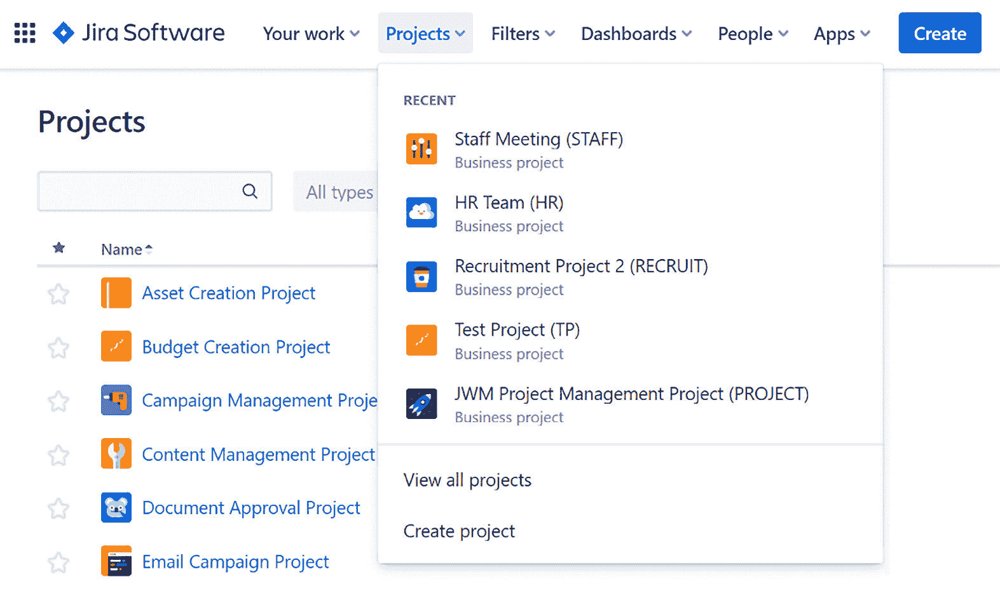

图 4.1 – 搜索项目

无论你如何导航到项目，结果通常会让你进入项目看板，就像下一节中的*图 4.2*所示。

## 看板的组成部分

如果你熟悉为 Jira 软件项目创建的板，商业项目板的一个最显著的区别是缺少**板设置**功能。从 JWM 产品的前身 Jira Core 开始，这一点就一直如此，并且目前仍然如此。

结果是，你无法更改关于板的很多功能。在这种情况下，所见即所得，这使得事情变得非常简单。那么，让我们来谈谈我们确实能看到的内容，如下图所示：

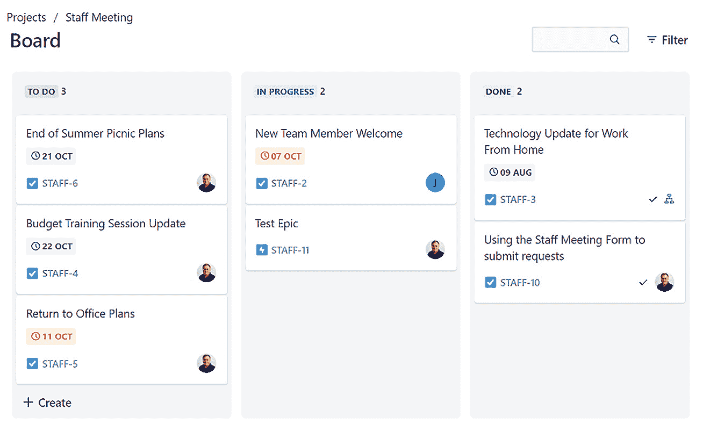

](img/Figure_4.2_B17952.jpg)

图 4.2 – 项目板

我们将从板的顶部开始，逐步向下进行：

+   **项目名称**：在任何 JWM 项目板上，你都可以在面包屑导航栏的最顶部看到项目的名称。Jira 的理念是，通过首先在项目中进行导航，最终到达项目板。

+   **搜索与过滤**：在板的界面上，你可以看到两个搜索框。一个始终位于顶部导航栏中，用于搜索整个 Jira 实例。第二个则显示在项目板上，仅用于在该板上搜索信息。

+   **列**：列代表项目工作流中的状态。每一列与工作流中的每一个状态之间有一一对应的关系。换句话说，工作流中的每个状态都会作为一列出现在板上。状态不能在板上隐藏。

+   `STAFF-4`

+   截止日期（如果该问题有截止日期）

+   被指派人（如果有的话）

+   解决方案 – 如果卡片有解决方案，这会以一个勾选标记的形式出现在卡片上。

+   子任务计数（如果该问题有子任务）

## 项目板的功能

从表面上看，项目板存在的目的是展示你在项目中正在进行的工作以及该工作的状态。除了查看卡片外，JWM 项目板的功能非常有限。但让我们看看可以做些什么。

### 更改状态

其中一个功能是，你可以通过简单地将卡片从一列拖动到另一列来快速更改问题的状态。你可以将卡片移动到哪一列取决于项目工作流中定义的过渡。我们将在本章稍后的部分详细讨论这一点。

### 搜索板

**搜索框**：位于板的顶部附近的搜索框提供了一种快速方式，可以根据问题的文本或问题键在板上查找问题。这在板上有数十张卡片可见时尤其有用。只需在搜索框中输入信息，功能将自动隐藏所有与输入内容不匹配的卡片。

例如，在框中输入`87`将会找到任何包含数字 87 的卡片，如果存在的话（`STAFF-87`、`ID-870`等）。

要在整个 Jira 实例中搜索问题，请点击顶部导航栏中的搜索框。

### 过滤问题

目前看板上有两个**快速筛选器**——**分配给我**和**本周到期**。正如您可能猜到的，点击**分配给我**筛选器将仅显示当前分配给您的卡片。

点击**本周到期**将仅显示那些在到期日期字段中有值且该值为本周的卡片。需要注意的是，如果到期日期已经过期，日期会以红色显示。对于尚未到期的卡片，日期会以黑色显示。请注意，年份不包括在内，仅显示日期和月份：

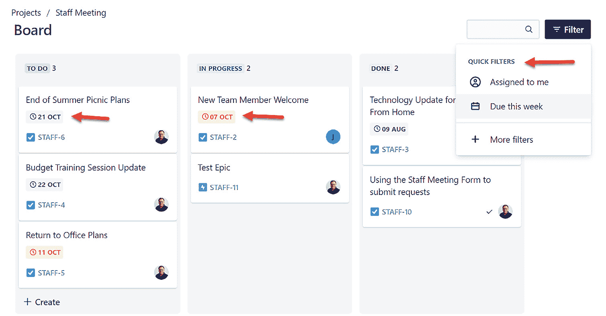

图 4.3 – 带有最近日期的看板

现在我们更熟悉看板的使用，让我们看看如何向其添加一些工作项。

### 创建问题

最后，正如我们在*第三章*中讨论的，*创建您的第一个项目*，您可以直接在看板上创建新问题。为此，点击看板第一列底部的**创建**按钮，如*图 4.3*所示。这将弹出一个新框，其中显示**开始输入**字样。

现在我们已经了解了如何使用标准看板，接下来我们来看一下如何创建第二个看板。

## 创建第二个看板

首先，我需要说明，这一步骤更为高级，确实是非常创新的思维。因此，创建的新看板不会像内置看板那样可以直接从项目中访问。我们在创建看板后会更好地理解这一点。

那么，为什么您要创建第二个看板呢？主要是因为您通过 JWM 项目创建的初始看板可定制性较差。通过第二个看板，您可以做到以下几点：

+   您可以选择为看板命名任何您喜欢的名称。

+   您可以选择使用的看板过滤器，这将让您更好地控制显示在看板上的问题。

+   您可以向看板添加自己的快速筛选器。

+   您可以控制看板上卡片侧边面板的颜色。

+   您可以控制查看看板时显示在卡片上的字段。

+   您可以更好地控制谁可以看到该看板。

首先，执行以下步骤：

1.  点击顶部导航栏中的搜索框。

1.  在显示底部选择**看板**。

1.  点击**创建看板**按钮。

1.  选择 Scrum 或 Kanban。除非您正在使用 Sprints（这在商务项目中很少见），否则点击**创建 Kanban 看板**按钮。

1.  选择**从现有项目中创建看板**选项。然后点击**下一步**。

1.  给看板命名，并选择您希望添加此新看板的项目。

1.  对于**位置**，选择**个人**，然后选择您的用户名。

1.  最后，点击**创建看板**按钮。

对于第 7 和第 8 步，您的视图大致如下所示，参见*图 4.4*：

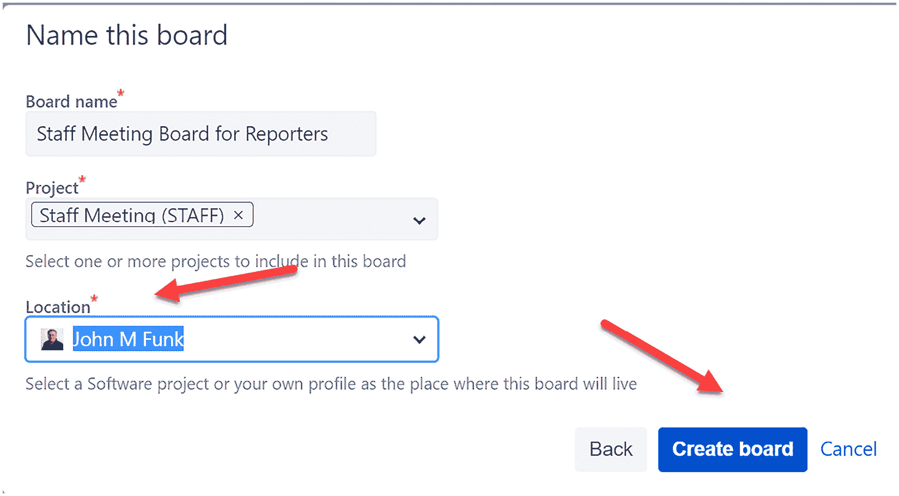

图 4.4 – 看板位置

**位置**字段是大多数管理员遇到问题的地方。由于这是一个位于主 JWM 项目看板之外的第二个看板，Jira 不允许你将任何 JWM 项目用于**位置**字段。这意味着，在你所在的看板上，你无法从左侧菜单中选择该看板。这使得其他用户很难找到该看板。我发现最好的方法是直接在浏览器中为该看板添加书签，并将网址分享给其他人。

其他用户也可以通过在[`yourdomain.atlassian.net/jira/boards`](https://yourdomain.atlassian.net/jira/boards)的看板列表中进行搜索来找到该看板，其中`yourdomain`是你 Jira 实例的域名。

是的，设置看板并与他人共享确实有些麻烦，但许多管理员和用户认为第二个看板的增强功能是值得的。要了解更多关于看板创建过程的信息，你可以参考 Atlassian 支持的指导：[`support.atlassian.com/jira-software-cloud/docs/create-a-board/`](https://support.atlassian.com/jira-software-cloud/docs/create-a-board/)。你还可以在[`support.atlassian.com/jira-software-cloud/docs/configure-a-company-managed-board/`](https://support.atlassian.com/jira-software-cloud/docs/configure-a-company-managed-board/)了解更多关于看板配置过程的信息。

接下来，我们将看到如何修改项目工作流。

# 访问并修改工作流

我们在*第二章*《与项目模板合作》中看到工作流的重要性，并在*第三章*《创建你的第一个项目》中探讨了如何访问它们。现在，我们将学习如何修改工作流以及这对看板的影响。

作为回顾，你必须是项目管理员或 Jira 管理员，才能对项目使用的工作流进行更改。如果该工作流在多个项目之间共享，你必须是 Jira 管理员才能修改共享的工作流。

我们将在本节后面看到如何在多个项目之间共享工作流。对于我们目前的目的，我们假设附加到项目的工作流是创建项目时创建的原始工作流，并且它未与任何其他项目连接。请按照以下步骤操作：

1.  要访问项目工作流方案，首先需要点击左侧菜单下方的**项目设置**：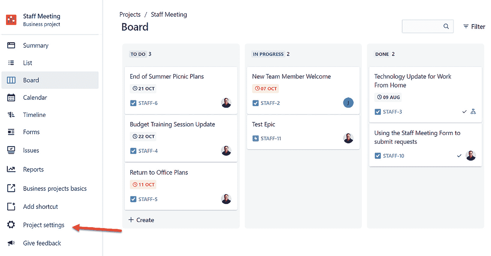

    ](img/Figure_4.5_B17952.jpg)

    图 4.5 – 项目设置

1.  同样，如果你没有看到**项目设置**菜单选项，说明你没有项目管理员权限。进入**项目设置**环境后，点击左侧菜单中的**工作流**链接。这将显示附加到项目的工作流方案，如*图 4.6*所示：

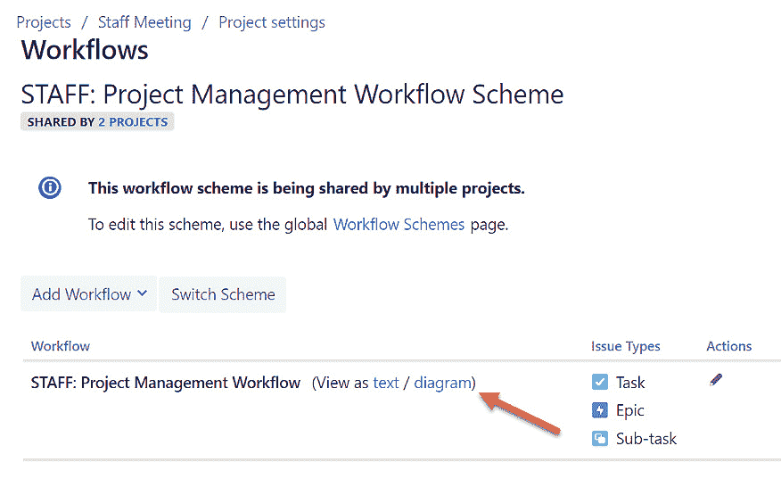

](img/Figure_4.6_B17952.jpg)

图 4.6 – 项目工作流方案

默认情况下，JWM 项目为所有问题类型创建了一个工作流。该工作流存在于一个工作流方案中，且该方案附加到项目中。因此，在前面的截图示例中，**STAFF: 项目管理工作流方案**是我们的工作流方案名称。注意，**STAFF: 项目管理工作流**确实是我们的工作流名称，并且与**任务**和**子任务**问题类型关联。

## 工作流文本视图

我们可以通过点击工作流名称旁边的**以文本查看**链接来查看工作流的文本版本，如前面的截图所示。

文本版本主要有助于查看状态之间的关系：

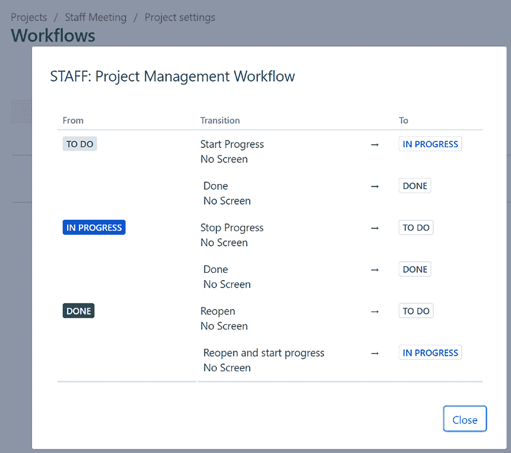

图 4.7 – 工作流文本视图

这些关系在 Jira 中被称为**转换**，并确定问题可以移动到和从哪些状态。转换在**图示**版本中显示为线条，我们在*图 4.8*中可以看到这些转换。

要查看文本版本，左侧显示工作流中的所有状态。你可以把状态看作是工作流路径上的步骤，它们显示为项目面板上的列。右侧显示每个左侧状态可以移动到的状态。例如，处于**待办**状态的问题可以移动到**进行中**状态或**完成**状态。

中间的列显示用于导航到下一个目标步骤或状态的转换名称。因此，要将问题从**待办**状态移动到**进行中**状态，你需要使用**开始进度**转换。

这些转换还会显示你是否可以从一个状态移动到另一个状态。如果两个状态之间没有转换，则无法在它们之间移动问题。我们在*图 4.7*中的示例非常简单，所有三个状态都可以相互转换。但并非所有工作流都是这样。有些工作流遵循更线性的路径，步骤必须按严格的顺序进行。

转换还将决定卡片可以移动到面板上的哪些列。如果状态之间没有转换，则无法将卡片从该列迁移到另一列。

最后，可能会添加一个屏幕，在你从一个状态移动到另一个状态，或者从一列移动到另一列时弹出。这个屏幕通常被称为转换屏幕。转换屏幕通常包含少量字段，这些字段通常表示在步骤之间移动问题所需的数据。我们将在本章后面讨论这些转换屏幕以及如何添加它们。

工作流的文本版本将标识在状态之间存在的转换屏幕的名称（如果有）。否则，它将简单地显示**无屏幕**，如我们在*图 4.7*中的示例所示。

## 工作流图示视图

如果您点击**以图表方式查看**工作流的链接，如*图 4.6*所示，您将看到工作流的更直观视图，如*图 4.8*所示：

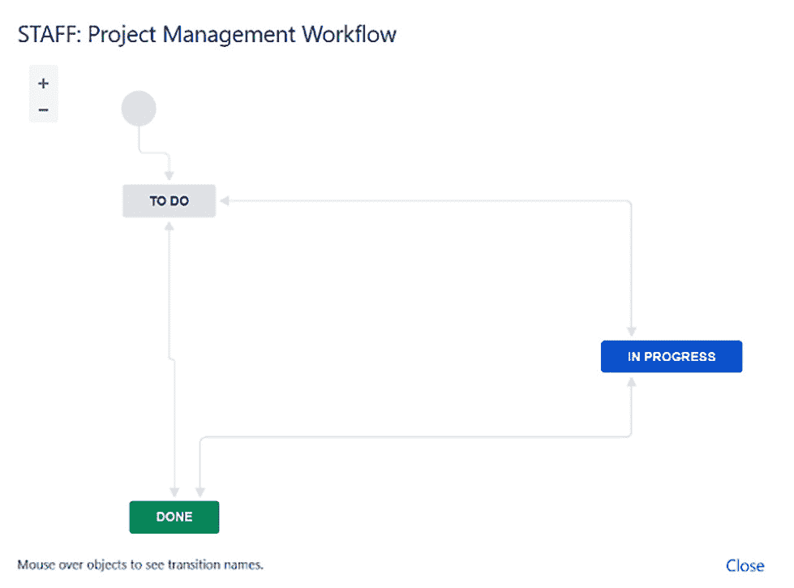

图 4.8 – 工作流图视图

图表视图通常是最容易读取和理解的视图。顶部的圆圈代表工作流的起点，圆圈到第一个状态（本例中为**待办**）的线被称为创建过渡。之前提到的状态间的线表示状态之间的过渡。

线条末端的箭头表示问题从一个状态到另一个状态可能的移动方向。因此，两个端点都有箭头的线条意味着问题可以在两个状态之间来回移动。实际上，这两条不同的过渡线各自只朝一个方向移动。它们恰好在项目模板生成的图表中重叠。我们可以在*图 4.11*中看到这两条过渡线的例子。

请查看*图 4.8*左下角的注释，说明**鼠标悬停对象查看过渡名称**。此处提到的对象是图表中状态之间的线条。要缩放图表，您只需点击视图左上方的**+**或**–**按钮。

点击之前提到的**以文本方式查看**或**以图表方式查看**的链接，将以只读模式显示工作流—您无法通过这些链接修改工作流。要修改工作流，请点击工作流方案视图右侧**操作**下方的铅笔图标，如*图 4.6*所示。

## 工作流编辑模式

**编辑模式**将以**图表**或**文本**界面显示工作流。这将允许您对工作流进行更改。如*图 4.9*所示，我们已经进入了**图表**编辑模式。我们还勾选了**显示过渡标签**框：

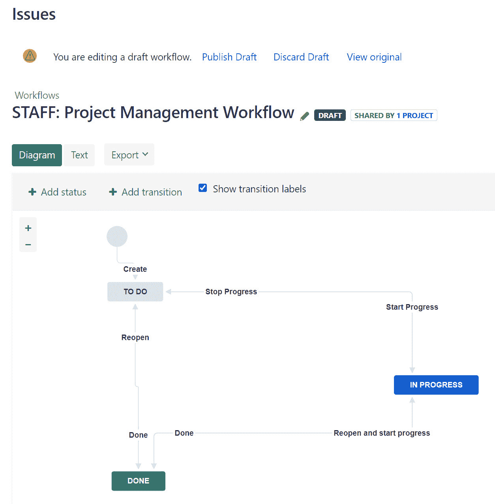

图 4.9 – 带有过渡名称的工作流图编辑模式

请注意，过渡名称与**以文本方式查看**图像中显示的名称一致，如*图 4.7*所示。同时，您会看到**您正在编辑草稿工作流**的声明，因为我们已进入编辑模式。此时，您可以进行更改，然后通过点击页面顶部的**发布草稿**链接保存修改，或者通过点击**丢弃草稿**链接放弃修改。或者，您也可以查看首次创建工作流时的原始状态。

尽管工作流名称旁边有铅笔图标，您在这里不能更改名称。点击图标会打开一个对话框，允许您为工作流添加*描述*。添加描述后，输入的文本会显示在工作流名称下方。

## 编辑工作流

此时，我们可以通过多种方式修改工作流。首先，让我们来看看这些转换。如前所述，在我们的示例中，每两个状态之间都有两个转换。这使得编辑单个转换或清晰地看到有多个转换变得更加困难。

点击其中一条线将会在图表右侧显示一个弹出框。由于**停止进度**转换位于**开始进度**转换之上，当你点击该线时，只有**停止进度**转换可以在此时进行编辑。注意，**停止进度**转换的名称会显示在弹出框中，并且在该线上以灰色框的形式展示：

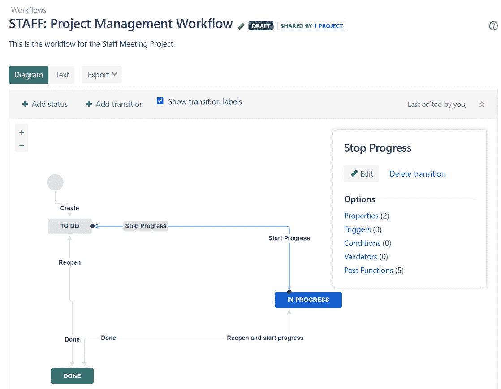

图 4.10 – 编辑工作流转换

当你选择一个转换时，你会看到在线的每一端显示一个小黑点。这些点允许你点击线的末端并将其拖动到同一状态或另一个状态的另一个圆圈。这将分开这两条线，您现在可以编辑底层的**开始进度**转换：

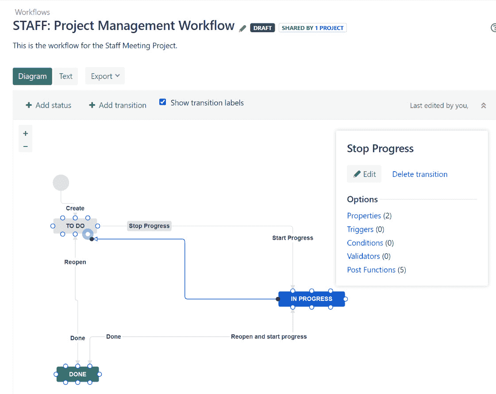

图 4.11 – 移动工作流转换

当点释放时，**停止进度**名称将会移动到转换线的新位置。*图 4.12* 显示了所有转换移动后，提供更多清晰度的结果：

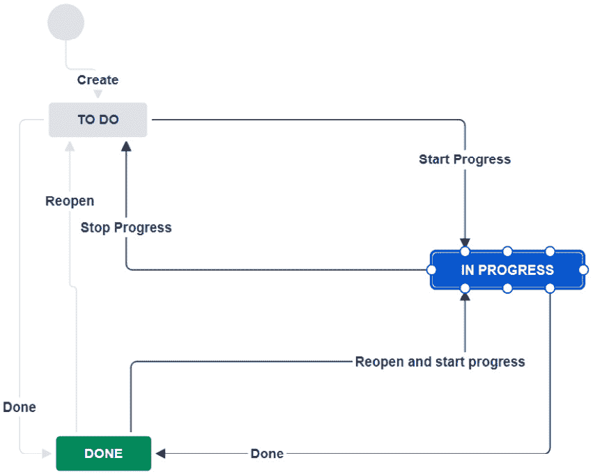

图 4.12 – 完全分离的工作流转换线

要更改转换的名称，请执行以下步骤：

1.  点击你想要更改的转换的线。

1.  点击右侧弹出框中的**编辑**按钮。

1.  通过更改**名称**字段中的文本来更改转换的名称。

1.  这也是你可以向转换添加转换屏幕的地方。此屏幕必须在此之前已经创建好，才能在此时将其链接到转换。

1.  只需点击**屏幕**下拉框并选择屏幕：

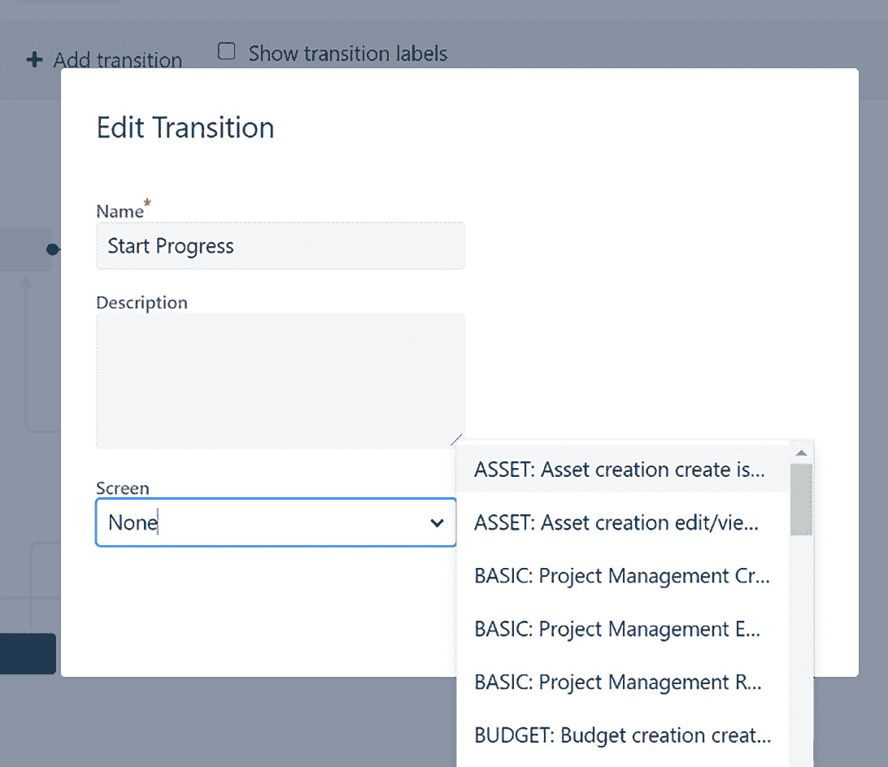

图 4.13 – 转换屏幕

触发器、条件、验证器和后置功能可以为工作流增加强大的功能。执行转换将按照列出的顺序触发每一个功能。每个功能所提供的简要描述列在这里：

+   **触发器**：触发与连接的开发工具中事件的发生

+   **条件**：控制转换是否对用户可见

+   **验证器**：在允许转换继续之前，检查输入的数据是否正确

+   **后置功能**：执行附加的过程，例如设置字段值、发送电子邮件、自动转换和添加评论

Atlassian 自己的文档提供了关于这些功能的很好的指导。您可以在[`support.atlassian.com/jira-cloud-administration/docs/configure-advanced-issue-workflows/`](https://support.atlassian.com/jira-cloud-administration/docs/configure-advanced-issue-workflows/)查看这些指导。

## 添加状态

对于我们的员工会议项目，假设我们要在项目板上添加一个新列。目的是更清晰地展示哪些演示文稿仍在准备中，哪些演示文稿已完成并已添加到下次员工会议的议程中，哪些演示文稿已完全展示并视为已完成。

要向看板添加新列，我们必须首先向工作流中添加一个新状态：

1.  我们进入前面提到的**图表**编辑模式来编辑工作流。

1.  然后，我们点击图表上方一行中的**添加状态**按钮。

需要注意的是，当我们向工作流中添加一个新状态时，我们可以从 Jira 实例中已存在的状态中选择，或者我们可以为组织创建并保存一个全新的状态。在对话框中，我们将为新状态命名为**议程中**：

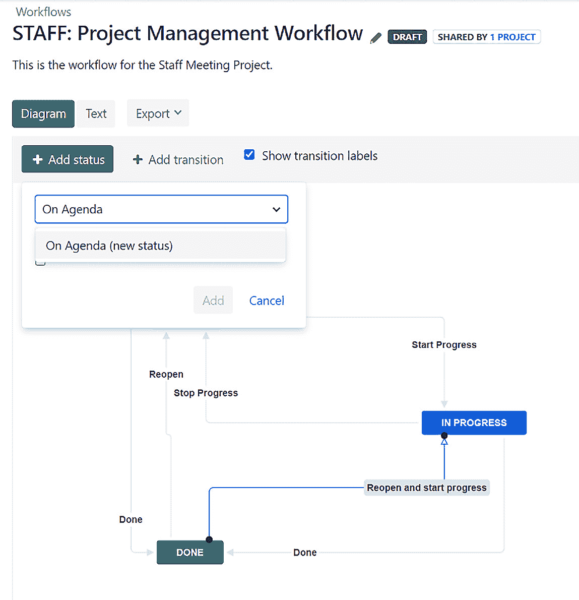

](img/Figure_4.14_B17952.jpg)

图 4.14 – 添加工作流状态

因为**议程中**状态在我们的组织中尚不存在，所以我们看到文本旁边添加了**（新状态）**字样。这是一个信息提示，说明我们必须在 Jira 实例中创建这个新状态，才能使用它。您必须点击**议程中（新状态）**文本，系统才能识别您确实在为实例添加新状态。然后点击**添加**按钮。

随后的弹出框允许我们为新的状态选择三个状态类别之一——**待办事项**、**进行中**或**已完成**。由于**议程中**表示工作尚未完全完成，我们将选择**进行中**作为**类别**：

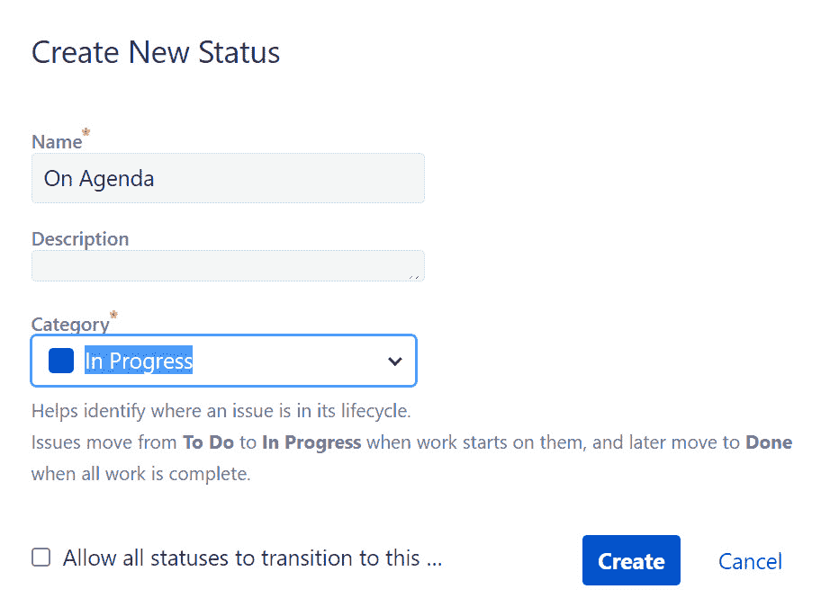

](img/Figure_4.15_B17952.jpg)

图 4.15 – 选择状态类别

我们还可以在此阶段为新状态添加**描述**，如果选择的话。最后，如果工作流应允许问题从任何其他状态移动到此状态，我们可以勾选**允许所有状态过渡到此状态**框。由于**议程中**状态的路径更线性，因此我们在此情况下将不勾选该框。

在状态添加到图表后，我们需要将新状态与现有的**进行中**状态连接起来。我们可以通过两种不同的方法实现这一点。一种方法是点击**进行中**状态并将新线拖动到**议程中**状态：

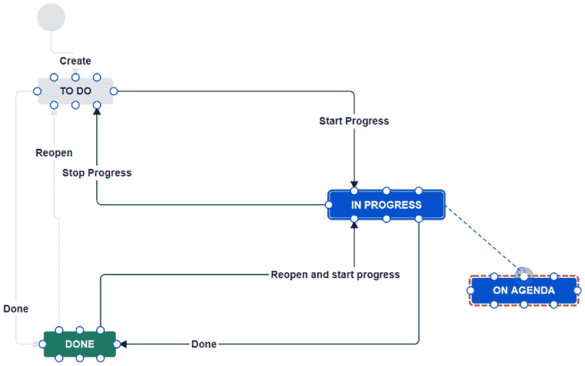

](img/Figure_4.16_B17952.jpg)

图 4.16 – 添加过渡

结果会弹出一个对话框，允许您为新的过渡命名。我们将为这个新过渡命名为`移动到议程中`：

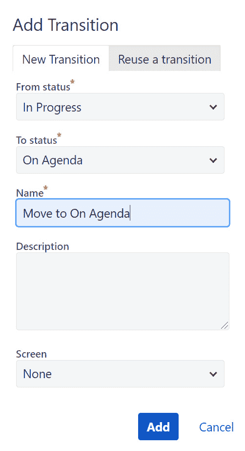

图 4.17 – 命名过渡

一定要点击**添加**按钮以保存过渡并将其添加到工作流中。添加新过渡的第二种方法是点击如*图 4.14*所示的**添加过渡**按钮。

对于我们的第二个过渡，我们将添加一个从新的**待议中**状态到现有**已完成**状态的过渡。然而，在这种情况下，我们将重用一个已经指向**已完成**的现有过渡。这样做的主要原因是，它可以通过不需要为过渡添加任何条件、验证器或后置功能，从而节省大量时间。它将在转到**已完成**状态时利用已存在的功能。此外，如果您需要修改过渡，只需要在一个地方进行更改，并将其应用于所有指向**已完成**状态的相同过渡。

注意

您必须发布包含更改的草稿工作流，以便更改应用到您的生产实例中。

最后，当我们返回项目板时，我们看到新的**待议中**状态已自动作为一列添加到板上：

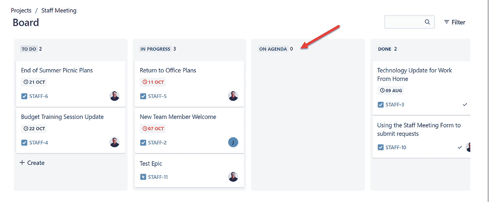

图 4.18 – 带有新状态的板视图

接下来，我们将查看可用于管理 JWM 项目的其他方案。

# JWM 项目使用的方案

用一个比喻来说，项目板和屏幕就像是汽车的车身——我们大多数人通常认为的汽车的光滑、闪亮外观。它是我们看到、触摸和展示给他人的部分。但是在 JWM 汽车的下面是车架或框架，由方案构成，这些方案设置我们的权限、控制通知和工作类型，并提供工作流等功能。

查看方案分组的最佳位置是在**项目设置**的**总结**中。要导航到该位置，请在项目中点击**项目设置**，然后选择**总结**。请记住，您必须是项目管理员才能访问并更改诸如方案之类的项目设置：

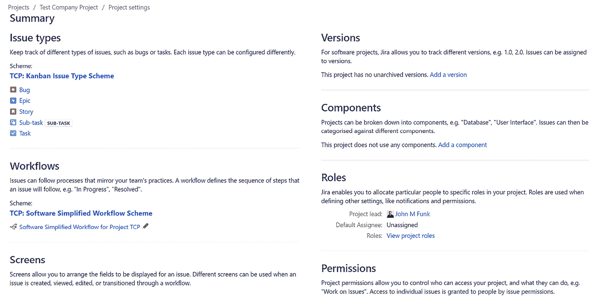

图 4.19 – 项目设置总结

不要过于纠结于试图阅读*图 4.19*中的小字；我们将讨论主要的标题。我们还应注意，这只是对方案的初步介绍。我们将在 *第八章*《配置权限与简单管理》中更加详细地学习如何修改它们。

其中一些信息已经在前面的章节中提到；然而，将方案列出并以简明的视觉方式呈现，能够更方便地比较方案目的，仍然是很有帮助的。让我们开始时先回顾一下方案的概念。

我们在*第三章*《创建你的第一个项目》中提到过，方案就像是装着与其相关的单独项目的桶。例如，**屏幕方案**桶将包含项目使用的一组屏幕。**工作流方案**将包含项目使用的一组工作流，依此类推。

有些方案位于项目级别，并且没有其下的组件。它们适用于项目中的所有问题，无论问题类型如何。其他方案则与问题类型相关，更具粒度，因此可以包含一个或多个下级组件。让我们从项目级别的方案开始，看看列表：

+   **问题类型方案**：此方案包含项目中可用的问题类型列表。所有在项目中创建的问题都必须与方案中的某个问题类型相关。由于它本质上是一个问题类型的列表，它在项目级别操作，而不是在问题类型级别。

+   **权限方案**：此方案包含项目的所有权限，控制用户对项目的访问权限以及他们在与项目交互时被允许执行的操作。它使用项目角色、单独的用户名和/或可以授予权限的组。该方案在项目级别操作。

+   **通知方案**：此方案确定在何种情况下以及将通知发送给谁。大多数通知涉及问题的创建或更改，但也会涉及工作日志或时间追踪的变化。它控制电子邮件和应用内通知。该方案在项目级别操作。

+   **问题安全方案**：此方案控制谁可以查看项目中的哪些问题。可以为项目提供多个安全级别，但每个问题只能应用一个级别。由于 Jira 中没有字段级别的安全设置，这是可以应用的最细粒度的安全级别。该方案在项目级别操作。

+   **工作流方案**：工作流确定问题从创建到最终解决的路径。一个方案可以关联多个工作流，每个工作流必须与一个或多个问题类型相关。对于 JWM 项目，项目板只能在方案中允许单个工作流才能正常运行。该方案在问题类型级别操作。

+   **屏幕方案**：此方案提供项目可用的屏幕列表。方案中可以有三种不同类型的屏幕——**创建、编辑和查看**。其中一种屏幕类型被视为默认。屏幕方案必须附加到问题类型屏幕方案上，该方案在问题类型级别确定屏幕。因此，该方案在问题类型级别操作。

+   **问题类型屏幕方案**：该方案确定哪些屏幕方案与单个或多个问题类型相关联。因此，您可以为每个问题类型设置单独的创建屏幕、单独的编辑屏幕，依此类推。当然，它不一定要细分到这种程度。您也可以有一个单一的屏幕，执行所有功能——**创建、编辑和查看**——适用于所有问题类型。这是 JWM 项目的默认配置。该方案在问题类型级别操作。

+   **字段配置方案**：该方案控制在项目中创建新问题时需要哪些字段。您可以为每个问题类型设置单独的字段配置文件，这意味着每个问题类型在创建问题时可以有不同的必填字段。字段配置文件还控制字段的描述以及文本字段的呈现类型。该方案在问题类型级别操作。

    注意

    以下所有方案将在您创建新的 JWM 项目时自动生成。每个方案都可以由项目管理员或 Jira 管理员进行修改，免费订阅的权限方案除外。

# 与 Atlassian Marketplace 应用程序一起工作

Atlassian 一直以其产品的能力而闻名。无论是 Jira 系列的旗舰产品，还是其他工具的最新收购，Atlassian 都已经收集了一系列令人印象深刻的提高生产力的应用程序。

尽管这组产品非常出色且持续发展，Atlassian 还通过 Atlassian Marketplace 为 Jira 扩展了更多功能，提供了第三方供应商的产品。这些公司和应用程序经过 Atlassian 审核，您可以额外购买，甚至可能免费获取！

Marketplace 的一个优点是，Atlassian 会处理这些供应商提供的工具的账单和付款收取。因此，您只需收到一份账单，无论是按月还是按年，其中包括您的 Atlassian 产品（如 JWM）以及任何第三方应用程序。

另一个有趣的事实是，Atlassian 内部的一些产品最初是作为 Marketplace 应用程序开始的，并且在过去几年里被 Atlassian 收购。最近一些最引人注目的工具包括**Jira 自动化**和**ProForma 表单**。虽然表单的整合仍在进行中，但自动化功能在过去几年中已经成为许多 Jira 用户的常用功能。

作为其收购的副产品，许多工具要么通过 Jira 的标准定价订阅免费提供，要么通过高级订阅提供。因此，让我们突出介绍其中几个工具。两款工具提供类似的功能，并且作为 Atlassian Platinum Marketplace Partners，它们被评为**云安全强化**工具，具有良好的安全性、可靠性以及支持响应时间。

## Innovalog Atlassian 应用的 Jira 杂项工作流扩展

**JMWE**是该工具公司 Innovalog 的缩写，该公司在 2020 年被 Atlassian 解决方案提供商巨头**Appfire**收购。JMWE 扩展了 Jira 的开箱即用工作流功能，提供了强大且易于使用的增强功能，适用于条件、验证器和后续功能。

许多功能无需编程，因此用户可以立即投入工作。通过点击即可实现自动化业务流程，简直是一瞬间的事。或者，如果需要更多功能，可以通过简单的脚本功能添加代码，构建你的条件或验证器以满足复杂需求。

在此查看市场列表并利用免费试用：[`marketplace.atlassian.com/apps/292/jira-misc-workflow-extensions-jmwe?hosting=cloud&tab=overview`](https://marketplace.atlassian.com/apps/292/jira-misc-workflow-extensions-jmwe?hosting=cloud&tab=overview)。

## Adaptavist 公司的 ScriptRunner for Jira

长期以来，**ScriptRunner**一直是 Atlassian Marketplace 中的热门工具之一，也是 Jira 用户最推荐的工具之一。

ScriptRunner 使用 Groovy 脚本和高级 JQL 来增强和自动化工作流，同时扩展 Jira 的使用。

虽然有编程背景在使用该工具时会大有帮助，但你会发现它在你获得的功能和控制力方面是无与伦比的。独特的 JQL 函数集允许你创建普通搜索无法完成的过滤器，包括批量更新功能，能为你节省大量时间。

注册免费试用或了解更多关于 ScriptRunner for Jira 的信息：[`marketplace.atlassian.com/apps/6820/scriptrunner-for-jira?hosting=cloud&tab=overview`](https://marketplace.atlassian.com/apps/6820/scriptrunner-for-jira?hosting=cloud&tab=overview)。

## 其他应用

Atlassian Marketplace 提供了数百个应用，代表了丰富的功能。这里有用于克隆、捕捉时间日志和报告、日历、电子邮件和通知、清单等应用，还有许多更多功能。你可以在此查看 Cloud 版的完整列表：[`marketplace.atlassian.com/search?hosting=cloud`](https://marketplace.atlassian.com/search?hosting=cloud)。

# 本章学习的新术语

让我们通过回顾本章学习的新术语来总结本章：

+   **触发器**：导致在连接的开发工具中发生事件。

+   **条件**：控制过渡是否对用户可见。

+   **验证器**：在允许转换继续之前，检查输入的数据是否正确。

+   **后续功能**：执行额外的过程，例如设置字段值、发送电子邮件、自动过渡和添加评论。

+   **可内联编辑的列表**：问题列表，其中许多（如果不是所有）字段都可以在列表视图中编辑，而无需打开完整的问题详情视图。

+   **快速筛选器**：简单的筛选器，用户可以直接在列表视图或看板上轻松访问。

+   **位置**：与公司管理的项目看板相关的系统字段，用于指定该看板将在哪个项目下可见。JWM 项目将使用用户的个人资料代替。

+   **Atlassian 市场**：一个网站，提供免费和付费的第三方应用程序，帮助扩展 Jira 的功能。

# 总结

正如我们所见，没有比将问题添加到项目看板并开始管理工作更好的方式来启动新项目了。

在这一章中，我们学习了如何修改看板和底层工作流，为我们提供了更大的灵活性，帮助我们更好地适应组织中的工作方式。现在你不必仅仅满足于开箱即用的功能；你可以根据需求进行修改，从而提升工作效率。

我们现在也熟悉了 JWM 模式，并理解了如何调整它们，以便更好地控制我们的项目。为了进一步增强我们的能力，我们学习了如何将 Atlassian 市场上的应用程序，如 JMWE 和 ScriptRunner，添加到本已出色的 Jira 产品系列中，以产生更大更好的成果。

在下一章中，我们将开始探索 JWM 品牌重塑后推出的新组件，如列表、日历和时间线。这些是 Jira 工具集中一些最新且最令人兴奋的工具。
