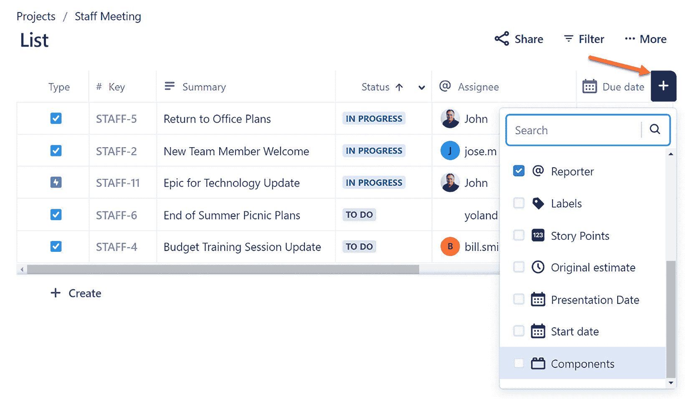
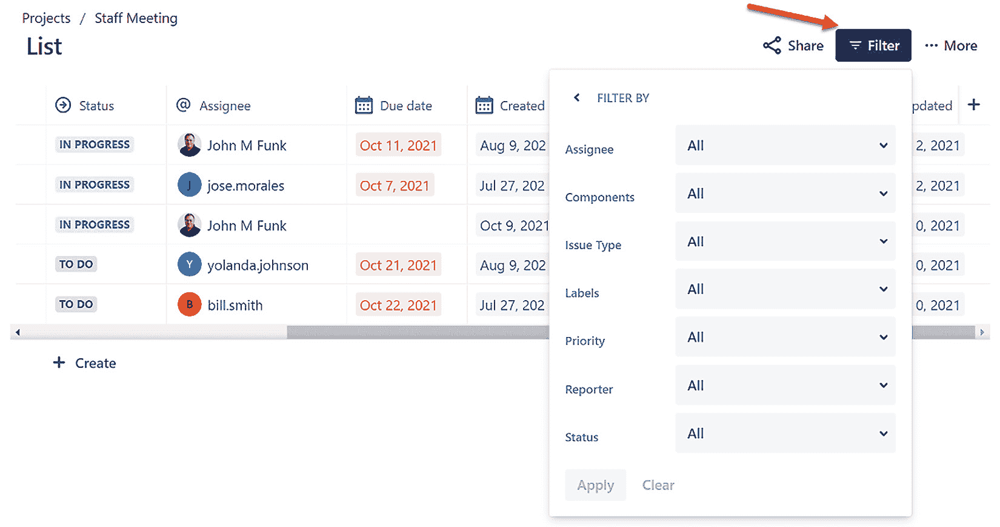
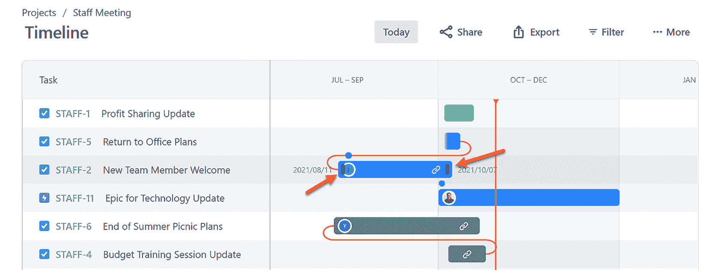
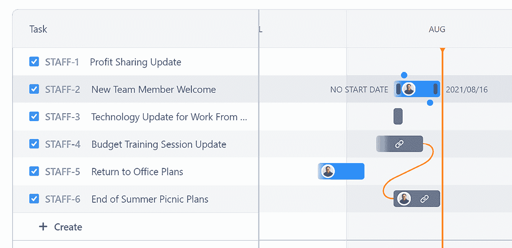

# *第五章*：JWM 工具集：概览、列表、时间轴和日历

我们花了一些时间才到这里，但现在我们终于可以看到随**Jira 工作管理**（**JWM**）项目一起提供的一些新的精彩工具。我们将在本章和下章中逐一查看这些工具，给我们足够的时间了解每个工具的功能。

当 Atlassian 首次推出 JWM 时进行了大量市场推广，而且他们通过修复初期的错误并推出额外功能增强，继续在产品更新方面做得非常出色。

如果你还没有尝试该产品，现在正是一个完美的时机。参考前面的章节来创建你的第一个项目，并添加一些问题。随着本章的进展，通过与我们讨论的多个甚至所有组件的互动，你将看到产品的真正强大。

在本章中，我们将涵盖以下主要主题：

+   JWM 的功能

+   问题及其与 JWM 功能的关系

+   JWM **概览**部分

+   使用**列表**

+   使用**时间轴**

+   向**日历**中添加问题

+   本章中学习的新术语

完成本章后，你将了解 JWM 中可用的功能，以及如何与**列表**、**时间轴**和**日历**功能进行交互。你还将理解**概览**部分的目的，以及数据是如何填充的。

# 技术要求

由于 JWM 仅在**Jira Cloud 环境**中可用，本章的要求很简单：*访问 Jira Cloud 环境*。

如果你已经有了 Jira Cloud 的访问权限，那太好了——你准备好了！如果没有，Atlassian 提供最多 10 个用户的免费 JWM 账户。你可以通过访问[`www.atlassian.com/try/cloud/signup?bundle=jira-core&edition=free`](https://www.atlassian.com/try/cloud/signup?bundle=jira-core&edition=free)并按照说明创建你的账户。

# JWM 的功能

现在，在所有的宣传过后，我们终于可以看到功能了。左侧菜单直接显示在项目名称下方，提供了一个组件列表，如下图所示：

图 5.1 – 组件列表

我们现在将简要描述各个组件，但我们将在后续部分中更深入地探讨每个组件。每个功能都有特定的目的，并提供与其他功能不同的功能。请记住，这些工具大多数仅适用于 JWM 项目：

+   **概览**：**概览**部分就是如此。它为你提供了项目中发生的活动的摘要，并附带一些关键统计信息。

+   **列表**：**列表**已经成为粉丝最爱的功能之一，提供了项目中所有问题的列表。巧妙之处在于每一列都包含了内联编辑功能。

+   **看板**：**看板**已经存在了一段时间，尽管它并不新颖，但与它相关的一些新功能是值得注意的。它为您提供了一种易于使用的**看板式**问题视图，以卡片形式展示。

+   **日历**：**日历**以日历项的形式展示问题，但包括交互式链接，允许您直接访问问题。

+   **时间线**：**时间线**是您项目中问题的路线图或**甘特式**视图，但此视图还提供了与时间线上的交互功能。

+   **表单**：在撰写本书时，只有一个表单可用，但**表单**组件提供了简易创建功能，允许项目外部或内部的用户快速创建新的问题或请求。

+   **问题**：与**看板**一样，这是一个现有的特性，但提供了其他项目中没有的功能。此外，它允许您创建过滤器并以列表或单个问题的形式查看结果。

现在我们已经了解了这些新特性，让我们看看它们与我们创建的、用于捕捉工作内容的任务之间的关系。

# 问题及其与 JWM 特性的关系

JWM 特性仅仅是我们创建的问题的视图集合，它们标识了我们需要完成的工作。问题与各种工具以其独特的方式相关联，但由于问题是描述我们所做工作的主要元素，因此这些特性是以这种功能为出发点单独开发的——换句话说，每个特性都提供了一种增强的方式来与问题互动。这引导我们选择最适合我们与一组问题一起工作的特性。

所以，我们再次提供了一个特性列表，并标明它们与问题的关系：

+   **摘要**：问题展示在与问题相关的变化背景下。这被视为活动流，或作为问题详情的静态汇总信息。该信息为只读。

+   **列表**：项目中所有问题的简单列表，可以通过应用过滤器来减少显示的内容。它还允许您直接在列表中内联编辑问题。

+   **看板**：经典的看板视图——以卡片形式展示问题，显示选定的信息。它还为您提供了每个问题在项目工作流中的状态的图形表示——无论它是刚开始还是接近完成。这是只读的，您必须点击卡片才能进行编辑。

+   **日历**：日历是只读的，以按**截止日期**展示问题的月视图。您必须点击单个问题才能进行编辑。

+   **时间线**：如前所述，这是您问题的路线图式视图。您可以直接在**时间线**上调整问题的开始或结束日期，或者添加依赖关系，但无法编辑其他数据。您必须点击**问题**键才能进行其他更改。

+   **表单**：表单仅仅是用于新工作项的输入布局，提供了一种简单的方式来创建新问题。在表单中无法查看任何问题——它仅用于创建。

+   **问题**：此视图提供了多种与问题交互的方式。在**列表**视图模式下，你可以更改问题的状态，但不能修改其他信息。**详细**视图模式允许你更改项目编辑屏幕上显示的所有字段。以下截图展示了如何选择这些视图模式：

图 5.2 – 问题：列表视图和详细视图

在以下章节中，我们将开始讨论一些功能。**Board**已经在*第四章*，*修改 Board、工作流和关联方案*中进行了介绍，部分功能将在*第六章*，*表单、问题、仪表盘和报告*中进行讲解。

# JWM 摘要部分

**摘要**部分是我们要讨论的第一个独特的 JWM 功能。然而，它也可以看作是现有功能的集合，目的是为你提供有关项目的有用信息。如果你之前使用过 Jira 中的仪表盘，那么这个功能可能与你的体验类似。如前所述，我们将在下一个章节*第六章*，*表单、问题、仪表盘和报告*中进一步探讨仪表盘。

正如你可能猜到的，**摘要**部分旨在为你提供一个项目进展的快速概览。30,000 英尺的视角比喻非常适用于这里。该功能分为两个部分：**活动**和**统计数据**。每个部分都以链接和类似标签的格式直接呈现在摘要名称下方。

如果你为项目添加了描述，它将显示在**活动**和**统计数据**链接与活动流之间。项目负责人和项目关键字信息会显示在项目描述的右侧，平行排列，具体见以下截图：

图 5.3 – 摘要部分及描述

## 活动

在项目描述下方展示的大量历史信息，类似于仪表盘中使用的活动流小部件，可能甚至完全相同。它的目的是为你提供一个易于阅读的活动流，展示 JWM 项目中所有问题的活动，这样就不必阅读发送给**观察者**的数十封甚至数百封电子邮件。

活动信息按时间顺序出现，最近的历史记录会显示在顶部。事件或变更按发生的日期进行分组。如果活动发生在最近一周内，你将看到**今天**、**星期一**或**星期五**等标题。超过一周的活动将按发生的日期进行分组，例如**8 月 9 日**或**7 月 31 日**。你可以在以下截图中看到这一概览：

图 5.4 – 概览活动

显示的数据是基于上次刷新信息时的静态数据。要进行新一次刷新，请点击列表顶部右侧的齿轮图标，然后点击**刷新**，如以下截图所示。你也可以点击**刷新**图标左侧的**扩展标记语言**（**XML**）图标，查看活动数据的**XML**源信息。要返回**概览**部分，只需点击浏览器中的返回按钮：

图 5.5 – 概览活动刷新

右侧**活动**标签下方的项目负责人和关键信息下方，还可以查看少量的统计数据。顶部部分将显示按每个问题当前状态对项目中的问题进行分组的情况。

这些信息类似于仪表板上可用的**问题统计**小工具（以**状态**作为问题统计）。彩条（在印刷书籍版本中为灰度）展示了每个状态中的问题数量与其他状态的对比。将鼠标悬停在每个条带上时，会显示该状态下的问题数量。

每个状态名称都是一个链接，点击后会带你到你所在的 Jira 实例的标准组织范围内搜索功能。它会在**Jira 问题**视图中展示与该状态对应的所有问题。这一视图将在*第六章*，“*表单、问题、仪表板和报告*”中进一步讨论。要返回**概览**部分，请点击浏览器中的**返回**按钮。

**问题状态**部分下方是另一个问题统计小工具——主要用于**优先级**。与状态类似，这个小工具会根据问题当前的优先级对问题进行分组。点击优先级名称将带你进入之前提到的标准**Jira 问题**视图。

最后，你可以将底部部分切换为额外的小工具分组——**按负责人未解决问题**。此小工具也具备相同的功能。由于底部部分包含一个下拉菜单，未来可能会有其他小工具可用。

## 统计信息

接下来，让我们看一下**统计**标签。这个显示与**活动**视图中的信息大致相同，但它呈现的是一种更类似仪表盘的视图，如下图所示。顶部还有一个区域，提供了与项目中问题相关的几个内置筛选器。点击其中任何一个筛选器，将带你进入标准的**Jira 问题**视图：

图 5.6 – 摘要统计

如你在之前的截图中所见，能够看到项目的总体情况并快速了解项目的进展非常有帮助，而且由于它是顶层菜单项，因此很容易找到。

接下来，我们将开始使用一些功能来对问题进行更改，并以各种格式展示它们。首先是**列表**。

# 使用列表

**列表**是最令人兴奋的新功能之一，提供了极好的新功能。尽管它看起来与标准的**Jira 问题**视图非常相似，但 JWM 的**列表**在于所有列都提供内联编辑功能，这一点独具特色。

这个新功能堪比**Jira 服务管理**（**JSM**）产品中的**队列**功能，因为它是该工具查看多个问题的主要方式。JSM 项目没有创建看板，且 JSM 主要是作为一种工单类型的系统，代理人员在很大程度上依赖于各种可用的队列。

对于 JWM 项目，然而，**列表**提供了一种与**看板**不同的视图，并直接在工具中增强了编辑功能。该功能仍在开发中，但我认为你会发现它是对标准 Jira 功能的一个非常受欢迎的补充。

要访问**列表**，只需点击左侧的**列表**菜单选项。**列表**将显示一组与项目可用系统字段相匹配的列。每个字段都显示为一列。默认字段列表按顺序从左到右包括以下内容：

+   **类型**

+   **键**

+   **摘要**

+   **状态**

+   **受托人**

+   **到期日期**

+   **优先级**

+   **标签**

+   **创建**

+   **更新**

+   **报告人**

你可以在以下截图中看到这些字段的一些概览：

图 5.7 – 列表

正如在*图 5.7*中所见，当你进入显示界面时，只有大约一半的字段会显示。你需要使用列表底部的滚动条来查看右侧的其他字段。

## 更改列

那么，如果你不想在**列表**视图中看到所有那些系统字段怎么办呢？如果你想看到一些自定义字段，而不是系统字段呢？好消息是——两个问题的答案是：*你可以！*

要控制在列表中显示哪些列，请点击标题列表最右侧的**+**图标。这样会显示一个下拉菜单，列出所有可用的字段（见*图 5.8*）。系统字段会首先显示，接着是你创建的任何自定义字段，位于底部。

目前，并非所有自定义字段类型都可以与**列表**一起使用。然而，大多数自定义字段类型已经可以使用。请确保向下滚动以查看所有可用字段。在将它们添加到列表中后，你将能够重新排列列表中列的顺序。

要在列表视图中添加或移除字段，只需勾选或取消勾选复选框。每次点击复选框时，结果会立即显示。你可以在以下截图中看到这个概述：

图 5.8 – 添加列

接下来，我们将看看如何更改列的顺序。

## 更改列的顺序

要更改列表中列的顺序，只需点击列名称左侧的图标并将列拖动到左边或右边。你无法移动问题类型的初始列。

## 调整列宽

在你添加或移除列/字段时，可能会发现某些列显示的宽度超出了预期。如果是这种情况，你可以通过点击标题行中分隔字段的线来调整列的宽度。这将突出显示该线从上到下，然后你可以将它向左或向右拖动以调整列宽。点击线外的区域将确定设置。以下截图演示了如何调整列宽：

图 5.9 – 调整列宽

现在，列表的一些格式化已完成，让我们来看看其他功能。

## 内联编辑

正如我们之前多次提到的，能够在列表中直接编辑字段是一个巨大的改进，应该能大大提高我们的工作效率。

需要提前说明的是，你不能直接在**列表**工具中更改问题类型或问题键。要更改屏幕上显示的任何值，只需点击该字段，如下截图所示：

图 5.10 – 内联编辑

根据字段类型，你会看到相应的更新值的方法。点击**数据类型**字段会立即显示一个日历功能，供你选择日期。点击带有值列表的字段会显示一个包含可用值的下拉菜单（参见*图 5.10*以查看示例）。点击像**指派人**这样的用户相关字段，会显示一个系统中可以分配给此项目问题的用户列表。

## 过滤问题

就像任何项目清单，通常希望限制出现在列表中的实际问题。为此，我们需要对接收到的列表应用额外的筛选器。如果没有提供任何筛选器，则您的 JWM 项目列表将包括该项目上的所有问题。要添加筛选器，请点击顶部的**筛选**图标，如下面的屏幕截图所示：

图 5.11 – 向列表添加筛选器

当你点击**筛选**图标时，初始只会显示**指派给我**、**本周到期**和**已完成项目**筛选器。这些被称为**快速筛选器**，为常见筛选提供了快捷路径。如果你想按其他字段搜索，请点击**更多筛选器**选项查看可用的其他字段。需要注意，并非所有字段目前都支持搜索/筛选。

参见*图 5.11*，示例添加其他字段。请注意，在**筛选**工具集中，您可以选择多个字段选项。这些选项将是累积的，这意味着您单击**应用**按钮时将使用所有这些选项。

筛选图标将显示当前正在使用的筛选器数量。如果您想返回到**快速筛选器**的原始列表，请点击**筛选器**左侧的返回箭头。

## 排序问题

最后，您可以根据列表中的任何列对列表进行排序。单击标题将显示**A – Z**或**Z – A**的排序选项，如下面的屏幕截图所示：

图 5.12 – 对列进行排序

尽管这有些名不副实，但即使在点击日期字段时也会有这两个选项。请意识到，它将根据**A – Z**的最近日期或**Z – A**的最远日期对列表进行排序。与筛选器不同，排序目前不是累积的。因此，您选择的最近排序将是唯一使用的排序。

如果您在项目中使用子任务，**列表**视图将显示这些任务在相关父任务下的正确缩进，以便您快速了解哪些问题属于**子任务**类型。接下来，我们将把注意力转向**时间轴**功能。

# 与时间轴一起工作

**路线图**和**甘特样式视图**长期以来在 Jira 产品系列的标准订阅中一直缺失。但在过去几年中，Atlassian 已经着力将此功能带给大众。

首先，我们看到了一个简单的路线图，显示了基于团队的软件项目。然后，**高级路线图**出现了，它跨越多个项目，但只在*高级订阅*下可用。现在，我们在 JWM 项目中看到了相当于**时间轴**的功能。

尽管它是 JWM 推出的最后一项功能，但它迅速获得了关注，并且具备了你期望在此类工具中看到的大部分功能。你可以拖动问题的起始点或结束点以增加它们的持续时间，你可以在问题之间添加依赖关系，当然，你还可以导出并与他人共享你的时间轴。

要访问**时间轴**，只需点击左侧的**时间轴**菜单选项，如下图所示：

图 5.13 – 时间轴

现在，让我们来看一下如何更改持续时间。

## 更改持续时间

与任何时间轴或甘特图样式的视图一样，你需要为你的问题设置开始日期和结束日期。JWM 项目使用**开始日期**字段来表示问题的工作开始时间，使用**截止日期**字段来表示应完成工作的结束时间。

要在**时间轴**视图中调整问题的日期范围，请点击与问题关联的矩形框的开始位置（更改开始日期）或结束位置（更改结束日期），然后相应地拖动。确保点击框的末端出现的细小句柄之一。

或者，你可以点击**问题**键进入问题的完整编辑模式。在那里，你可以更改**开始日期**或**截止日期**字段（或两者）。这将导致问题的图形显示进行延长或缩短，如下图所示：

图 5.14 – 更改日期和持续时间

## 依赖关系

没有添加工作项之间的依赖关系，任何时间轴或路线图都不完整。在 JWM 中，这是一项简单的操作。只需点击出现在问题两端的点之一，当你将鼠标悬停时，然后将该点拖动到另一个问题上。

结果将是一个弯曲的线条，将一个问题的结尾与另一个问题的开始连接，如下图所示：

图 5.15 – 时间轴依赖关系

时间轴足够直观，可以知道你正在从哪一端拖动，以创建正确类型的依赖关系。

## 时间轴过滤器

时间轴的过滤器与列表的过滤器完全相同。请参见*图 5.11*及其周围对过滤器如何工作的描述。

## 导出时间轴

导出时间轴通常是非常有用的，这样可以将其添加到用于利益相关者更新和一般状态查询的演示中。只需点击**导出**按钮，显示以下界面：

图 5.16 – 导出时间轴

此时，您可以根据周、月或季度的视图来更改时间线的视图。您还可以确定初始开始日期，以排除任何在该日期之前开始的问题。您也可以对结束日期做同样的操作。请记住，**结束日期**值实际上是问题的**到期日期**值。

## 分享时间线

除了完全导出时间线，您还可以简单地分享**统一资源定位符**（**URL**）以共享时间线，并将其直接发送给现有的 Jira 用户、Jira 团队或外部电子邮件地址。您可以添加一条消息，如果喜欢的话，点击**发送**按钮，如以下截图所示：

图 5.17 – 分享时间线

用户将收到一封电子邮件，包含指向时间线的链接。点击电子邮件中的**时间线**链接或**查看**按钮将直接带您到共享的时间线。

在本章中，我们最后一次了解 JWM 功能时，让我们看看**日历**功能。

# 将问题添加到日历

到目前为止，查看项目问题的**日历**视图需要使用第三方市场应用程序或将**日历**小工具添加到仪表板。不管哪种方式，您都无法直接在项目内部查看日历。**日历**是 JWM 添加的第一个功能之一，并且提供了在其他 Jira 产品中找不到的即时功能提升。

到目前为止，**日历**仍然相当简单，显示问题的方式灵活性较低。但仅仅是可以直接在项目中访问它，这就使它非常有用，并且我们预计 Atlassian 的 JWM 开发团队会继续推出新的功能。要显示日历，请点击左侧的**日历**菜单选项，如以下截图所示：

图 5.18 – 日历

确定问题显示在日历上哪个位置的主要驱动因素是**到期日期**字段。该问题将在与该字段关联的日期显示在日历上。如果没有应用过滤器，您将看到所有项目中的问题显示在日历上，前提是这些问题的**到期日期**字段已填写。如果**到期日期**字段没有填写，问题将不会显示在日历上。

您可以通过点击月份和年份名称旁边的左右箭头来浏览其他月份。要返回当前月份，只需点击**今天**按钮。与之前解释的过滤功能一样，请参见*图 5.11*及其相关描述，了解如何添加过滤器。

我们的最后一个功能使您能够直接从日历创建新问题——如以下截图所示的**创建问题**对话框：

图 5.19 – 日历：创建问题对话框

要打开**创建问题**对话框，双击日历中的某个日期。当对话框打开时，**到期日期**字段将自动填充为你双击的日期。

# 本章学习的新术语

让我们通过回顾本章学习的新术语来总结本章内容，如下所示：

+   **总结**：JWM 项目中的**总结**部分，显示项目中发生的统计数据和活动。

+   **列表**：JWM 项目中所有问题的列表，支持内联编辑。

+   **看板**：以看板风格呈现的项目问题视图，以卡片的形式展示。

+   **日历**：项目问题的日历视图，包括交互式链接，让你可以直接访问问题。

+   **时间线**：项目中问题的路线图或甘特图视图。

+   **表单**：一个简单的交互式界面，允许在创建问题时输入字段。

# 总结

我希望你和我一样对 Jira Core Cloud 改名为 JWM 以及现在可用的新功能感到兴奋。不仅能以不同格式查看问题，还能与它们互动并进行修改，真的是一个改变游戏规则的功能。

在本章中，我们了解了 JWM 项目中新部署的功能以及如何访问每个功能，并且熟悉了我们的工作项（问题）与每个功能的关系——它们的展示方式和相互关系。我们看到与项目相关的统计数据如何作为字段分组呈现，例如**问题类型**和**优先级**。

我们还趁机深入探讨了每个组件，进一步理解每个组件的功能，以及在查看每个功能时如何过滤问题。

在下一章中，我们将继续探索 JWM 项目中提供的功能，包括**表单**。我们还将学习如何创建和运行仪表板和报告，并且如何更详细地与问题进行交互。
