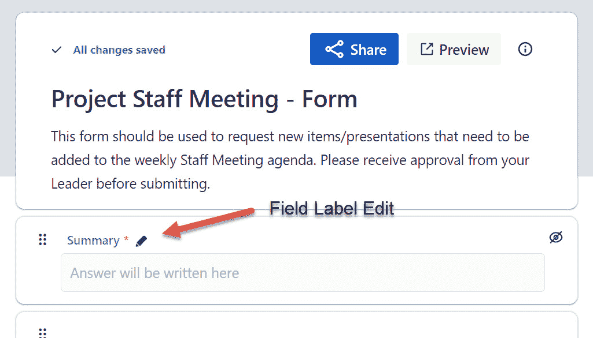

# 第六章：*第六章*：表单、问题、仪表板和报告

我们之前的章节探讨了如何创建**Jira Work Management**（**JWM**）项目和问题，这些代表了我们所做的工作。然后，我们查看了 JWM 的新工具，问题在每个工具中的表现以及它们提供的功能。

在本章中，我们将指导你如何创建一个简单的 JWM 表单，以及其他报告功能，如查看问题、使用仪表板、过滤器和内置系统报告。

本章将涵盖以下主要内容：

+   创建表单

+   查看问题

+   访问和使用报告

+   创建简单过滤器

+   实施仪表板并结合小部件

+   本章学习的新术语

完成本章后，你将能够创建一个简单的表单，允许团队内外的用户提交工作请求。虽然 Jira 提供的开箱即用的报告提供的见解不多，但你将学习如何访问并运行可用的报告。

最后，你将能够创建临时报告，形式为 Jira 过滤器，并利用这些过滤器构建信息丰富的仪表板。然后，你可以使用你关于过滤器的知识，以各种展示方式查看问题。

# 技术要求

由于 JWM 仅在 Jira Cloud 环境中可用，本章的要求很简单：*访问 Jira Cloud 环境*。

如果你已经有 Jira Cloud 的访问权限，那太好了——你准备好了！如果没有，Atlassian 为最多 10 个用户提供免费的 JWM 帐户。你可以通过访问[`www.atlassian.com/try/cloud/signup?bundle=jira-core&edition=free`](https://www.atlassian.com/try/cloud/signup?bundle=jira-core&edition=free)并按照指示进行操作来创建帐户。

# 创建表单

在 JWM 项目推出之前，没有办法在不使用第三方供应商的情况下提供组织范围内的 Jira 项目表单，而这通常意味着额外的费用。多年来，Atlassian Marketplace 上有一些可用的应用程序，还有 JSM 的门户表单，但这意味着需要为 JSM 代理支付额外的许可证费用，或者从供应商那里购买应用程序。

当然，随着 Atlassian 在 2021 年底从收购 ThinkTilt 中开始加入**ProForma 表单**功能，这一切将发生变化。本文写作时尚不清楚 ProForma 工具对 Jira 家族的影响，但预计 JWM 项目的内建表单将继续存在，与 ProForma 一同使用。

那么，使用表单到底有什么大不了的呢？表单相比于普通的**创建**按钮及其相关页面，提供了哪些优势？简单的回答是，它可以消除我们在典型请求流程中遇到的许多痛点，包括接收方和提交方的痛点。以下是一个简短的列表，更多详细信息将在后续的重点部分中介绍：

+   只请求你需要的初步信息，并以易于填写的格式呈现。(*向表单添加字段*)

+   捕获你需要的信息，消除来回发送的电子邮件。(*向表单添加字段*)

+   更改字段标签，以提供更好的上下文。(*必填字段和更改字段标签*)

+   一个易于共享的**统一资源定位符**（**URL**）地址，便于快速输入。(*共享表单*)

现在，让我们看看如何访问**表单**功能并创建一个新表单。

## 创建表单

你可以通过点击左侧菜单中的**表单**链接来访问你的表单，如下图所示：

图 6.1 – 创建表单

然后，你可以点击**创建新表单**按钮开始这个过程。让我们先看一下表单的功能，如下图所示，然后在后续段落中深入了解细节：

图 6.2 – 新表单

中间的大部分区域是你的实际表单。它将包含一些默认字段，帮助你开始。其他字段（包括你创建的任何自定义字段）位于右侧。顶部中间部分包含表单名称、描述以及共享表单的功能。

## 向表单添加字段

对用户来说，最令人沮丧的事情莫过于在创建问题时，尝试弄清楚哪些字段确实需要填写。屏幕上往往充斥着大量字段，其中大多数与表单创建过程无关。是的——你可以为用户提供一个单独的**创建**界面，显示有限的字段，但布局往往令人困惑。

许多帮助台和请求流程允许用户简单地向某个地址发送电子邮件。随后，这会导致自动在相应的项目中创建一个问题。然而，提交的信息通常缺乏接收者解决问题所需的深度和细节。

结果是，发送多封电子邮件来通过找出问题的根源来澄清问题。这不仅因可能发生的大量电子邮件而变得不切实际，而且对话变得支离破碎，发送和接收电子邮件之间的延迟浪费了大量时间。

但是，通过表单，你可以在提交请求时准确识别出需要收集的信息。只需添加你需要的新信息字段，然后将字段拖动到左侧来构建表单。将你的自定义字段添加到项目中，它们会显示在右侧，准备好使用。接着，只需简单的拖放，如下图所示：

图 6.3 – 向表单添加字段

一旦字段被添加到表单中，你可以拖动字段上下以重新排序它们在用户界面中的显示顺序。当然，如果你不再希望该字段出现在表单中，只需将其拖回到右侧的**拖动字段以构建表单**部分。

## 为表单添加描述

为了在共享表单时更加清晰，添加表单描述是个好主意，这样用户可以判断这是所需的项目和表单。如果你想让描述看起来更好，还可以使用维基风格的渲染。以下截图显示了你可以输入描述的位置：

图 6.4 – 添加表单描述

接下来，我们将看到如何标识必填字段以及如何更改字段标签。

## 必填字段和更改字段标签

能够更改用户看到的字段标签，使表单更清晰地表达字段期望值的意图。在普通的**创建**界面中，我们只能使用字段的实际名称作为标签。在这些情况下，你无法在不更改实际字段名称的情况下更改标签。但在 JWM 表单中，你只需点击铅笔图标，就可以进入编辑模式，如下截图所示：

图 6.5 – 更改字段标签

在更改标签后，字段名称将显示新名称，并紧随其后的是存储在数据库中的实际字段名称。字段名称将保留其原始值，但请求者只会看到新标签。标签将显示在字段输入框上方，如下截图所示：

图 6.6 – 更改的标签名称

还请注意，字段标签旁边有一个星号。这个星号表示该字段需要一个值才能保存和提交请求。你无法直接在 JWM 表单中设置字段为必填字段——这必须在与项目和问题类型关联的**字段配置**文件中完成。你可以在*第七章*《管理字段、屏幕和问题布局》中找到更多关于字段配置的详细信息。

## 预览表单

完成表单字段添加并进行任何美化调整（例如更改标签名称或添加描述）后，接下来是预览你的表单。当然，在与他人共享之前，查看一下你的表单总是个好主意。要查看表单，点击**预览**按钮，如之前在*图 6.6*中所见。接下来，我们将看到创建表单的预览，如下截图所示：

图 6.7 – 预览已完成的表单

点击**预览**按钮将使表单在浏览器中新标签页中打开，而你的表单布局仍然保留在原始标签页中。你可以继续修改表单，并在每次点击**预览**按钮时查看效果。

## 分享表单

现在表单看起来正常了，我们来分享它给其他人，以便他们开始使用它。为此，只需点击**分享**按钮，这将打开*图 6.8*中显示的对话框。你可以与 Jira 实例中的用户以及外部用户共享表单链接。

当你开始输入姓名或电子邮件地址时，与你输入的字符匹配的实例中的用户姓名会开始显示。你可以在姓名出现时选择它们。对于电子邮件地址，继续输入完整地址，然后点击结果以确保它被放入编辑框，如此处所示：

图 6.8 – 分享表单

你的表单现在已经可以使用了。提交的内容将作为问题添加到你的项目中，如果你有多个标准问题类型，将使用项目的默认问题类型。

在表单提交后，用户会在屏幕上收到即时通知，告知问题已被接收，如下面的截图所示：

图 6.9 – 表单提交

现在用户有了简单的方式来向你发送请求，我们来看看一些与问题互动的方式。

# 查看问题

无论你是如何接收问题的——无论是直接创建的，还是通过电子邮件或表单提交的——你都会希望能够查看它们并更新它们。如果你收到一封通知问题已创建的电子邮件，点击邮件中的链接将直接带你到该问题。

然而，有时你可能只需要查看当前问题的列表，或者甚至是过去已经完成的那些问题。在你的项目中，你只需点击一下就可以做到这一点。

无论你当前查看的是哪个功能，你都可以点击左侧的**问题**菜单选项来查看你的问题，如下图所示：

图 6.10 – 问题菜单选项

**问题**功能是从以前的 Jira Core 产品中继承过来的工具。对于以前使用过它的人来说，变化不大，但对于那些现在使用被称为 JWM 的新产品的人来说，问题有两种标准视图——**列表视图**和**详细视图**。

`通过**基本**` **筛选器界面，或者你可以切换到**Jira 查询语言**（**JQL**），Jira 内置的查询语言。**

**列表视图**之前在*图 6.10*中显示，而**详细视图**可以在下面的截图中看到，截图还显示了切换两种视图的点击位置：

图 6.11 – 细节视图，带有切换按钮

**细节视图**允许您在使用项目的**编辑**屏幕编辑单个问题的同时，显示左侧的问题列表。您可以在**列表视图**和**细节视图**中进行基本或高级搜索。接下来，我们将学习如何访问和运行报告。

# 访问和使用报告

另一个从 Jira Core 产品继承下来的功能是内置的 Jira 报告。这些报告并不专属于 JWM/业务类型项目，而是 Jira 产品家族中广泛可用的功能。然而，它们仍然能够为您的项目提供一些有价值的见解。

要访问报告列表，请点击左侧菜单中的**报告**选项，如下图所示：

图 6.12 – 访问报告

结果将显示所有可用于 JWM 项目的内置报告，如下图所示。我们鼓励您逐一探索每个报告：

图 6.13 – 报告列表

要运行报告，只需点击链接并按照接下来的步骤进行操作。如您所想，这个基本的报告功能并没有太多的功能，大多数用户最终会创建即席报告，形式为筛选器。然后，这些筛选器可以在仪表板中的各种小部件中使用，或者作为筛选器本身使用。接下来我们将探讨所有这些内容。

# 创建简单筛选器

**筛选器**是 Jira 用来搜索您实例中存在的问题，可以作为进一步洞察和报告/共享的基础，或者帮助您找到单个问题。也许最简单的方式是通过**问题视图**访问这些筛选器，如本章前面*查看问题*部分所讨论的那样。这将允许您创建一个简单的筛选器，然后立即用它查看问题列表，或者将其保存并用作构建仪表板的基础。

或者，您也可以点击位于顶部导航菜单中的搜索框。进入搜索框后，点击**高级问题搜索**链接，如下图所示。最后，您还可以点击页面底部的**筛选器**菜单选项：

图 6.14 – 创建筛选器

即使是刚接触 Jira 和 JWM 项目的新手，也能创建简单的筛选器来获取问题列表，这些列表可用于各种目的，包括仪表板中的小部件，导出为**逗号分隔值**（**CSV**）文件，甚至只是查看您完成了多少工作。

进入 Jira 的过滤器创建功能时，用户将进入基础模式的工具，如*图 6.15*所示。只需点击每个标题，并提供你希望用于结果列表的值，然后点击**搜索**。有许多内置字段已经可以使用，以加快过滤器的创建。

当你选择每个字段时，过滤器会自动构建，每个字段之间使用`AND`功能。这意味着所选的每个字段的所有值都会用于返回结果。

一个初始的过滤器尝试是只选择你正在处理的项目，然后点击**搜索**按钮，如此处所示：

图 6.15 – 基本过滤器

你也可以点击**详细视图**来查看单个问题，如我们在*图 6.11*中所见。在下图中，我们按**列表视图**进行过滤：

图 6.16 – 按列表视图过滤

对于更有经验的用户，你可以直接使用**JQL**切换到高级搜索功能。这允许你在搜索框中直接输入代码，以查看更精细的结果。如果你不熟悉 JQL，建议在尝试使用之前接受一些相关培训。可以通过 Atlassian 大学提供以下课程：[`university.atlassian.com/student/path/849533-gain-project-insights-through-jql`](https://university.atlassian.com/student/path/849533-gain-project-insights-through-jql)。

你可以通过点击**切换到基础**链接（位于**搜索**按钮右侧）来切换回基础搜索功能，如下图所示：

图 6.17 – 高级 JQL 过滤器

很可能，你会希望重复运行这些相同的过滤器，或将它们用在仪表板小组件中。因此，你需要先保存过滤器。开始该过程时，点击搜索显示顶部的**另存为**链接。

## 保存过滤器

保存过滤器非常简单。只需在`STAFF – All Issues`中提供一个唯一名称，如下图所示：

图 6.18 – 保存过滤器

当你首次保存过滤器时，只有你自己能够看到结果。如果你打算将过滤器保持私密，可以这样做，但如果你希望共享过滤器及其结果，你需要修改权限。修改权限的地方稍微有些隐藏。你需要点击过滤器屏幕顶部的**详细信息**链接，如下图所示：

图 6.19 – 过滤器权限和共享过滤器

点击**详细信息**链接后，你将进入**编辑过滤器**页面。顺便说一下，这也是你如果有需要的话可以更改过滤器名称的地方。在此页面，你还可以为过滤器添加描述。

要共享过滤器，请点击**查看者**标签下的下拉框。如*图 6.19*所示，你可以通过项目角色与与**项目**相关联的人共享过滤器，或者与已经在你的 Jira 实例中创建的**用户组**共享，或者与整个组织共享——意味着任何登录的用户。如果你希望将过滤器保持为私人使用，请选择**私人**选项。

最后，你可以为过滤器创建一个**订阅**，该订阅会根据创建时设定的计划定期通过电子邮件发送过滤器及其结果。要创建订阅，请点击**详细信息**页面中的**新建订阅**链接，如之前在*图 6.19*中所见。输入订阅的详细信息，然后点击**订阅**按钮保存，下面的截图展示了这个过程：

](img/Figure_6.20_B17952.jpg)

过滤器 6.20 – 创建过滤器订阅

在创建了一些过滤器后，你可以开始在仪表板上的各种小工具中使用这些过滤器。接下来，我们将逐步介绍如何创建仪表板并添加不同类型的小工具。

# 实施仪表板并加入小工具

**仪表板**是查看单个屏幕上多个报告的好方法。Jira 将这些小型报告称为**小工具**。小工具有多种格式——条形图、饼图、简单列表和**二维**（**2D**）透视图。要创建一个新的仪表板，请点击顶部导航菜单中的**仪表板**选项，然后选择**创建仪表板**，如下图所示：

](img/Figure_6.21_B17952.jpg)

图 6.21 – 仪表板

随后的对话框允许你为仪表板命名，并输入描述。在此页面，你还可以使用我们之前讨论过的相同权限功能来共享仪表板（参见*图 6.19*）。我已将其命名为`Staff Meeting Dashboard`，如以下截图所示：

](img/Figure_6.22_B17952.jpg)

图 6.22 – 命名并共享仪表板

点击**保存**按钮后，你将看到最初创建的仪表板。默认情况下，布局为双列仪表板。你可以将布局更改为单列、三列或双列布局，可以选择将右列或左列设置为更宽。点击**更改布局**按钮，选择你想要的布局，如下图所示：

](img/Figure_6.23_B17952.jpg)

图 6.23 – 更改仪表板布局

我们将继续使用两列布局作为我们这里的示例。我们的下一步是添加一些小工具。所以，点击屏幕一侧的**添加新小工具**链接。初始的小工具列表会非常小。你需要点击**加载所有小工具**选项，以查看更完整的列表，如下图所示：

图 6.24 – 加载所有小工具

结果列表将显示超过 30 个选项。每个选项的左侧会有一个缩略图，帮助你了解最终报告的样子。小工具的名称和简短描述会显示在中间部分。请确保向下滚动字母顺序列表，查看所有可用的小工具。点击每个所需小工具右侧的**添加小工具**按钮。

当你点击**添加小工具**按钮后，相同的列表屏幕将继续显示。这使你可以在不返回列表选择后续选项的情况下，选择多个小工具。选定所有你想要的小工具后，点击**关闭**按钮，如下图所示：

图 6.25 – 添加小工具

每个小工具在配置页面中会有不同的参数，用于捕获筛选器、列标题等详细信息。在你完成配置时，这些应该是自解释的。

一旦小工具被添加并输入了参数，结果将显示（参见随后完成的仪表板，见*图 6.26*）。

然而，很可能你需要修改小工具以添加额外的信息、更改筛选器、添加新列等等。要做到这一点，点击小工具右上角的三个点（省略号）菜单，然后选择**配置**。这将带你回到小工具的配置页面，如下图所示：

图 6.26 – 配置小工具

一旦你进入配置页面，你可以更改筛选器、所使用的字段等等。由于每个小工具的配置页面不同，所以下面截图显示了一个使用三个独立小工具完成的仪表板示例，展示了可用的小工具的多样性：

图 6.27 – 完成的仪表板

我想你会发现，一个布局良好、包含总结和详细信息等多种类型小工具的仪表板，是与利益相关者和其他人共享项目数据的一个很好的方式。

# 本章学到的新术语

让我们通过回顾在本章中学到的一些新术语来结束本章，具体如下：

+   **仪表板**：多个报告（称为小工具）的整合显示。

+   **小工具**：通常基于过滤器，这些迷你报告可以显示为列表、图形、图表、透视表等。

+   **ProForma 表单**：一个应用程序或插件，提供对标准表单的广泛自定义。

+   **订阅**：可以定期通过电子邮件发送给选定用户的过滤结果。

# 摘要

基本上，到目前为止，你已经掌握了创建项目所需的所有知识，并能够以多种方式与这些问题进行互动，帮助管理你的工作。在本章中，我们学习了如何构建一个表单，它将为你团队内部或外部的人提供一个便捷的工作请求方式。我们还了解了如何使用**问题**功能以及报告功能。这使你能够以一种提供良好数据的方式查看问题，并且可以更精确地搜索。

最后，我们学习了仪表盘如何为你和利益相关者提供易于阅读的小工具，展示你的工作总数和分组，或作为易于使用的图形，如饼图和条形图。这些仪表盘提供了数据的实时视图，所有数据都集中在一个位置。这非常有益，因为你无需额外的演示软件或复制粘贴操作来将 Jira 数据转换为其他格式。

在下一章中，我们将学习如何为全组织创建额外的屏幕和自定义字段，并且如何修改这些屏幕。这将在理解相关屏幕方案和问题类型屏幕方案的背景下进行。最后，我们将看到如何改变屏幕的布局，以便根据需要使它们对你的项目独特。
