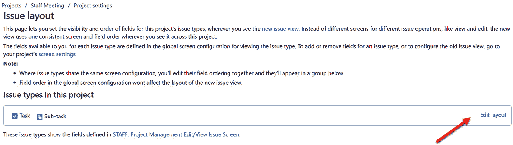

# 第七章：*第七章*：管理字段、屏幕和问题布局

我们之前的章节探讨了如何创建**Jira 工作管理**（**JWM**）*项目*和*问题*，它们代表我们所做的工作。然后，我们查看了 JWM 中的新工具，问题在每个工具中的显示方式以及这些工具提供的功能。

本章涵盖自定义字段的创建及其基本功能，以及可以创建的字段类型。我们还将探讨在创建新的 JWM 项目时，*屏幕*会自动创建哪些内容。接下来，我们将了解如何将自定义字段添加到屏幕中。

我们将讨论*问题布局*、问题屏幕的不同部分以及如何重新排列屏幕上的字段。本章还涵盖了自定义字段上下文以及如何根据项目和问题类型的组合限制字段在屏幕上的显示。

本章将涵盖以下主要内容：

+   自定义字段

+   使用屏幕查看和编辑工作

+   问题布局如何影响屏幕上的字段

+   屏幕方案

本章结束时，你将了解如何创建新的自定义字段，如何将字段添加到项目中的屏幕上，以及 JWM 中屏幕的基本功能。你还将能够修改问题布局中的字段，例如，将字段在屏幕的不同部分之间移动。

最后，你将了解项目中与屏幕相关的方案以及哪些方案类型与项目链接。

# 技术要求

由于 JWM 仅在**Jira Cloud**环境中可用，本章的技术要求很简单：

+   访问 Jira Cloud 环境

如果你已经有访问 Jira Cloud 的权限，那太好了——你准备好了！如果没有，**Atlassian**为最多 10 个用户提供免费的 JWM 帐户。你可以通过以下链接创建帐户：[`www.atlassian.com/try/cloud/signup?bundle=jira-core&edition=free`](https://www.atlassian.com/try/cloud/signup?bundle=jira-core&edition=free)。

现在，让我们从查看自定义字段开始。

# 创建和使用自定义字段

在修改 JWM 项目时，你可以使用的最灵活的选项之一就是创建*自定义字段*。有几种不同的字段类型可供选择，以下是一些最常用的：

+   **日期选择器**：这仅用于日期，不包括时间，尽管还有一种额外的字段类型可以包括日期和时间。

+   **数字字段**：这创建一个简单的数字字段，允许小数但不允许逗号。

+   **单选按钮**：这创建一个传统的单选按钮字段，你需要提供可选的选项。

+   **用户选择器（单个用户）**：这创建一个下拉菜单，用于选择系统中的单个许可用户。

+   **用户选择器（多个用户）**：这创建一个字段，允许选择多个用户，你可以通过输入用户姓名的首字母来开始选择。选择后，你可以继续输入并添加更多的用户名。

+   **段落**：这将创建一个段落样式的字段，用于输入文本。它支持富文本渲染。

+   **短文本**：这创建一个普通文本字段，仅支持纯文本。

+   **选择列表（单选）**：这创建一个您提供的值的下拉列表。

+   **选择列表（多选）**：这与多用户选择列表类似，您可以提供可能的值列表。您可以在列表中选择多个项目，但一次只能选择一个。

+   **选择列表（级联）**：这创建了另一种选择列表，您可以提供列表值。然而，第二个字段的值取决于第一个字段中输入的值。

接下来，让我们看看可以在哪里访问自定义字段。

图 7.1 – 设置菜单

要创建一个新的自定义字段或修改现有字段，您需要是 JWM 管理员。要访问自定义字段功能，请按照以下步骤操作：

1.  选择右上角的齿轮图标以打开顶部导航栏最右侧的**设置**菜单。

1.  然后，选择**问题**选项。

1.  最后，点击**自定义字段**。

到达下一个屏幕后，点击左侧菜单中的**自定义字段**，如*图 7.2*所示：

图 7.2 – 自定义字段选项

点击**自定义字段**将打开一个屏幕，显示实例中所有当前自定义字段的列表。您可以使用搜索框查找特定的自定义字段或验证是否已存在具有该名称的字段。

要创建一个新的自定义字段，请点击屏幕右上角的**创建自定义字段**按钮：

图 7.3 – 创建自定义字段

此时，您将看到可用字段类型的列表。请注意，在左侧，默认情况下是标准的字段类型列表。您还可以点击**全部**或**高级**来查看更多字段类型。

对于我们的示例，我们将通过点击**日期选择器**选择日期选择器字段类型。选择后，点击**下一步**按钮继续到下一步：

图 7.4 – 自定义字段类型

注意

一旦创建了自定义字段，您无法更改或转换其类型。如果在创建字段时错误地选择了错误的字段类型，或者如果您改变了对首选类型的看法，则需要创建一个新字段。

尽管这似乎不按顺序进行，但您在输入字段名称之前需要选择字段类型。*图 7.5* 显示了允许您为自定义字段添加这些值的**名称**和**描述**字段：

图 7.5 – 命名自定义字段

在我们的示例中，我们选择将字段命名为`Presentation Date`。选择了字段类型并为自定义字段添加了名称后，点击**创建**按钮（如*图 7.5*所示）。你的新自定义字段现在已创建！

然而，新的字段在任何屏幕上都不会立即显示。因此，字段创建后的下一个界面将允许你立即将字段添加到现有的屏幕上。

## 向屏幕添加字段

若要将字段添加到实例中的所有屏幕，你可以点击**标签**标题右侧的框，如*图 7.6*中箭头指示的地方。这是一种方便的方法，可以在不需要逐一点击每个框的情况下将字段添加到多个屏幕中。你最终可能会有几十个甚至几百个屏幕，因此这是一种快速的方法：

图 7.6 – 向屏幕添加自定义字段

当然，你可能只希望将字段添加到单个屏幕或几个屏幕。为此，在搜索框中输入你想要缩小范围的屏幕名称。随着字母的输入，列表会立即过滤并显示与搜索匹配的屏幕。

然后，选择每个所需屏幕的复选框，点击`Staff`以将自定义字段链接到 STAFF 项目屏幕。

注

你可能会有创建每个项目中每个屏幕所需的每个新自定义字段的冲动。然而，过多的自定义字段会减慢系统的速度。因此，创建新的自定义字段应该谨慎进行。

让我们看看如何限制自定义字段对系统的影响，以及它们如何能明确输入的预期值。

## 编辑自定义字段的上下文

当然，一旦创建了自定义字段并将其链接到一个屏幕，你可能需要编辑有关该字段的信息。然而，你首先要做的事情之一是编辑与字段相关的*上下文*。

要编辑字段的上下文，我们需要返回到自定义字段的列表（如*图 7.2*所示）。在搜索框中输入一些文字，查找你的新字段。同样，我们将以`Presentation Date`字段作为示例。

当你显示出所需的字段后，点击字段行右侧的省略号菜单（**…**），然后选择**上下文和默认值**：

图 7.7 – 配置自定义字段

结果屏幕将显示多个部分，包括*问题*类型和*项目*的列表。

*上下文*将把字段与项目和/或问题类型链接起来。将字段连接到至少一个项目或至少一个问题类型将大大有助于解决与自定义字段相关的系统资源问题。对于项目和问题类型都为全局的字段，系统负担较重，可能导致错误和性能变慢：

图 7.8 – 更新字段上下文

要选择一个问题类型或项目，只需在相应部分中搜索其名称并点击它。如果您想在该部分中选择多个值，请确保在点击第二个及以后的值时按住*Ctrl*（PC）或*Command*（Mac）键。

最后，点击**修改**按钮保存对上下文的更改。如果您想切换回没有选择任何值的状态，可以点击**问题类型**下的**任何问题类型**值，或者在**项目**部分选择**全局上下文**单选按钮。

要更改自定义字段的名称，请返回字段列表并从省略号（**…**）菜单中选择**编辑详细信息**。然后，简单地更改名称。请注意，更改字段名称可能会导致自动化规则或工作流后功能失败：

图 7.9 – 更改自定义字段名称

接下来，我们将学习如何在项目屏幕上排列我们的新自定义字段。

# 使用屏幕查看和编辑您的工作

在自定义字段创建过程中，您可以选择屏幕（或不选择）来包含您的字段。然而，当您为字段选择一个屏幕时，该字段将简单地被放置在该屏幕字段列表的底部。也许您希望将字段移动到屏幕的不同位置，或者可能在创建过程中选择不将该字段与任何屏幕关联。

无论如何，让我们探索一下如何在自定义字段创建完成后进行这些修改。要访问屏幕，请前往**设置** | **问题** | **屏幕**。这将显示*图 7.10*所示的屏幕：

图 7.10 – 识别屏幕

只需在搜索框中输入要查找的屏幕的文本，匹配的屏幕将自动出现。重要的是要认识到，可能会有不同的屏幕可供我们的项目使用。

对于大多数 JWM 项目，将为该项目创建两个默认屏幕：**创建问题屏幕**和**编辑/查看问题屏幕**。对于某些项目，可能会创建一个额外的**解决问题屏幕**。这两个默认屏幕的区别在于，您在创建新问题时可能希望使用较少或不同的字段，而编辑现有问题时可能需要更多字段。使用较少的字段通常可以为创建问题的人提供更清晰和更简单的输入值。

要编辑屏幕上显示的字段或重新排列其顺序，只需点击屏幕名称。此时，将出现**配置屏幕**窗口：

图 7.11 – 向屏幕添加字段

要添加字段，只需开始输入字段的名称，值将开始显示。以我们的示例为例，我们添加了之前创建的`演示日期`字段。当值出现时，点击字段名称。要重新排列字段出现的顺序，点击左侧的拖动柄，将字段向上或向下拖动。

接下来，我们将查看屏幕的各个部分，以及如何将字段移动到屏幕上的不同区域。*图 7.12* 显示了屏幕的各个部分，后面跟着对每个部分的简短描述：

图 7.12 – 编辑屏幕上的字段

让我们来看一下屏幕的每个部分：

1.  **上下文部分**：默认情况下，这部分包含所有非段落/多行文本字段。包括以下字段类型：数字、日期、用户选择器、选择列表和单行文本。

1.  **描述部分**：默认情况下，这部分仅包含段落或多行文本字段和**摘要**字段。

1.  **隐藏字段**：这包含如果没有值则隐藏的字段。点击**更多字段**链接将显示或隐藏字段。

1.  **附件**：如果您希望能够为问题添加附件，屏幕上必须显示**附加**按钮。此部分还包含**创建子任务**和**链接问题**按钮。

1.  **评论和历史**：**活动**部分包含了大量信息。点击**评论**标签将显示已添加到问题的所有评论。**历史**标签将显示自问题创建以来发生的所有更改。**工作日志**标签将显示已记录或计入该问题的任何时间。

尽管附件和活动部分实际上并不是添加或移动字段的部分，但它们显示了与问题字段相关的信息。

注意

屏幕上的字段顺序将应用于所有使用该屏幕的项目。然而，您可以使用**问题布局**工具来为您的项目单独重新排列字段，而不影响其他项目。

现在我们已经了解了如何创建自定义字段并将其添加到屏幕，接下来，我们将看到如何在相关项目的屏幕上移动字段。

# 问题布局如何影响屏幕上的字段

若要仅修改用于您项目的屏幕字段布局，请在**项目设置**屏幕中点击左侧菜单中的**问题布局**链接。您必须是项目管理员才能访问项目设置并修改问题布局：

图 7.13 – 在项目设置窗口中的问题布局链接

选择此选项后，您将进入**问题布局**屏幕，如*图 7.14*所示。如果您的项目中有多个问题类型的屏幕，您将能够编辑每个屏幕的布局。有关问题类型屏幕方案的更多详细信息，请参见本章末尾的*图 7.16*：

图 7.14 – 编辑问题布局

要修改屏幕上字段的位置，只需点击**编辑布局**链接，这个链接位于**问题布局**屏幕的右侧（*图 7.14*）。

在**问题布局**屏幕上，您可以将字段从一个部分拖到另一个部分。*图 7.15*突出了这些部分，接下来我们将详细列出它们：

图 7.15 – 问题布局屏幕的各个部分

让我们详细看看每一个：

1.  **描述字段**：这与**描述**部分相关，之前在*图 7.12*中看到过。尽管该部分原本包含多行文本字段，但您可以将其他类型的字段拖放到此部分，**状态**字段除外。

1.  **上下文字段**：这与**上下文**部分相关，之前在*图 7.12*中看到过。您可以将其他类型的字段拖放到此部分，包括**描述字段**。然而，您不能将**摘要**字段移动到此部分。

1.  **空时隐藏**：这与**隐藏字段**部分相关，之前在*图 7.12*中看到过。如果该字段没有值，位于该部分的字段将不会在屏幕上显示。

1.  **隐藏字段**：该部分中的字段将完全不在此项目的屏幕上显示。

1.  **屏幕名称**：如果您想编辑问题布局中使用的基础屏幕，请点击此链接。

1.  **保存更改**：当您完成所有更改时，务必点击**保存更改**按钮。

在最后一个部分，我们将看到如何将屏幕分组为*方案*，以便附加到项目中。

# 屏幕方案

我们通过简单地创建屏幕开始了将屏幕添加到项目中的过程。然而，屏幕不能直接附加到项目上以开始使用。首先，它必须添加到一个屏幕方案中。正如我们在*第四章*《修改看板、工作流和相关方案》中看到的那样，*方案*可以看作是一个包含各种项目的容器。因此，*屏幕方案*就是由多个屏幕组成的方案。

所以，我们的**STAFF: 项目管理**屏幕方案包含了**创建问题屏幕**和**编辑/查看问题屏幕**，如我们在*图 7.10*中看到的。

*图 7.16*展示了从**设置** | **问题路径**访问的相关屏幕组件。因为多个问题类型可以连接到一个项目，并且每个问题类型可以关联一个单独的屏幕方案，所以这些都连接在一个名为*问题类型屏幕方案*的第二个方案中。

图 7.16 – 问题类型窗口

该方案随后会附加到项目上，而不是单独的屏幕。*图 7.17*展示了屏幕与相关方案之间的关系：

图 7.17 – 屏幕方案层级

当你创建 JWM 项目时，这些屏幕和屏幕方案会自动创建并相互关联。我们简要讨论一下这个结构。如果你从头开始构建这些连接，你将按照以下过程进行：

1.  创建你的基本屏幕，并将所需的字段添加到屏幕中。

1.  创建屏幕方案——该方案将基于你在*步骤 1*中创建的屏幕。

1.  创建问题类型屏幕方案——该方案将基于你在*步骤 2*中创建的屏幕方案。

关于屏幕与问题类型之间关系的另一个描述，可以参考 Atlassian 文档中的[`bit.ly/3BBuzCq`](https://bit.ly/3BBuzCq)。尽管该符号用于 Atlassian **数据中心**和**服务器**，但图形和描述对于**Jira** **Cloud**仍然适用。

# 本章学习的新术语

让我们通过回顾一下我们学习的新术语来总结本章：

+   **自定义字段**：这些是各种类型的字段，如文本、数字、下拉列表和用户列表，它们被创建并分配给一个*上下文*。这些字段可以出现在多个屏幕上。

+   **上下文**：这些链接字段与项目和/或问题类型相关联。

# 摘要

在本章中，我们学习了如何创建新的自定义字段，将它们附加到现有屏幕上，并配置屏幕的布局，以便将字段放置在适当的区域。所有这些都能提供更流畅的用户体验，因为字段可以出现在更具逻辑的上下文中。我们还看到了如何配置自定义字段，以避免通过将每个字段与项目和/或问题类型关联来占用系统资源。

在下一章中，我们将学习如何为用户分配权限，以及如何进行简单的系统和项目管理。
