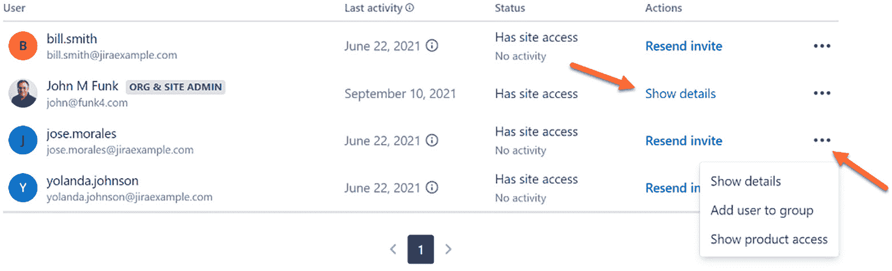
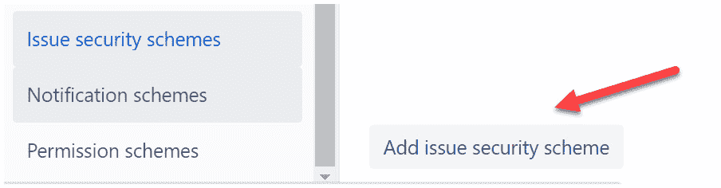

# *第八章*：配置权限与简单管理

现在我们已经启动并运行了项目，并添加了新的自定义字段来提供更多关于我们问题的洞察，我们需要能够共享项目和问题的访问权限。这将包括创建或邀请新用户并将他们放入适当的组中。然后，你可以根据用户的账户或所在的组来为其分配项目权限。

本章涵盖了如何为免费账户和付费账户配置权限的细节，并说明如何在项目中应用额外的安全性。接着，我们将简要讨论一些我们尚未学习的简单项目管理功能。

**Jira 工作管理**根据你的账户是免费账户还是付费账户，在权限和信息访问方面有所不同。此外，我们还将看到基于免费和付费账户在简单项目管理中的一些细微差异，以及在 Jira 的更高系统或全局级别上可以管理的内容。

在本章中，我们将覆盖以下主要内容：

+   添加用户并创建组

+   项目角色与权限

+   配置权限方案

+   应用问题级别安全

+   JWM 项目管理员权限

+   Jira 管理员与项目管理员

完成本章后，你将学会如何邀请新用户，并将项目角色和用户添加到角色中。一旦这些设置完成，你将能够访问和修改**权限方案**，以便使用这些角色和用户，接着学习如何创建并应用问题安全级别。

为了能够更全面地管理你的项目，你将学习项目管理员的权限，并了解 Jira 管理员与项目管理员权限之间的区别。

# 技术要求

由于 Jira 工作管理仅在 Jira Cloud 环境中提供，本章的要求很简单：*访问 Jira Cloud 环境*。

Atlassian 提供最多可容纳 10 名用户的免费 Jira 工作管理账户。你可以通过访问[`www.atlassian.com/try/cloud/signup?bundle=jira-core&edition=free`](https://www.atlassian.com/try/cloud/signup?bundle=jira-core&edition=free)并按照指示进行注册来创建你的账户。

# 用户管理

当你首次为 Jira 设置一个新实例/站点时——在此情况下，为 Jira 工作管理设置一个新实例——注册时使用的电子邮件地址将创建一个 Jira 管理员、组织管理员和站点管理员的用户。每个角色的简要描述如下：

+   **Jira 管理员**：Jira 管理员可以在你访问的产品内，在系统级别和项目级别进行所有更改。这些通常被称为**全局权限**。然而，他们不能授予用户加入你实例的权限。

+   **组织管理员**：当你创建一个新的实例/站点时，一个组织也会被自动创建。最初，它的名称将与您的站点相同。组织管理员可以添加其他组织管理员，创建系统级别的**API 密钥**，验证站点的**域名**，实现 **Atlassian Access**，并控制您域名下的已管理用户**目录**。

+   **站点管理员**：站点管理员可以通过邀请用户加入实例来授予用户访问实例中产品的权限。相应地，他们还可以停用用户对这些产品的访问权限。他们还可以创建**组**并将用户分配到这些组中。

要访问 Jira 的用户管理功能，您必须是站点管理员。只有获得其他站点管理员授权的用户才能成为站点管理员。要将某个用户设置为站点管理员，只需将该用户放入 **站点管理员** 组下的 **用户管理** 中。

要访问用户管理功能，请点击顶部导航栏中的 **设置** 齿轮图标，然后选择 **用户管理**，如*图 8.1*所示：

![图 8.1 – 用户管理]

](img/Figure_8.1_B17952.jpg)

图 8.1 – 用户管理

结果会将你带到屏幕底部的当前用户列表，并在屏幕顶部显示一个可以邀请新用户的区域。如*图 8.2*所示，邀请用户有两种不同的方式。

一种方式是简单地开始在显示的中间区域添加受邀者的电子邮件地址，每个框中填写一个电子邮件地址。受邀者将收到一封电子邮件，需验证账户并接受邀请。在电子邮件被收件人验证之前，无法为用户创建帐户。要发送电子邮件，请点击该区域底部的 **邀请团队成员** 按钮：

![图 8.2 – 邀请用户]

](img/Figure_8.2_B17952.jpg)

图 8.2 – 邀请用户

邀请用户的第二种方式是点击屏幕顶部的 **邀请用户** 按钮。这将打开*图 8.3*所示的对话框。

这种方式为你提供了更多灵活性，能够在邀请被接受时自动分配哪些组和权限给用户。只需输入未来用户的电子邮件地址，选择用户可以访问的角色和产品，并包含任何组。

你可以从三种角色中选择一个。每个角色的描述将在屏幕上显示如下：

+   **基础**：只能访问你指定的产品

+   **受信任**：可以更新产品设置，添加新产品，并邀请基本用户使用产品

+   **站点管理员**：可以管理你的站点，决定用户访问权限，并更新账单详情（如你）。

*图 8.3* 显示了如何邀请新用户加入你的实例。你可以邀请一个或多个用户：

![图 8.3 – 用户信息]

](img/Figure_8.3_B17952.jpg)

图 8.3 – 用户信息

如果你还没有创建任何额外的用户组（我们将在本节稍后进行），你初始添加组的选项将是：

+   **jira-software-users**：这是在 Jira 工作管理中执行功能所需的最基本访问级别。如果用户不在这个组中，他们将无法访问产品。

+   **jira-administrators**：这赋予用户管理 Jira 实例中各项功能的权限，比如屏幕、定制字段、问题类型和工作流等。

+   **site-admins**：如上所述，这赋予用户添加/删除其他用户的权限，并创建组以及维护其成员资格。

+   **管理员**：这基本上是 jira-administrators 和 site-admins 角色的组合，赋予用户对系统的完全访问权限。有时也称为*超级用户*。

一旦你添加了一个邮箱地址（或多个），将会出现一条声明，如之前在*图 8.3*中所示，声明内容为：**允许使用这些邮箱域名的任何账户加入你的网站，你可以随时编辑这些设置**。然后，它会列出顶部框中列出的每个域名。

你不应选择你无法控制的任何域名，例如 gmail.com。点击其中一个邮箱域名框将允许任何该域名下的邮箱地址的人在无需邀请的情况下直接访问系统。

最后，你可以个性化发送给顶部输入的邮箱地址（们）的邀请邮件，方法是点击**个性化邮件邀请**链接。当你准备好发送邮件时，点击**邀请 1 个用户**按钮。这个数字会根据上面输入的邮箱数而变化。

一旦你邀请了用户，他们将作为用户被添加到系统中。新用户将显示在屏幕底部，如之前在*图 8.2*中所示。底部部分的截图如*图 8.4*所示。

## 用户列表

用户列表提供了一些非常有用的信息，包括**最后活动**日期（基本上是指用户最后一次登录的时间）、**状态**（用户是否处于活动状态），最后，在**操作**下，是否用户接受了邀请：

](img/Figure_8.4_B17952.jpg)

图 8.4 – 用户列表

另外，你可以点击**显示详情**查看活动用户的更多个人信息，例如该用户属于哪些组以及他们在系统中的当前角色（同样的**角色**显示在*图 8.3*中）。你可以在该用户详细页面上将用户添加到某个组，或者你也可以点击省略号菜单（三个点）并在此时添加。

接下来，我们将按照步骤创建新组。在左侧菜单中点击**用户组**：

](img/Figure_8.5_B17952.jpg)

图 8.5 – 用户组

结果会将您带到**组**页面，显示系统中当前所有组的列表。同样，当您首次设置 Jira 实例时，系统中将只创建少数几个组。要添加新组，请点击屏幕右上方的**创建组**按钮：

图 8.6 – 创建组

当您到达如*图 8.7*所示的屏幕时，您将能够输入`Staff Meeting Access`，我们将稍后用于问题级别的安全性。此组将代表可以访问所有员工会议项目问题的用户：

图 8.7 – 组名

您可以勾选**在下一步中添加成员**的复选框，将用户与组关联，或者稍后返回该组添加成员名称。准备好后，点击**创建组**按钮以完成组的创建。接下来，我们将讨论项目角色和权限。

重要提示

目前，创建组后无法更改组名，因此在添加组名时要谨慎。此问题已被列入 Atlassian 的修复计划中，将在未来修复。

# 项目角色和权限

与任何系统一样，您需要一些基本的身份验证和权限管理能力来确保信息的第一层安全性。在您创建 Jira/Jira Work Management 的初始实例时，Jira Cloud 会为您提供用户身份验证。身份验证简单来说就是验证用户在登录系统时是否为其真实身份。

随着组织的成长，您可以使用 Atlassian Access 工具扩展此功能，以提供更多对用户设置和身份验证过程的控制。更多信息请参见[`www.atlassian.com/software/access`](https://www.atlassian.com/software/access)。

有两种方法可以控制对项目的访问，这两种方法都涉及**权限方案**。一种方式是直接在权限方案中处理所有权限，通过直接授予个别用户或组权限来管理权限。

但这是最不建议的方法，因为它会妨碍将权限方案与具有不同用户的项目共享。如果您改为使用项目角色来修改权限方案，这将为您提供更多共享方案的灵活性。现在我们来看看第二个选项：

1.  要修改项目中与角色关联的人员，您必须是项目管理员。

1.  接下来，您将点击**项目设置**，如*图 8.8*所示：

    图 8.8 – 项目设置

1.  当您进入**项目设置**时，选择**人员**选项。如果您使用的是**免费**计划，您将无法修改权限或更改任何项目中的人员角色：

    图 8.9 – 人员 – 免费计划

1.  如果你使用的是任何级别的**付费**计划，你将能够在整个实例中调整权限，包括所有项目。在进入**人员**页面时，你将看到所有访问该项目的团队和/或个人用户的列表，以及他们所附加的项目角色：

    图 8.10 – 人员 – 付费计划与角色

1.  点击**角色**下拉菜单，显示你实例中已创建的所有项目角色。项目角色是在全局级别创建的。要添加新的项目角色，你必须是 Jira 管理员。然后，转到**设置** | **系统** | **项目角色**。

1.  搜索框允许你在屏幕上显示长列表的情况下，查找团队和用户。或者，你可以点击我们之前创建的`Staff Meeting Access`团队，将其分配为**团队**角色：

    图 8.11 – 添加人员

1.  在**添加人员**对话框中，简单地在顶部框中添加一个团队或用户名，然后为该用户选择角色。

    重要提示

    添加新人员或团队时，你只能选择一个角色。

1.  一旦新人员或团队被添加并分配角色，你可以更新该人员/团队，以关联更多角色，包括一次性添加多个角色：

图 8.12 – 为用户添加角色

将用户或团队添加到项目角色是控制项目访问的首选方法。通过这种方式，项目管理员可以直接控制授予用户访问权限。相反，修改权限方案需要更高级别的 Jira 管理员角色来进行更改。

说到这里，让我们把注意力转向*配置权限方案*。

# 配置权限方案

你可以通过两种不同方式访问权限方案。这两种方式都从进入**项目设置**开始，如*图 8.13*所示。

图 8.13 – 配置权限方案

在项目设置中，你可以点击左侧菜单中的**摘要**选项，然后在**摘要**的**权限**部分选择权限方案名称。

另外，你也可以从左侧菜单中选择**权限**选项，直接进入权限方案设置。有关如何选择这些选项，请参见*图 8.13*以获取更清晰的说明。

重要提示

记住，如果你使用的是免费计划，你将无法修改权限方案。所有免费计划下的用户都会自动成为所有项目的项目管理员。只有付费计划允许修改权限方案。以下部分假设你使用的是付费计划。

进入权限方案后，您可以查看项目的所有权限，以及哪些用户、组或项目角色被授予了这些权限。此时，您有两个选项——第一个是**编辑权限**，即修改哪些用户、组或项目角色与该权限相关联。其次，您可以**将项目链接**到另一个权限方案。后者意味着新的权限方案将是共享方案：

图 8.14 – 编辑权限方案

请注意，如果您的实例中安装了任何市场应用，所有权限方案中将为项目角色**Atlassian-addons-project-access**添加一个项目角色。这是为了让应用正常工作并对您的项目进行必要的修改：

图 8.15 – 授予权限

点击**编辑权限**选项将带您进入*图 8.15*中的对话框。要移除当前的权限，只需点击**移除**链接并选择要移除的权限。要添加新权限，请点击**编辑**选项，这将显示**授予权限**的弹出屏幕。

如*图 8.15*所示，您可以授予的权限有多种选项。一旦做出选择，点击屏幕底部的**授予**按钮。

## 权限助手

一旦您的权限设置好并符合要求，您仍可能会遇到个别用户无法访问项目问题的情况。

重要提示

不能过分夸张地说，Atlassian 提供了一个非常强大的功能，帮助追踪问题。

要使用该功能，请点击之前在*图 8.14*中显示的**权限助手**选项。当**权限助手**屏幕显示时，只需填写**用户**、**问题**和**权限**字段，然后点击屏幕底部的**提交**按钮：

图 8.16 – 权限助手

屏幕底部将显示验证，表明该用户已拥有访问权限，或者显示如何解决问题的建议。**权限助手**适用于免费和付费计划。

在最后一节中，我们将探讨如何将安全性应用到问题级别，从而使不同的用户可以访问同一项目中的不同问题。

# 应用问题级别安全性

有时，您可能希望对项目应用更精细的安全性。以下是一些例子：希望问题的报告者只能看到他们自己创建的问题，而不能看到其他问题；希望问题的指派人只能看到他们的任务；或者只有特定用户组可以基于标签或组件看到问题。

所有这些都可以通过 **问题安全性** 实现。要访问此功能，请进入 **项目设置**，然后在左侧菜单中选择 **问题安全性**，如以下截图所示：

图 8.17 – 问题安全性

对于免费计划用户，屏幕显示如下：

图 8.18 – 免费计划用户的问题安全性

图 8.16 注意事项

免费计划无法更改实例内的权限，包括问题安全性。

对于付费版，当您希望向项目添加问题安全方案时，您必须通过全局权限路径首先创建该方案，这意味着您必须是 Jira 管理员才能创建该方案。转到 **设置** | **问题** | **问题安全方案**。在那里，您将看到现有安全方案的列表（如果有的话），并且列表底部将有一个 **添加问题安全方案** 按钮：

图 8.19 – 添加问题安全方案

此时，您可以输入新方案的名称，并在需要时添加描述。完成后，单击 **添加** 按钮创建方案，如 *图 8.20* 所示：

图 8.20 – 问题安全方案名称

创建新的问题安全方案后，您需要返回项目的 **项目设置** 并在左侧菜单中选择 **问题安全性**，如之前在 *图 8.21* 中所示。进入 **问题安全性** 屏幕后，点击 **操作** 菜单，选择 **选择方案** 选项将您的新方案链接到项目：

图 8.21 – 将安全方案链接到项目

在将方案链接到项目后，**操作** 菜单下的选项看起来非常类似于权限方案可用的选项。您可以将此项目连接到不同的问题安全方案，该方案可能已连接到另一个项目。因此，您将共享该方案。

共享方案有助于系统维护，因为您可以在一个地方而不是两个（或三个或四个或更多地方）进行更改！在我们公司，有数十个产品团队项目链接到同一个共享方案。如果决定跨项目共享方案，则这是进行更改的地方。另一种选择是编辑当前的问题安全方案，如 *图 8.22* 所示：

图 8.22 – 编辑问题安全性

点击**编辑问题安全性**选项后，你需要为新的方案创建一个新的安全级别。每个方案中可以有多个安全级别，这使你能够为项目中的不同问题设置不同的安全策略。

给你的安全级别命名，并添加描述（如果需要）。准备好后，点击**添加安全级别**按钮以创建安全级别：

图 8.23 – 添加安全级别

新级别创建完成后，你需要点击**添加**按钮来标识谁有权访问此安全级别：

图 8.24 – 问题安全选项

结果将是一个对话框，允许你通过包括单个用户、组、自定义字段中的值、项目角色等来将人员添加到安全级别中。例如，点击**组**并添加管理员的值，可以让所有具有 Jira 管理员权限的人员访问该级别所附加的问题。

其他例子包括选择**报告人**或**受让人**，这将允许当前处于这些字段中的用户查看和访问该问题。换句话说，如果用户不是报告人或受让人，他们将无法查看该问题：

图 8.25 – 编辑问题安全性

如果使用问题安全性，建议至少为方案添加一个默认的安全级别。这样可以确保所有新创建的问题都将附加到安全级别上。有关默认值链接的位置，请参见*图 8.24*。

现在我们可以确保项目安全并为特定人员提供访问权限，让我们来看看作为项目管理员可以执行的一些其他功能。

# JWM 项目管理员能力

拥有项目管理权限听起来很了不起，但实际上管理员能够执行的功能并不多。事实上，列表相当小。当然，大多数权限方案将授予项目管理员一些特殊权限，而其他用户或项目角色则没有这些权限。

以下内容突出了项目管理员功能中最常用或最知名的方面，但并非详尽无遗。你可以通过查阅 Atlassian 自己的文档来获取更多信息，但这将帮助你入门：

+   **项目角色**：正如本章*项目角色与权限*部分中所讨论的那样，项目管理员可以将用户添加到项目中并为其分配不同的角色。

+   **组件**：组件是每个项目特有的，有助于对项目中进行的工作进行分类。项目管理员可以在项目中创建和删除组件。

+   **版本和发布**：与组件类似，版本和发布是项目独有的，可以由项目管理员添加和删除。

+   **问题布局和屏幕**：如果某个屏幕仅在单个项目中使用，项目管理员将能够进行一些更改。然而，项目管理员将有能力直接更改问题布局，如第七章《管理字段、屏幕和问题布局》中所讨论的。

+   **工作流**：类似于屏幕，如果工作流与一个项目唯一关联，项目管理员可以对其进行更改。

现在，我们通过简要回顾 Jira 管理员和项目管理员可用的功能来结束本章。

# Jira 管理员与项目管理员

再次强调，这不是一个详尽无遗的列表，您可以查阅 Atlassian 的文档获取更多细节。然而，您可以将 Jira 管理员的功能视为更具全球性的性质，这意味着它们会影响整个 Jira 实例/站点。

Jira 管理员可以对共享方案（工作流、屏幕和问题类型）进行更改，创建自定义字段，编辑权限方案，更改共享仪表板和过滤器的所有权，以及其他系统级功能。

对于 JWM，项目管理员可以对项目中的非共享对象和项目角色进行更改，但不能更改项目使用的权限方案。*图 8.26* 显示了一个非常简短的表格，列出了 Jira 管理员和项目管理员可用的权限。简而言之，Jira 管理员可以在整个 Jira 实例中进行全局更改，而项目管理员只能在拥有项目管理员角色的项目中进行更改：

图 8.26 – Jira 管理员与项目管理员权限

所有这些对于免费订阅来说都有一个警告：实例中的所有用户都是项目管理员。

# 本章学习的新术语

让我们通过回顾本章中学习的新术语来总结本章内容：

+   **Jira 管理员**：Jira 管理员可以在用户已获得访问权限的产品中，对您的 Jira 实例中的系统级和项目级进行所有更改。

+   **组织管理员**：组织管理员可以添加其他组织管理员，创建系统级 API 密钥，验证站点的域名，实施 Atlassian Access，并控制您域的托管用户目录。

+   **站点管理员**：站点管理员可以通过邀请用户进入实例来激活或停用用户对实例中产品的访问权限。他/她还可以创建组并将用户分配到这些组。

+   **免费计划**：一个不收费的 JWM 计划，限于 10 个活跃用户，并且没有可配置的权限。

+   **付费计划**：JWM 提供多种计划，适用于不同级别的用户。所有计划都为您的 JWM 产品管理员提供最灵活的选项。

+   **问题安全**：可以在问题级别应用的安全性，完全授权或隐藏用户访问问题。

+   **项目角色**：项目管理员可以将用户添加到项目中，并将其分配到不同的角色。

+   **组件**：组件是每个项目特有的，有助于对项目中的工作进行分类。

+   **版本与发布**：版本和发布是项目特有的，项目管理员可以添加或删除它们。它们按发布将问题分组，并可以用于从看板中移除问题。

# 摘要

在本章中，我们学习了站点管理员如何邀请新用户加入 Jira 组织，以及项目管理员如何将用户添加到项目中，并将其分配到角色以授予其项目权限。我们还了解了权限方案及其与项目角色、用户组和用户的关系。

接着，我们深入探讨了如何利用问题级别安全作为权限方案上的一层安全功能。最后，我们了解了 Jira 管理员和项目管理员可以执行的一些不同功能，以及每个角色的独特之处。

在下一章，我们将学习如何将现有的 Jira 项目迁移到 JWM 项目，使用共享方案，并与外部功能协作。
