# 第九章：*第九章*：复制项目并跳出框架思考

到目前为止，我们已经探索并学习了如何通过利用 JWM 的标准或开箱即用功能，快速启动并运行 **Jira Work Management**（**JWM**）。这通常意味着通过点击几个按钮并添加一些文本，直接在产品中创建项目和问题。

本章将走出常规，探讨如何在工具外部创建问题。这为我们提供了灵活性，帮助我们的客户和内部团队成员将工作请求提交给我们，同时减少了开始新工作的摩擦。

如果你已经在使用 Jira Software 和/或 **Jira Service Management**（**JSM**）项目，但希望利用 JWM 的酷炫新功能来处理现有工作，我们将学习如何将现有项目迁移到 JWM。最后，我们还将再次看看一个市场应用，帮助基于现有问题创建新问题。

在本章中，我们将涵盖以下主要内容：

+   基于现有项目创建项目

+   使用共享方案

+   在外部创建问题

+   将现有的 Jira 项目迁移到 JWM

+   使用市场应用 – Jira 深度克隆

完成本章后，你将学会如何基于现有项目创建新项目，并如何使用共享方案进行模拟。你还将学习一些从系统外部创建问题的替代方法，以及如何将 Jira 中的项目迁移到 JWM。

让我们开始吧！

# 技术要求

由于 JWM 仅在 Jira Cloud 环境中可用，本章的要求很简单：*你必须有访问 Jira Cloud 环境的权限*。

Atlassian 提供最多 10 个用户的免费 JWM 账户。你可以通过访问[`www.atlassian.com/try/cloud/signup?bundle=jira-core&edition=free`](https://www.atlassian.com/try/cloud/signup?bundle=jira-core&edition=free)并按照提供的说明创建账户。

# 基于现有项目创建项目

虽然我们已经看到，JWM 提供了大量的项目模板，可以快速创建项目，但通常在项目创建后，我们会调整这些初始设置。这可能包括修改工作流或调整/添加屏幕上的字段。

在这一阶段，如果我们之后创建的类似项目能够利用我们所做的更改，那会很有帮助。实际上，我们已经为我们的项目创建了一个新的*模板*。那么，问题是，我们如何利用附加到现有项目的更改对象来创建新项目呢？

答案是基于现有项目创建一个新项目。让我们来学习如何做到这一点：

1.  首先，我们将像往常一样开始；也就是说，通过点击顶部导航栏中的**项目**选项并选择**创建项目**来开始：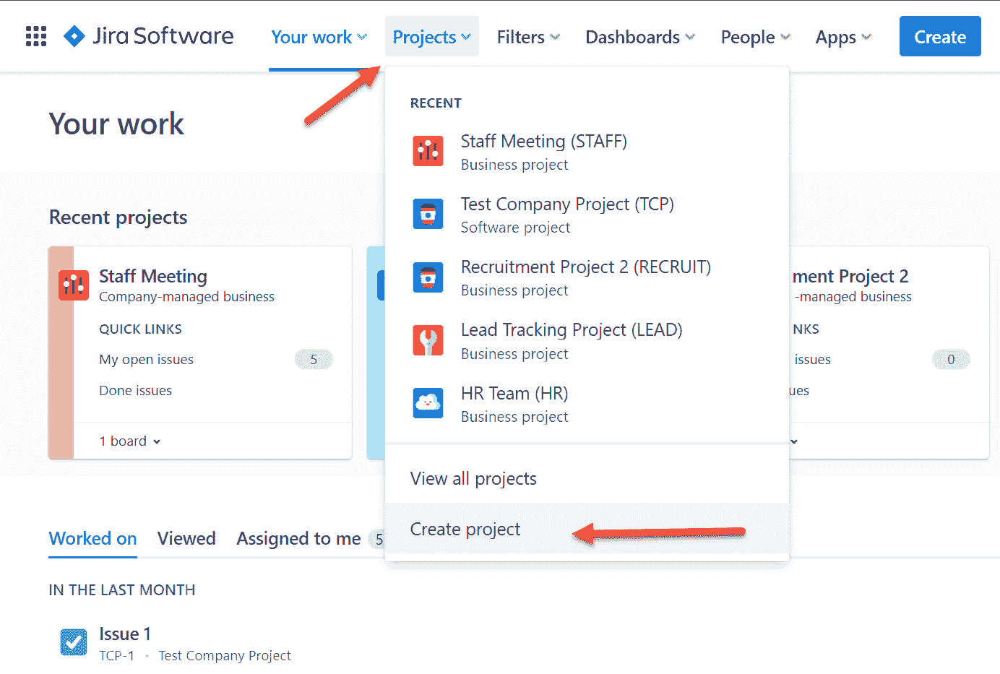

    图 9.1 – 创建项目

1.  这将引导我们进入在*第二章*中看到的 JWM 模板组，*使用项目模板*。为了探索另一种方式进入这些模板，我们可以点击屏幕左下角的**Jira 工作管理**。

1.  再次，所有 JWM 项目模板的列表将会显示出来，如下图所示。在我们的场景中，假设我们想为技术部门的月度会议创建一个新项目。我们已经决定它应该遵循我们为员工会议项目设置的相同模式。从这里，我们必须选择**项目管理**：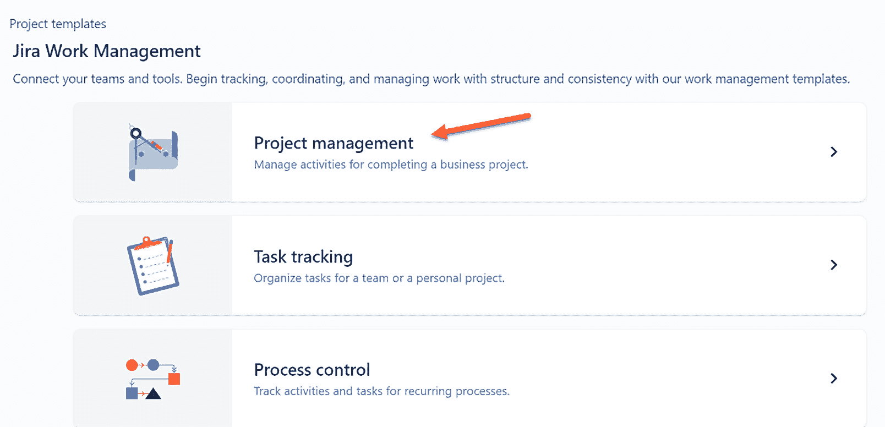

    图 9.2 – JWM 项目模板

1.  一旦我们进入下一个屏幕，我们只需点击屏幕顶部或底部的**使用模板**按钮：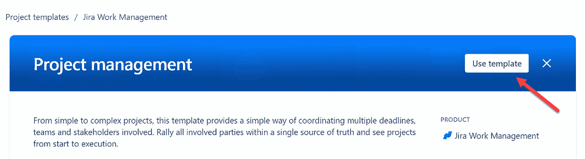

    图 9.3 – 使用模板

1.  最后，**添加项目详细信息**页面将会显示。请注意，如果你使用的是免费订阅计划，你会再次遇到一个不同之处：基于现有项目创建新项目对于这些计划不可用：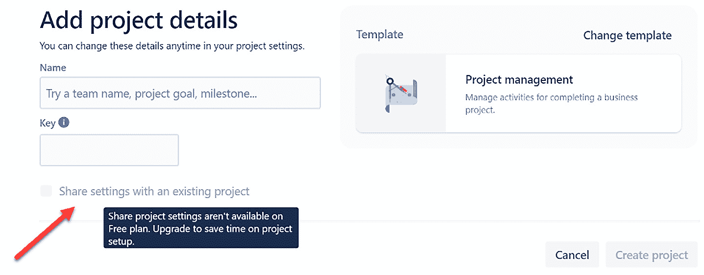

    图 9.4 – 添加项目详细信息

1.  让我们继续查看付费订阅用户的流程。输入新项目的**名称**以及项目的**键**，就像平常一样。然而，这里有一个不同的地方：勾选**与现有项目共享设置**的选项框，如上图所示。

1.  勾选此框后，你将看到一个下拉框。点击该框并向下滚动，选择你想要基于其创建新项目的现有项目。以我们的例子为例，我们将选择**员工会议**项目。之后，点击**创建项目**按钮来完成项目创建：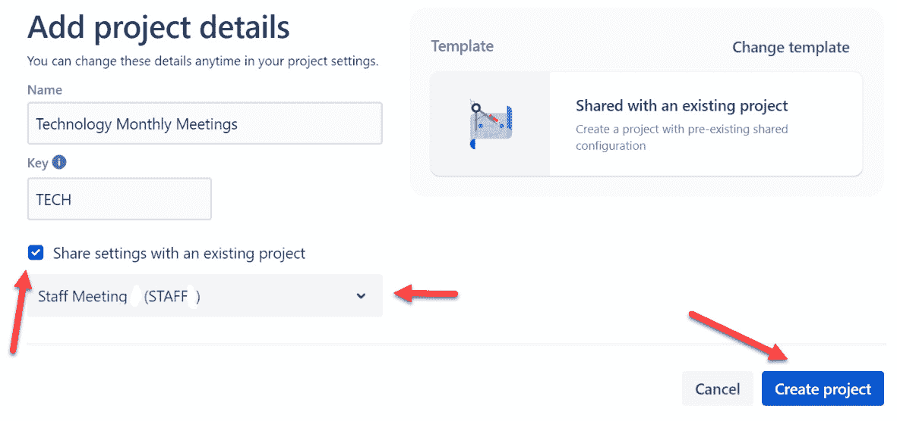

    图 9.5 – 创建项目

1.  项目创建完成后，你将直接进入项目的新看板，正如我们在*第三章*中看到的，*创建你的第一个项目*。请注意新项目的名称出现在顶部的面包屑导航中。另外，注意这看起来与我们为原始**员工会议**项目创建的看板完全相同：

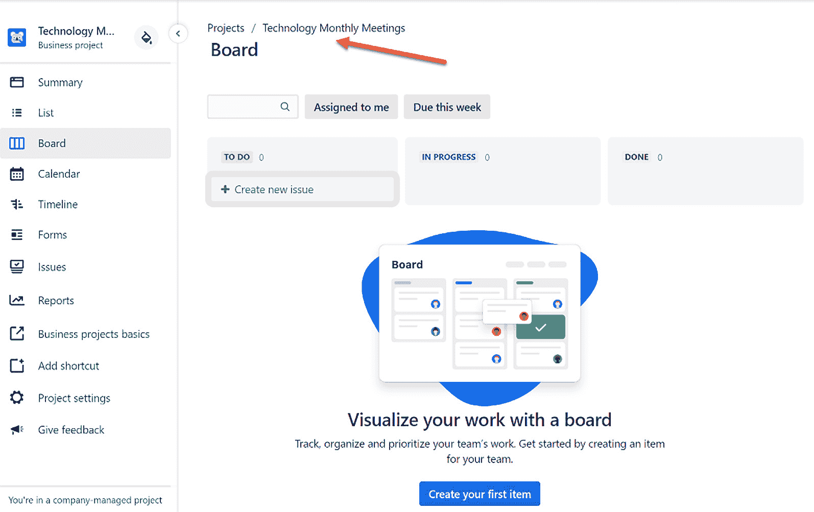

图 9.6 – 你的新项目

如果我们进入**项目设置**中的**总结**部分，对于**技术月度会议**项目，我们会看到这个新项目使用了与**员工会议**项目相同的方案。实际上，这些方案现在已经变成了**共享方案**，因为每个方案都被多个项目使用。以下截图显示了新项目使用了与员工会议项目相关的方案：

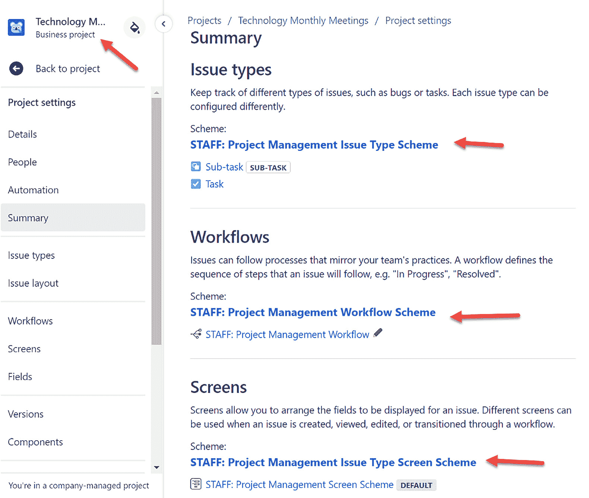

图 9.7 – 共享方案

由于这种方式创建新项目对免费计划用户不可用，接下来我们来看一下如何实现类似的效果。我们将要看到的共享方案适用于任何 Jira 工作管理、JSM 或 Jira 软件的公司管理类型项目。

# 使用共享方案

**共享方案**是为你的组织项目带来一致性的好方法，并减少 Jira 管理员的维护需求。让多个项目使用一个共享方案，可以让你一次更改方案，并自动更新所有关联的项目。

在我的组织中，我们尽量尽可能使用共享方案。这可能意味着在工作流中稍作创意，加入基于项目名称或角色的条件的状态和转换。但一旦你完成了这一步，下次就会更容易。

在免费计划项目上更新方案可以实现与**共享项目模板**相同的效果；只是会多出一些步骤。请注意，我们可以在免费计划的大多数共享方案中进行此操作，但权限方案除外。正如我们在上一章中所看到的，*第八章*，*配置权限和简单管理*，你无法为免费订阅修改权限方案。

那么，这怎么操作呢？我们来看一下：

1.  我们再次从导航到**项目设置**区域开始，然后进入**概要**部分。如以下截图所示，你可以点击任何一个方案进行更改：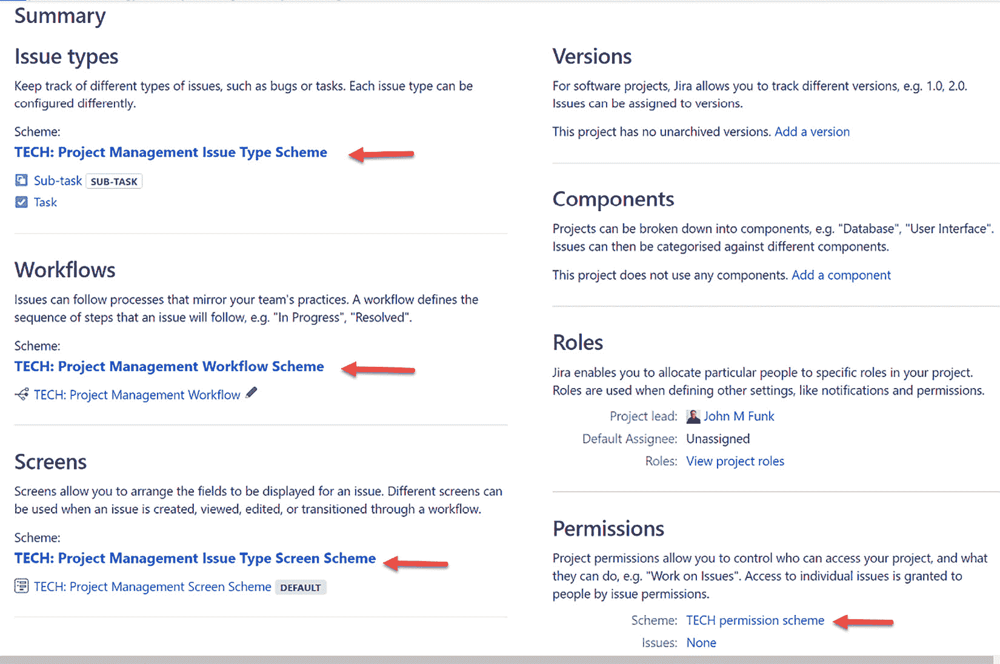

    图 9.8 – 更改共享方案

1.  根据你要更改的方案，过程可能会略有不同。对于**TECH: 项目管理问题类型方案**，你需要进入该方案，然后点击**操作**按钮，最后选择**使用不同的方案**，如以下截图所示。然后，你必须从结果列表中选择你要使用的方案：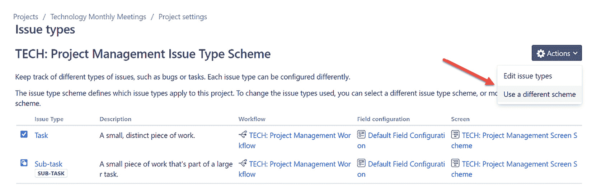

    图 9.9 – 问题类型方案

1.  对于**TECH: 项目管理工作流方案**，你需要点击**切换方案**按钮，选择新的方案：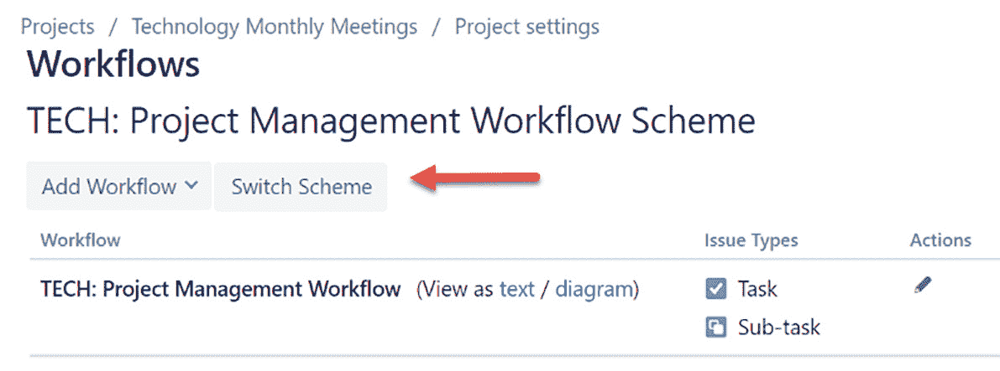

    图 9.10 – 工作流方案

1.  再次以我们的示例为例，我们将使用与员工会议相关的方案：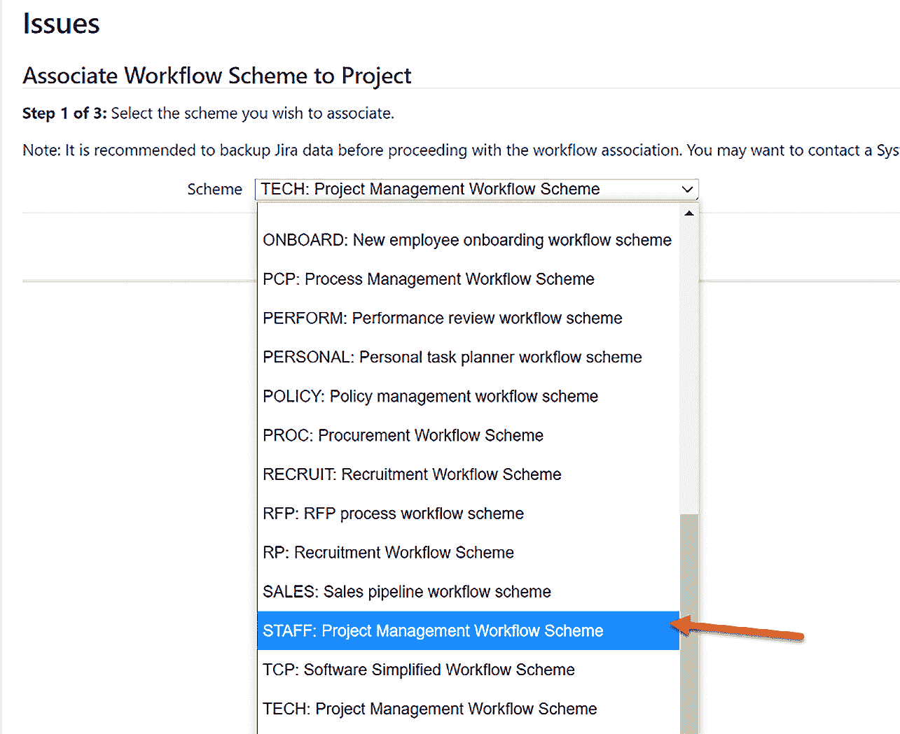

    图 9.11 – 选择工作流方案

1.  对于新的工作流方案选择，你需要将项目中所有现有问题与新的工作流关联。

现在我们知道了如何更改方案以便共享它们，接下来让我们看看创建问题的其他方式。

# 外部创建问题

正如我们之前提到的，问题代表我们在项目中完成的工作。它们可能表现为看板上的卡片，或仅作为项目列表中的一行。这一切告诉我们，问题是独特的对象，属于项目，而不是列表或看板。换句话说，你不是在看板或列表上创建问题，而是针对一个项目创建问题。

我们不打算详细介绍以下每种方法，但此列表旨在让你对这些可能性有一个高层次的了解。适当时，我们已经添加了关于每种方法的进一步详细信息的链接。但可以简单地说，这些过程中的每一种都允许你在 JWM 产品之外创建项目问题：

+   **Email**：此功能允许用户仅通过向贵组织预先安排的电子邮件地址发送电子邮件来创建卡片。电子邮件的发件人将作为 *Reporter* 被捕获，电子邮件的主题将作为 *Summary*，电子邮件的正文将被放入问题的 *Description* 字段中。有关更多详细信息，请参见 [`support.atlassian.com/jira-cloud-administration/docs/create-issues-and-comments-from-email/`](https://support.atlassian.com/jira-cloud-administration/docs/create-issues-and-comments-from-email/)。Atlassian Marketplace 也有免费的和付费的应用程序来执行此过程。

+   **Slack**：Slack 是许多公司喜爱的工具，因为它使得内部聊天变得非常便捷。Atlassian 和 Slack 联手推出了极佳的产品集成，其中包括在 Slack 中通过评论/讨论创建 Jira 问题的功能。这需要安装一个免费的应用程序。有关更多信息，请参见 [`www.atlassian.com/software/jira/guides/expand-jira/jira-slack-integration`](https://www.atlassian.com/software/jira/guides/expand-jira/jira-slack-integration)。

+   **Microsoft Teams**：与 Slack 集成类似，Microsoft 和 Atlassian 通过一个免费的应用程序将这两个工具连接在一起。除了创建问题，你还可以直接在 Teams 标签页中显示 Jira 问题和/或看板的列表。有关更多信息，请参见 [`marketplace.atlassian.com/apps/1217836/microsoft-teams-for-jira?tab=overview&hosting=cloud`](https://marketplace.atlassian.com/apps/1217836/microsoft-teams-for-jira?tab=overview&hosting=cloud)。

+   **REST API 调用**：尽管这是一个更技术性的选项，但它提供了在新问题中创建信息的最大灵活性。强烈建议具有一定开发背景的人尝试此方法。有关更多信息，请参见 [`blog.developer.atlassian.com/creating-a-jira-cloud-issue-in-a-single-rest-call/`](https://blog.developer.atlassian.com/creating-a-jira-cloud-issue-in-a-single-rest-call/)。

看到这么多方式可以为你的 JWM 项目创建问题真是太棒了。但是，如果你已经在 Jira 中有其他项目并希望使用 JWM 的功能呢？我们来看看如何将这些项目迁移过来。

# 将现有的 Jira 项目迁移到 Jira 工作管理

正如我们在第一章中概述的，*第一章*，《为什么选择 Jira 工作管理？》，本书的目标读者群体包括那些完全不了解 Jira 的人，以及那些曾经使用过 Jira 但对新 JWM 产品不熟悉的人。

因此，你们中的一些人可能已经有了使用其他 Jira 项目类型的现有项目。现在，在看到 JWM 的新功能和能力后，也许你想将一些项目迁移到这个新产品。请记住，你不能简单地转换项目类型——你必须创建一个新项目，并将旧项目中的问题迁移到新项目中。

如果你以前做过项目迁移，那对你来说这不会是什么新鲜事。但对于那些没有做过的朋友，我们来看看吧。我们将首先概述一个基本流程，并在后续中加入截图来加深理解：

1.  **创建一个新的 JWM 项目**：这可以是你想要的任何 JWM 项目类型。只需使用模板，启动即可！

1.  **将你项目中的任何现有自定义字段映射到新项目**：在*第七章*，《管理字段、屏幕和问题布局》中，我们讨论了如何修改自定义字段的上下文以添加项目。你应该为任何现有的非 JWM 项目中的自定义字段执行此操作，以将你刚刚创建的新 JWM 项目添加进去。

1.  **将任何自定义字段添加到你的 JWM 项目屏幕**：此时，你必须将这些自定义字段添加到新 JWM 项目将使用的屏幕上。

1.  **执行基本或高级筛选搜索**：执行一个简单的搜索，如*图 9.13*所示。

1.  **执行批量更改将现有问题迁移到新项目**：最后，批量将现有问题迁移到新项目。

以我们的示例为例，我们将把**Staff Meeting**项目中的问题迁移到**Technology Monthly Meetings**项目中。首先，点击顶部导航栏中的**搜索框**：

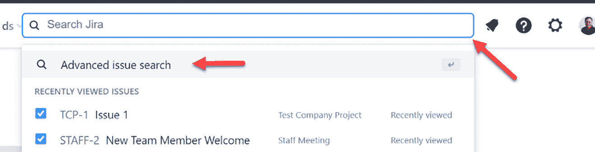

图 9.12 – 搜索框

此时，你可以通过将左侧的项目更改为现有项目（例如我们的示例：Staff Meeting）来进行基本搜索。或者，你可以点击`Project = STAFF`。然后，点击**搜索**：

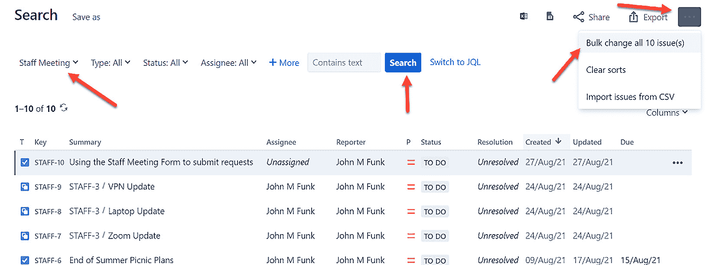

图 9.13 – 搜索与批量更改选项

一旦你有了项目中所有问题的列表，点击右上角的省略号菜单（**…**），然后选择**批量更改**选项。选择所有问题，然后选择**迁移**：

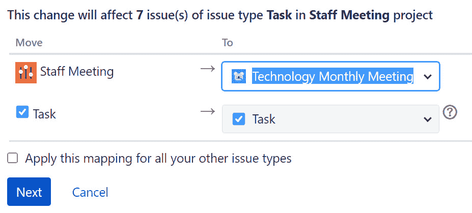

图 9.14 – 执行批量迁移

将 **To** 项目更改为你的新 JWM 项目，点击 **下一步**，然后按照提示操作。当迁移完成时，所有你旧项目中的问题将被移动到你的 JWM 项目中！

最后，我们将学习另一个 Atlassian Marketplace 应用如何帮助你提高工作效率。

# 使用 Marketplace 应用 – Deep Clone for Jira

正如我们在 *第四章* 中看到的，*修改看板、工作流和相关方案*，Atlassian Marketplace 应用可以通过扩展内置工具的功能，为我们的 JWM 项目带来非常有用的功能。

因此，我们将在这里继续介绍名为 **Deep Clone for Jira** 的 Marketplace 应用。之前在 *创建外部问题* 部分，我们学习了如何在正常的 **创建** 按钮流程之外创建问题。通过 Deep Clone，我们可以通过克隆现有问题来创建问题。

Jira 内置了克隆流程，但它提供的灵活性较少。也就是说，你只能将问题克隆到同一个项目中，并且在克隆过程中无法调整新问题中的任何字段。

Deep Clone 的独特之处在于，它能够修改创建屏幕中所有可用字段的值，无论你克隆到哪个项目。因此，你可以将一个问题从项目 A 克隆到项目 B，并修改项目 A 中字段的值，使其在项目 B 中的新问题中呈现不同的值。你还可以批量克隆问题、克隆评论、子任务，甚至是史诗及其相关子项。以下是如何找到更多关于该应用的信息。

由于 Deep Clone 也可以同时克隆多个对象，因此可以在单个过程中创建多个不同类型的新问题（史诗、故事、任务、子任务等）。这也许是你能够接近创建一个自定义模板的方式（除了标准的开箱即用模板）：

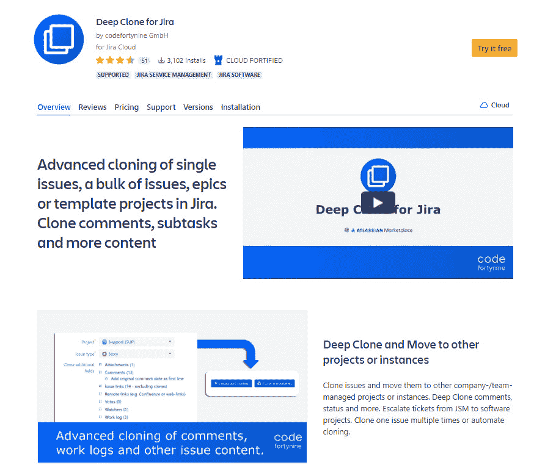

图 9.15 – Deep Clone for Jira

你可以在 [`bit.ly/3tPqFTD`](https://bit.ly/3tPqFTD) 了解更多关于 Deep Clone for Jira 的信息。

# 总结

在这一章中，我们学习了如何利用现有项目的组件创建一个新项目，以及如何使用共享方案实现类似的结果。我们还看到了通过各种第三方应用和工具在 Jira 外部创建问题的替代方法。

然后，我们学习了如何将现有的 Jira 项目迁移到 JWM 项目中，以便开始使用 JWM 的功能。最后，我们了解了 Deep Clone for Jira Marketplace 应用，以及它如何通过将问题克隆到其他项目并在此过程中修改字段来扩展功能。

运用这些新技能，你将能够为项目和问题创建方式增添灵活性。这可能会消除你在不同应用之间来回跳转以创建问题的需求。

在下一章中，我们将学习如何利用 Jira 自动化工具来自动化日常任务，为我们的项目和问题增添力量。
