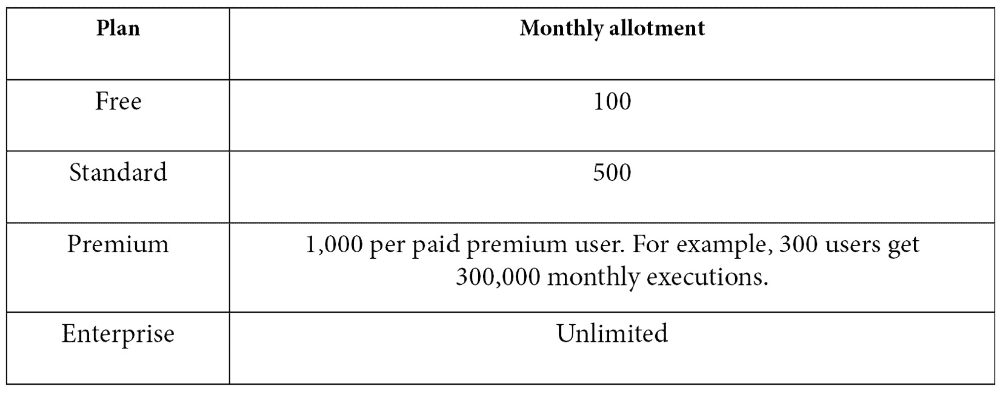

# 第十章：*第十章*：使用项目自动化

如果用食物类比，到目前为止，你已经在本书的前九章中品尝了开胃菜、沙拉和主菜。而现在，我将**项目自动化**视为我们的甜点！

自动化可以为你的**Jira Work Management**（**JWM**）项目及其相关工作带来强大的功能。

也许你希望自动化常规和/或重复性任务。也许你希望自动分配工作给专门的用户，甚至为你的团队任务创建轮询安排。也许你希望系统能够保持子任务与父任务的同步。或者你甚至希望使用公式，根据多个字段的总和计算一个新值。

无论你最期待自动化的哪一点，你都可以尽情享受各种自动化的便利。所有这些都可以通过一个主要是点击即可的简单工具实现，无需编写代码！

在本章中，你将学习自动化的概念，包括它是什么以及如何使用它。你还将学习如何创建简单的自动化规则，以便立即提高生产力。除了创建这些规则外，你还将学习如何访问现有的自动化模板，从而让你能够更强有力地开始。

最后，你将学习一些常见的自动化用例，比如同步父任务和子任务*问题*、自动分配工作、安排规则和发送电子邮件。

在本章中，我们将覆盖以下主要主题：

+   什么是自动化？

+   创建自动化规则

+   使用自动化模板

+   常见的自动化用例

# 技术要求

由于 JWM 仅在**Jira Cloud**环境中可用，本章的技术要求很简单：

+   访问 Jira Cloud 环境

如果你已经可以访问 Jira Cloud，那太好了——你已准备就绪！如果没有，**Atlassian**提供了最多 10 个用户的免费 JWM 账户。你可以按照[`www.atlassian.com/try/cloud/signup?bundle=jira-core&edition=free`](https://www.atlassian.com/try/cloud/signup?bundle=jira-core&edition=free)的说明创建账户。

现在，让我们开始吧。

# 什么是自动化？

自动化是 Jira Cloud 所有实例提供的工具，适用于你所拥有的任何类型的订阅。它可以通过简化你需要执行的手动流程，来扩展你的 JWM 工作。

自动化通过创建包含触发器、条件和操作的点击规则来工作。这些规则通过减少额外的手动编辑和计算，可以节省大量时间，具有强大的功能。

然而，我们还需要提到与规则相关的一些限制。单个项目规则的执行次数是无限的——意味着该规则仅适用于单个项目。但对于全局或多项目规则，根据你的订阅类型，执行次数是有限制的或存在不同级别的限制，这一点我们将在本章后面讨论。

自动化允许项目管理员和 Jira 管理员通过设置基于各种系统事件触发的规则来节省时间。以下是一些*系统事件*的示例：

+   问题从一个状态转换到另一个状态

+   问题中字段的更新

+   新问题的创建

+   在预定时间运行的计划触发器，或者由用户手动执行的触发器

规则可以应用条件来缩小其焦点。这些条件可以包括为子组问题分支，或指定规则可以执行的操作，从而为条件提供更多的灵活性。

关于 Jira 项目自动化可以写成一本书，但在本章中，我们只会涉及工具的一些要点，以帮助你入门。

自动化规则有一组标准的组件或部分，这些部分构成了规则的步骤。接下来，我们简要描述每个部分。稍后，在*创建自动化规则*部分中，我们将看到如何使用每个组件创建规则：

+   **触发器**：*触发器*是规则中的第一步。它们充当事件监听器，根据各种事件触发规则，例如问题创建或转换、字段值变化等。

+   **条件**：你可以添加一个可选的*条件*，这样在初始触发器触发后，可以进行额外的检查来确定规则是否应继续执行。如果条件失败，则规则停止。这些检查可以基于简单的标准，如字段值或日期范围。或者，你可以包括更复杂的条件，例如高级比较、**Jira 查询语言**（**JQL**）查询等。

+   **操作**：最后，*操作*会根据规则对项目进行某种变更，例如字段值更改、自动转换问题、计算数值、将问题分配给用户，或发送电子邮件或其他通知。

接下来，我们将讨论如何设置自动化，你将能够创建你的第一个规则。

# 创建自动化规则

有几种方法可以导航到自动化规则列表。作为 Jira 管理员，你可以通过系统设置界面访问你 Jira 实例中的所有规则。首先，点击右上角导航栏中的齿轮图标，然后选择**系统**，如*图 10.1*所示：

图 10.1 – 系统设置

然后，滚动到页面底部并点击左侧的**自动化规则**。点击此项会带你进入**自动化**窗口，在该窗口中，规则示例按主题组织在**库**标签下。*图 10.2*展示了初始的**自动化**窗口**库**标签，以及自动化工具的其他可用选项：

图 10.2 – 自动化窗口库标签

自动化库是一个很好的起点，可以查看一些可用的规则，并熟悉自动化规则的语法和风格。我们鼓励你浏览这些规则，看看有哪些可用的选项。

另一种路径仅限于针对单个项目运行的规则。这些规则可以通过项目的**项目设置**窗口访问。

现在，我们将把注意力转向创建规则的构建模块。点击左上角的**规则**标签，如*图 10.3*所示：

图 10.3 – 自动化窗口规则标签页

让我们一起走过创建一个简单规则的过程：

1.  首先，点击右上角的**创建规则**按钮，如*图 10.3*所示。

1.  这将带我们到*触发器*列表，如*图 10.4*所示：

    图 10.4 – 向自动化规则添加触发器

    在这里，我们可以看到一些最受欢迎和推荐的触发器。我们将选择**字段值已更改**作为示例，并基于**Presentation Date**字段。

1.  一旦选择并保存后，我们将添加一个*条件*。同样，我们可以看到推荐的条件。我们将选择**问题字段条件**选项，如*图 10.5*所示。在我们的示例中，我们将检查**问题**状态是否为**进行中**。另外，请注意规则是如何生成并显示的，每个部分都在左侧：

    图 10.5 – 向自动化规则添加条件

1.  最后，让我们添加一个新的操作来发送电子邮件，通知负责人他们正在处理的问题现在有了新的**Presentation Date**值。我们将从可用操作中选择**发送电子邮件**选项，如*图 10.6*所示：

    图 10.6 – 向自动化规则添加操作

1.  我们的最终步骤将是保存规则并将其链接到一个项目。我们将使用我们的`Send email when Presentation Date changes`。我们可以在*图 10.7*中看到最终的规则，以及规则名称和它所链接的项目：

图 10.7 – 添加自动化规则名称并链接项目

接下来，我们将看看如何利用现有模板快速启动自动化。

# 使用自动化模板

正如我们在讨论*项目*时看到的那样，模板可以为你提供快速且简单的方式来启动你正在创建的任何类型的对象。对于业务团队的自动化模板来说，这也是一样的。*图 10.8*展示了可用的一些默认自动化模板：

图 10.8 – Jira 自动化模板

*图 10.9*还显示了可用于商业项目的额外 Jira 模板。这些包括添加安全级别的模板以及可能的**Slack**集成：

图 10.9 – Jira 商业项目模板

随着新的创意和建议的出现，Atlassian 将继续添加自动化模板。要访问这些模板，请前往[`www.atlassian.com/software/jira/automation-template-library#/rule/new`](https://www.atlassian.com/software/jira/automation-template-library#/rule/new)。

另一个有用的功能是**Jira** **自动化游乐场**。在*图 10.8*和*图 10.9*中显示的自动化模板网站底部，有一个**Jira** **沙盒**。在这里，您可以查看许多现有的规则，尝试在一个远离生产站点的安全环境中创建规则，并学习如何使用规则各部分的语法。您可以在*图 10.10*中看到自动化游乐场：

图 10.10 – Jira 自动化游乐场

接下来，我们将通过查看一些最常见的自动化使用案例来结束本章。

# 常见的自动化使用案例

虽然我们已经讨论过自动化模板和自动化库，但具体来看一些常见的使用案例会更有帮助。这些使用案例是基于**Atlassian Community**用户支持环境中的常见问题和之前的 Atlassian 支持请求而来的。

所以，让我们看看一些最常见的案例：

+   `完成`，如*图 10.11*所示：

图 10.11 – 父任务和子任务自动化规则

+   **在问题创建时自动将问题分配给用户**：在 JWM 中有多种方法可以自动将用户分配给问题。然而，创建一个自动化规则来实现这一点提供了更大的灵活性——您可以直接分配一个用户，或者使用如创建循环分配、平衡工作负载甚至随机分配等选项。*图 10.11*展示了使用循环分配：

图 10.12 – 一个分配问题的自动化规则

+   **在特定时间调度一个过程**：调度规则是基于日期字段或其他 JQL 查询标准发送通知的好方法。它们可以设置为在特定时间运行，包括每日、每周或每月，或者可以更具体。这也是处理项目中重复任务的好方法。

*图 10.12*显示了如何设置调度规则的可视化：

图 10.13 – 一个调度自动化规则示例

正如你所看到的，自动化规则可以在扩展你的 JWM 项目方面非常强大，但已经为你识别和构建的一些常见自动化使用案例，可以让你立刻提高工作效率。

## 自动化规则执行和使用限制

现在我们看到，通过使用自动化可以获得的巨大好处，让我们简要描述一下每月可以执行的规则执行次数的潜在使用限制。

全局和多项目规则代表在整个 Jira 实例中或在两个或更多项目上同时运行的自动化规则。在这种情况下，规则中所用项目的数量不影响执行使用次数，前提是至少有两个项目。

你将获得一定数量的每月规则执行次数，免费提供，之后对于全局和多项目规则，剩余月份将不再允许执行。当前的使用限制可以在以下表格中查看：

表 10.1 – 自动化规则执行限制

最新计划使用限制

最新的使用限制可以查看 [`support.atlassian.com/jira-cloud-administration/docs/explore-jira-cloud-plans/`](https://support.atlassian.com/jira-cloud-administration/docs/explore-jira-cloud-plans/)。

# 本章学习的新术语

让我们通过回顾本章学习的新术语来总结这一章：

+   **项目自动化**：JWM 中内置的工具，允许项目管理员和 Jira 管理员创建自动化规则。

# 总结

在本章中，我们了解了 JWM 中的自动化是什么，以及它如何帮助我们扩展 JWM 项目的功能，从而提高工作效率。我们学习了自动化规则的不同组成部分，如何从头开始快速创建规则，以及如何使用现有的自动化规则模板。接着，我们熟悉了一些适用于许多 JWM 项目的常见自动化使用案例，并且学会了如何在自己的 Jira 实例中复制这些规则。

运用这些新技能，你将能够通过让自动化处理重复性任务和日常工作来节省时间。通过自动分配工作或使用自动过渡进行问题过渡，你和你的同事将始终掌握项目的最新进展。

我真诚希望你在阅读本书的过程中有所收获。请记住，JWM 产品仍在不断发展，未来将继续添加许多新功能和激动人心的特性。

# 深入阅读

+   **智能值**

    若要进行更高级的自动化规则操作，你需要熟悉**智能值**。此功能通过将格式应用于数据、使用 JSON、返回多条问题列表等，扩展你的规则。你可以在这里了解智能值：[`support.atlassian.com/jira-software-cloud/docs/what-are-smart-values/`](https://support.atlassian.com/jira-software-cloud/docs/what-are-smart-values/)。

+   **基础搜索功能**

    如果你不熟悉**Jira 查询语言**（**JQL**），这篇文章将帮助你学习基础知识，并立即开始搜索：[`support.atlassian.com/jira-software-cloud/docs/perform-a-basic-search/`](https://support.atlassian.com/jira-software-cloud/docs/perform-a-basic-search/)。

+   **Jira 产品家族博客更新**

    为了帮助你跟踪与 JWM 产品、自动化、Jira 软件等相关的所有变更，务必订阅 Jira Cloud 发布说明博客，地址：[`confluence.atlassian.com/cloud/blog`](https://confluence.atlassian.com/cloud/blog)。

最后，我们想分享一些有用的资源，你可以在遇到问题、想了解更多内容或有任何疑问时参考。

+   **Jira 工作管理云支持**

    这是 Atlassian 支持结构中的标准位置，用于查找文档、建议、错误报告等内容。你可以在这里找到所有资源：[`support.atlassian.com/jira-work-management/`](https://support.atlassian.com/jira-work-management/)。

+   **Atlassian 用户社区**

    作为 Atlassian 社区领导者，如果我不鼓励你探索并加入**Atlassian 社区**，那将是我的失职！该社区旨在帮助所有 Atlassian 产品用户。这里是提问、获取其他 Atlassian 用户提供的有用建议和解决方案的地方。

    最棒的是，这里有一个专门为 JWM 新手设立的空间。作为该小组的领导者之一，我强烈鼓励你四处看看，介绍自己，并享受社区带来的一切好处。

    你可以在这里访问*Jira 工作管理新手*小组：[`community.atlassian.com/t5/New-to-Jira-Work-Management/gh-p/newtojwm`](https://community.atlassian.com/t5/New-to-Jira-Work-Management/gh-p/newtojwm)。

    我们将在 Atlassian 社区见！
