# 第一章：Jira 服务器管理

Atlassian Jira 是一个广泛使用的缺陷跟踪系统，全球许多公司都在使用它。与大多数企业软件不同，它的优势之一是安装和实现不需要几天或几周，而且升级和维护非常简单。

我们假设你已经知道如何安装全新的 Jira 系统。因此，我们将探讨常见的管理任务，如升级和迁移 Jira，并且我们将看看不同的选项，包括使用 Atlassian 提供的全新自动化升级工具，或者从头开始进行所有操作。我们还会向你展示一些其他有用的技巧，比如重置管理员密码，帮助你解决棘手问题。

由于 Jira 现在是一个产品系列，包括 Jira Core（即 Jira 7 之前的旧版 Jira Classic）、Jira Software（即 Jira Core 加上敏捷功能）和 Jira Service Desk（即 Jira Core 加上旧版 Jira Service Desk 插件），本书中的配方将使用 "Jira" 这一术语来指代三者中最流行的 Jira Software。

在本章中，我们将讨论以下主题：

+   安装 Jira 用于生产环境

+   使用安装程序升级 Jira

+   手动升级 Jira

+   将 Jira 迁移到另一个环境

+   设置 Jira 的上下文路径

+   设置 SSL

+   从其他应用程序安装 SSL 证书

+   重置 Jira 管理员密码

+   从 CSV 导入数据

+   在 Jira 实例之间复制配置

# 安装 Jira 用于生产环境

在本示例中，我们将探讨如何在生产环境中安装和设置 Jira。这包括设置一个专用用户来运行 Jira，并使用外部数据库。

我们将使用归档分发版，因为这些步骤在 Windows 和 Linux 平台上是一致的。这也会让你了解部署和运行 Jira 实例所需的确切步骤；这些步骤通常会被自动安装程序隐藏。这将为你提供后续维护和进一步配置所需的信息。

# 准备工作

在开始之前需要检查以下事项：

+   从 [`www.atlassian.com/software/jira/download`](https://www.atlassian.com/software/jira/download) 下载最新的 Jira 归档分发版，并根据你的服务器选择合适的包，例如 Linux 或 Windows。对于本示例，我们将使用 TAR.GZ 归档文件。

+   确保你的服务器环境满足 Jira 的要求，访问 [`confluence.atlassian.com/adminjiraserver/supported-platforms-938846830.html`](https://confluence.atlassian.com/adminjiraserver/supported-platforms-938846830.html) 查看详细信息。

+   在系统上安装 Java。撰写本文时，Jira 8 需要 Java 8（无论是 Oracle JDK 还是 OpenJDK）。你可以从 [`www.oracle.com/technetwork/java/javase/downloads/index.html`](https://www.oracle.com/technetwork/java/javase/downloads/index.html) 下载 Java。

+   确保已配置 `JAVA_HOME` 或 `JRE_HOME` 环境变量。

+   确保有一个可用的数据库系统，可以在托管 Jira 的服务器上，也可以在通过网络访问的其他服务器上。本示例中，我们将使用 **MySQL**。如果你使用的是其他数据库，请相应地更改命令和查询。

+   下载必要的数据库驱动程序。对于 MySQL，可以从 [`dev.mysql.com/downloads/connector/j`](https://dev.mysql.com/downloads/connector/j) 下载。

# 如何执行此操作...

我们首先需要为 Jira 创建一个空的 MySQL 数据库：

1.  在 MySQL 服务器上打开一个新的命令提示符。

1.  运行以下命令（你也可以使用其他用户替代 `root`，只要该用户具有创建新用户和数据库的权限）：

```
mysql -u root -p
```

1.  在提示时输入用户的密码。

1.  通过运行以下命令为 Jira 创建一个新数据库：

```
create database jiradb character set utf8;
```

1.  在数据库中为 Jira 创建一个新用户，并使用以下命令授予该用户对我们刚创建的 `jiradb` 数据库的访问权限：

```
grant all on jiradb.* to 'jirauser'@'localhost'
identified by  'jirapassword';
```

1.  在前五个步骤中，我们创建了一个名为 `jiradb` 的新数据库和一个名为 `jirauser` 的新数据库用户。稍后我们将使用这些信息将 Jira 与 MySQL 连接。下一步是安装 Jira。

1.  创建一个专用用户账户来运行 Jira。如果你使用的是 Linux，请作为 root 用户或使用 `sudo` 运行以下命令：

```
useradd --create-home --comment "Dedicated
Jira account" -- shell /bin/bash jira
```

为了减少安全风险，最好将用户账户锁定，确保其没有登录权限。

1.  在文件系统中创建一个新目录，将在此目录下安装 Jira。该目录将被称为 `JIRA_INSTALL`。

1.  在文件系统中创建另一个目录。此目录将用于 Jira 存储其附件、搜索索引、应用程序数据和其他信息。你可以将此目录创建在具有更大硬盘容量的其他驱动器上，例如网络驱动器（这可能会导致性能下降）。此目录将被称为 `JIRA_HOME`。

最好将 `JIRA_INSTALL` 和 `JIRA_HOME` 目录分开；即 `JIRA_HOME` 目录不应是 `JIRA_INSTALL` 目录的子目录。这样将使未来的升级和维护更加方便。

1.  在 `JIRA_INSTALL` 目录中解压 Jira 压缩文件。

1.  将 `JIRA_INSTALL` 和 `JIRA_HOME` 目录的所有权更改为新创建的 Jira 用户。

1.  在文本编辑器中打开 `JIRA_INSTALL/atlassian-jira/WEB-INF/classes/jira-application.properties` 文件。

1.  在此文件中找到 `jira.home=` 这一行。

1.  复制并粘贴完整路径到 `JIRA_HOME` 目录，并在有 `#` 符号时将其删除。确保使用正斜杠（`/`）。以下行展示了在 Linux 系统上的样子：

```
jira.home=/opt/data/jira_home 
```

Windows 使用反斜杠（`\`）作为文件路径。尽管如此，在指定 `jira.home` 目录时，仍然应该使用正斜杠（`/`）。

1.  将数据库驱动程序 JAR 文件（从 *准备工作* 部分获得）复制到 `JIRA_INSTALL/lib` 目录。

1.  通过在`JIRA_INSTALL/bin`目录下以 Jira 用户身份运行`start-jira.sh`（适用于 Linux）或`start-jira.bat`（适用于 Windows）脚本来启动 Jira。您应该能在控制台看到`Tomcat`的输出，这意味着 Jira 已启动并运行。

1.  Jira 带有一个安装向导，可以帮助我们完成安装的最后阶段。

1.  打开浏览器并访问`http://localhost:8080`（将 localhost 替换为实际的服务器名称）。默认情况下，Jira 运行在端口`8080`上。您可以通过更改`JIRA_INSTALL/conf/server.xml`文件中的连接器端口值来更改此端口。

1.  设置的第一步是选择如何设置 Jira。选择**我自己设置**选项，然后点击**下一步**按钮：

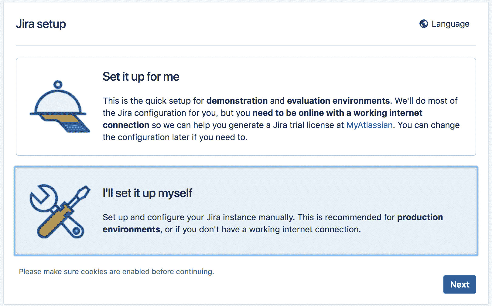

1.  第二步是设置数据库信息。选择**我的数据库**（**推荐用于生产环境**）选项。

1.  选择**数据库类型**选项的值。对于本教程，选择 MySQL 5.7+选项。

1.  输入新建的`jiradb`数据库的详细信息：

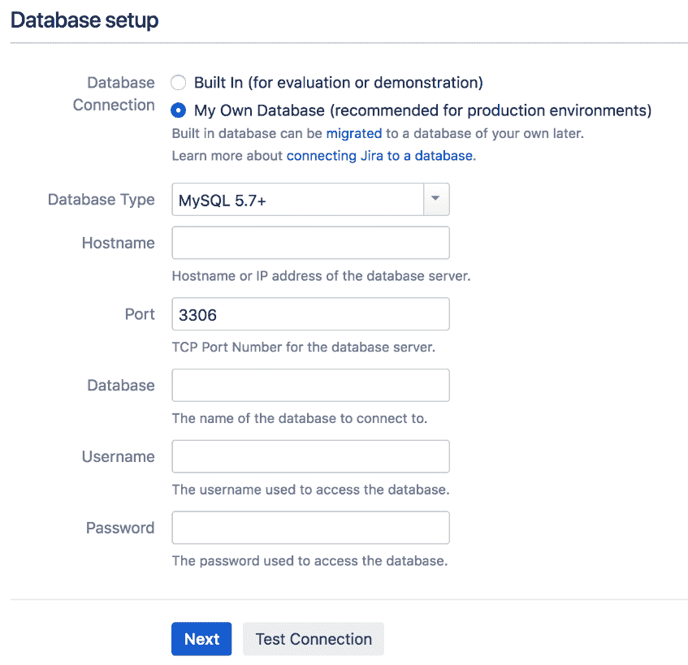

1.  点击**测试连接**，检查 Jira 是否能够连接到数据库。

1.  如果数据库连接测试成功，点击**下一步**按钮继续，进入向导的下一步。

1.  输入此 Jira 实例的应用程序标题值。

1.  如果您希望用户能够注册帐户，选择**公共**；如果您只希望管理员创建帐户，选择**私有**。大多数使用 Jira 来跟踪内部项目的组织将需要**私有**模式。

1.  设置**基础 URL**选项。基础 URL 是用户用来访问 Jira 的网址。通常，这应该是一个完全合格的域名或主机名——即不能是 localhost 或 IP 地址。

1.  点击**下一步**，进入向导的第三步，如下图所示：

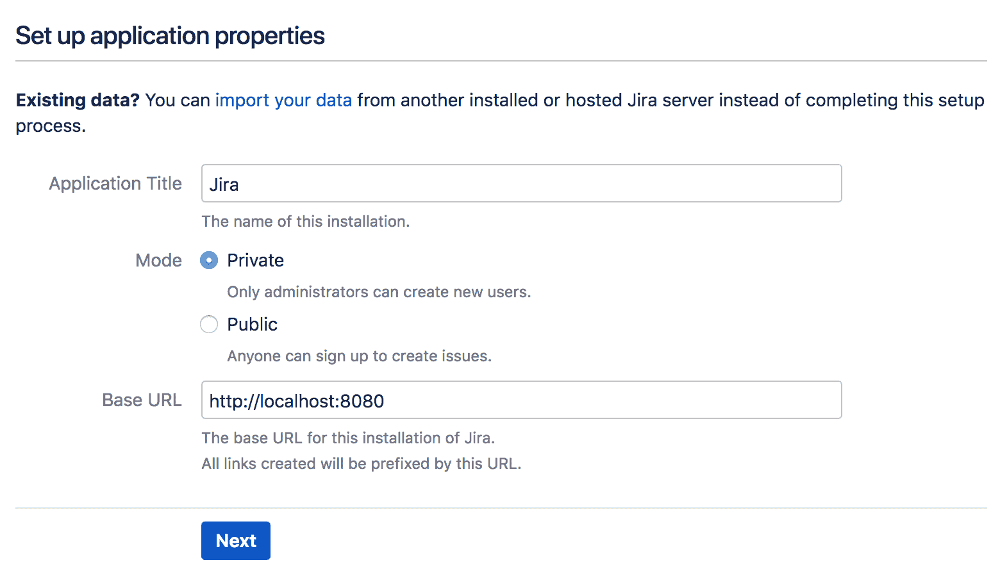

1.  如果您有 Jira 许可密钥，请输入。如果没有许可密钥，您可以通过点击**生成 Jira 试用许可链接**并按照指示生成临时试用许可。

1.  点击**下一步**，进入向导的第四步，如下图所示：

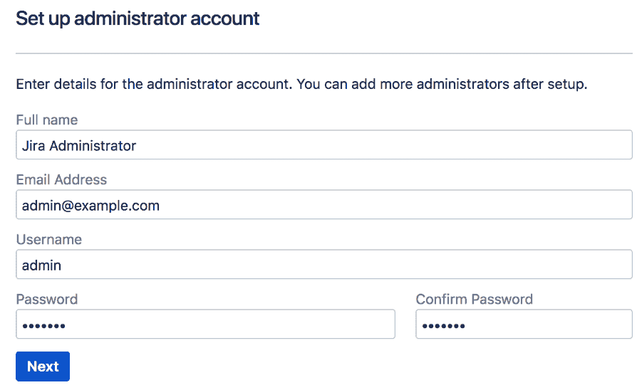

1.  输入初始管理员帐户的详细信息。该用户帐户将可以访问 Jira 中的所有配置选项，因此请确保不要丢失其登录凭据。

1.  点击**下一步**，进入向导的第五步和最后一步，如下图所示：

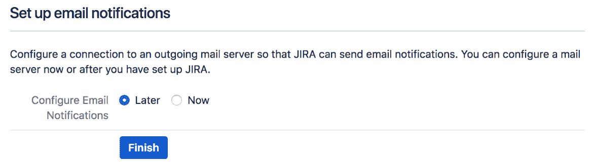

1.  选择是否要现在或稍后设置外发 SMTP 服务器。如果您现在没有准备好 SMTP 服务器，可以随时回来稍后配置。

1.  点击**完成**以完成设置过程。

您将看到以下欢迎屏幕：

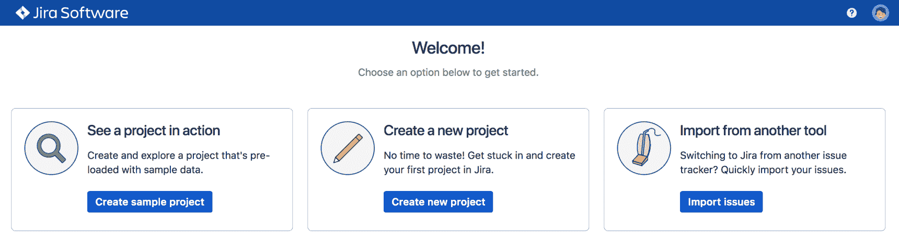

这部分是设置过程的通用配置部分。您的 Jira 系统已经启动并运行。接下来，Jira 将引导您完成首次使用的入门过程。您将被要求选择使用的默认语言、上传用户头像并创建您的第一个项目。

# 还有更多内容...

默认情况下，Jira 设置为使用最多 768 MB 的内存。对于生产部署，您可能需要增加分配给 Jira 的内存量。您可以通过打开 `JIRA_INSTALL/bin` 目录中的 `setenv.sh`（Linux）或 `setenv.bat`（Windows）文件并更改 `JVM_MAXIMUM_MEMORY` 参数的值来增加内存。

例如，如果我们想将最大内存设置为 2 GB，我们将其更改为 `JVM_MAXIMUM_MEMORY="2048m"`。完成此更改后，您需要重新启动 Jira。对于生产环境，建议您为 Jira JVM 分配至少 4 GB（4096 MB）的内存。首先确保您的服务器上有足够的物理内存。

如果您在组织中使用 LDAP 进行用户管理，请参考 第四章 中的 *仅用于认证的 LDAP 集成* 配方，位于 *用户管理* 部分。

下载代码包的详细步骤已在本书的 *前言* 中提及，请查看。本书的代码包也托管在 GitHub 上，链接为 [`github.com/PacktPublishing/Jira-8-Administration-Cookbook-Third-Edition`](https://github.com/PacktPublishing/Jira-8-Administration-Cookbook-Third-Edition)。我们还提供了来自我们丰富书籍和视频目录的其他代码包，您可以访问 [`github.com/PacktPublishing/`](https://github.com/PacktPublishing/) 查看。

# 使用安装程序升级 Jira

对于 Windows 和 Linux，Atlassian 提供了一个安装程序包，可以指导您完成升级过程。安装程序将自动检测您当前的 Jira 安装并执行所有必要的任务，将其升级到目标版本。

在本章节中，我们将向您展示如何使用标准的 Jira 安装程序来升级您的 Jira 实例。

# 准备就绪

由于 Jira 安装程序仅适用于 Windows 和 Linux 的独立安装，因此我们将在本章节中通过 Windows 上的安装程序进行演示：

+   检查升级说明，了解任何特殊的操作指南以及目标 Jira 版本，确保您可以进行直接升级。

+   确保您有有效的 Jira 许可证。

+   验证您的当前主机环境是否与目标 Jira 版本兼容，包括 Java 版本、数据库和操作系统。

+   验证您的操作环境是否与目标 Jira 版本兼容，特别是浏览器的要求。

+   确保您使用的插件与新版本的 Jira 兼容。

+   下载目标 Jira 版本的安装包。

您可以使用 Universal Plugin Manager 的 Jira 更新检查工具来检查插件的兼容性。

# 如何操作...

使用以下步骤使用安装程序升级您的 Jira 系统：

1.  关闭当前的 Jira 服务，例如通过运行 `stop-jira.bat` 脚本。

1.  使用其原生备份工具备份 Jira 数据库。

1.  启动安装程序并选择**升级现有 JIRA 安装**选项。

1.  现在，选择当前安装了 Jira 的目录：

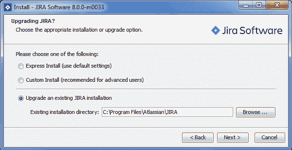

1.  选中备份 JIRA 主目录选项，然后点击**下一步**按钮。

如果你的 `JIRA_HOME` 目录很大，你可能需要手动备份它或删除一些 `cache` 和 `tmp` 文件夹，因为安装程序备份这些内容会花费很长时间。

1.  查看升级检查列表并单击**升级**按钮：

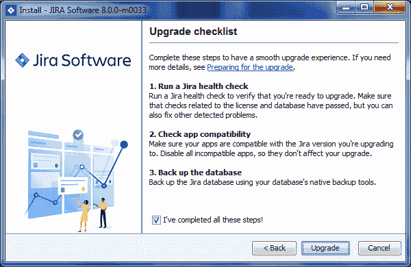

1.  等待安装程序完成升级过程。升级完成后，安装程序将自动启动 Jira。

1.  更新任何插件后，Jira 成功启动。

安装程序将检测并提供位于 `JIRA_INSTALL` 目录中的自定义文件列表，您需要在升级后手动复制这些文件。

# 另请参阅

如果无法使用安装程序升级 Jira，请参阅*手动升级 Jira*说明。

# 手动升级 Jira

如果您无法使用安装程序升级 Jira，例如如果您在没有安装程序二进制文件的操作系统上托管 Jira 或在云平台上托管 Jira，则可以使用手动升级方法来升级您的 Jira 实例。

# 准备工作

手动升级 Jira 实例所需的任务与使用安装程序的任务相同。请参考前面的说明以了解涉及的常见任务。由于安装程序在升级 Jira 时自动化了许多备份任务，因此你需要执行以下操作：

1.  使用其原生备份工具备份 Jira 数据库。

1.  备份 `JIRA_INSTALL` 目录。

1.  备份 `JIRA_HOME` 目录。

1.  从 Jira 的**系统信息**页面中获取 `JIRA_INSTALL` 目录中所有自定义文件的列表。

# 如何操作...

要手动升级你的 Jira 实例，请执行以下步骤：

1.  关闭当前的 Jira 服务。

1.  在不同的目录中安装新版本的 Jira。

1.  编辑位于 `JIRA_INSTALL/atlassian-jira/WEB-INF/classes` 目录下的 `jira-application.properties` 文件，将其指向现有的 `JIRA_HOME` 目录。

1.  复制任何从旧的 Jira 实例修改过的文件到新的实例中。

1.  启动新的 Jira 实例。

1.  成功启动 Jira 后，请更新插件。

1.  删除先前的安装目录以避免混淆。

# 工作原理...

我们在这里做的基本上是设置了一个新的 Jira 实例，并将其指向旧的 Jira 实例的数据。当我们启动新的 Jira 实例时，它将通过从 `JIRA_HOME` 目录中的 `dbconfig.xml` 文件读取来连接到现有的 Jira 数据库，并执行就地升级以进行所有必要的模式更改。

# 将 Jira 迁移到另一个环境

现在我们已经完成了 Jira 实例的升级，我们将探讨如何将 Jira 实例迁移到另一个服务器环境。这是在将应用程序迁移到虚拟化环境或数据中心时常见的使用场景。

# 准备工作

在开始本步骤之前，需要检查以下内容：

+   确保你拥有有效的 Jira 许可证。

+   检查你的新环境是否符合 Jira 的系统要求。

+   确保旧的和新的 Jira 实例具有相同的大版本或小版本。如果你打算在新环境中运行更新版本的 Jira，建议在迁移成功后进行升级。

系统迁移可能会对用户造成很大的干扰。确保你已通知用户，并为回滚分配了足够的时间。

# 如何操作...

要将现有的 Jira 实例迁移到另一个服务器，执行以下步骤：

1.  在新的环境中下载并安装一个全新的 Jira 实例，使用空数据库。

1.  记下**系统信息**页面中列出的**已修改文件**和**已删除文件**，以下截图显示了一个示例：

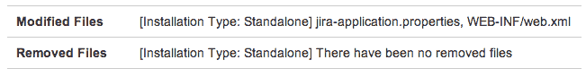

1.  关闭当前的 Jira 实例。

1.  使用数据库的原生备份工具备份当前的 Jira 数据库。

1.  备份你当前的`JIRA_HOME`目录。

1.  将你的新 Jira 下线。

1.  复制你的`JIRA_HOME`备份并用它替换新的`JIRA_HOME`目录。

1.  使用新的 Jira 数据库详细信息更新`dbconfig.xml`文件。

1.  复制你的数据库备份并恢复新的 Jira 数据库。

1.  启动新的 Jira 实例。

1.  对第 2 步中的新 Jira 实例应用相同的更改。

# 设置 Jira 的上下文路径

如果你在同一域上运行多个 Web 应用程序，你可能需要为 Jira 设置一个上下文路径——例如，`http://example.com/jira`，其中`/jira`是上下文路径。

# 如何操作...

执行以下步骤来为 Jira 设置上下文路径：

1.  如果 Jira 正在运行，请先关闭 Jira。

1.  在文本编辑器中打开`JIRA_INSTALL/conf/server.xml`。

1.  找到以下行并为`path`属性输入上下文路径——例如，`path="/jira"`：

```
<Context path="/jira"docBase="${catalina.home}
/atlassian-jira" reloadable="false"
useHttpOnly="true">
```

1.  保存文件并重启 Jira。如果你在 Jira 安装之后进行此操作，你需要更新 Jira 的基本 URL 选项，以便其链接反映这一变化。

1.  以管理员身份登录 Jira。

1.  导航到**管理** > **系统** > **常规配置**。

1.  点击**编辑设置**按钮。

1.  在**基本 URL**字段中输入包括上下文路径的 Jira 完全合格 URL。

1.  点击**更新**以应用更改。

在你完成所有设置后，你将能够通过新的上下文路径访问 Jira，所有链接，包括来自 Jira 通知邮件的链接，将在 URL 中显示上下文路径。

# 设置 SSL

默认情况下，Jira 使用标准的未加密 HTTP 协议运行。如果你在安全的环境中运行 Jira，如内部网络，这种方式是可以接受的。但是，如果你计划通过互联网开放 Jira 的访问，你需要通过启用**SSL**（**HTTPS**）加密敏感数据（如发送的用户名和密码）来增强安全性。

本教程描述了如何在 Jira Tomcat 应用服务器上安装 SSL。如果你在 Jira 前面有像 Apache 这样的 HTTP web 服务器，你也可以选择在 web 服务器上安装 SSL 证书。

# 准备工作

在开始本教程之前，你需要设置以下内容：

1.  **获取有效的 SSL 证书**：你可以使用自签名证书，或者从**证书颁发机构**（**CA**）如**Verisign**获取一个证书。使用自签名证书时，当用户首次访问网站时会显示警告信息，如下所示的截图所示：

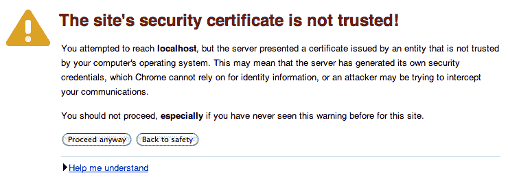

1.  确保`JAVA_HOME`环境变量已正确设置。

1.  确保你知道 Jira 使用的是哪个 JDK/JRE。你可以从 Jira 中的**系统信息**页面找到此信息，查找`java.home`属性。

1.  确保你的 JRE/JDK 的`bin`目录已添加到`PATH`环境变量中，`keytool`命令将输出其使用方法，如下图所示：

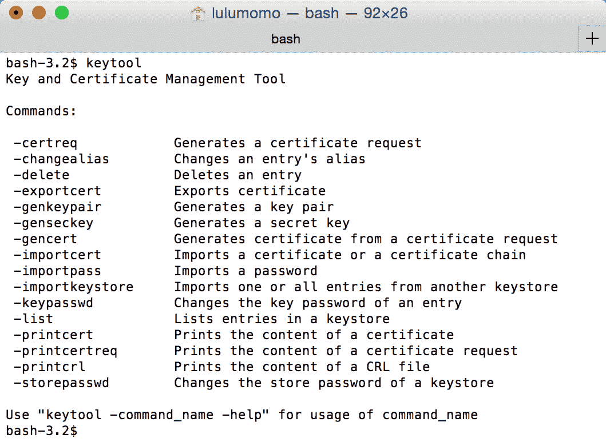

现在让我们开始本教程的步骤。

# 如何操作...

执行以下步骤导入 SSL 证书：

1.  打开命令窗口并进入证书文件所在的目录。

1.  通过运行`keytool -genkey -alias jira -keyalg RSA -keystore $JIRA_HOME/jira.jks`命令，为 Jira 生成一个**Java KeyStore**（**JKS**）。

1.  通过运行`keytool -import -alias jira -keystore $JIRA_HOME/jira.jks -file file.crt`命令，将证书导入到 KeyStore 存储库中，其中`file.crt`是证书文件。

1.  打开位于`JIRA_INSTALL/conf`目录中的`server.xml`文件并使用文本编辑器编辑。

1.  定位并取消注释以下 XML 配置片段：

```
<Connector port="8443" 
maxHttpHeaderSize="8192" SSLEnabled="true" 
maxThreads="150" 
minSpareThreads="25" maxSpareThreads="75" 
enableLookups="false"
disableUploadTimeout="true" 
acceptCount="100" scheme="https" secure="true" 
clientAuth="false" 
sslProtocol="TLS" useBodyEncodingForURI="true"/>
```

1.  向`Connector`标签添加一些新的属性并保存文件，如下所示：

```
keystoreFile="PATH_TO_YOUR_KEYSTORE" 
keystorePass="PASSWORD_FOR_YOUR_KEYSTORE" 
keyAlias="jira" 
keystoreType="JKS" 
```

1.  重启 Jira 以应用更改。

# 它是如何工作的...

我们首先使用 Java 的 keytool 工具为 Jira 创建了一个新的 Java KeyStore 存储库来存储其 SSL 证书。在此步骤中，系统会提示你提供关于存储库的信息以及用于访问 KeyStore 存储库的密码。

不要忘记 KeyStore 存储库的密码。

在创建了 KeyStore 存储库后，我们导入了证书（然后启用了一个额外的连接器来监听 HTTPS 连接），通过取消注释连接器的 XML 标签。我们还向标签中添加了新的属性，以便 Tomcat 知道我们的新 KeyStore 存储库在哪里，并且如何访问它以获取证书。

如果您希望将 HTTPS 运行在更常见的端口`443`上，而不是默认的端口`8443`，您还可以更改连接器的端口号，最终的 XML 片段可能如下所示：

```
<Connector port="443"
maxHttpHeaderSize="8192" SSLEnabled="true" maxThreads="150" minSpareThreads="25"
maxSpareThreads="75" enableLookups="false"
disableUploadTimeout="true" acceptCount="100"
scheme="https" secure="true" clientAuth="false"
sslProtocol="TLS" useBodyEncodingForURI="true"
keystoreFile="/opt/jira/jira.jks" 
keystorePass="changeme"
keyAlias="jira" keystoreType="JKS"/>
```

# 还有更多内容...

此时，用户可以通过 HTTP 和 HTTPS 访问 Jira，您需要配置 Jira，以便自动将所有 HTTP 流量重定向到 HTTPS。Jira 附带了一个方便的配置工具，帮助您完成此配置。

在尝试本教程之前，您应先确保 HTTPS 配置正常工作。

执行以下步骤：

1.  打开命令提示符并进入`JIRA_INSTALL/bin`目录。

1.  根据您的操作系统，运行`config.bat`（Windows）或`config.sh`（Linux / OS X）文件。

1.  在 JIRA 配置工具窗口中选择**Web Server**选项卡。

1.  为**Profile**选择**HTTP 和 HTTPS（将 HTTP 重定向到 HTTPS）**选项。

1.  点击窗口底部的**保存**按钮，如以下截图所示。

1.  重启 Jira 以应用更改：

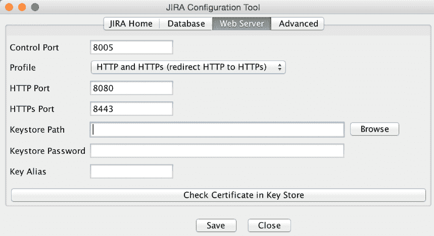

如果无法使用 JIRA 配置工具，您可以按照以下步骤手动设置配置：

1.  打开位于`JIRA_INSTALL/atlassian-jira/WEB-INF`目录下的`web.xml`文件。

1.  在文件末尾添加以下 XML 片段，紧接在`</webapp>`标签之前：

```
<security-constraint> 
 <display-name>HTTP to HTTPs Redirection</display-name> 
<web-resource-collection> 
 <web-resource-name>all-except-
 attachments</web-resource-name> 
 <url-pattern>*.jsp</url-pattern> 
 <url-pattern>*.jspa</url-pattern> 
 <url-pattern>/browse/*</url-pattern> 
</web-resource-collection> 
<user-data-constraint> 
 <transport-guarantee>CONFIDENTIAL</transport-guarantee> 
 </user-data-constraint> 
</security-constraint> 
```

1.  重启 Jira 以应用更改。

# 另见

有关将 Jira 连接到运行在 SSL 上的其他应用程序的信息，请参考下一个教程。

# 安装来自其他应用程序的 SSL 证书

您可能需要将 Jira 连接到其他服务，如 LDAP、邮件服务器和其他网站。这些服务通常使用 SSL。在这种情况下，连接将失败，您将在 Jira 日志文件中看到以下错误：

```
javax.net.ssl.SSLHandshakeException: 
sun.security.validator.ValidatorException: PKIX path building failed:  
sun.security.provider.certpath.SunCertPathBuilderException: unable to find valid certification
path to requested target
```

# 准备工作

在本教程中，我们将使用 Java 的 keytool 工具，确保您已完成以下配置：

+   从目标系统获取所需的 SSL 证书。

+   确保`JAVA_HOME`环境变量已正确设置。

+   确保您知道 Jira 正在使用哪个 JDK/JRE。您可以在**系统信息**页面找到此信息，查找`java.home`属性。

+   确保将 JRE/JDK 的`bin`目录添加到`PATH`环境变量中，`keytool`命令将输出其用法。

+   获取 Jira 使用的 Java 信任库的密码。

# 如何操作...

在本教程中，假设我们希望将 Jira 连接到一个运行在 SSL 上的 LDAP 服务器。执行以下步骤，将其设置为 Jira 中的受信任站点：

1.  打开命令提示符并进入存放证书文件的目录。

1.  通过运行`keytool -import -alias tomcat -file file.cer $JAVA_HOME/jre/lib/security/cacertscommand`将证书导入信任库，其中`file.cer`为证书文件。

1.  重启 Jira 以应用更改。

# 它是如何工作的...

当 Jira 尝试连接到一个 SSL 保护的服务时，它会首先检查目标服务的证书是否可信。这是通过检查证书是否存在于所谓的 Java 信任存储中来完成的。如果证书不存在，连接将失败。

信任存储是一个特殊的 KeyStore 库，通常称为`cacerts`，并位于服务器的`$JAVA_HOME/lib/security`目录中。

我们使用了`keytool`工具将证书导入到本地信任存储中，这样目标服务将被注册为受信任的服务，允许 Jira 成功连接到该服务。

# 重置 Jira 管理员密码

有时你可能会忘记或丢失 Jira 管理员或 Jira 系统管理员权限账户的密码，而且无法通过密码重置选项找回。例如，假设 Jira 没有配置 SMTP 服务器，或者你从数据备份恢复了 Jira 并不知道账户和/或密码。在这些情况下，你需要直接在数据库中重置管理员密码。

此方法仅适用于使用默认内部用户目录选项的 Jira 实例。外部用户管理（如 LDAP）将无法与此方法一起使用。

# 准备工作

由于我们将重置存储在 Jira 数据库中的密码，请确保你执行以下操作：

+   通过命令行或 GUI 连接到 Jira 数据库。

+   更新 Jira 数据库记录。

# 如何操作...

假设我们使用默认的`mysql`命令行工具和 MySQL 作为 Jira 的后端数据库。如果你使用的是其他数据库，可能需要相应地更改以下 SQL 语句：

1.  通过运行`mysql -u jirauser -p`命令使用客户端工具连接到 Jira 数据库，其中`jirauser`是 Jira 用来访问 Jira 数据库的用户名。

1.  你可以从`JIRA_HOME`中的`dbconfig.xml`文件找到 Jira 的数据库详细信息。

1.  通过运行`use jiradb`命令切换到 Jira 数据库，其中`jiradb`是 Jira 数据库的名称。

1.  使用以下 SQL 语句确定具有 Jira 系统管理员全局权限的组：

```
select perm_parameter from 
schemepermissions where PERMISSION=44;
```

1.  通过运行以下 SQL 语句查找属于前一步骤中返回的组的用户，其中`jira-administrators`是从前一步骤返回的组：

```
select child_name, directory_id
from cwd_membership where
parent_name='jira-administrators';
```

`jira-administrators`组是管理员默认所属的组。如果你自定义了权限配置，可能会有不同的组。用户名的表列为`child-name`。

1.  使用以下 SQL 语句在数据库中重置用户的密码，其中`admin`是前一步骤中返回的用户：

```
update cwd_user set
credential='uQieO/1CGMUIXXftw3ynrsaYLShI+
GTcPS4LdUGWbIusFvHPfUzD7
CZvms6yMMvA8I7FViHVEqr6Mj4pCLKAFQ==' where
user_name='admin';
```

1.  重启 Jira 以应用更改。

# 它是如何工作的...

使用 Jira 的内部用户目录时，所有用户和组数据都会存储在 Jira 数据库中。值`44`是 Jira 系统管理员全局权限的 ID。

如果你不知道哪些组或用户被授予 Jira 系统管理员全局权限，你首先需要通过步骤 4 和 5 找到这些信息。否则，你可以跳到步骤 6 来重置密码。

Jira 的用户密码存储在`cwd_user`表中。由于 Jira 只存储密码的哈希值，我们将用户的管理员密码哈希值更改为`uQieO/1CGMUIXXftw3ynrsaYLShI+GTcPS4LdUGWbIusFvHPfUzD7CZvms6yMMvA8I7FViHVEqr6Mj4pCLKAFQ==`，这是`sphere`的 UTF-8 编码哈希值。

# 从 CSV 导入数据

经常需要将其他系统的数据导入 Jira。例如，你可能想要迁移来自旧的缺陷跟踪系统的数据，或者如果你从其他系统中获得数据，可能希望使用这些输出填充你的项目。

由于系统通常有自己的数据结构，因此数据迁移通常不是这么简单。不过，好消息是，大多数系统都可以导出 CSV 格式的数据（或者是 Excel 格式，可以很容易地转换为 CSV 格式）；我们将在这个步骤中使用 CSV 作为将数据导入 Jira 的方式。

# 准备工作

导入数据到 Jira 时，最重要的是准备好输入数据文件，并确保其格式正确且包含所有必要的信息。为了帮助导入器，记住以下几点：

+   删除任何与数据无关的内容，特别是如果你是从电子表格中创建了 CSV 文件，这有助于减小文件大小。

+   如果你的文件包含需要导入到字段中的用户（例如**受指派人**），确保使用他们的用户名或电子邮件地址，这些信息可以与 Jira 中的对应账户匹配。

+   如果你的文件包含需要导入到字段中的日期（例如`到期日期`），确保它们都使用相同的日期格式进行格式化。这是为了确保 Jira 能够一致地处理日期值。

# 如何操作...

要从其他系统导入数据，执行以下步骤：

1.  以管理员身份登录 Jira。

1.  从顶部选择**项目**菜单，然后选择**导入外部项目**选项。

1.  选择**CSV**选项。然而，如果你在列表中看到了你的系统，可以选择该系统。使用特定系统的导入工具与 CSV 导入器的过程大致相同，只是会有一些小的差异。

1.  选择 CSV 文件作为**CSV 源文件**字段。如果这是你第一次进行导入，请不要选择**使用现有配置**选项。我们将在导入结束时生成配置，并且你可以使用此配置来加快未来的导入。

1.  如果你的文件使用不同的文件编码或使用除逗号（`,`）之外的字符作为分隔符，请展开**高级**选项。点击**下一步**按钮继续向导的第 2 步：

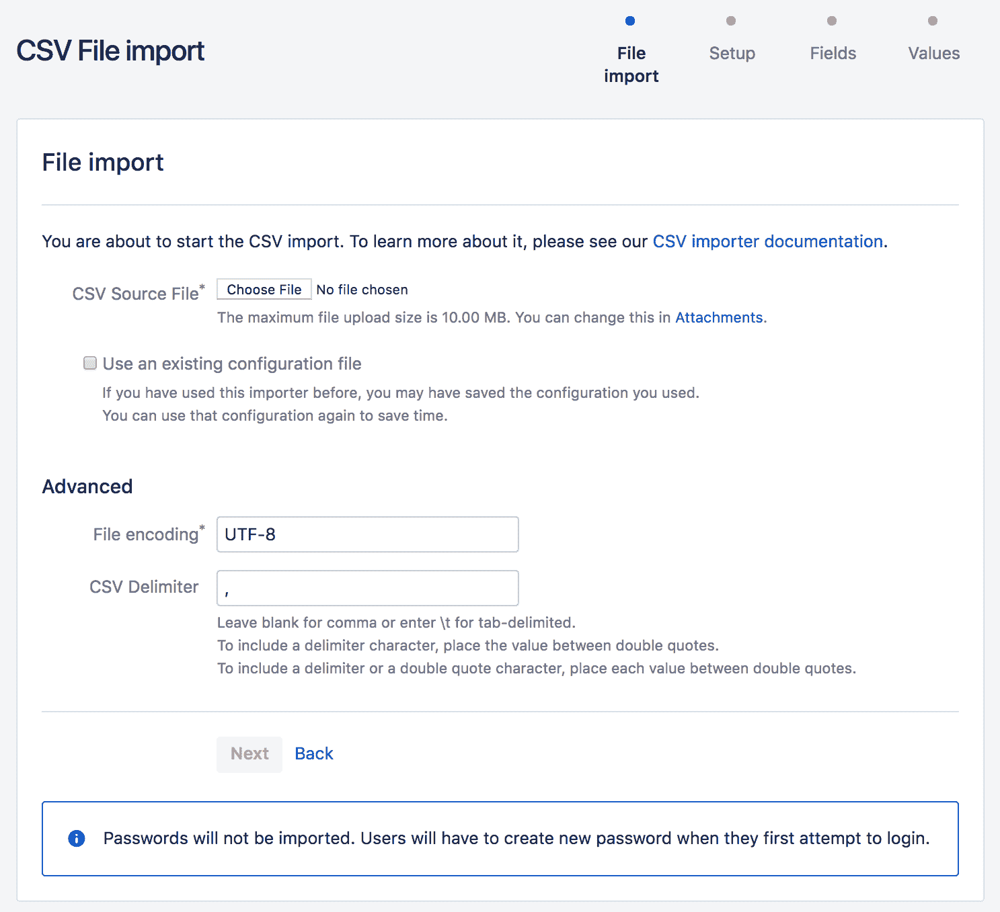

1.  选择要将数据导入到的项目。如果没有项目，可以选择**选择新建**选项并即时创建一个项目。

一般来说，最好事先创建项目，以确保其配置了正确的配置方案，例如工作流和字段。

1.  验证 CSV 文件中使用的**新用户电子邮件后缀**和**日期格式**值。这将确保诸如日期之类的数据在导入时能够正确解析，并保存在 Jira 的日期字段中，例如`到期日期`。

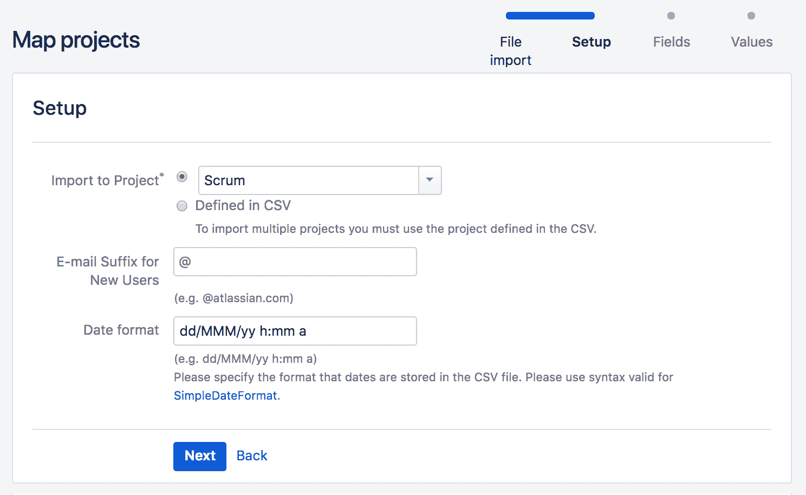

1.  选择并映射 CSV 列到 Jira 字段。某些字段，例如**摘要**字段，必须在文件中有对应的列，否则 Jira 将不允许你继续。如果你不想映射某一列，可以选择**不映射此字段**选项。

1.  选择**映射字段值**选项，用于任何映射到选定列表类型字段的列。这样，你可以将 CSV 文件列中的单个值映射到 Jira 中可用的选项。除非你确定文件内容可以精确映射到 Jira 字段选项，否则最好手动验证；否则，可能会由于例如大小写敏感问题导致重复值。

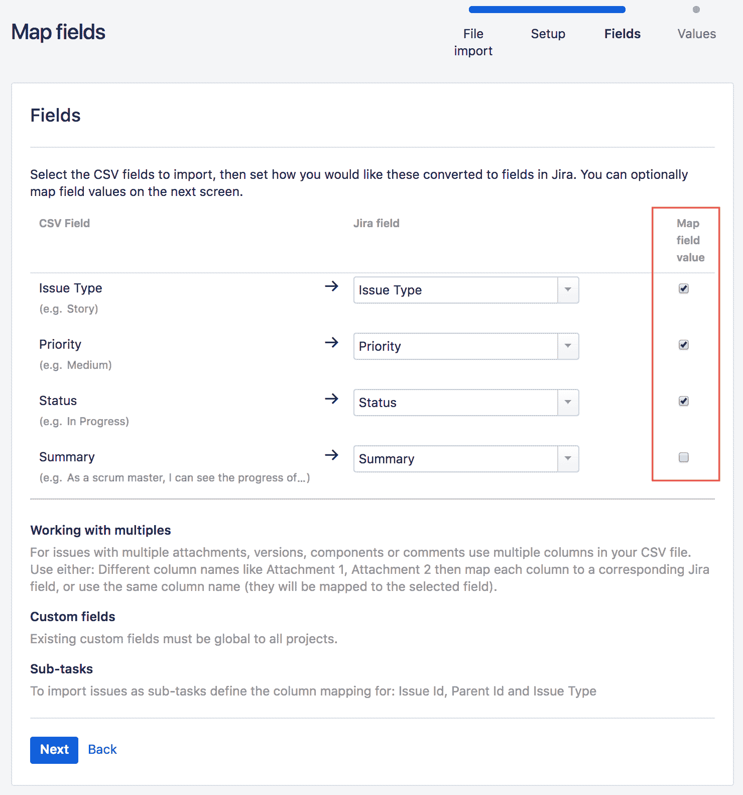

1.  如果选择映射字段值，请检查所有列出的值，并将它们映射到 Jira 中相应的字段选项。如果某个值没有选项，你可以输入所需的选项，Jira 会创建该选项。

1.  点击**开始导入**按钮开始将数据导入到 Jira 中：

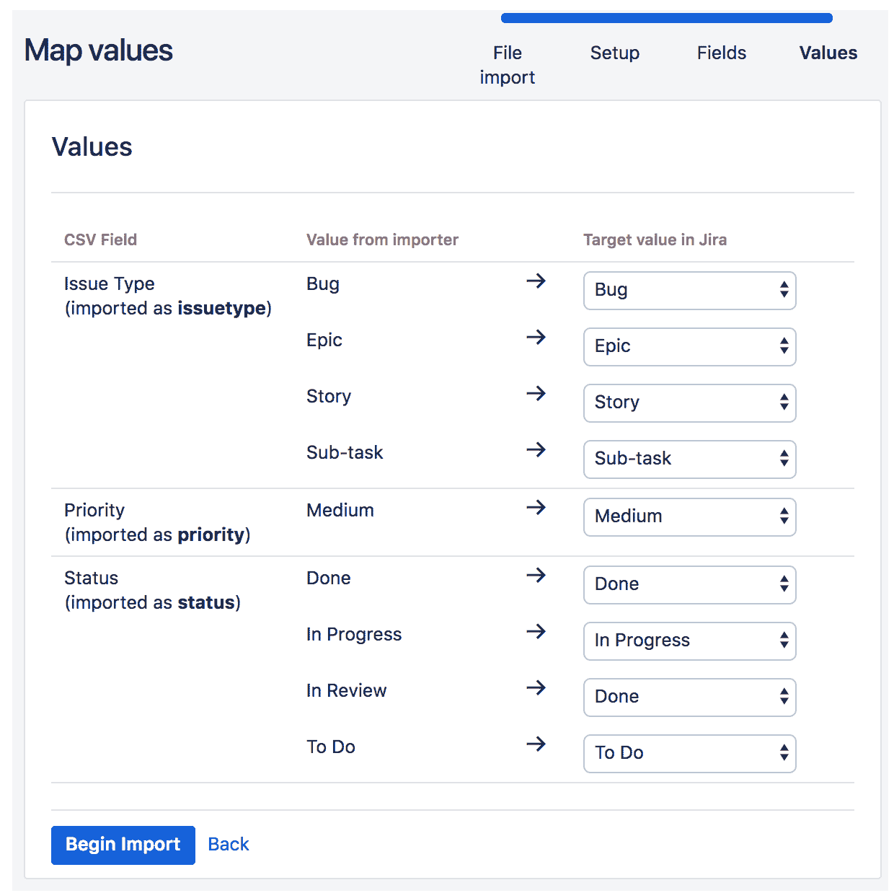

1.  导入过程完成后，检查结果。如果导入失败，你可以点击**下载详细日志**链接，获取完整的导入日志。你也可以点击**保存配置**链接，获取映射文件的副本，以便下次导入时，不必从头开始重新映射。

# 还有更多内容...

使用 CSV 文件将自定义数据导入到 Jira 是最灵活的方法，因为许多系统可以将其数据导出为 CSV 格式。然而，正如你已经注意到的，Jira 提供了多个为各种系统设计的专用导入工具。这些导入工具通常具有一些附加功能，有助于数据导入。[Atlassian 市场网站](https://marketplace.atlassian.com/)也提供了许多第三方创建的导入工具。如果你在现成的导入工具中没有找到你的系统，确保在市场中进行搜索，看看是否有人已经为其创建了导入工具。

# 在 Jira 实例之间复制配置设置

如果您有一个受控的 IT 环境，其中更改需要通过开发、测试/暂存和生产过程，那么您无疑知道在不同环境之间推广 Jira 配置更改是多么痛苦。由于 Jira 未提供原生的配置导出功能，所有更改需要手动应用到每个环境，这既费时又容易出错。

在本教程中，我们将使用一个专业工具，帮助简化这一过程。

# 准备工作

对于本教程，我们需要在源 Jira 实例和目标 Jira 实例上都安装 Jira 配置管理器插件。您可以直接从通用插件管理器安装，或通过以下链接下载：[`marketplace.atlassian.com/plugins/com.botronsoft.jira.configurationmanager`](https://marketplace.atlassian.com/plugins/com.botronsoft.jira.configurationmanager)。

# 如何操作...

Jira 配置管理器插件要求您首先创建一个快照。快照包含所有您希望复制到另一个 Jira 实例的配置设置。

您可以创建两种类型的快照：

+   **系统**：这包括 Jira 中的所有配置。

+   **项目**：这仅包括选定项目所需的配置。

按照以下步骤创建配置快照：

1.  导航到**管理** > **配置管理** > **快照**。

1.  点击“添加快照”按钮。

1.  选择创建**系统配置**或**项目配置**快照。

1.  输入快照的名称。

1.  点击**创建**按钮。以下截图展示了我们创建的快照的详细信息：

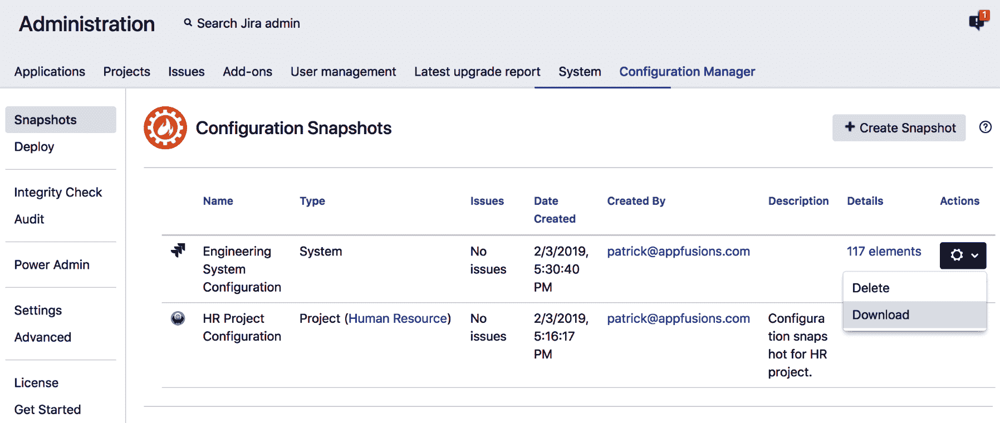

创建了快照后，我们有几种方式可以将更改推广并部署到另一个 Jira 实例。我们可以下载快照 ZIP 文件并上传，或者通过应用链接将两个 Jira 实例连接起来并远程加载快照。在本教程中，我们将使用快照文件选项。请按照以下步骤部署快照：

1.  以管理员身份登录到另一个 Jira 实例。

1.  导航到**管理** > **配置管理** > **部署**。

1.  选择**从快照文件**选项。

1.  选择快照 ZIP 文件。

1.  点击**部署**链接以开始部署。

插件将引导您完成一个部署向导，在此过程中它会分析快照的内容并确定当前的 Jira 系统是否满足所有必要的要求。例如，在以下截图中，它已经通知我们存在插件版本不匹配的问题：

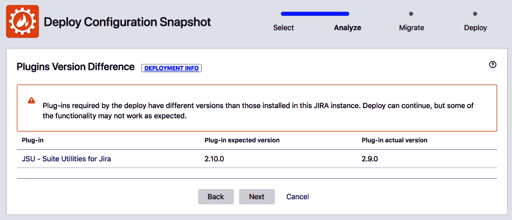

在插件确定所有要求都已满足后，它将提供一个简要总结，列出所有将要应用的变更（如下图所示）。这是一个很好的时机，可以检查变更列表，确保我们不会不小心引入不必要的变更，如下图所示：

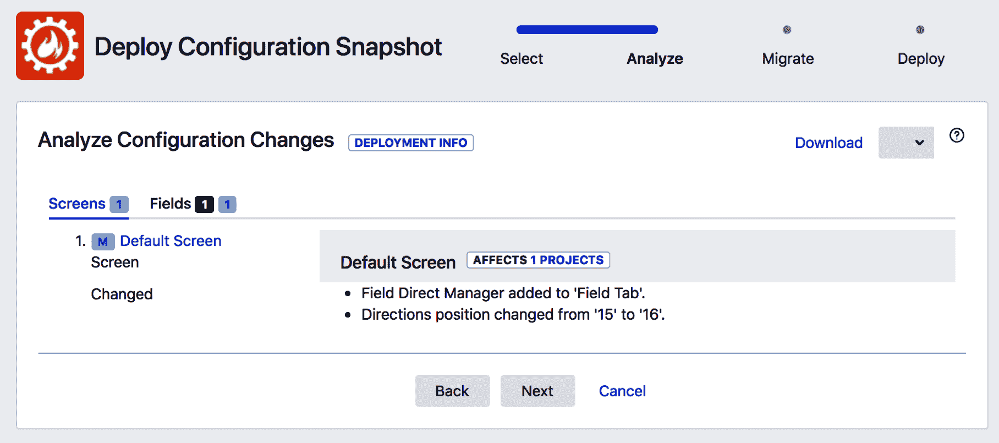

如果一切看起来正常，我们可以完成配置变更的迁移，并将其部署到目标实例。
