# 为你的项目自定义 Jira

像 Atlassian Jira 这样的信息系统的价值取决于输入其中的数据，因此不难理解，Jira 在允许你自定义字段和屏幕时非常灵活。Jira 提供了一系列默认字段，帮助你快速启动，同时也允许你添加自己的字段，这些自定义字段可以满足你独特的需求。

在本章中，我们不仅会学习如何管理 Jira 中的这些自定义字段，还会了解如何通过脚本编写，创建具有自己业务逻辑的全新自定义字段类型。

在本章中，我们将讨论以下主题：

+   为项目设置不同的缺陷类型

+   使某个字段成为必填项

+   使指派字段成为必填项

+   隐藏字段

+   创建新的字段配置

+   为你的项目设置自定义屏幕

+   移除选择列表中的“无”选项

+   为自定义字段添加帮助提示

+   使用 JavaScript 与自定义字段

+   为字段设置默认值

+   为字段添加权限

+   创建你自己的自定义字段类型

# 为项目设置不同的缺陷类型

Jira 默认提供了许多专为软件项目管理设计的缺陷类型。然而，随着时间推移，你可能会发现这些缺陷类型并不适用于所有项目，而你已经添加了自己的缺陷类型。在本节中，我们将学习如何管理缺陷类型，以便每个项目可以有自己的缺陷类型集合。

# 如何操作...

按照以下步骤设置特定于项目的缺陷类型列表：

1.  使用具有 Jira 管理员权限的用户登录 Jira。

1.  导航到“管理”>“缺陷”>“缺陷类型方案”。

1.  点击“添加缺陷类型方案”按钮。

1.  输入新的缺陷类型方案的名称。

1.  将缺陷类型从右侧拖动到左侧，以将其添加到方案中。

1.  选择默认缺陷类型。

1.  点击“保存”按钮以创建新的方案，如下图所示：

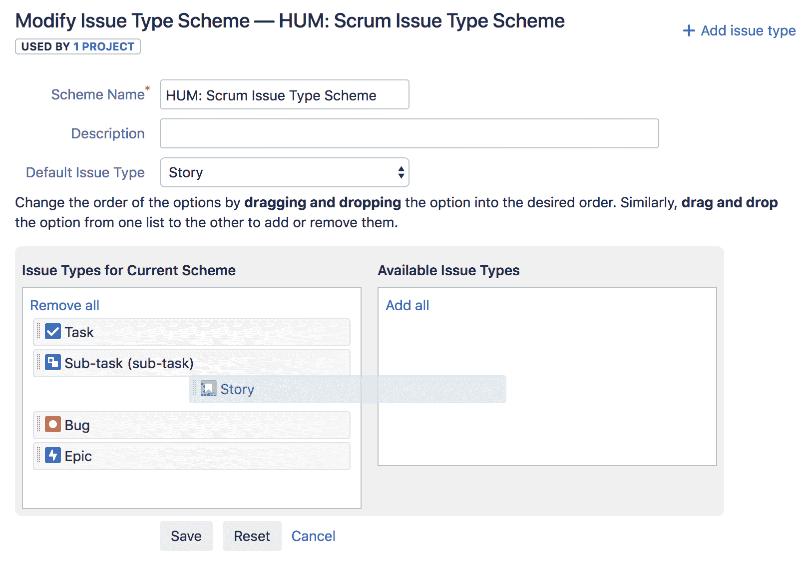

在你创建了新的缺陷类型方案后，你需要将其应用到那些你希望限制缺陷类型选择的项目中：

1.  点击新的缺陷类型方案的关联链接。

1.  选择你希望将该方案应用到的项目。

1.  点击“关联”以更改所选项目的缺陷类型方案。

如果项目中存在一些缺陷类型不在新的缺陷类型方案中，Jira 会引导你完成迁移过程，你可以在此过程中更新所有受影响的缺陷类型。

# 使某个字段成为必填项

必填字段，如“概要”和“缺陷类型”，旁边会有一个红色小星号，这意味着在创建或更新缺陷时必须填写这些字段。这是确保用户不会遗漏填写重要信息的好方法。

在本教程中，我们将展示如何通过字段配置使你选择的任何字段成为必填字段。字段配置控制字段的行为；这包括字段的强制要求、可见性、渲染器和描述。

# 如何操作...

按照以下步骤操作以使字段在 Jira 中成为必填字段：

1.  使用具有 Jira 管理员权限的用户登录 Jira。

1.  导航到 Administration > Issues > Field Configurations。

1.  点击项目和问题类型使用的字段配置的 Configurelink。

1.  点击所需字段的 Requiredlink，以使其成为必填字段，例如 Due Date。

一旦你将字段标记为必填字段，例如我们这个案例中的 **Due Date**，在创建或编辑问题时，Jira 会确保该字段输入了一个值，如下图所示：

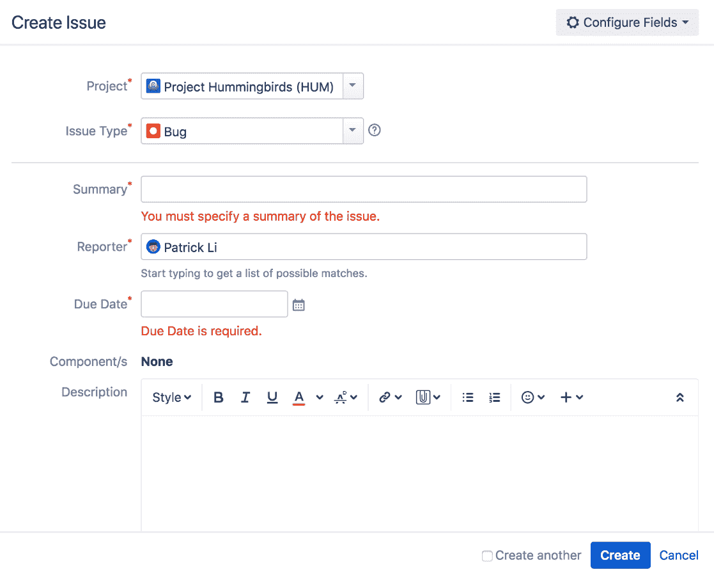

现在我们将看看这些步骤是如何工作的。

# 它是如何工作的...

当字段被标记为必填时，Jira 会检查在你更新问题（例如编辑或在工作流转换期间）时该字段是否有值。即使该字段未出现在屏幕上，验证仍会被应用，因此请确保不要在屏幕上设置不需要的字段；否则，用户将无法完成操作。

某些字段，例如 Assignee 和 Due Date，要求用户具有特定的权限才能进行更新。如果用户没有必要的权限，验证将失败，并阻止用户完成操作。

# 还有更多...

点击 Optional 链接将使该字段变为非必填字段。某些字段，例如 **Summary** 和 **Issue Type**，必须是必填的。

# 另请参见

请参考 *Making the Assignee field required* 教程，了解如何禁用未分配选项。

# 将 Assignee 字段设置为必填字段

默认情况下，Assignee 字段具有未分配选项，这相当于将该字段设置为可选。如果查看字段配置，你会发现你无法将 Assignee 字段设置为必填字段，因为没有可用的选项。

在本教程中，我们将展示如何禁用未分配选项，从而使 Assignee 成为必填字段。

# 准备工作

请注意，以下条件是禁用每个项目的未分配选项所必需的：

+   当前在 Assignee 字段使用该选项的问题—你需要将所有 Assignee 值为 Unassigned 的问题更改为其他值。

+   项目将 Unassigned 设置为默认 Assignee—你需要更改项目中“用户和角色”部分的默认 Assignee 设置。

# 如何操作...

按照以下步骤操作以禁用未分配选项：

1.  使用具有 Jira 管理员权限的用户登录 Jira。

1.  导航到 Administration > System。

1.  点击 Edit Settings 按钮。

1.  向下滚动并选择 OFFoption 以禁用 **Allow unassigned issues**。

1.  点击 **更新** 来应用更改。

看一下下面的截图：

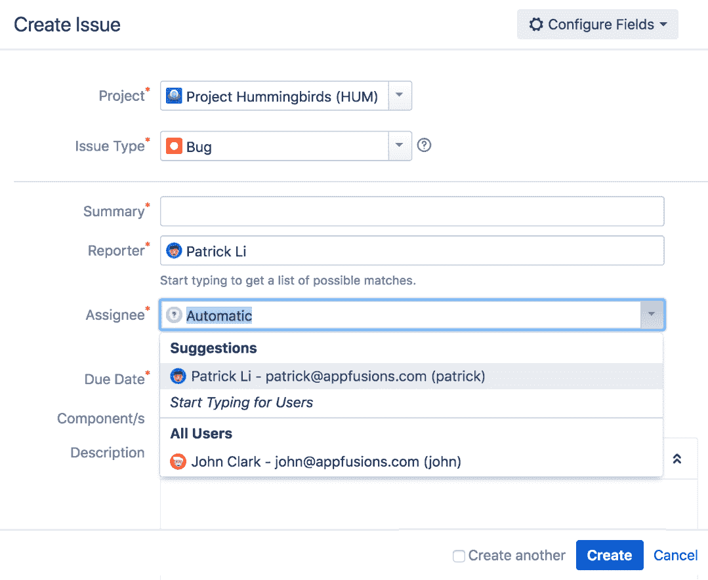

如你所见，一旦禁用该选项，问题将无法再被解除分配。

# 隐藏字段视图

有时候某个字段不再需要使用。遇到这种情况时，你可以选择隐藏该字段，而不是删除它，因为删除字段会同时删除所有数据。如果之后你需要再次使用该字段，你可以简单地取消隐藏它，并且保留所有数据。

在此方案中，我们将隐藏 **优先级** 和 **到期日期** 字段。

# 如何操作...

按照以下步骤在 Jira 中隐藏字段：

1.  以具有 Jira 管理员权限的用户身份登录 Jira。

1.  进入 管理 > 问题 > 字段配置。

1.  点击该项目和问题类型使用的字段配置的 **配置** 链接。

1.  点击 **隐藏** 链接来隐藏 **优先级** 和 **到期日期** 字段。

点击 **显示** 链接将展示该字段。你不应该隐藏必填字段。

# 还有更多...

使用字段配置是隐藏字段的一种方法。还有两种其他方法可以让字段在视图中隐藏：

+   从屏幕上移除字段。注意，对于查看屏幕，像摘要和描述这样的默认字段无论是否被放置在屏幕上，都会显示出来。

+   限制字段配置方案，使其不适用于项目/问题类型上下文。你可以通过点击自定义字段的配置并取消选择你不希望该字段可用的 **项目/问题** 类型来实现。

使用字段配置隐藏字段将使其在适用的项目和问题类型的所有屏幕中都被隐藏，因此，如果你只想在特定的屏幕上隐藏字段，不应使用字段配置，而应该简单地将字段从相应的屏幕中移除。例如，如果你想在问题创建后将字段设为只读，可以简单地将其从分配给编辑问题操作的屏幕中移除。移除字段时要格外小心；与字段配置不同，移除屏幕字段时没有任何安全措施来防止你移除必填字段。因此，如果该屏幕用于创建问题，那么用户将无法提供缺失字段的值，从而导致无法继续操作。

# 创建新的字段配置

你可以通过字段配置来设置字段的行为。Jira 不仅提供了一个默认的字段配置，默认应用于所有项目和问题类型，而且它还允许你创建自己的字段配置，这样你就可以选择将字段配置应用到特定的项目和/或问题类型。

在这个方案中，我们将使 **描述** 和 **指派人** 字段仅对 Bug 问题类型是必填的。

# 如何操作...

设置一个新的字段配置是一个三步过程。第一步是创建新的字段配置：

1.  使用具有 Jira 管理员权限的用户登录 Jira。

1.  导航至 管理 > 问题 > 字段配置。

1.  点击 **添加字段配置**按钮，并命名为 `HUM: Bug 字段配置`，点击 添加。

1.  点击 **描述** 和 **负责人** 字段的必填链接。

第二步是将新的字段配置与新的字段配置方案关联：

1.  导航至 管理 > 问题 > 字段配置方案。

1.  点击 添加字段配置方案按钮 并将其命名为 `HUM: Bug 字段配置方案`。点击 添加。

1.  点击 **将问题类型与字段配置关联** 按钮。

1.  选择**Bug**作为 **问题类型**，**HUM: Bug 字段配置**作为 **字段配置**，然后点击添加，如下图所示：

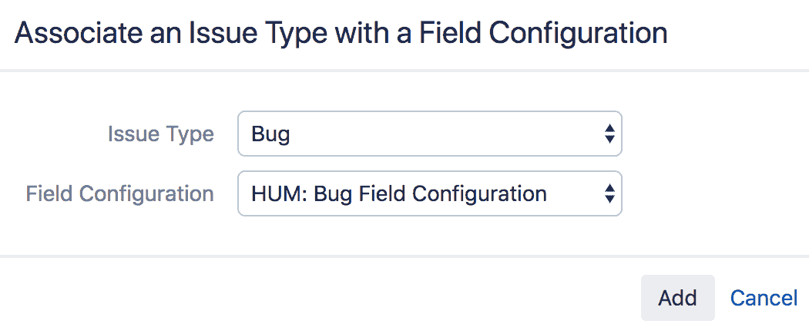

最后一步是将新的 字段配置 方案应用到我们的项目中：

1.  导航至 **管理** > **项目**。

1.  从列表中选择一个项目。

1.  从左侧面板选择字段。

1.  导航至 **操作** > 使用不同方案。

1.  选择新的 `HUM: Bug 字段配置方案` 选项，然后点击 **关联**。

# 为您的项目设置自定义屏幕

Jira 默认提供三个屏幕——**默认**屏幕、**解决问题**屏幕和**工作流**屏幕。

在本教程中，我们将学习如何从零开始创建一个新屏幕，然后在创建新任务问题时使其显示。

# 如何操作...

屏幕是 Jira 中最复杂的配置之一。要创建一个新屏幕并应用它，通常需要配置多个方案。因此，我们将这些步骤分为三个逻辑组。

首先，我们需要创建新的屏幕：

1.  使用具有 Jira 管理员权限的用户登录 Jira。

1.  导航至 管理 > **问题** > **屏幕**。

1.  点击 **添加屏幕** 按钮，并将新屏幕命名为 `HUM: Scrum 任务创建屏幕`。点击 **添加**。

1.  选择并添加 **概要**、**问题类型**、**描述**、**负责人**、**描述**和**优先级**字段，如下图所示：

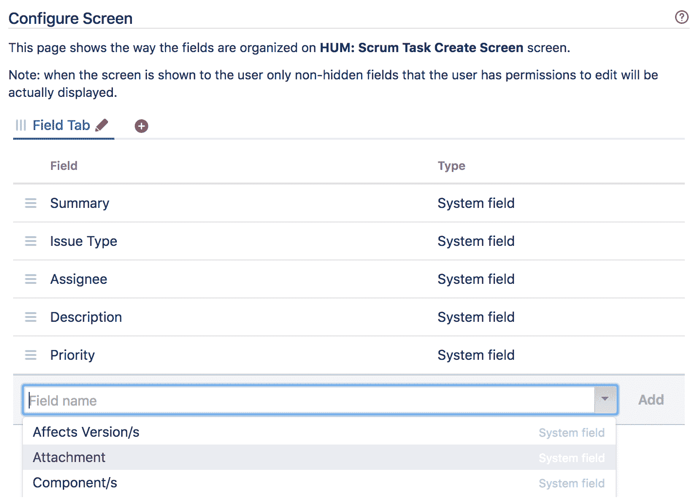

第二步，我们需要将新的任务创建屏幕分配给创建问题操作：

1.  导航至 **管理** > **问题** > **屏幕方案**。

1.  点击 **添加屏幕方案** 按钮，命名新屏幕为 `HUM: Scrum 任务屏幕方案`，选择 **默认屏幕** 作为 **默认屏幕** 选项，然后点击 添加。

1.  点击 **将问题操作与屏幕关联** 按钮。

1.  选择**创建问题**作为 **问题操作**，**HUM: Scrum 任务创建屏幕**作为 **屏幕**，然后点击 **添加**，如下图所示：

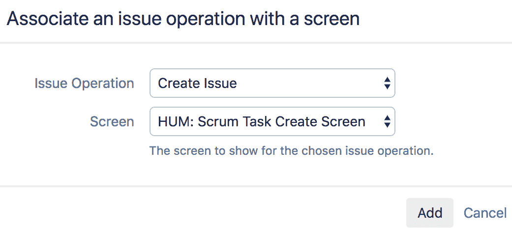

第三步，我们需要将新的 `任务屏幕方案` 分配给任务问题类型：

1.  导航至 **管理** > **问题** > **问题类型屏幕方案**。

1.  点击**添加问题类型屏幕方案**按钮，并将新屏幕命名为`HUM: Scrum Task Issue Type Screen Scheme`。

1.  选择默认屏幕方案作为 **屏幕方案** 选项，然后点击添加。

1.  点击**将问题类型与屏幕方案关联**按钮。

1.  选择**问题类型**为 Task，**屏幕方案**为 HUM: Scrum Task Screen Scheme，然后点击**添加**，如下图所示：

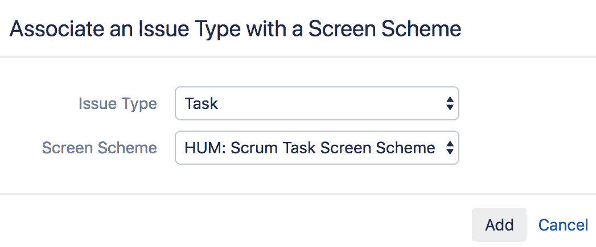

最后，我们需要将新的 screen `Task Issue Type Screen Scheme` 应用于项目：

1.  导航到 **管理** > **项目**。

1.  从列表中选择一个项目。

1.  从左侧窗格中选择 Screens。

1.  导航到 **操作** > **使用不同的方案**。

1.  选择新的**任务问题类型屏幕方案**，然后点击**关联**。

# 它是如何工作的...

屏幕是 Jira 配置中最复杂的部分之一。当我们创建一个新屏幕时，我们需要将它与三个问题操作之一（创建、编辑和查看）通过屏幕方案进行关联。在我们的方案中，我们将新的任务创建屏幕与“创建问题”操作进行了关联。

屏幕方案需要与问题类型关联，这样 Jira 才能根据选择的问题类型来确定使用哪个屏幕方案。

最后，我们将问题类型屏幕方案应用于项目，因此只有选定的项目会使用关联的屏幕。现在看看下面的示意图：

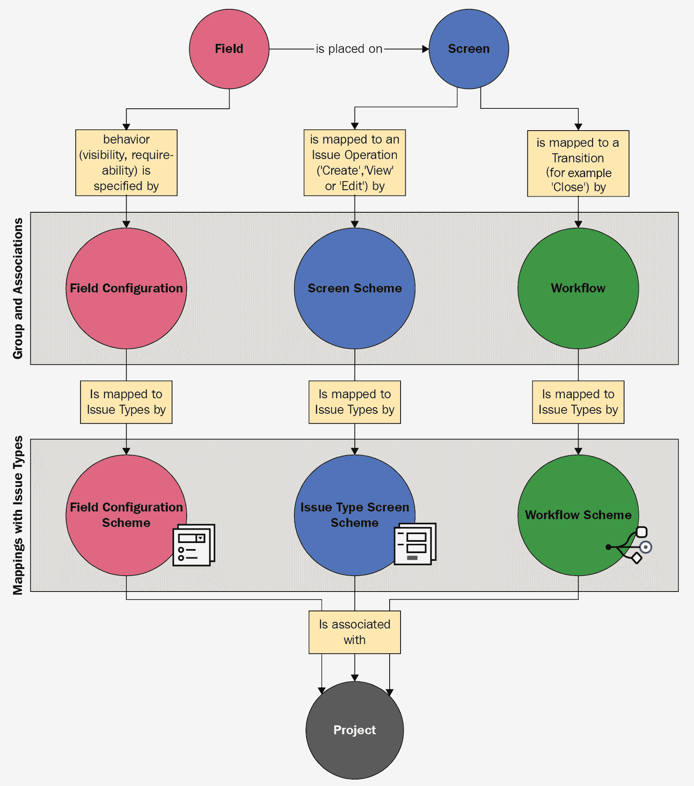

它提供了屏幕、字段及其各种方案之间关系的全面示例。

# 移除选择列表的 None 选项

自定义字段类型，如选择列表（单选和多选），都带有**None**选项，唯一移除它的方法是将该字段设为必填。虽然这有其道理，但追踪每个字段和配置可能会很麻烦。

在这个方案中，我们将从所有单选列表自定义字段中移除“None”选项。

# 正在准备中

由于我们将修改 Jira 中的物理文件，你可能需要对我们修改的文件进行备份。

# 如何操作...

Jira 使用 Velocity 模板来渲染自定义字段。这些模板大多是 HTML 格式，并包含一些特殊符号。你可以在 `JIRA_INSTALL/atlassian-jira/WEB-INF/classes/templates/plugins/fields` 目录下找到所有这些文件，编辑视图模板位于 `edit` 子目录中：

1.  在文本编辑器中打开`edit-select.vm`文件（位于前述目录），并移除以下代码片段：

```
#if (!$fieldLayoutItem || $fieldLayoutItem.required ==  false)  
 <option value="-1">
  $i18n.getText("common.words.none")
 </option> 
#else 
 #if ( !$configs.default ) 
  <option value="">  
   $i18n.getText("common.words.none") 
  </option> 
 #end 
#end
```

1.  保存文件并重启 Jira。确保不要更改其他任何行。

你可以通过编辑相应的文件（例如，`edit-multiselect.vm`）从其他自定义字段类型（如多选）中移除“None”选项。

# 它是如何工作的...

Velocity `.vm` 模板文件是 Jira 用来渲染自定义字段 HTML 的文件。我们移除的代码片段是用来显示“无”选项的。请注意，通过更改模板，我们会移除 Jira 中所有单选自定义字段的“无”选项。如果你只想为某个自定义字段或仅针对特定项目移除**无**选项，请参考*使用 JavaScript 与自定义字段*教程。

# 向自定义字段添加帮助提示

新用户在使用 Jira 时，填写字段，尤其是自定义字段，常常会感到困惑。因此，作为管理员，你需要提供有用的提示和描述，解释一些字段的用途。

在本教程中，我们将为一个名为**团队**的客户字段添加帮助图标。你可以将此教程应用于 Jira 中任何自定义字段。

# 如何操作...

按照以下步骤将帮助提示添加到自定义字段：

1.  使用具有 Jira 管理员权限的用户登录 Jira。

1.  导航到**管理** > **问题** > **自定义字段**。

1.  点击自定义字段的**编辑**链接。

1.  将以下 HTML 代码片段输入到**描述**文本框中，然后点击**更新**。你可能需要将`href`的值替换为包含帮助文本的实际页面：

```
        Need help to work out assignment? 
        <a class="help-lnk" href="/secure/ShowConstantsHelp.jspa?decorator=popup#Teams" 
        data-helplink="local" target="_blank"> 
          <span class="aui-icon aui-icon-small aui-iconfont-help"></span> 
        </a>
```

以下截图显示了我们新的帮助图标：

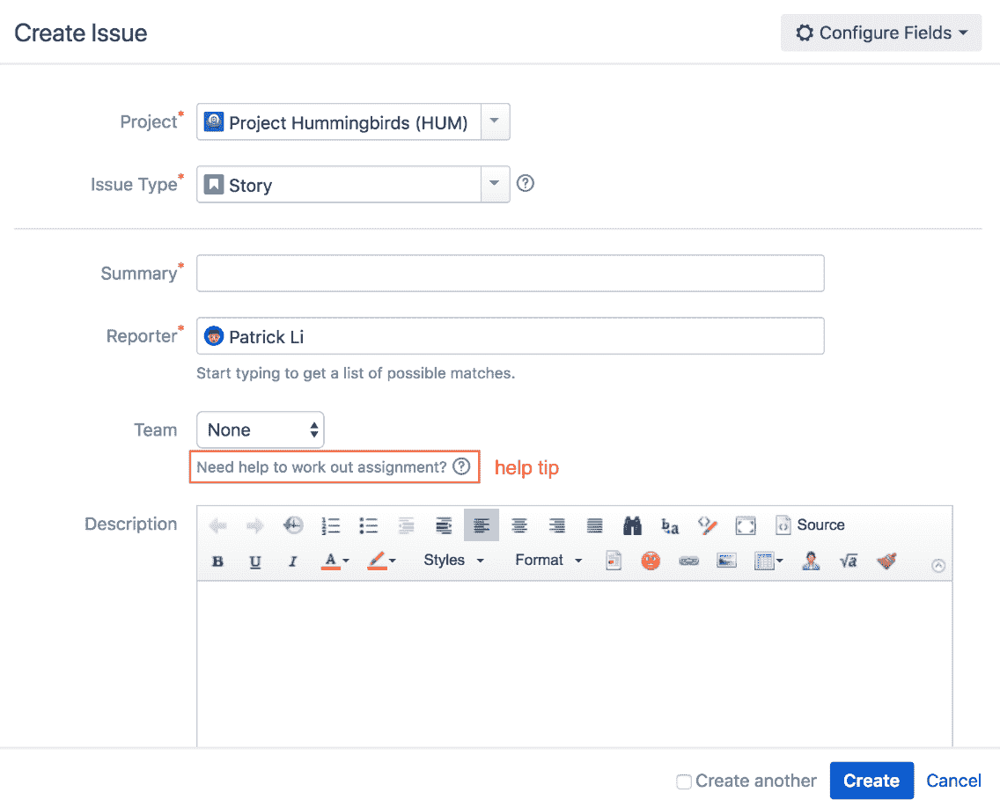

接下来，我们将逐步讲解这些步骤的工作原理。

# 工作原理...

Jira 允许我们使用任何有效的 HTML 来进行自定义字段描述，因此我们添加了一些简单的文本和一个`anchor`标签，链接到包含帮助信息的 HTML 页面。我们还添加了一个带有适当样式类的`span`标签，以便使用与问题类型和优先级字段相同的问号图标。

`data-helplink="local"`属性用于`anchor`标签，确保当用户点击帮助图标时，帮助页面将在单独的页面中打开，而不是重定向当前页面。

由于自定义字段的描述会按原样呈现，确保你验证 HTML 内容；例如，关闭所有 HTML 标签。

# 还有更多...

通常，我们将描述直接放入自定义字段的描述文本框中，如演示所示。你也可以将描述放入字段配置设置中，比如隐藏某个字段。这样做有以下优点：

+   你可以为不同的项目/问题类型上下文提供不同的帮助文本。

+   你可以为非自定义字段设置帮助文本，例如**摘要**和**描述**。

按照以下步骤在字段配置中设置字段描述：

1.  导航到**管理** > **问题** > **字段配置**。

1.  点击项目和问题类型使用的字段配置的**配置**链接。

1.  点击字段的**编辑**链接。

1.  将 HTML 代码片段输入到**描述**字段中，并点击更新。

# 另见

请参考 *使用 JavaScript 与自定义字段* 的教程，了解更多你可以在自定义字段描述中使用的技巧。

# 使用 JavaScript 与自定义字段

可以使用 JavaScript 来操作自定义字段的 HTML。通过在自定义字段的描述中添加 JavaScript 代码，并将代码包裹在 `<script>` 标签中，Jira 将在渲染自定义字段时执行这些代码。

在本教程中，我们将学习另一种方法，来从下拉列表类型的自定义字段中移除 None 选项。

# 准备工作

本教程使用了 jQuery JavaScript 库，Jira 中已捆绑此库。如果你不熟悉 jQuery，可以访问 [`jquery.com`](http://jquery.com/) 查阅文档。

我们还需要在脚本中使用自定义字段的 ID，因此你需要准备好该 ID。你可以通过访问 **自定义字段** 页面，点击目标字段的 **编辑** 链接，并点击 URL 末尾的数字来找到该字段的 ID。例如，以下 URL 显示了一个 ID 为 `10103` 的自定义字段：

`http://jira.localhost.com:8080/secure/admin/EditCustomField!default.jspa?id=10103`

# 如何操作...

请按照以下步骤，将 JavaScript 添加到自定义字段描述中：

1.  使用具有 Jira 管理员权限的用户登录 Jira。

1.  导航到 管理 > 问题 > 自定义字段。

1.  点击自定义字段的 **编辑** 链接。

1.  将以下 JavaScript 代码片段输入到 **描述** 文本框中，并点击 **更新**。你需要将其替换为你自定义字段的 ID：

```
<script> 
 AJS.$('#customfield_10103 option[value="-  1"]').remove(); 
</script>
```

以下截图展示了 Team 自定义字段：

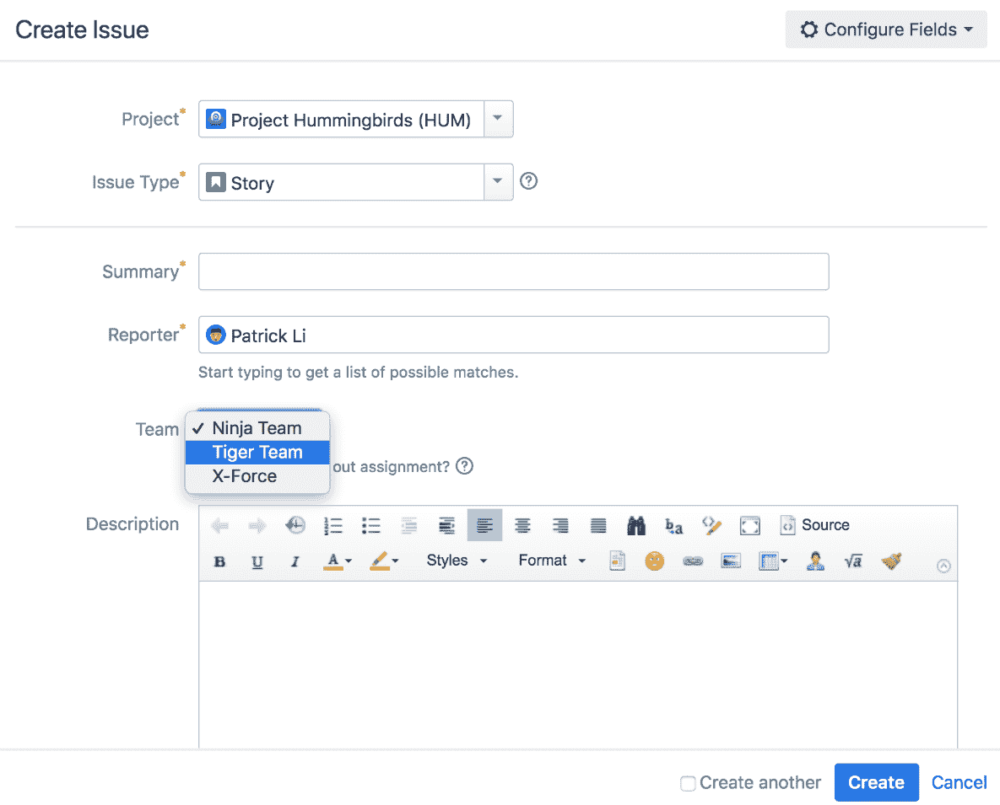

如你所见，None 选项不再可用。

# 它是如何工作的...

在我们的脚本中，我们使用 jQuery 根据元素 ID 选择 Team 自定义字段，并通过 `#customfield_10103 option[value="-1"]` 选择器删除值为 `-1`（即 None 选项）的选项。

我们使用 **Atlassian JavaScript** (**AJS**) 命名空间（`AJS.$`），这是在 Jira 中使用 jQuery 的推荐方法。

# 设置字段的默认值

随着你在屏幕上添加越来越多的字段，用户可能会感到不知所措，尤其是对于像描述这样的自由文本字段。用户往往会按照自己的方式输入数据。为了解决这个问题，一种方法是为某些字段设置默认值作为说明，帮助引导用户输入。对于那些使用过其他系统（如 GitHub）的人来说，这是一个常见的做法。

在本教程中，我们将学习如何为描述字段设置默认值，以便在创建 bug 报告时为用户提供操作说明。

# 准备工作

对于这个食谱，我们需要安装 ScriptRunner for Jira 插件。你可以从以下链接下载，或者直接从通用插件管理器安装它，链接为 [`marketplace.atlassian.com/plugins/com.onresolve.jira.groovy.groovyrunner`](https://marketplace.atlassian.com/plugins/com.onresolve.jira.groovy.groovyrunner)。

你可能还想了解一下 Groovy 脚本，相关资料可以参考 [`groovy-lang.org`](http://groovy-lang.org)[.](http://groovy.codehaus.org/)

# 如何做...

一旦你安装了 ScriptRunner for Jira 插件，我们首先需要创建一个所谓的行为：

1.  使用具有 Jira 管理员权限的用户登录 Jira。

1.  导航到 **管理 >** **管理应用 >** **行为**。

1.  通过为其输入名称并点击 **添加** 按钮来创建一个新行为。

创建了新的行为后，我们需要首先创建一个映射，以便 Jira 知道该将该行为应用于什么：

1.  点击我们创建的新行为的“添加映射”链接。

1.  选择所有项目和 Bug 问题类型进行我们的映射。

1.  点击 **添加映射** 按钮来保存设置。

创建了映射后，我们现在可以开始设置默认值：

1.  点击我们创建的新行为的 **字段** 链接。

1.  点击 **创建初始化器** 链接：

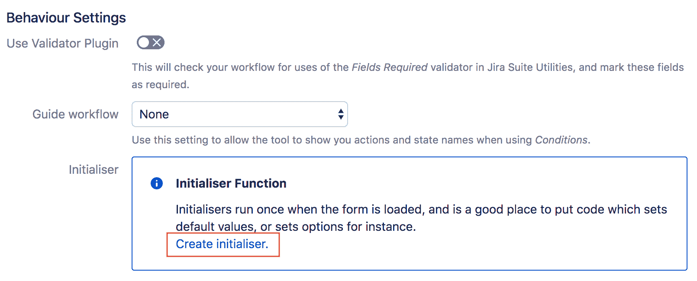

1.  将以下代码输入到文本编辑器中：

```
1\.     def desc = getFieldById("description")
2\.     def defaultValue = ""
3\.     h2\. Describe the problem
4\.     Tell us in details what the problem you are having.
5.
6\.     h2\. How to reproduce
7\.     List out the steps to reproduce the problem.
8\.     * step 1
9\.     * step 2
10.
11\.    h2\. Expected Result
12\.    Tell us what you think the correct outcome should be after completing the steps 13\.    listed above.
14.
15\.    h2\. Actual Result
16\.    Tell us what you actually see after completing the steps listed above."""
17.
18\.    if (!underlyingIssue?.description) {
19\.        desc.setFormValue(defaultValue)
20\.    }
```

1.  点击 **保存** 来保存我们的更改。

现在，如果你尝试创建一个新的 Bug 问题，你应该会看到描述字段已经预填充了我们的默认值，如下所示：

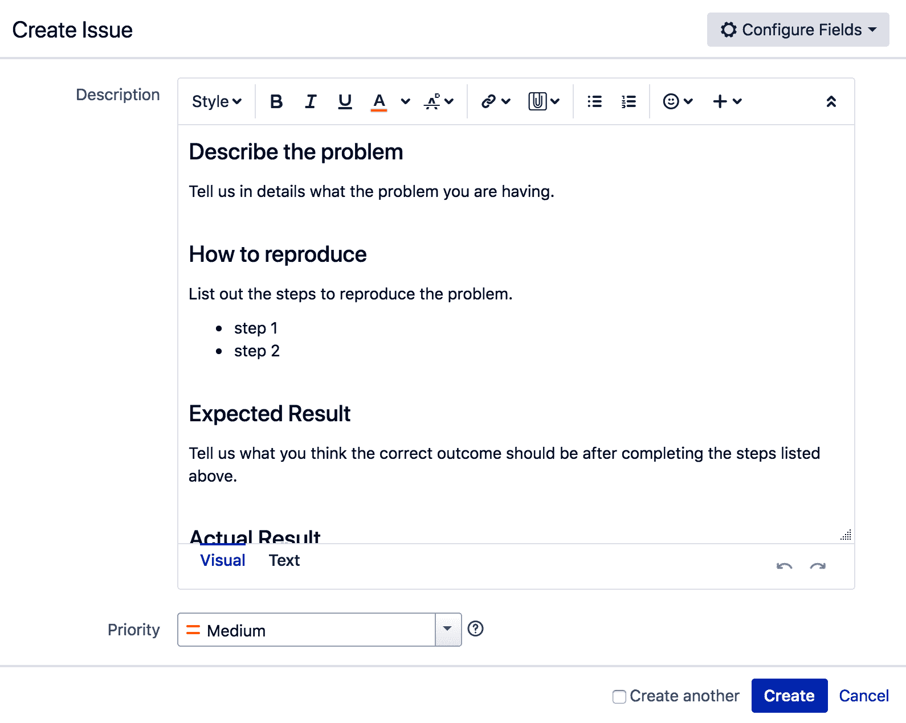

我们现在来看看这些步骤是如何工作的。

# 它是如何工作的...

我们的代码是用 Groovy 编写的，它与 Jira 使用的技术 Java 非常相似。我们首先尝试获取第 #1 行的 `Description` 字段，在第 #3 到第 #20 行之间，我们使用 wiki 标记语言，这是 Jira 内置编辑器使用的标记语言，用于以指令的形式创建默认值。在第 #18 行，我们检查该问题是否已经设置了描述值，例如用户输入的内容，如果没有，我们将在第 #19 行应用我们的默认值。

# 向字段添加权限

默认情况下，Jira 提供了多个权限级别，从系统级别到问题级别，可以控制谁应该访问问题。虽然这通常已经足够，但你会发现有时需要将权限应用于单个字段。例如，你可能希望某个字段如描述对所有人只读，但只有特定用户组可编辑。

一个选择是创建你自己的自定义字段类型，如后面食谱中描述的那样，并将权限要求作为字段的一部分进行编码，但这种方法需要编程，并且无法应用于不是由你创建的字段。

在本食谱中，我们将介绍一种将字段级权限应用于系统字段和自定义字段的选项。

# 准备工作

对于本教程，我们需要安装 ScriptRunner for Jira 插件。你可以从以下链接下载，或者直接通过[`marketplace.atlassian.com/plugins/com.onresolve.jira.groovy.groovyrunner`](https://marketplace.atlassian.com/plugins/com.onresolve.jira.groovy.groovyrunner)在 Universal Plugin Manager 中安装。

# 如何操作...

安装了 ScriptRunner for Jira 插件后，我们首先需要创建一个被称为行为的内容：

1.  使用具有 Jira 管理员权限的用户登录 Jira。

1.  进入**管理** > 管理应用 > **行为**。

1.  通过输入名称并点击**添加**按钮创建一个新行为。

创建新行为后，我们需要首先创建一个映射，这样 Jira 才知道将行为应用到什么内容：

1.  点击我们创建的新行为的**添加映射**链接。

1.  选择你想应用行为的项目和问题类型。如果你希望此行为为全局性，可以选择“所有项目”和“所有问题类型”选项。

1.  点击**添加映射**按钮以保存设置。

创建好映射后，我们可以开始设置字段级权限行为：

1.  点击我们创建的新行为的**字段**链接。

1.  选择要应用字段级权限的字段。

1.  切换可用的行为选项，如下所示：

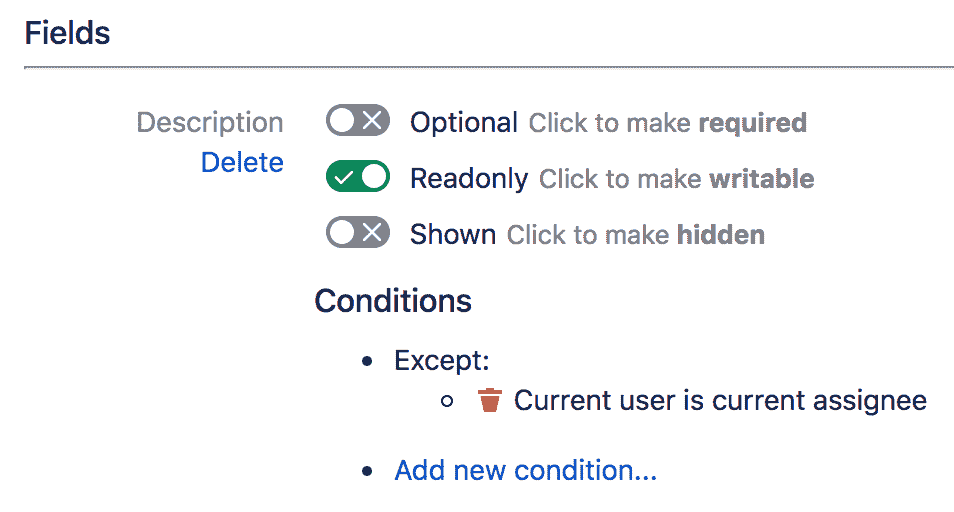

1.  点击**添加新条件**链接，选择该权限应应用于哪些用户。在以下截图中，权限将应用于除`jira-administrators`组用户以外的所有人：

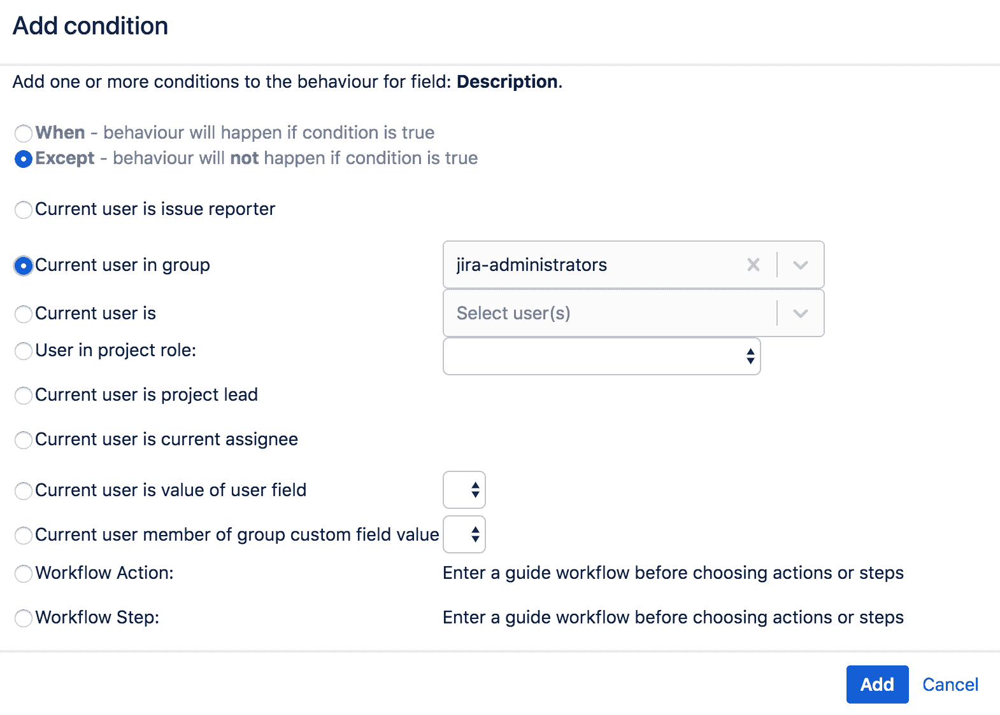

1.  点击**添加**按钮以添加条件。

1.  添加字段和条件后，点击**保存**按钮。

一旦我们创建并配置了字段级权限，所做的更改将根据我们配置的映射立即应用到目标问题。请查看下一张截图：

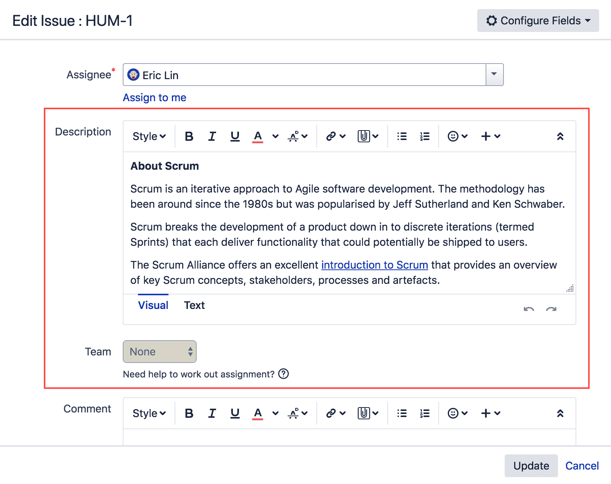

如你所见，当用户编辑问题时，描述字段（一个系统字段）和团队字段（一个自定义字段）处于只读模式。

# 创建自定义字段类型

Jira 自带的所有自定义字段都有预定义的用途，例如文本字段，允许用户输入一些简单文本。通常，拥有一个完全符合需求的专业自定义字段会非常有用。不幸的是，这通常需要自定义开发工作。

但是，有一个插件提供了一个自定义字段类型，允许您使用 Groovy 脚本来驱动其逻辑。

在这个教程中，我们将展示如何创建一个使用 Groovy 脚本来显示某个问题所有评论总数的自定义字段。

# 准备工作

对于此教程，我们需要安装**Jira 的 ScriptRunner**插件。你可以从以下链接下载它，或直接通过 Universal Plugin Manager 安装它：[`marketplace.atlassian.com/plugins/com.onresolve.jira.groovy.groovyrunner`](https://marketplace.atlassian.com/plugins/com.onresolve.jira.groovy.groovyrunner)。

你也可以了解一下 Groovy 脚本语言，访问[`groovy-lang.org`](http://groovy-lang.org)。

# 如何操作...

创建脚本化字段是一个两步过程。我们首先需要在 Jira 中创建自定义字段的实例，然后将脚本添加到该字段：

1.  使用具有 Jira 管理员权限的用户登录 Jira。

1.  导航到**管理** > **问题** > **自定义字段**。

1.  点击“添加自定义字段”按钮，并从对话框中选择**高级**。

1.  向下滚动并从列表中选择**脚本化字段**；点击**下一步**，如以下截图所示：

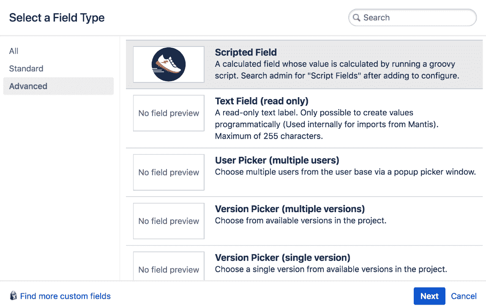

1.  将我们的新自定义字段命名为`Total Comments`并将其添加到相应的界面。

1.  导航到**管理** > **管理应用** > **脚本字段**。

1.  选择`Total Comments`字段的**编辑**选项。

1.  在脚本文本框中输入以下 Groovy 脚本：

```
import com.atlassian.jira.component.ComponentAccessor
import com.atlassian.jira.issue.comments.CommentManager 

def commentManager = ComponentAccessor.getCommentManager()
def numberOfComments = commentManager.getComments(issue).size() 

return numberOfComments ? numberOfComments as Double : null
```

1.  选择**数字字段**作为**模板**，然后点击**更新**，如以下截图所示：

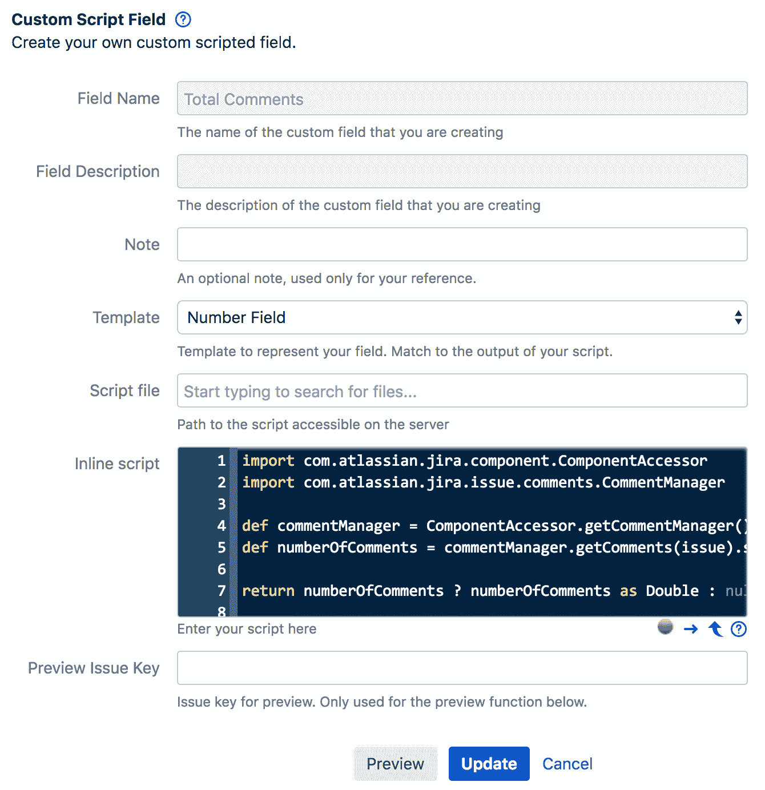

当自定义字段添加到问题中时，它将自动实时计算该问题的评论数量，如以下截图所示：

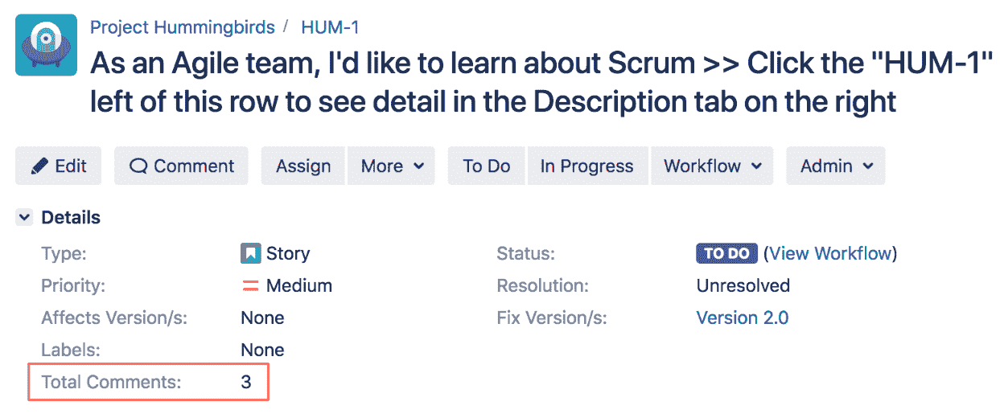

现在是时候了解具体步骤了。

# 它是如何工作的...

脚本化字段类型是所谓的计算自定义字段类型的示例。计算自定义字段类型是一种特殊的自定义字段，它根据一些预定义的逻辑（在本例中为我们的 Groovy 脚本）推导（计算）其值。每次显示该字段时，Jira 都会重新计算该字段的值，以确保始终保持最新状态。
