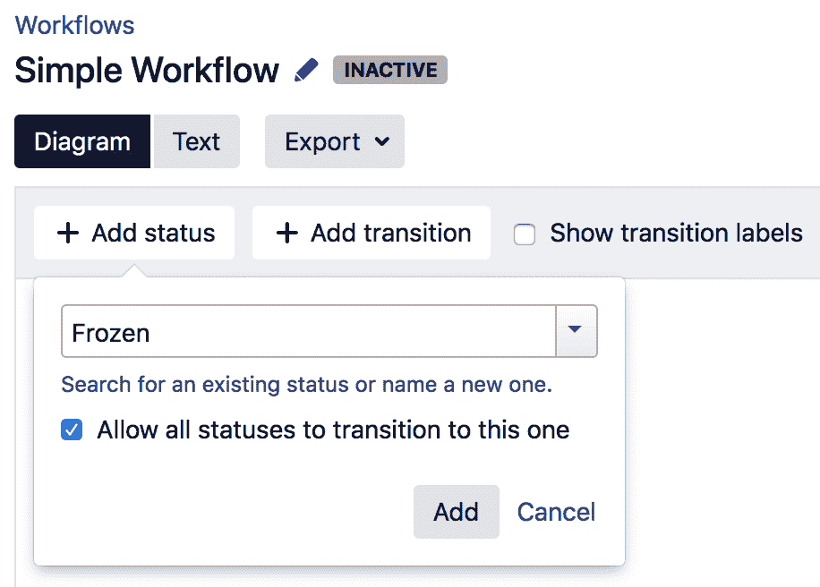
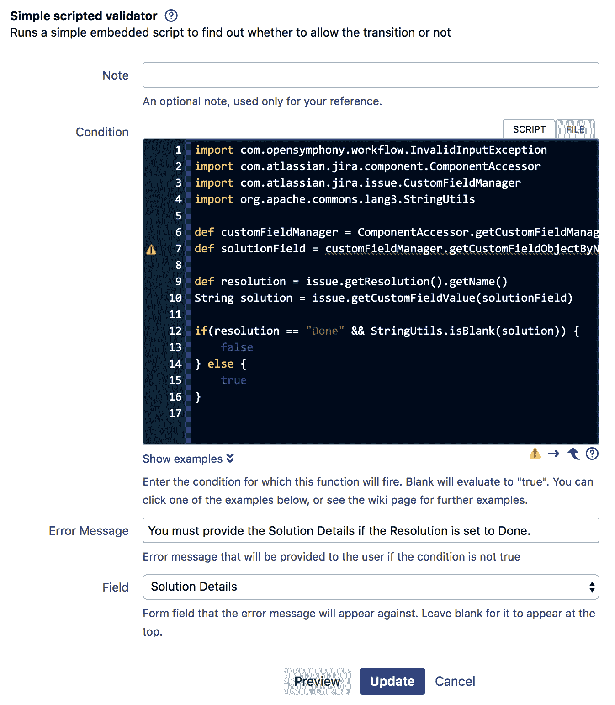

# Jira 工作流

工作流是 Jira 中最核心和最强大的功能之一。它们控制着 Jira 中问题如何从一个阶段流转到另一个阶段，同时可能会重新分配给其他用户，并在过程中捕获附加信息。因此，工作流可以被看作是问题的生命周期。

与许多其他系统不同，Jira 允许您创建自定义工作流，模拟您在组织中可能已有的工作流程。这是 Jira 如何适应您的需求，而不必改变工作方式的一个好例子。

在本章中，我们将不仅学习如何使用新的工作流设计器创建工作流，还将学习如何使用工作流组件，如条件和验证器，为工作流添加额外的行为。我们还将了解许多可用的应用程序，以扩展您在工作流中可以实现的功能。

本章将介绍以下几个配方：

+   为您的项目设置不同的工作流

+   在工作流转换中捕获附加信息

+   使用常见转换

+   使用全局转换

+   限制工作流转换的可用性

+   在工作流转换中验证用户输入

+   在转换执行后进行额外处理

+   响应来自 Jira 外部的事件

+   调整工作流转换栏的顺序

+   限制转换中的解决方案值

+   防止在选定状态下更新问题

+   在工作流转换过程中使字段变为必填

+   创建自定义工作流转换逻辑

# 为您的项目设置不同的工作流

工作流就像一个流程图，问题可以通过遵循状态之间的方向路径，从一个状态流转到另一个状态。在 Jira 的工作流术语中，状态被称为**状态**，而路径被称为**转换**。我们将使用这两个主要组件来定制工作流。

在这个配方中，我们将从头开始创建一个新的简单工作流。我们将学习如何使用现有状态，创建新状态，并通过转换将它们链接在一起。

# 如何操作...

第一步是创建一个新的骨架工作流：

1.  使用具有 Jira 管理员权限的用户登录 Jira。

1.  导航到**管理** > **问题** > **工作流**。

1.  点击**添加工作流**按钮，并将工作流命名为`简单工作流`。

1.  点击**图表**按钮以使用工作流设计器或图表模式。

以下截图解释了工作流设计器的一些关键元素：


现在我们已经创建了一个新的非激活工作流。下一步是为问题添加各种状态，问题将在这些状态之间流转。Jira 提供了一些现有的状态，例如“进行中”和“已解决”，供我们使用：

1.  点击**添加状态**按钮。

1.  从列表中选择**进行中**状态，然后点击**添加**。

1.  重复步骤，添加关闭状态。

你可以在字段中输入状态名称，Jira 会自动为你找到该状态。

一旦你将状态添加到工作流中，你可以拖动它们以重新定位它们在画布上的位置。我们还可以创建新的状态，如下所示：

1.  点击**添加状态**按钮。

1.  将新状态命名为`Frozen`，勾选**允许所有状态转换到此状态**选项，然后点击**添加**，如以下截图所示：



如果你输入的状态是新的，Jira 会通过在状态名称旁边显示文本（新状态）来通知你。

现在我们已经添加了状态，我们需要通过转换来链接它们：

1.  选择原始状态，本示例中是**OPEN**。

1.  点击**OPEN**状态周围的小圆圈，将光标拖到**IN PROGRESS**状态。这将提示你提供新转换的详细信息，如下截图所示：


1.  将新转换命名为`Start Progress`，并为屏幕选择**无**选项。

1.  重复步骤，在**IN PROGRESS**和**CLOSED**状态之间创建一个名为`Close`的转换。

你应该完成一个如下所示的工作流：


此时，工作流是非活动的，这意味着它尚未被项目使用，你可以在没有任何限制的情况下进行编辑。工作流是基于项目和问题类型应用的。执行以下步骤，将新工作流应用到项目：

1.  选择要应用工作流的项目。

1.  点击**管理**标签，进入项目管理页面。

1.  在页面左侧选择**工作流**。

1.  从**添加工作流**菜单中点击**添加现有**。

1.  从对话框中选择新的**Simple Workflow**，然后点击**下一步**。

1.  选择要应用工作流的 issue 类型（例如，Bug），然后点击**完成**。

在将工作流应用到项目后，工作流会处于活动状态。因此，如果我们现在在选定问题类型的目标项目中创建新问题，新的简单工作流将会被使用。

# 在工作流转换过程中捕获额外信息

当用户执行工作流转换时，我们有一个选项可以显示一个中间的工作流屏幕。这是从用户那里收集额外信息的非常有用的方式。例如，默认的 Jira 工作流会在问题解决时显示一个屏幕，让用户选择分辨率值。

带有分辨率值的问题被认为是已完成的。你应该只将分辨率字段添加到表示问题关闭的工作流屏幕中。

# 准备工作

我们需要配置一个工作流，比如在前面的示例中创建的简单工作流。我们还需要有显示屏幕；Jira 的开箱即用工作流屏幕和**结果问题**屏幕就足够了，但如果你已经创建了自己的屏幕，也可以使用它们。

# 如何操作...

执行以下步骤，将屏幕添加到工作流过渡中：

1.  选择要更新的工作流，比如我们的**简单工作流**。

1.  如果工作流是激活状态，点击**编辑**按钮。这将为我们创建一个草稿工作流以供修改。

1.  选择**开始进展**过渡，然后从右侧面板点击**编辑**链接。

1.  选择你想要使用的屏幕，比如从**屏幕**下拉菜单中选择工作流屏幕，然后点击**保存**。

1.  重复*步骤 3*和*步骤 4*，将解决问题屏幕添加到**关闭**过渡。

如果我们正在使用草稿工作流，我们必须点击发布草稿按钮，将更改应用到实时工作流中。

如果你没有看到更改生效，很可能是你忘记发布草稿工作流。

# 使用常见过渡

通常，你会有一些需要从工作流中的多个不同状态提供的过渡，比如**解决**和**关闭**过渡。换句话说，这些过渡具有相同的目标状态，但来源状态不同。

为了简化这些过渡的创建过程，Jira 允许你将现有的过渡重用为常见过渡，只要它们具有相同的目标状态。

常见过渡是指目标状态相同但来源状态不同的过渡。

常见过渡的一个额外优势是确保过渡屏幕和其他相关配置（如**验证器**）保持一致。否则，每次更改其中一个过渡时，你必须不断检查各种过渡。

# 如何操作...

执行以下步骤，在工作流中创建并使用常见过渡：

1.  选择工作流，然后点击**编辑**链接以创建草稿。

1.  选择**图表**模式。

1.  在两个状态之间创建过渡，例如**打开**和**关闭**。

1.  从不同的状态创建另一个过渡到相同的目标状态，并点击**重用过渡**选项卡，如下图所示：


1.  从**重用过渡**下拉菜单中选择在*步骤 3*中创建的过渡，然后点击**添加**。

1.  点击**发布草稿**以应用更改。

# 另见

请参阅*使用全局过渡*示例，这将帮助我们轻松创建复杂的工作流，通过允许问题随时过渡到某个状态。

# 使用全局过渡

虽然公共转换是共享工作流中的转换并减少管理工作量的好方法，但它的限制在于需要手动创建各个状态之间的转换。

随着工作流变得越来越复杂，显式地创建转换变得是一项繁琐的工作；这时**全局转换**就派上用场了。

全局转换类似于公共转换，因为它们都具有一个单一的目标状态。二者的区别在于，全局转换是一个可供工作流中所有状态使用的单一转换。

在本方案中，我们将展示如何使用全局转换，以便问题可以从工作流中的任何状态转换到冻结状态。

# 准备就绪

如常，你需要有一个可以编辑的工作流。由于我们将演示全局转换的工作原理，因此需要在工作流中拥有一个名为冻结的状态，并确保没有任何转换链接到它。

# 如何操作...

执行以下步骤以在工作流中创建并使用全局转换：

1.  选择并编辑你将添加全局转换的工作流。

1.  选择**图示**模式。

1.  选择**冻结**状态。

1.  勾选**允许所有状态转换到此状态**选项。

1.  点击**发布草稿**以应用更改。

以下截图展示了之前的步骤：


1.  一旦为某个状态创建了全局转换，它将被表示为**全部**转换，如下图所示：


在**冻结**状态添加全局转换后，无论问题当前处于何种状态，你都可以将其转换为冻结状态。

你只能在图示模式下添加全局转换。

# 另见

请参考*限制工作流转换可用性的*方案，其中解释了如何在问题已经处于冻结状态时移除转换。

# 限制工作流转换可用性

默认情况下，工作流转换对所有有权限访问问题的用户都可以使用。有时候，你可能希望限制某些转换的访问。例如，你可能希望限制冻结问题转换的访问，原因如下：

+   你希望该转换仅对特定组或项目角色中的用户可用。

+   由于该转换是全局转换，它对所有工作流状态都可用，但当问题已经处于**冻结**状态时，显示该转换没有意义。

要限制工作流转换的可用性，我们可以使用工作流条件。

# 准备就绪

对于这个教程，我们需要安装 JSU Automation Suite for Jira Workflows 应用程序。您可以通过以下链接下载该应用程序，或者直接通过**通用插件管理器**（**UPM**）安装：[`marketplace.atlassian.com/plugins/com.googlecode.jira-suite-utilities`](https://marketplace.atlassian.com/plugins/com.googlecode.jira-suite-utilities)。

# 如何操作……

我们需要向我们希望应用限制的过渡添加一个新的工作流条件：

1.  选择并编辑工作流进行配置。

1.  选择**图表**模式。

1.  点击**冻结**全局工作流过渡。

1.  点击右侧面板中的**条件**链接。

1.  点击**添加条件**，从列表中选择 Value Field (JSU)，然后点击**添加**。

1.  使用以下参数配置条件：

    +   `Status`字段用于**字段**

    +   不等于符号，`!=`，用于**条件**

    +   `Frozen`用于**值**

    +   `String`用于**比较类型**

这意味着，只有当问题的状态字段值不是冻结时，才会显示该过渡，如以下截图所示：


1.  点击**添加**按钮以完成条件设置。

此时，我们已经添加了一个条件，确保当问题已经处于冻结状态时，不会显示冻结问题的过渡。下一步是添加另一个条件，限制该过渡仅对开发者角色的用户可用。

1.  再次点击**添加条件**，并选择**项目角色中的用户**条件。

1.  选择开发者项目角色并点击**添加**。

1.  点击**发布草稿**以应用更改。

一旦应用了工作流条件，如果问题已经处于冻结状态，或者当前用户不在开发者项目角色中，则冻结过渡将不再可用。

# 它是如何工作的……

当工作流过渡选项在页面上呈现时，比如查看问题时，所有相关的条件都会被评估，以确定是否显示该选项。如果有多个条件，只有当一个或全部条件通过时，才会显示带有条件的过渡，具体取决于条件的逻辑设置（参见以下部分）。

# 还有更多……

使用 Value Field 条件（它随 JSU Automation Suite for Jira Workflows 应用程序提供）是根据问题的当前状态限制过渡可用性的多种方式之一。还有另一个名为**Jira Misc Workflow Extensions**的应用程序，提供了一个检查问题上一个状态的条件。您可以从[`marketplace.atlassian.com/plugins/com.innovalog.jmwe.jira-misc-workflow-extensions`](https://marketplace.atlassian.com/plugins/com.innovalog.jmwe.jira-misc-workflow-extensions)下载它。

当对过渡应用多个工作流条件时，如我们的示例所示，默认行为是所有条件必须通过，过渡才会生效。

您可以更改此设置，使得仅需通过一个条件，过渡就会生效，方法是将条件组逻辑从**所有以下条件**更改为**任何以下条件**，如下所示：


在配置此项时，请务必仔细检查，确保不会将工作流过渡暴露给那些不应执行这些过渡的用户。

# 在工作流过渡中验证用户输入

对于具有过渡屏幕的工作流过渡，您可以添加验证逻辑，以确保用户输入的内容符合预期。这是确保数据完整性的好方法，我们可以通过工作流验证器来实现。

在此方案中，我们将添加一个验证器，以执行自定义字段与问题创建日期之间的日期比较，因此我们为自定义字段选择的日期值必须晚于问题的创建日期。

# 准备就绪

对于此方案，我们需要安装 JSU 自动化套件 for Jira Workflows 应用。您可以通过以下链接下载，或直接使用 UPM 安装：[`marketplace.atlassian.com/plugins/com.googlecode.jira-suite-utilities`](https://marketplace.atlassian.com/plugins/com.googlecode.jira-suite-utilities)。

由于我们也在进行日期比较，因此需要创建一个名为`开始日期`的新日期自定义字段，并将其添加到工作流屏幕中。

# 如何操作...

执行以下步骤以在工作流过渡中添加验证规则：

1.  选择并编辑工作流进行配置。

1.  选择**图表**模式。

1.  选择**开始进度**过渡，并点击右侧的**验证器**链接。

1.  点击**添加验证器**链接，并从列表中选择**日期比较（JSU）**。

1.  使用以下参数配置验证器：

    +   `开始日期`自定义字段为**此日期**。

    +   大于号`>`用于**条件**

    +   `创建时间`用于进行比较

    +   可选的自定义错误信息，或者如果验证失败，可以留空，系统将显示默认的错误信息。

1.  点击**添加**以添加验证器：


1.  点击**发布草稿**以应用更改。

添加验证器后，如果我们尝试选择一个早于问题创建日期的日期，Jira 会提示错误信息，并阻止过渡进行，如下图所示：


如我们所见，日期验证失败，且我们自定义的错误信息被显示。

# 如何操作...

验证器在工作流过渡执行之前运行。这样，如果任何验证逻辑失败，验证器可以拦截并阻止过渡的进行。

如果您有多个验证器，必须确保所有验证器都通过，转换才能继续进行。

# 另见

验证器可用于使字段在工作流转换过程中仅为必填项。有关详细信息，请参阅*在工作流转换过程中使字段为必填项*的方案。

# 在转换执行后执行额外的处理

Jira 允许您通过使用后置操作在工作流转换过程中执行额外的任务。Jira 在内部大量使用后置操作；例如，在开箱即用的工作流中，当您重新打开问题时，解决方案字段的值会自动清空。

在此方案中，我们将学习如何向工作流转换中添加后置操作。我们将添加一个后置操作，在我们将问题从**冻结**状态移除时自动清空**冻结原因**自定义字段中的值。

# 准备工作

由于我们要清除名为“冻结原因”的自定义字段的值，因此需要创建一个文本字段（多行）类型的自定义字段，并将其添加到项目使用的屏幕中。

默认情况下，Jira 带有一个后置操作，可以更改标准问题字段的值，但由于**冻结原因**将是一个自定义字段，我们需要安装 JSU 自动化套件 for Jira 工作流应用。

您可以通过以下链接下载，或使用 UPM 直接安装：[`marketplace.atlassian.com/plugins/com.googlecode.jira-suite-utilities`](https://marketplace.atlassian.com/plugins/com.googlecode.jira-suite-utilities)。

# 如何操作...

执行以下步骤，在工作流转换执行后添加处理逻辑：

1.  选择并编辑工作流以进行配置。

1.  选择**图表**模式。

1.  创建一个新的工作流转换，将问题从**冻结**状态转换到另一个状态。

1.  点击新创建的转换的**后置操作**链接。

1.  点击**添加后置操作**功能，从列表中选择**清空字段值（JSU）**，然后点击**添加**。

1.  从**字段**中选择“冻结原因”字段，然后点击**添加**按钮。

1.  点击**发布草稿**以应用更改。

在设置好后置操作后，执行转换后，**冻结原因**字段的值将被清空。您还可以从问题的变更历史记录中看到，作为转换执行的一部分，**状态**字段从**冻结**变更为**打开**，同时**冻结原因**字段的变更也被记录。

# 它是如何工作的...

后置操作会在转换执行后运行。当您添加新的后置操作时，您可能会注意到该转换已经预先添加了多个后置操作；这在接下来的截图中显示：


这些后置操作是系统后置操作，执行重要的内部功能，例如保持搜索索引的最新状态。这些后置操作的顺序非常重要。

总是将你自己的后置功能添加到列表的顶部。

例如，任何对问题字段值的更改，如我们刚刚添加的，更改应始终发生在重新索引后置功能之前，这样在过渡完成时，所有字段索引都会是最新的，并准备好被搜索：

# 对来自 Jira 外部事件的反应

当你将 Jira 与其他系统一起使用时，尤其是与 Atlassian 构建的应用程序（如 Bitbucket 和 Bamboo）一起使用时，你可以与它们一起获得更多的协同效应。一个协同效应的例子是，当其他应用程序发生某些操作时，自动执行工作流过渡。

在这个教程中，我们将讨论这样的一个使用案例：如果开发人员针对 Jira 问题提交了一些代码，我们将自动将问题过渡到**进行中**状态，而无需开发人员手动进入 Jira 并执行工作流过渡。

# 准备就绪

由于我们的使用案例是关于开发人员提交代码，你需要有一个支持的代码管理应用程序；Bitbucket 和 GitHub 都被支持。在这个教程中，我们将使用 Bitbucket。你可以从[`www.atlassian.com/software/bitbucket/download`](https://www.atlassian.com/software/bitbucket/download)获取该应用的试用版。

# 如何操作...

为了基于外部事件自动过渡问题，我们需要将适当的工作流触发器添加到过渡中：

1.  选择并编辑工作流进行配置。

1.  选择**开始进度**过渡。

1.  点击**触发器**按钮。

1.  点击**添加触发器**按钮。如果按钮被禁用，意味着你还没有将 Jira 与 Bitbucket 集成。

1.  选择**创建提交**触发器并点击**下一步**：


1.  点击**添加触发器**以将触发器应用到工作流过渡中。

1.  点击**发布草稿**以应用更改。

应用触发器后，如果你在提交代码时将问题的关键字作为提交信息的一部分，问题将自动过渡到目标状态，在这种情况下是进行中状态。

# 重新排列工作流过渡条

默认情况下，工作流过渡会按工作流中定义的顺序显示（如文本模式中所列）；前两个过渡将显示为按钮，其余过渡将被添加到**工作流**菜单中。

这个顺序由添加过渡的顺序决定，所以你不能更改它。但你可以通过使用`opsbar-sequence`属性来重新排列它们。

在这个教程中，我们将把冻结过渡从工作流菜单中移出，并放到它自己的过渡按钮上，以便用户可以轻松访问它。

# 如何操作...

执行以下步骤以重新排列要显示在问题过渡条中的过渡顺序：

1.  选择并编辑工作流进行配置。

1.  选择**冻结**全局过渡。

1.  点击**属性**按钮。

1.  输入`opsbar-sequence`作为**属性键**，并在**属性值**中输入`10`，然后点击**添加**。点击**发布草稿**以应用更改。

如下截图所示，通过增加工作流转换的顺序值，它会被移出工作流菜单，并单独成为一个按钮：


现在，让我们来了解一下工作原理部分。

# 它是如何工作的...

`opsbar-sequence`属性按数字顺序排列工作流转换，从最小到最大。其值必须是正整数。数字越小，转换按钮越靠前。

# 还有更多内容...

Jira 只显示前两个转换作为按钮。您可以通过编辑位于`JIRA_HOME`目录中的`jira-config.properties`文件中的`ops.bar.group.size.opsbar-transitions`属性来更改此设置。

你只需编辑文件，设置属性以显示所需数量的转换按钮，如所示（我们将转换按钮的数量设置为`3`），然后重新启动 Jira：

```
ops.bar.group.size.opsbar-transitions=3 
```

如果您没有看到`jira-config.properties`文件，您可以简单地创建一个具有相同名称的新文件，并在其中添加您的属性。

请查看以下截图：


现在 Jira 显示了三个转换按钮，而不是两个。

# 限制转换中的解决方案值

通常，问题的解决方案值如**已修复**和**不会修复**是全局的，因此无论项目和问题类型如何，都会有相同的解决方案值可用。当您在 Jira 中实现不同的工作流时，可能会发现某些解决方案与某个特定项目或问题类型无关。

在这个实例中，我们将选择一个在使用简单工作流关闭问题时可用的全局解决方案子集。

# 如何操作...

执行以下步骤，以选择性地包含给定工作流转换的部分解决方案：

1.  选择并编辑**简单工作流**。

1.  选择**关闭问题**工作流转换。

1.  点击**属性**选项。

1.  在**属性名称**中输入`jira.field.resolution.include`，并将我们希望包含的解决方案的 ID（用逗号分隔）输入到**属性值**中。因此，如果我们只想包含**已完成**、**不做**和**重复**的解决方案，我们需要将`10000`、`10001`和`10002`作为属性值指定，中间不留空格。

看一下下面的截图：


1.  点击**发布草稿**以应用更改。

请注意，这三个解决方案的实际值可能与您的 Jira 实例不同。配置属性时，请再次确认它们的值。

# 还有更多内容...

除了选择解决方案的子集之外，还有一个`jira.field.resolution.exclude`属性，可以让您从全局列表中排除某些解决方案。

# 防止在特定状态下更新问题

默认情况下，当问题处于已关闭状态时，无法进行更新。通常的做法是，当问题处于表示逻辑完成的状态时，将其设为只读。

在本食谱中，我们将确保，当问题被移动到冻结状态时，直到它被移回开放状态之前，将无法再进行更新。

# 如何操作...

执行以下步骤，在问题处于冻结状态时将其设为只读：

1.  选择并编辑要更新的工作流。

1.  选择**冻结**工作流状态。

1.  点击右侧面板中的**属性**链接。

1.  在**属性键**中输入`jira.issue.editable`，在**属性值**中输入`false`，然后点击**添加**。

1.  点击**发布草稿**以应用更改。

# 在工作流转换过程中将字段设置为必填

使用字段配置将字段设置为必填将使该字段始终处于必填状态。然而，有许多使用场景中，您可能只需要在某些工作流转换期间将字段设置为必填。

# 准备就绪

对于本食谱，您需要安装 JSU 自动化套件用于 Jira 工作流应用程序。您可以通过以下链接下载，或者直接使用 UPM 安装：[`marketplace.atlassian.com/plugins/com.googlecode.jira-suite-utilities`](https://marketplace.atlassian.com/plugins/com.googlecode.jira-suite-utilities)。

# 如何操作...

执行以下步骤，在冻结转换期间将“冻结原因”字段设置为必填：

1.  选择并编辑**简单工作流**。

1.  选择**图表**模式。

1.  点击**冻结**全局工作流转换。

1.  点击右侧面板中的**验证器**链接。

1.  点击**添加验证器**，从列表中选择“字段必填（JSU）”，然后点击**添加**。

1.  从**可用字段**中选择**冻结原因**字段，并点击**添加 >>**。这将把所选字段添加到**必填字段**列表中，如下图所示：


1.  如果您希望显示自定义消息而非默认的错误消息，请输入可选的错误消息。

1.  点击**添加**按钮以完成验证器设置。

1.  点击**发布草稿**以应用更改。

添加验证器后，如果您尝试执行冻结转换而未为“冻结原因”字段指定值，Jira 将提示您出现错误消息，如下图所示：


# 创建自定义工作流转换逻辑

在之前的食谱中，我们已经查看了如何使用 Jira 内置的工作流条件、验证器和后置功能，以及其他第三方应用程序提供的功能。

在这个方案中，我们将看看如何使用脚本为工作流验证器定义自己的验证规则。我们将处理一个常见的用例，即仅当另一个字段设置为某个特定值时，在工作流过渡过程中使某个字段成为必填项。

所以，我们的验证逻辑将如下所示：

+   如果**Resolution**字段设置为**Done**，**Solution Details**字段将变为必填项。

+   如果**Resolution**字段设置为**Fixed**以外的值，**Solution Details**字段将不再是必填项。

# 准备开始

对于这个方案，我们需要安装 ScriptRunner for Jira 应用。你可以通过以下链接下载，或者直接使用 UPM 安装：[`marketplace.atlassian.com/plugins/com.onresolve.jira.groovy.groovyrunner`](https://marketplace.atlassian.com/plugins/com.onresolve.jira.groovy.groovyrunner)。

你可能还需要熟悉 Groovy 脚本语言（[`groovy.codehaus.org`](http://groovy.codehaus.org/)）。

# 如何操作……

执行以下步骤设置带有自定义脚本逻辑的验证器：

1.  选择并编辑**简单工作流**。

1.  选择**图表**模式。

1.  点击**完成**全局工作流过渡。

1.  从右侧面板中点击**验证器**链接。

1.  点击**添加验证器**，从列表中选择**脚本验证器** [ScriptRunner]，然后点击**添加**。

1.  选择**简单脚本验证器**选项。

1.  在**条件**文本框中输入以下脚本代码：

```
import com.opensymphony.workflow.InvalidInputException
import com.atlassian.jira.component.ComponentAccessor
import com.atlassian.jira.issue.CustomFieldManager
import org.apache.commons.lang3.StringUtils

def customFieldManager = ComponentAccessor.getCustomFieldManager()
def solutionField = customFieldManager.getCustomFieldObjectByName("Solution Details")
def resolution = issue.getResolution().getName()
String solution = issue.getCustomFieldValue(solutionField)

if(resolution == "Done" && StringUtils.isBlank(solution)) {
    false
} else {
    true
}
```

1.  在**错误**字段中输入 `如果分辨率设置为 Done，则必须提供 Solution Details。`

1.  选择**Solution Details**作为**字段**。

1.  点击**添加**按钮以完成验证器设置。

1.  点击**发布草稿**以应用更改。

你的验证器配置应如下所示：



一旦我们添加了自定义验证器，Groovy 脚本将在每次执行解决问题的过渡时运行。如果 Resolution 字段设置为 Done 且 Solution Details 字段为空，我们将收到来自错误字段的消息，如下图所示：


现在我们来看一下这些步骤是如何工作的。

# 它是如何工作的……

脚本验证器的工作方式与其他验证器一样，只是我们可以使用 Groovy 脚本定义自己的验证逻辑。那么，让我们看看这个脚本，它的作用是什么。

我们首先通过字段名称获取 Solution Details 自定义字段，如下代码所示。如果你有多个同名的自定义字段，你需要使用它的 ID 而不是名称：

```
def solutionField = customFieldManager.getCustomFieldObjectByName("Solution Details")
```

然后我们选择分辨率值，并在过渡过程中获取输入的 Solution Details 值，如下所示：

```
def resolution = issue.getResolutionObject().getName() 
String solution = issue.getCustomFieldValue(solutionField) 
```

在我们的示例中，我们检查分辨率名称；我们也可以通过将 `getName()` 更改为 `getId()` 来检查分辨率的 ID。

如果你有多个同名的自定义字段，请使用 `getId()`。

最后，我们检查**Resolution**值是否为**Done**，并且**Solution Details**值是否为空。如果是这种情况，我们返回`false`，因此验证失败。所有其他情况将返回`true`，所以验证通过。我们还使用`StringUtils.isBlank(solution)`来检查空值，这样我们就可以捕获用户在**Solution Details**字段中输入空格的情况。

# 还有更多...

你不仅限于创建脚本验证器。通过使用 ScriptRunner for Jira 应用，你可以使用 Groovy 脚本创建脚本条件和后置函数。
