# 用户管理

用户管理是任何系统中最繁琐但又最重要的方面之一。它为许多其他系统功能奠定基础，例如安全性和通知。

本章我们将探讨在 Jira 中创建用户账户的不同选项，并介绍如何通过使用组和项目角色来管理用户。我们还将讨论如何将 Jira 与外部用户管理系统（例如**轻量级目录访问协议**（**LDAP**））集成，以便进行身份验证和用户管理。最后，我们将介绍如何使 Jira 参与各种单点登录环境。

本章将涵盖以下主题：

+   创建和导入多个用户

+   启用公共用户注册

+   管理组和组成员关系

+   管理项目角色

+   管理默认项目角色成员关系

+   停用用户

+   从 LDAP 集成并导入用户

+   仅通过 LDAP 进行身份验证的集成

+   与 Atlassian Crowd 集成

+   设置与 Crowd 的单点登录

+   设置与 Google 的单点登录

+   设置 Windows 域单点登录

# 创建和导入多个用户

作为 Jira 管理员，通常你需要为新加入组织的用户设置账户。对于临时的用户，通常没问题，但有时你可能需要一次性导入大量用户。在这些情况下，你将需要一些额外的工具，帮助你高效地使所有这些用户能够及时访问系统。

# 准备工作

对于这个配方，我们需要使用 Jira **命令行界面**（**CLI**）。你可以从[`marketplace.atlassian.com/plugins/org.swift.jira.cli/cloud/overview`](https://marketplace.atlassian.com/plugins/org.swift.jira.cli/cloud/overview)获取它。

CLI 应用程序有两个组件。第一个组件是一个叫做 CLI Connector 的应用程序，你可以通过**通用插件管理器**（**UPM**）像其他 Jira 应用程序一样安装它。第二个组件是实际的 CLI 客户端，我们将用它来向 Jira 发出命令。你可以从[`bobswift.atlassian.net/wiki/spaces/info/pages/103022955/Downloads+-+CLI+Clients`](https://bobswift.atlassian.net/wiki/spaces/info/pages/103022955/Downloads+-+CLI+Clients)下载最新的命令行工具（`atlassian-cli-8.x.x-distribution.zip`）。

你还需要一个管理员账户，因为创建用户是一个管理员任务。

# 如何操作...

在我们开始使用命令行客户端将用户导入到 Jira 之前，我们首先需要准备用户数据。最简单的方式是创建一个包含以下信息的**逗号分隔值**（**CSV**）文件，并按指定的顺序排列。你可以使用如 Microsoft Excel 等电子表格应用程序来创建它：

| **用户名** | **密码** | **电子邮件** | **全名** | **组 A** |
| --- | --- | --- | --- | --- |
| `tester1` | `xxxxx` | `tester1@example.com` | `测试用户` | `jira-softwareusers` |

以下列表解释了 CSV 文件的每一列：

+   **用户名**：用户的用户名；请注意，Jira 中的用户名必须是唯一的。

+   **密码**：新用户的密码。你可以留空，Jira 会自动为你生成一个密码。

+   **电子邮件**：新用户的电子邮件地址。帐户创建后，可以向用户发送电子邮件，以便他/她重置密码。

+   **全名**：新用户的全名。

+   **组**：要将新用户添加到的组。如果你想将用户添加到多个组中，请将每个组放在一个单独的列中。请注意，指定的组名必须已经在 Jira 中存在。

现在你已经有了数据文件，请按照以下步骤导入并在 Jira 中创建用户账户：

1.  将 CLI 客户端解压到你计算机上的某个目录（例如，`/opt/cli`）。

1.  将用户的 CSV 文件复制到你计算机上的某个目录（例如，`/tmp/users.csv`）。

1.  打开命令提示符并导航到包含 CLI 客户端的目录，即包含`jira.sh`或`jira.bat`文件的目录。

1.  确保`jira.sh`文件（Linux）或`jira.bat`（Windows）是可执行的。

1.  运行以下命令来导入用户；确保在 Jira URL 中替换管理员的用户名和密码：

```
./jira.sh --action addUserWithFile --server
http://localhost:8080 --password <password>
--user <username> --file /tmp/users.csv
```

上述命令假设你正在使用 Linux。如果你使用的是 Windows，请改用`jira.bat`。

如果一切顺利，你将在控制台看到类似以下的输出：

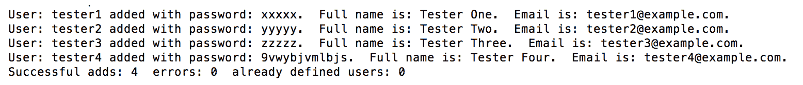

如前面输出所示，命令的结果会显示每个根据 CSV 文件添加到 Jira 的新用户。由于我们没有为`Tester Four`用户指定密码，因此该用户将被分配一个自动生成的密码。输出的最后一行还提供了成功添加的用户数量和失败的用户数量（如果有的话）。

# 它是如何工作的…

我们用于运行`addUserWithFile`命令的命令行客户端使用 Jira 的远程 API 与 Jira 交互。Jira 通过这些 API 暴露了许多核心功能，例如创建新用户和问题的能力。

当我们运行`addUserWithFile`命令时，我们传入一个包含新用户的 CSV 文件，文件格式符合命令行客户端的要求，使其能够理解并调用 Jira 的 API 来为我们创建这些用户。

但请注意，使用这些远程 API 时（无论是否使用命令行客户端），同样的安全规则适用。因此，在我们的案例中，由于创建新用户是一个管理任务，我们需要在命令中提供管理员账户。

Jira CLI 应用程序不仅可以创建用户。只需运行`jira.sh`或`jira.bat`，即可查看它支持的所有命令和功能。安装在 Jira 中的 CLI 连接器应用程序提供了许多额外的远程 API，这些 API 将被命令行客户端中的某些功能使用。

# 启用公共用户注册

在前面的教程中，我们学习了如何手动创建新的用户账户并从 CSV 文件导入用户。这是当你的 Jira 实例用于内部时，Jira 管理员可以选择的两个选项。

然而，如果你的 Jira 设置为公开使用，比如在支持系统中，你就需要让客户自由注册新账户，而不是让他们等待管理员手动创建每个账户。

# 如何操作...

按照以下步骤启用公共用户注册：

1.  进入 管理 > **系统** > **常规配置**。

1.  点击 **编辑设置** 按钮。

1.  将 **模式** 选项设置为 **公开**，然后点击 **更新**。

# 工作原理...

Jira 可以在两种模式下运行：公开模式和私有模式。在私有模式下，只有管理员可以创建新的用户账户。例如，你可以为内部工程团队使用的 Jira 实例启用私有模式，用于跟踪他们的项目。

公开模式允许任何人注册新账户。创建的新账户将拥有普通用户权限，因此他们可以立即开始使用 Jira：

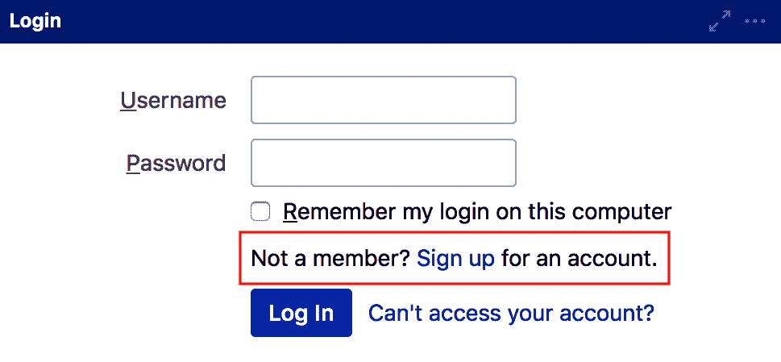

如上图所示，你可以注册一个新账户。

# 更多信息...

为了帮助防止垃圾邮件发送者，Jira 提供了 CAPTCHA 挑战响应功能，确保注册新账户的是一个真实的人，而不是自动化机器人。要启用 CAPTCHA 功能，请按照以下步骤操作：

1.  进入 管理 > 系统 > 常规配置。

1.  点击 **编辑设置** 按钮。

1.  将注册时的 CAPTCHA 选项设置为开启，并点击 更新。

一旦启用了 CAPTCHA，注册表单将包含一串随机生成的字母数字字符，必须正确输入这些字符，才能生成新的账户，如下图所示：

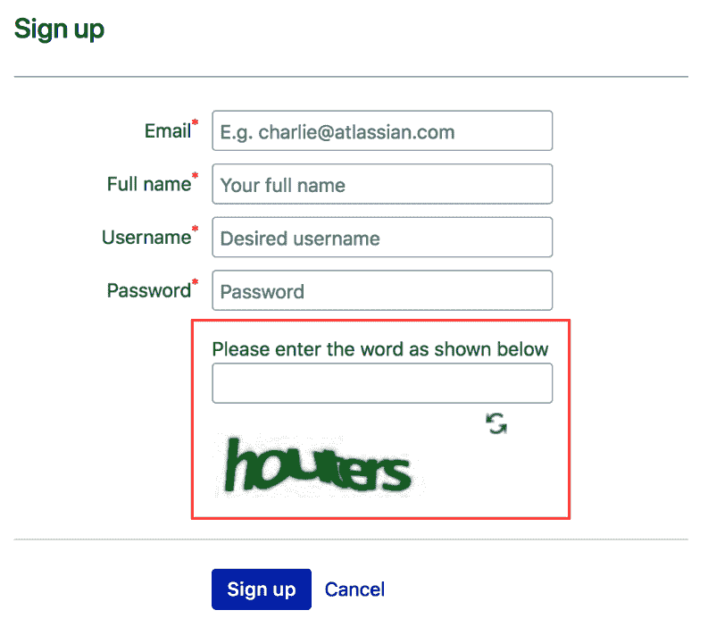

CAPTCHA 的示例如上图所示。

# 管理用户组和用户组成员

在任何信息系统中，管理用户的一种常见方式是通过使用用户组。用户组是基于组织内的职位和职责创建的；但是，重要的是要注意，用户组仅仅表示一组用户。在 Jira 中，用户组为应用配置设置（例如权限和通知）提供了一个有效的方式。

用户组在 Jira 中是全局性的——如果你属于`jira-administrators`用户组，不管你访问哪个项目，你都将始终在该组中。

在本教程中，我们将了解如何创建一个新用户组并向其中添加用户。

# 如何操作...

按照以下步骤创建一个新的用户组：

1.  进入 管理 > 用户管理 > 用户组。

1.  在 **添加用户组** 部分输入新用户组的名称。

1.  点击 **添加用户组** 按钮。

按照以下步骤将用户添加到用户组：

1.  进入 管理 > 用户管理 > 用户组。

1.  点击你想管理的组的 编辑成员 链接。

1.  输入要添加到组中的用户的用户名。你可以点击选择用户图标并使用用户选择器查找你的用户。

1.  点击 添加选定的用户 按钮，将用户添加到组中，如下图所示：

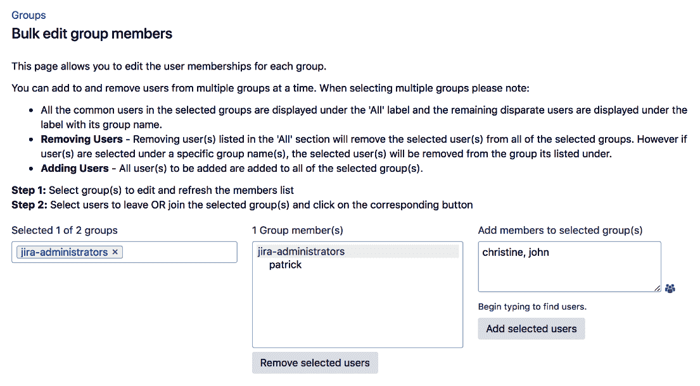

这样可以让你管理组中的用户。

# 还有更多...

通过直接编辑组的成员资格，你可以一次性添加或移除多个用户；然而，有时你只需要更新单个用户的组成员资格；在这种情况下，你可能会发现通过用户的组成员资格界面来管理编辑选项会更容易。按照以下步骤编辑用户组：

1.  进入 管理 > 用户管理 > 用户。

1.  从你想管理的用户的菜单中选择 编辑用户组 选项。

1.  输入你要将用户添加到的组的名称。Jira 提供了一个自动完成功能，帮助你找到想要的组。

1.  点击 加入选定的组 按钮，将用户添加到组中，如下图所示：

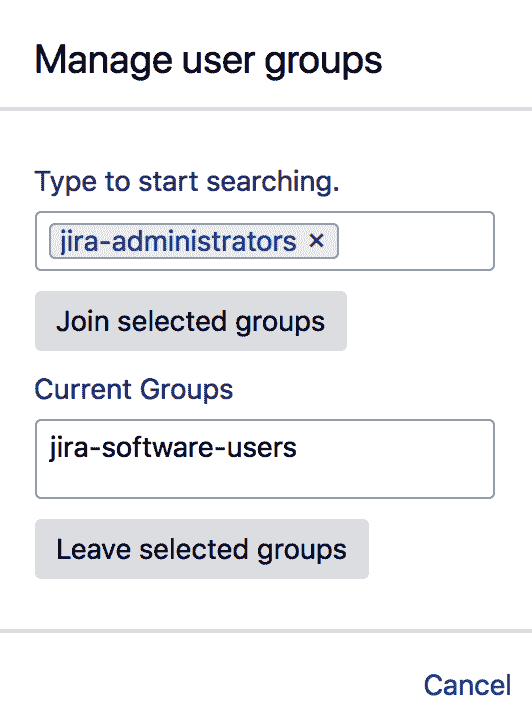

现在我们已经将用户添加到组中。

# 管理项目角色

使用组是 Jira 中管理多个用户的默认方法；然而，使用组也存在一些限制。第一个限制是，组在 Jira 中是全局的。这意味着，如果一个用户在某个组中，那么该用户会包含在该组的所有项目中。

在现实生活中，情况往往并非如此——例如，假设某个用户在一个项目中是经理，但在另一个项目中可能不是经理。这在配置权限和通知时会成为问题。

第二个限制是，如果使用 LDAP，组成员资格由 Jira 管理员或中央 IT 管理员控制。这意味着仅使用组来控制对项目的访问意味着它不由项目所有者管理，可能会导致瓶颈。

因此，为了解决这些限制，Jira 提供了项目角色。项目角色类似于组；唯一的区别是，项目角色的成员资格是在项目级别定义的。

# 如何操作...

Jira 默认提供三种项目角色——管理员、开发者和用户。我们将首先了解如何创建新项目角色。

按照以下步骤创建新项目角色：

1.  进入 管理 > 系统 > 项目角色。

1.  输入新项目角色的名称和描述。

1.  点击 **添加项目角色** 按钮：

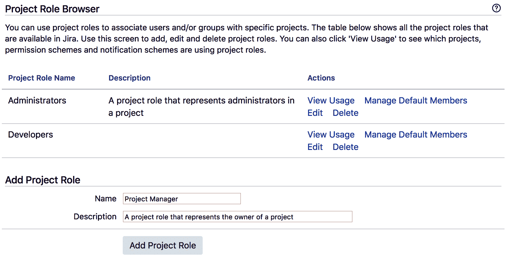

就像组一样，项目角色本身在 Jira 中是全局的，但它们的成员资格是针对每个项目本地定义的。

一旦创建了项目角色，我们就可以开始将用户和组添加到每个项目的相关角色中。要向项目角色添加新用户和/或组，请按照以下步骤操作：

1.  导航到目标项目。

1.  点击 **管理** 标签并选择 **用户和角色**。

1.  点击 “添加用户到角色” 按钮。

1.  选择用户和/或组，选择项目角色，然后点击 **添加**，如下图所示：

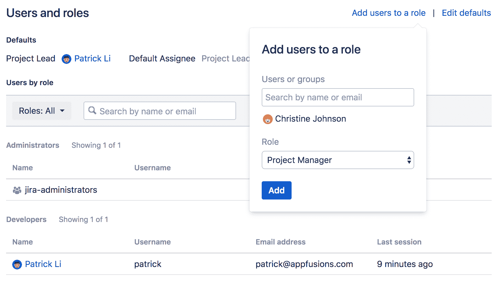

这将帮助你管理项目角色。

# 管理默认项目角色成员

项目角色成员是按项目定义的；然而，有些情况下，某些用户或组需要默认成为给定项目角色的成员。事实上，Jira 默认有以下成员：

+   **管理员**：所有属于 `jira-administrators` 组的成员

+   **开发人员**：所有属于 `jira-developers` 组的成员

使用这些默认成员时，当创建新项目时，用户会自动被添加到项目角色中；这大大减少了 Jira 管理员需要进行的手动工作量。

# 如何操作...

按照以下步骤定义项目角色的默认成员：

1.  导航到 “管理” > “系统” > “项目角色”。

1.  点击要配置的项目角色的 “管理默认成员” 链接。

1.  点击 **默认用户** 列的 “编辑” 链接，将用户添加到项目角色中。

1.  点击 **默认组** 列的 “编辑” 链接，将组添加到项目角色，如下图所示：

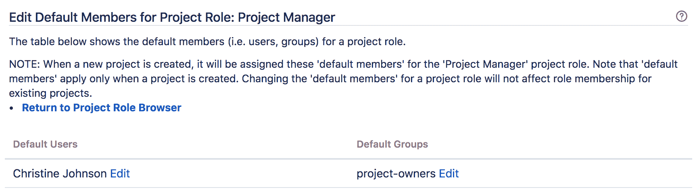

此截图展示了如何将组添加到项目角色中。

# 它是如何工作的...

一旦你将用户和组分配为项目角色的默认成员，任何新创建的项目都会将这些用户和组添加到该角色中。一个好的做法是使用组作为默认项目角色成员，因为用户的角色和责任随着时间的推移可能会发生变化。

需要注意的是，对默认成员的更改将*不会* 回溯应用于现有项目。

# 停用用户

一旦用户创建了问题或评论，Jira 将不允许你删除该用户。实际上，停用用户通常比完全删除用户更为合适。一旦 用户 被停用，该用户将无法登录 Jira，并且不会计入你的许可证数量。

如果你使用外部用户管理系统，如 LDAP 或 Jira 的 Crowd，你无法停用用户——你需要从源的用户管理系统中进行操作。

# 如何操作...

按照以下步骤停用用户：

1.  导航到 “管理” > “用户管理” > “用户”。

1.  点击要停用的用户的 “编辑” 链接。

1.  取消勾选 “已激活” 选项。

1.  点击 “更新” 按钮以停用用户。

被停用的用户将无法登录到 Jira，并且其名字旁边会显示“已停用”选项。

# 从 LDAP 集成和导入用户

默认情况下，Jira 在内部管理其用户和组。如今，大多数组织通常使用 LDAP，例如 Microsoft **Active Directory** (**AD**)，进行集中式用户管理，你可以将 Jira 与 LDAP 集成。Jira 支持多种不同类型的 LDAP，包括 AD ([`docs.microsoft.com/en-us/windows-server/identity/ad-ds/get-started/virtual-dc/active-directory-domain-services-overview`](https://docs.microsoft.com/en-us/windows-server/identity/ad-ds/get-started/virtual-dc/active-directory-domain-services-overview))、OpenLDAP ([`www.openldap.org`](https://www.openldap.org)) 等。

有两种将 Jira 与 LDAP 集成的选项。在本方案中，我们将探讨使用 **LDAP 连接器** 的第一种选项，它会定期同步 Jira 与 LDAP 之间的用户、其详细信息和组成员关系。在下一个方案中，我们将探讨第二种选项，*仅用于身份验证的 LDAP 集成*。

# 准备工作

对于这个方案，你需要确保有一个正在运行的 LDAP 服务器。你需要确保 Jira 服务器能够访问 LDAP 服务器，并且没有网络或访问问题。例如，确保 LDAP 连接没有被防火墙阻挡。最低要求是你还需要以下信息：

+   LDAP 服务器的主机名和端口号。

+   搜索用户和组的基本 **区分名称** (**DN**)。

+   访问 LDAP 服务器的凭证。如果你希望 Jira 能够对 LDAP 进行更改，确保凭证具有写权限。

# 如何操作...

按照以下步骤将 Jira 与 LDAP 服务器集成：

1.  导航到 管理 > 用户管理 > 用户目录。

1.  点击 **添加目录** 按钮，选择 Microsoft Active Directory 或非 AD 目录的 LDAP。

1.  输入 LDAP 服务器、架构和权限设置。有关更多详细信息，请参阅以下表格。

1.  点击 **快速测试** 按钮，验证 Jira 与 LDAP 的连接性。

1.  如果没有连接 LDAP 的问题，点击 **保存并测试** 按钮。

1.  输入用户名和密码以运行快速测试。在此过程中，确保 Jira 能够连接到 LDAP，查找用户并检索用户的组信息，并通过 LDAP 进行身份验证。

以下表格列出了配置 LDAP 所有的配置参数。每个表格包括配置页面上每个部分的参数。让我们看一下以下表格：

| **服务器设置** | **描述** |
| --- | --- |
| 名称 | 这是 LDAP 服务器的标识符。 |
| 目录类型 | 选择 LDAP 服务器的类型，例如 Microsoft Active Directory。Jira 会根据选择的类型自动填充用户和组架构的详细信息。 |
| 主机名 | 这是托管 LDAP 服务器的主机。 |
| 端口 | 这是 LDAP 服务器监听的端口，用于接收传入连接。 |
| 使用 SSL | 该选项检查是否在 LDAP 上使用了 SSL。 |
| 用户名 | 这是 Jira 用于访问 LDAP 的用户帐户。此帐户应为 Jira 专用帐户。 |
| 密码 | 这是帐户的密码。 |

以下表格列出了 LDAP 架构参数及其描述：

| **LDAP 架构** | **描述** |
| --- | --- |
| 基本 DN | 这是 Jira 开始搜索用户和组的根节点。 |
| 附加用户 DN | 这是进一步限制用户搜索的附加 DN。 |
| 附加组 DN | 这是进一步限制组搜索的附加 DN。 |

以下表格列出了 LDAP 权限及其描述：

| **LDAP 权限** | **描述** |
| --- | --- |
| 只读 | 如果您不希望 Jira 对 LDAP 进行任何更改，请选择此选项。如果所有内容（包括用户的组成员身份）都通过 LDAP 管理，这是理想的选项。 |
| 只读，带本地组 | 此选项类似于只读选项，但允许您在 Jira 中本地管理组成员身份。使用此选项时，您所做的组成员更改将仅保留在 Jira 中。当您只需要来自 LDAP 的用户信息并希望本地管理与 Jira 相关的组时，这是理想选项。 |
| 读/写 | 如果您希望 Jira 能够直接更改 LDAP（前提是 Jira 的 LDAP 帐户也具有写权限），请选择此选项。 |

以下截图展示了如何测试设置：

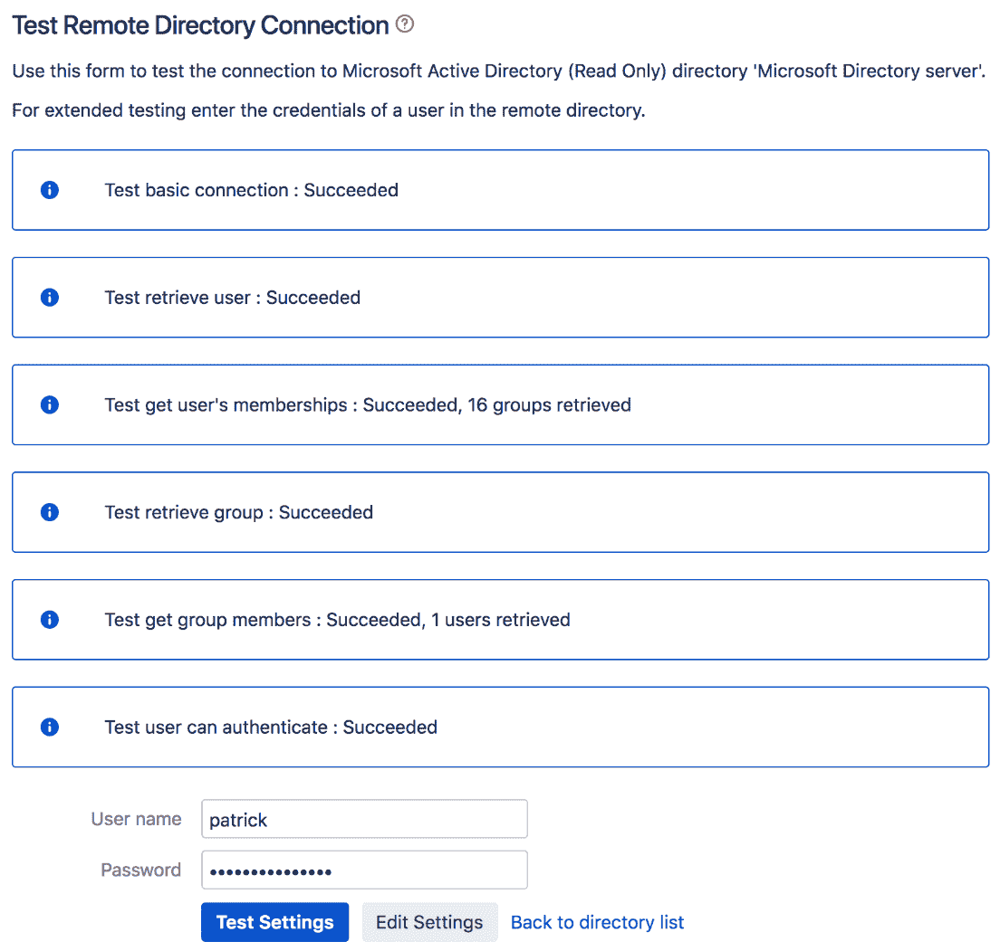

在您将 LDAP 服务器添加为用户目录后，Jira 会自动开始同步其用户和组数据。根据 LDAP 的大小，初始同步可能需要几分钟才能完成。您可以点击“返回目录列表”链接，查看同步过程的状态。

一旦过程完成，您将能够看到所有的 LDAP 用户和组，并使用您的 LDAP 凭据访问 Jira。

# 它是如何工作的...

我们刚刚在此配方中创建的内容被称为连接器。通过连接器，Jira 首先从 LDAP 拉取用户和组信息，然后创建本地副本。之后，它会定期同步任何变化。

所有身份验证将委托给 LDAP。因此，如果用户的密码在 LDAP 中更新，当用户尝试登录 Jira 时，它将立即反映出来。需要注意的是，使用 LDAP 时，用户仍然必须在必要的组中（例如，默认情况下为 `jira-users`），才能访问 Jira。因此，您需要确保在 LDAP 中创建一个名为 `jira-users` 的组并将所有人添加到其中，或者授予应用程序对 LDAP 组的访问权限，例如名为 `all-employees` 的组。

此外，请注意，只有具有 Jira 访问权限的用户才会计入您的许可证数量。这包括已获得 Jira 应用访问权限的用户所在的组。

# 另请参见

如果你的 LDAP 中有大量用户，且你只希望使用 LDAP 进行身份验证，你可以参考下一个教程，*仅用于身份验证的 LDAP 集成*。

# 仅用于身份验证的 LDAP 集成

有时，你可能只需要使用 LDAP 进行身份验证，并希望将用户组成员关系与 LDAP 分开，以便于管理。在本教程中，我们将介绍如何仅将 Jira 与 LDAP 进行身份验证集成。

# 准备工作

对于本教程，你需要有一个运行中的 LDAP 服务器。你需要确保 Jira 服务器能够访问 LDAP 服务器。更多详情，请参考前一个教程，*从 LDAP 集成和导入用户*。

# 如何操作...

按照以下步骤将 Jira 与 LDAP 服务器仅用于身份验证进行集成：

1.  转到管理 > 用户管理 > 用户目录。

1.  点击添加目录按钮并选择“内部与 LDAP 身份验证”选项。

1.  输入 LDAP 服务器和架构设置。大多数参数与创建普通 LDAP 连接时使用的相同，但也有少数例外。请参阅下表获取详细信息。

1.  点击快速测试按钮以验证 Jira 与 LDAP 的连接性。

1.  如果与 LDAP 连接没有问题，点击保存并测试按钮。

下表列出了专门针对“内部与 LDAP 身份验证”选项的配置参数：

| **服务器设置** | **描述** |
| --- | --- |
| 登录时复制用户 | 该选项会在用户首次成功登录 Jira 时自动将用户从 LDAP 复制到 Jira 中。 |
| 默认组成员关系 | 该选项会在用户首次成功登录 Jira 时自动将用户添加到此处指定的组中。此设置不会回溯到现有用户。这个功能可以确保每个能够登录 Jira 的用户都会被添加到必要的组中，例如`jira-users`。 |
| 同步组成员关系 | 该选项会在用户成功登录时自动将用户的组成员关系复制到 Jira。 |

# 工作原理...

这个身份验证选项与前一个教程类似，但有一些关键区别：

+   LDAP 仅用于身份验证

+   Jira 在用户首次登录后不会定期同步来自 LDAP 的用户和组信息

+   Jira 对 LDAP 具有只读访问权限

+   组成员关系在 Jira 内部管理

通过此设置，每当用户首次成功登录 Jira 时，用户会从 LDAP 复制到 Jira 的本地用户库，并附带组成员关系（如果已配置）。由于 LDAP 仅在身份验证时使用，且没有同步所有用户信息的初始开销，因此对于需要在 LDAP 中同步大量用户的组织而言，此选项能提供更好的性能。

# 与 Atlassian Crowd 集成

在之前的配方中，*仅用于身份验证的 LDAP 集成*，我们探讨了如何将 Jira 与 LDAP 服务器集成以获取用户和组信息。除了使用 LDAP，另一个流行的选项是使用**Crowd**，可在[`www.atlassian.com/software/crowd/overview`](https://www.atlassian.com/software/crowd/overview)获取。

Crowd 是 Atlassian 的用户身份管理解决方案，Jira 原生支持与 Crowd 的集成。使用 Crowd，你还可以与其他支持 Crowd 的应用程序设置单点登录选项。

# 准备开始

对于本配方，你需要确保 Crowd 服务器已经启动并运行。你需要确保 Jira 服务器能够顺利访问 Crowd 服务器——例如，确保没有被防火墙阻塞。

至少，你还需要以下信息：

+   Crowd 服务器 URL

+   Crowd 中为 Jira 注册的应用程序的凭证

# 如何操作...

按照以下步骤将 Jira 与 Crowd 集成进行用户管理：

1.  转到 管理 > 用户管理 > 用户目录。

1.  点击 添加目录 按钮并选择 Atlassian Crowd 选项。

1.  输入 Crowd 服务器设置。有关详细信息，请参考下表。

1.  点击 测试设置 按钮以验证 Jira 与 Crowd 的连接。

1.  如果与 Crowd 连接没有问题，点击 保存并测试 按钮。

下表列出了设置与 Crowd 集成的配置参数：

| **服务器设置** | **描述** |
| --- | --- |
| 名称 | 这是 Crowd 服务器的标识符。 |
| 服务器 URL | 这是 Crowd 的服务器 URL。 |
| 应用程序名称 | 这是 Jira 在 Crowd 中的注册应用程序名称。 |
| 应用程序密码 | 这是注册应用程序的密码。 |
| Crowd 权限 | 这是列标题。 |
| 只读 | 如果不希望 Jira 对 Crowd 进行任何更改，请选择此选项。如果一切，包括用户的组成员身份，都是由 Crowd 管理的，这个选项是理想的。 |
| 读/写 | 选择此选项以允许 Jira 将任何更改同步回 Crowd。 |

高级设置列在下表中：

| **高级设置** | **描述** |
| --- | --- |
| 启用嵌套组 | 这允许组包含其他组作为成员。 |
| 启用增量同步 | 这将只同步增量数据。启用此选项可以帮助提高性能。 |
| 同步间隔 | 这决定了 Jira 与 Crowd 同步更改的频率（单位：分钟）。较短的间隔可能会导致性能问题。 |

# 另见

请参阅 *如何设置与 Crowd 的单点登录* 配方，了解如何利用 Crowd 的单点登录功能，集成 Jira 和其他支持 Crowd 的应用程序。

# 设置与 Crowd 的单点登录功能

在之前的教程中，我们已经查看了 Jira 使用外部集中式用户存储库（包括 Crowd）的不同选项。将 Jira 与 Crowd 集成的一个优势是其 **单点登录** (**SSO**) 功能。

与 Crowd 集成的基于 Web 的应用程序能够参与 SSO 环境，因此当用户登录到一个应用程序时，他/她将自动登录到所有其他应用程序。

如果你正在寻找 Windows 环境中的单点登录功能，在该环境中用户将自动登录到应用程序并与工作站同步，请阅读下一个教程，*设置 Windows 域单点登录*。

# 准备工作

在你可以通过 Crowd 设置 SSO 之前，你首先需要将 Jira 与 Crowd 集成以进行用户管理。详细信息请参阅 *与 Atlassian Crowd 集成* 的教程。

如果你已经将 Jira 与 Crowd 集成，你需要拥有以下信息：

+   分配给 Jira 在 Crowd 中的应用程序名称

+   Jira 访问 Crowd 的密码

+   从 `CROWD_INSTALL/client/conf` 目录复制一份 `crowd.properties` 文件

# 如何操作...

按照以下步骤启用与 Crowd 的 SSO：

1.  如果 Jira 正在运行，请先关闭它。

1.  在文本编辑器中打开位于 `JIRA_INSTALL/atlassian-jira/WEB-INF/classes` 目录中的 `seraph-config.xml` 文件。

1.  找到包含 `com.atlassian.jira.security.login.JiraSeraphAuthenticator` 的行。将其注释掉，使其看起来如下所示：

```
<!--
<authenticator  class="com.atlassian.jira
.security.login.JiraSeraphAuthenticator"/>
-->
```

1.  找到包含 `com.atlassian.jira.security.login.SSOSeraphAuthenticator` 的行。取消注释它，使其看起来如下所示：

```
<authenticator class="com.atlassian.jira
.security.login.SSOSeraphAuthenticator"/>
```

1.  将 `crowd.properties` 文件复制到 `JIRA_INSTALL/atlassian-jira/WEB-INF/classes` 目录。

1.  在文本编辑器中打开 `crowd.properties` 文件并更新下表中列出的属性。

1.  重新启动 Jira。

下表列出了 `crowd.properties` 文件中的配置参数：

| **参数** | **值** |
| --- | --- |
| `application.name` | 这是在 Crowd for Jira 中配置的应用程序名称。 |
| `application.password` | 这是应用程序的密码。 |
| `application.login.url` | 这是 Jira 的基础 URL（你可以从 Jira 的常规配置中获得该 URL）。 |
| `crowd.base.url` | 这是 Crowd 的基础 URL。 |
| `session.validationinterval` | 这是 Crowd SSO 会话保持有效的时间（以分钟为单位）。将此设置为 `0` 将立即使会话失效，并且会产生性能负担。建议将此值设置为更高的值。 |

一旦 Jira 重新启动，它将参与所有启用 Crowd SSO 的应用程序中的 SSO 会话——例如，如果你有多个与 Crowd 集成的 Jira 实例用于 SSO，你只需要登录其中一个 Jira 实例。

在进行任何更改之前，请确保你已经备份了该文件。

# 设置与 Google 的单点登录

如果您的组织使用 Google 来管理用户信息，或者您仅仅希望允许拥有有效 Google 账户的人能够登录到您的 Jira 实例（特别是如果它是一个公共实例），您可以将 Jira 与 Google 集成，让用户可以通过点击一次按钮，使用他们的 Google 账户详细信息登录 Jira。

# 准备工作

对于本教程，我们需要 Jira CLI。您可以在[`docs.appfusions.com/display/GAPPSAUTHJ/Downloads+and+Notes`](https://docs.appfusions.com/display/GAPPSAUTHJ/Downloads+and+Notes)下载。

# 如何操作...

配置与 Google 的 SSO 的第一步是通过以下步骤创建一组 Google API 凭据：

1.  访问 Google API 控制台：[`console.developers.google.com/apis/credentials`](https://console.developers.google.com/apis/credentials)。

1.  点击“创建凭据”下拉菜单。

1.  选择 OAuth 客户端 ID，然后选择 Web 应用程序。

1.  输入 API 凭据的名称，并输入 Jira 的 URL 作为授权的 JavaScript 来源。

1.  创建新的 API 凭据并记下客户端 ID 和客户端密钥：稍后我们会用到它们。

创建好 Google API 凭据后，我们可以配置 SSO 集成：

1.  进入 管理 > 管理应用 > Google SSO。

1.  点击页面底部的“编辑此配置…”链接。

1.  输入之前记下的客户端 ID 和客户端密钥。

1.  选择您希望 Google 登录按钮显示在登录页面的位置。

1.  点击“保存”以应用更改：

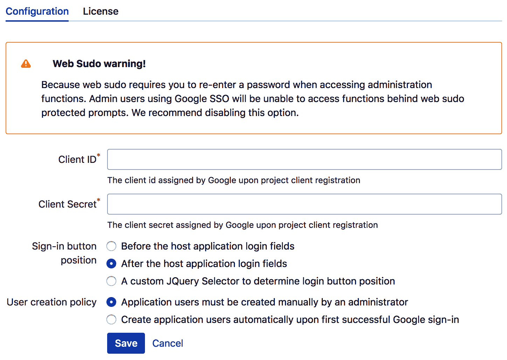

由于我们将通过 Google 登录 Jira，建议禁用 web `sudo`，因为 Jira 无法识别 Google 用户账户的密码。

配置好 Google API 凭据后，Jira 登录页面将显示一个新的“使用 Google 登录”按钮，如下图所示：

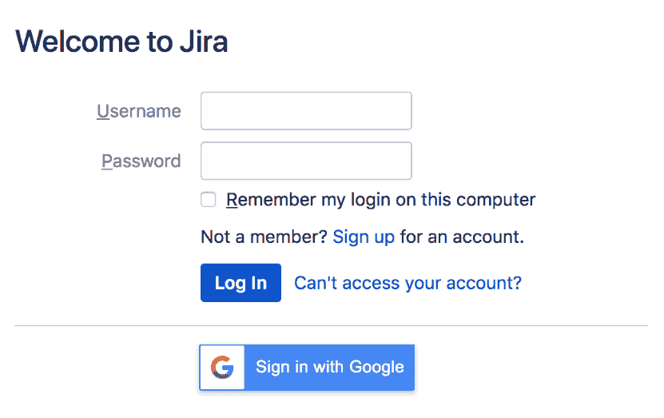

点击该按钮后，如果您尚未登录 Google，它将带您到 Google 的登录页面，或者如果您已经登录 Google，则直接通过，之后您就可以登录 Jira 了。

# 配置 Windows 域单点登录

如果您的组织运行 Windows 域，您可以配置 Jira，使得用户在使用工作站登录域时能够自动登录。

# 准备工作

对于本教程，我们需要为 Jira 配置 Kerberos SSO 验证器。您可以在[`www.appfusions.com/display/KBRSCJ/Home`](http://www.appfusions.com/display/KBRSCJ/Home)下载。

您还需要进行以下设置：

+   在 AD 中为 Jira 创建的服务账户

+   Jira 的 **服务主体名称** (**SPN**)

# 如何操作...

配置 Windows 域 SSO 并不是一项简单的任务，因为它涉及到网络配置的多个方面。强烈建议您与产品供应商和熟悉您的 AD 环境的人员合作，以确保顺利实施。

按照以下步骤设置 Windows 域 SSO：

1.  如果 Jira 正在运行，请关闭它。

1.  将`login.conf`、`krb5.conf`和`spnego-exclusion.properties`复制到`JIRA_INSTALL/atlassian-jira/WEB-INF/classes`目录中。

1.  将`appfusions-jira-seraph-4.0.0.jar`和`appfusions-spnego-r7_3.jar`复制到`JIRA_INSTALL/atlassian-jira/WEB-INF/lib`目录中。

1.  使用文本编辑器打开位于`JIRA_INSTALL/atlassian-jira/WEB-INF`目录中的`web.xml`文件。

1.  在`THIS MUST BE THE LAST FILTER IN THE DEFINED CHAIN`条目之前添加以下 XML 片段。确保你更新以下参数的值：

    +   对于`spnego.krb5.conf`，使用`spnego.krb5.conf`文件的完整路径。

    +   对于`spnego.login.conf`，使用`spnego.login.conf`文件的完整路径。

    +   对于`spnego.preauth.username`，使用服务账户的用户名。

    +   对于`spnego.preauth.password`，使用服务账户的密码：

```
<filter>
 <filter-name>SpnegoHttpFilter</filter-name>

 <filter-class>net.sourceforge.spnego
 .SpnegoHttpFilter</filter-class>

 <init-param>

 <param-name>spnego.allow.basic</param-name>

  <param-value>true</param-value>

 </init-param>

 <init-param>

  <param-name>spnego.allow.localhost
  </param-name>

  <param-value>true</param-value>

 </init-param>

 <init-param>

  <param-name>spnego.allow.unsecure.basic
  </param-name>

  <param-value>true</param-value>

 </init-param>

 <init-param>

  <param-name>spnego.login.client.module
  </param-name>

  <param-value>spnego-client</param-value>

 </init-param>

 <init-param>

  <param-name>spnego.krb5.conf</param-name>

  <param-value>FULL_PATH/krb5.conf
  </param-value>

 </init-param>

 <init-param>

  <param-name>spnego.login.conf</param-name>

  <param-value>FULL_PATH/login.conf
  </param-value>

 </init-param>

 <init-param>

  <param-name>spnego.preauth.username
  </param-name>

  <param-value>SPN_USERNAME</param-value>

 </init-param>

 <init-param>

  <param-name>spnego.preauth.password
  </param-name>

  <param-value>SPN_PASSWORD</param-value>

 </init-param>

 <init-param>

  <param-name>spnego.login.server.module
  </param-name>

  <param-value>spnego-server</param-value>

 </init-param>

 <init-param>

  <param-name>spnego.prompt.ntlm</param-name>

  <param-value>true</param-value>

 </init-param>

 <init-param>

  <param-name>spnego.logger.level</param-name>

  <param-value>1</param-value>

 </init-param>

 <init-param>

  <param-name>spnego.skip.client.internet
  </param-name>

  <param-value>false</param-value>

 </init-param>

</filter>
```

1.  在`login`条目之前添加以下 XML 片段：

```
<filter-mapping>
<filter-name>SpnegoHttpFilter</filter-name>
<url-pattern>/*</url-pattern>
</filter-mapping>
```

1.  使用文本编辑器打开位于`JIRA_INSTALL/atlassian-jira/WEB-INF/classes`目录中的`seraph-config.xml`文件。

1.  找到包含`com.atlassian.jira.security.login.JiraSeraphAuthenticator`的行。将其注释掉，使其如下所示：

```
<!--
<authenticator class=
"com.atlassian.jira.security
.login.JiraSeraphAuthenticator"/>
-->
```

1.  在被注释掉的那一行下方添加以下 XML 片段：

```
<authenticator
class="com.appfusions.jira.SeraphAuthenticator"
/>
```

1.  重启 Jira。

1.  将你的 Jira 网址添加到浏览器的本地内网区域。

一旦 Jira 重启后，每次你登录 Windows 域时应该会自动登录。确保在进行任何更改之前，也有该文件的备份副本。
