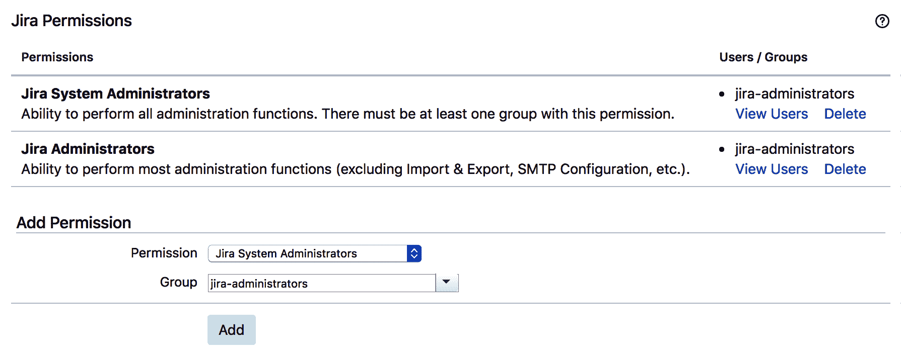

# Jira 安全性

安全性是任何信息系统中最重要的方面之一。在 Jira 中，这包括管理不同级别的访问权限，并确保信息仅对授权用户可访问。

在本章中，我们将涵盖 Jira 中不同级别的访问控制。我们还将涵盖其他与安全相关的话题，包括强制执行密码强度以及捕获和审计 Jira 中的变更以符合监管要求。

在本章中，我们将涵盖以下内容：

+   授予 Jira 访问权限

+   授予 Jira 系统管理员访问权限

+   控制对项目的访问

+   控制对 Jira 问题操作的访问

+   允许用户控制权限

+   委派管理员权限

+   基于报告者权限限制对项目的访问

+   设置密码策略

+   捕获变更的电子签名

+   更改“记住我”cookie 的持续时间

+   更改默认会话超时时间

# 授予 Jira 访问权限

由于 Jira 现在是一个平台，包含 Jira Core、Jira Software、Jira Service Desk 和其他第三方应用程序，您可以在同一平台实例上运行多个应用程序。这是因为用户访问权限是按应用程序级别授予的。在此食谱中，我们将查看如何管理对 Jira 中应用程序的访问。

# 如何操作...

要授予组对 Jira 的访问权限，请执行以下步骤：

1.  以 Jira 管理员身份登录 Jira。

1.  导航到 管理> 应用程序 > 应用程序访问。

1.  选择并添加组以获取对应用程序的访问权限：


现在是时候查看这些步骤是如何工作的了。

# 它是如何工作的...

从 JIRA 7 开始，Atlassian 引入了**应用程序**的新概念。这使得 Jira 成为一个平台，主要功能，如 JIRA Agile（现称 Jira Software）和 Jira Service Desk，现在是分别运行在 Jira 平台上的独立应用程序。这些变化意味着现在您可以单独控制用户对每个应用程序的访问权限。您不再使用权限控制谁可以访问 Jira，而是可以根据应用程序分配访问权限。

在授予应用程序访问权限时，您只能通过 组来进行。所以，您需要确保您已经适当地设计了组，以便用户能够访问正确的应用程序。

如果您在具有 Jira 管理员全局权限的组中（参见下一条食谱），如 `jira-administrators`，但该组没有访问 Jira Software 应用程序的权限，那么您仍然可以登录 Jira 并执行管理任务，但无法访问任何项目和问题。

# 还有更多...

如果你已经在应用访问页面为某个应用分配了多个组，可以选择一个或多个组作为默认组。这意味着，当新用户添加到系统时，他们将自动添加到默认组，从而可以立即开始使用 Jira。

# 授予 Jira 系统管理员权限

在之前的教程中，我们展示了如何授予用户对 Jira 应用的访问权限。在本教程中，我们将探讨如何授予用户管理员权限。与授予用户访问权限的方式相同，您只能向一组用户授予管理员权限。

# 如何操作...

要向 Jira 中的某个组授予管理员权限，请执行以下步骤：

1.  导航到 **Administration** > **System** > **Global permissions**。

1.  从 **Permissions** 列表中选择 **Jira System Administrators** 选项，并选择要授予访问权限的组，如下图所示：



现在我们来理解这个过程。

# 它是如何工作的...

Jira 中有两种级别的管理员访问权限：**Jira Administrator** 和 **Jira System Administrator**。在大多数情况下，这两者在 Jira 配置方面的功能是相同的，例如自定义字段和工作流。Jira 系统管理员拥有额外的系统级应用配置访问权限，例如 SMTP 邮件服务器配置、安装应用和更新 Jira 许可证。

默认情况下，`jira-administrators`组具有 Jira 管理员和 Jira 系统管理员的全局权限。如果您想区分这两种不同级别的管理员权限，可以创建两个独立的组并授予他们不同的权限。

# 控制项目访问权限

在之前的教程中，我们介绍了如何使用全局权限来控制 Jira 访问权限和管理员级别的访问权限。在本教程中，我们将展示如何控制项目级别的权限，首先从项目访问权限开始。

# 准备工作

要控制项目级别的访问权限，我们使用权限方案。Jira 自带一个默认的权限方案，所有项目会自动应用此方案。你可以使用此方案并直接更新其权限设置。对于本教程，我们将从创建一个新的权限方案开始，以演示整个过程。如果你想直接使用默认方案，可以跳过前三个步骤。

# 如何操作...

首先，我们需要创建一个新的权限方案，可以通过以下步骤来完成：

1.  导航到 **Administration** > **Issues** > **Permission schemes**。

1.  点击 **Add Permission Scheme** 按钮。

1.  输入新方案的名称并点击 **Add**。

1.  创建了权限方案后，我们需要向用户和组授予权限，具体来说，就是**Browse Projects**权限，该权限控制对项目的访问。

1.  点击新权限方案的 **Permissions** 链接。

1.  点击 **Browse Projects** 权限的 **Edit** 链接。

1.  选择授予权限的对象。例如，如果你只想限制某个组的成员访问，你可以选择**组**选项，选择目标组，然后点击**授予**：


我们可以将**权限**授予多个用户和组，完成后可以将权限方案应用到我们想要的项目中：

1.  转到你想要应用权限方案的项目，然后点击**管理**标签。

1.  在左侧选择**权限**选项，并从**操作**菜单中点击**使用不同的方案**选项：


1.  选择新的权限方案并点击**关联**。

# 它是如何工作的...

权限方案定义了项目级别的权限。与只能授予给组的全局权限不同，这些权限可以授予特定的用户、组、项目角色等。你在这里选择的选项将取决于你的使用场景。一般来说，选择组会是最直接的方式，因为用户通常属于一个或多个组，你可以根据组来轻松建模你的权限需求。其他选项适用于当你有特殊或边缘情况，需要容纳不符合组设置的用户时。一旦权限方案配置完成，你可以将该方案应用到各个项目。通过这种方式，不同的项目可以根据其需求拥有不同的权限方案。

# 控制对 Jira 问题操作的访问

在本教程中，我们将查看控制**问题操作**的权限。这些是你的最终用户每天会执行的操作，包括创建、编辑、删除、评论等。

# 准备工作

正如我们在前面的教程中看到的，你可以使用现有的权限方案或创建一个新的权限方案。对于这个教程，我们将继续使用之前创建的权限方案。

# 如何操作...

要设置问题操作的权限方案，请执行以下步骤：

1.  转到你想要应用权限方案的项目，然后点击**管理**标签。

1.  在左侧选择**权限**选项，并从**操作**菜单中点击**编辑权限**选项：


1.  点击你想更新的权限的**编辑**链接，例如**创建问题**和**编辑问题**。请注意，问题相关的权限会归类在**问题权限**标题下。

1.  选择要授予权限的目标，然后点击**授予**。

# 还有更多...

如果存在疑问，或者用户报告与权限相关的问题，您可以随时使用[权限助手工具](https://wiki.example.org/permission_helper_tool)（如下图所示）来检查您的配置。您只需输入用户的用户名，选择项目中的问题，选择权限类型，然后点击[提交]。工具将审查您的权限配置，并显示一个报告，解释所选权限所需的条件，以便您了解用户为何具有或不具有所选权限：


当您使用权限助手工具时，即使您想检查项目级权限（例如管理项目），系统始终会要求您选择一个问题。在这种情况下，只需选择属于该项目的问题，工具将为您验证权限。

# 允许用户控制权限

当在同一个 Jira 项目中有一组混合用户（例如内部员工和外部顾问）时，会出现只有内部员工才能查看的敏感信息的情况。在这些情况下，您将希望将这些实例标记为仅内部可见，以防其他人看到。

在本篇示例中，我们将演示如何使用问题安全方案设置权限以控制问题级别的访问。

# 如何操作...

设置问题级权限的步骤如下：

1.  因为 Jira 不提供任何默认的问题安全方案，所以第一步是从头开始创建一个新的安全方案：

    1.  转到[管理 > 问题 > 问题安全方案](https://wiki.example.org/issue_security_schemes)。

    1.  点击[添加问题安全方案](https://wiki.example.org/add_issue_security_scheme)链接。

    1.  输入新方案的名称，然后点击[添加]。

1.  第二步是设置您可以选择的安全级别，例如*仅内部用户*：

    1.  点击[安全级别](https://wiki.example.org/security_levels)链接以查看我们的新问题安全方案。

    1.  输入每个安全级别的名称，然后点击[添加安全级别]按钮。

您还可以点击[默认]链接，将安全级别设为默认选项。这样，在使用问题安全方案创建新问题的项目中，将预先选择默认安全级别。

以下截图显示了三个现有的安全级别：


1.  设置了安全级别之后，第三步是授予用户访问您定义的每个安全级别的权限：

    1.  点击[添加]链接以设置您希望为其设置用户访问权限的安全级别。

    1.  选择权限选项，然后点击[添加]按钮。

以下截图显示了在授予安全级别时您拥有的不同选项：


1.  现在，我们已经设置了所有安全级别，最后一步是将问题安全方案应用到我们的项目中：

    1.  转到您要应用问题安全方案的项目，并点击[管理]选项卡。

    1.  在左侧选择**问题安全**选项，并点击操作菜单中的选择方案选项。

    1.  选择新的问题安全方案并点击**下一步**。

    1.  如果项目不为空，Jira 会要求您为所有问题选择一个默认的安全级别。您可以选择**无**选项，使所有问题保持原样，或者选择一个安全级别，将其应用于所有问题。

    1.  点击**关联**按钮：


如上图所示，问题安全方案已应用于该项目。

# 它是如何工作的...

问题安全方案允许您作为终端用户，根据设置的安全级别控制谁可以访问单个问题。具有安全级别的问题只能由符合条件的用户查看。请注意，子任务会继承其父任务的安全级别。

一旦我们将问题安全方案应用于项目，具有**设置问题安全**权限的用户在创建和编辑问题时，将能够选择一个安全级别，如下图所示：


如果您没有看到**安全级别**字段，请确保该字段已添加到屏幕中，并且您拥有设置问题安全的权限。您可以使用上一节中介绍的权限帮助功能来验证这一点。

还值得一提的是，您只能选择自己所属的安全级别。例如，如果有两个安全级别，*A*和*B*，则安全级别*A*分配给`jira-administrators`组，而安全级别*B*分配给`jira-users`组。那么，作为`jira-users`组的成员，您只能选择安全级别*B*。这样做是为了防止用户因选择错误的安全级别而不小心将自己锁定在某个问题之外。

符合所选安全级别标准的用户能够正常查看该问题。然而，如果不符合标准的用户尝试查看该问题，他们会遇到权限违规错误，如下图所示：


此消息还会通知用户，问题可能已被删除。

# 委派管理员权限

大多数自定义和配置选项，如工作流和屏幕，都是由 Jira 管理员管理的。虽然这种模式对于小型组织来说可能运作良好，但在大型组织中常常会造成瓶颈，因为需要对这些核心 Jira 功能进行大量的自定义，而真正能够进行这些必要更改的 Jira 管理员数量有限。

在本节中，我们将探讨如何使项目管理员能够在无需完全依赖 Jira 管理员的情况下，自己进行部分自定义操作。

# 如何操作...

要允许项目管理员进行自定义更改，请执行以下步骤：

1.  转到管理 > 问题 > 权限方案。

1.  点击项目使用的权限方案下的**权限**链接。如果该项目没有专用的权限方案，可以通过点击**复制**链接克隆当前使用的权限方案来创建一个新的权限方案。

1.  在**管理员项目**权限下选中**扩展项目管理**选项：


一旦权限方案启用了扩展项目管理选项，使用该权限方案的项目管理员将被允许更改项目的工作流和屏幕。

# 工作原理...

扩展项目管理选项允许项目管理员在某些限制下对工作流和屏幕进行更改：

+   工作流不能被其他项目使用。

+   只能将 Jira 中已存在的状态添加到工作流中。项目管理员不能创建新的状态。

+   如果项目中没有任何问题处于该状态，则可以删除工作流中的现有状态。

+   可以从工作流中删除工作流转换，但不能更改诸如属性、验证器、条件、后置功能和屏幕等详细信息。

+   只能更新非系统屏幕，即 Jira 管理员创建的屏幕。

+   屏幕不能被其他项目使用。

+   只能将现有字段（包括自定义字段和系统字段）添加到屏幕中。

# 根据报告者权限限制对项目的访问

如前面某些操作中所见，`Browse Projects`权限控制谁可以访问 Jira 中的项目。在本操作中，我们将设置权限，使用户只能看到他们能够创建问题的项目，而无法看到他们无法创建问题的项目。

# 准备工作

由于我们将直接修改 Jira 系统文件，请确保为任何修改过的文件创建备份。此操作还需要重启 Jira，因此请在不会影响用户的时间段内进行。

# 操作方法...

要根据谁可以或不能报告的标准限制对项目的访问，首先需要启用一个特殊的权限类型，如下所示：

1.  使用文本编辑器打开`permission-types.xml`文件，该文件位于`JIRA_INSTALL/atlassian-jira/WEB-INF/classes`目录下。

1.  找到以下行，并取消注释`reportercreate`权限类型，如下所示：

```
        <!-- Uncomment & use this permission to show only projects
        where the user has create permission and issues
        within that where they are the reporter. -->

        <!-- This permission type should only ever be assigned to
        the "Browse Projects" permission. -->

        <!-- Other permissions can use the "reporter" or "create"
        permission type as appropriate. -->

        <!-- <type id="reportercreate" enterprise="true">
          <class>com.atlassian.jira.security.type

          .CurrentReporterHasCreatePermission</class>

        </type>

        -->
```

1.  重启 Jira 以使更改生效。

一旦启用`reportercreate`权限类型，在权限方案设置中将显示一个新的 Reporter 选项（该选项只显示具有创建权限的项目），如下图所示：


使用此选项为`Browse Projects`权限配置的权限方案中的项目，仅对那些可以在项目中创建问题的用户可见。

# 工作原理...

`reportercreate` 权限类型检查当前用户是否有权限在给定项目中创建问题。这与默认的 reporter 权限或当前 reporter 权限类型不同，后者使项目对所有用户可见。

此外，请注意，此权限应仅应用于 Browse Projects 权限。如果应用于其他权限，特别是 Create Issues 权限，会导致 Jira 进入无限循环，这也是该权限类型默认禁用的原因。

# 还有更多……

还有一个类似的 Assignee 权限类型（仅显示具有分配权限的项目），可以在 `permission-types.xml` 文件中启用。与 reporter 等效的权限类型类似，该权限类型检查用户是否可以在项目中被分配问题。与 reporter 权限类型一样，该权限类型应仅应用于 Browse Projects 权限：

```
<!-- Uncomment & use this permission to show only projects where the user has the assignable permission and issues within that where they are the assignee -->

<!-- This permission type should only ever be assigned to the "Browse Projects" permission. -->

<!-- Other permissions can use the "reporter" or "create" permission type as appropriate. -->

<!-- 
<type id="assigneeassignable" enterprise="true">
  <class>com.atlassian.jira.security.type
  .CurrentAssigneeHasAssignablePermission</class>

</type>

-->
```

# 设置密码策略

默认情况下，Jira 允许创建任何组合和长度的密码。出于安全考虑，组织通常需要有密码策略，如密码长度和复杂性要求，以加强密码安全性并使其难以猜测。

在本教程中，我们将演示如何在 Jira 中设置密码策略，以定义密码的强度。

# 如何操作……

要启用并配置密码策略设置，请执行以下步骤：

1.  导航至 Administration > System > Password Policy。

1.  从预定义的策略设置中选择；或者，选择 Custom 选项并自行配置设置。

1.  点击 Update 按钮启用密码策略，如下图所示：


通常，最好使用自定义选项并设置自己的密码策略，而不是使用预定义选项，因为它可以让您更好地控制并强制为用户提供更安全的密码。

# 它是如何工作的……

配置了密码策略后，每次有人尝试创建新密码时，Jira 将确保新密码符合策略规则。如果不符合，系统会显示错误消息，并提供关于要求的详细信息，如下图所示：


错误消息显示某些规则未满足。

# 还有更多……

除了内置的密码策略功能外，还有一个名为 **Enterprise Password Policy for Jira** 的第三方应用，它提供如密码年龄和用户帐户锁定等功能，使您的 Jira 符合 ISO/IEC 27002 标准。您可以在 [`marketplace.atlassian.com/plugins/com.intenso.jira.plugins.password-policy`](https://marketplace.atlassian.com/plugins/com.intenso.jira.plugins.password-policy) 获取该应用。

在你安装完该应用后，Jira 中的“管理应用”下的“管理”部分会出现一个新的“密码策略”栏目。点击“配置”选项，然后点击“密码复杂度”，你就可以设置密码策略，如下图所示：


你需要禁用默认的密码策略功能才能使用该应用。

如前面截图所示，相比 Jira 的开箱即用功能，你有更多选项和控制来定义你的密码策略。

# 捕捉变更的电子签名

有严格监管要求的组织通常需要在问题流转过程中捕捉**电子签名**（或**电子签名**），以便将来审计使用。这通常是 CFR Part 11 合规性的一部分。

在本教程中，我们将探讨如何在有人尝试通过工作流过渡问题时强制执行并捕捉电子签名。

# 准备工作

对于这个教程，我们需要安装 CFR Part 11 电子签名应用。你可以在[`docs.appfusions.com/display/PRT11J/Home`](https://docs.appfusions.com/display/PRT11J/Home)下载该应用，然后在管理控制台的“管理应用”中安装它。

# 如何操作...

要开始捕捉电子签名，首先我们需要创建一个**电子签名**自定义字段：

1.  转到“管理”>“问题”>“自定义字段”。

1.  点击“添加自定义字段”按钮并选择“高级”标签。

1.  选择“电子签名”自定义字段类型并点击“下一步”。

1.  为自定义字段命名为`E-Signatures`并点击“下一步”。

1.  选择一个屏幕以放置自定义字段。例如，如果你想在用户解决问题时捕捉签名，你需要选择用于**解决问题**过渡的屏幕。

1.  点击**更新**按钮：


你需要为你想要捕捉电子签名的操作创建一个屏幕。

# 操作方式...

一旦你创建了一个电子签名自定义字段并将其添加到一个屏幕上，比如“解决问题”屏幕，它将显示为两个文本字段：一个用于用户名，一个用于密码。

只有当用户通过输入用户名和密码签署该操作时，工作流过渡才能完成，如下图所示：


如果签名验证成功且过渡完成，电子签名将被存储，你可以通过点击网页底部新出现的**电子签名**问题标签来查看报告：


电子签名应用还提供了一个“限制模式”选项（默认关闭）。此模式要求用户在提供电子签名时使用自己的凭证。你可以通过以下步骤启用此限制模式：

1.  导航到 管理 > 管理应用 > 电子签名字段。

1.  勾选“受限模式”选项并点击“保存”。

启用后，用户名字段将自动设置为当前用户的用户名，因此您只能使用自己的密码进行签名。

# 更改“记住我”cookies 的持续时间

当用户选中“在此计算机上记住我的登录”复选框时，用户无需在同一浏览器中重新输入凭据，除非他们显式登出。此外，默认情况下，该功能持续两周。

在本篇教程中，我们将介绍如何更改持续时间，将其扩展到最大可能值，或者将其缩短以符合您的安全要求。

# 准备工作

由于我们将直接修改 Jira 系统文件，请确保对所有修改的文件进行备份。此操作还需要重新启动 Jira，因此请在不会影响用户的时间段进行计划。

# 如何操作…

要更改“记住我”cookie 的持续时间，请执行以下步骤：

1.  打开 `seraph-config.xml` 文件，该文件位于 `JIRA_INSTALL/atlassian-jira/WEB-INF/classes` 目录中，使用文本编辑器编辑。

1.  定位到 `autologin.cookie.age` 行，并将 `param-value` 的值更改为所需的秒数：

```
<init-param>
    <param-name>autologin.cookie.age</param-name>
    <param-value>1209600</param-value>
</init-param>
```

1.  重新启动 Jira 以使更改生效。

# 它是如何工作的…

Jira 使用 Seraph 框架（[`docs.atlassian.com/atlassian-seraph/latest`](https://docs.atlassian.com/atlassian-seraph/latest)）来管理其 HTTP 会话 cookie。当选中“记住我”选项时，它会创建 `seraph.rememberme.cookie`。

`seraph-config.xml` 文件用于配置 Seraph 框架，而 `autologin.cookie.age` 参数用于设置 cookie 的最大年龄。

# 参见

+   您可以参考*更改默认会话超时*教程，了解有关如何更改默认会话超时设置的更多详细信息。

# 更改默认会话超时

默认情况下，每个活跃的用户会话在空闲状态下持续五小时（或 300 分钟）。这意味着用户可以登录并离开计算机最多五小时，他们的浏览器会话仍会保持活跃。

在本篇教程中，我们将介绍如何更改默认的会话超时设置。

# 准备工作

由于我们将直接修改 Jira 文件，请确保对所有修改的文件进行备份。此操作还需要重新启动 Jira，因此请在不会影响用户的时间段进行计划。

# 如何操作…

要更改 Jira 中的会话超时设置，请执行以下步骤：

1.  打开 `web.xml` 文件，该文件位于 `JIRA_INSTALL/atlassian-jira/WEB-INF` 目录中，使用文本编辑器编辑。

1.  定位到 `<session-config>` 行，并将 `session-timeout` 的值更改为所需的分钟数：

```
<session-config>
    <session-timeout>300</session-timeout>
</session-config>
```

1.  重新启动 Jira 以使更改生效。

# 它是如何工作的…

Jira 使用标准的 Java 会话配置文件`web.xml`，该文件定义了会话超时时间（以分钟为单位）。你可以参考此链接：[ht](http://docs.oracle.com/cd/E13222_01/wls/docs81/webapp/web_xml.html#1017275)[tp://docs.oracle.com/cd/E13222_01/wls/docs81/webapp/web_xml.html#1017275](http://docs.oracle.com/cd/E13222_01/wls/docs81/webapp/web_xml.html#1017275)。
