# 电子邮件和通知

电子邮件是世界上最重要的通信工具之一。它是一项人们熟悉且对其采纳阻力最小的技术。因此，电子邮件集成如今已成为任何系统的关键功能之一。帮助台系统、客户关系管理系统（CRM）甚至文档管理系统都需要能够发送和接收电子邮件。因此，Jira 自带一整套电子邮件集成功能也就不足为奇了。

在本章中，我们将学习如何配置 Jira，使其在每次有人更改问题时发送电子邮件通知，设置通知规则来管理电子邮件接收者，并创建邮件模板来自定义电子邮件内容。我们还将探讨 Jira 如何处理电子邮件并自动创建问题，从而节省手动输入数据的工作。

在本章中，我们将涵盖以下内容：

+   设置外发邮件服务器

+   从 Jira 发送电子邮件给用户

+   发送问题更新的通知

+   使用自定义模板发送通知

+   禁用外发通知

+   创建邮件处理程序以处理传入电子邮件

+   使用电子邮件更新 Jira 问题

+   设置项目特定的发件人电子邮件地址

# 设置外发邮件服务器

在本章中，我们将学习如何在 Jira 中设置一个外发邮件服务器，用于直接发送电子邮件给用户或在问题更新时发送自动通知。

# 准备工作

Jira 需要一个有效的邮件服务器来发送电子邮件，它使用**SMTP**（即**简单邮件传输协议**）与邮件服务器通信。因此，您需要以下内容：

+   一个工作中的邮件服务器，要么与 Jira 位于同一服务器上，要么可以通过网络访问

+   连接详细信息，包括邮件服务器的主机、端口、协议（SMTP 或安全 SMTP），以及如果使用自签名证书，则需要 SSL 证书

+   Jira 登录邮件服务器的认证信息

# 如何操作…

按照以下步骤设置一个外发邮件服务器：

1.  以 Jira 管理员身份登录 Jira。

1.  导航到**管理** > **系统** > **外发邮件**。

1.  点击**配置新的 SMTP 邮件服务器**按钮。

1.  设置邮件服务器的名称。例如，您可以使用邮件服务器的主机名。

1.  设置“发件人”地址字段，用户收到 Jira 发送的电子邮件时将使用此地址。

1.  提供一个**电子邮件前缀**值，该值将添加到每封邮件的主题中。例如，您可以使用`[Jira]`来让用户知道邮件来自 Jira。

1.  选择是使用自定义 SMTP 服务器，还是使用 Gmail 或 Yahoo!邮件的服务器。如果使用 Gmail 或 Yahoo!，请确保选择相应的选项并提供访问凭据。如果使用自定义 SMTP 服务器，您需要提供其主机名、端口号以及必要时的凭据。

1.  点击**测试连接**按钮，使用提供的凭据确保 Jira 能够连接到邮件服务器。如果测试成功，点击**添加**按钮，如下图所示：

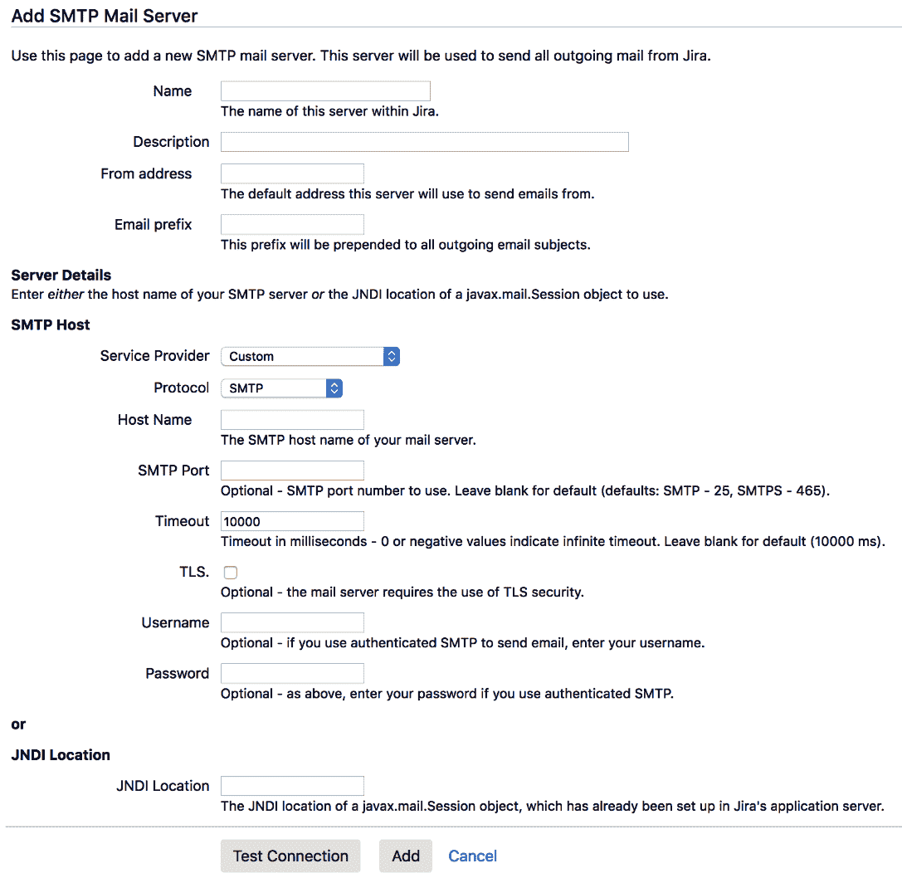

你只能设置一个外发邮件服务器。

一旦我们在 Jira 中配置了外发邮件服务器，我们可以发送测试邮件以确保一切正常工作：

1.  点击**发送测试邮件**链接。

1.  验证**To**字段中的电子邮件地址是否是你可以访问的地址。Jira 会自动填充当前登录用户的电子邮件地址。

1.  点击**发送**按钮发送测试邮件。

Jira 会立即向**To**字段中的地址发送测试邮件（普通通知邮件会排队等待发送），邮件主题和正文内容将按所指定的方式显示，如下图所示。如果出现错误，你可以勾选 SMTP 日志复选框以获取更多错误细节：

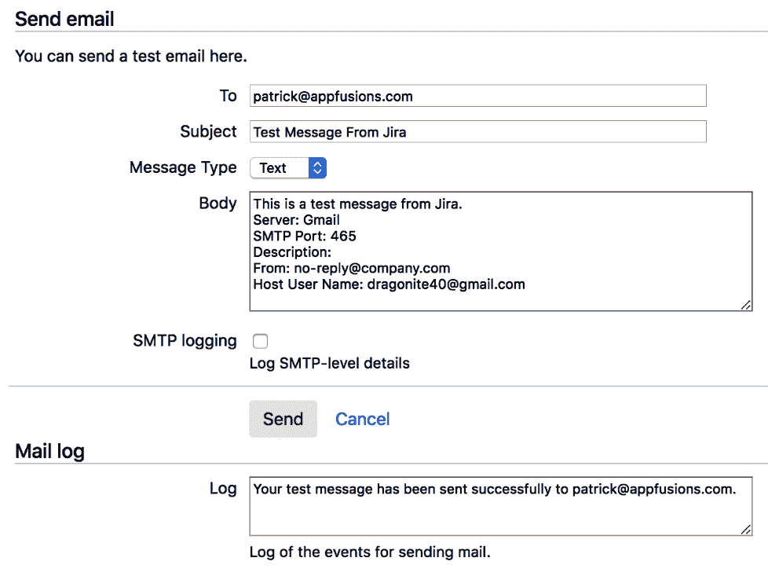

我们现在已经成功设置了外发邮件服务器。

# 从 Jira 向用户发送电子邮件

设置好外发邮件服务器后，我们现在可以直接从 Jira 发送电子邮件了。一个常见的使用场景是发送提醒邮件，比如系统维护通知，发送给 Jira 中的所有人，或者向项目成员发送重要更新。在这个教程中，我们将展示如何使用 Jira 执行这些任务。

# 准备工作

你必须首先为 Jira 配置一个外发邮件服务器。有关更多详细信息，请参阅前面的教程，*设置外发邮件服务器*。

# 如何操作...

按照以下步骤将邮件直接发送给 Jira 中的用户：

1.  转到**管理** > **系统** > **发送邮件**。

1.  选择电子邮件的收件人。你可以选择通过**项目角色**或**群组**发送电子邮件。例如，要向所有使用 Jira 的用户发送电子邮件，你可以选择**jira-software-users**群组（如果它是所有用户所在的群组）。

1.  输入你的电子邮件**主题**和**正文**。

1.  如果你不希望收件人看到其他收件人的电子邮件地址，请勾选**Bcc**复选框。

1.  点击**发送**按钮以发送电子邮件，如下图所示：

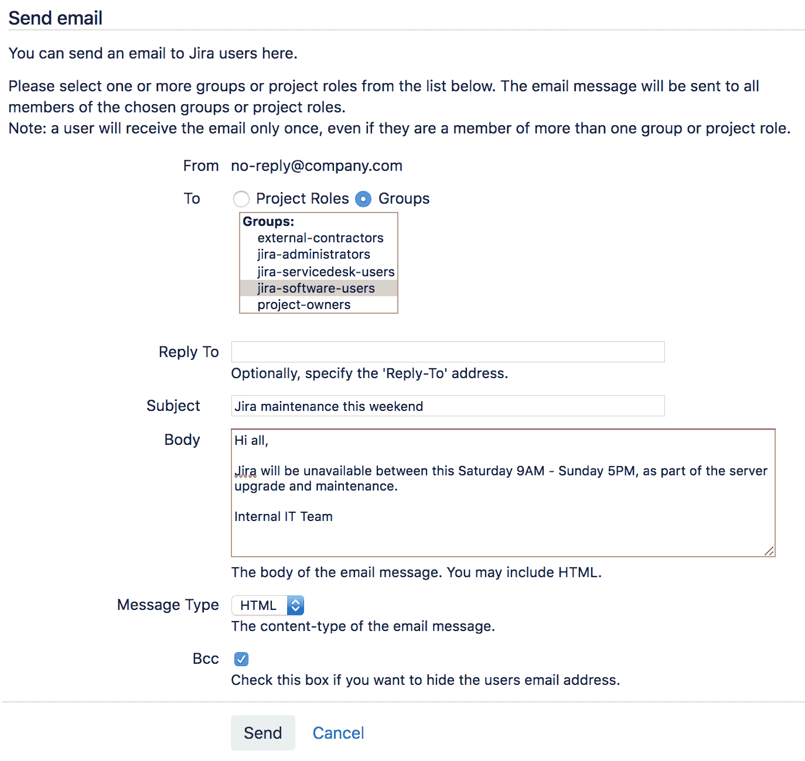

这些步骤完成了向用户发送电子邮件的操作。

# 发送问题更新通知

另一项外发邮件的主要用途是让 Jira 自动发送关于问题变更的通知。例如，如果某个问题被更新，你希望该问题的报告人和处理人收到变更通知。

在本教程中，我们将展示如何设置通知规则，以便相关方能够接收到其问题变更的通知。

# 准备工作

你必须首先为 Jira 配置一个外发邮件服务器。有关更多详细信息，请参阅*设置外发邮件服务器*教程。

# 如何操作...

Jira 使用通知方案来控制在问题发生任何变化时，谁应该接收通知。Jira 自带一个默认的通知方案，默认应用于所有项目。你可以通过点击其**通知**链接来更新此默认方案的通知设置。然而，在本教程中，我们将创建一个新的通知方案并将其应用到项目。如果你想使用默认通知方案，可以跳过创建新方案的步骤，直接进入第 2 步：

1.  按照以下步骤创建一个新的通知方案：

    1.  导航到**管理** > **问题** > **通知方案**。

    1.  点击**添加通知方案**链接。

    1.  输入新方案的名称，然后点击**添加**来创建它。

创建新的通知方案后，系统将带你进入该方案的通知设置页面。默认情况下，任何事件都没有设置通知。

1.  要将通知接收者添加到事件，请按照以下步骤进行：

    1.  点击事件的**添加**链接。

    1.  选择通知接收者的类型（例如，`组`选项，如下图所示），然后点击**添加**。

你可以通过使用多选事件字段，将一个通知接收者添加到多个事件中。下图展示了**添加通知**页面的内容：

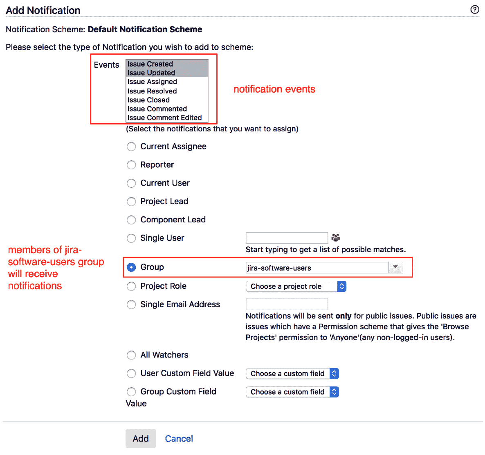

你可以为每个事件添加尽可能多的通知接收者，Jira 不会向同一用户发送重复的邮件。例如，如果你设置了报告人和指派人都接收某个事件的通知，并且他们恰好是同一个用户，Jira 只会发送一封邮件，而不是两封。另外，请注意，Jira 在发送通知时会考虑权限。如果某个用户没有访问权限，Jira 将不会向该用户发送通知。

1.  最后一步是将我们新的通知方案应用到项目中：

    1.  浏览到你想要应用通知方案的项目。

    1.  点击**项目设置**选项。

    1.  从左侧面板中选择**通知**选项。

    1.  从**操作**菜单中选择**使用不同的方案**。

    1.  选择新的通知方案，然后点击**关联**。

# 它是如何工作的...

Jira 使用一个事件系统，其中每个问题操作，如创建新问题或工作流转换，都将触发一个相应的事件。正如我们所看到的，通知方案将事件映射到通知接收者。通过这种方式，我们能够设置灵活的通知规则，通知不同的人不同的事件。

Jira 提供了许多不同的通知接收人类型。有些接收人类型，如当前指派人和报告人，非常简单——它们分别仅使用当前问题的指派人和报告人字段的值。其他选项，例如用户自定义字段值，可以非常灵活。例如，你可以创建一个多用户选择自定义字段，并为每个问题指定不同的用户列表作为接收人，而无需修改实际的通知方案。

事件也会映射到邮件模板，以便 Jira 知道使用哪个模板来设置主题和正文。系统事件的映射无法更改，但正如我们在下一步中看到的，我们可以创建自定义事件并选择使用哪些模板。

# 还有更多...

自动接收 Jira 中发生的任何更改的通知非常方便，但如果你有一个繁忙的 Jira，你可能会因为更新太多而陷入大量邮件中。为了解决这个问题，你可以启用新的邮件批量处理功能。启用批量处理后，Jira 不会为每个更新单独发送邮件，而是将一个问题的所有更新进行分组，并发送一封汇总邮件给你。要启用邮件批量处理，请按以下步骤操作：

1.  进入“管理” > “系统” > “批量邮件通知”。

1.  勾选“批量邮件通知”选项以启用该功能。

# 使用自定义模板发送通知

在之前的教程《*发送问题更新通知*》中，我们查看了如何通过将事件映射到通知接收人来设置通知方案。

在本教程中，我们将进一步探讨如何创建自定义事件和模板用于通知。这有两个优势：

+   我们可以自定义通知邮件的内容和外观。

+   我们可以精确指定每个工作流转换将触发的事件，并相应地设置通知规则。

我们将创建一个新事件，表示管理层已批准的请求。此事件将在批准的工作流转换中触发，并应用自定义模板。

# 如何操作...

第一步是创建我们的自定义邮件模板。所有邮件模板都存储在`JIRA_INSTALL/atlassian-jira/WEB-INF/classes/templates/email`目录下，通常，对于 Jira 中的每个事件，有三个模板文件：

+   **主题模板**：这是邮件主题行的模板文件，存储在`subject`子目录中。

+   **文本模板**：这是发送文本格式邮件的模板文件，存储在`text`子目录中。

+   **HTML 模板**：这是发送 HTML 格式邮件的模板文件，存储在`html`子目录中。

要开始创建我们自己的电子邮件模板，首先需要创建前面提到的三个模板文件，并将它们放置在各自的目录中。特别注意，所有三个文件需要具有相同的文件名并且扩展名为 `.vm`。

我们将从主题模板开始，如下所示：

1.  在 `subject` 子目录下创建一个名为 `issueapproved.vm` 的新文件，并添加以下代码片段：

```
#disable_html_escaping()

$eventTypeName - ($issue.key) $issue.summary
```

1.  现在我们需要创建电子邮件的正文，记住要创建两个版本——一个是文本版本，一个是 HTML 版本。以下代码片段显示了 HTML 版本；对于文本版本，只需删除 HTML 标记即可。注意，HTML 和文本模板文件需要是相同的——即 `issueapproved.vm`：

```
#disable_html_escaping()

Hello $issue.reporterUser.displayName,

<p>
 Your request <a href="">$issue.key</a> has been approved, with the comment below:
</p>

<blockquote>
  <p>
   #if($comment.body)
      $comment.body
    #else
   <i>No comment</i>
    #end
  </p>
 </blockquote>

 <br/>

 Internal IT team
```

1.  在创建完所有三个模板文件后，我们需要在 Jira 中注册它们，以便在创建自定义事件时可以选择这些模板。要注册新的电子邮件模板，打开 `email-template-id-mappings.xml` 文件，可以在 `JIRA_INSTALL/atlassian-jira/WEB-INF/classes` 目录下找到该文件。

1.  `email-template-id-mappings.xml` 文件列出了 Jira 中所有的电子邮件模板，因此我们需要在文件末尾添加一个新条目，如下所示：

```
<templatemapping id="10002">

 <name>Issue Approved</name>

 <template>issueapproved.vm</template>

 <templatetype>issueevent</templatetype>

</templatemapping>
```

这里有几个要注意的要点：

+   `<templatemapping>` 的 `id` 值需要是唯一的。

+   你可以为 `<name>` 元素赋予任意值，它将在 Jira 中显示。遵循标准的 Jira 事件命名规范是一个良好的实践。

+   `<template>` 元素应为我们创建的自定义模板文件的名称。所有三个文件需要具有相同的文件名，因为我们只能有一个 `<template>` 元素。

+   `<templatetype>` 元素需要设置为 `issueevent`。

添加条目并保存文件后，你需要重启 Jira 才能应用这些更改。

现在我们已经准备好了自定义电子邮件模板，可以创建将使用这些新模板的自定义事件。按照以下步骤在 Jira 中创建自定义事件：

1.  导航到 管理 > 系统 > 事件。

1.  为新事件的名称输入 `Issue Approved`。

1.  选择我们刚刚创建的 **Issue Approved** 模板。

1.  点击 **添加** 按钮以创建新事件：

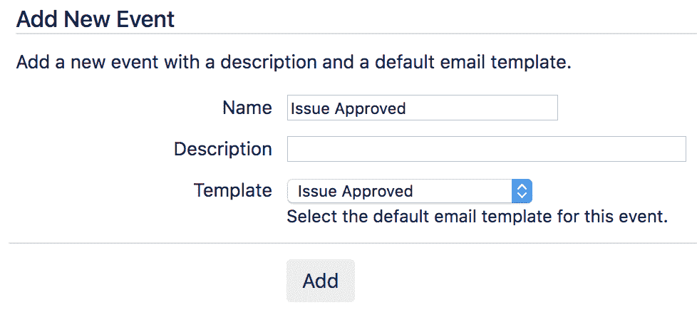

创建完事件后，它将出现在通知方案中，我们可以通过配置通知方案来选择接收电子邮件通知的人——如下图所示。每当问题被批准时，报告人和用户 Christine 都会收到通知：

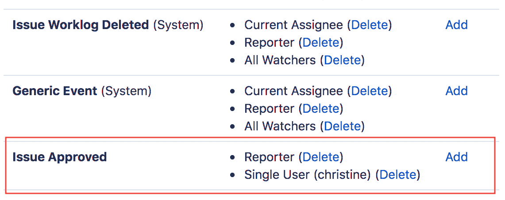

最后一步是确保当用户触发操作时，我们的自定义事件被触发：

1.  导航到 管理 > 问题 > 工作流。

1.  点击工作流的**编辑**链接，工作流中包含触发自定义事件的过渡。在这个例子中，我们将使用一个简单的审批工作流，其中包含一个名为**Approve**的过渡：

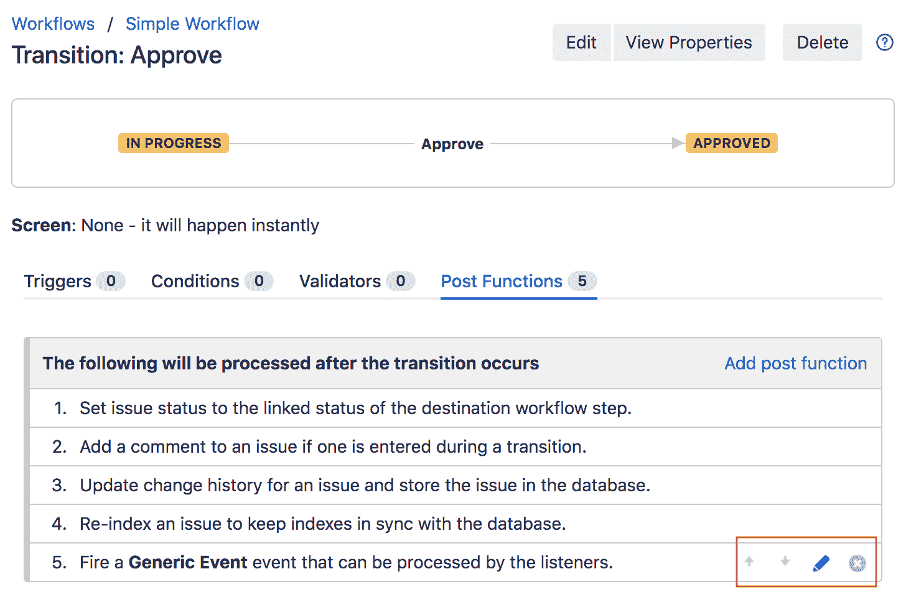

1.  点击工作流过渡，选择**后置功能**标签。通常，你会看到列表中最后一个后置功能触发**通用事件**。

1.  将鼠标悬停在后置功能上，点击编辑图标（看起来像铅笔）。

1.  选择新的`Issue Approved`事件并点击**更新**，如以下截图所示。这样会使过渡触发我们的自定义事件，而不是默认的通用事件：

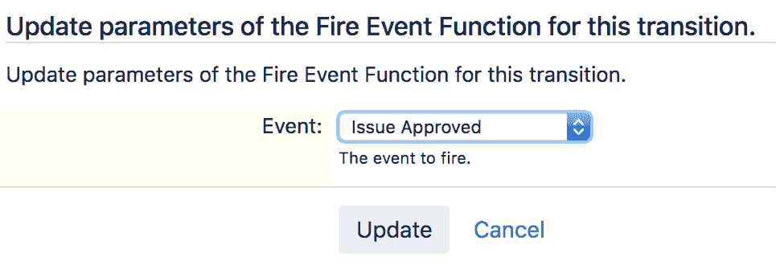

让我们看看这些步骤是如何工作的。

# 它是如何工作的...

Jira 的电子邮件模板使用 Apache Velocity（[`velocity.apache.org`](http://velocity.apache.org/)）模板语言来展示动态数据。每个模板都是静态文本（有或没有 HTML 标记）和一些 Velocity 代码的混合。如果你不需要动态内容，那么你的模板中就可以只有静态文本。

在我们之前的示例中，每次看到美元符号（`$`）时，比如在短语`$issue.key`中，它表示一段 Velocity 代码。`$`符号是从 Velocity 上下文中获取变量的指令，而变量名是紧跟在`$`符号后面的单词，因此在这种情况下，变量名是`issue`。句点字符（`.`）是获取指定值的指令。所以，`$issue.key`可以理解为*从变量 issue 中获取 key 的值*，或者换句话说，*给我 issue 的 key*。

Jira 在其 Velocity 上下文中暴露了多个变量供电子邮件模板使用；你可以在[`confluence.atlassian.com/display/JIRA041/Velocity+Context+for+Email+Templates`](https://confluence.atlassian.com/display/JIRA041/Velocity+Context+for+Email+Templates)找到完整的列表。

所以，如果我们看看我们的模板，对于主题模板，`($issue.key) $issue.summary`的 Velocity 代码将被转换为类似`IT-10 Request for Jira administrator access`的内容，其中`IT-10`替换了`$issue.key`，`Request for Jira administrator access`替换了`$issue.summary`。

你还可以在 Velocity 模板中使用条件逻辑。在我们的示例中，我们有一个`if/else`条件。我们检查是否有评论伴随批准的过渡，如果有，我们将显示该评论。如果没有评论，我们将简单地以斜体字体显示“无评论”。

以下截图展示了我们创建的自定义模板生成的示例电子邮件，显示在 Gmail 中：

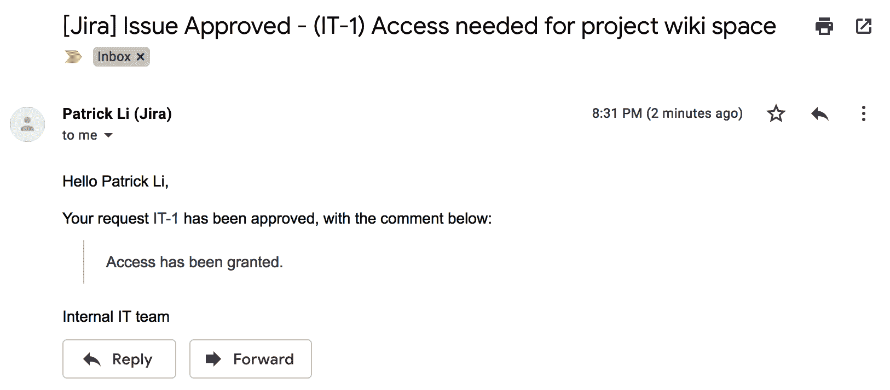

现在，进入自定义问题批准事件。与系统事件不同，自定义事件只能通过工作流过渡（或自定义脚本代码）触发，因此我们必须更新工作流。每个工作流过渡都会触发一个事件，默认情况下，触发的是通用事件。这意味着大多数工作流过渡将使用相同的通知接收者和*电子邮件*模板。

通过配置工作流来触发我们自己的自定义事件，我们可以更精细地控制谁接收通知以及使用哪些模板。

# 禁用外发通知

本教程展示了如何完全阻止 Jira 发送电子邮件。如果你正在进行测试、数据迁移或克隆一个新的开发实例，并且不想让用户收到数百条测试通知，你可能需要这样做。

# 操作步骤...

按照以下步骤禁用 Jira 中的外发通知：

1.  导航到**管理** > **系统** > **外发邮件**。

1.  点击**禁用外发邮件**按钮。

一旦禁用外发邮件，Jira 将不再发送通知。如果你想重新启用外发邮件，只需点击“启用外发邮件”按钮，Jira 将重新开始发送邮件。

# 创建邮件处理器以处理传入的电子邮件

Jira 不仅能够向用户发送*电子邮件*，还能够轮询和处理电子邮件。它还可以*创建*问题或向现有问题添加评论。当配置正确时，这可以是一个强大的方式，让用户与 Jira 进行交互。

在本教程中，我们将设置 Jira 轮询传入的电子邮件，以便它可以创建新问题并向现有问题添加评论。这在帮助台场景中非常有用，客户可以向公司支持电子邮件地址发送电子邮件，Jira 会自动从中创建问题。

# 准备就绪

由于 Jira 将从邮箱中轮询电子邮件，你需要获取其连接详情，包括以下内容：

+   它支持的协议（例如，**POP**或**IMAP**）

+   身份验证详情

# 操作步骤...

配置 Jira 处理来邮件的第一步是设置 Jira 用来轮询电子邮件的邮箱：

1.  导航到**管理** > **系统** > **传入邮件**。

1.  点击“添加 POP/IMAP 邮件服务器”按钮。

1.  输入新邮件服务器的名称。稍后我们在添加邮件处理器时将使用这个名称。

1.  提供凭证并点击“测试连接”按钮，确保 Jira 能够连接到邮件服务器。如果测试成功，点击“添加”按钮。设置好邮箱后，我们可以在 Jira 中设置所谓的邮件处理器来轮询和处理电子邮件。在本教程中，我们将使用最常见的处理器根据电子邮件内容创建和/或评论问题。

1.  点击“添加传入邮件处理器”按钮。

1.  输入邮件处理器的名称。

1.  从“服务器”下拉列表中选择刚刚添加的邮件服务器。

你可以使用本地文件选项来测试你的配置。这允许你将测试邮件放在文件系统中，这样你就不必每次都发送测试邮件。

1.  设置延迟计时器，以确定处理器多久轮询一次新邮件。通常，你不应将时间设置得太短：`5`分钟通常是一个合适的延迟时间。

1.  选择 `创建一个新问题或向现有问题添加评论` 处理器。

1.  点击 Next 按钮以配置邮件处理器，如下图所示：

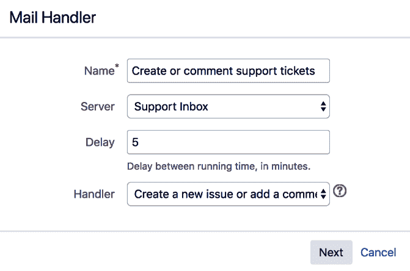

1.  输入邮件处理器的配置细节。最重要的配置如下：

    +   **项目**：你只能选择一个项目。所有来自收件箱的邮件将进入所选项目。

    +   **问题类型**：这是将用来创建新问题的类型。

    +   **创建用户**：如果你希望根据电子邮件地址自动创建新账户，请勾选此项。请注意，这将计入你的许可证席位。

    +   **默认报告人**：如果你不想创建新账户，可以选择一个现有的 用户 作为所有通过邮件创建的新问题的报告人。

1.  点击添加按钮以创建邮件处理器。

下表解释了你需要设置的各种参数：

| **参数** | **描述** |
| --- | --- |
| 项目 | 这是新问题将被创建的项目。请注意，这仅用于创建新问题。当添加评论时，忽略此项，因为评论将添加到主题中指定的问题键。 |
| 问题类型 | 这是所有新创建问题的默认问题类型。 |
| 去除引号 | 如果选中此选项，括在引号中的文本将不会作为问题描述或评论使用。 |
| 捕获邮件地址 | 如果选择此选项，带有指定地址的邮件将会被处理。 |
| 批量处理 | 该选项决定如何处理自动生成的邮件，如来自 Jira 的邮件。此选项旨在防止创建循环，其中 Jira 向其正在轮询的相同收件箱发送邮件。 |
| 转发邮件 | 该选项设置一个地址，Jira 会将其无法处理的所有邮件转发到该地址。 |
| 创建用户 | 如果无法找到发件人的邮件地址，选中此选项将创建一个新用户。 |
| 默认报告人 | 该选项设置在无法找到发件人邮件地址时使用的报告人。 |
| 通知用户 | 如果你不希望 Jira 发送与账户相关的邮件，请取消选中此选项。 |
| 抄送负责人 | 如果希望抄送列表中的第一个用户成为问题的负责人，且能找到匹配的账户，请勾选此选项。 |
| 抄送观察者 | 如果你希望将抄送列表中的用户作为观察者添加到问题中，且可以找到匹配的账户，请勾选此选项。 |

以下截图显示了这些参数：

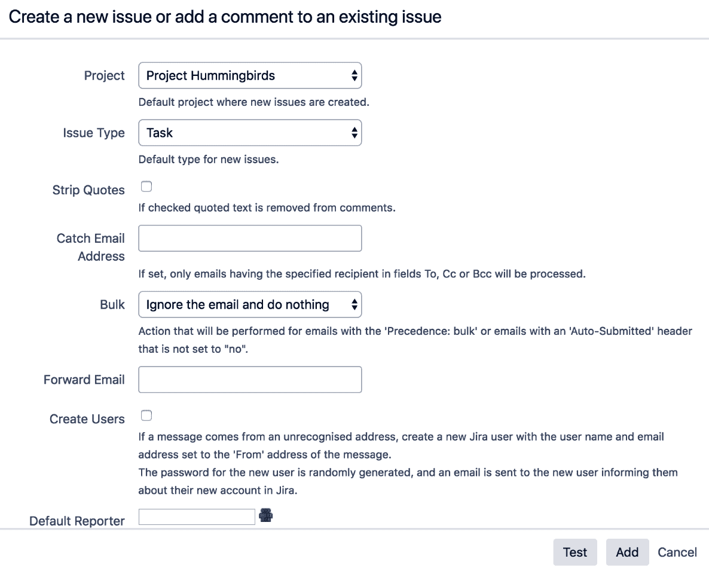

是时候查看工作信息了。

# 它是如何工作的...

邮件处理器会定期从所选的传入邮件服务器轮询新邮件，并根据所使用的处理器进行处理。创建新问题或向现有问题添加评论的处理器会在 Jira 中创建一个新问题，其中电子邮件的主题将成为问题摘要，电子邮件的正文将成为问题描述。如果电子邮件主题包含现有问题的关键字，则电子邮件正文将作为评论添加到该问题中。

+   **从未引用的电子邮件正文中添加评论**：这会将没有用 `>` 或 `|` 符号引用的电子邮件正文作为评论添加到现有问题中。

+   **将整个电子邮件正文添加为评论**：这会将整个电子邮件正文作为评论添加到现有问题中。

+   **从每封电子邮件创建一个新问题**：这会始终从电子邮件创建一个新问题。

+   **在电子邮件正文中的指定标记或分隔符前添加注释**：这将在指定为正则表达式的标记行之前添加电子邮件正文内容。标记之后的内容将被忽略。当你不想包含转发邮件中的旧内容时，这个功能非常有用。根据所使用的电子邮件客户端，你需要使用正则表达式（regex）来处理需要排除的文本。对于大多数情况，以下正则表达式会有效：

```
/From: *|___.*|On .*wrote:|----Orig.*|On
.*(JIRA).*/
```

# 使用电子邮件更新 Jira 问题

Jira 开箱即用的邮件处理器主要侧重于根据特定的匹配标准从电子邮件创建新问题或向现有问题添加评论。在本教程中，我们将看看如何通过电子邮件更新现有问题。

# 准备工作

对于这个教程，我们需要安装 **Jira 的企业邮件处理器（JEMH）** 应用。你可以从 [`marketplace.atlassian.com/plugins/com.javahollic.jira.jemh-ui`](https://marketplace.atlassian.com/plugins/com.javahollic.jira.jemh-ui) 下载该应用。

# 如何操作...

一旦安装了应用程序，第一步是创建一个配置文件。你可以将配置文件看作是 Jira 中的配置方案，例如工作流方案。该配置文件包含了处理传入电子邮件所需的所有配置设置。要创建一个新的配置文件，请按照以下步骤操作：

1.  导航到 管理 > 管理应用 > 配置 JEMH。

1.  在左侧导航面板中选择 配置文件 选项。

1.  点击创建配置文件按钮。

1.  输入配置文件的名称，在 **准备状态** 字段中选择 `DEVELOPMENT`，然后点击 创建配置文件：

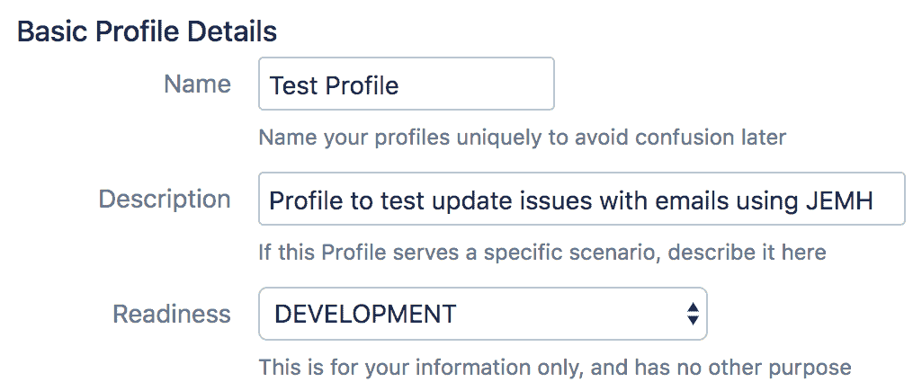

创建好配置文件后，我们需要对其进行配置，使得 JEMH 应用能够知道如何处理传入的电子邮件。第一步是通过以下步骤创建一个传入邮件处理器：

1.  导航到 管理 > 系统 > 传入邮件。

1.  点击添加传入邮件处理器按钮。

1.  输入新邮件处理器的名称。

1.  选择 **Jira 的企业邮件处理器（JEMH）** 作为 **处理器** 选项，然后点击 **下一步**。

1.  选择我们刚刚创建的 JEMH 配置文件并点击提交：

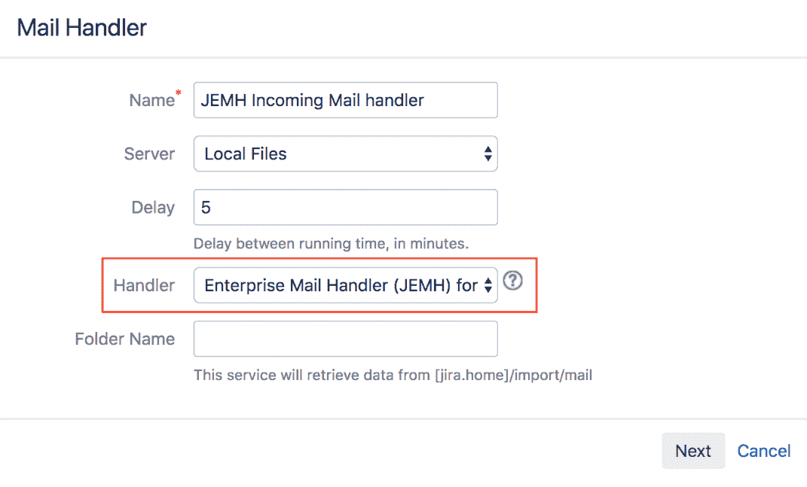

现在我们已经有了一个与 JEMH 配置文件关联的接收邮件处理程序，下一步是配置它来处理我们的电子邮件内容：

1.  点击**配置**链接，进入我们的 JEMH 配置文件。

1.  选择**字段处理器**选项。

1.  启用**冒号后缀（Mailform）**选项。

1.  点击**保存**按钮。

你可以选择任何格式或格式组合作为字段处理器，通常建议启用多个处理器，这样 Jira 可以理解并处理多种格式。这里的重要一点是，无论你选择哪个选项，都需要与最终用户进行沟通，以便他们理解如何编写电子邮件，使其能够被 Jira 成功处理。

查看以下截图：

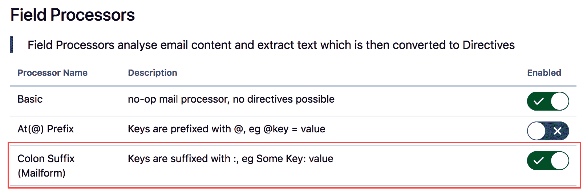

这是设置接收邮件处理程序所需的最小配置，这样你就可以通过电子邮件更新问题了。所有配置完成后，测试的最简单方法是使用应用提供的测试用例功能，这样就不需要将真实的邮件发送给所有相关用户。我们可以通过以下步骤来设置：

1.  从左侧导航面板中选择测试用例选项。

1.  点击创建按钮。

1.  在内容文本框中将主题替换为现有问题的关键字。

1.  在**内容**文本框下添加以下内容：

```
summary: This is a new updated summary       
description: This issue is updated via an email.
```

1.  点击更新并运行按钮。

现在你应该能够看到运行测试用例的结果：

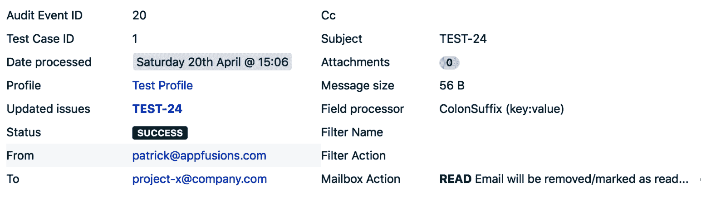

如前一张截图所示，测试用例中引用的问题将会其摘要和描述值更改为之前的内容。

# 它是如何工作的...

JEMH 配置文件包含了应用处理电子邮件所需的所有配置。通过创建一个接收邮件处理程序并选择 Jira 的企业邮件处理程序（JEMH）作为处理程序，Jira 就可以将处理任务交给 JEMH 应用。

我们方案中的一个关键配置是字段处理器。字段处理器决定了电子邮件内容应该如何处理，这直接决定了我们希望电子邮件正确处理时的格式。JEMH 提供了多个处理器，我们选择使用带有 `key:value` 格式的冒号后缀处理器。因此，在我们的测试用例电子邮件中，我们将要更新的字段名称作为关键字，将要分配给该字段的新值作为值——例如，`summary: 这是一个新的总结`。

# 设置项目特定的发件人电子邮件地址

默认情况下，从 Jira 发送的所有通知将使用相同的发件人地址，该地址作为外发邮件服务器的一部分进行配置；然而，你也可以在项目级别覆盖此设置，从而使每个项目拥有自己的发件人地址。如果你希望用户能够直接回复通知并将回复作为评论添加，这将非常有用。

# 如何操作...

按照以下步骤设置项目专用的发件人地址：

1.  浏览到你希望设置特定发件人地址的项目。

1.  点击 项目设置 选项。

1.  点击电子邮件通知部分中的铅笔（编辑）图标，如下图所示：

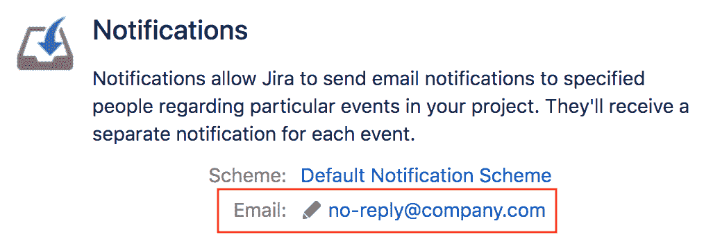

1.  输入专门用于该项目的电子邮件地址。

1.  点击 更新 以应用更改。

你可以通过留空该字段来恢复默认值。
