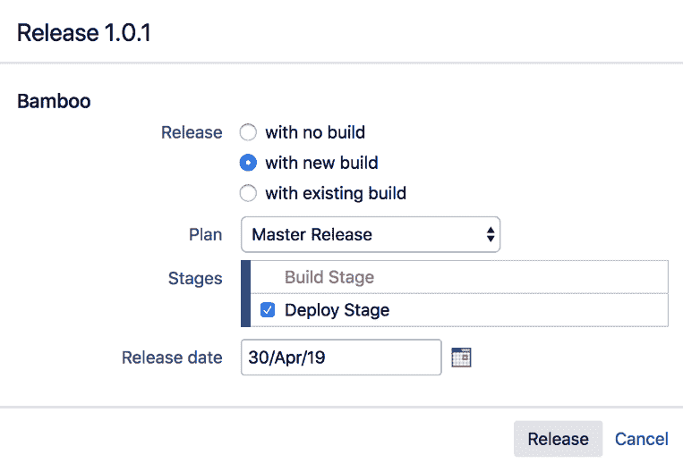
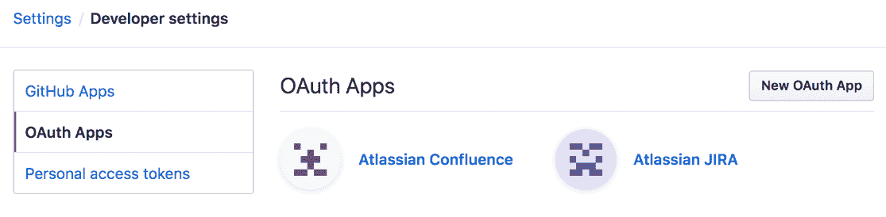
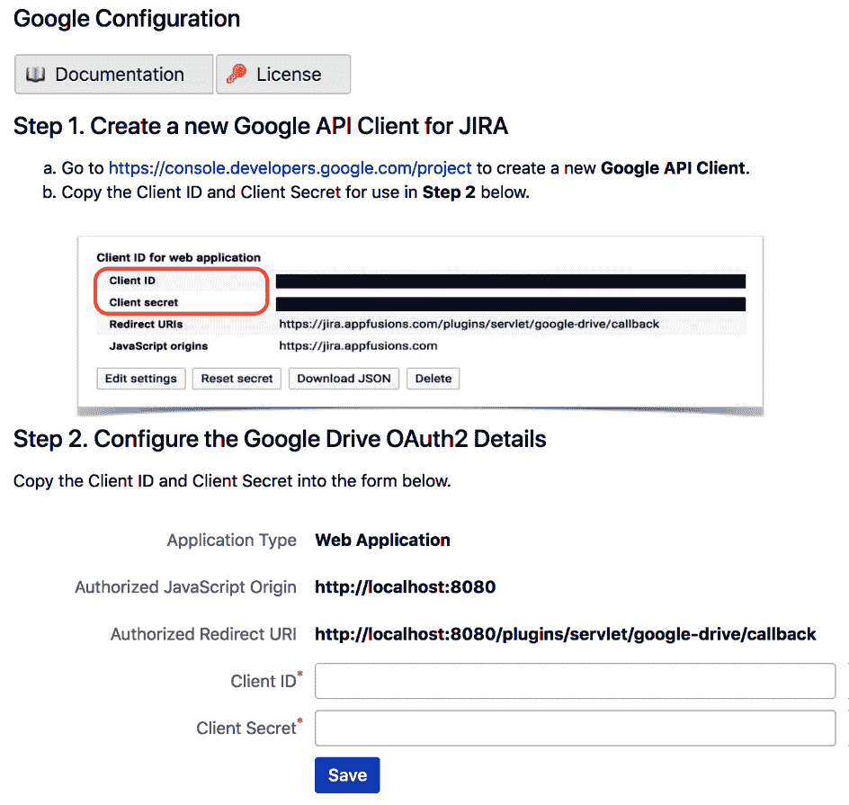

# 第七章：与 Jira 的集成

组织越来越多地采用本地部署和基于云的应用程序，以支持其各种业务功能。随着今天的世界变得越来越互联，这些应用程序需要类似地相互关联。业务功能经常需要共同协作，以更有效地实现期望的结果。因此，将 Jira 与其他应用程序集成的能力变得越来越重要。

您可以以多种方式将应用程序集成到 Jira 中，既可以从其他系统获取数据，也可以允许其他系统访问 Jira 的数据。Jira 提供支持与其他 Atlassian 应用程序以及许多其他流行的云应用程序（如 GitHub）集成。除了开箱即用的集成外，还有许多第三方应用程序可以提供与 Google Drive、Slack 等应用程序和平台的集成。最后，还有一种相对较新的方法叫做 **webhook**，允许任何其他应用程序在发生特定事件时注册 Jira 进行回调。

在本章中，我们将涵盖以下步骤：

+   集成 Jira 与 Confluence

+   将 Jira 与其他 Jira 实例集成

+   集成 Jira 与 Bamboo 用于构建管理

+   集成 Jira 与 Bitbucket Server

+   集成 Jira 与 Bitbucket Cloud 和 GitHub

+   集成 Jira 与 Slack

+   集成 Jira 与 Google Drive

+   使用 Jira webhook

+   使用 Jira REST API

# 集成 Jira 与 Confluence

您经常会使用 Jira 跟踪工程项目的进展，使用另一个应用程序来管理这些项目的文档。在本步骤中，我们将探讨如何将 Jira 与 Confluence 集成，Confluence 是 Atlassian 的另一个流行应用程序，通常用于文档编制。

# 准备工作

由于我们将在本步骤中使用 Confluence，您需要在系统上运行 Confluence 的实例。如果没有，您可以从[`www.atlassian.com/software/confluence`](https://www.atlassian.com/software/confluence)下载免费的 Confluence 试用版。

# 如何操作...

第一步是建立 Jira 和 Confluence 之间的链接：

1.  在 Jira 中导航到 管理 > 应用程序 > 应用链接。

1.  将您的 Confluence URL 输入到 应用程序 文本框中，然后点击 **创建新链接** 按钮。Jira 应自动检测到目标应用程序为 Confluence。如果因某些原因未能检测到，请确保在提示时选择 应用程序 类型为 Confluence，如下图所示：

我们还需要在 Confluence 中启用远程访问 API（默认情况下未启用）：

1.  作为 Confluence 管理员登录 Confluence。

1.  导航到 管理 > 进一步配置。

1.  点击 编辑，向下滚动，并勾选 远程 API（XML-RPC & SOAP） 选项。

1.  点击 保存 以应用更改：

远程访问 API 现在已启用。

# 如何工作...

一旦我们将 Jira 与 Confluence 链接，就会出现一个名为 Confluence 页面 的新选项，在你选择 更多问题 菜单中的 链接 选项时会显示，如下图所示：

如果你知道 Confluence 页面的确切 URL，可以将其输入到 页面 URL 字段中，或者点击 搜索页面 链接并搜索你想要链接的页面：

一旦你找到你想要的页面，点击它，然后点击 链接 按钮。你会看到一个类似于下图的页面：

如你所见，链接的页面会显示在 Wiki 页面 类别下的 问题链接 部分。

# 将 Jira 与其他 Jira 实例集成

如果你的组织中有多个 Jira 实例，有时将它们互联是非常有用的，特别是当不同项目的团队需要协作和共同工作时。在本教程中，我们将集成两个 Jira 实例，以便跨系统链接问题。

# 如何操作...

按照以下步骤将两个 Jira 实例连接在一起：

1.  导航至 管理 > 应用 > 应用链接。

1.  输入另一个 Jira 实例的 URL，并创建应用链接。Jira 应该会自动检测到目标应用是 Jira，如下图所示：

如果由于某种原因 Jira 没有自动检测到此项，确保在提示时选择 Jira 作为应用类型。

# 如何工作...

一旦你通过应用链接将两个 Jira 实例互联，你将能够搜索并将远程 Jira 实例中的问题链接到本地 Jira 实例中的问题。请看下面的截图：

如你所见，当你使用链接功能时，Jira 会提示你选择你想要搜索问题并进行链接的 Jira 实例。

# 将 Jira 与 Bamboo 集成进行构建管理

Bamboo 是 Atlassian 的持续集成和构建服务器。如果你的开发团队使用 Jira，那么使用 Bamboo 并将两者集成在一起是非常有意义的。

# 准备工作

由于我们将在本教程中使用 Bamboo，你需要确保 Bamboo 实例正在运行。如果你没有 Bamboo 实例，可以从 [`www.atlassian.com/software/bamboo`](https://www.atlassian.com/software/bamboo) 下载免费的 Bamboo 试用版。

# 如何操作...

由于我们在这里连接的是另一个 Atlassian 应用，我们应该利用应用链接：

1.  导航至 管理 > 应用 > 应用链接。

1.  输入你的 Bamboo URL 并创建应用链接。Jira 应该会自动将目标应用识别为 Bamboo，如下图所示：

如果由于某种原因，Jira 未能检测到此项，请确保在提示时选择 Bamboo 作为应用类型。

# 它是如何工作的……

一旦你将 Jira 与 Bamboo 集成，你将能够直接从 Jira 运行和发布构建计划。你只需要选择要发布的版本并选择新的**构建与发布**选项，如下图所示：

从以下截图中的发布对话框中，你可以选择使用哪个构建计划，并通过点击**发布**按钮运行构建。如果构建成功，Jira 将在构建完成后自动将版本标记为已发布：

通过集成，另一个功能是你可以在开发问题面板中看到与给定 Jira 问题相关的构建列表：

如你所见，所有的构建现在都已列出。

# 还有更多……

除了 Bamboo，Jira 还通过第三方应用支持其他构建服务器系统，如 Jenkins 和 Hudson。你可以从[`marketplace.atlassian.com/plugins/com.marvelution.jira.plugins.jenkins`](https://marketplace.atlassian.com/plugins/com.marvelution.jira.plugins.jenkins)获取 Jenkins 和 Hudson 的应用。

安装应用后，创建新应用链接时将会有两个新的应用类型可以选择——Jenkins 和 Hudson。

# 将 Jira 与 Bitbucket Server 集成

Bitbucket 是一个本地部署的企业级 Git 源代码管理工具。它是 Atlassian 的另一个应用，提供所有出色的**分布式版本控制系统**（**DVCS**）功能和优势。如果你正在使用 Jira 进行软件开发项目，那么你应该考虑使用 Bitbucket 作为版本控制工具。

在这个教程中，我们将 Jira 与 Bitbucket Server 进行集成，这样开发人员就可以查看给定问题所做的更改。

# 准备工作

由于我们将在此教程中使用 Bitbucket Server，因此你需要在系统上运行 Bitbucket Server 实例。如果你没有，可以从[`www.atlassian.com/software/bitbucket`](https://www.atlassian.com/software/bitbucket)下载免费的 Bitbucket Server 试用版。

# 如何操作……

按照以下步骤将 Jira 与 Bitbucket Server 集成：

1.  导航到管理 > 应用程序 > 应用链接。

1.  输入你的 Bitbucket Server URL 并创建应用链接。Jira 应该会自动将目标应用识别为 Bitbucket，如下图所示：

如果由于某些原因，Jira 未能检测到它，请确保在提示时选择 Bitbucket Server 作为应用程序类型。

# 它是如何工作的...

Jira 与 Bitbucket Server 的集成通过查看您的*提交日志*来工作，查找以任何问题密钥开头或包含问题密钥的评论。请参见下图：

如果提交评论包含问题密钥，提交将显示在问题的开发面板中。

# 还有更多内容...

如果您使用的是 Bitbucket Cloud 而不是本地运行的 Bitbucket，请参考下一个教程，了解如何进行集成。

# 将 Jira 与 Bitbucket Cloud 和 GitHub 集成

Bitbucket Cloud 是 Atlassian 的基于云的代码仓库服务。它提供公共和私人代码仓库，支持 Git 和 Mercurial。它是希望迁移到 DVCS 的组织的一个极佳选择，但不想处理基础设施开销。

在这个教程中，我们将学习如何将我们本地托管的 Jira 与云端的 Bitbucket 进行集成。

# 准备工作

由于本教程中我们将使用 Bitbucket Cloud，因此您需要拥有一个 Bitbucket 帐户（Git 和 Mercurial 仓库都可以使用）。如果没有帐户，您可以在[`bitbucket.org`](https://bitbucket.org/)注册一个免费帐户。

# 如何操作...

第一步是为 Jira 在 Bitbucket Cloud 中创建一个新的消费者，这将生成消费者密钥和密钥：

1.  登录到您的 Bitbucket 帐户。

1.  导航到 Bitbucket 设置 > OAuth。

1.  点击“添加消费者”按钮，位于 OAuth 消费者下方。

1.  输入新的 OAuth 消费者名称。您在这里输入的名称将在 Jira 请求访问授权时显示，因此您应该使用一个易于理解的名称，例如`Atlassian Jira`。

1.  点击“保存”。这将生成我们在下一步中需要的消费者详细信息：

一旦我们创建了新的消费者，下一步是将消费者密钥和密钥详细信息输入 Jira，如下所示：

1.  导航到管理 > 应用程序 > DVCS 帐户。

1.  点击“链接 Bitbucket Cloud 或 GitHub 帐户”按钮。

1.  选择 Bitbucket Cloud 作为主机选项。

1.  输入 Bitbucket 帐户名称、OAuth 密钥和从刚创建的消费者中生成的 OAuth 密钥：

1.  点击“添加”以将 Jira 与 Bitbucket Cloud 链接。

一旦 Jira 与 Bitbucket Cloud 建立连接，您将被提示授予 Jira 访问您的 Bitbucket Cloud 帐户的权限。确保消费者名称（加粗）与我们创建的消费者相同，然后点击“授予访问权限”：

让我们理解这些步骤是如何工作的。

# 它是如何工作的...

Jira 使用 OAuth 作为授权机制从 Bitbucket 获取数据。使用 OAuth 时，获取数据的应用程序称为 **消费者**，而提供数据的应用程序称为 **提供者**。

每个消费者都需要在提供者处注册，以生成一对密钥或机密。在第一步中，我们通过在 Bitbucket 中添加新消费者完成了注册：

如果你没有看到 开发问题面板，请确保你拥有查看开发工具项目权限。

默认情况下，开发者项目角色的成员拥有查看开发工具的权限。

# 还有更多...

正如你在设置过程中可能已经看到的，Jira 也支持 GitHub，包括标准的云版本和企业版本地版本。要与 GitHub 集成，你需要按照相同的步骤操作；但是，在设置 DVCS 账户时，你需要选择 GitHub 而不是 Bitbucket。

使用 GitHub 时，你还需要消费者密钥和机密，这些是注册新应用时在 GitHub 中生成的。你可以按照以下步骤注册应用：

1.  登录到你的 GitHub 账户。

1.  转到 账户设置 > **开发者设置**。

1.  选择 OAuth 应用选项卡：

1.  点击 新建 OAuth 应用并输入名称。

1.  输入 Jira 的 URL，作为 主页 URL 和 授权回调 URL。

1.  点击 注册应用程序。

注册应用后，将为 Jira 生成新的客户端密钥和机密对。然后你只需转到 Jira 的 DVCS 账户部分，在将新 DVCS 账户链接到 Jira 时选择 GitHub 作为主机。

# 集成 Jira 与 Slack

Slack 是全球最受欢迎的基于云的协作工具。它提供持久化聊天室、文件共享、直接消息等功能，支持 Web、桌面和移动设备。Atlassian 与 Slack 形成了战略合作伙伴关系，致力于更好地集成两家公司产品和服务。

在本教程中，我们将把 Jira 与 Slack 集成，这样每次在 Jira 中创建或更新问题时，通知将发送到相应的 Slack 渠道。

# 准备就绪

由于我们将在此操作中使用 Slack，你需要拥有一个 Slack 账户。如果没有账户，你可以在 [`slack.com`](https://slack.com) 注册一个免费账户。

集成需要使用 **Jira Server for Slack (官方)** 应用，这是 Atlassian 官方的应用。你可以从 [`marketplace.atlassian.com/apps/1220099/jira-server-for-slack-official`](https://marketplace.atlassian.com/apps/1220099/jira-server-for-slack-official) 获取该应用。

# 如何操作...

按照以下步骤将 Jira 与 Slack 集成：

1.  转到 **管理** > **应用** > **Slack**。

1.  点击 Connect Slack teambutton。

1.  选择推荐的**基本**选项，并点击“前往 Slack”按钮，这将把你带到 Slack：

1.  登录 Slack（如果尚未登录）并安装 Jira Server Slack 应用。

1.  当出现提示时授权访问：

1.  返回 Jira，检查凭证文本框是否自动填充了你 Slack 的详细信息。

1.  点击保存按钮，集成将会在 Jira 和 Slack 之间建立。

一旦你完成了集成设置，你可以将 Jira 项目与 Slack 频道连接，如下图所示，在该图中，我们已启用通知，并将所有关于 `Project Hummingbirds` 项目中问题的活动发送到 `#hummingbird` 频道：

在你将 Jira 项目与 Slack 频道链接之后，问题的更改将出现在 Slack 中。该集成还包括你可以在 Slack 中运行的一些命令；只需在 Slack 中输入 `/jira`，它会提示你一系列选项：

除了来自 Atlassian 的官方 Slack 集成应用外，Atlassian 市场上还有其他具有不同功能的第三方应用，你可以尝试。这是 Jira 的一个优势：如果默认选项不适合你的需求，总是可以找到其他选项，如果都不合适，你还可以选择自己创建。

# 集成 Jira 与 Google Drive

如今，组织普遍使用某种文档管理系统——无论是本地的还是云端的——例如 Google Drive、Box 和 Dropbox。

在本配方中，我们将 Jira 与 Google Drive 集成，以便用户能够从 Jira 中搜索、链接、预览和下载存储在 Google Drive 中的文件。

# 准备工作

对于此配方，我们需要在 Atlassian Jira 应用中安装 Google Drive。你可以从 [`www.appfusions.com/display/GDOCSJ/Home`](http://www.appfusions.com/display/GDOCSJ/Home)下载并使用 UPM 安装它。

# 如何操作…

按照以下步骤设置 Jira 和 Google Drive 之间的集成：

1.  前往 [`console.developers.google.com/project`](https://console.developers.google.com/project)，并按照 [`developers.google.com/identity/protocols/OAuth2`](https://developers.google.com/identity/protocols/OAuth2) 中的说明创建一个新的 OAuth 客户端。

1.  从生成的 OAuth 客户端中复制 Google OAuth 客户端 ID 和密钥。

1.  导航到 管理 > 管理应用 > Google 配置。

1.  将 Google OAuth 客户端 ID 和密钥分别输入到客户端 ID 和客户端密钥字段中。

1.  点击保存按钮以完成设置。

下表显示了 Google 配置页面上的字段：

| **字段** | **描述** |
| --- | --- |
| 客户端 ID | Google OAuth2 客户端 ID |
| 客户端密钥 | Google OAuth2 客户端密钥 |

以下是 Google 配置页面的截图：

让我们看看这些步骤是如何工作的。

# 如何操作...

Google Drive 与 Jira 的集成使用 OAuth，其中每个用户需要首先授权 Jira 代表他们访问 Google Drive。这个过程被称为 **OAuth 跳舞**。

一旦应用程序安装并配置完成，在查看问题时，可以在 **更多** 菜单下看到一个新的 **链接 Google 文档** 字段。点击该选项将弹出一个对话框，您可以浏览或搜索存储在 Google Drive 中的文件。然后，您可以通过勾选相应的复选框来选择要链接的文件：

在选择并链接了所需的文件后，所选文件将列在 **问题链接** 部分：

根据文件类型，如果您从 Google Drive 获得了必要的权限，您将能够查看、编辑和下载本地的 Google Drive 文件。

# 还有更多...

有许多其他支持流行云供应商的第三方集成应用程序可用，包括以下：

+   **Salesforce**：URL 如下：[`marketplace.atlassian.com/plugins/com.atlassian.jira.plugin.customfield.crm`](https://marketplace.atlassian.com/plugins/com.atlassian.jira.plugin.customfield.crm)。

+   **Box**：URL 如下：[`www.appfusions.com/display/BOXJIRA/Home`](http://www.appfusions.com/display/BOXJIRA/Home)。

# 使用 Jira webhook

在之前的配方中，我们探讨了如何将 Jira 与特定应用程序和平台集成。在这个配方中，我们将探讨 webhook，它是另一种实现与 Jira 集成的方式。

# 如何操作...

按照以下步骤设置 webhook：

1.  导航到 **管理** > **系统** > **Webhooks**。

1.  点击 **创建 webhook** 按钮。

1.  输入新 webhook 的名称。此名称应清晰地解释 webhook 的用途和/或目标系统，例如 `WebHook for Slack #support channel`。

1.  输入目标系统的 URL，以便 webhook 调用。URL 应由目标系统提供。

1.  如果向 `POST` 添加数据会导致错误，请勾选 **排除详细信息** 复选框。

1.  输入 JQL 来定义将触发 webhook 的问题，或为空以适用于所有问题。建议使用 JQL 限制范围。

1.  选择将触发 webhook 的问题事件。

1.  点击 **创建** 注册 webhook：

这完成了本配方的步骤。

# 如何操作...

Webhook 使用基于事件的机制，其中源系统（在此案例中为 Jira）将在注册的事件发生时，通过 HTTP `POST` 调用所有注册的 webhook。这与 Jira 内部的通知系统非常相似，后者会根据事件发送电子邮件。

使用基于事件的方法，不需要远程应用程序不断轮询 Jira 检查变更，这既低效，又无法满足实时处理变更的需求。远程应用程序可以在 Jira 中注册 Webhook，当事件发生时，Jira 会调用该应用程序。

# 还有更多...

你还可以通过工作流中的`POST`功能触发 Webhook，使用`Trigger a Webhook` `POST`功能。你只需选择将作为触发器的过渡，添加`POST`功能，并选择要触发的 Webhook：

这特别有用，因为 Webhook 配置面板仅列出了某些基本事件类型，而没有列出在工作流中使用的任何自定义事件类型。

# 使用 Jira REST API

Jira 通过一组 REST API 暴露了许多功能，使其他应用程序能够与其交互。通过这些 API，你可以执行诸如搜索、创建和删除问题等操作。事实上，本书中使用的多个应用程序都利用这些 REST API 来执行其功能。

作为一种基于 Web 的标准，Jira 的 REST API 允许你使用任何技术与之配合。这意味着你可以用 Java、.NET、JavaScript，甚至简单的 bash 脚本来编写代码。

在本食谱中，我们将使用 RESTClient Firefox 插件对 Jira 执行搜索查询，获取当前登录用户分配的问题列表。你还可以使用许多其他工具，例如 cURL 和 Chrome 的 Postman。

# 如何操作...

按照以下步骤使用 Jira 的 REST API 运行搜索查询：

1.  在 Firefox 浏览器中打开 RESTClient。

1.  将**方法**设置为 GET。

1.  在 URL 文本框中输入`http://localhost:8080/rest/api/2/search?jql=assignee=currentUser()`。确保将 URL 更改为你的 Jira 实例。

1.  选择基本身份验证，并输入你的用户名和密码。

1.  点击 SEND 按钮。

你应该在响应部分看到 API 调用的结果。选择 Preview 选项卡，以查看格式化后的 JSON 结果，如下图所示：

现在可以看到 API 调用的结果。

# 它是如何工作的...

Jira 的 REST API 始终遵循 URI 结构`http://host:port/context/rest/api-name/api-version/resource-name`。因此，在我们的示例中，我们正在使用版本 2 的搜索 API。`jql`参数包含我们正在运行的实际 JQL 查询。大多数 API 要求你先登录，所以我们配置设置以使用基本身份验证作为 API 调用的一部分。

# 还有更多...

有一个名为**Atlassian REST API Browser** （**RAB**）的应用程序，可以在 Jira 中安装，允许您直接在浏览器中与您的 Jira REST API 进行交互。您可以从[`marketplace.atlassian.com/plugins/com.atlassian.labs.rest-api-browser/server/overview`](https://marketplace.atlassian.com/plugins/com.atlassian.labs.rest-api-browser/server/overview)获取此应用。

安装完应用程序后，您可以打开浏览器并转到 `http://your_jira_instance/plugins/servlet/restbrowser`。您应该会看到一个类似于以下截图的 API 浏览器界面。在左侧，您将看到您的 Jira 实例中所有可用 REST API 的完整列表（基于其版本）：

当您单击任何 API 时，浏览器将为您显示所有可用的参数和选项，因此您不再需要手动查找它们。这使您能够快速测试和实验 API，而无需预先编写任何代码或使用任何额外的工具。
