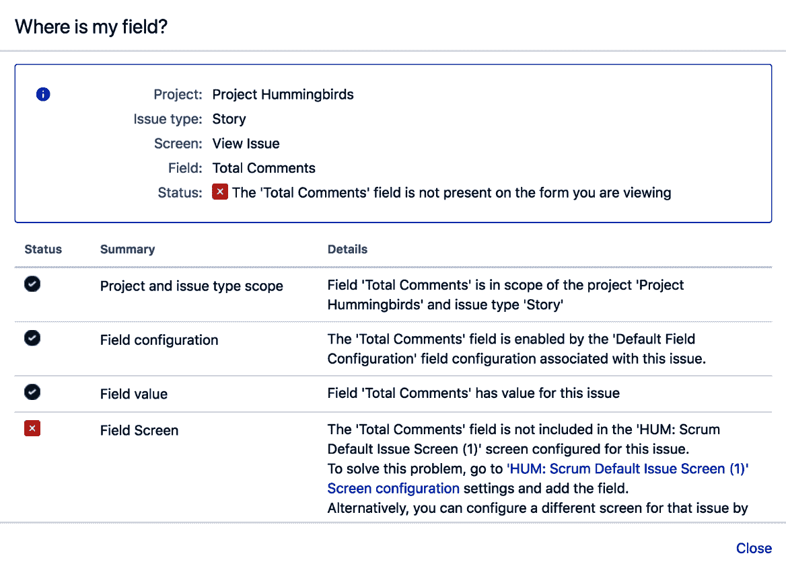

# 第八章：Jira 故障排除与管理

在前几章中，我们已经探讨了 Jira 的不同自定义选项。正如我们所看到的，Jira 是一个复杂的系统，特别是随着自定义项的增多。对于管理员来说，当用户遇到问题并需要支持时，这可能成为一个头疼的问题。

在本章中，我们将学习如何使用工具来排查 Jira 配置问题，这些工具能轻松找出问题的根源。我们还将介绍其他能帮助你作为管理员提高效率的工具，帮助诊断和修复问题，并为用户提供支持。

本章将涵盖以下内容：

+   故障排除通知

+   故障排除权限

+   故障排除字段配置

+   在安全模式下运行 Jira

+   从其他问题跟踪系统导入数据

+   在 Jira 中自动化任务

+   在 Jira 中运行脚本

+   在 Jira 中切换用户会话

+   使用命令行操作 Jira

+   在线查看 Jira 日志

+   管理共享筛选器和仪表板

# 故障排除通知

本节将介绍如何排查与通知相关的问题，例如确定用户是否收到某个问题的通知，以及确定用户未收到通知的原因。

# 如何操作...

按照以下步骤排查 Jira 中的通知问题：

1.  导航至 **管理** > **系统** > **通知助手**。

1.  选择未按预期接收到通知的用户。

1.  选择用户应接收通知的问题。

1.  选择应触发通知的通知事件。

1.  点击“提交”以开始故障排除。

你也可以在查看问题时，从管理员菜单运行 **通知助手** 工具。

# 工作原理...

通知助手工具通过查看所选问题的项目所使用的通知方案设置来工作，并验证所选用户是否符合其中一项通知。

让我们看看下面的截图：


用户 **Christine Johnson** 不应接收到有关 HUM-14 问题的通知，因为她既不是报告人，也不是指派人，也不是该问题的观察者。

# 还有更多内容...

当然，除了你的通知方案设置外，你还需要检查 Jira 是否能够成功发送外发邮件（参见 第六章中的 *设置外发邮件服务器* 章节，*电子邮件和通知*），并且确保通知邮件没有被过滤到用户的垃圾邮件文件夹。

# 故障排除权限

本节将介绍如何排查由于权限设置导致的问题，例如用户无法查看问题。

# 如何操作...

按照以下步骤排查 Jira 中的权限问题：

1.  导航至 **管理** > 系统 > 权限助手。

1.  选择受影响的用户。

1.  选择用户预期有权限的相关问题。

1.  选择用户应当访问的权限类型。

1.  点击**提交**以开始排查问题。

你还可以在查看问题时，从**权限助手**工具中通过管理菜单运行它。

# 它是如何工作的...

权限助手工具通过查看选定问题的权限方案和安全方案设置来工作。它验证所选用户是否具备执行必要操作所需的权限。

如下图所示，用户 Eric Lin 没有权限删除 HUM-10 问题，因为他在该项目中没有管理员角色：


这完成了我们的教程。

# 排查字段配置问题

在本教程中，我们将确定为什么在查看问题时某个字段没有显示，并且查看如何排查问题。

# 如何操作...

按照以下步骤排查字段未显示的原因：

1.  导航到缺失字段的相关问题。

1.  从管理菜单中选择“我的字段在哪里？”选项：


1.  选择缺失的字段开始排查问题。

# 它是如何工作的...

**字段助手**工具检查与字段相关的配置，包括以下内容：

+   **字段上下文**：这会检查该字段是否为自定义字段。然后，工具会检查该字段是否有与当前项目和问题类型组合匹配的上下文。

+   **字段配置**：这会验证该字段是否设置为“隐藏”。

+   **屏幕**：这会验证字段是否根据屏幕方案和问题类型屏幕方案放置在当前屏幕上。

+   **字段数据**：这会验证当前问题是否为字段提供了值，因为没有值的自定义字段通常不会显示。

让我们看一下以下截图：



“总评论”是一个自定义字段，未显示的原因是它没有被添加到屏幕上。

# 在安全模式下运行 Jira

当你在 Jira 中有不同的人安装应用时，有时会遇到问题，但你可能不确定哪个应用程序导致了某个特定问题。在这种情况下，你可以通过逐一禁用所有应用并重新启用它们的过程来进行排除。

# 准备工作

启用安全模式会影响到你的用户，因此在操作之前，请确保做好相应的计划。

# 如何操作...

按照以下步骤启用安全模式：

1.  导航到 管理 > **系统** > 管理应用程序。

1.  点击页面底部的“进入安全模式”链接。

1.  当系统提示时，点击**进入安全模式**以确认操作。

窗口看起来像下图所示：


这完成了我们教程的步骤。

# 它是如何工作的...

**通用插件管理器**（**UPM**）是 Jira 用来管理所有应用的工具。除了作为允许你上传和安装第三方应用的界面（除非另有指示），它还提供了其他一些有用的管理功能。

启用安全模式时，UPM 将禁用所有用户安装的应用，从而使 Jira 恢复到默认状态。你可以逐个启用每个应用，通过排除法找出有问题的应用。

# 还有更多...

UPM 还提供了审计功能，能够跟踪与应用相关的所有更改。你可以点击页面底部的“Audit log”链接，UPM 将显示过去 90 天内的所有更改列表。

# 从其他问题跟踪系统导入数据

如果你有其他问题跟踪系统，并且考虑迁移到 Jira，你通常可以通过其内置的导入工具轻松地将现有数据迁移到 Jira。

在这个食谱中，我们将介绍如何从 Bitbucket 的问题跟踪系统导入数据。Jira 支持从其他问题跟踪系统（如 **Bugzilla** 和 **GitHub**）以及 CSV 文件导入数据。正如我们所看到的，整个过程几乎相同，因此这个方法也适用于这些其他系统。

# 如何操作...

按照以下步骤将数据从其他问题跟踪系统（如 Bitbucket）导入到 Jira：

1.  导航至“Administration > System > External System Import”。

1.  选择源系统的 issue tracker。我们将在这个食谱中选择 Bitbucket。

1.  点击“Next”按钮，授权 Jira 导入工具访问 Bitbucket 数据，并在提示时点击“Authorize”：


1.  将 Bitbucket 项目映射到 Jira 项目。对于不想导入到 Jira 的项目，勾选“Don't import this project”选项。点击“Next”继续，如下图所示。

1.  点击“Next”后，Jira 将查询 Bitbucket，获取设置的导出数据，如字段和值，以便映射到 Jira 对应项。这一过程可能需要几分钟，具体取决于 Bitbucket 项目的大小：


1.  选择你希望手动映射到 Jira 字段值的 Bitbucket 字段。点击“Next”继续：


1.  将 Bitbucket 的字段值映射到 Jira 字段的对应值，如下图所示。点击“Next”继续：


1.  将 Bitbucket 的链接类型映射到 Jira 的问题链接类型。点击“Begin Import”开始将数据导入到 Jira，如下图所示：


1.  查看导入结果。如果导入失败，您可以点击下载详细日志链接，以获取完整的过程日志。您还可以点击保存配置链接，获取映射文件的副本，以便下次无需重新映射一切：


接下来，我们将看看这些步骤是如何工作的。

# 其工作原理...

Jira 为所有不同的任务跟踪器导入器提供了统一的向导界面。虽然每个导入器都有其独特之处，但它们都遵循相同的基本步骤，如下所述：

+   **配置目标数据源**：此步骤是从目标问题跟踪器中检索数据的过程。在 Bugzilla 的情况下，它可以是直接的数据库访问，在 Bitbucket 的情况下，则是通过互联网进行访问。

+   **选择要导入的项目**：在这里，我们需要选择要导入到现有项目还是新项目的任务。

+   **将目标系统的字段映射到 Jira 字段**：在这里，目标问题跟踪器将其字段映射到相应的 Jira 字段。自定义字段可以作为过程的一部分自动创建。

+   **将目标系统的字段值映射到 Jira 字段值**：根据之前的字段映射进行字段数据映射。通常在选择基于列表的字段时需要此步骤，如优先级、任务状态和自定义字段。

+   **映射问题链接类型**：这一步是可选的，取决于目标问题跟踪器是否支持链接。如果支持，必须将这些链接类型映射到 Jira 问题链接类型。

虽然 Jira 导入器能够处理大多数数据映射简单的情况，但对于数据映射要求较复杂的大型实例，如项目合并和条件映射，建议您聘请一位 Atlassian 专家（[`www.atlassian.com/resources/experts`](https://www.atlassian.com/resources/experts)）来处理迁移，而不是仅依赖导入器。

# 还有更多...

如果您的问题跟踪器没有可用的导入选项，您也可以尝试将数据导出为 CSV 格式，然后使用内置的 CSV 导入器导入数据。

# 在 Jira 中自动化任务

作为管理员，能够自动化任务通常是您工作中非常重要的一部分。您通常需要具备一些编程技能，以便利用 Jira 提供的自动化功能，如**监听器**和**服务**。幸运的是，现在有一些工具可以帮助您进行自动化，而无需您了解编程。

在这个操作步骤中，我们将设置一个自动化任务，让 Jira 定期检查 7 天内未更新的任务，关闭它们并添加评论。

# 准备工作

对于这个示例，我们需要安装**Automation for Jira**应用。您可以从[`marketplace.atlassian.com/apps/1215460/automation-for-jira`](https://marketplace.atlassian.com/apps/1215460/automation-for-jira)下载并使用 UPM 安装它。

# 如何操作...

按照以下步骤设置自动化任务：

1.  转到 Administration > System > Automation rules。

1.  点击“创建规则”按钮。

1.  选择新自动化规则的`Scheduled`触发器。

1.  输入自动化任务应运行的频率。我们希望任务每天运行一次，因此输入`1`。

1.  输入`project = "Support Desk" and updated <= 7d` JQL 查询，以便自动化任务知道它应该影响哪些问题：


1.  点击“保存”按钮以保存触发器配置。

1.  配置好触发器后，我们现在需要选择一个动作。由于我们想要关闭问题，因此我们将选择“新建动作”选项。

1.  选择“转换问题”操作类型。

1.  选择目标状态，以便在自动化任务运行时转换受影响的问题。我们想关闭问题，所以选择“完成”状态。如果您的工作流使用的是不同的状态，请选择该状态：


1.  如果您的工作流需要设置额外的字段，您也可以通过从“选择要设置的字段”下拉菜单中选择字段来在这里进行设置。

1.  点击“保存”按钮以保存我们的更改。

1.  为我们的新自动化任务输入名称，例如“关闭旧问题”，然后点击“开启”按钮。

您完成的自动化任务应该像下面这样：


现在是时候了解这些步骤是如何工作的了。

# 它是如何工作的...

在其最基本的形式下，一个自动化规则由两个组件组成：触发器和动作。触发器将决定自动化任务何时运行。共有三种内置的触发器类型：

+   **Issue triggers（问题触发器）**：这些触发器会在相应问题触发事件时运行，通常是在问题以某种方式更新时，例如在问题更新和工作流转换时。

+   **Scheduled**：此触发器类型将在预定的时间框架内自动运行。您可以像我们在本例中那样使用简单的形式来指定频率，或者您可以使用*cron*表达式来指定确切的小时、分钟和秒。

+   **Integrations（集成）**：此触发器类型会创建一个 Webhook URL。当外部系统向该 URL 发出 HTTP `POST`请求时，触发器将被触发。

**Action**（动作）是在触发器运行时会发生的事情。一个触发器可以运行多个动作。动作可以执行各种操作，包括更改问题数据、发送电子邮件通知和发送外部 HTTP `POST`请求。

您可以向自动化规则中添加更多高级组件，以实现条件分支和执行。例如，当触发器运行时，您可以为 Bug 类型的任务执行一个操作，为 Story 类型的任务执行另一个操作。您还可以将自动化规则串联起来，使一个规则基于 webhook 触发，然后您可以设置另一个规则，其中包含一个操作，该操作向该 webhook URL 发送 HTTP `POST`请求以触发它。

使用我们的自动化规则，我们设置了一个触发器，使其每天运行一次。然后，我们使用 JQL 查询选择了在过去 7 天内自任务执行以来未更新的所有 Support Desk 项目中的任务。接着，我们为触发器添加了一个操作，将所有从 JQL 查询返回的任务转换为 Done 状态。

# 在 Jira 中运行脚本

Jira 为具有编程技能的人提供了一个应用框架，可以创建应用以扩展其功能或执行那些否则不可能或繁琐的任务；然而，即便具备了这个功能，有时创建一个完整的应用来完成看似简单的任务也是一种过度的做法。好消息是，您可以编写或编程脚本，利用 API 提供的功能，而不必承担开发完整应用的负担。

在这个食谱中，我们将创建一个 Groovy 脚本，通过将搜索过滤器作为收藏项添加给 Jira 中的每个人来共享多个搜索过滤器——这个任务如果手动完成会花费大量时间。

# 准备工作

对于这个食谱，我们需要安装 ScriptRunner for Jira 应用。您可以从 [`marketplace.atlassian.com/plugins/com.onresolve.jira.groovy.groovyrunner`](https://marketplace.atlassian.com/plugins/com.onresolve.jira.groovy.groovyrunner) 下载并通过 UPM 进行安装。

# 如何操作……

按照以下步骤在 Jira 中运行自定义的 Groovy 脚本（请注意，您需要根据情况更新过滤器 ID）：

1.  进入 Administration > Manage apps > Script Console。

1.  将以下脚本复制到 Script 文本框中：

```
import com.atlassian.jira.component.ComponentAccessor
import com.atlassian.jira.favourites.FavouritesManager
import com.atlassian.jira.issue.search.SearchRequest
import com.atlassian.jira.issue.search.SearchRequestManager
import com.atlassian.jira.user.util.UserManager
import com.atlassian.jira.security.groups.GroupManager
import com.atlassian.jira.exception.PermissionException 

//Set the filter ID and group to share with here
Long[] searchRequestIds = [10302,10303,10304]
String shareWith = "jira-software-users"
FavouritesManager favouritesManager = ComponentAccessor.getComponent(FavouritesManager.class)
SearchRequestManager searchRequestManager = ComponentAccessor.getComponent(SearchRequestManager.class)
UserManager userManager = ComponentAccessor.getComponent(UserManager.class)
GroupManager groupManager = ComponentAccessor.getComponent(GroupManager.class) 

for(Long searchRequestId in searchRequestIds) {    
    SearchRequest searchRequest = searchRequestManager.getSharedEntity(searchRequestId) 

    for (String userName in groupManager.getUserNamesInGroup(shareWith)) {        
        try {
            favouritesManager.addFavourite(userManager.getUserByName(userName), searchRequest)            
        } catch (PermissionException e) {            
            // the user does not have permission to view this filter        
        }    
    }
}
```

1.  根据您的数据，切换过滤器 ID（`searchRequestIds`）和组名（`shareWith`）。您可以通过运行您的过滤器来获取过滤器 ID，ID 会显示在浏览器的地址栏中。

1.  点击 Run 来执行脚本。

以下截图显示了 Script Console 窗口：


您可以在控制台中看到正在显示的信息。

# 它是如何工作的……

ScriptRunner for Jira 应用允许您在 Jira 中运行 Groovy 脚本。由于 Jira 是用 Java 编写的，而 Groovy 也可以在 JVM 上运行，因此您将能够访问 Jira 向开发者公开的所有组件和 API。

在脚本中，我们通过 ID 列出多个搜索过滤器（这些过滤器需要共享，以便其他用户可以将其添加为收藏），循环遍历它们，并将每个 ID 作为收藏项添加到`jira-software-users`组中的用户，所有这些都通过 Jira 的公共 API 完成。

# 在 Jira 中切换用户会话

您经常会遇到仅发生在特定用户身上的问题。在这种情况下，您需要坐在该用户旁边以便查看和理解问题，或者重置该用户的密码并以该用户身份登录。

在这个教程中，我们将学习如何在不重置或获取用户密码的情况下，将您的当前会话切换到任何其他用户的会话。

# 准备工作

对于这个教程，我们需要安装 **SU**（即 **switch user**）for Jira 应用。您可以从 [`marketplace.atlassian.com/plugins/com.dolby.atlassian.jira.jirasu`](https://marketplace.atlassian.com/plugins/com.dolby.atlassian.jira.jirasu) 下载并通过 UPM 安装它。

# 如何操作...

要切换（SU）到其他用户，请按照以下步骤操作：

1.  导航至 **管理 > 用户管理 > 用户**

1.  点击您想切换到的用户的 SU 链接：


在您选择了用户后，当前用户会话将切换到该用户，并应用相同的配置和权限。完成后，您可以通过从顶部导航栏的 SU 菜单项中选择 SU 退出选项来切换回来。

# 工作原理...

SU for Jira 应用通过将当前用户会话切换到您选择的用户来工作，然后从 Jira 的角度来看，您实际上是以所选用户身份登录（无需提供该用户的密码）。

既然您了解了这一点，应该很明显，这种技术可能在错误的手中被滥用。您可以通过访问 UPM 并点击 SU for Jira 应用的配置按钮来限制对 SU 功能的访问。这将允许您限制对特定组的访问。

一个有用的功能是审计日志。每当有人使用 SU 功能时，系统会记录下来，因此管理员可以随时检查是否有人在滥用该功能。您可以通过导航至 **管理 > 系统 > SU 审计日志** 来访问 SU 审计日志。

# 从命令行使用 Jira

我们通常通过浏览器与 Jira 交互，但有时能够使用命令行也很有用，尤其是对于管理任务或编写 shell 脚本时。

在这个教程中，我们将使用命令行在 Jira 中创建新用户。

# 准备工作

对于这个教程，您需要在工作站上安装 **Atlassian** **命令行界面**（**CLI**）工具。您可以从 [`marketplace.atlassian.com/plugins/org.swift.atlassian.cli`](https://marketplace.atlassian.com/plugins/org.swift.atlassian.cli) 下载。

# 如何操作...

要使用 Atlassian CLI 工具，我们首先需要将其解压到工作站的一个便捷位置。接下来，更新 `jira.sh`（适用于 Unix）或 `jira.bat`（适用于 Windows）文件，以添加 Jira 的详细信息。

例如，如下命令所示，Jira 运行在 `http://localhost:8080` 上，管理员凭证为 `admin_user`，密码为 `admin_password`：

```
java -jar 'dirname $0'/lib/jira-cli-3.8.0.jar
-server http://localhost:8080 --user admin_user
--password admin_password "$@"
```

1.  现在，既然我们已做好一切准备，可以运行以下命令在 Jira 中创建新用户：

```
./jira.sh --action addUser --userId tester 
-userEmail tester@company.com --userFullName
Tester
```

1.  您应该得到以下响应：

```
User: tester added with password: 
89u66p3mik5q.  Full name is: Tester.  Email is:
tester@company.com.
```

# 它是如何工作的……

Atlassian CLI 工具通过其远程 SOAP 和 REST API 访问 Jira 的功能和特性。

我们更新了 Jira 脚本文件中的 Jira 详情，因此每次都不需要指定这些信息；如果我们想在脚本中使用该工具，这将非常有用。当我们运行 Jira 脚本时，它将包含所有必要的连接信息。

Atlassian CLI 附带了一系列命令操作，例如我们用来在 Jira 中创建用户的 `addUser` 操作。您可以从 [`bobswift.atlassian.net/wiki/display/JCLI/Documentation`](https://bobswift.atlassian.net/wiki/display/JCLI/Documentation) 获取完整的操作列表。

# 在线查看 Jira 日志

通常，当发生错误时，作为管理员，您需要检查 Jira 日志文件以确定问题的根源。通常，您需要通过 SSH 登录服务器或使用 FTP 客户端下载文件才能访问日志。在一个封闭的环境中，您将需要通过 IT 团队请求，这可能会导致较长的响应时间。

在这个食谱中，我们将看看如何通过浏览器访问和搜索您的 Jira 日志文件。

# 准备工作

对于这个食谱，我们需要安装 **Last Log for Jira** 应用。您可以从 [`marketplace.atlassian.com/apps/1211604/last-log-for-jira?hosting=server&tab=overview`](https://marketplace.atlassian.com/apps/1211604/last-log-for-jira?hosting=server&tab=overview) 下载并通过 UPM 安装它。

# 如何操作……

请按照以下步骤通过浏览器访问 Jira 日志文件：

1.  导航至 管理 > 管理应用 > 查看日志。

1.  从日志文件下拉菜单中选择要查看的日志文件。

1.  输入要搜索的文本字符串。如果找到匹配项，它们将被高亮显示，如下截图所示：


通过这个步骤，我们已经完成了这个食谱的步骤。

# 它是如何工作的……

Jira 将日志写入 `JIRA_HOME/log` 目录下的 `atlassian-jira.log` 文件。一些 Jira 组件，如 Jira 服务台，以及第三方应用，会将日志写入各自的日志文件。由于 Last Log for Jira 应用允许您访问 `JIRA_HOME/log` 目录中的所有文件，您将能够访问所有日志文件。

# 管理共享的筛选器和仪表盘

Jira 允许最终用户创建自己的搜索筛选器和仪表盘，并与其他用户共享。当共享筛选器和仪表盘的所有者离开组织或请假时，其他人将无法对此进行更改。在这些情况下，作为 Jira 管理员，你可以临时（或永久）将共享筛选器和仪表盘的所有者更改为新用户。

# 如何操作...

按照以下步骤将共享筛选器或仪表盘重新分配给另一个用户：

1.  导航到 管理 > 系统 > 共享筛选器 （或仪表盘）。

1.  搜索共享筛选器。

1.  选择 更改所有者 选项来更改筛选器的所有者。

1.  输入筛选器的新所有者—例如，你自己—然后点击 更改所有者 按钮：


这完成了本操作步骤。

# 还有更多...

通常，你只需要更改共享筛选器或仪表盘的所有者，因为其他用户在使用它们；然而，在少数情况下，如果你需要更改非共享筛选器或仪表盘的所有者，你可以首先将用户会话切换到筛选器或仪表盘的所有者，如 *Jira 中切换用户会话* 食谱中所述，然后再将所有者更改为其他人。请注意，这要求用户在 Jira 中处于活动状态，因此你可能需要首先重新激活该帐户。
