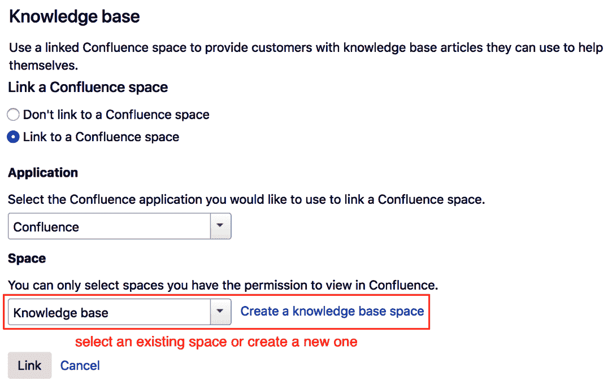
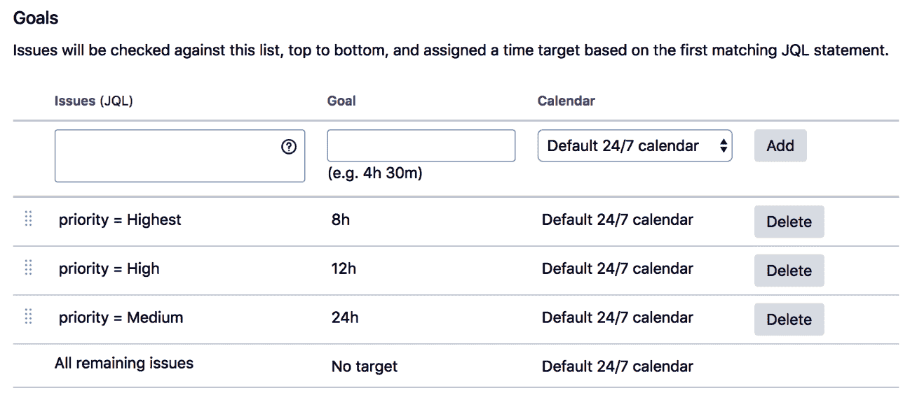

# 第九章：Jira Service Desk

在前几章中，我们集中讲解了 Atlassian 的 Jira 平台，它主要用于问题跟踪。我们涵盖了诸如通过屏幕和字段定制项目以及将 Jira 与其他第三方服务集成的主题。

本章将介绍另一个密切相关的 Jira 产品，名为 Jira Service Desk。它允许您运行一个强大的支持系统，既可以与您的工程项目一起使用，也可以独立作为一个全方位的支持解决方案。我们将探讨如何定制 Jira Service Desk，以便为终端用户提供独特的体验。由于 Jira Service Desk 是建立在 Jira 之上的，它的安装过程几乎与 Jira 相同，您可以参考第一章的食谱，*Jira 服务器管理*，了解更多细节。

本章将涵盖以下内容：

+   定制您的支持门户的外观和体验

+   捕获来自客户的服务请求的正确信息

+   为您的客户设置知识库

+   与您的内部团队合作处理服务请求

+   使用**服务级别协议**（**SLA**）来跟踪和评估绩效

# 定制您的支持门户的外观和体验

Jira Service Desk 有两个主要界面——一个供客户提交请求，另一个供代理提供解决方案。在本食谱中，我们将探讨如何定制服务台门户，它是客户使用的前端用户界面。

# 如何操作...

要完全定制您的服务台门户，请执行以下步骤：

1.  以管理员身份登录到 Jira Service Desk。

1.  浏览到**管理** > **应用程序** > **配置**（在 Jira Service Desk 下）。

1.  点击**查看和定制**链接，位于帮助中心下方。

在此，您可以配置一系列定制选项，以决定客户访问服务台门户时其外观。您可以添加徽标、横幅、配色方案和公告消息。在公告消息中，您可以使用 wiki 标记，因此您可以使用粗体、斜体等样式并创建超链接。例如，以下公告消息使用了其中的一些标记：

```
Welcome to the newly launched Global Support Center! 

If you have any issues or questions, please contact us at help@support.company.com. We are here to help!

_your friendly support team_
```

一旦您进行更改，您的定制就会立即生效。满意结果后，点击屏幕底部的**保存更改**按钮：


在您定制了服务台门户的外观和体验后，您需要定制客户可以提交的请求类型。通过合理规划请求类型，您可以帮助客户更好地理解应该在哪里提交请求，以便将请求路由到相关团队成员，以便更快地解决问题。请求类型在每个服务台（Jira 项目）中管理：

1.  浏览到您希望为其设置请求类型的服务台。

1.  点击屏幕左下角的**项目设置**选项。

1.  从左侧面板中选择请求类型选项。

1.  通过输入请求的名称、类型和所属组来添加新的请求类型。同一组中的请求将在门户中一起显示。请注意，一个请求可以属于多个组。

在选择和创建请求组时，尽量根据所有属于该组的请求类型共享的共同主题来命名它们：


我们现在来看一下它是如何工作的。

# 它是如何工作的...

Jira Service Desk 利用了 Jira 的许多内置功能，其请求类型是建立在问题类型功能之上的。在服务台中，请求类型映射到 Jira 中的问题类型。主要区别在于，请求类型是客户看到的内容，因此它允许您赋予它更具描述性的名称，以帮助客户更好地理解每个请求类型背后的目的。例如，一个名为**bug**的问题类型可以有一个名为**报告**的请求类型，并映射到应用程序缺陷。虽然对支持代理或工程师来说，它们的意思相同，但在客户眼中，请求类型将显得更加友好。

因此，在管理请求类型时，您需要确保服务台项目中存在相应的缺陷类型，才能将其映射到请求类型。有关详细信息，请参阅第二章中的*为项目设置不同的问题类型*，*为您的项目自定义 Jira*：


到此，我们已经完成了本教程。

# 捕捉来自客户的服务请求所需的正确信息。

在本教程中，我们将探讨如何为不同的请求类型自定义屏幕和字段布局，以便从客户那里收集必要的信息，并帮助您的代理快速解决问题。我们还将研究为代理设置不同的屏幕和字段，以便他们可以独立于客户视图收集额外的信息。

# 如何操作...

要为客户门户配置字段布局，请执行以下步骤：

1.  浏览到服务台以自定义字段布局。

1.  点击左下角的**项目设置**选项。

1.  从左侧面板选择**请求类型**选项。

1.  点击**编辑字段**链接以配置请求类型。

1.  点击**添加字段**按钮将字段添加到门户。如果您没有看到想要添加的字段，请确保该字段已添加到项目使用的相应屏幕：


要自定义代理的字段布局，您需要配置用于服务台项目的屏幕。您可以参考第二章中*为您的项目设置自定义屏幕*的食谱，了解详细信息。最简单的方法如下：

1.  从左侧面板中选择**屏幕**选项。

1.  展开问题（请求）类型的屏幕方案。

1.  点击**查看问题**操作的屏幕。

1.  搜索并将您想要的字段添加到屏幕中。您以这种方式添加的字段，除非您特别将其添加到请求类型中，否则不会显示给客户，正如前面所述：


如果您的服务台对“编辑问题”和“查看问题”使用不同的屏幕，请确保您对“编辑问题”屏幕进行相同的更改，以便您的代理可以修改这些字段。

# 它是如何工作的...

Jira Service Desk 项目的字段布局由 Jira 的屏幕配置驱动，其中包括屏幕、屏幕方案和问题类型屏幕方案。对于客户门户，Jira Service Desk 提供了一个简化版本的屏幕，用于“创建问题”操作，以保持流畅的用户体验。因此，为了让您能够在请求类型中添加字段，字段必须首先添加到“创建问题”操作的屏幕中：


对于代理的视图，Jira Service Desk 充分利用了 Jira 的屏幕和字段管理功能，因此您可以为“编辑问题”和“查看问题”操作设置不同的屏幕。

# 为您的客户设置知识库

随着时间的推移，您应开始积累客户常见问题的知识库。建议您收集这些知识，并通过搜索引擎（如 Google）使其可搜索和可索引，以便客户能够快速找到这些常见问题的解决方案。

在本食谱中，我们将使用**Atlassian Confluence**产品来设置知识库。通过与 Confluence 的集成，您的服务台代理将能够创建文章，基于一组预定义的模板记录问题症状和解决方案，并使其在服务台中可搜索。

# 如何操作...

第一步是创建 Jira 和 Confluence 之间的应用链接。您可以参考第七章中*Jira 与 Confluence 集成*的食谱，了解详细信息。如果您已经完成了 Jira 和 Confluence 的集成，您可以跳过这些步骤：

1.  浏览到您要为其设置知识库的服务台。

1.  点击屏幕左下角的**项目设置**选项。

1.  从左侧面板中选择**知识库**选项。

1.  点击设置与 Confluence 链接。如果您没有看到以下屏幕截图，那么您已经将 Jira 与 Confluence 集成，可以跳过此部分：


1.  输入您 Confluence 实例的完整 URL，并点击创建新链接按钮。

1.  按照屏幕向导完成设置过程。

有了应用链接后，我们现在可以返回到服务台。此时，您应该能看到将服务台链接到 Confluence 空间的选项。

在创建应用链接后，您可能需要刷新页面才能看到这些选项。

要将 Confluence 空间设置为您的服务台知识库，请执行以下步骤：

1.  选择“链接到 Confluence 空间”选项。

1.  从“应用”下拉列表中选择要链接的 Confluence 应用。

1.  选择将成为您服务台知识库的空间。如果此时没有指定空间，您可以点击创建知识库空间链接，以便即时创建一个新空间：



1.  在选择或创建您的知识库 Confluence 空间后，点击“链接”按钮。

最后一步是配置知识库访问控制，以便自动搜索门户时能够返回结果。如果 Jira 服务台和 Confluence 连接到相同的用户存储库，例如 LDAP，那么它们应该拥有相同的用户账户。确保您授予终端用户对知识库空间的读取权限，并为您的客服代理提供页面访问权限。

一旦您设置了知识库，代理视图中将会新增一个名为“相关知识库文章”的部分。代理可以通过执行以下步骤创建新知识库文章：

1.  点击创建文章链接：


1.  输入新文章的标题，选择标签，然后选择用于文章内容的模板。

1.  点击**创建**按钮。这将把您带到 Confluence 中的文章，该文章会根据所选模板预先填充。您可以编辑内容并在准备好后发布：


现在是时候看看这些步骤是如何工作的了。

# 它是如何工作的...

通过通过应用链接集成 Jira 和 Confluence，我们创建了 Jira 服务台和 Confluence 空间的一一映射。每当一个客服代理从请求中点击创建文章链接时，他们将在映射的 Confluence 空间中基于所选模板创建一个新页面。

Confluence 提供了两个默认模板供知识库使用：**如何操作**和**故障排除**。您可以将更多模板添加到 Confluence，它们将在代理需要创建新文章时可用。

通过为服务台设置知识库，当客户从门户进行搜索时，搜索结果将包括知识库文章。下图也显示了这一点：


Jira Service Desk 在用户提交新请求时，还会根据客户输入自动推荐文章，帮助他们更快速地找到解决方案，同时避免请求重复和团队的重复劳动。

# 与内部团队在服务请求上的协作

传统的服务台工作流程通常涉及客户提交请求，客服代表与客户合作以找到解决方案。这种方式通常适用于问题简单且容易解决的情况。然而，在许多实际情况中，问题可能很复杂，可能需要来自不同团队的多个人协作才能解决。

在本节中，我们将探讨如何与标准支持团队之外的人进行协作。通常，您会为服务台和工程项目运行同一个 Jira 实例，因此在同一系统中协作非常简单。在本节中，我们将讨论一个更复杂的场景，支持团队使用 Jira Service Desk 实例，而工程团队使用独立的 Jira 软件实例，两者共同协作解决客户的请求。

# 如何操作...

第一步是创建一个应用链接，将您的 Jira Service Desk 实例与 Jira 软件实例连接起来。您可以参考第七章中的*与其他 Jira 实例集成*一节，了解详细信息。如果您已经集成了这两个 Jira 实例，可以跳过这些步骤。

1.  导航至**管理** > **应用** > **应用链接**。

1.  输入 Jira 软件实例的 URL，并创建应用链接。Jira 应该会自动将目标应用识别为 Jira。如果由于某些原因没有自动识别，请确保在提示时选择 Jira 作为应用类型：


一旦您将两个 Jira 实例链接起来，代理和/或协作者将能够将您的服务台请求与工程项目中的问题进行关联：

1.  浏览到服务台中的请求。

1.  在**更多**菜单下选择**链接**选项。

1.  从**服务器**下拉列表中选择 Jira 软件实例。

1.  选择请求与问题之间的关系。通常，您应该选择**由...引起**选项。

1.  选择要关联到请求的问题。如果您知道问题的键，可以直接输入；否则，您可以点击**搜索问题链接**进行搜索。

1.  确保选中**创建互惠链接**选项，这样问题也会创建一个链接。这样可以让工程师知道在解决问题时有客户请求待处理，并帮助工程团队优先处理任务。

1.  如果你想向正在处理请求的代理添加额外的细节，可以选择**内部评论**标签。以这种方式添加的评论将不会对客户可见。

1.  点击**链接**按钮以创建链接。

屏幕显示如下截图：


现在让我们看看这些步骤是如何工作的。

# 它是如何工作的...

Jira 平台提供了一项开箱即用的功能，称为应用链接，允许你将多个 Atlassian 产品实例集成在一起——在本例中，是 Jira 服务台和 Jira 软件。通过在两者之间创建应用链接，我们的 Jira 服务台能够识别 Jira 软件实例，并访问其拥有的数据，特别是任何问题。

一旦我们在客户请求和工程问题之间创建了问题链接，两个系统都能够查询并显示对方的状态。这意味着当代理查看请求时，他们也能看到链接的工程问题的状态，即使它来自不同的系统。请看下面的截图：


一旦工程师完成问题，代理将会从请求中自动看到状态更新。

# 使用 SLA 进行性能跟踪与评估

SLA 帮助你衡量团队的服务表现水平，并提供关于可以改进的地方的洞察。

在这个流程中，我们将为服务台设置一个新的 SLA 度量，衡量团队解决客户请求所需的时间。然而，我们不会考虑等待客户提供更多信息的时间。

# 如何操作...

要设置 SLA，请执行以下步骤：

1.  浏览到你希望为其设置 SLA 的服务台。

1.  点击屏幕左下角的**项目设置**选项。

1.  从左侧面板中选择**服务水平协议（SLA）**选项。

1.  点击**创建 SLA**选项。

1.  为新的 SLA 输入一个新名称：


在你点击**创建**按钮创建新的 SLA 度量之前，你需要首先定义如何测量时间：

1.  从“开始”列中选择**问题已创建**选项。

1.  从**暂停在**列中选择**等待客户**状态选项。

1.  从“停止”列中选择**已解决状态**选项：


在配置完时间计数规则后，我们需要设置 SLA 目标，以便我们能够衡量团队的表现：

1.  在**问题（JQL）**文本框中输入`priority = High`。

1.  设置**目标**为`12 小时`，即 12 小时。

1.  如果你希望 SLA 计算时包括非工作时间，选择**默认 24/7 日历**；如果只想包括工作时间，则选择**样本 9-5 日历**。然后，点击**添加**按钮。

你可以重复前三个步骤来添加更多目标，准备好后，点击**创建**按钮来创建新的 SLA 度量：



这完成了本示例的步骤。让我们来看看这些步骤实际是如何工作的。

# 它是如何工作的...

Jira Service Desk 的 SLA 由两部分组成：如何计算时间以及在给定标准下要实现的目标。目标设置部分相当直接：

+   **定义规则的 JQL 查询**：例如，`priority = High`表示所有在该项目中优先级设置为高的请求将有此 SLA 目标。

+   **指定时间内需要实现的目标**：例如，8 小时意味着该 SLA 目标为 8 小时。

+   **使用的日历**：这定义了在计算 SLA 目标是否已达成时，使用的时间和日期。

实际的 SLA 计算部分稍微复杂一些。在计算 SLA 时，我们需要定义以下内容：

+   **何时开始计时**：这是定义在**开始**列中。在我们的示例中，我们选择了**问题已创建**选项，这意味着一旦客户创建请求，SLA 将开始计时。

+   **何时停止计时**：这个定义在**停止**列中。在我们的示例中，我们选择了**已进入状态：已解决**选项，这意味着一旦代理将请求放入“已解决”工作流状态，SLA 将停止计时。

+   **何时暂停计时**：这是可选的，定义在**暂停于**列中。在我们的示例中，我们选择了**状态：等待客户**选项；这意味着一旦代理请求客户提供额外信息，SLA 将暂停。客户提供所需信息后，SLA 将恢复计时。
