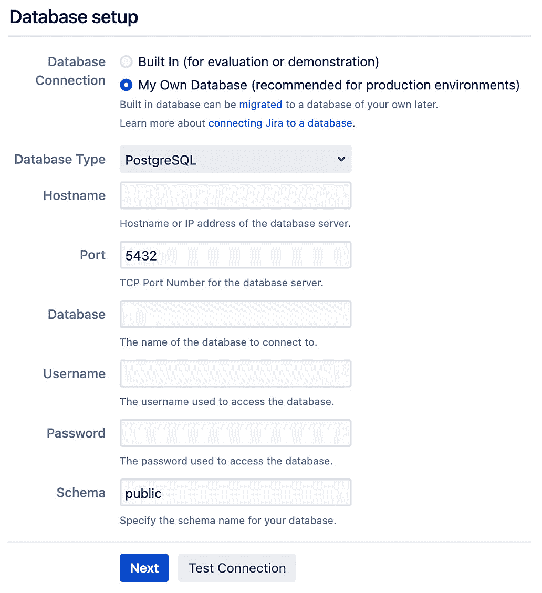
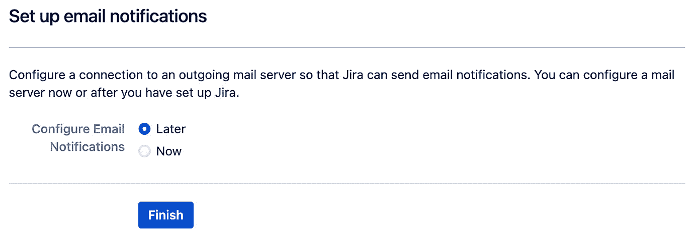

# 1

# 开始使用 Jira 数据中心

在本章中，我们将首先提供对 Jira 的高层概述，介绍在该平台上运行的各种产品，然后介绍 Jira 数据中心。接下来，我们将讨论部署选项和托管 Jira 数据中心所需的系统要求。最后，我们将动手从头开始安装自己的 Jira 数据中心，包括独立部署和集群部署。

本章内容包括：

+   理解 Jira 平台

+   介绍 Jira 数据中心

+   系统要求

+   安装包选项

+   安装和配置 Jira

+   安装后配置

+   集群

+   零停机升级

在本章结束时，你将了解 Jira 平台和新的数据中心产品。你还将学习安装 Jira 所需的系统要求，以及 Jira 集群的工作原理。最后，你将自己启动并运行一个 Jira 实例。

# 理解 Jira 平台

Jira 最初是作为一个流行的工具，用于软件开发团队跟踪和管理他们的项目。随着 IT 行业多年的变化，Jira 也在不断发展，以应对用户面临的需求和挑战。如今，Jira 已经从一个单一应用转变为一个平台，能够运行多个应用和解决方案，并提供超越问题跟踪的额外功能和能力。

Jira 背后的公司 Atlassian 还有其他几款产品，组成了 Jira 家族。这些包括以下产品：

+   **Jira 软件**：这是一个专注于软件开发的产品。它允许项目团队使用传统的瀑布式方法和敏捷方法（如 Scrum 和看板）来运行软件开发项目。

+   **Jira 工作管理**：这是一个为非软件开发团队设计的产品，如市场营销、运营和法律团队。它非常适合通用任务管理。

+   **Jira 服务管理**：这是一个为服务台团队设计的产品。它旨在将 Jira 用作支持工单系统，为终端用户提供简化的用户界面，重点关注客户满意度和 **服务水平协议** (**SLA**) 目标。

Jira 平台的核心提供了多种常见功能，供不同产品使用，例如用户界面定制、工作流和电子邮件通知，而 Jira 软件和 Jira 服务台在此基础上添加了专门的功能。

当然，作为一个平台，Jira 还允许其他第三方开发者为其开发解决方案。Atlassian 拥有一个庞大的生态系统，其中包括由合作伙伴开发的产品和解决方案，这些都为 Jira 增添了更多功能。在本书的后续部分，我们将介绍其中的一些解决方案。

本书主要聚焦于 Jira 软件，但我们也会涵盖所有应用程序共享的常见功能，以及它们如何在各自的使用场景中使用这些功能。因此，术语 *Jira* 将主要用于指代 Jira 软件，除非需要做出特定区分。

现在我们已经了解了 Jira 平台及其各种产品，是时候来看看 Jira 家族的新成员了。

# 介绍 Jira 数据中心

用户在使用 Jira Server 时常遇到的最大挑战之一是 **可扩展性**。当一个组织的 Jira 部署扩展到成千上万的并发用户和数十万个问题时，他们往往会开始遇到性能问题，例如响应时间变慢。尽管每个新版本都会包含性能改进，但客户通常不得不将旧项目归档并导出到另一个 Jira 实例，或者将一个大实例拆分成多个小实例。

一些组织可以通过迁移到 Jira 云服务来解决这个问题。然而，由于安全性、法规以及其他原因，并非每个人都可以迁移到公共云，或者他们更倾向于在自己的私有云中运行 Jira。这就是 **Jira 数据中心** 的作用所在。

Jira 数据中心是 Atlassian 推出的新产品，取代了旧版的 Jira Server，旨在解决那些需要确保 Jira 部署具有高性能、可扩展性、高可用性和安全性的组织常面临的挑战。

使用 Jira 数据中心，您可以继续自行托管 Jira，同时享受上述附加好处。增加了许多附加功能，例如支持 **安全声明标记语言** (**SAML**)、用于规划的高级路线图以及改进的管理功能。

额外信息

您可以在[`confluence.atlassian.com/enterprise/jira-server-and-data-center-feature-comparison-953651628.html`](https://confluence.atlassian.com/enterprise/jira-server-and-data-center-feature-comparison-953651628.html)找到旧版 Jira Server 和 Jira 数据中心之间的差异完整列表。

那么，Jira 数据中心是如何实现所有这些好处和改进的呢？与 Jira Server 只有一个运行实例不同，Jira 数据中心允许您将多个 Jira 实例作为一个单一的部署运行，称为 **集群**。下图展示了典型的 Jira 数据中心部署：


图 1.1 – Jira 数据中心部署

您将有一个或多个 Jira 实例，称为 **节点**，它们在一个集群中运行。所有 Jira 节点将连接到同一个数据库和文件服务器，并通过负载均衡器将流量分配到所有节点。这样，集群中的计算能力得以共享，您可以随时向集群中添加一个节点来增加额外的容量。

Jira Data Center 的另一个优点是，如果您还未准备好，您不需要运行集群。您可以像使用旧版 Jira Server 一样，以单节点的形式运行独立部署。然后，等到需要时，您可以随时将部署转换为集群。这样做为您提供了灵活性，以及 Jira Data Center 引入的所有额外功能。了解了 Jira Data Center 后，我们来看看部署所需的资源。

# 系统要求

在我们部署 Jira Data Center 之前，我们需要看看 Jira 所需的硬件和软件，以及您希望如何进行部署。

您可以通过两种方式部署 Jira：

+   **独立**：这就是经典的 Jira Server 部署方式，您只有一个 Jira 实例为用户提供服务。这是更简单的选项，不需要那么多系统资源。如果您刚刚开始使用，这个选项适合您。

+   **集群**：这就是*图 1.1*中所展示的部署方式，您可以在集群中运行多个 Jira 实例（节点），它们共同为您的用户提供服务。如果您需要可扩展性、高可用性以及其他集群特性，这就是适合您的选项。

如果您不确定从哪个选项开始，您可以始终从独立部署选项开始，当您需要所有集群部署的功能和优势时，再切换到集群部署。

现在我们已经了解了 Jira 的部署选项，接下来让我们看看您需要的硬件和软件。

## 硬件要求

对于评估目的，仅有少量用户的情况下，Jira 可以在任何拥有 1.5 GHz 处理器和 1 GB 到 2 GB 内存的服务器上顺利运行。随着 Jira 使用量的增加，典型服务器将配备 2 GHz+ 四核 CPU 和 4 GB 内存专门为 Jira 应用程序分配，并且至少 10 GB 的硬盘空间用于数据库。

对于生产环境部署，像大多数应用程序一样，建议您将 Jira 安装在专用服务器上。当决定分配给 Jira 的资源时，您需要考虑很多因素，特别是 Jira 将如何扩展和增长。确定硬件需求时，您应考虑以下几点：

+   系统中活跃（并发）用户的数量，尤其是在高峰时段

+   系统中的项目、问题和评论数量

+   配置项的数量，如自定义字段和工作流

有时，估算这些数字可能会很困难。作为参考，配备 2.0 四核 CPU 和 4 GB RAM 的服务器足以支持大多数拥有约 200 名活跃用户的实例。如果用户数量达到几千人，你将需要至少为 Jira（JVM）分配 8 GB 的 RAM。一旦超越一百万个问题和几千名活跃用户的单一 Jira 实例，单纯增加系统资源（垂直扩展）将开始带来递减效益。在这种情况下，通常更好考虑使用 Jira 的数据中心版，它通过允许多个实例进行集群（横向扩展）提供更好的可扩展性，并且具有高可用性的优势。

官方上，Jira 仅支持 x86 硬件及其 64 位衍生版本。当在 64 位系统上运行 Jira 时，你可以为 Jira 分配超过 4 GB 的内存，而 32 位系统的限制就是 4 GB。如果你计划部署一个大型实例，建议使用 64 位系统。

## 软件要求

Jira 在软件方面有三个主要要求：需要一个支持的操作系统、一个 Java 环境和一个用于存储所有数据的数据库。在接下来的部分中，我们将讨论这些要求以及你可以选择的安装和运行 Jira 的选项。

其他信息

你可以在线查看最新的软件要求信息，网址：[`confluence.atlassian.com/adminjiraserver/supported-platforms-938846830.html`](https://confluence.atlassian.com/adminjiraserver/supported-platforms-938846830.html)。

### 操作系统

Jira 支持大多数主流操作系统，因此选择在哪个操作系统上运行 Jira，更多的是关于专业技能、舒适度，并且在大多数情况下，还要考虑现有组织的基础设施和需求。

Atlassian 支持的操作系统包括 Windows 和 Linux。虽然有一个适用于 macOS 的 Jira 版本，但这主要用于评估目的。**亚马逊 Web 服务**（**AWS**）和微软 Azure 也通过快速启动模板得到支持。

在 Windows 和 Linux 上，Atlassian 提供了一个可执行的安装向导包，捆绑了所有必要的组件，简化了安装过程。在安装、配置和维护 Jira 时，不同操作系统之间几乎没有差异。如果你没有特别的偏好，并希望降低初始成本，CentOS Linux 是一个不错的选择。

### Java 平台

Jira 是一个基于 Java 的 Web 应用程序，因此需要安装 Java 环境。这可以是**Java 开发工具包**（**JDK**）或**Java 运行环境**（**JRE**）。随 Windows 或 Linux 一起提供的可执行安装程序包括 JRE。但是，如果你打算使用归档分发版本，必须确保已安装并配置好所需的 Java 环境。

Jira 需要最低版本的 Java 8。如果你在不支持的 Java 版本或不支持的供应商环境中运行 Jira，可能会遇到意外错误。下表显示了 Jira 支持的 Java 版本：


表 1.1 – Java 平台

你还应该保持 Java 版本的最新，通过运行最新的 Java 8 或 11 的修补版本。这将确保你获得最新的错误修复和安全补丁，保障环境的安全。

### 数据库

Jira 将所有数据存储在关系型数据库中。虽然你可以使用**H2 数据库**（Jira 自带的内存数据库）来运行 Jira，但它容易导致数据损坏。你应该仅将其用于快速设置新实例进行评估，且不会存储重要数据。出于这个原因，你必须使用像 MySQL 这样的企业级数据库来进行生产系统。

市面上大多数关系型数据库都被 Jira 支持，并且在安装和配置 Jira 时没有差异。就像操作系统一样，你选择的数据库将取决于你组织的基础设施/DevOps 团队的专业知识、经验以及既定的公司 IT 标准。如果你使用 Windows 作为操作系统，那么你可能会选择 Microsoft SQL Server。另一方面，如果你使用 Linux，那么你可能会选择 PostgreSQL 或 MySQL。

下表总结了写作时 Jira 支持的数据库。值得一提的是，MySQL 和 PostgreSQL 都是开源产品，因此它们是减少初期成本的优秀选择：

| **数据库** | **支持状态** |
| --- | --- |
| MySQL | MySQL 5.7, 8.0*注意，MariaDB 和 PerconaDB 不受支持* |
| PostgreSQL | PostgreSQL 10, 11, 12 |
| Microsoft SQL Server | SQL Server 2016, 2017, 2019 |
| Oracle | Oracle 12c R2, 18c, 19c*这需要 JDBC 19.3 (ojdbc8) 驱动程序* |
| Azure SQL |  |
| Amazon Aurora | PostgreSQL 10, 11, 12 |
| H2 | 仅与独立分发包捆绑，仅用于评估目的 |

表 1.2 – 数据库

特别注意每个数据库的驱动程序要求。Jira 捆绑了一些数据库的驱动程序，但有些数据库，比如 Oracle，要求你单独获取驱动程序。你需要确保获取正确版本的驱动程序，以避免出现意外错误。

在系统和数据库要求已涵盖的情况下，接下来我们就进入 Jira 本身。

# 安装包选项

Jira Data Center 提供了多种部署选项。你需要做的第一个选择是你希望在哪里部署 Jira。如果你想将 Jira 部署到 AWS 或 Azure，Atlassian 提供了快速启动模板，以帮助你快速启动和运行。

如果你想将 Jira 部署到你的硬件或其他云服务商，或者仅仅希望管理你想要的部署方式，你可以使用可用的安装包。Jira 安装包有两种形式：

+   **可执行安装程序**：可执行安装程序提供了一个向导界面，带你完成整个安装过程。它甚至附带了一个 Java 安装程序，帮你节省时间。

+   **TAR.GZ 或 ZIP 压缩包**：该压缩包类似于可执行安装程序，区别在于它没有安装向导，不包含 Java，也不会配置 Jira 作为服务运行。

你还需要手动执行一些安装后的步骤，例如将 Jira 配置为服务。但你可以获得学习背后运作机制的好处。

在我们的练习中，我们将使用安装包，但也会涵盖安装后的步骤，以便你对各种配置选项有一个全面的了解。我们将从安装 Java 开始。

## 安装 Java

由于我们将使用捆绑了 Java 的安装包，你可以跳过本节。如果你使用的是压缩包选项，你需要确保系统上已经安装了 Java。

Jira 8 至少需要 JRE 版本 8 才能运行。你可以通过在 **命令提示符** 中运行以下命令来验证你安装的 Java 版本：

```
    java -version
```

上述命令会告诉你系统上运行的是哪个版本的 Java，如下图所示：


图 1.2 – Java 版本

如果你没有看到类似的输出，那么很可能是你没有安装 Java。你需要执行以下步骤来设置 Java 环境。首先，安装 Java 到你的系统：

1.  从 [`www.java.com/en/download/manual.jsp`](https://www.java.com/en/download/manual.jsp) 下载最新的 Java 8 或 11。

注意

截至撰写本文时，Java 8 的最新版本是 JDK 8 更新 321。

1.  双击下载的安装文件，启动安装向导。

1.  选择你希望安装 Java 的位置。或者，你也可以直接接受默认值。你安装 JDK 的位置将在本书的后续部分被称为 `JAVA_HOME`。

1.  创建一个新的环境变量，名为 `JAVA_HOME`，并将其值设置为你安装 Java 的完整路径。你可以按如下方式操作：

    1.  通过从 Windows **开始**菜单进入 **关于你的电脑**，打开 **系统属性** 窗口。

    1.  选择 **高级系统设置** 选项。

    1.  点击新弹出窗口中的 **环境变量** 按钮：


图 1.3 – JAVA_HOME 环境变量

1.  添加一个新的变量（可以是用户变量或系统变量），命名为 `JAVA_HOME`，并将其值设置为你安装 Java 的路径。

现在你已经对 Jira 数据中心、基本系统要求和各种安装选项有了充分了解，我们准备部署我们自己的 Jira 实例。

# 安装并配置 Jira

我们将首先以独立部署的方式安装 Jira。我们将在 Windows 平台上执行安装，并使用 PostgreSQL 作为数据库。如果你打算使用不同的平台或数据库，请参考厂商文档以了解如何为你的平台安装所需的软件。

在本节中，你将进行以下操作：

+   安装一个全新的 Jira 软件实例

+   将 Jira 连接到 PostgreSQL 数据库

+   配置 Jira 实例以便在集群环境中工作

我们将在后续章节和练习中继续使用这个 Jira 部署，构建我们的帮助台实现。

对于我们的部署，我们将使用以下配置：

+   Jira 软件 8.21.0

+   PostgreSQL 12.9

+   Apache Web 服务器

+   微软 Windows

让我们开始安装 Jira！

## 安装 Jira

在安装 Jira 之前，有两个重要的目录需要说明：

+   `JIRA_INSTALL`：这是 Jira 应用程序将安装到的目录

+   `JIRA_HOME`：这是 Jira 用来存储一些重要配置和数据文件的目录

我们将在本书中一直提到这两个目录。现在，进入安装部分。通常有两个步骤：

+   下载并安装 Jira 应用程序

+   运行 Jira 设置向导

让我们开始吧。

### 获取并安装 Jira

第一步是下载 Jira 的最新稳定版本。你可以从 [`www.atlassian.com/software/jira/update`](https://www.atlassian.com/software/jira/update) 下载 Atlassian Jira。

Atlassian 网站会检测你使用的操作系统，并自动为你推荐一个安装包。如果你打算在不同的操作系统上安装 Jira，请确保选择正确的操作系统安装包。

正如我们之前提到的，Windows 提供了 Windows 安装包和自解压归档包。对于本次练习，我们将使用安装包（`Windows 64-bit Installer`）：

1.  双击下载的安装文件以启动安装向导，然后点击 **下一步** 按钮继续：


图 1.4 – Jira 安装步骤 1

1.  选择 **自定义安装（推荐高级用户使用）** 选项，并点击 **下一步** 按钮继续。使用自定义安装可以让我们决定安装 Jira 的位置，并提供多个配置选项，如下图所示：


图 1.5 – Jira 安装步骤 2

1.  选择安装 Jira 的目录。这将成为 `JIRA_INSTALL` 目录。点击 **下一步** 按钮继续：


图 1.6 – Jira 安装步骤 3

1.  选择 Jira 将存储数据文件的位置，例如附件和日志文件。这将成为`JIRA_HOME`目录。点击**下一步**按钮继续：


图 1.7 – Jira 安装步骤 4

1.  选择您希望在开始菜单中创建快捷方式的位置，然后点击**下一步**按钮继续。

1.  在`8080`端口。如果`8080`已经被其他应用程序占用，或者您希望 Jira 在不同的端口上运行，例如端口`80`，请选择**为 HTTP 和控制端口设置自定义值**选项，并指定您希望使用的端口号。点击**下一步**按钮继续：


图 1.8 – Jira 安装步骤 6

1.  选择是否希望 Jira 作为服务运行。如果启用此选项，Jira 将作为系统服务安装，并可以配置为与服务器一起自动启动；有关更多详细信息，请参考*启动和停止 Jira*部分：


图 1.9 – Jira 安装步骤 7

1.  在最后一步，检查所有安装选项，并点击**安装**按钮以开始安装：


图 1.10 – Jira 安装步骤 8

1.  安装完成后，勾选**在浏览器中启动 Jira 软件**选项，并点击**完成**。这将关闭安装向导并打开您的网页浏览器，以便您访问 Jira。由于 Jira 是第一次启动，这可能需要几分钟时间：


图 1.11 – Jira 安装步骤 9

就是这样！恭喜，您的 Jira 已安装并运行。现在，让我们学习如何配置它。

### Jira 设置向导

如果您在浏览器中选择了`http://localhost:<端口号>`，其中`<端口号>`是您在安装过程中*第 6 步*中为 Jira 分配的端口号。

Jira 附带的易用设置向导将指导您完成完成 Jira 设置的过程。在此过程中，您将能够配置数据库连接、默认语言等设置。

这些步骤如下：

1.  在向导的第一步中，我们需要选择如何设置 Jira。由于我们是为生产环境安装 Jira，因此我们将选择**我自己设置**选项，如下图所示：


图 1.12 – Jira 配置步骤 1

1.  第二步，我们需要选择要使用的数据库。在此步骤中，我们配置 Jira 使用 PostgreSQL 作为数据库。如果选择**内置**选项，Jira 将使用其捆绑的内存 H2 数据库，这对于评估用途非常有用。如果您希望使用正式的数据库，例如在我们这种情况下，应该选择**我的数据库**选项：



图 1.13 – Jira 配置步骤 2

注意

**内置**选项非常适合快速启动 Jira 进行评估使用。

选择**我的数据库**选项后，向导将扩展，要求您提供数据库连接详细信息。如果没有安装必要的数据库驱动程序，Jira 会提示您安装。

填写数据库详细信息后，建议点击**测试连接**按钮，验证 Jira 是否可以连接到数据库。如果一切设置正确，Jira 会显示成功消息。您应该能够通过点击**下一步**按钮继续进行下一步操作。这可能需要几分钟时间，因为 Jira 现在将创建所有必要的数据库对象。完成后，您将进入向导的下一步骤。

1.  在第三步中，您需要提供有关此 Jira 实例的一些基本信息。填写完必填字段后，点击**下一步**继续向导的下一个步骤：


图 1.14 – Jira 配置步骤 3

1.  在此步骤中，我们需要为 Jira 提供许可证密钥。如果您已经从 Atlassian 获得许可证，可以将其粘贴到**您的许可证密钥**文本框中。如果没有许可证，您可以通过点击**生成 Jira 试用许可证**链接来生成评估许可证。评估许可证将允许您在 1 个月内访问 Jira 的完整功能。评估期结束后，您将失去创建新问题的能力，但仍然可以访问您的数据：


图 1.15 – Jira 配置步骤 4

1.  现在，您必须为 Jira 设置管理员帐户。确保将帐户详细信息保存在安全的地方，并且不要丢失密码。由于 Jira 只存储密码的哈希值，而不是实际的密码，您将无法恢复它。填写管理员帐户的详细信息并点击**下一步**：


图 1.16 – Jira 配置步骤 5

重要说明

这个帐户非常重要，它可以帮助您排除故障并解决问题。千万不要丢失它！

1.  接下来，你需要设置电子邮件服务器的详细信息。Jira 将使用这里配置的信息发送通知邮件。通知是 Jira 中一个非常强大的功能，也是 Jira 与用户沟通的主要方式之一。如果你没有准备好电子邮件服务器的信息，你可以通过选择**稍后**选项并点击**完成**来跳过此步骤。你可以稍后再配置电子邮件服务器设置，正如你将在*第八章*中看到的，*电子邮件和通知*：



图 1.17 – Jira 配置步骤 6

恭喜！你已经完成了 Jira 的设置。此时你应该能看到欢迎页面，并且已经自动以你在*第 5 步*中创建的管理员用户身份登录。在欢迎页面上，你需要设置一些用户偏好，例如默认语言和头像。按照屏幕上的提示设置账户。完成后，你将看到创建示例项目、从头开始创建新项目或从其他来源导入项目数据的选项，如下图所示：


图 1.18 – Jira 欢迎页面

至此，Jira 已完全配置好。我们将在本书的后续章节中介绍你可以使用的各种功能，但现在，我们将先看一下 Jira 的一些额外管理和配置选项，从如何作为服务启动和停止 Jira 开始。

### 启动和停止 Jira

由于我们使用了 Windows 安装程序，Jira 被安装为 Windows 服务。因此，你可以通过 Windows **服务**控制台来启动、停止和重启 Jira。在**服务**控制台中，寻找**Atlassian Jira**。在这里，你将能够停止和启动该应用程序，如下图所示：


图 1.19 – Windows 服务

如果你通过归档选项安装了 Jira，你可以使用`JIRA_INSTALL\bin`目录中的脚本来启动和停止 Jira，Linux 系统上是`start-jira.sh`和`stop-jira.sh`，Windows 系统上是`start-jira.bat`和`stop-jira.bat`。

现在我们知道了如何启动和停止 Jira，接下来让我们来看一些额外的配置选项，比如**分配内存**。

# 安装后配置

安装后的配置步骤是可选的，取决于你的需求和环境。如果你是为了评估目的而设置 Jira，那么你可能不需要执行以下任何步骤，但作为参考，熟悉这些步骤总是一个好的实践。

在下一节中讨论的更改完成后，你需要重启 Jira。

## 增加 Jira 的内存

Jira 的默认内存设置通常足以支持小型到中型部署。当 Jira 的使用率增加时，你会发现默认分配的内存已不再足够。如果 Jira 作为 Windows 服务运行，如本章所述，你可以按如下方式增加内存：

1.  查找 Jira 的服务名称。你可以通过访问 Windows 的 `JIRA150215215627` 来找到它。

1.  打开一个新的命令提示符窗口，将当前工作目录更改为 `JIRA_INSTALL\bin` 目录。

1.  运行以下命令，替换为实际的 Jira 服务名称：

    ```
            tomcat8w //ES//<JIRA Windows service name>
    ```

1.  选择 **Java** 选项卡，更新 **初始内存池** 和 **最大内存池** 的大小，然后点击 **确定**：


图 1.20 – Jira 内存设置

1.  重启 Jira 以应用更改。

如果你没有将 Jira 作为 Windows 服务运行，则需要打开 `JIRA_INSTALL\bin` 目录下的 `setenv.bat` 文件（适用于 Windows）或 `setenv.sh` 文件（适用于 Linux）。然后，定位到以下几行：

```
set JVM_MINIMUM_MEMORY="384m"
set JVM_MAXIMUM_MEMORY="768m"
```

更改这两个参数的值并重启 Jira。通常，4 GB（4,096 MB）的内存足以支持一个由数百名用户使用的较大 Jira 实例。

初始内存池或 `JVM_MINIMUM_MEMORY` 参数决定了 Jira 启动时的内存量。通常，内存越少，Jira 启动越快。最大内存池或 `JVM_MAXIMUM_MEMORY` 参数决定了 Jira 可以使用的最大内存量。如果这两个值不相同，Jira 将以最小内存启动，并随着用户的增加而逐渐增长至最大内存。

重要提示

在分配实例给 Jira 之前，请确保你有足够的物理内存可用。

## 更改 Jira 的端口号和上下文路径

在安装过程中，安装向导会提示我们选择 Jira 用于接收连接的端口。如果你接受了默认值，那么该端口将是 `8080`。如果你改变主意，想要稍后更改该设置，你可以通过在文本编辑器中打开 `JIRA_INSTALL/conf` 目录下的 `server.xml` 文件来实现。我们来看一下该文件的相关内容：

```
<Server port="8005" shutdown="SHUTDOWN">
```

上述行指定了用于关闭 Jira 的端口。默认情况下是端口 `8005`。如果该端口已被其他应用（例如另一个 Jira 实例）占用，你需要将其更改为其他端口。以下行指定了 Jira 将运行的端口：

```
<Connector port="8080" protocol="HTTP/1.1">
```

默认情况下，Jira 将在端口 `8080` 上运行。如果该端口已经被其他应用占用，或者由于某种原因该端口不可用，你需要将其更改为另一个可用端口。以下行允许你指定 Jira 将运行的上下文路径：

```
<Context path="/jira" docBase="${catalina.home}/atlassian-jira" reloadable="false" useHttpOnly="true">
```

默认情况下，值为空，这意味着 Jira 将通过 `http://hostname:portnumber` 访问。如果你决定指定一个上下文，URL 将是 `http://hostname:portnumber/context`。在我们的示例中，Jira 将通过 `http://localhost:8080/jira` 访问。

## 配置 HTTPS

默认情况下，Jira 使用标准的、未加密的 HTTP 协议运行。如果你在一个安全的环境中运行 Jira，例如内部网络，那么这样是可以接受的。然而，如果你打算通过互联网开放 Jira 的访问，你需要通过启用 HTTPS（基于 SSL 的 HTTP）来加密敏感数据，如正在传输的用户名和密码，从而增强安全性。

对于独立安装，你需要按以下顺序进行操作：

1.  获取并安装证书

1.  在你的应用服务器（Tomcat）上启用 HTTPS

1.  将流量重定向到 HTTPS

首先，你需要获取一个数字证书。这个证书可以从认证机构获取，比如 *VeriSign*（CA 证书），或者是你自己生成的自签名证书。CA 证书不仅会为你加密数据，还会将你的 Jira 副本识别给用户。自签名证书适用于你没有有效的 CA 证书，并且只关心为加密设置 HTTPS 的情况。由于自签名证书没有经过认证机构的签署，它无法向公众识别你的站点，因此用户首次访问时会收到站点不受信任的警告。然而，出于评估目的，自签名证书足以在你获得合适的 CA 证书之前使用。

在本练习中，我们将创建一个自签名证书，以说明完整的过程。如果你有一个 CA 证书，可以跳过以下步骤：

1.  Java 提供了一个便捷的证书管理工具，叫做 `keytool`，如果你使用的是安装包，可以在 `JIRA_INSTALL\jre\bin` 目录中找到它。如果你使用的是自定义的 Java 安装，则可以在 `JAVA_INSTALL\bin` 中找到它。

1.  要生成自签名证书，请从命令提示符运行以下命令：

    ```
    keytool -genkey -alias tomcat -keyalg RSA
    keytool -export -alias tomcat -file file.cer
    ```

1.  这将创建一个 KeyStore（如果尚未存在），并导出自签名证书（`file.cer`）。当你运行第一个命令时，会要求你为 KeyStore 和 Tomcat 设置密码。你需要为两者使用相同的密码。默认密码是`changeit`。你可以指定一个不同的密码，但随后你需要让 Jira/Tomcat 知道这个密码，稍后我们会看到如何操作。

现在你已经准备好证书，接下来需要将它导入到你的信任库中，供 Tomcat 使用。同样，你将使用 Java 中的 `keytool` 工具：

```
keytool -import -alias tomcat -file file.cer
JIRA_INSTALL\jre\lib\security\cacerts
```

这将把证书导入到你的信任库中，JIRA/Tomcat 可以使用该证书来设置 HTTPS。

要在 Tomcat 上启用 HTTPS，请在文本编辑器中打开 `JIRA_INSTALL/conf` 目录下的 `server.xml` 文件。找到以下配置片段：

```
<Connector port="8443" maxHttpHeaderSize="8192" SSLEnabled="true"
maxThreads="150" minSpareThreads="25" maxSpareThreads="75"
enableLookups="false" disableUploadTimeout="true"
acceptCount="100" scheme="https" secure="true"
clientAuth="false" sslProtocol="TLS"     useBodyEncodingForURI="true"/>
```

这为 Jira 启用了 `8443` 端口的 HTTPS。如果你为 KeyStore 选择了不同的密码，你需要在关闭标签之前，将以下行添加到前面代码片段的末尾：

```
keystorePass="<password value>"
```

最后一步是设置 Jira，使其从非 HTTPS 请求自动重定向到 HTTPS 请求。找到并打开 `JIRA_INSTALL/atlassian-jira/WEB-INF` 目录中的 `web.xml` 文件。然后，在文件末尾的 `</web-app>` 标签之前，添加以下代码片段：

```
<security-constraint> <web-resource-collection> <web-resource-name>all-except-attachments</web-resource-name> <url-pattern>*.js</url-pattern> <url-pattern>*.jsp</url-pattern>
    <url-pattern>*.jspa</url-pattern>
    <url-pattern>*.css</url-pattern>
    <url-pattern>/browse/*</url-pattern>
  </web-resource-collection>
  <user-data-constraint>
    <transport-guarantee>CONFIDENTIAL</transport-guarantee>
  </user-data-constraint>
</security-constraint>
```

现在，当你通过正常的 HTTP URL 访问 Jira，如 `http://localhost:8080/jira`，你将自动被重定向到其 HTTPS 对应地址 —— 即 `https://localhost:8443/jira`。

# 集群化

到目前为止，我们的 Jira 实例运行在独立模式下，这意味着它独自处理所有请求，尚未启用集群模式。运行 Jira 集群的主要好处如下：

+   **在规模化时的性能提升**：通过运行一个包含多个节点的集群，Jira 同时处理多个用户请求的能力大大提高，从而提升响应时间和整体用户满意度。

+   **高可用性和故障转移**：通过在集群中运行多个节点，如果任何一个节点因故障而不可用，集群中的其他节点仍然可以继续为用户提供服务，从而避免停机时间。

+   **零停机升级**：通常，在你需要升级 Jira 时，过程会涉及停机。但在运行 Jira 集群时，你可以逐个节点地升级，以便集群中的其他节点继续为用户提供服务。

配置 Jira 以在集群中运行，你必须执行以下操作：

1.  为两个节点创建一个共享的文件主目录，以便它们都可以访问。

1.  将集群配置添加到当前的 Jira 实例中。

1.  添加另一个 Jira 实例，作为集群中的第二个节点。从技术上讲，你可以拥有一个单节点集群，但为了这个练习，我们将添加另一个节点，以便你能看到集群的实际运行情况。

1.  添加并配置负载均衡器，将传入流量分配到两个节点。

现在我们知道了运行 Jira 集群所需的条件，让我们开始准备吧！

## 准备集群化

启用集群化的第一步是准备所需的硬件。对于一个 Jira 集群，你将需要以下组件：

+   **负载均衡器**：这可以是任何支持会话亲和性（粘性会话）的负载均衡器，例如 Apache 和 nginx。

+   **Jira 实例节点**：这将包含作为集群一部分的独立 Jira 实例。

+   **数据库**：这是你为独立部署使用的相同数据库。需要注意的是，由于所有 Jira 节点将共享相同的数据库，因此内存中的 H2 数据库在集群中无法使用。

+   **共享文件驱动器**：Jira 集群需要一个共享的主目录，所有 Jira 节点都能读取和写入。

理想情况下，每个前面列出的组件应该运行在独立的服务器上，因此，对于一个两节点集群，你至少需要三台服务器和一个共享的网络驱动器。你可以在同一台服务器上运行多个 Jira 节点，但仅应将其用于评估目的，因为这样会降低集群的优势。

在为 Jira 节点准备服务器时，需要确保以下事项：

+   所有节点服务器位于相同的数据中心或地区（对于 AWS 和 Azure 等云服务商）

+   你需要确保软件和硬件规格相同，包括内存、操作系统和 Java 版本。

+   所有节点都运行相同版本的 Jira

+   节点已配置为处于相同的时区

## 创建 JIRA_SHARED_HOME

第一步是创建一个新目录，集群可以在其中存储其数据文件。我们将此目录称为 `JIRA_SHARED_HOME`。这可以是一个网络驱动器，允许所有 Jira 节点进行读写操作。将以下目录从你的独立 Jira 实例的 `JIRA_HOME` 目录复制到新的共享目录：

+   `data`

+   `plugins`

+   `logos`

+   `import`

+   `export`

+   `caches`

## 启用集群

第二步是为你的第一个 Jira 节点启用集群。这通过在其本地 `JIRA_HOME` 目录中添加一个新的 `cluster.properties` 文件来完成。

1.  关闭你的 Jira 独立实例。

1.  创建一个新的 `cluster.properties` 文件。

1.  将以下行添加到文件中：

    ```
    # This ID must be unique across the cluster
    jira.node.id = node1
    # The location of the shared home directory for all Jira nodes
    jira.shared.home = /location/to/the/shared/jira_cluster_home
    # The following lines are needed if you want to run multiple nodes on the same server
    ehcache.listener.hostName=localhost
    ehcache.listener.port=40001
    ehcache.object.port = 40021
    ```

1.  启动 Jira。

## 将节点添加到负载均衡器

在第一个集群节点启动并运行后，我们可以添加另一个节点。我们需要将此节点添加到负载均衡器中，以便它可以开始路由流量。具体配置将根据你使用的负载均衡器有所不同。以下是使用 Apache 的示例：

```
<Proxy balancer://jiracluster>
  # Jira node 1
  BalancerMember http://jira1.internal.atlassian.com:8080 route=node1
  # Jira node 2, add this when we have the 2nd node up and running
  # BalancerMember http://jira2.internal.atlassian.com:8080 route=node2
  # Load Balancer Settings
  ProxySet lbmethod=byrequests
  ProxySet stickysession=JSESSIONID
</Proxy>
```

请注意，对于 Apache，你需要启用 `proxy_balancer_module` 模块。

## 将新节点添加到集群

要将新节点添加到集群，请按照以下步骤操作：

1.  将现有 Jira 实例的 `JIRA_HOME` 目录复制到新节点服务器上。

1.  在新服务器上安装一个新的 Jira 实例。

1.  编辑 `cluster.properties` 文件，并更改 `jira.node.id` 的值。

1.  将新节点添加到负载均衡器。

1.  启动新的 Jira 节点。

如果你在同一台服务器上运行第二个节点，还需要在 `cluster.properties` 文件中更改 `ehcache.listener.port` 和 `ehcache.object.port` 的端口号，以及在 `server.xml` 文件中更改端口号，正如 *更改 Jira 的端口号和上下文路径* 部分所述。

至此，你应该有一个运行中的两节点 Jira 集群。如果你登录 Jira 并进入 **Administration** | **System** | **Clustering**，你应该会看到两个节点，并且当前为你服务的节点会以粗体突出显示，如下所示：


图 1.21 – Jira 中的集群节点

在此页面上，你可以查看集群中所有节点及其状态。这对于帮助你排查集群问题非常有用，尤其是当某个节点变得无响应或负载过重时。

# 零停机升级

如前所述，当你在集群中运行 Jira 时，可以进行**零停机升级**，也称为**滚动升级**。通过零停机升级，你可以逐个升级集群中的节点。当某个节点正在升级时，集群中的其他节点将继续为用户提供服务，因此用户不会遇到停机问题。

执行滚动升级的步骤如下：

1.  将 Jira 置于**升级**模式。这将允许 Jira 集群同时运行不同版本的节点。

1.  逐个升级集群中的每个节点。

1.  在所有节点升级完成后，最终完成升级。

我们将首先将 Jira 置于**升级**模式：

1.  以管理员身份登录 Jira。

1.  浏览至**管理** | **应用程序** | **Jira 升级**。

1.  点击**将 Jira 置于升级模式**：


图 1.22 – 零停机升级

一旦 Jira 进入**升级**模式，你可以关闭集群中的一个节点并对其进行升级。升级完成后，你可以重新启动该节点，并对集群中的其他节点重复此过程。

升级完集群中的所有节点后，你需要通过以下步骤完成升级：

1.  浏览至**管理** | **应用程序** | **Jira 升级**。

1.  点击**完成升级**。

点击**完成升级**后，这将完成集群的升级过程。通过这种滚动升级，你可以在不打扰用户的情况下升级整个集群，避免停机。

# 总结

Jira 是一个功能强大而简单的应用程序，其简便的安装流程也体现了这一点。你有各种选择，可以根据需要选择安装和配置你的版本。你可以将操作系统和数据库等不同方面组合搭配，以最适合你的需求。你可以先运行一个独立部署，然后在 Jira 在组织中的使用量增长时，将其转变为集群。

在下一章，我们将开始探索 Jira 的各个方面，从项目开始，并讨论如何使用 Jira 来管理业务团队的项目。
