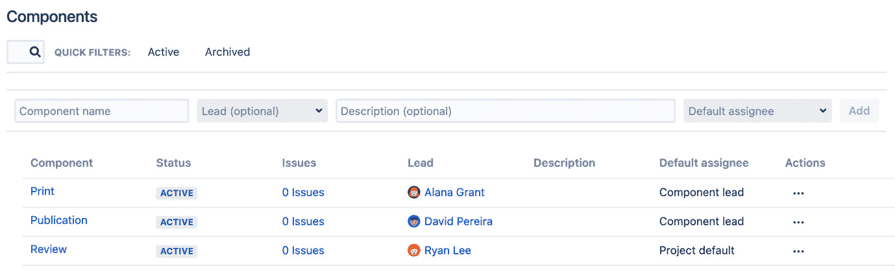
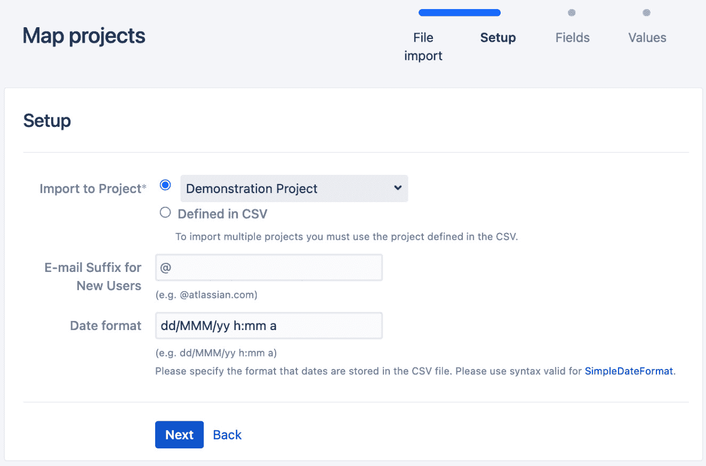
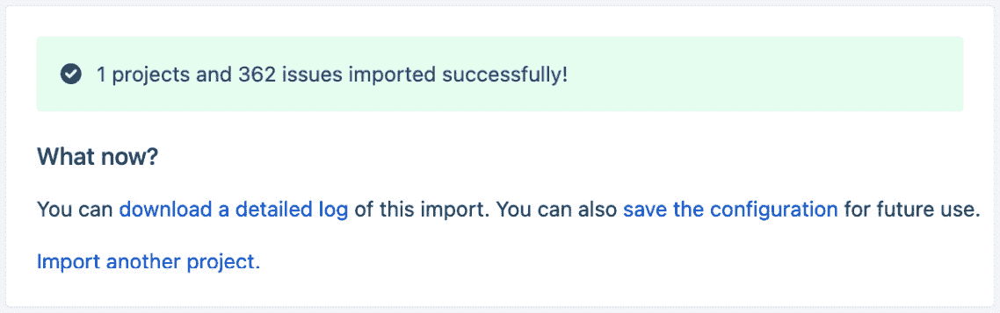

# 第二章：使用 Jira 进行商业项目

Jira 最初是作为一个缺陷跟踪系统开始的，帮助软件开发团队跟踪和管理他们项目中的问题/缺陷。随着产品的发展，人们开始将 Jira 用于其他用途。有些人将其作为通用任务管理解决方案，而另一些人则用它作为客户支持门户。Jira 还有其他创造性的用法，例如跟踪金融投资组合的表现。

在本章中，我们将了解项目和项目类型，重点关注最基本的 Jira 项目类型——**商业**项目。然后，我们将介绍 Jira 为管理员和日常用户提供的各种项目操作界面。我们还将介绍项目权限，在本书后续内容中将进一步扩展。由于商业项目是最基础的项目类型，因此本章中涉及的大部分概念也适用于更专业的项目类型。

在本章中，我们将涵盖以下主题：

+   理解项目和项目类型

+   Jira 权限

+   创建项目

+   项目用户界面

+   将数据导入 Jira

+   HR 项目

# 理解项目和项目类型

**项目**是使用 Jira 时最重要的概念之一。一个项目可以代表从组织中的部门或团队，到实际的软件项目或 IT 帮助台等任何东西。描述一个项目的一种方式是，它是一个由工作项组成的集合，这些工作项被称为**问题**。它有助于在用户创建和处理问题时提供上下文。例如，软件开发团队会在为他们正在开发的产品创建的项目中处理问题，而支持团队则会在帮助台项目中工作。

项目类型有助于定义项目的目的，并为用户提供量身定制的体验和一系列功能。例如，服务管理项目会具有**服务级别协议**（**SLA**）等功能，而软件开发项目则支持 Scrum 或 Kanban。

每种项目类型还会配备一个或多个模板，模板包含一组预定义的配置，帮助你快速入门。以下截图显示了从开箱即用的 Jira 安装中提取的项目类型及其模板：

图 2.1 – 创建项目

项目类型和模板的列表会有所不同，具体取决于你在 Jira 部署中安装并启用的功能。稍后我们将在本书中介绍如何添加额外的项目类型。目前，我们将重点关注**商业**项目类型，因为它是最基本的，而且它的大部分功能在其他项目类型中也有共享。

## 商业项目

如我们已经看到的，Jira 提供了多种项目类型，这取决于你拥有的功能。**业务**项目类型是开箱即用的，其模板主要集中在帮助用户轻松创建任务并跟踪和报告其进展。

前三种模板——**项目管理**、**任务管理**和**流程管理**——都带有预定义的配置，如工作流和字段。你可以直接使用这些模板，或根据你的需要进一步自定义它们。还有其他类型的项目，如**服务管理**和**软件开发**，我们将在本书后续部分进行讲解。

# Jira 权限

在我们深入探讨项目之前，我们需要了解一些关于权限的内容。权限是一个大话题，我们将在*第九章*，*保护 Jira*中详细讲解。现在，我们简要讨论与创建、浏览和管理项目相关的权限。

在 Jira 中，有多个权限级别：

+   **全局权限**：创建和删除项目以及管理 Jira 配置

+   **项目权限**：浏览和管理单个项目

+   **问题权限**：浏览单个问题

拥有 Jira 管理员全局权限的用户将能够创建和删除项目。默认情况下，Jira 管理员组中的用户拥有此权限，因此我们在安装过程中创建的管理员用户将在*第一章*，*Jira 数据中心入门*中，能够创建新项目。我们将称这些用户及任何其他拥有此权限的用户为**Jira 管理员**。

对于任何给定的项目，拥有该项目的**管理项目**权限的用户将能够管理项目的配置设置，正如我们将在本章后面看到的那样。这意味着拥有此权限的用户将能够访问给定项目的**项目设置**界面，从而更新项目的详细信息和配置。默认情况下，Jira 管理员将拥有此权限。

如果用户需要浏览某个项目的内容，则必须拥有该项目的**浏览项目**权限。这意味着用户将可以访问该项目的**项目浏览器**界面。默认情况下，Jira 管理员将拥有此权限。现在我们已经讲解了 Jira 权限的基础内容，接下来让我们看看如何在 Jira 中创建新项目。

# 创建项目

创建新项目的最简单方法是从顶部导航栏的**项目**下拉菜单中选择**创建项目**菜单选项。这将弹出**创建项目**对话框。请注意，如前所述，您需要是 Jira 管理员（例如，我们在安装过程中创建的用户）才能创建项目。仅在拥有此权限时，此选项才可用。

从**创建项目**对话框中，选择你想要使用的模板，在**业务**标题下并点击**下一步**。在下一页，Jira 会显示你所选模板的预定义配置。在我们的例子中，我们选择了**项目管理**模板，所以 Jira 会为我们提供两种问题类型以及一个包含三个步骤的非常简单的工作流。点击**选择**按钮继续，如下图所示：

图 2.2 – 项目管理 – 步骤 1

注意

创建项目后，你可以更改这些配置。

在第三步也是最后一步，我们需要为新项目提供详细信息。Jira 会帮助你验证这些信息，确保项目关键字唯一且符合要求的格式。填写完项目信息后，点击**提交**按钮创建新项目，如下图所示：

图 2.3 – 项目管理 – 步骤 2

以下表格列出了创建新项目时需要提供的信息：

| **字段** | **描述** |
| --- | --- |
| **名称** | 这是项目的唯一名称。 |
| **关键字** | 这是项目的唯一身份标识符。当你输入项目名称时，Jira 会根据名称自动填写关键字，不过你也可以用自己的关键字替换自动生成的关键字。你以后可以更改关键字。项目关键字也将成为项目中创建的问题的关键字的第一部分。 |
| **项目负责人** | 项目的负责人可以用于自动分配问题。每个项目只能有一个负责人。只有在 Jira 中有多个用户时，这个选项才会可用。 |

表 2.1 – 创建项目对话框信息

一旦创建了新项目，你将进入**项目浏览器**界面，我们将在后续章节中讨论这一部分内容。

你可能注意到，在**创建项目**对话框中，底部有三个额外的选项：

+   **导入项目**：这允许你从其他来源（如 CSV 文件）导入数据到新的或现有的 Jira 项目中。

+   **使用共享配置创建**：这允许你基于现有项目的配置创建一个新项目。这是一个快速创建基于标准配置集的项目的好方法，同时通过减少不同配置的数量来减少管理开销。

+   **创建示例数据**：这允许你创建一个新项目，并用一些示例问题填充它，以便你可以开始探索不同项目模板提供的各种功能。

我们将在*将数据导入 Jira*章节中介绍如何将数据导入项目。使用示例数据创建项目是测试新项目模板的好方法。

# 项目用户界面

Jira 中有两种不同的项目界面。第一种界面是为日常用户设计的，提供有关项目如何使用报告、统计和敏捷看板的有用信息。我们将这种界面称为**项目浏览器**界面。

第二种界面是为项目管理员设计的，用于控制项目配置设置，如权限和工作流；我们将这种界面称为**项目设置**界面。

创建项目后，首先看到的界面将是**项目浏览器**。我们将从查看该界面开始，然后再查看**项目设置**界面。

## 项目浏览器

项目浏览器会根据你创建的项目类型有所不同。对于业务项目，它相对简单。左侧面板有几个标签可供选择：

| **浏览器视图** | **描述** |
| --- | --- |
| **总结** | 该标签显示项目的快速概述。它有两种视图：**活动视图**和**统计视图**。 |
| **问题** | 这是你将主要使用的标签。它包含项目中的问题列表。你可以配置问题如何被包含在列表中，以及你希望显示哪些数据。 |
| **报告** | 该标签包含若干内置和自定义报告，你可以根据项目中的问题生成报告。可用的报告类型会根据项目类型的不同而有所变化。 |
| **版本** | 该标签显示项目版本的概述。仅在已配置版本时才可用此标签。 |
| **组件** | 该标签显示组件及其相关问题的概述。仅在项目已配置组件时，才可用此标签。 |
| **添加链接** | 在这里，你可以将其他链接添加到左侧面板中，例如与项目相关的重要文档或其他有用资源的链接。 |

表 2.2 – 项目浏览器标签

让我们更详细地看看这些标签。

## 总结标签

**总结**标签为你提供了你正在处理的项目的单页面视图。对于业务项目，它提供了活动视图，显示项目中正在发生的最新活动，以及统计视图，提供项目中问题的若干有用细分。例如，**未解决：按指派人**可以让你了解每个用户被指派的未解决问题数量，从而帮助项目团队进行资源分配计划，如下图所示：

图 2.4 – 总结标签

## 问题标签

默认情况下，**问题**标签会列出项目中所有未解决的问题。它还包含若干预定义的过滤器，供你用来查找问题。在这里，你可以选择单个问题并获取更多信息，如下图所示：

图 2.5 – 问题标签

## 版本和组件标签

**版本**和**组件**标签分别列出了为该项目配置的所有可用版本和组件。如果项目包含版本和/或组件，这两个视图才会可见。稍后我们将了解如何使用它们。

## 项目设置

**项目设置**界面是项目管理员可以管理项目设置和配置的地方。例如，您可以更改项目的名称和关键字，选择可用于项目的问题类型，以及管理项目中的组件列表。只有具有指定项目的**管理项目**权限的用户才能访问此界面。

要访问**项目设置**界面，请按照以下步骤操作：

1.  转到要管理的项目的**项目浏览器**界面。

1.  在左下角选择**项目设置**选项。如果您没有看到此选项，则说明您没有必要的权限。

在**项目设置**界面中，您将能够执行以下关键操作：

+   更新项目详情，例如项目名称、描述、头像和类型

+   管理用户在项目中工作时所看到的内容，如问题类型、字段和屏幕

+   配置项目使用的工作流

+   控制权限设置和通知

+   管理可用组件和版本的列表

上述关键操作可以在以下截图中看到：

图 2.6 – 项目设置

作为项目管理员，您将在此应用项目的自定义设置；您可以在左侧面板中找到所有选项。当您创建项目时，Jira 将根据您选择的模板自动为您创建这些配置。让我们来看看每个选项。

### 项目详细信息标签

第一组选项包括**总结**、**详细信息**、**审计日志**、**重新索引项目**和**删除项目**。让我们更详细地了解这些选项：

+   **总结**：显示项目当前所有配置设置的单页视图。

+   **详细信息**：允许您更改项目的一般信息，包括项目关键字、类型、头像、描述和类别。

+   **审计日志**：这是 Jira 数据中心中的一项新功能，它会显示对项目所做的配置更改列表（请注意，这不包括对问题所做的更改）。它会显示更改的内容、更改发生的时间以及谁进行了更改。

+   **重新索引项目**：此功能重新索引项目，以更新该项目中问题的搜索索引。每当项目配置发生更改时，例如添加新字段时，您应该执行此操作。

+   **删除项目**：此功能会删除项目及其所有问题。此操作无法撤销。

### 组件标签

**组件** 标签是项目管理员可以管理其项目组件的地方。组件可以看作是构成完整项目的子部分。在一个业务项目中，组件可以是需要完成的各种业务功能或操作。如以下截图所示，当前项目中已配置了三个组件：

图 2.7 – 组件

组件在 Jira 中是项目特定的。这意味着一个项目中的组件不能在另一个项目中使用。这也允许每个项目维护自己的一套组件。一个组件有四个信息项，如下表所示：

| **字段** | **描述** |
| --- | --- |
| **名称** | 这是组件的唯一名称。 |
| **描述** | 描述是可选的，但可以解释该组件的用途。 |
| **负责人** | 这是一个可选字段，你可以选择一个用户作为该组件的负责人。例如，在一个软件项目中，这可以是该组件的主要开发人员。 |
| **默认受派人** | 该字段告诉 Jira，当创建一个没有选择受派人的问题时，如果该问题有一个组件，Jira 将自动将问题分配给选定的默认受派人。 |

表 2.3 – 组件字段

组件的一个有用功能是能够为每个组件分配一个默认受派人。这意味着，当用户创建一个带有组件的问题并将受派人设置为**自动**时，Jira 将能够根据所选组件自动分配该问题。这对于成员之间彼此不太了解的组织来说是一个非常有用的功能。因此，在创建时分配问题时，他们通常发现很难决定将其分配给谁。此功能可以设置为组件的负责人成为默认受派人。这意味着已经提出的问题可以委派给团队中的其他成员。

注

如果问题有多个组件并且每个组件都有默认的受派人，则将使用按字母顺序排列的第一个组件的受派人。

### 版本标签

与**组件**标签一样，**版本**标签允许项目管理员管理其项目的版本。版本作为项目的里程碑。在项目管理中，版本代表时间节点。尽管对于非产品导向的项目来说，版本可能看起来不太相关，但在管理和跟踪问题与工作进度时，版本仍然可以发挥重要作用。

与组件一样，版本也有几个属性，如下表所示：

| **字段** | **描述** |
| --- | --- |
| **名称** | 这是版本的唯一名称。 |
| **描述** | 描述是可选的，但可以解释该版本的用途。 |
| **开始日期** | 这是一个日期指示，表示预计开始处理该版本的时间。 |
| **发布日期** | 这是一个可选日期，标记为版本发布的计划日期。如果版本没有按照发布日期发布，其日期将以红色突出显示。 |

表 2.4 – 版本字段

版本主要用于软件开发项目，其中软件产品有一个发布版本。它对业务项目的适用性较低，但如果需要跟踪版本，例如文件，您可以使用此标签来跟踪与特定版本相关的任务。

### 其他标签

在**项目设置**界面中还有几个其他标签。我们不会在本章中探讨这些标签，因为它们将在单独的章节中讨论。然而，我们将简要了解每个标签的作用，如下表所示：

| **标签** | **描述** |
| --- | --- |
| **问题类型** | 该标签控制用户可以为项目创建的问题类型。例如，这可能包括错误、改进和任务。**问题类型**将在*第四章*中讨论，*处理问题*。 |
| **工作流** | 该标签控制我们将要处理的工作流问题。工作流由一系列步骤组成，通常模拟组织中现有的流程。工作流将在*第七章*中讨论，*工作流和业务流程*。 |
| **屏幕** | **屏幕**是用户在 Jira 中查看、创建和编辑问题时看到的界面。**屏幕**将在*第六章*中讨论，*屏幕管理*。 |
| **字段** | 这些是 Jira 在用户创建问题时用来捕获数据的字段。Jira 提供了一组默认字段，Jira 管理员可以根据需要添加额外的字段。字段将在*第五章*中讨论，*字段管理*。 |
| **用户和角色** | 项目管理员可以在项目中定义角色并将用户分配给这些角色。这些角色可以用于控制权限和通知。角色将在*第九章*中讨论，*保护 Jira*。 |
| **权限** | 正如我们已经看到的，权限定义了谁可以执行某些任务或访问 Jira。权限将在*第九章*中讨论，*保护 Jira*。 |
| **问题安全** | Jira 允许用户通过选择问题安全级别来控制谁可以查看他们创建的问题。问题安全将在*第九章*中讨论，*保护 Jira*。 |
| **通知** | Jira 可以在某些事件发生时发送电子邮件通知。例如，当问题被更新时，Jira 可以向所有参与的用户发送邮件通知。通知将会在*第八章*，“*电子邮件和通知*”中进行详细讲解。 |

表 2.5 – 项目设置选项卡

现在我们已经了解了 Jira 的两种用户界面，让我们学习如何将数据导入 Jira。

# 导入数据到 Jira

Jira 允许你从其他来源导入数据，例如其他问题跟踪系统，并告诉你数据是否可以导出为支持的格式，如 CSV 或 JSON。所有导入工具都有向导驱动的界面，帮助你完成一系列步骤。这些步骤大致相同，但也有一些不同。一般来说，导入数据到 Jira 需要四个步骤，如下所示：

1.  选择你的源数据——例如，CSV 文件。

1.  选择一个目标项目，导入的问题将被放入该项目中。这个项目可以是一个现有的项目，也可以是一个即时创建的新项目。

1.  将源字段（例如，CSV）映射到 Jira 字段。

1.  将源字段的值映射到 Jira 字段值。这通常需要针对基于选择的字段进行操作，例如优先级字段或选择列表字段。对于文本和数字字段，这不是必需的。

现在，让我们看看如何使用 CSV 文件导入数据。

## 通过 CSV 导入数据

Jira 提供了一个 CSV 导入工具，可以让你以**逗号分隔值**（**CSV**）格式导入数据。这是一个非常实用的工具，因为大多数系统都可以以这种格式导出数据。你也可以使用这个工具将 Excel 表格转换成 CSV 文件。

在将 CSV 文件导入 Jira 之前，你需要确保正确格式化数据。以下是导入数据之前必须验证的项目清单：

+   每一行必须作为一个单独的问题导入，因此请确保每一行都包含问题的所有值。

+   每一列应该对应到一个 Jira 字段。这个字段可以是系统字段，也可以是自定义字段。

+   至少，你需要为必填字段提供值，例如问题摘要。

+   所有日期或日期时间值需要采用一致的格式。

+   如果某一列需要映射到用户字段（例如，指派人），请确保使用正确的用户名值。

+   如果某一列需要映射到基于选择的字段（例如选择列表或复选框），请确保检查值的拼写。

一旦你格式化好了 CSV 文件，按照以下步骤将其导入 Jira：

1.  从**项目**下拉菜单中选择**导入外部项目**选项。

1.  点击**CSV**选项。这将启动导入向导。

1.  现在，你需要通过点击**选择文件**按钮，选择包含你要导入数据的 CSV 文件。

1.  选择源文件后，你可以展开**高级**部分，选择 CSV 文件使用的文件编码和分隔符。还有**使用现有配置文件**选项，稍后我们会在本节中讲解。

1.  点击**下一步**按钮继续，如下图所示：

图 2.8 – CSV 文件导入

1.  接下来，你需要选择要将数据导入的项目。你也可以选择**创建新项目**选项，在此创建一个新的项目。

1.  如果你的 CSV 文件包含日期相关的数据，确保在**日期格式**字段中输入所使用的格式。

1.  点击**下一步**按钮继续，如下图所示：

图 2.9 – 映射项目

1.  接下来，你需要将 CSV 字段（列）映射到 Jira 中的字段。并非所有字段都需要映射。如果你不想导入某一列的数据，只需不将该 CSV 字段映射到 Jira 字段即可。

1.  对于包含需要手动映射的数据的字段，例如选择列表字段，你需要勾选**映射字段值**复选框。这将允许你将 CSV 字段值映射到 Jira 字段值，以便正确导入。如果你没有手动映射这些值，它们将被原样复制。对于像选择列表这样的字段，将会自动创建新的选项。

1.  点击**下一步**按钮继续，如下图所示：

图 2.10 – 映射字段

1.  最后，你需要将 CSV 字段值映射到 Jira 字段值。只有在*步骤 10*中勾选了**映射字段值**复选框的字段，才需要执行此步骤：

    1.  输入每个 CSV 字段值对应的 Jira 字段值。

    1.  当你完成字段值映射后，点击**开始导入**按钮开始实际的导入过程，如下图所示。根据你的数据大小，完成这个过程可能需要一些时间：

图 2.11 – 映射值

1.  一旦导入过程完成，你会收到一个确认信息，告知你已经导入的问题数量，如下图所示。这个数字应该与你在 CSV 文件中的记录数量匹配：

图 2.12 – 完成的导入过程

在最后的确认页面上，你可以点击**下载详细日志**链接，下载包含所有导入过程信息的完整日志文件。如果导入没有成功，这个功能特别有用。

您还可以点击**保存配置**链接，这将生成一个包含您为此次导入所做所有映射的文本文件。如果您将来需要进行类似的导入，您可以使用此导入文件，从而不必重新进行所有的手动映射。要使用此配置文件，请选中**使用现有配置文件**选项，该选项会出现在*第 4 步*中。

正如我们所看到的，Jira 的项目导入器使得从其他系统导入数据变得非常简便。在接下来的部分，我们将学习如何存档旧项目，以帮助提高 Jira 的性能。

# 存档项目和问题

随着您继续使用 Jira，用户将会注意到 Jira 的性能会随着时间的推移而逐渐下降。比较明显的例子包括加载 Jira 仪表盘和搜索问题。数据量确实是影响 Jira 性能的一个重要因素——项目、问题和相关配置（如自定义字段）越多，Jira 需要处理的数据就越多，最终用户的使用速度就会越慢。存档旧的和未使用的项目通常是解决此问题的有效方法。

在 Jira 数据中心之前，存档一个项目需要您导出并完全删除项目，或者通过移除用户权限来隐藏该项目及其问题。两种方法都很复杂且容易出错。

在 Jira 数据中心，现在有一个内置的存档功能，使得存档过程简单且可靠。要存档一个项目，请按照以下步骤操作：

1.  使用管理员账户登录 Jira。

1.  浏览到**管理** | **项目**。

1.  选择您希望存档的项目的**存档**选项，如下所示：

图 2.13 – 存档一个项目

1.  在提示时确认您要存档该项目：

图 2.14 – 存档项目 – 确认

一旦项目被存档，它将不再出现在最终用户的列表中。存档项目中的问题将不会出现在任何搜索结果中。然而，如果您有该问题的直接链接，仍然可以访问它，尽管无法进行任何更改。通过存档一个项目，与该项目相关的所有数据（如问题）将从 Jira 的搜索索引中移除。这将保持索引大小较小，并提高整体性能。

如果您需要恢复一个已存档的项目，请按照以下步骤操作：

1.  浏览到**管理** | **项目** | **存档项目**。

1.  选择您希望恢复的项目的**恢复**选项。

1.  进入恢复的项目并点击**开始项目重新索引**按钮。

由于存档后的项目将其数据从 Jira 的搜索索引中移除，因此在项目的问题显示在搜索结果中之前，您需要重新索引该项目。

值得注意的是，归档项目与删除项目之间的一个区别是，归档项目时，与项目相关的任何配置仍被视为在使用中，因此不能删除它们。这是因为 Jira 需要确保在取消归档项目时，所有配置仍然可用。

# 人力资源项目

现在我们已经了解了构成项目的所有关键方面，让我们回顾一下迄今为止学到的内容，并付诸实践。在本练习中，我们将为**人力资源**（**HR**）团队设置一个项目，帮助他们跟踪和管理员工的入职与离职，以及与招聘过程相关的任务。

## 创建新项目

首先，我们将为 HR 团队创建一个新项目。按照以下步骤创建项目：

1.  通过从**项目**下拉菜单中选择**创建项目**选项，打开**创建项目**对话框。

1.  选择**任务管理**项目模板。我们可以在**业务**项目类型中使用其他模板，但**任务管理**模板是最简单的选项，并且将使未来的自定义更加容易。

1.  将我们的新项目命名为`Human Resource`，并接受**关键字**和**项目负责人**的其他默认值。

1.  点击**提交**按钮以创建新项目。

此时，您将进入新项目的**项目浏览器**界面。

## 创建新组件

现在我们的新项目已经就绪，我们需要创建几个组件。这些组件将作为我们任务的分组。我们需要执行以下步骤来创建新组件：

1.  点击左下角的**项目设置**选项。

1.  从**项目设置**界面，选择**组件**标签。

1.  为新组件输入`Employee Onboarding`作为名称。

1.  为新组件提供简短的描述。

1.  选择一个用户作为组件负责人。

1.  点击**添加**以创建新组件。

1.  添加更多组件。

使用**业务**项目类型创建的项目，默认情况下不显示组件，因此我们需要手动将**组件**字段添加到相应的屏幕中。我们将在*第三章*、*字段管理*以及*第六章*、*屏幕管理*中分别讨论字段和屏幕。现在，按照以下步骤，在创建、编辑和查看任务时显示我们的组件：

1.  从**项目管理**界面，选择**屏幕**标签。应显示三个屏幕，如下图所示：

图 2.15 – 项目屏幕

1.  点击**HR: 任务管理创建问题屏幕**。这将打开**配置屏幕**页面，列出当前在所选屏幕上的字段。

1.  在页面底部的选择框中输入并选择**组件**；这将把**组件**字段添加到屏幕中。

1.  重复*步骤 2*和*步骤 3*以进行**HR:任务管理编辑/查看问题屏幕**。

## 将一切整合起来

现在您已经完全准备好您的项目，让我们通过创建一个问题来看一切是如何整合的，如下所示：

1.  点击顶部导航栏中的**创建**按钮。这将弹出**创建问题**对话框。

1.  选择**人力资源**作为**项目**，选择**任务**作为**问题类型**。

1.  用一些虚拟数据填写字段。请注意，**组件**字段应该显示我们刚才创建的组件。

1.  点击**创建**按钮以创建问题。

如果一切操作正确，您应该看到类似下面的对话框，您可以选择您的新项目以创建问题，并选择可以选择的新组件：

图 2.16 – 创建问题

您可以通过将**受让人**字段设置为**自动**并选择一个组件来测试默认受让人功能；Jira 会自动将问题分配给该组件定义的默认受让人。如果一切顺利，问题将在新项目中创建。

# 总结

在本章中，我们探讨了 Jira 中最重要的概念之一——项目，以及如何创建和管理它们。我们介绍了权限，并查看了与创建、浏览和管理项目相关的三种权限。我们还了解了 Jira 数据中心中引入的非常有用的项目归档功能，以及如何利用它通过归档未使用的项目来帮助提高 Jira 性能。

我们还介绍了 Jira 为项目管理员和日常用户提供的两个界面——**项目设置**界面和**项目浏览器**界面。在下一章中，我们将学习如何使用**软件**项目类型创建项目，以便启用 Scrum 和 Kanban 来进行敏捷项目管理。

# 第二部分：Jira 实战

在本节中，您将学习如何使用 Jira。您将熟悉处理不同问题的技巧，探索字段、创建新屏幕、管理工作流以及设置进出邮件服务器。

本节包括以下章节：

+   *第三章*，*使用 Jira 进行敏捷项目管理*

+   *第四章*，*处理问题*

+   *第五章*，*领域管理*

+   *第六章*，*屏幕管理*
