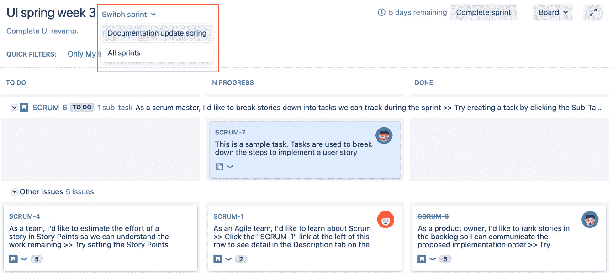
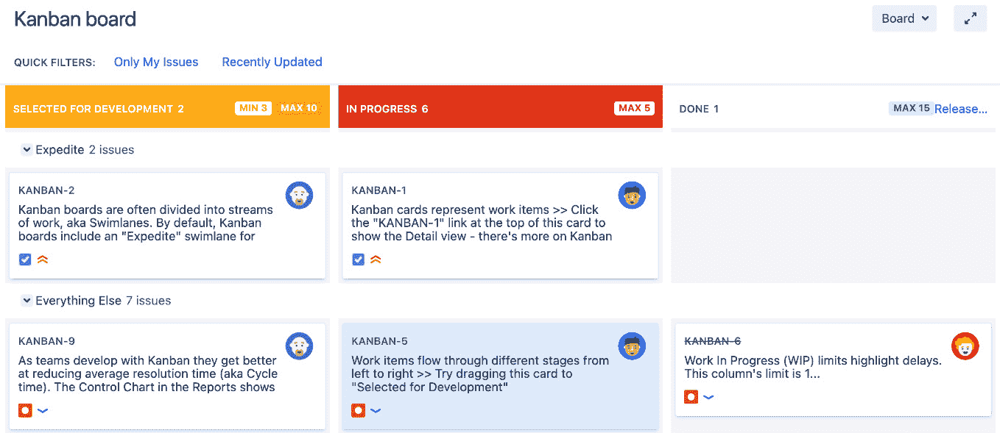

# 3

# 使用 Jira 进行敏捷项目管理

在上一章中，我们了解了 Jira 项目的基础知识，并使用 Jira 进行常规的任务管理。在本章中，我们将重点介绍如何使用 Jira 来进行**敏捷软件开发项目**，包括**Scrum**、**Kanban** 和 **Kanplan**。我们将简要概述每种敏捷方法，并看看如何在 Jira 中使用它们。

在本章中，我们将涵盖以下主题：

+   获取 Scrum 和 Kanban 的概述

+   在 Jira 中运行 Scrum 项目

+   在 Jira 中运行 Kanban 项目

+   配置敏捷看板

+   管理待办事项

+   为你的项目创建新的敏捷看板

+   在你的看板上包含多个项目

# 获取 Scrum 和 Kanban 的概述

Scrum 和 Kanban 是 Jira 支持的两种敏捷软件开发方法。如果你已经熟悉 Scrum 和 Kanban，可以跳过这一部分。不过，如果你来自传统的瀑布模型并且是敏捷方法的新手，下面是它们的快速概述。我强烈建议你获取更多的资源来深入了解每种方法。一个很好的起点是 Atlassian 敏捷教练，可以在 [`www.atlassian.com/agile/about`](https://www.atlassian.com/agile/about) 找到。我们将在本节中快速回顾 Scrum 和 Kanban。

## Scrum

**Scrum** 不同于瀑布模型，它强调迭代的概念。使用 Scrum，项目被分为多个迭代，称为**sprint**，每个 sprint 持续 2 到 4 周，目标是在每个 sprint 结束时，交付一个经过充分测试并且可能可交付的产品。

在每个 sprint 开始时，产品负责人和团队会聚在一起，进行所谓的**sprint 规划会议**。在会议中，会决定下一个 sprint 的范围。通常包括待办事项列表中的优先级最高的任务，待办事项列表中包含所有未完成的工作。

在每个 sprint 中，团队每天都会开会，回顾进展，标记任何潜在的问题或障碍，并计划如何解决这些问题。这些会议通常很简短，目标是确保团队中的每个人都在同一页上。

在 sprint 结束时，团队会聚集在一起，回顾 sprint 的结果，看看哪些做得好，哪些没有做好。目标是找出改进的地方，这些反馈将被用来优化未来的 sprint。这个过程会持续，直到项目完成。

## Kanban

**Kanban** 与 Scrum 不同，后者按迭代进行，而 Kanban 更加注重实际交付的执行。它强调从开始到结束可视化交付工作流程，限制每个工作流程阶段的工作项数量，并衡量交付的提前时间。

使用看板时，重要的是能够直观地看到工作项如何通过工作流，识别效率低下和瓶颈的地方，并进行改进。这是一个持续的过程，工作从一端进入，从另一端流出，确保事情尽可能高效地进行。

# 在 Jira 中运行 Scrum 项目

Scrum 是我们将要介绍的第一个敏捷方法。使用 Jira 时，Scrum 项目主要由两个部分组成——待办事项，您和团队将在这里进行大部分的规划，和活跃冲刺的敏捷看板，团队将使用它来跟踪当前冲刺的进度。让我们从在 Jira 中创建一个新的 Scrum 项目开始。

## 创建 Scrum 项目

在 Jira 中使用 Scrum 的第一步是使用 Scrum 模板创建一个项目。按照以下步骤操作：

1.  从 **项目** 下拉菜单中选择 **创建项目** 选项。

1.  选择 **Scrum 软件开发** 模板并点击 **下一步**：

图 3.1 – 创建 Scrum 项目

1.  接受设置并点击 **下一步**。

1.  输入新项目的名称和关键字，并点击 **提交**。

创建新 Scrum 项目后，您将进入 Scrum 界面，如下图所示：

图 3.2 – Scrum 界面

Scrum 界面有以下几个主要部分：

+   **待办事项**：这是存放所有未计划问题的地方。你可以将它看作是一个待办清单。产品负责人和开发团队将共同确定待办事项中问题的优先级，然后将这些问题安排到冲刺中进行交付。

+   **活跃冲刺**：此视图显示当前进行中的冲刺以及属于这些冲刺的问题。这是开发团队每天使用的工具，用于跟踪他们的进展。

+   **报告**：此视图包含几个报告，您可以生成这些报告来查看项目的表现。这些报告帮助您和团队可视化项目的进展，并提供有价值的反馈，供未来的冲刺规划会议中改进使用。

让我们仔细看一下这些部分，从待办事项开始。

## 使用待办事项

待办事项是您项目的待办清单，存放着所有未完成的功能（通常以故事的形式表示）和任务。当您刚开始时，待办事项可能是空的，因此第一步是产品负责人和团队共同合作，将需要完成的故事和任务添加进去。在此过程中，更多的是像一个头脑风暴会议，团队合作将客户和其他利益相关者的需求转化为可操作的故事和任务。

## 优先级排序和工作估算

一旦你填充了待办事项，下一步就是*评估和优先排序问题*，以便你能够规划并制定一个如何完成这些问题的时间表。在 Jira 中，优先排序待办事项意味着通过拖动问题上下调整其位置。要提高问题的优先级，你可以简单地将它拖到待办列表的更高位置。虽然通常是产品负责人负责优先排序哪些功能先交付，但团队也应参与此过程，以确保大家在项目方向上保持一致。

*估算工作量*是 Scrum 中至关重要的一部分，冲刺的成功很大程度上取决于你和你的团队如何进行估算。人们经常混淆的一点是，他们倾向于将估算看作时间的衡量——例如，故事 A 需要 5 小时完成，故事 B 需要 10 小时。虽然这乍看起来是正确的，但通常发生的情况是，人们会更加努力地工作以使估算看起来准确，或者因为对任务不确定而给出较大的估算。这可能会导致项目进展中的问题，因为没有人愿意被认为是那个无法提供可靠估算的人，或者是因为估算超出范围而低效的人。

避免这个陷阱的一种方法是使用一种不同的估算方法，叫做**故事点**，这是 Jira 中的默认估算方法。这背后的想法是根据问题的复杂度来衡量和估算，而不是仅仅根据完成它们所需的时间。因此，如果你以 10 个故事点的总量开始冲刺，并且在冲刺结束时未能完成所有任务，这可能意味着你的预期过于激进，可能需要降低期望。由于估算不是基于所用时间，它只是表明问题可能太复杂，你需要将其拆分成更易处理的部分。这有助于防止人们感觉自己一直在与时间赛跑，并帮助你更好地定义和拆分任务，使其更易于管理。

然而，有时候你可能会发现很难估算故事的复杂度。这通常意味着你对故事没有足够的信息，或者故事的范围太大，需要进行拆分。团队应意识到这一点，并且不要回避重新提问，确保在提供估算之前，完全理解故事的目的。

现在我们已经确定了估算问题的方法，可以继续进行。输入估算值的操作非常简单，像这样进行：

1.  从待办事项中选择一个问题进行评估。

1.  在**估算**字段中输入故事点的数量，如下截图所示：

图 3.3 – 故事点

一旦问题被添加到活跃的冲刺中，你不应该更改估算。冲刺中期更改估算可能导致冲刺规划阶段的估算不准确，进而影响未来的改进。

## 创建新的冲刺

在积压列表已填充并且问题已估算完毕后，下一步是为团队创建一个冲刺开始工作。请注意，你需要拥有**管理冲刺**权限才能创建新的冲刺。权限将在*第九章*中讲解，*Jira 安全性*。

创建新冲刺的步骤如下：

1.  转到项目的积压列表。

1.  点击**创建冲刺**按钮。

1.  输入冲刺的名称。

1.  选择冲刺的持续时间并点击**创建**按钮。通常来说，你希望保持冲刺时间较短，1 到 2 周是一个不错的长度。

1.  通过拖放已由团队优先排序的问题到冲刺框中，将问题添加到冲刺中，如下图所示：

图 3.4 – 创建冲刺

一旦团队决定了冲刺的范围，就该开始冲刺了：

1.  点击**开始冲刺**按钮。

1.  更新冲刺的持续时间是必要的。点击**开始**按钮以启动你的冲刺，如下截图所示：

图 3.5 – 启动新的冲刺

如果你希望自行指定冲刺的结束日期，而不是使用自动计算的日期，可以选择**自定义**选项来设置冲刺的持续时间。

一旦冲刺开始，你可以进入活跃冲刺视图，团队可以开始进行交付工作。

如果**开始冲刺**按钮是灰色的，意味着你已经有一个正在进行的活跃冲刺，并且没有启用并行冲刺选项，或者你没有**管理冲刺**的权限。权限将在*第九章*中讲解，*Jira 安全性*。

通常情况下，每次只有一个团队在项目上工作，但如果你的团队很大，并且不同的人可以同时处理项目的不同部分，你需要启用**并行冲刺**选项：

1.  以管理员身份登录 Jira。

1.  浏览 Jira 管理控制台。

1.  选择**应用程序**选项卡，然后选择**Jira 软件配置**。

1.  勾选**并行冲刺**选项以启用它。

启用**并行冲刺**选项后，你可以同时启动多个冲刺。在运行多个冲刺时，最好将它们分开，以免相互干扰。一个好的例子是同时进行两个专注于项目不同领域的冲刺，比如交付和文档。

当你有并行冲刺时，由于活跃冲刺视图（见下一节）一次只会显示一个冲刺，你需要在冲刺之间切换，如下所示的截图：

](img/B18644_03_06.jpg)

图 3.6 – Scrum 冲刺

创建了冲刺后，让我们看看冲刺期间会发生什么。

## 运行冲刺

一旦团队在冲刺计划会议中优先排序了问题并启动了冲刺，敏捷板将切换到活跃冲刺视图。对于普通团队，在任何给定的时间，你将有一个活跃冲刺，且你的活跃冲刺板将如下所示：

](img/B18644_03_07.jpg)

图 3.7 – 活跃冲刺板

在 Scrum 板上，每个问题都表示为一张卡片，板本身由垂直列组成，代表问题可能处于的各种状态，并与项目所使用的工作流相匹配。因此，在我们的示例中，我们有默认的工作流，包含三个状态——**待办**、**进行中**和**已完成**。正如稍后所见，项目管理员将能够自定义这些状态。团队成员在工作和完成任务时，将问题卡片移动到相应的列中。

该看板还可以被分为几个水平行，称为**泳道**。这些泳道帮助你将类似问题进行分组，使你的看板更易于理解。在我们的示例中，我们根据故事将问题分组到泳道中。与列一样，项目管理员可以自定义如何定义泳道。

当冲刺进行时，避免通过添加更多问题到冲刺中来引入范围蔓延是很重要的，Scrum Master 和产品负责人有责任确保团队不被干扰或阻塞。然而，偶尔会出现紧急情况，要求加入某些功能或修复，这时可以从待办事项视图中将新问题添加到活跃冲刺中。

然而，请记住，这不应该成为一种常见习惯，因为它会分散注意力，通常是冲刺计划不当或与利益相关者沟通不良的标志。因此，每当你尝试将更多问题添加到活跃冲刺时，Jira 会提示你，如下所示的截图：

](img/B18644_03_09.jpg)

图 3.8 – 冲刺范围蔓延

在冲刺结束时，你需要通过以下步骤来完成冲刺：

1.  进入 Scrum 板并点击**活跃冲刺**。

1.  点击**完成冲刺**链接，如下所示的截图所示：

](img/B18644_03_09.jpg)

图 3.9 – 完成冲刺

1.  点击**完成**按钮以结束冲刺。

一旦你在 Jira 中完成了一个冲刺，任何未完成的问题将被放回待办事项列表。有时，你可能会有一些计划但尚未激活的冲刺；在这种情况下，当前激活冲刺中未完成的问题可以自动添加到下一个可用的冲刺中。

当你只剩下一个问题要完成时，可能会想把冲刺延长几天。虽然这不是硬性规定，但你应该尽量避免这样做，只需将未完成的问题返回到待办事项列表，并在下次冲刺会议中重新安排优先级。因为 Scrum 是一个迭代过程，目标不是让每个人拼命工作，而是能够回顾团队在上一个冲刺中做对了什么和/或做错了什么，并在下一个冲刺中改进。也许这样做的原因是由于估算不准确或在需求收集过程中做了不正确的假设。关键是，团队应该把这看作是一次改进的机会，而不是急于完成的失败。简单地延长当前冲刺以容纳未完成的事项，可能会变成一个恶性循环，冲刺延长成为常态，而根本问题却被掩盖。

# 在 Jira 中使用看板管理项目

现在我们已经了解了如何通过 Scrum 运行项目，是时候看看 Jira 支持的另一种敏捷方法论——看板了。与 Scrum 相比，看板对于刚接触敏捷的团队来说可能是一个更简单的入门方法。与有待办事项列表并要求团队在冲刺中进行优先级排序和交付计划的 Scrum 不同，看板完全专注于执行和衡量工作流量。

在 Jira 中，典型的看板板与 Scrum 板相比有以下不同：

+   默认情况下没有待办事项视图。由于看板没有冲刺规划阶段，因此你的看板本身就充当了待办事项列表。稍后我们会在本章中看到如何为看板启用待办事项。

+   没有活动冲刺。看板的核心思想是有一个持续的工作流。

+   Scrum 和看板有不同类型的报告，分别为每种方法论量身定制。

+   列可以设置最小值和最大值的约束。

+   如果违反了约束条件，列会被突出显示。如以下截图所示，由于违反了约束条件，**开发选择**和**进行中**这两列都被突出显示：

图 3.10 – 看板板

现在我们已经了解了在 Jira 中看板项目的样子，让我们学习如何创建一个看板项目。

## 创建看板项目

在 Jira 中使用看板的第一步是创建一个看板模板的项目。按照以下步骤操作：

1.  从**项目**下拉菜单中选择**创建项目**选项。

1.  选择**看板软件开发**模板并点击**下一步**，如下图所示：

图 3.11 – 创建一个看板项目

1.  接受设置并点击**下一步**。

1.  输入新项目的名称和关键字，然后点击**提交**。

创建完看板项目后，你将进入看板视图，这与 Scrum 看板的活跃冲刺视图非常相似。记住，在看板中，就好像你在进行一个永无结束的冲刺，或者直到整个项目完成时才结束。因此，敏捷看板本身的重点是帮助你和你的团队执行交付。

## 使用看板

如前所述，使用看板时默认情况下没有冲刺计划，因此，一切都直接发生在看板上，而不是在待办事项列表中。操作看板非常简单；新创建的问题会直接添加到看板的第一列，默认名为**待办事项**，因为它充当着你看板中的待办事项列表。团队成员会从**待办事项**列中抓取问题，指派给自己，并将其推进工作流。在各个阶段，问题可能需要重新指派给其他用户——例如，当一个问题从开发阶段转到测试阶段时，它可能会被重新指派给测试工程师。随着越来越多的问题完成，你可以配置看板，在一段时间后自动将已完成的问题从看板上移除，或者进行发布，这会将**已完成**列中的所有问题从看板上移除（仍然存在于系统中）。第一个选项适用于使用看板进行一般任务管理的团队，而使用发布功能更适合软件开发，其中版本可以发布。

让我们看一下看板的一个示例，如下图所示，在其中我们可以看到，在**开发中**和**测试中**阶段都存在问题。**开发中**阶段用*红色*标出，意味着我们那里有足够的工作量，这是瓶颈的迹象。**测试中**阶段用*黄色*标出，意味着我们没有足够的工作量，这是低效的迹象：

图 3.12 – 看板

通过这个功能，看板可以直观地告诉我们在哪些地方遇到问题，从而使我们能够集中注意力解决这些问题区域。在**开发中**阶段的瓶颈可能意味着我们缺乏足够的开发人员，从而导致**测试中**阶段的低效，在这一阶段，测试人员可能只是坐着等待工作流过来。

这引出了一个常见问题——我的列的正确限制应该是什么？简短的回答是：在实践中尝试并进行实验。

长期的答案是，没有单一正确的灵丹妙药答案。你需要理解的是，许多因素会影响团队的吞吐量，比如团队的规模、成员的加入或离开、以及手头的任务。在我们的示例中，简单的解决方法是降低两个列的限制，然后就完成了。但通常来说，找到问题的根本原因同样重要，而不是仅仅试图修复看板本身。也许你应该尝试的是增加更多的开发人员，以便能够跟上交付所需的节奏。这里的要点是，看板可以帮助你找出问题的领域，而由你和你的团队去找出原因并找到合适的解决方案。

## 启用看板的待办事项

对于那些来自 Scrum 的用户来说，缺少一个适当的待办事项可能会让人感到不舒服，或者随着项目的增长，所有新问题都显示在看板的**待办事项**栏中会变得太臃肿。好消息是，Jira 支持看板和 Scrum 的混合方法，叫做**Kanplan**，它允许你为看板项目配置待办事项。

要将 Scrum 风格的待办事项添加到你的看板项目中，你只需将适当的状态映射到看板**待办事项**栏中。请按照以下步骤操作：

1.  浏览你项目的敏捷看板。

1.  点击**看板**菜单并选择**配置**选项。

1.  从左侧导航面板中选择**列**选项。默认情况下，有一个名为**待办事项**的列。

1.  删除**待办事项**列。

1.  将现在未映射的**待办事项**状态从右侧的**未映射状态**列拖动并放置到左侧的看板待办事项栏中，如下图所示：

图 3.13 – 配置看板待办事项

在看板**待办事项**栏中映射了状态后，你现在将拥有一个看起来和运作方式都像 Scrum 项目的待办事项，而且任何新创建的问题都会被添加到待办事项中，因为它们会处于待办事项工作流状态，如下图所示：

图 3.14 – 看板待办事项

你可以将多个状态映射到待办事项栏中，正如我们在*第七章*《工作流与业务流程》中看到的那样，当我们深入讨论工作流时，你可能会有一个更复杂的流程，且处于不同状态的问题可以出现在待办事项中。为看板配置待办事项的另一个好处是，如果你有成百上千个问题，Jira 这样显示它们比在看板上显示要更快、更高效。

由于您的待办事项中可能有数百个问题，因此待办视图还提供了一个快速搜索栏，允许您快速筛选并查找需要的问题。如果您的问题已分配给史诗和版本，您还可以使用**史诗和版本**面板来显示与您选择的史诗和版本相关的问题。

现在我们已经了解了如何使用 Jira 运行 Scrum 和 Kanban 项目，让我们看看如何定制我们的敏捷看板。

# 配置敏捷看板

Jira 的敏捷看板高度可定制，许多定制选项利用了 Jira 的核心功能，如工作流。如果您不熟悉它们，请不用担心——我们将在本书的后续章节中从整体上介绍这些内容，并深入探讨每个细节。在本节中，我们将探索这些定制选项，从看板的列布局开始。

## 配置列

对于 Scrum 和 Kanban，板块的列映射到项目使用的工作流，默认创建的工作流非常简单。例如，默认的 Scrum 工作流包含三个状态——**待办**、**进行中**和**已完成**。然而，这通常不够，因为项目在其开发周期中可能会有额外的步骤，如测试和审查。要向您的看板添加新列，请按照以下步骤操作：

1.  浏览您的项目敏捷看板。

1.  点击**Board**菜单并选择**Configure**选项。

1.  从左侧导航面板选择**Columns**选项。

1.  点击**添加列**按钮。

1.  输入新列的名称并选择其类别。通常，您的新列会归类为**进行中**，除非您正在替换**待办**或**已完成**列：

图 3.15 – 添加列

1.  拖动并放置新列，将其放置到开发工作流中的正确位置。

1.  如果该列表示问题的完成状态，例如**已完成**，请勾选**设置解决方案**复选框。这将自动将问题的解决方案设置为**已完成**。如果您希望在完成问题时能够选择不同的解决方案值或使用其他值，不用担心——我们将在*第七章*中介绍，*工作流与业务流程*。

对于使用与新项目一起创建的工作流（也称为**简化工作流**）的项目，您只需按以下截图所示定制列即可。如果您有现有的工作流并希望将列适配到该工作流，那么我们将在*第七章*中介绍如何操作，*工作流与业务流程*。

## 添加列约束

在前一节中，我们提到 Kanban 的一个关键方面是控制进入工作流的工作量。

尽管工作约束是 Kanban 中使用的概念，有时人们也会将其与 Scrum 一起采用。这使你可以使用 Scrum 进行规划，使用 Kanban 执行，形成一种混合方法，称为 **Scrumban**。

要为你的敏捷看板设置列约束，请按照以下步骤操作：

1.  浏览你的项目的敏捷看板。

1.  点击 **看板** 菜单并选择 **配置** 选项。

1.  从左侧导航面板中选择 **列** 选项。

1.  在 **列约束** 选项中选择你希望如何计算约束。默认情况下，看板会使用 **问题数量** 选项，而 Scrum 看板则没有任何默认约束。

1.  为你希望应用约束的每一列输入最小值和最大值。

你不必为约束设置最小值和最大值。例如，在以下截图中，我们为 **开发选定** 设置了约束，要求至少有两个问题，最多不超过 10 个。而对于 **进行中** 列，我们仅限制了最多五个问题，但没有设置最小值，这意味着它可以没有问题。我们还为 **已完成** 列设置了最多 15 个问题的上限，以便在团队达到已完成问题的阈值时提醒我们，需要进行发布：

图 3.16 – 列约束

在为你的看板设置了列约束后，每当约束被违反时，Jira 会立即在你的敏捷看板上提醒你。例如，在以下截图中，我们在 **开发选定** 列中有两个问题，而该列的最小值是三个问题，因此该列被高亮显示为黄色。在 **进行中** 列中，我们有六个问题，由于它的最大值是五个问题，所以该列被高亮显示为红色。

请注意，虽然 Jira 会在约束违反时高亮显示列，但这并不会阻止你违反约束。这仅仅是一种提醒团队流程出现问题，需要审核和修正的方式：

图 3.17 – 约束违规

列有助于可视化工作流和状态问题。现在，让我们看看如何在看板上将相似的问题进行分组。

## 设置泳道

如前所述，Jira 的敏捷看板允许你将相似的问题分组在水平方向上，称为 **泳道**。与映射到工作流状态的列不同，你可以根据任何标准定义泳道，包括你自己添加的自定义字段。要为你的看板设置泳道，请按照以下步骤操作：

1.  浏览你的项目的敏捷看板。

1.  点击 **看板** 菜单并选择 **配置** 选项。

1.  从左侧导航面板中选择 **泳道** 选项。

1.  在 **基于** 字段中选择你希望如何定义泳道。

1.  如果您选择**查询**选项，您需要为每个要添加到看板的泳道定义查询。

如下所示，有六个选项可以选择，用于定义泳道：

+   **查询**：泳道将基于您定义的**Jira 查询语言**（**JQL**）查询。对于每个泳道，您需要定义 JQL 查询，以返回您希望在该泳道中显示的问题。符合多个查询的问题将仅出现在第一个泳道中。JQL 将在*第十章*，“*搜索、报告与分析*”中介绍。

+   **故事**：泳道将基于用户故事。属于同一故事的子任务将显示在同一泳道中。子任务将在*第四章*，“*处理问题*”中介绍。

+   **指派人**：泳道将基于每个问题的指派人。同一指派人的问题将被分组到同一泳道中。我们在*Scrum*部分看到的示例 Scrum 看板使用了这个选项。

+   **史诗**：泳道将基于每个问题所属的史诗。属于同一史诗的问题将被分组到同一泳道中。

+   **项目**：泳道将基于每个问题所属的项目。如本章后面所示，一个敏捷看板可以包含来自多个项目的问题。

+   **无泳道**：敏捷看板将不使用泳道，因此所有问题将被分组到一行中。

如下图所示，我们正在使用**查询**选项，并且定义了两个泳道（以及默认的**其他所有**泳道）。对于 JQL 查询，我们是根据一个名为**Source**的自定义字段进行搜索，以确定功能请求是来自客户还是源自内部评审。自定义字段将在*第五章*，“*字段管理*”中介绍。

使用查询是配置泳道时最灵活的选项，因为 Jira 的查询语言非常强大，可以为泳道定义任何任意规则：

图 3.18 – 配置泳道

## 定义快速筛选器

默认情况下，您的敏捷看板将显示所有问题。对于 Scrum，它将显示所有在冲刺中的问题，而对于看板，它将显示所有未发布的问题。当您有很多问题并且只希望关注特定问题时，这可能会非常分散注意力。虽然泳道可以帮助解决这个问题，但看板上有太多问题时，依然会显得非常杂乱。

Jira 的一个有用功能是，您可以为您的看板创建多个预定义的筛选器。通过这些筛选器，您可以快速筛选出不关心的问题，仅显示对您重要的问题。请注意，这意味着其他问题不会从看板中删除——它们只是被隐藏了。

Jira 已经内置了两个快速筛选器，分别叫做**仅我的问题**和**最近更新**。你可以按照以下步骤创建你自己的快速筛选器：

1.  浏览你项目的敏捷看板。

1.  点击**看板**菜单并选择**配置**选项。

1.  从左侧导航面板中选择**快速筛选器**选项。

1.  输入新筛选器的名称和返回筛选后问题的 JQL 查询。

在以下截图中，我们正在创建一个名为**Salesforce 标签**的新快速筛选器，并使用 JQL 搜索带有**Salesforce**标签的问题：

图 3.19 – 快速筛选器

现在，我们已经涵盖了 Scrum 和 Kanban 的敏捷看板的所有主要组件，是时候看看另一个重要组件：你的*待办事项*了。

# 修整你的待办事项

如果你使用的是 Scrum 或 Kanplan，那么你的日常工作中很大一部分将是修整你的待办事项。这意味着确保高优先级的事项被推到顶部，而不会被埋没。这是一个持续的过程，尤其重要的是，当你和你的团队接近一个新 Sprint 的开始时（如果是 Scrum）。在 Kanplan 中，同样重要的是优先排序任务，以便你的团队能够保持高效产出，避免因为计划不当而违反任何约束。

Jira 的待办事项包含多个便捷功能，帮助你避免将待办事项修整变成繁琐的工作。要优先排序待办事项，你只需将高优先级的事项移到顶部，低优先级的事项移到底部。虽然这看起来非常简单，但随着待办事项的增多，从一个包含数百个问题的待办列表底部将一个问题拖到顶部可能变得棘手——而且别忘了，新添加的问题默认会排到最底部。在这种情况下，你可以右键单击你想移动的问题，并从“发送到”菜单中选择**待办事项顶部**选项。这将把该问题移到待办事项顶部。你还可以通过按住键盘上的*Shift* 或 *Ctrl* 键来选择多个问题，然后使用“发送到”菜单或直接拖放，如下截图所示：

图 3.20 – 修整你的待办事项

待办事项修整是成功运行 Scrum 或 Kanban 项目的一个非常重要的方面。一个良好修整的待办事项意味着待办事项中的问题已经被审查、定义和优先排序。没有这一点，团队将无法计划他们的 Sprint（对于 Scrum）以及他们应该关注的内容。

那么，如果你有多个团队在同一个项目上工作，他们都需要自己的看板怎么办？如果一个团队使用 Scrum，而另一个团队想使用 Kanban 又该怎么办？我们将在下一节中探讨如何为你的项目设置多个看板。

# 为你的项目创建一个新的敏捷看板

当你使用本章前面提到的 Scrum 和 Kanban 项目模板创建新项目时，Jira 会自动为你的项目创建一个敏捷看板。除了这个默认的看板，你还可以为你的项目创建额外的看板。

例如，如果你创建了一个 Scrum 项目，并且有两个团队在该项目上工作，你可以为第二个团队创建一个新的 Scrum 看板，这样每个团队就可以使用自己的敏捷看板工作，避免互相干扰。另一个例子是，如果第二个团队需要使用 Kanban 管理他们的部分工作，你可以轻松地在 Scrum 项目中添加一个新的 Kanban 看板，这样每个团队就可以根据自己的需求在同一项目中使用他们想要的敏捷方法。要向你的项目添加新的敏捷看板，请按照以下步骤操作：

1.  浏览你项目的敏捷看板。

1.  点击左上角当前看板的名称，并选择**创建看板**选项。

1.  选择你想要创建的敏捷看板类型，并按照屏幕上的向导创建新看板，如下图所示：

图 3.21 – 添加新的敏捷看板

通过为项目设置多个看板，你可以灵活地管理多个团队，每个团队都有自己的看板来处理各自的工作。接下来，我们将探讨如何在一个看板上包含来自多个项目的问题。

# 在你的看板上包含多个项目

默认情况下，当你创建一个新项目时，创建的敏捷看板只会包含当前项目中的问题。如果你的项目是独立的，这通常是可以的；然而，可能会有一些情况，你有多个相互关联或依赖的项目，为了能获得整体视图，你需要在一个单一的敏捷看板上显示所有这些项目中的问题。

好消息是，Jira 允许你这样做。这里需要理解的一点是，Jira 使用所谓的**过滤器**来定义哪些问题会被包括在看板上。过滤器就像是保存的搜索查询，当一个项目被创建时，Jira 会自动创建一个过滤器，包含当前项目中的所有问题。这就是为什么默认创建的敏捷看板总是会显示项目中的问题。过滤器将在*第十章*，*搜索、报告和分析*中讨论。

因此，为了在敏捷看板中包含来自其他项目的问题，你所需要做的就是按照以下步骤更新看板：

1.  浏览你项目的敏捷看板。

1.  点击**看板**菜单并选择**配置**选项。

1.  从左侧导航面板中选择**常规**选项。

1.  如果你想更新当前看板正在使用的过滤器，请点击**编辑过滤器查询**链接，选择**保存的过滤器**选项，如下图所示。通常，只有过滤器的拥有者可以更改过滤器的查询，但由于与看板一起创建的过滤器默认具有与看板相同的所有者，因此你可以编辑查询。或者，如果你已经有了包含所有你想要的议题的过滤器，可以将鼠标悬停并点击当前过滤器，然后选择使用新的过滤器。过滤器的详细内容将在*第十章*中讲解，*搜索、报告和分析*：

图 3.22 – 配置看板过滤器

由于需要与用户共享过滤器才能让他们看到返回的议题，请确保你的过滤器与看板设置的用户组共享。通常，你只需将过滤器与项目共享。

# 概述

在本章中，我们介绍了 Jira 自带的软件项目模板以及它支持的两种主要敏捷方法论，即 Scrum 和 Kanban。我们讨论了如何使用 Jira 以及它提供的功能在这两种方法论下运行项目。

我们还探讨了作为项目所有者的你可以使用的一些自定义选项，以便你可以根据自己的需求配置敏捷看板。我们了解了如何自定义看板的列，以更好地适应团队的工作流程，以及如何使用泳道将相似的问题分组，以更好地组织看板的布局。我们还了解了如何创建快速过滤器，以便轻松过滤掉无关的问题，从而专注于重要问题，并减少当看板非常繁忙时的噪音。

在下一章，我们将探讨问题，这是你在项目中处理的关键数据，以及你可以对其进行的操作。
