# 4

# 处理问题

在前几章中，我们看到 Jira 如何用于管理不同目的的项目。软件开发组织将使用 Jira 来管理其软件开发生命周期并追踪漏洞，而客户服务组织可能会选择使用 Jira 来跟踪和记录客户的投诉和建议。从根本上说，问题是用户在这些项目中处理的核心内容。问题是 Jira 的基本构件之一——几乎所有的 Jira 功能和概念都围绕问题展开。

在本章中，我们将探索 Jira 提供的不同功能，以便用户处理问题。到本章结束时，您将学习以下内容：

+   问题及其在 Jira 中的使用

+   创建、编辑和删除问题

+   在项目之间移动问题

+   投票和关注问题，以便在问题发生变化时接收通知

+   高级问题操作，包括上传附件和关联问题

+   管理问题类型和问题类型方案

+   管理优先级和优先级方案

# 理解问题

在 Jira 中，一个**问题**通常表示用户将要处理的工作单元。根据使用 Jira 的方式，问题也可以代表现实世界中的其他事物和概念。例如，在软件开发项目中，问题可以是一个漏洞或一个故事，而在 IT 服务项目中，问题可以是一个事件或一个支持请求。

尽管问题所代表的内容有所不同，但 Jira 中所有问题都有几个关键的共通方面，列举如下：

+   一个问题必须属于一个项目。

+   它必须有一个类型，也叫做**问题类型**，表示问题所代表的内容。

+   它必须有一个**摘要**。摘要就像是对问题的一个简短描述。

+   它必须有一个**状态**。状态表示问题在特定时间点在工作流中的位置。我们将在*第七章*，*工作流与业务流程*中讨论工作流。

总结来说，Jira 中的问题代表一个可以由用户完成的工作单元，比如业务项目中的任务、软件开发项目中的故事或服务台项目中的请求。这些都是不同类型的问题。那么，让我们开始详细了解问题。

# Jira 问题摘要

正如我们之前讨论的，一个问题在 Jira 中可以是现实世界中的任何事情，代表一个工作单元或任务。在本节中，我们将查看 Jira 如何在业务和软件项目的用户界面中呈现问题。我们将在*第十一章*，*Jira 服务管理*中讨论 Jira Service Desk，因为它有不同的界面。

首先，让我们详细查看一个问题。以下截图展示了一个典型问题的示例，并将其分解成更易于理解的部分，接着会通过表格解释每个突出部分。此视图通常称为**问题概述**或**查看问题**页面，如下所示：

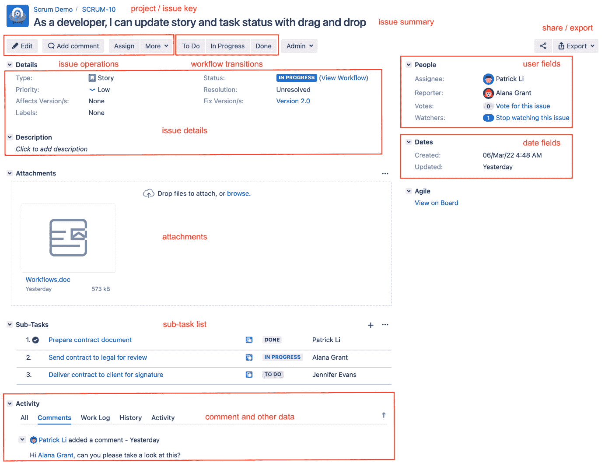

图 4.1 – 问题概述视图

其各个部分描述如下：

+   **项目/问题键**：这显示了问题所属的项目。问题键是当前问题的唯一标识符。本节作为面包屑导航，便于导航。

+   **问题概述**：这是问题的简要概述。

+   **问题导出选项**：这些是问题的各种导出选项，包括 XML、Word 和可打印格式。

+   **问题操作**：这些是用户可以在问题上执行的操作，如**编辑**、**分配**和**添加评论**。这些将在本章后续部分中详细介绍。

+   **工作流转换**：这是可用的工作流转换。工作流将在*第七章*中详细介绍，*工作流与业务流程*。

+   **问题详细信息/字段**：本节列出了问题字段，如问题**类型**和**优先级**。自定义字段也会在本节中显示。字段管理将在*第五章*中详细介绍，*字段管理*。

+   **用户字段**：本节专门用于用户类型字段，如**受让人**和**报告人**。字段管理将在*第五章*中详细介绍，*字段管理*。

+   **日期字段**：本节专门用于日期类型的字段，如**创建时间**和**更新时间**。字段管理将在*第五章*中详细介绍，*字段管理*。

+   **附件**：列出了问题中的所有附件。

+   **子任务列表**：问题可以拆分成更小的子任务。如果一个问题有子任务，它们会在本节中列出。

+   **评论**：列出了当前用户可见的所有评论。

+   **工作日志**：列出了用户针对问题记录的所有时间跟踪信息。更多详细信息请参见*跟踪时间*部分。

+   **历史记录**：跟踪该问题发生的所有更改，包括更改前后的值。

+   **活动**：这类似于**历史记录**，但格式更加用户友好。它还可以为内容生成 RSS feed。

当使用 Jira 配合 Scrum 或 Kanban 时，问题会作为卡片显示在敏捷板上，该板上对问题进行了更简洁的总结，如下所示：

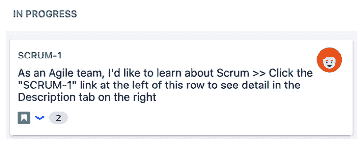

图 4.2 – 问题敏捷卡片

然而，当您点击卡片时，Jira 会在详细面板中显示问题的详细信息。现在我们已经看到 Jira 中问题的呈现方式，接下来让我们看看您如何与问题进行交互。

# 与问题的互动

正如我们已经看到的，问题是 Jira 的核心。在接下来的章节中，我们将讨论您作为用户可以对问题执行哪些操作。请注意，每个操作都需要特定权限，我们将在*第九章*中讨论，*保障 Jira 安全*。

## 创建问题

创建新问题时，您需要填写几个字段。有些字段是必填的，例如问题的摘要和类型，而其他字段是可选的，例如问题的描述。我们将在下一章中详细讨论字段。

在 Jira 中创建新问题有几种方式。您可以选择以下任一选项：

+   点击顶部横幅中的**创建**按钮

+   按下键盘上的*C*键

这将弹出**创建问题**对话框，如下图所示：

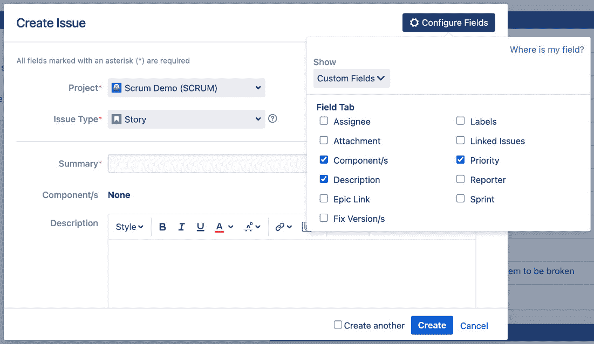

图 4.3 – 创建问题对话框

如您所见，存在许多字段，必填字段旁边会有一个红色星号（*****）标记。

管理员配置了哪些字段将包含在**创建问题**对话框中，但您的用户可以通过以下步骤自定义并创建自己的**创建问题**界面，方法是隐藏可选字段：

1.  点击右上角的**配置字段**选项。

1.  选择**自定义字段**选项。

1.  取消选中您要隐藏的所有字段，并勾选您要显示的字段，如前述截图所示。

确保不要隐藏任何必填字段，否则您将无法创建新问题。您仅是为自己隐藏或显示这些字段。

重要提示

只有 Jira 管理员才能为所有用户全局隐藏和显示字段。

在**创建**按钮旁边有一个**创建另一个**选项。勾选此选项后，再点击**创建**按钮，**创建问题**对话框将保持在屏幕上，并记住您之前输入的值，如优先级、组件和到期日期。这样，您就无需重新填写整个对话框，只需更新不同的字段，例如**摘要**。有了这个功能，您可以在更短的时间内快速创建多个问题。

提示

除了以这种方式手动创建问题外，您还可以使用高级工具，如问题导入器、Jira 的 REST API 和电子邮件，来创建问题。

## 将问题分配给用户

一旦创建了问题，通常被分配给该问题的用户将开始处理该问题。之后，用户可以重新分配该问题，例如，将其分配给 QA 人员进行进一步验证。

在许多情况下，问题需要重新分配给不同的用户，例如，当当前指派人不可用，或者问题创建时没有指定指派人。另一个例子是，问题在工作流的不同阶段会被分配给不同的人。因此，Jira 允许用户在问题创建后重新分配问题。

按照以下步骤分配问题：

1.  浏览到你希望分配的问题。

1.  点击`分配`对话框。

1.  为问题选择新的指派人，并可选择添加评论，以提供一些信息给新的指派人。

1.  点击**分配**按钮，如下图所示：

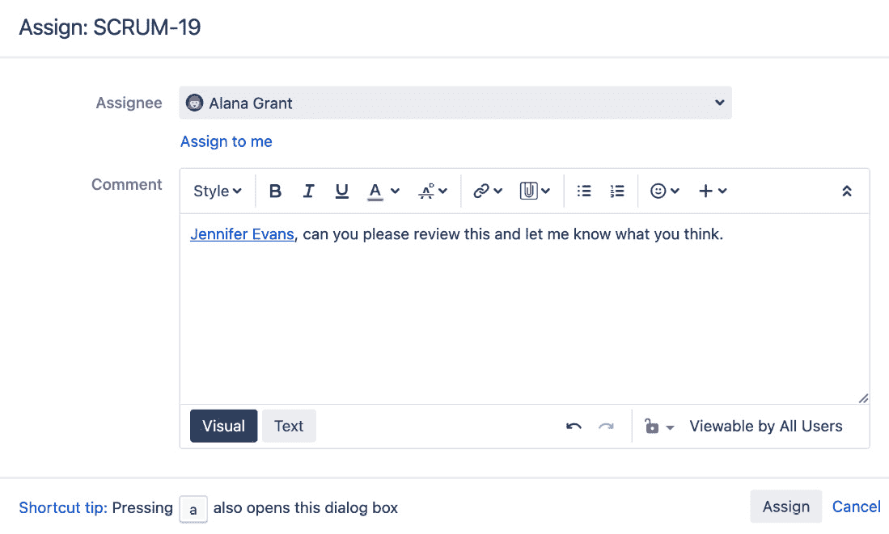

图 4.4 – 分配问题

一旦问题被重新分配，其**指派人**值将更新为新用户。新指派人也会收到一封通知邮件，提醒他们此项分配。你还可以通过选择**未指派**选项来取消分配问题。未指派的问题没有指派人，将不会出现在任何人的活动问题列表中。

提示

你可以按键盘上的*I*键，快速将问题分配给自己。

## 编辑问题

在 Jira 中，有两种方式可以编辑问题：

+   第一种更传统的方法是点击**编辑**按钮或按键盘上的*E*键。这将打开**编辑问题**对话框，并显示当前问题的所有可编辑字段。这样可以一次性修改多个字段。

+   第二种选项叫做`直接在页面上编辑你想编辑的字段，无需等待编辑对话框加载。要进行内联编辑，你只需将鼠标悬停在要更新的字段值上，点击**编辑**` **(铅笔)** 图标，然后开始编辑，如下截图所示：

**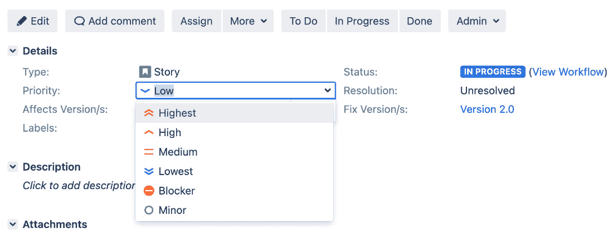

图 4.5 – 内联编辑

你可以编辑的字段由用于编辑问题操作的屏幕控制。屏幕将在*第六章*中讨论，*屏幕管理*。请注意，并非所有字段都可以编辑；有些字段是只读的，有些专用字段可能在查看问题时不会显示。

## 在项目之间移动问题

一旦问题被创建，它将与创建时所属的项目相关联。然而，你可以将问题从一个项目移动到另一个项目。听起来这可能是一个非常简单的过程，但实际上涉及许多步骤，并且有很多需要考虑的事项：

+   首先，如果当前问题类型在新项目中不存在，你需要为问题决定一个新的问题类型。

+   第二步，如果目标项目或问题类型使用不同的工作流，你需要为问题映射一个状态。

+   第三步，你需要决定新项目中但当前项目中不存在的任何必填字段的值。

听起来很多？幸运的是，Jira 提供了一个向导，旨在帮助你解决所有这些问题。

按照以下步骤开始移动问题：

1.  浏览到你希望移动的问题。

1.  点击**更多**菜单中的**移动**选项。这将打开**移动问题**向导。

**移动问题**向导实际上有四个步骤：

1.  第一步是选择你希望将问题移动到的项目。你还需要选择新的问题类型，如下图所示。如果新项目中存在相同的问题类型，通常可以继续使用相同的问题类型：

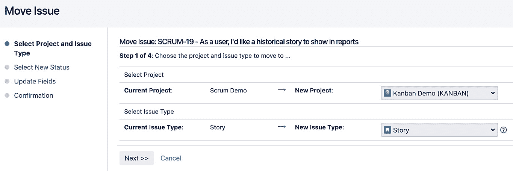

图 4.6 – 移动问题步骤 1

1.  第二步允许你将当前问题映射到新项目的工作流，如下图所示。如果目标项目中已存在该问题的状态，向导将跳过此步骤：

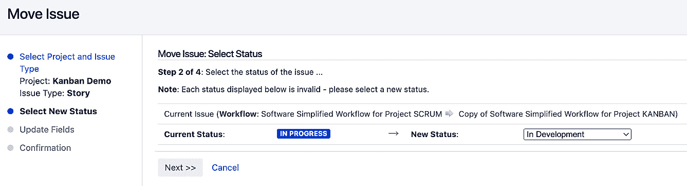

图 4.7 – 移动问题步骤 2

1.  第三步显示了新项目中但当前项目中不存在的所有字段，以及那些需要设置值的字段，如下图所示。如果没有需要设置值的字段，则此步骤将被跳过：

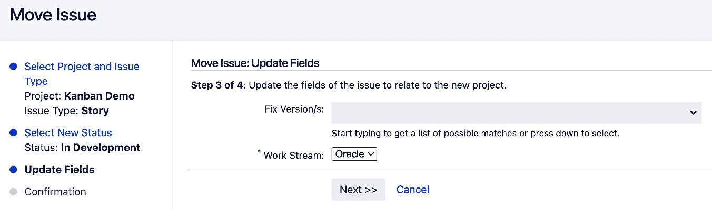

图 4.8 - 移动问题步骤 3

1.  第四步和最后一步会显示通过将问题从源项目移动到目标项目后应用的更改摘要。这是你最后一次确认所有信息是否正确的机会。如果有任何错误，你可以返回第一步并重新开始。如果你对更改满意，可以通过点击**移动**来确认移动，如下图所示：

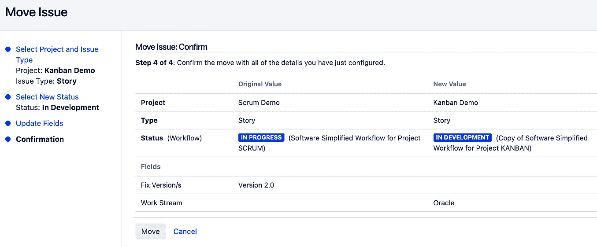

图 4.9 – 移动问题步骤 4

一旦问题被移动，它将基于新项目赋予一个新的问题键。如果你通过旧的问题键访问该问题，Jira 会自动重定向你。

移动问题功能的另一个有用用途是当你需要更改问题类型时。有时不同的问题类型有非常不同的配置，如工作流。在这种情况下，Jira 不允许你直接编辑问题的**类型**字段。你需要做的是使用移动功能，但你会选择相同的项目作为目标，并选择你想要更改的类型。

## 与其他用户共享问题

如果你想将问题通过电子邮件发送给其他 Jira 用户，而不是手动复制并粘贴问题的 URL 到电子邮件中，你可以使用 Jira 内置的分享功能。你只需进入你想分享的问题并点击*分享图标*，如下图所示，或者按键盘上的*S*键。然后，选择你要分享问题的用户并点击**分享**按钮，如下图所示：

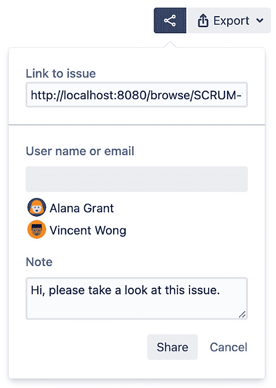

图 4.10 – 分享问题

注意

如果你分享问题的用户没有访问该问题的权限，他们将无法查看该问题的详细信息。

## 删除问题

你可以从 Jira 中删除问题。你可能需要删除那些误创建的问题，或者如果该问题是多余的，尽管通常最好是关闭并标记该问题为重复。我们将在*第七章*中讨论如何关闭问题，*工作流和业务流程*。

在 Jira 中删除问题是永久性的。与一些其他应用程序将已删除记录放入垃圾箱，之后可以恢复不同，Jira 会完全从系统中删除该问题。恢复已删除问题的唯一方法是通过从之前的备份中恢复 Jira。

按照以下步骤删除问题：

1.  浏览到你希望删除的问题。

1.  从**更多**菜单中点击**删除**选项。这将弹出**删除问题**对话框，如下图所示：

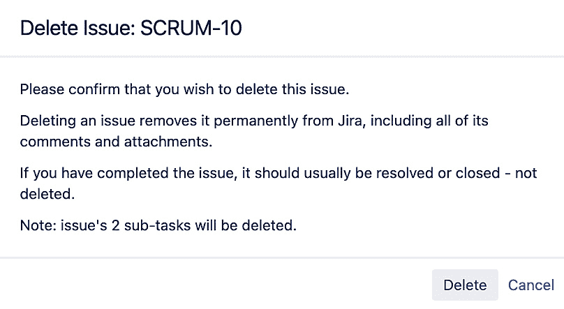

图 4.11 – 删除问题

1.  点击**删除**按钮，以将问题从 Jira 中永久删除。

注意，删除问题会永久性地将其从 Jira 中删除，包括所有数据，如附件和评论。

## 接收问题通知

Jira 可以发送自动电子邮件通知关于问题更新的情况给用户。通常，通知邮件只会发送给问题的报告者、受指派人以及已将自己添加为该问题观察者的人。通过通知方案可以改变这一行为，我们将在*第八章*中讨论，*电子邮件和通知*。

通过观看问题，你将收到关于活动的电子邮件通知，如新评论和问题更新。观看问题的用户也可以选择停止观看，从而停止接收来自 Jira 的电子邮件更新。你还可以通过将其他用户添加到观察者列表中来添加他们为观察者。

要观看一个问题，只需点击**开始观看此问题**链接。如果你已经在观看该问题，它将变为**停止观看此问题**。如果你再次点击该链接，你将停止观看该问题。

重要提示

Jira 会自动将你添加为你创建的问题以及你评论和更新过的问题的观察者。

Jira 还会通过在观看图标旁显示总观看人数，向您展示有多少人正在积极关注该问题。您可以点击**观看者**旁边的数字，查看观看者的完整列表，并将新用户添加为该问题的观看者，如下所示：

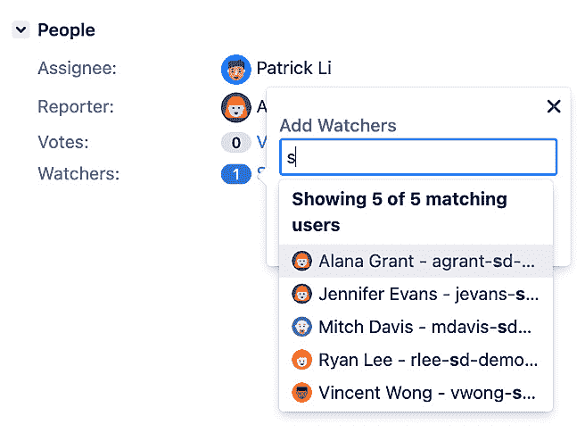

图 4.12 – 添加观看者

## 对问题投票

表达您对 Jira 问题兴趣的最直接方式就是为其投票。对于基于受欢迎程度管理优先级的组织或团队来说，投票是收集此类信息的绝佳机制。

例如，Atlassian 如何使用 Jira（[`jira.atlassian.com/browse/JRASERVER-9`](https://jira.atlassian.com/browse/JRASERVER-9)）作为一种方式，让客户根据需求选择并投票选出希望实现的功能或修复的 Bug。这使得产品管理和营销团队能够洞察市场需求，并且知道如何最好地发展他们的产品。

在投票时需要记住的一点是，您每个问题只能投票一次。您可以对许多不同的问题投票多次，但对于任何特定问题，您只有一次投票机会。这有助于防止单个用户持续对同一个问题投票，从而可能影响投票结果。不过，您可以撤回已投的票并在以后再次投票；如果您选择这样做，它仍然只算作一次投票。

要为问题投票，只需点击**为此问题投票**链接，该链接位于**投票**旁边。当您为问题投票时，图标会变为彩色；如果您尚未为问题投票，图标则显示为灰色。

注意

请注意，您不能为自己创建的问题投票。

# 问题链接

Jira 允许您为问题创建自定义超链接。这使您能够提供有关问题的更多信息。您可以创建两种类型的链接：链接到 Jira 中的其他问题，或链接到 Web 上的任意资源，如网页。

## 将问题与其他问题链接

问题之间往往以某种方式相互关联。例如，*问题 A* 可能会阻止 *问题 B*，或 *问题 C* 可能是 *问题 D* 的重复项。您可以在问题中添加描述来传达这些信息，或者在重复的情况下删除其中一个问题，但这种方法很难跟踪所有这些关系。幸运的是，Jira 提供了一个优雅的解决方案——**标准问题链接功能**。

标准问题链接允许您将一个问题与同一 Jira 实例中的一个或多个其他问题关联。这意味着您可以将来自不同项目的两个问题链接在一起（前提是您有权限访问这两个项目）。以这种方式链接问题非常简单；您只需要知道要链接的目标问题。您可以通过以下步骤链接问题：

1.  浏览到您希望为其创建链接的**查看问题**页面。

1.  从**更多**菜单中选择**链接**。这将弹出**链接问题**对话框。

1.  从左侧面板中选择**Jira 问题**选项。

1.  从**此问题**下拉菜单中选择问题链接的类型。

1.  选择要链接的问题。你可以使用搜索功能帮助你找到需要的问题。

1.  点击**链接**按钮，如下截图所示：

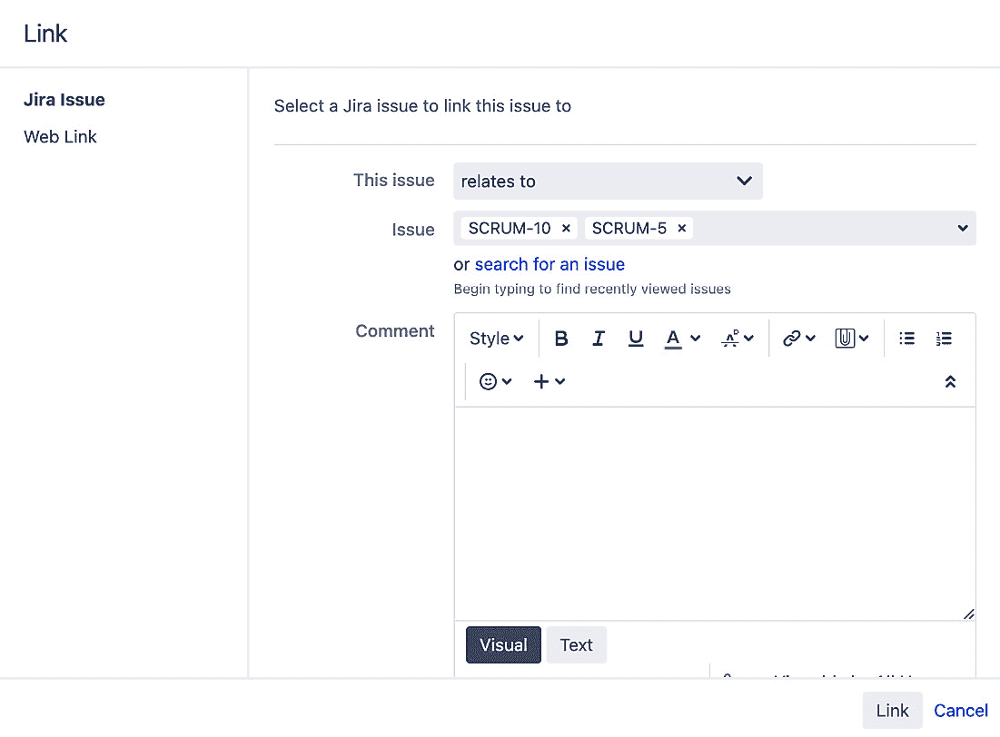

图 4.13 – 链接问题

克隆问题后，它们将在**查看问题**页面的**问题链接**部分显示。Jira 将显示目标问题的关键字、描述、优先级和状态。

## 链接远程内容的问题

标准的 Jira 问题链接允许你将多个问题链接到同一个 Jira 实例。Jira 还允许你将问题链接到资源，例如互联网上的网页。

使用远程问题链接与标准问题链接非常相似；不同之处在于，它不是选择另一个问题，而是指定目标资源的 URL 地址。你可以通过以下步骤进行设置：

1.  打开**链接问题**对话框。

1.  从左侧面板中选择**Web 链接**选项。

1.  指定目标资源的 URL 地址。Jira 会自动尝试查找并加载该资源的适当图标。

1.  在**链接文本**字段中提供链接名称。你在这里提供的名称将在查看问题时显示为链接。

1.  点击**链接**按钮，如下截图所示：

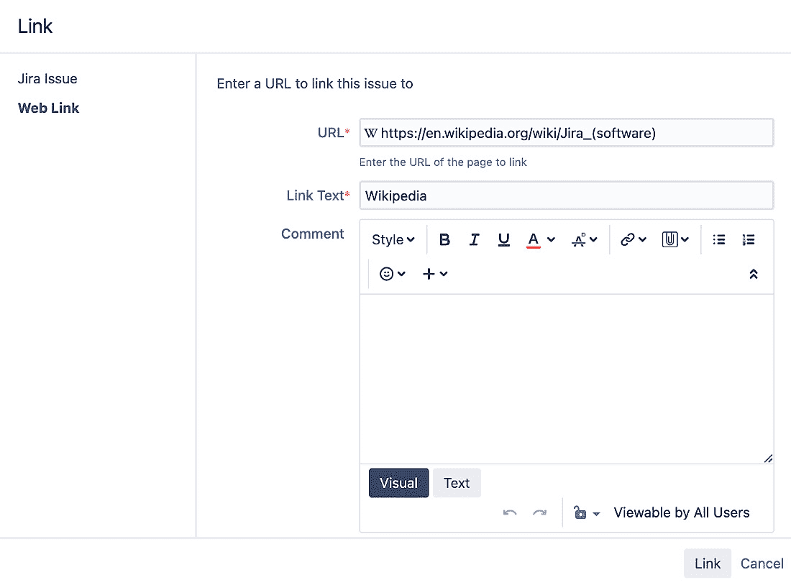

图 4.14 – 网络链接

通过使用问题链接，Jira 允许你为问题添加更多的上下文信息。事实上，Atlassian 在将 Jira 与其他产品集成时广泛使用此功能，例如将问题与 Confluence wiki 页面以及 Bamboo 构建计划链接。

# 克隆问题

当你需要创建一个新问题，并且已经有一个基准问题时，Jira 允许你通过克隆原始问题快速创建它，基于现有问题的数据。克隆问题使你能够快速创建一个新问题，并填充大多数字段。例如，如果你有两个软件产品存在相同的 bug，在一个项目中创建一个 bug 报告后，你可以简单地将它克隆到另一个项目中。

克隆的问题会复制原始问题的所有字段；然而，它是一个独立的实体。对任一问题所做的进一步操作不会影响另一个问题。

当一个问题被克隆时，两个问题之间会自动创建一个克隆链接，建立它们之间的关系。

在 Jira 中克隆一个问题既简单又直接。你需要做的就是为克隆的问题指定一个新的摘要（或接受默认的摘要，在前面加上`CLONE`文本），具体步骤如下：

1.  浏览到你希望克隆的问题。

1.  从**更多**菜单中选择**克隆**。

1.  为新克隆的任务输入新的摘要。

1.  如果你还希望复制所有子任务，请勾选**克隆子任务**复选框。

1.  如果你希望复制所有附件，请勾选**克隆附件**复选框。

1.  点击**克隆**按钮。

一旦任务成功克隆，你将被带到新克隆任务的摘要页面。

# 时间跟踪

由于任务通常代表可以单独进行的工作单元，因此用户记录他们在任务上花费的时间是合乎逻辑的。你可以指定完成任务所需的估算工作量，Jira 将帮助你跟踪进度。

Jira 在右侧的**时间跟踪**面板中显示任务的时间跟踪信息，如下图所示：

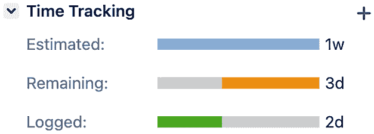

图 4.15 – 时间跟踪

**时间跟踪**面板包括以下信息：

+   **估算**：这代表完成任务所需的原始估算工作量，例如，开发人员修复一个 bug 所需的时间。

+   **剩余**：这代表任务完成所需的剩余时间。它是由 Jira 根据原始估算和用户已记录的总时间自动计算的。不过，用户在任务上记录工时时（如下文所述）也可以覆盖此值。

+   **已记录**：这代表目前为止在任务上花费的总时间。

## 指定原始估算

原始估算代表完成任务所需的预期时间。它将在**时间跟踪**部分下以蓝色条形显示。

若要指定原始估算值，你需要确保在任务的创建和/或编辑屏幕上添加了**时间跟踪**字段。我们将在*第五章*，*字段管理*，和*第六章*，*屏幕管理*中分别讨论字段和屏幕。

若要指定原始估算值，请在创建或编辑任务时提供**原始估算**字段的值。

## 记录工时

在 Jira 中记录工时可以让你指定在任务上花费的时间量（工作）。你可以在任何任务上记录工时，只要你有权限这样做。我们将在*第十章*，*搜索、报告与分析*中讨论权限。请按照以下步骤在任务上记录工时：

1.  浏览到你希望记录工时的任务。

1.  从**更多**菜单中选择**记录工时**。

1.  输入你希望记录的时间量。使用`w`、`d`、`h`和`m`分别指定周、天、小时和分钟。

1.  选择你希望记录工时的日期。

1.  可选地，选择如何调整剩余估算时间。

1.  添加你所做工作的描述。

1.  可选地，选择谁可以查看该工作日志条目。

1.  点击**日志**按钮。

当你在问题上记录工作时，你可以选择如何影响剩余估算值。默认情况下，这个值将通过从原始估算中减去已记录的工作量来自动计算。然而，你也可以选择其他可用选项，例如将剩余估算设置为特定值，或者按与已记录工作量不同的数值减少它。

提示

你还可以点击**时间追踪**部分中的**+**符号来记录时间。

# 问题和评论

Jira 允许用户在问题上创建评论。正如我们在上一节中看到的，当你将问题分配给其他用户时，你将能够创建评论。这是一个非常有用的功能，它允许多个用户协作，使他们可以在同一问题上工作并共享信息。例如，支持人员（问题受托人）可能会通过向问题添加评论来请求业务用户（问题报告人）提供更多澄清。当结合 Jira 内置的通知系统时，自动电子邮件通知将发送给问题的报告人、受托人和任何观看该问题的其他用户。通知将在*第八章*中介绍，*电子邮件和通知*。

默认情况下，所有已登录的用户都可以向他们可以访问的问题添加评论。按照以下步骤向问题添加评论：

1.  浏览到你想要添加评论的问题。

1.  点击**评论**按钮或按键盘上的*M*键。

1.  在文本框中输入评论。你可以预览并设置谁可以查看你的评论的限制。

1.  点击**添加**按钮以添加评论，如下图所示：

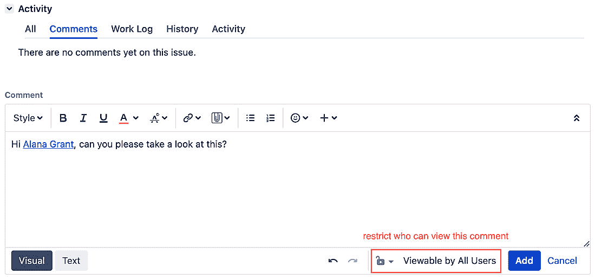

图 4.16 – 添加评论

一旦添加了评论，该评论将在底部的**活动**部分中的**评论**标签下显示。当你创建评论时，你可以选择谁能查看你的评论，这通过评论访问控制来实现。如果你有外部用户查看该问题，并且只希望与你的内部用户共享评论，这非常有用。

# 附件

正如我们迄今所见，Jira 使用**摘要**和**描述**等字段来捕获数据。这适用于大多数情况，但当你有复杂的数据，如应用程序日志文件或屏幕截图时，这就不足够了。这时，附件就派上用场了。Jira 允许你附加来自本地计算机的文件或你拍摄的屏幕截图。

## 附加文件

将文件附加到 Jira 问题的最简单方式是通过拖放操作。你可以按照以下步骤进行操作：

1.  浏览到你想要附加文件的问题。

1.  拖动并放置你想附加到浏览器的文件。你会看到一个轮廓，指示你可以将文件放置到位置以将其附加到问题上，如下图所示：

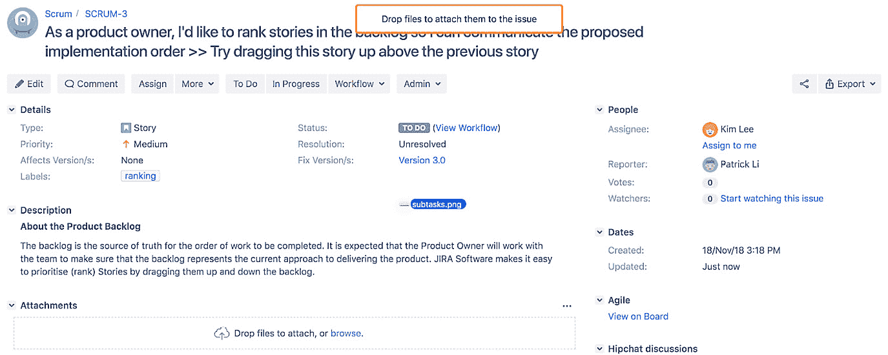

图 4.17 – 添加附件

拖放是附加文件的最简单方法，但如果由于某种原因拖放不工作，你也可以手动选择文件并通过以下步骤将其附加：

1.  浏览到你希望附加文件的那个问题。

1.  从**更多**菜单中选择**附加文件**选项。

1.  从文件浏览器中选择并附加你要附加的文件。

根据文件的类型，某些文件（如图片和 PDF）可以直接从 Jira 的用户界面查看，而无需下载它们。

# 问题类型和子任务

正如我们之前看到的，Jira 中的问题可以代表许多事情，从软件开发任务到项目管理里程碑。问题类型是区分不同问题类型的标准。

每个问题都有一个类型（因此称为问题类型），它由**问题类型**字段表示。这可以让你知道问题的类型，并帮助你确定许多其他细节，例如此问题将显示哪些字段。

默认的问题类型非常适合软件开发项目，但它们不一定能满足其他需求。由于无法创建一个能够满足所有人需求的系统，Jira 允许你创建自己的问题类型并将其分配给项目。例如，对于帮助台项目，你可能希望创建一个名为`ticket`的自定义问题类型。你可以创建这个自定义问题类型，并将其分配给`Help Desk`项目，用户将能够在系统中记录票据，而不是错误。

问题类型通过**管理问题类型**管理页面进行管理。请执行以下步骤以访问此页面：

1.  以 Jira 管理员身份登录 Jira。

1.  浏览到**Jira 管理**控制台。

1.  选择**问题**标签，然后选择**问题类型**选项。这将带你到**问题类型**页面。

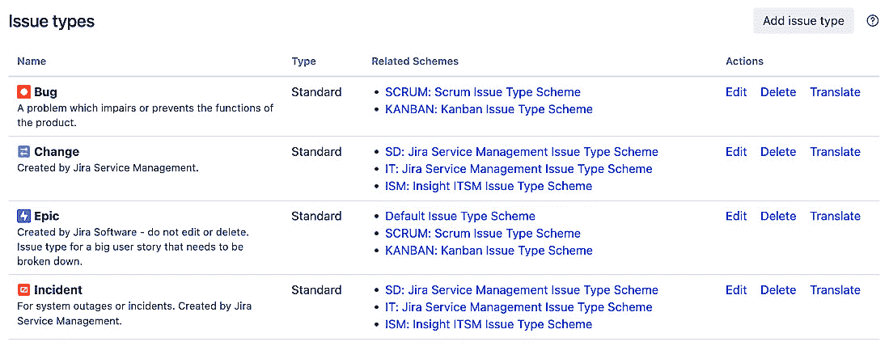

图 4.18 – 问题类型

上面的截图显示了问题类型的列表，代表了问题可以是的不同内容，包括软件开发中的**Bug**和**Epic**，以及 IT 服务中的**Incident**和**Change**。接下来，让我们看看如何创建我们自己的问题类型。

## 创建问题类型

创建自定义问题类型有很多应用场景。最常见的应用场景是当你希望问题代表不同于默认问题类型的内容时。另一个常见的应用场景是为某个特定项目中的问题应用不同的配置方案。由于 Jira 中的大多数配置方案基于项目和问题类型，如果你希望项目中的某些问题有不同的字段集，你可以创建一个新的问题类型，并仅将配置方案应用于该问题类型。创建新问题类型，请按照以下步骤操作：

1.  浏览到**问题类型**页面。

1.  点击**添加问题类型**按钮。

1.  输入新问题类型的名称和描述。

1.  选择新问题类型是标准问题类型还是子任务问题类型。

1.  点击**添加**以创建新的问题类型。

创建新的问题类型后，它将分配一个默认的图标。如果你想更改图标，你需要点击该问题类型的**编辑**链接，然后选择一个新的图片作为其图标。

## 删除问题类型

删除问题类型时，必须牢记该问题类型可能已经在使用中，这意味着已经有问题被创建为该类型。因此，当你删除问题类型时，你需要为这些问题选择一个新的类型。幸运的是，Jira 会为你处理这个问题。如下面的截图所示，当我们删除**Bug**问题类型时，Jira 会通知我们已有的 10 个**Bug**类型的问题。你需要为这些问题分配一个新的问题类型，如**缺陷**：

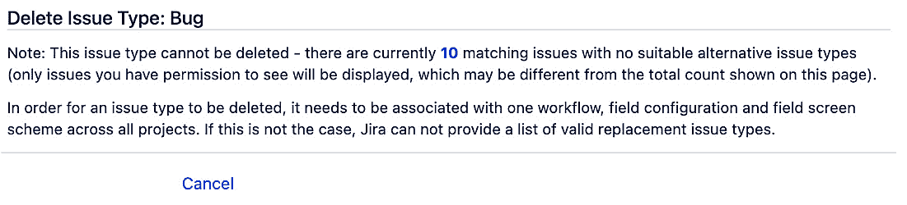

](img/Figure_4.19_B18644.jpg)

图 4.19 – 删除问题类型

## 使用子任务

Jira 允许每次只有一个人（受指派者）处理一个问题。这样的设计确保了每个问题都作为一个工作单元，可以追踪到一个人身上。然而，在现实中，我们经常遇到需要多人处理同一个问题的情况。这可能是因为任务拆解不合理，或者是因为任务本身的性质。无论原因如何，Jira 提供了一种通过子任务解决这个问题的机制。

正如我们在讨论问题类型时所看到的，子任务其实就是另一种问题类型。唯一的区别是，子任务必须始终有一个父问题。

每个问题可以有一个或多个子任务，这些子任务可以单独分配和追踪。子任务不能有其他子任务。Jira 只允许一个层级的子任务。

由于子任务属于一个问题，你需要先浏览到该问题，然后才能通过以下步骤创建新的子任务：

1.  浏览到你希望创建子任务的问题。

1.  从**更多**菜单中选择**创建子任务**。

你将看到一个熟悉的**创建问题**对话框；然而，你会注意到，与创建问题时不同的是，你不需要选择在哪个项目中创建子任务。这是因为 Jira 能够根据父问题来确定项目的值。你还会注意到，你只能选择子任务类型的问题。

除了这些区别，创建子任务与创建普通问题没有什么不同。你可以自定义在对话框中显示的字段，并通过选择**创建另一个**选项快速创建多个子任务。

创建子任务后，它将添加到父问题的**子任务**部分。您将看到属于问题的所有子任务及其状态。如果子任务已完成，将显示绿色的勾号，如以下截图所示：

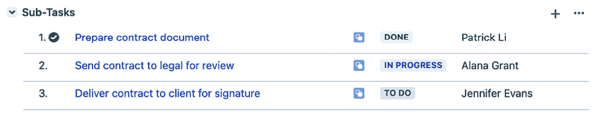

图 4.20 – 子任务

现在我们已经看到如何管理问题类型，接下来我们将看看如何使用问题类型方案将问题类型分组，以便应用于项目中。

# 问题类型方案

问题类型方案是可以应用于项目的模板或问题类型集合。正如我们在以下截图中所看到的，Jira 自带一个默认的问题类型方案，适用于所有未应用特定问题类型方案的项目。当您创建新项目时，会为您基于选择的项目模板创建一个新的问题类型方案。新方案还将根据模板预填充问题类型。如下截图所示，我们有几个问题类型方案，并且 Jira 将列出正在使用它们的项目：

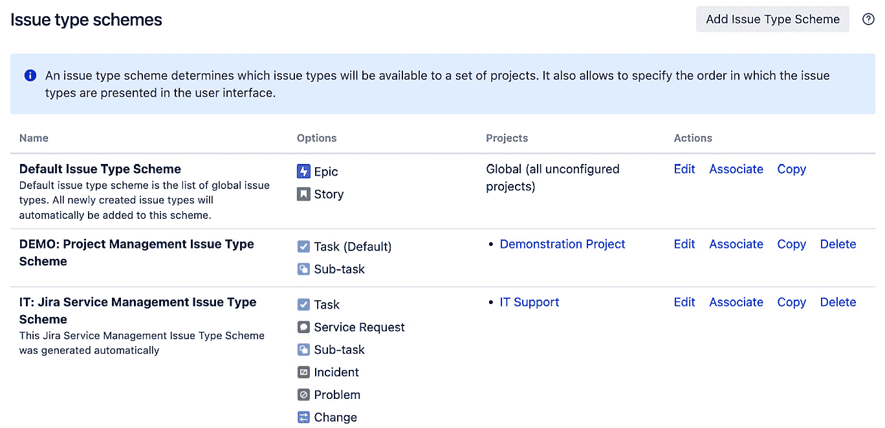

图 4.21 – 问题类型方案

正如我们将在后续章节中看到的，Jira 中的大多数配置都是通过方案管理的，例如问题类型方案、字段配置方案和工作流方案。使用方案的主要优势在于方案是可重用的组件。对于问题类型方案而言，您可以将相同的问题类型方案应用于一个或多个项目，它们将拥有相同的问题类型集合。这极大地减少了 Jira 管理员的管理和维护负担，通过重用方案允许您建立配置的标准。当您创建自己的问题类型时，为了使它们可用，您需要将它们添加到您项目使用的问题类型方案中。

## 向问题类型方案添加问题类型

按照以下步骤创建新的问题类型方案：

1.  浏览到管理控制台。

1.  选择**问题**选项卡，然后选择**问题类型方案**选项。这将带您到**问题类型方案**页面。

1.  点击要添加问题类型的问题类型方案的**编辑**链接。

1.  从**可用问题类型**列表中拖动并将要成为方案一部分的问题类型放入**当前方案的问题类型**列表中。

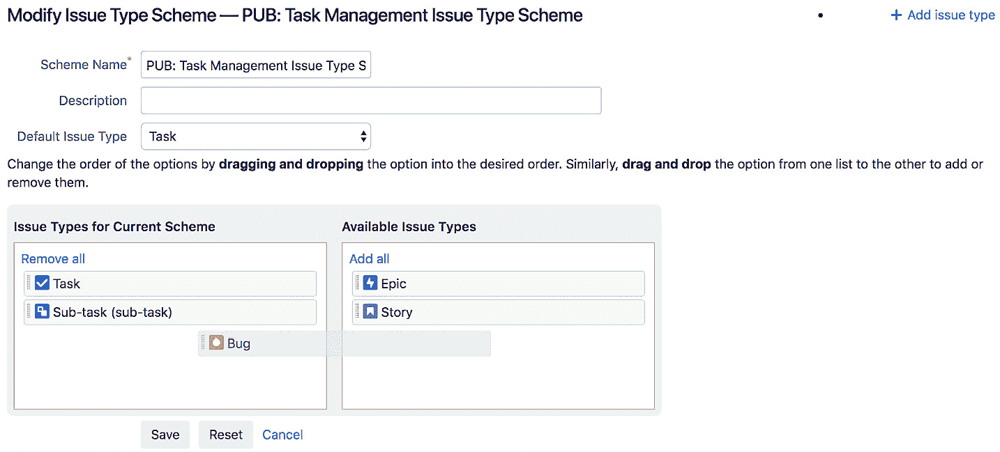

图 4.22 – 配置问题类型方案

1.  选择**默认问题类型**值。请注意，这是可选的，只有在为新方案选择至少一种问题类型后，才能选择默认问题类型。

1.  点击**保存**按钮。

一旦你创建并配置了问题类型方案，你可以通过点击**关联**按钮，将其与一个或多个项目关联，并选择要应用该方案的项目。

# 问题优先级

优先级帮助用户设定问题的重要性。用户可以首先为问题分配优先级值，之后使用这些优先级对待办事项列表进行排序，从而帮助团队决定优先处理哪些问题。Jira 默认提供五个优先级级别，如下图所示：

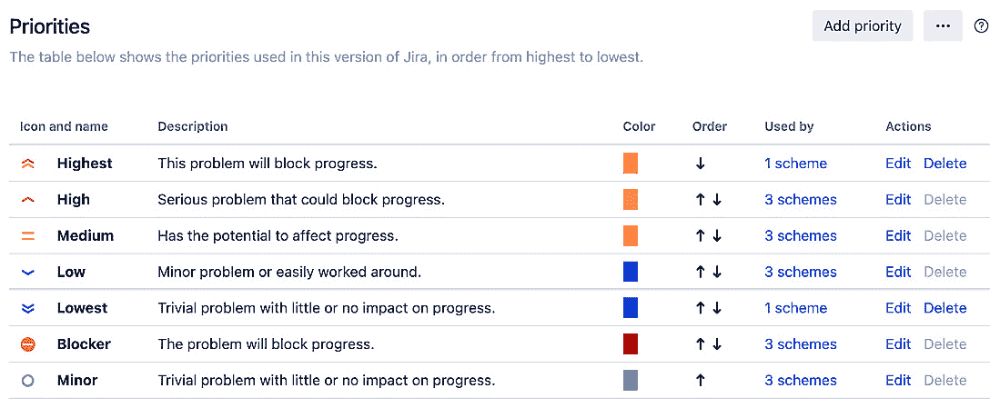

图 4.23 – 优先级

你可以通过创建自己的优先级来定制此列表。创建新优先级的步骤如下：

1.  浏览到管理控制台。

1.  选择**问题**标签，然后选择**优先级**选项。

1.  为新优先级输入名称和描述。

1.  点击**选择图像**链接，为优先级选择一个图标。

1.  为优先级指定一个颜色。你可以直接输入 HTML 颜色的十六进制代码，或者使用颜色选择器帮助你选择所需的颜色。这里选择的颜色将在无法显示图标图像时使用，例如当你将问题导出到电子表格时。

1.  点击**添加**按钮。

## 创建优先级方案

优先级方案的工作方式类似于我们之前看到的任务类型方案功能。你可以创建一个方案，使其仅包含你所需要的优先级，然后将该方案应用到项目中。这样，每个项目就可以有自己的优先级选项集。创建和应用新优先级方案的步骤如下：

1.  浏览到管理控制台。

1.  选择**问题**标签，然后选择**优先级方案**选项。

1.  点击**添加优先级方案**按钮。

1.  为新优先级方案输入名称。

1.  将你希望成为方案一部分的优先级从**可用优先级**列表拖动到**已选择优先级**列表中。

1.  选择一个**默认优先级**值。请注意，这是可选的，只有在你选择了至少一个优先级后，才能为新方案选择默认优先级。

1.  点击**添加**按钮，如下图所示：

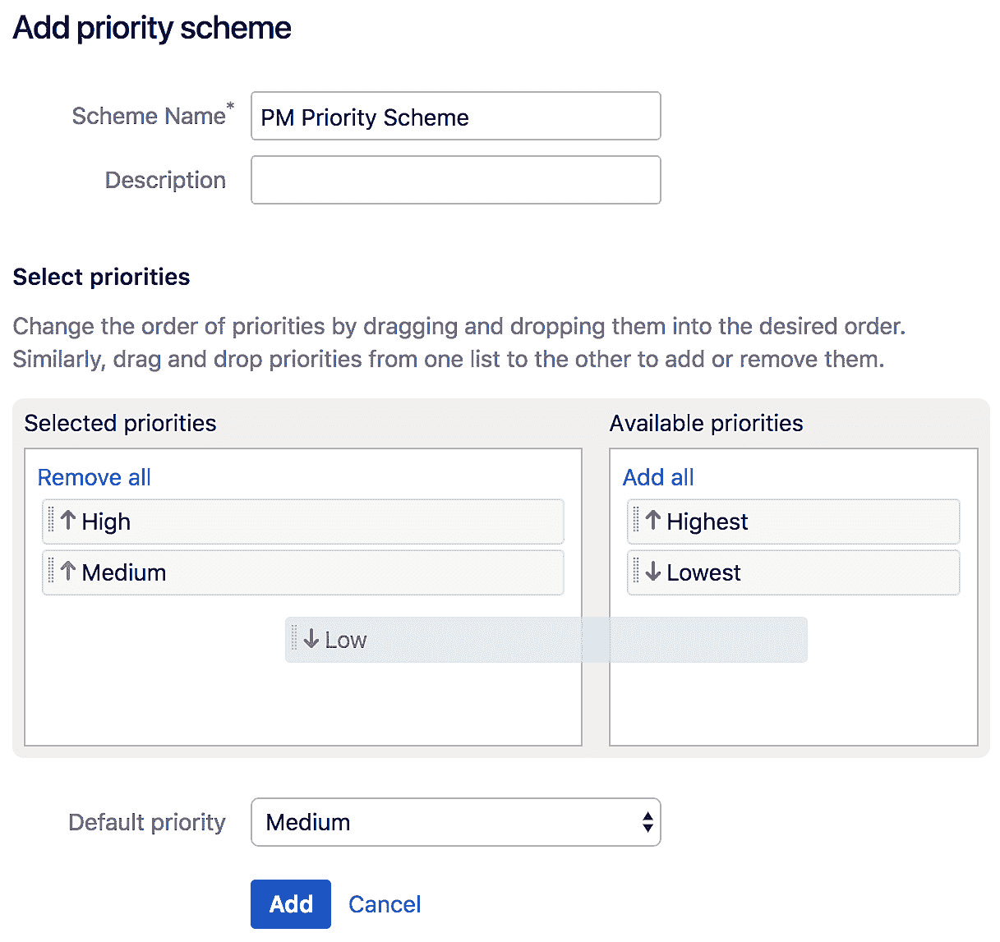

图 4.24 – 配置优先级方案

一旦你创建了新优先级方案，你可以点击其**关联**链接，将该方案应用到一个或多个项目。

# HR 项目

在本练习中，我们将继续设置上一章节中创建的项目。我们将向项目中添加以下配置：

+   一组专门为我们的 HR 项目创建的新问题类型

+   将新的问题类型添加到问题类型方案中，使其可用

## 添加新的问题类型

由于我们的项目是为人力资源团队创建的，我们需要创建一些自定义任务类型，以增强 Jira 默认任务类型的功能。在这个练习中，我们将创建两个新的任务类型：`新员工`和`终止`。

第一步，即设置任务类型关联，是创建我们需要的两个任务类型：`新员工`和`终止`。

1.  浏览到**任务类型**页面。

1.  点击**添加任务类型**按钮。

1.  在**名称**字段中输入`新员工`。

1.  点击**添加**按钮以创建新的任务类型。

你现在应该能在表格中看到新的任务类型。现在，让我们添加`终止`任务类型：

1.  再次点击**添加任务类型**按钮。

1.  在**名称**字段中输入`终止`。

1.  点击**添加**以创建新的任务类型。

你应该能看到**新员工**和**终止**任务类型。然而，这只会使我们的新任务类型可用——它不会使这些任务类型成为我们项目中新建任务时唯一的选项。如你从前面章节中记得的那样，我们需要将新的任务类型添加到我们项目使用的任务类型方案中。

## 更新任务类型方案

我们希望将任务类型限制为仅**新员工**、**终止**和通用的**任务**，以适应我们的 HR 项目，但我们不希望影响其他仍然需要**Bug**和其他默认任务类型的项目。因此，我们需要为我们的项目创建一个新的任务类型方案。我们可以通过以下步骤来实现：

1.  浏览到**任务类型方案**页面。

1.  点击编辑链接以修改我们的任务类型方案。Jira 默认创建的方案应命名为`HR: Task Management Issue Type Scheme`。

1.  将**新员工**和**终止**任务类型从**可用任务类型**面板拖动到**当前方案的任务类型**面板。

1.  点击**保存**按钮。

## 将所有内容整合在一起

在一切创建和设置完成后，你可以返回并创建一个新任务，以查看所有内容的效果。如果一切顺利，你应该能看到类似下方截图的内容：

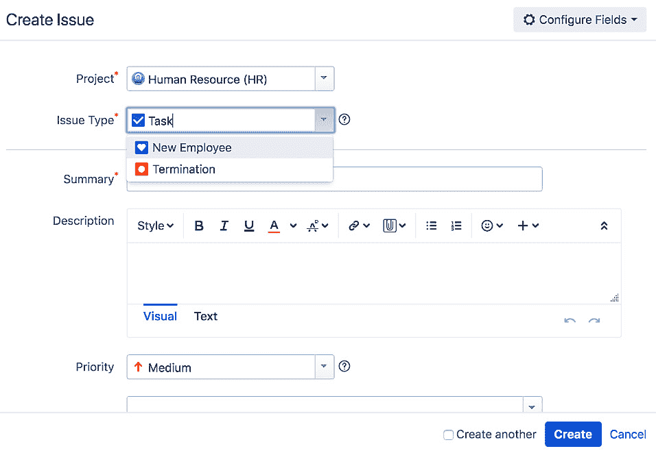

图 4.25 – 示例项目

如你所见，对于 HR 项目，我们现在可以从任务类型方案中选择三种任务类型：**任务**、**新员工**和**终止**。

# 概要

在本章中，我们了解了 Jira 中的任务是什么，并探讨了创建、编辑和删除任务的基本操作。我们还了解了 Jira 提供的高级操作，用于增强你如何操作和使用任务，比如添加附件、创建子任务和关联多个任务。然后，我们看了如何创建自己的任务类型并将其应用到项目中，以便我们创建的任务能够更好地代表我们所处理的任务类型。

在下一章中，我们将介绍字段，并探讨如何创建我们自己的自定义字段来收集用户的额外信息。
