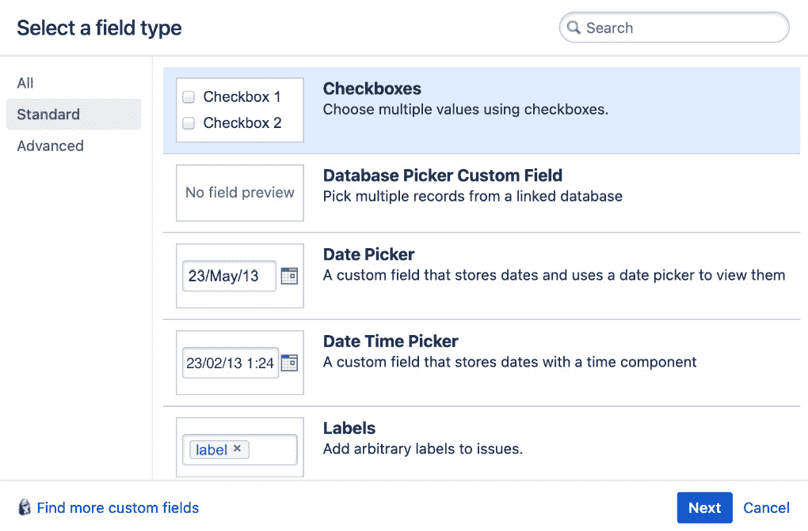
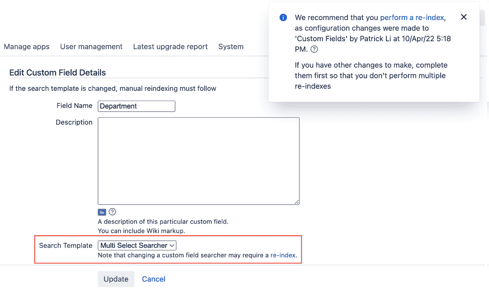
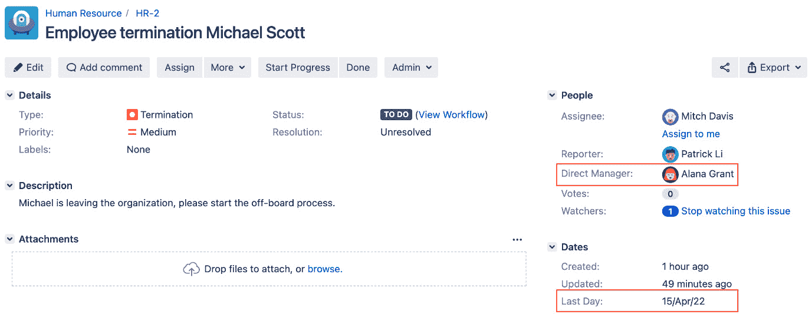

# 5

# 字段管理

**项目**是问题的集合，而**问题**是字段的集合。正如我们在前几章中所看到的，字段用于捕捉数据，这些数据可以展示给用户。Jira 中有许多不同类型的字段，从允许您输入字母数字文本的简单文本字段，到更复杂的字段，带有选择器帮助您选择日期和用户。

一个信息系统的价值取决于其输入的数据。通过理解如何有效使用字段，您可以将 Jira 转变为一个强大的信息系统，用于数据收集、处理和报告。

在本章中，我们将通过探索字段的细节并学习它们与 Jira 其他方面的关系，来扩展我们的 HR 项目，涵盖这些自定义字段和配置。到本章结束时，您将了解以下内容：

+   理解系统字段、自定义字段和搜索器

+   管理和优化自定义字段

+   向字段添加行为与字段配置

+   理解字段配置方案及如何将其应用于项目

# 理解系统字段

Jira 自带了多个内置字段，`assignee` 和 `description` 是可选的。这些系统字段通常直接与 Jira 的不同功能相关联，因此无法删除它们。

以下表格列出了 Jira 中的主要系统字段：

| **系统字段** | **描述** |
| --- | --- |
| **指派人** | 这指定了当前被指派处理该问题的用户。 |
| **概要** | 这指定了问题的一行摘要。 |
| **描述** | 这提供了问题的详细描述。 |
| **报告人** | 这指定了报告此问题的用户（通常也是创建该问题的用户，但并不总是如此）。 |
| **组件** | 这指定了该问题所属的项目组件。 |
| **影响版本** | 这指定了问题影响的版本。 |
| **修复版本** | 这指定了问题将在其中修复的版本。 |
| **截止日期** | 这指定了该问题的截止日期。 |
| **问题类型** | 这指定了问题的类型（例如，**缺陷**和**故事**）。 |
| **优先级** | 这指定了该问题与其他问题相比的重要性。 |
| **解决方案** | 这指定了该问题的当前解决方案值（例如，**未解决**或**已修复**）。 |
| **时间跟踪** | 这让用户估算完成该问题所需的时间。 |

表格 5.1 – 系统字段

尽管 Jira 的内置字段足以应对基本的通用用途，但大多数组织很快发现它们有一些特殊需求，仅凭系统字段无法满足。下一节，我们将探讨 Jira 如何通过让您创建自己的字段——称为**自定义字段**——来解决这一需求。

# 理解自定义字段

Jira 的一个关键特性是自定义字段，允许你根据需求向系统中添加新字段。你可以添加一个新的用户选择器字段，用来表示项目干系人，或者为不同的关键日期添加一个日期选择器字段。

每个自定义字段都有一定的类型，决定了其行为、外观和功能。因此，当你在 Jira 中添加自定义字段时，你是在添加所选的自定义字段类型。

Jira 提供了超过 20 种自定义字段类型，你可以直接使用。许多自定义字段类型与内置字段相同，例如 **日期选择器**，它类似于 **到期日期** 字段。它们为你提供了内置字段所没有的简便性和灵活性。接下来的部分将细分并列出所有标准和高级 Jira 自定义字段类型及其特性。

## 标准字段

这些字段类型是 Jira 中最基本的字段类型，通常简单且易于使用，例如 **文本** 字段，允许用户输入任意文本：

| **自定义** **字段类型** | **描述** |
| --- | --- |
| **日期选择器** | 这些是允许输入带日期选择器的输入字段，并强制有效日期。 |
| **日期时间选择器** | 这些是允许输入带日期和时间选择器的输入字段，并强制有效的日期时间戳。 |
| **标签** | 这些是允许向问题添加标签的输入字段。 |
| **数字字段** | 这些是存储并验证数字值的输入字段。 |
| **单选按钮** | 这些是单选按钮，确保只能选择一个值。 |
| **选择列表（级联）** | 这些是多个选择列表，其中第二个选择列表的选项会根据第一个列表的值动态更新。 |
| **选择列表（多选）** | 这些是多个选择列表，具有可配置的选项列表。 |
| **选择列表（单选）** | 这些是单选列表，具有可配置的选项列表。 |
| **文本字段（多行）** | 这些是多行文本区域，允许包含大量文本内容。 |
| **文本字段（单行）** | 这些是基本的单行输入字段，允许输入少于 255 个字符的简单文本。 |
| **URL 字段** | 这些是验证有效 URL 的输入字段。 |
| **用户选择器（单个用户）** | 通过弹出用户选择窗口或自动完成从 Jira 用户库中选择一个用户。 |

表 5.2 – 标准自定义字段类型

## 高级字段

这些字段提供了专门的功能。例如，**版本选择器** 字段让你从当前项目中选择一个版本。如果你有来自第三方插件的自定义字段（例如本节后面列出的字段），它们也会在此列出：

| **自定义** **字段类型** | **描述** |
| --- | --- |
| **组选择器（多个组）** | 通过弹出选择窗口选择一个或多个用户组。 |
| **组选择器（****单个组）** | 通过弹出选择窗口选择一个用户组。 |
| **项目选择器（****单个项目）** | 选择可在系统中查看的项目列表。 |
| **文本字段（****只读）** | 这是一个只读文本字段，用户不能设置数据。只能通过编程方式设置数据。 |
| **用户选择器（****多个用户）** | 通过弹出选择窗口，从用户库中选择一个或多个用户。 |
| **版本选择器（****多个版本）** | 从当前项目中可用的版本中选择一个或多个版本。 |
| **版本选择器（****单个版本）** | 从项目中可用的版本中选择一个版本。 |

表 5.3 – 高级自定义字段类型

如你所见，Jira 为你提供了一个全面的自定义字段类型列表。此外，还有许多由第三方开发的自定义字段类型（作为应用程序可添加到 Jira 中，以增强其功能）。这些自定义字段提供了许多专门的功能，例如自动计算值、直接从数据库检索数据或连接到外部系统。一旦安装了插件，添加来自其他供应商的自定义字段的过程通常与添加 Jira 自带的自定义字段相同。

以下列表展示了一些提供附加有用自定义字段的应用程序。你可以在 Atlassian Marketplace 上找到它们：[`marketplace.atlassian.com`](https://marketplace.atlassian.com)：

+   **Enhancer Plugin for Jira**：这个插件包括几个自定义字段，当关键事件发生时，它们会自动显示日期；例如，问题最后一次关闭的时间。

+   **Toolkit Plugin for Jira**：这个插件提供了几个有用的自定义字段，例如显示参与特定问题的用户统计信息和问题最后一次评论的日期。

+   **Elements Connect - 外部数据字段**：这个插件提供了一套自定义字段，可以让你连接数据库、远程文件和网络服务来检索数据并将其显示在 Jira 中。

+   **电子签名 for Jira**：这个插件让用户在处理问题时可以在 Jira 中进行电子签名，例如批准关闭一个问题。

+   **ScriptRunner for Jira**：这个应用程序允许你创建自定义字段，并通过脚本定义它们的功能。

我们将在*第十二章*，*Jira 与第三方应用程序*中详细讨论第三方应用程序。所以，现在我们已经了解了自定义字段，接下来是时候介绍搜索器了。

# 理解字段搜索器

对于任何信息系统而言，捕获数据只是方程式的一半。用户需要能够在后续阶段检索数据，通常通过搜索，而 Jira 也不例外。虽然 Jira 中的字段负责捕获和显示数据，但正是它们对应的搜索器提供了搜索功能。

自定义字段搜索器决定了字段存储的数据将如何被索引，这会影响你如何搜索这些数据。例如，一个文本自定义字段会将其数据作为原始文本进行索引，这样你就可以进行模糊搜索，例如搜索以特定字符开头的文本。相反，一个选择列表自定义字段会以不同的方式索引其数据，因此你可以根据特定选项值或一组选项值进行搜索。如果某个字段没有应用搜索器，那么它的数据将不会被索引，你将无法搜索其数据。

Jira 中的所有字段默认都关联有搜索器，因此你可以根据问题的摘要或指派人搜索问题，而无需任何进一步的配置。来自第三方插件的某些自定义字段可能有多个搜索器可用。你可以通过编辑自定义字段来更改默认的搜索器。

注意

在 Jira 用户界面中，搜索器被称为*搜索模板*。

# 自定义字段上下文

系统字段，例如**摘要**和**问题类型**，在整个 Jira 中都是全局的。这意味着这些字段适用于所有问题和项目。另一方面，自定义字段可以应用于特定的项目和问题类型，这也叫做**上下文**。

自定义字段上下文是由项目和问题类型的组合组成的。当你处理一个问题时，Jira 会检查当前问题的项目和问题类型，以确定是否存在与该组合匹配的特定上下文。如果找到了，Jira 会显示该自定义字段以及任何特定设置，如选择选项。然而，如果没有找到上下文，则该自定义字段不会显示。

使用自定义字段上下文的主要原因有两个：自定义和性能。让我们先看看上下文如何帮助自定义字段。

自定义字段类型，如选择列表和单选按钮，提供给最终用户选择的选项。你可以为不同的项目和问题类型（或上下文）自定义选项列表。这使得你可以为多个项目重用相同的自定义字段，从而减少重复。

使用自定义字段上下文的第二个好处是性能。如果你将自定义字段限制为特定项目和问题类型，这意味着当 Jira 显示问题时，它只需要显示与该问题相关的自定义字段。Jira 需要显示的自定义字段越少，响应时间就越快。

在 Jira 中，如果没有找到与项目和问题类型组合匹配的上下文，则该问题没有自定义字段。稍后我们将在*添加自定义字段上下文*部分详细讲解如何设置自定义字段上下文。现在需要记住的是，在添加自定义字段时，必须确保其具有正确的上下文设置。

现在我们已经简要介绍了自定义字段的上下文，让我们看看如何创建和管理自定义字段。

# 管理自定义字段

自定义字段在 Jira 中是全局使用的，因此，您需要拥有 Jira 管理员全局权限，才能执行创建和配置等管理操作。

Jira 将所有自定义字段集中管理，方便操作。执行以下步骤以访问**管理自定义字段**页面：

1.  以 Jira 管理员身份登录。

1.  浏览到 Jira 管理控制台。

1.  选择**问题**标签，然后选择**自定义** **字段**选项：

图 5.1 – 管理自定义字段

在**自定义字段**页面上，将列出所有现有的自定义字段。在这里，您可以查看所有自定义字段的名称、类型、所属上下文和显示的界面。请注意，某些自定义字段，例如**开发**和**史诗颜色**，如前述截图所示，是 Jira 自带的，并且在它们的名称旁会有**锁定**标签。这些字段在 Jira 中有特殊用途，因此无法更改它们的配置。用户添加的自定义字段，例如**审批人**，则没有此限制，可以随时进行更新。让我们从添加一个新自定义字段开始。

## 添加自定义字段

添加新自定义字段是一个多步骤的过程，Jira 提供了向导帮助您完成。添加新自定义字段时，有两个必选步骤和一个可选步骤。首先，您需要选择自定义字段的类型。选择正确的字段类型非常重要，因为此设置以后无法更改。当您选择字段类型时，需要考虑该字段的使用方式、您希望存储的数据类型以及如何搜索这些数据。

选择了自定义字段类型后，您需要为其命名，并在添加**选择列表**自定义字段类型时提供选项。最后一步是可选的，即决定将该字段添加到哪些界面。

我们将引导您完成这个过程：

1.  浏览到**自定义** **字段**页面。

1.  点击**添加自定义字段**按钮。这将带您进入*步骤 1*，在这里您可以选择自定义字段类型。

1.  搜索并选择您希望添加的自定义字段类型，然后点击**下一步**。这将带您进入*步骤 2*，在这里您可以指定自定义字段的名称和选项。请注意，一旦选择了字段类型，创建字段后将无法更改：

图 5.2 – 添加自定义字段 第 1 步

提示

如果你没有看到所需的字段类型，选择左侧的**所有**选项，然后重新搜索。

1.  输入**名称**和**描述**字段的值。如果你正在创建一个基于选择的自定义字段，例如选择列表，你还需要添加其选择选项（你可以稍后更新此列表）：

图 5.3 – 添加自定义字段 第 2 步

重要说明

即使你可以有多个同名的自定义字段，这通常不是一个好的做法，因为这样会导致后期的混淆，并且使管理变得困难。

1.  选择新自定义字段的上下文。你应该将上下文限制在自定义字段将要使用的特定问题类型和项目中。创建自定义字段后，你可以更改该上下文。

图 5.4 – 添加自定义字段 第 3 步

1.  点击**创建**按钮。这将带你进入过程的最后一步，在这里你可以指定要将字段添加到哪个屏幕。此步骤是可选的，因为自定义字段已经在 Jira 中添加。你不必将字段添加到屏幕上。我们将在*第六章*，“屏幕管理”中讨论字段和屏幕。

1.  选择屏幕并点击**更新**。以下截图显示新创建的字段已添加到两个屏幕：

图 5.5 – 添加自定义字段 第 4 步

一旦自定义字段被创建，你将在创建、编辑或查看问题时看到它出现在选定的屏幕上。

在你开始添加新的自定义字段之前，应该首先查看是否已有其他自定义字段可以重复使用，且它们已经服务于类似的目的。例如，如果你想添加一个部门的选择列表，可能已经有一个**部门**自定义字段，你只需添加一个新的字段上下文，这样就可以为你的项目提供不同的部门选项列表。因此，在添加新的自定义字段时，始终保持可重用性是一个好习惯。要时刻考虑如何重复使用现有字段，以及如何在未来重用新字段。这将帮助减少自定义字段的数量，使你的 Jira 更易于管理。

## 编辑/删除自定义字段

一旦创建了自定义字段，你可以随时编辑其详细信息。你可能已经注意到，每个自定义字段都有一个**配置**选项和一个**编辑**选项。刚开始时，区分这两者可能会让人感到困惑。**配置**指定与自定义字段上下文相关的选项，接下来我们将讨论这些内容。**编辑**指定 Jira 中全局适用的自定义字段选项；这些包括自定义字段的名称、描述和搜索模板：

1.  浏览到**自定义** **字段**页面。

1.  通过点击自定义字段列表中你希望编辑的自定义字段旁边的齿轮图标，选择**编辑**选项。

1.  更改自定义字段的详细信息，例如其名称或搜索模板。

1.  点击**更新**按钮以应用更改。

在更改自定义字段的搜索模板时，重要的是要注意，尽管更改会立即生效，但你需要执行系统重新索引，以便 Jira 返回正确的搜索结果。这是因为，对于每个搜索模板，其底层搜索数据结构可能不同，而 Jira 需要更新其搜索索引以应用新的搜索模板。

例如，如果你有一个没有搜索器的自定义字段，而你刚刚为其应用了搜索器，那么在重新索引 Jira 之前，将不会返回任何结果。当你更改搜索模板时，Jira 会通过消息提醒你需要进行重新索引，如下截图所示：

图 5.6 – 更改搜索器

当你添加或修改了自定义字段、安装了包含自定义字段模块的第三方应用程序，或进行其他可能影响现有自定义字段的配置更改时，Jira 会通知你需要执行重新索引。由于重新索引可能是一个成本高昂且对于大型 Jira 实例可能需要很长时间才能完成的过程，因此并不要求每次 Jira 提示你执行时都必须进行重新索引。通常，你应在以下情况下执行重新索引：

+   你已更改了自定义字段的搜索模板

+   你已更新一个第三方应用，该应用对你使用的自定义字段进行了更改

+   你已对影响自定义字段的配置进行了更改，例如其上下文。

如果没有及时执行重新索引，可能会导致返回不正确的搜索结果及其他问题。

要执行重新索引，你可以点击提示框中的**执行重新索引**链接，或前往**Jira 管理控制台** | **系统** | **索引**。执行重新索引时，你可以选择执行后台重新索引或完全（前台）重新索引。后台重新索引较慢，但在重新索引过程进行时，终端用户可以继续使用 Jira。完全重新索引较快，但在整个过程完成之前，Jira 将无法使用。在大多数情况下，后台重新索引是首选，但如果搜索索引损坏，则需要执行完全重新索引。在这种情况下，你应该计划停机时间，因为在重新索引期间用户将无法使用 Jira。

提示

你应该选择后台重新索引选项，以避免任何停机时间。

我们将在*第十章*中更详细地讨论搜索和索引，*搜索、报告*，*和分析*。

你还可以删除现有的自定义字段，操作步骤如下：

1.  浏览到**自定义** **字段**页面。

1.  通过点击你希望删除的自定义字段旁边的工具图标，选择**删除**选项。

1.  点击**删除**按钮删除自定义字段。

删除后，你将无法恢复自定义字段，也无法检索和搜索该字段所持有的数据。如果你尝试创建另一个相同类型和名称的自定义字段，它不会继承之前自定义字段的数据，因为 Jira 为每个字段分配唯一的标识符。强烈建议在删除字段之前备份你的 Jira 项目，除非你完全确定不再需要该字段。

## 配置自定义字段

现在我们已经了解了如何创建和管理自定义字段，接下来可以开始查看更高级的配置选项。不同的自定义字段类型将有不同的配置选项。例如，所有自定义字段都可以指定一个或多个上下文，而基于选择列表的自定义字段还允许你指定一组选项。我们将在以下部分中逐一查看每个配置选项。

要配置自定义字段，你需要访问**配置自定义字段**页面，步骤如下：

1.  浏览到**自定义** **字段**页面。

1.  通过点击自定义字段列表中希望配置的自定义字段旁边的齿轮图标，选择**配置**选项。这将带你进入**配置自定义** **字段**页面。

以下截图显示了**部门**自定义字段有两个可用的上下文：默认配置方案，适用于**演示项目**，以及**PMO**配置方案，仅适用于**开发**和**产品** **管理**项目：

图 5.7 – 配置自定义字段

## 添加自定义字段上下文

随着时间的推移，你可能需要根据问题所在的项目来配置不同的自定义字段。例如，如果我们有一个名为**部门**的选择列表自定义字段，我们可能希望它根据问题创建的项目具有不同的选项，甚至有不同的默认值。

为了实现这种自定义程度，Jira 允许你为一个自定义字段创建多个自定义字段上下文。正如我们已经看到的，自定义字段上下文是问题类型和项目的组合。因此，在我们前面的例子中，默认上下文和**PMO**上下文为**部门**字段提供了不同的选项。

创建一个新的自定义字段上下文非常简单。你只需要决定将定义上下文的问题类型和项目组合：

1.  浏览到你希望为其创建新上下文的**配置自定义字段**页面。

1.  点击**添加新上下文**链接。这将带你进入**添加配置方案**上下文页面。

1.  在新的自定义字段上下文的**配置方案****标签**字段中输入名称。

1.  在**选择适用问题类型**部分下选择新上下文的问题类型。

1.  在**选择适用的上下文**部分下选择新上下文的项目。

1.  点击**添加**按钮以创建新的自定义字段上下文。

每个项目每个自定义字段只能属于一个自定义字段上下文（全球上下文不计算在内）。一旦你为上下文选择了一个项目，下次创建新上下文时该项目将不可用。例如，如果你为项目 A 创建了新上下文，当你为相同自定义字段创建另一个上下文时，项目 A 将不会作为选项列出。这是为了防止你不小心为同一个项目创建两个上下文。

在创建新自定义字段上下文后，它不会继承任何配置值作为默认上下文，例如来自其他上下文的**默认值**和**选项**。你需要重新填写并维护每个新创建的上下文的配置选项。

限制自定义字段上下文还可以帮助减少搜索索引大小，并改善性能，特别是在数据中心版部署时。

## 配置选择项

对于自定义字段类型，如选择列表、复选框、单选按钮及其多版本，你需要在它们对用户可用之前配置它们的选择项。选择项是在每个自定义字段上下文的基础上配置的。这为自定义字段提供了在不同项目中使用不同选择项的灵活性。

要配置选择项，你需要首先选择自定义字段，然后选择将应用选择项的上下文，如下所示：

1.  浏览到**自定义** **字段**页面。

1.  点击你希望配置选择项的自定义字段的**配置**选项。

1.  点击自定义字段上下文的**编辑选项**链接，应用选项。

1.  在**添加新自定义字段选项**部分输入选项值，然后点击**添加**按钮来添加该值。选项将按输入顺序添加到系统中。你可以手动移动选项值的顺序，或者点击**按字母顺序排列选项**让 Jira 自动为你排序。

1.  配置完选择项后，点击**完成**按钮：

图 5.8 – 配置字段选项

你可以删除和禁用现有的选项。这两者操作有一个重要的区别。禁用选项时，Jira 只是不会在字段中显示该选项，但有该选项值的问题仍然会保留其值。因此，当你重新启用该选项时，值会恢复。然而，如果你删除该选项，它将完全从 Jira 中删除，包括所有已有该选项值的问题。因此，通常建议先禁用选项，只有在确定不再需要时才删除它。

## 设置默认值

对于大多数自定义字段，你可以设置默认值，这样用户就不需要填写这些字段，除非他们有特殊需求。对于基于文本的自定义字段，默认值将以文本形式显示，当用户创建或编辑问题时。对于基于选择的自定义字段，默认值将会是预选的选项。

就像设置选择项一样，默认选项也是基于每个自定义字段上下文设置的：

1.  浏览到**自定义字段**页面。

1.  点击**配置**选项，选择你希望配置选择项的自定义字段。

1.  点击要应用默认值的自定义字段上下文的**编辑默认值**链接。

1.  设置自定义字段的默认值。

1.  点击**设置默认值**按钮以设置默认值。

设置默认值的方式因自定义字段类型而异。对于基于文本的自定义字段，你可以输入任何文本字符串。对于基于选择的自定义字段，你可以从添加的选项中选择。对于基于选择器的自定义字段，如**用户选择器**，你可以直接从用户库中选择用户。

在为字段设置默认值时，有一些需要注意的事项。如果一个字段有默认值，所有创建的问题都会将该值作为字段的默认值，除非用户显式地覆盖该值。如果同一个字段还被设置为必填项，这可能会违背设置的初衷，因为它总是会有一个值。这在你想要运行搜索时可能会造成问题，例如查找所有没有该字段值的问题，因此在设置默认值时，必须仔细考虑该默认值是否对你的使用场景有意义。

# 优化自定义字段

现在我们已经了解了如何创建和管理自定义字段，让我们再次回顾自定义字段上下文。正如我们所见，当你创建一个新的自定义字段时，Jira 会提示你为其设置一个上下文。然而，这是一个相对较新的功能，在旧版本的 Jira 中，自定义字段默认会创建为全局上下文。

随着你在 Jira 中添加越来越多的自定义字段，检查并优化自定义字段配置是一项好习惯，特别是当你自 Jira 的早期版本开始运行时，因为你的大多数自定义字段可能正在使用全局上下文。

为了帮助你，Jira 提供了一个自定义字段优化器。要运行优化器，请按照以下步骤操作：

1.  浏览到 **自定义** **字段** 页面。

1.  点击右上角的 **优化** 链接。

1.  点击 **扫描** 按钮以对你的自定义字段进行新的扫描。

扫描完成后，Jira 会提供一份报告，告诉你如何更好地优化自定义字段配置，以帮助提升整体的 Jira 性能。

图 5.9 – 优化自定义字段

例如，在前面的截图中，Jira 已经识别出 10 个使用全局上下文的自定义字段，这可能会影响 Jira 的性能。通过点击 **管理这些自定义字段** 链接，Jira 会列出这 10 个已识别的自定义字段，你可以为每个字段应用一个上下文。

# 字段配置

正如你已经看到的，字段用于在 Jira 中捕捉和显示数据。字段也可以有行为，这些行为由字段配置定义。在 Jira 中的每个字段，你都可以配置这里列出的行为：

+   **字段描述**：这是在编辑问题时，字段下方显示的描述文本。通过字段配置，你可以为不同的项目和问题类型设置不同的描述文本。

+   **可见性**：这决定了字段是否应该可见或隐藏。

+   **必填**：这指定了字段在创建/更新问题时是否需要填写值。当应用于选择、复选框或单选按钮自定义字段时，这将从列表中移除 **无** 选项。

+   **渲染**：这指定了内容的显示方式，以及在编辑字段时字段的外观。例如，基于文本的字段可以有一个默认的文本编辑器，它将是一个简单的基于文本的编辑器，而富文本编辑器则允许你为文本应用不同的样式。

字段配置允许你控制 Jira 中每个单独的字段，包括系统字段和自定义字段。由于通常建议重用相同的字段集合，而不是为每个项目创建新的字段，Jira 允许你创建多个字段配置，通过这些配置，我们可以在相同字段集上指定不同的配置，并将其应用到不同的项目。

你可以通过 Jira 管理控制台访问字段配置管理页面：

1.  浏览到 Jira 管理控制台。

1.  选择**问题**标签页，然后选择**字段配置**选项。这将把你带到**查看字段** **配置**页面。

我们将在本章的后续部分探讨如何管理和应用多个字段配置。但首先，让我们仔细看看如何创建新的字段配置以及我们可以做什么。

## 添加字段配置

创建新的字段配置很简单。你只需要指定新配置的名称和简短描述：

1.  浏览到**查看字段** **配置**页面。

1.  点击**添加字段** **配置**按钮。

1.  输入新的字段配置的名称和描述。

1.  点击**添加**按钮以创建字段配置。

采用命名约定来命名你的配置始终是一个好习惯。正如我们稍后将在*字段配置方案*部分看到的，字段配置是与问题类型相关联的，所以你可以根据它们将要应用的项目和/或问题类型为字段配置命名，例如，`示范项目 Bug 字段配置 1.0`。我们还添加了版本号，因此当你需要更改字段配置时，可以递增版本号，保留一个可以恢复的更改历史。

创建字段配置后，直到我们将其与字段配置方案关联，它才会生效。我们将在讲解字段配置方案时详细介绍如何操作。现在，让我们来看一下如何在字段配置中管理字段行为。

## 管理字段配置

现在我们已经了解了如何创建新的字段配置，是时候更详细地了解不同的配置选项了。首先，快速回顾一下——每个字段配置包含了 Jira 中所有可用的字段，其行为由每个字段配置定义。然后，我们将其与字段配置方案关联，这将决定在特定问题中，字段配置何时生效。

执行以下步骤以访问字段配置选项：

1.  浏览到**查看字段** **配置**页面。

1.  点击你希望配置的字段配置的**配置**链接。这将带你到**查看字段** **配置**页面。

在此页面上，将列出所有当前为所选字段配置设置的字段及其配置选项：

图 5.10 – 管理字段配置

正如你所看到的，对于每个字段，你可以配置几个选项，且根据字段类型，选项可能会有所不同。虽然我们将查看每个选项，但需要注意的是，某些选项会互相覆盖。这是 Jira 为了防止你不小心创建一个会破坏系统的配置组合而进行的保护。例如，如果一个字段既被设置为**隐藏**又被设置为**必填**，那么用户将无法创建或编辑问题，因此，如果你已将字段设置为**隐藏**，Jira 将不允许你将字段设置为**必填**。一个常见的错误是将字段设置为**必填**，但没有将它放在问题的**创建**或**编辑**屏幕上。当这种情况发生时，即使字段没有出现在屏幕上，Jira 仍然要求用户输入该字段的值。因此，检查并确保所有必填字段都放置在适当的屏幕上非常重要。

## 字段描述

虽然为字段命名具有意义可以帮助用户理解字段的用途，但提供简短的描述能提供更多的上下文和意义。字段描述会在你创建或编辑问题时显示在字段下方。要为字段添加描述，请执行以下操作：

1.  浏览到**查看字段配置**页面，以使用你希望使用的字段配置。

1.  点击你希望设置描述的字段的**编辑**链接。

1.  为字段添加描述并点击**更新**。

对于自定义字段，你在这里输入的描述会覆盖你首次创建时提供的描述。

## 必填字段

你可以为特定问题设置某些字段为**必填**或**强制**。这是一个非常有用的功能，因为它确保在用户创建问题时能够捕获到关键信息。例如，在我们的支持系统中，要求用户将出现故障的系统填写在字段中，并使该字段成为强制项，这有助于我们的支持工程师。

你已经看到过必填字段的应用。系统字段，如**摘要**和**问题类型**，在 Jira 中是强制性的（且无法更改）。当你没有为必填字段指定值时，Jira 会在字段下方显示一条错误信息，告知你该字段是必填的。

当你在 Jira 中添加新字段时，比如自定义字段，默认情况下它是可选的，这意味着用户无需指定值。你可以修改设置，将这些字段设置为必填：

1.  浏览到**查看字段配置**页面，以使用你希望使用的字段配置。

1.  点击你希望设置为必填的字段的**必填**/**可选**链接。

图 5.11 – 必填/可选字段

你会注意到一旦字段被设置为**必填**，该字段旁边会有一个小的红色**必填文本**标签。当你创建或编辑问题时，字段旁边会有一个红色的(*)字符。这是 Jira 用来表示该字段是强制性的。

## 字段可见性

Jira 中的大多数字段可以对用户隐藏。当一个字段设置为**隐藏**时，用户将无法在任何屏幕上看到该字段，包括创建、更新和查看等问题页面。按照以下步骤来显示或隐藏字段：

1.  浏览到**查看字段配置**页面以选择你希望使用的字段配置。

1.  点击你希望显示或隐藏的字段旁边的**显示**/**隐藏**链接。

一旦字段被设置为**隐藏**，它将不再显示在屏幕上，你也无法在其中进行搜索。然而，你仍然可以使用脚本等工具为隐藏字段设置值。因此，隐藏字段通常用于存储由自动化流程使用的数据。

并非所有字段都可以隐藏。系统字段，如**概要**和**问题类型**，无法被隐藏。当你将字段设置为**隐藏**时，你会注意到无法再将该字段设置为**必填**。如前所述，将字段设置为**必填**将会强制要求在创建或编辑问题时必须输入该字段的值。如果该字段是隐藏的，你就无法为其设置值，这时就会出现问题。因此，Jira 会自动禁用**必填**选项，特别是当你已经隐藏了字段时。另一方面，如果你将字段标记为**必填**，当你隐藏同一字段时，你会发现该字段不再是必填的。一般来说，字段可见性会覆盖必填设置。

注意

一个字段不能同时被设置为隐藏和必填。

## 字段渲染

渲染器控制字段在查看或编辑时的显示方式。某些系统字段和自定义字段有多个渲染器，对于这些字段，你可以选择使用哪一个。例如，对于文本字段，如**描述**，你可以选择使用简单的文本渲染器或更复杂的 wiki 风格渲染器，后者允许你使用 wiki 标记语言来添加更多样式。

Jira 提供四种不同的渲染器：

+   **默认文本渲染器**：这是文本字段的默认渲染器。内容会以纯文本方式渲染。如果文本解析为 Jira 问题密钥，渲染器会自动将其转化为 HTML 链接。

+   **Wiki 风格渲染器**：这是一个增强的渲染器，用于文本字段。它允许你使用 wiki 标记语言来装饰文本内容。

+   **选择列表渲染器**：这是基于选择的字段的默认渲染器。它会以标准 HTML 选择列表的形式呈现。

+   **自动完成渲染器**：这是一个增强的渲染器，用于基于选择的字段，并为用户提供自动完成功能，帮助他们在输入字段时获得建议。

下表列出了所有可以配置特殊渲染器的字段及其可用选项：

| **字段** | **可用渲染器** |
| --- | --- |
| **描述** | 具有维基风格渲染器和默认文本渲染器。 |
| **评论** | 具有维基风格渲染器和默认文本渲染器。 |
| **环境** | 具有维基风格渲染器和默认文本渲染器。 |
| **组件** | 具有自动完成渲染器和选择列表渲染器。 |
| **影响版本** | 具有自动完成渲染器和选择列表渲染器。 |
| **修复版本** | 具有自动完成渲染器和选择列表渲染器。 |
| **自定义字段类型自由文本字段（**无限文本）** | 具有维基风格渲染器和默认文本渲染器。 |
| **自定义字段类型** **文本字段** | 具有维基风格渲染器和默认文本渲染器。 |
| **自定义字段类型** **多选** | 具有自动完成渲染器和选择列表渲染器。 |
| **自定义字段类型** **版本选择器** | 具有自动完成渲染器和选择列表渲染器。 |

表 5.4 – 字段渲染器

执行以下步骤为字段设置渲染器：

1.  浏览**查看字段配置**页面，找到你希望使用的字段配置。

1.  点击**渲染器**链接，进入你希望为其设置渲染器的字段页面（如果有可用）。你将被引导到**编辑字段渲染器**页面。

1.  从可用的下拉列表中选择渲染器。

1.  点击**更新**按钮来设置渲染器。

还有由第三方供应商开发的其他自定义渲染器。像自定义字段一样，这些渲染器作为插件进行打包，你可以在 Jira 中安装它们。安装后，这些自定义渲染器将可供选择适当的字段类型。

一个好的例子是`JEditor`插件，它为所有文本字段提供了一个先进的富文本编辑器，包括**描述**。

# 字段配置方案

通过多个字段配置，Jira 确定何时通过字段配置方案应用每个配置。**字段配置方案**将字段配置映射到问题类型。然后，可以将该方案与一个或多个项目关联。

这使你能够将多个字段配置与问题类型进行映射并一次性应用到一个项目。然后，项目将能够根据问题的性质确定应用哪个字段配置。例如，对于某个项目，你可以为 bug 和任务设置不同的字段配置。

将配置分组为方案还可以让你有机会在不重复工作的情况下重用现有配置，因为每个方案都可以重复使用并与多个项目关联。

## 管理字段配置方案

你可以从**查看字段配置方案**页面管理所有字段配置方案：

1.  浏览到 Jira 管理控制台。

1.  选择**问题**标签，然后选择**字段配置方案**选项。这将带你到**查看字段配置** **方案**页面：

图 5.12 – 管理字段配置方案

这是主要页面，在此页面上你可以添加、配置、编辑、删除和复制字段配置方案。接下来我们将先了解如何添加一个新的字段配置方案。

## 添加字段配置方案

将字段配置分组的第一步是创建一个新的字段配置方案。默认情况下，Jira 没有任何字段配置方案。所有项目将使用系统默认的字段配置。新的字段配置方案将保存我们字段配置与问题类型之间的所有映射关系。

要创建一个新的字段配置方案，你只需要指定方案的名称和可选的描述：

1.  浏览到**查看字段配置** **方案**页面。

1.  点击**添加字段配置** **方案**按钮。

1.  输入新字段配置方案的名称和描述。

1.  点击**添加**按钮来创建方案。

由于字段配置方案是应用于项目的，因此命名时最好根据项目来命名。例如，销售项目的方案可以命名为`销售字段配置方案`。你可以在名称后添加版本号，以帮助你管理变更。

一旦新的字段配置方案创建完成，它将显示在列出所有现有方案的表格中。此时，该方案尚未生效，因为它不包含任何配置映射，并且还没有与任何项目关联。

## 配置字段配置方案

一旦你设置好新的字段配置方案，你将能够在字段配置和问题类型之间添加映射。对于每个字段配置方案，一个问题类型只能映射到一个字段配置，而每个字段配置可以映射到多个问题类型。以下截图显示，问题类型**子任务**、**史诗**和**任务**都应用了特定的字段配置，而**默认字段配置**将应用于所有其他未明确映射的问题类型，例如**Bug**或**Story**：

图 5.13 – 配置字段配置方案

注意

一个问题类型只能映射到一个字段配置。

当字段配置方案首次创建时，Jira 会创建一个默认映射，将所有未映射的问题类型映射到默认字段配置。你不能删除这个默认映射，因为它作为一个捕捉条件，用于处理你在方案中未指定的映射。你需要做的是添加更具体的映射，这些映射将优先于这个默认映射：

1.  浏览到**查看字段配置** **方案**页面。

1.  点击你希望配置的字段配置方案的**配置**链接。

1.  点击**将问题类型与字段配置关联**按钮。

1.  从对话框中选择问题类型和字段配置。

1.  点击**添加**按钮以添加映射。

你可以重复这些步骤，为其他问题类型添加更多映射。所有未映射的问题类型将使用**默认**映射。

## 将字段配置方案与项目关联

创建新的字段配置方案并建立映射后，最后一步是将方案与项目关联，以使配置生效。

需要注意的是，一旦你将字段配置方案与项目关联，直到你移除所有关联并使方案再次变为非激活状态之前，无法删除它。

要将字段配置方案与项目关联，请按照以下步骤操作：

1.  浏览到目标项目的管理页面。

1.  点击左侧面板中的**字段**选项。

1.  从**操作**菜单中选择**使用不同的方案**选项。

1.  选择一个新的字段配置方案，并点击**关联**按钮。

如下截图所示，该项目正在使用**PMO 字段配置方案**，该方案有四个配置。三个配置映射到特定的问题类型，而**默认字段配置**适用于没有显式映射的问题类型。

](img/Figure_5.14_B18644.jpg)

图 5.14 – 关联字段配置方案

提示

你可以点击每个字段配置查看其详细信息。

# 屏幕

为了让字段在查看、创建或编辑问题时显示，它需要被放置到一个屏幕上。当你创建新的自定义字段时，你已经见过这一点。创建过程中的一个步骤是选择要将自定义字段添加到哪些屏幕。屏幕将在*第六章*《屏幕管理》中进一步讨论，所以我们现在不花太多时间了解它们。

你现在需要知道的是，在字段被添加到屏幕后，你可以将其添加到其他屏幕或完全移除它。如果你只处理一个字段，你可以在字段配置中进行配置。如果你有多个字段需要更新，更好的方法是直接处理屏幕，就像我们在*第六章*《屏幕管理》中将看到的那样。

在字段配置中隐藏字段与不将字段放置在屏幕上的微妙区别。虽然最终结果相似，在这两种情况下字段都不会显示，但如果你隐藏一个字段，仍然可以通过使用默认值、工作流后功能（见*第七章*，*工作流与业务流程*）或自定义脚本设置其值，本质上意味着该字段存在但只是隐藏了。然而，如果字段不在屏幕上，则无法设置其值。另一个区别是，隐藏字段将会在所有添加了该字段的屏幕上隐藏，适用于使用该字段配置的项目。

现在你已经了解了如何在 Jira 中管理字段，是时候扩展我们的 HR 项目了。

# HR 项目

我们这次要做的是添加一些新的自定义字段，以帮助捕获一些额外的有用信息。我们还将为我们的 HR 团队创建一个专门设计的自定义字段配置。最后，我们将通过字段配置方案将所有内容关联起来，连接字段、配置和项目。

## 设置自定义字段

由于你正在为 HR 实施一个项目，并且我们在上一章中创建了两种问题类型，**新员工**和**终止**，对于**新员工**问题类型，我们将添加一个新的自定义字段，名为**Direct Manager**，这样当一切完成时，经理可以收到通知，知道他们的新团队成员已经准备好开始工作。由于经理已经在组织中，我们将使用**用户选择器**字段，这样 Jira 就能自动为我们查找用户。

对于我们的**终止**问题类型，我们还将添加一个新的自定义字段，名为**最后工作日**，这样我们就能知道员工的最后工作日。对于这个字段，我们将使用日期选择器，以保持日期格式的一致性。

要创建这些自定义字段，执行以下任务：

1.  浏览到**自定义** **字段**页面。

1.  点击**添加自定义** **字段**按钮。

1.  选择**用户选择器**自定义字段类型。

1.  给自定义字段命名为`Direct Manager`，然后点击**创建**。

1.  选择所有问题类型，并将 HR 项目作为我们新自定义字段的上下文。

1.  从屏幕列表中选择**HR: 任务管理 创建问题屏幕**和**HR: 任务管理 编辑/查看问题屏幕**，然后点击**更新**。

1.  重复*步骤 2 到 5*，但选择`最后工作日`。

## 设置字段配置

现在我们已经准备好自定义字段，下一步是创建一个新的字段配置，以便我们可以指定自定义字段的行为。我们在这里要做的是将两个新自定义字段设置为**必填**，这样当问题输入到 Jira 时，用户必须为其输入值。但是，**Direct Manager**字段只应在创建**新员工**问题时必填，而不是**终止**。为此，我们需要创建两个字段配置：

1.  浏览至**查看字段** **配置**页面。

1.  点击**添加字段** **配置**按钮。

1.  为新的字段配置命名为`新员工` `字段配置`。

1.  点击**添加**按钮创建一个新的字段配置。现在我们已经有了新的字段配置，可以开始将配置添加到新的自定义字段中。

1.  点击**直接经理**自定义字段旁的**必填**链接。

1.  重复*步骤 2 到 5*以创建一个新的字段配置，命名为**终止字段配置**，并将**最后工作日**字段设置为必填。

## 设置字段配置方案

我们已经有了自定义字段，并配置了相关选项，创建了新的字段配置，并设置了字段的行为。现在是时候将它们添加到方案中了：

1.  浏览至**查看字段配置** **方案**页面。

1.  点击**添加字段配置** **方案**按钮。

1.  为新的字段配置方案命名为`HR 字段配置方案`，因为我们将把它应用到我们的 HR 项目中。

1.  点击**添加**按钮创建一个新的字段配置方案。

创建好字段配置方案后，我们可以将字段配置与相应的问题类型**新员工**和**终止**进行关联：

1.  点击**将问题类型与字段** **配置**关联按钮。

1.  将问题类型设置为**新员工**，字段配置设置为**新员工** **字段配置**。

1.  点击**添加**按钮以添加关联。

1.  重复*步骤 1 到 3*，针对**终止**问题类型和**终止** **字段配置**。

## 整合起来

好的，我们已经完成了所有的繁重工作。我们创建了新的自定义字段、新的字段配置和新的字段配置方案；最后一步是将一切整合起来并查看其实际效果：

1.  浏览至我们 HR 项目的**项目管理**页面。

1.  点击左侧的**字段**链接，并从**操作**菜单中选择**使用不同的方案**选项。

1.  选择**HR 字段配置方案**并点击**关联**按钮。

好了，我们完成了！你可以拍拍自己的背，放松一下，看看你的成果。

在 HR 项目中创建一个新的**终止**类型问题，你将看到页面底部的新自定义字段。如下图所示，**直接经理**和**最后工作日**字段是必填的，如果我们没有为它们提供值，会显示错误消息。

图 5.15 – 创建终止问题

我们在这里看到**直接经理**自定义字段，因为**新员工**和**终止**问题类型使用相同的屏幕集。我们将在*第六章*中了解如何使用独立的屏幕。然而，我们也可以通过字段配置来隐藏适当问题类型的字段。

继续创建一个新的**终止**问题，通过填写相关字段。在**查看问题**页面，你将看到你新增的自定义字段，以及你提供的值：

表 5.16 – 查看终止问题

正如我们所看到的，通过在 Jira 中添加我们自己的自定义字段，我们能够自定义我们的录入表单（创建问题页面），以捕获比默认系统字段更多的额外数据，同时我们还可以设置某些字段为必填，确保用户总是填写这些字段。

# 总结

在本章中，我们讨论了 Jira 中的字段。我们还了解了 Jira 如何通过自定义字段扩展其捕捉用户数据的能力，以及如何将搜索器应用于这些字段，使它们所捕获的数据可搜索。我们探讨了如何通过使用字段配置和方案，在不同的上下文中为字段指定不同的行为。我们还简要介绍了屏幕，下一章将更深入地讨论它。最后，我们通过向我们的 HR 项目中添加新的自定义字段将这些内容结合起来。

在下一章，我们将通过正式介绍屏幕，扩展我们对字段的了解，并展示如何通过结合字段和屏幕，为用户提供最自然和逻辑的表单，帮助他们创建和记录问题。
