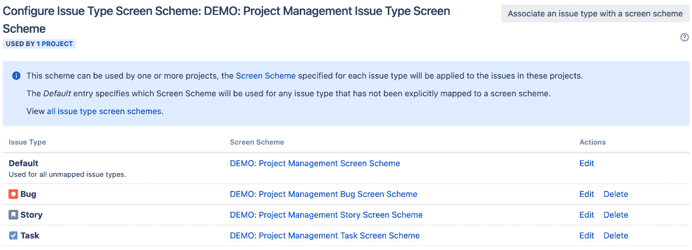

# 第六章：屏幕管理

字段收集用户数据，你已经看到如何从各种字段类型中创建自定义字段，以满足不同的需求。数据收集确实是任何信息系统的核心，但这只是故事的一部分。将字段进行合理组织，同样重要，这样用户才不会感到不知所措，字段的一般流程需要在逻辑上进行结构化，并分组到各个部分。这正是屏幕发挥作用的地方。

在本章中，我们将从上一章的内容继续，探讨字段与屏幕之间的关系。我们将进一步讨论如何使用屏幕自定义你的 Jira，以提供更好的用户体验。到本章结束时，你将学到以下内容：

+   屏幕是什么以及如何创建它们

+   如何将字段添加到屏幕中

+   如何将屏幕拆分成具有选项卡的逻辑部分

+   屏幕与问题操作之间的关系

+   如何将屏幕与项目和问题类型关联

+   作为项目管理员，如何配置项目特定的屏幕

# 理解 Jira 和屏幕

在你开始使用屏幕之前，首先需要了解它们是什么以及它们在 Jira 中如何使用。与普通的纸质表单相比，Jira 中的字段就像是你需要填写的复选框和空白区域，而屏幕则像是表单本身。当在 Jira 中创建字段时，它们需要添加到屏幕中，才能向用户展示。

在大多数情况下，屏幕与问题操作相关联，如创建、查看和编辑问题。这种关联定义在**屏幕方案**中。这样，你可以为不同的操作设置不同的屏幕。屏幕方案然后与**问题类型屏幕方案**相关联，当应用到项目时，它会将屏幕方案映射到问题类型。这让每个项目中的问题类型都有自己的屏幕集。屏幕唯一会被直接使用的情况是它与工作流转换相关联时。在 Jira 中，工作流定义了问题可能经历的各种状态。例如，一个问题可以从“打开”变为“关闭”。转换是将问题从一个状态移到下一个状态的操作，如果你选择，Jira 允许你将屏幕作为操作的一部分进行展示。我们将在*第七章*，*工作流与* *业务流程*中详细讲解工作流。

为帮助你了解如何在 Jira 中使用屏幕，Atlassian 提供了以下图表，概述了字段、屏幕及其相应方案之间的关系：

图 6.1 – 屏幕与方案

既然我们已经对屏幕有了基本了解，让我们开始看看如何在 Jira 中创建和管理屏幕。

# 使用屏幕

虽然许多其他软件系统提供的用户屏幕展示控制较为有限，但 Jira 在屏幕自定义方面非常灵活。你可以创建自己的屏幕，并决定将哪些字段放置在屏幕上以及字段的顺序。你还可以决定在进行问题操作时，哪些屏幕需要显示。在 Jira 中，你可以为以下操作创建和设计自定义屏幕：

+   在**创建问题**对话框中创建问题

+   编辑一个问题时，当问题正在被更新

+   在问题创建后，用户查看问题时的屏幕

+   在工作流中过渡一个问题

屏幕由管理控制台集中管理，这意味着你需要是 Jira 管理员才能创建和配置屏幕。请按照以下步骤访问**查看** **屏幕**页面：

1.  以 Jira 管理员用户身份登录。

1.  浏览到 Jira 管理控制台。

1.  选择**问题**标签，然后选择**屏幕**选项。这将打开**查看** **屏幕**页面。

**查看屏幕**页面列出了当前在你的 Jira 实例中可用的所有屏幕。你可以选择一个屏幕，并配置该屏幕上将显示哪些字段，并决定如何将屏幕分为多个标签。

对于这里列出的每个屏幕，Jira 还会告诉你每个屏幕属于哪个屏幕方案，并且使用了哪些工作流。你可能已经注意到，对于那些属于屏幕方案或工作流的屏幕，没有**删除**选项，因为你无法删除正在使用的屏幕。你需要先将屏幕与屏幕方案和/或工作流解除关联，才能删除它们，如下图所示：

图 6.2 – 查看屏幕

如前面的截图所示，对于每个屏幕，你可以执行以下操作：

+   **配置**：此操作配置将显示哪些字段在屏幕上。不要与编辑操作混淆。

+   **编辑**：此操作更新屏幕的名称和描述。

+   **复制**：此操作会复制选定的屏幕，包括其标签和字段配置。

+   **删除**：此操作从 Jira 中删除屏幕。只有当该屏幕未被屏幕方案或工作流使用时，才能执行此操作。

这里列出的屏幕不影响 Jira Service Desk。我们将在*第十一章*，*Jira 服务管理*中介绍 Jira Service Desk 的屏幕和字段配置。接下来，让我们来看看 Jira 默认的屏幕，以及如何创建你自己的屏幕。

## 添加新屏幕

Jira 默认提供了几个屏幕（如下所示），并且每次创建新项目时，都会根据您选择的模板为项目创建一组新的屏幕。这些项目特定的屏幕将以项目的关键字开头，例如**HD: 任务管理查看问题屏幕**，其中 HD 是项目的关键字：

+   **默认屏幕**：此屏幕用于创建、编辑和查看问题。

+   **解决问题屏幕**：此屏幕用于解决和关闭问题。

+   **工作流屏幕**：此屏幕在通过工作流转换问题时使用（如果配置为有屏幕，如**重新打开问题**）。

虽然默认屏幕和为您的项目自动创建的屏幕可以覆盖最基本的需求，但您很快就会发现它们无法满足需求，届时需要进行调整。例如，如果您想将某些字段设置为只读，例如优先级，以确保在问题创建后无法更改，您可以通过为创建和编辑问题设置不同的屏幕来实现。另一个例子是为不同的 Issue 类型（如**Bug**和**Task**）设置不同的创建和编辑屏幕。在这些情况下，您需要使用以下步骤在 Jira 中创建自己的屏幕：

1.  浏览到**查看** **屏幕**页面。

1.  点击**添加屏幕**按钮。这将弹出**添加屏幕**对话框。

1.  为新屏幕输入一个有意义的名称和描述。最好根据屏幕的用途为其命名，例如**HD: Bug 创建屏幕**，以表明这是为项目 HD 创建新 Bug 问题的屏幕。

1.  点击**添加**按钮以创建屏幕。

此时，您的新屏幕是空白的，没有任何字段。Jira 中的字段按从上到下的单列顺序排列和显示。您可以完全控制可以添加哪些字段以及它们的排列顺序。

唯一的例外是**查看**屏幕。当您查看问题时，字段会按类型分组。例如，报告人和受理人等用户字段会一起显示在页面的右上方。还需要注意，对于系统字段，如**摘要**和**问题**，即使您将其移除屏幕，它们在查看问题时仍然会显示。对于这些字段，您不能更改其在屏幕上的位置。

## 向屏幕添加字段

当您首次创建屏幕时，它几乎没有任何用处。要使屏幕能向用户展示内容，您必须首先将字段添加到屏幕上：

1.  点击您希望添加字段的屏幕旁的**配置**链接。

1.  通过在**字段**名称下拉列表中输入字段名称来选择你想添加的字段。Jira 会在你输入时自动匹配字段，如下图所示。如果你没有找到想要的字段，请确保它没有已经出现在屏幕上或其他标签上。标签的详细内容将在后续章节中讨论：

图 6.3 – 向屏幕添加字段

字段会被添加到列表的底部。你可以通过简单地上下拖动来重新排序字段列表。

## 从屏幕删除字段

字段可以从屏幕中删除。当一个字段被移除时，屏幕展示给用户时将不再显示该字段。删除字段和隐藏字段之间有一个微妙的区别（如在*第五章*中讨论的，*字段管理*）。虽然两者都会阻止字段显示，但通过移除字段，创建问题时该字段不会获得值。当字段配置为具有默认值时，这一点尤为重要。若字段从屏幕中移除，问题将不会获得该字段的默认值，而如果字段仅仅是隐藏的，则默认值将被应用。

删除屏幕字段时，你也需要特别小心，因为没有确认对话框。确保不要删除必填字段，如**摘要**，这些字段是在创建新问题时使用的。如在*第五章*中所述，*字段管理*，Jira 会防止你隐藏被标记为必填的字段，但 Jira 不会阻止你将必填字段从屏幕上移除。因此，你可能会遇到这样的情况：Jira 要求某个字段的值，但该字段在屏幕上并不存在。这可能会导致终端用户看到非常令人困惑的错误信息。要从屏幕中移除字段，请执行以下操作：

1.  点击你希望删除字段的屏幕上的**配置**链接。

1.  将鼠标悬停在你想删除的字段上，然后点击**X**（删除）按钮。

当你从屏幕中删除字段时，现有问题不会失去该字段的值。只要你重新添加该字段，值会再次显示。

## 使用屏幕标签

在大多数情况下，你会按顺序将字段添加到屏幕上，用户会从上到下填写这些字段。然而，也有可能因为需要的字段太多，屏幕变得过于复杂和凌乱，或者你可能只是希望以某种方式将几个字段逻辑分组，并将它们与其他字段分开。这时，标签功能就派上用场了。

如果你把屏幕看作是用户必须填写的整个表单，那么标签就是构成整个文档的单独页面或部分。标签从左到右排列，因此设计标签时，最好让它们从左到右合理地流动。例如，第一个标签可以收集一般信息，如摘要和描述。随后的标签将收集更多特定领域的信息，如下所示：

图 6.4 – 屏幕标签

## 向屏幕添加标签

你可以在 Jira 中的任何屏幕上添加标签。实际上，默认情况下，所有屏幕都有一个名为**字段标签**的默认标签，用于承载所有字段。你可以向屏幕添加新标签，以便分解和更好地管理屏幕展示，如下所示：

1.  浏览到**查看** **屏幕**页面。

1.  点击你希望添加新标签的屏幕的**配置**链接。

1.  点击字段列表上方的**+**按钮，并为标签输入名称。

1.  点击**添加**按钮以创建标签。

标签是水平从左到右排列的。当你向屏幕添加新标签时，它会被附加到列表的末尾。你可以通过拖动标签在列表中左右调整标签的顺序，如下截图所示：

图 6.5 – 添加新的屏幕标签

你还可以通过拖动字段并将其悬停到目标标签上，将字段从一个标签移动到另一个标签。这将节省你手动从标签中删除字段然后将其添加到新标签的时间。

注意

需要记住的一点是，如果标签上没有字段，标签将不会显示。

## 编辑/删除标签

就像屏幕一样，你可以通过编辑标签名称和/或从屏幕中删除它们来管理现有标签。执行以下步骤以编辑标签名称：

1.  浏览到**查看** **屏幕**页面。

1.  点击你希望编辑的标签所在屏幕的**配置**链接。

1.  通过点击选择标签。

1.  点击编辑图标，并为标签输入一个新名称。

1.  点击**保存**按钮以应用更改。

当你删除标签时，标签上的字段将被移出屏幕。如果你仍然希望这些字段出现在屏幕上，你需要重新添加或将它们移动到其他标签。你不能删除屏幕上的最后一个标签。删除标签的步骤如下：

1.  浏览到**查看** **屏幕**页面。

1.  点击你希望编辑标签所在屏幕的**配置**链接。

1.  通过点击选择标签。

1.  点击删除图标。Jira 会要求你确认是否删除该标签，并列出所有当前存在的字段。

1.  点击**删除**按钮将标签从屏幕中移除。

## 编辑/删除屏幕

你可以通过更新现有屏幕的详细信息来编辑屏幕，以帮助保持配置的最新和一致。执行以下步骤以编辑屏幕：

1.  浏览到**查看** **屏幕**页面。

1.  点击你希望更新的屏幕的**编辑**链接。这将带你到**编辑** **屏幕**页面。

1.  更新屏幕的名称和描述。

1.  点击**更新**按钮以应用你的更改。

要删除一个现有的屏幕，它不能被任何屏幕方案或工作流使用。如果它与屏幕方案或工作流关联，你将无法删除它。你需要先取消关联。按照以下步骤删除屏幕：

1.  浏览到**查看** **屏幕**页面。

1.  点击**删除**链接以删除你希望移除的屏幕。这将带你到**删除屏幕**页面进行确认。

1.  点击**删除**按钮以移除该屏幕。

删除屏幕时，并不会从系统中删除屏幕上的字段。

## 复制屏幕

屏幕有时可能很复杂，因此，如果已有类似的屏幕，创建一个全新的屏幕可能不是最高效的方法。就像 Jira 中的许多其他实体一样，你可以复制一个现有的屏幕，从而减少重新添加所有字段所需的时间：

1.  浏览到**查看** **屏幕**页面。

1.  点击**复制**链接以复制你希望复制的屏幕。

1.  输入屏幕的新名称和描述。

1.  点击**复制**按钮以复制该屏幕。

注意

当你复制一个屏幕时，它也会复制该屏幕上的所有标签。

我们已经了解了如何创建和配置屏幕；接下来，我们将看看如何使用屏幕方案将屏幕应用于问题操作。

# 使用屏幕方案

你已经了解了如何创建和管理屏幕，以及如何配置要添加到屏幕的字段。接下来的一步是让 Jira 知道在哪个问题操作中使用哪个屏幕。

屏幕在问题操作中显示，屏幕方案定义了屏幕与操作之间的映射。通过屏幕方案，你可以控制屏幕显示哪些问题操作，如下所示：

+   **创建问题**：当你创建一个新问题时，会显示此屏幕。

+   **编辑问题**：当你编辑现有问题时，会显示此屏幕。

+   **查看问题**：当你查看一个问题时，显示此屏幕。

就像屏幕一样，每当你在 Jira 中创建一个新项目时，会为你的项目创建一个新的屏幕方案，并且屏幕会自动分配给这些问题操作。

创建的默认设置通常足够让你开始使用。然而，也有时候你不希望某些字段在问题创建后可供编辑。另一个例子是，在创建时某些字段可能不需要，因为所需的信息在此时可能不可用。因此，为了避免让用户感到困惑和/或不知所措，在问题创建时省略这些字段，等到信息可用时再要求填写。

如您所见，通过为每个问题操作使用不同的屏幕，而不是采用“一种屏幕适用所有”的方法，Jira 为您提供了更高的灵活性来控制和设计您的屏幕。像往常一样，如果屏幕之间没有显著差异，例如创建和编辑操作，建议您创建一个基础屏幕，并使用**复制屏幕**功能来减少工作量。

就像屏幕一样，您需要成为 Jira 管理员才能管理屏幕方案。执行以下步骤来管理屏幕方案：

1.  浏览到 Jira 管理控制台。

1.  选择**问题**标签，然后选择**屏幕方案**选项，进入**查看屏幕** **方案**页面：

图 6.6 – 查看屏幕方案

在**查看屏幕方案**页面，您将能够看到所有现有屏幕方案的列表，创建和管理它们的配置，并查看它们与问题类型屏幕方案的关联（这将在*问题类型屏幕方案*部分进行解释）。我们从创建新的屏幕方案开始。

## 添加屏幕方案

通常，您将使用 Jira 为您的项目创建的屏幕方案。然而，也会有需要多个屏幕方案的情况。例如，如果您需要根据项目中的不同问题类型显示不同的屏幕集合，则需要为每个问题类型创建一个新的屏幕方案。执行以下步骤来创建新的屏幕方案：

1.  浏览到**查看屏幕** **方案**页面。

1.  点击**添加屏幕** **方案**按钮。

1.  为新屏幕方案输入名称和描述。就像屏幕一样，采用一个一致的命名模式来描述屏幕方案的用途是一个好主意，例如**DEMO: Bug** **屏幕方案**。

1.  从屏幕列表中选择一个默认屏幕。当没有特定的问题操作映射时，将显示此屏幕。

1.  点击**添加**按钮来创建屏幕方案。

在此阶段，新屏幕方案尚未使用。这意味着它还没有与任何问题类型的屏幕方案关联（问题类型屏幕方案将在后续章节中讨论）。新屏幕方案将使用与您默认屏幕相同的屏幕进行所有问题操作。现在，如果您希望使用相同的屏幕进行创建、编辑和查看操作，那么您已经准备就绪；无需进一步配置您的屏幕方案。然而，如果您需要为不同的问题操作显示不同的屏幕，则需要建立这种关联。

当问题操作没有与屏幕关联时，将应用所选的默认屏幕。如果稍后为问题操作指定了屏幕关联，则特定的关联将优先于一般的回退默认屏幕。

## 将屏幕与问题操作关联

每个问题操作只能与一个屏幕关联。执行以下步骤将问题操作与屏幕关联：

1.  点击您想要更新的屏幕方案的**配置**链接。

1.  点击**将问题操作与屏幕关联**按钮。

1.  选择要分配到屏幕的操作。

1.  选择要与问题操作关联的屏幕。

1.  点击**添加**按钮以创建关联。

图 6.7 – 配置屏幕方案

如前所示的截图所示，**创建问题**和**编辑问题**操作分别与**DEMO: 项目管理创建问题屏幕**和**DEMO: 项目管理编辑问题屏幕**关联。由于我们没有与**查看问题**操作关联的屏幕，因此将使用默认关联**DEMO: 项目管理查看问题屏幕**。

## 编辑/删除关联

在您为问题操作创建了一个关联后，Jira 会阻止您为同一问题操作创建另一个关联，通过将其从可用选项列表中移除。为了将关联更改为不同的屏幕，您需要编辑现有的关联，如下所示：

1.  点击您想要更新的屏幕方案的**配置**链接。

1.  点击您希望编辑的关联的**编辑**链接。

1.  选择一个新的屏幕与问题操作关联。

1.  点击**更新**按钮以应用更改。

如果您决定不再需要一个或多个现有的关联，您可以通过执行以下步骤将它们从屏幕方案中删除：

1.  点击您想要更新的屏幕方案的**配置**链接。

1.  点击您希望删除的关联的**删除**链接。

请注意，与其他类似操作不同，删除问题操作关联时不会弹出确认页面。只要您点击**删除**链接，关联就会立即被删除。

## 编辑/删除屏幕方案

您可以更新现有屏幕方案的详细信息，如名称和描述。为了更改默认屏幕选择，您需要配置屏幕方案，后续部分将讲解此内容。执行以下步骤以编辑现有的屏幕方案：

1.  浏览到**查看屏幕** **方案**页面。

1.  点击您希望编辑的屏幕方案的**编辑**链接。

1.  使用新值更新名称和描述。

1.  点击**更新**按钮以应用更改。

不活跃的屏幕方案也可以删除。如果屏幕方案是活跃的（即与问题类型屏幕方案相关联），则**删除**选项将不可用。执行以下步骤以删除屏幕方案：

1.  浏览到**查看屏幕** **方案**页面。

1.  点击您想要删除的屏幕方案的**删除**链接。

1.  点击**删除**按钮确认你希望删除该屏幕方案。

## 复制屏幕方案

虽然屏幕方案没有屏幕那么复杂，但仍然会有一些时候你希望复制一个现有的屏幕方案，而不是从头开始创建一个。你可能希望复制方案中的屏幕/问题操作关联，我们将在接下来的部分中介绍，或者在对方案进行任何更改之前，快速备份一份方案。

执行以下步骤以复制一个现有的屏幕方案：

1.  浏览到**查看屏幕** **方案**页面。

1.  点击你希望复制的屏幕方案旁边的**复制**链接。

1.  输入屏幕方案的新名称和描述。

1.  点击**复制**按钮复制选定的屏幕方案。

就像创建新的屏幕方案一样，复制的屏幕方案默认是非激活的。

# 问题类型屏幕方案

屏幕方案将屏幕组合在一起，并与问题操作建立关联。接下来的步骤是告诉 Jira 在创建、查看和编辑特定类型问题时使用我们的屏幕方案。

我们不会直接将屏幕方案与 Jira 关联。这样做的原因是 Jira 具有灵活性，允许你按每个问题类型进行定义。这意味着，你可以为不同的问题类型使用不同的屏幕方案，而不是强制一个项目中的所有问题类型都使用相同的屏幕方案。这个极其灵活和强大的功能是通过**问题类型** **屏幕方案**提供的。

就像屏幕和屏幕方案一样，你需要是 Jira 管理员才能创建和管理问题类型屏幕方案。执行以下步骤来管理问题类型屏幕方案：

1.  浏览到 Jira 管理控制台。

1.  选择**问题**选项卡，然后选择**问题类型屏幕方案**选项，打开**问题类型屏幕** **方案**页面：

图 6.8 – 查看问题类型屏幕方案

就像屏幕方案一样，当你创建项目时，Jira 会自动创建一个问题类型屏幕方案。由于一个项目只能关联一个问题类型屏幕方案，通常你无需自己创建新的方案。不过，也有可能你想创建一个新的方案，例如在进行一些新的配置实验时，同时又想保留现有方案，以便在需要回滚时使用。

执行以下步骤以创建一个新的问题类型屏幕方案：

1.  浏览到**问题类型屏幕** **方案**页面。

1.  点击**添加问题类型屏幕** **方案**按钮。

1.  为新的问题类型屏幕方案输入名称和描述。

1.  从屏幕方案列表中选择一个默认的屏幕方案。

1.  点击**添加**按钮创建问题类型屏幕方案。

没错，你猜对了！新的问题类型屏幕方案尚未启用。它只有在应用到一个或多个项目后才会生效，我们稍后会看到，但让我们先来看一下如何将屏幕方案与问题类型关联。

## 将问题类型关联到屏幕方案

Jira 通过在屏幕方案和问题类型之间建立关联来确定使用哪个屏幕方案。每个问题类型只能关联一个屏幕方案，但每个屏幕方案可以关联多个问题类型。

执行以下步骤以添加新的关联：

1.  点击你希望配置的**问题类型屏幕方案**的**配置**链接。

1.  点击**将问题类型与屏幕方案关联**按钮。

1.  选择要添加关联的问题类型。

1.  选择要与问题类型关联的屏幕方案。

1.  点击**添加**按钮以创建关联：

图 6.9 – 配置问题类型屏幕方案

如上图所示，**故事**、**任务**和**缺陷**问题类型分别与**DEMO: 项目管理故事屏幕方案**、**DEMO: 项目管理任务屏幕方案**和**DEMO: 项目管理缺陷屏幕方案**显式关联。所有其他问题类型，如**子任务**，将与默认的**DEMO: 项目管理屏幕方案**关联。

## 编辑/删除关联

你可以更新现有的关联，比如默认关联，这是在创建新问题类型屏幕方案时自动创建的：

1.  点击你希望配置的**问题类型屏幕方案**的**配置**链接。

1.  点击你希望编辑的关联的**编辑**链接。

1.  选择一个新的屏幕方案，并将其与问题类型关联。

1.  点击**更新**按钮以应用更改。

如果你不再需要显式设置某些问题类型的关联，也可以删除现有的关联。然而，你不能删除默认关联，因为它作为一个捕获所有没有定义关联的问题类型的“备选项”存在。这一点非常重要，因为，虽然你现在可能已经为所有问题类型创建了关联，但未来可能会添加新的问题类型，而忘记为它们创建关联。要删除关联，请执行以下步骤：

1.  点击你希望配置的**问题类型屏幕方案**的**配置**链接。

1.  点击你希望删除的关联的**删除**链接。

与屏幕方案中的关联一样，你不会进入确认对话框，关联会立即被删除。

## 编辑/删除问题类型屏幕方案

你可以更新现有问题类型屏幕方案的名称和描述。要更改其屏幕方案/问题类型关联的详细信息，你需要配置问题类型屏幕方案，这将在后续章节中讲解。执行以下步骤以更新问题类型屏幕方案：

1.  浏览到**问题类型屏幕**方案页面。

1.  点击要编辑的问题类型屏幕方案的**编辑**链接。

1.  使用新值更新名称和描述。

1.  点击**更新**按钮以应用更改。

就像 Jira 中的所有其他方案一样，不能删除正在使用的问题类型屏幕方案。在 Jira 允许你删除该方案之前，必须确保没有项目在使用它。要删除问题类型屏幕方案，请执行以下步骤：

1.  浏览到**问题类型屏幕**方案页面。

1.  点击你希望删除的问题类型屏幕方案的**删除**链接。

1.  点击**删除**按钮以移除问题类型屏幕方案。

## 复制问题类型屏幕方案

在 Jira 中也可以进行问题类型屏幕方案克隆。你可以轻松地复制现有的问题类型屏幕方案。这个功能的一个非常有用的应用是，它允许你在尝试新配置之前先制作备份副本。请注意，复制问题类型屏幕方案不会备份它所包含的屏幕方案和屏幕。

执行以下步骤以复制现有的问题类型屏幕方案：

1.  浏览到**问题类型屏幕**方案页面。

1.  点击你希望复制的问题类型屏幕方案的**复制**链接。

1.  为问题类型屏幕方案输入新的名称和描述。

1.  点击**复制**按钮以复制所选方案。

1.  新创建的问题类型屏幕方案默认是非活动的，而克隆的方案则没有被任何项目使用。

将屏幕、屏幕方案和问题类型屏幕方案结合起来的最后一步是将问题类型屏幕方案应用到一个项目。

# 将问题类型屏幕方案与项目关联

将屏幕投入使用的最后一步是将问题类型屏幕方案与要使用的项目关联起来。执行以下步骤以关联你的新问题类型屏幕方案：

1.  浏览到目标项目的管理页面。

1.  点击左侧面板中的**屏幕**选项。

1.  从**操作**菜单中选择**使用不同方案**选项：

图 6.10 – 将问题类型屏幕方案关联到项目

1.  从**方案**选择列表中选择问题类型屏幕方案。

1.  点击**关联**按钮。

一旦将问题类型屏幕方案与项目关联，Jira 会显示映射的详细信息，如前面截图所示。

# 委托屏幕管理

屏幕配置的管理以前是由 Jira 管理员集中控制的。项目管理员只能选择使用哪个问题类型屏幕方案，但如果需要对屏幕进行修改，Jira 管理员仍然需要参与。这通常会在一些简单的操作中形成瓶颈，比如添加或移除屏幕上的字段，尤其是对于有很多项目但只有少数 Jira 管理员的大型组织。

Jira 现在有一个新功能叫做**扩展项目管理**，它通过允许项目管理员更改项目使用的屏幕，来增强项目管理员的权限。

扩展项目管理通过权限设置来控制，详细内容我们将在*第九章*中讨论，*确保 Jira 安全性*。

然而，这里有一些限制，具体如下：

+   屏幕不能是默认的系统屏幕

+   屏幕必须已经被项目使用

+   屏幕不能与其他项目共享，或者作为工作流中的过渡屏幕使用

+   只能将系统中已经存在的字段添加到屏幕上

本质上，这意味着作为项目管理员，你只能更改专门为单个项目分配的屏幕。如果屏幕与多个项目共享，你仍然需要 Jira 管理员的帮助。作为项目管理员，要更改项目的屏幕，请执行以下步骤：

1.  浏览到目标项目的管理页面。

1.  点击左侧面板中的**屏幕**选项。

1.  展开问题类型并选择你想要配置的屏幕。

如果屏幕可以配置，你应该看到类似下图的内容，里面展示的是熟悉的屏幕配置页面，但现在显示在项目的上下文中：

图 6.11 – 委托屏幕管理

# 故障排除字段和屏幕

正如我们在本章和前几章中看到的，许多因素可以控制一个字段是否显示。当预期的字段没有显示时，可能会非常混淆和沮丧，因为有许多配置需要检查，比如屏幕、字段配置等等。正因为如此，Jira 提供了一个方便的工具，可以帮助你确定为什么某个字段在特定问题中没有显示。要使用字段助手工具，请执行以下操作：

1.  浏览到你没有看到该字段的问题。

1.  点击**管理员**下拉菜单，然后选择**我的字段在哪里？**选项：

图 6.12 – 字段助手

1.  选择你想检查的字段：

图 6.13 – 字段助手结果

正如我们从前面的截图中看到的，**归档器**字段没有显示在问题上，因为该字段在当前问题中没有值。所以，这样可以节省你检查该字段是否已添加到屏幕上的时间，或者检查字段配置是否已将该字段设置为隐藏。

# HR 项目

凭借你在本章中收集的新知识，结合上一章的字段，现在是时候进一步自定义你的 Jira，以通过展示提供更好的用户体验。

这次我们要做的是创建新屏幕并将其应用于我们的 HR 项目。我们希望将显示通用字段的新字段与我们为处理员工入职和离职而设计的专门自定义字段分开。我们还希望仅将更改应用于**新员工**和**离职**类型的问题，而不影响项目中的其他问题类型。和任何生产系统的更改一样，在应用更改之前，确保备份当前数据是至关重要的。

## 设置屏幕

在*第五章*中，*字段管理*，你为我们的 HR 团队创建了一些专门的自定义字段。我们遇到的问题是，所有的新字段都出现在**新员工**和**离职**问题类型中，不管它们是否适用，这是因为这两种问题类型使用相同的屏幕集。

为了解决这个问题，我们将创建两套新的屏幕集，一套用于**新员工**，一套用于**离职**。默认的屏幕集可以保留给项目中的其他问题类型，例如**任务**。

最简单的方法是克隆现有的屏幕，这样我们就不必手动添加所有字段，避免不小心忘记添加字段。要为每种问题类型创建屏幕，请执行以下步骤：

1.  浏览到**查看屏幕**页面并点击**HR: 任务管理创建** **问题屏幕**的**复制**链接。

1.  将新屏幕命名为**HR: 创建/查看新** **员工屏幕**。

1.  点击**复制**按钮以创建屏幕。

既然我们已经有了新屏幕，现在是时候使用以下步骤配置它的字段了。由于此屏幕用于创建**新员工**问题，我们不需要**最后一天**字段：

1.  点击我们新建的**HR: 创建/查看新** **员工屏幕**的**配置**链接。

1.  将**最后一天**字段移除，方法是将鼠标悬停在其上并点击其**移除**按钮。

为了让事情更有趣，我们还可以创建一个新的**人员**标签，并将所有与人员相关的字段（如**指派人**、**报告人**和**直接经理**字段）移动到该标签下。

我们已经创建并配置了我们的创建屏幕。我们的新编辑屏幕将与此类似，仅有一些小修改。按照以下步骤操作，因为我们不希望用户在问题创建后更改问题类型，所以要移除**问题类型**字段：

1.  点击**复制**链接以获取**HR: 创建/查看新员工屏幕**。

1.  将新屏幕命名为**HR: 编辑新员工屏幕**。

1.  点击**复制**按钮创建新屏幕。

1.  移除**问题** **类型**字段。

针对**离职**问题类型重复这些步骤创建新的屏幕组。这一次，不是移除**最后一天**字段，而是从两个屏幕中移除**直接经理**字段。

## 设置屏幕方案

在创建并配置好屏幕后，我们现在需要将它们与问题操作关联起来，以便 Jira 知道在何种操作中显示新屏幕，步骤如下：

1.  浏览到**查看屏幕方案**页面，点击**添加** **屏幕方案**。

1.  将新屏幕方案命名为**HR: 新员工** **屏幕方案**。

1.  选择**HR: 创建/查看新员工屏幕**作为默认屏幕。

1.  点击**添加**按钮创建屏幕方案。

在我们的屏幕方案设置好后，是时候将屏幕与其各自的问题操作关联起来，如下所示：

1.  点击**将问题操作与屏幕**按钮。

1.  选择**HR: 编辑新员工屏幕**用于**编辑** **问题**操作。

由于我们将**HR: 创建/查看新员工屏幕**分配给了**默认**，该屏幕将应用于未映射的操作——**创建问题**和**查看问题**。如果你选择显式设置这两个操作的映射，将没有区别。

我们已经为**新员工**问题类型创建了屏幕方案。现在，针对**离职**问题类型重复相同的步骤。

## 设置问题类型屏幕方案

现在，你需要将新创建的屏幕方案应用到正确的问题类型。由于 Jira 已经为我们的项目创建了问题类型屏幕方案，我们只需要配置它，使用以下步骤将新的屏幕方案应用到适当的问题类型：

1.  浏览到**问题类型屏幕方案**页面，点击**配置**链接，进入**HR: 任务管理问题类型** **屏幕方案**。

1.  点击**将问题类型与屏幕** **方案**关联按钮。

1.  选择**新员工**作为**问题类型**。

1.  选择**HR: 新员工屏幕方案**作为要关联的屏幕方案。

1.  点击**添加**按钮以创建关联。

这样可以确保**新员工**类型的问题将应用你的新屏幕，而其他类型的问题不会受到影响。现在，重复步骤将**离职**问题类型与其屏幕方案关联。

## 汇总

由于我们通过将各种问题类型与新的屏幕方案关联来重用现有的问题类型屏幕方案，因此无需进行任何额外更改。然而，如果你创建了一个新的问题类型屏幕方案，那么需要将其与 HR 项目关联。

现在你可以看看你辛勤工作的成果，看看你定制的屏幕、字段和标签如何协同工作，呈现给你一个用于收集用户数据的定制表单。让我们继续创建一个新事件，看看你刚刚定制的**创建问题**屏幕会是什么样子，如下图所示：

图 6.14 – 人力资源项目结果

如你所见，在创建**新员工**问题时，**最后一天**字段不再显示在屏幕上，而与人员相关的字段现在显示在新的**人员**标签页中。如果你创建一个新的**离职**问题，**直接经理**字段将不会显示。

# 总结

在本章中，我们研究了 Jira 如何通过屏幕来结构化它的展示。我们看到了如何通过屏幕方案在 Jira 中使用屏幕，屏幕方案将屏幕映射到问题操作。我们还了解了问题类型屏幕方案如何将屏幕方案映射到问题类型。因此，对于任何给定的项目，每个问题类型可以有自己的一组屏幕用于创建、编辑和查看。我们还讨论了如何将屏幕分解成标签，以提供更合理的字段分组，特别是当屏幕上有很多字段时。

配合前一章中介绍的自定义字段，我们现在可以创建有效的屏幕设计，以简化数据收集。在下一章中，我们将深入探讨工作流，这是 Jira 最强大的功能之一。

# 第三部分：Jira 高级功能

在本书的最后部分，你将接触到一些 Jira 的高级功能。你将探索 Jira 的安全模型；理解并学习搜索、报告和分析功能；并了解 Jira Service Desk，它使 Jira 能作为一个支持门户来运行。

本部分包括以下章节：

+   *第七章*，*工作流与业务流程*

+   *第八章*，*电子邮件与通知*

+   *第九章*，*Jira 安全性*

+   *第十章*，*搜索、报告与分析*

+   *第十一章*，*Jira 服务管理*

+   *第十二章*，*Jira 与第三方应用*
