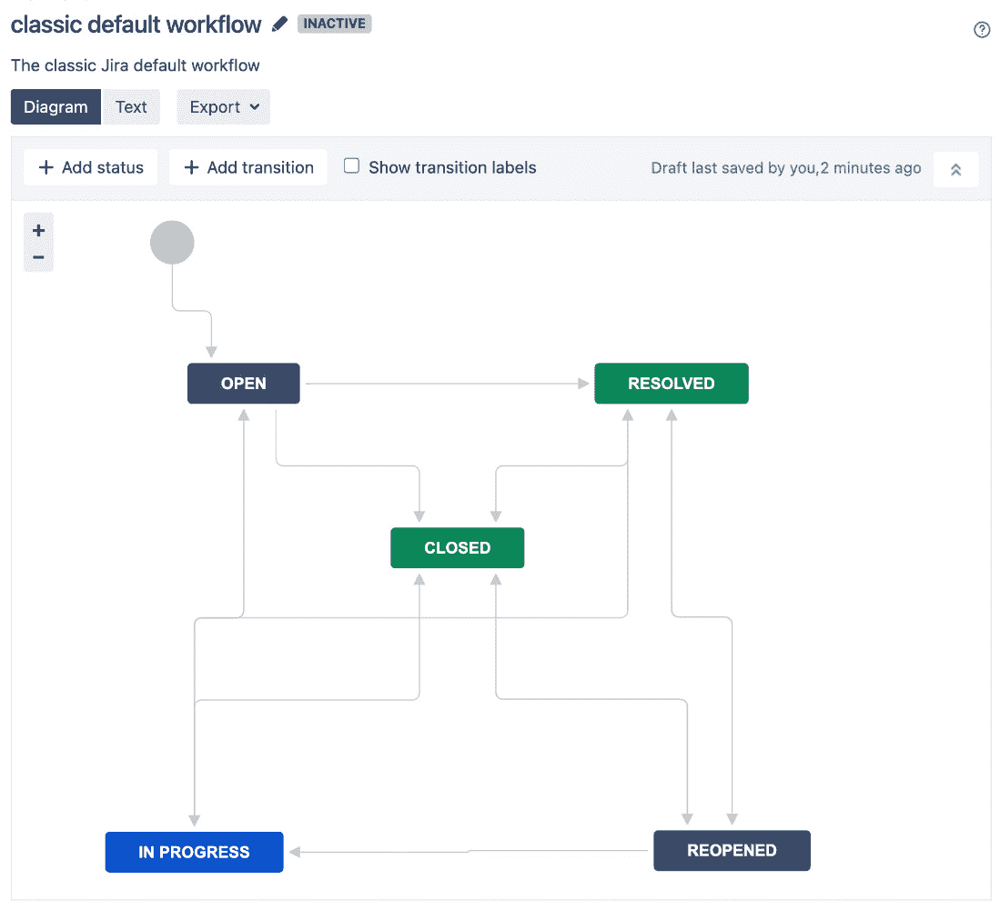
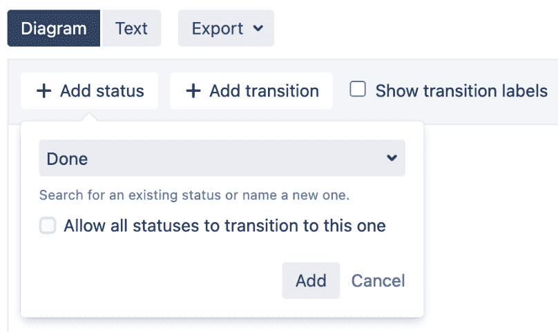
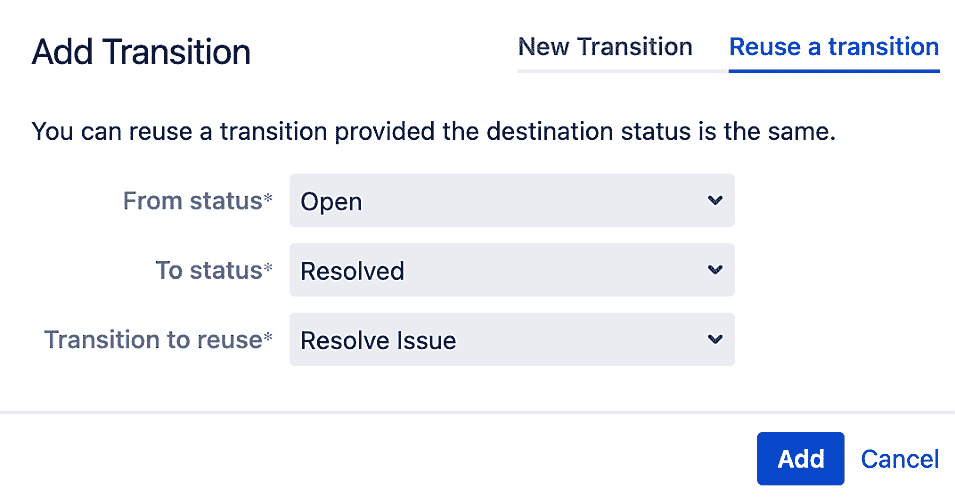
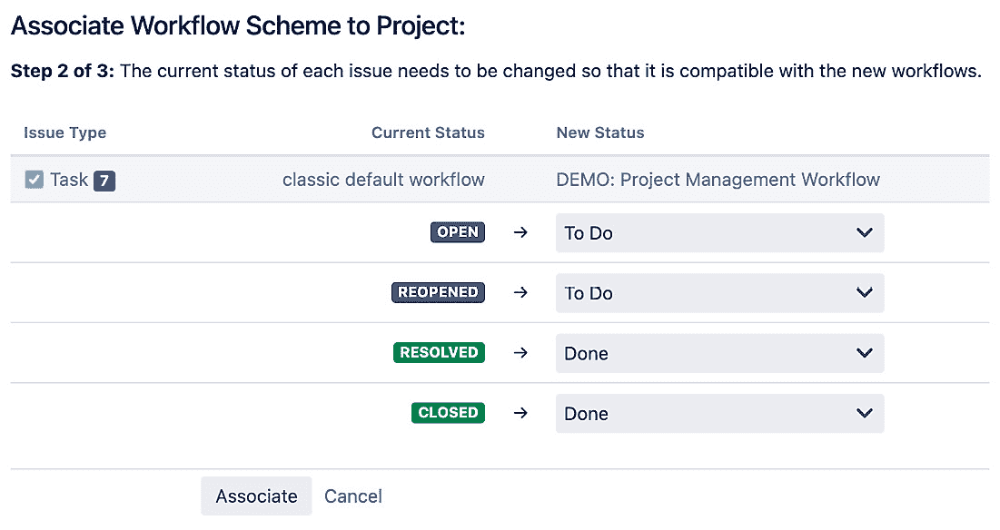

# 第七章：工作流与业务流程

在前几章中，我们学习了 Jira 的一些基础知识，并了解了如何使用自定义字段和屏幕来定制其数据收集和展示。在本章中，我们将深入探讨工作流，这是 Jira 的核心且最强大的功能之一。

工作流控制 Jira 中问题从一个状态到另一个状态的移动，通常是从一个责任人传递到另一个责任人。与许多其他系统不同，Jira 允许你创建自己的工作流，以便与您的流程相似。

到本章结束时，你将学到以下内容：

+   工作流是什么以及它包含什么

+   工作流与屏幕之间的关系

+   状态、转换、条件、验证器和后置功能是什么

+   如何使用工作流设计器创建你自己的工作流

+   如何将工作流与项目关联

具体来说，我们将讨论以下内容：

+   映射业务流程

+   理解工作流

+   管理工作流

+   使用工作流设计器

+   创建工作流

+   更新现有的工作流

+   理解工作流方案

+   将工作流方案应用于项目

+   委派的工作流管理

+   通过工作流插件扩展工作流

+   **人力资源**（**HR**）项目

# 映射业务流程

常说，一个好的软件系统是能够适应你的业务，而不是要求你的业务去适应软件。Jira 是前者的一个优秀示例。Jira 的强大之处在于，你可以轻松配置它，通过使用工作流来模拟你现有的业务流程。

一个业务流程通常可以通过流程图来表示。例如，一个典型的审批流程可能包括提交审批、审批审核，最后是审批或拒绝请求的任务，用户需要按顺序完成这些任务。你可以轻松地将其实现为 Jira 工作流。每个任务将作为一个工作流状态来表示，转换会指引你如何从一个状态转到下一个状态。事实上，在处理工作流时，通常一个好的做法是首先绘制流程的逻辑流程图，然后将其实现为工作流。正如我们将看到的，Jira 提供了许多工具来帮助你可视化你的工作流。

现在我们已经简要了解了如何将一个普通的业务流程映射到 Jira 工作流，接下来是时候更深入地了解工作流的组件，以及如何创建你自己的工作流了。

# 理解工作流

工作流是 Jira 用来模拟业务流程的工具。它是一系列状态（步骤），问题依次经过这些状态，并且状态之间有路径（转换）。所有 Jira 中的问题都应用了工作流，基于它们的任务类型和项目。问题在工作流中从一个状态（例如，**打开**）移动到另一个状态（例如，**已关闭**）。Jira 允许你将工作流以图表的形式可视化和设计，如下所示：

图 7.1 – Jira 工作流

上面的图示显示了 Jira 中的一个简单工作流。矩形代表状态，箭头线代表连接状态的转换。正如你所看到的，这看起来很像一个普通的流程图，展示了一个过程的流动。

此外，请注意状态有不同的颜色。状态的颜色由其所属的类别决定。共有三种类别——**待办**（灰色）、**进行中**（蓝色）和**已完成**（绿色）。类别有助于通过颜色指示器轻松识别问题在工作流中的位置。

Jira 中的问题，从创建开始，会经过一系列步骤，这些步骤被称为问题状态，例如 **进行中** 和 **已关闭**。这些状态的变化通常由用户操作触发。例如，当用户点击 **开始进行** 链接时，问题会转到 **进行中** 状态，如下图所示：

图 7.2 – 问题的转换选项

工作流有明确的开始时间，即问题首次创建时，但工作流的结束时间有时是模糊的。例如，在默认工作流中，问题可以从 **打开** 转到 **已关闭**，再到 **已重新打开**，然后返回 **已关闭**。按照惯例，当人们谈论工作流的结束时，通常指的是名为 **已关闭** 的状态，或是给问题指定解决方案的状态。一旦指定了解决方案，问题就进入了一个逻辑上的结束。Jira 的几个内置功能遵循这一惯例；例如，设置了解决方案的问题将不会显示在主页的 **分配给我** 列表中。

因此，当你关闭一个问题时，应提示用户通过屏幕选择一个解决方案值，或者通过后置功能自动设置解决方案值（后置功能将在本章后面介绍）。当你重新打开一个问题时，也应清除问题的解决方案值，通常这也是通过后置功能自动完成的。

重要提示

当问题的工作完成时，应为其指定解决方案。

# 管理工作流

工作流是通过 Jira 管理控制台集中控制和管理的，因此你需要是管理员才能创建和配置工作流。要管理工作流，请执行以下步骤：

1.  以 Jira 管理员身份登录 Jira。

1.  浏览到 Jira 管理控制台。

1.  选择 **问题** 选项卡，然后选择 **工作流** 选项。这样会显示 **查看工作流** 页面：

图 7.3 – 工作流列表页面

在 **查看工作流** 页面，你将能够管理所有可用的工作流并创建新的工作流。该页面分为两个部分，**活动** 和 **非活动**。活动工作流正在被项目使用，非活动工作流则没有。默认情况下，**非活动** 部分是折叠的，因此页面只会显示活动工作流。前面的截图展示了两个部分都被展开的情况。

Jira 带有一个默认的只读工作流，名为 `jira`，主要用于保持与现有项目的向后兼容，并且应用于没有特定工作流的项目。因此，你不能编辑或删除此工作流。新项目将根据选择的模板创建自己的工作流。这些特定于项目的工作流将以项目密钥为开头，后跟项目的模板，例如 `HR: 任务管理工作流`。

## 问题状态

在 Jira 工作流中，问题状态表示工作流中某个问题的状态。它描述了问题的当前状态。如果我们将其与流程图进行比较，高亮的矩形表示问题在过程中当前的状态。就像任务只能处于业务流程的一个阶段一样，问题在任何给定时间只能处于一个状态；例如，一个问题不能同时处于开放和关闭状态。

还有一个术语叫做 **步骤**，它是工作流中表示状态的术语。由于 Jira 已简化其工作流管理，步骤和状态可以互换使用。为了保持一致性，本书将使用术语 **状态**，除非在特殊情况下需要做出区分。

## 转换

状态表示工作流中的阶段，将问题从一个状态带到下一个状态的路径被称为 **转换**。转换将两个状态连接在一起。转换不能独立存在，这意味着它必须有一个开始状态和一个结束状态，并且每个状态只能出现一次。这意味着转换不能根据条件分支到不同的目标状态。转换也是单向的。这意味着，如果一个转换将问题从状态 *A* 带到状态 *B*，你必须创建一个新的转换才能将问题从状态 *B* 返回到状态 *A*。

转换有几个组件，具体如下：

+   **条件**：必须满足的条件，才能使用户执行转换时可见（可用）。这些通常用于控制关于用户如何执行转换的权限。

+   **验证器**：这些是必须通过的验证条件，才能执行转换。它们通常与转换屏幕一起使用。

+   **后置函数**：这些是作为转换过程的一部分需要执行的附加功能。

+   **转换屏幕**：这是一个可选屏幕，当用户执行转换时显示。它通常用于在转换过程中捕捉附加信息。

+   **触发器**：如果你将 Jira 与其他开发工具（如 Bitbucket 或 GitHub）集成，触发器可以在事件发生时自动执行转换，例如创建新分支或有人进行代码提交。

重要提示

一种常见的技巧是创建一个返回自身的转换。由于转换可以有自己的屏幕，并通过后置功能执行一些业务逻辑，你可以将这种转换作为**用户界面**（**UI**）中的触发器，用于显示屏幕或运行后置功能，而无需创建复杂的自定义设置。

前三个组件中的每个定义了转换的行为，允许你在转换执行时执行前验证、后验证以及后处理。我们将在接下来的部分中深入讨论这些组件。

### 触发器

如前所述，在开始使用触发器之前，Jira 需要与以下系统之一集成：

+   Atlassian Bitbucket

+   Atlassian FishEye/Crucible

+   GitHub

触发器将监听来自集成开发工具的更改，例如代码提交，当这些更改发生时，触发器将自动执行工作流转换。请注意，发生此事件时所有权限都将被忽略。

### 条件

有时，你可能希望控制谁可以执行转换或何时可以执行转换。例如，授权问题的转换应仅限于经理组的用户，以防止普通员工自己授权请求。这时，条件就派上用场了。

**条件**是必须满足的标准，用户才能执行转换。如果转换的条件未满足，当用户查看问题时，该转换将不可用。下表列出了 Jira 随附的条件；其他条件可以通过第三方插件添加：

| **条件** | **描述** |
| --- | --- |
| **代码已提交条件** | 仅当代码已对该问题提交（或根据配置未提交）时，才允许执行此转换。 |
| **从用户界面隐藏转换** | 这将把转换隐藏对所有用户，只有通过后置功能才能触发它。这在需要作为自动化流程的一部分触发转换，而非由用户手动触发时非常有用。 |
| **无开放审查条件** | 仅当没有相关的开放 Crucible 审查时，才允许执行此转换。 |
| **仅限指派人条件** | 仅允许当前指派人执行此转换。 |
| **仅限报告人条件** | 仅允许问题的报告人执行此转换。 |
| **权限条件** | 仅允许具有指定权限的用户执行此转换。 |
| **条件** | **描述** |
| **子任务阻塞条件** | 根据所有子任务的状态，阻止父问题的转移。 |
| **未审阅代码条件** | 只有在此问题没有未审阅的变更集时，才能执行此转移。 |
| **用户处于组内** | 这只允许处于特定组内的用户执行此转移。 |
| **用户处于自定义组字段内** | 这只允许处于特定自定义组字段内的用户执行此转移。 |
| **用户处于项目角色** | 这只允许处于特定项目角色的用户执行此转移。 |

表 7.1 – 工作流条件

### 验证器

验证器类似于条件，但它们会在允许转移完成之前验证特定的条件。条件会在未满足标准时将工作流转移隐藏，而验证器则允许用户看到转移，但如果条件未满足，则不允许执行转移。

验证器的最常见用例是在转移过程中验证用户输入。例如，您可以验证用户是否为工作流屏幕上显示的所有字段输入了数据。下表显示了 Jira 自带的验证器列表；其他验证器可以通过第三方插件添加：

| **验证器** | **描述** |
| --- | --- |
| **权限验证器** | 验证用户是否具有选定的权限。当检查执行转移的人员是否拥有所需权限时，这非常有用。 |
| **用户权限验证器** | 验证用户是否具有选定的权限，其中 `OSWorkflow` 变量持有用户名并且是可配置的。此功能已废弃。 |

表 7.2 – 工作流验证器

### 后置功能

正如其名称所示，后置功能是在转移执行后（post）发生的功能。这使得在执行转移后可以执行额外的处理。Jira 内部大量使用后置功能来执行其许多功能。例如，当您转移问题时，Jira 会使用后置功能更新其搜索索引，以便您的搜索结果能够反映问题状态的变化。

如果转移未能执行（例如，验证器验证失败），则与转移相关联的后置功能将不会被触发。下表显示了 Jira 自带的后置功能列表，其他后置功能可以通过第三方插件添加。

| **后置功能** | **描述** |
| --- | --- |
| **分配给当前用户** | 如果当前用户具有可分配用户权限，则将问题分配给当前用户。 |
| **分配给首席开发者** | 将问题分配给项目/组件的首席开发者。 |
| **分配给报告者** | 将问题分配给报告者。 |
| **创建 Perforce 作业功能** | 在完成工作流转移后（如果需要），创建一个 Perforce 作业。 |
| **通知 HipChat** | 这会向一个或多个 HipChat 房间发送通知。 |
| **触发 Webhook** | 如果执行此后置功能，Jira 将以**JavaScript 对象表示法**（**JSON**）格式将问题内容发布到指定的**统一资源定位符**（**URL**）。 |
| **更新问题字段** | 这会将系统字段（如**概要**）更新为指定的值。 |

表 7.3 – 工作流后置功能

我们已经看过工作流中的所有主要组件。在下一节中，我们将学习如何使用工作流设计器工具设计一个工作流。

# 使用工作流设计器

Jira 配备了一个易于使用的拖放工具，称为**工作流设计器**。它帮助您创建和配置工作流。如果您熟悉像 Microsoft Visio 这样的图表工具，您会觉得很得心应手。还有一个较旧的选项，称为**文本模式**，也可以使用。然而，由于设计器更容易使用且功能更多，本书将专注于使用设计器。

重要提示

随着工作流变得越来越复杂，文本模式可能是管理工作流中的状态和转换的更好选择。

下图显示了工作流设计器的界面。主面板显示了工作流布局，顶部有一些控件，即**添加状态**和**添加转换**按钮。请注意，**图表**选项已被选中。如果您点击**文本**选项，Jira 将切换到旧的创作工具：

图 7.4 – 工作流设计器

在工作流设计器中，您可以拖动并重新排列状态和转换。点击每个元素将打开其属性窗口，如下图所示，其中选中了**解决问题**转换：

图 7.5 – 编辑工作流

从这里，我们可以查看并更新其属性，如条件和验证器。如果您有一个复杂的工作流，并且属性窗口覆盖了工作流的一部分，您可以缩小工作流图表的尺寸，或者将图表拖动到页面上其他位置。

# 创建工作流

那么，让我们看看如何在 Jira 中创建和设置一个新工作流。创建新工作流时，您只需要一个名称和描述，接下来我们开始：

1.  浏览到**查看工作流**页面。

1.  点击**添加工作流**按钮。

1.  在**添加工作流**对话框中输入新工作流的名称和描述。

1.  点击**添加**按钮创建工作流。

新创建的工作流只包含默认的**创建**和**打开**状态，因此您需要通过添加新的状态和转换来配置它，使其变得有用。让我们通过以下步骤开始向工作流中添加新状态：

1.  点击**添加状态**按钮。

1.  从下拉列表中选择一个现有的状态。如果需要的状态不存在，你可以通过输入其名称并按下键盘上的*Enter*键来创建一个新状态。

1.  如果希望用户能够将问题移动到该状态，无论其当前状态如何，请勾选**允许所有状态转换到此状态**选项。这将创建一个全局转换，这是一个方便的选项，你不必手动为该状态创建多个转换。

重要提示

如果全局状态不是表示**已完成**或**已关闭**状态，通常最好添加一个**清除分辨率**后置功能，以确保在问题转换到该状态时，分辨率字段始终被清除。

1.  点击**添加**按钮，将状态添加到你的工作流中，如下图所示。你可以重复这些步骤，将多个状态添加到工作流中：

图 7.6 – 添加状态

重要提示

尽量重用现有状态，以避免管理过多相似的状态。

现在，状态已经添加到工作流中，需要将它们与转换关联，以便问题能够从一个状态转移到另一个状态。创建转换的方式有两种，如下所示：

+   点击**添加转换**按钮

+   选择起始状态，然后点击并拖动箭头到目标状态

两个选项都会弹出**添加转换**对话框，如下图所示：

图 7.7 – 添加转换对话框

从前面的截图中，你可以选择使用**新转换**标签创建一个新的转换，或者使用**重用转换**标签来使用现有转换。

创建新转换时，需要配置以下设置：

+   **起始状态**：这是起始状态。当问题处于选定状态时，转换将可用。

+   **目标状态**：这是目标状态。一旦执行转换，问题将被放入选定状态。

+   `关闭问题`。

+   **描述**：这是一个可选的文本描述，用于显示该转换的目的。此描述不会显示给用户。

+   **屏幕**：这是一个可选的中间屏幕，当用户执行转换时将显示该屏幕。例如，你可以在转换过程中显示一个屏幕来捕获额外的数据。如果不选择屏幕，转换将立即执行。以下截图展示了一个工作流屏幕：

图 7.8 – 转换屏幕

如果你希望重用现有转换，只需点击**重用转换**标签，选择**起始状态**和**目标状态**，以及**重用的转换**，如下面的截图所示：

图 7.9 – 重用转换标签

重要提示

请注意，Jira 只会根据**到状态**选择列出有效的转换。

你可能会想，什么时候应该创建新的转换，什么时候应该重用现有的转换。两者之间的主要区别在于，当你重用一个转换时，所有被重用的转换实例（也称为`关闭问题`；你不必每次都创建单独的转换，你可以创建一个转换，并在需要关闭问题时重复使用它。以后，如果你需要向转换中添加新的验证器以验证额外的用户输入，你只需要进行一次更改，而不是每个`关闭问题`转换都做多次更改。

另一个要记住的好做法是，在工作流中不要设置*死胡同*状态——例如，允许已关闭的问题重新打开。这可以防止用户意外关闭问题后无法纠正错误。

一件人们常常忽略的事情是，你可以在问题首次创建时更改其要转换到的状态。默认情况下，问题会放置在`创建问题`转换中。通过这样做，你可以影响问题的创建过程。例如，你可以在问题创建之前添加一个验证器进行额外的检查，或者添加一个后置功能，以便在问题创建时执行额外的任务。

现在我们已经了解了如何向工作流中添加新状态和转换，接下来我们来看看如何向转换添加触发器、条件、验证器和后置功能。

## 添加触发器到转换

只有当 Jira 与至少一个受支持的开发工具集成时，你才能向转换添加触发器。通过触发器，你可以自动化一些**开发运维**（**DevOps**）流程，例如，在创建**拉取请求**（**PR**）时自动将问题转换到**审查中**状态。添加触发器的步骤如下：

1.  选择你想要添加触发器的转换。

1.  点击**触发器**链接。

1.  点击**添加触发器**按钮。如果你没有集成开发工具，则此按钮将被禁用，如下图所示：

](img/Figure_7.10_B18644.jpg)

图 7.10 – 添加触发器按钮

1.  选择你想要添加的触发器，然后点击**下一步**按钮。

1.  确认触发器源已被检测到，然后点击**添加触发器**按钮。

## 向转换添加条件

默认情况下，新转换没有任何条件。这意味着任何有权限访问该问题的人都可以执行该转换。Jira 允许你向转换添加任意数量的条件。以下是操作步骤：

1.  选择你想要添加条件的转换。

1.  点击**条件**链接。

1.  点击**添加条件**链接，如下图所示。这将带你进入**为过渡添加条件**页面，该页面列出了所有可以添加的条件：

图 7.11 – 添加条件链接

1.  选择你想要添加的条件。

1.  点击**添加**按钮以添加条件。

1.  根据条件的不同，你可能会看到**添加参数到条件**页面，在该页面你可以为条件指定配置选项。例如，**用户属于组**条件会要求你选择一个组进行检查，如下所示：

图 7.12 – 配置条件

新添加的条件会被追加到现有条件列表的末尾，并使用`AND`运算符将这些条件分组。这意味着所有条件必须通过，整个条件组才能通过。如果某个条件失败，整个组都会失败，用户将无法执行过渡。你可以切换到使用逻辑`OR`运算符，这意味着该组中的任意一个条件通过，整个组就通过。这是一个非常有用的功能，它允许你将多个条件组合成更复杂的逻辑单元。

例如，对于`AND`运算符，你可以添加多个`OR`运算符，这样用户只需要属于列出的其中一个组即可。唯一的限制是你不能在同一个条件组中同时使用两种运算符。

重要说明

一个过渡只能有一个条件组，每个条件组只能有一个逻辑运算符。

## 为过渡添加验证器

与条件类似，过渡默认没有任何关联的验证器。这意味着过渡一旦执行，就会立即完成。你可以为过渡添加验证器，确保只有在满足特定条件时，执行才能完成。按照以下步骤为过渡添加验证器：

1.  选择你想要添加条件的过渡。

1.  点击**验证器**链接。

1.  点击**添加验证器**链接，如下图所示。这将带你进入**为过渡添加验证器**页面，该页面列出了所有可以添加的验证器：

图 7.13 – 添加验证器链接

1.  选择你想要添加的验证器。

1.  点击**添加**按钮以添加验证器。

1.  根据验证器的不同，你可能会看到**添加参数到验证器**页面，在该页面你可以为验证器指定配置选项。以下截图展示了**必填字段**验证器的示例：

图 7.14 – 配置验证器

与条件类似，当多个验证器被添加到一个过渡时，它们会形成一个验证器组。与条件不同，您只能对该组使用逻辑`AND`条件。这意味着为了完成过渡，添加到过渡中的每个验证器都必须通过其验证标准。过渡不能通过逻辑`OR`条件来选择性地通过验证。

以下截图显示了一个验证器（来自**Suite Utilities for Jira**（**JSU**）的**字段必填**验证器；参见*使用工作流插件扩展工作流*部分）被放置在过渡上，用于验证用户是否为**解决方案详细信息**字段输入了值：

图 7.15 – 问题字段必填验证器

## 添加后置功能到过渡

默认情况下，过渡会创建几个后置功能。这些后置功能为 Jira 的内部操作提供关键服务，因此无法从过渡中删除。这些后置功能执行以下操作：

+   将问题状态设置为目标工作流步骤的关联状态

+   在过渡期间，如果输入了评论，则将该评论添加到问题中

+   更新问题的变更历史，并将问题存储到数据库中

+   重新索引问题，以保持索引与数据库同步

+   触发事件，供监听器处理

正如你所看到的，这些后置功能提供了一些基本功能，比如更新搜索索引和在过渡执行后设置问题状态，这对于 Jira 至关重要。因此，Jira 在创建新的过渡时，会自动为你添加这些后置功能，而不是让用户手动添加，避免遗漏一个或多个后置功能，具体步骤如下：

1.  选择你想要添加后置功能的过渡。

1.  点击**后置功能**链接。

1.  点击**添加后置功能**链接，如下图所示，选择你想要添加的后置功能：

图 7.16 – 添加后置功能链接

1.  点击**添加**按钮以添加后置功能。

1.  根据后置功能的不同，你可能会看到**添加参数到功能**页面，在这里你可以为后置功能指定配置选项。以下截图展示了**更新问题字段**后置功能的示例：

图 7.17 – 配置后置功能

当执行一个过渡时，每个后置功能会按照列表中的顺序从上到下依次执行。如果列表中的任何一个后置功能在处理过程中遇到错误，你会收到一个错误提示，剩余的后置功能将不会被执行。

由于后置函数是顺序执行的，而且其中一些函数具有修改值和执行其他任务的能力，它们的执行顺序往往非常重要。例如，如果你有一个后置函数，它将问题的负责人更改为当前用户，而另一个后置函数会使用问题的负责人更新问题字段的值，那么显然，更新负责人后置函数需要先执行，因此你需要确保它在另一个后置函数之上。

你可以通过点击**上移**和**下移**链接来调整后置函数在列表中的位置。请注意，并非所有后置函数都可以重新定位，比如**重新索引问题**和**触发事件问题**后置函数。它们的位置是锁定的，以确保 Jira 中的数据完整性。

# 更新现有工作流

Jira 允许你修改活动的和非活动的工作流。然而，对于活动的工作流，存在若干限制，如下所述：

+   现有工作流步骤不能删除

+   现有步骤的关联状态不能编辑

+   如果现有步骤没有外部转换，则无法添加新的外部转换

如果你需要进行这些更改，你必须通过移除工作流与所有项目的关联来停用工作流，或者创建工作流的副本。

重要提示

你可以始终复制当前的工作流，进行修改，然后在工作流方案中用复制的工作流替换原始工作流。

在编辑活动工作流时，实际上是对 Jira 创建的工作流草稿副本进行更改。你所做的更改在发布草稿之前不会应用。

发布草稿是一个非常简单的过程。你只需执行以下操作：

1.  点击**发布草稿**按钮。如果你想先创建原始工作流的备份，系统会提示你。建议在进行更改之前创建备份，以防需要撤销更改。

1.  选择 `Sales Workflow 1.0`）以跟踪更改。

1.  点击**发布**按钮以发布草稿工作流并应用更改，如下图所示：

图 7.18 – 发布工作流

重要提示

在进行更改后，别忘了发布你的草稿。

现在我们已经讲解了如何创建工作流，接下来我们将讨论如何将工作流映射到问题类型。

# 理解工作流方案

虽然工作流定义并建模了业务流程，但仍然需要有一种方式来告诉 Jira 在哪些情况下应用这些工作流。与 Jira 中的其他配置一样，这是通过使用方案来实现的。正如我们在前几章中所看到的，方案充当了自包含的、可重用的配置单元，将特定的配置选项与项目关联，并可以选择性地与问题类型关联。

工作流方案建立了工作流和问题类型之间的关联。该方案随后可以应用于多个项目。一旦应用，方案中的工作流将变为激活状态。

要查看和管理工作流方案，请执行以下步骤：

1.  以 Jira 管理员身份登录 Jira。

1.  浏览到 Jira 管理控制台。

1.  选择**问题**标签，然后选择**工作流方案**选项。这将打开**工作流方案**页面，如下图所示：

图 7.19 – 工作流方案页面

**工作流方案**页面显示了每个方案的工作流关联。例如，在之前的截图中，我们可以看到，**ISM: Insight ITSM 工作流方案**中的**事件**问题类型被分配给了**ISM: Insight ITSM 事件工作流**，而**变更**问题类型则被分配给了**ISM: Insight ITSM 变更工作流**。

## 创建工作流方案

当创建一个新项目时，系统会自动为该项目创建一个新的工作流方案，因此通常情况下，你不需要创建新的工作流方案。然而，在某些情况下，比如在实验性的更改工作流时，你可能仍希望保持现有配置不变作为备份。若要创建一个新的工作流方案，请执行以下步骤：

1.  浏览到**工作流方案**页面。

1.  点击**添加工作流方案**按钮。这将带你进入**添加工作流方案**对话框。

1.  为新的工作流方案输入名称和描述。例如，你可以选择根据将应用到的项目/问题类型来命名你的工作流。

1.  点击**添加**按钮以创建工作流方案。

一旦新方案创建完成，你将被带回到**工作流方案**页面，并且该方案将显示在可用工作流方案的表格中。

当你首次创建一个新的工作流方案时，该方案是空的。这意味着它没有任何工作流和问题类型的关联，除了默认的关联（称为`jira`）。接下来，你需要通过将工作流分配给问题类型来配置这些关联。

重要提示

在你自己添加了一个关联之后，你可以删除默认的`jira`关联。

## 配置工作流方案

工作流方案包含问题类型和工作流之间的关联。创建工作流方案后，你需要根据需求变化来配置和维护这些关联。例如，当一个新的问题类型被添加到使用该工作流方案的项目中时，你可能需要为新的问题类型添加显式的关联。

要配置工作流方案，请执行以下步骤：

1.  浏览到**工作流方案**页面。

1.  点击你想要配置的工作流方案的**编辑**链接。这将带你进入工作流的详细页面，如下图所示：

图 7.20 – 配置工作流方案

从此页面，您将能够看到现有关联的列表，创建新的问题类型关联，并删除不再相关的关联。

## 将问题类型分配给工作流

问题类型和工作流之间是多对一的关系。这意味着每个问题类型只能关联一个工作流，而一个工作流可以关联多个问题类型。此规则是基于每个工作流方案应用的，因此您可以在不同的工作流方案中为相同的问题类型设置不同的关联。

当您添加新的关联时，Jira 将列出所有问题类型和所有可用的工作流。一旦您为问题类型分配了一个工作流，它将在列表中消失，直到您删除原始关联。

在问题类型列表中，有一个名为`jira`工作流的选项。与普通问题类型一样，您只能拥有一个捕获所有的关联。

重要提示

如果所有问题类型都将使用相同的工作流，请使用**所有未分配的问题类型**选项。

有两种方法可以将工作流分配给问题类型。如果您想将问题类型添加到现有的某个关联中，请执行以下步骤：

1.  通过点击其**编辑**链接，浏览到您想要配置的工作流方案的详细页面。

1.  点击您想要为其添加问题类型的关联的**分配**链接。

1.  从**分配问题类型到工作流**对话框中选择要添加的问题类型。

1.  点击**完成**按钮。

如果您想从头开始创建一个新的关联，请执行以下步骤：

1.  浏览到您想要配置的工作流方案的详细页面。

1.  从**添加工作流**菜单中选择**添加现有**选项。这将弹出**添加现有工作流**对话框，如下图所示：

图 7.21 – 将工作流添加到工作流方案

1.  选择一个工作流并点击**下一步**按钮。

1.  选择要与工作流关联的问题类型，并点击**完成**按钮，如下图所示。如果您选择的是已分配的问题类型，它将从旧的分配中移除，并添加到当前选择的工作流中：

图 7.22 – 将工作流分配给问题类型

## 编辑或删除关联

一旦您在方案中将问题类型与工作流关联，您就不能为相同的问题类型添加新的关联。还有一个**不可编辑**的选项用于更改关联。您需要做的是删除现有的关联，并使用以下步骤创建一个新的关联：

1.  浏览到您想要配置的工作流方案的详细页面。

1.  点击您想要移除的关联的**删除**链接。

一旦关联被删除，您将能够为该问题类型创建新的关联。如果未为问题类型分配新工作流，则会应用**所有未分配问题类型**选项的工作流。

# 将工作流方案应用到项目。

工作流方案在创建后默认处于非激活状态。这意味着没有项目在 Jira 中使用该工作流方案。要激活工作流方案，您需要选择一个方案并将其应用到项目中。

在将工作流方案分配给项目时，您需要按照下列四个基本步骤进行操作：

1.  浏览到您希望应用工作流方案的项目的项目管理页面。

1.  从左侧面板选择**工作流**选项。

1.  点击**切换方案**按钮。

1.  选择一个新的工作流方案并点击**关联**按钮。

在确认页面上，根据当前工作流和新工作流之间的差异，您将被提示为现有问题做出迁移决策。例如，如果当前工作流有一个名为**已解决**的状态，而新工作流没有（或者有一个等效状态，但有不同的**标识符**（**ID**）），您需要指定一个新的状态，以便将当前处于**已解决**状态的问题迁移到该状态。一旦映射完成，Jira 将开始将现有问题迁移到新状态，如下图所示：

图 7.23 – 工作流状态映射

步骤如下：

1.  为现有问题选择新的工作流状态，如果现有状态在新工作流中不存在的话。

1.  点击**关联**按钮以开始迁移。

一旦迁移开始，Jira 将显示一个进度条，展示迁移的进度。根据需要迁移的问题数量，这一过程可能会花费一些时间。建议为此任务分配一个时间框架，因为对于大型实例来说，它可能会非常消耗资源。

# 委托的工作流管理

正如我们在*第六章*中看到的，*屏幕管理*，项目管理员也被授权对仅供其项目使用的工作流进行更改，而无需完全依赖 Jira 管理员。

然而，关于此操作有一些限制，具体如下：

+   只能在工作流中使用现有状态。

+   如果某个状态已被项目中的问题使用，则该状态不能从工作流中删除。

+   转换属性、条件、验证器和后置功能无法更新。

+   工作流不得与其他项目共享

+   只能在图表模式下更新工作流。

这使您能够进行诸如调整状态和工作流转换流向的更改，这些工作流通常专用于单个项目，因为每个新项目都会自动创建新的工作流。要为项目执行以下步骤，以项目管理员的身份更改工作流程：

1.  转到目标项目的管理页面。

1.  从左侧面板中选择**问题类型**选项。

1.  选择要编辑的问题类型的工作流程，然后单击**编辑**按钮。

1.  在完成更改后，单击**发布**按钮。您可以在以下截图中查看概述：

图 7.24 – 委派工作流管理

现在我们已经介绍了 Jira 中的所有开箱即用的工作流功能，让我们来看看一些第三方应用程序，您可以使用这些应用程序来扩展您可以使用工作流程执行的操作。

# 扩展工作流程与工作流程插件

有许多非常有用的插件，可以提供额外的组件，例如条件、验证器和后置功能。以下部分介绍了一些最受欢迎的与工作流相关的插件。

## JSU

您可以使用此插件找到许多非常有用的条件、验证器和后置功能。例如，随 Jira 提供的**更新问题字段**后置功能允许您在工作流转换完成时更新任何问题字段，例如优先级和受让人。JSU 插件通过提供一个非常相似的**更新任何问题字段**后置功能来补充此功能，处理自定义字段。还有许多其他有用的组件，例如**从其他字段复制值**后置功能，它将允许您在工作流中实施一些惊人的逻辑。对于任何 Jira 实例来说，这是一个必备的插件。您可以在[`marketplace.atlassian.com/apps/5048/jsu-suite-utilities-for-jira`](https://marketplace.atlassian.com/apps/5048/jsu-suite-utilities-for-jira)了解更多信息。

## Jira 工作流工具箱（JWT）

正如其名称所示，这是一个带有丰富的工作流条件、验证器和后置功能的工作流工具箱，旨在填补开发复杂工作流时的许多空白。例如，它提供了一个条件和验证器，允许您使用**正则表达式（regexes）**指定检查规则。您可以在[`marketplace.atlassian.com/apps/29496/jira-workflow-toolbox`](https://marketplace.atlassian.com/apps/29496/jira-workflow-toolbox)了解更多信息。

## Jira 杂项工作流扩展（JMWE）

这是另一个插件，包含各种条件、验证器和后置功能。普通的后置功能允许你更改当前问题的字段值。这个插件提供的后置功能允许你从子任务中设置父问题的字段值，以及许多其他功能。你可以在[`marketplace.atlassian.com/apps/292/jira-misc-workflow-extensions`](https://marketplace.atlassian.com/apps/292/jira-misc-workflow-extensions)了解更多信息。

## Jira 工作流增强器

这包含了多种验证器和条件，围绕字段值与另一个字段的比较，并允许你设置验证逻辑来比较日期、数字和布尔值；你可以在[`marketplace.atlassian.com/apps/575829/workflow-enhancer-for-jira`](https://marketplace.atlassian.com/apps/575829/workflow-enhancer-for-jira)了解更多信息。

## ScriptRunner for Jira

这是一个非常有用且强大的插件，允许你通过编写脚本来创建自定义的条件、验证器和后置功能。这需要你具备一定的编程知识，并且对 Jira 的**应用程序接口**（**API**）有一定的了解。你可以在[`marketplace.atlassian.com/apps/6820/scriptrunner-for-jira`](https://marketplace.atlassian.com/apps/6820/scriptrunner-for-jira)了解更多信息。

# HR 项目

我们已经看到了工作流的强大功能，以及如何通过适应日常业务流程来增强 Jira 的实用性。通过我们的 HR 项目，我们已经定义了两个问题类型来表示员工的入职和离职；这两者都使用相同的默认工作流，包含两个步骤：**待办**和**已完成**。因此，我们现在将自定义工作流，以表示一个真实世界的 HR 流程。

我们对业务流程的要求将包括以下内容：

+   **新员工**和**终止**问题类型将使用自定义工作流，而**任务**问题类型将继续使用现有的工作流。

+   对于**终止**问题类型，我们将添加两个额外的步骤：一个是进行离职面谈，另一个是确保所有必要的公司资产被归还。

+   确保只有授权人员可以将问题在工作流的各个状态之间进行转换。

实现这些要求的最简单方法是创建一个新的工作流，并将额外的流程步骤作为新的状态添加。我们将首先这样做，以建立我们的工作流结构。之后，我们还将研究如何使用 Jira 的其他功能，并将其整合到工作流中，使其更加稳健。

## 设置工作流

第一步是为我们的**终止**问题类型创建一个新的工作流，因为我们仍然希望保留**任务**问题类型的现有工作流。最简单的方式是克隆当前的工作流，这样可以节省一些时间。按照以下步骤操作：

1.  浏览到**查看工作流**页面。

1.  点击`HR: 任务管理工作流`工作流。

1.  将新工作流命名为`HR：终止工作流程`。

1.  点击**复制**按钮以创建我们的工作流。

下一步是添加我们需要的额外状态。确保您通过选择**图表**选项进入工作流设计器，然后按照以下步骤操作：

1.  点击**添加状态**按钮。

1.  输入我们新状态的名称为**进入退出审查**，将**类别**类型设置为**进行中**，然后点击**添加**。由于我们正在创建一个新状态，您需要按下键盘上的*Enter*键。

1.  点击**创建**按钮创建工作流状态。

1.  重复*步骤 2*和*3*创建一个名为**收集资产**的新状态。

现在我们已经将状态添加到工作流中，我们需要通过过渡将它们连接起来。暂时，我们将按照**待办** | **进入退出审查** | **收集资产** | **完成**的顺序进行工作流。让我们从创建从**待办** | **进入退出审查**开始的过渡开始：

1.  点击**添加过渡**按钮。

1.  选择**待办**作为**从**状态。

1.  选择**进入退出审查**作为**到**状态。

1.  命名新的过渡为**执行退出审查**。

1.  为**屏幕**选择**工作流屏幕**。

1.  点击**添加**按钮创建过渡。

1.  重复*步骤 1*至*6*创建两个更多的过渡，将**进入退出审查**连接到**收集资产**，并将**收集资产**连接到**完成**。

1.  安装新的过渡后，我们还希望删除**待办**和**完成**之间的现有过渡，以防止人们跳过流程步骤。

您的工作流将类似于以下截图中显示的内容。您可以重新排列工作流中的元素，使图表流动更自然：

图 7.25 – 人力资源工作流

我们接下来要做的自定义是确保只有授权人员可以在工作流中推进问题。暂时，我们将设置仅允许`jira-administrators`组的成员在创建问题后进行问题推进。一旦我们涵盖了*第九章*，*保护 Jira*，我们可以更改此安全设置。按以下步骤操作：

1.  点击**执行退出审查**过渡，并从**过渡属性**部分点击**条件**。

1.  点击**添加条件**按钮以打开**添加过渡条件**页面。

1.  选择**用户在组中**选项。

1.  选择`jira-administrator`组。

1.  点击**添加**添加过渡条件。

1.  在其余的过渡上重复*步骤 1*至*5*。

在此案例中使用`jira-administrator`，将看到应用于过渡的条件。

## 应用工作流

在我们设置并配置好工作流后，我们需要让 Jira 知道哪些问题类型将使用我们的新工作流。由于我们已经为我们的项目设置了工作流方案，我们只需要将适当的 issue 类型与工作流关联起来。以下是操作步骤：

1.  浏览到**工作流方案**页面。

1.  点击`HR: 任务管理工作流方案`。

1.  点击**添加工作流**菜单，选择**添加现有**选项。

1.  选择我们的新`HR: 终止工作流`选项，然后点击**下一步**按钮。

1.  选择**终止**问题类型。

1.  点击**完成**以创建关联。

1.  点击**发布**按钮以应用更改。

这将把我们的新工作流与专为 HR 项目创建的**终止**问题类型关联，并为其他问题保留默认工作流。

## 汇总

配置好我们的新工作流后，我们现在可以创建一个新的**终止**问题并开始测试我们的实现。由于我们需要模拟一个未经授权的用户无法在创建问题后进行过渡的场景，我们需要创建一个新用户。我们将在*第九章*中讨论用户管理和安全，*Jira 安全性*。现在，我们将简单地向我们的系统添加一个新用户，如下所示：

1.  浏览到 Jira 管理控制台。

1.  选择**用户管理**标签，点击**用户**链接。

1.  点击**创建用户**按钮以打开**创建新用户**对话框。

1.  命名新用户为`john.doe`（John Doe）。

1.  为这个新用户设置密码和电子邮件地址。

1.  取消勾选**发送通知邮件**选项。

1.  在**应用访问**中勾选**Jira 软件**选项。

1.  点击**创建**按钮以创建用户。

现在，以新业务用户`john.doe`登录 Jira，并创建一个新的`john.doe`（John Doe）。该用户不在`jira-administrators`组中。我们在*第一章*中创建的管理员用户，*Jira 数据中心入门*一书中的该用户，属于`jira-administrators`组，因此我们将以管理员身份登录。以管理员身份登录后，你将看到我们的新过渡**进行离职审查**，如下图所示：

![图 7.26 – HR 工作流过渡 1]

](img/Figure_7.26_B18644.jpg)

图 7.26 – HR 工作流过渡 1

你还会看到，如果你在 HR 项目中创建一个新任务，任务问题将继续使用默认工作流。

在当前工作流设置下，一切都是按顺序发生的。然而，有时您可能需要某些操作并行进行。例如，在收集资产的步骤中，可能有多个资产需要为不同团队收集，比如 IT 部门的笔记本电脑和安保部门的门禁卡。如果能够同时执行这些操作并能够单独跟踪它们，将会更加高效。您可以通过在问题下为每个资产创建子任务（记住——一个问题只能分配给一个人），然后将子任务分配给相关团队，例如 IT 和安保团队，以便他们可以追踪员工并收回资产。接着，您可以在**完成**过渡上设置一个条件，确保所有子任务完成后才能执行。

这个方法可以扩展为将资产收集和离职面谈作为子任务，这样两者可以同时进行，并且您可以创建不同的子任务问题类型来区分它们，正如在*第四章*《与问题协作》中所介绍的那样。您的**离职**问题可能如下所示：

图 7.27 – 人力资源工作流过渡 2

在这个例子中，**完成**过渡只有在所有子任务完成时才可用。这可以通过将**子任务阻塞条件**类型添加到**完成**问题过渡来实现。

# 总结

在本章中，我们探讨了如何定制 Jira 以适应您的组织。在这一强大功能的核心，是一个健全的工作流系统，允许您基于现有的业务流程来建模 Jira 工作流。我们还介绍了工作流中的各个组件，如何执行验证，以及后处理如何提供一定程度的流程自动化。

在下一章中，我们将探讨如何结合工作流的强大功能及其事件驱动系统，通过 Jira 通知和电子邮件系统促进沟通。
