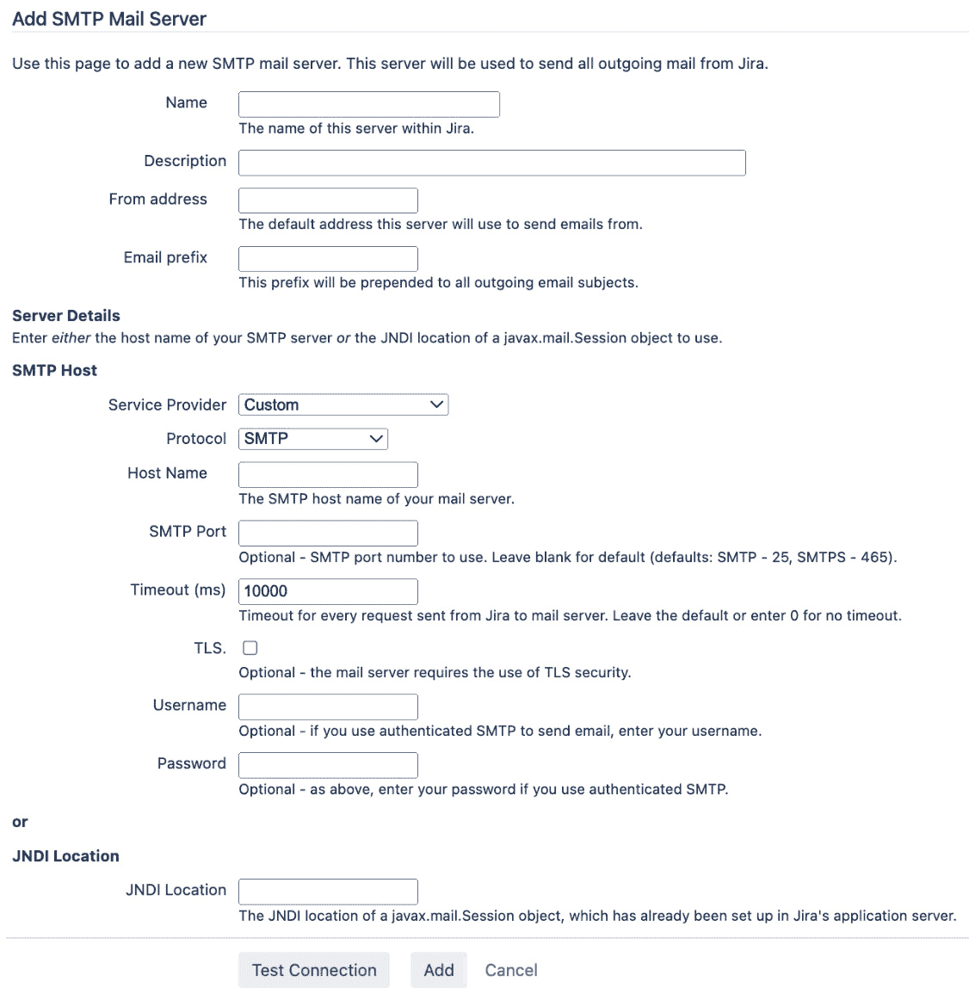

# 第八章：电子邮件与通知

到目前为止，你已经学会了如何通过浏览器直接使用 Jira 的 Web 界面与其互动。接下来，我们将了解 Jira 如何使用电子邮件作为通知机制，提醒你更新内容。

Jira 的一项强大功能是通过电子邮件创建新问题、添加评论并更新问题详细信息。这为你和用户与 Jira 互动提供了全新的选择。

本章将涵盖以下主题：

+   Jira 和电子邮件

+   邮件服务器

+   邮件队列

+   事件

+   通知

+   批量电子邮件通知

+   排查通知问题

+   接收邮件

+   人力资源项目

# Jira 和电子邮件

电子邮件已成为当今世界最为普及的沟通工具之一。企业和个人依赖电子邮件来几乎即时地发送和接收全球信息。因此，Jira 完全装备并与电子邮件支持集成，这并不奇怪。

Jira 的电子邮件支持有几种形式：

+   首先，Jira 会向用户发送有关其问题的更改通知，例如添加评论，以便同一问题的所有参与者可以保持一致。

+   第二，Jira 可以轮询邮箱中的邮件，并根据邮件内容创建问题和评论。

+   最后一项功能是用户可以创建和订阅过滤器，在 Jira 中设置信息流（我们将在*第十章*中讨论过滤器，*搜索、报告与分析*）

这些功能为用户如何与 Jira 互动打开了全新的维度。

在以下各节中，我们将看看你需要做什么才能启用 Jira 强大的电子邮件支持，并探讨你可以使用的工具和选项，以便你可以根据自己的需求配置 Jira 和电子邮件。

# 邮件服务器

要使 Jira 与电子邮件进行通信，你需要在 Jira 中配置或注册邮件服务器。你需要配置两种类型的邮件服务器：

+   **外发**：这是 Jira 用来向用户发送电子邮件的。Jira 支持 **SMTP** 邮件服务器。

+   **接收**：这是 Jira 用来从用户处获取电子邮件的。Jira 支持 **POP** 和 **IMAP** 服务器。

以下图表展示了 Jira 如何与各种邮件服务器进行交互：


图 8.1 – 邮件服务器

我们将从外发邮件服务器开始，查看我们可以配置 Jira 发送电子邮件的不同选项，自定义邮件内容，启用 SSL 以增加安全性，最后，发送一封测试邮件。

## 使用外发邮件

要配置外发 SMTP 服务器，你需要 Jira 系统管理员的全局权限（在初始设置过程中创建的用户为系统管理员）。执行以下步骤来管理外发邮件服务器：

1.  以 Jira 系统管理员身份登录 Jira。

1.  浏览到 Jira 管理控制台。

1.  选择**系统**标签，然后选择**外发邮件**选项。这将打开**外发邮件**页面：


图 8.2 – 外发邮件页面

注意

您在 Jira 中只能配置一个外发邮件服务器。

在 Jira 中有两种方式可以添加外发邮件服务器。两种选项都有一些共同的配置参数，您需要填写。下表显示了这些参数：

| **字段** | **描述** |
| --- | --- |
| **名称** | 这是指定邮件服务器的名称。 |
| **描述** | 这是指定邮件服务器的简要描述。 |
| **发件人地址** | 这是指定外发邮件显示的发件人地址。 |
| **邮件前缀** | 这是指定将在 Jira 发送的所有邮件的邮件主题前面显示的前缀。这允许您的用户在其邮件客户端中设置过滤规则。前缀将添加到邮件主题的开头。 |
| **服务提供商** | 在此，您可以选择三个预定义邮件提供商之一——即 Google、Yahoo! 或自定义 SMTP 服务器。 |
| **主机名** | 这是指定您邮件服务器的主机名（例如，`smtp.example.com`）。 |
| **SMTP 端口** | 这是指定邮件服务器运行的端口号。此项为可选项；如果留空，将使用默认端口号 25。 |
| **用户名** | 如果需要，这用于验证与邮件服务器的连接。请注意，邮件服务器可能需要身份验证才能将邮件转发给非本地用户。 |
| **密码** | 如果需要，这用于验证用户是否可以连接到邮件服务器。 |
| **JNDI 位置** | 如果您已经为应用服务器配置了邮件服务器，这是 JNDI 查找名称。有关详细信息，请参阅以下部分。 |

表 8.1 – 外发邮件服务器配置

对于其余的参数，取决于您选择的邮件服务器设置选项，您只需填写适当的详细信息。

### 配置 SMTP 服务器

第一种选项是选择内置的服务提供商之一，并指定邮件服务器的详细信息。例如，如果您运行的是 SMTP 邮件服务器，您可以在**服务提供商**字段中选择**自定义**选项，并指定主机名和端口号。这是大多数人使用的方法，因为它简单明了。采用这种方法时，管理员填写邮件服务器的主机信息，如主机名和端口号。操作步骤如下：

1.  浏览到**外发邮件**页面。

1.  点击**配置新的 SMTP 邮件服务器**按钮。

1.  输入您的邮件服务器的基本信息，包括名称、描述、发件人地址和邮件前缀。

1.  从**服务提供商**字段选择邮件服务器类型。

1.  输入邮件服务器的连接详细信息。

1.  点击**测试连接**按钮以验证配置。

1.  点击**添加**按钮以注册到邮件服务器：



图 8.3 – 添加 SMTP 邮件服务器页面

注意

Jira 默认支持 Google 和 Yahoo! 邮件服务。如果您使用这些服务，可以在**服务提供商**字段中选择相应的选项。

### 使用 JNDI 配置 SMTP 服务器

第二种选项是使用**Java 命名和目录接口**（**JNDI**）。这种方法稍微复杂一些，因为它需要在应用服务器本身进行配置，并且需要您重新启动 Jira。

如果您使用的是独立分发版（它使用 Apache Tomcat），则 JNDI 位置将是`java:comp/env/mail/JiraMailServer`。您还需要在`JIRA_INSTALL/conf`目录下的`server.xml`文件中将邮件服务器详细信息指定为 JNDI 资源。

以下代码片段展示了一个示例声明。您需要用邮件服务器详细信息中的实际值替换代码中某些参数的值：

```
<Resource name="mail/JiraMailServer" auth="Container" type="javax.mail.Session"
  mail.smtp.host="mail.server.host"
  mail.smtp.port="25"
  mail.transport.protocol="smtp"
  mail.smtp.auth="true"
  mail.smtp.user="username"
  password="password"
/>
```

在保存对`server.xml`文件的更改后，您需要重新启动 Jira。

## 禁用外发邮件

如果您正在运行测试或评估版的 Jira 实例，或正在测试您对配置所做的更改，您可能不想将测试邮件发送给用户。禁用所有外发邮件的最简单方法是点击**禁用外发邮件**按钮。这将停止 Jira 发送所有由问题更新触发的邮件。一旦准备好再次发送邮件，您可以点击**启用外发邮件**按钮。

注意

禁用外发邮件仅会阻止 Jira 根据通知方案发送通知邮件。

## 启用通过 SSL 的 SMTP

为了提高安全性，如果您的邮件服务器支持 SSL，您可以加密 Jira 与邮件服务器之间的通信。启用 SSL 通过 SMTP 在 Jira 中有两个步骤：

1.  第一步是将您的邮件服务器的 SSL 证书导入到 Java 的信任库中。您可以使用 Java 的 `keytool` 工具完成此操作。在 Windows 机器上，运行以下命令：

    ```
    keytool -import -alias mail.yourcompany.com -keystore $JAVA_HOME/jre/lib/security/cacerts -file yourcertificate
    ```

1.  第二步是配置您的应用服务器使用 SSL 进行邮件通信。以下声明适用于 Jira 独立版所使用的 Apache Tomcat。我们可以使用相同的配置文件，只需要添加两个额外的参数：

    ```
    <Resource name="mail/JiraMailServer"
      auth="Container"
      type="javax.mail.Session"
      mail.smtp.host="mail.server.host"
      mail.smtp.port="25"
      mail.transport.protocol="smtp"
      mail.smtp.auth="true"
      mail.smtp.user="username"
      password="password"
      mail.smtp.atarttls.enabled="true"
      mail.smtp.socketFactory.class="javax.net.ssl.SSLSocketFactory"
    />
    ```

一旦您导入了证书并配置了邮件服务器，您将需要重新启动 Jira。

## 发送测试邮件

配置 SMTP 邮件服务器后，发送测试邮件始终是个好主意，以确保服务器正在运行并且在 Jira 中配置正确。以下是操作步骤：

1.  浏览到**外发邮件**页面。

1.  点击**发送测试邮件**链接以测试您的 SMTP 邮件服务器。

1.  点击**发送**按钮发送邮件。Jira 会根据您登录的用户自动填充**收件人**地址。

如果一切正常，您将在**邮件日志**部分看到确认信息，并会在收件箱中收到邮件。如果出现错误，例如邮件服务器连接错误，**邮件日志**部分将显示这些问题。这在排查 Jira 与 SMTP 服务器连接问题时非常有用：


图 8.4 – 测试外发邮件服务器

在上面的截图中，您可以看到测试邮件发送失败，错误原因是 Jira 无法连接到配置的 SMTP 服务器。

我们现在已经了解了如何在 Jira 中添加外发 SMTP 邮件服务器，并发送测试邮件。在下一部分，我们将探讨 Jira 的邮件发送机制。

# 邮件队列

Jira 中的大多数邮件并不会在执行操作时立即发送。相反，它们会被放入一个队列，Jira 会定期处理这些邮件。这与现实生活中邮件被放入邮箱并每天由邮递员取走的场景非常相似。在这一部分，我们将了解 Jira 的邮件队列，以及如何使用它来帮助识别和排查外发邮件卡住的情况。

## 查看邮件队列

通常，您无需管理邮件队列。Jira 会自动将邮件放入队列并定期处理它们。然而，作为管理员，您可能希望检查邮件队列，尤其是在排查与 Jira 通知邮件相关的问题时。有时邮件会被卡住，检查邮件队列可以帮助您识别这些问题并解决它们。

执行以下步骤以查看邮件队列的内容：

1.  浏览到 Jira 管理控制台。

1.  选择**系统**标签，然后选择**邮件队列**选项：


图 8.5 – 邮件队列页面

该页面为您提供了一个查看当前正在等待发送的队列中邮件的一页视图。共有两个队列——**邮件队列**和**错误队列**：

+   **邮件队列**标签包含所有待发送的邮件。如果 Jira 能成功发送这些邮件，它们将从队列中移除。任何以红色显示的项目表示 Jira 未能成功发送这些邮件。Jira 将重试 10 次，如果仍然失败，这些项目将被移至错误队列。

+   **错误队列**标签包含 Jira 无法发送的邮件。您可以选择重新发送错误队列中的所有失败项，或者删除它们。

## 刷新邮件队列

虽然 Jira 会自动刷新邮件队列，但您也可以手动刷新队列，如果您希望立即发送邮件。手动刷新队列时，Jira 将尝试发送当前队列中的所有邮件。

执行以下步骤手动刷新邮件队列：

1.  浏览到**邮件队列**页面。

1.  点击**刷新邮件队列**按钮

如果 Jira 成功发送邮件，您会看到队列缩小并且项目消失。如果某些邮件发送失败，这些项目将被高亮显示为红色。邮件队列用于 Jira 自动发送邮件，正如我们在下一节中将看到的那样。当您在 Jira 中手动发送邮件时，这些邮件会立即发送。

# 手动发送邮件

有时，作为管理员的您可能需要向用户发送包含重要信息的邮件。例如，如果您计划进行一些维护工作，导致 Jira 长时间离线，您可能希望向所有 Jira 用户发送邮件通知他们停机的情况。

Jira 提供了一个内置功能，允许您手动向特定的用户组发送邮件。手动发送邮件时有两种选项——您可以按组发送或按项目发送。

按组发送邮件时，您只需选择一个或多个 Jira 组，所有属于所选组的用户将收到该邮件。属于多个组的用户不会收到重复的邮件。

按项目发送邮件时，您需要选择一个或多个项目，然后选择项目角色。我们将在下一章中更详细地讨论项目角色，但目前，您可以将其视为项目中的用户组。例如，您可以向**示范项目**中的所有用户发送邮件，而不是向 Jira 中的所有用户发送邮件。

要向 Jira 中的用户发送邮件，请执行以下步骤：

1.  浏览到 Jira 管理控制台

1.  选择**系统**标签页，然后选择**发送邮件**选项

1.  选择是否按**项目角色**或**组**向用户发送邮件

1.  输入邮件的**主题**和**正文**内容

1.  点击**发送**按钮，将邮件发送给选定项目角色/组中的所有用户

以下截图显示了通过选择**jira-software-users**组来向所有人发送维护停机通知邮件的示例，默认情况下，每个 Jira Software 用户都是该组的成员：


图 8.6 – 发送邮件页面

注意

由于 Jira 不提供**所见即所得**（**WYSIWYG**）邮件编辑器，您可能想要先草拟一封邮件并将其发送给自己，之后再发送给所有人。

现在我们已经了解了如何在 Jira 中配置外发邮件服务器并发送邮件，让我们更深入地了解 Jira 如何在用户对问题执行操作时自动发送电子邮件通知。

# 事件

Jira 是一个事件驱动系统。这意味着当发生某个操作（例如，创建一个问题）时，Jira 会触发一个相应的事件。然后，这个事件会被设计来监听该事件的组件拾取。这些组件被称为**监听器**。当监听器捕捉到一个事件时，它会执行自己的任务，比如保持问题的更新或向关注该问题的用户发送邮件。

这个机制允许 Jira 异步处理操作。这种模式的优势是，像发送邮件这样的操作，与 Jira 的核心功能（如问题创建）是分离的。例如，如果邮件服务器出现问题，你不希望这个问题阻止用户创建问题。

Jira 中有两种类型的事件：

+   **系统事件**：这些是 Jira 内部使用的事件，通常代表 Jira 中的主要功能。它们无法被添加、编辑或删除。

+   `post` 函数。

作为管理员，你将能够查看 Jira 中所有事件的一页内容。你只需执行以下操作：

1.  浏览到 Jira 管理控制台。

1.  选择**系统**标签页，然后选择**事件**选项。这样将显示**查看事件**页面：


图 8.7 – 问题事件

每个事件都与一个模板关联，这个模板通常被称为**邮件模板**。这些模板定义了发送通知邮件时邮件的内容结构。对于系统事件，你不能修改它们的模板（但你可以修改模板文件的内容）。对于自定义事件，你可以选择使用现有的模板之一或创建自己的邮件模板。

在接下来的章节中，我们将讨论如何创建和注册自定义邮件模板，创建一个新的自定义事件来使用该新模板，并在对问题执行操作时触发新的事件。之后，我们将探讨如何将事件与通知关联起来，以便告诉 Jira 哪些用户应该收到该事件的通知邮件。

## 使用邮件模板

邮件模板是你通过文本编辑器创建和编辑的物理文件。Jira 为所有系统事件提供了一组默认模板。Jira 不直接修改它们，而是允许你上传修改后的模板版本来覆盖默认模板。为了创建新的邮件模板，我们也可以查看这些现有模板并以它们为起点。你可以按照以下步骤下载默认模板：

1.  浏览到 Jira 管理控制台

1.  选择**系统**标签页，然后选择**邮件模板**选项

1.  点击**下载 .zip**按钮

这将下载所有默认模板到一个`.zip`文件中。解压后，你将看到两个主要目录——`email`和`email-batch`。目前我们将专注于`email`目录，因为它包含了事件的所有邮件模板。在`email`目录中，你将看到以下子目录：

+   `css directory`：包含应用于邮件的 CSS 文件。

+   `html directory`：当 Jira 以 HTML 格式发送邮件时，包含的模板。

+   `includes directory`：包含多个模板共享的公共内容。

+   `subject directory`：包含用于生成邮件主题的模板。

+   `text directory`：当 Jira 以纯文本格式发送邮件时，包含的模板。

正如我们所看到的，对于由问题事件使用的给定邮件模板，至少有三个组成部分——主题、HTML 和文本。因此，如果你想为自定义事件添加一个新的模板，你需要创建这三个文件，并将它们分别放入相应的目录中。如果你想修改现有的邮件模板，确保你对所有必要的文件进行修改，通常是在 HTML 和文本目录中同时进行修改。

在创建新的邮件模板时，最好根据问题事件命名模板文件，例如`issueescalated.vm`。这样有助于将来的用户理解这些模板的用途。

邮件模板使用 Apache 的 Velocity 模板语言（[`velocity.apache.org`](http://velocity.apache.org)）。因此，创建新的邮件模板将需要一定的 HTML 和模板编程知识。

如果你的模板只包含静态文本，你可以直接使用标准 HTML 标签。但如果你需要在模板中渲染动态数据，比如问题的键或摘要，你将需要使用 Velocity 语法。Velocity 的完整解释超出了本书的范围。以下段落简要介绍了如何为 Jira 创建简单的邮件模板。你可以在[`confluence.atlassian.com/adminjiraserver0822/customizing-email-content-1142237912.html`](https://confluence.atlassian.com/adminjiraserver0822/customizing-email-content-1142237912.html)找到更多关于 Velocity 及其在 Jira 邮件模板中的使用信息。

在 Velocity 模板中，所有文本将作为普通文本处理。任何以美元符号（`$`）开头的内容，如`$issue`，都是 Velocity 语句。`$`符号告诉 Velocity 引用符号后的项目，并且，当与句点（`.`）结合时，你可以检索指定的值。例如，模板中的以下代码将从当前问题中获取问题的键和值，二者由`-`字符分隔：

```
$issue.key - $issue.summary
```

这将生成类似于`DEMO-1 - 这是一个演示问题`的内容。

Jira 提供了一系列 Velocity 引用，您可以使用它们来创建邮件模板。这些引用允许您访问诸如正在更新的问题和触发事件的用户等数据。您可以在 [`developer.atlassian.com/server/jira/platform/jira-templates-and-jsps/#email-templates`](https://developer.atlassian.com/server/jira/platform/jira-templates-and-jsps/#email-templates) 找到详细的列表。

现在，您已经基本理解了 Velocity 的工作原理，接下来需要为邮件主题创建一个模板。以下代码展示了一个典型的主题模板：

```
$eventTypeName: ($issue.key) $issue.summary
```

当模板被处理时，Jira 将为事件类型（例如，问题创建）、问题关键字和问题摘要替换实际值。因此，上述示例将产生类似于 `问题升级：HD-11：数据库服务器运行非常缓慢` 的内容。

然后，您需要为实际的邮件内容创建模板。在此，您需要创建文本版和 HTML 版。以下代码展示了一个简单的文本模板示例，它显示了升级问题的关键字：

```
Hello,
The ticket $issue.key has been escalated and is currently being worked on.  We will contact you if we require more information.
Regards
Support team.
```

在 Jira 发送邮件之前，前述文本将被处理，其中所有 Velocity 引用，如 `$issue.key`，将转换为相应的值；例如，DEMO-1。

一旦您更新或创建了邮件模板，您需要将它们上传到 Jira。以下是操作步骤：

1.  将您的邮件模板打包成 Zip 文件

1.  浏览到 Jira 管理控制台

1.  选择 **系统** 标签页，然后选择 **邮件模板** 选项

1.  点击您创建的 `.zip` 文件

1.  在 Jira 验证您的模板内容后，点击 **应用** 按钮

一旦更新的模板已上传，可能需要最多 5 分钟才能使更改生效。如果您只是修改现有的模板，那么只需执行这些操作，但如果您要添加新模板，则需要在 Jira 中注册它们。

要注册您的新模板，请在文本编辑器中定位并打开 `<JIRA_INSTALL>/atlassian-jira/WEB-INF/classes` 目录中的 `email-templates-id-mappings.xml` 文件。

在 `</templatemappings>` 标签闭合前，将新的条目添加到文件末尾，如下所示：

```
<templatemapping id="10001">
  <name>Example Custom Event</name>
  <template>examplecustomevent.vm</template>
  <templatetype>issueevent</templatetype>
</templatemapping>
```

在这里，我们注册了一个新的自定义邮件模板条目。其详细信息显示在以下表格中：

| **Parameter** | **Description** |
| --- | --- |
| `id` | 这是模板的唯一 ID。您需要确保没有其他模板映射使用相同的 ID。 |
| `name` | 这是 Jira 显示的可读名称。 |
| `template` | 这是邮件模板的文件名，用于主题、文本和 HTML。所有三个模板文件必须按此处指定的名称命名。 |
| `type` | 这是模板类型。对于由问题生成的事件，其值将是 `issueevent`。 |

表 8.2 – 邮件模板 ID 映射参数

在创建模板并将其注册到映射文件后，你需要重新启动 Jira 才能应用更改。新的模板将在我们创建新事件时可用，接下来的部分将讨论如何操作。

## 添加自定义事件

Jira 提供了一份全面的系统事件列表，专注于与问题相关的操作。然而，某些时候你可能需要创建自定义事件，以代表特定的业务操作，或者当你仅仅需要使用自定义邮件模板时。

执行以下步骤以添加新的自定义事件：

1.  浏览到**查看事件**页面。

1.  在**添加新事件**部分输入新事件的名称和描述。

1.  选择新事件的邮件模板。如果你已经注册了新的邮件模板，可以为该事件选择它。

1.  点击**添加**按钮以创建新事件：


图 8.8 – 添加新事件页面

通过这些步骤，我们已经向 Jira 添加了一个新事件并为其分配了自定义邮件模板。我们将在下一部分讨论如何触发我们新的事件。

## 触发自定义事件

与系统事件不同，对于自定义事件，你需要告诉 Jira 何时触发自定义事件。

自定义事件主要通过工作流过渡触发。回顾 *第七章*，*工作流和业务流程*，你可以向工作流过渡添加后置功能。几乎所有 Jira 的过渡都会有后置功能来触发适当的事件。重要的是要理解，仅仅因为事件被触发，并不意味着必须有某个东西去监听它。

如果你跳过了 *第七章*，*工作流和业务流程*，或者仍然没有很好地理解工作流，现在是时候回去重新阅读那一章了。

执行以下步骤以从工作流后置功能中触发自定义事件：

1.  浏览到**查看工作流**页面。

1.  点击将用于触发事件的工作流的**编辑**链接。

1.  点击将触发事件的过渡。

1.  点击**后置功能**标签。

1.  点击`post`功能，该功能显示**触发一个可以由监听器处理的 <事件名称> 事件**：


图 8.9 – 触发问题事件

1.  从下拉列表中选择自定义事件。

1.  点击**更新**按钮以应用对后置功能所做的任何更改。

1.  发布工作流。

现在，每当工作流过渡被执行时，后置功能将运行并触发所选事件。了解了事件之后，在下一部分我们将讨论如何配置 Jira 以监听这些事件，并相应地发送通知。

# 通知

通知将事件（包括系统事件和自定义事件）与电子邮件收件人关联。当事件被触发并被接收时，电子邮件将被发送出去。通知类型定义了电子邮件的接收者。例如，你可以设置只将电子邮件发送给特定用户或指定用户组中的所有成员。你可以为给定事件添加多个通知。

Jira 自带了一个全面的通知类型列表（即收件人），能够满足你许多的需求。下表列出了所有可用的通知类型及其工作原理：

| **通知类型** | **描述** |
| --- | --- |
| 当前分配人 | 这是当前的任务分配人。 |
| 报告人 | 这是问题的报告人（通常是创建问题的人）。 |
| 当前用户 | 这是触发事件的用户。 |
| 项目负责人 | 这是问题所属项目的负责人。 |
| 组件负责人 | 这是问题所属组件的负责人。 |
| 单一用户 | 这表示 Jira 中的任何用户。 |
| 组 | 这表示所有属于指定组的用户。 |
| 项目角色 | 这表示所有用户都属于指定的项目角色。 |
| 单一电子邮件地址 | 这表示任何电子邮件地址。 |
| 所有观察者 | 这表示所有用户都在关注此问题。 |
| 用户自定义字段值 | 这表示在`user-type`自定义字段中指定的用户。例如，如果你有一个名为“收件人”的用户选择器自定义字段，且在该字段中选择的用户具有访问该问题的权限，那么该用户将接收通知。 |
| 组自定义字段值 | 这表示属于`group-type`自定义字段中指定组的所有用户。例如，如果你有一个名为“审批人”的组选择器自定义字段，那么该字段中被选择的所有用户（且有权限访问此问题的用户）将接收通知。 |

图 8.3 – 通知类型

如你所见，列表包括了各种各样的选项，从问题报告人到自定义字段中包含的值。任何可以表示为用户的对象，如项目负责人，或包含用户值的字段，如用户自定义字段值，都可以选择接收通知。

如果一个用户属于一个事件的多个通知，Jira 会确保只发送一封电子邮件，避免用户收到重复邮件。为了接收通知，用户必须有权限查看该问题。唯一的例外是使用单一电子邮件地址选项时（我们将在*第九章*中讨论安全性，*保护 Jira*）。如果用户没有查看问题的权限，Jira 将不会发送通知邮件。

现在，既然我们可以创建自定义事件、创建和修改邮件模板，并控制事件的触发时机，我们将来看如何将通知添加到事件中，以便用户可以通过通知方案开始接收电子邮件。

## 通知方案

通知方案是一个可重用的实体，它将事件与通知关联起来。换句话说，它包含事件与相应电子邮件接收者之间的关联。在本节中，我们将讨论通知方案，以及如何使用它们在 Jira 中发生事件时发送通知邮件。

要在 Jira 中管理通知方案，请执行以下步骤：

1.  浏览到 Jira 管理控制台。

1.  选择**问题**标签页，然后选择**通知方案**选项。这将打开**通知方案**页面：


图 8.10 – 通知方案页面

在此页面，你可以看到所有通知方案的列表以及当前正在使用这些方案的项目。Jira 附带了一个通用的默认通知方案。该默认方案设置了所有系统事件的通知。这允许你快速启用 Jira 中的通知。默认设置包含以下通知：

+   **当前指派人**

+   **报告人**

+   **所有观察者**

你可以修改默认通知方案以添加自己的通知规则，但随着 Jira 使用范围的扩大，最好是从头开始创建一个新的方案，或者复制默认方案并在此基础上进行修改。

## 添加通知方案

与其他方案（如工作流方案）不同，在这些方案中，Jira 会在每次创建新项目时自动创建一个新的方案，而所有新项目默认使用**默认通知方案**选项。因此，如果你希望创建特定于项目的通知，则需要创建一个新的通知方案。请按照以下步骤创建新的通知方案：

1.  浏览到**通知方案**页面

1.  点击底部的**添加通知方案**链接

1.  输入新通知方案的名称和描述

1.  点击**添加**按钮以创建通知方案

当你创建一个新的通知方案时，你会创建一个空白的方案，可以稍后进行配置，以便你可以向其中添加自己的通知规则。在你创建新通知方案后，必须先配置其通知规则，再将该方案应用于项目；否则，将不会发送任何通知。我们将在本章稍后部分讨论如何配置通知规则。

## 管理通知方案

通知方案包含在 Jira 事件中设置的通知。通知确定在相应事件触发时，谁将收到电子邮件。请按照以下步骤添加新通知：

1.  点击你希望配置的通知方案的**通知**链接。

1.  点击**添加通知**链接或你希望为其添加通知的事件的**添加**链接。这两个操作都会将你带到**添加通知**页面。如果点击**添加**链接，**事件选择**列表将自动为你预选该事件。

1.  选择你希望添加通知类型的事件。

1.  从可用选项中选择通知类型。

1.  点击**添加**按钮。例如，以下截图展示了如何设置通知，当问题被创建和更新时，Jira 将向项目负责人发送电子邮件：


图 8.11 – 添加通知页面

一旦添加，通知将显示在已选择的事件旁边。你可以通过重复相同的步骤继续为事件添加通知。

注意

你可以选择多个事件，将通知类型添加到这些事件中。

当某些事件不再需要通知时，你也可以删除它们。要删除通知，你需要逐个事件删除：

1.  浏览到你想要配置的通知方案的**编辑通知**页面

1.  点击你希望删除的通知旁边的**删除**链接

1.  点击**删除**按钮以确认删除

在删除通知后，受到该通知影响的用户将停止接收来自 Jira 的电子邮件。然而，你需要注意你的配置，因为可能会有其他针对相同事件的通知，继续向同一用户发送电子邮件。例如，如果你为问题创建事件创建了两个通知，一个设置给单一用户 John（他属于`jira-administrator`组），另一个设置给 jira-administrator 组，而你的目标是阻止向用户 John 发送电子邮件，那么你需要从该事件中删除这两个通知，而不仅仅使用**单一用户**选项。

## 分配通知方案

当新项目被创建时，它们会自动分配使用默认的通知方案。如果你希望你的项目使用不同的方案，你需要进入项目管理控制台中的**通知**部分：

1.  浏览到你想要应用通知方案的项目管理页面。

1.  从左侧面板中选择**通知**选项：


图 8.12 – 关联通知方案

1.  从**操作**菜单中选择**使用不同的方案**。

1.  选择要使用的通知方案。

1.  点击**关联**按钮。

一旦通知方案应用到项目，它将立即生效，你将看到已配置的事件的电子邮件被发送出去。像 Jira 中的其他方案一样，通知方案可以分配给多个项目，以便它们共享相同的通知行为。

由于通知过多，用户常常会被 Jira 发送的电子邮件数量压倒。接下来的章节，我们将探讨如何通过将它们批量处理来减少用户收到的通知电子邮件数量。

# 批量电子邮件通知

用户对 Jira 电子邮件通知最常见的抱怨之一是通知的频率。对同一问题所做的每次更改都会触发发送一封电子邮件，对于一个忙碌的团队，常常更新问题（如添加评论），这可能很快就会导致大量电子邮件被发送，从而淹没用户的收件箱。为了缓解这个问题，Jira 8 引入了批量电子邮件通知功能。其工作原理如下——过去 10 分钟内对给定问题所做的所有更改将被合并到一封总结邮件中，这样用户只会收到一封邮件，而不是每次更改一封邮件。这有助于显著减少频繁更新问题所产生的邮件杂乱。要启用电子邮件批量处理，请按照以下步骤操作：

1.  浏览到 Jira 管理控制台

1.  选择**系统**标签，然后选择**批量电子邮件通知**选项

1.  勾选**批量电子邮件通知**选项以启用此功能

由于这是 Jira 8 新增的功能，因此未来版本计划进行改进，例如增加对在总结邮件中包含自定义字段值的支持，并提供可定制的批量选项。

现在我们已经介绍了电子邮件通知，接下来我们将了解 Jira 提供的工具，帮助我们排查与通知相关的问题。

# 故障排除通知

经常有用户无法收到 Jira 的通知时，找到原因可能非常困难且令人沮丧。通知相关问题最常见的两个原因是外发邮件服务器连接问题或通知方案配置错误。

故障排除外发邮件服务器问题相当简单。你只需要尝试发送一封测试邮件，如*发送测试邮件*部分所述。如果你收到了测试邮件，那么说明外发邮件服务器配置没有问题，你可以专注于通知配置。

故障排除通知问题并不像外发邮件服务器问题那样简单，因为需要考虑的因素有很多。为了帮助解决这个问题，Jira 提供了一个名为**通知助手**的实用功能。**通知助手**功能可以通过帮助管理员确定为什么某个用户会或不会收到通知，节省 Jira 管理员的时间。管理员只需要告诉助手用户是谁，哪个问题（或项目中的示例问题）用户会或不会收到通知，以及触发通知的事件是什么。按照以下步骤操作：

1.  浏览到 Jira 管理控制台

1.  选择**系统**标签，然后选择**通知助手**选项

1.  在**用户**字段中指定将会或不会收到通知的用户

1.  指定测试时遇到的问题

1.  选择通知事件类型

1.  点击**提交**按钮

**通知助手**功能将处理输入并报告用户是否会收到通知，以及基于通知方案设置的原因：


图 8.13 – 通知助手页面

正如你从前面的截图中看到的，用户**Alana Grant**当前没有收到**DEMO-4**问题的通知，因为通知设置为只有**当前指派人**会收到电子邮件，而 Alana Grant 不是该问题的指派人。

现在我们已经看过如何配置 Jira 发送电子邮件通知以及当你没有收到电子邮件时如何进行故障排除，在接下来的章节中，我们将了解如何向 Jira 发送电子邮件以创建问题和评论。

# 接收邮件

我们已经看到如何配置 Jira 发送电子邮件来通知用户关于他们的问题的更新。然而，这只是 Jira 电子邮件支持的其中一部分。

你还可以设置 Jira 定期轮询邮箱，检查电子邮件，并根据邮件的主题和内容创建问题。这是一个非常强大的功能，具有以下好处：

+   它隐藏了 Jira 的复杂性，让业务用户可以更高效地记录问题，将复杂性留给 IT 团队处理。

+   它允许用户即使在 Jira 只能通过内部网络访问的情况下也能创建问题。用户可以将电子邮件发送到 Jira 轮询的专用邮箱。

在本节中，我们将了解如何添加接收邮件服务器以便 Jira 轮询电子邮件，然后创建邮件处理程序从电子邮件中创建问题和/或评论。

## 添加接收邮件服务器

为了让 Jira 能够接收电子邮件并从中创建问题，你需要将 POP/IMAP 邮件服务器配置添加到 Jira 中。POP 和 IMAP 是用于从服务器接收电子邮件的邮件协议。像 Microsoft Outlook 这样的邮件客户端使用这些协议之一来接收电子邮件。

与发送邮件服务器不同，Jira 允许你添加多个接收邮件服务器。这是因为尽管你只需要一个邮件服务器来发送电子邮件，但你可能有多个邮件服务器或多个邮件账户（在同一个服务器上），供人们用来发送电子邮件。

例如，你可能会有一个专门用于提供支持的账户，另一个用于销售。通常，创建独立的邮件账户是一个好主意，这样当你尝试确定哪个邮件应该进入哪个项目时会更方便。基于这个原因，添加 POP/IMAP 邮件服务器可以被看作是在 Jira 中添加多个邮件账户。执行以下步骤以添加一个接收邮件服务器：

1.  浏览到 Jira 管理控制台

1.  选择**系统**标签，然后选择**接收邮件**选项

1.  点击**添加 POP/IMAP 邮件服务器**按钮

1.  输入邮件服务器的名称和描述

1.  选择邮件服务提供商类型 – 例如，如果您使用的是自己托管的邮件服务或谷歌等知名云服务提供商之一。

1.  如果使用的是您自己的（自定义提供商）POP/IMAP 服务器，请指定服务器的主机名。

1.  输入邮件账户的用户名/密码凭证。

1.  点击**保存**按钮以创建 POP/IMAP 邮件服务器：


](img/Figure_8.14_B18644.jpg)

图 8.14 – 添加邮件服务器页面

注意

您可以拥有多个传入服务器。

## 邮件处理器

邮件处理器是 Jira 用来处理已检索邮件的工具。每个邮件处理器可以处理来自一个传入邮件服务器的邮件，并定期扫描新邮件。Jira 随附了多个邮件处理器，每个处理器都有自己的功能。接下来的章节将详细讨论每个处理器。

### 从每封邮件消息创建新问题

创建新问题或为现有问题添加评论的邮件处理器（在 Jira 早期版本中也称为创建和评论处理器）是最常用的邮件处理器。它会从接收到的邮件中创建新问题，并且如果传入邮件的主题包含匹配的议题键，还会为现有问题添加评论。如果主题中不包含匹配的议题键，则会创建新问题。以下表格列出了创建邮件处理器时需要的参数：


](img/2.png)

表 8.4 – 邮件处理器配置

### 添加整个邮件正文的评论

该邮件处理器从邮件内容中提取文本，并将其添加到主题中具有匹配问题键的议题中。评论的作者来自**发件人**字段。

它具有一组与创建和评论处理器类似的参数。

### 从未引用的邮件正文中添加评论

从未引用的邮件正文中添加评论与完整的评论处理器非常相似，但它只提取未引用的文本并将其作为评论添加。以 *>* 或 *|* 开头的文本视为引用文本。

它具有一组与创建和评论处理器类似的参数。

### 从每封邮件消息创建新问题

从每封邮件消息创建新问题与创建和评论处理器非常相似，区别在于此处理器会为每封接收到的邮件始终创建新问题。

它具有一组与创建和评论处理器类似的参数。

### 在电子邮件正文中添加评论到指定的标记或分隔符之前

在电子邮件正文中添加评论到指定的标记或分隔符之前，是评论处理器的更强大版本。它使用正则表达式从邮件内容中提取文本并将其添加到问题中：

| **参数** | **描述** |
| --- | --- |
| 分割正则表达式 | 这个正则表达式用于提取内容。正则表达式有两个规则：`/``/-{}{}{}{}{}\s*原始消息\s*{}-/` 或 `/_____________*/` |

表 8.5 – 正则表达式邮件处理器配置

## 添加邮件处理器

你可以设置任意数量的邮件处理器。建议为每个希望通过邮件在 Jira 中创建问题的项目创建专用邮箱。对于每个帐户，你需要创建一个邮件处理器。你设置的邮箱需要通过 POP 或 IMAP 进行访问。按照以下步骤添加邮件处理器：

1.  浏览到**传入邮件**页面。

1.  点击**添加传入邮件处理器**按钮。

1.  为新的邮件处理器提供一个名称。

1.  选择一个传入邮件服务器或**本地文件**。

1.  指定 Jira 在多长时间后会轮询邮箱以查找新邮件（以分钟为单位）。你会希望这个时间足够长，以允许 Jira 处理所有邮件，但也不能太长，以免你不得不等很久才能看到你的邮件转换为 Jira 中的问题。

1.  选择你要添加的处理器类型。

1.  点击**下一步**按钮：


图 8.15 – 添加邮件处理器 – 步骤 1

根据你选择的处理器类型，下一屏幕将有所不同。在下一屏幕中，你需要提供邮件处理器所需的参数，正如前一部分所描述的那样。下图显示了一个配置对话框示例，在该示例中，新的问题将以**任务**类型创建在 IT 支持项目中：


图 8.16 – 添加邮件处理器 – 步骤 2

你可以随时使用**测试**按钮来测试你的配置。如果有问题，Jira 会提供有用的提示。

## 高级邮件处理器

Jira 自带的默认邮件处理器通常足以满足简单的电子邮件处理需求。如果你需要更高的控制或者需要为传入邮件处理特殊的逻辑，你可以创建自定义的邮件处理器。然而，创建新的邮件处理器需要具备编程知识；一个更好的选择是使用一个名为**Jira 企业邮件处理器（JEMH）**的插件。

使用 JEMH，你可以设置高级的邮件路由、基于邮件内容的附加邮件触发操作（例如更新问题）、已接收/已处理邮件的审计等。你可以在[`marketplace.atlassian.com/apps/4832/enterprise-email-handler-for-jira-jemh`](https://marketplace.atlassian.com/apps/4832/enterprise-email-handler-for-jira-jemh)了解更多关于 JEMH 的信息。

# 人力资源项目

用户通常希望在记录问题后获得问题的进度更新。因此，作为替代方案，我们将通过我们新获得的知识主动向用户更新进度——也就是通过 Jira 通知。

在*第五章*，*字段管理*中，我们添加了一个名为**直接经理**的自定义字段，该字段允许用户添加新员工或离职员工的经理，以便将他们纳入通知范围。

我们在*第七章*，*工作流和业务流程*中所做的另一个自定义操作是向工作流中添加新的过渡。我们需要确保这些过渡触发适当的事件，并发送通知。总的来说，我们需要做以下几点：

+   为我们的自定义工作流过渡触发的事件发送通知

+   向我们**直接经理**自定义字段中指定的用户发送通知

虽然你可以使用其他 Jira 功能来实现这一点，比如将用户添加为问题的观察者并重用现有的 Jira 系统事件，但本练习将探索你可用的选项。在后续章节中，你会看到在决定最佳方法时，还需要考虑其他标准。

## 设置邮件服务器

启用邮件通信的第一步，正如你可能猜到的，是在 Jira 中注册邮件服务器。如果你使用的是 Jira 的独立版，建议通过输入主机信息来添加邮件服务器。请按照以下步骤操作：

1.  以 Jira 管理员身份登录 Jira。

1.  浏览到 Jira 管理控制台。

1.  选择**系统**标签，然后选择**外发邮件**选项。

1.  点击**配置新的 SMTP 邮件服务器**按钮。

1.  输入你的邮件服务器信息。如果你没有现成的邮件服务器，可以注册一个免费的 Gmail 账号，并将其用于测试目的。

添加完邮件服务器后，你可以尝试发送一封快速测试邮件，检查 Jira 是否能成功访问你的服务器。

## 更新工作流后置功能

在*第七章*，*工作流和业务流程*中，我们创建了一些新的工作流过渡。现在，我们需要更新这些新的过渡，以确保它们触发适当的事件：

1.  浏览到**查看工作流**页面。

1.  点击**HR: 终止工作流**的**编辑**链接。

1.  点击任何**完成**以外的过渡。

1.  更新后置功能以触发*问题更新*事件，而不是*通用事件*。

1.  对除**完成**过渡外的所有其他过渡重复此操作。

1.  发布草稿工作流。如果你希望可以恢复，可以保存一个备份副本。

我们使用*问题更新*事件，因为它反映了问题正在更新的事实；此外，该事件与更合适的邮件模板相关联。当然，我们也可以创建一个新的自定义事件和邮件模板，并让`后置`功能触发自定义事件。

## 设置通知方案

现在，你需要一个通知方案，以便开始将通知添加到你的事件中。我们将基于默认方案来设置我们的通知方案，以便快速配置：

1.  选择**问题（Issues）**选项卡，然后选择**通知方案（Notification schemes）**选项

1.  点击**复制（Copy）**链接，选择**默认通知方案（Default Notification Scheme）**

1.  点击复制的通知方案的**编辑（Edit）**链接

1.  将其重命名为`HR 通知方案（HR Notification Scheme）`，然后点击**更新（Update）**

这将创建一个新的通知方案，并自动填充基本的通知内容。现在你需要做的就是修改事件并添加你自己的通知需求。

## 设置通知

添加通知时需要遵循两个规则。首先，你需要为自定义事件添加通知，以便当它们被触发时发送电子邮件。其次，你还希望指定在**抄送列表（CC list）**自定义字段中的用户与问题的负责人和报告人一起接收电子邮件：

1.  点击**HR 通知方案（HR Notification Scheme）**的**通知（Notifications）**链接

1.  点击**添加（Add）**通知链接

1.  选择**问题更新（Issue Updated）**事件类型

1.  选择**用户自定义字段值（User Custom Field Value）**作为通知类型，并从下拉列表中选择**直接经理（Direct Manager）**

1.  点击**添加（Add）**按钮

简单又方便。只需几次点击，你就将**直接经理（Direct Manager）**自定义字段添加到了通知方案中。所以，现在，无论谁被放入该字段，用户都会收到关于问题更新的通知。

## 整合

最后一步，和往常一样，是将你的方案与项目关联以进行激活：

1.  浏览到 HR 项目的管理页面

1.  从左侧面板中选择**通知（Notifications）**选项

1.  在**操作（Actions）**菜单中使用不同的方案

1.  选择我们刚刚创建的新的**HR 通知方案（HR Notification Scheme）**

1.  点击**关联（Associate）**按钮

只需几次点击，你就启用了 Jira 自动发送电子邮件来更新用户关于其问题的进展。不仅如此，你还将之前章节中创建的自定义字段绑定到通知方案中，来管理谁将与问题的负责人和报告人一起接收这些通知。那么，让我们来测试一下：

1.  在 HR 项目中创建一个新的**终止（Termination）**问题

1.  为**直接经理（Direct Manager）**自定义字段选择一个用户。最好不要选择自己，因为报告人默认会收到通知。同时，确保所选用户有有效的电子邮件地址。

1.  切换问题状态，使其沿着工作流进展。

1.  你将在几分钟内收到来自 Jira 的电子邮件。

如果你没有收到 Jira 的邮件，请检查你的邮件队列，确认邮件是否已生成。然后，按照本章*故障排除通知（Troubleshooting notifications）*部分中的步骤操作。

# 概述

在本章中，我们探讨了 Jira 如何通过电子邮件与其用户保持联系。确实，随着今天新型智能设备的出现，例如智能手机和平板电脑，能够通过电子邮件保持用户更新是一项强大的功能，Jira 也有非常灵活的结构来定义谁将接收通知的规则。

我们也简要提到了一些关于谁可以接收通知的安全规则。Jira 在发送通知之前会进行安全检查，原因有两个：首先，如果用户无法查看问题，发送电子邮件给他们毫无意义；其次，你不希望未授权的用户查看问题并接收他们无法理解的更新。

在下一章，我们将深入探讨 Jira 的安全性以及如何保护你的数据以防止未授权访问。
