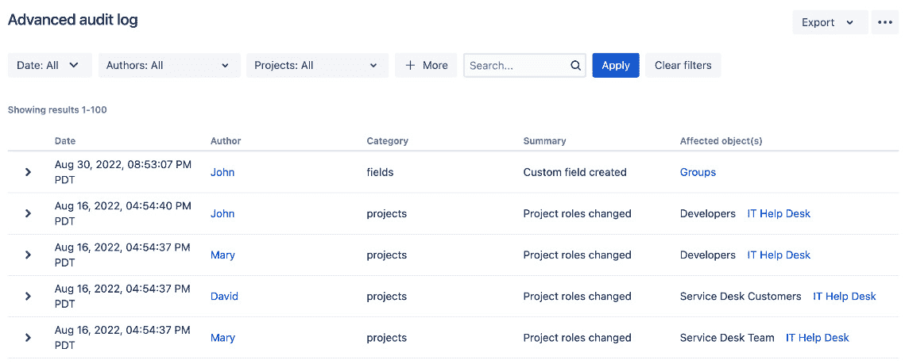

# 9

# 确保 Jira 的安全性

在前几章中，您学会了通过创建问题在 Jira 中存储数据。正如您所看到的，作为一个信息系统，Jira 完全是关于数据的。您应该不会感到意外，Jira 在确保只有合适的人才能访问您的数据方面扮演着重要角色。这是通过为您提供灵活且强大的访问控制管理方式来实现的。它能够与您现有的安全实践（如密码策略）集成，并允许集中控制权限，同时将权限管理委派给项目负责人和用户，让他们管理自己项目的权限。

在本章结束时，您将了解以下内容：

+   管理用户、组和项目角色

+   用户目录及如何将 Jira 连接到**轻量级目录访问协议**（**LDAP**）

+   Jira 中的一般访问控制

+   管理项目级别和问题级别的权限设置

+   如何排查权限问题

+   配置 Jira 与**安全断言标记语言**（**SAML**）**单点登录**（**SSO**）和**即时用户配置**（**JIT**）的集成

具体来说，我们将关注以下主题：

+   管理用户

+   管理组和角色

+   用户目录

+   理解 Jira 权限

+   问题安全

+   排查权限问题

+   工作流安全

+   密码策略

+   启用带有 SAML 的 SSO

+   审计系统更改

+   **人力资源**（**HR**）项目

在深入了解 Jira 如何处理安全性之前，我们首先来看看 Jira 如何维护用户和组成员身份。

# 管理用户

每个用户都需要有一个帐户才能访问 Jira，除非配置为允许匿名访问（有关详细信息，请参阅本章的*权限方案*部分）。每个用户通过其唯一的用户名进行标识。

**用户浏览器**是您可以查看 Jira 中所有用户列表的地方，包括他们的用户名、电子邮件地址、最后一次登录尝试以及他们属于哪个用户目录。用户浏览器还提供搜索功能。您可以根据用户名、全名、电子邮件地址和组关联等标准搜索用户。请按照以下步骤访问用户浏览器：

1.  浏览到 Jira 管理控制台。

1.  选择**用户管理**标签，然后选择**用户**选项，将带您进入如下所示的页面：

图 9.1 - 用户浏览器

默认情况下，结果将分页显示每页 20 个用户，但您可以更改此设置，将每页显示最多 100 个用户。在处理拥有数百个用户的大规模部署时，这些选项将非常有用，能够快速找到您需要管理的用户。

除了让您能够有效地搜索用户，用户浏览器还允许您向 Jira 中添加新用户并管理用户的组/角色关联。

## 添加用户

Jira 允许您通过多种方式添加新用户，具体方式如下：

+   由 Jira 管理员直接创建

+   Jira 管理员邀请创建账户

+   从外部用户仓库（例如 LDAP）同步用户账户

+   如果启用了公共注册选项，通过注册账户即可注册

前三种选项具有集中管理功能，只有 Jira 管理员可以创建和/或管理用户账户。这些选项最适用于仅供组织内部用户使用的私人 Jira 实例。

最后一种选项允许用户自行注册账户。这在您运行公开的 Jira 实例时最为有用，因为手动创建用户账户无法满足庞大用户量的需求。稍后我们将看到如何在*用户目录*部分启用公共注册选项并与 LDAP 集成。现在，我们将研究管理员如何手动创建用户账户。操作方法如下：

1.  进入**用户浏览器**页面。

1.  点击**创建用户**按钮。

1.  为新用户输入唯一的用户名。如果该用户名已被占用，Jira 会通知您。

1.  输入用户的密码、全名和电子邮件地址。如果未输入密码，将生成一个随机密码。在这种情况下，您应该选择**发送通知邮件**选项，以便新用户可以重置他们的密码。

1.  选择新用户可以访问的 Jira 应用程序。例如，如果您正在运行 Jira 软件，则应勾选**Jira 软件**选项。这样会消耗一个许可证座位。

1.  点击**创建用户**按钮以创建新用户。

另外，管理员也可以选择邀请用户，以便他们可以自己创建账户。这与公共注册选项不同，因为只有邀请的接收者才能创建账户。要启用此功能，您需要配置一个外发邮件服务器，因为邀请将以电子邮件形式发送。按照以下步骤邀请用户注册：

1.  进入**用户浏览器**页面。

1.  点击**邀请用户**按钮。

1.  指定您希望邀请的人的电子邮件地址。您可以一次性邀请多个人。

1.  点击**邀请用户**按钮以发送邀请。

## 启用公共注册

如果您的 Jira 设置是公开的（例如开源项目），那么按前述方式逐个创建用户账户会对管理员造成很大的工作负担。对于这种类型的 Jira 设置，您可以启用公共注册选项，允许用户自行创建账户。按照以下步骤启用 Jira 中的公共注册：

1.  进入 Jira 管理控制台。

1.  选择**系统**标签页，然后选择**常规配置**选项。

1.  点击**编辑设置**按钮。

1.  在**模式**字段中选择**公共**。

1.  点击**更新**按钮以应用更改。

一旦你将 Jira 设置为 **公开** 模式，用户将能够从登录页面注册并创建自己的账户，如下图所示：

图 9.2 – 公开注册

正如你将在本章稍后的 *应用访问* 部分看到的，一旦用户注册了新账户，他们将自动加入具有 Jira 用户全局权限的组。如果你将 Jira 设置为 **私有** 模式，那么只有管理员才能创建新账户。

## 启用 CAPTCHA

如果你将 Jira 设置为 **公开** 模式，你将面临自动化垃圾邮件机器人创建用户账户的风险。为了解决这个问题，Jira 提供了 **CAPTCHA** 服务，要求潜在用户输入图片中的单词。执行以下步骤来启用 CAPTCHA 服务：

1.  浏览到 Jira 管理控制台。

1.  选择 **系统** 标签，然后选择 **常规配置** 选项。

1.  点击 **编辑设置** 按钮。

1.  选择 **开启** 对应的 **注册时启用 CAPTCHA** 选项。

1.  点击 **更新** 按钮以应用更改。

现在，当有人尝试注册账户时，Jira 会向他们展示一个 CAPTCHA 验证挑战，必须通过验证后账户才能创建，如下图所示：

图 9.3 – CAPTCHA

除了管理用户外，我们还需要回顾如何在 Jira 中管理组和角色。让我们在下一部分中讨论这个内容。

# 管理组和角色

组是管理任何信息系统中用户的常见方式。一个组代表了一群用户，通常基于他们在组织中的职位和职责。在 Jira 中，组提供了一种有效的方式来将配置设置（如权限和通知）应用于用户。

组在 Jira 中是全局性的，这与项目角色（稍后会讨论）不同。也就是说，如果你属于 `jira-administrators` 组，那么无论你访问哪个项目，你始终都会在该组中。你将在后面的章节中看到这与项目角色的不同之处。

## 管理组

与用户浏览器类似，组浏览器允许你在 Jira 中搜索、添加和配置组。以下是如何访问它：

1.  浏览到 Jira 管理控制台。

1.  选择 **用户管理** 标签，然后选择 **组** 选项。这将打开 **组浏览器** 页面，如下图所示：

图 9.4 – 组浏览页面

Jira 附带了一些默认组。这些组在安装 Jira 时会自动创建。对于 Jira 软件，我们有以下几组：

| **组** | **描述** |
| --- | --- |
| `jira-administrators` | Jira 管理员。默认情况下，该组允许你访问管理控制台。 |
| `jira-software-users` | 默认情况下，这个组的成员将能够访问 Jira Software 应用程序。 |

表格 9.1 – 默认组

其他 Jira 应用程序，如 Jira Service Desk，将有不同的默认组设置。

### 添加一个组

除了 Jira 默认提供的三个组之外，你还可以创建自己的组。需要注意的是，一旦创建了一个组，你不能更改它的名称。因此，在创建组之前，一定要仔细考虑组名。按照以下步骤创建一个组：

1.  浏览到**组浏览器**页面。

1.  在**添加组**部分输入新组的唯一名称。

1.  点击**添加组**按钮来创建这个新组。

在创建一个组之后，它将是空的，并且没有成员；你需要手动将用户添加到该组。

### 编辑组成员

通常，人员在组织内部会有变动，你的 Jira 设置需要随着这些变动保持最新。在组浏览器中，有两种方式来管理组成员。第一种方式是按组级别管理成员，第二种方式是同时管理多个组。这两种方式实际上是相似的，因此我们将同时讲解它们。

执行以下步骤以管理单个组：

1.  浏览到**组浏览器**页面。

1.  点击你希望管理成员的组旁的**编辑成员**链接。这将带你到**批量编辑组成员**页面。

你会注意到这两种选择都会带你到同一页面。不同之处在于，如果你选择了单独的组选项，Jira 将自动选择要更新的组；如果你选择了批量编辑选项，则不会选择任何组。不过，无论选择哪个选项，你仍然可以选择一个或所有组来应用你的更改，如下截图所示：

图 9.5 – 组成员

执行以下步骤以更新一个或多个组的成员：

1.  浏览到**批量编辑组成员**页面。

1.  选择一个或多个组进行更新。

1.  从中间框中选择用户，然后点击**移除选定用户**按钮将用户从组中移除。

1.  在右侧框中指定用户（通过输入用户名），然后点击**添加选定用户**按钮将用户添加到组中。

### 删除一个组

如果一个组变得多余，你可以按照以下步骤将其从 Jira 中删除：

1.  浏览到**组浏览器**页面。

1.  点击你希望删除的组旁的**删除**链接，然后再次点击**删除**以永久删除该组。

一旦你移除一个组，所有之前属于该组的用户将会更新其组关联，以反映这一变化。然而，如果你有其他配置使用该组，若不小心，可能会带来负面影响。例如，如果你在权限方案中限制了`developers`组，删除`developers`组后，使用该权限方案的项目中将无法创建问题。

重要说明

删除组时要非常小心，因为它可能在其他配置中被使用。

## 管理角色

如你所见，组是用户的集合，并且在 Jira 中全球应用于所有项目。Jira 还提供了另一种按项目级别进行用户分组的方法。

与用户和组类似，项目角色由 Jira 管理员通过**项目角色浏览器**页面进行维护。然而，有一点不同，因为项目角色是特定于项目的，Jira 管理员只定义哪些角色在 Jira 中可用及其默认成员。每个项目的管理员（在后面的章节中讨论）可以进一步定义每个角色的成员资格，覆盖默认分配。我们将首先了解 Jira 管理员可以通过**项目角色浏览器**页面控制什么，然后再了解项目管理员如何进一步调整成员分配。

执行以下步骤以访问**项目角色浏览器**页面：

1.  进入 Jira 管理控制台。

1.  选择**系统**标签，然后选择**项目角色**选项。这将显示**项目角色浏览器**页面，如下图所示：

图 9.6 – 项目角色浏览器页面

### 添加项目角色

要开始创建自己的项目角色，你首先需要作为 Jira 管理员添加角色，然后每个项目管理员将能够为其添加用户。执行以下步骤创建一个新的项目角色：

1.  进入**项目角色浏览器**页面。

1.  在**添加项目角色**部分输入新的项目角色的唯一名称。

1.  点击**添加项目角色**按钮以创建该项目角色。

一旦你添加了一个新的项目角色，它将出现在每个项目中。

### 管理默认成员

你可以为项目角色分配默认成员，以便新创建的项目会自动分配项目角色。默认成员是 Jira 管理员为项目角色成员自动分配的有效方式，无需手动管理每个新项目。

例如，默认情况下，`jira-administrators`组中的用户将具有**管理员**项目角色。这不仅通过为新项目创建基线来提高设置效率，还提供了灵活性，允许对默认设置进行修改，以满足独特的需求。

执行以下步骤设置项目角色的默认成员：

1.  浏览到**项目角色浏览器**页面。

1.  点击你希望编辑的项目角色的**管理默认成员**链接。

以下截图显示了`jira-software-users`：

图 9.7 – 默认角色成员

在此页面，你将看到分配到所选项目角色的所有默认成员。你可以根据个人用户或组分配默认成员资格。

执行以下步骤将默认用户/组添加到项目角色：

1.  点击默认成员选项（用户或组）的**编辑**链接。

1.  使用用户选择器/组选择器功能，选择你希望分配到项目角色的用户/组。

1.  点击`jira-software-users`组，这是要添加的`contract-developers`组的默认组：

图 9.8 – 添加默认角色成员

一旦添加，创建的新项目将自动将指定的用户/组分配到项目角色。需要注意的是，默认成员的变更仅适用于新创建的项目，现有项目不会追溯性地应用新的默认成员。

### 分配项目角色成员

如你所见，Jira 允许你在创建项目时为其分配默认成员。这对于大多数刚开始的项目可能已经足够，但由于项目生命周期中的人员变动，通常需要进行更改。虽然 Jira 管理员可以继续维护每个项目的成员资格，但这很容易变成一项繁重的任务，且在大多数情况下，由于项目角色是特定于每个项目的，因此将此责任委托给每个项目的所有者更为合理。

在 Jira 中，项目所有者是拥有**管理项目**权限的人。默认情况下，**管理员**项目角色的成员将拥有此权限。稍后我们将在*项目权限*部分看到如何管理 Jira 中的权限。

作为项目管理员，你将能够为你的项目分配成员到不同的项目角色。你可以从项目管理页面分配角色，如下所示：

1.  浏览到你想要更新的项目的项目管理页面。

1.  从左侧面板中选择**用户和角色**选项。

1.  点击**添加用户到角色**链接。

1.  开始输入用户的用户名或组的名称。Jira 会在你输入时自动搜索结果。

1.  一旦找到你想要添加的用户/组，点击**添加用户到角色**按钮。你可以在以下截图中查看这个概览：

图 9.9 – 添加角色成员

提示

如果可能，应该使用组而不是单个用户，以帮助未来的维护。

分配给项目角色的用户和组仅适用于当前项目。每个项目管理员可以为自己的项目配置此项。通过这种方式，你可以为每个项目单独维护项目角色成员。

# 用户目录

你可能会想，Jira 是如何以及在哪里存储用户和组的。用户目录就是 Jira 用来执行这项工作的。用户目录由用户存储库系统支持，比如 LDAP、数据库或远程用户管理系统（如 Atlassian Crowd）。Jira 默认内置一个内部目录，将用户和组信息存储在数据库中。

你可以在 Jira 中拥有多个用户目录。这允许你将 Jira 实例连接到多个用户存储库。例如，你可以为内部用户使用 LDAP 目录，为外部用户使用 Jira 内部目录（通过数据库）。以下截图展示了一个例子，其中配置了三个用户目录。第一个用户目录是内置的 Jira 内部目录，运行在 Jira 数据库上。第二个用户目录以只读模式连接到 Microsoft **Active Directory**（**AD**）。最后一个用户目录连接到 Atlassian Crowd，这是 Atlassian 的用户身份管理软件：

图 9.10 – 用户目录

作为 Jira 管理员，你可以通过执行以下两个步骤来管理用户目录：

1.  浏览到 Jira 管理控制台。

1.  选择**用户管理**标签，然后选择**用户目录**选项。

从这里，你可以看到当前在 Jira 中配置的用户目录列表，添加新目录，并手动与远程用户存储库同步。

在添加新用户目录时，首先需要决定目录类型。Jira 中有几种不同的用户目录类型，如下所示：

+   **Jira 内部目录**：这是你第一次安装 Jira 时的内置默认用户目录。使用此目录时，所有的用户和组信息都存储在 Jira 数据库中。

+   **AD/LDAP**：当你想将 Jira 连接到 LDAP 服务器时使用此目录。使用此目录时，Jira 会使用后端的 LDAP 查询用户信息和组成员身份。这也被称为 LDAP 连接器，不应与内部和 LDAP 认证目录混淆。

+   **使用 LDAP 认证的内部目录**：这也被称为委托 LDAP。在这种目录类型下，Jira 只会使用 LDAP 进行认证，并将所有用户信息保存在数据库中（在用户首次成功认证时从 LDAP 中获取）。这种方法可以提供更好的性能，因为 LDAP 仅用于认证，避免了从 LDAP 下载大量的组信息。

+   **Atlassian Crowd**：如果你还在使用 Atlassian Crowd，它是一个用户管理、单点登录和身份管理解决方案，你可以使用这种目录类型连接到你的 Crowd 实例。使用此选项，你还可以配置 Jira 实例以参与 SSO 会话。需要注意的是，Jira Data Center 内置 SSO 支持，因此不需要 Atlassian Crowd。

+   **Atlassian Jira**：Jira 可以作为其他兼容应用程序的用户存储库。如果你运行着另一个 Jira 实例，你可以使用这种目录类型连接到另一个 Jira 实例并获取用户信息。

当你为 Jira 配置了多个用户目录时，有几个重要的注意事项。用户目录的顺序很重要，因为它直接影响 Jira 查找用户和应用更改的顺序。例如，如果你有两个用户目录，并且两个目录中都有一个名为`admin`的用户，且密码不同，这将产生以下效果：

+   当你使用`admin`用户名登录 Jira 时，你将以第一个能够验证密码的用户目录中的`admin`用户身份登录，按目录列表顺序进行验证。

+   登录后，你将获得验证密码的目录中的组成员资格，其他目录将被跳过。

+   如果你更改了`admin`用户的信息，比如更改全名，这些更改将仅应用于 Jira 具有写权限的第一个目录。

另一个需要记住的重要事项是，当你登录的用户账户属于某个用户目录时，你无法对该目录进行更改。例如，如果你使用 LDAP 账户登录，你将无法更改 Jira 的 LDAP 用户目录设置，因为新的更改可能会导致你无法再次登录 Jira。

重要提示

始终在默认的 Jira 内部目录中准备一个有效的管理员用户账户——例如，在初始设置过程中创建的账户。这将为你提供一个管理员账户，帮助你解决用户目录的问题，比如上面提到的场景。如果在其他用户目录中有一个同名的用户账户，那么内部目录应该是列表中的第一个。

## 连接到 LDAP

Jira 支持广泛的 LDAP 服务器，包括 Microsoft AD 和 OpenLDAP。如果某个特定的 LDAP 没有列为选项之一，我们也提供**通用目录服务器**选项。

使用 AD/LDAP 连接器目录类型时，你可以选择以下权限选项之一：

+   **只读**：Jira 无法对 LDAP 服务器进行任何修改。

+   **只读，并带本地组**：从 LDAP 检索的信息将是只读的，但你也可以将用户添加到 Jira 中创建的组。这些更改不会反映到 LDAP 中。

+   **读/写**：Jira 将能够检索并对 LDAP 服务器进行更改。

**只读**选项是最常见的选项，因为**信息技术**（**IT**）团队通常会集中管理 LDAP 服务器，并且不允许进行更改。选择此选项时，Jira 只需要对存储在 LDAP 中的用户数据具有读取权限，以验证用户凭据和组成员身份。如果你只想将 LDAP 用作用户存储库和身份验证，但仍希望能够在不涉及 LDAP 团队的情况下更新组成员身份，那么**只读，带本地组**选项将是最佳选择。最后，应该避免使用**读/写**选项，因为对 LDAP 的更改（如组成员身份的变动）可能会对其他依赖于相同 LDAP 服务器的系统产生不可预见的影响。

要将你的 Jira 设置连接到 LDAP，只需添加一个新的用户目录，步骤如下：

1.  浏览到**用户目录**页面。

1.  点击**添加目录**按钮，然后从**目录类型**下拉列表中选择**Microsoft Active Directory**或**LDAP**，接着点击**下一步**。

1.  提供你的 LDAP 服务器信息。

由于每个 LDAP 都不同，因此所需的具体参数会有所不同。最低要求是提供以下信息：

| **参数** | **描述** |
| --- | --- |
| **名称** | 这是用户目录的名称。 |
| **目录类型** | 这是你选择 LDAP 类型的地方。这将帮助 Jira 为你预填一些参数。 |
| **主机名** | 这是你的 LDAP 服务器的主机名。 |
| **端口** | 这是你的 LDAP 服务器的端口号。Jira 会根据你的目录类型选择预填此项。 |
| **Base DN** | 这是 Jira 搜索用户和组的根节点。 |
| **LDAP 权限** | 这帮助你选择是否允许 Jira 对 LDAP 进行更改。 |
| **用户名** | 这是 Jira 用来连接到 LDAP 获取用户和组信息的用户名。 |
| **密码** | 这是 Jira 用来连接到 LDAP 的密码。 |

表 9.2 – 用户目录参数

你可以在下面的截图中看到这些部分已完成：

图 9.11 – 添加 LDAP 用户目录

除了前述参数外，还有一些附加的高级设置，如 **用户架构设置** 和 **组架构设置**。填写完表单后，您可以点击 **快速测试** 按钮，以验证 Jira 是否能够连接到您的 LDAP 服务器并使用提供的用户名和密码进行身份验证。请注意，这不会测试诸如用户查找之类的功能。如果初步的快速测试成功，您可以继续点击 **保存并测试** 按钮。这将添加用户目录，并带您进入测试页面，在该页面您可以使用正确的用户凭据（这与 Jira 用于连接 LDAP 的凭据不同）进行测试，如下图所示：

图 9.12 – 测试 LDAP 用户目录

添加新用户目录后，Jira 会自动与 LDAP 服务器同步，并拉取用户和组。根据您的 LDAP 服务器的大小，这可能需要一些时间才能完成。初始同步完成后，Jira 将每 60 分钟定期执行增量同步，以同步任何更改。

# 理解 Jira 权限

Jira 以分层方式管理其权限。每个级别比上一级更精细。为了使用户能够访问资源（例如查看问题），他们需要满足所有适用的权限，具体如下：

+   **应用程序访问**：此功能定义了将访问 Jira 中各种应用程序的组（例如，Jira 软件）。

+   **全局权限**：此权限控制访问权限功能，例如整体管理权限。

+   **项目级权限**：此权限控制项目级别的权限——例如，创建和编辑问题。

+   **问题级别安全**：此权限控制对每个单独问题的查看权限。

我们现在将逐一查看每个权限级别，以及如何配置它们以满足您的需求，从访问 Jira 应用程序开始。

## 应用程序访问

正如我们在 *第一章*《Jira 数据中心入门》中所解释的那样，Jira 产品家族包括多个应用程序，您可以让它们一起运行——例如，您可以在同一实例中运行 Jira 软件和 Jira 服务管理。对每个运行中的应用程序的访问通过 **应用程序访问** 功能进行控制。要管理应用程序访问，请执行以下步骤：

1.  浏览到 Jira 管理控制台。

1.  选择 **应用程序** 标签页，然后选择 **应用程序访问** 选项。

1.  选择一个组以授予该应用程序的访问权限。如果您选中该组的 **默认** 选项，新创建的用户将在创建时自动添加到该组。您可以在下图中看到这一概览：

图 9.13 – 应用程序访问

你只能分配具有应用访问权限的组。一旦某个组被授予访问某个应用的权限，组内的所有活跃用户都将被授予访问权限。请注意，组内的每个用户也将消耗该应用的许可证名额。

## 全局权限

全局权限顾名思义，控制应用于全局的权限，例如管理员级别的访问权限。与应用访问类似，全局权限是应用于组而非单个用户的。下表列出了所有权限以及它们在 Jira 中控制的内容：

| **全局权限级别** | **描述** |
| --- | --- |
| **Jira 系统管理员** | 这赋予了执行所有 Jira 管理功能的权限。这类似于其他系统中的根模式。 |
| **Jira 管理员** | 这赋予了执行大多数与系统范围变更无关的 Jira 管理功能的权限（例如，配置**简单邮件传输协议**（**SMTP**）服务器和导出/恢复 Jira 数据）。 |
| **浏览用户** | 这赋予了查看 Jira 用户和组列表的权限。如果用户需要使用**用户选择器**/**组选择器**功能，则需要此权限。 |
| **创建共享对象** | 这赋予了与其他用户共享过滤器和仪表盘的权限。 |
| **管理组过滤器订阅** | 这赋予了管理组过滤器订阅的权限。过滤器将在*第十章*中讨论，*搜索、报告和分析*。 |

| **批量更改** | 这赋予了执行批量操作的权限，包括以下操作：

+   批量编辑

+   批量移动

+   批量删除

+   批量工作流转换

|

| **浏览归档** | 这赋予了浏览已归档项目和问题的权限。 |
| --- | --- |

表 9.3 – 全局权限

### Jira 系统管理员与 Jira 管理员

对于新接触 Jira 的人来说，区分**Jira 系统管理员**和**Jira 管理员**全局权限通常会让人感到困惑。大多数情况下，它们非常相似，且可以执行 Jira 中的大部分管理功能。

区别在于，Jira 管理员无法访问可能影响应用程序环境或网络的功能，而 Jira 系统管理员则可以访问所有内容。

虽然将这两者分开可能会有用，但在大多数情况下，实际上并不必要。默认情况下，`jira-administrators` 组同时具有**Jira 系统管理员**和**Jira 管理员**权限。

以下列表显示了仅具有**Jira 系统管理员**权限的人可以执行的系统操作示例：

+   配置 SMTP 服务器详细信息

+   配置**并发版本系统**（**CVS**）源代码库

+   配置监听器

+   配置服务

+   配置 Jira 存储索引文件的位置

+   从**可扩展标记语言**（**XML**）备份导入数据到 Jira

+   从 Jira 导出数据到 XML 备份

+   配置附件设置

+   访问 Jira 许可证详细信息

+   授予/撤销**Jira 系统管理员**全局权限

+   删除具有**Jira 系统管理员**全局权限的用户

### 配置全局权限

全局权限由 Jira 管理员和 Jira 系统管理员配置和维护，具体如下：

1.  浏览到 Jira 管理控制台。

1.  选择**系统**选项卡，然后选择**全局权限**选项，打开**全局权限**页面，如下所示截图：

图 9.14 – 全局权限页面

重要提示

具有**Jira 管理员**全局权限的用户不能授予自己**Jira 系统管理员**全局权限。

### 授予全局权限

全局权限只能授予给组。因此，你需要将用户组织成逻辑组，才能使全局权限生效。例如，你可能希望将所有管理员都归属于一个组，如`jira-administrators`组，这样你就可以授予他们管理员权限。操作步骤如下：

1.  浏览到**全局权限**页面。

1.  从**添加权限**部分中选择你希望分配的权限。

1.  选择要授予权限的组。

1.  点击**添加**按钮以添加分配。

**组**下拉列表将列出所有的 Jira 组。它还会有一个额外的选项叫做**任何人都可以访问**。此选项指的是所有用户，包括那些不需要登录即可访问 Jira 的用户。当授予**Jira 用户**权限时，无法选择此选项，因为他们需要登录，而**任何人**指的是未登录的用户。对于生产系统，建议在授予任何全局权限给**任何人**（未登录用户）时要小心，因为这可能会导致安全和隐私问题。例如，通过授予**任何人**全局权限来**浏览用户**，任何能够访问你 Jira 实例的用户都能获取你的注册用户信息。

### 撤销全局权限

全局权限也可以被撤销。Jira 系统管理员和 Jira 管理员都可以撤销全局权限，但 Jira 管理员不能撤销**Jira 系统管理员**全局权限。

执行以下步骤以从组中删除全局权限：

1.  浏览到**全局权限**页面。

1.  点击要从全局权限中移除的组的**删除**链接。

1.  点击**删除**按钮以撤销该组的全局权限。

Jira 内置了验证规则，以防止你因错误地删除了错误的权限而意外锁定自己。例如，Jira 不会让你删除**Jira 系统管理员**全局权限中的最后一个组，因为这样做会实质上阻止你将自己重新添加回去（因为只有 Jira 系统管理员可以分配/撤销全局权限）。

# 项目权限

权限控制的下一个层级是项目权限。Jira 定义了一系列权限，涵盖了用户在项目上下文中可以执行的不同操作，比如创建新问题和向问题添加评论。与仅允许使用组的应用访问和全局权限不同，项目权限在决定将权限授予谁时有更多选项。以下是项目权限的列表：

+   **应用访问**：这是指任何被授予访问该应用的用户

+   **报告人**：这是提交该问题的用户

+   **组**：这些是属于指定组的所有用户

+   **单一用户**：这是指 Jira 中的任何用户

+   **项目负责人**：这是项目的负责人

+   **当前分配人**：这是当前被分配给该问题的用户

+   **项目角色**：这些是属于指定角色的所有用户

+   **用户自定义字段值**：这个用户是指定在**用户自定义字段**类型中的

+   **组自定义字段值**：这些是指定在**组自定义字段**类型中的组内用户

由于你可能有许多项目，Jira 允许你一次性定义权限并通过权限方案将其应用于多个项目。

## 权限方案

权限方案是权限与用户之间关联的集合。每个权限方案是一个可重用的、自包含的实体，可以应用于一个或多个项目。

与大多数方案一样，权限方案在项目级别应用。这使你可以为每个项目应用细粒度的权限。就像项目角色一样，Jira 管理员负责权限方案的创建和配置，每个项目的管理员可以选择并决定使用哪个权限方案。这样，管理员会被鼓励设计出可以根据组织的共同需求重用的权限方案。通过有意义的方案名称和描述，项目管理员将能够选择最符合其需求的方案，而不是为每个项目请求设置一套新的权限。

然而，对于项目管理员而言，在配置工作流和屏幕时有一定的自由度，正如我们在之前的章节中已经看到的那样。如果权限方案启用了**扩展项目管理**选项，那么任何使用该权限方案的项目都允许项目管理员在无需依赖 Jira 管理员的情况下进行更改。

我们将首先了解 Jira 管理员如何管理和配置权限方案，然后了解项目管理员如何在项目中应用这些方案。

执行以下步骤开始管理权限方案：

1.  浏览到 Jira 管理控制台。

1.  选择**问题**标签，然后选择**权限方案**选项，打开**权限方案**页面，如下图所示：

图 9.15 – 权限方案页面

在**权限方案**页面，你将看到所有权限方案的列表。从这里，你可以创建新方案、编辑和删除现有方案，以及配置每个方案的权限设置。

## 配置权限方案

与其他方案（如工作流方案）不同，Jira 在创建新项目时不会自动创建项目特定的权限方案，而是使用一个名为**默认权限方案**的预配置方案。如果你的项目需要更改其权限配置，你可以更新默认权限方案中的权限（这将应用于所有使用该方案的其他项目），或者为新项目创建一个单独的权限方案。

由于权限方案中包含许多权限，通常将“默认权限方案”或其他现有权限方案克隆为新权限方案的基础，然后进行必要的修改，比从头开始创建一个新方案更为简单和高效。

一旦你决定更新现有的权限方案或创建一个新的权限方案，你就可以继续更新其权限设置，步骤如下：

1.  浏览到**权限方案**页面。

1.  点击你希望配置的权限方案的**权限**链接。

在此页面，你将看到一份项目级权限的列表，并附有每个权限的简短描述，以及与每个权限关联的用户、组和角色。这是项目权限设置的单页视图，你还可以控制谁能够访问由列出权限定义的每项操作。你可以在以下截图中看到此页面的概览：

图 9.16 – 配置权限方案

要授予一个或多个用户权限，请执行以下操作：

1.  点击**授予权限**按钮或某个特定权限的**编辑**链接。

1.  选择您希望授予用户的权限。

1.  选择要授予权限的对象。点击**显示更多**链接以查看更多选项。

1.  点击**授予**按钮以授予所选权限，如下图所示：

图 9.17 – 授予权限页面

如您所见，与只能将权限授予组的全局权限不同，这里有许多可用选项。虽然每个选项都有其用途，但您需要考虑如何长期维护权限。例如，虽然使用**单一用户**选项来快速授予请求访问的用户权限可能很有诱惑力，但如果不小心，这很容易成为维护上的噩梦。最常见的选项是**组**和**项目角色**。在这两者中，**项目角色**通常是最灵活的选项，因为它允许每个项目的管理员将用户或组添加到具有权限的角色中。另一方面，组通常需要 Jira 管理员或在 LDAP 情况下，其他 IT 管理员来添加或移除用户。

其他选项，如**用户自定义字段值**，是一种非常灵活的方式，允许最终用户控制访问。例如，您可以创建一个名为**编辑者**的自定义字段，并设置您的**编辑问题**权限，使得只有在该自定义字段中指定的用户才能编辑问题。

自定义字段不必出现在权限应用的常规视图/编辑屏幕上。例如，您可以让自定义字段出现在名为**提交给经理**的工作流过渡中。一旦用户选择了经理，只有该经理才有权限编辑该问题。

撤销权限和授予权限一样简单。以下是操作方法：

1.  浏览到您希望配置的权限方案的**编辑权限**页面。

1.  点击您希望撤销权限的**移除**链接，再次点击**移除**。

当您尝试撤销权限以防止用户访问某些内容时，您需要确保没有其他选项授予相同权限，且可能适用于同一用户。例如，如果您为**浏览项目**权限设置了**单一用户**和**组**选项，则需要确保撤销**单一用户**选项，并且确保该用户不属于已选择的**组**选项，这样就不会在权限设置中留下漏洞。

## 应用权限方案

一旦配置了权限方案，您可以将该方案应用到您的项目中。这里其实没有什么特殊的操作。权限方案的应用方式与通知和工作流方案类似。请按照以下步骤获取如何配置这些方案的说明：

1.  浏览到您想要应用权限方案的项目管理页面。

1.  从左侧面板中选择**权限**选项。

1.  从**操作**菜单中选择**使用不同的方案**选项。

1.  选择您想要使用的权限方案。

1.  点击**关联**按钮。

权限方案会立即应用，您将能够看到权限生效。

# 问题安全

我们已经看到 Jira 管理员如何通过应用程序访问和全局权限限制 Jira 的通用访问，以及项目管理员如何通过权限方案为各个项目设置权限。Jira 还允许您进一步提升权限，允许普通用户设置他们所处理问题的安全级别，这就是问题安全。

问题安全允许用户通过选择预配置的一个问题安全级别来设置问题的查看权限（但不能编辑权限）。这是一个非常强大的功能，因为它允许将安全控制的权限委托给最终用户，并在一定程度上赋予他们决定谁可以查看他们的问题的权力。

从高层次上看，问题安全的工作方式与权限方案类似。Jira 管理员将首先创建并配置一组带有安全级别的安全方案。然后，项目管理员可以将这些方案应用到他们的项目中，这使得用户（拥有**设置问题安全**项目权限的用户）能够在方案内选择安全级别，并将其应用到各个问题上。

## 问题安全方案

如前所述，使用问题安全的起点是问题安全方案。Jira 管理员有责任创建和设计安全级别，以便尽可能多地重复使用。

Jira 没有预定义的问题安全方案，因此您需要从零开始创建自己的方案。请按照以下步骤创建一个新的问题安全方案：

1.  浏览到 Jira 管理控制台。

1.  选择**问题**标签，然后选择**问题安全方案**选项，打开**问题安全方案**页面，如下图所示：

](img/Figure_9.18_B18644.jpg)

图 9.18 – 问题安全方案页面

1.  点击**添加问题安全方案**链接。

1.  输入新方案的名称和描述。

1.  点击**添加**按钮以创建一个新的问题安全方案。

由于问题安全方案不像权限方案那样定义一组安全级别，因此在创建方案后，您需要创建自己的安全级别集。

## 配置问题安全方案

不同于权限方案具有预定义的权限列表，在问题安全方案中，您需要定义所有需要的安全级别。每个安全级别表示用户需要满足的安全要求，才能让 Jira 允许他们访问请求的问题。请注意，尽管它们被称为安全级别，但这并不意味着在您创建的级别之间存在任何形式的层级关系。

要将新的安全级别添加到问题安全方案中，请按以下步骤操作：

1.  浏览到**问题安全方案**页面。

1.  点击您希望配置的安全方案的**安全级别**链接。这将带您到如下所示的页面：

图 9.19 – 问题安全级别

1.  在**添加安全级别**部分输入新安全级别的名称和描述。

1.  点击**添加安全级别**按钮。

您可以在方案中添加任意数量的安全级别。一种好的做法是根据团队或项目角色设计并命名您的安全级别（例如，**仅限开发人员**）。

与权限方案一样，一旦设置了安全级别，您需要分配谁可以访问每个安全级别。分配到安全级别的用户将有权限查看具有指定安全级别的问题。按以下步骤操作：

1.  点击您希望分配用户的安全级别的**添加**链接。

1.  选择您希望分配给安全级别的选项。

1.  点击**添加**按钮以分配用户。

与权限方案一样，最好使用**项目角色和组**等选项，因为它们更加灵活，不会将安全级别与个别用户绑定，允许您通过诸如组关联等选项来控制权限。

## 设置默认安全级别

如果未选择安全级别，您可以设置一个默认的安全级别。这对于需要高安全性要求的项目非常有用，可以防止用户（拥有**设置问题安全**权限的用户）忘记为其问题分配安全级别。按以下步骤操作：

1.  浏览到**编辑问题安全级别**页面。

1.  点击您希望设置为默认的安全级别的**默认**链接。

设置为默认后，安全级别名称旁将显示**默认**。现在，当用户创建问题且未分配安全级别时，将自动应用默认安全级别。

## 应用问题安全方案

与权限方案一样，项目管理员将问题安全方案应用到项目中。应用问题安全方案类似于应用工作流方案，涉及一个中间迁移步骤。这是为了确保已设置安全级别的问题能够顺利迁移到方案中的新安全级别。按以下步骤操作：

1.  浏览到你想要应用工作流方案的项目管理页面。

1.  从左侧面板中选择**问题安全**选项。

1.  从**操作**菜单中选择**使用不同方案**选项。

1.  选择要使用的权限方案。

1.  点击**下一步**按钮进入流程的*第二步*。

1.  选择一个新的安全级别，应用到可能受此更改影响的现有问题。

1.  点击**关联**按钮以应用新的问题安全方案。

现在我们已经看到如何将权限应用到项目和问题，让我们来看看如何排查由于权限设置错误而可能遇到的问题。

# 权限故障排除

就像通知一样，故障排除权限设置可能非常令人沮丧。为了帮助解决这个问题，Jira 还提供了一个**权限助手**工具，帮助管理员定位阻止用户访问某些功能的设置。

**权限助手**工具的工作方式类似于**通知助手**工具。以下是使用方法：

1.  浏览到 Jira 管理控制台。

1.  选择**系统**选项卡，然后选择**权限助手**选项。

1.  在**用户**字段中指定遇到访问问题的用户。

1.  指定要测试的问题。

1.  选择用户没有的权限（例如，**编辑问题**）。

1.  点击**提交**按钮。

你可以在以下截图中查看整个流程的概述：

图 9.20 – 权限助手页面

如前面截图所示，用户`DEMO-4`由于没有被项目使用的**问题安全方案**定义的所需**仅限内部**问题安全级别，并且不在权限方案所需的**开发人员**项目角色中，因此无法访问。

# 工作流安全

我们到目前为止查看的安全功能不适用于工作流。在配置 Jira 安全性时，你还需要考虑谁可以执行某些工作流转换——例如，只有**经理**组的用户才能在问题上执行**授权**转换。为了在工作流中强制执行安全性，你必须在每个转换上设置安全性，通过添加工作流条件来实现。请参阅*第七章*，*工作流和业务流程*，该章节详细讨论了工作流和条件。

# 密码策略

在大多数情况下，除非您使用 SSO 解决方案，否则您将使用用户名和密码组合登录 Jira，因此您希望用户选择强密码，以防止密码被轻易猜到。如果您的组织已经强制实施密码策略并集中管理认证（例如通过 LDAP），那么您只需将 Jira 与其集成即可顺利运行。但是，如果情况并非如此，Jira 提供了设置密码策略的功能，以确保用户不会选择简单易猜的密码。要为 Jira 设置密码策略，请执行以下步骤：

1.  进入 Jira 管理控制台。

1.  选择**系统**标签，然后选择**密码策略**。

1.  从可用选项中选择，**自定义**选项允许您指定自己的要求。

1.  点击**更新**按钮以应用策略。

在您应用了新的密码策略后，现有用户的密码不会受到影响。但是，如果用户尝试更改自己的密码，或者您正在创建一个新用户帐户，Jira 将确保密码符合策略要求，如果不符合要求，则会显示错误消息，如下截图所示：

图 9.21 – 密码策略

接下来，我们来看如何启用 SSO 和 SAML。

# 启用 SSO 和 SAML

如果您的组织使用 SAML 进行 SSO，您还可以配置 Jira 参与 SAML 会话，这样您的用户就无需每次访问应用程序时都登录 Jira。此外，如果您已将**身份提供者**（**IdP**）与**双因素认证**（**2FA**）进行配置以增强安全性，Jira 也将享受该安全性。

启用 SAML SSO 的前提条件是您必须在**安全超文本传输协议**（**HTTPS**）下运行 Jira。如果您尚未配置 Jira 设置，请参考*第一章*，*Jira 数据中心入门*，以获取详细信息。

要启用 SAML SSO 和 Jira，请按以下步骤操作：

1.  进入 Jira 管理控制台。

1.  选择**系统**标签，然后选择**认证方法**，这将带您到如下所示的页面：

图 9.22 – 认证方法页面

1.  点击**添加配置**按钮。

1.  输入配置的名称。最好将其命名为 IdP 和认证方法的名称，例如，**Okta SAML**。

1.  选择认证方法——在本例中，选择**SAML**。

选择**SAML**作为认证方法后，您需要输入 SAML 配置的详细信息。SAML 配置将由您的 SAML 兼容 IdP 提供，例如 Microsoft Azure AD、Okta 和 Ping Identity。您还需要向 IdP 提供**断言消费者服务 URL**和**受众 URL（实体 ID）**，以将 Jira 注册为应用程序或**服务提供商（SP）**。最后，您需要输入**登录按钮文本**的值。此文本将在最终用户尝试登录时显示，因此应该具有一定的意义——例如，**使用 SSO 登录**。输入完所有配置后，点击**保存配置**按钮。

一旦添加了您的 SAML 配置，它将作为登录选项显示在登录页面上，如以下截图所示：

图 9.23 – SAML 认证

重要提示

通过切换默认用户名和密码认证方法的**在登录页面显示**选项，您可以隐藏用户名和密码选项。

## 启用 JIT 配置

使用 SAML SSO 时，当新用户第一次通过 SSO 登录 Jira 时，可以自动为其创建用户账户。任何后续的登录都会自动更新用户账户的详细信息，保持 Jira 账户和 IdP 中的账户同步。

当您只想按需创建账户，或者不与用户目录（如 LDAP）同步以将所有账户拉入 Jira 时，这将非常有用。要启用 JIT 配置，请按以下步骤操作：

1.  选择**编辑**选项以配置您的 SAML 认证方法。

1.  开启**JIT（即时）配置**选项。

1.  输入应用于用户显示名称、电子邮件和组的 SAML 属性。这些属性由您的 SAML IdP 提供。

1.  保存您的配置。

一旦启用 JIT 配置，当新用户通过 SAML SSO 登录到 Jira 时，Jira 将根据 SAML 响应中提供的属性创建一个新账户。每次用户登录时，账户信息也将被更新。

# 审计系统变更

当有多个 Jira 管理员管理您的 Jira 实例时，往往会出现*人多嘴杂*的情况，或者您仅仅想追踪是谁做了哪些更改以及何时做的。Jira 会追踪和记录许多关键系统功能的更改，并提供完整的审计日志，记录所有正在进行的活动。这有助于您诊断问题，并且进行系统安全审计。要访问审计日志，请按照以下步骤操作：

1.  浏览到 Jira 管理控制台。

1.  选择**系统**标签，然后选择**审计日志**选项。

从下面的截图中可以看到，审计日志会跟踪诸如自定义字段、项目角色等更改。你可以根据日期、类型、做出更改的人以及其他选项来筛选审计日志，以帮助你缩小搜索范围：

](img/Figure_9.24_B18644.jpg)

图 9.24 – 审计日志

你还可以配置 Jira 应该如何跟踪审计日志的内容。通过访问**设置**选项，你可以选择希望保留审计日志的时长以及希望跟踪的内容，如下所示：

](img/Figure_9.25_B18644.jpg)

图 9.25 – 审计日志设置

默认情况下，Jira 会跟踪所有在**覆盖范围**标题下的项目。如果你希望 Jira 跟踪某个特定项目的更多详细信息，只需将**覆盖级别**选项更改为**高级**或**完整**。

# 人力资源项目

在前面的章节中，你已经配置了 Jira 以通过自定义的屏幕和字段来捕获数据，并通过工作流处理捕获的数据。现在你需要做的是确保你收集的数据的安全性，确保只有授权用户才能访问和操作问题。

由于你的人力资源项目是由内部团队使用的，你真正需要做的是为你的问题设置足够的权限，以确保它们包含的数据不会被其他用户错误修改。这可以通过相应的访问控制来减少人为错误的发生。

要实现此目标，你需要具备以下要求：

+   你应该知道谁属于人力资源团队

+   限制问题分配操作，仅限于提交工单的用户和人力资源团队成员

+   不允许将问题移至其他项目

+   限制工单的分配，仅限于报告人和人力资源团队成员

当然，这里还有许多其他权限可以应用；上述四个要求将是我们进一步构建的良好起点。

## 设置组

首先，你需要为帮助台团队成员设置一个新组。这有助于你区分普通的 Jira 用户和帮助台工作人员。按照以下步骤操作：

1.  浏览到**组浏览器**页面。

1.  在**添加组**部分将新组命名为 `hr-team`。

1.  点击**添加组**按钮。

你还可以在此处为其他团队和部门创建更多组。由于任何人都可以在你的项目中提交工单，因此无需做出这个区分。

## 设置用户组关联

设置好你的团队后，你可以开始将团队成员分配到新组，步骤如下：

1.  浏览到**组浏览器**页面。

1.  点击 `hr-team` 组。

1.  使用用户选择器选择用户，或直接输入用户名并用逗号分隔。这次，我们将 `admin` 用户添加到该组。

1.  点击**添加选定用户**按钮。

## 设置权限方案

下一步是为我们的 HR 项目设置权限，因此你需要有自己的权限方案。像往常一样，最有效的做法是将**默认权限方案**复制作为基础，并在此基础上进行修改，因为我们这里只做一些小修改。按照以下步骤进行：

1.  浏览到**权限方案**页面。

1.  点击**复制**链接以复制**默认权限方案**。

1.  将新的权限方案重命名为**HR 权限方案**。

1.  将描述更改为`为 HR 团队项目设计的权限方案`。

现在我们已经设置好了基本的权限方案，可以开始进入有趣的部分——解读需求并在 Jira 中实施。

## 设置权限

设置权限时，你需要做的第一件事是尽量将现有的 Jira 权限与需求匹配。在我们的案例中，我们希望做到以下几点：

+   限制谁可以分配问题

+   限制谁可以被分配到问题上

+   禁止问题被移动

查看现有的 Jira 权限列表，你可以看到我们可以通过分别使用**分配问题**、**可分配用户**和**移动问题**权限来满足要求。

一旦确定了需要修改的权限，下一步就是制定策略来指定应该授予权限的用户。限制**移动问题**选项非常简单。你只需要移除所有人的权限，从而有效地阻止任何人移动你项目中的问题。

接下来的两个要求是相似的，因为它们都授予了报告人（提交工单的用户）和我们新的`hr-team`组。按照以下步骤操作：

1.  浏览到**权限方案**页面。

1.  点击**权限**链接以访问**HR 权限方案**。

1.  点击**授予权限**按钮。

1.  选择**分配问题**和**可分配用户**权限。

1.  选择**报告人**选项。

1.  点击**添加**按钮。

1.  重复上述步骤，并授予`hr-team`组这两项权限。

通过一次性选择这两项权限，你快速授予了多个权限给用户。现在，你需要移除所有被授予**移动问题**权限的用户。目前应该只有一个用户被授予该权限，**任何登录用户**，但如果你有多个用户被授予权限，你将需要移除所有这些用户。以下是操作步骤：

1.  浏览到**权限方案**页面。

1.  点击**权限**链接以访问**HR 权限方案**。

1.  点击**移除**链接，移除所有已被授予**移动问题**权限的用户。

就这样！你只需要几次点击就完成了所有权限要求。

## 将它们整合在一起

最后但同样重要的是，现在你可以戴上项目管理员的帽子，将新的权限方案应用到 HR 项目中，方法如下：

1.  浏览到你的 HR 项目的项目管理页面。

1.  点击**权限**选项并选择你的新 HR 权限方案。

1.  点击**关联**按钮。

通过将权限方案与项目关联，您已应用了所有权限更改。现在，如果您创建一个新问题或编辑现有问题，您会注意到分配人列表不再包括 Jira 中的所有用户。

# 概述

在本章中，我们探讨了如何通过用户目录将 Jira 与用户仓库（如 LDAP）集成，并介绍了 Jira 的用户管理选项，包括组和项目角色。尽管它们非常相似，组是全局性的，而项目角色是特定于每个项目的。我们还介绍了 Jira 如何分层管理权限。我们详细讨论了每个权限级别以及如何管理它们。通过使用 Jira 提供的不同权限控制选项，我们设计了我们的权限控制方案，以更好地管理用户对项目和问题的访问。

在下一章中，我们将采取不同的方法，开始探讨 Jira 的另一个强大用途——通过报告提取数据。
