# 10

# 搜索、报告与分析

从 *第二章*，*使用 Jira 进行商业项目*，到 *第六章*，*屏幕管理*，我们已经探讨了如何将 Jira 作为信息系统来从用户那里收集数据。在 *第七章*，*工作流与业务流程*，以及 *第八章*，*邮件与通知* 中，我们讨论了 Jira 提供的一些功能，这些功能通过工作流和通知为收集的数据增值。在本章中，我们将探讨方程式的另一半——获取数据并将其作为有用的信息呈现给用户。

本章结束时，您将涵盖以下主题：

+   在 Jira 中使用搜索界面

+   了解 Jira 中可用的不同搜索选项

+   了解筛选器以及如何与其他用户共享搜索结果

+   在 Jira 中生成报告

+   通过仪表板和小工具共享信息

本章将具体探讨以下主题：

+   Jira 中的搜索界面和选项

+   处理搜索结果

+   筛选器

+   报告

+   仪表板

+   小工具

+   HR 项目

# Jira 中的搜索界面和选项

作为一个信息系统，Jira 配备了多种功能和选项，用于搜索数据并将搜索结果呈现给最终用户。Jira 提供了三种执行搜索的选项：

+   **快速/文本搜索**：通过简单的基于文本的搜索查询，您可以快速搜索问题

+   **基础/简单搜索**：通过直观的 UI 控件，您可以指定问题字段的搜索条件

+   **高级搜索**：通过 Jira 自己的搜索语言——**Jira 查询语言**（**JQL**），您可以构建强大的搜索查询

然而，在我们开始查看所有搜索选项的详细信息之前，首先让我们看一下您在 Jira 中执行搜索时将使用的主要搜索界面。

## 问题导航器

问题导航器是您在 Jira 中执行大部分搜索操作的主要界面。您可以通过点击顶部菜单栏中的**问题**菜单，然后选择**搜索问题**选项来访问它。

问题导航器分为几个部分：

+   第一部分是您将指定所有搜索条件的地方，例如您要搜索的项目和感兴趣的问题类型

+   第二部分显示您的搜索结果

+   第三部分包括您可以对搜索结果执行的操作，如将其导出为多种格式

+   第四部分和最后一部分列出了多个预配置和用户创建的筛选器

当您第一次访问问题导航器时，您将处于**基础搜索**模式。下图显示了该模式下的问题导航器：

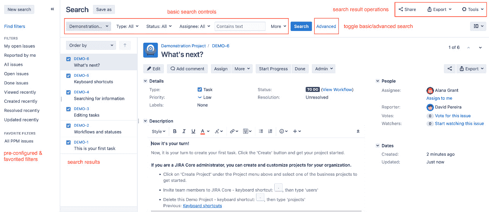

图 10.1 – 问题导航器

在**基本搜索**中，如你所见，你通过 UI 控件指定搜索条件，为每个字段选择值。

注意

如果你之前访问过问题导航器并选择了使用不同的搜索选项，例如**高级搜索**，那么 Jira 会记住这一设置并改为打开**高级搜索**。

## 快速搜索

我们将要查看的第一个搜索选项是快速搜索功能，它允许你根据问题的摘要、描述或评论中包含的文本执行快速简单的搜索。这使你能够在 Jira 中对所有问题执行快速的基于文本的搜索。

快速搜索功能具有几个额外的特点，让你通过智能查询，以最少的输入进行更专业化的搜索。Jira 提供了内置查询的列表，你可以使用这些查询作为快速搜索词，以便快速调出具有特定问题类型和/或状态的问题。以下表格包含一些有用的查询（你可以在[`confluence.atlassian.com/jiracoreserver/quick-searching-939937704.html`](https://confluence.atlassian.com/jiracoreserver/quick-searching-939937704.html)找到完整的快速搜索参考）：

| **智能查询** | **结果** |
| --- | --- |
| 问题关键字（例如，`HD-12`） | 直接带你到具有指定问题关键字的问题 |
| 项目关键字（例如，`HD`） | 显示在**问题导航器**页面上，指定关键字的项目中的所有问题 |
| `my`或`my open bugs` | 显示所有分配给当前登录用户的问题 |
| `overdue` | 显示所有今天之前到期的问题 |
| 具有特定状态的问题（例如，`open`） | 显示所有具有指定状态的问题 |
| 具有特定解决方案的问题（例如，`resolved`） | 显示所有具有指定解决方案的问题 |

表 10.1 – 智能查询

你可以将这些查询组合起来，在 Jira 中创建快速而强大的搜索。例如，以下查询将返回所有已解决的问题，`HD`是项目的关键字：

`HD resolved`

执行快速搜索比基本搜索或高级搜索更简单。你只需在右上角的**快速搜索**框中输入你想要搜索的文本或智能查询，然后按*Enter*键。

正如你所看到的，快速搜索的目的是让你以最快的方式找到你所需要的内容。通过智能查询，你能够执行的不仅仅是简单的基于文本的搜索。

需要注意的是，快速搜索是区分大小写的。例如，使用`My`进行搜索而不是`my`将变成一个简单的文本搜索，而不是查找分配给当前登录用户的问题。

## 基本搜索

这也被称为**简单搜索**。**基本搜索**界面允许你选择希望用于搜索的字段，例如问题状态，并为这些字段指定值。通过**基本搜索**，Jira 会显示可搜索字段的列表，并提示你为所选字段提供可能的搜索值。对于像**状态**和基于选择列表的自定义字段来说，这非常方便，因为你无需记住所有可能的选项。

例如，如下截图所示，我们正在搜索**Demonstration**项目中状态为**待办**的问题。为了帮助你，Jira 会列出所有可用的状态供你选择：

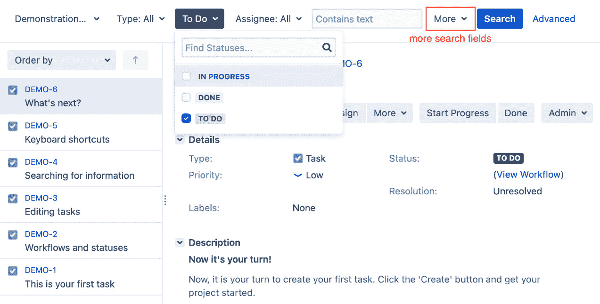

图 10.2 – 基本搜索

在使用**基本搜索**界面时，Jira 会默认显示**项目**、**问题类型**、**状态**和**受让人**等字段。你可以点击**更多**下拉选项，添加你希望用于搜索的字段。执行以下步骤以构建并运行基本搜索：

1.  浏览到**问题导航器**页面。如果你看不到基本搜索界面且显示了**基本**链接，点击它以切换到**基本搜索**。

1.  选择并填写**基本搜索**界面中的字段。你可以点击**更多**来添加更多搜索条件。

注意

每当你更改搜索条件时，Jira 会自动更新搜索结果。

在使用基本搜索时，需要记住的一点是，应用于所选项目和问题类型的配置，例如工作流状态和自定义字段的上下文，都会被考虑在内。（请参见*第五章*，*字段管理*，了解字段配置。）例如，如果一个自定义字段设置为仅适用于特定的项目和/或问题类型，你必须选择一个项目和问题类型，才能在搜索中显示该自定义字段。

## 使用 JQL 进行高级搜索

基本搜索非常有用，并能满足大多数用户的搜索需求。然而，它仍然存在一些限制。一个限制是，基本搜索允许你执行基于包含逻辑的搜索，而不支持排除逻辑。例如，如果你需要搜索所有项目中的问题，除了一个特定的项目外，你必须选择每个项目，排除项目则无法通过基本搜索界面指定。

这时高级搜索就派上用场了。使用高级搜索时，你将不再使用基于字段选择的界面，而是使用一种叫做 JQL 的查询语言。

JQL 是由 Atlassian 开发的自定义查询语言。如果你熟悉数据库（如 MySQL）中使用的**结构化查询语言**（**SQL**），你会发现 JQL 与 SQL 的语法相似；然而，JQL 并不完全等同于 SQL。

JQL 和 SQL 之间最显著的区别之一是 JQL 不以 `SELECT` 语句开始。一个 JQL 查询由一个字段、一个操作符，然后是一个值，如 `assignee = john` 或一个函数（返回一个值），如 `assignee = currentUser()` 组成。

你不能在 JQL 查询中指定返回哪些字段，这与 SQL 不同。你可以将 JQL 查询看作是普通 SQL `SELECT` 语句中的 `WHERE` 关键字后面的部分。以下表格总结了 JQL 中的各个组件：

| **JQL 组件** | **描述** |
| --- | --- |
| 关键字 | JQL 中的关键字是一些特殊的保留字，具有以下功能：将查询连接在一起，如 `AND`；确定查询的逻辑，如 `NOT`；具有特殊含义，如 `NULL`；提供特定功能，如 `ORDER BY` |
| 操作符 | 操作符是符号或单词，用于评估左侧字段的值以及右侧要检查的值。例如：等于：`=`；大于：`>`；`IN`：检查字段值是否在括号中指定的多个值之一 |
| 字段 | 字段是 Jira 系统和自定义字段。在 JQL 中使用时，字段的值用于评估查询。 |
| 函数 | JQL 中的函数执行特定的计算或逻辑，并将结果作为值返回，可以用于与操作符一起进行评估。 |

表 10.2 – JQL 组件

每个 JQL 查询本质上由一个或多个组件组成。一个基本的 JQL 查询包含以下三个元素：

+   **字段**：这可以是一个问题字段（例如状态）或自定义字段。

+   `=` 或 `>` 等操作符，用于满足某些条件，才能在结果中返回问题。

+   `Bug`) 或返回一个值的函数。如果你搜索的值包含空格，必须将其放在引号中——例如，`issuetype = "New Feature"`。

查询可以通过使用逻辑运算符 `AND` 或 `OR` 等关键字将其连接在一起，形成一个更复杂的查询。例如，获取所有状态为 **Done** 的问题的基本查询可能类似于以下内容：

`status = Done`

获取所有类型为 `Bug` 且分配给当前登录用户的更复杂查询可能类似于以下内容（其中 `currentUser()` 是一个 JQL 函数）：

`issuetype = Bug and status = Resolved and assignee = currentUser()`

讨论每个 JQL 函数和操作符超出了本书的范围，但你可以通过点击高级搜索界面中的帮助图标获取完整参考。完整的 JQL 语法参考可以在 [`confluence.atlassian.com/jiracoreserver0822/advanced-searching-1141970390.html`](https://confluence.atlassian.com/jiracoreserver0822/advanced-searching-1141970390.html) 找到。

你可以通过 **问题导航器** 页面访问高级搜索界面，方法如下：

1.  浏览到 **问题导航器** 页面。

1.  如果你还没有进入高级模式，点击右侧的 **高级** 链接。

1.  构建你的 JQL 查询。

1.  点击 **搜索** 按钮或按下键盘上的 *Enter* 键。

由于 JQL 结构复杂，且需要一些时间来熟悉，因此高级搜索界面提供了一些非常有用的功能，帮助你构建查询。该界面具有自动补全功能（可以在 **常规配置** 设置中关闭），帮助你选择关键词、值和运算符。

它还会实时验证你的查询，并告知你查询是否有效，如下图所示：

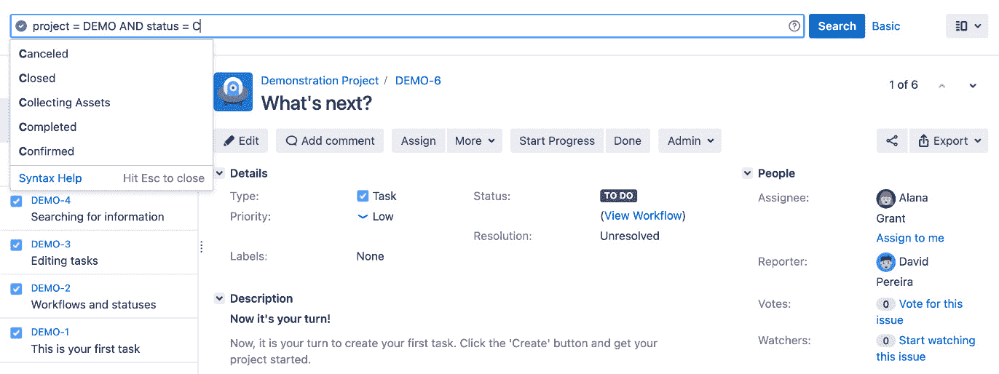

图 10.3 – 高级搜索

在运行查询时，你可以通过点击 **基本/高级** 链接在基本搜索和高级搜索之间切换，Jira 会自动将你的搜索条件转换为 JQL，反之亦然。事实上，这是一个非常有用的功能，可以帮助你在刚开始学习时，通过先构建基本搜索，再查看相应的 JQL，来学习 JQL 的基本语法。

提示

在简单搜索和高级搜索之间切换，可以帮助你熟悉 JQL 的基础知识。

然而，你需要注意，并不是所有的 JQL 都能转换为基本搜索，因为使用 JQL 可以做的事情比基本搜索界面要多得多。如果当前的 JQL 无法转换为基本搜索界面，**基本/高级**切换链接将被禁用。

现在我们已经了解了如何在 Jira 中执行搜索，我们将介绍如何使用和处理搜索结果，首先从问题导航器中可用的各种功能和操作开始。

# 处理搜索结果

问题导航器不仅可以让你运行搜索并呈现结果，还具备其他一些功能，允许你执行以下操作：

+   以不同的视图选项显示搜索结果

+   以不同格式导出搜索结果

+   选择你想在结果中查看的列

+   与其他人共享你的搜索结果

+   创建和管理过滤器

我们将在接下来的章节中详细探讨这些功能。

## 切换结果视图

问题导航器可以以两种不同的视图显示搜索结果。默认视图是 **详细视图**，在该视图中，结果中的问题列在左侧，当前选中的问题的详细信息显示在右侧。此视图允许你选择并查看问题的详细内容，还可以编辑问题。

第二种视图是 **列表视图**，在该视图中，问题以表格形式列出。问题的字段值以表格列的形式展示。正如你稍后会看到的，你可以配置表格的列以及它们的排序方式。你可以通过从 **视图** 菜单中选择选项，在 **基本/高级** 选项旁边切换这两种视图。

## 自定义列布局

如果你使用 **列表视图** 选项来显示搜索结果，你可以配置要显示的字段列。在 Jira 中，你可以为所有个人搜索以及每个搜索级别上的过滤器自定义问题导航器（我们将在本章稍后讨论）。如果你是管理员，你可以为所有用户设置默认的列布局（每个用户的个人列布局设置可以覆盖此设置）。

执行以下步骤以自定义全局问题导航器的列布局：

1.  浏览到 **问题导航器** 页面。

1.  将你的结果视图更改为 **列表视图**。

1.  选择 **列** 下拉菜单和列布局选项，如下所示：

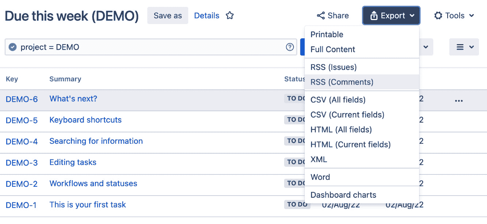

](img/Figure_10.4_B18644.jpg)

图 10.4 – 配置搜索列

以下选项可用于布局列：

+   **我的默认设置**：此列布局将应用于你所有的搜索

+   **过滤器**：此列布局将仅应用于当前过滤器

+   **系统**：此列布局将应用于所有搜索

要添加或删除字段列，只需勾选或取消勾选列表中的字段。要重新排列列布局，可以将列向左或向右拖动到合适的位置。

## 导出搜索结果

在问题导航器中，Jira 允许你将搜索结果导出为多种格式，如 MS Word 和 CSV。Jira 还可以以不同的格式展示搜索结果，如 XML 或打印友好的页面。

当你选择诸如 Word 或 Excel 等格式时，Jira 将生成适当的文件并让你直接下载。执行以下步骤将结果导出为不同的格式：

1.  浏览到 **问题导航器** 页面。

1.  执行一次搜索。

1.  选择右上角的 **导出** 下拉菜单。

1.  选择你希望看到的搜索结果格式，如下所示：

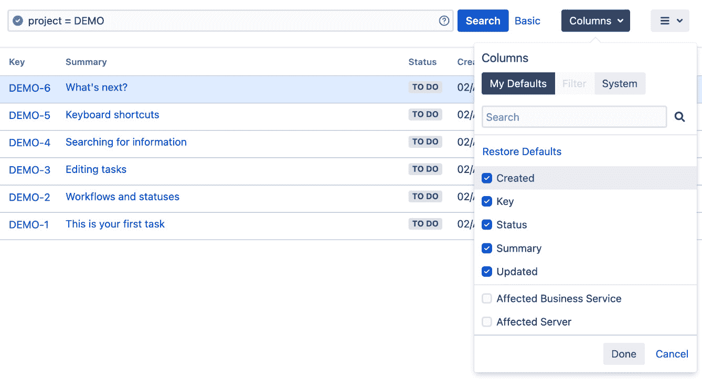

](img/Figure_10.5_B18644.jpg)

图 10.5 – 导出搜索结果

根据你选择的格式，一些格式将在屏幕上显示（例如可打印格式），而其他格式则会提示你弹出下载对话框（例如 Excel）。

## 分享搜索结果

完成搜索后，你可能想要与同事分享结果。现在，你可以告诉同事运行相同的搜索，或者正如我们将在本章后面看到的，保存你的搜索作为过滤器并与其他人分享。另一种更方便的方式是使用内置的共享功能，特别是当这是一次性的分享时。

要共享当前的搜索结果，你只需点击右上角的**共享**按钮，输入用户的名字或电子邮件地址（如果他们不是 Jira 用户）。你可以添加多个用户或电子邮件地址，以便与多个人员共享。此外，你还可以添加简短的备注，告诉人们你为什么要共享这些搜索结果，Jira 将会向所有选定的用户和电子邮件地址发送电子邮件。

## 过滤器

在你运行搜索查询后，有时保存查询以便后续使用是很有用的。例如，你可能已经为多个项目创建了查询，列出了每个项目中所有待完成的开放问题和新特性，并且这些任务有一个特定的完成日期，这样你可以跟踪它们的进展。

每次你想查看状态时，不必重新创建此搜索查询，你可以将查询保存为过滤器，之后可以在后续阶段重复使用。你可以把过滤器看作是可以重复使用的命名搜索查询。

除了能够快速生成报告而不必重新创建查询之外，将搜索查询保存为过滤器还为你提供了其他好处：

+   与其他用户共享已保存的过滤器

+   使用过滤器作为生成报告的数据源

+   使用过滤器来支持敏捷看板（参见*第三章*，*在 Jira 中使用敏捷项目*）

+   在仪表板上显示结果作为小工具

+   订阅搜索查询，以便将结果自动通过电子邮件发送给你

创建和使用过滤器作为小工具和敏捷看板数据源时需要注意的几点事项如下：

+   当你为敏捷看板创建过滤器时，请确保在搜索查询中选择相关的项目。

+   当你为小工具和敏捷看板创建过滤器时，请确保与你共享过滤器的用户组与访问小工具和看板的用户组相同，否则他们将看不到任何结果。

我们将在后续部分探讨你可以使用过滤器执行的所有高级操作，并解释一些新的术语和概念，如仪表板和小工具。但是，首先让我们看看如何创建和管理过滤器。

### 创建过滤器

要创建一个新的过滤器，你首先需要构建并执行搜索查询。你可以使用 Jira 提供的三种搜索选项中的任何一种，但请注意，搜索结果必须将你带到**问题导航器**页面。如果你使用快速搜索选项并按问题键搜索，则无法创建过滤器。

一旦你执行了查询，无论是否有返回结果，你都可以基于执行的搜索创建一个新的过滤器，具体操作如下：

1.  浏览到**问题导航器**页面。

1.  在 Jira 中构建并执行搜索查询。

1.  点击顶部的**另存为**按钮。

1.  为过滤器输入一个有意义的名称。

1.  点击**提交**按钮以创建过滤器。

创建过滤器后，你的所有搜索参数将被保存。未来当你重新运行已保存的过滤器时，Jira 将基于相同的参数检索更新后的结果。

请注意，如果你已经创建了过滤器，需要点击**新建过滤器**按钮才能开始新的搜索。由于问题导航器会记住你上次的搜索记录，如果你没有开始新的搜索，而是继续使用现有的过滤器，那么实际上你是在修改当前的过滤器。

### 管理过滤器

随着创建的过滤器数量增加，你将需要一个集中管理和维护它们的地方。

你可以通过问题导航器访问**管理过滤器**页面，方法如下：

1.  浏览到**问题导航器**页面。

1.  点击左侧的**查找过滤器**链接。你也可以通过顶部导航栏访问**管理过滤器**页面。

1.  从**问题**中调出下拉菜单。

1.  点击列表底部的**管理过滤器**选项。

**管理过滤器**页面按左侧标签中的设置将过滤器分为三大类，并提供一个选项来搜索现有过滤器：

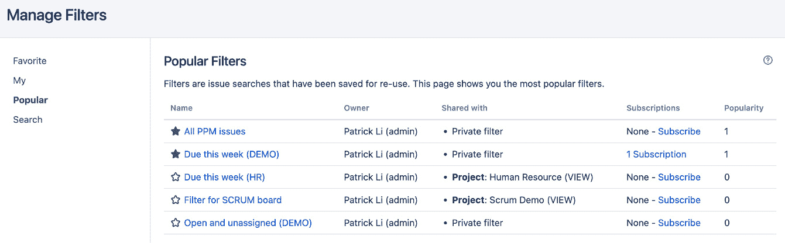

](img/Figure_10.6_B18644.jpg)

图 10.6 – 管理过滤器页面

+   **收藏夹**：此选项列出了在名称旁有灰色星标的过滤器。这些过滤器将出现在**问题**下拉菜单中。你可以通过直接点击星标来将过滤器标记为收藏。

+   **我的**：此选项列出了由你创建的过滤器。

+   **热门**：此选项列出了被最多人标记为收藏夹的前 20 个过滤器。

+   **搜索**：此选项搜索其他用户共享的现有过滤器。

上面的截图还显示了**所有 PPM 问题**和**本周到期（DEMO）**过滤器被标记为收藏夹。

### 共享过滤器

创建过滤器后，你可以更新其详细信息，例如名称和描述、共享权限以及搜索参数。默认情况下，新创建的过滤器不共享，这意味着它们仅对你可见。要与其他用户共享你的过滤器，请执行以下步骤：

1.  浏览到**管理过滤器**页面。

1.  点击你希望共享的过滤器的**编辑**选项。

1.  选择一个组/项目角色来共享过滤器，并点击**添加**。

1.  点击**保存**按钮以应用更改。

以下截图显示了此页面：

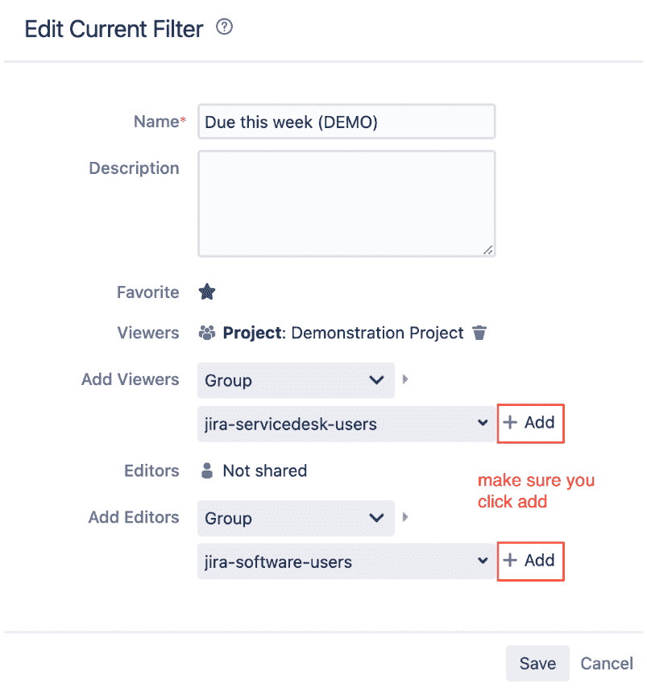

](img/Figure_10.7_B18644.jpg)

图 10.7 – 共享过滤器

注意

确保在选择要共享过滤器的组或项目后，点击**添加**链接。

为了能够共享过滤器，你还需要具有**创建共享对象**的全局权限（请参考*第九章*，*保护 Jira*，了解更多关于全局权限的信息）。

当你分享过滤器时，你可以选择谁拥有查看权限，这意味着可以查看并运行你的过滤器（搜索结果仍然由项目和问题权限控制），以及谁可以修改你的过滤器。如我们稍后将看到的，Jira 管理员也可以更改共享过滤器的所有权。

### 订阅过滤器

你在*第八章*《电子邮件与通知》中看到，Jira 能够在某些事件发生时向用户发送电子邮件，以便保持更新。通过过滤器，Jira 将此功能进一步扩展，允许用户订阅过滤器。

当你订阅一个过滤器时，Jira 会根据该过滤器运行搜索，并通过电子邮件将结果发送给你。你可以指定一个时间表，设置 Jira 应该何时以及多频繁地执行此操作。例如，你可以设置一个订阅，让 Jira 每天早上在你上班前向你发送结果，这样当你打开邮件收件箱时，你就会看到一份需要你关注的完整问题列表。

要订阅过滤器，你需要能够看到该过滤器（无论是由你创建的，还是其他用户与您共享的）。以下是你可以这样做的方式：

1.  浏览到**管理过滤器**页面。

1.  找到你希望订阅的过滤器。

1.  点击过滤器的**订阅**链接。

1.  选择订阅的接收者。通常，这将是你自己（**个人订阅**）。你也可以通过选择一个组来为其他人创建订阅。

1.  如果你希望在过滤器没有返回结果时仍然收到电子邮件，请勾选**即使没有发现问题，也发送此过滤器的电子邮件**选项。这对于确保你没有收到邮件不是由于其他错误引起的非常有用。

1.  指定一个频率和时间，Jira 可以在该时间向你发送电子邮件。

这将在以下截图中显示：

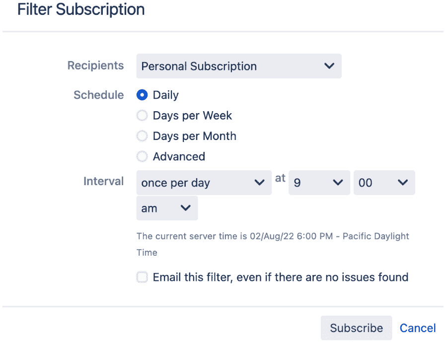

图 10.8 – 订阅过滤器

1.  点击**订阅**按钮。这将创建一个订阅，并将你带回**管理过滤器**页面。**订阅**链接会增加订阅的数量；例如，**1 个订阅**。

1.  点击**1 个订阅**链接，验证订阅是否已正确创建。

1.  点击**立即运行**链接来测试你新的订阅。完成后，你应该在你的订阅页面上看到如下内容：

图 10.9 – 查看订阅

### 删除过滤器

当不再需要过滤器时，您可以删除它。然而，由于您可以与其他用户共享过滤器，并且他们可以创建订阅，您需要记住过滤器可能被敏捷看板或其他地方使用，以及删除过滤器可能影响到其他用户。幸运的是，当您删除过滤器时，Jira 会通知您是否有其他人正在使用该过滤器。以下是操作方法：

1.  浏览到**管理过滤器**页面。

1.  点击您希望删除的过滤器的**删除**链接。这将弹出**删除过滤器**确认对话框。

1.  确保移除过滤器不会影响其他用户。

1.  点击**删除**按钮以移除该过滤器。

Jira 会通知您该过滤器是否正在被 Jira 使用，或者是否有用户订阅了它。您可以点击查看订阅者列表，然后决定是否继续删除该过滤器并通知其他用户，或者将过滤器保留在 Jira 中。

### 更改过滤器所有权

通常，Jira 仅允许过滤器的所有者对其进行更改，除非将编辑权限授予其他用户。这通常对私有过滤器不会造成问题，但当过滤器与其他用户共享或用于敏捷看板或仪表板小部件时，当所有者离开公司时可能会成为问题。

因此，Jira 管理员可以更改共享过滤器的所有权。按照以下步骤更改过滤器的所有权：

1.  浏览到 Jira 管理控制台。

1.  选择**系统**标签，然后选择**共享过滤器**选项。

1.  搜索您希望更改所有权的过滤器。

1.  点击**更改所有者**选项。

1.  搜索并选择一个用户作为新的所有者。

1.  点击**更改所有者**按钮。

如下截图所示：

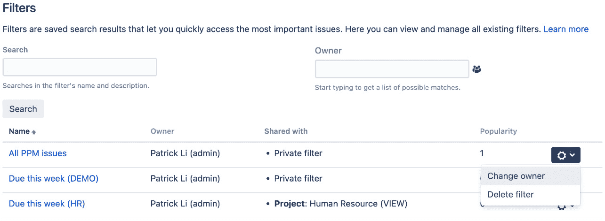

图 10.10 – 更改过滤器所有权

过滤器是 Jira 中非常有用的功能——不仅可以用它们访问之前的搜索并与他人共享，正如我们在后续章节中会看到的那样，Jira 还允许您基于过滤器运行报告并创建仪表板。让我们来看看。

# 报告

除了 JQL 和过滤器，Jira 还提供了专门的报告，帮助您更好地了解项目、问题、用户等的统计信息。Jira 中的大多数报告是为特定项目的问题提供报告的；然而，一些报告可以跨多个项目使用，配合过滤器。

## 生成报告

所有 Jira 报告都可以从特定项目的**浏览项目**页面访问，无论该报告是特定项目的还是全局的。两种报告类型的区别在于，全局报告允许您选择过滤器作为数据来源，而特定项目的报告则会根据您所在的项目预设数据来源。

在生成报告时，你通常需要提供几个配置选项。例如，你可能需要选择一个筛选器来提供报告数据，或者选择一个字段进行报告。每个报告的配置选项不同，但始终会有提示和建议来帮助你理解每个选项的含义。

执行以下步骤以创建报告；首先需要进入项目的浏览页面：

1.  选择你想要报告的项目。

1.  从左侧面板中点击**报告**选项。

1.  选择你想要创建的报告。可用的报告类型会根据项目类型而有所不同。

1.  指定报告的配置选项。

1.  点击**下一步**按钮以创建报告。

Jira 提供了多种专门针对敏捷项目设计的报告，如**燃尽图**，以及 Jira Core 提供的基本图表集，例如**平均年龄报告**和**饼图报告**。可用的报告类型取决于项目的类型。Scrum 和 Kanban 项目将在**敏捷**类别下提供报告，如下图所示：

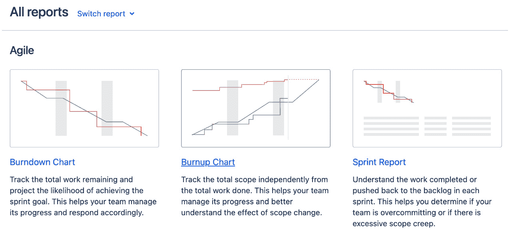

图 10.11 – 报告

让我们创建一个饼图报告，如下所示：

1.  我们首先选择要生成的报告类型，通过从 Jira 提供的可用报告类型列表中选择，如下图所示：

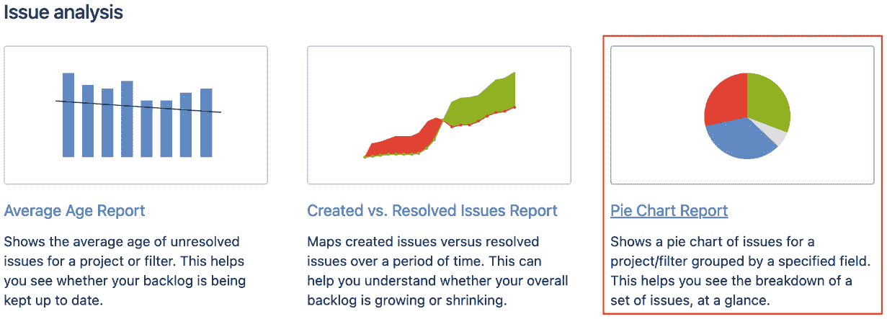

图 10.12 – 选择报告

1.  然后我们将配置必要的报告参数。在这种情况下，你需要指定是基于项目还是现有筛选器生成报告；默认情况下，当前项目将被预选。你还需要指定将报告的字段，如下图所示：

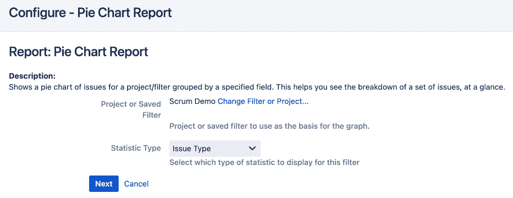

图 10.13 – 配置报告

1.  配置完报告并点击**下一步**按钮后，Jira 会生成报告并在屏幕上展示，如下图所示：

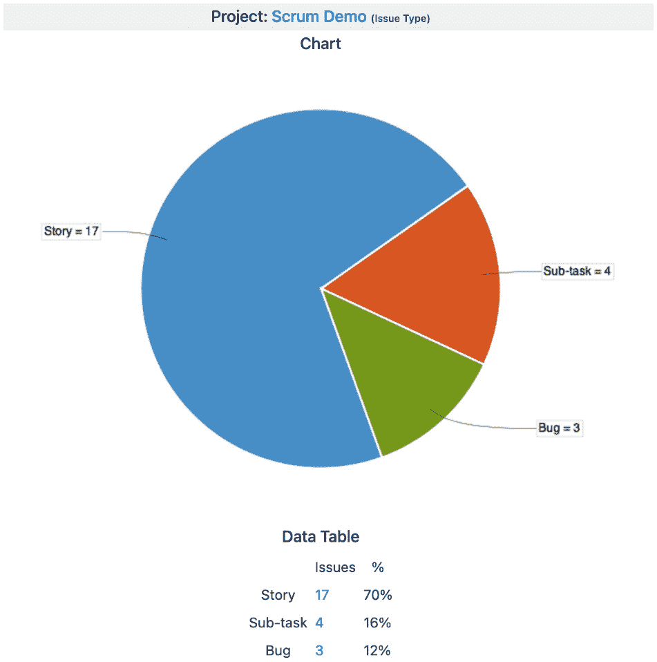

图 10.14 – 生成的报告

报告类型决定了报告的布局。有些报告会附带图表（例如，**饼图报告**），而其他报告则会有表格布局（例如，**单级分组报告**）。有些报告甚至提供将内容导出为 Microsoft Excel 等格式的选项（例如，**时间跟踪报告**）。

报告是基于特定项目生成的，并且是按需运行的。Jira 还允许你创建仪表板，可以跨多个项目显示数据，并且可以动态更新，始终显示最新数据。

# 仪表板

仪表板是你访问 Jira 时看到的第一个页面。仪表板上托管了被称为部件的迷你应用程序，这些部件提供来自你的 Jira 实例的各种数据和信息。Jira 能够通过这些部件在仪表板上展示许多功能，比如筛选器和报告，因此它是为用户提供相关或感兴趣信息的快速单页视图的绝佳方式。

在设计仪表板时，你应该始终考虑目标用户，并选择最适合的部件。例如，面向管理层的仪表板可能包含更多图表，而面向支持团队的仪表板则可以使用更多列表样式的部件。

## 管理仪表板

当你首次安装 Jira 时，默认看到的仪表板叫做**系统仪表板**，它已经预配置了显示一些有用的信息，例如所有分配给你的任务。以下是如何管理仪表板的步骤：

1.  由于每个人都共享系统仪表板，作为普通用户，你无法对其进行修改，但你可以创建自己的仪表板。每个仪表板的功能都是独立配置的。

1.  从**仪表板**下拉菜单中选择。

1.  选择**管理仪表板**选项。这将带你进入**管理仪表板**页面，如下图所示：

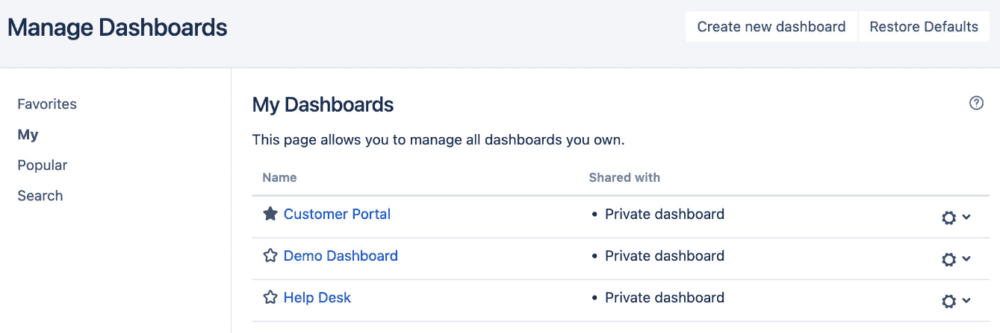

图 10.15 – 管理仪表板页面

在此页面，你可以编辑和维护由你创建的仪表板，搜索其他用户创建并共享的仪表板，并将其标记为收藏夹，这样它们将作为标签显示，方便快速访问。

当通过点击其名称前的星形图标将仪表板标记为收藏时，你可以通过点击顶部菜单栏中的**仪表板**链接访问该仪表板。如果你有多个收藏的仪表板，它们会在标签中列出，你可以选择显示其中的任何一个。

## 创建仪表板

默认的**系统仪表板**无法被普通用户修改，因此，如果你希望拥有一个展示专属于你的信息的个性化仪表板，你需要创建一个新的仪表板。请按照以下步骤创建新的仪表板：

1.  浏览到**管理仪表板**页面。

1.  点击**创建新仪表板**按钮。

1.  为新的仪表板输入有意义的名称和描述。

1.  选择是否希望从现有仪表板复制，或者从空白仪表板开始创建。这类似于从头创建一个新的屏幕或复制一个现有屏幕。

1.  通过点击星形图标，选择是否将新的仪表板设置为收藏仪表板（以便于快速访问）。

1.  选择是否希望与其他用户共享仪表板。如果你选择**所有人**选项将仪表板共享给每个人，那么未登录的用户也能查看你的仪表板。

1.  点击**添加**按钮以创建仪表板。

以下截图展示了如何从头开始创建一个新仪表盘（空白仪表盘），并允许 `Hummingbird` 项目的所有成员查看，允许 `hummingbird-managers` 组的成员编辑：

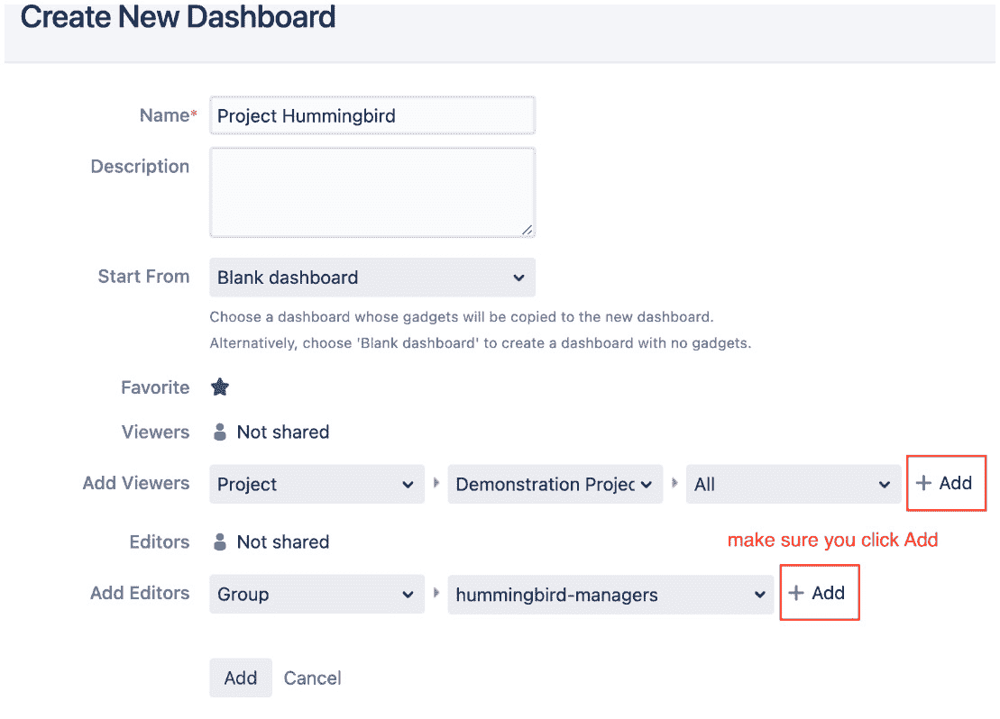

图 10.16 – 创建新仪表盘

要能够共享仪表盘，你还需要拥有**创建共享对象**的全局权限（请参阅*第九章*，*确保 Jira 安全性*，以获取有关全局权限的更多信息）。

创建新仪表盘后，你将立即进入该仪表盘。作为新仪表盘的所有者，你将能够编辑其布局并向其中添加小部件。我们将在下一节中查看这些配置选项。

## 配置仪表盘

所有自定义创建的仪表盘在创建后都可以进行配置。作为所有者，你可以配置仪表盘的两个方面：

+   **布局**：描述仪表盘页面如何划分

+   **内容**：描述要添加到仪表盘的小部件

### 为仪表盘设置布局

你必须是该仪表盘的所有者（由你创建）才能设置布局。设置仪表盘的布局非常简单直接。如果你是所有者，在查看仪表盘时，右上角会有**编辑布局**选项。

Jira 提供了五种布局供你选择。这些布局在仪表盘页面的屏幕空间划分方式上有所不同。默认情况下，新的仪表盘使用第二种布局，将其分为两个相等大小的列。按照以下步骤为仪表盘设置布局：

1.  从**仪表盘**中调出下拉菜单。

1.  选择你希望编辑布局的仪表盘。

1.  点击右上角的**编辑布局**选项。这将弹出**编辑布局**对话框。

1.  选择你希望更改的布局，如下所示：

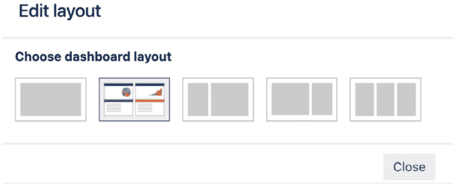

图 10.17 – 选择仪表盘布局

从对话框中选择的布局将立即应用到仪表盘。任何现有内容的大小和位置将自动调整，以适应新的布局。在确定好仪表盘的布局后，你可以开始向仪表盘添加内容，称为**小部件**。我们将在本章后面介绍小部件。

## 更改仪表盘的所有权

与过滤器一样，Jira 管理员可以将仪表盘的所有权更改为其他用户，以防原始用户已离开组织。按照以下步骤更改仪表盘的所有权：

1.  进入 Jira 管理控制台。

1.  选择**系统**标签，然后选择**共享仪表盘**选项。

1.  搜索你希望更改所有权的仪表盘。

1.  点击**更改所有者**选项。

1.  搜索并选择一个将成为新所有者的用户。

1.  点击**更改所有者**按钮，如下图所示：

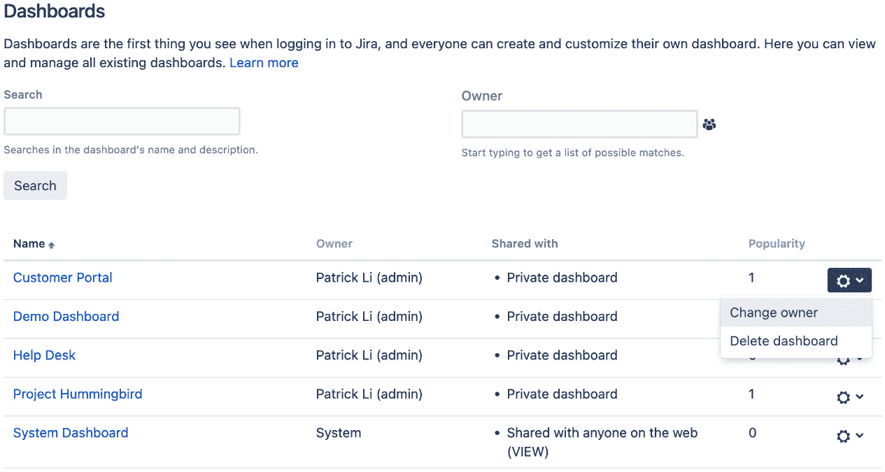

图 10.18 – 更改仪表盘所有权

# 小工具

**小工具**就像是生活在 Jira 仪表盘上的迷你应用程序。它们类似于我们今天大多数智能手机上的小部件，或者大多数门户应用程序中的端口。每个小工具都有自己独特的界面和行为。例如，**饼图**小工具将数据以饼图形式展示，而**分配给我**小工具则在表格中列出分配给当前用户的所有未解决问题。小工具是另一种通过搜索过滤器的方式，通过可视化的方式向最终用户展示结果。Jira 默认提供了许多有用的小工具，你可以通过第三方应用程序向 Jira 添加更多小工具。我们将在*第十二章*中讲解如何安装和管理第三方应用程序。

让我们从如何将小工具添加到仪表盘开始。

## 将小工具放置到仪表盘上

所有小工具都列在**小工具目录**中。Jira 提供了许多有用的小工具，例如你在**系统仪表盘**上看到的**分配给我**小工具。以下截图展示了小工具目录，列出了 Jira 中所有捆绑的小工具：

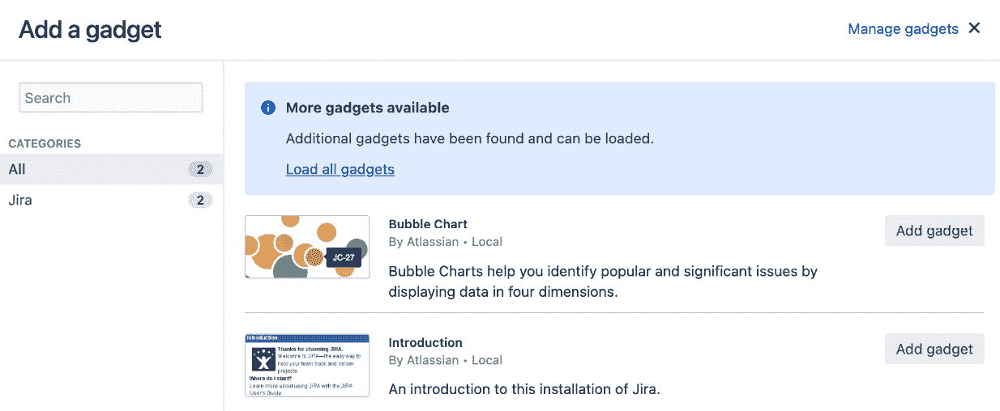

图 10.19 – 小工具目录

执行以下步骤，将小工具放置到你的仪表盘上：

1.  从**仪表盘**中调出下拉菜单。

1.  选择一个你希望添加小工具的仪表盘。

1.  点击右上角的**添加小工具**选项。这将打开**小工具目录**窗口。

1.  点击**加载所有小工具**链接，使所有小工具显示。你只需要在首次加载小工具目录时执行此操作。

1.  点击**添加小工具**按钮，添加你希望添加的小工具。

1.  关闭对话框以返回仪表盘。

根据你选择的小工具，有些小工具可能需要配置额外的选项。对于这些小工具，你将在仪表盘上看到它们的配置界面。填写选项后，点击**保存**按钮。

让我们看一下以下的配置界面截图，展示**过滤结果**小工具：

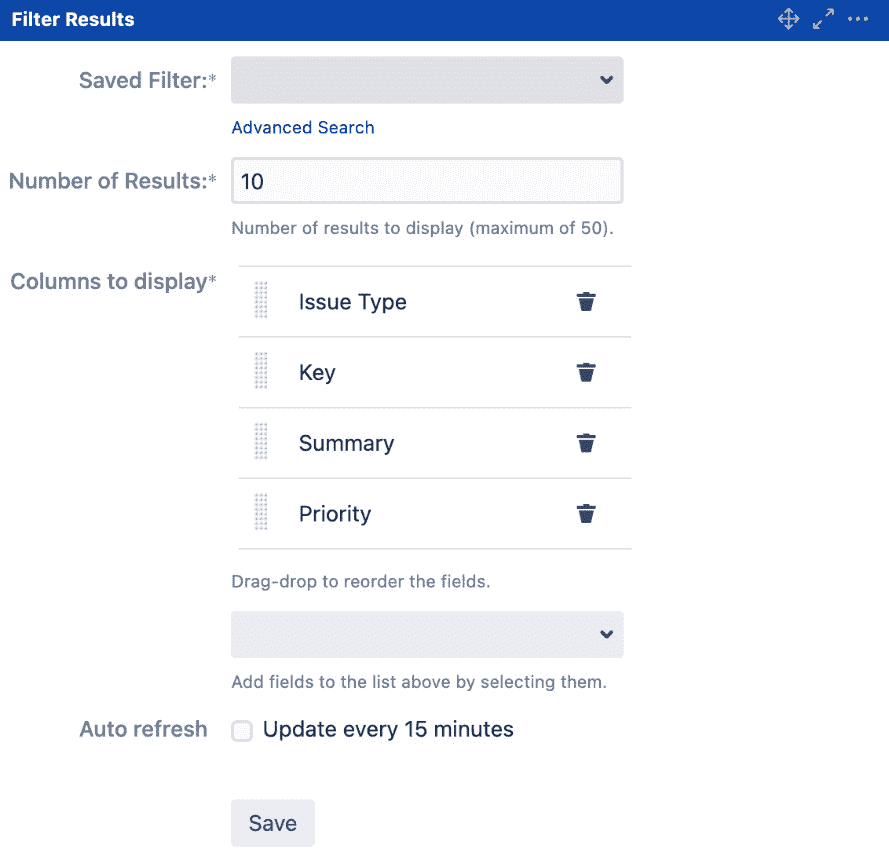

图 10.20 – 配置小工具

在配置界面中，你可以选择一个搜索过滤器来显示并控制显示的结果数量及要包含的字段。一个常见的参数是**自动刷新**选项，你可以决定小工具刷新内容的频率，或者如果不勾选，它将保持静态。每当你刷新整个仪表盘时，所有小工具都会加载最新数据，但如果你在仪表盘上停留较长时间，每个小工具可以自动刷新其数据，这样内容就不会随着时间变得过时。

当你添加小工具时，它通常会添加到仪表盘的第一个可用位置。有时候，这可能不是你希望小工具显示的位置，在其他情况下，你可能会想要不时地移动现有的小工具。作为仪表盘的所有者，你可以通过拖拽小工具到所需位置，轻松地在仪表盘上移动小工具。

## 编辑小工具

在你首次将小工具放置在仪表盘上并配置它后，小工具将记住这些配置并用它来呈现内容。你可以更新配置细节，甚至调整其外观和感觉，如下所示：

1.  浏览到包含你希望更新的小工具的仪表盘。

1.  将鼠标悬停在小工具上并点击右上角的下箭头按钮。这将弹出小工具配置菜单。

1.  点击**编辑**选项。

1.  这将把小工具切换到配置模式。

1.  更新配置选项。

1.  点击**保存**按钮以应用更改。你可以在这里看到一个可能的样例：

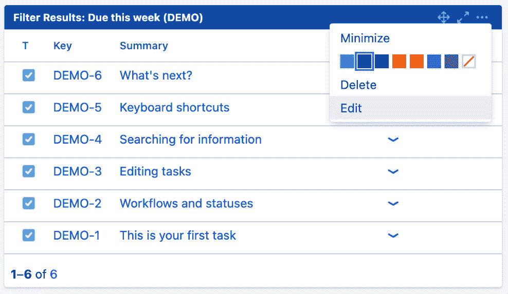

图 10.21 – 编辑小工具

上述截图展示了**已分配给我**小工具的**编辑**菜单。有些小工具会有一个**刷新**选项。由于小工具是通过 AJAX 异步获取数据的，你可以使用此选项来刷新小工具本身，而无需刷新整个页面。**编辑**、**删除**和**颜色**选项仅对仪表盘的所有者可用。

## 删除小工具

作为仪表盘的所有者，你可以在不再需要时从仪表盘上移除现有的小工具。当你从仪表盘中移除小工具时，请注意，所有有权限访问你仪表盘的其他用户将无法再看到它。执行以下步骤删除小工具：

1.  浏览到包含你希望删除的小工具的仪表盘。

1.  将鼠标悬停在小工具上，并点击右上角的下箭头按钮。这将弹出小工具配置菜单。

1.  点击**删除**选项。

1.  在提示时确认移除操作。

一旦移除，该小工具将从仪表盘消失。如果你选择稍后重新添加相同的小工具，你将需要重新配置它。

这涵盖了 Jira 中的搜索、报告和仪表盘。在下一节中，我们将为我们的 HR 项目构建一个自定义仪表盘。

# HR 项目

在我们之前的章节和练习中，我们构建并定制了一个 Jira 项目来收集用户的数据。现在我们需要做的是处理并将这些数据呈现给用户。我们在这次练习中要达到的目标是为我们的 HR 团队设置一个仪表盘，其中包含有用的信息，如统计数据和问题列表，这些可以帮助我们的团队成员更好地组织自己，为其他部门提供更好的服务。

## 设置过滤器

第一步是创建一个有用的过滤器，能够与团队的其他成员共享，并且还充当我们的小工具的数据源。我们将使用高级搜索构建我们的搜索。按以下步骤操作：

1.  浏览到**问题导航器**页面。

1.  点击**高级**链接切换到使用 JQL 的高级搜索。

1.  在 JQL 搜索查询中输入`project = HR and issuetype in ("New Employee", Termination) and resolution is empty order by priority code`。

1.  点击**搜索**按钮执行搜索。

1.  点击**保存为**按钮，弹出**保存过滤器**对话框。

1.  将过滤器命名为**未解决的 HR 任务**，然后点击**提交**按钮。

1.  通过点击**详情**链接旁边的**保存为**按钮，将过滤器与在*第九章*中设置的`hr-team`组共享，章节名称为*保护 Jira*。

该过滤器搜索并返回来自我们 HR 项目的“新员工”和“离职”类型的未解决问题列表。搜索结果按优先级排序，用户可以根据排序判断紧急程度。正如你在后续步骤中将看到的，这个过滤器将作为你的小工具数据源，用于在仪表板上呈现信息。

## 设置仪表板

下一步是为你的帮助台团队创建一个新的仪表板。你需要一个专门为你的团队设计的仪表板，这样你可以方便地共享信息。例如，你可以在一个大屏幕投影仪上展示所有需要处理的高优先级事件。按以下步骤操作：

1.  浏览到**管理仪表板**页面。

1.  点击**创建新仪表板**按钮。

1.  将新仪表板命名为**人力资源**。

1.  选择一个空白仪表板作为基础。

1.  将新仪表板标记为收藏。

1.  将仪表板与`hr-team`组共享。

1.  点击**添加**按钮创建仪表板。

在我们的示例中，我们将使用你新仪表板的两个默认列布局。或者，你也可以尝试其他布局，找到最适合你需求的布局。

## 设置小工具

现在你已经设置好了门户仪表板页面并与团队的其他成员共享，你需要开始向仪表板中添加一些有用的信息。一个例子是显示所有待处理的未解决的事件。Jira 有一个**分配给我**的小工具，可以显示所有分配给当前登录用户的问题，但你需要的是一个不考虑事件分配人的全局列表。

幸运的是，Jira 还提供了一个**过滤器结果**小工具，能够根据搜索过滤器显示搜索结果。既然你已经创建了一个过滤器，返回所有未解决的任务在你的 HR 项目中，那么两者结合可以很好地解决你的问题。按照以下步骤操作：

1.  浏览到你刚刚创建的`人力资源`仪表板。

1.  点击右上角的**添加小工具**选项。

1.  点击**添加小工具**按钮，选择**筛选结果**小工具。

1.  选择你创建的**未解决的 HR 任务**筛选器。

1.  为**显示的列**选项添加任何你希望添加的额外字段。

1.  启用`15`分钟。

1.  点击**保存**按钮。

这将向你的新仪表板添加一个新的**筛选结果**小工具，以你的筛选器作为数据源。该小工具将每 15 分钟自动刷新其内容，因此你无需一直手动刷新页面。你可以向仪表板添加其他小工具，使其更加信息丰富且实用。其他有用的小工具包括**活动流**和**分配给我**小工具。

## 汇总

这基本上就是你在 Jira 中设置和共享仪表板所需做的一切。添加小工具后，你将能够看到它的运行效果。这样做的好处是，由于你已经将仪表板共享给团队中的其他成员，他们也能看到该仪表板。团队成员可以搜索你的新仪表板，或将其标记为收藏，以便将其添加到他们的仪表板列表中。

你需要记住，如果你使用筛选器作为小工具的数据源，你还必须与其他用户共享该筛选器；否则，他们将无法看到小工具中的任何内容。

# 总结

本章中，我们介绍了用户如何搜索和报告他们在 Jira 中输入的数据，这对于任何信息系统来说都是一个基本组件。Jira 通过提供多种搜索选项，包括快速搜索、简单搜索和高级搜索，为用户提供了强大的搜索功能。你可以通过创建筛选器来保存并命名你的搜索，这些筛选器可以在以后重新运行，从而避免重新创建相同的搜索。

Jira 还允许你创建可配置的项目报告或从搜索筛选器返回的结果。信息可以通过仪表板与他人共享，仪表板作为一个门户，方便用户快速查看保存在 Jira 中的数据。

在下一章，我们将介绍 Jira 家族中的另一款应用——Jira Service Desk，它帮助将 Jira 转变为一个功能全面的服务台，具备强大的功能，如客户门户和 SLA 管理。
