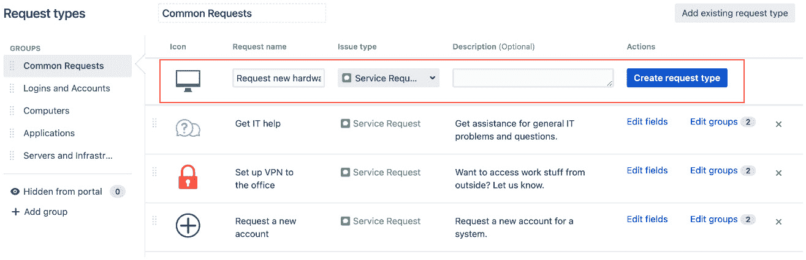

# 11

# Jira 服务管理

Jira 最初是为了帮助开发人员跟踪软件缺陷而设计的，随着时间的推移，凭借其灵活性和可扩展性，逐渐发展成一种通用的任务跟踪工具，所有组织都可以使用。因此，许多组织开始利用其强大的工作流功能将 Jira 用作服务台工具，这一做法迅速获得了巨大的人气。鉴于这种独特的应用场景及其潜力，Atlassian 推出了名为 Jira 服务管理的新产品。Jira 服务管理是一种专门构建的解决方案，建立在 Jira 平台之上，将其转变为一个功能完善的服务台解决方案，具有独特的能力。

在本章中，我们将涵盖以下主题：

+   介绍 Jira 服务管理

+   安装 Jira 服务管理

+   开始使用 Jira 服务管理

+   服务台用户类型

+   问题类型和请求类型

+   **服务级别协议**（**SLAs**）

+   使用队列管理请求

+   创建知识库文章

+   流程自动化

# 介绍 Jira 服务管理

在前几章中，我们探讨了 Jira 的核心功能，包括工作流、自定义字段和屏幕。我们不难看出，如何通过创建新的自定义字段、屏幕和工作流方案将 Jira 软件作为服务台来实现。虽然 Jira 确实能够处理服务台的需求，但仍有许多值得改进的地方。

例如，用户界面常常对业务用户来说过于复杂且令人困惑，导致他们难以简单地创建支持工单。尽管我们做出了最大努力，屏幕上仍然有太多选项，其中大多数在服务台环境中并不实用。另一个例子是缺乏设置任何 SLA 的能力，从而无法确保一致的服务质量。

这就是 Jira 服务管理的作用所在。它通过为终端客户和支持团队提供简洁、直观且用户友好的界面，解决了 Jira 的所有开箱即用的不足之处。它还提供了许多你可以从服务台解决方案中期望的功能。如以下截图所示，Jira 服务管理让你通过四个简单的步骤来服务你的客户：

图 11.1 – Jira 服务管理

如图所示，Jira 服务管理简化了提出服务请求并履行该请求的过程，为不同角色的用户提供了独特的体验。

# 安装 Jira 服务管理

您可以通过两种方式获取 Jira Service Management。第一个选项是将其安装到您已有的 Jira Core 或 Jira Software 实例中。这是最简单的方法，因为它不需要额外的硬件支持，可以充分利用您现有的资源。此外，它还便于您的代理与其他团队合作，共同解决客户请求。安装 Jira Service Management 的步骤如下：

1.  以 Jira 管理员身份登录。

1.  浏览到 Jira 管理控制台。

1.  选择**应用程序**选项卡。

1.  单击右侧面板中的**免费试用**按钮，位于**Jira Service Management**下：

图 11.2 – 尝试并安装 Jira Service Management

1.  接受用户协议，并按照屏幕上的指示完成安装。

第二个选项是将 Jira Service Management 安装为独立应用程序。如果您没有运行中的 Jira Software 实例，或者希望将软件问题跟踪系统与支持系统分开，请选择此选项。即使是来自这两个实例的用户也可以像第一种选项一样协作解决客户请求，只不过需要额外的步骤进行设置。步骤如下：

1.  在两个 Jira 实例之间创建应用链接。

1.  将两个 Jira 实例与相同的用户库（如 LDAP）集成，以确保两个系统中的用户详细信息一致。

要将 Jira Service Management 安装为独立应用程序，您可以参考*第一章*，《Jira 数据中心入门》，因为安装步骤大致相同。

在决定选择哪个选项时，您需要考虑几个因素：

+   **成本**：如果您想部署一个独立实例的 Jira Service Management，将会有硬件和软件的初期成本，以及系统上线后的维护成本。

+   **复杂性**：这取决于您的选择。一方面，独立部署会增加复杂性，因为您需要管理更多的服务器；但另一方面，联合部署则是在系统配置上增加复杂性。因此，您需要根据可用的内部技术专长来做出平衡。您是否有团队负责所有基础设施并可以承担更多服务器？是否有经验丰富的 Jira 管理员能够管理一个合并的 Jira 实例？

+   **安全性**：当 Jira Service Management 独立部署时，它与其他 Jira 实例是分开的。这使得由于配置错误和其他失误导致的数据泄漏的可能性降低。尤其当你的服务管理项目是公开可访问的，而你的软件项目仅限于内部时；如果公共项目和私有项目都在同一个实例中，你需要特别小心以确保数据安全。

+   **可扩展性**：这是另一个容易被忽视的因素。如果你将 Jira Service Management 部署在与 Jira Software 相同的实例中，你需要确保你的服务管理项目所增加的负载能够由当前硬件处理，特别是当你允许公开访问你的项目时。

+   **维护**：当你开始使用 Jira Service Management 时，你可能会进行自定义设置并添加第三方应用，这在升级时可能增加复杂性。如果 Jira Service Management 是独立部署的，那么任何自定义内容将仅限于该部署。但如果你使用的是联合部署，你需要确保所有的自定义设置和应用程序与你想要升级的版本兼容。

正如我们所见，决定部署模型时需要考虑的因素有很多。好消息是，你总是可以稍后合并或拆分你的部署，因此你不必永远被一个决定困住。然而，这可能是一个非常复杂的过程，特别是在大规模部署时，因此建议规划好你长期使用 Jira 的愿景。

# 开始使用 Jira Service Management

在我们开始使用 Jira Service Management 之前，了解并熟悉一些关键术语是很重要的，具体如下：

+   **代理**：这些是你的服务支持团队成员，他们将处理客户请求。他们是可以执行诸如编辑、分配和关闭请求等操作的用户。

+   **客户**：这些是会在你的服务台提交支持请求的最终用户。这些客户可以是你的产品的客户，也可以是来自其他部门需要 IT 支持的同事。

+   **客户门户**：这是你的客户的主要登录页面。它是一个简单、干净、易于使用的服务台前端界面，没有标准 Jira 界面中的多余噪音，如下图所示：

图 11.3 – 客户门户

+   **队列**：这些类似于 Jira 过滤器，显示满足某一特定条件的问题子集。服务台代理使用队列来优先处理和选择需要处理的请求。

+   **请求**：这些是您的最终用户（而非代理人），例如客户，提交到 Jira Service Management 的内容。从底层来看，它们只是普通的 Jira 问题。然而，在服务台环境中使用“**请求**”一词能减少混淆。简而言之，请求是客户看到的内容，而问题是代理人看到的内容。

+   **服务台**：这是客户提交请求的地方。从底层来看，服务台是一个属于“服务台项目类型”的 Jira 项目。有关项目类型的更多信息，请参考 *第二章*，*使用 Jira 进行业务项目*。

如下截图所示，当客户与请求进行交互时，用户界面与代理人看到的界面非常不同。它是一个更简单的 UI，仅显示请求的关键信息，如其描述和状态。客户在提交请求后无法更改请求详细信息，只能向请求添加新的评论或附件：

图 11.4 – 请求视图

有关服务台的关键信息如下：

+   **请求类型**：这表示客户可以提交的不同类型的请求。这些请求可以是任何内容，包括问题报告、帮助请求或一般咨询。当您创建一个新的请求类型时，Jira 会在后台创建一个新的问题类型。请求类型的一个主要特点是，它允许您为其指定一个易于理解的名称。虽然实际的问题类型叫做 **问题报告**，但您可以将其重命名并显示为 **提交问题报告**。

+   **服务台**：这是代理人将要使用的界面。每个服务台都有一个面向客户的门户。后台，服务台是一个由 Jira 权限、工作流和其他方案控制的 Jira 项目。

+   **SLA**：SLA 定义了保证提供给客户的服务质量。在 Jira Service Management 中，SLA 是以时间为单位的，比如响应时间和解决问题所花费的总时间。

## 创建新的服务台

使用 Jira Service Management 的第一步是创建一个新的服务台项目。由于服务台在后台实际上是一个带有新用户界面的 Jira 项目，因此最简单的选项是使用其中一个服务项目模板来创建一个新项目。

要创建一个新的服务台，请执行以下步骤：

1.  从**项目**下拉菜单中选择**创建项目**选项。

1.  从**服务项目类型**框中选择一个项目模板，如 **IT 服务台**，然后点击 **下一步**。

1.  输入新服务台项目的名称和密钥，然后点击**提交**：

图 11.5 – 创建服务台项目

或者，你也可以使用现有的 Jira 项目，并将其转换为服务台。你只需要按照以下步骤更新项目类型：

1.  浏览到你想将其转为服务台的项目设置页面。

1.  从左侧面板选择**详细信息**选项。

1.  将**项目类型**选项更改为**服务**，并点击**保存详情**：

图 11.6 – 更改项目类型

当你切换项目类型时，项目类型专有的功能将会丢失。一旦你的服务台创建完成，你将进入服务台用户界面，如下图所示：

图 11.7 – Jira 服务管理 UI

每个服务台都有两个界面。一个是由你作为管理员和你的支持团队成员（即代理）使用的界面。第二个界面是客户门户，客户将通过该门户创建请求并与代理互动。当你为服务台进行配置更改时，你可以随时通过点击**客户渠道**，然后点击左侧导航面板中的**访问门户**链接，预览更改效果，这将显示客户门户的样子。

注意

客户门户下显示的 URL 是客户访问你服务台的地址。

## 对客户门户进行品牌化

你可以使用以下选项对服务台的客户门户进行品牌化：

+   **帮助中心名称**：这是你的帮助中心的整体名称。可以将其视为你的 Jira 实例的名称。

+   **客户门户名称**：这是特定服务台门户的名称。

+   **客户门户介绍文本**：这是将在特定服务台门户中显示的欢迎文本。

+   **客户门户 logo**：这是特定服务台门户的 logo。

以下截图展示了样例客户门户中每一项内容：

图 11.8 – 自定义门户

要配置特定客户门户的品牌，执行以下步骤：

1.  浏览到你想要进行品牌化的服务台项目设置页面。

1.  从左侧面板选择**门户设置**。

1.  在**名称**和**介绍**文本框中分别输入名称和欢迎文本。

1.  选中**为此客户门户使用自定义 logo**选项，并上传你的客户门户 logo。

配置设置如下所示：

图 11.9 – 门户配置

现在我们已经看到如何创建服务台并对其客户门户进行品牌化，让我们看看 Jira 服务管理中的不同用户类型。

# 服务台用户类型

Jira 服务管理引入了几种新的用户类型。在后台，这些用户类型会映射到 Jira 服务管理安装时创建的新项目角色：

+   **代理**：这些是服务台团队的成员，负责处理请求。代理会被添加到**服务台团队**项目角色中。

+   **协作者**：这些是来自其他业务职能的成员；他们不是您的服务台团队成员。但是，他们可以帮助解决客户问题。一个很好的例子是产品领域专家或工程师。协作者会被添加到**服务台团队**项目角色中。

+   **客户**：这些是通过您的帮助台门户提交请求的最终用户。客户会被添加到**服务台客户**项目角色中。

+   **组织**：这些是客户的群体。例如，一个组织可以代表一家公司，所有该公司的员工将成为该组织的一部分。请求可以限制为仅在同一组织的客户之间共享。

## 向服务台添加代理

代理是将在 Jira 服务管理中处理客户请求的 Jira 用户。这些通常是您的支持团队成员。代理会消耗 Jira 服务管理的许可证。要向服务台添加代理，请按以下步骤操作：

1.  浏览到您希望添加代理的服务台。

1.  点击左侧面板中的**邀请团队**选项。

1.  搜索并添加您希望邀请的用户作为服务台团队的代理（成员）。您可以选择并添加多个代理。点击**邀请 x 人**按钮：

图 11.10 – 添加代理

当您向服务台添加代理时，您可以选择 Jira 中的现有用户，这将授予该用户访问服务台的权限。如果您要添加的用户不存在，您也可以通过输入用户的电子邮件地址来创建一个新的 Jira 账户，并在一步操作中将其添加为代理。此时将发送一封电子邮件，其中包含设置密码的链接。通过这种方式创建的新用户账户将自动被添加到**jira-servicedesk-users**组和**服务台团队**项目角色中。有关组和角色的更多信息，请参见*第九章*，*保护 Jira*。

## 管理服务台客户

客户是通过您的客户门户提交请求的最终用户。您可以手动邀请客户，或者允许他们自行注册。Jira 服务管理要求客户拥有账户才能提交请求。好消息是，客户不会消耗 Jira 服务管理的许可证，因此您可以拥有任意数量的客户。

当客户向您的服务台提出请求时，该请求可能包含特定于客户的敏感信息。您的服务台还可能为来自不同组织的客户提供服务。因此，您需要管理请求及其相关数据的共享和访问方式。

第一步是决定谁可以成为您服务台的客户，以及如何将一个客户的请求与另一个客户共享：

1.  浏览到您想要管理客户权限的服务台项目管理员页面。

1.  从左侧面板中选择**客户权限**选项。

1.  在**谁可以提出请求？**部分下选择谁可以在您的服务台作为客户提出请求。默认情况下，任何拥有帐户的人都可以提出请求，但您可以将其限制为已添加到您的服务台的特定用户。

1.  在**客户可以与谁共享请求？**部分下选择如何共享请求。通常，您只希望客户能够在自己所在的组织内部共享请求信息。

1.  单击**保存**按钮以保存更改。

如果您已经将客户权限缩小，仅允许特定客户在您的服务台提出请求，您需要添加/邀请他们。要邀请客户加入服务台，请执行以下步骤：

1.  浏览到您想要添加客户的服务台。

1.  从左侧面板中选择**客户**选项。

1.  单击**添加客户**按钮。

1.  输入客户的电子邮件地址以邀请他们，然后单击**添加**按钮，如下所示：

图 11.11 – 添加客户

客户将收到电子邮件，邮件中包含如何访问客户门户以及在必要时创建帐户的步骤。

如果您的服务台为多个组织的客户提供服务，您可以创建这些组织并将客户添加到其中。通过将客户分组到各自的组织中，您可以控制如何在不同客户之间共享请求。

## 向服务台添加合作者

合作者是 Jira 用户，他们不是您的支持团队成员（不是代理），但在领域知识和理解上有专业的知识，可以帮助代理诊断和解决客户请求。在 Jira 服务管理中，合作者是**服务台团队**项目角色中的用户，但不在**jira-servicedesk-users**组中，作为合作者添加用户是轻松授予该用户访问服务台项目权限的方式。合作者不占用 Jira 服务管理许可证。

要向您的服务台添加合作者，请按照以下步骤操作：

1.  浏览到您想要添加合作者的服务台项目管理员页面。

1.  从左侧面板中选择**用户和角色**选项。

1.  单击**将用户添加到角色**按钮。

1.  搜索并选择要添加的用户，选择**服务台团队**角色，然后点击**添加**按钮。

当将用户设置为协作者时，你只是赋予用户访问服务台的权限，以便他们可以查看、评论和为请求添加附件。

# 问题类型和请求类型

Jira 使用问题类型来定义问题的目的，而 Jira Service Management 则使用请求类型来实现相同的目的。在后台，每个请求类型都映射到一个问题类型。两者之间的主要区别在于，请求类型是展示给客户的，通常有一个更具描述性的名称。例如，一个问题类型被称为**事件**，而相应的请求类型则被称为**报告系统故障**。你可以将请求类型视为带有更具信息量的显示名称的问题类型。正如我们将在本节后面看到的那样，另一个请求类型的关键特点是，你可以将它们组织成组，帮助用户找到他们需要的内容。

## 设置请求类型

要为您的服务台创建一个新的请求类型，请执行以下操作：

1.  浏览到要创建新请求类型的服务台项目设置页面。

1.  从左侧面板中选择**请求类型**选项。

1.  从左侧选择该请求类型应属于的组。我们将在本节稍后讨论组。

1.  输入请求类型的名称。你可以尽可能详细地描述，以便客户能够轻松理解其目的。

1.  点击**图标**下的图片以选择请求类型的新图标。

1.  选择请求类型所映射的问题类型。

1.  输入一个可选描述。该描述将在请求名称下方显示，帮助客户决定创建哪种类型的请求。

1.  点击**创建请求类型**按钮以创建新的请求类型：

图 11.12 – 创建请求类型

你可以通过拖动请求类型上下排列它们。你在列表中设置的顺序将在客户门户中反映出来。请确保对此进行深思熟虑，以确保列表顺序逻辑清晰。例如，你可以按字母顺序排列，或将最常见的请求类型放在顶部。

## 组织请求类型到组中

随着请求类型数量的增加，你可以将相似的请求类型归为一组。因此，当客户访问门户时，所有请求类型将被逻辑地组织起来，便于导航。例如，以下是客户门户的截图，我们有六个请求类型组，其中五个来自 Jira Service Management 的项目模板；第六个**示例请求组**是自定义的。点击**示例请求组**后，我们也可以看到三个自定义请求类型：

图 11.13 – 自定义请求类型和组

如我们在本节前面所见，一个请求类型可以添加到一个或多个组中。你可以选择现有的某个组，或者通过简单地输入新组的名称来创建一个新组。当一个请求类型属于两个或更多组时，在门户中选择每个组时都会显示该请求类型。

# 为请求类型设置字段

Jira 服务管理允许你为每个请求类型设置不同的字段布局。这里需要注意的重要事项是，在设置 Jira 服务管理的字段时，你并不是创建新的自定义字段（就像在 Jira 软件中那样）。你只是将现有字段添加或移除到请求表单中，以便客户创建新请求时使用。你可以将其看作是将字段添加到屏幕上。如果你想添加一个尚不存在的字段，你必须先创建一个新的自定义字段，正如在*第五章*《字段管理》中所描述的那样，然后使其在请求表单中可用。

与请求类型一样，Jira 服务管理允许你为字段提供自定义显示名称，这与字段的实际名称是独立的。这意味着该字段在显示给客户时可以更加具有信息性。例如，对于 Jira **摘要**字段，你可以将其显示名称设置为**您遇到的问题是什么？**。由于显示名称与字段名称是独立的，你现有的过滤器和搜索查询将继续按原样工作。

要为请求类型设置字段布局，请按照以下步骤操作：

1.  浏览到你想要设置字段布局的服务台项目设置页面。

1.  从左侧面板中选择**请求类型**选项。

1.  点击你想要设置字段的请求类型的**编辑字段**链接。这将列出当前在客户创建新请求时显示的所有字段：

图 11.14 – 向请求表单中添加字段

1.  点击**添加字段**按钮，并选择一个现有字段（包括系统字段和自定义字段）来添加到请求类型中。

1.  点击字段的**显示名称**以更改客户在显示字段时看到的内容。这不会改变字段在 Jira 中的实际名称——它只是让显示更加用户友好。

1.  通过点击**必填**列来更改字段的必填要求。请注意，如果该值灰显，你无法更改它。**摘要**字段就是一个示例。

在为请求类型设置好字段布局后，你可以点击顶部的**查看此请求表单**链接，以查看结果的预览。如以下截图所示，我们将**到期日期**字段添加到了表单中，但它现在显示为**您需要此项的时间是？**：

图 11.15 – 请求表单中显示的字段

需要记住的一点是，此字段布局对于每个请求类型都是特定的，因此，如果你有多个共享相同字段布局的请求类型，则需要单独配置每个请求类型。

# 为请求类型设置工作流

就像字段一样，你还可以控制工作流状态在 Jira 服务管理中的显示方式。请注意，你不能更改实际的工作流，但你可以使工作流对客户更加清晰，让他们明确了解他们的请求进展。

为请求类型设置工作流，请执行以下步骤：

1.  浏览到你想要设置工作流的服务台项目设置页面。

1.  从左侧面板选择**请求类型**选项。

1.  点击你想要设置工作流的请求类型的**编辑字段**链接。

1.  选择**工作流状态**标签页。这将列出工作流中所有可用的工作流状态，如下图所示：

图 11.16 – 自定义工作流

如前面的截图所示，实际的 Jira 工作流状态名称列在左侧列中。对于每个状态，你可以选择为它设置一个不同的显示名称，客户将看到该显示名称。

例如，**进行中**是 Jira 中的一个常规工作流状态，表示请求当前正在支持人员处理中。我们可以将其更改为**调查中**，这将在客户查看问题时显示。

注

你并没有更改工作流本身。你只是让它对客户更加友好。

# 服务级协议（SLA）

SLA 定义了服务提供商（你的组织）和最终用户（你的客户）之间的协议，涵盖服务的各个方面，如服务范围、质量或周转时间。

在支持服务的背景下，SLA 将为不同类型的支持请求定义不同的响应时间。例如，严重性 1 的请求响应时间为 1 小时，而严重性 2 的请求响应时间为 4 小时。

Jira 服务管理允许你根据响应时间定义 SLA 要求。你可以设置响应时间的计量规则，并为每个规则设置目标。

## 设置 SLA

Jira 服务管理的 SLA 分为两个组成部分：时间测量和需要达成的目标。时间可以用于多种目的。常见的例子包括请求解决的整体时间和客户请求的响应时间。要设置 SLA 指标，请按照以下步骤操作：

1.  浏览到你想要设置 SLA 的服务台项目设置页面。

1.  从左侧面板选择**SLA**选项，然后点击**创建 SLA**选项。

对于任何 SLA，您需要定义何时开始计时以及何时停止计时，并可以在过程中选择暂停。Jira 提供了许多选项来选择何时开始和停止计时。最常见的选项包括请求进入或离开工作流状态时；其他选项包括设置字段的值，如负责人或解决方案。

一个简单的示例是，Jira 服务管理在请求创建时开始计时。每次代理请求客户提供更多信息时，计时将暂停，直到客户做出回应。一旦请求最终关闭，计时将停止。以下步骤显示了如何为简单示例设置 SLA 时间度量：

1.  对于**开始**列，我们将选择**问题已创建**选项，表示一旦请求创建，即可开始计时。

1.  对于**暂停于**列，我们将选择**状态：等待客户**选项，表示当请求进入**等待客户**工作流状态时，可以暂停计时。

1.  对于**停止**列，我们将选择**已进入状态：已取消**、**已进入状态：已关闭**和**解决方案：已设置**选项，表示一旦请求被取消、关闭或设置了解决方案，计时将停止。

如下图所示，对于每一列，您可以选择多个条件：

图 11.17 – SLA 示例 1

这允许您设置多个入口点来开始和停止时间。一个使用示例是衡量响应时间。例如，您可能需要保证代理在一小时内响应新请求。如果请求被返回给客户以获取更多信息，则在客户更新请求并提供所需信息时，也要求一小时的响应时间。以下几点显示了如何为此 SLA 设置时间度量：

+   对于**开始**列，我们将选择**问题创建**和**已进入状态：处理中**选项。因此，当问题首次创建时，我们将开始计时，并且当问题被返还给我们的代理处理时，也将开始计时。

+   对于**停止**列，我们将选择**已进入状态：等待信息**和**已进入状态：已关闭**选项。当代理将请求返回给客户以获取更多信息或请求完成时，计时将停止。

这两个示例之间的区别在于，在第二个示例中，我们不会在请求进入**等待客户**状态时暂停计时，而是完全停止计时。这意味着，当请求进入**等待客户**状态时，当前计时周期结束，当请求进入**处理中**状态时，一个新的计时周期将开始，如下图所示：

图 11.18 – SLA 示例 2

一旦我们定义了如何测量时间，下一步是设置 SLA 目标。SLA 目标定义了我们刚才设置的每个场景允许的时间。如果以我们之前提到的响应时间为例，我们可能会这样设置目标：

图 11.19 – SLA 目标

在我们的示例中，我们已经定义了，对于优先级设置为**最高**的请求，响应时间为 1 小时（**1h**）；**高**和**中**优先级的请求响应时间分别为 4 小时和 8 小时。其他所有请求将在 12 小时内得到响应。

如你所见，定义 SLA 目标时有几个组件，如下所示：

+   **问题**：这些是将应用目标的事务/请求。使用 JQL 来缩小问题的选择范围。

+   **目标**：这是目标的时间值。你可以在此使用标准的 Jira 时间表示法，其中 3h 表示 3 小时，45m 表示 45 分钟，2h30m 表示 2 小时 30 分钟。

+   **日历**：这些定义了 SLA 适用的工作日和工作时间。例如，**24/7 日历**意味着时间将计算每天每小时。如我们稍后将看到的，你可以创建自己的自定义日历，来定义你的工作日、工作时间，甚至是假期。

在定义 SLA 标准时，我们需要使用 JQL。就像进行高级搜索一样，Jira Service Management 提供了语法自动补全功能，以帮助我们验证查询，如下图所示：

图 11.20 – SLA 目标标准

接下来，我们将看看如何为 SLA 创建和配置日历。

## 设置自定义日历

如我们所见，在设置 SLA 时，你可以选择一个定义工作日和工作时间的日历，这些时间可以计入目标。Jira Service Management 提供了**默认 24/7 日历**和**示例 9-5 日历**，这些日历只会计入周一到周五每天上午 9 点到下午 5 点之间的时间。

你可以创建自定义日历，以便包含不同的工作时间、时区和假期。要为你的服务台创建自定义日历，请按照以下步骤操作：

1.  浏览到你想要添加日历的服务台的项目设置页面。

1.  从左侧面板中选择**SLA**选项。

1.  点击**日历**选项，然后点击**添加日历**按钮。

1.  为新日历输入名称和描述，并配置相关选项。

Jira Service Management 允许你使用以下选项来配置你的日历：

+   **时区**：设置日历使用的时区。

+   **工作日**：这是设置可计入 SLA 的工作日。

+   **工作时间**：这些是每个工作日可以包括在 SLA 中的时间。

+   **假期**：这将添加假期，如圣诞节，使其在 SLA 中被排除

如下图所示，我们已设置日历，使工作时间为周二至周五的早上 9 点到下午 5 点。这意味着在计算 SLA 指标时，周一、周六和周日会被排除在外：

图 11.21 – SLA 日历工作日

我们还将圣诞节和新年作为假期添加，这样在这些日期 SLA 就不会应用：

图 11.22 – SLA 日历假期

添加假期时，如果假期每年都会在同一天发生，例如圣诞节，可以勾选**每年重复**选项，这样你就不需要每年手动添加。

# 使用队列管理请求

队列是具有预定义条件的请求列表，供代理人员逐个处理。你可以将它们视为 Jira 过滤器。它们帮助你和你的团队将进入的请求整理成更易于管理的组，从而优先处理它们。Jira Service Management 使用 Jira 的搜索机制来配置队列。有关 Jira 搜索选项的更多详细信息，请参阅*第十章*，*搜索、报告与分析*。

## 创建新队列

当你首次创建服务台时，会自动为你创建几个默认队列。其中包括一个**分配给我**的队列，列出所有分配给当前登录用户的未解决请求，还有一个每个请求类型的队列。作为服务台管理员，你可以为你的团队创建新的队列。要创建新队列，请按照以下步骤操作：

1.  浏览到你要为其添加队列的服务台。请注意，队列不在项目设置控制台中管理。

1.  从左侧面板选择**队列**选项，并点击**切换队列**下拉菜单中的**新队列**选项。

1.  为队列输入一个名称，名称应能反映其目的以及其中包含的请求类型。

1.  使用 UI 控件来创建搜索条件。如果你熟悉 JQL 或需要在查询中使用排除逻辑，可以点击**高级**链接，直接使用 JQL。

1.  选择在队列显示问题列表时要显示的字段。点击**更多**选项以查找更多可添加的字段。你也可以拖动字段左右移动，以重新排列它们。你可以选择显示最有用信息的字段。

1.  点击**创建**按钮以创建队列，如下图所示：

图 11.23 – 创建新队列

如前面的截图所示，当你修改搜索条件和字段选择时，底部会有一个预览区域，显示你的搜索结果和字段布局。

# 创建知识库文章

随着您的团队努力解决客户问题，知识碎片将逐渐积累。这些内容包括客户常见问题及其故障排除步骤。Jira Service Management 允许您提取这些信息并创建知识库，帮助客户自行找到解决方案。默认情况下，Jira Service Management 仅支持使用 Atlassian Confluence 创建知识库，但也可以通过第三方插件使用其他工具。

要将 Jira Service Management 与 Confluence 集成，您需要在 Jira 和 Confluence 之间创建一个应用链接。如果您已经完成了此操作，请跳至下一节。要为 Confluence 创建应用链接，请执行以下步骤：

1.  浏览到 Jira 管理控制台。

1.  从左侧面板选择**应用程序**选项卡和**应用链接**选项。

1.  点击**创建链接**按钮。

1.  选择**Atlassian 产品**选项，输入您的 Confluence 实例的完全限定 URL，并点击**继续**按钮，如下图所示：

图 11.24 – 使用 Confluence 创建应用链接

1.  按照屏幕上的向导完成链接过程。

一旦与 Confluence 创建了应用链接，就可以将其用于 Jira Service Management。每个服务台需要与一个 Confluence 空间进行单独集成。要为服务台设置 Confluence 知识库，请按照以下步骤操作：

1.  浏览到您想为其设置 Confluence 知识库的服务台项目设置页面。

1.  从左侧面板中选择**知识库**选项。

1.  勾选**链接到 Confluence 空间**选项。

1.  从**应用程序**下拉菜单中选择已链接的 Confluence 空间（它的名称可能不是 Confluence）。

1.  选择将创建知识库文章的 Confluence 空间。如果您尚未创建空间，请点击**创建知识库空间**链接。

1.  点击**链接**按钮以完成集成设置，如下图所示：

图 11.25 – 添加知识库

注意

您可以将一个服务台链接到一个 Confluence 空间。

集成完成后，当坐席查看请求时，**创建文章**选项将变为可用。点击该选项，坐席可以在预配置的 Confluence 空间中创建新的知识库文章，如下图所示：

图 11.26 – 创建知识库文章

从客户的角度来看，客户门户（对于启用了知识库功能的服务台）将提供一个新的搜索框。客户可以搜索查看是否已经有相关信息可供参考。如下面的截图所示，当搜索**文件**时，服务台返回了过去请求中的一篇知识文章。如果这是客户正在寻找的内容，它将为客户和代理节省宝贵的时间：

图 11.27 – 搜索知识库文章

你可以通过选择性启用应当启用知识库的请求类型来进一步微调这一点——例如，你可能只希望启用支持或查询请求类型，而不启用事件类型。在下一部分，我们将看看如何为你的服务台自动化某些任务。

# 过程自动化

在运行服务台时，许多琐碎且重复的任务会浪费团队大量的时间。例如，当请求被关闭后，如果客户随后添加了评论，则需要重新打开该请求，并将其重新放入队列中，供代理再次处理。通常，这需要代理手动重新打开请求，或者你作为 Jira 管理员，需要配置服务台项目使用的工作流，以便自动重新打开请求。如果有许多需要这种自动化的服务台项目，这会让代理感到繁琐，并让你感到不堪重负。

好消息是，Jira 服务管理具有一个过程自动化功能，可以大大减少一些重复性任务，并允许每个服务台所有者（拥有管理项目权限的用户）设置自动化规则，如下图所示：

图 11.28 – 过程自动化规则

按照以下步骤设置自动化规则：

1.  浏览到你想为其设置自动化规则的服务台项目的项目设置页面。

1.  从左侧面板中选择**自动化**选项。

1.  点击**添加规则**按钮以创建新的自动化规则。

1.  从对话框中选择一个预设的自动化规则模板，或者从列表中选择**自定义规则**选项，从头开始创建一个。

1.  为新的自动化规则输入一个名称。

1.  配置自动化规则并点击**保存**。

配置自动化规则时需要考虑几个方面。首先，每个规则由三个部分组成，分别是**WHEN**（触发条件）、**IF**（条件）和**THEN**（动作），如下图所示。理解这些时，可以将规则理解为：**当**请求上发生某事，**如果**符合标准，**则**执行以下动作。所以，如果我们以客户在关闭请求上添加评论为例，规则可能是这样的：当添加评论时，如果请求处于已关闭状态，则将请求状态更改为重新打开：

图 11.29 – 创建新的流程自动化规则

你可以通过点击表示每个组件的 UI 元素来配置自动化规则的这些组件。在设计规则时，有几个要点需要记住：

+   你只能有一个 WHEN，它作为规则的入口点。不过，它可以有多个触发条件，因此每个规则可以通过多个动作触发。

+   你可以有多个 IF（即 ELSE IF），因此你可以设置多个标准来评估规则触发时的情况。

+   你只能有一个 THEN，它可以有多个需要执行的动作。

其他选项包括以下内容：

+   规则应该以触发它的用户身份运行，还是以服务台项目为特定用户运行。由于并非所有操作都可以由触发操作的用户执行，特别是当用户是客户时，使用项目的默认选项更为安全。

+   规则是否可以通过另一个自动化规则触发。这非常有用，因为它允许你将多个规则串联在一起，以自动化你的流程。然而，你需要小心，确保没有规则会互相触发，导致陷入循环中。

# 总结

在本章中，你学习了如何使用 Jira Service Management 将 Jira 转变为强大的服务台解决方案。Jira Service Management 基于 Jira 许多现成的功能，如工作流引擎和搜索查询（JQL），并提供了一个全新的用户界面，以消除旧 Jira 界面带来的摩擦。这使得客户的整体体验更加愉快。

我们探讨了如何为客户门户定制品牌，还讨论了如何将请求类型分组，这有助于客户更好地导航。我们还探讨了如何使用 SLA 帮助衡量支持团队的指标。最后，我们探讨了如何设置自动化规则以帮助支持流程更加高效。在下一章中，我们将深入了解如何使用第三方应用扩展 Jira 的功能和能力。
