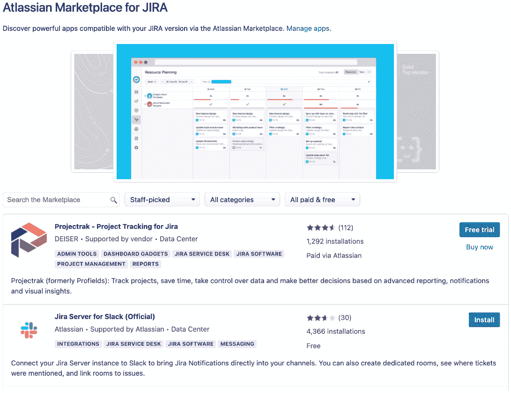

# 第十二章：Jira 和第三方应用

正如我们在前几章中看到的，Jira 是一个高度可定制的产品，允许你根据自己的需求自定义许多功能。当然，任何产品都不完美，尽管 Jira 拥有丰富的功能，但仍然存在一些无法满足所有人需求的空白。意识到这一点，Atlassian 允许其他人（包括合作伙伴、独立软件开发者和客户）通过 Jira 高度可扩展的应用基础设施扩展 Jira。

在本章中，你将学习以下主题：

+   应用及其定义

+   Atlassian 市场

+   安装应用并管理已安装的应用

+   使用应用来扩展 Jira 的功能和能力

# Atlassian 市场和第三方应用

在 Jira 的上下文中，应用是一个可以安装到 Jira 中的独立软件包，用于扩展其功能。一个应用通常由多个模块组成，如自定义字段、报告和工作流`后置`功能。你常常会听到人们提到应用、附加组件和插件。在 Jira 的上下文中，这三者指的都是同样的东西，因此在本书中我们将使用*应用*这一术语。但如果你看到*插件*或*附加组件*的术语，实际上我们指的也是同样的东西。

大多数应用都在 Atlassian 市场上注册并列出，网址为[`marketplace.atlassian.com`](https://marketplace.atlassian.com)。市场允许你作为最终用户浏览和搜索应用，阅读用户评论，并获取应用供应商的文档和联系方式。例如，在搜索可以与 Slack 集成的应用时，我们可以在市场上看到以下应用：


](img/Figure_12.1_B18644.jpg)

图 12.1 – Atlassian 市场

市场上的 Jira 应用可以是免费的，也可以是收费的。收费应用的费用基于你的 Jira 用户层级进行收费。每个在市场上列出的收费应用都有一个**定价**标签，说明其定价结构，如下所示：


](img/Figure_12.2_B18644.jpg)

图 12.2 – 应用定价

应用也有不同的可用性等级，具体取决于托管类型。有些应用支持 **云**、**数据中心** 和 **服务器** 三种选项，而其他应用可能仅支持其中一两种。检查你感兴趣的应用是否支持你的托管类型非常重要。这对于数据中心部署尤其重要；如果你安装了服务器版本的应用，可能会导致意外的行为和错误。

Marketplace 的一个有用功能是，如果应用支持 Data Center 或 Server，你可以直接从网站下载该应用。通常，你不需要这样做；正如我们在本章稍后看到的，Jira 默认已与 Marketplace 原生集成，因此你可以直接在 Jira 内查找并安装应用。但如果 Jira 因网络或安全原因无法连接到 Marketplace，你可以手动下载并安装应用。

现在我们已经简要了解了 Atlassian Marketplace，接下来让我们看看如何使用 Jira 查找、安装和管理应用。

# 通用插件管理器

**通用插件管理器**（**UPM**）是你用来查找、安装和管理 Jira 实例中的应用的主要工具。UPM 默认与 Atlassian Marketplace 集成，因此，如果你的 Jira 实例有外部互联网连接，你将能够直接从 UPM 搜索并安装应用。

UPM 有两个主要界面：

+   **查找应用** – 这个界面允许你直接从 Atlassian Marketplace 搜索并安装第三方应用到你的 Jira 中。

+   **管理应用** – 这个界面允许你管理已安装的 Jira 应用。你可以管理、禁用、更新和卸载应用。

我们将详细介绍每个界面，以及如何使用它们来安装、更新和管理 Jira 中的第三方应用。

## 从 Atlassian Marketplace 搜索和安装应用

如果你的 Jira 实例有外部互联网连接并启用了 Atlassian Marketplace 连接，你可以直接从 UPM 搜索并安装应用。这是将应用安装到 Jira 的最简单方法，因为 UPM 会确保下载最新的兼容版本。要通过 UPM 从 Atlassian Marketplace 安装应用，请按照以下步骤操作：

1.  浏览到 Jira 管理控制台。

1.  选择**管理应用**选项卡，然后选择**查找新应用**。

1.  在**搜索 Marketplace**文本框中搜索你要查找的应用。你还可以使用各种控件浏览和过滤搜索结果。

1.  如果应用是免费的，点击**安装**按钮以安装应用；如果应用是付费应用，则点击**免费试用**按钮，如下所示：



图 12.3 – 在 UPM 中查找应用

如果应用是免费的，点击**安装**按钮将让 Jira 下载并安装该应用。如果应用是付费应用，Jira 会安装该应用，并引导你完成生成试用许可证的过程。

安装完成后，应用就可以使用了。一些复杂的应用可能需要进一步配置才能使用；在这些情况下，你可以使用**管理应用**界面。

## 手动安装应用

如果由于某种原因，Jira 无法连接到 Atlassian 市场，或者你想安装的应用程序不在市场上，你可以从**管理应用程序**界面手动安装应用程序。要手动安装应用程序，请按照以下步骤操作：

1.  浏览到 Jira 管理控制台。

1.  选择**管理应用程序**标签页，然后选择**管理应用程序**选项。

1.  点击**上传应用程序**选项：


图 12.4 – 手动安装应用程序

1.  从对话框中选择你想要安装的应用程序，然后点击**上传**：


图 12.5 – 上传应用程序

提示

你可以通过直接选择应用程序文件或通过应用程序归档文件的 URL 来上传并安装应用程序。

当你以这种方式手动安装应用程序时，你需要确保所安装的应用程序版本与 Jira 版本兼容，并且是正确的托管类型。每个在 Atlassian 市场上的应用程序都有一个版本列表，显示应用程序的兼容性，因此请确保下载正确的应用程序版本。如果你安装了不兼容的应用程序，在大多数情况下，它会被自动禁用，你可以简单地卸载它，但有时这可能会导致更严重的问题，甚至可能导致你的 Jira 实例崩溃。

## 管理已安装的应用程序

所有已安装的应用程序都列在 UPM 的**管理应用程序**界面中。你可以通过选择**管理应用程序**选项来访问该界面。

**管理应用程序**界面默认会列出所有用户安装的应用程序，如下所示：


图 12.6 – UPM 管理应用程序

默认情况下，仅显示用户安装的应用程序。这是因为许多 Jira 的核心功能也是作为应用程序实现的，因此这样可以帮助保持列表简洁。你可以切换显示所有系统中的应用程序类型。

你可以点击列表中的应用程序以展开并查看其详细信息。这将向你展示关于已安装应用程序的很多有用信息，并允许你管理它：

+   **立即购买** – 如果应用程序是付费应用，并且你尚未购买许可证，你可以点击**立即购买**按钮进行购买。

+   **配置** – 如果应用程序在安装后需要额外的配置，通常会有一个**配置**按钮。点击该按钮将带你进入应用程序的主配置页面。

+   **卸载** – 这将从你的 Jira 实例中卸载该应用程序。请注意，对于某些应用程序，卸载可能也会删除与该应用程序相关的任何数据。如有疑问，你应该先禁用该应用程序。

+   **禁用/启用** – 这将禁用或启用该应用程序。一旦禁用，应用程序仍然安装在 Jira 中，但其功能将不可用。

+   **更新** – 如果市场上有该应用程序的更新版本，您可以点击 **更新** 按钮自动更新应用程序。然而，在更新应用程序之前，您应始终检查新版本是否与您的环境兼容。有时，新版本可能会对 Java、数据库以及其他系统组件提出新的要求。

+   **版本** – 您安装的应用程序的版本。这是一个非常重要的信息，供应商在解决问题时通常会要求提供该信息。

+   **文档** – 此链接将引导您访问应用程序在供应商网站上的文档。

+   **支持与问题** – 此链接将引导您访问供应商的支持门户，您可以在此请求支持。它还可以带您到供应商的网站，提供如何请求支持的详细信息。

+   **启用模块** – 展开时，这将列出应用程序包含的所有模块。通常，在安装后，所有模块都会默认启用。您可以选择性地禁用应用程序中的某些模块。您可能希望这样做，以限制用户访问某些功能，或者根据供应商支持人员提供的故障排除过程中的指示进行操作。请注意，这是面向高级用户的操作，如果禁用错误的模块，可能导致应用程序无法正常工作，甚至丢失数据。


图 12.7 – 管理应用程序

## 配置 UPM

除了安装和卸载应用程序外，UPM 还具有一些其他有用功能，可以帮助您管理和解决问题。在 UPM 底部，有四个选项：


图 12.8 – 配置 UPM

我们将在接下来的章节中详细查看每个选项，从审计日志开始。

### 审计日志

Jira 会跟踪应用程序的安装、卸载或更新情况。如果您需要定期审核系统中发生的变化，这是一个非常有用的工具。通常，应用程序安装后，过了一段时间，人们忘记了谁安装了该应用程序，或者该应用程序是否仍在使用。如果应用程序是一个昂贵的付费应用程序，这尤其是一个问题。通过查看审计日志，您可以找到最初安装该应用程序的人或最后更新它的人。如下面所示，我们可以看到 Tempo Timesheets 应用程序是在 2022 年 9 月 20 日安装的。


图 12.9 – 审计日志

注意

请注意，审计日志会定期清除；默认情况下为 90 天后清除。

### Jira 更新检查

当您开始在 Jira 中安装第三方应用程序时，升级 Jira 到新版本，尤其是大版本，将变得更加复杂，因为您需要确保您使用的应用程序与您正在升级到的 Jira 版本兼容。如果您安装了许多应用程序，这有时会是一个繁琐的任务。

**Jira 更新检查**工具来自 UPM，帮助您更轻松地完成此任务，它会自动检查您拥有的所有应用程序并生成兼容性报告，如下所示：


图 12.10 – Jira 更新检查

只需选择您目标的 Jira 版本，然后点击 **检查**按钮。如前面的报告所示，我们有三个应用程序被列为兼容，一个不兼容，但有一个可用的更新版本是兼容的。请注意，此工具仅适用于 Atlassian 市场上的应用程序；不在市场上的应用程序无法使用此工具进行检查。

### 设置

**设置**选项让您控制 UPM 的工作方式。例如，如果您希望 UPM 能够连接到 Atlassian 市场直接下载和安装应用程序。对于某些组织，由于安全原因，您可能不希望允许这样做，因此您可以禁用此选项。

另一个常见的选项是允许最终用户请求安装他们需要的应用程序。Jira 然后会向 Jira 管理员发送请求的电子邮件，这有助于减少用户和管理员之间的摩擦。下图显示了您可以更改的 UPM 设置：


图 12.11 – UPM 设置

### 进入安全模式

最后的选项是将 Jira 置于安全模式。当 Jira 进入安全模式时，所有用户安装的应用程序将被禁用。这是一个在故障排除时非常有用的工具。当 Jira 出现问题时，通常很难准确找出根本原因，尤其是当您安装了许多应用程序时。在这种情况下，排除法是最佳选择；通过将 Jira 置于安全模式，并逐个重新启用应用程序，您可以缩小问题的原因范围，如果是某个应用程序引起的。

请注意，当您将 Jira 置于安全模式时，所有第三方应用程序都会被禁用，这有时会对最终用户造成不利影响。因此，在启用安全模式之前，请确保与他们进行沟通。

# 使用应用程序扩展 Jira

现在我们已经看到如何查找和安装第三方应用程序，接下来我们将查看一些常见的用例，您可以使用应用程序来扩展 Jira 的核心功能。在本节中，我们将使用一些 Atlassian 市场上流行的应用程序来说明如何通过应用程序扩展 Jira。

## 使用应用程序扩展自定义字段

在 *第五章* 中，*字段管理*，我们介绍了自定义字段并查看了 Jira 提供的开箱即用的字段类型。通过第三方应用程序，我们可以进一步扩展选项列表。到目前为止，我们看到的大多数字段主要用于捕获和显示数据，但自定义字段能做的远不止这些。在本节中，我们将介绍 Jira 的电子签名应用。

正如其名称所示，Jira 电子签名应用允许用户在对问题进行更改时捕获电子签名，通常是在工作流过渡过程中。这在审批流程中尤其有用，例如 CFR 21 第十一部分的合规要求，其中需要签名并且需要记录以供审计使用。

该应用通过添加一个名为**电子签名**的新自定义字段来提供此功能。安装该应用后，你可以将该字段添加到 Jira 中。


图 12.12 – 添加电子签名自定义字段

在将字段添加到 Jira 后，确保将其放置在需要验证和捕获电子签名的屏幕上。例如，用于批准工作流过渡的屏幕。在屏幕上添加该字段后，当你转换问题时，屏幕会要求你输入 Jira 凭据。如果输入了正确的凭据，工作流过渡可以完成，签名将被记录在问题中。


图 12.13 – 验证电子签名

如我们所见，虽然任何字段的主要目的是捕获和存储数据，但应用程序可以包含具有非常不同功能的有用自定义字段。

## 使用应用扩展工作流

在*第七章*中，*工作流与业务流程*，我们讨论了如何使用 Jira 工作流及其组件来管理项目。Jira 提供了许多有用的组件，如条件、验证器和 `post` 函数，但要充分发挥 Jira 工作流的强大功能，你需要使用一些第三方应用。在本节中，我们将介绍一些流行的应用及其提供的有用工作流组件。

我们要看的应用是**JSU 自动化套件 for Jira 工作流**（**JSU**）。该应用提供了多个有用的工作流组件。一个非常常见的 Jira 使用场景是仅在特定的工作流过渡期间使某个字段成为必填项。例如，当用户创建问题时，可能不知道问题的到期日期，因此会留空该字段。当问题被某人接手并过渡到**进行中**时，将需要提供一个到期日期，因此我们需要确保用户在问题过渡前填写了到期日期。JSU 提供了一个**字段必填（JSU）**验证器，可以在工作流过渡完成前检查所选字段是否已提供值。如下所示，我们添加了**字段必填（JSU）**验证器，并选择了**描述**和**到期日期**字段作为必填项：


图 12.14 – 添加验证器

现在，如果一个问题在没有为 **Description** 或 **Due Date** 提供值的情况下转换为 **In Progress** 状态，将显示错误消息：


图 12.15 – 字段必填验证器

很显然，为了使其工作，您需要确保在工作流转换中应用屏幕，并将所有必填字段放置在屏幕上。

另一个 JSU 提供的有用功能是作为工作流转换的一部分自动设置 Jira 中任何字段的值。Jira 开箱即用提供了一个 `post` 函数，允许您为某些系统字段设置值，这不仅允许您为任何字段设置值，还包括评论，甚至更新其他问题的字段。

举个例子，我们已经添加了 `post` 函数来更新 `%%CURRENT_USER%%`。因此，如果一个问题被转换为 **In Progress** 状态，所有其子任务的负责人将自动分配给执行转换操作的用户。


图 12.16 – 添加后置函数

第三方应用程序如 JSU 提供了许多有用的工作流条件、验证器和后置函数，您可以用来丰富工作流的功能。

# 使用脚本定制 Jira

到目前为止，我们所看到的应用程序都是预打包的、专为特定功能设计的解决方案。这些解决方案非常好，因为它们为人们可能遇到的常见问题或所有人都需要的功能提供了解决方案。

然而，有时候您可能有一些要求，这些要求并不被 Atlassian Marketplace 上可用的任何应用程序覆盖。现在您可以为此创建一个自定义应用程序，但通常您只需要一个以特定方式捕获或显示数据的自定义字段，或者具有一些专业业务逻辑的工作流验证器。在这些情况下，您可以使用一个名为 **ScriptRunner** 的应用程序。

ScriptRunner 是一个将脚本能力引入 Jira 的应用程序。如果您了解如何编写 Groovy 脚本，ScriptRunner 将允许您创建自定义字段、工作流组件（如验证器）和由您自己的 Groovy 脚本定义的后置函数。这样，您可以使用自己的业务逻辑实现这些组件，而无需创建一个完整的应用程序。

在这一部分，我们将介绍 ScriptRunner 应用程序以及如何使用它来创建自定义字段。安装完 ScriptRunner 应用程序后，当您进入 Jira 管理控制台时，将会看到一个新的 **ScriptRunner** 标签。正如我们所见，ScriptRunner 提供了许多不同的选项供您创建脚本，包括一些内置脚本。由于本节我们专注于创建自定义字段，因此我们将关注 **Fields**。


图 12.17 – ScriptRunner

要创建一个自定义脚本字段，选择**字段**选项，然后选择**自定义脚本字段**选项，如下所示：


图 12.18 – 自定义脚本字段

现在我们已经选择创建一个脚本字段，我们需要提供一些字段的基本信息以及脚本本身。在我们的示例中，我们将创建一个简单的字段，显示问题的评论数：

1.  为我们的字段输入一个名称，例如`评论数`。

1.  为我们的字段选择一个模板。这将决定我们字段的外观。以我们的示例为例，我们将选择**数字字段**模板。

1.  输入以下脚本，当字段被显示时将运行它。使用 ScriptRunner，你可以将脚本作为内联代码或文件加载。内联代码使用起来比较方便，但将代码保存为文件会更容易维护，因为你可以将代码文件保存在代码库中，以便更好地跟踪更改。在我们的示例中，我们将使用内联选项：

    ```
    import com.atlassian.jira.component.ComponentAccessor
    def commentManager = ComponentAccessor.getCommentManager()
    def numberOfComments = commentManager.getComments(issue).size()
    return numberOfComments ? numberOfComments as Double : null
    ```

1.  在**预览问题键**文本框中输入一个问题键，并点击**预览**按钮。这将测试我们的脚本与该问题的兼容性。

1.  点击**添加**按钮来创建我们的自定义字段。


图 12.19 – 添加自定义脚本字段

一旦我们的自定义脚本字段创建完成，我们需要确保该字段应用于正确的上下文并添加到必要的字段中。完成这些操作后，你应该能看到字段显示问题的评论数：


图 12.20 – 自定义脚本字段结果

由于脚本在每次渲染字段时都会运行，它的值将自动更新。如果你希望字段中的值可被搜索，确保为其分配一个搜索模板。由于我们的字段显示的是数字，我们可以使用数字搜索器或数字范围搜索器。

# 更好的时间跟踪和报告

在*第四章*，*处理问题*中，我们简要介绍了用户如何跟踪他们在处理问题时所花费的时间。这是一个非常有用的功能，许多组织使用它来跟踪项目的进展。然而，Jira 内置的时间跟踪功能相当基础，且获取日志时长的报告并不容易。再次强调，应用程序来救援！对于时间跟踪和报告，根据你的需求，有多个可供选择的选项。

如果你仅仅想要一个更好的工具来查看用户记录的工时并创建时间跟踪报告，那么**Worklogs - 时间跟踪和报告**应用程序非常适合你。安装后，顶部会出现一个新的**Worklogs**选项。点击该选项将带你进入由该应用程序提供的**Worklogs**报告视图：


图 12.21 – 时间跟踪报告

在此，你可以选择项目、用户/组、日期范围以及许多其他选项，以生成关于用户输入的时间跟踪数据的报告。如前所示，在九月份，两位用户分别在两个不同的项目上记录了时间。你可以将表格报告视图更改为饼图和柱状图，并将报告导出为 Excel 电子表格。这是一个非常有用的工具，补充了开箱即用的时间跟踪功能。

如果你需要更强大和稳定的功能，你可能想了解 **Tempo Timesheets - Jira 时间跟踪** (**Tempo**) 应用。Tempo 应用将 Jira 中的基本时间跟踪功能提升到了一个全新的水平。

安装了 **Tempo** 后，顶部会出现一个新的 **Tempo** 选项。点击该选项将列出 Tempo 的不同功能。Tempo 提供了你在时间跟踪和生成数据报告时所需的所有功能。例如，每个用户可以在 **日历** 和 **时间表** 视图中查看自己记录的时间，如下所示。这是一个非常棒的工具，可以帮助用户跟踪自己的时间记录，并在每个月底生成报告以供计费使用：


图 12.22 – Tempo

Tempo 还允许你创建基于时间跟踪数据的保存报告，后续可以重新使用，类似于保存的过滤器。例如，你可以为每个项目创建一个报告，并将其作为定期项目进展更新的一部分发送给客户。

除了常规的时间跟踪和报告，Tempo 还具有高级功能，例如允许用户提交时间表进行审批，将用户组织成团队以便更好地进行资源管理和规划，通过设置账户跨多个团队和项目进行跟踪等。

# 选择应用及其供应商

现在我们已经了解了第三方应用是什么以及它们如何对你有所帮助，你可能想去 Atlassian Marketplace，找到尽可能多的有用应用并将它们安装到自己的 Jira 实例中。事实上，这样做是非常危险的，往往会让人陷入困境，比如在 Jira 升级时。

尽管第三方应用非常有用，但在选择和安装时必须小心。选择安装应用时，有几个重要因素需要考虑，并且你必须做足功课：

+   这个应用程序是否得到了良好的维护和支持？一个应用程序是否真的好用并不重要，如果它没有得到维护和支持，当你遇到问题或需要升级 Jira 时，你将无法获得任何帮助。查看其他用户的评论，看看该应用程序是否在支持多个版本的 Jira 上有良好的记录，并查看供应商是否提供支持渠道。你可以在 Atlassian Marketplace 上的应用页面找到所有这些信息。

+   该应用程序是否具有云迁移路径？如果你考虑将来迁移到 Atlassian Cloud，了解该应用程序是否同时提供等效的云版本以及迁移路径非常重要。这将使你决定迁移到云时更加轻松。

+   该应用程序是否与其他已安装的应用程序发生冲突？有时，来自不同供应商的应用程序会发生冲突，而你可能直到安装并运行后才会发现这个问题。在某些情况下，应用程序供应商可能已经意识到这些冲突，并在其文档中提到，但这并非总是如此。因此，重要的是在生产环境中安装前，在临时环境中测试新应用程序。

如我们所见，选择适合自己 Jira 的应用程序时必须小心，特别是当该应用程序将为你的组织提供重要功能时。通常，一个应用程序会变得如此重要，以至于你的用户无法离开它。因此，选择正确的应用程序供应商和应用程序本身同样重要。一个好的供应商会在你遇到问题和 BUG 时为你提供支持，需要升级到 Jira 的新版本时提供帮助，以及如果你选择迁移到云端时给予支持。

维护你已安装的应用程序清单以及它们的使用情况通常是个好主意。保持清单更新，并定期进行检查，因为你不想保留不再需要的应用程序，尤其是当应用程序是付费的情况下。如果你有多个 Jira 管理员，确保在添加或移除应用程序时通知每个人，这样如果出现问题，就不会有人感到措手不及。

# 总结

在本章中，我们了解了第三方应用程序，它们是什么以及它们能做些什么。我们查看了 Atlassian Marketplace，你可以从中搜索可能对你有用的应用程序。我们还学习了如何使用通用插件管理器来安装和管理应用程序，以及它的一些附加功能，帮助排查 Jira 中的问题，特别是当问题与应用程序相关时。我们还了解了一些流行的应用程序，以及如何使用它们来扩展 Jira 的功能，例如添加新的自定义字段类型和工作流后置函数，这样你就可以在 Jira 中做更多的事情。最后，我们还讨论了选择安装哪个应用程序时需要考虑的一些重要因素。Jira 是一个非常棒的工具，第三方应用程序帮助使这个工具更加完美，但你必须确保选择适合自己的应用程序，以确保你的长期成功。
