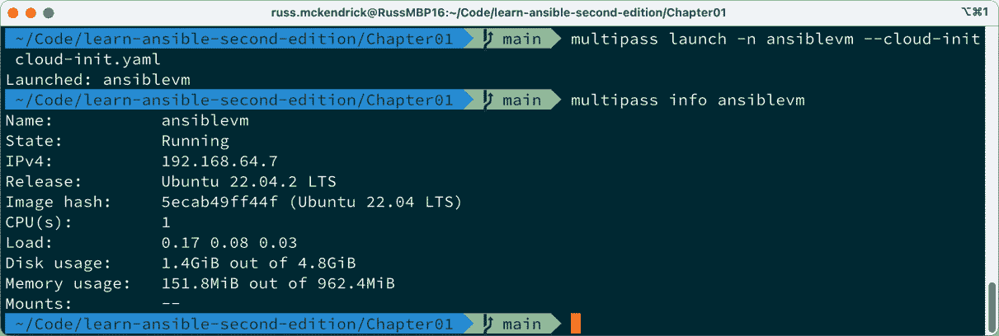
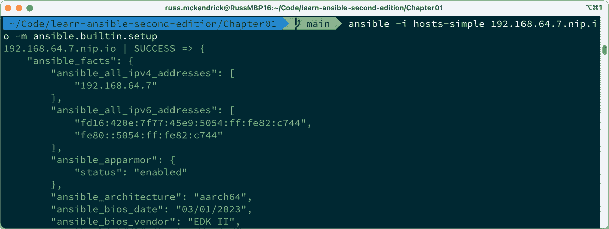
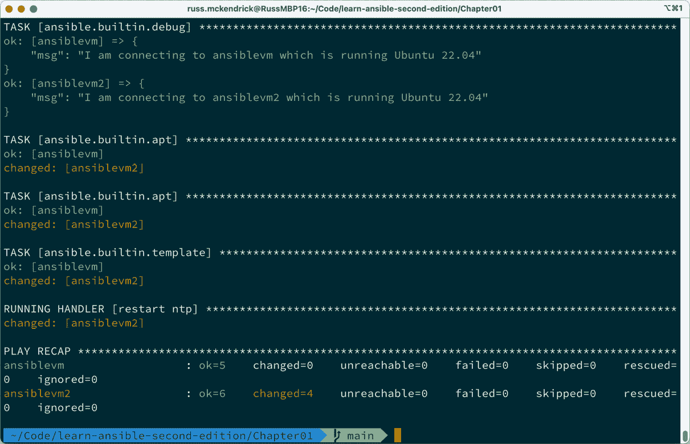

# 1

# 安装和运行 Ansible

欢迎来到我们的第一章，《*Learn Ansible*》第二版的第一章。在本章中，我们将介绍一些主题，帮助你了解**Ansible**，这些内容将让你熟悉 Ansible 的基本概念，并展示一些不同的使用场景。

到本章结束时，你将亲自操作 Ansible，并涵盖以下内容：

+   谁是 Ansible 背后的团队？

+   Ansible 与其他工具的区别

+   Ansible 解决的问题

+   如何在 macOS 和 Linux 上安装 Ansible

+   在 Windows 11 上使用 Windows 子系统运行 Ansible

+   启动测试虚拟机

+   Playbook 介绍

在我们开始讨论 Ansible 之前，让我们简要介绍一下我的背景，讲讲我如何开始写 Ansible 相关书籍，以及你需要在系统上安装和运行 Ansible 的前提条件。

# 技术要求

本章后续内容中，我们将安装 Ansible，因此你需要一台能够运行它的机器。关于这些要求，我将在本章下半部分详细说明。我们还将使用**Multipass**在本地启动虚拟机。接下来的一节将指导你安装 Multipass，并下载一个 Ubuntu 镜像作为虚拟机的基础，这个镜像的下载量大约是几百 MB。你可以在 [`github.com/PacktPublishing/Learn-Ansible-Second-Edition/tree/main/Chapter01`](https://github.com/PacktPublishing/Learn-Ansible-Second-Edition/tree/main/Chapter01) 找到本章中使用的所有代码。

# 我的故事：第一部分

自上世纪 90 年代末以来，我一直在与服务器打交道，主要是为网页提供服务的服务器，那个时代的技术和现在完全不同。这里简要回顾了我运营服务器的最初几年，以便你了解我当时是如何操作我的早期服务器的。

和大多数人一样，我从一个共享主机账户开始，当时网站因论坛而逐渐超出了共享主机的承载能力，这也是该站点受欢迎的部分原因。我搬到了专用服务器，以为可以展示未来的系统管理员能力，但我错了。

我获得的服务器是一台 Cobalt RaQ 3；这是一款 1U 服务器设备，超越了当时的技术水平。然而，我没有对机器的 root 级别访问权限，所有需要做的操作都必须通过基于 Web 的控制面板来完成。最终，我获得了访问权限，可以通过 Telnet 访问服务器；现在我知道这并不好，但那是早期阶段，SSH 被认为是前沿技术。我开始通过在 Web 控制面板中进行更改并查看服务器上配置文件的变化，自学如何成为一名系统管理员。

一段时间后，我更换了服务器，这次我决定放弃任何基于网页的控制面板，转而使用我在 Cobalt RaQ 上学到的知识，通过我整理的笔记来配置我的第一台真正的**Linux**、**Apache**、**MySQL**、**PHP**（简称**LAMP**）服务器。我创建了运行手册，包含了安装和配置所需软件的单行命令，还有大量草稿帮助我排查问题并保持服务器运行。

当我为另一个项目得到了第二台服务器时，我意识到那时候正是整理笔记的好时机，这样我就可以在需要部署服务器时直接复制粘贴这些内容；这时机恰到好处，因为就在整理这些笔记几个月后，我的第一台服务器出现故障——我的主机提供商道歉并更换了一台更新操作系统的高配置全新机器。

所以，我拿起了包含笔记的 Microsoft Word 文件，复制并粘贴每条指令，根据需要安装在升级操作系统上的内容进行了调整。几个小时后，我的服务器启动并运行，数据也成功恢复。

我学到的一个重要教训是，除了“没有什么比备份过多更为重要”这一点之外，就是不要用 Microsoft Word 来存储这类笔记；Linux 命令行并不在乎你的笔记是否有漂亮的格式、标题和用于打印的 Courier 字体。它在乎的是正确的语法，而 Word 很“贴心”地为我所有的笔记做了自动更正和格式化，意味着我不仅要在部署新服务器和恢复每天备份的同时，还得调试我已经做好的笔记。

因此，我将服务器上的历史文件复制了一份，并将我的笔记转录为纯文本。这些笔记为接下来的几年提供了基础，我开始将其中的一些部分脚本化，主要是那些不需要用户输入的部分。

这些命令片段、单行指令和脚本最初是通过 Red Hat Linux 6 进行调整的；注意操作系统名称后面没有附加“Enterprise”这个词，一直到 CentOS 3 和 4 版本。

当我换了职位之后，事情变得复杂了；我不再从一个网络托管公司消费服务，而是开始为其中一家工作。突然之间，我开始为客户构建服务器，而这些客户的需求可能与我自己的项目不同——每台服务器都是不同的。

从这里开始，我开始使用 Kickstart 脚本、PXE 启动服务器、影像服务器上的金盘映像、虚拟机，以及开始要求提供有关系统构建信息的 bash 脚本。我也从只需要担心维护自己的服务器，变成了必须登录到成百上千台不同的物理和虚拟服务器，从属于我工作的公司，到客户的机器。

在接下来的几年里，我的单一文本文件迅速变成了一个复杂的笔记、脚本、预编译二进制文件和信息电子表格的集合，这些内容只有我能理解；如果说实话，我最终自己成了一个显著的单点故障。

尽管我已开始通过 bash 脚本和将命令串联在一起来自动化我日常工作的许多部分，但我发现我的日子仍然充满了手动执行所有这些任务，并且需要在服务台处理客户报告的问题和查询。

我的故事是许多人典型的经历，虽然使用的操作系统可能被认为是古老的。使用图形界面（GUI）并转向命令行，同时保留常用命令的便签，这是我在与其他系统管理员甚至现代 DevOps 从业者合作时，常常听到的一个典型场景。

现在你已经了解了我的背景，接下来我们来谈谈 Ansible。

# Ansible 的故事

让我们快速了解一下是谁开发了 Ansible，以及它究竟是什么。

## Ansible 是什么？

在讨论 Ansible 的起源之前，我们应该简要讨论一下它名字的由来。“Ansible”这一术语是科幻小说作家乌苏拉·K·勒古恩所创造；它首次出现在她 1966 年出版的小说*《洛卡农的世界》*中。在故事中，Ansible 是一种虚构的设备，能够比光速更快地发送和接收消息。

注意

1974 年，乌苏拉·K·勒古恩的小说*《被剥夺的: 一个模糊的乌托邦》*出版。这本书通过探索使得这种设备成为可能的（虚构的）数学理论，展示了 Ansible 技术的发展。

这个术语此后被许多其他著名作家在同一类型的作品中使用，描述能够跨星际距离传递信息的通信设备，正如你将在本书的过程中发现的那样，这也是对 Ansible 软件本身的恰当描述。

## Ansible，软件

Ansible 最初由 Michael DeHaan 开发，他也是**Cobbler**的作者，Cobbler 是在 DeHaan 为 Red Hat 工作期间开发的。

注意

Cobbler 是一个 Linux 安装服务器，可以帮助你在网络中快速部署服务器；它可以处理 DNS、DHCP、包更新和分发、虚拟机部署、物理主机的电源管理，以及将新部署的服务器，无论是物理的还是虚拟的，交给配置管理系统。

DeHaan 离开了 Red Hat，转而为像**Puppet**这样的公司工作，这非常合适，因为许多 Cobbler 的用户会在服务器配置完毕后，使用 Puppet 服务器来管理这些服务器，我也是其中之一。

离开 Puppet 几年后，DeHaan 于 2012 年 2 月 23 日首次向 Ansible 项目提交了公共代码。最初的`README`文件给出了一个相当简单的描述，为 Ansible 最终会成为什么打下了基础：

Ansible 是一个极简的 Python API，用于通过 SSH 执行“远程操作”。就像我共同编写的 Func 想要避免使用 SSH 并拥有自己的守护进程基础设施一样，Ansible 则志在与之完全不同，更加简洁，但仍能够随着时间推移更加模块化地发展。

自从首次提交以来，截止本文写作时，已有超过 53,000 次提交，来自 5,000 位贡献者，且该项目在 GitHub 上的星标超过 58,000。

到 2013 年，项目已经发展壮大。Ansible, Inc. 成立，旨在为依赖该项目管理基础设施和服务器配置（无论是物理的、虚拟的，还是托管在公共云上的用户）提供商业支持。

在 Ansible, Inc. 成立后，该公司获得了 600 万美元的 A 轮融资，推出了商业版 Ansible Tower，作为一个基于 Web 的前端，最终用户可以通过它访问基于角色的 Ansible 服务。

然后，在 2015 年 10 月，Red Hat 宣布以 1.5 亿美元收购 Ansible。

在公告中，当时 Red Hat 的管理副总裁 Joe Fitzgerald 说道，*“Ansible 是 IT 自动化和 DevOps 的明显领导者，帮助 Red Hat 在实现创建* *无摩擦 IT 目标上迈出了重要一步。”*

在本书中，你会发现原始 `README` 文件中的声明以及 Red Hat 在收购 Ansible 时的声明依然有效。

在我们开始动手安装 Ansible（稍后我们会在本章进行安装）之前，我们应该先了解它的一些核心概念。

# Ansible 与其他工具

如果你对比第一次提交时的设计原则和当前版本的设计，你会发现，尽管有一些增加和调整，核心原则基本上保持不变：

+   **无代理**：所有操作都应该通过 SSH 守护进程来管理，Windows 机器则使用 WinRM 协议或 API 调用——不应该依赖于自定义代理或需要在目标主机上打开或交互的其他端口。运行 Ansible 的机器应该能够从网络上直接访问目标资源。

+   **最小化**：你应该能够在不安装任何新软件的情况下管理新的远程机器；每个 Linux 目标主机通常至少会安装 SSH 和 Python，这些是运行 Ansible 所需的最小安装环境。

+   **描述性**：你应该能够用机器和人类都能读懂的语言描述你的基础设施、栈或任务。

+   **简单**：设置过程和学习曲线应该简单直观。

+   **易于使用**：它应该是最易接入的 IT 自动化系统。

其中一些原则使得 Ansible 与其他工具有很大的不同。让我们来看看 Ansible 和其他工具（如 Puppet 和 **Chef**）之间的根本区别。

## 声明式与命令式

当我开始使用 Ansible 时，我已经实现了 Puppet 来帮助管理我所管理的机器上的堆栈。随着配置变得越来越复杂，Puppet 代码变得非常复杂。这时，我开始寻找替代方案，一些方案解决了我面临的一些问题。

Puppet 使用一种自定义声明式语言来描述配置。然后，Puppet 将此配置打包为一个清单，代理程序会在每台服务器上应用此清单。

使用声明式语言意味着 Puppet、Chef 和其他配置工具，如**CFEngine**，都采用最终一致性的原则，这意味着最终，在代理程序运行几次之后，你期望的配置会到位。

另一方面，Ansible 是一种命令式语言，它不仅定义了你期望的最终状态并让工具决定如何到达该状态，还定义了执行任务的顺序，以达到你定义的状态。

我使用的示例如下。我们有一个配置，其中需要将以下状态应用到服务器：

1.  创建一个名为`Team`的组。

1.  创建用户`Alice`并将其添加到`Team`组。

1.  创建一个用户`Bob`，并将其添加到`Team`组。

1.  给用户`Alice`提升权限。

这看起来可能很简单；然而，当你使用声明式语言执行这些任务时，你可能会发现发生了以下情况：


图 1.1 – 声明式运行时发生情况的概览

那么，发生了什么呢？我们的工具在`Alice`无法创建时执行了任务，因为第一个任务运行时`Team`组不存在。

然而，由于`Team`组在创建用户`Bob`之前已经存在，`Bob`的用户成功创建，没有任何错误，最后一个任务，即为用户`Alice`添加提升权限失败，因为系统上不存在名为`Alice`的用户，无法将提升的权限应用到该用户。

在`Team`存在的情况下，用户`Alice`被创建，并且由于`Alice`存在，该用户获得了提升的权限。

在**运行 3**期间没有需要更改的内容，因为一切如预期；也就是说，状态是一致的。

每次随后的运行都会继续，直到配置或主机本身发生变化。例如，如果`Bob`惹恼了`Alice`，并且她使用了提升的权限将用户`Bob`从主机上删除。那么，当代理程序随后运行时，`Bob`将会被重新创建，因为这是我们期望的配置，不管`Alice`认为`Bob`应该拥有怎样的权限。

如果我们使用命令式语言运行相同的任务，那么应该发生以下情况：


图 1.2 – 命令式运行时发生情况的概览

任务会按照我们定义的顺序执行，这意味着首先会创建`Team`组，然后添加`Alice`和`Bob`用户，最后将提升的权限应用于`Alice`用户。

如你所见，两种方法都能达到最终配置，并强制执行我们期望的状态。使用声明性语言的工具可以声明依赖关系，这意味着我们可以解决在运行任务时遇到的问题。

然而，这个例子只有四个步骤；如果你有几百个步骤，其中涉及在公共云平台上启动服务器，然后安装需要多个前提条件的软件会发生什么呢？

这是我在开始使用 Ansible 之前所面临的情况。Puppet 在强制执行我期望的最终配置方面非常出色；然而，要实现这一点，我不得不在我的清单中加入大量的逻辑，以达到预期的状态。在 Puppet 中，这些逻辑是通过一个函数实现的，允许我作为最终用户定义我的依赖关系。

在我们使用的例子中，我必须定义用户只能在创建组的代码块运行并且资源存在后才可以创建。

我的代码变得越复杂，我与声明性工具希望运行的方式斗争得越多，每次执行所需的时间也就越长，因为该工具必须考虑我的逻辑，而我的逻辑有时并不完全正确。

这变得越来越让人烦恼，因为每次成功运行的时间接近 40 分钟。如果我遇到依赖问题，我不得不从头开始，每次失败和更改时都要确保自己解决了问题，而不是因为事情开始变得一致，这通常意味着必须重新部署资源，而不是运行后续的代码。这使得开发变得非常耗时，尤其是在调试代码时，有时还需要进行反复试验。

当你在计时并且必须满足客户的最后期限时，陷入这种境地并不理想。

## 配置与编排

Ansible 与其他常被拿来比较的工具之间的另一个关键区别是，大多数这些工具起初是为了部署和管理配置状态而设计的系统。

它们通常需要在每个主机上安装一个代理；该代理会发现它所安装的主机上的一些信息，然后回调到中央服务器说：“*你好，我是服务器 XYZ。请给我我的配置好吗？*”然后，服务器决定服务器的配置是什么，并将其发送给代理，代理再应用它。通常，这种交换每 15 到 30 分钟进行一次——如果你需要在服务器上强制执行某个配置，这非常有用。

然而，Ansible 的设计方式使其能够作为一个编排工具运行；例如，你可以使用它在 VMware 环境中启动一个服务器，服务器启动后，它可以连接到新启动的机器并安装 LAMP 堆栈。然后，它不再需要连接该主机，这意味着我们剩下的只是服务器、LAMP 堆栈，除此之外，可能只有几个文件中的注释，说明 Ansible 添加了一些配置行，这应该是唯一的迹象，表明 Ansible 被用来配置该主机。

## 查看一些代码

在我们完成本章这一部分并进入安装 Ansible 之前，让我们快速看一下实际代码的例子。以下 bash 脚本使用 yum 包管理器安装多个 RPM：

```
#!/bin/sh
LIST_OF_APPS="dstat lsof mailx rsync tree vim-enhanced git whois"
yum install -y $LIST_OF_APPS
```

以下是一个 Puppet 类，它完成与之前的 bash 脚本相同的任务：

```
class common::apps {
  package {
    [
      'dstat',
      'lsof',
      'mailx',
      'rsync',
      'tree',
      'vim-enhanced',
      'git',
      'whois',
    ]:
    ensure => installed,
  }
}
```

接下来，我们使用 **SaltStack** 完成相同的任务：

```
common.packages:
  pkg.installed:
    - pkgs:
      - dstat
      - lsof
      - mailx
      - rsync
      - tree
      - vim-enhanced
      - git
      - whois
```

最后，我们再次完成相同的任务，这次使用的是 Ansible：

```
- name: "Install packages we need"
  ansible.builtin.yum:
    name:
      - "dstat"
      - "lsof"
      - "mailx"
      - "rsync"
      - "tree"
      - "vim-enhanced"
      - "git"
      - "whois"
      - "iptables-services"
    state: "present"
```

即使不深入细节，你也应该能够大致理解这三个例子各自的作用。虽然不完全是基础设施管理，但这三者都是基础设施即代码的有效示例。

这是你以与开发人员管理其应用程序源代码完全相同的方式来管理管理你基础设施的代码。你使用源代码管理，存储在一个中央可用的仓库中，在那里你可以与同事合作，分支并使用拉取请求来检查你的更改，并且在可能的情况下，编写并执行单元测试，以确保对基础设施的更改在部署到生产之前是成功且没有错误的。这应该尽可能自动化。任何在上述任务中的人工干预都可能是故障点，你应该努力将任务自动化。

这种基础设施管理方法有一些优势，其中之一是，作为系统管理员，你正在使用与开发同事相同的流程和工具，这意味着适用于他们的任何流程也适用于你。这使得工作体验更加一致，并且让你接触到你可能还没有接触过或使用过的工具。

其次，更重要的是，它使你能够共享你的工作。在这种方法之前，这类工作对于其他人来说似乎是一门只有系统管理员才能掌握的黑暗艺术。将这项工作公开，允许你的同事审查并评论你的配置，同时你也可以对他们的配置进行相同的操作。此外，你还可以分享你的工作，供他人将其元素整合到他们的项目中。

# 我的故事：第二部分

在我们完成本章这一部分之前，我想讲完我的旅程故事。正如本章前面提到的，我从一堆脚本和运行手册转向了 Puppet，这非常好，直到我的需求开始超出仅仅管理服务器配置和维护服务器状态的范围。

我需要开始管理公共云中的基础设施。当时，使用 Puppet 时，这个需求让我感到越来越沮丧。因为 Puppet 对我需要使用的基础设施 API 的支持不够完善。我确信现在好多了，但同时我发现自己不得不在清单文件中编写过多的逻辑，来控制每个任务执行的顺序。

大约是在 2014 年 12 月，我决定开始了解 Ansible。我记得这个时间点，因为我写了一篇名为 *与 Ansible 的第一步* 的博客文章；自那以后，我想我再也没有回头看过。我后来将 Ansible 介绍给了几位同事和客户，并写了相关书籍，包括你现在正在阅读的本书的第一版。

到目前为止，在本章中，我们已经回顾了我个人与 Ansible 以及一些与 Ansible 相比的其他工具的历史，讨论了这些工具之间的区别，以及 Ansible 的起源。

现在我们将通过查看如何安装 Ansible 并运行我们的第一个 Ansible playbook 来开始你的 Ansible 之旅，目标是运行在本地虚拟机上。

# 安装和运行 Ansible

让我们直接开始安装 Ansible。在本书中，我假设你正在使用 macOS 主机或运行 Ubuntu LTS 版本的 Linux 主机。虽然我们会讲解如何在 Windows 11 上使用 Windows 子系统运行 Ansible，但本书不支持将 Windows 作为主机来使用。

## 在 macOS 上安装

你可以通过几种不同的方式在 macOS 主机上安装 Ansible。我将在这里讲解两种方法。由于我们讨论的是两种不同的安装方式，我建议在选择适合你本地机器的安装方法之前，先阅读本节以及*优缺点*小节。

### 使用 Homebrew 安装

第一种安装方法是使用一个叫做 **Homebrew** 的包管理器。

注意

Homebrew 是 macOS 的一个包管理器，可以用来安装命令行工具和桌面应用程序。它自称是 *“macOS 缺失的包管理器”*，通常是在我做干净安装或新电脑时安装的第一个工具。

要通过 Homebrew 安装 Ansible，你首先需要安装 Homebrew。为此，运行以下命令：

```
$ /usr/bin/ruby -e "$(curl -fsSL https://raw.githubusercontent.com/Homebrew/install/master/install)"
```

在安装过程的每一步，安装程序都会告诉你它将做什么，并提示你提供完成安装所需的任何额外信息。

安装完成后，或者如果你已经安装了 Homebrew，运行以下命令来更新你的软件包列表；如果有更新，你也可以进行升级：

```
$ brew update
$ brew upgrade
```

最后，根据你安装的版本新旧，或者你上次使用它的时间，你可能需要运行以下命令来检查你的 Homebrew 安装是否最优化：

```
$ brew doctor
```

现在我们已经安装并更新了 Homebrew，并准备好使用`brew`，我们可以运行以下命令来检查 Homebrew 中有哪些 Ansible 包：

```
$ brew search ansible
```

如你从以下截图中的结果看到的，搜索结果中返回了几个包：


图 1.3 – 使用 brew 命令搜索 Ansible

我们需要的是 Ansible 包；你可以通过运行以下命令来获取有关该包的更多信息：

```
$ brew info ansible
```

你可以在以下截图中看到命令的结果：


图 1.4 – 查看我们将要安装的 Ansible 包的信息

如你所见，命令返回了将要安装的包的版本信息，并列出了所有依赖项的完整列表；在之前的屏幕中，所有依赖项旁边都有绿色勾选，因为我已经安装了它们——你的显示可能会有所不同。

它还给出了 Homebrew 公式的 URL，用于安装该包。在我们的案例中，你可以在[`github.com/Homebrew/homebrew-core/blob/master/Formula/ansible.rb`](https://github.com/Homebrew/homebrew-core/blob/master/Formula/ansible.rb)查看公式详情。

要使用 Homebrew 安装 Ansible，我们必须运行以下命令：

```
$ brew install ansible
```

这将下载并安装所有依赖项，然后是 Ansible 包本身。

根据你的机器上安装的依赖项数量，这可能需要几分钟时间。

安装完成后，你应该能看到类似以下截图的内容：


图 1.5 – 使用 Homebrew 安装 Ansible

如你从前面的截图中看到的，Homebrew 的输出非常详细，既提供了它正在执行的操作反馈，又给出了如何使用其安装的包的详细信息。

我们将要查看的第二种安装方法是一种更传统的方法。

### 使用 pip 安装

第二种方法，pip，是一种更传统的安装和配置 Python 包的方法。

注意

`pip`是 Python 软件的包管理器。它是**pip install packages**的递归缩写。它是从**Python Package** **Index**（**PyPI**）安装包的一个很好的前端工具。

大多数现代 macOS 安装默认会安装 pip；根据你机器上安装的内容，你可能需要检查安装了哪个 pip 二进制文件。

为此，请运行以下命令：

```
$ pip --version
$ pip3 --version
```

其中一个或两个应该返回版本号，并提供 pip 二进制文件的路径。

根据你安装的 pip 版本，你可能需要修改以下 pip 命令，这是我们需要运行的命令来安装 Ansible：

```
$ pip install ansible
```

该命令将下载并安装运行 Ansible 所需的所有先决条件。虽然它和 Homebrew 一样详细，但它的输出包含的是它已完成的操作信息，而不是下一步的提示：


图 1.6 – 使用 Pip 安装 Ansible

从少量的输出中可以看到，许多依赖项已经满足。

### 优缺点

那么，现在我们已经覆盖了在 macOS 上安装 Ansible 的一些不同方法，哪种方法最好呢？实际上没有真正的答案，因为这取决于个人偏好。这两种方法都会安装 Ansible 的最新版本。然而，Homebrew 往往比当前版本滞后一个或两个星期。

如果你已经使用 Homebrew 安装了很多软件包，那么你应该已经习惯了运行以下命令：

```
$ brew update
$ brew upgrade
```

只需偶尔运行这些命令来更新已安装的软件包到最新版本。如果你已经在做这件事，那么使用 Homebrew 来管理你的 Ansible 安装是有意义的。

如果你不是 Homebrew 用户，并且希望确保立即安装最新版本的 Ansible，可以使用 pip 命令来安装 Ansible。升级到最新版本的 Ansible，只需运行以下命令：

```
$ pip install ansible --upgrade
```

如果需要，你可以使用 Homebrew 和 pip 安装 Ansible 的旧版本。

要使用 Homebrew 执行此操作，你需要通过运行以下命令删除当前版本：

```
$ brew uninstall ansible
```

然后，你可以通过运行以下命令安装旧版本的软件包：

```
$ brew install ansible@2.0
```

虽然这会安装旧版本，但你对安装哪个版本没有太多选择。如果你确实需要一个精确的版本，可以使用 pip 命令来安装它。例如，要安装 Ansible 2.3.1.0，你需要运行：

```
$ pip install ansible==2.3.1.0
```

需要注意的是，你通常不需要这样做，而且我也不推荐这么做。

然而，我发现，在少数情况下，我不得不降级以帮助调试通过升级到较高版本的 Ansible 导致的我几年前最后一次修改的 playbook 中出现的怪异问题。

如前所述，我大部分时间都在 macOS 机器前度过，无论是在工作中还是在家里，那么我使用的是哪种方法呢？

主要是因为我使用 Homebrew，因为我还安装了其他几个工具。然而，如果我需要回滚到以前的版本，我会使用 pip，然后在问题解决后再返回使用 Homebrew。

## 在 Linux 上安装

在 Ubuntu 上安装 Ansible 有几种不同的方法。但我这里只会介绍其中一种。虽然有适用于 Ubuntu 的包可以通过 `apt` 安装，但它们通常会很快过时，并且通常会滞后于当前发布版本。

如果你希望使用 `apt` 包管理器进行安装，可以运行以下命令：

```
$ apt install ansible
```

注意

`.``deb` 文件。

因此，我们将使用 pip。首先要做的是安装 pip，可以通过运行以下命令来完成：

```
$ sudo -H apt-get update
$ sudo -H apt-get install python3-pip
```

第一个 `apt-get` 命令会下载所有更新文件，确保你的 Ubuntu 安装中的软件包列表是最新的，第二个命令安装 `python3-pip` 包及其依赖。

一旦安装了 pip，安装 Ansible 的方法和在 macOS 上类似。运行以下命令：

```
$ sudo -H pip install ansible
```

这将下载并安装 Ansible 及其所需的组件，如下图所示：


图 1.7 – 在 Ubuntu 上使用 pip 安装 Ansible

安装完成后，你可以使用以下命令进行升级：

```
$ sudo -H pip install ansible --upgrade
```

同样，降级 Ansible 使用相同的命令：

```
$ sudo -H pip install ansible==2.3.1.0
```

上述命令应适用于大多数 Linux 发行版，如 Rocky Linux、Red Hat Enterprise Linux、Debian 和 Linux Mint 等。

很多这些发行版都有自己的包管理器，你也可以使用它们来安装 Ansible；例如，在基于 Red Hat 的发行版（如 Red Hat Enterprise Linux 或 Rocky Linux）上，你也可以运行：

```
$ dnf install ansible-core
```

请参考文档获取有关安装你选择的 Linux 发行版的更多细节。

## 在 Windows 11 上安装

我们将要介绍的最后一个平台是 Windows 11，嗯，也不完全是。虽然技术上可以在 Windows 11 上本地运行 Ansible，但我不建议尝试，因为这是一个典型的“*只是因为你能，不代表你应该*”的例子，安装和配置所有依赖项的过程非常麻烦，而且维护起来更加复杂。

幸运的是，微软——作为一名长期的 Linux 系统管理员，写下这些话时依然感觉很奇怪——对在 Windows 11 中无缝运行 Linux 系统提供了出色的原生支持。

打开 Microsoft Store，搜索 Ubuntu；你应该看到类似下图的界面：


图 1.8 – 在 Microsoft Store 中找到 Ubuntu

点击 **获取** 按钮下载 Ubuntu。下载完成后，我们就可以在 Windows 11 主机上运行 Ubuntu，但我们仍需要一个可以运行它的环境。要运行它，我们需要启用 Windows 子系统 Linux。

要启用此功能，请打开 PowerShell 窗口，在 Windows 搜索栏中输入 **PowerShell** 并打开 **Windows PowerShell** 应用程序；当你进入终端提示符后，运行以下命令：

```
$ wsl --install
```

按照屏幕上的提示操作，安装完成后，重启你的 Windows 11 主机。

重启后，重新登录时，你应该会看到类似以下的提示：


图 1.9 – 完成在 Windows 11 上安装 Ubuntu

一旦安装完成，我喜欢退出默认的 Windows 子系统 Linux 终端，改用 Microsoft Terminal，你可以在 Microsoft Store 中免费下载该终端。

一旦你打开了首选的终端模拟器，并且在 Windows 子系统中的 Ubuntu 安装的提示符下，可以运行我们在 Linux 上安装 Ansible 时运行的相同命令，命令如下：

```
$ sudo -H apt-get update
$ sudo -H apt-get install python3-pip
$ sudo -H pip install ansible
```

在运行这些命令后，你应该会看到如下截图的输出：


图 1.10 – 在 Windows 11 上的 Ubuntu 中安装 Ansible

如你所见，一切工作方式就像你在运行一台 Ubuntu 机器，允许你以完全相同的方式运行和维护 Ansible 安装。

注意

**Windows 子系统（WSL）** 并非在虚拟机中运行。它是一个完全本地化的 Linux 环境，直接集成在 Windows 11 中。它面向需要在工具链中运行 Linux 工具的开发者。尽管整体上对 Linux 命令的支持非常好，我建议阅读微软编写并维护的常见问题解答，以了解子系统的限制和特性。常见问题解答可以在 [`learn.microsoft.com/en-us/windows/wsl/faq`](https://learn.microsoft.com/en-us/windows/wsl/faq) 找到。

如前所述，虽然这是在 Windows 系统上运行 Ansible 控制节点的可行方式，但我们在未来章节中介绍的其他一些工具可能无法与 Windows 配合使用。因此，尽管你可以按照 Ubuntu 的说明进行操作，但某些部分可能无法正常工作。

# 启动虚拟机

为了启动一个虚拟机来运行我们的第一组 Ansible 命令，我们将使用一个名为 **Multipass** 的工具。这个工具允许你在本地主机上运行 Ubuntu 虚拟机。它支持 macOS、Linux 和 Windows。

要在 macOS 上安装 Multipass，我们可以使用 Homebrew 并运行以下命令：

```
$ brew install multipass
```

要在 Ubuntu 上安装，你可以运行以下命令：

```
$ snap install multipass
```

最后，对于 Windows 11 用户，你需要先从 [`www.virtualbox.org/wiki/Downloads`](https://www.virtualbox.org/wiki/Downloads) 下载并安装 VirtualBox Windows 可执行文件，然后从 https://multipass.run/install 下载并安装 Multipass。我建议在安装之前，先阅读 Windows 上的安装说明，说明文档可以在以下网址找到：https://multipass.run/docs/installing-on-windows。

注意

虽然你可以在 Windows 子系统中的 Ubuntu 上运行相同的命令，但你需要将所有 `multipass` 命令的引用替换为 `multipass.exe`，以便调用 Windows 版本的 Multipass。

接下来，查看与本书相关的 GitHub 仓库，并在 `Chapter01` 文件夹中打开终端。如果你使用的是 Windows 11，必须打开 Ubuntu 终端，而不是 Windows 终端。

重要

在开始之前，快速提醒一句：`Chapter01`文件夹中包含一个 OpenSSH 密钥对，将用于访问本地机器。重要的是不要在本地机器上将这个密钥对用于除本例之外的其他任何地方，因为该密钥对是公开的，这样做不安全。

在`Chapter01`文件夹中，你会看到几个文件。我们在启动虚拟机时要使用的文件名为`vmadmin`，并将 OpenSSH 密钥的公共部分附加到该用户上，这意味着在执行 Ansible 时，我们可以使用 OpenSSH 密钥的私有部分进行身份验证，以`vmadmin`用户身份登录。

我们将要运行的命令来启动虚拟机，该虚拟机名为**ansiblevm**，命令如下：

```
$ multipass launch -n ansiblevm --cloud-init cloud-init.yaml
```

一旦虚拟机启动（初次运行该命令时可能需要一段时间，因为它会下载虚拟机镜像），你需要运行以下命令来获取新创建的`ansiblevm`虚拟机的一些信息：

```
$ multipass info ansiblevm
```

以下屏幕显示了我启动并查看虚拟机信息的过程：



图 1.11 – 启动我们的虚拟机

现在虚拟机已经启动并且基本信息已经检查过，你需要记下 IP 地址，在我这里是`192.168.64.7`。当你在主机上启动虚拟机时，IP 地址会有所不同。

在运行第一个 Ansible playbook 之前，你必须复制`hosts-simple.example`和`hosts.example`文件，并通过运行以下命令去掉文件名中的`.example`：

```
$ cp -pr hosts-simple.example hosts-simple
$ cp -pr hosts.example hosts
```

一旦你复制了文件，打开新创建的文件，并将其中写着`paste_your_ip_here`的文本替换为`ansiblevm`虚拟机的 IP 地址；在我这里，`hosts-simple`文件的内容从以下内容变为：

```
paste_your_ip_here.nip.io ansible_user=vmadmin ansible_private_key_file=./example_key
```

阅读内容：

```
192.168.64.7.nip.io ansible_user=vmadmin ansible_private_key_file=./example_key
```

一旦你修改了`hosts-simple`和`hosts`文件，你就可以开始运行第一个 Ansible Playbook 了。

# playbook 简介

在 IT 领域，**playbook**通常是一组在某些事件发生时由某人执行的指令；这个定义有点模糊，我知道，但请继续听下去。这些指令包括从构建和配置新的服务器实例到部署代码更新，以及处理出现的问题等。

在传统意义上，playbook 通常是用户要遵循的脚本或指令集合，虽然它们的目的是在系统之间引入一致性和规范性，但即使出于最好的意图，这种情况也很少发生。

这就是 Ansible 的作用所在。通过使用 Ansible playbook，你告诉它对这些主机组应用这些更改和命令，而不必登录并手动执行 playbook。

在运行 playbook 之前，让我们讨论如何为 Ansible 提供目标主机的列表。为此，我们将使用 `ansible.builtin.setup` 模块。这个模块会连接到主机，然后尽可能多地获取关于该主机的信息。

## 主机清单

为了提供主机列表，我们需要提供一个清单列表。这是以主机文件的形式提供的。

在最简单的形式下，我们的主机文件可以像我们的 `hosts-simple` 文件一样，包含一行内容：

```
192.168.64.7.nip.io ansible_user=vmadmin ansible_private_key_file=./example_key
```

这告诉 Ansible 我们要联系的主机是 `192.168.64.7.nip.io`（请记住，你的 IP 地址会不同），并使用用户名 `vmadmin`。如果我们没有提供用户名，它会回退到你在 Ansible 控制主机上登录的用户，在我的例子中是 `russ` 用户，但 `ansiblevm` 上并不存在该用户。命令的最后部分告诉 Ansible 使用名为 `example_key` 的私有 OpenSSH 密钥文件，我们在启动虚拟机时将其公钥部分安装到了 `vmadmin` 用户下。

注意

我们使用的是 [`nip.io`](https://nip.io)，这是一个免费服务，提供任何包含 IP 地址的主机名的通配符 DNS 记录。这意味着我们的域名 `192.168.64.7.nip.io` 在进行 DNS 查询时将解析为 `192.168.64.7`。

要运行 `ansible.builtin.setup` 模块，我们需要从存储更新后的 `hosts-simple` 和 `example_key` 文件的 `Chapter01` 文件夹中运行以下命令，并确保更新 IP 地址为你自己的：

```
$ ansible -i hosts-simple 192.168.64.7.nip.io -m ansible.builtin.setup
```

如果一切正常，你应该看到大量输出，其中包含关于你的主机的相当详细且低级别的信息。你应该看到类似以下内容：



图 1.12 – 我运行 ansible.builtin.setup 模块时输出的开始部分

如你从前面的截图中看到的，Ansible 很快就发现了我们 Vagrant box 上的很多信息。截图显示了机器上配置的 IP 地址和 IPv6 地址。它记录了时间和日期，如果你滚动浏览输出，你会看到返回了很多详细的主机信息。

让我们回到我们执行的命令：

```
$ ansible -i hosts-simple 192.168.64.7.nip.io -m ansible.builtin.setup
```

如你所见，我们使用 `-i` 标志加载 `hosts-simple` 文件。我们也可以使用 `--inventory=hosts-simple`，它会加载我们的清单文件。命令的下一部分是目标主机。在我们的例子中，这就是 `192.168.50.4.nip.io`。命令的最后部分，`-m`，告诉 Ansible 使用 setup 模块。我们也可以使用 `--module-name= ansible.builtin.setup`。

这意味着如果我们不使用简写命令，完整的命令应该是：

```
$ ansible --inventory=hosts-simple simple 192.168.64.7.nip.io --module-name=ansible.builtin.setup
```

如前所述，`hosts-simple` 文件是我们能做到的最简单形式。以下是一个更常见的主机清单文件：

```
ansiblevm ansible_host=192.168.64.7.nip.io
[ansible_hosts]
ansiblevm
[ansible_hosts:vars]
ansible_connection=ssh
ansible_user=vmadmin
ansible_private_key_file=./example_key
host_key_checking=False
```

这是名为 `hosts` 的文件内容；如你所见，里面有更多的内容，所以我们从头到尾快速讲解一遍。

第一行定义了我们的单一主机。与简单示例不同，我们将目标主机命名为 `ansiblevm`，并将其归入名为 `ansible_hosts` 的组中，因此我们正在向 Ansible 提供它可以 SSH 连接的位置。这意味着现在我们可以使用名称 `ansiblevm` 来引用 `192.168.64.7.nip.io`。这意味着我们的命令现在看起来像这样：

```
$ ansible -i hosts ansiblevm -m ansible.builtin.setup
```

在文件的下一部分，我们创建了一个名为 `ansible_hosts` 的主机组，并将我们的单一主机 `ansiblevm` 添加到该组中。这意味着我们也可以运行：

```
$ ansible -i hosts ansible_hosts -m ansible.builtin.setup
```

如果我们组中不止一个主机，前面的命令将会遍历所有主机。`hosts` 文件的最后部分为 `boxes` 组中的所有主机设置了一些常见的配置选项。在这种情况下，我们告诉 Ansible 所有组中的主机都使用 SSH，用户是 `vmadmin`，应使用 `./example_key` 作为私钥，并且在连接时不检查主机密钥。

我们将在后面的章节中重新访问清单主机文件。从现在开始，我们将使用 `hosts` 文件来定位 `ansible_hosts` 组。

## Playbooks

在前一节中，运行 `ansible` 命令让我们调用了一个单独的模块。

在本节中，我们将介绍调用多个模块。以下是我们在前一节中调用的 `ansible.builtin.setup` 模块，然后使用 `ansible.builtin.debug` 模块将消息打印到屏幕：

```
---
- name: "A simple playbook"
  hosts: ansible_hosts
  gather_facts: true
  become: true
  become_method: "ansible.builtin.sudo"
  tasks:
    - name: "Output some information on our host"
      ansible.builtin.debug:
        msg: "I am connecting to {{ ansible_nodename }} which is running {{ ansible_distribution }} {{ ansible_distribution_version }}"
```

在我们拆解配置之前，让我们先看看运行 playbook 的结果。为此，请使用以下命令：

```
$ ansible-playbook -i hosts playbook01.yml
```

这将连接到我们的主机，收集系统信息，然后只返回我们需要的信息，以消息形式显示：


图 1.13 – 运行 ansible-playbook01.yml 的输出

你会注意到，playbook 是用 **YAML** 编写的，YAML 是 **YAML Ain’t Markup Language** 的递归缩写。YAML 旨在作为一种人类可读的数据序列化标准，所有编程语言都可以使用。它通常用于帮助定义配置。

缩进在 YAML 中非常重要，因为它用于嵌套和定义文件的区域。让我们更详细地看看我们的 playbook：

```
---
```

虽然这些行看起来没什么特别的，但它们作为文档分隔符使用，因为 Ansible 会将所有 YAML 文件合并为一个文件。Ansible 必须知道一个文档的结束位置和另一个文档的开始位置。

接下来，我们看一下 playbook 的配置。如你所见，这就是缩进开始发挥作用的地方：

```
- name: "A simple playbook"
  hosts: ansible_hosts
  gather_facts: true
  become: true
  become_method: "ansible.builtin.sudo"
```

`-` 告诉 Ansible 这是一个部分的开始。从这里开始，使用键值对。具体如下：

+   `name`：这为 playbook 运行提供一个名称。

+   `hosts`：这告诉 Ansible 在 playbook 中需要针对的主机或主机组。必须在像我们在前一部分中介绍的主机清单中定义这些主机。

+   `gather_facts`：这告诉 Ansible 在首次连接到主机时运行 `ansible.builtin.setup` 模块。然后，这些信息将在运行过程中提供给 playbook。

+   `become`：这是因为我们以普通用户身份连接到主机，在这种情况下是 **vmadmin** 用户。Ansible 可能没有足够的访问权限来执行一些我们告诉它的命令，因此这个指令告诉 Ansible 以 root 用户身份执行所有命令。

+   `become_method`：这告诉 Ansible 如何成为 root 用户；在我们的案例中，我们通过在启动虚拟机时运行的 `cloud-init` 脚本配置了无密码的 sudo，因此我们使用 `ansible.builtin.sudo`。

+   `tasks`：这些是我们可以告诉 Ansible 在连接到目标主机时执行的任务。

你会注意到，从这里开始，我们再次移动了缩进。这定义了配置的另一个部分。这一次是针对任务的：

```
    - name: "Output some information on our host"
      ansible.builtin.debug:
        msg: "I am connecting to {{ ansible_nodename }} which is running {{ ansible_distribution }} {{ ansible_distribution_version }}"
```

如我们所见，我们唯一运行的任务是 `ansible.builtin.debug` 模块。该模块允许我们在运行 playbook 时，在 Ansible playbook 执行流中显示输出。

你可能已经注意到，大括号之间的信息由 `ansible.builtin.setup` 模块中的键组成。在这里，我们告诉 Ansible 在使用这些键时替换为每个键的值。我们将在我们的 playbook 中经常使用这一点。我们还将定义我们自己的键值，作为 playbook 运行的一部分。

让我们通过添加另一个任务来扩展我们的 playbook。以下内容可以在 **playbook02.yml** 中找到：

```
---
- name: "Update all packages"
  hosts: "ansible_hosts"
  gather_facts: true
  become: true
  become_method: "ansible.builtin.sudo"
  tasks:
    - name: "Output some information on our host"
      ansible.builtin.debug:
        msg: "I am connecting to {{ ansible_nodename }} which is running {{ ansible_distribution }} {{ ansible_distribution_version }}"
    - name: "Update all packages to the latest version"
      ansible.builtin.apt:
        name: "*"
        state: "latest"
        update_cache: true
```

如你所见，我们添加了第二个任务，调用了 `ansible.builtin.apt` 模块。这个模块旨在帮助我们与 Ubuntu 和其他基于 Debian 的操作系统使用的包管理器 `apt` 进行交互。我们在这里设置了三个关键值：

+   `name`：这是一个通配符。它告诉 Ansible 使用所有已安装的包，而不仅仅是一个指定的包。例如，我们可以在这里使用类似 `apache2` 的内容来定位 Apache。

+   `state`：在这里，我们告诉 Ansible 确保我们在 name 键中定义的包是 `latest` 版本。由于我们已经命名了所有已安装的包，这将更新我们安装的所有内容。

+   `update_cache`：由于我们下载的虚拟机镜像是为了优化体积而设计的，因此不包含有关可用包的信息；通过将 `update_cache` 设置为 `true`，这将下载所有包及其版本信息的列表。

使用以下命令运行 playbook：

```
$ ansible-playbook -i hosts playbook02.yml
```

这将给我们带来以下结果：


图 1.14 – 运行 ansible-playbook02.yml 的输出

`ansible.builtin.apt` 任务已在主机上标记为已更改。这意味着软件包已被更新。

重新运行相同的命令显示以下结果：


图 1.15 – 重新运行 ansible-playbook02.yml 的输出

如你所见，`ansible.builtin.apt` 任务现在在我们的主机上显示为 `ok`。这是因为当前没有软件包需要更新。

在我们结束这次对 playbook 的简短回顾之前，让我们做一些更有趣的事情。

该 playbook `playbook03.yml` 为我们的虚拟机添加了 NTP 安装、配置和启动功能。它还使用模板将自定义的 NTP 配置文件添加到虚拟机中。

`vars` 部分允许我们配置自己的键值对。在这种情况下，我们提供了一组 NTP 服务器，稍后将在 playbook 中使用：

```
  vars:
    ntp_servers:
      - "0.uk.pool.ntp.org"
      - "1.uk.pool.ntp.org"
      - "2.uk.pool.ntp.org"
      - "3.uk.pool.ntp.org"
```

我们实际上为相同的键提供了四个不同的值。这些将在模板任务中使用。我们也可以这样写：

```
  vars:
    ntp_servers: [ "0.uk.pool.ntp.org", "1\. uk.pool.ntp.org", "2\. uk.pool.ntp.org", "3\. uk.pool.ntp.org" ]
```

然而，这部分内容稍微有些难以阅读。下一个新增部分是 `handlers`。**处理器**是一个被赋予名称并在 playbook 执行结束时根据任务变更情况被调用的任务：

```
  handlers:
    - name: "Restart ntp"
      ansible.builtin.service:
        name: "ntp"
        state: "restarted"
```

在我们的案例中，重启 `ntp` 处理器使用 `ansible.builtin.service` 模块来重启 `ntp`。接下来，我们有两个新任务，首先是使用 `ansible.builtin.apt` 安装 NTP 服务以及 `sntp` 和 `ntp-doc` 软件包：

```
    - name: "Install packages"
      ansible.builtin.apt:
        state: "present"
        pkg:
          - "ntp"
          - "sntp"
          - "ntp-doc"
```

由于我们需要安装三个软件包，我们需要一种方法将三个不同的软件包名称传递给 `ansible.builtin.apt` 模块，以便我们无需为每个软件包安装创建三个不同的任务。为此，我们使用 `pkg` 选项，而不是只能定义一个软件包安装的 `name` 选项。我们没有使用 `latest`，而是使用了 `present`；这意味着如果软件包已经安装，它们不会被更新。

对 playbook 的最后一个添加是以下任务：

```
    - name: "Configure NTP"
      ansible.builtin.template:
        src: "./ntp.conf.j2"
        dest: "/etc/ntp.conf"
        mode: "0644"
      notify: "Restart ntp"
```

该任务使用 `ansible.builtin.template` 模块。从我们的 Ansible 控制器读取模板文件，处理它并将处理后的模板上传到主机。一旦上传，我们告诉 Ansible 如果我们上传的配置文件有任何更改，则通知 `restart ntp` 处理器。

在这种情况下，模板文件是与 playbook 位于同一文件夹中的 `ntp.conf.j2` 文件，如 `src` 选项中定义的那样。该文件内容如下：

```
# {{ ansible_managed }}
driftfile /var/lib/ntp/drift
restrict default nomodify notrap nopeer noquery
restrict 127.0.0.1
restrict ::1

server {{ item }} iburst

includefile /etc/ntp/crypto/pw
keys /etc/ntp/keys
disable monitor
```

文件的大部分内容是标准的 NTP 配置文件，附加了少量 Ansible 部分。第一个新增部分是第一行：

```
# {{ ansible_managed }}
```

如果这一行不存在，每次我们运行 Ansible 时，文件将被上传，这会被视为更改，并且 `restart ntp` 处理器会被调用，这意味着即使没有更改，NTP 也会被重启。

下一部分循环遍历我们在 playbook 的 `vars` 部分定义的 `ntp_servers` 值：

```

server {{ item }} iburst

```

对于每个值，添加一行，包含单词 `server`，值或 `{{ item }}`，然后是 `iburst`。

现在我们知道了在 playbook 中添加的内容，并大致了解将要执行的额外任务，让我们使用以下命令运行它：

```
$ ansible-playbook -i hosts playbook03.yml
```

以下屏幕仅显示额外的任务，而不是完整的输出，因为我们知道它将只是标记为 `ok`：


图 1.16 – 运行 ansible-playbook03.yml 的输出

这次我们有三项更改任务。再次运行 playbook 后显示如下：


图 1.17 – 重新运行 ansible-playbook03.yml 的输出

正如预期的那样，没有更改，因为我们没有更改 playbook 或虚拟机上的任何内容，Ansible 报告一切为 `ok`。此外，由于没有检测到 NTP 配置文件的更改，因此没有调用重新启动 NTP 的 Handler，因此它不会出现在输出中。

在我们结束之前，让我们通过运行以下命令启动第二台虚拟机：

```
$ multipass launch -n ansiblevm2 --cloud-init cloud-init.yaml
```

一旦第二台虚拟机启动，运行以下命令以获取有关新虚拟机的一些信息：

```
$ multipass info ansiblevm2
```

现在我们知道了 IP 地址，可以向 `hosts` 文件添加两行。首先，为了定义新主机，请在原始主机定义下方添加以下代码（更新为使用正确的 IP 地址）：

```
ansiblevm2 ansible_host=192.168.64.8.nip.io
```

然后，将 `ansiblevm2` 添加到 `ansible_hosts` 组中：

```
[ansible_hosts]
ansiblevm
ansiblevm2
```

然后，使用以下命令重新运行 playbook：

```
$ ansible-playbook -i hosts playbook03.yml
```

如你所见，执行的是相同的命令，但现在我们针对的是两台虚拟机，原始虚拟机没有变化，所有更改都应用到新部署的主机：



图 1.18 – 针对两台虚拟机重新运行 ansible-playbook03.yml 的输出

如果你重新运行命令，你会看到一切现在都显示为 `ok`，因为没有进一步的更改。

在我们继续总结之前，让我们整理一下两台虚拟机，并将它们删除，因为我们不会再需要它们。为此，请运行以下命令：

```
$ multipass delete --purge ansiblevm ansiblevm2
```

正如你可能已经猜到的，这将删除虚拟机，然后清除配置和文件。

# 总结

在本章中，我们通过在本地安装 Ansible 并使用 Vagrant 启动虚拟机与其交互，迈出了使用 Ansible 的第一步。我们了解了基本的主机清单文件，并使用 Ansible 命令对我们的虚拟机执行了一个任务。

然后我们查看了 playbook，从一个基本的 playbook 开始，该 playbook 返回了目标的相关信息，然后进入一个更新所有已安装操作系统包的 playbook，接着安装并配置 NTP 服务。

本章结束时，我们启动了第二台虚拟机，并迅速将其配置到与第一台虚拟机相同的水平。

在下一章中，我们将探讨 Ansible Galaxy，并讨论 Ansible 如何打包和维护其社区模块。

# 进一步阅读

在本章中，我们提到了 Puppet 和 SaltStack：

+   **Puppet** 是一个配置管理工具，采用服务器/代理配置运行。它有两个版本——开源版本和由 Puppet 公司支持的企业版本。它是一个声明式系统，与 Ruby 紧密相关。欲了解更多关于 Puppet 的信息，请参见 [`www.puppet.com/`](https://www.puppet.com/)。

+   **SaltStack** 是另一种配置管理工具。它具有高度可扩展性，虽然它与 Ansible 采用相似的设计方法，但它类似于 Puppet，采用服务器/代理模式。您可以在 [`www.vmware.com/support/acquisitions/saltstack.html`](https://www.vmware.com/support/acquisitions/saltstack.html) 获取更多关于 SaltStack 的信息。

+   我还提到了我的个人博客，您可以在 [`www.russ.foo/`](https://www.russ.foo/) 找到。

我们使用了以下 Ansible 模块，您可以通过以下链接了解每个模块的更多信息：

+   `ansible.builtin.setup`: [`docs.ansible.com/ansible/latest/collections/ansible/builtin/setup_module.html`](https://docs.ansible.com/ansible/latest/collections/ansible/builtin/setup_module.html)

+   `ansible.builtin.debug`: [`docs.ansible.com/ansible/latest/collections/ansible/builtin/debug_module.html`](https://docs.ansible.com/ansible/latest/collections/ansible/builtin/debug_module.html)

+   `ansible.builtin.apt`: [`docs.ansible.com/ansible/latest/collections/ansible/builtin/apt_module.html`](https://docs.ansible.com/ansible/latest/collections/ansible/builtin/apt_module.html)

+   `ansible.builtin.template`: [`docs.ansible.com/ansible/latest/collections/ansible/builtin/template_module.html`](https://docs.ansible.com/ansible/latest/collections/ansible/builtin/template_module.html)

+   `ansible.builtin.service`: [`docs.ansible.com/ansible/latest/collections/ansible/builtin/service_module.html`](https://docs.ansible.com/ansible/latest/collections/ansible/builtin/service_module.html)
